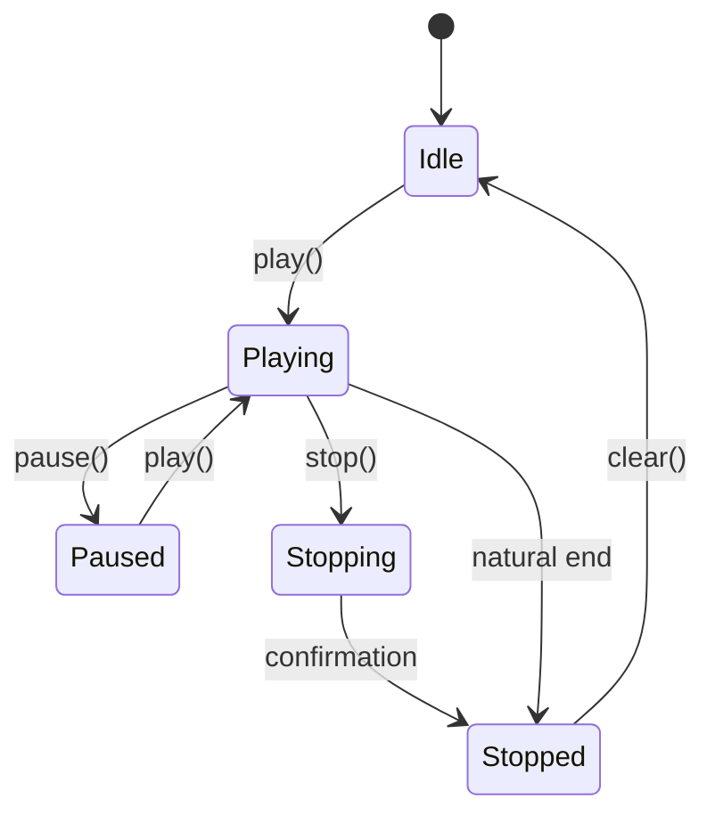
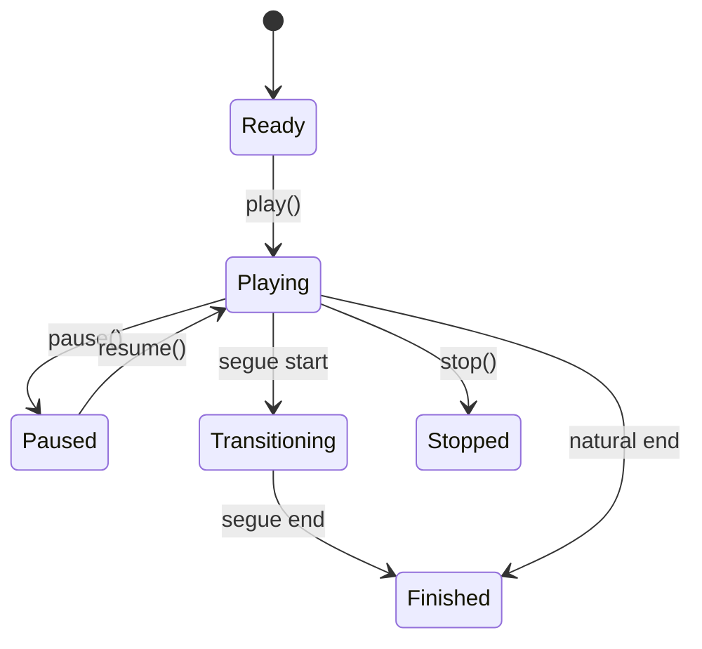
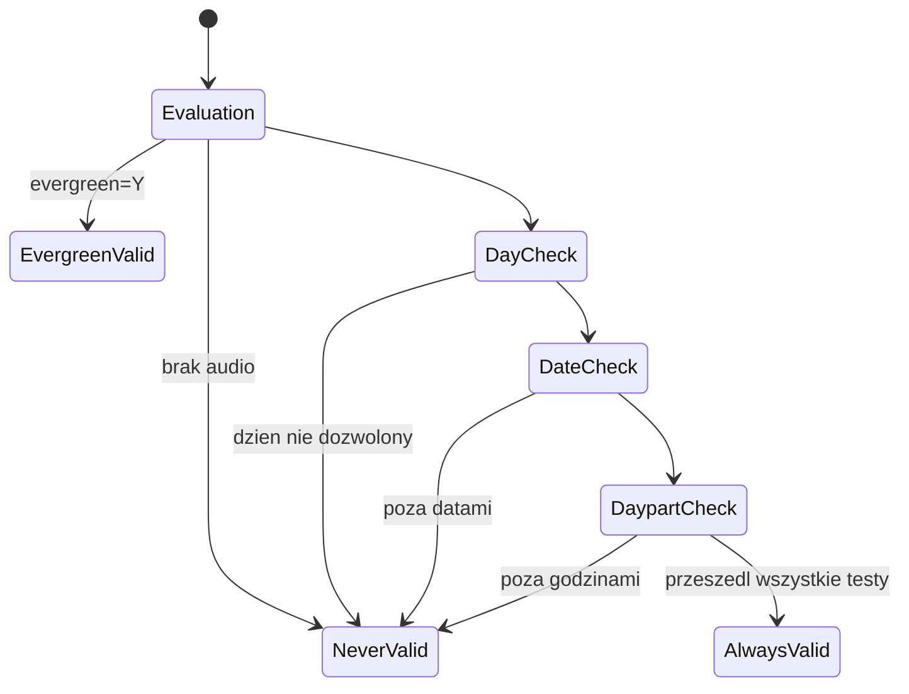
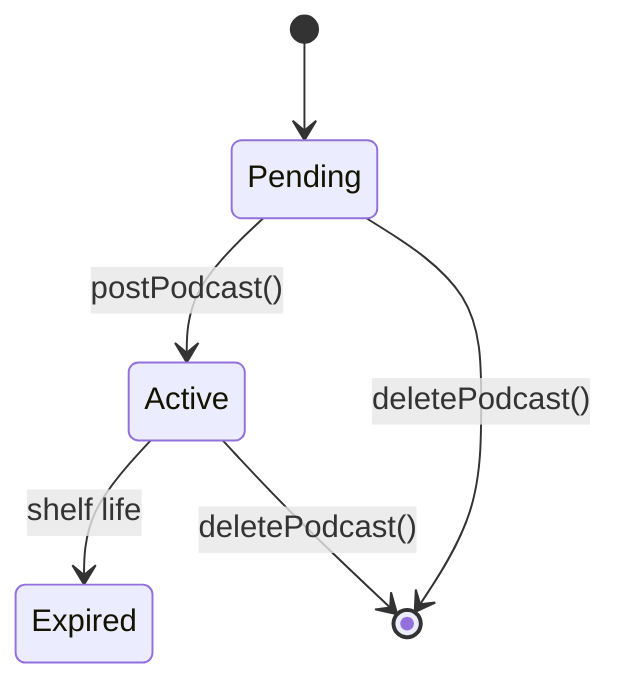

# SPEC: librd
## Behavioral Specification -- WHAT without HOW

> Dokument ten opisuje CO system robi i JAKIE MA ZACHOWANIE.
> Nie opisuje JAK to robi ani w jakiej technologii.
> Wystarczy do zbudowania klona w dowolnym jezyku na dowolnej platformie.

---

## Sekcja 1 -- Project Overview

**Czym jest librd:**
Wspoldzielona biblioteka dostarczajaca kompletny zestaw funkcjonalnosci dla systemu automatyki radiowej. Zawiera model domenowy (carty, cuty, logi, eventy, feedy), silnik odtwarzania logow, panel dzwiekowy, system powiadomien, klienty do komunikacji z demonami systemowymi, konwersje audio, zarzadzanie uzytkownikami, oraz zestaw wielokrotnie uzywanych dialogow i widgetow UI.

**Glowni aktorzy:**
| Aktor | Rola |
|-------|------|
| Operator | Osoba obslugujaca stacje radiowa — odtwarza, nagrawa, edytuje audio |
| Administrator | Konfiguruje system, zarzadza uzytkownikami, grupami, serwisami |
| System (automatyka) | Automatyczne odtwarzanie wg logow, zaplanowane nagrania, rotation |
| Zewnetrzne systemy | Serwery audio, bazy CD, serwery podcastow, urzadzenia GPIO |

**Kluczowe wartosci biznesowe:**
- Niezawodna automatyka emisji radiowej 24/7
- Zarzadzanie biblioteka audio (carty/cuty z metadanymi, rotation, dayparting)
- Generowanie programu (logi z zegarow, import music/traffic)
- Publikacja podcastow i raportowanie

---

## Sekcja 2 -- Domain Model

### Encje biznesowe

| Encja | Opis | Kluczowe pola |
|-------|------|--------------|
| Cart | Kontener audio — podstawowa jednostka biblioteki | number (1-999999), type (Audio/Macro), title, artist, album, group, schedCodes, playOrder, validity, forcedLength |
| Cut | Segment audio w carcie | cutName, length, startPoint, endPoint, segueStart/End, fadeUp/Down, hookStart/End, talkStart/End, startDatetime, endDatetime, dayparting (MON-SUN), weight, evergreen |
| Log | Playlist do emisji | name, service, type (Log/Event/Salvage), startDate, endDate, linkState |
| LogEvent | Zawartosc logu (lista linii) | logName, lines[] |
| LogLine | Pojedyncza linia logu | id, type (Cart/Marker/Macro/...), cartNumber, transType (Play/Segue/Stop), timeType (Relative/Hard), startTime, graceTime |
| Clock | Zegar programowy (1 godzina) | name, events[], color |
| Event | Zdarzenie w zegarze | name, importSource (Music/Traffic/None), firstTransType, defaultTransType, useAutofill, useTimescale |
| Grid | Siatka programowa (tydzien 7x24) | serviceName, clocks[168] |
| Service | Stacja/program radiowy | name, nameTemplate, trackGroup, importTemplate |
| Group | Grupa cartow | name, defaultLowCart, defaultHighCart, enforceCartRange, defaultCartType, color |
| User | Uzytkownik systemu | name, password, permissions (20+ flag), groups, pamService |
| Station | Stacja robocza | name, cards[], cueCard/Port, audioDriver, editorPath |
| Feed | Podcast feed (RSS) | keyName, channelTitle, baseUrl, rssSchema, uploadFormat |
| Podcast | Epizod podcastu | id, feedId, itemTitle, audioFilename, status (Pending/Active/Expired) |
| Recording | Zaplanowane zadanie (nagrywanie/odtwarzanie/download/upload) | id, type, channel, startTime, endTime, days (MON-SAT), startType (Hard/GPI), endType (Hard/GPI/Length) |
| Matrix | Matryca przelaczania audio | station, number, type (45 typow), inputs, outputs, gpis, gpos |
| DropBox | Auto-import folder | path, groupName, normalizationLevel, metadataPattern |
| Report | Raport eksportowy | name, filter, exportPath, format (14 formatow) |
| Notification | Powiadomienie miedzy-procesowe | type (Cart/Log/Feed/...), action (Add/Delete/Modify), id |
| Macro (RML) | Komenda sterujaca | command (2-literowa), args[], address, port |
| SchedCode | Kod schedulera | code (etykieta do planowania) |

### Relacje

```
Service 1-------N Log        (serwis ma wiele logow)
Log     1-------N LogLine    (log ma wiele linii)
Cart    1-------N Cut        (cart ma wiele cutow)
Group   1-------N Cart       (grupa zawiera carty)
Clock   1-------N EventLine  (zegar ma wiele zdarzen)
Grid    1------168 Clock     (siatka mapuje 168 slotow na zegary)
Service 1-------1  Grid      (serwis ma jedna siatke)
Feed    1-------N  Podcast   (feed ma wiele epizodow)
User    N-------M  Group     (uzytkownik nalezy do wielu grup)
Station 1-------N  Matrix    (stacja ma wiele matryc)
Station 1-------N  DropBox   (stacja ma wiele dropboxow)
```

### Enums (zbiory stanow)

| Enum | Wartosci | Znaczenie |
|------|----------|-----------|
| Cart.Type | Audio, Macro | Cart z nagraniem lub z makrami RML |
| Cart.PlayOrder | Sequence, Random | Kolejnosc rotation cutow |
| Cart.Validity | NeverValid, ConditionallyValid, AlwaysValid, EvergreenValid | Status waznosci |
| Cut.Validity | NeverValid, ConditionallyValid, AlwaysValid | Status waznosci cuta |
| LogLine.Type | Cart, Marker, Macro, OpenBracket, CloseBracket, Chain, Track, MusicLink, TrafficLink | Typ elementu logu |
| LogLine.TransType | Play, Segue, Stop | Typ przejscia |
| LogLine.TimeType | Relative, Hard, NoTime | Typ czasu startu |
| LogLine.Status | Finished, Playing, Paused, Ready, Transitioning, Auditioning | Status odtwarzania |
| Recording.Type | Recording, Playout, Upload, Download, MacroEvent, SwitchEvent | Typ zaplanowanego zadania |
| Notification.Type | Cart, Log, Pypad, Dropbox, CatchEvent, FeedItem, Feed | Typ powiadomienia |
| Notification.Action | Add, Delete, Modify | Rodzaj operacji |
| Podcast.Status | Pending, Active, Expired | Status epizodu |

---

## Sekcja 3 -- Functional Capabilities (Use Cases)

| ID | Aktor | Akcja | Efekt biznesowy | Priorytet |
|----|-------|-------|----------------|-----------|
| UC-001 | Operator | Odtwarza element logu | Audio gra, segue do nastepnego | MUST |
| UC-002 | Operator | Zatrzymuje/pauzuje odtwarzanie | Audio sie zatrzymuje/wstrzymuje | MUST |
| UC-003 | Operator | Klika przycisk panelu dzwiekowego | Cart jest odtwarzany natychmiast (jingle/spot) | MUST |
| UC-004 | Operator | Wybiera carta z biblioteki | Dialog zwraca numer carta z filtrami | MUST |
| UC-005 | Operator | Importuje plik audio | Plik jest konwertowany i zapisany jako cut | MUST |
| UC-006 | Operator | Eksportuje audio z cuta | Plik audio zapisany na dysku | MUST |
| UC-007 | Operator | Edytuje markery audio | 7 typow markerow ustawione/zmodyfikowane | MUST |
| UC-008 | Operator | Edytuje metadane carta | Tytul/artysta/album/itd. zaktualizowane | MUST |
| UC-009 | System | Generuje log z siatki programu | Log utworzony na podstawie zegarow i eventow | MUST |
| UC-010 | System | Importuje dane music/traffic | Dane z zewnetrznych systemow wstawione do logu | MUST |
| UC-011 | System | Wybiera cut do odtworzenia (rotation) | Nastepny cut wybrany z uwzglednieniem waznosci/dayparting | MUST |
| UC-012 | System | Publikuje epizod podcastu | Audio uploadowane, RSS XML zaktualizowany | SHOULD |
| UC-013 | System | Renderuje log do pliku audio | Log zmixowany do jednego pliku | SHOULD |
| UC-014 | Admin | Tworzy/modyfikuje carta | Cart utworzony/zaktualizowany w bazie | MUST |
| UC-015 | Admin | Zarzadza uzytkownikami | Tworzenie, uprawnienia, hasla | MUST |
| UC-016 | System | Wysyla powiadomienie broadcast | Wszystkie aplikacje synchronizuja stan | MUST |
| UC-017 | System | Wykonuje komendy RML | Zdalne sterowanie systemem | MUST |
| UC-018 | System | Monitoruje heartbeat DB | Utrzymanie polaczenia z baza danych | MUST |
| UC-019 | System | Generuje raporty eksportowe | Raporty odtwarzania w 14 formatach | SHOULD |
| UC-020 | System | Transferuje pliki (download/upload) | Pliki przesylane miedzy serwerami | SHOULD |

---

## Sekcja 4 -- Business Rules (Gherkin)

```gherkin
# --- REGULY WAZNOSCI CUTA ---

Rule: Cut jest wazny tylko w okreslonych warunkach

  Scenario: Cut evergreen
    Given cut ma flage evergreen
    When sprawdzana jest waznosc
    Then cut jest wazny zawsze

  Scenario: Cut sprawdzany po dniu tygodnia
    Given cut dozwolony w poniedzialki, srody, piatki
    When sprawdzana jest waznosc we wtorek
    Then cut jest niewazny

  Scenario: Cut sprawdzany po datach
    Given cut wazny od 2024-01-01 do 2024-12-31
    When sprawdzana jest waznosc 2025-01-15
    Then cut jest niewazny

  Scenario: Cut sprawdzany po dayparting
    Given cut wazny od 08:00 do 18:00
    When sprawdzana jest waznosc o 20:00
    Then cut jest niewazny

# --- REGULY ROTATION ---

Rule: Rotation wybiera nastepny cut z carta

  Scenario: Sekwencyjna rotation
    Given cart z 3 cutami (A, B, C) i playOrder=Sequence
    And ostatnio odtworzony byl cut B
    When wybierany jest nastepny cut
    Then wybrany jest cut C

  Scenario: Cykliczna rotation
    Given cart z 3 cutami i playOrder=Sequence
    And ostatnio odtworzony byl cut C (ostatni)
    When wybierany jest nastepny cut
    Then wybrany jest cut A (powrot na poczatek)

  Scenario: Losowa rotation z wagami
    Given cart z cutami o wagach 10, 5, 1
    When losowo wybierany jest cut
    Then prawdopodobienstwo proporcjonalne do wagi

  Scenario: Pomijanie niewaznych cutow
    Given cart z 3 cutami, cut B jest niewazny (dayparting)
    When wybierany jest nastepny cut
    Then cut B jest pomijany

# --- REGULY TIMESCALING ---

Rule: Timescaling jest ograniczone do zakresu predkosci

  Scenario: Cut w zakresie
    Given cart z enforcedLength i cut o dlugosci 60s
    And forcedLength = 65s (108.3%)
    When walidacja timescale
    Then walidacja przechodzi (83.3% < 108.3% < 125%)

  Scenario: Cut poza zakresem
    Given cart z enforcedLength i cut o dlugosci 60s
    And forcedLength = 80s (133%)
    When walidacja timescale
    Then walidacja nie przechodzi (133% > 125%)

# --- REGULY UWIERZYTELNIANIA ---

Rule: Uwierzytelnianie lokalne lub PAM

  Scenario: Lokalne haslo poprawne
    Given uzytkownik z lokalnym uwierzytelnianiem
    When podaje poprawne haslo
    Then uwierzytelnienie przechodzi

  Scenario: Web user wymaga dodatkowej flagi
    Given uzytkownik z lokalnym uwierzytelnianiem
    And flaga webEnabled=false
    When loguje sie przez web API
    Then uwierzytelnienie nie przechodzi

  Scenario: PAM uwierzytelnianie
    Given uzytkownik z PAM uwierzytelnianiem i serwisem "rivendell"
    When podaje haslo
    Then haslo weryfikowane przez zewnetrzny serwis PAM

# --- REGULY LOGU ---

Rule: Log obsluguje automatyczne przejscia

  Scenario: Segue — plynne przejscie
    Given dwa elementy logu: A (z segue point) i B (transType=Segue)
    When odtwarzanie A dojdzie do segue start point
    Then B startuje automatycznie
    And A i B graja jednoczesnie do konca A

  Scenario: Play — natychmiastowe przejscie
    Given element B z transType=Play
    When element A sie konczy
    Then B startuje natychmiast

  Scenario: Stop — zatrzymanie
    Given element B z transType=Stop
    When element A sie konczy
    Then odtwarzanie sie zatrzymuje

Rule: Hard time events

  Scenario: Element z wyznaczonym czasem startu
    Given element logu z timeType=Hard i startTime=14:00:00
    When zegar systemowy osiagnie 14:00:00
    Then element jest uruchomiony automatycznie

# --- REGULY GRUP ---

Rule: Grupa kontroluje zakres numerow cartow

  Scenario: Cart w zakresie
    Given grupa z range 100000-199999
    When tworzony jest cart 150000
    Then operacja dozwolona

  Scenario: Cart poza zakresem (enforced)
    Given grupa z range 100000-199999 i enforceCartRange=true
    When tworzony jest cart 200001
    Then operacja odrzucona

# --- REGULY PODCASTU ---

Rule: Publikacja epizodu wymaga uploadu i aktualizacji RSS

  Scenario: Publikacja cuta jako epizod
    Given feed z skonfigurowanym serwerem
    And cut z audio
    When postCut() jest wywolany
    Then audio jest konwertowane do formatu uploadu
    And plik jest uploadowany na serwer
    And RSS XML jest regenerowany i uploadowany

Rule: Superfeed agreguje subfeed'y

  Scenario: RSS superfeed
    Given feed oznaczony jako superfeed
    And 3 subfeed'y z episodami
    When generowane jest RSS XML
    Then XML zawiera epizody ze wszystkich subfeedow
```

---

## Sekcja 5 -- State Machines

### PlayDeck State Machine



| Przejscie | Trigger | Warunek | Efekt |
|-----------|---------|---------|-------|
| Idle->Playing | play() | handle zaladowany | audio startuje, emituje stateChanged |
| Playing->Paused | pause() | trwa odtwarzanie | audio wstrzymane |
| Playing->Stopping | stop() | trwa odtwarzanie | oczekiwanie na potwierdzenie |
| Playing->Stopped | natural end | koniec cuta | automatyczny koniec |
| Stopping->Stopped | confirmation | serwer potwierdza | zasoby zwalniane |

### LogLine State Machine



### Cut Validity State Machine



### Podcast Status Machine



---

## Sekcja 6 -- Reactive Architecture

### Kluczowe przeplywy zdarzen

**Przepyw: Odtwarzanie elementu logu**
```
[Operator] uruchamia element logu
    -> Silnik logplay laduje cart i wybiera cut (rotation)
    -> Deck odtwarzania laduje audio z serwera audio
    -> Audio zaczyna grac
    -> Pozycja jest aktualizowana cyklicznie
    -> Przy segue point: nastepny element startuje automatycznie
    -> Po zakonczeniu: deck jest zwalniany, nastepny element staje sie aktywny
```

**Przepyw: Klikniecie przycisku panelu**
```
[Operator] klika przycisk panelu
    -> Panel identyfikuje carta przypisanego do przycisku
    -> Deck odtwarzania jest alokowany
    -> Audio gra, przycisk miga i odlicza czas
    -> Po zakonczeniu: przycisk wraca do stanu normalnego
```

**Przepyw: Powiadomienie broadcast**
```
[Dowolna aplikacja] modyfikuje carta/log/feed
    -> Powiadomienie (typ, akcja, id) jest wyslane do serwera RPC
    -> Serwer RPC rozsyla do wszystkich polaczonych klientow
    -> Kazda aplikacja odbiera i aktualizuje swoje widoki
```

**Przepyw: Wykonanie makra RML**
```
[Zrodlo] wysyla komende RML (np. PL 1 5 Segue)
    -> Serwer RPC routuje komende do odpowiedniej aplikacji
    -> Aplikacja interpretuje komende i wykonuje akcje
    -> Np. PL = odtworz linie 5 z logu maszyny 1 z przejsciem Segue
```

**Przepyw: Generowanie logu**
```
[System] uruchamia generowanie logu na date
    -> Serwis laduje swoja siatke programowa (grid)
    -> Dla kazdej godziny: zegar (clock) generuje linie logu z eventow
    -> Eventy z importSource=Music/Traffic wstawiaja linki
    -> Log jest zapisywany do bazy danych
```

### Cross-artifact komunikacja

| Zrodlo | Zdarzenie | Cel | Efekt |
|--------|-----------|-----|-------|
| librd (klient CAE) | komendy audio (play/stop/record) | Daemon audio (caed) | Sterowanie hardware audio |
| librd (klient RIPC) | komendy GPIO/RML/notification | Daemon RPC (ripcd) | GPIO, routing, powiadomienia |
| librd (klient Catch) | komendy zaplanowanych zadan | Daemon catch (rdcatchd) | Nagrywanie, odtwarzanie |
| librd (import/export) | HTTP requests | Web service (rdxport.cgi) | Transfer audio przez API |
| librd (feed) | SFTP/FTP/HTTP upload | Zewnetrzny serwer | Publikacja podcastow |

---

## Sekcja 7 -- UI/UX Contracts

### RDCartDialog — wybor carta

| Pole | Wartosc |
|------|---------|
| Typ | Dialog (modalny) |
| Otwierane przez | Dowolna aplikacja potrzebujaca carta |
| Dane wejsciowe | filtr (string), grupa (string), scheduler code (string) |

**Widgety i interakcje:**
| Element | Akcja | Efekt |
|---------|-------|-------|
| Filtr tekstowy | wpisywanie | filtrowanie listy cartow |
| Selektor grupy | wybor | filtrowanie po grupie |
| Selektor scheduler code | wybor | filtrowanie po kodzie |
| Lista cartow (13 kolumn) | single-click | zaznaczenie, audycja |
| Lista cartow | double-click | wybor carta i zamkniecie |
| Odtwarzacz (embed) | play/stop | podsluch zaznaczonego |
| Send to Editor | klikniecie | uruchom zewnetrzny edytor |
| Load From File | klikniecie | import audio z pliku |

### RDEditAudio — edytor markerow

| Pole | Wartosc |
|------|---------|
| Typ | Dialog (modalny, pelnoekranowy) |
| Dane wejsciowe | cut, karta audio, port |

**Widgety i interakcje:**
| Element | Akcja | Efekt |
|---------|-------|-------|
| Waveform | klikniecie/drag | pozycjonowanie kursora, zaznaczanie regionu |
| 10 przyciskow markerow | klikniecie | ustawienie markera na pozycji kursora |
| Play/Pause/Stop | klikniecie | sterowanie odtwarzaniem |
| Loop | klikniecie | odtwarzanie w petli |
| Gain slider | przeciagniecie | regulacja glosnosci |
| VU meter | wizualizacja | poziom audio |
| Trim Head/Tail | klikniecie | automatyczne ustawienie start/end |
| Remove Marker | klikniecie | usuniecie zaznaczonego markera |

### RDImportAudio — import/eksport

| Pole | Wartosc |
|------|---------|
| Typ | Dialog (modalny) |
| Dane wejsciowe | nazwa cuta, domyslne ustawienia |

**Widgety i interakcje:**
| Element | Akcja | Efekt |
|---------|-------|-------|
| Przelacznik Import/Export | wybor trybu | zmiana widocznych pol |
| Select plik | klikniecie | dialog wyboru pliku |
| Normalize checkbox+spinner | wlaczenie, wartosc dBFS | normalizacja glosnosci |
| Autotrim checkbox+spinner | wlaczenie, wartosc dBFS | przycinanie ciszy |
| Channels | wybor | mono/stereo |
| Set format | klikniecie | dialog ustawien eksportu |

### Pozostale dialogi (skrot)

| Dialog | Cel | Kluczowe interakcje |
|--------|-----|---------------------|
| RDAddCart | Tworzenie carta | Wybor grupy, typu, numeru, tytulu |
| RDWaveDataDialog | Metadane audio | Edycja 12 pol metadanych |
| RDExportSettingsDialog | Ustawienia formatu | Format, kanaly, sample rate, bitrate |
| RDSchedCodesDialog | Kody schedulera | Dual-list (dostepne/przypisane) |
| RDButtonDialog | Konfiguracja przycisku panelu | Wybor carta, kolor, etykieta |
| RDListLogs | Wybor logu | Filtr po serwisie, lista |
| RDDateDialog | Wybor daty | Kalendarz |
| RDGetPasswd/RDPasswd | Haslo | Wprowadzenie/zmiana hasla |
| RDGetAth | Uwierzytelnienie | Login + haslo |
| RDSlotDialog | Opcje slotu | Tryb, cart, serwis |
| RDCutDialog | Wybor cuta | Filtr + lista cartow + lista cutow |
| RDBusyDialog | Progress | Animowany wskaznik |
| Disc Lookup | Wyszukiwanie CD | Lista wynikow |

**Panel dzwiekowy (RDSoundPanel):**
Widget z siatka przyciskow (konfigurowalna ilosc wierszy/kolumn). Kazdy przycisk odtwarza przypisanego carta. Tryby: normalny, konfiguracja, play all/hook.

---

## Sekcja 8 -- Data Flow

```
[Baza danych (relacyjna)]
    |
    v
[Model domenowy (Cart, Cut, Log, ...)]
    |-- odczyt: konstruktor z ID -> zapytanie SQL -> pola obiektu
    |-- zapis: setXXX() -> UPDATE SQL
    |
    v
[Silniki logiki biznesowej]
    |-- RDLogPlay: odtwarzanie logu
    |-- RDSoundPanel: panel dzwiekowy
    |-- RDSvc: generowanie logow
    |-- RDFeed: publikacja podcastow
    |
    v
[Klienty komunikacji (TCP)]
    |-- RDCae -> caed: sterowanie audio hardware
    |-- RDRipc -> ripcd: GPIO, RML, powiadomienia
    |-- RDCatchConnect -> rdcatchd: zaplanowane zadania
    |
    v
[UI (dialogi, widgety)]
    |-- wyswietlanie: dane z modelu -> widgety
    |-- interakcja: uzytkownik -> slot -> model -> baza
```

| Transformacja | Od | Do | Co sie zmienia |
|--------------|----|----|----------------|
| Ladowanie carta | DB (CART table) | RDCart obiekt | Wiersz SQL -> pola obiektu C++ |
| Wybor cuta (rotation) | RDCart | String cutName | Algorytm rotation + walidacja waznosci |
| Generowanie logu | Grid + Clocks + Events | Log (LOGS + LOG_LINES tables) | Siatka programu -> linie logu |
| Import music/traffic | Plik tekstowy | LogLine[] | Parsowanie pol z pliku -> linie logu |
| Konwersja audio | Plik zrodlowy | Plik docelowy | Stage1(decode) -> Stage2(resample) -> Stage3(encode) |
| Powiadomienie | RDNotification | String TCP | Obiekt -> serializacja -> broadcast |

---

## Sekcja 9 -- Error Taxonomy

| Kod/Typ | Kategoria | Co wywoluje | Zachowanie systemu | Komunikat |
|---------|-----------|-------------|-------------------|-----------|
| ErrorDbVersionSkew | system | Niezgodna wersja DB | Aplikacja nie startuje | "Database version mismatch" |
| ErrorNoHostEntry | system | Brak stacji w DB | Aplikacja nie startuje | "No host entry" |
| ErrorNoService | system | Brak wymaganego serwisu | Aplikacja nie startuje | "Service not found" |
| ExitPriorInstance | user | Juz dziala instancja | Zamkniecie | "Prior instance running" |
| ExitNoPerms | user | Brak uprawnien | Odmowa operacji | "Insufficient permissions" |
| ExitBadTicket | user | Niewazny ticket | Odmowa dostepu web API | "Bad authentication ticket" |
| AudioConvert errors | system | Blad konwersji audio | Operacja przerwana | Szczegolowy tekst bledu |
| Download/Upload errors | external | Blad transferu | Operacja przerwana | "Download/Upload failed" |
| HeartbeatFailed | system | Utrata polaczenia z daemonem | Ostrzezenie | "Heartbeat failed" |

---

## Sekcja 10 -- Integration Contracts

### Shared Libraries

librd jest root dependency — nie zalezy od zadnej innej biblioteki Rivendell.

### Cross-artifact

| Artifact | Mechanizm | Kierunek | Kontrakt |
|----------|-----------|---------|---------|
| CAE (caed) | TCP socket | librd -> caed | Komendy tekstowe (PL,SP,LR,SR,etc.) z odpowiedziami |
| RPC (ripcd) | TCP socket | librd -> ripcd | Komendy tekstowe (RU,ON,GI,GO,etc.) z odpowiedziami |
| Catch (rdcatchd) | TCP socket | librd -> rdcatchd | Komendy tekstowe z odpowiedziami |
| Web (rdxport.cgi) | HTTP | librd -> rdxport | REST-like API z multipart upload |

### Zewnetrzne systemy

| System | Rola | Protokol/Format | Dane |
|--------|------|----------------|------|
| Baza danych | Persystencja wszystkich danych | SQL | Carty, cuty, logi, konfiguracja |
| Serwer audio | Przechowywanie plikow audio | Filesystem | Pliki WAV w /var/snd |
| Serwer podcastow | Hosting RSS/audio | SFTP/FTP/HTTP | Pliki audio i XML RSS |
| Urzadzenia LiveWire | Routing audio | TCP (LWRP) | Sources, destinations, GPIO |
| CDDB/MusicBrainz | Metadane plyt CD | HTTP | Informacje o albumach |

---

## Sekcja 11 -- Platform Independence Map

| Funkcja | Rivendell (Linux) | Klon (docelowy) | Priorytet |
|---------|------------------|----------------|-----------|
| Audio playback/record | JACK + ALSA + HPI | [decyzja implementatora] | CRITICAL |
| Baza danych | MySQL/MariaDB | [decyzja implementatora] | CRITICAL |
| Audio codec decode | libmad, libsndfile, libFLAC, libvorbis | [decyzja implementatora] | HIGH |
| Audio codec encode | LAME, TwoLAME, libFLAC, libvorbis | [decyzja implementatora] | HIGH |
| Audio resampling | libsamplerate | [decyzja implementatora] | HIGH |
| Audio timescaling | SoundTouch | [decyzja implementatora] | HIGH |
| CD ripping | cdparanoia | [decyzja implementatora] | HIGH |
| CD playback | /dev/cdrom ioctl | [decyzja implementatora] | HIGH |
| File transfer | libcurl (HTTP/FTP/SFTP) | [decyzja implementatora] | MEDIUM |
| CD metadata | libmusicbrainz | [decyzja implementatora] | MEDIUM |
| Authentication | PAM | [decyzja implementatora] | MEDIUM |
| Hashing | OpenSSL SHA1 | [decyzja implementatora] | LOW |
| Logging | syslog | [decyzja implementatora] | LOW |
| GPIO | /sys/class/gpio (kernel) | [decyzja implementatora] | HIGH |
| Konfiguracja | /etc/rd.conf (INI) | [decyzja implementatora] | MEDIUM |
| Audio storage | /var/snd (filesystem) | [decyzja implementatora] | MEDIUM |

**Wymagania funkcjonalne dla zamiennikow:**
| Funkcja | Wymagania WHAT (nie HOW) |
|---------|--------------------------|
| Audio playback | Odtwarza WAV/FLAC/MP3/OGG/M4A. Kontrola glosnosci, fade, seeking. Wiele jednoczesnych strumieni. |
| Audio record | Nagrywanie audio z wejscia. PCM/MPEG kodowanie. |
| Baza danych | Relacyjna baza z SQL. Transakcje. ~50 tabel. |
| Audio codec | Dekodowanie i enkodowanie: PCM16/24, MPEG L2/L3, OGG, FLAC, M4A |
| File transfer | Download/upload: HTTP, HTTPS, FTP, SFTP. Progress callback. |
| CD ripping | Ekstrakcja audio ze sciezek CD do PCM. |

---

## Sekcja 12 -- Non-Functional Requirements

```gherkin
Scenario: Meter update rate
  Given system odtwarza audio
  When metery sa aktywne
  Then poziomy sa aktualizowane co 20ms

Scenario: Curl timeout
  Given transfer pliku w toku
  When serwer nie odpowiada
  Then transfer jest przerwany po 1200 sekundach (20 minut)

Scenario: Log lock timeout
  Given uzytkownik edytuje log
  When inny uzytkownik prubuje edytowac ten sam log
  Then lock wygasa po 30 sekundach

Scenario: Maint interval
  Given system dziala
  When sprawdzane sa zadania konserwacyjne
  Then sprawdzanie odbywa sie co 15-60 minut

Scenario: Timescaling range
  Given element z enforced length
  When timescaling jest potrzebny
  Then predkosc musi byc w zakresie 83.3%-125%
```

---

## Sekcja 13 -- Configuration

Plik konfiguracyjny: `/etc/rd.conf` (format INI)

| Sekcja/Klucz | Typ | Domyslna | Opis |
|------|-----|---------|------|
| [mySQL] Hostname | string | localhost | Host bazy danych |
| [mySQL] Loginname | string | rduser | Uzytkownik DB |
| [mySQL] Database | string | Rivendell | Nazwa bazy |
| [mySQL] Password | string | letmein | Haslo DB |
| [Identity] AudioOwner | string | rivendell | Wlasciciel plikow audio |
| [Identity] AudioGroup | string | rivendell | Grupa plikow audio |
| [Identity] Password | string | (puste) | Haslo stacji |
| [Cae] AudioRoot | string | /var/snd | Katalog plikow audio |
| [Cae] AudioExtension | string | wav | Rozszerzenie plikow |
| [Fonts] Family | string | (system) | Rodzina fontow UI |
| [Fonts] ButtonSize | int | (system) | Rozmiar fontu przyciskow |
| [Tuning] MeterBasePort | int | 30000 | Bazowy port UDP metrow |
| [Tuning] MeterPortRange | int | 100 | Zakres portow metrow |
| [Tuning] ServiceTimeout | int | 30 | Timeout serwisow (s) |
| [Tuning] TranscodingDelay | int | 0 | Opoznienie transkodowania |

---

## Sekcja 14 -- E2E Acceptance Scenarios

```gherkin
Feature: Odtwarzanie logu z automatycznym segue

  Background:
    Given system jest uruchomiony i polaczony z serwerem audio
    And zaladowany jest log z 3 elementami: Song A (segue), Song B (segue), Song C (stop)

  Scenario: Happy path - automatyczne segue
    When operator uruchamia odtwarzanie od Song A
    Then Song A gra
    And gdy Song A dojdzie do segue point
    Then Song B startuje automatycznie
    And Song A i Song B graja jednoczesnie
    And gdy Song A sie konczy
    Then Song B kontynuuje solo
    And gdy Song B dojdzie do segue point
    Then Song C startuje
    And gdy Song B sie konczy i Song C dojdzie do konca
    Then odtwarzanie sie zatrzymuje (transType=Stop)

  Scenario: Operator zatrzymuje w trakcie segue
    Given Song A i Song B graja jednoczesnie (segue)
    When operator naciska Stop
    Then oba elementy sie zatrzymuja
    And stan logu wraca do Ready

  Scenario: Hard time override
    Given Song A gra
    And Song B ma timeType=Hard i startTime=14:00:00
    When zegar osiaga 14:00:00
    Then Song A jest segue'd do Song B niezaleznie od pozycji

Feature: Import audio z pliku do cuta

  Background:
    Given operator ma uprawnienia edit_audio
    And istnieje cart 100001 w grupie "Music"

  Scenario: Import pliku MP3
    Given plik "song.mp3" na dysku
    When operator otwiera dialog importu
    And wybiera plik "song.mp3"
    And wlacza normalizacje na -14 dBFS
    And wlacza autotrim na -40 dBFS
    And klika Import
    Then plik jest konwertowany do formatu wewnetrznego
    And poczatek i koniec sa automatycznie przyciete
    And glosnosc jest znormalizowana
    And nowy cut jest utworzony w carcie 100001
    And metadane z pliku (ID3) sa importowane

  Scenario: Import z bledem formatu
    Given plik "corrupted.wav" (uszkodzony)
    When operator importuje plik
    Then wyswietlany jest komunikat bledu
    And zadne dane nie sa modyfikowane

Feature: Publikacja epizodu podcastu

  Background:
    Given istnieje feed "Daily News" z skonfigurowanym serwerem SFTP
    And operator ma uprawnienia addPodcast

  Scenario: Publikacja cuta jako epizod
    Given cut 100001_001 z nagraniem wiadomosci
    When operator publikuje cut jako epizod
    And podaje tytul "Wiadomosci 2024-01-15"
    Then audio jest konwertowane do formatu uploadu feeda
    And plik jest uploadowany na serwer SFTP
    And RSS XML jest regenerowany z nowym epizodem
    And RSS XML jest uploadowany na serwer
    And epizod ma status Active

  Scenario: Publikacja logu jako epizod
    Given log "Morning_Show" z 3 godzinami programu
    When operator publikuje log jako epizod
    And wybiera zakres 08:00-11:00
    Then log jest renderowany do pojedynczego pliku audio
    And plik jest uploadowany
    And RSS XML jest zaktualizowany
```

---

## Assumptions & Open Questions

| # | Zalozenie | Alternatywa | Wplyw |
|---|-----------|-------------|-------|
| 1 | Hasla sa przechowywane w plaintext w DB | Moga byc hashowane | Wymaga analizy kolumny PASSWORD |
| 2 | Notification multicast dziala w LAN | Moze wymagac konfiguracji routingu | Wplyw na deployment w chmurze |
| 3 | Timescaling SoundTouch jest jedynym backendem | Moze byc inna biblioteka | Abstrakcja interfejsu |
| 4 | /var/snd jest shared filesystem (NFS/CIFS) | Moze byc lokalne | Wplyw na architekture storage |

---

*SPEC wygenerowany przez Qt Reverse Engineering Multi-Agent System v1.1.0*
*Zrodla: inventory.md + ui-contracts.md + call-graph.md + facts.md*
