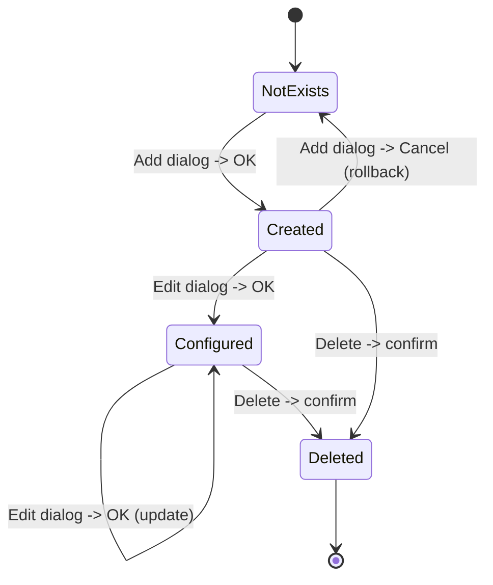
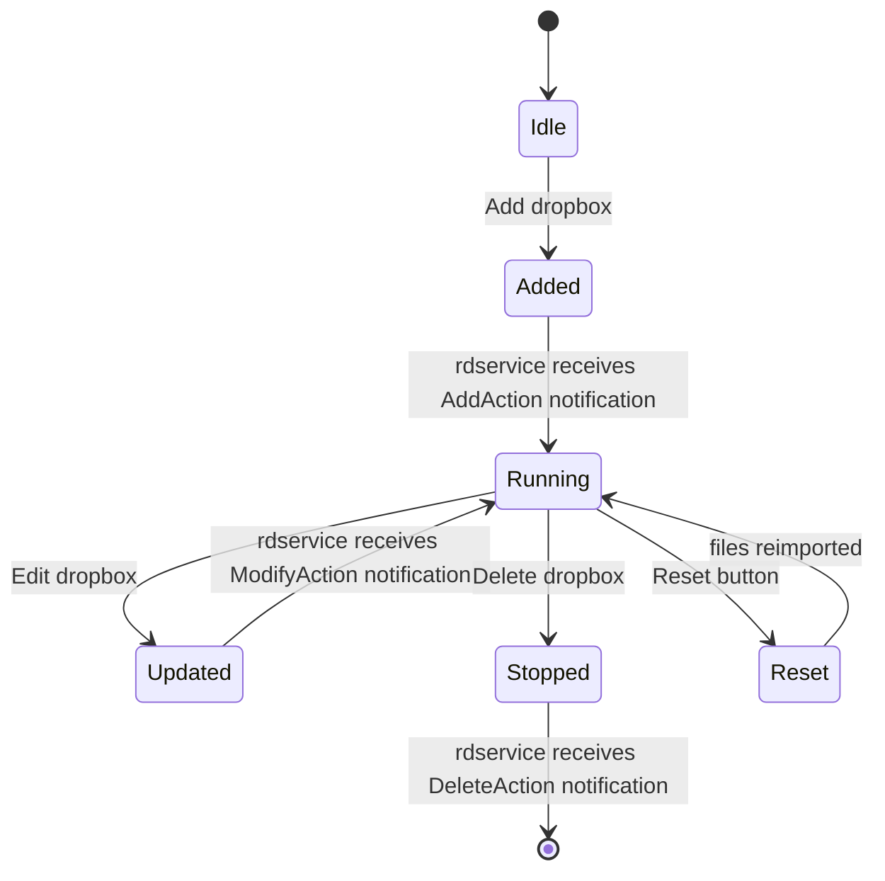

# SPEC: rdadmin
## Behavioral Specification — WHAT without HOW

> Dokument ten opisuje CO system robi i JAKIE MA ZACHOWANIE.
> Jest **nawigacyjnym PRD** — podsumowuje i linkuje do szczegoloww w fazach 2-5.
> Agenci kodujacy czytaja FEAT pliki (Phase 7) ktore zawieraja kompletne dane.

### Zrodla szczegolw

| Dokument | Zawiera | Czytaj gdy |
|----------|---------|-----------|
| `inventory.md` | 81 klas (79 RDDialog, 2 RDWidget), sloty, zaleznosci | Potrzebujesz sygnatury metody |
| `data-model.md` | 37 tabel DB, ERD Mermaid, mapowanie tabela-klasa | Potrzebujesz schematu DB |
| `ui-contracts.md` | 80 kontraktow UI, widgety, stany, walidacje | Potrzebujesz detali UI |
| `mockups/*.html` | Wizualne odwzorowania okien (Tailwind) | Chcesz zobaczyc jak wyglada |
| `call-graph.md` | 448 connect(), 5 cross-artifact, 8 wzorcow polaczen | Potrzebujesz grafu zdarzen |
| `facts.md` | 89 faktow, 28 use cases, 20+ regul Gherkin | Potrzebujesz regul z dowodami |

---

## Sekcja 1 — Project Overview

**Czym jest rdadmin:**
rdadmin to centralny panel administracyjny systemu automatyki radiowej Rivendell. Umozliwia konfigurowanie wszystkich zasobow systemowych: uzytkownikow, grup, serwisow (programow radiowych), stacji roboczych, matryc audio, podcastow/feedow RSS, raportow i ustawien globalnych. Nie jest narzedziem operacyjnym — sluzy wylacznie do zarzadzania konfiguracja i uprawnieniami.

**Glowni aktorzy:**

| Aktor | Rola |
|-------|------|
| Admin (System) | Pelny dostep do konfiguracji stacji, matryc, systemu |
| Admin (RSS) | Zarzadzanie feedami/podcastami |
| Admin (ograniczony) | Zarzadzanie uzytkownikami, grupami, serwisami — bez dostpu do stacji/systemu |

**Kluczowe wartosci biznesowe:**
- Centralny punkt konfiguracji calego systemu radio-automatyki (single pane of glass)
- Granularne uprawnienia uzytkownikow (20+ flag) — kontrola dostepu do kazdego modulu
- Natychmiastowa propagacja zmian konfiguracji do demonow (rdservice, ripcd) bez restartu
- CRUD z kaskadowym usuwaniem — integralnosc referencyjna utrzymana na poziomie aplikacji

---

## Sekcja 2 — Domain Model

### Encje biznesowe

| Encja | Opis | Kluczowe pola | Pelne API |
|-------|------|--------------|-----------|
| User | Konto uzytkownika z granularnymi uprawnieniami | LOGIN_NAME, PASSWORD, 20+ PRIV flags | `inventory.md#ListUsers` |
| Group | Grupa kartow audio z zakresami numerow | NAME, LOW_CART, HIGH_CART, COLOR | `inventory.md#ListGroups` |
| Service | Serwis radiowy (program) z importem traffic/music | NAME, NAME_TEMPLATE, TFC_PATH, MUS_PATH | `inventory.md#ListSvcs` |
| Station | Stacja robocza (host) z konfiguracja modulow | NAME, IPV4_ADDRESS, CAE_STATION | `inventory.md#ListStations` |
| Matrix | Matryca przelaczania audio (switcher/GPIO) | STATION_NAME, TYPE, INPUTS, OUTPUTS, GPIS, GPOS | `inventory.md#EditMatrix` |
| Feed | Kanal RSS/podcast | KEY_NAME, CHANNEL_TITLE, BASE_URL, IS_SUPERFEED | `inventory.md#EditFeed` |
| Dropbox | Folder auto-importu audio | STATION_NAME, PATH, GROUP_NAME | `inventory.md#EditDropbox` |
| Report | Definicja raportu (traffic/music/generic) | NAME, EXPORT_FILTER, EXPORT_PATH | `inventory.md#EditReport` |
| Replicator | Synchronizacja mediow miedzy stacjami | NAME, TYPE_ID, URL, FORMAT | `inventory.md#EditReplicator` |
| SchedulerCode | Kod planisty do tagowania kartow | CODE, DESCRIPTION | `inventory.md#ListSchedCodes` |
| System | Konfiguracja globalna (single-row) | SAMPLE_RATE, DUP_CART_TITLES, NOTIFICATION_ADDRESS | `inventory.md#EditSystem` |

### Relacje

```
User 1──────────N UserPerm          (user has many group permissions)
User 1──────────N UserServicePerm   (user has many service permissions)
User 1──────────N FeedPerm          (user has many feed permissions)
Group 1─────────N UserPerm          (group assigned to many users)
Group 1─────────N AudioPerm         (group allowed in many services)
Service 1───────N AudioPerm         (service allows many groups)
Service 1───────N ServicePerm       (service runs on many stations)
Station 1───────N Matrix            (station has many matrices)
Station 1───────N Dropbox           (station has many dropboxes)
Station 1───────N PyPAD Instance    (station runs many PAD scripts)
Matrix 1────────N Input             (matrix has many inputs)
Matrix 1────────N Output            (matrix has many outputs)
Matrix 1────────N GPI               (matrix has many GPI triggers)
Matrix 1────────N GPO               (matrix has many GPO triggers)
Feed 1──────────N Podcast           (feed has many episodes)
Feed 1──────────N FeedImage         (feed has many images)
Feed 1──────────N SuperfeedMap      (feed maps to subfeed members)
Report 1────────N ReportService     (report filters by services)
Report 1────────N ReportStation     (report filters by stations)
Replicator 1────N ReplicatorMap     (replicator maps groups)
```

### Enums

| Enum | Wartosci | Znaczenie |
|------|----------|-----------|
| Cart Type | Audio (1), Macro (2) | Typ domyslnego karta w grupie |
| Matrix Type | Local GPIO, LiveWire, SAS, Quartz, BT SS124, etc. | Typ protokolu switcher |
| Audio Format | PCM16, MPEG L2, MPEG L3, Ogg Vorbis, FLAC | Format nagrywania/eksportu |
| RSS Schema | Custom, iTunes, Atom | Schemat XML feeda |
| Replicator Type | Citidel X-Digital Portal (jedyny) | Typ replikacji |

---

## Sekcja 3 — Data Model (schemat DB)

> 37 tabel bazy danych bezposrednio zarzadzanych przez rdadmin.
> Pelny ERD Mermaid i detale kolumn: `data-model.md`

### Tabele glowne (encje)

| Tabela | PK | Opis | Klasy CRUD |
|--------|-----|------|-----------|
| USERS | LOGIN_NAME | Konta uzytkownikow z 20+ flagami PRIV | AddUser, EditUser, ListUsers |
| STATIONS | NAME | Stacje robocze (hosty) | AddStation, EditStation, ListStations |
| GROUPS | NAME | Grupy kartow z zakresami numerow | AddGroup, EditGroup, ListGroups, RenameGroup |
| SERVICES | NAME | Serwisy radiowe z importem traffic/music | AddSvc, EditSvc, ListSvcs |
| FEEDS | ID (KEY_NAME UK) | Kanaly RSS/podcast | AddFeed, EditFeed, ListFeeds |
| MATRICES | ID | Matryce przelaczania audio | AddMatrix, EditMatrix, ListMatrices |
| DROPBOXES | ID | Foldery auto-importu | EditDropbox, ListDropboxes |
| REPORTS | ID (NAME UK) | Raporty traffic/music/generic | AddReport, EditReport, ListReports |
| REPLICATORS | NAME | Replikatory mediow | AddReplicator, EditReplicator, ListReplicators |
| SCHED_CODES | CODE | Kody planisty | AddSchedCode, EditSchedCode, ListSchedCodes |
| SYSTEM | ID (=1) | Globalne ustawienia (single-row) | EditSystem |

### Tabele permisji (N:M)

| Tabela | FK lewy | FK prawy |
|--------|---------|----------|
| USER_PERMS | USERS.LOGIN_NAME | GROUPS.NAME |
| USER_SERVICE_PERMS | USERS.LOGIN_NAME | SERVICES.NAME |
| AUDIO_PERMS | GROUPS.NAME | SERVICES.NAME |
| SERVICE_PERMS | SERVICES.NAME | STATIONS.NAME |
| FEED_PERMS | USERS.LOGIN_NAME | FEEDS.KEY_NAME |

### Tabele per-station

| Tabela | FK | Opis |
|--------|----|------|
| RDHOTKEYS | STATIONS.NAME | Skroty klawiszowe per-modul |
| JACK_CLIENTS | STATIONS.NAME | Klienci JACK audio |
| HOSTVARS | STATIONS.NAME | Zmienne hosta (%TAG%) |
| CARTSLOTS | STATIONS.NAME | Sloty kartow |
| PYPAD_INSTANCES | STATIONS.NAME | Instancje skryptow PyPAD |
| LIVEWIRE_GPIO_SLOTS | STATIONS.NAME | GPIO LiveWire |

### Tabele matryc (sub-encje MATRICES)

| Tabela | FK | Opis |
|--------|----|------|
| INPUTS | STATION+MATRIX | Wejscia matrycy |
| OUTPUTS | STATION+MATRIX | Wyjscia matrycy |
| GPIS | STATION+MATRIX | GPI triggers |
| GPOS | STATION+MATRIX | GPO triggers |
| SWITCHER_NODES | STATION+MATRIX | Wezly LiveWire |
| VGUEST_RESOURCES | STATION+MATRIX | Zasoby vGuest/SAS |

### Relacje FK

```
USERS.LOGIN_NAME -> USER_PERMS, USER_SERVICE_PERMS, FEED_PERMS
GROUPS.NAME -> USER_PERMS, AUDIO_PERMS, REPLICATOR_MAP, AUTOFILLS
SERVICES.NAME -> AUDIO_PERMS, SERVICE_PERMS, USER_SERVICE_PERMS, REPORT_SERVICES
STATIONS.NAME -> SERVICE_PERMS, MATRICES, DROPBOXES, PYPAD_INSTANCES, JACK_CLIENTS, HOSTVARS, RDHOTKEYS, CARTSLOTS
MATRICES.(STATION+MATRIX) -> INPUTS, OUTPUTS, GPIS, GPOS, SWITCHER_NODES, VGUEST_RESOURCES
FEEDS.KEY_NAME -> FEED_PERMS, SUPERFEED_MAPS, PODCASTS, FEED_IMAGES
REPORTS.NAME -> REPORT_SERVICES, REPORT_STATIONS, REPORT_GROUPS
REPLICATORS.NAME -> REPLICATOR_MAP, REPL_CART_STATE, REPL_CUT_STATE
DROPBOXES.ID -> DROPBOX_PATHS, DROPBOX_SCHED_CODES
```

-> Pelny ERD i detale kolumn: `data-model.md`

---

## Sekcja 4 — Functional Capabilities (Use Cases)

| ID | Aktor | Akcja | Efekt biznesowy | Priorytet |
|----|-------|-------|----------------|-----------|
| UC-001 | Admin | Login z username/password | Authenticated, menu glowne | MUST |
| UC-002 | Admin | Tworzenie uzytkownika | User + auto-perms do wszystkich grup | MUST |
| UC-003 | Admin | Usuwanie uzytkownika | Kaskada: FEED_PERMS, USER_PERMS, USERS, WEB_CONNECTIONS | MUST |
| UC-004 | Admin | Tworzenie grupy | Grupa + auto-perms dla userow/serwisow | MUST |
| UC-005 | Admin | Usuwanie grupy | Kaskada: karty, AUDIO_PERMS, USER_PERMS, REPLICATOR_MAP | MUST |
| UC-006 | Admin | Rename/merge grupy | Kaskadowy update 6-7 tabel lub merge | MUST |
| UC-007 | Admin | Tworzenie serwisu | Serwis radiowy z szablonami importu | MUST |
| UC-008 | Admin | Usuwanie serwisu | Ostrzezenie o logach, delegacja do RDSvc::remove() | MUST |
| UC-009 | Admin | Tworzenie stacji | Nowa stacja, opcjonalnie klonowana | MUST |
| UC-010 | Admin | Usuwanie stacji | Delegacja do RDStation::remove() | MUST |
| UC-011 | Admin | Konfiguracja modulow stacji | Sub-dialogi: RDAirPlay, RDLibrary, RDLogedit, etc. | MUST |
| UC-012 | Admin | Zarzadzanie dropboxami | CRUD + duplikacja; RIPC notification | MUST |
| UC-013 | Admin | Reset dropbox | Czysci DROPBOX_PATHS -> re-import plikow | SHOULD |
| UC-014 | Admin | Zarzadzanie feedami/podcastami | CRUD + repost/unpost; remote cleanup | MUST |
| UC-015 | Admin | Konfiguracja switcher/GPIO | Matrix z primary/backup; inputs/outputs/GPI/GPO | MUST |
| UC-016 | Admin | Edycja ustawien systemowych | Sample rate, duplikaty, multicast, temp group | MUST |
| UC-017 | Admin | Zarzadzanie kodami planisty | CRUD; kaskada do DROPBOX_SCHED_CODES | SHOULD |
| UC-018 | Admin | Zarzadzanie instancjami PyPAD | CRUD; RIPC notification | SHOULD |
| UC-019 | Admin | Konfiguracja JACK audio | Auto-start serwera, klienci JACK | SHOULD |
| UC-020 | Admin | Test importu traffic/music | Parsowanie probki z szablonu, wynik | SHOULD |
| UC-021 | Admin | Konfiguracja hotkeys | Set/clear per funkcja, klonowanie z hosta | SHOULD |
| UC-022 | Admin | Zarzadzanie raportami | CRUD; kaskada do REPORT_SERVICES/STATIONS/GROUPS | SHOULD |
| UC-023 | Admin | Zarzadzanie replikatorami | CRUD; jedyny typ: Citidel X-Digital Portal | COULD |
| UC-024 | Admin | Zarzadzanie profilami enkodera | CRUD na ENCODER_PRESETS | COULD |
| UC-025 | Admin | Zarzadzanie zmiennymi hosta | CRUD na %TAG% per-host | COULD |
| UC-026 | Admin | Konfiguracja portow audio | Karta, input/output, typ, tryb, poziom | MUST |
| UC-027 | Admin | Konfiguracja portow szeregowych | Enable/disable TTY, przypisanie do matryc | SHOULD |
| UC-028 | Admin | Podglad zasobow audio | Read-only wyswietlenie kart audio | COULD |

-> Pelne reguly: `facts.md`

---

## Sekcja 5 — Business Rules (Gherkin)

> Kluczowe reguly definiujace zachowanie systemu.
> Kompletna lista z source references: `facts.md`

```gherkin
Rule: User self-deletion protection
  Scenario: Admin tries to delete themselves
    Given admin user "admin" is logged in
    When  admin selects "admin" and clicks Delete
    Then  system shows warning "You cannot delete yourself!"
    And   no deletion occurs

Rule: User deletion blocked if default on station
  Scenario: Delete user who is default on stations
    Given user "john" is DEFAULT_NAME on stations "Station1, Station2"
    When  admin tries to delete user "john"
    Then  system shows list of stations using this user
    And   no deletion occurs

Rule: New user auto-permissions
  Scenario: Create a new user
    Given groups "Music", "Spots", "Jingles" exist
    When  admin creates user "newuser"
    Then  permission records created for all existing groups
    And   EditUser dialog opens for further configuration

  Scenario: Cancel new user creation
    Given user "newuser" was just created
    When  admin cancels EditUser dialog
    Then  user and all permissions rolled back (deleted)

Rule: Group deletion cascades all members
  Scenario: Delete group with carts
    Given group "Spots" has 50 carts
    When  admin confirms deletion
    Then  warning shows cart count
    And   all member carts removed
    And   permission entries deleted
    And   group record deleted

Rule: Group rename can merge
  Scenario: Rename group to existing name
    Given groups "OldSpots" and "Spots" both exist
    When  admin renames "OldSpots" to "Spots"
    Then  system asks "Do you want to combine the two?"
    And   if confirmed: references updated, old group deleted

Rule: Service deletion warns about owned logs
  Scenario: Delete service with existing logs
    Given service "Morning" owns 12 logs
    When  admin tries to delete "Morning"
    Then  warning shows log count
    And   requires second confirmation

Rule: Dropbox CRUD sends notifications
  Scenario: Add new dropbox
    Given admin creates a dropbox on station "Studio1"
    When  dialog is accepted
    Then  notification sent to rdservice via RIPC
    And   rdservice restarts dropbox monitoring

Rule: Feed deletion is multi-step cascade
  Scenario: Delete feed with podcasts
    Given feed "MyPodcast" has 5 episodes with remote audio
    When  admin confirms deletion
    Then  remote audio deleted per podcast (progress shown)
    And   remote RSS XML deleted
    And   all images removed (remote + DB)
    And   permission and superfeed maps deleted
    And   feed record deleted

Rule: Matrix connection validation
  Scenario: Invalid primary IP address
    Given matrix connection type is TCP
    When  IP address is invalid
    Then  error "The primary IP address is invalid!"

  Scenario: Primary and backup identical
    Given same IP and port for both
    When  admin saves
    Then  error "Primary and backup connections must be different!"

Rule: Duplicate cart titles deprecated
  Scenario: Admin unchecks Allow Duplicate Cart Titles
    Given checkbox is currently checked
    When  admin unchecks it
    Then  deprecation warning shown
    And   if confirmed: full library scan for duplicates
    And   if duplicates found: list shown, checkbox reverted
```

-> Kompletne reguly z source references: `facts.md`

---

## Sekcja 6 — State Machines

rdadmin jest czysta aplikacja administracyjna CRUD. Nie zarzadza stanami uruchomieniowymi encji — konfiguruje jedynie rekordy bazy danych, ktore inne moduly (rdairplay, rdservice, caed, ripcd) wykorzystuja w runtime.

### Entity CRUD Lifecycle



Encje ze specjalnym zachowaniem przy tworzeniu:
- **User** — auto-permissions do wszystkich grup przy tworzeniu; rollback na Cancel
- **Group** — auto-permissions do wszystkich userow/serwisow; rollback na Cancel
- **Station** — opcjonalne klonowanie ustawien z istniejacei stacji

### Dropbox Notification Lifecycle



---

## Sekcja 7 — Reactive Architecture

### Kluczowe przeplywy zdarzen

**Przepyw: Logowanie i autoryzacja**
```
[Administrator] uruchamia rdadmin
    -> Polaczenie z baza danych i ripcd
    -> Dialog logowania
    -> Weryfikacja hasla
    -> Menu glowne z przyciskami do zarzadzania domenami
```

**Przepyw: CRUD List -> Edit -> Save (wzorzec stosowany w 79 dialogach)**
```
[Administrator] doubleClick na elemencie listy
    -> Dialog edycji zaladowany z DB
    -> Modyfikacja pol
    -> OK -> Zapis do DB
    -> Lista odswiezona
```

**Przepyw: Notyfikacja RIPC po zmianie konfiguracji**
```
[Administrator] dodanie/edycja/usuniecie dropbox/pypad
    -> Zapis do DB
    -> Wyslanie notyfikacji przez RIPC (TCP)
    -> ripcd przekazuje do rdservice
    -> rdservice restartuje monitoring (bez restartu procesu)
```

**Przepyw: Komenda RML (rekonfiguracja hardware)**
```
[Administrator] zmiana konfiguracji TTY/Matrix/GPI
    -> Zapis do DB
    -> Wyslanie komendy RML (RD_RECONFIG) przez RIPC
    -> ripcd wykonuje rekonfiguracje urzadzen (switcher, GPIO)
```

**Przepyw: Inspekcja LiveWire node**
```
[Administrator] EditMatrix -> LiveWire Nodes -> View
    -> Polaczenie TCP do wezla LiveWire
    -> Odczyt zrodel audio, celow, GPIO, wersji firmware
    -> Wyswietlenie w czasie rzeczywistym
```

### Cross-artifact komunikacja

| Zrodlo | Zdarzenie | Cel | Efekt |
|--------|-----------|-----|-------|
| rdadmin | RIPC connectHost() | ripcd (TCP) | Polaczenie RIPC przy starcie |
| rdadmin | sendNotification(Dropbox) | ripcd -> rdservice | Restart monitoringu dropboxow |
| rdadmin | sendNotification(PyPAD) | ripcd -> rdservice | Restart instancji PyPAD |
| rdadmin | sendRml(GI/GO) | ripcd | Ustawienie stanow GPI/GPO |
| rdadmin | sendRml(RD_RECONFIG) | ripcd | Rekonfiguracja matryc/TTY |
| rdadmin | RDLiveWire TCP | LiveWire Node (hardware) | Odczyt stanu wezla w real-time |
| rdadmin | RDSqlQuery | MySQL | CRUD na 37 tabelach DB |

-> Pelny graf: `call-graph.md`

---

## Sekcja 8 — UI/UX Contracts

> Referencje do pelnych kontraktow. NIE kopiuj tabel widgetow.

### Design System
- **Design Tokens:** `../design-tokens.json`
- **Galeria mockupow:** `mockups/_index.html`

> Agenty kodujace MUSZA zaladowac design-tokens.json aby zachowac
> spojnosc kolorow, fontow i spacingu cross-artifact.

### MainWidget — glowne okno administracyjne
Panel z 11 przyciskami nawigacyjnymi do zarzadzania domenami: Users, Groups, Services, Stations, Reports, Feeds, System Settings, Scheduler Codes, Replicators, System Info, Quit. Wyswietla zalogowanego uzytkownika.
- **Kontrakt:** `ui-contracts.md#MainWidget`
- **Mockup:** `mockups/MainWidget.html`

### Login — dialog logowania
Prosty formularz username/password z przyciskami OK/Cancel.
- **Kontrakt:** `ui-contracts.md#Login`
- **Mockup:** `mockups/Login.html`

### ListUsers — lista uzytkownikow
Lista z ikonami (admin/local/RSS/standard), operacje Add/Edit/Delete.
- **Kontrakt:** `ui-contracts.md#ListUsers`
- **Mockup:** `mockups/ListUsers.html`

### EditUser — edycja uzytkownika
Formularz z danymi osobowymi, haslem, 20+ checkboxami uprawnien, PAM auth, Web API.
- **Kontrakt:** `ui-contracts.md#EditUser`
- **Mockup:** `mockups/EditUser.html`

### ListGroups — lista grup
Lista grup kartow z operacjami Add/Edit/Rename/Delete/Report.
- **Kontrakt:** `ui-contracts.md#ListGroups`
- **Mockup:** `mockups/ListGroups.html`

### EditGroup — edycja grupy
Formularz z nazwa, opisem, zakresem numerow, typem, kolorami, uprawnieniami do serwisow.
- **Kontrakt:** `ui-contracts.md#EditGroup`
- **Mockup:** `mockups/EditGroup.html`

### RenameGroup — zmiana nazwy grupy
Dialog zmiany nazwy z opcja merge do istniejacei grupy.
- **Kontrakt:** `ui-contracts.md#RenameGroup`
- **Mockup:** `mockups/RenameGroup.html`

### ListSvcs — lista serwisow
Lista serwisow radiowych z operacjami CRUD.
- **Kontrakt:** `ui-contracts.md#ListSvcs`
- **Mockup:** `mockups/ListSvcs.html`

### EditSvc — edycja serwisu
Formularz z konfiguracja importu traffic/music, szablonami logow, autofill.
- **Kontrakt:** `ui-contracts.md#EditSvc`
- **Mockup:** `mockups/EditSvc.html`

### TestImport — test importu traffic/music
Parsowanie probki pliku z uzyciem szablonu, wyswietlenie wynikow.
- **Kontrakt:** `ui-contracts.md#TestImport`
- **Mockup:** `mockups/TestImport.html`

### ListStations — lista stacji
Lista stacji roboczych (hostow) z operacjami Add/Edit/Delete.
- **Kontrakt:** `ui-contracts.md#ListStations`
- **Mockup:** `mockups/ListStations.html`

### EditStation — hub konfiguracyjny stacji
Najbardziej zlozony dialog — hub do 15 sub-dialogow: Audio Ports, Decks, RDAirPlay, RDLibrary, RDLogedit, RDPanel, Cart Slots, JACK, TTY, Dropboxes, Host Vars, Matrices, PyPAD, Adapters.
- **Kontrakt:** `ui-contracts.md#EditStation`
- **Mockup:** `mockups/EditStation.html`

### EditRDAirPlay — konfiguracja RDAirPlay per-station
10 kanalow audio (Main Log x2, Aux1 x2, Aux2 x2, Sound Panel, Cue, Virtual x2), tryby startu, hotkeys, skin.
- **Kontrakt:** `ui-contracts.md#EditRDAirPlay`
- **Mockup:** `mockups/EditRDAirPlay.html`

### EditRDLibrary — konfiguracja RDLibrary per-station
Karty audio in/out, formaty nagrywania, CD ripper, limity.
- **Kontrakt:** `ui-contracts.md#EditRDLibrary`
- **Mockup:** `mockups/EditRDLibrary.html`

### EditMatrix — edycja matrycy switcher
Typ protokolu, primary/backup connections, inputs/outputs/GPI/GPO.
- **Kontrakt:** `ui-contracts.md#EditMatrix`
- **Mockup:** `mockups/EditMatrix.html`

### EditDropbox — konfiguracja dropbox
Sciezka, grupa docelowa, format, normalizacja, trim, segue, daty, sched codes.
- **Kontrakt:** `ui-contracts.md#EditDropbox`
- **Mockup:** `mockups/EditDropbox.html`

### EditFeed — edycja feeda RSS/podcast
Tytul, opis, URL, format uploadu, superfeedy, obrazy, XML schema.
- **Kontrakt:** `ui-contracts.md#EditFeed`
- **Mockup:** `mockups/EditFeed.html`

### EditSystem — ustawienia systemowe
Sample rate, duplikaty tytulow, multicast, RSS host, temp group, enkodery.
- **Kontrakt:** `ui-contracts.md#EditSystem`
- **Mockup:** `mockups/EditSystem.html`

### Pozostale dialogi (54)
Wszystkie pozostale dialogi (Add*, Edit*, List*, View*) sa udokumentowane w ui-contracts.md z pelnymi kontraktami widgetow.

-> Pelna dokumentacja UI: `ui-contracts.md`

---

## Sekcja 9 — API & Protocol Contracts

rdadmin nie eksponuje wlasnego API — jest klientem istniejacych protokolow:

### RIPC Protocol (TCP -> ripcd)

rdadmin uzywa RIPC do propagacji zmian konfiguracji:

| Komenda | Kontekst | Cel | Znaczenie |
|---------|----------|-----|-----------|
| connectHost(host, RIPCD_TCP_PORT) | Start aplikacji | ripcd | Nawiazanie polaczenia RIPC |
| sendNotification(DropboxType, AddAction, id) | ListDropboxes::addData() | ripcd -> rdservice | Powiadomienie o nowym dropboxie |
| sendNotification(DropboxType, DeleteAction, id) | ListDropboxes::deleteData() | ripcd -> rdservice | Powiadomienie o usunietym dropboxie |
| sendNotification(DropboxType, ModifyAction, id) | ListDropboxes::editData() | ripcd -> rdservice | Powiadomienie o zmianie dropboxa |
| sendNotification(PypadType, AddAction, id) | ListPypads::addData() | ripcd -> rdservice | Powiadomienie o nowej instancji PyPAD |
| sendNotification(PypadType, DeleteAction, id) | ListPypads::deleteData() | ripcd -> rdservice | Powiadomienie o usunietej instancji PyPAD |
| sendRml(GI number state) | ListGpis::okData() | ripcd | Ustawienie stanu GPI |
| sendRml(GO number state) | ListGpis::okData() | ripcd | Ustawienie stanu GPO |
| sendRml(RD_RECONFIG) | EditTtys, ListMatrices | ripcd | Rekonfiguracja hardware |

### LiveWire Protocol (TCP -> hardware node)

| Komenda/Sygnal | Kontekst | Kierunek | Znaczenie |
|----------------|----------|----------|-----------|
| connectToHost(hostname, port, passwd) | ViewNodeInfo | ADM -> Node | Polaczenie do wezla LiveWire |
| connected(base_output) | ViewNodeInfo | Node -> ADM | Wersja protokolu/systemu |
| sourceChanged(id, source) | ViewNodeInfo | Node -> ADM | Lista zrodel audio |
| destinationChanged(id, dest) | ViewNodeInfo | Node -> ADM | Lista celow audio |
| loadSettings(hostname, port) | EditDecks | ADM -> Node | Odczyt konfiguracji |

### SQL (MySQL/MariaDB)

rdadmin wykonuje bezposrednie operacje SQL (RDSqlQuery) na 37 tabelach. Wszystkie operacje CRUD sa atomiczne na poziomie pojedynczego dialogu. Brak transakcji obejmujacych wiele dialogow.

---

## Sekcja 10 — Data Flow

```
[MySQL DB] -> [RDSqlQuery SELECT] -> [Dialog fields populated] -> [Administrator edits]
    -> [OK button] -> [RDSqlQuery INSERT/UPDATE/DELETE] -> [MySQL DB]
    -> [Optional: sendNotification/sendRml via RIPC TCP] -> [ripcd] -> [rdservice/hardware]
```

| Transformacja | Od | Do | Co sie zmienia |
|--------------|----|----|----------------|
| DB -> UI | MySQL table rows | Dialog form fields | Dane wyswietlone w kontrolkach |
| UI -> DB | Dialog form fields | MySQL UPDATE/INSERT | Zmiany zapisane w DB |
| DB -> RIPC | SQL change completed | TCP notification | Demony powiadomione o zmianie |
| RIPC -> Hardware | RML command | Serial/TCP to switcher | Hardware zrekonfigurowany |

---

## Sekcja 11 — Error Taxonomy

| Typ | Kategoria | Co wywoluje | Zachowanie | Komunikat |
|-----|-----------|-------------|-----------|-----------|
| Deletion guard | User mgmt | Proba usuniecia siebie | Blokada + komunikat | "You cannot delete yourself!" |
| Deletion guard | User mgmt | User jest DEFAULT_NAME na stacji | Blokada + lista stacji | "You must change this before deleting" |
| Deletion warning | Group mgmt | Grupa ma karty | Ostrzezenie z liczba kartow | "N member carts will be deleted" |
| Deletion warning | Service mgmt | Serwis ma logi | Ostrzezenie z liczba logow | "There are N logs owned by this service" |
| Validation | Dropbox | End date < Start date offset | Blokada zapisu | "Create EndDate Offset is less than Start Date Offset!" |
| Validation | Feed | Superfeed bez subfeedow | Blokada zapisu | "Superfeed must have at least one subfeed assigned!" |
| Validation | Feed | Nieobslugiwany schemat URL | Blokada zapisu | "Audio Upload URL has unsupported scheme!" |
| Validation | Matrix | Nieprawidlowy adres IP | Blokada zapisu | "The primary IP address is invalid!" |
| Validation | Matrix | Primary == Backup | Blokada zapisu | "Primary and backup connections must be different!" |
| Validation | Matrix | Port szeregowy nieaktywny | Blokada zapisu | "The primary serial device is not active!" |
| Deprecation | System | Wylaczenie duplikatow tytulow | Ostrzezenie + skan | Deprecation warning + revert jesli duplikaty |
| Connection | LiveWire | Brak polaczenia z wezlem | Brak danych | Dialog pusty (brak zrodel/celow) |

---

## Sekcja 12 — Integration Contracts

### Cross-artifact

| Artifact | Mechanizm | Kierunek | Kontrakt |
|----------|-----------|---------|---------|
| librd (LIB) | Linkowanie statyczne | ADM -> LIB | RDApplication, RDRipc, RDSqlQuery, RDStation, RDUser, RDSvc, RDSystem, RDCartDialog, RDCardSelector, RDLiveWire, RDNotification |
| ripcd (RPC) | TCP (RIPC protocol) | ADM -> RPC | sendNotification(), sendRml(), connectHost() |
| rdservice (SVC) | Posrednie (via ripcd) | ADM -> RPC -> SVC | Notyfikacje Dropbox/PyPAD forwarded |
| LiveWire Node | TCP (LiveWire protocol) | ADM <-> Hardware | connected(), sourceChanged(), destinationChanged() |

### Zewnetrzne systemy

| System | Rola | Protokol | Dane |
|--------|------|----------|------|
| MySQL/MariaDB | Baza danych konfiguracji | SQL (TCP/socket) | 37 tabel, all CRUD |
| ripcd daemon | IPC broker | TCP (RIPC) | Notyfikacje + komendy RML |
| LiveWire Node | Hardware audio routing | TCP (LiveWire) | Zrodla, cele, GPIO |
| JACK Audio Server | Audio engine | Process spawn | Auto-start, klienci |
| Remote podcast storage | Hosting audio/XML | HTTP/SFTP (via librd) | Upload/delete audio, RSS XML |

---

## Sekcja 13 — Platform Independence Map

| Funkcja | Oryginal | Klon | Priorytet |
|---------|----------|------|-----------|
| Database access | MySQL/MariaDB via RDSqlQuery | Any SQL DB / ORM | CRITICAL |
| RIPC notifications | Custom TCP protocol via RDRipc | Message bus / event system | CRITICAL |
| Audio card config | AudioScience HPI SDK | Generic audio device API | CRITICAL |
| JACK audio server | JACK (Linux audio) | Cross-platform audio routing | HIGH |
| Serial ports | /dev/ttyS* Linux TTY | Serial port abstraction | HIGH |
| CD-ROM ripping | cdparanoia (Linux) | Cross-platform CD ripping | HIGH |
| PAM authentication | Linux PAM via pam_service | LDAP / OAuth / generic auth | HIGH |
| Syslog logging | Linux syslog | Structured logging framework | MEDIUM |
| Email sending | sendmail(1) binary | SMTP client | MEDIUM |
| File paths | Unix paths (/home/rd/, /dev/) | Platform path abstraction | HIGH |
| UI framework | Qt4 (Q3Support) | Modern UI framework | CRITICAL |
| Widget layout | Absolute positioning (setGeometry) | Responsive layout | CRITICAL |

---

## Sekcja 14 — Non-Functional Requirements

```gherkin
Scenario: Cascade deletion completes atomically
  Given a group with 1000 member carts
  When  admin confirms deletion
  Then  all carts, permissions, and group record are deleted
  And   no orphaned records remain in permission tables

Scenario: RIPC notification delivery
  Given admin changes a dropbox configuration
  When  save completes
  Then  RIPC notification is sent within 1 second
  And   rdservice processes the notification and restarts monitoring

Scenario: Configuration dialog responsiveness
  Given station has 8 audio cards and 8 matrices
  When  admin opens EditStation
  Then  dialog loads within 3 seconds
  And   all sub-dialogs are accessible

Scenario: Concurrent admin access
  Given two admins edit different entities simultaneously
  When  both save changes
  Then  last-write-wins (no row locking)
  And   no data corruption occurs

Scenario: Database connection resilience
  Given admin is working in rdadmin
  When  database connection is temporarily lost
  Then  next SQL operation reports error
  And   admin can retry after connection is restored
```

---

## Sekcja 15 — Configuration

rdadmin nie uzywa QSettings. Cala konfiguracja przechowywana jest w tabelach MySQL:

| Klucz (tabela.kolumna) | Typ | Domyslna | Opis |
|------------------------|-----|---------|------|
| SYSTEM.SAMPLE_RATE | int | 48000 | Systemowy sample rate (Hz) |
| SYSTEM.DUP_CART_TITLES | enum(N,Y) | Y | Pozwol na duplikaty tytulow (DEPRECATED) |
| SYSTEM.MAX_POST_LENGTH | int unsigned | 0 | Maks. rozmiar uploadu (bytes) |
| SYSTEM.TEMP_CART_GROUP | char(10) | "" | Grupa dla tymczasowych kartow |
| SYSTEM.NOTIFICATION_ADDRESS | char(15) | 239.19.255.72 | Adres multicast powiadomien |
| SYSTEM.SHOW_USER_LIST | enum(N,Y) | Y | Pokazuj liste uzytkownikow w loginie |
| GROUPS.ENFORCE_CART_RANGE | enum(N,Y) | N | Wymuszenie zakresu numerow kartow per grupa |
| GROUPS.DEFAULT_CUT_LIFE | int | -1 | Domyslny czas zycia cut (-1 = bezterminowo) |
| STATIONS.ENABLE_DRAGDROP | enum(N,Y) | N | Drag & drop w panelach |
| STATIONS.START_JACK | enum(N,Y) | N | Auto-start JACK serwera |
| RDAIRPLAY.EXIT_PASSWORD | char(41) | "" | Haslo wyjscia z RDAirPlay |
| RDAIRPLAY.SKIN_PATH | char(255) | "" | Sciezka do custom skin (1024x738) |
| DROPBOXES.DELETE_SOURCE | enum(N,Y) | N | Usun plik zrodlowy po imporcie |
| DROPBOXES.NORMALIZATION_LEVEL | int | 0 | Poziom normalizacji (0 = off) |
| FEEDS.ENABLE_AUTOPOST | enum(N,Y) | N | Auto-publikacja podcastow |
| FEEDS.MAX_SHELF_LIFE | int | 0 | Maks. czas zycia w dniach (0 = bezterminowo) |

---

## Sekcja 16 — E2E Acceptance Scenarios

```gherkin
Feature: Full user lifecycle management
  Scenario: Create, configure, and delete a user
    Given admin is logged in to rdadmin
    When  admin clicks "Manage Users" -> "Add"
    And   enters login name "newoperator"
    And   system creates user with auto-permissions to all groups
    And   EditUser dialog opens
    And   admin sets password, enables "Create Carts" and "Edit Audio" rights
    And   admin opens "Group Permissions" and removes "Jingles" group
    And   admin opens "Service Permissions" and assigns "Morning" service
    And   admin clicks OK to save
    Then  user "newoperator" appears in user list with correct icon
    When  admin selects "newoperator" and clicks Delete
    And   confirms deletion
    Then  user removed with cascading cleanup of all permissions
    And   user no longer appears in list

Feature: Station configuration with module setup
  Scenario: Add station and configure RDAirPlay audio routing
    Given admin is logged in to rdadmin
    When  admin clicks "Manage Hosts" -> "Add"
    And   enters host name "studio2"
    And   selects "Clone From" = "studio1"
    And   system creates station with cloned settings
    And   admin double-clicks "studio2" to open EditStation
    And   admin sets CAE Station to "audioserver"
    And   admin clicks "Configure RDAirPlay"
    And   sets Main Log 1 to Card 0, Port 0
    And   sets Main Log 2 to Card 0, Port 1
    And   admin clicks OK to save RDAirPlay config
    And   admin clicks "Dropboxes" -> "Add"
    And   configures path "/home/rd/dropbox/studio2/*.wav"
    And   selects target group "Music"
    And   clicks OK
    Then  dropbox notification sent via RIPC
    And   rdservice begins monitoring the dropbox path
    When  admin clicks OK to save station
    Then  all station configuration persisted to database

Feature: Feed management with remote cleanup
  Scenario: Create podcast feed, add episodes, then delete
    Given admin is logged in to rdadmin
    When  admin clicks "Manage Feeds" -> "Add"
    And   enters key name "MYPOD"
    And   configures channel title "My Podcast"
    And   sets base URL "https://media.example.com/podcasts/"
    And   sets upload format to MP3, 128kbps
    And   admin clicks OK
    Then  feed "MYPOD" appears in feed list
    When  admin selects "MYPOD" and clicks Delete
    And   confirms deletion
    Then  system deletes remote audio for each episode (with progress)
    And   deletes remote RSS XML
    And   removes all images (remote + local DB)
    And   removes all permission and superfeed map entries
    And   removes feed record from database
    And   feed no longer appears in list
```

---

## Assumptions & Open Questions

| # | Zalozenie | Alternatywa | Wplyw |
|---|-----------|-------------|-------|
| 1 | Last-write-wins przy konkurencyjnej edycji | Optymistic locking (wersjonowanie rekordow) | Mozliwa utrata zmian przy jednoczesnej edycji |
| 2 | Kaskadowe usuwanie na poziomie aplikacji (nie FK constraints) | DB-level CASCADE constraints | Ryzyko orphaned records przy crash'u mid-delete |
| 3 | Jedyny typ replikatora: Citidel X-Digital Portal | Wsparcie dla innych typow replikacji | Ogranicza opcje synchronizacji |
| 4 | rdadmin wymaga polaczenia RIPC (ripcd) przy starcie | Dzialanie offline bez notyfikacji | Zmiany bez RIPC nie propaguja sie do demonow |
| 5 | Audio port config zaklada AudioScience HPI | Generic audio API | Konfiguracja audio card/port wlasciwa tylko dla HPI |

---

*SPEC wygenerowany przez Qt Reverse Engineering Multi-Agent System v1.3.0*
*Zrodla: inventory.md + data-model.md + ui-contracts.md + call-graph.md + facts.md + kod zrodlowy*
