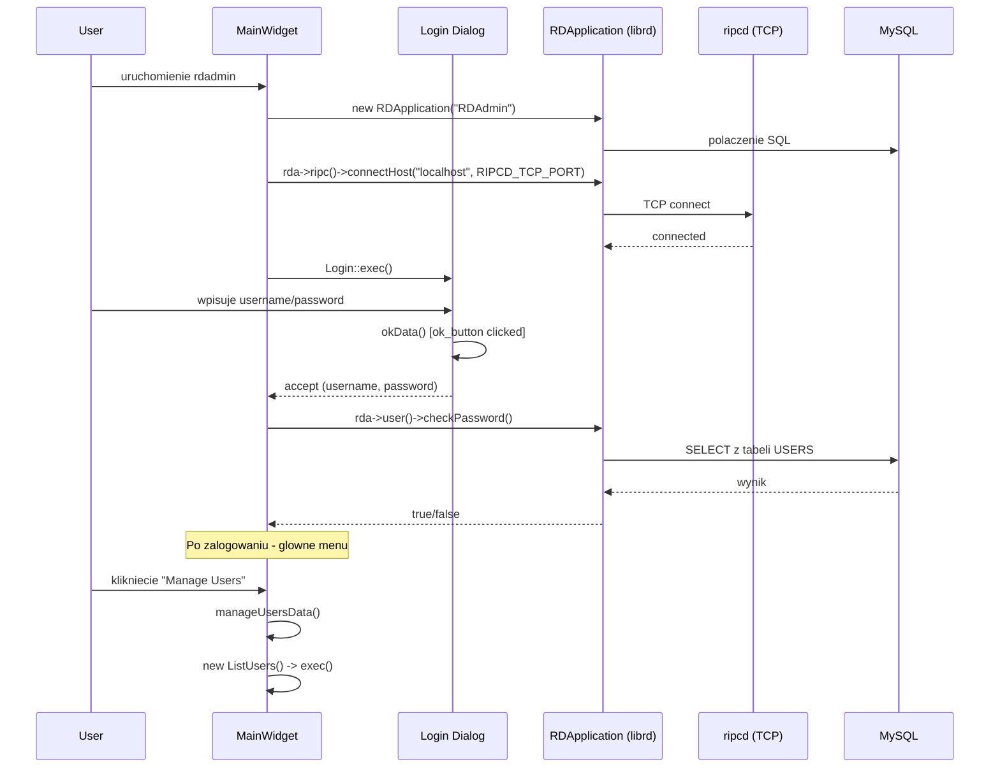
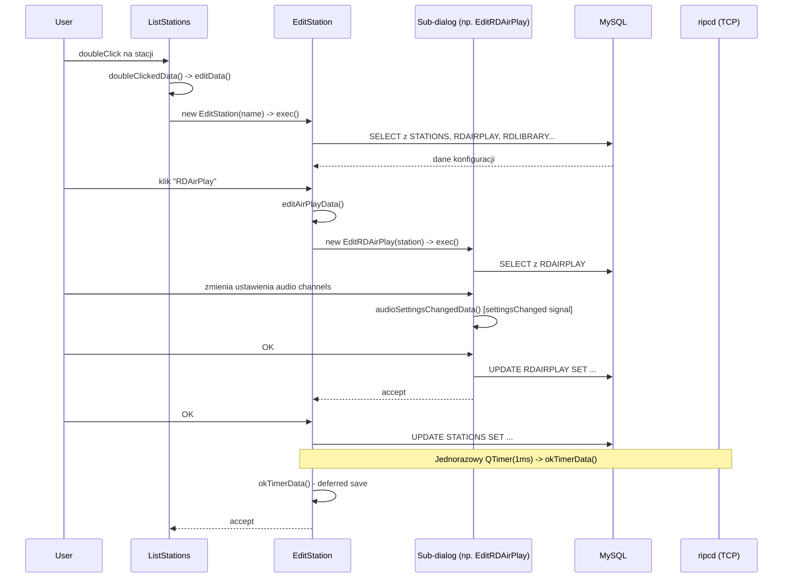
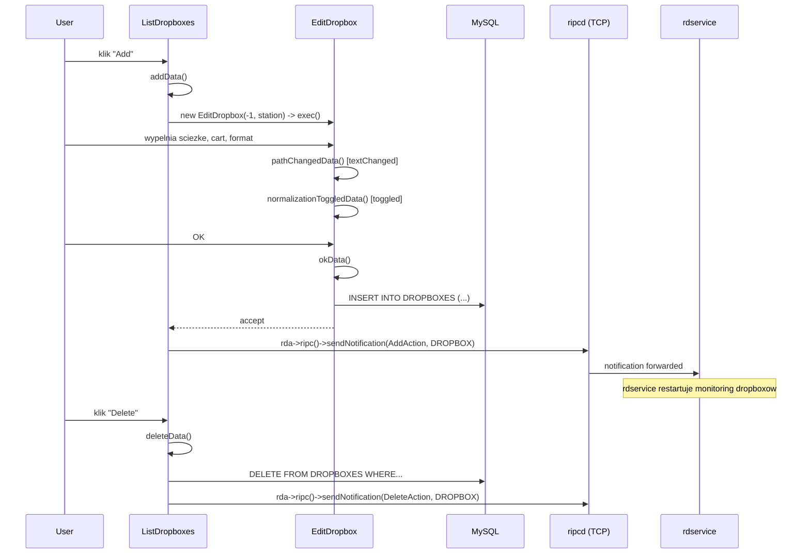
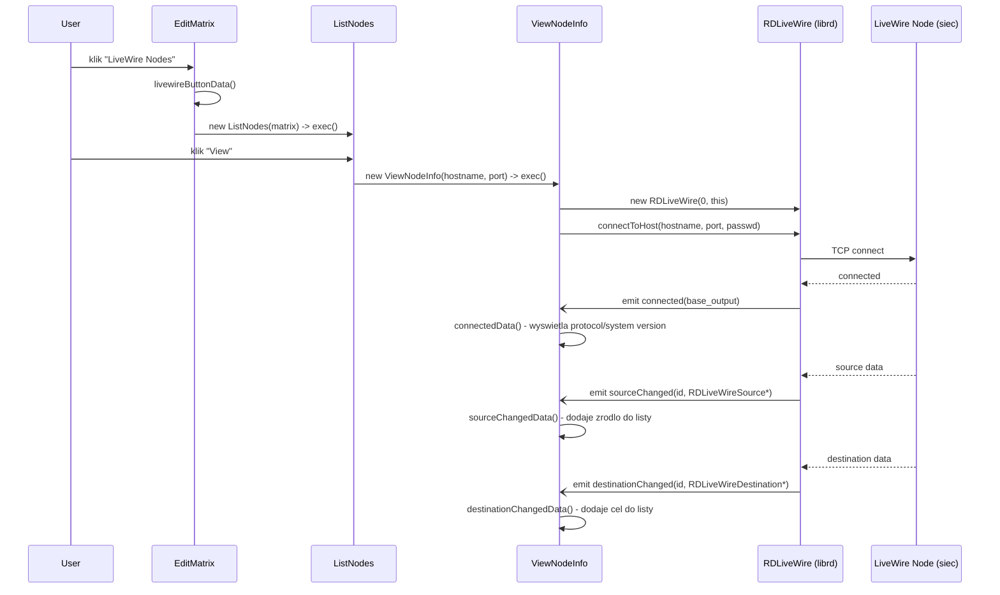
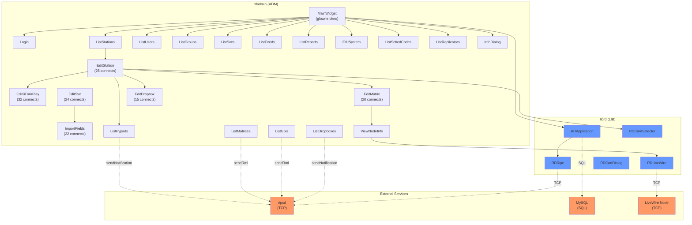

# Call Graph: rdadmin

## Statystyki

| Metryka | Wartosc |
|---------|---------|
| Polaczenia connect() lacznie | 448 |
| Unikalne sygnaly | 22 |
| Klasy emitujace (wlasne sygnaly) | 0 |
| Klasy z connect() | 80 |
| Cross-artifact polaczenia | 5 (RIPC TCP x3, LiveWire TCP x1, MySQL/SQL x1) |
| Circular dependencies | 0 |
| Q_PROPERTY z NOTIFY | 0 |
| QTimer connections | 3 |

**Uwaga:** rdadmin to czysta aplikacja CRUD administracyjna. Nie definiuje wlasnych sygnalow (0 emit, 0 Q_PROPERTY). Wszystkie 448 connect() to Qt4-style SIGNAL/SLOT makra laczace widgety UI (QPushButton, QComboBox, QSpinBox, QCheckBox) ze slotami dialogow. Komunikacja cross-artifact odbywa sie przez bezposrednie wywolania metod librd (RDRipc, RDLiveWire, RDSqlQuery), nie przez sygnaly.

---

## Diagramy

### Sequence: Logowanie i nawigacja glowna



### Sequence: Edycja stacji (EditStation) z sub-dialogami



### Sequence: Zarzadzanie dropboxami z notyfikacja RIPC



### Sequence: Konfiguracja LiveWire (ViewNodeInfo)



### Graf zaleznosci



---

## Graf polaczen (connect registry)

<!-- Kompletna lista wszystkich 448 connect() w rdadmin -->
<!-- Kazdy wiersz = jeden connect() call, posortowane po pliku zrodlowym -->
<!-- Wszystkie polaczenia sa Qt4-style SIGNAL/SLOT makra -->
<!-- 422 self-wiring (receiver=this), 26 non-self (QSignalMapper + toggled->setEnabled) -->

| # | Nadawca | Sygnal | Odbiorca | Slot | Zdefiniowane w |
|---|---------|--------|----------|------|---------------|
| 1 | feed_keyname_edit | textChanged(const QString &) | this | keynameChangedData(const QString &) | rdadmin/add_feed.cpp:61 |
| 2 | feed_ok_button | clicked() | this | okData() | rdadmin/add_feed.cpp:84 |
| 3 | feed_cancel_button | clicked() | this | cancelData() | rdadmin/add_feed.cpp:92 |
| 4 | ok_button | clicked() | this | okData() | rdadmin/add_group.cpp:106 |
| 5 | cancel_button | clicked() | this | cancelData() | rdadmin/add_group.cpp:116 |
| 6 | ok_button | clicked() | this | okData() | rdadmin/add_hostvar.cpp:95 |
| 7 | cancel_button | clicked() | this | cancelData() | rdadmin/add_hostvar.cpp:105 |
| 8 | ok_button | clicked() | this | okData() | rdadmin/add_matrix.cpp:83 |
| 9 | cancel_button | clicked() | this | cancelData() | rdadmin/add_matrix.cpp:93 |
| 10 | ok_button | clicked() | this | okData() | rdadmin/add_replicator.cpp:82 |
| 11 | cancel_button | clicked() | this | cancelData() | rdadmin/add_replicator.cpp:92 |
| 12 | button | clicked() | this | okData() | rdadmin/add_report.cpp:83 |
| 13 | button | clicked() | this | cancelData() | rdadmin/add_report.cpp:93 |
| 14 | ok_button | clicked() | this | okData() | rdadmin/add_schedcodes.cpp:84 |
| 15 | cancel_button | clicked() | this | cancelData() | rdadmin/add_schedcodes.cpp:94 |
| 16 | ok_button | clicked() | this | okData() | rdadmin/add_station.cpp:94 |
| 17 | cancel_button | clicked() | this | cancelData() | rdadmin/add_station.cpp:104 |
| 18 | ok_button | clicked() | this | okData() | rdadmin/add_svc.cpp:95 |
| 19 | cancel_button | clicked() | this | cancelData() | rdadmin/add_svc.cpp:105 |
| 20 | ok_button | clicked() | this | okData() | rdadmin/add_user.cpp:76 |
| 21 | cancel_button | clicked() | this | cancelData() | rdadmin/add_user.cpp:85 |
| 22 | button | clicked() | this | addData() | rdadmin/autofill_carts.cpp:87 |
| 23 | button | clicked() | this | deleteData() | rdadmin/autofill_carts.cpp:96 |
| 24 | button | clicked() | this | okData() | rdadmin/autofill_carts.cpp:106 |
| 25 | button | clicked() | this | cancelData() | rdadmin/autofill_carts.cpp:115 |
| 26 | edit_card_box | activated(int) | this | cardSelectedData(int) | rdadmin/edit_audios.cpp:61 |
| 27 | mapper | mapped(int) | this | inputMapData(int) | rdadmin/edit_audios.cpp:101 |
| 28 | edit_type_box[j*4+i] | activated(int) | mapper | map() | rdadmin/edit_audios.cpp:108 |
| 29 | edit_mode_box[j*4+i] | activated(int) | mapper | map() | rdadmin/edit_audios.cpp:121 |
| 30 | help_button | clicked() | this | helpData() | rdadmin/edit_audios.cpp:165 |
| 31 | close_button | clicked() | this | closeData() | rdadmin/edit_audios.cpp:175 |
| 32 | edit_slot_columns_spin | valueChanged(int) | this | quantityChangedData(int) | rdadmin/edit_cartslots.cpp:71 |
| 33 | edit_slot_rows_spin | valueChanged(int) | this | quantityChangedData(int) | rdadmin/edit_cartslots.cpp:84 |
| 34 | edit_slot_box | activated(int) | this | slotChangedData(int) | rdadmin/edit_cartslots.cpp:96 |
| 35 | edit_card_spin | valueChanged(int) | this | cardChangedData(int) | rdadmin/edit_cartslots.cpp:122 |
| 36 | edit_mode_box | activated(int) | this | modeData(int) | rdadmin/edit_cartslots.cpp:187 |
| 37 | edit_cartaction_box | activated(int) | this | cartActionData(int) | rdadmin/edit_cartslots.cpp:214 |
| 38 | edit_cart_button | clicked() | this | cartSelectData() | rdadmin/edit_cartslots.cpp:235 |
| 39 | button | clicked() | this | closeData() | rdadmin/edit_cartslots.cpp:258 |
| 40 | edit_start_gpi_matrix_spin | valueChanged(int) | this | startMatrixGpiChangedData(int) | rdadmin/edit_channelgpios.cpp:51 |
| 41 | edit_start_gpo_matrix_spin | valueChanged(int) | this | startMatrixGpoChangedData(int) | rdadmin/edit_channelgpios.cpp:78 |
| 42 | edit_stop_gpi_matrix_spin | valueChanged(int) | this | stopMatrixGpiChangedData(int) | rdadmin/edit_channelgpios.cpp:94 |
| 43 | edit_stop_gpo_matrix_spin | valueChanged(int) | this | stopMatrixGpoChangedData(int) | rdadmin/edit_channelgpios.cpp:110 |
| 44 | edit_ok_button | clicked() | this | okData() | rdadmin/edit_channelgpios.cpp:132 |
| 45 | edit_cancel_button | clicked() | this | cancelData() | rdadmin/edit_channelgpios.cpp:136 |
| 46 | edit_record_deck_box | activated(int) | this | recordDeckActivatedData(int) | rdadmin/edit_decks.cpp:69 |
| 47 | edit_record_selector | cardChanged(int) | this | recordCardChangedData(int) | rdadmin/edit_decks.cpp:88 |
| 48 | edit_monitor_box | valueChanged(int) | this | monitorPortChangedData(int) | rdadmin/edit_decks.cpp:98 |
| 49 | edit_format_box | activated(int) | this | formatActivatedData(int) | rdadmin/edit_decks.cpp:121 |
| 50 | edit_swstation_box | activated(const QString &) | this | stationActivatedData(const QString &) | rdadmin/edit_decks.cpp:149 |
| 51 | edit_swmatrix_box | activated(const QString &) | this | matrixActivatedData(const QString &) | rdadmin/edit_decks.cpp:164 |
| 52 | edit_play_deck_box | activated(int) | this | playDeckActivatedData(int) | rdadmin/edit_decks.cpp:251 |
| 53 | edit_play_selector | settingsChanged(int,int,int) | this | playSettingsChangedData(int,int,int) | rdadmin/edit_decks.cpp:263 |
| 54 | mapper | mapped(int) | this | eventCartSelectedData(int) | rdadmin/edit_decks.cpp:274 |
| 55 | edit_event_buttons[i+j] | clicked() | mapper | map() | rdadmin/edit_decks.cpp:291 |
| 56 | close_button | clicked() | this | closeData() | rdadmin/edit_decks.cpp:305 |
| 57 | button | clicked() | this | selectPathData() | rdadmin/edit_dropbox.cpp:93 |
| 58 | box_select_cart_button | clicked() | this | selectCartData() | rdadmin/edit_dropbox.cpp:110 |
| 59 | box_log_to_syslog_check | toggled(bool) | box_log_path_edit | setDisabled(bool) | rdadmin/edit_dropbox.cpp:159 |
| 60 | box_log_to_syslog_check | toggled(bool) | box_log_path_label | setDisabled(bool) | rdadmin/edit_dropbox.cpp:166 |
| 61 | box_log_path_button | clicked() | this | selectLogPathData() | rdadmin/edit_dropbox.cpp:171 |
| 62 | box_log_to_syslog_check | toggled(bool) | box_log_path_button | setDisabled(bool) | rdadmin/edit_dropbox.cpp:173 |
| 63 | box_schedcodes_button | clicked() | this | schedcodesData() | rdadmin/edit_dropbox.cpp:182 |
| 64 | box_normalization_box | toggled(bool) | this | normalizationToggledData(bool) | rdadmin/edit_dropbox.cpp:235 |
| 65 | box_autotrim_box | toggled(bool) | this | autotrimToggledData(bool) | rdadmin/edit_dropbox.cpp:258 |
| 66 | box_segue_box | toggled(bool) | this | segueToggledData(bool) | rdadmin/edit_dropbox.cpp:295 |
| 67 | box_create_dates_box | toggled(bool) | this | createDatesToggledData(bool) | rdadmin/edit_dropbox.cpp:400 |
| 68 | reset_button | clicked() | this | resetData() | rdadmin/edit_dropbox.cpp:412 |
| 69 | ok_button | clicked() | this | okData() | rdadmin/edit_dropbox.cpp:422 |
| 70 | cancel_button | clicked() | this | cancelData() | rdadmin/edit_dropbox.cpp:432 |
| 71 | box_path_edit | textChanged(QString) | this | pathChangedData(QString) | rdadmin/edit_dropbox.cpp:496 |
| 72 | button | clicked() | this | okData() | rdadmin/edit_endpoint.cpp:163 |
| 73 | button | clicked() | this | cancelData() | rdadmin/edit_endpoint.cpp:172 |
| 74 | feed_is_superfeed_box | activated(int) | this | superfeedActivatedData(int) | rdadmin/edit_feed.cpp:67 |
| 75 | feed_is_superfeed_button | clicked() | this | selectSubfeedsData() | rdadmin/edit_feed.cpp:74 |
| 76 | feed_list_images_button | clicked() | this | listImagesData() | rdadmin/edit_feed.cpp:82 |
| 77 | feed_purge_url_edit | textChanged(const QString &) | this | purgeUrlChangedData(const QString &) | rdadmin/edit_feed.cpp:237 |
| 78 | feed_purge_username_edit | textChanged(const QString &) | this | lineeditChangedData(const QString &) | rdadmin/edit_feed.cpp:249 |
| 79 | feed_format_button | clicked() | this | setFormatData() | rdadmin/edit_feed.cpp:288 |
| 80 | feed_normalize_check | toggled(bool) | this | checkboxToggledData(bool) | rdadmin/edit_feed.cpp:299 |
| 81 | feed_rss_schema_box | activated(int) | this | schemaActivatedData(int) | rdadmin/edit_feed.cpp:400 |
| 82 | feed_header_xml_button | clicked() | this | copyHeaderXmlData() | rdadmin/edit_feed.cpp:416 |
| 83 | feed_channel_xml_button | clicked() | this | copyChannelXmlData() | rdadmin/edit_feed.cpp:430 |
| 84 | feed_item_xml_button | clicked() | this | copyItemXmlData() | rdadmin/edit_feed.cpp:443 |
| 85 | feed_ok_button | clicked() | this | okData() | rdadmin/edit_feed.cpp:453 |
| 86 | feed_cancel_button | clicked() | this | cancelData() | rdadmin/edit_feed.cpp:461 |
| 87 | ok_button | clicked() | this | okData() | rdadmin/edit_feed_perms.cpp:75 |
| 88 | cancel_button | clicked() | this | cancelData() | rdadmin/edit_feed_perms.cpp:85 |
| 89 | button | clicked() | this | selectOnData() | rdadmin/edit_gpi.cpp:81 |
| 90 | button | clicked() | this | clearOnData() | rdadmin/edit_gpi.cpp:90 |
| 91 | button | clicked() | this | selectOffData() | rdadmin/edit_gpi.cpp:129 |
| 92 | button | clicked() | this | clearOffData() | rdadmin/edit_gpi.cpp:138 |
| 93 | button | clicked() | this | okData() | rdadmin/edit_gpi.cpp:159 |
| 94 | button | clicked() | this | cancelData() | rdadmin/edit_gpi.cpp:169 |
| 95 | group_lowcart_box | valueChanged(int) | this | lowCartChangedData(int) | rdadmin/edit_group.cpp:133 |
| 96 | group_cutlife_check | toggled(bool) | this | cutLifeEnabledData(bool) | rdadmin/edit_group.cpp:169 |
| 97 | group_shelflife_check | toggled(bool) | this | purgeEnabledData(bool) | rdadmin/edit_group.cpp:186 |
| 98 | group_color_button | clicked() | this | colorData() | rdadmin/edit_group.cpp:225 |
| 99 | group_ok_button | clicked() | this | okData() | rdadmin/edit_group.cpp:234 |
| 100 | group_cancel_button | clicked() | this | cancelData() | rdadmin/edit_group.cpp:242 |
| 101 | ok_button | clicked() | this | okData() | rdadmin/edit_hostvar.cpp:102 |
| 102 | cancel_button | clicked() | this | cancelData() | rdadmin/edit_hostvar.cpp:112 |
| 103 | list_view | clicked(Q3ListViewItem *,const QPoint &,int) | this | showCurrentKey() | rdadmin/edit_hotkeys.cpp:74 |
| 104 | list_view | doubleClicked(Q3ListViewItem *,const QPoint &,int) | this | showCurrentKey() | rdadmin/edit_hotkeys.cpp:76 |
| 105 | set_button | clicked() | this | SetButtonClicked() | rdadmin/edit_hotkeys.cpp:92 |
| 106 | clear_button | clicked() | this | clearCurrentItem() | rdadmin/edit_hotkeys.cpp:102 |
| 107 | clear_all_button | clicked() | this | clearAll_Hotkeys() | rdadmin/edit_hotkeys.cpp:112 |
| 108 | save_button | clicked() | this | save() | rdadmin/edit_hotkeys.cpp:146 |
| 109 | cancel_button | clicked() | this | cancel() | rdadmin/edit_hotkeys.cpp:157 |
| 110 | c_ok_button | clicked() | this | okData() | rdadmin/edit_image.cpp:65 |
| 111 | c_cancel_button | clicked() | this | cancelData() | rdadmin/edit_image.cpp:69 |
| 112 | edit_start_jack_box | toggled(bool) | this | startJackData(bool) | rdadmin/edit_jack.cpp:85 |
| 113 | edit_jack_client_view | doubleClicked(Q3ListViewItem *, const QPoint &,int) | this | doubleClickedData(Q3ListViewItem *,const QPoint &,int) | rdadmin/edit_jack.cpp:116 |
| 114 | edit_add_button | clicked() | this | addData() | rdadmin/edit_jack.cpp:126 |
| 115 | edit_edit_button | clicked() | this | editData() | rdadmin/edit_jack.cpp:134 |
| 116 | edit_delete_button | clicked() | this | deleteData() | rdadmin/edit_jack.cpp:142 |
| 117 | edit_ok_button | clicked() | this | okData() | rdadmin/edit_jack.cpp:151 |
| 118 | edit_cancel_button | clicked() | this | cancelData() | rdadmin/edit_jack.cpp:159 |
| 119 | edit_ok_button | clicked() | this | okData() | rdadmin/edit_jack_client.cpp:72 |
| 120 | edit_cancel_button | clicked() | this | cancelData() | rdadmin/edit_jack_client.cpp:80 |
| 121 | button | clicked() | this | okData() | rdadmin/edit_livewiregpio.cpp:87 |
| 122 | button | clicked() | this | cancelData() | rdadmin/edit_livewiregpio.cpp:96 |
| 123 | edit_porttype_box | activated(int) | this | portTypeActivatedData(int) | rdadmin/edit_matrix.cpp:123 |
| 124 | edit_start_cart_button | clicked() | this | startCartData() | rdadmin/edit_matrix.cpp:193 |
| 125 | edit_stop_cart_button | clicked() | this | stopCartData() | rdadmin/edit_matrix.cpp:208 |
| 126 | edit_porttype2_box | activated(int) | this | portType2ActivatedData(int) | rdadmin/edit_matrix.cpp:230 |
| 127 | edit_start_cart2_button | clicked() | this | startCart2Data() | rdadmin/edit_matrix.cpp:299 |
| 128 | edit_stop_cart2_button | clicked() | this | stopCart2Data() | rdadmin/edit_matrix.cpp:315 |
| 129 | edit_inputs_box | valueChanged(int) | this | inputsChangedData(int) | rdadmin/edit_matrix.cpp:338 |
| 130 | edit_gpis_box | valueChanged(int) | this | gpisChangedData(int) | rdadmin/edit_matrix.cpp:373 |
| 131 | edit_gpos_box | valueChanged(int) | this | gposChangedData(int) | rdadmin/edit_matrix.cpp:386 |
| 132 | edit_inputs_button | clicked() | this | inputsButtonData() | rdadmin/edit_matrix.cpp:433 |
| 133 | edit_outputs_button | clicked() | this | outputsButtonData() | rdadmin/edit_matrix.cpp:442 |
| 134 | edit_gpis_button | clicked() | this | gpisButtonData() | rdadmin/edit_matrix.cpp:453 |
| 135 | edit_gpos_button | clicked() | this | gposButtonData() | rdadmin/edit_matrix.cpp:463 |
| 136 | edit_livewire_button | clicked() | this | livewireButtonData() | rdadmin/edit_matrix.cpp:472 |
| 137 | edit_livewire_gpio_button | clicked() | this | livewireGpioButtonData() | rdadmin/edit_matrix.cpp:482 |
| 138 | edit_vguestrelays_button | clicked() | this | vguestRelaysButtonData() | rdadmin/edit_matrix.cpp:492 |
| 139 | edit_vguestdisplays_button | clicked() | this | vguestDisplaysButtonData() | rdadmin/edit_matrix.cpp:502 |
| 140 | edit_sasresources_button | clicked() | this | sasResourcesButtonData() | rdadmin/edit_matrix.cpp:512 |
| 141 | button | clicked() | this | okData() | rdadmin/edit_matrix.cpp:523 |
| 142 | button | clicked() | this | cancelData() | rdadmin/edit_matrix.cpp:532 |
| 143 | edit_password_edit | textChanged(const QString &) | this | passwordChangedData(const QString &) | rdadmin/edit_node.cpp:100 |
| 144 | button | clicked() | this | viewData() | rdadmin/edit_node.cpp:114 |
| 145 | button | clicked() | this | okData() | rdadmin/edit_node.cpp:124 |
| 146 | button | clicked() | this | cancelData() | rdadmin/edit_node.cpp:133 |
| 147 | edit_ok_button | clicked() | this | okData() | rdadmin/edit_pypad.cpp:67 |
| 148 | edit_cancel_button | clicked() | this | cancelData() | rdadmin/edit_pypad.cpp:74 |
| 149 | mapper | mapped(int) | this | editGpiosData(int) | rdadmin/edit_rdairplay.cpp:88 |
| 150 | air_channel_button[0] | clicked() | mapper | map() | rdadmin/edit_rdairplay.cpp:119 |
| 151 | air_card_sel[0] | settingsChanged(int,int,int) | this | audioSettingsChangedData(int,int,int) | rdadmin/edit_rdairplay.cpp:120 |
| 152 | air_channel_button[1] | clicked() | mapper | map() | rdadmin/edit_rdairplay.cpp:152 |
| 153 | air_card_sel[1] | settingsChanged(int,int,int) | this | audioSettingsChangedData(int,int,int) | rdadmin/edit_rdairplay.cpp:153 |
| 154 | air_channel_button[4] | clicked() | mapper | map() | rdadmin/edit_rdairplay.cpp:185 |
| 155 | air_card_sel[4] | settingsChanged(int,int,int) | this | audioSettingsChangedData(int,int,int) | rdadmin/edit_rdairplay.cpp:186 |
| 156 | air_channel_button[5] | clicked() | mapper | map() | rdadmin/edit_rdairplay.cpp:218 |
| 157 | air_card_sel[5] | settingsChanged(int,int,int) | this | audioSettingsChangedData(int,int,int) | rdadmin/edit_rdairplay.cpp:219 |
| 158 | air_virtual_machine_box | activated(int) | this | virtualLogActivatedData(int) | rdadmin/edit_rdairplay.cpp:234 |
| 159 | air_card_sel[3] | settingsChanged(int,int,int) | this | audioSettingsChangedData(int,int,int) | rdadmin/edit_rdairplay.cpp:282 |
| 160 | button | clicked() | this | editHotKeys() | rdadmin/edit_rdairplay.cpp:298 |
| 161 | air_channel_button[2] | clicked() | mapper | map() | rdadmin/edit_rdairplay.cpp:328 |
| 162 | air_card_sel[2] | settingsChanged(int,int,int) | this | audioSettingsChangedData(int,int,int) | rdadmin/edit_rdairplay.cpp:329 |
| 163 | air_channel_button[6] | clicked() | mapper | map() | rdadmin/edit_rdairplay.cpp:361 |
| 164 | air_card_sel[6] | settingsChanged(int,int,int) | this | audioSettingsChangedData(int,int,int) | rdadmin/edit_rdairplay.cpp:362 |
| 165 | air_channel_button[7] | clicked() | mapper | map() | rdadmin/edit_rdairplay.cpp:394 |
| 166 | air_card_sel[7] | settingsChanged(int,int,int) | this | audioSettingsChangedData(int,int,int) | rdadmin/edit_rdairplay.cpp:395 |
| 167 | air_channel_button[8] | clicked() | mapper | map() | rdadmin/edit_rdairplay.cpp:427 |
| 168 | air_card_sel[8] | settingsChanged(int,int,int) | this | audioSettingsChangedData(int,int,int) | rdadmin/edit_rdairplay.cpp:428 |
| 169 | air_channel_button[9] | clicked() | mapper | map() | rdadmin/edit_rdairplay.cpp:460 |
| 170 | air_card_sel[9] | settingsChanged(int,int,int) | this | audioSettingsChangedData(int,int,int) | rdadmin/edit_rdairplay.cpp:461 |
| 171 | air_exitpasswd_edit | textChanged(const QString &) | this | exitPasswordChangedData(const QString &) | rdadmin/edit_rdairplay.cpp:728 |
| 172 | air_logmachine_box | activated(int) | this | logActivatedData(int) | rdadmin/edit_rdairplay.cpp:743 |
| 173 | air_startmode_box | activated(int) | this | startModeChangedData(int) | rdadmin/edit_rdairplay.cpp:758 |
| 174 | air_startlog_button | clicked() | this | selectData() | rdadmin/edit_rdairplay.cpp:790 |
| 175 | button | clicked() | this | selectSkinData() | rdadmin/edit_rdairplay.cpp:811 |
| 176 | air_modecontrol_box | activated(int) | this | modeControlActivatedData(int) | rdadmin/edit_rdairplay.cpp:865 |
| 177 | air_logstartmode_box[i] | activated(int) | this | logStartupModeActivatedData(int) | rdadmin/edit_rdairplay.cpp:880 |
| 178 | air_virtual_logstartsel_box | activated(int) | this | virtualModeActivatedData(int) | rdadmin/edit_rdairplay.cpp:897 |
| 179 | button | clicked() | this | okData() | rdadmin/edit_rdairplay.cpp:922 |
| 180 | button | clicked() | this | cancelData() | rdadmin/edit_rdairplay.cpp:931 |
| 181 | lib_cd_server_type_box | activated(int) | this | cdServerTypeData(int) | rdadmin/edit_rdlibrary.cpp:210 |
| 182 | lib_format_box | activated(int) | this | formatData(int) | rdadmin/edit_rdlibrary.cpp:239 |
| 183 | ok_button | clicked() | this | okData() | rdadmin/edit_rdlibrary.cpp:371 |
| 184 | cancel_button | clicked() | this | cancelData() | rdadmin/edit_rdlibrary.cpp:381 |
| 185 | lib_format_box | activated(int) | this | formatData(int) | rdadmin/edit_rdlogedit.cpp:147 |
| 186 | button | clicked() | this | selectStartData() | rdadmin/edit_rdlogedit.cpp:209 |
| 187 | button | clicked() | this | selectEndData() | rdadmin/edit_rdlogedit.cpp:226 |
| 188 | button | clicked() | this | selectRecordStartData() | rdadmin/edit_rdlogedit.cpp:243 |
| 189 | button | clicked() | this | selectRecordEndData() | rdadmin/edit_rdlogedit.cpp:260 |
| 190 | ok_button | clicked() | this | okData() | rdadmin/edit_rdlogedit.cpp:295 |
| 191 | cancel_button | clicked() | this | cancelData() | rdadmin/edit_rdlogedit.cpp:305 |
| 192 | button | clicked() | this | selectSkinData() | rdadmin/edit_rdpanel.cpp:223 |
| 193 | button | clicked() | this | okData() | rdadmin/edit_rdpanel.cpp:314 |
| 194 | button | clicked() | this | cancelData() | rdadmin/edit_rdpanel.cpp:323 |
| 195 | repl_format_button | clicked() | this | setFormatData() | rdadmin/edit_replicator.cpp:157 |
| 196 | repl_normalize_box | toggled(bool) | this | normalizeCheckData(bool) | rdadmin/edit_replicator.cpp:170 |
| 197 | ok_button | clicked() | this | okData() | rdadmin/edit_replicator.cpp:204 |
| 198 | cancel_button | clicked() | this | cancelData() | rdadmin/edit_replicator.cpp:214 |
| 199 | edit_cartzeros_box | toggled(bool) | this | leadingZerosToggled(bool) | rdadmin/edit_report.cpp:102 |
| 200 | edit_generic_box | toggled(bool) | this | genericEventsToggledData(bool) | rdadmin/edit_report.cpp:217 |
| 201 | edit_daypart_check | toggled(bool) | edit_starttime_label | setEnabled(bool) | rdadmin/edit_report.cpp:279 |
| 202 | edit_daypart_check | toggled(bool) | edit_starttime_edit | setEnabled(bool) | rdadmin/edit_report.cpp:281 |
| 203 | edit_daypart_check | toggled(bool) | edit_endtime_label | setEnabled(bool) | rdadmin/edit_report.cpp:283 |
| 204 | edit_daypart_check | toggled(bool) | edit_endtime_edit | setEnabled(bool) | rdadmin/edit_report.cpp:285 |
| 205 | edit_group_box | toggled(bool) | edit_group_sel | setEnabled(bool) | rdadmin/edit_report.cpp:328 |
| 206 | button | clicked() | this | okData() | rdadmin/edit_report.cpp:340 |
| 207 | button | clicked() | this | cancelData() | rdadmin/edit_report.cpp:349 |
| 208 | button | clicked() | this | okData() | rdadmin/edit_sas_resource.cpp:83 |
| 209 | button | clicked() | this | cancelData() | rdadmin/edit_sas_resource.cpp:93 |
| 210 | ok_button | clicked() | this | okData() | rdadmin/edit_schedcodes.cpp:88 |
| 211 | cancel_button | clicked() | this | cancelData() | rdadmin/edit_schedcodes.cpp:98 |
| 212 | station_startup_select_button | clicked() | this | selectClicked() | rdadmin/edit_station.cpp:196 |
| 213 | station_start_cart_button | clicked() | this | startCartClickedData() | rdadmin/edit_station.cpp:217 |
| 214 | station_stop_cart_button | clicked() | this | stopCartClickedData() | rdadmin/edit_station.cpp:229 |
| 215 | station_heartbeat_box | toggled(bool) | this | heartbeatToggledData(bool) | rdadmin/edit_station.cpp:240 |
| 216 | station_hbcart_button | clicked() | this | heartbeatClickedData() | rdadmin/edit_station.cpp:263 |
| 217 | station_dragdrop_box | toggled(bool) | station_panel_enforce_label | setEnabled(bool) | rdadmin/edit_station.cpp:306 |
| 218 | station_dragdrop_box | toggled(bool) | station_panel_enforce_box | setEnabled(bool) | rdadmin/edit_station.cpp:308 |
| 219 | station_cae_station_box | activated(const QString &) | this | caeStationActivatedData(const QString &) | rdadmin/edit_station.cpp:332 |
| 220 | station_rdlibrary_button | clicked() | this | editLibraryData() | rdadmin/edit_station.cpp:345 |
| 221 | station_rdcatch_button | clicked() | this | editDeckData() | rdadmin/edit_station.cpp:353 |
| 222 | station_rdairplay_button | clicked() | this | editAirPlayData() | rdadmin/edit_station.cpp:361 |
| 223 | station_rdpanel_button | clicked() | this | editPanelData() | rdadmin/edit_station.cpp:370 |
| 224 | station_rdlogedit_button | clicked() | this | editLogEditData() | rdadmin/edit_station.cpp:378 |
| 225 | station_rdcartslots_button | clicked() | this | editCartSlotsData() | rdadmin/edit_station.cpp:387 |
| 226 | station_dropboxes_button | clicked() | this | editDropboxesData() | rdadmin/edit_station.cpp:396 |
| 227 | station_switchers_button | clicked() | this | editSwitcherData() | rdadmin/edit_station.cpp:405 |
| 228 | station_hostvars_button | clicked() | this | editHostvarsData() | rdadmin/edit_station.cpp:414 |
| 229 | station_audioports_button | clicked() | this | editAudioData() | rdadmin/edit_station.cpp:423 |
| 230 | station_ttys_button | clicked() | this | editTtyData() | rdadmin/edit_station.cpp:432 |
| 231 | station_adapters_button | clicked() | this | viewAdaptersData() | rdadmin/edit_station.cpp:440 |
| 232 | station_jack_button | clicked() | this | jackSettingsData() | rdadmin/edit_station.cpp:449 |
| 233 | station_pypad_button | clicked() | this | pypadInstancesData() | rdadmin/edit_station.cpp:457 |
| 234 | station_ok_button | clicked() | this | okData() | rdadmin/edit_station.cpp:467 |
| 235 | station_cancel_button | clicked() | this | cancelData() | rdadmin/edit_station.cpp:475 |
| 236 | timer | timeout() | this | okTimerData() | rdadmin/edit_station.cpp:751 |
| 237 | ok_button | clicked() | this | okData() | rdadmin/edit_superfeed.cpp:62 |
| 238 | cancel_button | clicked() | this | cancelData() | rdadmin/edit_superfeed.cpp:72 |
| 239 | svc_sub_event_inheritance_box | activated(const QString &) | this | textChangedData(const QString &) | rdadmin/edit_svc.cpp:137 |
| 240 | button | clicked() | this | autofillData() | rdadmin/edit_svc.cpp:190 |
| 241 | svc_loglife_box | toggled(bool) | svc_loglife_spin | setEnabled(bool) | rdadmin/edit_svc.cpp:203 |
| 242 | svc_loglife_box | toggled(bool) | svc_loglifeorigin_label | setEnabled(bool) | rdadmin/edit_svc.cpp:208 |
| 243 | svc_loglife_box | toggled(bool) | svc_loglifeorigin_box | setEnabled(bool) | rdadmin/edit_svc.cpp:214 |
| 244 | svc_shelflife_box | toggled(bool) | svc_shelflife_spin | setEnabled(bool) | rdadmin/edit_svc.cpp:228 |
| 245 | button | clicked() | this | enableHostsData() | rdadmin/edit_svc.cpp:252 |
| 246 | svc_tfc_path_edit | textChanged(const QString &) | this | textChangedData(const QString &) | rdadmin/edit_svc.cpp:272 |
| 247 | svc_tfc_preimport_cmd_edit | textChanged(const QString &) | this | textChangedData(const QString &) | rdadmin/edit_svc.cpp:285 |
| 248 | svc_tfc_label_cart_edit | textChanged(const QString &) | this | textChangedData(const QString &) | rdadmin/edit_svc.cpp:297 |
| 249 | svc_tfc_track_edit | textChanged(const QString &) | this | textChangedData(const QString &) | rdadmin/edit_svc.cpp:309 |
| 250 | svc_tfc_import_template_box | activated(int) | this | tfcTemplateActivatedData(int) | rdadmin/edit_svc.cpp:320 |
| 251 | button | clicked() | this | trafficData() | rdadmin/edit_svc.cpp:337 |
| 252 | svc_tfc_copy_button | clicked() | this | trafficCopyData() | rdadmin/edit_svc.cpp:346 |
| 253 | svc_mus_path_edit | textChanged(const QString &) | this | textChangedData(const QString &) | rdadmin/edit_svc.cpp:366 |
| 254 | svc_mus_preimport_cmd_edit | textChanged(const QString &) | this | textChangedData(const QString &) | rdadmin/edit_svc.cpp:379 |
| 255 | svc_mus_label_cart_edit | textChanged(const QString &) | this | textChangedData(const QString &) | rdadmin/edit_svc.cpp:391 |
| 256 | svc_mus_track_edit | textChanged(const QString &) | this | textChangedData(const QString &) | rdadmin/edit_svc.cpp:403 |
| 257 | svc_mus_break_edit | textChanged(const QString &) | this | textChangedData(const QString &) | rdadmin/edit_svc.cpp:415 |
| 258 | svc_mus_import_template_box | activated(int) | this | musTemplateActivatedData(int) | rdadmin/edit_svc.cpp:426 |
| 259 | button | clicked() | this | musicData() | rdadmin/edit_svc.cpp:443 |
| 260 | svc_mus_copy_button | clicked() | this | musicCopyData() | rdadmin/edit_svc.cpp:452 |
| 261 | button | clicked() | this | okData() | rdadmin/edit_svc.cpp:462 |
| 262 | button | clicked() | this | cancelData() | rdadmin/edit_svc.cpp:472 |
| 263 | ok_button | clicked() | this | okData() | rdadmin/edit_svc_perms.cpp:62 |
| 264 | cancel_button | clicked() | this | cancelData() | rdadmin/edit_svc_perms.cpp:72 |
| 265 | edit_duplicate_carts_box | toggled(bool) | this | duplicatesCheckedData(bool) | rdadmin/edit_system.cpp:76 |
| 266 | edit_save_button | clicked() | this | saveData() | rdadmin/edit_system.cpp:201 |
| 267 | edit_encoders_button | clicked() | this | encodersData() | rdadmin/edit_system.cpp:210 |
| 268 | edit_ok_button | clicked() | this | okData() | rdadmin/edit_system.cpp:218 |
| 269 | edit_cancel_button | clicked() | this | cancelData() | rdadmin/edit_system.cpp:226 |
| 270 | edit_port_box | activated(int) | this | idSelectedData() | rdadmin/edit_ttys.cpp:63 |
| 271 | edit_enable_button | stateChanged(int) | this | enableButtonData(int) | rdadmin/edit_ttys.cpp:74 |
| 272 | close_button | clicked() | this | closeData() | rdadmin/edit_ttys.cpp:155 |
| 273 | user_localauth_check | toggled(bool) | this | localAuthToggledData(bool) | rdadmin/edit_user.cpp:117 |
| 274 | user_password_button | clicked() | this | passwordData() | rdadmin/edit_user.cpp:144 |
| 275 | user_admin_config_button | toggled(bool) | this | adminConfigToggledData(bool) | rdadmin/edit_user.cpp:168 |
| 276 | user_admin_rss_button | toggled(bool) | this | adminRssToggledData(bool) | rdadmin/edit_user.cpp:180 |
| 277 | user_assign_perms_button | clicked() | this | groupsData() | rdadmin/edit_user.cpp:395 |
| 278 | user_assign_svcs_button | clicked() | this | servicesData() | rdadmin/edit_user.cpp:404 |
| 279 | user_assign_feeds_button | clicked() | this | feedsData() | rdadmin/edit_user.cpp:414 |
| 280 | button | clicked() | this | okData() | rdadmin/edit_user.cpp:424 |
| 281 | button | clicked() | this | cancelData() | rdadmin/edit_user.cpp:434 |
| 282 | ok_button | clicked() | this | okData() | rdadmin/edit_user_perms.cpp:62 |
| 283 | cancel_button | clicked() | this | cancelData() | rdadmin/edit_user_perms.cpp:72 |
| 284 | ok_button | clicked() | this | okData() | rdadmin/edit_user_service_perms.cpp:62 |
| 285 | cancel_button | clicked() | this | cancelData() | rdadmin/edit_user_service_perms.cpp:72 |
| 286 | button | clicked() | this | okData() | rdadmin/edit_vguest_resource.cpp:96 |
| 287 | button | clicked() | this | cancelData() | rdadmin/edit_vguest_resource.cpp:106 |
| 288 | button | clicked() | this | closeData() | rdadmin/help_audios.cpp:66 |
| 289 | cart_offset_spin | valueChanged(int) | this | valueChangedData(int) | rdadmin/importfields.cpp:47 |
| 290 | cart_length_spin | valueChanged(int) | this | valueChangedData(int) | rdadmin/importfields.cpp:59 |
| 291 | title_offset_spin | valueChanged(int) | this | valueChangedData(int) | rdadmin/importfields.cpp:78 |
| 292 | title_length_spin | valueChanged(int) | this | valueChangedData(int) | rdadmin/importfields.cpp:90 |
| 293 | hours_offset_spin | valueChanged(int) | this | valueChangedData(int) | rdadmin/importfields.cpp:109 |
| 294 | hours_length_spin | valueChanged(int) | this | valueChangedData(int) | rdadmin/importfields.cpp:121 |
| 295 | minutes_offset_spin | valueChanged(int) | this | valueChangedData(int) | rdadmin/importfields.cpp:140 |
| 296 | minutes_length_spin | valueChanged(int) | this | valueChangedData(int) | rdadmin/importfields.cpp:152 |
| 297 | seconds_offset_spin | valueChanged(int) | this | valueChangedData(int) | rdadmin/importfields.cpp:171 |
| 298 | seconds_length_spin | valueChanged(int) | this | valueChangedData(int) | rdadmin/importfields.cpp:183 |
| 299 | len_hours_offset_spin | valueChanged(int) | this | valueChangedData(int) | rdadmin/importfields.cpp:202 |
| 300 | len_hours_length_spin | valueChanged(int) | this | valueChangedData(int) | rdadmin/importfields.cpp:214 |
| 301 | len_minutes_offset_spin | valueChanged(int) | this | valueChangedData(int) | rdadmin/importfields.cpp:233 |
| 302 | len_minutes_length_spin | valueChanged(int) | this | valueChangedData(int) | rdadmin/importfields.cpp:245 |
| 303 | len_seconds_offset_spin | valueChanged(int) | this | valueChangedData(int) | rdadmin/importfields.cpp:264 |
| 304 | len_seconds_length_spin | valueChanged(int) | this | valueChangedData(int) | rdadmin/importfields.cpp:276 |
| 305 | data_offset_spin | valueChanged(int) | this | valueChangedData(int) | rdadmin/importfields.cpp:295 |
| 306 | data_length_spin | valueChanged(int) | this | valueChangedData(int) | rdadmin/importfields.cpp:307 |
| 307 | event_id_offset_spin | valueChanged(int) | this | valueChangedData(int) | rdadmin/importfields.cpp:326 |
| 308 | event_id_length_spin | valueChanged(int) | this | valueChangedData(int) | rdadmin/importfields.cpp:338 |
| 309 | annctype_offset_spin | valueChanged(int) | this | valueChangedData(int) | rdadmin/importfields.cpp:357 |
| 310 | annctype_length_spin | valueChanged(int) | this | valueChangedData(int) | rdadmin/importfields.cpp:369 |
| 311 | button | clicked() | this | viewCreditsData() | rdadmin/info_dialog.cpp:129 |
| 312 | button | clicked() | this | viewLicenseData() | rdadmin/info_dialog.cpp:138 |
| 313 | button | clicked() | this | closeData() | rdadmin/info_dialog.cpp:148 |
| 314 | close_button | clicked() | this | closeData() | rdadmin/license.cpp:49 |
| 315 | list_add_button | clicked() | this | addData() | rdadmin/list_dropboxes.cpp:50 |
| 316 | list_edit_button | clicked() | this | editData() | rdadmin/list_dropboxes.cpp:58 |
| 317 | list_duplicate_button | clicked() | this | duplicateData() | rdadmin/list_dropboxes.cpp:66 |
| 318 | list_delete_button | clicked() | this | deleteData() | rdadmin/list_dropboxes.cpp:74 |
| 319 | list_close_button | clicked() | this | closeData() | rdadmin/list_dropboxes.cpp:83 |
| 320 | list_dropboxes_view | doubleClicked(Q3ListViewItem *,const QPoint &,int) | this | doubleClickedData(Q3ListViewItem *,const QPoint &,int) | rdadmin/list_dropboxes.cpp:112 |
| 321 | c_list | doubleClicked(Q3ListViewItem *,const QPoint &,int) | this | doubleClickedData(Q3ListViewItem *,const QPoint &,int) | rdadmin/list_encoders.cpp:53 |
| 322 | c_add_button | clicked() | this | addData() | rdadmin/list_encoders.cpp:61 |
| 323 | c_edit_button | clicked() | this | editData() | rdadmin/list_encoders.cpp:65 |
| 324 | c_delete_button | clicked() | this | deleteData() | rdadmin/list_encoders.cpp:69 |
| 325 | c_close_button | clicked() | this | closeData() | rdadmin/list_encoders.cpp:73 |
| 326 | list_list_view | doubleClicked(Q3ListViewItem *,const QPoint &,int) | this | doubleClickedData(Q3ListViewItem *,const QPoint &,int) | rdadmin/list_endpoints.cpp:130 |
| 327 | list_edit_button | clicked() | this | editData() | rdadmin/list_endpoints.cpp:142 |
| 328 | list_ok_button | clicked() | this | okData() | rdadmin/list_endpoints.cpp:152 |
| 329 | list_cancel_button | clicked() | this | cancelData() | rdadmin/list_endpoints.cpp:160 |
| 330 | list_add_button | clicked() | this | addData() | rdadmin/list_feeds.cpp:67 |
| 331 | list_edit_button | clicked() | this | editData() | rdadmin/list_feeds.cpp:75 |
| 332 | list_delete_button | clicked() | this | deleteData() | rdadmin/list_feeds.cpp:83 |
| 333 | list_repost_button | clicked() | this | repostData() | rdadmin/list_feeds.cpp:91 |
| 334 | list_unpost_button | clicked() | this | unpostData() | rdadmin/list_feeds.cpp:99 |
| 335 | list_close_button | clicked() | this | closeData() | rdadmin/list_feeds.cpp:108 |
| 336 | list_feeds_view | doubleClicked(Q3ListViewItem *,const QPoint &,int) | this | doubleClickedData(Q3ListViewItem *,const QPoint &,int) | rdadmin/list_feeds.cpp:134 |
| 337 | list_list_view | doubleClicked(Q3ListViewItem *,const QPoint &,int) | this | doubleClickedData(Q3ListViewItem *,const QPoint &,int) | rdadmin/list_gpis.cpp:70 |
| 338 | list_edit_button | clicked() | this | editData() | rdadmin/list_gpis.cpp:104 |
| 339 | list_ok_button | clicked() | this | okData() | rdadmin/list_gpis.cpp:113 |
| 340 | list_cancel_button | clicked() | this | cancelData() | rdadmin/list_gpis.cpp:121 |
| 341 | list_add_button | clicked() | this | addData() | rdadmin/list_groups.cpp:56 |
| 342 | list_edit_button | clicked() | this | editData() | rdadmin/list_groups.cpp:64 |
| 343 | list_rename_button | clicked() | this | renameData() | rdadmin/list_groups.cpp:72 |
| 344 | list_delete_button | clicked() | this | deleteData() | rdadmin/list_groups.cpp:80 |
| 345 | list_report_button | clicked() | this | reportData() | rdadmin/list_groups.cpp:88 |
| 346 | list_close_button | clicked() | this | closeData() | rdadmin/list_groups.cpp:97 |
| 347 | list_groups_view | doubleClicked(Q3ListViewItem *,const QPoint &,int) | this | doubleClickedData(Q3ListViewItem *,const QPoint &,int) | rdadmin/list_groups.cpp:123 |
| 348 | list_view | doubleClicked(Q3ListViewItem *,const QPoint &,int) | this | doubleClickedData(Q3ListViewItem *,const QPoint &,int) | rdadmin/list_hostvars.cpp:62 |
| 349 | list_add_button | clicked() | this | addData() | rdadmin/list_hostvars.cpp:73 |
| 350 | list_edit_button | clicked() | this | editData() | rdadmin/list_hostvars.cpp:81 |
| 351 | list_delete_button | clicked() | this | deleteData() | rdadmin/list_hostvars.cpp:89 |
| 352 | list_ok_button | clicked() | this | okData() | rdadmin/list_hostvars.cpp:98 |
| 353 | list_cancel_button | clicked() | this | cancelData() | rdadmin/list_hostvars.cpp:107 |
| 354 | list_view | clicked(const QModelIndex &) | this | clickedData(const QModelIndex &) | rdadmin/list_images.cpp:49 |
| 355 | list_view | doubleClicked(const QModelIndex &) | this | doubleClickedData(const QModelIndex &) | rdadmin/list_images.cpp:51 |
| 356 | list_add_button | clicked() | this | addData() | rdadmin/list_images.cpp:57 |
| 357 | list_view_button | clicked() | this | viewData() | rdadmin/list_images.cpp:61 |
| 358 | list_delete_button | clicked() | this | deleteData() | rdadmin/list_images.cpp:65 |
| 359 | list_close_button | clicked() | this | closeData() | rdadmin/list_images.cpp:69 |
| 360 | list_view | doubleClicked(Q3ListViewItem *,const QPoint &,int) | this | doubleClickedData(Q3ListViewItem *,const QPoint &,int) | rdadmin/list_livewiregpios.cpp:59 |
| 361 | list_edit_button | clicked() | this | editData() | rdadmin/list_livewiregpios.cpp:70 |
| 362 | list_ok_button | clicked() | this | okData() | rdadmin/list_livewiregpios.cpp:79 |
| 363 | list_cancel_button | clicked() | this | cancelData() | rdadmin/list_livewiregpios.cpp:88 |
| 364 | list_view | doubleClicked(Q3ListViewItem *,const QPoint &,int) | this | doubleClickedData(Q3ListViewItem *,const QPoint &,int) | rdadmin/list_matrices.cpp:66 |
| 365 | list_add_button | clicked() | this | addData() | rdadmin/list_matrices.cpp:77 |
| 366 | list_edit_button | clicked() | this | editData() | rdadmin/list_matrices.cpp:85 |
| 367 | list_delete_button | clicked() | this | deleteData() | rdadmin/list_matrices.cpp:93 |
| 368 | list_close_button | clicked() | this | closeData() | rdadmin/list_matrices.cpp:102 |
| 369 | list_list_view | doubleClicked(Q3ListViewItem *,const QPoint &,int) | this | doubleClickedData(Q3ListViewItem *,const QPoint &,int) | rdadmin/list_nodes.cpp:59 |
| 370 | list_add_button | clicked() | this | addData() | rdadmin/list_nodes.cpp:70 |
| 371 | list_edit_button | clicked() | this | editData() | rdadmin/list_nodes.cpp:78 |
| 372 | list_delete_button | clicked() | this | deleteData() | rdadmin/list_nodes.cpp:86 |
| 373 | list_close_button | clicked() | this | closeData() | rdadmin/list_nodes.cpp:95 |
| 374 | list_list_view | doubleClicked(Q3ListViewItem *,const QPoint &,int) | this | doubleClickedData(Q3ListViewItem *,const QPoint &,int) | rdadmin/list_pypads.cpp:83 |
| 375 | list_add_button | clicked() | this | addData() | rdadmin/list_pypads.cpp:94 |
| 376 | list_edit_button | clicked() | this | editData() | rdadmin/list_pypads.cpp:102 |
| 377 | list_delete_button | clicked() | this | deleteData() | rdadmin/list_pypads.cpp:110 |
| 378 | list_error_button | clicked() | this | errorData() | rdadmin/list_pypads.cpp:118 |
| 379 | list_close_button | clicked() | this | closeData() | rdadmin/list_pypads.cpp:127 |
| 380 | list_update_timer | timeout() | this | updateData() | rdadmin/list_pypads.cpp:139 |
| 381 | list_refresh_timer | timeout() | this | refreshTimeoutData() | rdadmin/list_replicator_carts.cpp:54 |
| 382 | list_repost_button | clicked() | this | repostData() | rdadmin/list_replicator_carts.cpp:62 |
| 383 | list_repost_all_button | clicked() | this | repostAllData() | rdadmin/list_replicator_carts.cpp:70 |
| 384 | list_close_button | clicked() | this | closeData() | rdadmin/list_replicator_carts.cpp:79 |
| 385 | list_add_button | clicked() | this | addData() | rdadmin/list_replicators.cpp:55 |
| 386 | list_edit_button | clicked() | this | editData() | rdadmin/list_replicators.cpp:63 |
| 387 | list_delete_button | clicked() | this | deleteData() | rdadmin/list_replicators.cpp:71 |
| 388 | list_list_button | clicked() | this | listData() | rdadmin/list_replicators.cpp:79 |
| 389 | list_close_button | clicked() | this | closeData() | rdadmin/list_replicators.cpp:88 |
| 390 | list_replicators_view | doubleClicked(Q3ListViewItem *,const QPoint &,int) | this | doubleClickedData(Q3ListViewItem *,const QPoint &,int) | rdadmin/list_replicators.cpp:104 |
| 391 | list_add_button | clicked() | this | addData() | rdadmin/list_reports.cpp:48 |
| 392 | list_edit_button | clicked() | this | editData() | rdadmin/list_reports.cpp:56 |
| 393 | list_delete_button | clicked() | this | deleteData() | rdadmin/list_reports.cpp:64 |
| 394 | list_close_button | clicked() | this | closeData() | rdadmin/list_reports.cpp:73 |
| 395 | list_box | doubleClicked(Q3ListBoxItem *) | this | doubleClickedData(Q3ListBoxItem *) | rdadmin/list_reports.cpp:82 |
| 396 | list_list_view | doubleClicked(Q3ListViewItem *,const QPoint &,int) | this | doubleClickedData(Q3ListViewItem *,const QPoint &,int) | rdadmin/list_sas_resources.cpp:63 |
| 397 | list_edit_button | clicked() | this | editData() | rdadmin/list_sas_resources.cpp:74 |
| 398 | list_ok_button | clicked() | this | okData() | rdadmin/list_sas_resources.cpp:83 |
| 399 | list_cancel_button | clicked() | this | cancelData() | rdadmin/list_sas_resources.cpp:91 |
| 400 | list_add_button | clicked() | this | addData() | rdadmin/list_schedcodes.cpp:51 |
| 401 | list_edit_button | clicked() | this | editData() | rdadmin/list_schedcodes.cpp:59 |
| 402 | list_delete_button | clicked() | this | deleteData() | rdadmin/list_schedcodes.cpp:67 |
| 403 | list_close_button | clicked() | this | closeData() | rdadmin/list_schedcodes.cpp:76 |
| 404 | list_schedCodes_view | doubleClicked(Q3ListViewItem *,const QPoint &,int) | this | doubleClickedData(Q3ListViewItem *,const QPoint &,int) | rdadmin/list_schedcodes.cpp:89 |
| 405 | list_add_button | clicked() | this | addData() | rdadmin/list_stations.cpp:49 |
| 406 | list_edit_button | clicked() | this | editData() | rdadmin/list_stations.cpp:57 |
| 407 | list_delete_button | clicked() | this | deleteData() | rdadmin/list_stations.cpp:65 |
| 408 | list_close_button | clicked() | this | closeData() | rdadmin/list_stations.cpp:74 |
| 409 | list_box | doubleClicked(Q3ListBoxItem *) | this | doubleClickedData(Q3ListBoxItem *) | rdadmin/list_stations.cpp:83 |
| 410 | list_add_button | clicked() | this | addData() | rdadmin/list_svcs.cpp:59 |
| 411 | list_edit_button | clicked() | this | editData() | rdadmin/list_svcs.cpp:67 |
| 412 | list_delete_button | clicked() | this | deleteData() | rdadmin/list_svcs.cpp:75 |
| 413 | list_close_button | clicked() | this | closeData() | rdadmin/list_svcs.cpp:84 |
| 414 | list_box | doubleClicked(Q3ListBoxItem *) | this | doubleClickedData(Q3ListBoxItem *) | rdadmin/list_svcs.cpp:93 |
| 415 | list_add_button | clicked() | this | addData() | rdadmin/list_users.cpp:69 |
| 416 | list_edit_button | clicked() | this | editData() | rdadmin/list_users.cpp:77 |
| 417 | list_delete_button | clicked() | this | deleteData() | rdadmin/list_users.cpp:85 |
| 418 | list_close_button | clicked() | this | closeData() | rdadmin/list_users.cpp:94 |
| 419 | list_users_view | doubleClicked(Q3ListViewItem *,const QPoint &,int) | this | doubleClickedData(Q3ListViewItem *,const QPoint &,int) | rdadmin/list_users.cpp:113 |
| 420 | list_list_view | doubleClicked(Q3ListViewItem *,const QPoint &,int) | this | doubleClickedData(Q3ListViewItem *,const QPoint &,int) | rdadmin/list_vguest_resources.cpp:91 |
| 421 | list_edit_button | clicked() | this | editData() | rdadmin/list_vguest_resources.cpp:102 |
| 422 | list_ok_button | clicked() | this | okData() | rdadmin/list_vguest_resources.cpp:111 |
| 423 | list_cancel_button | clicked() | this | cancelData() | rdadmin/list_vguest_resources.cpp:119 |
| 424 | ok_button | clicked() | this | okData() | rdadmin/login.cpp:60 |
| 425 | cancel_button | clicked() | this | cancelData() | rdadmin/login.cpp:69 |
| 426 | users_button | clicked() | this | manageUsersData() | rdadmin/rdadmin.cpp:166 |
| 427 | groups_button | clicked() | this | manageGroupsData() | rdadmin/rdadmin.cpp:176 |
| 428 | services_button | clicked() | this | manageServicesData() | rdadmin/rdadmin.cpp:186 |
| 429 | stations_button | clicked() | this | manageStationsData() | rdadmin/rdadmin.cpp:196 |
| 430 | reports_button | clicked() | this | reportsData() | rdadmin/rdadmin.cpp:206 |
| 431 | podcasts_button | clicked() | this | podcastsData() | rdadmin/rdadmin.cpp:216 |
| 432 | system_button | clicked() | this | systemSettingsData() | rdadmin/rdadmin.cpp:226 |
| 433 | schedcodes_button | clicked() | this | manageSchedCodes() | rdadmin/rdadmin.cpp:236 |
| 434 | repl_button | clicked() | this | manageReplicatorsData() | rdadmin/rdadmin.cpp:246 |
| 435 | info_button | clicked() | this | systemInfoData() | rdadmin/rdadmin.cpp:256 |
| 436 | quit_button | clicked() | this | quitMainWidget() | rdadmin/rdadmin.cpp:265 |
| 437 | ok_button | clicked() | this | okData() | rdadmin/rename_group.cpp:88 |
| 438 | cancel_button | clicked() | this | cancelData() | rdadmin/rename_group.cpp:98 |
| 439 | test_date_edit | valueChanged(const QDate &) | this | dateChangedData(const QDate &) | rdadmin/test_import.cpp:85 |
| 440 | button | clicked() | this | selectData() | rdadmin/test_import.cpp:95 |
| 441 | test_import_button | clicked() | this | importData() | rdadmin/test_import.cpp:103 |
| 442 | test_close_button | clicked() | this | closeData() | rdadmin/test_import.cpp:152 |
| 443 | view_close_button | clicked() | this | closeData() | rdadmin/view_adapters.cpp:152 |
| 444 | view_livewire | connected(unsigned) | this | connectedData(unsigned) | rdadmin/view_node_info.cpp:47 |
| 445 | view_livewire | sourceChanged(unsigned,RDLiveWireSource *) | this | sourceChangedData(unsigned,RDLiveWireSource *) | rdadmin/view_node_info.cpp:49 |
| 446 | view_livewire | destinationChanged(unsigned,RDLiveWireDestination *) | this | destinationChangedData(unsigned,RDLiveWireDestination *) | rdadmin/view_node_info.cpp:51 |
| 447 | button | clicked() | this | closeData() | rdadmin/view_node_info.cpp:216 |
| 448 | view_close_button | clicked() | this | closeData() | rdadmin/view_pypad_errors.cpp:50 |

---

## Kluczowe przeplywu zdarzen

### Przepyw: Logowanie i autoryzacja

```
[Uzytkownik] uruchomienie rdadmin
    -> MainWidget::MainWidget()
    -> RDApplication("RDAdmin") [polaczenie DB + RIPC]
    -> rda->ripc()->connectHost("localhost", RIPCD_TCP_PORT)
    -> Login::exec() [dialog logowania]
    -> ok_button::clicked() -> Login::okData()
    -> rda->user()->checkPassword(password)
    -> [accept/reject]
```

**Efekt biznesowy:** Uzytkownik uzyskuje dostep do panelu administracyjnego z uprawnieniami config/RSS zaleznym od roli.

### Przepyw: Nawigacja glownego menu

```
[Uzytkownik] klikniecie przycisku w MainWidget
    -> users_button::clicked() -> manageUsersData()
       -> ListUsers::exec()
    -> groups_button::clicked() -> manageGroupsData()
       -> ListGroups::exec()
    -> stations_button::clicked() -> manageStationsData()
       -> ListStations::exec()
    -> services_button::clicked() -> manageServicesData()
       -> ListSvcs::exec()
    -> podcasts_button::clicked() -> podcastsData()
       -> ListFeeds::exec()
    -> system_button::clicked() -> systemSettingsData()
       -> EditSystem::exec()
```

**Efekt biznesowy:** Kazdy przycisk otwiera odpowiedni dialog CRUD zarzadzajacy jedna domena (uzytkownicy, grupy, stacje, serwisy, podcasty, system).

### Przepyw: CRUD List -> Edit -> Save (typowy wzorzec)

```
[Uzytkownik] doubleClick na elemencie listy (np. ListStations)
    -> list_box::doubleClicked() -> doubleClickedData() -> editData()
    -> new EditStation(name) -> exec()
    -> [ladowanie danych z DB przez SQL]
    -> [uzytkownik modyfikuje pola]
    -> ok_button::clicked() -> okData()
    -> [zapis do DB przez SQL UPDATE]
    -> [accept()]
    -> [lista odswiezona]
```

**Efekt biznesowy:** Standardowy wzorzec edycji encji. Wszystkie 79 dialogow RDDialog stosuja ten sam pattern: List(Add/Edit/Delete) -> EditDialog -> SQL save.

### Przepyw: Notyfikacja RIPC po zmianie konfiguracji

```
[Uzytkownik] dodanie/edycja/usuniecie dropbox/pypad/matrix
    -> ListDropboxes::addData() / deleteData() / duplicateData()
    -> [SQL INSERT/DELETE]
    -> rda->ripc()->sendNotification(RDNotification(type, action, id))
    -> [TCP] ripcd -> rdservice
    -> rdservice restartuje monitoring
```

**Efekt biznesowy:** Zmiany konfiguracji sa natychmiast propagowane do demonow (rdservice, ripcd) bez koniecznosci restartu.

### Przepyw: Wyslanie komendy RML (reconfig hardware)

```
[Uzytkownik] zmiana konfiguracji TTY/Matrix/GPI
    -> edit_ttys.cpp: okData() / list_gpis.cpp: okData()
    -> RDMacro macro; macro.setCommand(RD_RECONFIG)
    -> rda->ripc()->sendRml(&macro)
    -> [TCP] ripcd wykonuje rekonfiguracje hardware
```

**Efekt biznesowy:** Komendy RML wymuszaja natychmiastowa rekonfiguracje urzadzen peryferyjnych (switcher, GPIO) bez restartu ripcd.

### Przepyw: Inspekcja LiveWire node

```
[Uzytkownik] EditMatrix -> LiveWire Nodes -> View
    -> ViewNodeInfo::exec(hostname, port)
    -> RDLiveWire::connectToHost() [TCP]
    -> connected() -> connectedData() [wersja protokolu]
    -> sourceChanged() -> sourceChangedData() [lista zrodel audio]
    -> destinationChanged() -> destinationChangedData() [lista celow]
```

**Efekt biznesowy:** Administrator widzi w czasie rzeczywistym stan wezla LiveWire: zrodla, cele, GPIO, wersje firmware.

---

## Cross-artifact polaczenia

| Zrodlo artifact | Mechanizm | Cel artifact | Sygnal/Metoda | Znaczenie |
|----------------|-----------|-------------|--------------|-----------|
| ADM (rdadmin.cpp) | TCP (RIPC) | RPC (ripcd) | rda->ripc()->connectHost() | Polaczenie RIPC przy starcie aplikacji |
| ADM (list_dropboxes.cpp) | TCP (RIPC) | RPC (ripcd) -> SVC (rdservice) | rda->ripc()->sendNotification(DROPBOX, Add/Delete/Modify) | Propagacja zmian dropbox do rdservice |
| ADM (list_pypads.cpp) | TCP (RIPC) | RPC (ripcd) -> SVC (rdservice) | rda->ripc()->sendNotification(PYPAD, Add/Delete) | Propagacja zmian PyPAD instances |
| ADM (list_gpis.cpp) | TCP (RIPC/RML) | RPC (ripcd) | rda->ripc()->sendRml(GI/GO) | Ustawienie stanow GPI/GPO w ripcd |
| ADM (list_matrices.cpp) | TCP (RIPC/RML) | RPC (ripcd) | rda->ripc()->sendRml(RD_RECONFIG) | Rekonfiguracja matryc switcher w ripcd |
| ADM (edit_ttys.cpp) | TCP (RIPC/RML) | RPC (ripcd) | rda->ripc()->sendRml(RD_RECONFIG) | Rekonfiguracja portow TTY w ripcd |
| ADM (view_node_info.cpp) | TCP (LiveWire) | LiveWire Node (hardware) | RDLiveWire signals (connected, sourceChanged, destinationChanged) | Odczyt stanu wezla LiveWire w czasie rzeczywistym |
| ADM (edit_decks.cpp) | TCP (LiveWire) | LiveWire Node (hardware) | RDLiveWire::loadSettings() | Odczyt konfiguracji LiveWire dla decka |
| ADM (wszystkie dialogi) | SQL | MySQL (baza danych) | RDSqlQuery / RDStation / RDSystem / etc. | Bezposredni CRUD na 37 tabelach DB |

---

## Q_PROPERTY Reactive Bindings

Brak. rdadmin nie definiuje zadnych Q_PROPERTY. Wszystkie dane sa przekazywane przez bezposrednie wywolania metod i SQL.

---

## Circular Dependencies

Brak. Wszystkie 448 connect() sa jednokierunkowe: widget -> this.slot() lub widget -> QSignalMapper -> this.slot(). Zaden dialog nie tworzy cyklu sygnalow.

---

## Wzorce polaczen (Connection Patterns)

rdadmin stosuje 5 powtarzalnych wzorcow connect() we wszystkich 80 klasach:

### Wzorzec 1: Button -> Action Slot (293 connections, 65%)
```cpp
connect(ok_button, SIGNAL(clicked()), this, SLOT(okData()));
connect(cancel_button, SIGNAL(clicked()), this, SLOT(cancelData()));
```
Kazdy dialog ma okData()/cancelData(). Dialogi List* maja addData(), editData(), deleteData(), closeData().

### Wzorzec 2: Value Changed -> Update Slot (34 connections, 8%)
```cpp
connect(spin_box, SIGNAL(valueChanged(int)), this, SLOT(somethingChangedData(int)));
```
Spinboxy i daty powiadamiaja dialog o zmianie wartosci. ImportFields ma 22 takich polaczen.

### Wzorzec 3: ComboBox Activated -> Switch Slot (29 connections, 6%)
```cpp
connect(combo_box, SIGNAL(activated(int)), this, SLOT(typeActivatedData(int)));
```
Wybor z listy rozwijanej przelacza widocznosc/ustawienia czesci dialogu.

### Wzorzec 4: Toggle -> Enable/Disable (30 connections, 7%)
```cpp
connect(check_box, SIGNAL(toggled(bool)), this, SLOT(featureToggledData(bool)));
// lub bezposrednio:
connect(check_box, SIGNAL(toggled(bool)), widget, SLOT(setEnabled(bool)));
```
Checkboxy wlaczaja/wylaczaja grupy kontrolek. 26 non-self wiring to ten wzorzec.

### Wzorzec 5: QSignalMapper -> Multiplexed Slot (3 + 12 = 15 connections, 3%)
```cpp
connect(mapper, SIGNAL(mapped(int)), this, SLOT(editGpiosData(int)));
connect(button[i], SIGNAL(clicked()), mapper, SLOT(map()));
```
Uzyty w EditRDAirPlay (10 channel buttons), EditAudioPorts (type/mode boxes), EditDecks (event buttons).

### Wzorzec 6: DoubleClick -> Edit (21 connections, 5%)
```cpp
connect(list_view, SIGNAL(doubleClicked(Q3ListViewItem*,...)), this, SLOT(doubleClickedData(...)));
```
Wszystkie dialogi List* obsluguja doubleClick na liscie jako skrot do edycji.

### Wzorzec 7: Text Changed -> Validation (15 connections, 3%)
```cpp
connect(line_edit, SIGNAL(textChanged(const QString &)), this, SLOT(textChangedData(const QString &)));
```
Walidacja on-the-fly (np. klucz feeda, haslo).

### Wzorzec 8: QTimer -> Deferred Action (3 connections, <1%)
```cpp
connect(timer, SIGNAL(timeout()), this, SLOT(okTimerData()));         // edit_station.cpp - deferred save
connect(list_refresh_timer, SIGNAL(timeout()), this, SLOT(refreshTimeoutData())); // list_replicator_carts.cpp
connect(list_update_timer, SIGNAL(timeout()), this, SLOT(updateData()));  // list_pypads.cpp
```

---

## Missing Coverage

rdadmin nie definiuje wlasnych sygnalow (0 declarations w headerach), wiec nie ma sygnalow bez pokrycia connect().

Sygnaly z librd uzywane przez rdadmin (przez connect()):
- RDCardSelector::cardChanged(int) — 1 polaczenie w edit_decks.cpp
- RDCardSelector::settingsChanged(int,int,int) — 11 polaczen w edit_rdairplay.cpp, edit_decks.cpp
- RDLiveWire::connected(unsigned) — 1 polaczenie w view_node_info.cpp
- RDLiveWire::sourceChanged(unsigned, RDLiveWireSource*) — 1 polaczenie w view_node_info.cpp
- RDLiveWire::destinationChanged(unsigned, RDLiveWireDestination*) — 1 polaczenie w view_node_info.cpp

Wszystkie sygnaly librd uzywane w rdadmin maja odpowiadajace connect(). Brak niepolaczonych sygnalow.
