# Data Model: rdadmin

## ERD -- Entity Relationship Diagram

```mermaid
erDiagram
    USERS {
        char LOGIN_NAME PK
        char FULL_NAME
        char PASSWORD
        enum ADMIN_CONFIG_PRIV
        enum CREATE_CARTS_PRIV
        enum DELETE_CARTS_PRIV
        enum MODIFY_CARTS_PRIV
        enum EDIT_AUDIO_PRIV
        enum ADD_PODCAST_PRIV
        int WEBAPI_AUTH_TIMEOUT
    }
    STATIONS {
        char NAME PK
        char SHORT_NAME
        char DESCRIPTION
        char USER_NAME
        char IPV4_ADDRESS
        char HTTP_STATION
        char CAE_STATION
        int HEARTBEAT_CART
        int STARTUP_CART
        enum ENABLE_DRAGDROP
    }
    GROUPS {
        char NAME PK
        char DESCRIPTION
        int DEFAULT_CART_TYPE
        int DEFAULT_LOW_CART
        int DEFAULT_HIGH_CART
        int DEFAULT_CUT_LIFE
        enum ENFORCE_CART_RANGE
        char COLOR
    }
    SERVICES {
        char NAME PK
        char DESCRIPTION
        char NAME_TEMPLATE
        char TRACK_GROUP
        char AUTOSPOT_GROUP
        enum CHAIN_LOG
        char TFC_PATH
        char MUS_PATH
    }
    FEEDS {
        int ID PK
        char KEY_NAME UK
        char CHANNEL_TITLE
        text CHANNEL_DESCRIPTION
        char CHANNEL_CATEGORY
        char BASE_URL
        enum ENABLE_AUTOPOST
        int UPLOAD_FORMAT
        int MAX_SHELF_LIFE
    }
    FEED_IMAGES {
        int ID PK
        int FEED_ID FK
        char DESCRIPTION
    }
    FEED_PERMS {
        int ID PK
        char USER_NAME FK
        char KEY_NAME FK
    }
    SUPERFEED_MAPS {
        int ID PK
        char KEY_NAME FK
        char MEMBER_KEY_NAME FK
    }
    PODCASTS {
        int ID PK
        int FEED_ID FK
        char ITEM_TITLE
    }
    MATRICES {
        int ID PK
        char STATION_NAME FK
        char NAME
        int MATRIX
        int TYPE
        int INPUTS
        int OUTPUTS
        int GPIS
        int GPOS
    }
    INPUTS {
        int ID PK
        char STATION_NAME FK
        int MATRIX FK
        int NUMBER
        char NAME
    }
    OUTPUTS {
        int ID PK
        char STATION_NAME FK
        int MATRIX FK
        int NUMBER
        char NAME
    }
    GPIS {
        int ID PK
        char STATION_NAME FK
        int MATRIX FK
        int NUMBER
    }
    GPOS {
        int ID PK
        char STATION_NAME FK
        int MATRIX FK
        int NUMBER
    }
    SWITCHER_NODES {
        int ID PK
        char STATION_NAME FK
        int MATRIX FK
        char HOSTNAME
        char PASSWORD
    }
    VGUEST_RESOURCES {
        int ID PK
        char STATION_NAME FK
        int MATRIX FK
        int NUMBER
        int ENGINE_NUM
        int DEVICE_NUM
    }
    LIVEWIRE_GPIO_SLOTS {
        int ID PK
        char STATION_NAME FK
        int MATRIX FK
        int SLOT
        int SOURCE_NUMBER
        char IP_ADDRESS
    }
    REPORTS {
        int ID PK
        char NAME UK
        char DESCRIPTION
        int EXPORT_FILTER
        char EXPORT_PATH
        enum EXPORT_TFC
        enum EXPORT_MUS
        enum EXPORT_GEN
    }
    REPORT_SERVICES {
        int ID PK
        char REPORT_NAME FK
        char SERVICE_NAME FK
    }
    REPORT_STATIONS {
        int ID PK
        char REPORT_NAME FK
        char STATION_NAME FK
    }
    REPORT_GROUPS {
        int ID PK
        char REPORT_NAME FK
        char GROUP_NAME FK
    }
    DROPBOXES {
        int ID PK
        char STATION_NAME FK
        char GROUP_NAME FK
        char PATH
        int NORMALIZATION_LEVEL
        int AUTOTRIM_LEVEL
        enum DELETE_SOURCE
        enum USE_CARTCHUNK_ID
    }
    DROPBOX_PATHS {
        int ID PK
        int DROPBOX_ID FK
    }
    DROPBOX_SCHED_CODES {
        int ID PK
        int DROPBOX_ID FK
        char SCHED_CODE FK
    }
    REPLICATORS {
        char NAME PK
        char DESCRIPTION
        int TYPE_ID
        char STATION_NAME FK
        int FORMAT
        char URL
    }
    REPLICATOR_MAP {
        int ID PK
        char REPLICATOR_NAME FK
        char GROUP_NAME FK
    }
    REPL_CART_STATE {
        int ID PK
        char REPLICATOR_NAME FK
        int CART_NUMBER
        enum REPOST
    }
    REPL_CUT_STATE {
        int ID PK
        char REPLICATOR_NAME FK
    }
    SCHED_CODES {
        varchar CODE PK
        varchar DESCRIPTION
    }
    USER_PERMS {
        int ID PK
        char USER_NAME FK
        char GROUP_NAME FK
    }
    USER_SERVICE_PERMS {
        int ID PK
        char USER_NAME FK
        char SERVICE_NAME FK
    }
    AUDIO_PERMS {
        int ID PK
        char GROUP_NAME FK
        char SERVICE_NAME FK
    }
    SERVICE_PERMS {
        int ID PK
        char SERVICE_NAME FK
        char STATION_NAME FK
    }
    SYSTEM {
        int ID PK
        int SAMPLE_RATE
        enum DUP_CART_TITLES
        int MAX_POST_LENGTH
        char ISCI_XREFERENCE_PATH
        char TEMP_CART_GROUP
        enum SHOW_USER_LIST
        char NOTIFICATION_ADDRESS
    }
    PYPAD_INSTANCES {
        int ID PK
        char STATION_NAME FK
        char SCRIPT_PATH
        text ERROR_TEXT
    }
    JACK_CLIENTS {
        int ID PK
        char STATION_NAME FK
        char DESCRIPTION
        char COMMAND_LINE
    }
    HOSTVARS {
        int ID PK
        char STATION_NAME FK
        char NAME
        char VARVALUE
        char REMARK
    }
    RDHOTKEYS {
        int ID PK
        char STATION_NAME FK
        char MODULE_NAME
        int KEY_ID
        char KEY_VALUE
        char KEY_LABEL
    }
    AUTOFILLS {
        int ID PK
        char SERVICE_NAME FK
        int CART_NUMBER FK
    }
    CARTSLOTS {
        int ID PK
        char STATION_NAME FK
        int SLOT_NUMBER
        int DEFAULT_CART_NUMBER
        char SERVICE_NAME
    }
    ENCODER_PRESETS {
        int ID PK
        char NAME
    }
    IMPORTER_LINES {
        int ID PK
        char STATION_NAME FK
        char PROCESS_NAME
    }

    USERS ||--o{ USER_PERMS : "has group perms"
    USERS ||--o{ USER_SERVICE_PERMS : "has service perms"
    USERS ||--o{ FEED_PERMS : "has feed perms"
    GROUPS ||--o{ USER_PERMS : "assigned to users"
    GROUPS ||--o{ AUDIO_PERMS : "allowed in services"
    GROUPS ||--o{ REPLICATOR_MAP : "replicated"
    GROUPS ||--o{ AUTOFILLS : "autofill carts"
    SERVICES ||--o{ AUDIO_PERMS : "allows groups"
    SERVICES ||--o{ SERVICE_PERMS : "on stations"
    SERVICES ||--o{ USER_SERVICE_PERMS : "for users"
    SERVICES ||--o{ REPORT_SERVICES : "in reports"
    STATIONS ||--o{ SERVICE_PERMS : "runs services"
    STATIONS ||--o{ MATRICES : "has matrices"
    STATIONS ||--o{ DROPBOXES : "has dropboxes"
    STATIONS ||--o{ PYPAD_INSTANCES : "runs pypads"
    STATIONS ||--o{ JACK_CLIENTS : "has jack clients"
    STATIONS ||--o{ HOSTVARS : "has host variables"
    STATIONS ||--o{ RDHOTKEYS : "has hotkeys"
    STATIONS ||--o{ CARTSLOTS : "has cart slots"
    STATIONS ||--o{ LIVEWIRE_GPIO_SLOTS : "has gpio slots"
    STATIONS ||--o{ REPORT_STATIONS : "in reports"
    MATRICES ||--o{ INPUTS : "has inputs"
    MATRICES ||--o{ OUTPUTS : "has outputs"
    MATRICES ||--o{ GPIS : "has GPIs"
    MATRICES ||--o{ GPOS : "has GPOs"
    MATRICES ||--o{ SWITCHER_NODES : "has nodes"
    MATRICES ||--o{ VGUEST_RESOURCES : "has vguest"
    FEEDS ||--o{ FEED_IMAGES : "has images"
    FEEDS ||--o{ FEED_PERMS : "permissions"
    FEEDS ||--o{ SUPERFEED_MAPS : "in superfeeds"
    FEEDS ||--o{ PODCASTS : "has episodes"
    REPORTS ||--o{ REPORT_SERVICES : "filters services"
    REPORTS ||--o{ REPORT_STATIONS : "filters stations"
    REPORTS ||--o{ REPORT_GROUPS : "filters groups"
    REPLICATORS ||--o{ REPLICATOR_MAP : "maps groups"
    REPLICATORS ||--o{ REPL_CART_STATE : "tracks carts"
    REPLICATORS ||--o{ REPL_CUT_STATE : "tracks cuts"
    DROPBOXES ||--o{ DROPBOX_PATHS : "watches paths"
    DROPBOXES ||--o{ DROPBOX_SCHED_CODES : "assigns codes"
    SCHED_CODES ||--o{ DROPBOX_SCHED_CODES : "used by dropboxes"
```

## Tabele -- kluczowe encje

### USERS
Konta uzytkownikow systemu z uprawnieniami granularnymi (20+ flag PRIV).

| Kolumna | Typ | PK/FK | Opis |
|---------|-----|-------|------|
| LOGIN_NAME | char(255) | PK | Nazwa logowania |
| FULL_NAME | char(255) | | Pelne imie i nazwisko |
| PASSWORD | char(32) | | Hash hasla |
| ADMIN_CONFIG_PRIV | enum(N,Y) | | Uprawnienie admin konfiguracji |
| ADMIN_USERS_PRIV | enum(N,Y) | | Uprawnienie admin uzytkownikow |
| CREATE_CARTS_PRIV | enum(N,Y) | | Tworzenie kartow |
| DELETE_CARTS_PRIV | enum(N,Y) | | Usuwanie kartow |
| MODIFY_CARTS_PRIV | enum(N,Y) | | Modyfikacja kartow |
| EDIT_AUDIO_PRIV | enum(N,Y) | | Edycja audio |
| ADD_PODCAST_PRIV | enum(N,Y) | | Dodawanie podcastow |
| EDIT_PODCAST_PRIV | enum(N,Y) | | Edycja podcastow |
| DELETE_PODCAST_PRIV | enum(N,Y) | | Usuwanie podcastow |
| LOCAL_AUTH | enum(N,Y) | | Autentykacja lokalna |
| PAM_SERVICE | char(32) | | Nazwa uslugi PAM |
| WEBAPI_AUTH_TIMEOUT | int | | Timeout sesji Web API |
| ENABLE_WEB | enum(N,Y) | | Dostep do Web API |

**Klasy CRUD:** AddUser, EditUser, ListUsers
**Operacje:** CREATE, READ, UPDATE, DELETE

### STATIONS
Stacje robocze (hosty) systemu Rivendell.

| Kolumna | Typ | PK/FK | Opis |
|---------|-----|-------|------|
| NAME | char(64) | PK | Nazwa stacji |
| SHORT_NAME | char(64) | | Krotka nazwa |
| IPV4_ADDRESS | char(15) | | Adres IP |
| HTTP_STATION | char(64) | | HTTP proxy station |
| CAE_STATION | char(64) | | CAE (audio engine) station |
| HEARTBEAT_CART | int unsigned | | Kart heartbeat |
| STARTUP_CART | int unsigned | | Kart uruchamiany przy starcie |
| FILTER_MODE | int | | Tryb filtra biblioteki |
| START_JACK | enum(N,Y) | | Auto-start JACK |
| ENABLE_DRAGDROP | enum(N,Y) | | Drag & drop w panelach |

**Klasy CRUD:** AddStation, EditStation, ListStations
**Operacje:** CREATE, READ, UPDATE, DELETE

### GROUPS
Grupy kartow audio z zakresami numerow.

| Kolumna | Typ | PK/FK | Opis |
|---------|-----|-------|------|
| NAME | char(10) | PK | Nazwa grupy |
| DESCRIPTION | char(255) | | Opis |
| DEFAULT_CART_TYPE | int unsigned | | Domyslny typ karta (1=audio, 2=macro) |
| DEFAULT_LOW_CART | int unsigned | | Dolna granica zakresu numerow |
| DEFAULT_HIGH_CART | int unsigned | | Gorna granica zakresu numerow |
| ENFORCE_CART_RANGE | enum(N,Y) | | Wymuszenie zakresu |
| DEFAULT_CUT_LIFE | int | | Domyslny czas zycia cut (-1=bezterminowo) |
| COLOR | char(7) | | Kolor grupy (#RRGGBB) |

**Klasy CRUD:** AddGroup, EditGroup, ListGroups, RenameGroup
**Operacje:** CREATE, READ, UPDATE, DELETE

### SERVICES
Serwisy (programy radiowe) z konfiguracja importu traffic/music.

| Kolumna | Typ | PK/FK | Opis |
|---------|-----|-------|------|
| NAME | char(10) | PK | Nazwa serwisu |
| DESCRIPTION | char(255) | | Opis |
| NAME_TEMPLATE | char(255) | | Szablon nazwy logu |
| TRACK_GROUP | char(10) | | Grupa voicetrackow |
| AUTOSPOT_GROUP | char(10) | | Grupa auto-spotow |
| TFC_PATH | char(255) | | Sciezka importu traffic |
| MUS_PATH | char(255) | | Sciezka importu music |
| TFC_IMPORT_TEMPLATE | char(64) | | Szablon importu traffic |
| MUS_IMPORT_TEMPLATE | char(64) | | Szablon importu music |

**Klasy CRUD:** AddSvc, EditSvc, ListSvcs
**Operacje:** CREATE, READ, UPDATE, DELETE

### MATRICES
Matryce przelaczania audio (switchers).

| Kolumna | Typ | PK/FK | Opis |
|---------|-----|-------|------|
| ID | int | PK | Auto-increment ID |
| STATION_NAME | char(64) | FK→STATIONS | Stacja |
| NAME | char(64) | | Nazwa matrycy |
| MATRIX | int | | Numer matrycy |
| TYPE | int | | Typ protokolu (Local GPIO, LiveWire, SAS, etc.) |
| IP_ADDRESS | char(16) | | Adres IP switcher |
| INPUTS | int | | Liczba wejsc |
| OUTPUTS | int | | Liczba wyjsc |
| GPIS | int | | Liczba GPI |
| GPOS | int | | Liczba GPO |

**Klasy CRUD:** AddMatrix, EditMatrix, ListMatrices
**Operacje:** CREATE, READ, UPDATE, DELETE

### FEEDS
Kanaly RSS / podcast.

| Kolumna | Typ | PK/FK | Opis |
|---------|-----|-------|------|
| ID | int unsigned | PK | Auto-increment ID |
| KEY_NAME | char(8) | UK | Unikalny klucz kanalu |
| CHANNEL_TITLE | char(255) | | Tytul kanalu |
| CHANNEL_DESCRIPTION | text | | Opis kanalu |
| BASE_URL | char(255) | | Bazowy URL mediow |
| ENABLE_AUTOPOST | enum(N,Y) | | Auto-publikacja |
| UPLOAD_FORMAT | int | | Format uploadu (MP3, Vorbis, etc.) |
| MAX_SHELF_LIFE | int | | Maks. czas zycia w dniach |

**Klasy CRUD:** AddFeed, EditFeed, ListFeeds
**Operacje:** CREATE, READ, UPDATE, DELETE

### DROPBOXES
Foldery auto-importu audio.

| Kolumna | Typ | PK/FK | Opis |
|---------|-----|-------|------|
| ID | int | PK | Auto-increment ID |
| STATION_NAME | char(64) | FK→STATIONS | Stacja monitorujaca |
| GROUP_NAME | char(10) | FK→GROUPS | Docelowa grupa |
| PATH | char(255) | | Sciezka do monitorowania |
| NORMALIZATION_LEVEL | int | | Poziom normalizacji |
| DELETE_SOURCE | enum(N,Y) | | Usun plik zrodlowy po imporcie |

**Klasy CRUD:** EditDropbox, ListDropboxes
**Operacje:** CREATE, READ, UPDATE, DELETE

### REPLICATORS
Replikatory (synchronizacja mediow miedzy stacjami).

| Kolumna | Typ | PK/FK | Opis |
|---------|-----|-------|------|
| NAME | char(32) | PK | Nazwa replikatora |
| TYPE_ID | int unsigned | | Typ replikacji |
| STATION_NAME | char(64) | FK→STATIONS | Stacja |
| URL | char(255) | | URL docelowy |
| FORMAT | int unsigned | | Format audio |

**Klasy CRUD:** AddReplicator, EditReplicator, ListReplicators
**Operacje:** CREATE, READ, UPDATE, DELETE

### REPORTS
Raporty (traffic/music/generic).

| Kolumna | Typ | PK/FK | Opis |
|---------|-----|-------|------|
| ID | int unsigned | PK | Auto-increment ID |
| NAME | char(64) | UK | Nazwa raportu |
| EXPORT_FILTER | int | | Typ filtra eksportu |
| EXPORT_PATH | char(255) | | Sciezka eksportu |
| EXPORT_TFC | enum(N,Y) | | Eksport traffic |
| EXPORT_MUS | enum(N,Y) | | Eksport music |

**Klasy CRUD:** AddReport, EditReport, ListReports
**Operacje:** CREATE, READ, UPDATE, DELETE

### SYSTEM
Konfiguracja globalna systemu (single-row).

| Kolumna | Typ | PK/FK | Opis |
|---------|-----|-------|------|
| ID | int | PK | Zawsze 1 |
| SAMPLE_RATE | int unsigned | | Systemowy sample rate |
| DUP_CART_TITLES | enum(N,Y) | | Pozwol na duplikaty tytulow (deprecated) |
| MAX_POST_LENGTH | int unsigned | | Maks. rozmiar uploadu |
| TEMP_CART_GROUP | char(10) | | Grupa dla tymczasowych kartow |
| SHOW_USER_LIST | enum(N,Y) | | Pokazuj liste uzytkownikow w loginie |
| NOTIFICATION_ADDRESS | char(15) | | Adres multicast powiadomien |

**Klasy CRUD:** EditSystem
**Operacje:** READ, UPDATE

## Tabele permisji (N:M join tables)

| Tabela | FK lewy | FK prawy | Klasa C++ |
|--------|---------|----------|-----------|
| USER_PERMS | USERS.LOGIN_NAME | GROUPS.NAME | EditUserPerms |
| USER_SERVICE_PERMS | USERS.LOGIN_NAME | SERVICES.NAME | EditUserServicePerms |
| AUDIO_PERMS | GROUPS.NAME | SERVICES.NAME | EditGroup |
| SERVICE_PERMS | SERVICES.NAME | STATIONS.NAME | EditSvcPerms |
| FEED_PERMS | USERS.LOGIN_NAME | FEEDS.KEY_NAME | EditFeedPerms |
| REPORT_SERVICES | REPORTS.NAME | SERVICES.NAME | EditReport |
| REPORT_STATIONS | REPORTS.NAME | STATIONS.NAME | EditReport |
| REPORT_GROUPS | REPORTS.NAME | GROUPS.NAME | EditReport |
| REPLICATOR_MAP | REPLICATORS.NAME | GROUPS.NAME | EditReplicator |
| SUPERFEED_MAPS | FEEDS.KEY_NAME | FEEDS.KEY_NAME | EditSuperfeed |

## Tabele per-station config

| Tabela | FK | Klasa C++ | Opis |
|--------|-----|-----------|------|
| RDHOTKEYS | STATIONS.NAME | EditHotkeys | Skroty klawiszowe |
| JACK_CLIENTS | STATIONS.NAME | EditJack | Klienci JACK audio |
| HOSTVARS | STATIONS.NAME | ListHostvars, EditHostvar | Zmienne hosta |
| CARTSLOTS | STATIONS.NAME | EditCartSlots | Sloty kartow |
| PYPAD_INSTANCES | STATIONS.NAME | ListPypads, EditPypad | Instancje PyPAD |
| LIVEWIRE_GPIO_SLOTS | STATIONS.NAME | ListLiveWireGpios | GPIO LiveWire |

## Tabele matryc (sub-encje MATRICES)

| Tabela | FK | Klasa C++ | Opis |
|--------|-----|-----------|------|
| INPUTS | STATION+MATRIX | ListEndpoints | Wejscia matrycy |
| OUTPUTS | STATION+MATRIX | ListEndpoints | Wyjscia matrycy |
| GPIS | STATION+MATRIX | ListGpis, EditGpi | GPI triggers |
| GPOS | STATION+MATRIX | ListGpis, EditGpi | GPO triggers |
| SWITCHER_NODES | STATION+MATRIX | ListNodes, EditNode | Wezly LiveWire |
| VGUEST_RESOURCES | STATION+MATRIX | ListVguestResources, ListSasResources | Zasoby vGuest/SAS |

## Mapowanie Tabela <-> Klasa C++

| Tabela DB | Klasy C++ | Wzorzec | Operacje |
|-----------|-----------|---------|----------|
| USERS | AddUser, EditUser, ListUsers | Direct SQL | CRUD |
| STATIONS | AddStation, EditStation, ListStations | Direct SQL + librd | CR_D |
| GROUPS | AddGroup, EditGroup, ListGroups, RenameGroup | Direct SQL | CRUD |
| SERVICES | AddSvc, EditSvc, ListSvcs | Direct SQL + librd | CRUD |
| FEEDS | AddFeed, EditFeed, ListFeeds | Direct SQL + librd | CRUD |
| FEED_IMAGES | ListImages, EditImage, ListFeeds | Direct SQL | CRUD |
| FEED_PERMS | EditFeedPerms | Direct SQL | CRUD |
| SUPERFEED_MAPS | EditSuperfeed | Direct SQL | CRUD |
| PODCASTS | ListFeeds | Direct SQL | RD |
| MATRICES | AddMatrix, EditMatrix, ListMatrices | Direct SQL | CRUD |
| INPUTS | ListEndpoints | Direct SQL | RD |
| OUTPUTS | ListEndpoints, EditDecks | Direct SQL | R |
| GPIS | ListMatrices | Direct SQL | D |
| GPOS | ListMatrices | Direct SQL | D |
| SWITCHER_NODES | EditNode, ListNodes | Direct SQL | CRUD |
| VGUEST_RESOURCES | ListVguestResources, ListSasResources | Direct SQL | CRUD |
| LIVEWIRE_GPIO_SLOTS | ListLiveWireGpios | Direct SQL | CRU |
| REPORTS | AddReport, EditReport, ListReports | Direct SQL | CRUD |
| REPORT_SERVICES | EditReport, ListReports | Direct SQL | CRUD |
| REPORT_STATIONS | EditReport, ListReports | Direct SQL | CRUD |
| REPORT_GROUPS | EditReport | Direct SQL | CRUD |
| DROPBOXES | EditDropbox, ListDropboxes | Direct SQL | CRUD |
| DROPBOX_PATHS | EditDropbox, ListDropboxes | Direct SQL | D |
| DROPBOX_SCHED_CODES | EditDropbox, ListSchedCodes | Direct SQL | CRUD |
| REPLICATORS | AddReplicator, EditReplicator, ListReplicators | Direct SQL | CRUD |
| REPLICATOR_MAP | EditReplicator, RenameGroup | Direct SQL | CRUD |
| REPL_CART_STATE | ListReplicatorCarts | Direct SQL | RU |
| REPL_CUT_STATE | ListReplicators | Direct SQL | D |
| SCHED_CODES | AddSchedCode, EditSchedCode, ListSchedCodes | Direct SQL | CRUD |
| USER_PERMS | EditUserPerms, AddUser, AddGroup, RenameGroup | Direct SQL | CRUD |
| USER_SERVICE_PERMS | EditUserServicePerms | Direct SQL | CRUD |
| AUDIO_PERMS | EditGroup, AddGroup, RenameGroup | Direct SQL | CRUD |
| SERVICE_PERMS | EditSvcPerms, EditRDPanel, EditRDAirPlay | Direct SQL | CRUD |
| SYSTEM | EditSystem | Direct SQL + librd | RU |
| PYPAD_INSTANCES | ListPypads, EditPypad, ViewPypadErrors | Direct SQL | CRUD |
| JACK_CLIENTS | EditJack | Direct SQL | CRUD |
| HOSTVARS | ListHostvars | Direct SQL | CRUD |
| RDHOTKEYS | EditHotkeys | Direct SQL | RU |
| AUTOFILLS | AutofillCarts | Direct SQL | CRD |
| CARTSLOTS | EditCartSlots | Direct SQL | RU |
| ENCODER_PRESETS | ListEncoders | Direct SQL | R |
| IMPORTER_LINES | TestImport | Direct SQL | RD |
| DECK_EVENTS | EditDecks | Direct SQL | RU |
| CART | EditSystem, RenameGroup, AutofillCarts | Direct SQL | R |
| WEB_CONNECTIONS | ListUsers | Direct SQL | D |
| LOGS | ListSvcs | Direct SQL | R |
| EVENTS | RenameGroup | Direct SQL | U |
| IMPORT_TEMPLATES | EditSvc | Direct SQL | R |
