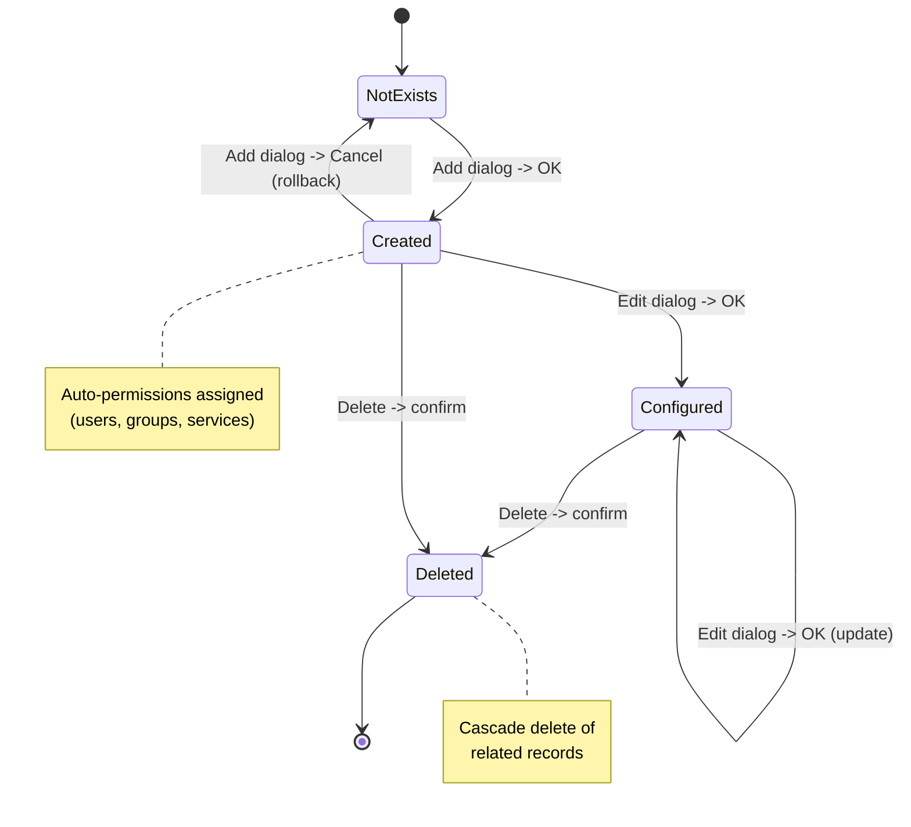
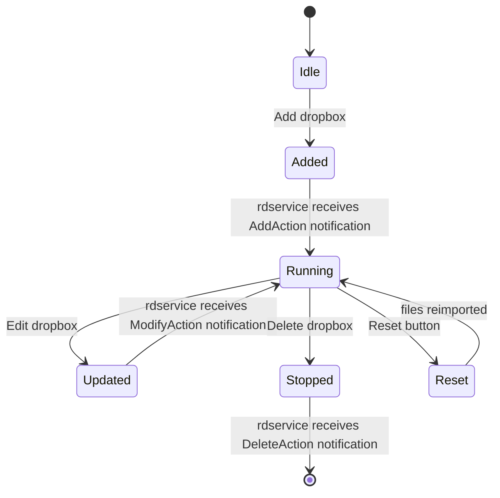

# Facts: rdadmin

## Sources of analysis

| Source | Used | Quality |
|--------|------|---------|
| Source code | yes | high (84 .cpp files, ~36007 LOC) |
| QTest tests | no | N/A (no test files for rdadmin) |
| Documentation (docs/opsguide/) | yes | high (rdadmin.xml ~2800 lines DocBook) |

---

## Use Cases (actor -> action -> effect)

| ID | Actor | Action | Effect | Source |
|----|-------|--------|--------|--------|
| UC-001 | Admin | Login with username/password | Authenticated, main menu shown | rdadmin/login.cpp, rdadmin/rdadmin.cpp |
| UC-002 | Admin | Create user | User record created with permissions to all groups; EditUser dialog opened | rdadmin/add_user.cpp:107-154 |
| UC-003 | Admin | Delete user | Cascade delete: FEED_PERMS, USER_PERMS, USERS, WEB_CONNECTIONS | rdadmin/list_users.cpp:173-256 |
| UC-004 | Admin | Create group | Group created with optional auto-permissions for all users/services | rdadmin/add_group.cpp:138-170 |
| UC-005 | Admin | Delete group | Cascade: member carts removed, AUDIO_PERMS, USER_PERMS, REPLICATOR_MAP, GROUPS deleted | rdadmin/list_groups.cpp:199-277 |
| UC-006 | Admin | Rename group | Cascade update 6-7 tables or merge into existing group | rdadmin/rename_group.cpp:124-228 |
| UC-007 | Admin | Create service | Service created; deletion blocked if logs exist | rdadmin/add_svc.cpp, list_svcs.cpp:143-170 |
| UC-008 | Admin | Delete service | Warns about owned logs count, then delegates to RDSvc::remove() | rdadmin/list_svcs.cpp:143-170 |
| UC-009 | Admin | Create station | Station created, optionally cloned from existing | rdadmin/add_station.cpp |
| UC-010 | Admin | Delete station | Delegates to RDStation::remove() | rdadmin/list_stations.cpp:134-146 |
| UC-011 | Admin | Configure station modules | Opens sub-dialogs for RDAirPlay, RDLibrary, RDLogedit, etc. | rdadmin/edit_station.cpp |
| UC-012 | Admin | Manage dropboxes | CRUD + duplicate; RIPC notifications sent on each operation | rdadmin/list_dropboxes.cpp |
| UC-013 | Admin | Reset dropbox | Clears DROPBOX_PATHS, causing re-import of existing files | rdadmin/edit_dropbox.cpp:610-623 |
| UC-014 | Admin | Manage feeds/podcasts | CRUD + repost/unpost; deletion cascades remote audio+XML+images | rdadmin/list_feeds.cpp |
| UC-015 | Admin | Configure switcher/GPIO | Matrix with primary/backup connections; input/output/GPI/GPO config | rdadmin/edit_matrix.cpp |
| UC-016 | Admin | Edit system settings | Sample rate, duplicate titles, multicast, RSS host, temp group | rdadmin/edit_system.cpp |
| UC-017 | Admin | Manage scheduler codes | CRUD; deletion cascades to DROPBOX_SCHED_CODES | rdadmin/list_schedcodes.cpp |
| UC-018 | Admin | Manage PyPAD instances | CRUD; RIPC notifications; config changes apply without rdairplay restart | rdadmin/list_pypads.cpp |
| UC-019 | Admin | Configure JACK audio | Auto-start JACK server, manage JACK clients | rdadmin/edit_jack.cpp |
| UC-020 | Admin | Test traffic/music import | Parse sample file with configured template, display results | rdadmin/test_import.cpp |
| UC-021 | Admin | Configure hotkeys | Set/clear per function, clone from another host | rdadmin/edit_hotkeys.cpp |
| UC-022 | Admin | Manage reports | CRUD; deletion cascades to REPORT_SERVICES, REPORT_STATIONS, REPORT_GROUPS | rdadmin/list_reports.cpp, edit_report.cpp |
| UC-023 | Admin | Manage replicators | CRUD; only type: Citidel X-Digital Portal | rdadmin/list_replicators.cpp, edit_replicator.cpp |
| UC-024 | Admin | Manage encoder profiles | CRUD on ENCODER_PRESETS, accessed from System Settings | rdadmin/list_encoders.cpp |
| UC-025 | Admin | Manage host variables | CRUD on %TAG% per-host string variables for macro carts | rdadmin/list_hostvars.cpp |
| UC-026 | Admin | Configure audio ports | Card selection, input/output type, mode, reference level (HPI only) | rdadmin/edit_audios.cpp |
| UC-027 | Admin | Configure serial ports | Enable/disable TTY ports, assign to matrices | rdadmin/edit_ttys.cpp |
| UC-028 | Admin | View audio resources | Read-only display of audio card capabilities | rdadmin/view_adapters.cpp |

---

## Business Rules (Gherkin)

```gherkin
# --- USER MANAGEMENT RULES ---

Rule: User self-deletion protection

  Scenario: Admin tries to delete themselves
    Given admin user "admin" is logged in
    When  admin selects "admin" and clicks Delete
    Then  system shows warning "You cannot delete yourself!"
    And   no deletion occurs

  # Source: rdadmin/list_users.cpp:180-183
  # Certainty: confirmed

Rule: User deletion blocked if set as default user on station

  Scenario: Delete user who is default on stations
    Given user "john" is DEFAULT_NAME on stations "Station1, Station2"
    When  admin tries to delete user "john"
    Then  system shows list of stations using this user
    And   message "You must change this before deleting the user"
    And   no deletion occurs

  # Source: rdadmin/list_users.cpp:196-209
  # Certainty: confirmed

Rule: User deletion cascades permissions

  Scenario: Successfully delete a user
    Given user "john" exists with group and feed permissions
    When  admin confirms deletion of "john"
    Then  FEED_PERMS records for "john" are deleted
    And   USER_PERMS records for "john" are deleted
    And   USERS record for "john" is deleted
    And   WEB_CONNECTIONS records for "john" are deleted

  # Source: rdadmin/list_users.cpp:227-256
  # Certainty: confirmed

Rule: New user gets all existing group permissions

  Scenario: Create a new user
    Given groups "Music", "Spots", "Jingles" exist
    When  admin creates user "newuser"
    Then  USER_PERMS records created for "newuser" x all 3 groups
    And   EditUser dialog opens for further configuration

  Scenario: Cancel new user creation
    Given user "newuser" was just created in DB
    When  admin cancels EditUser dialog
    Then  USER_PERMS for "newuser" are deleted
    And   USERS record for "newuser" is deleted (rollback)

  # Source: rdadmin/add_user.cpp:107-154
  # Certainty: confirmed

Rule: Admin user types are mutually exclusive

  Scenario: Set Administer System right
    Given user "admin" has Administer System ticked
    When  any operational right checkbox is shown
    Then  all operational rights are disabled/grayed out
    And   user can ONLY access RDAdmin, not other modules

  # Source: rdadmin/edit_user.cpp + docs/opsguide/rdadmin.xml:sect.rdadmin.managing_users
  # Certainty: confirmed

# --- GROUP MANAGEMENT RULES ---

Rule: Group deletion cascades all members

  Scenario: Delete group with N carts
    Given group "Spots" has 50 carts
    When  admin confirms deletion
    Then  warning shows "50 member carts will be deleted along with group"
    And   each cart is removed via RDCart::remove()
    And   AUDIO_PERMS, USER_PERMS, REPLICATOR_MAP entries deleted
    And   GROUPS record deleted

  # Source: rdadmin/list_groups.cpp:199-277
  # Certainty: confirmed

Rule: New group auto-gets all user and service permissions

  Scenario: Create group with default checkboxes
    Given checkbox "Enable Group for All Users" is checked (default)
    And   checkbox "Enable Group for All Services" is checked (default)
    When  admin creates group "NewGroup"
    Then  USER_PERMS record created per existing user
    And   AUDIO_PERMS record created per existing service

  # Source: rdadmin/add_group.cpp:164-170
  # Certainty: confirmed

Rule: Group rename can merge into existing group

  Scenario: Rename group to existing group name
    Given group "OldSpots" and group "Spots" both exist
    When  admin renames "OldSpots" to "Spots"
    Then  system asks "Do you want to combine the two?"
    And   if confirmed: CART, EVENTS, REPLICATOR_MAP, DROPBOXES updated
    And   old GROUPS, AUDIO_PERMS, USER_PERMS records deleted

  Scenario: Rename group to new name
    Given group "OldSpots" exists, "NewSpots" does not
    When  admin renames "OldSpots" to "NewSpots"
    Then  6 tables updated: CART, EVENTS, REPLICATOR_MAP, DROPBOXES, GROUPS, AUDIO_PERMS, USER_PERMS

  # Source: rdadmin/rename_group.cpp:124-228
  # Certainty: confirmed

Rule: Group cart range enforcement

  Scenario: Enforce Cart Range is enabled
    Given group has LOW_CART=100000 and HIGH_CART=199999
    And   ENFORCE_CART_RANGE is true
    When  user tries to create cart 200001 in this group
    Then  system rejects the operation

  # Source: rdadmin/edit_group.cpp + docs/opsguide/rdadmin.xml
  # Certainty: confirmed

# --- SERVICE MANAGEMENT RULES ---

Rule: Service deletion requires confirmation about owned logs

  Scenario: Delete service with existing logs
    Given service "Morning" owns 12 logs
    When  admin tries to delete "Morning"
    Then  warning shows "There are 12 logs owned by this service that will also be deleted"
    And   requires second confirmation before proceeding

  Scenario: Delete service with no logs
    Given service "Test" owns 0 logs
    When  admin confirms deletion
    Then  RDSvc::remove() deletes service and associated data

  # Source: rdadmin/list_svcs.cpp:143-170
  # Certainty: confirmed

# --- STATION MANAGEMENT RULES ---

Rule: Station can delegate CAE to another host

  Scenario: Configure remote CAE station
    Given station "Studio1" exists
    When  admin sets CAE Station to "AudioServer"
    Then  audio processing for Studio1 handled by AudioServer's CAE daemon

  # Source: rdadmin/edit_station.cpp + docs/opsguide/rdadmin.xml
  # Certainty: confirmed

# --- DROPBOX RULES ---

Rule: Dropbox date offset validation

  Scenario: Invalid date offsets
    Given Create Start Date Offset = 10
    And   Create End Date Offset = 5
    When  admin clicks OK
    Then  error "The Create EndDate Offset is less than the Create Start Date Offset!"
    And   save is blocked

  # Source: rdadmin/edit_dropbox.cpp:634-639
  # Certainty: confirmed

Rule: Dropbox CRUD sends RIPC notifications

  Scenario: Add new dropbox
    Given admin creates a dropbox on station "Studio1"
    When  EditDropbox dialog is accepted
    Then  RDNotification(DropboxType, AddAction, "Studio1") sent via RIPC
    And   rdservice receives notification and restarts dropbox monitoring

  Scenario: Delete dropbox
    Given admin deletes a dropbox
    When  DROPBOXES and DROPBOX_PATHS records deleted
    Then  RDNotification(DropboxType, DeleteAction) sent via RIPC

  # Source: rdadmin/list_dropboxes.cpp:145-241
  # Certainty: confirmed

Rule: Dropbox PathSpec must include file part

  Scenario: PathSpec without file pattern
    Given PathSpec = "/home/rd/dropbox"
    When  dropbox evaluates path
    Then  matches nothing (no file part)

  Scenario: PathSpec with wildcard
    Given PathSpec = "/home/rd/dropbox/*.mp3"
    When  dropbox evaluates path
    Then  matches all .mp3 files in directory

  # Source: docs/opsguide/rdadmin.xml:table.rdadmin.pathspec_examples
  # Certainty: confirmed

# --- FEED/PODCAST RULES ---

Rule: Feed deletion is multi-step cascade with remote cleanup

  Scenario: Delete feed with podcasts
    Given feed "MyPodcast" has 5 episodes with remote audio
    When  admin confirms deletion
    Then  1) Remote audio deleted per podcast (progress shown)
    And   2) Remote RSS XML deleted
    And   3) PODCASTS records deleted
    And   4) All images removed (remote + FEED_IMAGES)
    And   5) FEED_PERMS deleted
    And   6) SUPERFEED_MAPS deleted
    And   7) FEEDS record deleted

  # Source: rdadmin/list_feeds.cpp:243-302
  # Certainty: confirmed

Rule: Superfeed must have at least one subfeed

  Scenario: Save superfeed with no subfeeds
    Given feed is marked as superfeed
    And   subfeedNames is empty
    When  admin clicks OK
    Then  error "Superfeed must have at least one subfeed assigned!"
    And   save blocked

  # Source: rdadmin/edit_feed.cpp:658-662
  # Certainty: confirmed

Rule: Feed purge URL must be supported scheme

  Scenario: Unsupported URL scheme
    Given purge URL = "ftp://unsupported.host/path"
    When  admin clicks OK and scheme not supported by RDDelete/RDUpload
    Then  error "Audio Upload URL has unsupported scheme!"
    And   save blocked

  # Source: rdadmin/edit_feed.cpp:664-673
  # Certainty: confirmed

# --- MATRIX/SWITCHER RULES ---

Rule: Matrix connection validation

  Scenario: Invalid primary IP address
    Given matrix connection type is TCP
    When  IP address field is invalid
    Then  error "The primary IP address is invalid!"

  Scenario: Primary and backup connections identical
    Given both primary and backup use TCP
    And   same IP address and port
    When  admin saves
    Then  error "The primary and backup connections must be different!"

  Scenario: Serial port not active
    Given matrix connection type is Serial
    And   selected port is not enabled
    When  admin saves
    Then  error "The primary serial device is not active!"

  # Source: rdadmin/edit_matrix.cpp:1185-1258
  # Certainty: confirmed

# --- SYSTEM SETTINGS RULES ---

Rule: Duplicate cart titles is deprecated

  Scenario: Admin tries to disallow duplicate titles
    Given Allow Duplicate Cart Titles is currently checked
    When  admin unchecks it
    Then  deprecation warning shown with strong language
    And   if confirmed: full library scan for duplicates
    And   if duplicates found: list shown, checkbox reverted

  # Source: rdadmin/edit_system.cpp:284-418 + docs/opsguide/rdadmin.xml
  # Certainty: confirmed

Rule: System sample rate should not be changed after audio ingestion

  Scenario: Change sample rate on system with audio
    Given audio exists in the store
    When  admin changes System Sample Rate
    Then  may result in incorrect play-out of existing audio

  # Source: docs/opsguide/rdadmin.xml:warning in manage_system_settings
  # Certainty: confirmed
```

---

## Entity States

rdadmin is a pure CRUD administration application. It does not manage runtime entity states -- it only configures DB records that other modules (rdairplay, rdservice, caed, ripcd) use. There are no state machines within rdadmin itself.

However, the CRUD lifecycle of entities follows a common pattern:

### Entity CRUD Lifecycle



### Dropbox Notification Lifecycle



---

## Constraints and Limits

| Constraint | Value | Context | Source |
|-----------|-------|---------|--------|
| Max audio cards | 8 | Audio ports configuration (RD_MAX_CARDS) | rdadmin/edit_audios.h |
| Max serial ports | 8 | TTY configuration (MAX_TTYS) | rdadmin/edit_ttys.h |
| Max record decks | 8 | RDCatch configuration | rdadmin/edit_decks.h |
| Max play decks | 4 | RDCatch configuration | rdadmin/edit_decks.h |
| Max RDAirPlay log machines | 3 | Main Log, Aux1, Aux2 | rdadmin/edit_rdairplay.h:41-42 |
| Max matrices per station | 8 | Switcher configuration | rdadmin/list_matrices.h:64 |
| Multicast notification default | 239.19.255.72 | System-wide notification address | docs/opsguide/rdadmin.xml |
| Default admin login | admin / (no password) | Fresh database default | docs/opsguide/rdadmin.xml |
| Background image resolution | 1024x738 | RDAirPlay skin | docs/opsguide/rdadmin.xml |
| Group name max length | 10 chars | GROUPS.NAME column | rdadmin/add_group.cpp (QLineEdit maxLength) |
| Scheduler code max length | 10 chars | SCHED_CODES.CODE | rdadmin/add_schedcodes.cpp |
| Replicator types | 1 | Only Citidel X-Digital Portal | docs/opsguide/rdadmin.xml |
| JACK auto-start | On Rivendell service restart | Runs under root (UID 0) | docs/opsguide/rdadmin.xml |

---

## Configuration (QSettings)

rdadmin does NOT use QSettings for its own configuration. All settings are stored in MySQL database tables:

| Table | Purpose | Key settings |
|-------|---------|-------------|
| SYSTEM | System-wide settings | SAMPLE_RATE, DUP_CART_TITLES, NOTIFICATION_ADDRESS, MAX_POST_LENGTH, TEMP_CART_GROUP, RSS_PROCESSOR_STATION |
| STATIONS | Per-host settings | DEFAULT_NAME, IPV4_ADDRESS, EDITOR_PATH, REPORT_EDITOR, TIME_OFFSET, STARTUP_CART, HEARTBEAT_CART, FILTER_MODE |
| USERS | User accounts | LOGIN_NAME, PASSWORD, LOCAL_AUTH, PAM_SERVICE, WEBAPI_TIMEOUT, ADMIN_CONFIG_PRIV, ADMIN_RSS_PRIV |
| GROUPS | Cart groups | LOW_CART, HIGH_CART, ENFORCE_CART_RANGE, DEFAULT_CART_TYPE, DEFAULT_CUT_LIFE, COLOR, ENABLE_NOW_NEXT |
| SERVICES | Radio services | LOG_NAME_TEMPLATE, LOG_DESCRIPTION_TEMPLATE, VOICETRACK_GROUP, AUTOSPOT_GROUP, CHAIN_LOG, AUTO_REFRESH |
| RDAIRPLAY | RDAirPlay per-station | CARD/PORT per channel, START_RML/STOP_RML, EXIT_PASSWORD, MODE_CONTROL, SEG_MANUAL/FORCED, SKIN_PATH |
| RDLIBRARY | RDLibrary per-station | INPUT_CARD/PORT, OUTPUT_CARD/PORT, MAX_LENGTH, VOX_THRESHOLD, TRIM_THRESHOLD, RIPPER_DEVICE |
| RDLOGEDIT | RDLogEdit per-station | INPUT_CARD/PORT, OUTPUT_CARD/PORT, FORMAT, BITRATE, NORMALIZATION_LEVEL, ENABLE_SECOND_START |
| RDPANEL | RDPanel per-station | Mirrors RDAIRPLAY structure for panels |
| DROPBOXES | Auto-import configs | PATH, GROUP_NAME, TO_CART, DELETE_SOURCE, NORMALIZE_LEVEL, AUTOTRIM_LEVEL, METADATA_PATTERN |
| MATRICES | Switcher/GPIO devices | TYPE, PORT_TYPE, IP_ADDRESS, IP_PORT, CARD, INPUTS, OUTPUTS, GPIS, GPOS |
| FEEDS | RSS/podcast feeds | CHANNEL_TITLE, BASE_URL, PURGE_URL, IS_SUPERFEED, CHANNEL_IMAGE_ID |
| REPLICATORS | Content replication | TYPE, STATION_NAME, URL, FORMAT, NORMALIZE_LEVEL |
| JACK_CLIENTS | JACK audio clients | DESCRIPTION, COMMAND_LINE |
| ENCODER_PRESETS | Audio format presets | NAME, FORMAT, CHANNELS, SAMPLE_RATE, BIT_RATE |

---

## Linux-specific Components

| Component | Where used (class/method) | Function | Replacement priority |
|-----------|--------------------------|----------|---------------------|
| JACK Audio Server | EditJack, EditJackClient | JACK server auto-start, client management | CRITICAL |
| Serial/TTY ports (/dev/ttyS*) | EditTtys | Serial port config for switcher devices | HIGH |
| CD-ROM ripping (cdparanoia) | EditRDLibrary | Paranoia level, device path, ISRC read | HIGH |
| AudioScience HPI | EditAudioPorts | Audio card type/mode/level configuration | CRITICAL |
| PAM (Pluggable Authentication) | EditUser | External authentication delegation | HIGH |
| Syslog | EditDropbox | Dropbox event logging to syslog | MEDIUM |
| sendmail(1) | EditSystem (Origin E-Mail) | System email sending interface | MEDIUM |
| MySQL/MariaDB | All dialogs (RDSqlQuery) | Direct SQL for all CRUD operations | CRITICAL |
| File paths (/home/rd/, /dev/) | EditDropbox, EditRDLibrary | Unix filesystem paths for dropboxes, CD devices | HIGH |

---

## Conflicts Between Sources

### TYP 1 -- In documentation, behavior in other modules

| Fact from docs | XML section | Status |
|----------------|-------------|--------|
| Autofill carts longest-first algorithm | configure_autofill_carts | logic_in_rdlogmanager |
| RDAirPlay dual output alternation | configure_rdairplay | logic_in_rdairplay |
| Restart after unclean shutdown | start_stop_settings | logic_in_rdairplay |
| Purge expired cuts mechanism | manage_groups | logic_in_rdservice |

Note: rdadmin only configures DB records. Runtime behavior implemented in respective modules.

### TYP 2 -- In code, not in documentation

| Fact from code | File | Status |
|----------------|------|--------|
| User self-deletion protection | list_users.cpp:180 | undocumented_guard |
| User cannot be deleted if default on station | list_users.cpp:196 | undocumented_guard |
| New user auto-gets all group permissions | add_user.cpp:130 | undocumented_default |
| New group auto-gets all user/service permissions | add_group.cpp:164 | undocumented_default |
| Creation rollback on cancel (user, group) | add_user.cpp:141, add_group.cpp | undocumented_safety |
| Feed deletion remote audio/XML cleanup | list_feeds.cpp:243-302 | needs_doc |
| Dropbox/PyPAD RIPC notification on CRUD | list_dropboxes.cpp, list_pypads.cpp | needs_doc |
| EditStation deferred save (1ms QTimer) | edit_station.cpp | implementation_detail |
| Group rename cascade across 6-7 tables | rename_group.cpp:155-227 | partially_documented |

### TYP 3 -- Code vs documentation conflict

| Code says | Docs say | Resolution |
|-----------|----------|------------|
| Group delete with carts: warns about count, then deletes all member carts + group | Docs describe warning but do not explicitly state carts are deleted | code_wins -- code clearly removes carts |

### TYP 4 -- Edge cases from tests

No QTest files exist for rdadmin. No test-derived edge cases available.
