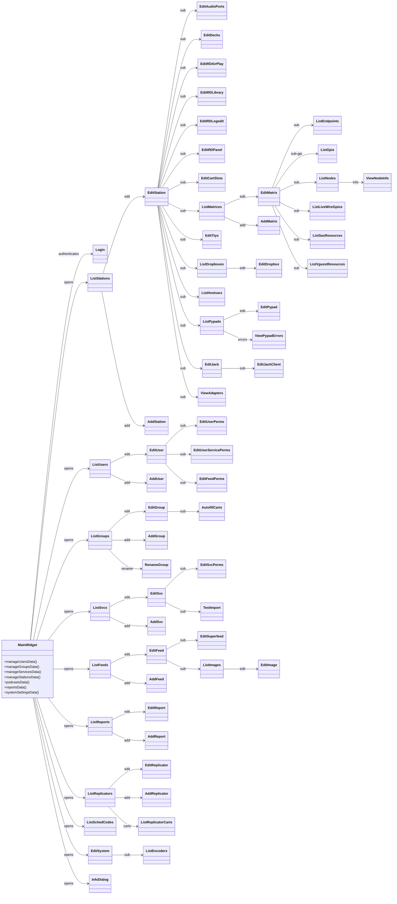

# Inventory: rdadmin

## Statystyki

| Typ | Liczba |
|-----|--------|
| Klasy lacznie | 81 |
| QMainWindow subclassy | 0 |
| QDialog subclassy (RDDialog) | 79 |
| QWidget subclassy (RDWidget) | 2 |
| QObject subclassy (serwisy) | 0 |
| QAbstractItemModel subclassy | 0 |
| QThread subclassy | 0 |
| Plain C++ (non-Qt) klasy | 0 |
| Active Record (CRUD) klasy | 0 |
| Sygnaly zdefiniowane | 0 |
| Q_PROPERTY zdefiniowane | 0 |
| Tabele DB uzywane bezposrednio | 37 |

**Uwaga:** rdadmin NIE posiada wlasnych klas domenowych ani sygnalow. Wszystkie 81 klas to dialogi CRUD (RDDialog) korzystajace bezposrednio z SQL (RDSqlQuery) i delegujace logike biznesowa do librd.

---

## Diagram klas -- dziedziczenie

```mermaid
classDiagram
    direction TB

    class RDWidget
    class RDDialog

    RDWidget <|-- MainWidget
    RDWidget <|-- ImportFields

    RDDialog <|-- AddFeed
    RDDialog <|-- AddGroup
    RDDialog <|-- AddHostvar
    RDDialog <|-- AddMatrix
    RDDialog <|-- AddReplicator
    RDDialog <|-- AddReport
    RDDialog <|-- AddSchedCode
    RDDialog <|-- AddStation
    RDDialog <|-- AddSvc
    RDDialog <|-- AddUser

    RDDialog <|-- EditStation
    RDDialog <|-- EditSystem
    RDDialog <|-- EditUser
    RDDialog <|-- EditGroup
    RDDialog <|-- EditFeed
    RDDialog <|-- EditMatrix
    RDDialog <|-- EditDropbox
    RDDialog <|-- EditSvc
    RDDialog <|-- EditReport
    RDDialog <|-- EditReplicator
    RDDialog <|-- EditRDAirPlay
    RDDialog <|-- EditRDLibrary
    RDDialog <|-- EditRDLogedit
    RDDialog <|-- EditRDPanel

    RDDialog <|-- ListStations
    RDDialog <|-- ListUsers
    RDDialog <|-- ListGroups
    RDDialog <|-- ListSvcs
    RDDialog <|-- ListFeeds
    RDDialog <|-- ListMatrices
    RDDialog <|-- ListReports
    RDDialog <|-- ListDropboxes
    RDDialog <|-- ListReplicators
    RDDialog <|-- ListPypads
    RDDialog <|-- ListSchedCodes

    RDDialog <|-- Login
    RDDialog <|-- InfoDialog
    RDDialog <|-- License
```

## Diagram klas -- zaleznosci domenowe

---

## Klasy -- szczegolowy inwentarz

<!-- ============================================================ -->
<!-- CORE / SYSTEM -->
<!-- ============================================================ -->

### MainWidget

**Typ Qt:** RDWidget (glowny widget, nie QMainWindow)
**Plik:** `rdadmin.h` + `rdadmin.cpp`
**Odpowiedzialnosc:** Glowne okno aplikacji rdadmin. Wyswietla menu administracyjne z przyciskami do zarzadzania wszystkimi encjami systemowymi. Punkt wejscia do calej hierarchii dialogow.

**Sygnaly:** Brak
**Sloty:**
| Slot | Parametry | Widocznosc | Efekt |
|------|-----------|------------|-------|
| manageUsersData | void | private | Otwiera ListUsers |
| manageGroupsData | void | private | Otwiera ListGroups |
| manageServicesData | void | private | Otwiera ListSvcs |
| manageStationsData | void | private | Otwiera ListStations |
| systemSettingsData | void | private | Otwiera EditSystem |
| reportsData | void | private | Otwiera ListReports |
| podcastsData | void | private | Otwiera ListFeeds |
| manageSchedCodes | void | private | Otwiera ListSchedCodes |
| manageReplicatorsData | void | private | Otwiera ListReplicators |
| systemInfoData | void | private | Otwiera InfoDialog |
| quitMainWidget | void | private | Zamyka aplikacje |

**Stan (Q_PROPERTY):** Brak
**Publiczne API:** sizeHint(), sizePolicy()
**Enums:** Brak
**Reguly biznesowe:**
- Regula: Sprawdza wersje DB przed otwarciem -- porownuje STATIONS.NAME z aktualnym hostem
- Zrodlo: konstruktor / rdadmin.cpp

**Linux-specific:** Brak
**Zaleznosci od innych klas tego artifaktu:** Login, ListUsers, ListGroups, ListSvcs, ListStations, ListFeeds, ListReports, ListSchedCodes, ListReplicators, EditSystem, InfoDialog
**Zaleznosci od shared libraries:** RDWidget, RDApplication, RDSqlQuery

---

### Login

**Typ Qt:** RDDialog
**Plik:** `login.h` + `login.cpp`
**Odpowiedzialnosc:** Dialog logowania -- pobiera nazwe uzytkownika i haslo. Prosta walidacja tresci formularza.

**Sygnaly:** Brak
**Sloty:**
| Slot | Parametry | Widocznosc | Efekt |
|------|-----------|------------|-------|
| okData | void | private | Akceptuje dane logowania |
| cancelData | void | private | Anuluje logowanie |

**Stan (Q_PROPERTY):** Brak
**Publiczne API:** Konstruktor przyjmuje referencje do QString (name, password)
**Enums:** Brak
**Reguly biznesowe:** Brak (walidacja hasel w librd)
**Linux-specific:** Brak
**Zaleznosci od shared libraries:** RDDialog

---

### InfoDialog

**Typ Qt:** RDDialog
**Plik:** `info_dialog.h` + `info_dialog.cpp`
**Odpowiedzialnosc:** Wyswietla informacje o systemie Rivendell -- wersje, bannery XPM, dostep do kredytow i licencji.

**Sygnaly:** Brak
**Sloty:**
| Slot | Parametry | Widocznosc | Efekt |
|------|-----------|------------|-------|
| viewCreditsData | void | private | Pokazuje okno kredytow (AUTHORS) |
| viewLicenseData | void | private | Otwiera dialog License |
| closeData | void | private | Zamyka dialog |

**Zaleznosci od innych klas tego artifaktu:** License
**Zaleznosci od shared libraries:** RDDialog

---

### License

**Typ Qt:** RDDialog
**Plik:** `license.h` + `license.cpp`
**Odpowiedzialnosc:** Wyswietla pelen tekst licencji GPL v2 w scrollowalnym oknie.

**Sygnaly:** Brak
**Sloty:**
| Slot | Parametry | Widocznosc | Efekt |
|------|-----------|------------|-------|
| closeData | void | private | Zamyka dialog |

**Zaleznosci od shared libraries:** RDDialog

---

### HelpAudioPorts

**Typ Qt:** RDDialog
**Plik:** `help_audios.h` + `help_audios.cpp`
**Odpowiedzialnosc:** Dialog pomocy dla konfiguracji portow audio -- wyswietla tekst objasnien.

**Sygnaly:** Brak
**Sloty:**
| Slot | Parametry | Widocznosc | Efekt |
|------|-----------|------------|-------|
| closeData | void | private | Zamyka dialog |

**Zaleznosci od shared libraries:** RDDialog

---

### EditSystem

**Typ Qt:** RDDialog
**Plik:** `edit_system.h` + `edit_system.cpp`
**Odpowiedzialnosc:** Edycja globalnych ustawien systemu Rivendell: sample rate, duplikaty tytulow, maks. rozmiar uploadu, stacja RSS, grupa tymczasowych kartow, adres powiadomien.

**Sygnaly:** Brak
**Sloty:**
| Slot | Parametry | Widocznosc | Efekt |
|------|-----------|------------|-------|
| duplicatesCheckedData | bool state | private | Toggle kontroli duplikatow tytulow |
| saveData | void | private | Zapisuje ustawienia bez zamykania |
| encodersData | void | private | Otwiera ListEncoders |
| okData | void | private | Zapisuje i zamyka |
| cancelData | void | private | Anuluje zmiany |

**Tabela DB:** SYSTEM (single-row), CART (skan duplikatow)
**Reguly biznesowe:**
- Regula: Kontrola duplikatow tytulow jest DEPRECATED -- wyswietla ostrzezenie o niestabilnosci
- Zrodlo: duplicatesCheckedData
- Regula: Zmiana sample rate wymaga potwierdzenia -- wplywa na caly system
- Zrodlo: okData

**Zaleznosci od innych klas tego artifaktu:** ListEncoders
**Zaleznosci od shared libraries:** RDDialog, RDSystem, RDSqlQuery

---

<!-- ============================================================ -->
<!-- USERS -->
<!-- ============================================================ -->

### ListUsers

**Typ Qt:** RDDialog
**Plik:** `list_users.h` + `list_users.cpp`
**Odpowiedzialnosc:** Lista uzytkownikow systemu z operacjami CRUD. Wyswietla login, imie, telefon, opis. Ikony: admin, local, RSS, zwykly uzytkownik.

**Sygnaly:** Brak
**Sloty:**
| Slot | Parametry | Widocznosc | Efekt |
|------|-----------|------------|-------|
| addData | void | private | Otwiera AddUser |
| editData | void | private | Otwiera EditUser dla wybranego |
| deleteData | void | private | Usuwa uzytkownika (USERS, USER_PERMS, FEED_PERMS, WEB_CONNECTIONS) |
| doubleClickedData | void | private | Alias editData |
| closeData | void | private | Zamyka dialog |

**Tabela DB:** USERS, USER_PERMS, FEED_PERMS, WEB_CONNECTIONS, STATIONS
**Reguly biznesowe:**
- Regula: Usuwanie uzytkownika kasuje kaskadowo jego uprawnienia (USER_PERMS, FEED_PERMS) i sesje (WEB_CONNECTIONS)
- Zrodlo: deleteData
- Regula: Nie mozna usunac uzytkownika ktory jest DEFAULT_NAME na stacji
- Zrodlo: deleteData (sprawdza STATIONS.USER_NAME)

**Zaleznosci od innych klas tego artifaktu:** AddUser, EditUser
**Zaleznosci od shared libraries:** RDDialog, RDSqlQuery

---

### AddUser

**Typ Qt:** RDDialog
**Plik:** `add_user.h` + `add_user.cpp`
**Odpowiedzialnosc:** Tworzenie nowego uzytkownika. Formularz nazwy logowania z walidacja unikalnosci.

**Sygnaly:** Brak
**Sloty:**
| Slot | Parametry | Widocznosc | Efekt |
|------|-----------|------------|-------|
| okData | void | private | Tworzy uzytkownika w DB (INSERT INTO USERS) |
| cancelData | void | private | Anuluje |

**Tabela DB:** USERS, GROUPS, USER_PERMS
**Reguly biznesowe:**
- Regula: Nowy uzytkownik automatycznie dostaje uprawnienia do wszystkich istniejacych grup
- Zrodlo: okData (INSERT INTO USER_PERMS per kazda grupe)
- Regula: Jesli tworzenie uzytkownika sie nie uda, rollback -- usuniecie USER_PERMS i USERS
- Zrodlo: okData

**Zaleznosci od shared libraries:** RDDialog, RDUser, RDSqlQuery

---

### EditUser

**Typ Qt:** RDDialog
**Plik:** `edit_user.h` + `edit_user.cpp`
**Odpowiedzialnosc:** Edycja uzytkownika -- dane osobowe, haslo, uprawnienia granularne (20+ checkboxow), PAM auth, Web API.

**Sygnaly:** Brak
**Sloty:**
| Slot | Parametry | Widocznosc | Efekt |
|------|-----------|------------|-------|
| localAuthToggledData | void | private | Toggle PAM vs lokalna autentykacja |
| passwordData | void | private | Otwiera dialog zmiany hasla |
| groupsData | void | private | Otwiera EditUserPerms |
| servicesData | void | private | Otwiera EditUserServicePerms |
| feedsData | void | private | Otwiera EditFeedPerms |
| adminConfigToggledData | bool | private | Toggle admin config |
| adminRssToggledData | bool | private | Toggle admin RSS |
| adminToggled | void | private | Aktualizuje stan checkboxow admin |
| okData | void | private | Zapisuje zmiany |
| cancelData | void | private | Anuluje |

**Reguly biznesowe:**
- Regula: Admin Config priv kontroluje dostep do zarzadzania stacjami, matrycami, systemem
- Regula: Admin RSS priv kontroluje dostep do zarzadzania feedami/podcastami
- Regula: Przelaczenie LOCAL_AUTH ukrywa/pokazuje pole PAM_SERVICE

**Zaleznosci od innych klas tego artifaktu:** EditUserPerms, EditUserServicePerms, EditFeedPerms
**Zaleznosci od shared libraries:** RDDialog, RDUser

---

### EditUserPerms

**Typ Qt:** RDDialog
**Plik:** `edit_user_perms.h` + `edit_user_perms.cpp`
**Odpowiedzialnosc:** Edycja uprawnien uzytkownika do grup kartow. Interfejs dual-list selector (dostepne / przypisane grupy).

**Sygnaly:** Brak
**Sloty:**
| Slot | Parametry | Widocznosc | Efekt |
|------|-----------|------------|-------|
| okData | void | private | Synchronizuje USER_PERMS (insert/delete per grupe) |
| cancelData | void | private | Anuluje |

**Tabela DB:** USER_PERMS, GROUPS
**Zaleznosci od shared libraries:** RDDialog, RDListSelector, RDUser, RDSqlQuery

---

### EditUserServicePerms

**Typ Qt:** RDDialog
**Plik:** `edit_user_service_perms.h` + `edit_user_service_perms.cpp`
**Odpowiedzialnosc:** Edycja uprawnien uzytkownika do serwisow. Dual-list selector.

**Sygnaly:** Brak
**Sloty:**
| Slot | Parametry | Widocznosc | Efekt |
|------|-----------|------------|-------|
| okData | void | private | Synchronizuje USER_SERVICE_PERMS |
| cancelData | void | private | Anuluje |

**Tabela DB:** USER_SERVICE_PERMS, SERVICES
**Zaleznosci od shared libraries:** RDDialog, RDListSelector, RDSqlQuery

---

<!-- ============================================================ -->
<!-- GROUPS -->
<!-- ============================================================ -->

### ListGroups

**Typ Qt:** RDDialog
**Plik:** `list_groups.h` + `list_groups.cpp`
**Odpowiedzialnosc:** Lista grup kartow z operacjami CRUD + rename + raport. Wyswietla nazwe, opis, zakres kartow, typ.

**Sygnaly:** Brak
**Sloty:**
| Slot | Parametry | Widocznosc | Efekt |
|------|-----------|------------|-------|
| addData | void | private | Otwiera AddGroup |
| editData | void | private | Otwiera EditGroup |
| renameData | void | private | Otwiera RenameGroup |
| deleteData | void | private | Usuwa grupe (kaskada: AUDIO_PERMS, USER_PERMS, REPLICATOR_MAP) |
| reportData | void | private | Generuje raport grupy |
| closeData | void | private | Zamyka |

**Tabela DB:** GROUPS, CART, AUDIO_PERMS, USER_PERMS, REPLICATOR_MAP
**Reguly biznesowe:**
- Regula: Nie mozna usunac grupy ktora ma karty (sprawdza CART.GROUP_NAME)
- Zrodlo: deleteData

**Zaleznosci od innych klas tego artifaktu:** AddGroup, EditGroup, RenameGroup
**Zaleznosci od shared libraries:** RDDialog, RDSqlQuery

---

### AddGroup

**Typ Qt:** RDDialog
**Plik:** `add_group.h` + `add_group.cpp`
**Odpowiedzialnosc:** Tworzenie nowej grupy kartow. Formularz z nazwa grupy.

**Sygnaly:** Brak
**Sloty:**
| Slot | Parametry | Widocznosc | Efekt |
|------|-----------|------------|-------|
| okData | void | private | Tworzy grupe (INSERT INTO GROUPS) |
| cancelData | void | private | Anuluje |

**Tabela DB:** GROUPS, USERS, USER_PERMS, SERVICES, AUDIO_PERMS
**Reguly biznesowe:**
- Regula: Nowa grupa automatycznie dostaje uprawnienia do wszystkich uzytkownikow (USER_PERMS) i serwisow (AUDIO_PERMS)
- Regula: Rollback przy bledzie -- usuwa USER_PERMS, AUDIO_PERMS, GROUPS

**Zaleznosci od shared libraries:** RDDialog, RDGroup, RDSqlQuery

---

### EditGroup

**Typ Qt:** RDDialog
**Plik:** `edit_group.h` + `edit_group.cpp`
**Odpowiedzialnosc:** Edycja grupy kartow -- nazwa, opis, zakres numerow, typ domyslny, czas zycia cutow, kolor, uprawnienia do serwisow.

**Sygnaly:** Brak
**Sloty:**
| Slot | Parametry | Widocznosc | Efekt |
|------|-----------|------------|-------|
| lowCartChangedData | void | private | Aktualizuje walidacje zakresu kartow |
| colorData | void | private | Otwiera color picker |
| cutLifeEnabledData | void | private | Toggle domyslnego czasu zycia |
| purgeEnabledData | void | private | Toggle auto-purge |
| okData | void | private | Zapisuje i synchronizuje AUDIO_PERMS |
| cancelData | void | private | Anuluje |

**Tabela DB:** GROUPS, AUDIO_PERMS, SERVICES
**Reguly biznesowe:**
- Regula: Zakres LOW_CART musi byc <= HIGH_CART
- Regula: ENFORCE_CART_RANGE blokuje tworzenie kartow poza zakresem
- Regula: DEFAULT_CUT_LIFE = -1 oznacza bezterminowo

**Zaleznosci od shared libraries:** RDDialog, RDGroup, RDSqlQuery

---

### RenameGroup

**Typ Qt:** RDDialog
**Plik:** `rename_group.h` + `rename_group.cpp`
**Odpowiedzialnosc:** Zmiana nazwy grupy kartow -- aktualizuje wszystkie tabele referencyjne kaskadowo.

**Sygnaly:** Brak
**Sloty:**
| Slot | Parametry | Widocznosc | Efekt |
|------|-----------|------------|-------|
| okData | void | private | Zmienia nazwe we wszystkich tabelach |
| cancelData | void | private | Anuluje |

**Tabela DB:** GROUPS, CART, EVENTS, REPLICATOR_MAP, DROPBOXES, AUDIO_PERMS, USER_PERMS
**Reguly biznesowe:**
- Regula: Rename to operacja kaskadowa -- aktualizuje GROUP_NAME w 7 tabelach: CART, EVENTS, REPLICATOR_MAP, DROPBOXES, GROUPS, AUDIO_PERMS, USER_PERMS
- Regula: Najpierw tworzy nowa grupe, przenosi referencje, usuwa stara

**Zaleznosci od shared libraries:** RDDialog, RDSqlQuery

---

### AutofillCarts

**Typ Qt:** RDDialog
**Plik:** `autofill_carts.h` + `autofill_carts.cpp`
**Odpowiedzialnosc:** Zarzadzanie lista kartow autouzupelniania dla serwisu. Dodawanie/usuwanie kartow z listy AUTOFILLS.

**Sygnaly:** Brak
**Sloty:**
| Slot | Parametry | Widocznosc | Efekt |
|------|-----------|------------|-------|
| addData | void | private | Dodaje kart do autofill |
| deleteData | void | private | Usuwa kart z autofill |
| okData | void | private | Zapisuje zmiany |
| cancelData | void | private | Anuluje |

**Tabela DB:** AUTOFILLS, CART
**Zaleznosci od shared libraries:** RDDialog, RDSqlQuery

---

<!-- ============================================================ -->
<!-- STATIONS -->
<!-- ============================================================ -->

### ListStations

**Typ Qt:** RDDialog
**Plik:** `list_stations.h` + `list_stations.cpp`
**Odpowiedzialnosc:** Lista stacji roboczych systemu z operacjami Add/Edit/Delete.

**Sygnaly:** Brak
**Sloty:**
| Slot | Parametry | Widocznosc | Efekt |
|------|-----------|------------|-------|
| addData | void | private | Otwiera AddStation |
| editData | void | private | Otwiera EditStation |
| deleteData | void | private | Usuwa stacje (deleguje do librd) |
| closeData | void | private | Zamyka |

**Tabela DB:** STATIONS
**Zaleznosci od innych klas tego artifaktu:** AddStation, EditStation
**Zaleznosci od shared libraries:** RDDialog, RDSqlQuery

---

### AddStation

**Typ Qt:** RDDialog
**Plik:** `add_station.h` + `add_station.cpp`
**Odpowiedzialnosc:** Tworzenie nowej stacji roboczej. Formularz z nazwa stacji + opcjonalne klonowanie z istniejaceej.

**Sygnaly:** Brak
**Sloty:**
| Slot | Parametry | Widocznosc | Efekt |
|------|-----------|------------|-------|
| okData | void | private | Tworzy stacje (deleguje do librd RDStation::create) |
| cancelData | void | private | Anuluje |

**Tabela DB:** STATIONS
**Reguly biznesowe:**
- Regula: Mozna klonowac ustawienia z istniejaceej stacji (kopiuje encoder values)
- Zrodlo: CloneEncoderValues

**Zaleznosci od shared libraries:** RDDialog, RDStation, RDSqlQuery

---

### EditStation

**Typ Qt:** RDDialog
**Plik:** `edit_station.h` + `edit_station.cpp`
**Odpowiedzialnosc:** Edycja stacji roboczej -- hub do wszystkich konfiguracji per-station: audio, decks, airplay, library, logedit, panel, cart slots, JACK, TTY, dropboxy, hostvars, matryce, PyPAD. Najbardziej zlozony dialog w rdadmin.

**Sygnaly:** Brak
**Sloty:**
| Slot | Parametry | Widocznosc | Efekt |
|------|-----------|------------|-------|
| heartbeatToggledData | bool | private | Toggle heartbeat monitoring |
| heartbeatClickedData | void | private | Wybor karta heartbeat |
| caeStationActivatedData | int | private | Zmiana CAE station |
| editLibraryData | void | private | Otwiera EditRDLibrary |
| editDeckData | void | private | Otwiera EditDecks |
| editAirPlayData | void | private | Otwiera EditRDAirPlay |
| editPanelData | void | private | Otwiera EditRDPanel |
| editLogEditData | void | private | Otwiera EditRDLogedit |
| editCartSlotsData | void | private | Otwiera EditCartSlots |
| viewAdaptersData | void | private | Otwiera ViewAdapters |
| editAudioData | void | private | Otwiera EditAudioPorts |
| editTtyData | void | private | Otwiera EditTtys |
| editSwitcherData | void | private | Otwiera ListMatrices |
| editHostvarsData | void | private | Otwiera ListHostvars |
| editDropboxesData | void | private | Otwiera ListDropboxes |
| jackSettingsData | void | private | Otwiera EditJack |
| pypadInstancesData | void | private | Otwiera ListPypads |
| startCartClickedData | void | private | Wybor karta startowego |
| stopCartClickedData | void | private | Wybor karta stop |
| okData | void | private | Zapisuje konfiguracje stacji |
| cancelData | void | private | Anuluje |

**Tabela DB:** STATIONS, USERS
**Reguly biznesowe:**
- Regula: CAE Station moze byc inna niz host station (delegacja audio do innego serwera)
- Regula: HTTP Station -- proxy do obslugi web requests
- Regula: Heartbeat cart uruchamiany periodycznie do monitorowania zywotnosci stacji

**Zaleznosci od innych klas tego artifaktu:** EditRDLibrary, EditDecks, EditRDAirPlay, EditRDPanel, EditRDLogedit, EditCartSlots, ViewAdapters, EditAudioPorts, EditTtys, ListMatrices, ListHostvars, ListDropboxes, EditJack, ListPypads
**Zaleznosci od shared libraries:** RDDialog, RDStation, RDSqlQuery, RDCartDialog

---

### EditAudioPorts

**Typ Qt:** RDDialog
**Plik:** `edit_audios.h` + `edit_audios.cpp`
**Odpowiedzialnosc:** Konfiguracja portow audio stacji -- wybor karty audio, mapowanie wejsc/wyjsc, poziomy.

**Sygnaly:** Brak
**Sloty:**
| Slot | Parametry | Widocznosc | Efekt |
|------|-----------|------------|-------|
| cardSelectedData | int | private | Zmiana aktywnej karty audio |
| inputMapData | void | private | Mapowanie wejsc |
| helpData | void | private | Otwiera HelpAudioPorts |
| closeData | void | private | Zamyka i zapisuje |

**Zaleznosci od innych klas tego artifaktu:** HelpAudioPorts
**Zaleznosci od shared libraries:** RDDialog, RDAudioPort

---

### EditDecks

**Typ Qt:** RDDialog
**Plik:** `edit_decks.h` + `edit_decks.cpp`
**Odpowiedzialnosc:** Konfiguracja deckow nagrywania i odtwarzania stacji -- formaty audio, karty, porty monitoringu, eventy na zdarzenia.

**Sygnaly:** Brak
**Sloty:**
| Slot | Parametry | Widocznosc | Efekt |
|------|-----------|------------|-------|
| recordDeckActivatedData | int | private | Zmiana aktywnego decku nagrywania |
| playDeckActivatedData | int | private | Zmiana aktywnego decku odtwarzania |
| recordCardChangedData | int | private | Zmiana karty nagrywania |
| formatActivatedData | int | private | Zmiana formatu nagrywania |
| stationActivatedData | int | private | Zmiana stacji switcher |
| matrixActivatedData | int | private | Zmiana matrycy |
| eventCartSelectedData | void | private | Wybor karta dla eventu |
| closeData | void | private | Zamyka |

**Tabela DB:** DECK_EVENTS, OUTPUTS, MATRICES, SWITCHER_NODES, STATIONS
**Zaleznosci od shared libraries:** RDDialog, RDDeck, RDSqlQuery

---

### EditCartSlots

**Typ Qt:** RDDialog
**Plik:** `edit_cartslots.h` + `edit_cartslots.cpp`
**Odpowiedzialnosc:** Konfiguracja slotow kartow stacji -- ilosc, przypisanie kartow, tryby, serwisy.

**Sygnaly:** Brak
**Sloty:**
| Slot | Parametry | Widocznosc | Efekt |
|------|-----------|------------|-------|
| quantityChangedData | int | private | Zmiana liczby slotow |
| slotChangedData | int | private | Zmiana aktywnego slotu |
| cardChangedData | int | private | Zmiana karty audio |
| modeData | void | private | Zmiana trybu slotu |
| cartActionData | void | private | Akcja na karcie |
| cartSelectData | void | private | Wybor karta |
| closeData | void | private | Zamyka |

**Tabela DB:** CARTSLOTS, SERVICES
**Zaleznosci od shared libraries:** RDDialog, RDSqlQuery

---

### EditJack

**Typ Qt:** RDDialog
**Plik:** `edit_jack.h` + `edit_jack.cpp`
**Odpowiedzialnosc:** Konfiguracja JACK audio server na stacji -- start automatyczny, lista klientow JACK.

**Sygnaly:** Brak
**Sloty:**
| Slot | Parametry | Widocznosc | Efekt |
|------|-----------|------------|-------|
| startJackData | void | private | Toggle auto-start JACK |
| addData | void | private | Dodaje klienta JACK |
| editData | void | private | Edytuje klienta JACK |
| deleteData | void | private | Usuwa klienta JACK |
| okData | void | private | Zapisuje |
| cancelData | void | private | Anuluje |

**Tabela DB:** JACK_CLIENTS
**Linux-specific:**
| Komponent | Uzycie | Priorytet zastapienia |
|-----------|--------|----------------------|
| JACK Audio | Konfiguracja JACK server i klientow | CRITICAL |

**Zaleznosci od innych klas tego artifaktu:** EditJackClient
**Zaleznosci od shared libraries:** RDDialog, RDSqlQuery

---

### EditJackClient

**Typ Qt:** RDDialog
**Plik:** `edit_jack_client.h` + `edit_jack_client.cpp`
**Odpowiedzialnosc:** Edycja pojedynczego klienta JACK -- opis i linia polecen.

**Sygnaly:** Brak
**Sloty:**
| Slot | Parametry | Widocznosc | Efekt |
|------|-----------|------------|-------|
| okData | void | private | Zapisuje |
| cancelData | void | private | Anuluje |

**Zaleznosci od shared libraries:** RDDialog

---

### EditHotkeys

**Typ Qt:** RDDialog
**Plik:** `edit_hotkeys.h` + `edit_hotkeys.cpp`
**Odpowiedzialnosc:** Konfiguracja skrotow klawiszowych per stacja i modul (RDAirPlay, RDPanel). Przechwytywanie klawiszy.

**Sygnaly:** Brak
**Sloty:**
| Slot | Parametry | Widocznosc | Efekt |
|------|-----------|------------|-------|
| save | void | private | Zapisuje skroty (UPDATE RDHOTKEYS) |
| cancel | void | private | Anuluje |
| keyPressEvent | QKeyEvent* | private | Przechwycenie nacisniecia klawisza |
| keyReleaseEvent | QKeyEvent* | private | Przechwycenie zwolnienia klawisza |

**Tabela DB:** RDHOTKEYS, STATIONS
**Zaleznosci od shared libraries:** RDDialog, RDSqlQuery

---

### EditTtys

**Typ Qt:** RDDialog
**Plik:** `edit_ttys.h` + `edit_ttys.cpp`
**Odpowiedzialnosc:** Konfiguracja portow TTY/serial stacji -- przypisanie do matryc przelaczania.

**Sygnaly:** Brak
**Sloty:**
| Slot | Parametry | Widocznosc | Efekt |
|------|-----------|------------|-------|
| idSelectedData | int | private | Wybor portu TTY |
| enableButtonData | void | private | Toggle wlaczenia portu |
| closeData | void | private | Zamyka |

**Tabela DB:** MATRICES
**Linux-specific:**
| Komponent | Uzycie | Priorytet zastapienia |
|-----------|--------|----------------------|
| TTY/Serial ports | Konfiguracja /dev/ttyS* | HIGH |

**Zaleznosci od shared libraries:** RDDialog, RDTTYDevice, RDSqlQuery

---

### EditRDAirPlay

**Typ Qt:** RDDialog
**Plik:** `edit_rdairplay.h` + `edit_rdairplay.cpp`
**Odpowiedzialnosc:** Konfiguracja RDAirPlay per stacja -- kanaly log (Main, Aux1, Aux2), tryby startu, VirtualLogi, panele, GPIO, skin, haslo wyjscia.

**Sygnaly:** Brak
**Sloty:**
| Slot | Parametry | Widocznosc | Efekt |
|------|-----------|------------|-------|
| audioSettingsChangedData | void | private | Zmiana ustawien audio |
| editGpiosData | void | private | Otwiera EditChannelGpios |
| exitPasswordChangedData | QString | private | Zmiana hasla wyjscia |
| logActivatedData | int | private | Zmiana logu glownego |
| virtualLogActivatedData | int | private | Zmiana logu wirtualnego |
| virtualModeActivatedData | int | private | Zmiana trybu VL |
| startModeChangedData | void | private | Zmiana trybu startu |
| selectData | void | private | Wybor karta/timera |
| editHotKeys | void | private | Otwiera EditHotkeys |
| selectSkinData | void | private | Wybor skinu (sciezka do pliku) |
| modeControlActivatedData | int | private | Zmiana trybu kontroli |
| logStartupModeActivatedData | int | private | Zmiana trybu startu logu |
| okData | void | private | Zapisuje |
| cancelData | void | private | Anuluje |

**Tabela DB:** SERVICE_PERMS
**Zaleznosci od innych klas tego artifaktu:** EditChannelGpios, EditHotkeys
**Zaleznosci od shared libraries:** RDDialog, RDAirPlayConf, RDSqlQuery

---

### EditRDLibrary

**Typ Qt:** RDDialog
**Plik:** `edit_rdlibrary.h` + `edit_rdlibrary.cpp`
**Odpowiedzialnosc:** Konfiguracja RDLibrary per stacja -- format nagrywania, kanal, ISRC, serwer CD-rippera, sciezki tymczasowe.

**Sygnaly:** Brak
**Sloty:**
| Slot | Parametry | Widocznosc | Efekt |
|------|-----------|------------|-------|
| formatData | void | private | Wybor formatu nagrywania |
| cdServerTypeData | int | private | Zmiana typu serwera CD |
| okData | void | private | Zapisuje |
| cancelData | void | private | Anuluje |

**Linux-specific:**
| Komponent | Uzycie | Priorytet zastapienia |
|-----------|--------|----------------------|
| CD-ROM ripping | Konfiguracja serwera CD (cdparanoia) | HIGH |

**Zaleznosci od shared libraries:** RDDialog, RDLibraryConf

---

### EditRDLogedit

**Typ Qt:** RDDialog
**Plik:** `edit_rdlogedit.h` + `edit_rdlogedit.cpp`
**Odpowiedzialnosc:** Konfiguracja RDLogEdit per stacja -- format nagrywania voicetrackow, domyslne markery.

**Sygnaly:** Brak
**Sloty:**
| Slot | Parametry | Widocznosc | Efekt |
|------|-----------|------------|-------|
| formatData | void | private | Wybor formatu |
| selectStartData | void | private | Wybor domyslnego startu |
| selectEndData | void | private | Wybor domyslnego konca |
| okData | void | private | Zapisuje |
| cancelData | void | private | Anuluje |

**Zaleznosci od shared libraries:** RDDialog, RDLogeditConf

---

### EditRDPanel

**Typ Qt:** RDDialog
**Plik:** `edit_rdpanel.h` + `edit_rdpanel.cpp`
**Odpowiedzialnosc:** Konfiguracja RDPanel per stacja -- liczba paneli stacji/uzytkownika, skin, GPIO.

**Sygnaly:** Brak
**Sloty:**
| Slot | Parametry | Widocznosc | Efekt |
|------|-----------|------------|-------|
| selectSkinData | void | private | Wybor skinu |
| okData | void | private | Zapisuje |
| cancelData | void | private | Anuluje |

**Tabela DB:** SERVICE_PERMS
**Zaleznosci od shared libraries:** RDDialog, RDAirPlayConf, RDSqlQuery

---

### ViewAdapters

**Typ Qt:** RDDialog
**Plik:** `view_adapters.h` + `view_adapters.cpp`
**Odpowiedzialnosc:** Podglad adapterow audio (kart dzwiekowych) zainstalowanych na stacji. Read-only.

**Sygnaly:** Brak
**Sloty:**
| Slot | Parametry | Widocznosc | Efekt |
|------|-----------|------------|-------|
| closeData | void | private | Zamyka |

**Zaleznosci od shared libraries:** RDDialog

---

<!-- ============================================================ -->
<!-- SERVICES -->
<!-- ============================================================ -->

### ListSvcs

**Typ Qt:** RDDialog
**Plik:** `list_svcs.h` + `list_svcs.cpp`
**Odpowiedzialnosc:** Lista serwisow (programow radiowych) z operacjami CRUD.

**Sygnaly:** Brak
**Sloty:**
| Slot | Parametry | Widocznosc | Efekt |
|------|-----------|------------|-------|
| addData | void | private | Otwiera AddSvc |
| editData | void | private | Otwiera EditSvc |
| deleteData | void | private | Usuwa serwis (sprawdza LOGS) |
| closeData | void | private | Zamyka |

**Tabela DB:** SERVICES, LOGS
**Reguly biznesowe:**
- Regula: Nie mozna usunac serwisu ktory ma logi (sprawdza LOGS.SERVICE)
- Zrodlo: deleteData

**Zaleznosci od innych klas tego artifaktu:** AddSvc, EditSvc
**Zaleznosci od shared libraries:** RDDialog, RDSvc, RDSqlQuery

---

### AddSvc

**Typ Qt:** RDDialog
**Plik:** `add_svc.h` + `add_svc.cpp`
**Odpowiedzialnosc:** Tworzenie nowego serwisu. Formularz z nazwa + opcjonalny szablon z istniejacego.

**Sygnaly:** Brak
**Sloty:**
| Slot | Parametry | Widocznosc | Efekt |
|------|-----------|------------|-------|
| okData | void | private | Tworzy serwis (deleguje do librd RDSvc::create) |
| cancelData | void | private | Anuluje |

**Tabela DB:** SERVICES
**Zaleznosci od shared libraries:** RDDialog, RDSvc, RDSqlQuery

---

### EditSvc

**Typ Qt:** RDDialog
**Plik:** `edit_svc.h` + `edit_svc.cpp`
**Odpowiedzialnosc:** Edycja serwisu -- opis, grupy track/autospot, import traffic/music (sciezki, szablony, komendy), uprawnienia stacji, autofill, testowanie importu.

**Sygnaly:** Brak
**Sloty:**
| Slot | Parametry | Widocznosc | Efekt |
|------|-----------|------------|-------|
| autofillData | void | private | Otwiera AutofillCarts |
| enableHostsData | void | private | Otwiera EditSvcPerms |
| trafficData | void | private | Otwiera TestImport dla traffic |
| musicData | void | private | Otwiera TestImport dla music |
| trafficCopyData | void | private | Kopiuje szablon traffic |
| musicCopyData | void | private | Kopiuje szablon music |
| textChangedData | void | private | Zmiana tekstu |
| tfcTemplateActivatedData | int | private | Zmiana szablonu traffic |
| musTemplateActivatedData | int | private | Zmiana szablonu music |
| okData | void | private | Zapisuje |
| cancelData | void | private | Anuluje |

**Tabela DB:** GROUPS, IMPORT_TEMPLATES
**Zaleznosci od innych klas tego artifaktu:** AutofillCarts, EditSvcPerms, TestImport
**Zaleznosci od shared libraries:** RDDialog, RDSvc, RDSqlQuery

---

### EditSvcPerms

**Typ Qt:** RDDialog
**Plik:** `edit_svc_perms.h` + `edit_svc_perms.cpp`
**Odpowiedzialnosc:** Edycja uprawnien serwisu na stacjach. Dual-list selector (SERVICE_PERMS).

**Sygnaly:** Brak
**Sloty:**
| Slot | Parametry | Widocznosc | Efekt |
|------|-----------|------------|-------|
| okData | void | private | Synchronizuje SERVICE_PERMS |
| cancelData | void | private | Anuluje |

**Tabela DB:** SERVICE_PERMS, STATIONS
**Zaleznosci od shared libraries:** RDDialog, RDListSelector, RDSqlQuery

---

### TestImport

**Typ Qt:** RDDialog
**Plik:** `test_import.h` + `test_import.cpp`
**Odpowiedzialnosc:** Testowanie importu danych traffic/music -- parsuje plik wedlug szablonu i wyswietla wynik w tabeli.

**Sygnaly:** Brak
**Sloty:**
| Slot | Parametry | Widocznosc | Efekt |
|------|-----------|------------|-------|
| selectData | void | private | Wybor pliku do importu |
| importData | void | private | Uruchomienie parsowania |
| dateChangedData | void | private | Zmiana daty importu |
| closeData | void | private | Zamyka (czysci IMPORTER_LINES) |

**Tabela DB:** IMPORTER_LINES
**Zaleznosci od shared libraries:** RDDialog, RDSvc, RDSqlQuery

---

### ImportFields

**Typ Qt:** RDWidget (nie RDDialog)
**Plik:** `importfields.h` + `importfields.cpp`
**Odpowiedzialnosc:** Widget pol importu -- reuzywany komponent z polami offset/length dla konfiguracji parsowania traffic/music.

**Sygnaly:** Brak
**Sloty:**
| Slot | Parametry | Widocznosc | Efekt |
|------|-----------|------------|-------|
| valueChangedData | void | private | Emituje zmiane wartosci |

**Zaleznosci od shared libraries:** RDWidget

---

<!-- ============================================================ -->
<!-- REPORTS -->
<!-- ============================================================ -->

### ListReports

**Typ Qt:** RDDialog
**Plik:** `list_reports.h` + `list_reports.cpp`
**Odpowiedzialnosc:** Lista raportow systemowych z operacjami CRUD.

**Sygnaly:** Brak
**Sloty:**
| Slot | Parametry | Widocznosc | Efekt |
|------|-----------|------------|-------|
| addData | void | private | Otwiera AddReport |
| editData | void | private | Otwiera EditReport |
| deleteData | void | private | Usuwa raport (REPORTS, REPORT_SERVICES, REPORT_STATIONS) |
| closeData | void | private | Zamyka |

**Tabela DB:** REPORTS, REPORT_SERVICES, REPORT_STATIONS
**Zaleznosci od innych klas tego artifaktu:** AddReport, EditReport
**Zaleznosci od shared libraries:** RDDialog, RDSqlQuery

---

### AddReport

**Typ Qt:** RDDialog
**Plik:** `add_report.h` + `add_report.cpp`
**Odpowiedzialnosc:** Tworzenie nowego raportu.

**Sygnaly:** Brak
**Sloty:**
| Slot | Parametry | Widocznosc | Efekt |
|------|-----------|------------|-------|
| okData | void | private | Tworzy raport (INSERT INTO REPORTS) |
| cancelData | void | private | Anuluje |

**Tabela DB:** REPORTS
**Zaleznosci od shared libraries:** RDDialog, RDSqlQuery

---

### EditReport

**Typ Qt:** RDDialog
**Plik:** `edit_report.h` + `edit_report.cpp`
**Odpowiedzialnosc:** Edycja raportu -- typ eksportu, sciezki, filtry (serwisy, stacje, grupy), format (leading zeros, cyfry karta).

**Sygnaly:** Brak
**Sloty:**
| Slot | Parametry | Widocznosc | Efekt |
|------|-----------|------------|-------|
| leadingZerosToggled | void | private | Toggle leading zeros |
| genericEventsToggledData | void | private | Toggle eksportu generic events |
| okData | void | private | Zapisuje i synchronizuje permisje (REPORT_SERVICES, REPORT_STATIONS, REPORT_GROUPS) |
| cancelData | void | private | Anuluje |

**Tabela DB:** REPORTS, REPORT_SERVICES, REPORT_STATIONS, REPORT_GROUPS, SERVICES, STATIONS, GROUPS
**Zaleznosci od shared libraries:** RDDialog, RDReport, RDSqlQuery

---

### ListSchedCodes

**Typ Qt:** RDDialog
**Plik:** `list_schedcodes.h` + `list_schedcodes.cpp`
**Odpowiedzialnosc:** Lista kodow harmonogramu (scheduler codes) z operacjami CRUD.

**Sygnaly:** Brak
**Sloty:**
| Slot | Parametry | Widocznosc | Efekt |
|------|-----------|------------|-------|
| addData | void | private | Otwiera AddSchedCode |
| editData | void | private | Otwiera EditSchedCode |
| deleteData | void | private | Usuwa kod (SCHED_CODES, DROPBOX_SCHED_CODES) |
| closeData | void | private | Zamyka |

**Tabela DB:** SCHED_CODES, DROPBOX_SCHED_CODES
**Zaleznosci od innych klas tego artifaktu:** AddSchedCode, EditSchedCode
**Zaleznosci od shared libraries:** RDDialog, RDSqlQuery

---

### AddSchedCode

**Typ Qt:** RDDialog
**Plik:** `add_schedcodes.h` + `add_schedcodes.cpp`
**Odpowiedzialnosc:** Dodawanie nowego kodu harmonogramu.

**Sygnaly:** Brak
**Sloty:**
| Slot | Parametry | Widocznosc | Efekt |
|------|-----------|------------|-------|
| okData | void | private | INSERT INTO SCHED_CODES |
| cancelData | void | private | Anuluje |

**Tabela DB:** SCHED_CODES
**Zaleznosci od shared libraries:** RDDialog, RDSqlQuery

---

### EditSchedCode

**Typ Qt:** RDDialog
**Plik:** `edit_schedcodes.h` + `edit_schedcodes.cpp`
**Odpowiedzialnosc:** Edycja opisu kodu harmonogramu.

**Sygnaly:** Brak
**Sloty:**
| Slot | Parametry | Widocznosc | Efekt |
|------|-----------|------------|-------|
| okData | void | private | UPDATE SCHED_CODES |
| cancelData | void | private | Anuluje |

**Tabela DB:** SCHED_CODES
**Zaleznosci od shared libraries:** RDDialog, RDSqlQuery

---

### ListEncoders

**Typ Qt:** RDDialog
**Plik:** `list_encoders.h` + `list_encoders.cpp`
**Odpowiedzialnosc:** Lista presetow encoderow (formatow audio). Read-only z Add/Edit/Delete.

**Sygnaly:** Brak
**Sloty:**
| Slot | Parametry | Widocznosc | Efekt |
|------|-----------|------------|-------|
| addData | void | private | Dodaje preset |
| editData | void | private | Edytuje preset |
| deleteData | void | private | Usuwa preset |
| closeData | void | private | Zamyka |

**Tabela DB:** ENCODER_PRESETS
**Zaleznosci od shared libraries:** RDDialog, RDSqlQuery

---

### ListHostvars

**Typ Qt:** RDDialog
**Plik:** `list_hostvars.h` + `list_hostvars.cpp`
**Odpowiedzialnosc:** Lista zmiennych hosta per stacja z operacjami CRUD.

**Sygnaly:** Brak
**Sloty:**
| Slot | Parametry | Widocznosc | Efekt |
|------|-----------|------------|-------|
| addData | void | private | Otwiera AddHostvar |
| editData | void | private | Otwiera EditHostvar |
| deleteData | void | private | Usuwa zmienna (DELETE FROM HOSTVARS) |
| okData | void | private | Zamyka z zapisem |
| cancelData | void | private | Anuluje |

**Tabela DB:** HOSTVARS
**Zaleznosci od innych klas tego artifaktu:** AddHostvar, EditHostvar
**Zaleznosci od shared libraries:** RDDialog, RDSqlQuery

---

### AddHostvar

**Typ Qt:** RDDialog
**Plik:** `add_hostvar.h` + `add_hostvar.cpp`
**Odpowiedzialnosc:** Dodawanie nowej zmiennej hosta.

**Sygnaly:** Brak
**Sloty:**
| Slot | Parametry | Widocznosc | Efekt |
|------|-----------|------------|-------|
| okData | void | private | Zwraca dane zmiennej |
| cancelData | void | private | Anuluje |

**Zaleznosci od shared libraries:** RDDialog

---

### EditHostvar

**Typ Qt:** RDDialog
**Plik:** `edit_hostvar.h` + `edit_hostvar.cpp`
**Odpowiedzialnosc:** Edycja zmiennej hosta -- nazwa, wartosc, uwaga.

**Sygnaly:** Brak
**Sloty:**
| Slot | Parametry | Widocznosc | Efekt |
|------|-----------|------------|-------|
| okData | void | private | Zwraca zmienione dane |
| cancelData | void | private | Anuluje |

**Zaleznosci od shared libraries:** RDDialog

---

<!-- ============================================================ -->
<!-- FEEDS / PODCASTS -->
<!-- ============================================================ -->

### ListFeeds

**Typ Qt:** RDDialog
**Plik:** `list_feeds.h` + `list_feeds.cpp`
**Odpowiedzialnosc:** Lista kanalow RSS/podcast z operacjami CRUD + repost/unpost epizodow.

**Sygnaly:** Brak
**Sloty:**
| Slot | Parametry | Widocznosc | Efekt |
|------|-----------|------------|-------|
| addData | void | private | Otwiera AddFeed |
| editData | void | private | Otwiera EditFeed |
| deleteData | void | private | Usuwa feed kaskadowo (PODCASTS, FEED_IMAGES, FEED_PERMS, SUPERFEED_MAPS, FEEDS) |
| repostData | void | private | Repostuje epizody (oznacza do ponownej publikacji) |
| unpostData | void | private | Wycofuje epizody |
| closeData | void | private | Zamyka |

**Tabela DB:** FEEDS, FEED_IMAGES, FEED_PERMS, SUPERFEED_MAPS, PODCASTS
**Reguly biznesowe:**
- Regula: Usuwanie feeda wymaga potwierdzenia i kaskadowo usuwa: PODCASTS, FEED_IMAGES, FEED_PERMS, SUPERFEED_MAPS
- Regula: Repost/unpost operuja na audio plikach na serwerze (upload/delete)
- Regula: Ostrzezenie przy usuwaniu feeda z podcastami na serwerze (dane audio moga byc utracone)

**Zaleznosci od innych klas tego artifaktu:** AddFeed, EditFeed
**Zaleznosci od shared libraries:** RDDialog, RDFeed, RDSqlQuery

---

### AddFeed

**Typ Qt:** RDDialog
**Plik:** `add_feed.h` + `add_feed.cpp`
**Odpowiedzialnosc:** Tworzenie nowego kanalu RSS/podcast. Formularz z nazwa klucza i opcjonalnym szabllonem.

**Sygnaly:** Brak
**Sloty:**
| Slot | Parametry | Widocznosc | Efekt |
|------|-----------|------------|-------|
| keynameChangedData | QString | private | Walidacja nazwy klucza (format) |
| okData | void | private | Tworzy feed |
| cancelData | void | private | Anuluje |

**Zaleznosci od shared libraries:** RDDialog, RDFeed

---

### EditFeed

**Typ Qt:** RDDialog
**Plik:** `edit_feed.h` + `edit_feed.cpp`
**Odpowiedzialnosc:** Edycja kanalu RSS/podcast -- tytul, opis, kategoria, link, copyright, jezyk, base URL, XML (header/channel/item), format audio uploadu, normalizacja, superfeed, obrazy.

**Sygnaly:** Brak
**Sloty:**
| Slot | Parametry | Widocznosc | Efekt |
|------|-----------|------------|-------|
| schemaActivatedData | int | private | Zmiana schematu RSS |
| checkboxToggledData | bool | private | Toggle opcji |
| purgeUrlChangedData | QString | private | Zmiana URL purge |
| selectSubfeedsData | void | private | Otwiera EditSuperfeed |
| setFormatData | void | private | Wybor formatu uploadu |
| listImagesData | void | private | Otwiera ListImages |
| copyHeaderXmlData | void | private | Kopiuje szablon XML header |
| copyChannelXmlData | void | private | Kopiuje szablon XML channel |
| copyItemXmlData | void | private | Kopiuje szablon XML item |
| okData | void | private | Zapisuje |
| cancelData | void | private | Anuluje |

**Zaleznosci od innych klas tego artifaktu:** EditSuperfeed, ListImages
**Zaleznosci od shared libraries:** RDDialog, RDFeed, RDSqlQuery

---

### EditFeedPerms

**Typ Qt:** RDDialog
**Plik:** `edit_feed_perms.h` + `edit_feed_perms.cpp`
**Odpowiedzialnosc:** Edycja uprawnien uzytkownika do kanalow RSS. Dual-list selector.

**Sygnaly:** Brak
**Sloty:**
| Slot | Parametry | Widocznosc | Efekt |
|------|-----------|------------|-------|
| okData | void | private | Synchronizuje FEED_PERMS |
| cancelData | void | private | Anuluje |

**Tabela DB:** FEED_PERMS, FEEDS
**Zaleznosci od shared libraries:** RDDialog, RDListSelector, RDSqlQuery

---

### EditSuperfeed

**Typ Qt:** RDDialog
**Plik:** `edit_superfeed.h` + `edit_superfeed.cpp`
**Odpowiedzialnosc:** Edycja superfeed (agregacja wielu feedow w jeden). Dual-list selector dostepne/przypisane feedy.

**Sygnaly:** Brak
**Sloty:**
| Slot | Parametry | Widocznosc | Efekt |
|------|-----------|------------|-------|
| okData | void | private | Synchronizuje SUPERFEED_MAPS |
| cancelData | void | private | Anuluje |

**Tabela DB:** SUPERFEED_MAPS, FEEDS
**Zaleznosci od shared libraries:** RDDialog, RDListSelector, RDSqlQuery

---

### ListImages

**Typ Qt:** RDDialog
**Plik:** `list_images.h` + `list_images.cpp`
**Odpowiedzialnosc:** Lista obrazow/grafik kanalu podcast. Dodawanie, podglad, usuwanie.

**Sygnaly:** Brak
**Sloty:**
| Slot | Parametry | Widocznosc | Efekt |
|------|-----------|------------|-------|
| addData | void | private | Upload nowego obrazu |
| viewData | void | private | Podglad obrazu |
| deleteData | void | private | Usuwa obraz |
| closeData | void | private | Zamyka |

**Tabela DB:** FEED_IMAGES, FEEDS, PODCASTS
**Zaleznosci od innych klas tego artifaktu:** EditImage
**Zaleznosci od shared libraries:** RDDialog, RDSqlQuery

---

### EditImage

**Typ Qt:** RDDialog
**Plik:** `edit_image.h` + `edit_image.cpp`
**Odpowiedzialnosc:** Edycja metadanych obrazu (opis) z podgladem.

**Sygnaly:** Brak
**Sloty:**
| Slot | Parametry | Widocznosc | Efekt |
|------|-----------|------------|-------|
| okData | void | private | UPDATE FEED_IMAGES |
| cancelData | void | private | Anuluje |

**Tabela DB:** FEED_IMAGES, FEEDS
**Zaleznosci od shared libraries:** RDDialog, RDSqlQuery

---

<!-- ============================================================ -->
<!-- DROPBOXES -->
<!-- ============================================================ -->

### ListDropboxes

**Typ Qt:** RDDialog
**Plik:** `list_dropboxes.h` + `list_dropboxes.cpp`
**Odpowiedzialnosc:** Lista dropboxow (auto-importerow) per stacja z operacjami CRUD + duplikacja.

**Sygnaly:** Brak
**Sloty:**
| Slot | Parametry | Widocznosc | Efekt |
|------|-----------|------------|-------|
| addData | void | private | Tworzy nowy dropbox |
| editData | void | private | Otwiera EditDropbox |
| duplicateData | void | private | Duplikuje dropbox (kopia konfiguracji) |
| deleteData | void | private | Usuwa dropbox (DROPBOX_PATHS, DROPBOXES) |
| closeData | void | private | Zamyka |

**Tabela DB:** DROPBOXES, DROPBOX_PATHS, GROUPS
**Zaleznosci od innych klas tego artifaktu:** EditDropbox
**Zaleznosci od shared libraries:** RDDialog, RDSqlQuery

---

### EditDropbox

**Typ Qt:** RDDialog
**Plik:** `edit_dropbox.h` + `edit_dropbox.cpp`
**Odpowiedzialnosc:** Edycja dropboxa -- sciezka monitorowania, grupa docelowa, normalizacja, autotrim, segue, daty, wzorzec metadanych, logowanie, sched codes.

**Sygnaly:** Brak
**Sloty:**
| Slot | Parametry | Widocznosc | Efekt |
|------|-----------|------------|-------|
| selectPathData | void | private | Wybor sciezki monitorowania |
| pathChangedData | QString | private | Zmiana sciezki |
| selectCartData | void | private | Wybor karta docelowego |
| selectLogPathData | void | private | Wybor sciezki logu |
| schedcodesData | void | private | Edycja kodow harmonogramu |
| normalizationToggledData | bool | private | Toggle normalizacji |
| autotrimToggledData | bool | private | Toggle autotrim |
| segueToggledData | bool | private | Toggle segue |
| createDatesToggledData | bool | private | Toggle dat tworzenia |
| resetData | void | private | Reset ustawien |
| okData | void | private | Zapisuje (UPDATE DROPBOXES, sync DROPBOX_SCHED_CODES) |
| cancelData | void | private | Anuluje |

**Tabela DB:** DROPBOXES, DROPBOX_PATHS, DROPBOX_SCHED_CODES, GROUPS
**Zaleznosci od shared libraries:** RDDialog, RDDropbox, RDSqlQuery

---

<!-- ============================================================ -->
<!-- REPLICATORS -->
<!-- ============================================================ -->

### ListReplicators

**Typ Qt:** RDDialog
**Plik:** `list_replicators.h` + `list_replicators.cpp`
**Odpowiedzialnosc:** Lista replikatorow z operacjami CRUD + podglad kartow.

**Sygnaly:** Brak
**Sloty:**
| Slot | Parametry | Widocznosc | Efekt |
|------|-----------|------------|-------|
| addData | void | private | Otwiera AddReplicator |
| editData | void | private | Otwiera EditReplicator |
| deleteData | void | private | Usuwa replikator kaskadowo (REPLICATOR_MAP, REPL_CART_STATE, REPL_CUT_STATE, REPLICATORS) |
| listData | void | private | Otwiera ListReplicatorCarts |
| closeData | void | private | Zamyka |

**Tabela DB:** REPLICATORS, REPLICATOR_MAP, REPL_CART_STATE, REPL_CUT_STATE
**Zaleznosci od innych klas tego artifaktu:** AddReplicator, EditReplicator, ListReplicatorCarts
**Zaleznosci od shared libraries:** RDDialog, RDSqlQuery

---

### AddReplicator

**Typ Qt:** RDDialog
**Plik:** `add_replicator.h` + `add_replicator.cpp`
**Odpowiedzialnosc:** Tworzenie nowego replikatora.

**Sygnaly:** Brak
**Sloty:**
| Slot | Parametry | Widocznosc | Efekt |
|------|-----------|------------|-------|
| okData | void | private | INSERT INTO REPLICATORS |
| cancelData | void | private | Anuluje |

**Tabela DB:** REPLICATORS
**Zaleznosci od shared libraries:** RDDialog, RDSqlQuery

---

### EditReplicator

**Typ Qt:** RDDialog
**Plik:** `edit_replicator.h` + `edit_replicator.cpp`
**Odpowiedzialnosc:** Edycja replikatora -- opis, typ, stacja, format, URL, normalizacja, mapowanie grup.

**Sygnaly:** Brak
**Sloty:**
| Slot | Parametry | Widocznosc | Efekt |
|------|-----------|------------|-------|
| setFormatData | void | private | Wybor formatu audio |
| normalizeCheckData | void | private | Toggle normalizacji |
| okData | void | private | Zapisuje i synchronizuje REPLICATOR_MAP |
| cancelData | void | private | Anuluje |

**Tabela DB:** REPLICATORS, REPLICATOR_MAP, STATIONS, GROUPS
**Zaleznosci od shared libraries:** RDDialog, RDReplicator, RDSqlQuery

---

### ListReplicatorCarts

**Typ Qt:** RDDialog
**Plik:** `list_replicator_carts.h` + `list_replicator_carts.cpp`
**Odpowiedzialnosc:** Lista kartow replikatora ze statusem replikacji. Repost pojedynczego lub wszystkich.

**Sygnaly:** Brak
**Sloty:**
| Slot | Parametry | Widocznosc | Efekt |
|------|-----------|------------|-------|
| repostData | void | private | Repost wybranego karta |
| repostAllData | void | private | Repost wszystkich kartow |
| refreshTimeoutData | void | private | Auto-refresh listy |
| closeData | void | private | Zamyka |

**Tabela DB:** REPL_CART_STATE, CART
**Zaleznosci od shared libraries:** RDDialog, RDSqlQuery

---

<!-- ============================================================ -->
<!-- PYPAD -->
<!-- ============================================================ -->

### ListPypads

**Typ Qt:** RDDialog
**Plik:** `list_pypads.h` + `list_pypads.cpp`
**Odpowiedzialnosc:** Lista instancji PyPAD (Program Associated Data) per stacja.

**Sygnaly:** Brak
**Sloty:**
| Slot | Parametry | Widocznosc | Efekt |
|------|-----------|------------|-------|
| addData | void | private | INSERT INTO PYPAD_INSTANCES |
| editData | void | private | Otwiera EditPypad |
| deleteData | void | private | DELETE FROM PYPAD_INSTANCES |
| errorData | void | private | Otwiera ViewPypadErrors |
| closeData | void | private | Zamyka |

**Tabela DB:** PYPAD_INSTANCES
**Zaleznosci od innych klas tego artifaktu:** EditPypad, ViewPypadErrors
**Zaleznosci od shared libraries:** RDDialog, RDSqlQuery

---

### EditPypad

**Typ Qt:** RDDialog
**Plik:** `edit_pypad.h` + `edit_pypad.cpp`
**Odpowiedzialnosc:** Edycja instancji PyPAD -- sciezka skryptu i konfiguracja.

**Sygnaly:** Brak
**Sloty:**
| Slot | Parametry | Widocznosc | Efekt |
|------|-----------|------------|-------|
| okData | void | private | UPDATE PYPAD_INSTANCES |
| cancelData | void | private | Anuluje |

**Tabela DB:** PYPAD_INSTANCES
**Zaleznosci od shared libraries:** RDDialog, RDSqlQuery

---

### ViewPypadErrors

**Typ Qt:** RDDialog
**Plik:** `view_pypad_errors.h` + `view_pypad_errors.cpp`
**Odpowiedzialnosc:** Podglad bledow instancji PyPAD (read-only tekst).

**Sygnaly:** Brak
**Sloty:**
| Slot | Parametry | Widocznosc | Efekt |
|------|-----------|------------|-------|
| closeData | void | private | Zamyka |

**Tabela DB:** PYPAD_INSTANCES (SELECT ERROR_TEXT)
**Zaleznosci od shared libraries:** RDDialog, RDSqlQuery

---

<!-- ============================================================ -->
<!-- MATRICES / HARDWARE -->
<!-- ============================================================ -->

### ListMatrices

**Typ Qt:** RDDialog
**Plik:** `list_matrices.h` + `list_matrices.cpp`
**Odpowiedzialnosc:** Lista matryc przelaczania audio per stacja z operacjami CRUD.

**Sygnaly:** Brak
**Sloty:**
| Slot | Parametry | Widocznosc | Efekt |
|------|-----------|------------|-------|
| addData | void | private | Otwiera AddMatrix |
| editData | void | private | Otwiera EditMatrix |
| deleteData | void | private | Usuwa matryce kaskadowo (MATRICES, INPUTS, OUTPUTS, SWITCHER_NODES, GPIS, GPOS, VGUEST_RESOURCES) |
| closeData | void | private | Zamyka |

**Tabela DB:** MATRICES, INPUTS, OUTPUTS, SWITCHER_NODES, GPIS, GPOS, VGUEST_RESOURCES
**Reguly biznesowe:**
- Regula: Usuwanie matrycy kaskadowo usuwa wszystkie sub-encje (INPUTS, OUTPUTS, GPIS, GPOS, SWITCHER_NODES, VGUEST_RESOURCES)

**Zaleznosci od innych klas tego artifaktu:** AddMatrix, EditMatrix
**Zaleznosci od shared libraries:** RDDialog, RDSqlQuery

---

### AddMatrix

**Typ Qt:** RDDialog
**Plik:** `add_matrix.h` + `add_matrix.cpp`
**Odpowiedzialnosc:** Dodawanie nowej matrycy przelaczania do stacji.

**Sygnaly:** Brak
**Sloty:**
| Slot | Parametry | Widocznosc | Efekt |
|------|-----------|------------|-------|
| okData | void | private | INSERT INTO MATRICES |
| cancelData | void | private | Anuluje |

**Tabela DB:** MATRICES
**Reguly biznesowe:**
- Regula: Numer matrycy musi byc unikalny per stacja (sprawdza MATRICES.MATRIX per STATION_NAME)

**Zaleznosci od shared libraries:** RDDialog, RDMatrix, RDSqlQuery

---

### EditMatrix

**Typ Qt:** RDDialog
**Plik:** `edit_matrix.h` + `edit_matrix.cpp`
**Odpowiedzialnosc:** Edycja matrycy przelaczania -- typ, porty, IP, credentials, GPIO, endpointy, wezly LiveWire, zasoby SAS/vGuest. Hub do sub-dialogow hardware.

**Sygnaly:** Brak
**Sloty:**
| Slot | Parametry | Widocznosc | Efekt |
|------|-----------|------------|-------|
| portTypeActivatedData | int | private | Zmiana typu portu glownego |
| portType2ActivatedData | int | private | Zmiana typu portu 2 |
| inputsButtonData | void | private | Otwiera ListEndpoints (inputs) |
| outputsButtonData | void | private | Otwiera ListEndpoints (outputs) |
| xpointsButtonData | void | private | Widok crosspoints |
| gpisButtonData | void | private | Otwiera ListGpis (GPI) |
| gposButtonData | void | private | Otwiera ListGpis (GPO) |
| livewireButtonData | void | private | Otwiera ListNodes |
| livewireGpioButtonData | void | private | Otwiera ListLiveWireGpios |
| vguestRelaysButtonData | void | private | Otwiera ListVguestResources (relays) |
| vguestDisplaysButtonData | void | private | Otwiera ListVguestResources (displays) |
| sasResourcesButtonData | void | private | Otwiera ListSasResources |
| startCartData | void | private | Wybor start cart |
| stopCartData | void | private | Wybor stop cart |
| okData | void | private | Zapisuje (WriteMatrix, WriteGpioTable) |
| cancelData | void | private | Anuluje |

**Tabela DB:** MATRICES
**Zaleznosci od innych klas tego artifaktu:** ListEndpoints, ListGpis, ListNodes, ListLiveWireGpios, ListVguestResources, ListSasResources
**Zaleznosci od shared libraries:** RDDialog, RDMatrix, RDSqlQuery

---

### ListEndpoints

**Typ Qt:** RDDialog
**Plik:** `list_endpoints.h` + `list_endpoints.cpp`
**Odpowiedzialnosc:** Lista endpointow (wejsc lub wyjsc) matrycy z opcja edycji nazw.

**Sygnaly:** Brak
**Sloty:**
| Slot | Parametry | Widocznosc | Efekt |
|------|-----------|------------|-------|
| editData | void | private | Otwiera EditEndpoint |
| okData | void | private | Zamyka |
| cancelData | void | private | Anuluje |

**Tabela DB:** INPUTS, OUTPUTS
**Zaleznosci od innych klas tego artifaktu:** EditEndpoint
**Zaleznosci od shared libraries:** RDDialog, RDSqlQuery

---

### EditEndpoint

**Typ Qt:** RDDialog
**Plik:** `edit_endpoint.h` + `edit_endpoint.cpp`
**Odpowiedzialnosc:** Edycja nazwy endpointu matrycy (input lub output).

**Sygnaly:** Brak
**Sloty:**
| Slot | Parametry | Widocznosc | Efekt |
|------|-----------|------------|-------|
| okData | void | private | Zapisuje |
| cancelData | void | private | Anuluje |

**Zaleznosci od shared libraries:** RDDialog

---

### ListGpis

**Typ Qt:** RDDialog
**Plik:** `list_gpis.h` + `list_gpis.cpp`
**Odpowiedzialnosc:** Lista GPI (General Purpose Input) lub GPO (General Purpose Output) matrycy z edycja triggerow.

**Sygnaly:** Brak
**Sloty:**
| Slot | Parametry | Widocznosc | Efekt |
|------|-----------|------------|-------|
| editData | void | private | Otwiera EditGpi |
| okData | void | private | Zamyka |
| cancelData | void | private | Anuluje |

**Tabela DB:** GPIS (lub GPOS)
**Zaleznosci od innych klas tego artifaktu:** EditGpi
**Zaleznosci od shared libraries:** RDDialog, RDSqlQuery

---

### EditGpi

**Typ Qt:** RDDialog
**Plik:** `edit_gpi.h` + `edit_gpi.cpp`
**Odpowiedzialnosc:** Edycja triggerow GPI/GPO -- kart ON i kart OFF (uruchamiane przy zmianie stanu GPIO).

**Sygnaly:** Brak
**Sloty:**
| Slot | Parametry | Widocznosc | Efekt |
|------|-----------|------------|-------|
| selectOnData | void | private | Wybor karta ON |
| clearOnData | void | private | Wyczysc kart ON |
| selectOffData | void | private | Wybor karta OFF |
| clearOffData | void | private | Wyczysc kart OFF |
| okData | void | private | Zapisuje |
| cancelData | void | private | Anuluje |

**Zaleznosci od shared libraries:** RDDialog, RDCartDialog

---

### EditChannelGpios

**Typ Qt:** RDDialog
**Plik:** `edit_channelgpios.h` + `edit_channelgpios.cpp`
**Odpowiedzialnosc:** Edycja GPIO per kanal RDAirPlay -- mapowanie matryca+linia na start/stop GPI/GPO.

**Sygnaly:** Brak
**Sloty:**
| Slot | Parametry | Widocznosc | Efekt |
|------|-----------|------------|-------|
| startMatrixGpiChangedData | int | private | Zmiana matrycy start GPI |
| startMatrixGpoChangedData | int | private | Zmiana matrycy start GPO |
| stopMatrixGpiChangedData | int | private | Zmiana matrycy stop GPI |
| stopMatrixGpoChangedData | int | private | Zmiana matrycy stop GPO |
| okData | void | private | Zapisuje |
| cancelData | void | private | Anuluje |

**Zaleznosci od shared libraries:** RDDialog

---

### ListNodes

**Typ Qt:** RDDialog
**Plik:** `list_nodes.h` + `list_nodes.cpp`
**Odpowiedzialnosc:** Lista wezlow LiveWire per matryca z operacjami CRUD + podglad info.

**Sygnaly:** Brak
**Sloty:**
| Slot | Parametry | Widocznosc | Efekt |
|------|-----------|------------|-------|
| addData | void | private | Dodaje wezel |
| editData | void | private | Otwiera EditNode |
| deleteData | void | private | Usuwa wezel (DELETE FROM SWITCHER_NODES) |
| closeData | void | private | Zamyka |

**Tabela DB:** SWITCHER_NODES
**Zaleznosci od innych klas tego artifaktu:** EditNode, ViewNodeInfo
**Zaleznosci od shared libraries:** RDDialog, RDSqlQuery

---

### EditNode

**Typ Qt:** RDDialog
**Plik:** `edit_node.h` + `edit_node.cpp`
**Odpowiedzialnosc:** Edycja wezla LiveWire -- hostname, haslo, podglad informacji.

**Sygnaly:** Brak
**Sloty:**
| Slot | Parametry | Widocznosc | Efekt |
|------|-----------|------------|-------|
| passwordChangedData | void | private | Zmiana hasla |
| viewData | void | private | Otwiera ViewNodeInfo |
| okData | void | private | INSERT/UPDATE SWITCHER_NODES |
| cancelData | void | private | Anuluje |

**Tabela DB:** SWITCHER_NODES
**Zaleznosci od innych klas tego artifaktu:** ViewNodeInfo
**Zaleznosci od shared libraries:** RDDialog, RDSqlQuery

---

### ViewNodeInfo

**Typ Qt:** RDDialog
**Plik:** `view_node_info.h` + `view_node_info.cpp`
**Odpowiedzialnosc:** Podglad informacji o wezle LiveWire -- zrodla, destinations, status polaczenia. Read-only.

**Sygnaly:** Brak
**Sloty:**
| Slot | Parametry | Widocznosc | Efekt |
|------|-----------|------------|-------|
| connectedData | void | private | Obsluga polaczenia z wezlem |
| sourceChangedData | int | private | Zmiana wybranego zrodla |
| destinationChangedData | int | private | Zmiana wybranego destination |
| closeData | void | private | Zamyka |

**Zaleznosci od shared libraries:** RDDialog, RDLiveWire

---

### ListLiveWireGpios

**Typ Qt:** RDDialog
**Plik:** `list_livewiregpios.h` + `list_livewiregpios.cpp`
**Odpowiedzialnosc:** Lista GPIO LiveWire per matryca z edycja mapowania slot/source/IP.

**Sygnaly:** Brak
**Sloty:**
| Slot | Parametry | Widocznosc | Efekt |
|------|-----------|------------|-------|
| editData | void | private | Otwiera EditLiveWireGpio |
| okData | void | private | Zamyka |
| cancelData | void | private | Anuluje |

**Tabela DB:** LIVEWIRE_GPIO_SLOTS
**Zaleznosci od innych klas tego artifaktu:** EditLiveWireGpio
**Zaleznosci od shared libraries:** RDDialog, RDSqlQuery

---

### EditLiveWireGpio

**Typ Qt:** RDDialog
**Plik:** `edit_livewiregpio.h` + `edit_livewiregpio.cpp`
**Odpowiedzialnosc:** Edycja slotu GPIO LiveWire -- numer zrodla i adres IP.

**Sygnaly:** Brak
**Sloty:**
| Slot | Parametry | Widocznosc | Efekt |
|------|-----------|------------|-------|
| okData | void | private | Zapisuje |
| cancelData | void | private | Anuluje |

**Zaleznosci od shared libraries:** RDDialog

---

### ListSasResources

**Typ Qt:** RDDialog
**Plik:** `list_sas_resources.h` + `list_sas_resources.cpp`
**Odpowiedzialnosc:** Lista zasobow SAS (Switchboard Audio Systems) per matryca. Edycja mapowania.

**Sygnaly:** Brak
**Sloty:**
| Slot | Parametry | Widocznosc | Efekt |
|------|-----------|------------|-------|
| editData | void | private | Otwiera EditSasResource |
| okData | void | private | Zamyka |
| cancelData | void | private | Anuluje |

**Tabela DB:** VGUEST_RESOURCES, MATRICES
**Zaleznosci od innych klas tego artifaktu:** EditSasResource
**Zaleznosci od shared libraries:** RDDialog, RDSqlQuery

---

### EditSasResource

**Typ Qt:** RDDialog
**Plik:** `edit_sas_resource.h` + `edit_sas_resource.cpp`
**Odpowiedzialnosc:** Edycja zasobu SAS -- numer engine, device, surface, relay.

**Sygnaly:** Brak
**Sloty:**
| Slot | Parametry | Widocznosc | Efekt |
|------|-----------|------------|-------|
| okData | void | private | Zapisuje |
| cancelData | void | private | Anuluje |

**Zaleznosci od shared libraries:** RDDialog

---

### ListVguestResources

**Typ Qt:** RDDialog
**Plik:** `list_vguest_resources.h` + `list_vguest_resources.cpp`
**Odpowiedzialnosc:** Lista zasobow vGuest (virtual guest) per matryca. Edycja mapowania relay/display.

**Sygnaly:** Brak
**Sloty:**
| Slot | Parametry | Widocznosc | Efekt |
|------|-----------|------------|-------|
| editData | void | private | Otwiera EditVguestResource |
| okData | void | private | Zamyka |
| cancelData | void | private | Anuluje |

**Tabela DB:** VGUEST_RESOURCES
**Zaleznosci od innych klas tego artifaktu:** EditVguestResource
**Zaleznosci od shared libraries:** RDDialog, RDSqlQuery

---

### EditVguestResource

**Typ Qt:** RDDialog
**Plik:** `edit_vguest_resource.h` + `edit_vguest_resource.cpp`
**Odpowiedzialnosc:** Edycja zasobu vGuest -- numer engine, device, surface.

**Sygnaly:** Brak
**Sloty:**
| Slot | Parametry | Widocznosc | Efekt |
|------|-----------|------------|-------|
| okData | void | private | Zapisuje |
| cancelData | void | private | Anuluje |

**Zaleznosci od shared libraries:** RDDialog, RDMatrix

---

## Missing Coverage

| Klasa | Plik | Powod braku |
|-------|------|-------------|
| (brak) | | Wszystkie 81 klas zinwentaryzowane |

---

## Conflicts

| ID | Klasa | Opis konfliktu | Status |
|----|-------|----------------|--------|
| (brak) | | | |
