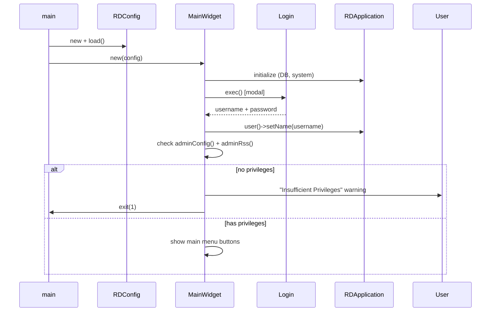
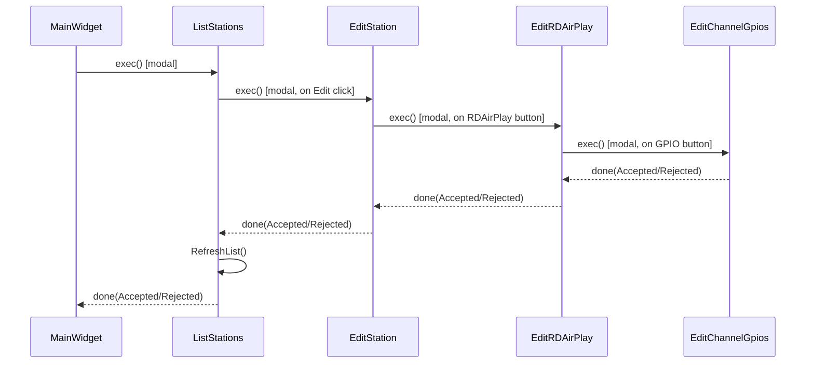

# Semantic Context: ADM (rdadmin)

## Files & Symbols

### Overview
- **Artifact Folder:** rdadmin/
- **Type:** application (Admin GUI)
- **Priority:** 2
- **Depends On:** LIB (librd)
- **Header Files:** 82
- **Source Files (cpp):** ~80
- **Other Files:** Makefile.am, .pro, .ts (translations), .xpm (icons), .html (license)

### Source Files

| File | Type | Primary Class | Category |
|------|------|---------------|----------|
| rdadmin.h/.cpp | main | MainWidget | Main Window |
| globals.h | header-only | (globals) | Global Variables |
| login.h/.cpp | dialog | Login | Authentication |
| edit_station.h/.cpp | dialog | EditStation | Station Config |
| edit_system.h/.cpp | dialog | EditSystem | System Settings |
| edit_user.h/.cpp | dialog | EditUser | User Management |
| edit_user_perms.h/.cpp | dialog | EditUserPerms | User Permissions |
| edit_user_service_perms.h/.cpp | dialog | EditUserServicePerms | User Service Perms |
| edit_feed_perms.h/.cpp | dialog | EditFeedPerms | Feed Permissions |
| edit_svc_perms.h/.cpp | dialog | EditSvcPerms | Service Permissions |
| edit_audios.h/.cpp | dialog | EditAudioPorts | Audio Port Config |
| edit_decks.h/.cpp | dialog | EditDecks | Deck Config |
| edit_feed.h/.cpp | dialog | EditFeed | Podcast Feed Config |
| edit_group.h/.cpp | dialog | EditGroup | Group Config |
| edit_svc.h/.cpp | dialog | EditSvc | Service Config |
| edit_matrix.h/.cpp | dialog | EditMatrix | Switcher/Matrix Config |
| edit_dropbox.h/.cpp | dialog | EditDropbox | Dropbox Config |
| edit_report.h/.cpp | dialog | EditReport | Report Config |
| edit_rdairplay.h/.cpp | dialog | EditRDAirPlay | RDAirPlay Station Config |
| edit_rdlibrary.h/.cpp | dialog | EditRDLibrary | RDLibrary Station Config |
| edit_rdlogedit.h/.cpp | dialog | EditRDLogedit | RDLogEdit Station Config |
| edit_rdpanel.h/.cpp | dialog | EditRDPanel | RDPanel Station Config |
| edit_jack.h/.cpp | dialog | EditJack | JACK Audio Config |
| edit_jack_client.h/.cpp | dialog | EditJackClient | JACK Client Config |
| edit_pypad.h/.cpp | dialog | EditPypad | PyPAD Instance Config |
| edit_node.h/.cpp | dialog | EditNode | Livewire Node Config |
| edit_endpoint.h/.cpp | dialog | EditEndpoint | Matrix Endpoint Config |
| edit_gpi.h/.cpp | dialog | EditGpi | GPI/GPO Macro Config |
| edit_ttys.h/.cpp | dialog | EditTtys | TTY/Serial Port Config |
| edit_hostvar.h/.cpp | dialog | EditHostvar | Host Variable Config |
| edit_cartslots.h/.cpp | dialog | EditCartSlots | Cart Slot Config |
| edit_hotkeys.h/.cpp | dialog | EditHotkeys | Hotkey Config |
| edit_replicator.h/.cpp | dialog | EditReplicator | Replicator Config |
| edit_superfeed.h/.cpp | dialog | EditSuperfeed | Superfeed Config |
| edit_image.h/.cpp | dialog | EditImage | Feed Image Config |
| edit_schedcodes.h/.cpp | dialog | EditSchedCode | Scheduler Code Config |
| edit_channelgpios.h/.cpp | dialog | EditChannelGpios | Channel GPIO Config |
| edit_livewiregpio.h/.cpp | dialog | EditLiveWireGpio | Livewire GPIO Config |
| edit_sas_resource.h/.cpp | dialog | EditSasResource | SAS Resource Config |
| edit_vguest_resource.h/.cpp | dialog | EditVguestResource | VGuest Resource Config |
| list_stations.h/.cpp | dialog | ListStations | Station List/CRUD |
| list_groups.h/.cpp | dialog | ListGroups | Group List/CRUD |
| list_users.h/.cpp | dialog | ListUsers | User List/CRUD |
| list_svcs.h/.cpp | dialog | ListSvcs | Service List/CRUD |
| list_feeds.h/.cpp | dialog | ListFeeds | Feed List/CRUD |
| list_reports.h/.cpp | dialog | ListReports | Report List/CRUD |
| list_matrices.h/.cpp | dialog | ListMatrices | Matrix List/CRUD |
| list_nodes.h/.cpp | dialog | ListNodes | Node List/CRUD |
| list_endpoints.h/.cpp | dialog | ListEndpoints | Endpoint List/CRUD |
| list_gpis.h/.cpp | dialog | ListGpis | GPI/GPO List/CRUD |
| list_hostvars.h/.cpp | dialog | ListHostvars | Host Var List/CRUD |
| list_dropboxes.h/.cpp | dialog | ListDropboxes | Dropbox List/CRUD |
| list_replicators.h/.cpp | dialog | ListReplicators | Replicator List/CRUD |
| list_replicator_carts.h/.cpp | dialog | ListReplicatorCarts | Replicator Carts View |
| list_schedcodes.h/.cpp | dialog | ListSchedCodes | Scheduler Code List |
| list_pypads.h/.cpp | dialog | ListPypads | PyPAD List/CRUD |
| list_encoders.h/.cpp | dialog | ListEncoders | Encoder List/CRUD |
| list_images.h/.cpp | dialog | ListImages | Image List/CRUD |
| list_livewiregpios.h/.cpp | dialog | ListLiveWireGpios | Livewire GPIO List |
| list_sas_resources.h/.cpp | dialog | ListSasResources | SAS Resource List |
| list_vguest_resources.h/.cpp | dialog | ListVguestResources | VGuest Resource List |
| add_group.h/.cpp | dialog | AddGroup | Add Group Dialog |
| add_station.h/.cpp | dialog | AddStation | Add Station Dialog |
| add_user.h/.cpp | dialog | AddUser | Add User Dialog |
| add_svc.h/.cpp | dialog | AddSvc | Add Service Dialog |
| add_feed.h/.cpp | dialog | AddFeed | Add Feed Dialog |
| add_report.h/.cpp | dialog | AddReport | Add Report Dialog |
| add_matrix.h/.cpp | dialog | AddMatrix | Add Matrix Dialog |
| add_hostvar.h/.cpp | dialog | AddHostvar | Add Host Var Dialog |
| add_replicator.h/.cpp | dialog | AddReplicator | Add Replicator Dialog |
| add_schedcodes.h/.cpp | dialog | AddSchedCode | Add Sched Code Dialog |
| rename_group.h/.cpp | dialog | RenameGroup | Rename Group Dialog |
| info_dialog.h/.cpp | dialog | InfoDialog | System Info Dialog |
| license.h/.cpp | dialog | License | License Display |
| test_import.h/.cpp | dialog | TestImport | Import Test Utility |
| help_audios.h/.cpp | dialog | HelpAudioPorts | Audio Help Dialog |
| view_adapters.h/.cpp | dialog | ViewAdapters | Network Adapter View |
| view_node_info.h/.cpp | dialog | ViewNodeInfo | Livewire Node Info |
| view_pypad_errors.h/.cpp | dialog | ViewPypadErrors | PyPAD Error View |
| autofill_carts.h/.cpp | dialog | AutofillCarts | Autofill Carts Config |
| importfields.h/.cpp | widget | ImportFields | Import Field Mapper Widget |

### Symbol Index

| Symbol | Kind | File | Category |
|--------|------|------|----------|
| MainWidget | Class | rdadmin.h | Main Window |
| Login | Class | login.h | Authentication Dialog |
| EditStation | Class | edit_station.h | Station Config Dialog |
| EditSystem | Class | edit_system.h | System Settings Dialog |
| EditUser | Class | edit_user.h | User Config Dialog |
| EditUserPerms | Class | edit_user_perms.h | User Group Perms Dialog |
| EditUserServicePerms | Class | edit_user_service_perms.h | User Service Perms Dialog |
| EditFeedPerms | Class | edit_feed_perms.h | Feed Perms Dialog |
| EditSvcPerms | Class | edit_svc_perms.h | Service Perms Dialog |
| EditAudioPorts | Class | edit_audios.h | Audio Port Config Dialog |
| EditDecks | Class | edit_decks.h | Deck Config Dialog |
| EditFeed | Class | edit_feed.h | Podcast Feed Config Dialog |
| EditGroup | Class | edit_group.h | Group Config Dialog |
| EditSvc | Class | edit_svc.h | Service Config Dialog |
| EditMatrix | Class | edit_matrix.h | Matrix/Switcher Config Dialog |
| EditDropbox | Class | edit_dropbox.h | Dropbox Config Dialog |
| EditReport | Class | edit_report.h | Report Config Dialog |
| EditRDAirPlay | Class | edit_rdairplay.h | RDAirPlay Config Dialog |
| EditRDLibrary | Class | edit_rdlibrary.h | RDLibrary Config Dialog |
| EditRDLogedit | Class | edit_rdlogedit.h | RDLogEdit Config Dialog |
| EditRDPanel | Class | edit_rdpanel.h | RDPanel Config Dialog |
| EditJack | Class | edit_jack.h | JACK Config Dialog |
| EditJackClient | Class | edit_jack_client.h | JACK Client Dialog |
| EditPypad | Class | edit_pypad.h | PyPAD Config Dialog |
| EditNode | Class | edit_node.h | Livewire Node Dialog |
| EditEndpoint | Class | edit_endpoint.h | Matrix Endpoint Dialog |
| EditGpi | Class | edit_gpi.h | GPI/GPO Config Dialog |
| EditTtys | Class | edit_ttys.h | TTY Config Dialog |
| EditHostvar | Class | edit_hostvar.h | Host Variable Dialog |
| EditCartSlots | Class | edit_cartslots.h | Cart Slot Config Dialog |
| EditHotkeys | Class | edit_hotkeys.h | Hotkey Config Dialog |
| EditReplicator | Class | edit_replicator.h | Replicator Config Dialog |
| EditSuperfeed | Class | edit_superfeed.h | Superfeed Config Dialog |
| EditImage | Class | edit_image.h | Image View/Edit Dialog |
| EditSchedCode | Class | edit_schedcodes.h | Scheduler Code Dialog |
| EditChannelGpios | Class | edit_channelgpios.h | Channel GPIO Dialog |
| EditLiveWireGpio | Class | edit_livewiregpio.h | Livewire GPIO Dialog |
| EditSasResource | Class | edit_sas_resource.h | SAS Resource Dialog |
| EditVguestResource | Class | edit_vguest_resource.h | VGuest Resource Dialog |
| ListStations | Class | list_stations.h | Station List Dialog |
| ListGroups | Class | list_groups.h | Group List Dialog |
| ListUsers | Class | list_users.h | User List Dialog |
| ListSvcs | Class | list_svcs.h | Service List Dialog |
| ListFeeds | Class | list_feeds.h | Feed List Dialog |
| ListReports | Class | list_reports.h | Report List Dialog |
| ListMatrices | Class | list_matrices.h | Matrix List Dialog |
| ListNodes | Class | list_nodes.h | Node List Dialog |
| ListEndpoints | Class | list_endpoints.h | Endpoint List Dialog |
| ListGpis | Class | list_gpis.h | GPI/GPO List Dialog |
| ListHostvars | Class | list_hostvars.h | Host Var List Dialog |
| ListDropboxes | Class | list_dropboxes.h | Dropbox List Dialog |
| ListReplicators | Class | list_replicators.h | Replicator List Dialog |
| ListReplicatorCarts | Class | list_replicator_carts.h | Replicator Cart View |
| ListSchedCodes | Class | list_schedcodes.h | Sched Code List Dialog |
| ListPypads | Class | list_pypads.h | PyPAD List Dialog |
| ListEncoders | Class | list_encoders.h | Encoder List Dialog |
| ListImages | Class | list_images.h | Image List Dialog |
| ListLiveWireGpios | Class | list_livewiregpios.h | Livewire GPIO List Dialog |
| ListSasResources | Class | list_sas_resources.h | SAS Resource List Dialog |
| ListVguestResources | Class | list_vguest_resources.h | VGuest Resource List Dialog |
| AddGroup | Class | add_group.h | Add Group Dialog |
| AddStation | Class | add_station.h | Add Station Dialog |
| AddUser | Class | add_user.h | Add User Dialog |
| AddSvc | Class | add_svc.h | Add Service Dialog |
| AddFeed | Class | add_feed.h | Add Feed Dialog |
| AddReport | Class | add_report.h | Add Report Dialog |
| AddMatrix | Class | add_matrix.h | Add Matrix Dialog |
| AddHostvar | Class | add_hostvar.h | Add Host Var Dialog |
| AddReplicator | Class | add_replicator.h | Add Replicator Dialog |
| AddSchedCode | Class | add_schedcodes.h | Add Sched Code Dialog |
| RenameGroup | Class | rename_group.h | Rename Group Dialog |
| InfoDialog | Class | info_dialog.h | System Info Dialog |
| License | Class | license.h | License Dialog |
| TestImport | Class | test_import.h | Import Test Dialog |
| HelpAudioPorts | Class | help_audios.h | Audio Ports Help Dialog |
| ViewAdapters | Class | view_adapters.h | Network Adapters Dialog |
| ViewNodeInfo | Class | view_node_info.h | Livewire Node Info Dialog |
| ViewPypadErrors | Class | view_pypad_errors.h | PyPAD Error Dialog |
| AutofillCarts | Class | autofill_carts.h | Autofill Carts Dialog |
| ImportFields | Class | importfields.h | Import Fields Widget |
| PrintError | Function | globals.h | Error Helper |

## Class API Surface

### Architecture Pattern

All 78 classes in rdadmin are **Qt dialog/widget classes** inheriting from:
- **RDWidget** (base): MainWidget, ImportFields
- **RDDialog** (modal dialogs): all other 76 classes

All classes have Q_OBJECT macro. **No custom signals are defined** in any rdadmin class.
Communication pattern is exclusively **modal dialog exec()/done()** -- parent opens child dialog,
child returns result via QDialog::Accepted/QDialog::Rejected.

### Class Hierarchy

```
QWidget
  +-- RDWidget (from LIB)
       +-- MainWidget (main window)
       +-- ImportFields (embedded widget)
  +-- QDialog
       +-- RDDialog (from LIB)
            +-- Login
            +-- EditStation, EditSystem, EditUser, EditGroup, EditSvc, ...
            +-- ListStations, ListGroups, ListUsers, ListSvcs, ...
            +-- AddStation, AddGroup, AddUser, AddSvc, ...
            +-- InfoDialog, License, TestImport, ViewAdapters, ...
```

### MainWidget [Main Window]
- **File:** rdadmin.h
- **Inherits:** RDWidget
- **Qt Object:** Yes (Q_OBJECT)
- **Role:** Top-level application widget. Presents main menu buttons for all admin functions.

#### Private Slots
| Slot | Purpose |
|------|---------|
| manageGroupsData() | Open group management (ListGroups) |
| manageServicesData() | Open service management (ListSvcs) |
| manageStationsData() | Open station management (ListStations) |
| systemSettingsData() | Open system settings (EditSystem) |
| reportsData() | Open report management (ListReports) |
| podcastsData() | Open podcast/feed management (ListFeeds) |
| quitMainWidget() | Exit application |
| manageSchedCodes() | Open scheduler code management (ListSchedCodes) |
| manageReplicatorsData() | Open replicator management (ListReplicators) |
| systemInfoData() | Open system info dialog (InfoDialog) |
| ClearTables() | Clear database tables operation |

#### Fields
| Field | Type | Purpose |
|-------|------|---------|
| admin_username | QString | Current admin username |
| admin_password | QString | Current admin password |
| admin_rivendell_map | QPixmap | Rivendell logo |
| admin_filter | RDCartFilter* | Cart filter reference |
| admin_group | RDGroup* | Group reference |
| admin_schedcode | RDSchedCode* | Scheduler code reference |

### Login [Authentication Dialog]
- **File:** login.h
- **Inherits:** RDDialog
- **Qt Object:** Yes (Q_OBJECT)
- **Role:** Login dialog for admin authentication.

#### Private Slots
| Slot | Purpose |
|------|---------|
| cancelData() | Cancel login |

#### Fields
| Field | Type | Purpose |
|-------|------|---------|
| login_name | QString* | Pointer to output username |
| login_name_edit | QLineEdit* | Username input |
| login_password | QString* | Pointer to output password |
| login_password_edit | QLineEdit* | Password input |

### EditStation [Station Configuration Dialog]
- **File:** edit_station.h
- **Inherits:** RDDialog
- **Qt Object:** Yes (Q_OBJECT)
- **Role:** Comprehensive station configuration. Largest dialog in rdadmin with fields for station identity, system services, audio, TTY, switchers, dropboxes, JACK, and PyPAD.

#### Private Slots
| Slot | Purpose |
|------|---------|
| heartbeatToggledData() | Toggle heartbeat monitoring |
| heartbeatClickedData() | Select heartbeat cart |
| caeStationActivatedData() | Change CAE station assignment |
| okData() | Save and close |
| okTimerData() | Deferred OK processing |
| cancelData() | Cancel without saving |
| editLibraryData() | Open RDLibrary config (EditRDLibrary) |
| editDeckData() | Open deck config (EditDecks) |
| editAirPlayData() | Open RDAirPlay config (EditRDAirPlay) |
| editPanelData() | Open RDPanel config (EditRDPanel) |
| editLogEditData() | Open RDLogEdit config (EditRDLogedit) |
| editCartSlotsData() | Open cart slots config (EditCartSlots) |
| viewAdaptersData() | View network adapters (ViewAdapters) |
| editAudioData() | Open audio ports config (EditAudioPorts) |
| editTtyData() | Open TTY config (EditTtys) |
| editSwitcherData() | Open switcher/matrix config (ListMatrices) |
| editHostvarsData() | Open host variables (ListHostvars) |
| editDropboxesData() | Open dropbox config (ListDropboxes) |
| jackSettingsData() | Open JACK settings (EditJack) |
| pypadInstancesData() | Open PyPAD instances (ListPypads) |
| startCartClickedData() | Select startup cart |
| stopCartClickedData() | Select stop cart |

### EditSystem [System-Wide Settings Dialog]
- **File:** edit_system.h
- **Inherits:** RDDialog
- **Qt Object:** Yes (Q_OBJECT)
- **Role:** System-wide configuration: sample rate, duplicate cart detection, max POST size, ISCI path, RSS processor, temp cart group, notification address.

#### Private Slots
| Slot | Purpose |
|------|---------|
| duplicatesCheckedData() | Toggle duplicate cart detection |
| saveData() | Save settings to DB |
| encodersData() | Open encoder list (ListEncoders) |
| okData() | Save and close |
| cancelData() | Cancel |

### EditUser [User Configuration Dialog]
- **File:** edit_user.h
- **Inherits:** RDDialog
- **Qt Object:** Yes (Q_OBJECT)
- **Role:** User account configuration with detailed permission flags for carts, logs, podcasts, panels, catches, voicetrack, webget, and admin capabilities.

#### Private Slots
| Slot | Purpose |
|------|---------|
| passwordData() | Change password |
| groupsData() | Edit group permissions (EditUserPerms) |
| servicesData() | Edit service permissions (EditUserServicePerms) |
| feedsData() | Edit feed permissions (EditFeedPerms) |
| adminConfigToggledData() | Toggle admin config privilege |
| adminRssToggledData() | Toggle admin RSS privilege |
| adminToggled() | Generic admin toggle handler |
| okData() | Save and close |
| cancelData() | Cancel |

### EditGroup [Group Configuration Dialog]
- **File:** edit_group.h
- **Inherits:** RDDialog
- **Role:** Group editing with cart number range, services, color, cart type, shelf life, cut life.

#### Private Slots
| Slot | Purpose |
|------|---------|
| colorData() | Pick group color |
| cutLifeEnabledData() | Toggle cut life management |
| purgeEnabledData() | Toggle purge/shelf life |
| okData() / cancelData() | Save/cancel |

### EditSvc [Service Configuration Dialog]
- **File:** edit_svc.h
- **Inherits:** RDDialog
- **Role:** Service editing with traffic/music import templates, voice group, autospot group, log/shelf life, import field mappings.

#### Private Slots
| Slot | Purpose |
|------|---------|
| enableHostsData() | Open service host perms (EditSvcPerms) |
| trafficData() / musicData() | Open test import for traffic/music |
| trafficCopyData() / musicCopyData() | Copy import config from other service |
| textChangedData() | Track unsaved changes |
| tfcTemplateActivatedData() | Traffic template selection changed |
| musTemplateActivatedData() | Music template selection changed |
| okData() / cancelData() | Save/cancel |

### EditFeed [Podcast Feed Configuration Dialog]
- **File:** edit_feed.h
- **Inherits:** RDDialog
- **Role:** Comprehensive podcast/RSS feed configuration with channel metadata, XML templates, encoding format, image management, superfeed support.

#### Private Slots
| Slot | Purpose |
|------|---------|
| schemaActivatedData() | RSS schema changed |
| checkboxToggledData() | Generic checkbox handler |
| purgeUrlChangedData() | Purge URL changed |
| selectSubfeedsData() | Configure superfeeds (EditSuperfeed) |
| setFormatData() | Set audio format |
| listImagesData() | Open image list (ListImages) |
| copyHeaderXmlData() / copyChannelXmlData() / copyItemXmlData() | Copy XML to clipboard |
| okData() / cancelData() | Save/cancel |

### EditMatrix [Matrix/Switcher Configuration Dialog]
- **File:** edit_matrix.h
- **Inherits:** RDDialog
- **Role:** Audio switcher/matrix configuration supporting multiple matrix types (GPIO, Livewire, SAS, VGuest, etc.) with inputs, outputs, nodes, GPIs/GPOs.

#### Private Slots
| Slot | Purpose |
|------|---------|
| portType2ActivatedData() | Secondary port type changed |
| inputsButtonData() / outputsButtonData() | Manage endpoints (ListEndpoints) |
| xpointsButtonData() | Manage crosspoints |
| gpisButtonData() / gposButtonData() | Manage GPIs/GPOs (ListGpis) |
| livewireButtonData() | Manage Livewire nodes (ListNodes) |
| livewireGpioButtonData() | Manage Livewire GPIOs (ListLiveWireGpios) |
| vguestRelaysButtonData() / vguestDisplaysButtonData() | Manage VGuest resources |
| sasResourcesButtonData() | Manage SAS resources (ListSasResources) |
| startCartData() / stopCartData() | Select start/stop carts |
| startCart2Data() / stopCart2Data() | Select secondary start/stop carts |
| okData() / cancelData() | Save/cancel |

### EditDropbox [Dropbox Configuration Dialog]
- **File:** edit_dropbox.h
- **Inherits:** RDDialog
- **Role:** File dropbox configuration for automatic audio import with normalization, autotrim, segue, metadata pattern, scheduler codes, date offsets.

#### Private Slots
| Slot | Purpose |
|------|---------|
| pathChangedData() | Path changed validation |
| selectCartData() | Select target cart |
| selectLogPathData() | Select log file path |
| schedcodesData() | Edit scheduler codes |
| normalizationToggledData() | Toggle normalization |
| autotrimToggledData() | Toggle auto-trim |
| segueToggledData() | Toggle segue |
| createDatesToggledData() | Toggle create dates |
| resetData() | Reset to defaults |
| okData() / cancelData() | Save/cancel |

### EditRDAirPlay [RDAirPlay Station Configuration]
- **File:** edit_rdairplay.h
- **Inherits:** RDDialog
- **Role:** Per-station RDAirPlay configuration with audio card/port assignments, virtual log machines, segue/transition settings, start modes, skin, hotkeys, GPIO channels.

#### Private Slots
| Slot | Purpose |
|------|---------|
| editGpiosData() | Edit channel GPIOs (EditChannelGpios) |
| exitPasswordChangedData() | Exit password changed |
| logActivatedData() | Log machine selection changed |
| virtualLogActivatedData() | Virtual log machine changed |
| virtualModeActivatedData() | Virtual mode changed |
| startModeChangedData() | Start mode changed |
| selectData() | Select carts |
| editHotKeys() | Edit hotkeys (EditHotkeys) |
| selectSkinData() | Select skin file |
| modeControlActivatedData() | Mode control changed |
| logStartupModeActivatedData() | Log startup mode changed |
| okData() / cancelData() | Save/cancel |

### EditRDLibrary [RDLibrary Station Configuration]
- **File:** edit_rdlibrary.h
- **Inherits:** RDDialog
- **Role:** Per-station RDLibrary configuration with input/output card, format, channels, bitrate, recording mode, trim, CD ripper settings.

#### Private Slots
| Slot | Purpose |
|------|---------|
| cdServerTypeData() | CD metadata server type changed |
| okData() / cancelData() | Save/cancel |

### EditRDLogedit [RDLogEdit Station Configuration]
- **File:** edit_rdlogedit.h
- **Inherits:** RDDialog
- **Role:** Per-station RDLogEdit configuration with input/output card, format, waveform caption, start/end/record carts, default transition type.

#### Private Slots
| Slot | Purpose |
|------|---------|
| selectStartData() / selectEndData() | Select start/end carts |
| selectRecordStartData() / selectRecordEndData() | Select record start/end carts |
| okData() / cancelData() | Save/cancel |

### EditRDPanel [RDPanel Station Configuration]
- **File:** edit_rdpanel.h
- **Inherits:** RDDialog
- **Role:** Per-station RDPanel configuration with card selection, default service, skin, flash/pause settings.

### EditReport [Report Configuration Dialog]
- **File:** edit_report.h
- **Inherits:** RDDialog
- **Role:** Report definition with filter, station type, cart digits, line pagination, export path, daypart settings, service/station/group selection.

### EditDecks [Deck Configuration Dialog]
- **File:** edit_decks.h
- **Inherits:** RDDialog
- **Role:** Record/play/audition deck configuration with format, channels, bitrate, switcher matrix/output assignment, threshold, event carts.

### EditAudioPorts [Audio Port Configuration Dialog]
- **File:** edit_audios.h
- **Inherits:** RDDialog
- **Role:** Sound card port configuration with clock source, type, mode, input/output settings per card.

### EditReplicator [Replicator Configuration Dialog]
- **File:** edit_replicator.h
- **Inherits:** RDDialog
- **Role:** Replicator configuration for content distribution with type, station, URL, credentials, format, normalization, group selection.

### EditHotkeys [Hotkey Configuration Dialog]
- **File:** edit_hotkeys.h
- **Inherits:** RDDialog
- **Role:** Keyboard hotkey assignment for RDAirPlay with clone-from-host capability, keystroke capture.

### EditCartSlots [Cart Slot Configuration Dialog]
- **File:** edit_cartslots.h
- **Inherits:** RDDialog
- **Role:** Cart slot grid configuration with rows/columns, mode, play mode, stop action, service, card/input/output per slot.

### EditJack [JACK Audio Configuration Dialog]
- **File:** edit_jack.h
- **Inherits:** RDDialog
- **Role:** JACK audio server configuration with server name, command line, audio ports, client list management.

### EditPypad [PyPAD Instance Configuration Dialog]
- **File:** edit_pypad.h
- **Inherits:** RDDialog
- **Role:** PyPAD (Python PAD) instance configuration with script path, description, configuration text.

### EditNode [Livewire Node Configuration Dialog]
- **File:** edit_node.h
- **Inherits:** RDDialog
- **Role:** Livewire node configuration with hostname, TCP port, description, password, output count.

### EditTtys [TTY/Serial Port Configuration Dialog]
- **File:** edit_ttys.h
- **Inherits:** RDDialog
- **Role:** Serial/TTY port configuration with baud rate, data bits, stop bits, parity, termination.

### List Dialog Classes (CRUD Pattern)

All List* classes follow the same pattern:
- Inherit from RDDialog
- Provide Add/Edit/Delete/Close buttons
- Use QListView/QTreeView for display
- Private slots: editData(), deleteData(), doubleClickedData(), closeData(), resizeEvent(), RefreshList()

| Class | Manages | Special Features |
|-------|---------|-----------------|
| ListStations | Stations | Add/Edit/Delete |
| ListGroups | Groups | Add/Edit/Rename/Delete + Report |
| ListUsers | Users | Add/Edit/Delete (with icon maps) |
| ListSvcs | Services | Add/Edit/Delete |
| ListFeeds | Podcast Feeds | Add/Edit/Delete + Repost/Unpost |
| ListReports | Reports | Add/Edit/Delete |
| ListMatrices | Switcher Matrices | Add/Edit/Delete (tracks modified state) |
| ListNodes | Livewire Nodes | Add/Edit/Delete + PurgeEndpoints |
| ListEndpoints | Matrix Endpoints | Edit only (readonly option) |
| ListGpis | GPIs/GPOs | Edit only (parametric for GPI/GPO) |
| ListHostvars | Host Variables | Add/Edit/Delete |
| ListDropboxes | Dropboxes | Add/Edit/Duplicate/Delete |
| ListReplicators | Replicators | Add/Edit/Delete + List carts |
| ListReplicatorCarts | Replicator Carts | View + Repost (with refresh timer) |
| ListSchedCodes | Scheduler Codes | Add/Edit/Delete |
| ListPypads | PyPAD Instances | Add/Edit/Delete + Error view (with update timer) |
| ListEncoders | Encoders | Add/Edit/Delete |
| ListImages | Feed Images | Add/View/Delete (with file dialog) |
| ListLiveWireGpios | Livewire GPIOs | Edit only |
| ListSasResources | SAS Resources | Edit only |
| ListVguestResources | VGuest Resources | Edit only |

### Add Dialog Classes (Simple Input Pattern)

All Add* classes follow the same pattern:
- Inherit from RDDialog
- Name input field + optional exemplar/template dropdown
- Private slots: cancelData() (OK handled via base class accept)

| Class | Creates | Extra Fields |
|-------|---------|-------------|
| AddStation | Station | Exemplar station dropdown (clone from) |
| AddGroup | Group | Users checkbox, Services checkbox |
| AddUser | User | Name only |
| AddSvc | Service | Exemplar service dropdown (clone from) |
| AddFeed | Podcast Feed | Key name + users checkbox |
| AddReport | Report | Name only |
| AddMatrix | Matrix | Type + matrix number dropdowns |
| AddHostvar | Host Variable | Name + value + remark |
| AddReplicator | Replicator | Name only |
| AddSchedCode | Scheduler Code | Name only |

### Utility/View Dialogs

| Class | Role |
|-------|------|
| InfoDialog | System information display with license view button |
| License | GPL2 license text display |
| TestImport | Traffic/music import testing with date selection and event display |
| HelpAudioPorts | Audio ports help text display |
| ViewAdapters | Network adapter information display |
| ViewNodeInfo | Livewire node source/destination information |
| ViewPypadErrors | PyPAD error log display |
| AutofillCarts | Autofill cart configuration for services |
| RenameGroup | Group rename dialog with old/new name |

### ImportFields [Embedded Widget]
- **File:** importfields.h
- **Inherits:** RDWidget
- **Qt Object:** Yes (Q_OBJECT)
- **Role:** Reusable widget for traffic/music import field position mapping. Embedded within EditSvc dialog. Maps column offsets and lengths for: cart, title, hours, minutes, seconds, length hours/minutes/seconds, announcement type, data, event ID.

#### Public Slots
| Slot | Purpose |
|------|---------|
| readFields() | Load field positions from RDSvc |
| setFields() | Save field positions to RDSvc |

#### Signals
None.

#### Public Methods
| Method | Purpose |
|--------|---------|
| changed() | Returns bool -- whether fields were modified |

## Data Model

### Overview

rdadmin does NOT define any database tables (no CREATE TABLE). All tables are defined in the LIB (librd) artifact. rdadmin performs CRUD operations on the following tables via direct SQL queries.

### Tables Used by rdadmin (CRUD Operations)

| Table | SELECT | INSERT | UPDATE | DELETE | Primary CRUD Classes |
|-------|--------|--------|--------|--------|---------------------|
| STATIONS | Y | (via LIB) | (via LIB) | (via LIB) | EditStation, ListStations, AddStation |
| GROUPS | Y | Y | Y | Y | EditGroup, ListGroups, AddGroup, RenameGroup |
| USERS | Y | Y | - | Y | EditUser, ListUsers, AddUser |
| SERVICES | Y | (via LIB) | (via LIB) | (via LIB) | EditSvc, ListSvcs, AddSvc |
| FEEDS | Y | (via LIB) | (via LIB) | Y | EditFeed, ListFeeds, AddFeed |
| FEED_PERMS | Y | Y | - | Y | EditFeedPerms, ListFeeds |
| FEED_IMAGES | Y | - | Y | Y | ListImages, EditImage, ListFeeds |
| PODCASTS | Y | - | - | Y | ListFeeds |
| SUPERFEED_MAPS | Y | Y | - | Y | EditSuperfeed |
| REPORTS | Y | Y | - | Y | EditReport, ListReports, AddReport |
| REPORT_SERVICES | Y | Y | - | Y | EditReport |
| REPORT_STATIONS | Y | Y | - | Y | EditReport |
| REPORT_GROUPS | Y | Y | - | Y | EditReport |
| MATRICES | Y | Y | - | Y | EditMatrix, ListMatrices, AddMatrix |
| INPUTS | Y | Y | - | Y | ListEndpoints, ListMatrices |
| OUTPUTS | Y | Y | - | Y | ListEndpoints, ListMatrices |
| GPIS | Y | Y | - | Y | ListGpis, EditGpi, ListMatrices |
| GPOS | Y | Y | - | Y | ListGpis, EditGpi, ListMatrices |
| SWITCHER_NODES | Y | Y | Y | Y | EditNode, ListNodes, ListMatrices |
| VGUEST_RESOURCES | Y | Y | Y | Y | EditVguestResource, ListVguestResources, ListSasResources |
| LIVEWIRE_GPIO_SLOTS | Y | Y | Y | - | ListLiveWireGpios |
| DROPBOXES | Y | (via LIB) | - | Y | EditDropbox, ListDropboxes |
| DROPBOX_PATHS | Y | - | - | Y | EditDropbox, ListDropboxes |
| DROPBOX_SCHED_CODES | Y | Y | - | Y | EditDropbox, ListSchedCodes |
| HOSTVARS | Y | Y | - | Y | EditHostvar, ListHostvars, AddHostvar |
| USER_PERMS | Y | Y | - | Y | EditUserPerms, AddUser, AddGroup, RenameGroup, ListUsers, ListGroups |
| USER_SERVICE_PERMS | Y | Y | - | Y | EditUserServicePerms |
| AUDIO_PERMS | Y | Y | - | Y | EditGroup, AddGroup, RenameGroup, ListGroups |
| SERVICE_PERMS | Y | Y | - | Y | EditSvcPerms |
| REPLICATORS | Y | Y | - | Y | EditReplicator, ListReplicators, AddReplicator |
| REPLICATOR_MAP | Y | Y | - | Y | EditReplicator, RenameGroup, ListReplicators |
| REPL_CART_STATE | Y | - | Y | Y | ListReplicatorCarts, ListReplicators |
| REPL_CUT_STATE | Y | - | - | Y | ListReplicators |
| SCHED_CODES | Y | Y | Y | Y | EditSchedCode, ListSchedCodes, AddSchedCode |
| JACK_CLIENTS | Y | Y | Y | Y | EditJack, EditJackClient |
| CARTSLOTS | Y | - | Y | - | EditCartSlots |
| RDHOTKEYS | Y | - | Y | - | EditHotkeys |
| PYPAD_INSTANCES | Y | Y | Y | Y | EditPypad, ListPypads, ViewPypadErrors |
| AUTOFILLS | Y | Y | - | Y | AutofillCarts |
| CART | Y | - | - | - | RenameGroup |
| EVENTS | Y | - | Y | - | RenameGroup |
| DECK_EVENTS | Y | - | Y | - | EditDecks |
| IMPORTER_LINES | Y | - | - | Y | TestImport |
| WEB_CONNECTIONS | - | - | - | Y | ListUsers |
| ENCODER_* (dynamic) | Y | Y | - | - | AddStation |

### Key Relationships

```mermaid
erDiagram
    STATIONS ||--o{ MATRICES : "has many"
    STATIONS ||--o{ DROPBOXES : "has many"
    STATIONS ||--o{ HOSTVARS : "has many"
    STATIONS ||--o{ JACK_CLIENTS : "has many"
    STATIONS ||--o{ PYPAD_INSTANCES : "has many"
    STATIONS ||--o{ CARTSLOTS : "has many"
    STATIONS ||--o{ SERVICE_PERMS : "allowed on"
    GROUPS ||--o{ USER_PERMS : "assigned to"
    GROUPS ||--o{ AUDIO_PERMS : "assigned to"
    USERS ||--o{ USER_PERMS : "has"
    USERS ||--o{ USER_SERVICE_PERMS : "has"
    USERS ||--o{ FEED_PERMS : "has"
    SERVICES ||--o{ REPORT_SERVICES : "in"
    SERVICES ||--o{ AUDIO_PERMS : "allows"
    FEEDS ||--o{ FEED_PERMS : "has"
    FEEDS ||--o{ FEED_IMAGES : "has"
    FEEDS ||--o{ PODCASTS : "has"
    FEEDS ||--o{ SUPERFEED_MAPS : "includes"
    REPORTS ||--o{ REPORT_SERVICES : "filters by"
    REPORTS ||--o{ REPORT_STATIONS : "filters by"
    REPORTS ||--o{ REPORT_GROUPS : "filters by"
    MATRICES ||--o{ INPUTS : "has"
    MATRICES ||--o{ OUTPUTS : "has"
    MATRICES ||--o{ GPIS : "has"
    MATRICES ||--o{ GPOS : "has"
    MATRICES ||--o{ SWITCHER_NODES : "has"
    MATRICES ||--o{ VGUEST_RESOURCES : "has"
    REPLICATORS ||--o{ REPLICATOR_MAP : "covers"
    REPLICATORS ||--o{ REPL_CART_STATE : "tracks"
    DROPBOXES ||--o{ DROPBOX_PATHS : "watches"
    DROPBOXES ||--o{ DROPBOX_SCHED_CODES : "uses"
    SCHED_CODES ||--o{ DROPBOX_SCHED_CODES : "referenced by"
```



### Notes on Data Access Patterns

1. **Most entity creation/deletion uses LIB helper classes** (e.g., RDStation, RDGroup, RDUser, RDSvc, RDFeed, RDDropbox) for the main entity record, but rdadmin does direct SQL for junction/mapping tables (USER_PERMS, AUDIO_PERMS, SERVICE_PERMS, etc.)
2. **Dynamic table names** are used for: ENCODER_* (per-station encoder tables), GPIS/GPOS (constructed table names from matrix), INPUTS/OUTPUTS (matrix endpoints)
3. **RenameGroup** performs a multi-table cascade: updates CART, EVENTS, REPLICATOR_MAP, DROPBOXES, then GROUPS, AUDIO_PERMS, USER_PERMS
4. **ListMatrices::DeleteMatrix** performs cascade delete across MATRICES, INPUTS, OUTPUTS, SWITCHER_NODES, GPIS, GPOS, VGUEST_RESOURCES

## Reactive Architecture

### Architecture Pattern

rdadmin uses exclusively the **legacy Qt3 SIGNAL/SLOT macro pattern**:
```cpp
connect(sender, SIGNAL(clicked()), this, SLOT(someSlotData()));
```

**Key characteristics:**
- **No custom signals defined** in any rdadmin class (0 emit statements)
- **No cross-class signal/slot connections** -- all connections are widget-to-owning-dialog
- **Purely modal dialog architecture** -- parent opens child via `exec()`, reads result
- **No event bus, no observer pattern** beyond standard Qt button/widget signals

### Connection Pattern Summary

All connections in rdadmin follow ONE of these patterns:

1. **Button -> Slot**: `connect(button, SIGNAL(clicked()), this, SLOT(actionData()))`
2. **ComboBox -> Slot**: `connect(combo, SIGNAL(activated(int/QString)), this, SLOT(changedData(int/QString)))`
3. **Checkbox -> Slot**: `connect(check, SIGNAL(toggled(bool)), this, SLOT(toggledData(bool)))`
4. **Checkbox -> Widget enable**: `connect(check, SIGNAL(toggled(bool)), widget, SLOT(setEnabled(bool)))`
5. **Timer -> Slot**: `connect(timer, SIGNAL(timeout()), this, SLOT(timerData()))`
6. **ListView -> Slot**: `connect(view, SIGNAL(doubleClicked(...)), this, SLOT(doubleClickedData(...)))`

### Main Window Connections (rdadmin.cpp)

| # | Sender | Signal | Receiver | Slot | Purpose |
|---|--------|--------|----------|------|---------|
| 1 | users_button | clicked() | this | manageUsersData() | Open user management |
| 2 | groups_button | clicked() | this | manageGroupsData() | Open group management |
| 3 | services_button | clicked() | this | manageServicesData() | Open service management |
| 4 | stations_button | clicked() | this | manageStationsData() | Open station management |
| 5 | reports_button | clicked() | this | reportsData() | Open report management |
| 6 | podcasts_button | clicked() | this | podcastsData() | Open podcast/feed management |
| 7 | system_button | clicked() | this | systemSettingsData() | Open system settings |
| 8 | schedcodes_button | clicked() | this | manageSchedCodes() | Open scheduler code management |
| 9 | repl_button | clicked() | this | manageReplicatorsData() | Open replicator management |
| 10 | info_button | clicked() | this | systemInfoData() | Open system info |
| 11 | quit_button | clicked() | this | quitMainWidget() | Exit application |

### EditStation Connections (most complex dialog)

| # | Sender | Signal | Receiver | Slot | Purpose |
|---|--------|--------|----------|------|---------|
| 1 | station_startup_select_button | clicked() | this | selectClicked() | Select startup cart |
| 2 | station_start_cart_button | clicked() | this | startCartClickedData() | Select start cart |
| 3 | station_stop_cart_button | clicked() | this | stopCartClickedData() | Select stop cart |
| 4 | station_heartbeat_box | toggled(bool) | this | heartbeatToggledData() | Toggle heartbeat |
| 5 | station_hbcart_button | clicked() | this | heartbeatClickedData() | Select heartbeat cart |
| 6 | station_dragdrop_box | toggled(bool) | panel_enforce_label | setEnabled(bool) | Conditional enable |
| 7 | station_dragdrop_box | toggled(bool) | panel_enforce_box | setEnabled(bool) | Conditional enable |
| 8 | station_cae_station_box | activated(QString) | this | caeStationActivatedData() | CAE station changed |
| 9 | station_rdlibrary_button | clicked() | this | editLibraryData() | Open RDLibrary config |
| 10 | station_rdcatch_button | clicked() | this | editDeckData() | Open deck config |
| 11 | station_rdairplay_button | clicked() | this | editAirPlayData() | Open RDAirPlay config |
| 12 | station_rdpanel_button | clicked() | this | editPanelData() | Open RDPanel config |
| 13 | station_rdlogedit_button | clicked() | this | editLogEditData() | Open RDLogEdit config |
| 14 | station_rdcartslots_button | clicked() | this | editCartSlotsData() | Open cart slots |
| 15 | station_dropboxes_button | clicked() | this | editDropboxesData() | Open dropboxes |
| 16 | station_switchers_button | clicked() | this | editSwitcherData() | Open switcher/matrices |
| 17 | station_hostvars_button | clicked() | this | editHostvarsData() | Open host variables |
| 18 | station_audioports_button | clicked() | this | editAudioData() | Open audio ports |
| 19 | station_ttys_button | clicked() | this | editTtyData() | Open TTY config |
| 20 | station_adapters_button | clicked() | this | viewAdaptersData() | View network adapters |
| 21 | station_jack_button | clicked() | this | jackSettingsData() | Open JACK config |
| 22 | station_pypad_button | clicked() | this | pypadInstancesData() | Open PyPAD instances |
| 23 | station_ok_button | clicked() | this | okData() | Save station |
| 24 | station_cancel_button | clicked() | this | cancelData() | Cancel |
| 25 | timer | timeout() | this | okTimerData() | Deferred save processing |

### Application Lifecycle Sequence



### Dialog Navigation Sequence (typical flow)



### Cross-Artifact Dependencies

| External Class | From Artifact | Used By | Purpose |
|---------------|---------------|---------|---------|
| RDWidget | LIB | MainWidget, ImportFields | Base widget class |
| RDDialog | LIB | All 76 dialog classes | Base dialog class |
| RDConfig | LIB | MainWidget | Configuration loader |
| RDApplication (rda) | LIB | MainWidget | App singleton (DB, user, station, system) |
| RDUser | LIB | MainWidget, EditUser, ListUsers | User data access |
| RDStation | LIB | EditStation, ListStations | Station data access |
| RDGroup | LIB | EditGroup, ListGroups, MainWidget | Group data access |
| RDSvc | LIB | EditSvc, ListSvcs | Service data access |
| RDFeed | LIB | EditFeed, ListFeeds | Feed data access |
| RDReport | LIB | EditReport, ListReports | Report data access |
| RDMatrix | LIB | EditMatrix, ListMatrices | Matrix data access |
| RDDropbox | LIB | EditDropbox, ListDropboxes | Dropbox data access |
| RDReplicator | LIB | EditReplicator, ListReplicators | Replicator data access |
| RDSchedCode | LIB | MainWidget | Scheduler code access |
| RDCartFilter | LIB | MainWidget | Cart filter for selection |
| RDCartDialog | LIB | Multiple edit dialogs | Cart selection dialog |
| RDAirPlayConf | LIB | EditRDAirPlay, EditRDPanel | AirPlay configuration |
| RDLibraryConf | LIB | EditRDLibrary, EditRDLogedit | Library configuration |
| RDCatchConf | LIB | EditDecks | Catch configuration |
| RDLiveWire | LIB | ViewNodeInfo | Livewire node access |
| RDSqlQuery | LIB | All classes with SQL | Database query wrapper |
| RDServiceListModel | LIB | Multiple list dialogs | Service list model |
| RDNodeSelectorWidget | LIB | Multiple select dialogs | Host/service selector |
| RDImagePickerModel | LIB | EditFeed | Feed image model |

## Business Rules

### Rule: Authentication Required
- **Source:** rdadmin.cpp:118-134
- **Trigger:** Application startup
- **Condition:** Login dialog returns credentials
- **Action:** Verify password via RDUser::checkPassword(). If failed -> exit(1). If no adminConfig AND no adminRss privilege -> "Insufficient Priviledges" error -> exit(1).
- **Gherkin:**
  ```gherkin
  Scenario: Admin login with valid credentials
    Given rdadmin application starts
    When user enters username and password
    Then the system verifies the password against the database
    And checks for adminConfig or adminRss privilege
    And grants access only if at least one privilege is present

  Scenario: Admin login with invalid credentials
    Given rdadmin application starts
    When user enters wrong password
    Then the system shows "Login Failed" warning
    And terminates the application
  ```

### Rule: Privilege-Based Menu Access
- **Source:** rdadmin.cpp:165-256
- **Trigger:** After successful login
- **Condition:** User privileges (adminConfig, adminRss)
- **Action:** Main menu buttons are enabled/disabled based on privileges:
  - **adminConfig required:** Users, Groups, Services, Stations, Reports, System Settings, Scheduler Codes, Replicators
  - **adminConfig OR adminRss:** Podcasts, System Info
  - **Always enabled:** Quit

### Rule: Self-Deletion Prevention
- **Source:** list_users.cpp:180-183
- **Trigger:** User attempts to delete a user
- **Condition:** Selected user is the currently logged-in admin
- **Action:** Show "You cannot delete yourself!" warning, block deletion
- **Gherkin:**
  ```gherkin
  Scenario: Admin attempts to delete own account
    Given admin user "admin" is logged in
    When admin selects user "admin" and clicks Delete
    Then the system shows "You cannot delete yourself!" warning
    And the delete operation is cancelled
  ```

### Rule: User Has Associated Logs Protection
- **Source:** list_users.cpp:186-210
- **Trigger:** User deletion attempt
- **Condition:** User has created logs or voice tracks in the system
- **Action:** If logs exist where USER_NAME matches AND the user has LOCAL_AUTH, block deletion with explanation of which logs reference the user

### Rule: Cart Number Range Conflict Detection
- **Source:** edit_group.cpp:499-528
- **Trigger:** Group save with cart range defined
- **Condition:** Low cart > 0 and range overlaps with any other group's range
- **Action:** Shows all conflicting groups, asks user to confirm or abort
- **Gherkin:**
  ```gherkin
  Scenario: Group cart range overlaps with existing group
    Given group "MUSIC" has cart range 1000-1999
    When admin edits group "NEWS" and sets range 1500-2500
    Then the system detects overlap with "MUSIC"
    And shows conflict warning with list of conflicting groups
    And allows user to proceed or cancel
  ```

### Rule: System Maintenance Pool Minimum
- **Source:** edit_station.cpp:679-689
- **Trigger:** Station save with system maintenance unchecked
- **Condition:** No other stations have SYSTEM_MAINT="Y"
- **Action:** Block save with "At least one host must belong to the system maintenance pool!" warning
- **Gherkin:**
  ```gherkin
  Scenario: Removing last station from maintenance pool
    Given station "HOST-A" is the only station in the maintenance pool
    When admin unchecks "Include in System Maintenance Pool"
    Then the system blocks the save
    And shows "At least one host must belong to the system maintenance pool!"
  ```

### Rule: IP Address Validation
- **Source:** edit_station.cpp:691-694
- **Trigger:** Station save
- **Condition:** IP address field cannot be parsed by QHostAddress
- **Action:** Show "The specified IP address is invalid!" warning, block save

### Rule: Duplicate Node Detection
- **Source:** edit_node.cpp:208-212
- **Trigger:** Adding/editing a Livewire node
- **Condition:** Node with same hostname already exists for this matrix
- **Action:** Show "That node is already listed for this matrix!" warning, block save

### Rule: Duplicate Connection Detection
- **Source:** edit_matrix.cpp:1230-1240
- **Trigger:** Saving matrix configuration
- **Condition:** IP address/port combination already used by another matrix
- **Action:** Show "Duplicate Connections" warning, block save

### Rule: Duplicate Cart Title Deprecation
- **Source:** edit_system.cpp:284-294
- **Trigger:** Admin unchecks "Allow Duplicate Cart Titles"
- **Condition:** Currently allowed (changing to disallowed)
- **Action:** Show strong deprecation warning explaining the feature is deprecated and may cause reliability issues. Ask for confirmation. If user declines, revert checkbox.

### Rule: Entity Name Validation (Universal Pattern)
- **Source:** add_user.cpp:115, add_group.cpp:145, add_svc.cpp:144, add_report.cpp:115, add_replicator.cpp:120, add_hostvar.cpp:131, add_schedcodes.cpp:122
- **Trigger:** Creating any named entity
- **Condition:** Name field is empty
- **Action:** Show "Invalid Name" / "You must give the [entity] a name!" warning

### Rule: Entity Uniqueness Validation (Universal Pattern)
- **Source:** add_user.cpp:124, add_group.cpp:154, add_svc.cpp:159, add_report.cpp:123, add_replicator.cpp:128, add_schedcodes.cpp:130
- **Trigger:** Creating any named entity
- **Condition:** Entity with same name already exists in database
- **Action:** Show "[Entity] Already Exists!" warning

### Rule: TTY Port In-Use Check
- **Source:** edit_ttys.cpp:259-264
- **Trigger:** Enabling a TTY port
- **Condition:** Port is already assigned to a Switcher/GPIO device
- **Action:** Show detailed error with matrix number, type, and name that is using the port

### Rule: Cascade Delete Confirmation
- **Source:** Multiple list_*.cpp files
- **Trigger:** Deleting any entity
- **Condition:** Always
- **Action:** Show "Are you sure you want to delete [entity] '[name]'?" confirmation dialog with Yes/No buttons

### Rule: Group Delete With Member Carts Warning
- **Source:** list_groups.cpp:219-223
- **Trigger:** Deleting a group that contains carts
- **Condition:** Group has member carts (count > 0)
- **Action:** Warning includes cart count: "N member carts will be deleted along with group"

### Rule: Feed Delete Cascade
- **Source:** list_feeds.cpp:176-300
- **Trigger:** Deleting a podcast feed
- **Condition:** Feed may have active podcasts, images, permissions, superfeed maps
- **Action:** Cascade deletes: PODCASTS -> FEED_IMAGES -> FEED_PERMS -> SUPERFEED_MAPS -> FEEDS

### Rule: Service Delete With Logs Warning
- **Source:** list_svcs.cpp:148-162
- **Trigger:** Deleting a service
- **Condition:** Logs exist for this service
- **Action:** Second confirmation: "Logs Exist" warning before proceeding

### Rule: Matrix Delete Cascade
- **Source:** list_matrices.cpp:229-259
- **Trigger:** Deleting a switcher/matrix
- **Condition:** Matrix exists
- **Action:** Cascade deletes: MATRICES, INPUTS, OUTPUTS, SWITCHER_NODES, GPIS, GPOS, VGUEST_RESOURCES

### Rule: Group Rename Cascade
- **Source:** rename_group.cpp:155-233
- **Trigger:** Renaming a group
- **Condition:** New name is valid and does not exist
- **Action:** Updates references in: CART, EVENTS, REPLICATOR_MAP, DROPBOXES, then replaces GROUPS/AUDIO_PERMS/USER_PERMS entries

### Rule: Invalid Cart Number
- **Source:** edit_gpi.cpp:266, edit_gpi.cpp:283
- **Trigger:** Assigning a cart to a GPI/GPO event
- **Condition:** Cart number is invalid (0 or non-existent)
- **Action:** Show "Invalid Cart Number!" warning

### Rule: Segue Length Validation
- **Source:** edit_rdairplay.cpp:1226
- **Trigger:** Saving RDAirPlay configuration
- **Condition:** Segue length is invalid
- **Action:** Show "Invalid Segue Length!" error

### Rule: Dropbox Offset Validation
- **Source:** edit_dropbox.cpp:636
- **Trigger:** Saving dropbox configuration
- **Condition:** Start/end offsets are invalid
- **Action:** Show "Invalid Offsets" error

### Rule: Feed URL Validation
- **Source:** edit_feed.cpp:660-668
- **Trigger:** Saving feed configuration
- **Condition:** Base URL or other URL fields are invalid
- **Action:** Show error dialog

### Rule: Image In Use Protection
- **Source:** list_images.cpp:211
- **Trigger:** Deleting a feed image
- **Condition:** Image is referenced by active podcasts/feeds
- **Action:** Show "Image in Use" warning, block deletion

### Rule: Encoder Values Cloning
- **Source:** add_station.cpp:184-188
- **Trigger:** Adding a new station with an exemplar (clone from) station
- **Condition:** Exemplar station selected
- **Action:** Clone ENCODER_* table records from exemplar to new station

### Rule: Hotkey Duplicate Detection
- **Source:** edit_hotkeys.cpp:212
- **Trigger:** Assigning a hotkey
- **Condition:** Same keystroke already assigned to another function
- **Action:** Show "Duplicate Entries" warning

### Rule: Livewire IP Address Validation
- **Source:** edit_livewiregpio.cpp:127
- **Trigger:** Saving Livewire GPIO configuration
- **Condition:** IP address is invalid
- **Action:** Show "Invalid IP Address" warning

### Error Patterns Summary

| Error Category | Severity | Count | Examples |
|---------------|----------|-------|---------|
| Invalid Input | warning | ~15 | Invalid Name, Invalid Number, Invalid Address, Invalid Cart |
| Duplicate Entity | warning | ~8 | User Exists, Group Exists, Duplicate Node, Duplicate Connections |
| Delete Confirmation | warning/question | ~12 | Delete User, Delete Group, Delete Station, Delete Feed |
| Business Constraint | warning | ~5 | System Maintenance Pool, Cart Range Conflict, Deprecation Warning |
| Permission | warning | ~2 | Login Failed, Insufficient Privileges |
| Cascade Warning | warning | ~3 | Member carts, Logs exist, Image in use |

### Configuration Keys

rdadmin does NOT use QSettings directly. All configuration is stored in the MySQL database via the RD* library classes (RDSystem, RDStation, RDAirPlayConf, RDLibraryConf, etc.). The configuration is accessed through getter/setter methods on these objects.

Key system-wide settings managed via EditSystem:
| Setting | Type | Description |
|---------|------|-------------|
| Sample Rate | int (32000/44100/48000) | System-wide audio sample rate |
| Allow Duplicate Cart Titles | bool | DEPRECATED -- whether duplicate titles are allowed |
| Fix Duplicate Cart Titles | bool | Auto-fix duplicates on detection |
| Max POST Size | int (MB) | Maximum HTTP POST size for web API |
| ISCI Cross-Reference Path | string | Path to ISCI cross-reference file |
| Origin Email Address | string | Email address for system notifications |
| Temp Cart Group | string | Group for temporary carts |
| RSS Processor Station | string | Station handling RSS processing |
| Show User List | bool | Whether to show user list in login dialogs |
| Notification Address | string | IP address for system notifications |

## UI Contracts

### Overview

rdadmin has **no .ui or .qml files**. All UI is built programmatically in C++ constructors using absolute positioning (`setGeometry()`). The application uses a fixed-position layout style typical of Qt3-era applications (no layout managers).

All dialogs use the RDDialog base class which provides standard font helpers (`labelFont()`, `buttonFont()`, `sectionLabelFont()`). The pattern is: `new QWidget(this)` followed by `widget->setGeometry(x, y, w, h)`.

### Window: MainWidget (Main Window)
- **Type:** RDWidget (not QMainWindow)
- **Title:** "RDAdmin vX.X.X - Host: [hostname]"
- **Size:** 370x330 (fixed)
- **Layout:** Absolute positioning, grid of buttons

#### Widgets
| Widget | Type | Label/Text | Purpose |
|--------|------|-----------|---------|
| name_label | QLabel | "User: [name]" | Current user display |
| description_label | QLabel | [description] | User description |
| users_button | QPushButton | "Manage &Users" | Open user list |
| groups_button | QPushButton | "Manage &Groups" | Open group list |
| services_button | QPushButton | "Manage &Services" | Open service list |
| stations_button | QPushButton | "Manage Ho&sts" | Open station list |
| reports_button | QPushButton | "Manage &Reports" | Open report list |
| podcasts_button | QPushButton | "Manage &Podcasts" | Open feed list |
| system_button | QPushButton | "S&ystem Settings" | Open system config |
| schedcodes_button | QPushButton | "Sc&heduler Codes" | Open sched codes |
| repl_button | QPushButton | "Manage &Replicators" | Open replicator list |
| info_button | QPushButton | "System &Info" | Open info dialog |
| quit_button | QPushButton | "&Quit" | Exit application |

#### Data Flow
- Source: User credentials via Login dialog -> RDApplication for DB access
- Display: Button grid for navigation
- Edit: N/A (navigation only)
- Save: N/A

### Window: Login
- **Type:** RDDialog
- **Title:** "RDAdmin"
- **Size:** 230x125 (fixed)

#### Widgets
| Widget | Type | Label/Text | Purpose |
|--------|------|-----------|---------|
| login_name_edit | QLineEdit | (Username) | Username input |
| login_password_edit | QLineEdit | (Password, echo mode) | Password input |
| OK button | QPushButton | "&OK" | Accept login |
| Cancel button | QPushButton | "&Cancel" | Cancel login |

### Window Catalog (All Dialogs)

| Window | Title Pattern | Size (WxH) | Type | Category |
|--------|--------------|-------------|------|----------|
| MainWidget | "RDAdmin vX - Host: [h]" | 370x330 | fixed | Main |
| Login | "RDAdmin" | 230x125 | fixed | Auth |
| EditStation | "RDAdmin - Host: [name]" | 415x765 | fixed | Config |
| EditSystem | "RDAdmin - System-Wide Settings" | 500x306+ | dynamic | Config |
| EditUser | "RDAdmin - User: [name]" | 375x723 | fixed | Config |
| EditGroup | "RDAdmin - Group: [name]" | 500x524 | fixed | Config |
| EditSvc | "RDAdmin - Edit Service" | 870x691 | fixed | Config |
| EditFeed | "RDAdmin - Feed: [name]" | 1000x710 | fixed | Config |
| EditMatrix | "RDAdmin - Edit Switcher" | 420x686 | fixed | Config |
| EditDropbox | "RDAdmin - Dropbox Configuration [p]" | 490x666 | fixed | Config |
| EditReport | "RDAdmin - Edit Report [name]" | 530x709 | fixed | Config |
| EditRDAirPlay | "RDAdmin - Configure RDAirPlay" | 1010x680 | fixed | Config |
| EditRDLibrary | "RDAdmin - Configure RDLibrary" | 405x630 | fixed | Config |
| EditRDLogedit | "RDAdmin - Configure RDLogedit" | 395x500 | fixed | Config |
| EditRDPanel | "RDAdmin - Configure RDPanel" | 630x496 | fixed | Config |
| EditDecks | "RDAdmin - Configure RDCatch" | 710x454 | fixed | Config |
| EditAudioPorts | "RDAdmin - Edit Audio Ports" | 730x460 | fixed | Config |
| EditReplicator | "RDAdmin - Replicator: [name]" | 500x409 | fixed | Config |
| EditHotkeys | "RDAdmin - [module] Hot Keys" | 400x500 | fixed | Config |
| EditCartSlots | "RDAdmin - Edit CartSlots" | 300x455 | fixed | Config |
| EditJack | "RDAdmin - JACK Configuration for [h]" | 450x352 | fixed | Config |
| EditJackClient | "RDAdmin - JACK Client Config for [h]" | 450x130 | fixed | Config |
| EditPypad | "Edit PyPAD Instance [id]" | 600x660 | fixed | Config |
| EditNode | "RDAdmin - Edit LiveWire Node" | 400x144 | fixed | Config |
| EditEndpoint | "RDAdmin - Edit Input/Output" | 400-420x100-156 | variant | Config |
| EditGpi | "RDAdmin - Edit GPI [n]" | 420x230 | fixed | Config |
| EditTtys | "RDAdmin - Edit Serial Ports" | 300x290 | fixed | Config |
| EditHostvar | "RDAdmin - Edit Host Variable" | 385x150 | fixed | Config |
| EditImage | "RDAdmin - Image Viewer" | 600x722 | resizable | Config |
| EditSchedCode | "RDAdmin - Scheduler Code: [code]" | 400x140 | fixed | Config |
| EditChannelGpios | "RDAdmin - Edit Channel GPIOs" | 300x227 | fixed | Config |
| EditLiveWireGpio | "RDAdmin - Edit GPIO Source" | 270x142 | fixed | Config |
| EditSasResource | "RDAdmin - Edit SAS Switch" | 250x152 | fixed | Config |
| EditVguestResource | "RDAdmin - Edit vGuest Switch/Display" | 200x190 | fixed | Config |
| EditSuperfeed | "RDAdmin - RSS Superfeed: [key]" | 400x212 | fixed | Config |
| EditUserPerms | "RDAdmin - User: [name]" | 400x212 | fixed | Perms |
| EditUserServicePerms | "RDAdmin - User: [name]" | 400x212 | fixed | Perms |
| EditFeedPerms | "RDAdmin - User: [name]" | 400x212 | fixed | Perms |
| EditSvcPerms | "RDAdmin - Service: [name]" | 400x212 | fixed | Perms |
| ListStations | "RDAdmin - Rivendell Host List" | 500x300 | resizable | List |
| ListGroups | "RDAdmin - Rivendell Group List" | 640x480 | resizable | List |
| ListUsers | "RDAdmin - Rivendell User List" | 640x480 | resizable | List |
| ListSvcs | "RDAdmin - Services" | 500x300 | resizable | List |
| ListFeeds | "RDAdmin - Rivendell Feed List" | 800x450 | resizable | List |
| ListReports | "RDAdmin - Rivendell Report List" | 500x300 | resizable | List |
| ListMatrices | "RDAdmin - Rivendell Switcher List" | 400x300 | resizable | List |
| ListNodes | "RDAdmin - Livewire Node List" | 400x250 | resizable | List |
| ListEndpoints | "RDAdmin - List Inputs/Outputs" | 400x250 | resizable | List |
| ListGpis | "RDAdmin - List GPIs/GPOs" | 600x400 | resizable | List |
| ListHostvars | "RDAdmin - Host Variables for [h]" | 490x320 | resizable | List |
| ListDropboxes | "RDAdmin - Dropbox Configs on [h]" | 640x420 | resizable | List |
| ListReplicators | "RDAdmin - Rivendell Replicators" | 640x480 | resizable | List |
| ListReplicatorCarts | "RDAdmin - [name] Replicator Carts" | 500x400 | resizable | List |
| ListSchedCodes | "RDAdmin - Scheduler Codes List" | 640x480 | resizable | List |
| ListPypads | "RDAdmin - PyPAD Instances on [h]" | 600x400 | resizable | List |
| ListEncoders | "RDAdmin - Encoder Profiles" | 400x300 | resizable | List |
| ListImages | "RDAdmin - Image Manager" | 400x300 | resizable | List |
| ListLiveWireGpios | "RDAdmin - Livewire GPIO Assignments" | 400x300 | resizable | List |
| ListSasResources | "RDAdmin - SAS Switches" | 400x250 | resizable | List |
| ListVguestResources | "RDAdmin - vGuest Switches/Displays" | 400x250 | resizable | List |
| AddStation | "RDAdmin - Add Host" | 380x130 | fixed | Add |
| AddGroup | "RDAdmin - Add Group" | 250x152 | fixed | Add |
| AddUser | "RDAdmin - Add User" | 400x110 | fixed | Add |
| AddSvc | "RDAdmin - Add Service" | 350x135 | fixed | Add |
| AddFeed | "RDAdmin - Add RSS Feed" | 290x123 | fixed | Add |
| AddReport | "RDAdmin - Add Report" | 500x104 | fixed | Add |
| AddMatrix | "RDAdmin - Add Switcher" | 400x130 | fixed | Add |
| AddHostvar | "RDAdmin - Add Host Variable" | 385x150 | fixed | Add |
| AddReplicator | "RDAdmin - Add Replicator" | 250x108 | fixed | Add |
| AddSchedCode | "RDAdmin - Add Scheduler Code" | 250x120 | fixed | Add |
| RenameGroup | "RDAdmin - Rename Group" | 300x130 | fixed | Utility |
| InfoDialog | "RDAdmin - System Information" | 460x310 | fixed | Info |
| License | "Rivendell Credits / GPL v2" | 600x400 | fixed | Info |
| TestImport | "RDAdmin - Test Traffic/Music Import" | 700x400 | resizable | Utility |
| HelpAudioPorts | "RDAdmin - Audio Ports Help" | 600x400 | fixed | Help |
| ViewAdapters | "RDAdmin - Audio Resource Information" | 460x290 | resizable | View |
| ViewNodeInfo | "RDAdmin - Viewing Livewire Node" | 400x615 | fixed | View |
| ViewPypadErrors | "Script Error Log [id]" | 600x400 | resizable | View |
| AutofillCarts | "RDAdmin - Autofill Carts: [svc]" | 375x310 | fixed | Utility |
| ImportFields | (embedded widget) | 335x230 | embedded | Widget |

### Dialog Navigation Tree

```
MainWidget (370x330)
+-- [Users] -> ListUsers (640x480)
|   +-- [Add] -> AddUser (400x110)
|   +-- [Edit] -> EditUser (375x723)
|       +-- [Groups] -> EditUserPerms (400x212)
|       +-- [Services] -> EditUserServicePerms (400x212)
|       +-- [Feeds] -> EditFeedPerms (400x212)
+-- [Groups] -> ListGroups (640x480)
|   +-- [Add] -> AddGroup (250x152)
|   +-- [Edit] -> EditGroup (500x524)
|   |   +-- [Services] -> (service selector embedded)
|   +-- [Rename] -> RenameGroup (300x130)
+-- [Services] -> ListSvcs (500x300)
|   +-- [Add] -> AddSvc (350x135)
|   +-- [Edit] -> EditSvc (870x691)
|       +-- [Hosts] -> EditSvcPerms (400x212)
|       +-- [Traffic Test] -> TestImport (700x400)
|       +-- [Music Test] -> TestImport (700x400)
|       +-- [Autofill] -> AutofillCarts (375x310)
|       +-- ImportFields (embedded 335x230) x2 (traffic + music)
+-- [Stations] -> ListStations (500x300)
|   +-- [Add] -> AddStation (380x130)
|   +-- [Edit] -> EditStation (415x765)
|       +-- [RDLibrary] -> EditRDLibrary (405x630)
|       +-- [RDCatch] -> EditDecks (710x454)
|       +-- [RDAirPlay] -> EditRDAirPlay (1010x680)
|       |   +-- [GPIOs] -> EditChannelGpios (300x227)
|       |   +-- [Hot Keys] -> EditHotkeys (400x500)
|       +-- [RDPanel] -> EditRDPanel (630x496)
|       +-- [RDLogEdit] -> EditRDLogedit (395x500)
|       +-- [CartSlots] -> EditCartSlots (300x455)
|       +-- [Dropboxes] -> ListDropboxes (640x420)
|       |   +-- [Add/Edit] -> EditDropbox (490x666)
|       +-- [Switchers] -> ListMatrices (400x300)
|       |   +-- [Add] -> AddMatrix (400x130)
|       |   +-- [Edit] -> EditMatrix (420x686)
|       |       +-- [Inputs] -> ListEndpoints (400x250)
|       |       |   +-- [Edit] -> EditEndpoint (400x100-156)
|       |       +-- [Outputs] -> ListEndpoints (400x250)
|       |       +-- [GPIs] -> ListGpis (600x400)
|       |       |   +-- [Edit] -> EditGpi (420x230)
|       |       +-- [GPOs] -> ListGpis (600x400)
|       |       +-- [Nodes] -> ListNodes (400x250)
|       |       |   +-- [Edit] -> EditNode (400x144)
|       |       |   |   +-- [View] -> ViewNodeInfo (400x615)
|       |       +-- [LivewireGPIO] -> ListLiveWireGpios (400x300)
|       |       |   +-- [Edit] -> EditLiveWireGpio (270x142)
|       |       +-- [VGuest] -> ListVguestResources (400x250)
|       |       |   +-- [Edit] -> EditVguestResource (200x190)
|       |       +-- [SAS] -> ListSasResources (400x250)
|       |           +-- [Edit] -> EditSasResource (250x152)
|       +-- [Host Vars] -> ListHostvars (490x320)
|       |   +-- [Add] -> AddHostvar (385x150)
|       |   +-- [Edit] -> EditHostvar (385x150)
|       +-- [Audio Ports] -> EditAudioPorts (730x460)
|       |   +-- [Help] -> HelpAudioPorts (600x400)
|       +-- [TTYs] -> EditTtys (300x290)
|       +-- [Adapters] -> ViewAdapters (460x290)
|       +-- [JACK] -> EditJack (450x352)
|       |   +-- [Add/Edit Client] -> EditJackClient (450x130)
|       +-- [PyPAD] -> ListPypads (600x400)
|           +-- [Add/Edit] -> EditPypad (600x660)
|           +-- [Errors] -> ViewPypadErrors (600x400)
+-- [Reports] -> ListReports (500x300)
|   +-- [Add] -> AddReport (500x104)
|   +-- [Edit] -> EditReport (530x709)
+-- [Podcasts] -> ListFeeds (800x450)
|   +-- [Add] -> AddFeed (290x123)
|   +-- [Edit] -> EditFeed (1000x710)
|       +-- [Superfeeds] -> EditSuperfeed (400x212)
|       +-- [Images] -> ListImages (400x300)
|       |   +-- [View] -> EditImage (600x722)
+-- [System Settings] -> EditSystem (500x306+)
|   +-- [Encoders] -> ListEncoders (400x300)
+-- [Scheduler Codes] -> ListSchedCodes (640x480)
|   +-- [Add] -> AddSchedCode (250x120)
|   +-- [Edit] -> EditSchedCode (400x140)
+-- [Replicators] -> ListReplicators (640x480)
|   +-- [Add] -> AddReplicator (250x108)
|   +-- [Edit] -> EditReplicator (500x409)
|   +-- [Carts] -> ListReplicatorCarts (500x400)
+-- [System Info] -> InfoDialog (460x310)
|   +-- [License] -> License (600x400)
+-- [Quit] -> exit
```

### Common Widget Patterns

1. **Permission Selector (EditUserPerms, EditSvcPerms, etc.):** Uses RDNodeSelectorWidget for dual-list (available/assigned) pattern
2. **Cart Selection:** Uses RDCartDialog (from LIB) for cart picker with filter/group
3. **Service Selector:** Uses RDServiceListModel for checkable service lists
4. **Color Picker:** Uses QColorDialog for group color selection
5. **File Dialog:** Uses QFileDialog for log path, skin file, import path selection
6. **Date/Time:** Uses QDateEdit for date input, QTimeEdit for time input
7. **Spin Box:** Uses QSpinBox for numeric inputs (port numbers, cart numbers, intervals)
8. **Combo Box:** Uses QComboBox for selection lists (station, format, type, etc.)
