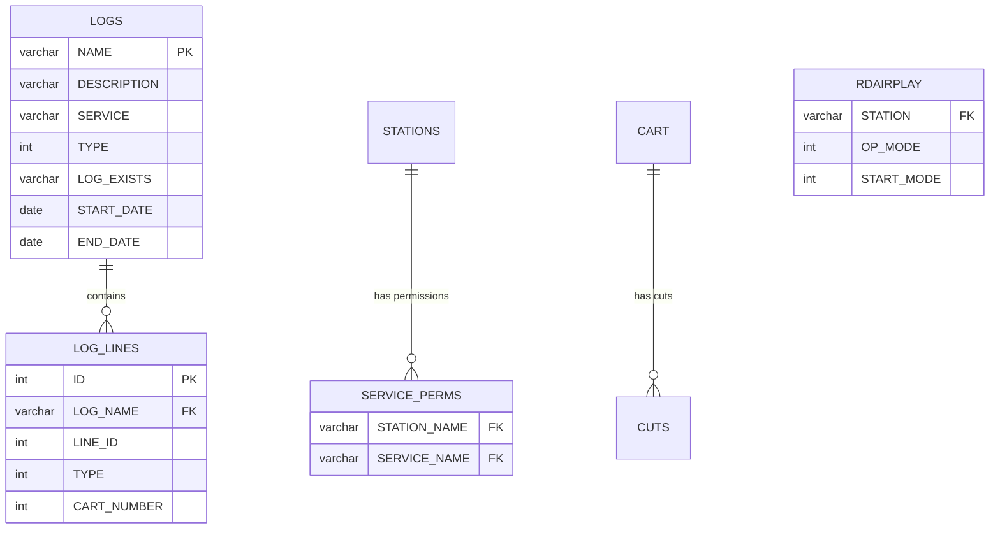
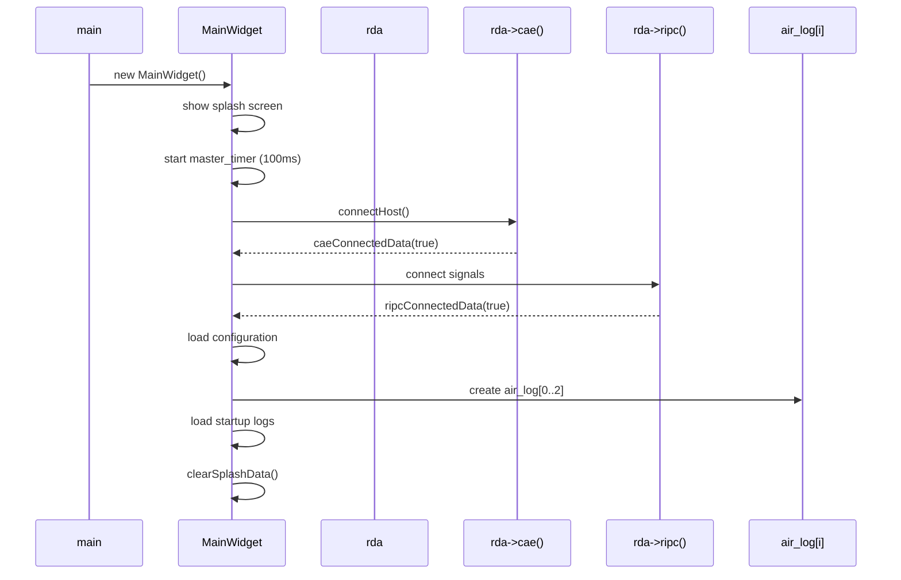
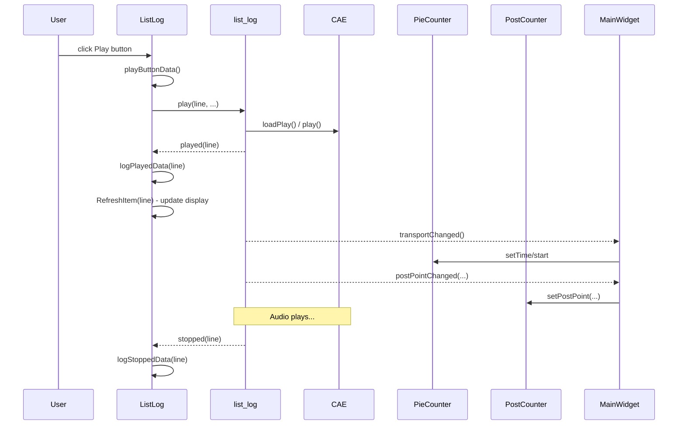
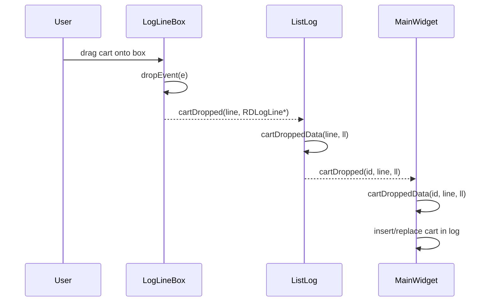
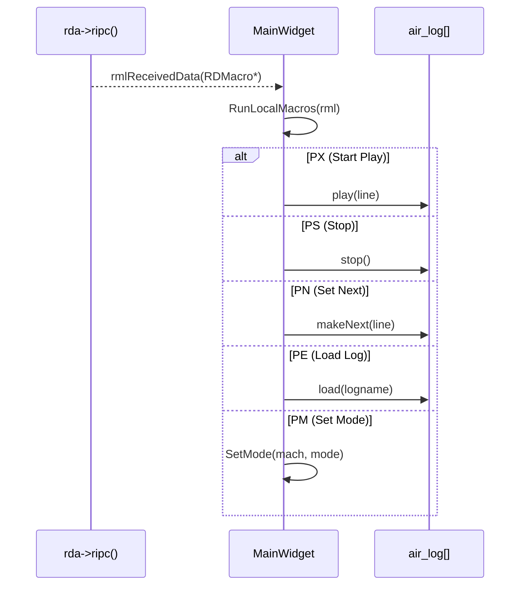
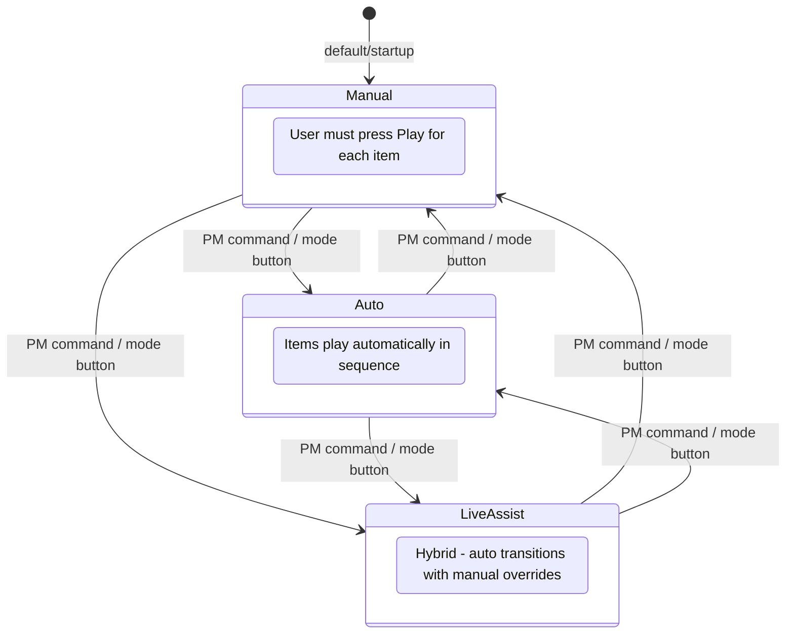
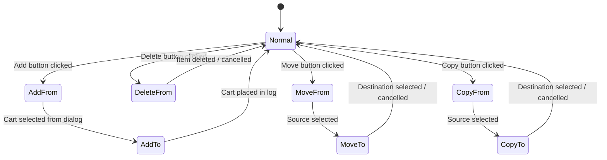
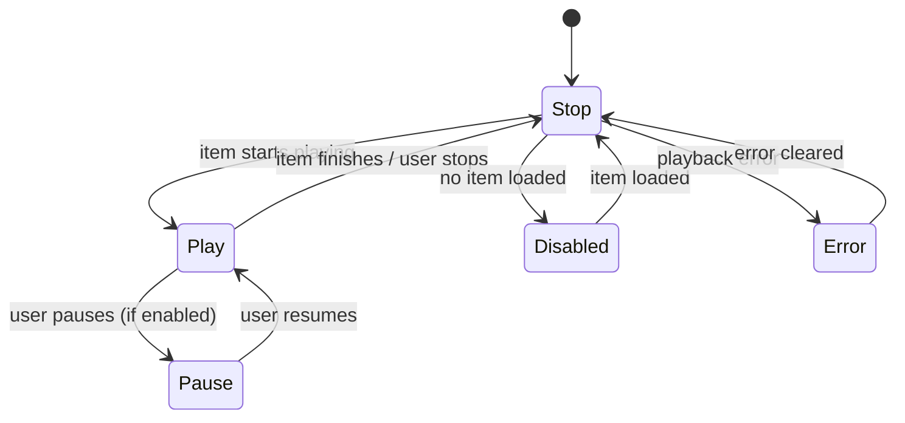

# Semantic Context: AIR (rdairplay)

## Files & Symbols

### Source Files

| File | Type | Symbols | LOC (est) |
|------|------|---------|-----------|
| rdairplay.h | header | MainWidget | ~200 |
| rdairplay.cpp | source | MainWidget (impl), main(), SigHandler | ~1500 |
| local_macros.cpp | source | MainWidget::RunLocalMacros, MessageFont, GetPanel | ~200 |
| list_log.h | header | ListLog, ListLog::PlayButtonMode | ~150 |
| list_log.cpp | source | ListLog (impl) | ~800 |
| button_log.h | header | ButtonLog | ~80 |
| button_log.cpp | source | ButtonLog (impl) | ~400 |
| edit_event.h | header | EditEvent | ~60 |
| edit_event.cpp | source | EditEvent (impl) | ~300 |
| loglinebox.h | header | LogLineBox, LogLineBox::BarMode | ~150 |
| loglinebox.cpp | source | LogLineBox (impl) | ~600 |
| start_button.h | header | StartButton | ~60 |
| start_button.cpp | source | StartButton (impl) | ~200 |
| wall_clock.h | header | WallClock | ~50 |
| wall_clock.cpp | source | WallClock (impl) | ~150 |
| hourselector.h | header | HourSelector | ~40 |
| hourselector.cpp | source | HourSelector (impl) | ~100 |
| post_counter.h | header | PostCounter | ~50 |
| post_counter.cpp | source | PostCounter (impl) | ~150 |
| pie_counter.h | header | PieCounter | ~80 |
| pie_counter.cpp | source | PieCounter (impl) | ~300 |
| mode_display.h | header | ModeDisplay | ~40 |
| mode_display.cpp | source | ModeDisplay (impl) | ~100 |
| stop_counter.h | header | StopCounter | ~40 |
| stop_counter.cpp | source | StopCounter (impl) | ~100 |
| lib_listview.h | header | LibListView | ~20 |
| lib_listview.cpp | source | LibListView (impl) | ~50 |
| list_logs.h | header | ListLogs | ~60 |
| list_logs.cpp | source | ListLogs (impl) | ~300 |
| globals.h | header | rdaudioport_conf, rdevent_player, rdcart_dialog (globals) | ~10 |
| colors.h | header | (color constants/macros) | ~20 |

### Symbol Index

| Symbol | Kind | File | Qt Class? |
|--------|------|------|-----------|
| MainWidget | Class | rdairplay.h | Yes (Q_OBJECT) |
| ListLog | Class | list_log.h | Yes (Q_OBJECT) |
| ButtonLog | Class | button_log.h | Yes (Q_OBJECT) |
| EditEvent | Class | edit_event.h | Yes (Q_OBJECT) |
| LogLineBox | Class | loglinebox.h | Yes (Q_OBJECT) |
| StartButton | Class | start_button.h | Yes (Q_OBJECT) |
| WallClock | Class | wall_clock.h | Yes (Q_OBJECT) |
| HourSelector | Class | hourselector.h | Yes (Q_OBJECT) |
| PostCounter | Class | post_counter.h | Yes (Q_OBJECT) |
| PieCounter | Class | pie_counter.h | Yes (Q_OBJECT) |
| ModeDisplay | Class | mode_display.h | Yes (Q_OBJECT) |
| StopCounter | Class | stop_counter.h | Yes (Q_OBJECT) |
| LibListView | Class | lib_listview.h | Yes (Q_OBJECT) |
| ListLogs | Class | list_logs.h | Yes (Q_OBJECT) |
| LogLineBox::BarMode | Enum | loglinebox.h | -- |
| ListLog::PlayButtonMode | Enum | list_log.h | -- |
| main() | Function | rdairplay.cpp | -- |
| SigHandler | Function | rdairplay.cpp | -- |
| rdaudioport_conf | Variable | globals.h | -- |
| rdevent_player | Variable | globals.h | -- |
| rdcart_dialog | Variable | globals.h | -- |

## Class API Surface

### MainWidget [Application Main Window]
- **File:** rdairplay.h / rdairplay.cpp, local_macros.cpp
- **Inherits:** RDWidget
- **Qt Object:** Yes (Q_OBJECT)

#### Signals
(none)

#### Slots
| Slot | Visibility | Parameters | Description |
|------|-----------|-----------|-------------|
| caeConnectedData | private | (bool state) | Handle CAE connection state change |
| ripcConnectedData | private | (bool state) | Handle RIPC connection state change |
| rmlReceivedData | private | (RDMacro *rml) | Handle incoming RML (macro) command |
| gpiStateChangedData | private | (int matrix, int line, bool state) | Handle GPI state change |
| logChannelStartedData | private | (int id, int mport, int card, int port) | Log channel started playing |
| logChannelStoppedData | private | (int id, int mport, int card, int port) | Log channel stopped |
| panelChannelStartedData | private | (int mport, int card, int port) | Sound panel channel started |
| panelChannelStoppedData | private | (int mport, int card, int port) | Sound panel channel stopped |
| logRenamedData | private | (int log) | Handle log rename event |
| logReloadedData | private | (int log) | Handle log reload event |
| userData | private | () | Handle user authentication change |
| addButtonData | private | () | Add button clicked |
| deleteButtonData | private | () | Delete button clicked |
| moveButtonData | private | () | Move button clicked |
| copyButtonData | private | () | Copy button clicked |
| fullLogButtonData | private | (int) | Full log view button clicked |
| panelButtonData | private | () | Panel button clicked |
| modeButtonData | private | () | Mode toggle button clicked |
| selectClickedData | private | (int id, int line, RDLogLine::Status status) | Log line selected |
| selectClickedData | private | (unsigned cartnum, int row, int col) | Panel cart selected (overload) |
| cartDroppedData | private | (int id, int line, RDLogLine *ll) | Cart dropped via drag-and-drop |
| meterData | private | () | Audio meter update tick |
| masterTimerData | private | () | Master timer tick (main event loop) |
| transportChangedData | private | () | Transport state changed |
| timeModeData | private | (RDAirPlayConf::TimeMode mode) | Time display mode changed |
| clearSplashData | private | () | Clear splash screen |

#### Public Methods
| Method | Return | Parameters | Brief |
|--------|--------|-----------|-------|
| sizeHint() | QSize | () | Widget size hint |
| sizePolicy() | QSizePolicy | () | Widget size policy |
| RunLocalMacros(RDMacro*) | void | (RDMacro *rml) | Execute local macro commands |
| StopEvent(int) | void | (int panel) | Stop event on a panel |
| SetCaption(QString) | void | (QString str) | Set window title/caption |
| SetMode(int, RDAirPlayConf::OpMode) | void | (int mach, mode) | Set operating mode for a log machine |
| SetManualMode(int) | void | (int mach) | Set manual playout mode |
| SetAutoMode(int) | void | (int mach) | Set automatic playout mode |
| SetLiveAssistMode(int) | void | (int mach) | Set live assist playout mode |
| SetActionMode(RDAirPlayConf::ActionMode) | void | (mode) | Set current action mode (add/delete/move/copy) |
| FirstPort(int) | int | (int mach) | Get first port for a log machine |
| GetPanel(RDMacro*) | int | (rml) | Get panel number from RML macro |
| MessageFont() | QFont | () | Get message display font |
| AssertChannelLock(int, int) | void | (int dir, int card, int port) | Assert lock on audio channel (2 overloads) |
| AudioChannel(int, int) | void | (int id, int mport) | Configure audio channel |
| PanelChannel(int) | void | (int mport) | Configure panel channel |

#### Enums
(none defined locally, uses RDAirPlayConf enums from LIB)

#### Key Fields
| Field | Type | Description |
|-------|------|-------------|
| air_log | ListLog*[] | Array of list log widgets (log machines) |
| air_panel | ButtonLog*[] | Array of button log widgets (sound panels) |
| air_post_counter | PostCounter* | Post-point time counter |
| air_pie_counter | PieCounter* | Pie chart countdown timer |
| air_stereo_meter | RDStereoMeter* | Audio level meter |
| air_stop_counter | StopCounter* | Stop time counter |
| air_mode_display | ModeDisplay* | Mode indicator display |
| air_op_mode | RDAirPlayConf::OpMode[] | Current op mode per log machine |
| air_action_mode | RDAirPlayConf::ActionMode | Current action mode |
| air_start_next | bool | Auto-start next flag |
| air_pause_enabled | bool | Pause button enabled |
| air_default_trans_type | RDLogLine::TransType | Default transition type |

---

### ListLog [Log Machine List View]
- **File:** list_log.h / list_log.cpp
- **Inherits:** RDWidget
- **Qt Object:** Yes (Q_OBJECT)

#### Signals
| Signal | Parameters | Description |
|--------|-----------|-------------|
| selectClicked | (int id, int line, RDLogLine::Status status) | Line selected in log |
| cartDropped | (int id, int line, RDLogLine *ll) | Cart dropped onto log |

#### Slots
| Slot | Visibility | Parameters | Description |
|------|-----------|-----------|-------------|
| headButtonData | private | () | Scroll to head/top |
| tailButtonData | private | () | Scroll to tail/bottom |
| auditionHeadData | private | (int line) | Audition head of item |
| auditionTailData | private | (int line) | Audition tail of item |
| auditionStoppedData | private | (int line) | Audition finished |
| takeButtonData | private | () | Take next event |
| playButtonData | private | () | Play/stop button clicked |
| modifyButtonData | private | () | Modify event button |
| doubleclickedData | private | (Q3ListViewItem*,...) | Item double-clicked |
| scrollButtonData | private | () | Scroll toggle |
| refreshButtonData | private | () | Refresh log |
| nextButtonData | private | () | Make next button |
| loadButtonData | private | () | Load log dialog |
| logReloadedData | private | () | Log reloaded notification |
| logPlayedData | private | (int line) | Line started playing |
| logPausedData | private | (int line) | Line paused |
| logStoppedData | private | (int line) | Line stopped |
| logInsertedData | private | (int line) | Line inserted |
| logRemovedData | private | (int line, int num, bool moving) | Line(s) removed |
| selectionChangedData | private | () | Selection changed |
| transportChangedData | private | () | Transport state changed |
| modifiedData | private | (int line) | Line modified |
| refreshabilityChangedData | private | (bool state) | Refresh availability changed |
| cartDroppedData | private | (int line, RDLogLine *ll) | Cart dropped handler |

#### Public Methods
| Method | Return | Parameters | Brief |
|--------|--------|-----------|-------|
| refresh() | void | () | Refresh entire list |
| refresh(int) | void | (int line) | Refresh specific line |
| setStatus(int, RDLogLine::Status) | void | (line, status) | Set line status |
| actionMode() | RDAirPlayConf::ActionMode | () | Get current action mode |
| setActionMode(mode, int*) | void | (mode, cartnum) | Set action mode |
| setOpMode(mode) | void | (RDAirPlayConf::OpMode) | Set operating mode |
| setTimeMode(mode) | void | (RDAirPlayConf::TimeMode) | Set time display mode |
| userChanged(...) | void | (bools) | Update permissions for current user |

#### Enums
| Enum | Values |
|------|--------|
| PlayButtonMode | ButtonDisabled=0, ButtonPlay=1, ButtonStop=2 |

---

### ButtonLog [Sound Panel Button Grid]
- **File:** button_log.h / button_log.cpp
- **Inherits:** RDWidget
- **Qt Object:** Yes (Q_OBJECT)

#### Signals
| Signal | Parameters | Description |
|--------|-----------|-------------|
| selectClicked | (int id, int line, RDLogLine::Status) | Button selected |
| cartDropped | (int id, int line, RDLogLine *ll) | Cart dropped on button |

#### Slots
| Slot | Visibility | Parameters | Description |
|------|-----------|-----------|-------------|
| startButton | public | (int) | Start button hotkey |
| stopButtonHotkey | public | (int) | Stop button hotkey |
| pauseButtonHotkey | public | (int) | Pause button hotkey |
| transportChangedData | private | () | Transport changed |
| modifiedData | private | (int line) | Line modified |
| boxDoubleClickedData | private | (int line) | Box double-clicked |
| playedData | private | (int line) | Playing started |
| stoppedData | private | (int line) | Playback stopped |
| pausedData | private | (int line) | Playback paused |
| positionData | private | (int line, int point) | Playback position |
| cartDroppedData | private | (int line, RDLogLine *ll) | Cart dropped handler |

#### Public Methods
| Method | Return | Parameters | Brief |
|--------|--------|-----------|-------|
| opMode() | RDAirPlayConf::OpMode | () | Get operating mode |
| setOpMode(mode) | void | (OpMode) | Set operating mode |
| actionMode() | RDAirPlayConf::ActionMode | () | Get action mode |
| setActionMode(mode, int*) | void | (mode, cartnum) | Set action mode |
| setTimeMode(mode) | void | (TimeMode) | Set time display mode |

---

### EditEvent [Event Properties Dialog]
- **File:** edit_event.h / edit_event.cpp
- **Inherits:** RDDialog
- **Qt Object:** Yes (Q_OBJECT)

#### Signals
(none)

#### Slots
| Slot | Visibility | Parameters | Description |
|------|-----------|-----------|-------------|
| exec | public | (int line) | Show dialog for given log line; returns QDialog result |
| timeChangedData | private | (const QTime&) | Time value changed |
| timeToggledData | private | (bool state) | Time type toggled |
| graceClickedData | private | (int id) | Grace time radio clicked |
| okData | private | () | OK button |
| cancelData | private | () | Cancel button |

#### Public Methods
| Method | Return | Parameters | Brief |
|--------|--------|-----------|-------|
| sizeHint() | QSize | () | Dialog size hint |
| sizePolicy() | QSizePolicy | () | Dialog size policy |

---

### LogLineBox [Single Log Line Display Widget]
- **File:** loglinebox.h / loglinebox.cpp
- **Inherits:** RDWidget
- **Qt Object:** Yes (Q_OBJECT)

#### Signals
| Signal | Parameters | Description |
|--------|-----------|-------------|
| doubleClicked | (int line) | Line box double-clicked |
| cartDropped | (int line, RDLogLine *ll) | Cart dropped on this box |

#### Slots
| Slot | Visibility | Parameters | Description |
|------|-----------|-----------|-------------|
| countdownData | private | () | Countdown timer tick |

#### Public Methods
| Method | Return | Parameters | Brief |
|--------|--------|-----------|-------|
| mode() | LogLineBox::Mode | () | Get display mode (Full/Half) |
| line() | int | () | Get current line number |
| setLine(int) | void | (int line) | Set line number |
| logLine() | RDLogLine* | () | Get associated log line |
| setMode(Mode) | void | (mode) | Set display mode |
| setEvent(int, TransType, RDLogLine*) | void | (line, next_type, logline) | Set event to display |
| setTimer(int) | void | (int msecs) | Set countdown timer |
| clear() | void | () | Clear display |
| setBarMode(BarMode) | void | (mode) | Set progress bar mode |
| setTimeMode(TimeMode) | void | (mode) | Set time display mode |
| setStatus(Status) | void | (status) | Set playback status |
| setAllowDrags(bool) | void | (state) | Enable/disable drag-and-drop |

#### Enums
| Enum | Values |
|------|--------|
| Mode | Full=0, Half=1 |
| BarMode | Transitioning=0, Stopping=1 |

---

### StartButton [Play/Stop/Pause Button]
- **File:** start_button.h / start_button.cpp
- **Inherits:** RDPushButton
- **Qt Object:** Yes (Q_OBJECT)

#### Signals
(none - inherits from RDPushButton)

#### Slots
| Slot | Visibility | Parameters | Description |
|------|-----------|-----------|-------------|
| setGeometry | public | (int x, int y, int w, int h) | Override geometry setter |

#### Public Methods
| Method | Return | Parameters | Brief |
|--------|--------|-----------|-------|
| setTime(QString) | void | (str) | Set time display string |
| setTime(QTime) | void | (time) | Set time display from QTime |
| setPort(QString) | void | (port) | Set port label |
| mode() | StartButton::Mode | () | Get current button mode |
| setMode(Mode, RDCart::Type) | void | (mode, cart_type) | Set button mode and cart type |
| setTimeMode(TimeMode) | void | (mode) | Set time display mode |

#### Enums
| Enum | Values |
|------|--------|
| Mode | Stop=0, Play=1, Pause=2, AddFrom=3, AddTo=4, DeleteFrom=5, MoveFrom=6, MoveTo=7, CopyFrom=8, CopyTo=9, Disabled=10, Error=11 |

---

### WallClock [Time-of-Day Display]
- **File:** wall_clock.h / wall_clock.cpp
- **Inherits:** RDPushButton
- **Qt Object:** Yes (Q_OBJECT)

#### Signals
| Signal | Parameters | Description |
|--------|-----------|-------------|
| timeModeChanged | (RDAirPlayConf::TimeMode) | Time mode toggled by user click |

#### Slots
| Slot | Visibility | Parameters | Description |
|------|-----------|-----------|-------------|
| tickClock | public | () | Update clock display |
| clickedData | private | () | Clock clicked (toggle 12h/24h) |

#### Public Methods
| Method | Return | Parameters | Brief |
|--------|--------|-----------|-------|
| setDateDisplay(bool) | void | (state) | Show/hide date display |
| setTimeMode(TimeMode) | void | (mode) | Set 12h/24h mode |
| setCheckSyncEnabled(bool) | void | (state) | Enable NTP sync check |

---

### HourSelector [Hour Navigation Bar]
- **File:** hourselector.h / hourselector.cpp
- **Inherits:** RDWidget
- **Qt Object:** Yes (Q_OBJECT)

#### Signals
| Signal | Parameters | Description |
|--------|-----------|-------------|
| hourSelected | (int hour) | User selected a specific hour |

#### Slots
| Slot | Visibility | Parameters | Description |
|------|-----------|-----------|-------------|
| hourClicked | private | (int hour) | Hour button clicked |
| updateTimeData | private | () | Update current time highlighting |

#### Public Methods
| Method | Return | Parameters | Brief |
|--------|--------|-----------|-------|
| setTimeMode(TimeMode) | void | (mode) | Set time display mode |
| updateHours(bool[24]) | void | (states) | Update which hours have events |

---

### PostCounter [Post-Point Countdown]
- **File:** post_counter.h / post_counter.cpp
- **Inherits:** RDPushButton
- **Qt Object:** Yes (Q_OBJECT)

#### Signals
(none)

#### Slots
| Slot | Visibility | Parameters | Description |
|------|-----------|-----------|-------------|
| setPostPoint | public | (QTime point, int offset, bool valid, bool running) | Set post-point target |
| tickCounter | public | () | Update countdown display |
| setEnabled | public | (bool state) | Enable/disable |
| setDisabled | public | (bool state) | Disable/enable |

#### Public Methods
| Method | Return | Parameters | Brief |
|--------|--------|-----------|-------|
| setTimeMode(TimeMode) | void | (mode) | Set time display mode |

---

### PieCounter [Pie Chart Countdown Timer]
- **File:** pie_counter.h / pie_counter.cpp
- **Inherits:** RDWidget
- **Qt Object:** Yes (Q_OBJECT)

#### Signals
(none)

#### Slots
| Slot | Visibility | Parameters | Description |
|------|-----------|-----------|-------------|
| setOnairFlag | public | (bool state) | Set on-air indicator |
| tickCounter | public | () | Update pie chart countdown |

#### Public Methods
| Method | Return | Parameters | Brief |
|--------|--------|-----------|-------|
| line() | int | () | Get current line |
| setLine(int) | void | (line) | Set current line |
| setTime(int) | void | (msecs) | Set remaining time |
| setCountLength(int) | void | (msecs) | Set total count length |
| setTalkStart(int) | void | (msecs) | Set talk start marker |
| setTalkEnd(int) | void | (msecs) | Set talk end marker |
| resetTime() | void | () | Reset countdown |
| setOpMode(OpMode) | void | (opmode) | Set operating mode |
| setTransType(TransType) | void | (trans) | Set transition type |
| start(int) | void | (offset) | Start countdown |
| stop() | void | () | Stop countdown |
| setLogline(RDLogLine*) | void | (logline) | Set associated log line |

---

### ModeDisplay [Operating Mode Indicator]
- **File:** mode_display.h / mode_display.cpp
- **Inherits:** RDPushButton
- **Qt Object:** Yes (Q_OBJECT)

#### Signals
(none)

#### Public Methods
| Method | Return | Parameters | Brief |
|--------|--------|-----------|-------|
| setOpMode(int, OpMode) | void | (mach, mode) | Set mode for log machine |
| setOpModeStyle(OpModeStyle) | void | (style) | Set display style |

---

### StopCounter [Next Stop Time Display]
- **File:** stop_counter.h / stop_counter.cpp
- **Inherits:** RDPushButton
- **Qt Object:** Yes (Q_OBJECT)

#### Signals
(none)

#### Slots
| Slot | Visibility | Parameters | Description |
|------|-----------|-----------|-------------|
| setTime | public | (QTime time) | Set stop time |
| tickCounter | public | () | Update display |

#### Public Methods
| Method | Return | Parameters | Brief |
|--------|--------|-----------|-------|
| setState(bool) | void | (state) | Set running state |
| setTimeMode(TimeMode) | void | (mode) | Set time display mode |

---

### LibListView [Drag-Drop Enabled List View]
- **File:** lib_listview.h / lib_listview.cpp
- **Inherits:** RDListView
- **Qt Object:** Yes (Q_OBJECT)

#### Signals
(none - inherits from RDListView)

#### Public Methods
(none additional - overrides dragEnterEvent, dropEvent only)

---

### ListLogs [Log Selection Dialog]
- **File:** list_logs.h / list_logs.cpp
- **Inherits:** RDDialog
- **Qt Object:** Yes (Q_OBJECT)

#### Signals
(none)

#### Slots
| Slot | Visibility | Parameters | Description |
|------|-----------|-----------|-------------|
| exec | public | (QString *logname, QString *svcname, RDLogLock **loglock) | Show dialog, return operation |
| filterChangedData | private | (const QString &where_sql) | Filter text changed |
| doubleClickedData | private | (Q3ListViewItem*,...) | List item double-clicked |
| loadButtonData | private | () | Load button clicked |
| saveButtonData | private | () | Save button clicked |
| saveAsButtonData | private | () | Save As button clicked |
| unloadButtonData | private | () | Unload button clicked |
| cancelButtonData | private | () | Cancel button clicked |

#### Public Methods
| Method | Return | Parameters | Brief |
|--------|--------|-----------|-------|
| sizeHint() | QSize | () | Dialog size hint |

#### Enums
| Enum | Values |
|------|--------|
| Operation | Load=0, Cancel=1, Save=2, SaveAs=3, Unload=4 |

## Data Model

**Note:** rdairplay does NOT define any tables (no CREATE TABLE). It accesses database tables
defined in the LIB (librd) dependency through both direct SQL queries and LIB Active Record classes.

### Direct SQL Queries in rdairplay

#### Table: LOGS (via LIB schema)
- **Used in:** rdairplay.cpp (line ~864), list_logs.cpp (line ~249)
- **Operations:** SELECT only
- **Queries:**
  1. `SELECT NAME FROM LOGS WHERE NAME="{logname}"` -- Check if log exists at startup
  2. `SELECT NAME,DESCRIPTION,SERVICE FROM LOGS WHERE (TYPE=0) AND (LOG_EXISTS="Y") AND date-range filters` -- List available logs in load dialog
- **Columns referenced:** NAME, DESCRIPTION, SERVICE, TYPE, LOG_EXISTS, START_DATE, END_DATE

#### Table: SERVICE_PERMS (via LIB schema)
- **Used in:** rdairplay.cpp (line ~2216), list_logs.cpp (line ~127)
- **Operations:** SELECT only
- **Queries:**
  1. `SELECT SERVICE_NAME FROM SERVICE_PERMS WHERE STATION_NAME="{station}"` -- Get permitted services for this station
- **Columns referenced:** SERVICE_NAME, STATION_NAME

### LIB Classes Used for Data Access
| LIB Class | Purpose | Tables (indirect) |
|-----------|---------|-------------------|
| RDLogPlay | Log playout engine | LOGS, LOG_LINES |
| RDLog | Log metadata | LOGS |
| RDLogLine | Single log line | LOG_LINES |
| RDCart | Cart (audio item) metadata | CART |
| RDCut | Audio cut data | CUTS |
| RDAirPlayConf | AirPlay configuration | RDAIRPLAY |
| RDStation | Station configuration | STATIONS |
| RDUser | User permissions | USERS |
| RDLogLock | Log locking mechanism | LOG_MACHINES |
| RDMacro | RML macro commands | (runtime, no table) |

### ERD (tables accessed by AIR)


## Reactive Architecture

### Signal/Slot Connections

#### MainWidget (rdairplay.cpp) - Core Wiring

| # | Sender | Signal | Receiver | Slot | File:Line |
|---|--------|--------|----------|------|-----------|
| 1 | timer (QTimer) | timeout() | this | clearSplashData() | rdairplay.cpp:90 |
| 2 | air_master_timer | timeout() | this | masterTimerData() | rdairplay.cpp:186 |
| 3 | rda->cae() | isConnected(bool) | this | caeConnectedData(bool) | rdairplay.cpp:253 |
| 4 | rda->ripc() | connected(bool) | this | ripcConnectedData(bool) | rdairplay.cpp:265 |
| 5 | rda | userChanged() | this | userData() | rdairplay.cpp:266 |
| 6 | rda->ripc() | rmlReceived(RDMacro*) | this | rmlReceivedData(RDMacro*) | rdairplay.cpp:267 |
| 7 | rda->ripc() | gpiStateChanged(int,int,bool) | this | gpiStateChangedData(int,int,bool) | rdairplay.cpp:269 |
| 8 | reload_mapper | mapped(int) | this | logReloadedData(int) | rdairplay.cpp:281 |
| 9 | rename_mapper | mapped(int) | this | logRenamedData(int) | rdairplay.cpp:283 |
| 10 | air_log[i] | reloaded() | reload_mapper | map() | rdairplay.cpp:291 |
| 11 | air_log[i] | renamed() | rename_mapper | map() | rdairplay.cpp:293 |
| 12 | air_log[i] | channelStarted(int,int,int,int) | this | logChannelStartedData(int,int,int,int) | rdairplay.cpp:294 |
| 13 | air_log[i] | channelStopped(int,int,int,int) | this | logChannelStoppedData(int,int,int,int) | rdairplay.cpp:296 |
| 14 | air_log[0] | transportChanged() | this | transportChangedData() | rdairplay.cpp:299 |
| 15 | air_master_timer | timeout() | clock | tickClock() | rdairplay.cpp:352 |
| 16 | clock (WallClock) | timeModeChanged(TimeMode) | this | timeModeData(TimeMode) | rdairplay.cpp:354 |
| 17 | air_master_timer | timeout() | air_post_counter | tickCounter() | rdairplay.cpp:365 |
| 18 | air_log[0] | postPointChanged(QTime,int,bool,bool) | air_post_counter | setPostPoint(QTime,int,bool,bool) | rdairplay.cpp:367 |
| 19 | air_master_timer | timeout() | air_pie_counter | tickCounter() | rdairplay.cpp:380 |
| 20 | rda->ripc() | onairFlagChanged(bool) | air_pie_counter | setOnairFlag(bool) | rdairplay.cpp:382 |
| 21 | air_master_timer | timeout() | air_stop_counter | tickCounter() | rdairplay.cpp:417 |
| 22 | air_log[0] | nextStopChanged(QTime) | air_stop_counter | setTime(QTime) | rdairplay.cpp:419 |
| 23 | air_mode_display | clicked() | this | modeButtonData() | rdairplay.cpp:432 |
| 24 | air_add_button | clicked() | this | addButtonData() | rdairplay.cpp:463 |
| 25 | air_delete_button | clicked() | this | deleteButtonData() | rdairplay.cpp:474 |
| 26 | air_move_button | clicked() | this | moveButtonData() | rdairplay.cpp:485 |
| 27 | air_copy_button | clicked() | this | copyButtonData() | rdairplay.cpp:496 |
| 28 | meter timer | timeout() | this | meterData() | rdairplay.cpp:502 |
| 29 | rda->ripc() | userChanged() | air_panel | changeUser() | rdairplay.cpp:612 |
| 30 | air_master_timer | timeout() | air_panel | tickClock() | rdairplay.cpp:613 |
| 31 | air_panel | selectClicked(unsigned,int,int) | this | selectClickedData(unsigned,int,int) | rdairplay.cpp:614 |
| 32 | air_panel | channelStarted(int,int,int) | this | panelChannelStartedData(int,int,int) | rdairplay.cpp:616 |
| 33 | air_panel | channelStopped(int,int,int) | this | panelChannelStoppedData(int,int,int) | rdairplay.cpp:618 |
| 34 | air_log_list[i] | selectClicked(int,int,RDLogLine::Status) | this | selectClickedData(int,int,RDLogLine::Status) | rdairplay.cpp:631 |
| 35 | air_log_list[i] | cartDropped(int,int,RDLogLine*) | this | cartDroppedData(int,int,RDLogLine*) | rdairplay.cpp:633 |
| 36 | mapper (fullLog) | mapped(int) | this | fullLogButtonData(int) | rdairplay.cpp:641 |
| 37 | air_log_button[i] | clicked() | mapper | map() | rdairplay.cpp:648 |
| 38 | air_panel_button | clicked() | this | panelButtonData() | rdairplay.cpp:680 |
| 39 | air_button_list | selectClicked(int,int,RDLogLine::Status) | this | selectClickedData(int,int,RDLogLine::Status) | rdairplay.cpp:698 |
| 40 | air_button_list | cartDropped(int,int,RDLogLine*) | this | cartDroppedData(int,int,RDLogLine*) | rdairplay.cpp:700 |

#### ListLog (list_log.cpp) - Log List Wiring

| # | Sender | Signal | Receiver | Slot | File:Line |
|---|--------|--------|----------|------|-----------|
| 41 | list_hour_selector | hourSelected(int) | this | selectHour(int) | list_log.cpp:131 |
| 42 | list_log_list | selectionChanged() | this | selectionChangedData() | list_log.cpp:190 |
| 43 | list_log_list | doubleClicked(...) | this | doubleclickedData(...) | list_log.cpp:192 |
| 44 | list_log_list | cartDropped(int,RDLogLine*) | this | cartDroppedData(int,RDLogLine*) | list_log.cpp:196 |
| 45 | list_take_button | clicked() | this | takeButtonData() | list_log.cpp:253 |
| 46 | list_head_button | clicked() | this | headButtonData() | list_log.cpp:265 |
| 47 | list_tail_button | clicked() | this | tailButtonData() | list_log.cpp:279 |
| 48 | list_play_button | clicked() | this | playButtonData() | list_log.cpp:294 |
| 49 | list_next_button | clicked() | this | nextButtonData() | list_log.cpp:306 |
| 50 | list_modify_button | clicked() | this | modifyButtonData() | list_log.cpp:318 |
| 51 | list_scroll_button | clicked() | this | scrollButtonData() | list_log.cpp:329 |
| 52 | list_refresh_button | clicked() | this | refreshButtonData() | list_log.cpp:342 |
| 53 | list_load_button | clicked() | this | loadButtonData() | list_log.cpp:355 |
| 54 | list_log (RDLogPlay) | reloaded() | this | logReloadedData() | list_log.cpp:365 |
| 55 | list_log | played(int) | this | logPlayedData(int) | list_log.cpp:366 |
| 56 | list_log | paused(int) | this | logPausedData(int) | list_log.cpp:367 |
| 57 | list_log | stopped(int) | this | logStoppedData(int) | list_log.cpp:368 |
| 58 | list_log | inserted(int) | this | logInsertedData(int) | list_log.cpp:369 |
| 59 | list_log | removed(int,int,bool) | this | logRemovedData(int,int,bool) | list_log.cpp:370 |
| 60 | list_log | transportChanged() | this | transportChangedData() | list_log.cpp:372 |
| 61 | list_log | modified(int) | this | modifiedData(int) | list_log.cpp:374 |
| 62 | list_log | refreshabilityChanged(bool) | this | refreshabilityChangedData(bool) | list_log.cpp:375 |
| 63 | list_log | auditionHeadPlayed(int) | this | auditionHeadData(int) | list_log.cpp:377 |
| 64 | list_log | auditionTailPlayed(int) | this | auditionTailData(int) | list_log.cpp:379 |
| 65 | list_log | auditionStopped(int) | this | auditionStoppedData(int) | list_log.cpp:381 |

#### ButtonLog (button_log.cpp) - Sound Panel Wiring

| # | Sender | Signal | Receiver | Slot | File:Line |
|---|--------|--------|----------|------|-----------|
| 66 | log_log (RDLogPlay) | transportChanged() | this | transportChangedData() | button_log.cpp:37 |
| 67 | log_log | modified(int) | this | modifiedData(int) | button_log.cpp:39 |
| 68 | log_log | played(int) | this | playedData(int) | button_log.cpp:40 |
| 69 | log_log | stopped(int) | this | stoppedData(int) | button_log.cpp:41 |
| 70 | log_log | paused(int) | this | pausedData(int) | button_log.cpp:42 |
| 71 | log_log | position(int,int) | this | positionData(int,int) | button_log.cpp:43 |
| 72 | mapper (start) | mapped(int) | this | startButton(int) | button_log.cpp:54 |
| 73 | log_line_box[i] | doubleClicked(int) | this | boxDoubleClickedData(int) | button_log.cpp:65 |
| 74 | log_line_box[i] | cartDropped(int,RDLogLine*) | this | cartDroppedData(int,RDLogLine*) | button_log.cpp:67 |
| 75 | log_start_button[i] | clicked() | mapper | map() | button_log.cpp:75 |

#### Other Widgets

| # | Sender | Signal | Receiver | Slot | File:Line |
|---|--------|--------|----------|------|-----------|
| 76 | WallClock (self) | clicked() | self | clickedData() | wall_clock.cpp:44 |
| 77 | hour_button[i] | clicked() | mapper | map() | hourselector.cpp:42 |
| 78 | mapper (hour) | mapped(int) | this | hourClicked(int) | hourselector.cpp:36 |
| 79 | hour_update_timer | timeout() | this | updateTimeData() | hourselector.cpp:50 |
| 80 | line_countdown_timer | timeout() | this | countdownData() | loglinebox.cpp:278 |
| 81 | edit_time_edit | valueChanged(QTime) | this | timeChangedData(QTime) | edit_event.cpp:46 |
| 82 | edit_grace_bgroup | buttonClicked(int) | this | graceClickedData(int) | edit_event.cpp:53 |
| 83 | edit_timetype_box | toggled(bool) | this | timeToggledData(bool) | edit_event.cpp:72 |
| 84 | edit_ok_button | clicked() | this | okData() | edit_event.cpp:131 |
| 85 | edit_cancel_button | clicked() | this | cancelData() | edit_event.cpp:139 |
| 86 | list_filter_widget | filterChanged(QString) | this | filterChangedData(QString) | list_logs.cpp:48 |
| 87 | list_log_list | doubleClicked(...) | this | doubleClickedData(...) | list_logs.cpp:57 |
| 88 | list_load_button | clicked() | this | loadButtonData() | list_logs.cpp:73 |
| 89 | list_unload_button | clicked() | this | unloadButtonData() | list_logs.cpp:80 |
| 90 | list_save_button | clicked() | this | saveButtonData() | list_logs.cpp:87 |
| 91 | list_saveas_button | clicked() | this | saveAsButtonData() | list_logs.cpp:94 |
| 92 | list_cancel_button | clicked() | this | cancelButtonData() | list_logs.cpp:102 |

### Emitted Signals

| # | Emitter | Signal | Emitted In | Condition |
|---|---------|--------|-----------|-----------|
| 1 | HourSelector | hourSelected(int) | hourselector.cpp:122 | User clicks hour button |
| 2 | LogLineBox | doubleClicked(int) | loglinebox.cpp:835 | User double-clicks box |
| 3 | LogLineBox | cartDropped(int,RDLogLine*) | loglinebox.cpp:864 | Cart dragged onto box |
| 4 | WallClock | timeModeChanged(TimeMode) | wall_clock.cpp:72 | User clicks clock to toggle 12h/24h |
| 5 | LibListView | cartDropped(int,RDLogLine*) | lib_listview.cpp:53 | Cart dragged onto list view |
| 6 | ButtonLog | selectClicked(int,int,RDLogLine::Status) | button_log.cpp:336 | User selects button |
| 7 | ButtonLog | cartDropped(int,int,RDLogLine*) | button_log.cpp:462 | Cart dropped on button panel |
| 8 | ListLog | selectClicked(int,int,RDLogLine::Status) | list_log.cpp:675 | User selects log line |
| 9 | ListLog | cartDropped(int,int,RDLogLine*) | list_log.cpp:1061 | Cart dropped on log list |

### Key Sequence Diagrams

#### Startup Sequence


#### Playout Sequence (List Mode)


#### Cart Drag-and-Drop Sequence


#### RML Macro Processing


### Cross-Artifact Dependencies
| External Class | From Artifact | Used In | Purpose |
|---------------|---------------|---------|---------|
| RDLogPlay | LIB | rdairplay.cpp, list_log.cpp, button_log.cpp | Log playout engine |
| RDLog | LIB | list_log.cpp | Log metadata/save/load |
| RDLogLine | LIB | loglinebox.cpp, list_log.cpp, button_log.cpp | Individual log line data |
| RDCart | LIB | loglinebox.cpp | Cart metadata |
| RDCut | LIB | loglinebox.cpp | Cut audio data |
| RDAirPlayConf | LIB | rdairplay.cpp, all widgets | AirPlay configuration |
| RDStation | LIB | rdairplay.cpp | Station configuration |
| RDApplication (rda) | LIB | rdairplay.cpp | Application singleton |
| RDMacro | LIB | rdairplay.cpp, local_macros.cpp | RML macro command |
| RDStereoMeter | LIB | rdairplay.cpp | Audio level metering |
| RDLogLock | LIB | list_log.cpp, list_logs.cpp | Log exclusive locking |
| RDWidget | LIB | all widgets | Base widget class |
| RDDialog | LIB | edit_event.h, list_logs.h | Base dialog class |
| RDPushButton | LIB | start_button.h, wall_clock.h, etc. | Base button class |
| RDListView | LIB | lib_listview.h | Base list view |
| RDSqlQuery | LIB | rdairplay.cpp, list_logs.cpp | SQL query wrapper |
| RDCartDrag | LIB | loglinebox.cpp, lib_listview.cpp | Cart drag-and-drop |
| RDCueEdit | LIB | edit_event.cpp | Cue point editor widget |
| RDEventPlayer | LIB | globals.h (rdevent_player) | Event sound player |
| RDCartDialog | LIB | globals.h (rdcart_dialog) | Cart browser dialog |
| RDSoundPanel | LIB | rdairplay.cpp (air_panel) | Sound panel widget |

## Business Rules

### Rule: Single Instance Lock
- **Source:** rdairplay.cpp:78
- **Trigger:** Application startup
- **Condition:** `air_lock->lock()` fails (another RDAirPlay is running)
- **Action:** Show error "Multiple instances not allowed!" and exit(1)
- **Gherkin:**
  ```gherkin
  Scenario: Prevent multiple RDAirPlay instances
    Given an RDAirPlay instance is already running
    When a second RDAirPlay instance starts
    Then it displays "Multiple instances not allowed!"
    And exits with code 1
  ```

### Rule: Application Initialization Failure
- **Source:** rdairplay.cpp:102
- **Trigger:** Application startup
- **Condition:** `rda->open()` returns false (DB connection failure, config error)
- **Action:** Show critical error and exit(1)

### Rule: Unknown Command-Line Option
- **Source:** rdairplay.cpp:137
- **Trigger:** Application startup
- **Condition:** Command switch is not processed/recognized
- **Action:** Show critical error with the unknown option and exit(2)

### Rule: Memory Lock Warning
- **Source:** rdairplay.cpp:753
- **Trigger:** After RIPC connection established
- **Condition:** `lockRdairplayMemory()` is true but `mlockall()` fails
- **Action:** Show warning but continue execution (non-fatal)

### Rule: Channel Assignment Validation
- **Source:** rdairplay.cpp:804
- **Trigger:** RIPC connected
- **Condition:** `air_log[0]->channelsValid()` is false
- **Action:** Show warning "Main Log channel assignments are invalid!"
- **Gherkin:**
  ```gherkin
  Scenario: Invalid channel assignments warning
    Given the Main Log has invalid audio channel assignments
    When RDAirPlay connects to RIPC
    Then it displays a warning about invalid channel assignments
    And continues to operate (non-blocking)
  ```

### Rule: Exit Password Protection
- **Source:** rdairplay.cpp:1992
- **Trigger:** User attempts to close application
- **Condition:** Exit password is configured (exitPasswordValid("") returns false)
- **Action:** Prompt for password. If invalid, ignore close event. If valid, exit.
- **Gherkin:**
  ```gherkin
  Scenario: Exit with password protection
    Given an exit password is configured
    When the user attempts to close RDAirPlay
    Then a password dialog appears
    And the user must enter the correct password to exit
  ```

### Rule: Exit Confirmation (no password)
- **Source:** rdairplay.cpp:2005
- **Trigger:** User attempts to close when no exit password is set
- **Condition:** No exit password configured
- **Action:** Show "Exit RDAirPlay?" confirmation dialog
- **Gherkin:**
  ```gherkin
  Scenario: Exit confirmation dialog
    Given no exit password is configured
    When the user attempts to close RDAirPlay
    Then a "Exit RDAirPlay?" confirmation appears
    And the user must confirm with Yes to exit
  ```

### Rule: Duplicate Start Time Prevention
- **Source:** edit_event.cpp:364
- **Trigger:** User clicks OK in EditEvent dialog
- **Condition:** Time type checkbox is checked AND another event exists at the same time
- **Action:** Show warning "An event is already scheduled with this start time!" and block save

### Rule: Log Must Be Refreshed Before Save
- **Source:** list_logs.cpp:183
- **Trigger:** User attempts to save a log
- **Condition:** `list_log->isRefreshable()` returns true (log has pending changes)
- **Action:** Show error "You must refresh the log before it can be saved." and cancel operation

### Rule: Log Lock Mechanism
- **Source:** list_logs.cpp:177, 269-282
- **Trigger:** User attempts to save/lock a log
- **Condition:** Log is already locked by another user/station
- **Action:** Show warning with locker's username and address, prevent operation
- **Gherkin:**
  ```gherkin
  Scenario: Prevent saving a locked log
    Given another user has locked the log
    When the current user attempts to save
    Then a warning shows who locked the log and from which station
    And the save operation is cancelled
  ```

### State Machine: Operating Modes


### State Machine: Action Modes


### State Machine: StartButton Modes


### RML Macro Commands (local_macros.cpp)
| Command | Code | Args | Description |
|---------|------|------|-------------|
| LB | Label | 0+ | Set/clear message label text |
| LC | Color Label | 1+ | Set colored message label text |
| LL | Load Log | 1-3 | Load a log into a log machine |
| AL | Append Log | 2 | Append log to current log |
| MN | Make Next | 2 | Set next line in log |
| PB | Push Button | 1 | Simulate button push |
| PC | Label Button | 5+ | Set sound panel button label |
| PE | Load Panel | 4 | Load cart into panel button |
| PL | Start | 2 | Start playing a log line |
| PM | Set Mode | 1-2 | Set operating mode (Manual/Auto/LiveAssist) |
| PN | Start Next | 1-3 | Start next item, optionally with transition/offset |
| PP | Play Panel | 3-5 | Play a sound panel button |
| PS | Stop | 1-3 | Stop playing (line or machine) |
| MD | Duck Machine | 3-4 | Duck (volume reduce) a machine |
| PT | Stop Panel | 3-6 | Stop a sound panel button |
| PU | Pause Panel | 3-4 | Pause a sound panel button |
| PD | Duck Panel | 5-6 | Duck a sound panel button |
| PW | Select Widget | 1 | Switch visible log widget |
| PX | Add Next | 2-4 | Add cart as next item in log |
| RL | Refresh Log | 1 | Refresh a log |
| SN | Set Default N&N | 3 | Set default Now & Next cart |

### Startup Log Loading Strategy
| Start Mode | Behavior |
|-----------|----------|
| StartEmpty | Do not load any log |
| StartPrevious | Load the previously-active log; if previous exit was dirty, resume at saved position and optionally auto-start |
| StartSpecified | Load the configured log name |

### GPI-Triggered Actions
- GPI state changes trigger channelPlay() or channelStop() on log machines
- Main log channels (0-1): start GPI triggers channelPlay with lock assertion
- Aux log channels (4-5): start GPI triggers channelPlay with lockout timer
- Channel lockout interval prevents rapid GPI re-triggering

### Keyboard Shortcuts
| Key | Modifier | Action |
|-----|----------|--------|
| Space | none | Start next item (if barAction configured) |
| X | Alt | Close application (triggers closeEvent) |
| Hot keys | various | Configurable via RDHotkeys (rdkeylist) |

### Error Patterns
| Error | Severity | Condition | Message |
|-------|----------|-----------|---------|
| Multiple instances | info | Lock file exists | "Multiple instances not allowed!" |
| App init failure | critical | rda->open() fails | Dynamic error message |
| Unknown option | critical | Unrecognized CLI arg | "Unknown command option: {opt}" |
| Memory lock | warning | mlockall() fails | "Unable to lock all memory [{errno}]" |
| Invalid channels | warning | channelsValid()==false | "Main Log channel assignments are invalid!" |
| Exit blocked | question | No password set | "Exit RDAirPlay?" |
| Duplicate time | warning | Duplicate hard time | "An event is already scheduled with this start time!" |
| Refresh needed | warning | Log not refreshed | "You must refresh the log before it can be saved." |
| Log locked | warning | Lock held by other | Dynamic message with username/address |
| Log create fail | warning | RDLog::create fails | Dynamic error message |

## UI Contracts

**Note:** All UI is programmatic (no .ui files). Layout is absolute positioning (setGeometry).

### Window: MainWidget [Main Application Window]
- **Type:** RDWidget (extends QWidget)
- **Title:** "RDAirPlay v{VERSION} - Host: {station} User: {user} Log: {logname}"
- **Size:** 1024x738 (fixed)
- **Layout:** Absolute positioning (setGeometry)

#### Layout Zones
```
+------------------------------------------------------------------+
| [WallClock] [PostCounter] [PieCounter/StopCounter] [ModeDisplay] |  <- Top bar (y=5)
|------------------------------------------------------------------|
| [StereoMeter]              [MessageLabel]                        |  <- Status bar (y=70)
|------------------------------------------------------------------|
|                                                                  |
| [ButtonLog]  |  [ListLog / SoundPanel]                          |  <- Main area (y=140)
| (left side)  |  (right side, switchable)                        |
|  500x530     |  500x530                                         |
|                                                                  |
|------------------------------------------------------------------|
| [ADD][DEL][MOVE][COPY] [Cart][Panel] [Main Log][Aux1][Aux2]    |  <- Bottom bar
+------------------------------------------------------------------+
```

#### Top Bar Widgets (y=5)
| Widget | Type | Position | Size | Description |
|--------|------|----------|------|-------------|
| clock | WallClock | (10, 5) | auto | Current time, toggles 12h/24h on click |
| air_post_counter | PostCounter | (220, 5) | auto | Post-point countdown (early/on-time/late colors) |
| air_pie_counter | PieCounter | (426, 5) | auto | Pie chart countdown with talk time markers |
| air_stop_counter | StopCounter | (600, 5) | auto | Next stop time display |
| air_mode_display | ModeDisplay | (right-aligned, 5) | auto | Operating mode indicator (Manual/Auto/LiveAssist) |

#### Status Bar (y=70)
| Widget | Type | Position | Size | Description |
|--------|------|----------|------|-------------|
| air_stereo_meter | RDStereoMeter | (50, 70) | auto | Audio level meter (peak mode) |
| air_message_label | QLabel | (right-aligned, 70) | MESSAGE_WIDGET_WIDTH x meter_height | RML label text display |

#### Main Area (y=140)
| Widget | Type | Position | Size | Description |
|--------|------|----------|------|-------------|
| air_button_list | ButtonLog | (10, 140) | 500x530 | Left side: button-based log view with start buttons |
| air_log_list[0] | ListLog | (510, 140) | 500x530 | Right side: Main Log (list view, initially visible) |
| air_log_list[1] | ListLog | (510, 140) | 500x530 | Right side: Aux 1 Log (hidden initially) |
| air_log_list[2] | ListLog | (510, 140) | 500x530 | Right side: Aux 2 Log (hidden initially) |
| air_panel | RDSoundPanel | (510, 140) | auto | Right side: Sound Panel (hidden initially) |

#### Bottom Bar (y = sizeHint().height()-65)
| Widget | Type | Position | Size | Description |
|--------|------|----------|------|-------------|
| air_add_button | RDPushButton | (10, bottom) | 80x60 | ADD - add cart to log |
| air_delete_button | RDPushButton | (100, bottom) | 80x60 | DEL - delete from log |
| air_move_button | RDPushButton | (190, bottom) | 80x60 | MOVE - move item in log |
| air_copy_button | RDPushButton | (280, bottom) | 80x60 | COPY - copy item in log |
| air_empty_cart | QLabel(cart icon) | (520, bottom+14) | 32x32 | Drag-drop empty cart icon |
| air_panel_button | QPushButton | (562, bottom) | 80x60 | "Sound Panel" - switch to panel view |
| air_log_button[0] | QPushButton | (647, bottom) | 118x60 | "Main Log" - switch to main log |
| air_log_button[1] | QPushButton | (770, bottom) | 118x60 | "Aux 1 Log" - switch to aux 1 |
| air_log_button[2] | QPushButton | (893, bottom) | 118x60 | "Aux 2 Log" - switch to aux 2 |

#### View Switching Logic
- Only one right-side widget visible at a time (Main Log, Aux 1, Aux 2, or Sound Panel)
- Active button highlighted with `active_color` palette
- Switching via bottom bar buttons (fullLogButtonData / panelButtonData)
- RML command PW also switches views

#### Data Flow
- **Source:** Database (LOGS table via RDLogPlay), configuration (RDAIRPLAY table via RDAirPlayConf)
- **Display:** Log items in ListLog (Q3ListView) and ButtonLog (LogLineBox grid); audio meters; timers
- **Edit:** Drag-and-drop carts, inline time/transition editing (EditEvent dialog), add/delete/move/copy actions
- **Save:** Log changes saved via RDLogPlay to database; configuration persisted via RDAirPlayConf

---

### Window: EditEvent [Log Event Properties Dialog]
- **Type:** RDDialog (extends QDialog)
- **Title:** (inherited from RDDialog)
- **Size:** 625 x variable height (depends on content)
- **Layout:** Absolute positioning

#### Widgets
| Widget | Type | Label/Text | Description |
|--------|------|-----------|-------------|
| edit_timetype_box | QCheckBox | | Enable hard start time |
| edit_time_edit | QTimeEdit | | Hard start time value |
| edit_grace_bgroup | QButtonGroup | | Grace time options (radio buttons) |
| edit_grace_edit | QTimeEdit | | Grace time value |
| edit_transtype_box | QComboBox | | Transition type selector (Play/Segue/Stop) |
| edit_overlap_box | QCheckBox | | Allow overlap |
| edit_cue_edit | RDCueEdit | | Audio cue point editor |
| edit_cart_notes_text | QTextEdit | | Cart notes display (read-only) |
| edit_ok_button | QPushButton | OK | Accept changes |
| edit_cancel_button | QPushButton | Cancel | Discard changes |

---

### Window: ListLogs [Log Selection/Management Dialog]
- **Type:** RDDialog (extends QDialog)
- **Title:** (inherited)
- **Size:** 500x400 (resizable)
- **Layout:** Absolute positioning with resizeEvent

#### Widgets
| Widget | Type | Label/Text | Description |
|--------|------|-----------|-------------|
| list_filter_widget | RDLogFilter | | Service filter and search |
| list_log_list | LibListView (RDListView) | | Log list with NAME, DESCRIPTION, SERVICE columns |
| list_load_button | QPushButton | Load | Load selected log |
| list_unload_button | QPushButton | Unload | Unload current log |
| list_save_button | QPushButton | Save | Save current log |
| list_saveas_button | QPushButton | Save As | Save log with new name |
| list_cancel_button | QPushButton | Cancel | Close dialog |

#### Data Flow
- **Source:** SELECT from LOGS table (filtered by date range, TYPE=0, LOG_EXISTS='Y')
- **Display:** Filtered list of available logs
- **Operations:** Load (into active log machine), Save, Save As, Unload
- **Locking:** Uses RDLogLock for exclusive editing
