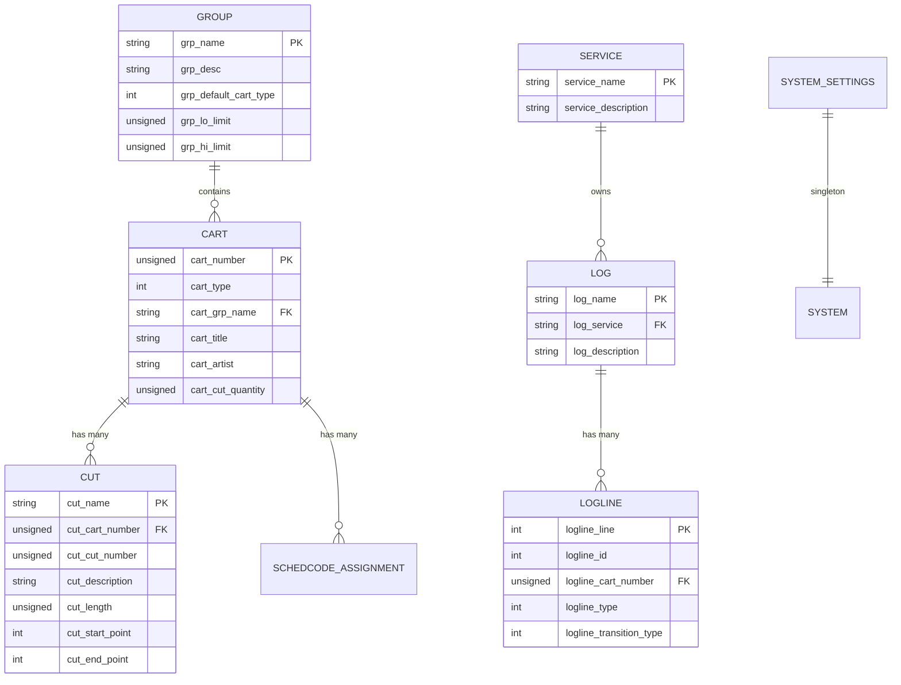
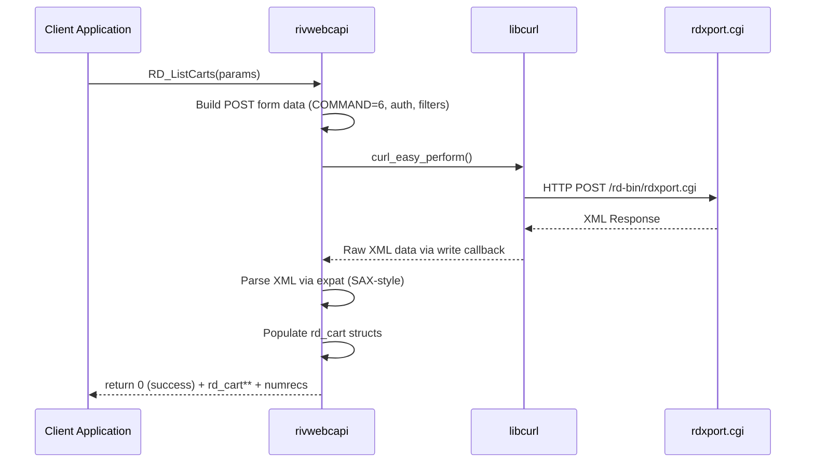

# Semantic Context: API (rivwebcapi)

## Overview

rivwebcapi is a **pure C library** (not C++, not Qt) that provides a client-side wrapper
around the Rivendell Web API (`rdxport.cgi`). It uses **libcurl** for HTTP communication
and **expat** (XML parser) for response parsing. All API calls are HTTP POST requests to
`http://{hostname}/rd-bin/rdxport.cgi` with a numeric COMMAND parameter.

**Language:** C (not C++/Qt -- no classes, no signals/slots, no Q_OBJECT)
**Dependencies:** libcurl, expat (libexpat)
**No external artifact dependencies** (standalone library)

## Files & Symbols

### Directory Structure

```
apis/rivwebcapi/
  rivwebcapi/          -- library source (47 .h + 39 .c + 1 Makefile.am = 87 files)
  tests/               -- test programs (43 .c + 1 .h + 1 Makefile.am = 45 files)
  configure.ac, Makefile.am, acinclude.m4, autogen.sh, get_target.sh, get_distro.pl
```

### Source Files (Library)

| File | Type | Symbols | Purpose |
|------|------|---------|---------|
| rd_common.h | header | RD_ReadBool, RD_Cnv_DTString_to_tm, RD_Cnv_tm_to_DTString, strlcpy, get_local_offset, validate_tm, RD_Cnv_TString_to_msec, RD_Cnv_msec_to_TString | Utility/conversion functions |
| rd_common.c | source | (implementations of above) | Utility/conversion implementations |
| rd_cart.h | header | struct rd_cart (29 fields), enum CART_TYPE | Cart data structure |
| rd_cut.h | header | struct rd_cut (44 fields) | Cut data structure |
| rd_group.h | header | struct rd_group (13 fields) | Group data structure |
| rd_schedcodes.h | header | struct rd_schedcodes (2 fields) | Scheduler code structure |
| rd_addcart.h / .c | header/source | RD_AddCart | Add cart via API (CMD 12) |
| rd_addcut.h / .c | header/source | RD_AddCut | Add cut via API (CMD 10) |
| rd_addlog.h / .c | header/source | RD_AddLog | Add log via API (CMD 29) |
| rd_assignschedcode.h / .c | header/source | RD_AssignSchedCode | Assign scheduler code (CMD 25) |
| rd_audioinfo.h / .c | header/source | RD_AudioInfo, struct rd_audioinfo | Get audio info (CMD 19) |
| rd_audiostore.h / .c | header/source | RD_AudioStore, struct rd_audiostore | Get audio store info (CMD 23) |
| rd_copyaudio.h / .c | header/source | RD_CopyAudio | Copy audio between cuts (CMD 18) |
| rd_createticket.h / .c | header/source | RD_CreateTicket, struct rd_ticketinfo | Create auth ticket (CMD 31) |
| rd_deleteaudio.h / .c | header/source | RD_DeleteAudio | Delete audio file (CMD 3) |
| rd_deletelog.h / .c | header/source | RD_DeleteLog | Delete log (CMD 30) |
| rd_deletepodcast.h / .c | header/source | RD_DeletePodcast | Delete podcast (CMD 39) |
| rd_editcart.h / .c | header/source | RD_EditCart, Build_Post_Cart_Fields, struct edit_cart_values | Edit cart metadata (CMD 14) |
| rd_editcut.h / .c | header/source | RD_EditCut, Build_Post_Cut_Fields, struct edit_cut_values | Edit cut metadata (CMD 15) |
| rd_export.h / .c | header/source | RD_ExportCart | Export audio to file (CMD 1) |
| rd_exportpeaks.h / .c | header/source | RD_ExportPeaks | Export peak data (CMD 16) |
| rd_getversion.h / .c | header/source | RD_GetVersion | Get library version |
| rd_getuseragent.h / .c | header/source | RD_GetUserAgent | Get user agent string |
| rd_import.h / .c | header/source | RD_ImportCart, struct rd_cartimport | Import audio file (CMD 2) |
| rd_listcart.h / .c | header/source | RD_ListCart | List single cart (CMD 7) |
| rd_listcarts.h / .c | header/source | RD_ListCarts | List carts with filter (CMD 6) |
| rd_listcartcuts.h / .c | header/source | RD_ListCartCuts, RD_ListCartCuts_GetCut, RD_ListCartCuts_Free | List cart with embedded cuts (CMD 7, INCLUDE_CUTS=1) |
| rd_listcartscuts.h / .c | header/source | RD_ListCartsCuts, RD_ListCartsCuts_GetCut, RD_ListCartsCuts_Free | List carts+cuts with filter (CMD 6, INCLUDE_CUTS=1) |
| rd_listcartschedcodes.h / .c | header/source | RD_ListCartSchedCodes | List scheduler codes for cart (CMD 27) |
| rd_listcut.h / .c | header/source | RD_ListCut | List single cut (CMD 8) |
| rd_listcuts.h / .c | header/source | RD_ListCuts | List cuts for cart (CMD 9) |
| rd_listgroup.h / .c | header/source | RD_ListGroup | List single group (CMD 5) |
| rd_listgroups.h / .c | header/source | RD_ListGroups | List all groups (CMD 4) |
| rd_listlog.h / .c | header/source | RD_ListLog, struct rd_logline | List log contents (CMD 22) |
| rd_listlogs.h / .c | header/source | RD_ListLogs, struct rd_log | List logs with filter (CMD 20) |
| rd_listschedcodes.h / .c | header/source | RD_ListSchedCodes | List all scheduler codes (CMD 24) |
| rd_listservices.h / .c | header/source | RD_ListServices, struct rd_service | List services (CMD 21) |
| rd_listsystemsettings.h / .c | header/source | RD_ListSystemSettings, struct rd_system_settings | List system settings (CMD 33) |
| rd_postimage.h / .c | header/source | RD_PostImage | Post image (CMD 44) |
| rd_postpodcast.h / .c | header/source | RD_PostPodcast | Post podcast (CMD 40) |
| rd_postrss.h / .c | header/source | RD_PostRss | Post RSS feed (CMD 42) |
| rd_removecart.h / .c | header/source | RD_RemoveCart | Remove cart (CMD 13) |
| rd_removecut.h / .c | header/source | RD_RemoveCut | Remove cut (CMD 11) |
| rd_removeimage.h / .c | header/source | RD_RemoveImage | Remove image (CMD 45) |
| rd_removepodcast.h / .c | header/source | RD_RemovePodcast | Remove podcast (CMD 41) |
| rd_removerss.h / .c | header/source | RD_RemoveRss | Remove RSS feed (CMD 43) |
| rd_savelog.h / .c | header/source | RD_SaveLog, struct save_loghdr_values, struct save_logline_values | Save log (CMD 28) |
| rd_savepodcast.h / .c | header/source | RD_SavePodcast | Save/upload podcast file (CMD 38) |
| rd_trimaudio.h / .c | header/source | RD_TrimAudio, struct rd_trimaudio | Trim audio levels (CMD 17) |
| rd_unassignschedcode.h / .c | header/source | RD_UnassignSchedCode | Unassign scheduler code (CMD 26) |

### Test Files

| File | Tests |
|------|-------|
| tests/common.h / tests/common.c | Shared test utility (PromptForString) |
| tests/addcart_test.c | RD_AddCart |
| tests/addcut_test.c | RD_AddCut |
| tests/addlog_test.c | RD_AddLog |
| tests/assignschedcode_test.c | RD_AssignSchedCode |
| tests/audioinfo_test.c | RD_AudioInfo |
| tests/audiostore_test.c | RD_AudioStore |
| tests/copyaudio_test.c | RD_CopyAudio |
| tests/createticket_test.c | RD_CreateTicket |
| tests/deleteaudio_test.c | RD_DeleteAudio |
| tests/deletelog_test.c | RD_DeleteLog |
| tests/deletepodcast_test.c | RD_DeletePodcast |
| tests/editcart_test.c | RD_EditCart |
| tests/editcut_test.c | RD_EditCut |
| tests/exportcart_test.c | RD_ExportCart |
| tests/exportpeaks_test.c | RD_ExportPeaks |
| tests/getuseragent_test.c | RD_GetUserAgent |
| tests/getversion_test.c | RD_GetVersion |
| tests/importcart_test.c | RD_ImportCart |
| tests/listcart_test.c | RD_ListCart |
| tests/listcarts_test.c | RD_ListCarts |
| tests/listcartcuts_test.c | RD_ListCartCuts |
| tests/listcartscuts_test.c | RD_ListCartsCuts |
| tests/listcartschedcodes_test.c | RD_ListCartSchedCodes |
| tests/listcut_test.c | RD_ListCut |
| tests/listcuts_test.c | RD_ListCuts |
| tests/listgroup_test.c | RD_ListGroup |
| tests/listgroups_test.c | RD_ListGroups |
| tests/listlog_test.c | RD_ListLog |
| tests/listlogs_test.c | RD_ListLogs |
| tests/listschedcodes_test.c | RD_ListSchedCodes |
| tests/listservices_test.c | RD_ListServices |
| tests/listsystemsettings_test.c | RD_ListSystemSettings |
| tests/postimage_test.c | RD_PostImage |
| tests/postpodcast_test.c | RD_PostPodcast |
| tests/postrss_test.c | RD_PostRss |
| tests/removecart_test.c | RD_RemoveCart |
| tests/removecut_test.c | RD_RemoveCut |
| tests/removeimage_test.c | RD_RemoveImage |
| tests/removepodcast_test.c | RD_RemovePodcast |
| tests/removerss_test.c | RD_RemoveRss |
| tests/savelog_test.c | RD_SaveLog |
| tests/savepodcast_test.c | RD_SavePodcast |
| tests/trimaudio_test.c | RD_TrimAudio |
| tests/unassignschedcode_test.c | RD_UnassignSchedCode |

### Symbol Index

| Symbol | Kind | File | Category |
|--------|------|------|----------|
| rd_cart | Struct | rd_cart.h | Data Structure |
| rd_cut | Struct | rd_cut.h | Data Structure |
| rd_group | Struct | rd_group.h | Data Structure |
| rd_schedcodes | Struct | rd_schedcodes.h | Data Structure |
| rd_audioinfo | Struct | rd_audioinfo.h | Data Structure |
| rd_audiostore | Struct | rd_audiostore.h | Data Structure |
| rd_log | Struct | rd_listlogs.h | Data Structure |
| rd_logline | Struct | rd_listlog.h | Data Structure |
| rd_service | Struct | rd_listservices.h | Data Structure |
| rd_system_settings | Struct | rd_listsystemsettings.h | Data Structure |
| rd_cartimport | Struct | rd_import.h | Data Structure |
| rd_ticketinfo | Struct | rd_createticket.h | Data Structure |
| rd_trimaudio | Struct | rd_trimaudio.h | Data Structure |
| edit_cart_values | Struct | rd_editcart.h | Edit Parameters |
| edit_cut_values | Struct | rd_editcut.h | Edit Parameters |
| save_loghdr_values | Struct | rd_savelog.h | Save Parameters |
| save_logline_values | Struct | rd_savelog.h | Save Parameters |
| CART_TYPE | Enum | rd_cart.h | Enumeration |
| RD_AddCart | Function | rd_addcart.h | API Function |
| RD_AddCut | Function | rd_addcut.h | API Function |
| RD_AddLog | Function | rd_addlog.h | API Function |
| RD_AssignSchedCode | Function | rd_assignschedcode.h | API Function |
| RD_AudioInfo | Function | rd_audioinfo.h | API Function |
| RD_AudioStore | Function | rd_audiostore.h | API Function |
| RD_CopyAudio | Function | rd_copyaudio.h | API Function |
| RD_CreateTicket | Function | rd_createticket.h | API Function |
| RD_DeleteAudio | Function | rd_deleteaudio.h | API Function |
| RD_DeleteLog | Function | rd_deletelog.h | API Function |
| RD_DeletePodcast | Function | rd_deletepodcast.h | API Function |
| RD_EditCart | Function | rd_editcart.h | API Function |
| RD_EditCut | Function | rd_editcut.h | API Function |
| RD_ExportCart | Function | rd_export.h | API Function |
| RD_ExportPeaks | Function | rd_exportpeaks.h | API Function |
| RD_GetVersion | Function | rd_getversion.h | Utility |
| RD_GetUserAgent | Function | rd_getuseragent.h | Utility |
| RD_ImportCart | Function | rd_import.h | API Function |
| RD_ListCart | Function | rd_listcart.h | API Function |
| RD_ListCarts | Function | rd_listcarts.h | API Function |
| RD_ListCartCuts | Function | rd_listcartcuts.h | API Function |
| RD_ListCartsCuts | Function | rd_listcartscuts.h | API Function |
| RD_ListCartSchedCodes | Function | rd_listcartschedcodes.h | API Function |
| RD_ListCut | Function | rd_listcut.h | API Function |
| RD_ListCuts | Function | rd_listcuts.h | API Function |
| RD_ListGroup | Function | rd_listgroup.h | API Function |
| RD_ListGroups | Function | rd_listgroups.h | API Function |
| RD_ListLog | Function | rd_listlog.h | API Function |
| RD_ListLogs | Function | rd_listlogs.h | API Function |
| RD_ListSchedCodes | Function | rd_listschedcodes.h | API Function |
| RD_ListServices | Function | rd_listservices.h | API Function |
| RD_ListSystemSettings | Function | rd_listsystemsettings.h | API Function |
| RD_PostImage | Function | rd_postimage.h | API Function |
| RD_PostPodcast | Function | rd_postpodcast.h | API Function |
| RD_PostRss | Function | rd_postrss.h | API Function |
| RD_RemoveCart | Function | rd_removecart.h | API Function |
| RD_RemoveCut | Function | rd_removecut.h | API Function |
| RD_RemoveImage | Function | rd_removeimage.h | API Function |
| RD_RemovePodcast | Function | rd_removepodcast.h | API Function |
| RD_RemoveRss | Function | rd_removerss.h | API Function |
| RD_SaveLog | Function | rd_savelog.h | API Function |
| RD_SavePodcast | Function | rd_savepodcast.h | API Function |
| RD_TrimAudio | Function | rd_trimaudio.h | API Function |
| RD_UnassignSchedCode | Function | rd_unassignschedcode.h | API Function |
| RD_ReadBool | Function | rd_common.h | Utility |
| RD_Cnv_DTString_to_tm | Function | rd_common.h | Utility |
| RD_Cnv_tm_to_DTString | Function | rd_common.h | Utility |
| RD_Cnv_TString_to_msec | Function | rd_common.h | Utility |
| RD_Cnv_msec_to_TString | Function | rd_common.h | Utility |
| strlcpy | Function | rd_common.h | Utility |
| get_local_offset | Function | rd_common.h | Utility |
| validate_tm | Function | rd_common.h | Utility |
| Build_Post_Cart_Fields | Function | rd_editcart.h | Internal Helper |
| Build_Post_Cut_Fields | Function | rd_editcut.h | Internal Helper |
| RD_ListCartCuts_GetCut | Function | rd_listcartcuts.h | Accessor Helper |
| RD_ListCartCuts_Free | Function | rd_listcartcuts.h | Memory Management |
| RD_ListCartsCuts_GetCut | Function | rd_listcartscuts.h | Accessor Helper |
| RD_ListCartsCuts_Free | Function | rd_listcartscuts.h | Memory Management |
| PromptForString | Function | tests/common.h | Test Utility |

## API Surface (Section B)

> NOTE: This is a pure C library. There are no C++ classes, no Qt objects,
> no signals/slots, no Q_PROPERTY. Instead, the API surface is documented as
> C structs (data structures) and C functions (API operations).

### Data Structures

#### struct rd_cart [Value Object]
- **File:** rd_cart.h
- **Purpose:** Represents a cart (audio item) in the Rivendell system

| Field | Type | Description |
|-------|------|-------------|
| cart_number | unsigned | Cart number (unique ID) |
| cart_type | int | Cart type (see CART_TYPE enum) |
| cart_grp_name | char[41] | Group name |
| cart_title | char[1021] | Title |
| cart_artist | char[1021] | Artist |
| cart_album | char[1021] | Album |
| cart_year | int | Year |
| cart_label | char[257] | Label |
| cart_client | char[257] | Client |
| cart_agency | char[257] | Agency |
| cart_publisher | char[257] | Publisher |
| cart_composer | char[257] | Composer |
| cart_conductor | char[257] | Conductor |
| cart_user_defined | char[1021] | User-defined field |
| cart_usage_code | int | Usage code |
| cart_forced_length | unsigned | Forced length (ms) |
| cart_average_length | unsigned | Average length (ms) |
| cart_length_deviation | unsigned | Length deviation (ms) |
| cart_average_segue_length | unsigned | Average segue length (ms) |
| cart_average_hook_length | unsigned | Average hook length (ms) |
| cart_last_cut_played | int | Last cut played index |
| cart_validity | unsigned | Validity flag |
| cart_enforce_length | int | Enforce length flag |
| cart_asyncronous | int | Asynchronous flag |
| cart_owner | char[257] | Owner |
| cart_notes | char[4096] | Notes |
| cart_metadata_datetime | struct tm | Metadata datetime |
| cart_cut_quantity | unsigned | Number of cuts |
| cart_cuts | struct rd_cut* | Pointer to embedded cuts array |

#### enum CART_TYPE
- **File:** rd_cart.h

| Value | Name | Description |
|-------|------|-------------|
| 0 | TYPE_ALL | All types (filter) |
| 1 | TYPE_AUDIO | Audio cart |
| 2 | TYPE_MACRO | Macro cart |

#### struct rd_cut [Value Object]
- **File:** rd_cut.h
- **Purpose:** Represents a cut (audio segment) within a cart

| Field | Type | Description |
|-------|------|-------------|
| cut_name | char[41] | Cut name identifier |
| cut_cart_number | unsigned | Parent cart number |
| cut_cut_number | unsigned | Cut number |
| cut_evergreen | int | Evergreen flag |
| cut_description | char[257] | Description |
| cut_outcue | char[257] | Outcue text |
| cut_isrc | char[49] | ISRC code |
| cut_isci | char[129] | ISCI code |
| cut_length | unsigned | Length (ms) |
| cut_origin_datetime | struct tm | Origin datetime |
| cut_start_datetime | struct tm | Start date validity |
| cut_end_datetime | struct tm | End date validity |
| cut_sun..cut_sat | int (x7) | Day-of-week validity flags |
| cut_start_daypart | char[15] | Daypart start time |
| cut_end_daypart | char[15] | Daypart end time |
| cut_origin_name | char[257] | Origin name |
| cut_origin_login_name | char[257] | Origin login name |
| cut_source_hostname | char[257] | Source hostname |
| cut_weight | unsigned | Scheduling weight |
| cut_last_play_datetime | struct tm | Last play datetime |
| cut_play_counter | unsigned | Play counter |
| cut_local_counter | unsigned | Local play counter |
| cut_validity | unsigned | Validity flag |
| cut_coding_format | unsigned | Coding format |
| cut_sample_rate | unsigned | Sample rate |
| cut_bit_rate | unsigned | Bit rate |
| cut_channels | unsigned | Number of channels |
| cut_play_gain | int | Play gain (dB/100) |
| cut_start_point | int | Start point (ms) |
| cut_end_point | int | End point (ms) |
| cut_fadeup_point | int | Fade-up point (ms) |
| cut_fadedown_point | int | Fade-down point (ms) |
| cut_segue_start_point | int | Segue start point (ms) |
| cut_segue_end_point | int | Segue end point (ms) |
| cut_segue_gain | int | Segue gain |
| cut_hook_start_point | int | Hook start point (ms) |
| cut_hook_end_point | int | Hook end point (ms) |
| cut_talk_start_point | int | Talk start point (ms) |
| cut_talk_end_point | int | Talk end point (ms) |

#### struct rd_group [Value Object]
- **File:** rd_group.h

| Field | Type | Description |
|-------|------|-------------|
| grp_name | char[41] | Group name |
| grp_desc | char[257] | Description |
| grp_default_cart_type | int | Default cart type |
| grp_lo_limit | unsigned | Low cart number limit |
| grp_hi_limit | unsigned | High cart number limit |
| grp_shelf_life | int | Shelf life (days) |
| grp_default_title | char[1021] | Default title template |
| grp_enforce_range | int | Enforce cart range flag |
| grp_report_tfc | int | Report in traffic flag |
| grp_report_mus | int | Report in music flag |
| grp_now_next | int | Now/Next enabled flag |
| grp_color | char[10] | Display color |
| grp_reserved | char | Reserved |

#### struct rd_log [Value Object]
- **File:** rd_listlogs.h

| Field | Type | Description |
|-------|------|-------------|
| log_name | char[257] | Log name |
| log_service | char[41] | Service name |
| log_description | char[257] | Description |
| log_origin_username | char[1021] | Origin username |
| log_origin_datetime | struct tm | Origin datetime |
| log_purge_date | struct tm | Purge date |
| log_link_datetime | struct tm | Link datetime |
| log_modified_datetime | struct tm | Modified datetime |
| log_autorefresh | int | Auto-refresh flag |
| log_startdate | struct tm | Start date |
| log_enddate | struct tm | End date |
| log_scheduled_tracks | int | Scheduled tracks count |
| log_completed_tracks | int | Completed tracks count |
| log_music_links | int | Music links count |
| log_music_linked | int | Music linked flag |
| log_traffic_links | int | Traffic links count |
| log_traffic_linked | int | Traffic linked flag |

#### struct rd_logline [Value Object]
- **File:** rd_listlog.h
- **Purpose:** Represents a single line entry in a program log (70 fields)

| Field | Type | Description |
|-------|------|-------------|
| logline_line | int | Line number |
| logline_id | int | Line ID |
| logline_type | int | Type (audio, marker, etc.) |
| logline_cart_type | int | Cart type |
| logline_cart_number | unsigned | Cart number |
| logline_cut_number | int | Cut number |
| logline_group_name | char[41] | Group name |
| logline_group_color | char[10] | Group color |
| logline_title | char[1021] | Title |
| logline_artist | char[1021] | Artist |
| logline_album | char[1021] | Album |
| logline_year | int | Year |
| logline_label..logline_conductor | char[] | Various metadata fields |
| logline_user_defined | char[1021] | User-defined field |
| logline_usage_code | int | Usage code |
| logline_enforce_length | int | Enforce length |
| logline_forced_length | int | Forced length |
| logline_evergreen | int | Evergreen flag |
| logline_source | int | Source |
| logline_time_type | int | Time type |
| logline_starttime | int | Start time (ms from midnight) |
| logline_transition_type | int | Transition type |
| logline_cut_quantity | int | Cut quantity |
| logline_last_cut_played | int | Last cut played |
| logline_marker_comment | char[1021] | Marker comment |
| logline_marker_label | char[257] | Marker label |
| logline_origin_user | char[1021] | Origin user |
| logline_origin_datetime | struct tm | Origin datetime |
| logline_start_point_cart | int | Cart start point |
| logline_start_point_log | int | Log start point |
| logline_end_point_cart | int | Cart end point |
| logline_end_point_log | int | Log end point |
| logline_segue_*_point_cart/log | int (x4) | Segue points |
| logline_segue_gain | int | Segue gain |
| logline_fadeup/fadedown_point_cart/log | int (x4) | Fade points |
| logline_fadeup/fadedown_gain | int (x2) | Fade gains |
| logline_duckup/duckdown_gain | int (x2) | Duck gains |
| logline_talk_start/end_point | int (x2) | Talk points |
| logline_hook_mode | int | Hook mode |
| logline_hook_start/end_point | int (x2) | Hook points |
| logline_event_length | int | Event length |
| logline_link_event_name | char[65] | Link event name |
| logline_link_starttime | int | Link start time |
| logline_link_start/end_slop | int (x2) | Link slop values |
| logline_link_id | int | Link ID |
| logline_link_embedded | int | Link embedded flag |
| logline_ext_starttime | int | External start time |
| logline_ext_length | int | External length |
| logline_ext_cart_name | char[129] | External cart name |
| logline_ext_data | char[129] | External data |
| logline_ext_event_id | char[129] | External event ID |
| logline_ext_annc_type | char[33] | External announcement type |

#### struct rd_service [Value Object]
- **File:** rd_listservices.h

| Field | Type | Description |
|-------|------|-------------|
| service_name | char[41] | Service name |
| service_description | char[1021] | Description |

#### struct rd_system_settings [Value Object]
- **File:** rd_listsystemsettings.h

| Field | Type | Description |
|-------|------|-------------|
| sample_rate | unsigned | System sample rate |
| dup_cart_titles | int | Duplicate cart titles allowed |
| max_post_length | unsigned | Maximum POST length |
| isci_xreference_path | char[] | ISCI cross-reference path |
| temp_cart_group | char[] | Temporary cart group |

#### struct rd_audioinfo [Value Object]
- **File:** rd_audioinfo.h

| Field | Type | Description |
|-------|------|-------------|
| cart_number | unsigned | Cart number |
| cut_number | unsigned | Cut number |
| format | int | Audio format |
| channels | int | Number of channels |
| samplerate | int | Sample rate |
| frames | unsigned | Number of frames |
| length | unsigned | Length (ms) |

#### struct rd_audiostore [Value Object]
- **File:** rd_audiostore.h

| Field | Type | Description |
|-------|------|-------------|
| freebytes | long unsigned | Free bytes on audio store |
| totalbytes | long unsigned | Total bytes on audio store |

#### struct rd_cartimport [Value Object]
- **File:** rd_import.h

| Field | Type | Description |
|-------|------|-------------|
| response_code | int | HTTP response code |
| error_string | char[256] | Error message |
| cart_number | unsigned | Cart number (result) |
| cut_number | unsigned | Cut number (result) |

#### struct rd_ticketinfo [Value Object]
- **File:** rd_createticket.h

| Field | Type | Description |
|-------|------|-------------|
| ticket | char[41] | Authentication ticket string |
| tkt_expiration_datetime | struct tm | Ticket expiration datetime |

#### struct rd_trimaudio [Value Object]
- **File:** rd_trimaudio.h

| Field | Type | Description |
|-------|------|-------------|
| cart_number | unsigned | Cart number |
| cut_number | unsigned | Cut number |
| trimlevel | int | Trim level (dBFS) |
| starttrimpoint | int | Start trim point (ms) |
| endtrimpoint | int | End trim point (ms) |

#### struct rd_schedcodes [Value Object]
- **File:** rd_schedcodes.h

| Field | Type | Description |
|-------|------|-------------|
| code | char[] | Scheduler code |
| description | char[] | Code description |

#### struct edit_cart_values [Edit Parameters]
- **File:** rd_editcart.h
- **Purpose:** Holds values to update on a cart. Each field has a companion `use_*` flag (int).
  When `use_*` is non-zero, the corresponding field is included in the HTTP POST.

| Field | use_* Flag | Type | Description |
|-------|-----------|------|-------------|
| cart_grp_name | use_cart_grp_name | char[41] | Group name |
| cart_title | use_cart_title | char[1021] | Title |
| cart_artist | use_cart_artist | char[1021] | Artist |
| cart_album | use_cart_album | char[1021] | Album |
| cart_year | use_cart_year | int | Year |
| cart_label | use_cart_label | char[257] | Label |
| cart_client | use_cart_client | char[257] | Client |
| cart_agency | use_cart_agency | char[257] | Agency |
| cart_publisher | use_cart_publisher | char[257] | Publisher |
| cart_composer | use_cart_composer | char[257] | Composer |
| cart_conductor | use_cart_conductor | char[257] | Conductor |
| cart_user_defined | use_cart_user_defined | char[1021] | User-defined |
| cart_usage_code | use_cart_usage_code | int | Usage code |
| cart_forced_length | use_cart_forced_length | int | Forced length |
| cart_enforce_length | use_cart_enforce_length | int | Enforce length |
| cart_asyncronous | use_cart_asyncronous | int | Asynchronous |
| cart_owner | use_cart_owner | char[257] | Owner |
| cart_notes | use_cart_notes | char[4096] | Notes |

#### struct edit_cut_values [Edit Parameters]
- **File:** rd_editcut.h
- **Purpose:** Holds values to update on a cut. Uses the same `use_*` flag pattern.

| Field | use_* Flag | Type | Description |
|-------|-----------|------|-------------|
| cut_evergreen | use_cut_evergreen | int | Evergreen flag |
| cut_description | use_cut_description | char[257] | Description |
| cut_outcue | use_cut_outcue | char[257] | Outcue |
| cut_isrc | use_cut_isrc | char[49] | ISRC code |
| cut_isci | use_cut_isci | char[129] | ISCI code |
| cut_start_datetime | use_cut_start_datetime | struct tm | Start validity |
| cut_end_datetime | use_cut_end_datetime | struct tm | End validity |
| cut_sun..cut_sat | use_cut_sun..use_cut_sat | int (x7) | Day-of-week flags |
| cut_start_daypart | use_cut_start_daypart | char[15] | Daypart start |
| cut_end_daypart | use_cut_end_daypart | char[15] | Daypart end |
| cut_weight | use_cut_weight | unsigned | Weight |
| cut_validity | use_cut_validity | unsigned | Validity |
| cut_coding_format | use_cut_coding_format | unsigned | Coding format |
| cut_sample_rate | use_cut_sample_rate | unsigned | Sample rate |
| cut_bit_rate | use_cut_bit_rate | unsigned | Bit rate |
| cut_channels | use_cut_channels | unsigned | Channels |
| cut_play_gain | use_cut_play_gain | int | Play gain |
| cut_start_point | use_cut_start_point | int | Start point |
| cut_end_point | use_cut_end_point | int | End point |
| cut_fadeup_point | use_cut_fadeup_point | int | Fade-up point |
| cut_fadedown_point | use_cut_fadedown_point | int | Fade-down point |
| cut_segue_start_point | use_cut_segue_start_point | int | Segue start |
| cut_segue_end_point | use_cut_segue_end_point | int | Segue end |
| cut_segue_gain | use_cut_segue_gain | int | Segue gain |
| cut_hook_start_point | use_cut_hook_start_point | int | Hook start |
| cut_hook_end_point | use_cut_hook_end_point | int | Hook end |
| cut_talk_start_point | use_cut_talk_start_point | int | Talk start |
| cut_talk_end_point | use_cut_talk_end_point | int | Talk end |

#### struct save_loghdr_values [Save Parameters]
- **File:** rd_savelog.h

| Field | Type | Description |
|-------|------|-------------|
| loghdr_service | char[41] | Service name |
| loghdr_description | char[257] | Log description |
| loghdr_autorefresh | int | Auto-refresh flag |
| loghdr_purge_date | struct tm | Purge date |
| loghdr_start_date | struct tm | Start date |
| loghdr_end_date | struct tm | End date |

#### struct save_logline_values [Save Parameters]
- **File:** rd_savelog.h
- **Purpose:** Log line data for RD_SaveLog (36 fields)

| Field | Type | Description |
|-------|------|-------------|
| logline_id | int | Line ID |
| logline_type | int | Type |
| logline_source | int | Source |
| logline_cart_number | unsigned | Cart number |
| logline_starttime | int | Start time |
| logline_gracetime | int | Grace time |
| logline_time_type | int | Time type |
| logline_transition_type | int | Transition type (0=PLAY, 1=SEGUE, 2=STOP) |
| logline_start_point_log | int | Start point |
| logline_end_point_log | int | End point |
| logline_segue_start/end_point_log | int (x2) | Segue points |
| logline_fadeup/fadedown_point_log | int (x2) | Fade points |
| logline_fadeup/fadedown_gain | int (x2) | Fade gains |
| logline_duckup/duckdown_gain | int (x2) | Duck gains |
| logline_marker_comment | char[] | Marker comment |
| logline_marker_label | char[] | Marker label |
| logline_origin_user | char[] | Origin user |
| logline_origin_datetime | struct tm | Origin datetime |
| logline_event_length | int | Event length |
| logline_link_event_name | char[65] | Link event name |
| logline_link_starttime | struct tm | Link start time |
| logline_link_length | int | Link length |
| logline_link_start/end_slop | int (x2) | Link slop |
| logline_link_id | int | Link ID |
| logline_link_embedded | int | Link embedded |
| logline_ext_starttime | struct tm | External start time |
| logline_ext_length | int | External length |
| logline_ext_cart_name | char[] | External cart name |
| logline_ext_data | char[] | External data |
| logline_ext_event_id | char[] | External event ID |
| logline_ext_annc_type | char[] | External announcement type |

### API Functions

All API functions follow a consistent pattern:
- **Authentication:** hostname, username, passwd, ticket parameters
- **Return:** `int` -- 0 on success, HTTP status code on error
- **Communication:** HTTP POST to `http://{hostname}/rd-bin/rdxport.cgi`
- **Data format:** XML responses parsed via expat callbacks
- **Output:** Result structs allocated by the library, count via `*numrecs`

#### Cart Management

| Function | CMD | Parameters (beyond auth) | Returns | Description |
|----------|-----|-------------------------|---------|-------------|
| RD_AddCart | 12 | group, type, cartnumber, user_agent, *numrecs | rd_cart** | Create a new cart |
| RD_EditCart | 14 | edit_cart_values, cartnum, user_agent, *numrecs | rd_cart** | Edit cart metadata |
| RD_RemoveCart | 13 | cartnumber, user_agent | -- | Delete a cart |
| RD_ListCart | 7 | cartnumber, user_agent, *numrecs | rd_cart** | Get single cart |
| RD_ListCarts | 6 | group_name, filter, type, user_agent, *numrecs | rd_cart** | List carts (filtered) |
| RD_ListCartCuts | 7 | cartnumber, user_agent, *numrecs (INCLUDE_CUTS=1) | rd_cart** (w/cuts) | Get cart with embedded cuts |
| RD_ListCartsCuts | 6 | group_name, filter, type, user_agent, *numrecs (INCLUDE_CUTS=1) | rd_cart** (w/cuts) | List carts+cuts (filtered) |

#### Cut Management

| Function | CMD | Parameters (beyond auth) | Returns | Description |
|----------|-----|-------------------------|---------|-------------|
| RD_AddCut | 10 | cartnumber, user_agent, *numrecs | rd_cut** | Add cut to cart |
| RD_EditCut | 15 | edit_cut_values, cartnum, cutnum, user_agent, *numrecs | rd_cut** | Edit cut metadata |
| RD_RemoveCut | 11 | cartnumber, cutnumber, user_agent | -- | Delete a cut |
| RD_ListCut | 8 | cartnumber, cutnumber, user_agent, *numrecs | rd_cut** | Get single cut |
| RD_ListCuts | 9 | cartnumber, user_agent, *numrecs | rd_cut** | List cuts for cart |

#### Audio Operations

| Function | CMD | Parameters (beyond auth) | Returns | Description |
|----------|-----|-------------------------|---------|-------------|
| RD_ImportCart | 2 | cartnum, cutnum, channels, normalization_level, autotrim_level, use_metadata, create, group, title, filename, user_agent, *numrecs | rd_cartimport** | Import audio file |
| RD_ExportCart | 1 | cartnum, cutnum, format, channels, sample_rate, bit_rate, quality, start_point, end_point, normalization_level, enable_metadata, filename, user_agent | -- | Export audio to file |
| RD_DeleteAudio | 3 | cartnumber, cutnumber, user_agent | -- | Delete audio file |
| RD_CopyAudio | 18 | src_cartnumber, src_cutnumber, dest_cartnumber, dest_cutnumber, user_agent | -- | Copy audio between cuts |
| RD_AudioInfo | 19 | cartnumber, cutnumber, user_agent, *numrecs | rd_audioinfo** | Get audio file info |
| RD_AudioStore | 23 | user_agent, *numrecs | rd_audiostore** | Get audio store disk info |
| RD_ExportPeaks | 16 | cartnum, cutnum, filename, user_agent | -- | Export peak data to file |
| RD_TrimAudio | 17 | cartnumber, cutnumber, trimlevel, user_agent, *numrecs | rd_trimaudio** | Calculate trim points |

#### Log Management

| Function | CMD | Parameters (beyond auth) | Returns | Description |
|----------|-----|-------------------------|---------|-------------|
| RD_AddLog | 29 | logname, servicename, user_agent | -- | Create new log |
| RD_DeleteLog | 30 | logname, user_agent | -- | Delete log |
| RD_SaveLog | 28 | *hdrvals, *linevals, linevals_quan, logname, user_agent | -- | Save complete log |
| RD_ListLog | 22 | logname, user_agent, *numrecs | rd_logline** | List log contents |
| RD_ListLogs | 20 | servicename, logname, trackable, filter, recent, user_agent, *numrecs | rd_log** | List logs (filtered) |

#### Group Management

| Function | CMD | Parameters (beyond auth) | Returns | Description |
|----------|-----|-------------------------|---------|-------------|
| RD_ListGroup | 5 | group, user_agent, *numrecs | rd_group** | Get single group |
| RD_ListGroups | 4 | user_agent, *numrecs | rd_group** | List all groups |

#### Scheduler Code Management

| Function | CMD | Parameters (beyond auth) | Returns | Description |
|----------|-----|-------------------------|---------|-------------|
| RD_AssignSchedCode | 25 | cartnum, code, user_agent | -- | Assign code to cart |
| RD_UnassignSchedCode | 26 | cartnum, code, user_agent | -- | Unassign code from cart |
| RD_ListSchedCodes | 24 | user_agent, *numrecs | rd_schedcodes** | List all sched codes |
| RD_ListCartSchedCodes | 27 | cartnum, user_agent, *numrecs | rd_schedcodes** | List codes for cart |

#### Service & System

| Function | CMD | Parameters (beyond auth) | Returns | Description |
|----------|-----|-------------------------|---------|-------------|
| RD_ListServices | 21 | trackable, user_agent, *numrecs | rd_service** | List services |
| RD_ListSystemSettings | 33 | user_agent, *numrecs | rd_system_settings** | List system settings |

#### Podcast & RSS Management

| Function | CMD | Parameters (beyond auth) | Returns | Description |
|----------|-----|-------------------------|---------|-------------|
| RD_PostPodcast | 40 | cast_id, user_agent | -- | Post/publish podcast |
| RD_SavePodcast | 38 | cast_id, filename, user_agent | -- | Upload podcast file |
| RD_DeletePodcast | 39 | cast_id, user_agent | -- | Delete podcast |
| RD_RemovePodcast | 41 | cast_id, user_agent | -- | Remove podcast |
| RD_PostRss | 42 | feed_id, user_agent | -- | Post/publish RSS feed |
| RD_RemoveRss | 43 | feed_id, user_agent | -- | Remove RSS feed |

#### Image Management

| Function | CMD | Parameters (beyond auth) | Returns | Description |
|----------|-----|-------------------------|---------|-------------|
| RD_PostImage | 44 | img_id, user_agent | -- | Post/publish image |
| RD_RemoveImage | 45 | img_id, user_agent | -- | Remove image |

#### Authentication

| Function | CMD | Parameters | Returns | Description |
|----------|-----|-----------|---------|-------------|
| RD_CreateTicket | 31 | hostname, username, passwd, user_agent, *numrecs | rd_ticketinfo** | Create session ticket |

#### Utility Functions (no HTTP)

| Function | Parameters | Returns | Description |
|----------|-----------|---------|-------------|
| RD_GetVersion | () | int* | Get library version array |
| RD_GetUserAgent | () | int* | Get user agent info |
| RD_ReadBool | (value) | int | Parse boolean from string |
| RD_Cnv_DTString_to_tm | (string, *tm) | void | Convert datetime string to struct tm |
| RD_Cnv_tm_to_DTString | (*tm, string) | void | Convert struct tm to datetime string |
| RD_Cnv_TString_to_msec | (string) | int | Convert time string to milliseconds |
| RD_Cnv_msec_to_TString | (msec, string) | void | Convert milliseconds to time string |
| strlcpy | (dst, src, size) | size_t | Safe string copy |
| get_local_offset | () | int | Get local timezone offset |
| validate_tm | (*tm) | int | Validate struct tm values |

## Data Model (Section C)

This is a **client-side HTTP library** that does not access any database directly.
There are no CREATE TABLE statements, no SQL queries, no direct database access.

All data flows through HTTP POST requests to the Rivendell rdxport.cgi web service.
The data model is implicit in the C structs defined above, which mirror the server-side
database schema exposed through XML responses.

### Implicit Data Model (from struct definitions)



### API-to-Entity CRUD Mapping

| Entity | Create | Read | Update | Delete |
|--------|--------|------|--------|--------|
| Cart | RD_AddCart | RD_ListCart, RD_ListCarts, RD_ListCartCuts, RD_ListCartsCuts | RD_EditCart | RD_RemoveCart |
| Cut | RD_AddCut | RD_ListCut, RD_ListCuts | RD_EditCut | RD_RemoveCut |
| Audio | RD_ImportCart | RD_AudioInfo, RD_ExportCart, RD_ExportPeaks | RD_TrimAudio, RD_CopyAudio | RD_DeleteAudio |
| Log | RD_AddLog | RD_ListLog, RD_ListLogs | RD_SaveLog | RD_DeleteLog |
| Group | -- | RD_ListGroup, RD_ListGroups | -- | -- |
| SchedCode | RD_AssignSchedCode | RD_ListSchedCodes, RD_ListCartSchedCodes | -- | RD_UnassignSchedCode |
| Service | -- | RD_ListServices | -- | -- |
| SystemSettings | -- | RD_ListSystemSettings | -- | -- |
| Podcast | -- | -- | RD_SavePodcast | RD_DeletePodcast, RD_RemovePodcast |
| RSS | -- | -- | RD_PostRss | RD_RemoveRss |
| Image | -- | -- | RD_PostImage | RD_RemoveImage |
| Ticket | RD_CreateTicket | -- | -- | -- |

## Reactive Architecture (Section D)

This is a **pure C library** with no event-driven or reactive architecture.
There are no Qt signals/slots, no callbacks between objects, no event loops.

### Communication Pattern

All communication is **synchronous request/response** via libcurl:



### Internal Architecture

Each API function follows the same internal pattern:

1. **Declare** local variables: CURL*, curl_httppost*, response_code, errbuf
2. **Build** HTTP form data using `curl_formadd()` with COMMAND number and parameters
3. **Configure** CURL: URL, POST mode, write callback, user agent
4. **Execute** `curl_easy_perform()`
5. **Check** CURL error (network level)
6. **Check** HTTP response code (200-299 = success)
7. **Return** 0 on success, HTTP status code on error

### XML Parsing Pattern

Each API function has a companion static callback function (e.g., `__ListCartCallback`,
`__AddCutCallback`) that is registered as a CURL write function. These callbacks use
expat to parse XML responses and populate the output structs.

### Cross-Artifact Dependencies

None. This library is standalone and has no dependencies on other Rivendell artifacts.
It communicates exclusively via HTTP with the Rivendell web service layer (WEB artifact).

## Business Rules (Section E)

### Rule: Authentication Required
- **Source:** All API functions
- **Trigger:** Any API call
- **Condition:** All functions require hostname, username, passwd, and ticket parameters
- **Action:** Credentials are sent as POST form fields (LOGIN_NAME, PASSWORD, TICKET)
- **Gherkin:**
  ```gherkin
  Scenario: Authentication required for all API calls
    Given a Rivendell server at hostname
    When any API function is called
    Then LOGIN_NAME, PASSWORD, and TICKET must be included in the POST data
  ```

### Rule: HTTP Status Code Error Handling
- **Source:** All API .c files (e.g., rd_addcart.c:308)
- **Trigger:** After curl_easy_perform completes
- **Condition:** `response_code > 199 && response_code < 300`
- **Action:** Success returns 0, failure returns the HTTP status code as int
- **Gherkin:**
  ```gherkin
  Scenario: Successful API response
    Given an API call completes
    When HTTP response code is 2xx
    Then return 0 and populate output structs

  Scenario: Failed API response
    Given an API call completes
    When HTTP response code is not 2xx
    Then return the HTTP status code as the function return value
  ```

### Rule: CURL Error Handling
- **Source:** All API .c files
- **Trigger:** curl_easy_perform() returns non-CURLE_OK
- **Condition:** `res != CURLE_OK`
- **Action:** Print error to stderr (if RIVC_DEBUG_OUT defined), return -1
- **Gherkin:**
  ```gherkin
  Scenario: Network error during API call
    Given a CURL request is performed
    When libcurl returns an error
    Then log error message if RIVC_DEBUG_OUT is defined
    And return -1
  ```

### Rule: Edit Parameter Use-Flags
- **Source:** rd_editcart.h, rd_editcut.h, rd_editcart.c (Build_Post_Cart_Fields), rd_editcut.c (Build_Post_Cut_Fields)
- **Trigger:** RD_EditCart or RD_EditCut called
- **Condition:** Each field in edit_cart_values/edit_cut_values has a `use_*` companion flag
- **Action:** Only fields where `use_* != 0` are included in the HTTP POST
- **Gherkin:**
  ```gherkin
  Scenario: Partial cart update
    Given an edit_cart_values struct
    When use_cart_title is non-zero and use_cart_artist is zero
    Then only TITLE is included in the POST data
    And ARTIST is not sent to the server
  ```

### Rule: Transition Type Encoding
- **Source:** rd_savelog.c:232-244
- **Trigger:** RD_SaveLog with logline_transition_type
- **Condition:** Integer values mapped to strings
- **Action:** 0="PLAY", 1="SEGUE", 2="STOP"
- **Gherkin:**
  ```gherkin
  Scenario: Log line transition type encoding
    Given a save_logline_values struct with logline_transition_type=1
    When RD_SaveLog is called
    Then the TRANS_TYPE POST field is sent as "SEGUE"
  ```

### Rule: User Agent String
- **Source:** All API .c files
- **Trigger:** API call with non-empty user_agent parameter
- **Condition:** `strlen(user_agent) > 0`
- **Action:** Set CURLOPT_USERAGENT with custom user agent string
- **Gherkin:**
  ```gherkin
  Scenario: Custom user agent
    Given a user_agent string is provided
    When the API call is made
    Then the HTTP request includes the custom User-Agent header
  ```

### Rule: Include Cuts Flag
- **Source:** rd_listcartcuts.c, rd_listcartscuts.c
- **Trigger:** RD_ListCartCuts or RD_ListCartsCuts called
- **Condition:** INCLUDE_CUTS form field set to "1"
- **Action:** Server returns cart data with embedded cut data
- **Gherkin:**
  ```gherkin
  Scenario: List cart with embedded cuts
    Given a cart number
    When RD_ListCartCuts is called
    Then INCLUDE_CUTS=1 is sent with COMMAND=7
    And the response includes both cart and cut data
  ```

### Rule: Scheduler Code Validation
- **Source:** rd_assignschedcode.c
- **Trigger:** RD_AssignSchedCode called
- **Condition:** Code must be a valid non-empty string
- **Action:** Code is validated before sending to server

### Configuration Keys

| Key | Type | Description |
|-----|------|-------------|
| RIVC_DEBUG_OUT | compile-time define | Enable debug output to stderr |

### Error Patterns

| Error | Severity | Condition | Return Value |
|-------|----------|-----------|-------------|
| Network failure | critical | curl_easy_perform() != CURLE_OK | -1 |
| Auth failure | error | HTTP 401/403 | 401 or 403 |
| Not found | error | HTTP 404 | 404 |
| Server error | error | HTTP 500 | 500 |
| Success | info | HTTP 200-299 | 0 |

### Command Number Reference

| CMD | Function | Operation |
|-----|----------|-----------|
| 1 | RD_ExportCart | Export audio |
| 2 | RD_ImportCart | Import audio |
| 3 | RD_DeleteAudio | Delete audio |
| 4 | RD_ListGroups | List groups |
| 5 | RD_ListGroup | List single group |
| 6 | RD_ListCarts / RD_ListCartsCuts | List carts |
| 7 | RD_ListCart / RD_ListCartCuts | List single cart |
| 8 | RD_ListCut | List single cut |
| 9 | RD_ListCuts | List cuts |
| 10 | RD_AddCut | Add cut |
| 11 | RD_RemoveCut | Remove cut |
| 12 | RD_AddCart | Add cart |
| 13 | RD_RemoveCart | Remove cart |
| 14 | RD_EditCart | Edit cart |
| 15 | RD_EditCut | Edit cut |
| 16 | RD_ExportPeaks | Export peaks |
| 17 | RD_TrimAudio | Trim audio |
| 18 | RD_CopyAudio | Copy audio |
| 19 | RD_AudioInfo | Audio info |
| 20 | RD_ListLogs | List logs |
| 21 | RD_ListServices | List services |
| 22 | RD_ListLog | List log contents |
| 23 | RD_AudioStore | Audio store info |
| 24 | RD_ListSchedCodes | List sched codes |
| 25 | RD_AssignSchedCode | Assign sched code |
| 26 | RD_UnassignSchedCode | Unassign sched code |
| 27 | RD_ListCartSchedCodes | List cart sched codes |
| 28 | RD_SaveLog | Save log |
| 29 | RD_AddLog | Add log |
| 30 | RD_DeleteLog | Delete log |
| 31 | RD_CreateTicket | Create ticket |
| 33 | RD_ListSystemSettings | System settings |
| 38 | RD_SavePodcast | Save podcast |
| 39 | RD_DeletePodcast | Delete podcast |
| 40 | RD_PostPodcast | Post podcast |
| 41 | RD_RemovePodcast | Remove podcast |
| 42 | RD_PostRss | Post RSS |
| 43 | RD_RemoveRss | Remove RSS |
| 44 | RD_PostImage | Post image |
| 45 | RD_RemoveImage | Remove image |

## UI Contracts (Section F)

This artifact has **no UI**. It is a pure C client library with no user interface,
no windows, no dialogs, no widgets. All interaction is programmatic via function calls.
