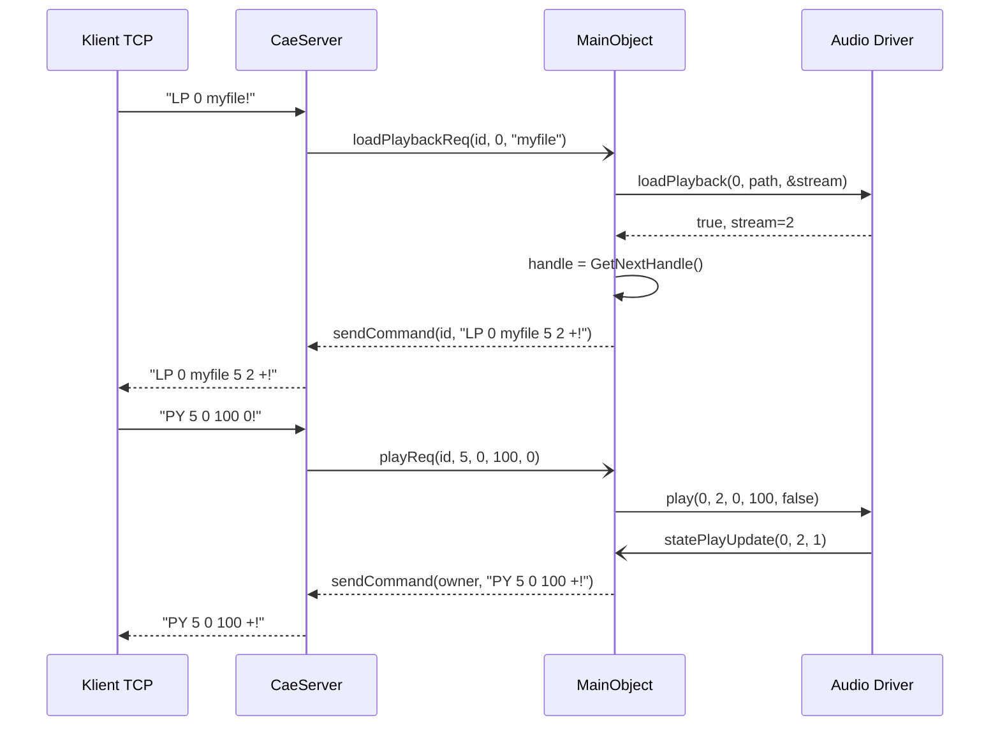

# CAE-002: Audio Playback Engine

## Kontekst biznesowy

Rdzen systemu radiowego -- odtwarzanie plikow audio. Klient TCP laduje plik audio, rozpoczyna odtwarzanie z kontrola predkosci/pitcha, i otrzymuje asynchroniczne powiadomienia o stanie. System zarzadza pula 256 handleow i dispatchuje operacje do wlasciwego drivera audio (ALSA/JACK/HPI) na podstawie konfiguracji karty.

## Aktorzy

| Aktor | Rola w tej feature |
|-------|-------------------|
| Klient TCP (rdairplay) | Steruje odtwarzaniem (load, play, stop, seek, unload) |
| Audio Driver | Wykonuje fizyczne odtwarzanie na hardware |
| Timer | Wywoluje statePlayUpdate (dla JACK/ALSA) |

## Granica funkcjonalnosci

```
IN SCOPE:
  - Ladowanie pliku audio do playbacku (LP)
  - Odtwarzanie z parametrami dlugosci, predkosci i pitcha (PY)
  - Zatrzymanie odtwarzania (SP)
  - Seekowanie pozycji (PP)
  - Zwolnienie playbacku (UP)
  - Zapytanie o timescaling (TS)
  - Zarzadzanie handleami (pula 256, round-robin)
  - Ownership tracking (play_owner per stream)
  - Driver dispatch (switch na cae_driver[card])
  - Asynchroniczne notyfikacje stanu (statePlayUpdate)

OUT OF SCOPE:
  - Nagrywanie → patrz CAE-003
  - Kontrola glosnosci → patrz CAE-004
  - Metering → patrz CAE-005
  - Implementacja konkretnych driverow audio → Platform Independence
```

---

## Use Cases

| ID | Aktor | Akcja | Efekt biznesowy | Priorytet |
|----|-------|-------|----------------|-----------|
| UC-1 | Klient | Laduje plik audio (LP) | Stream przydzielony, handle zwrocony | MUST |
| UC-2 | Klient | Rozpoczyna odtwarzanie (PY) | Audio odtwarzane, klient notyfikowany | MUST |
| UC-3 | Klient | Zatrzymuje odtwarzanie (SP) | Playback zatrzymany | MUST |
| UC-4 | Klient | Seekuje pozycje (PP) | Pozycja odtwarzania zmieniona | MUST |
| UC-5 | Klient | Zwalnia playback (UP) | Handle i stream zwolnione | MUST |
| UC-6 | Klient | Sprawdza timescaling (TS) | Informacja czy karta wspiera timescaling | SHOULD |

---

## Reguly biznesowe (Gherkin)

```gherkin
Rule: Ladowanie pliku audio do playbacku

  Scenario: Pomyslne zaladowanie
    Given klient autoryzowany i card < RD_MAX_CARDS
    And   driver aktywny na karcie
    When  LP card filename
    Then  driver alokuje stream
    And   handle przydzielony (round-robin 256)
    And   play_owner[card][stream] = client_id
    And   "LP card filename handle stream +!"

  Scenario: Brak wolnego streamu
    Given driver nie moze alokowac streamu
    When  LP card filename
    Then  "LP card filename -1 -1 -!"
    And   log WARNING "unable to allocate stream"

  Scenario: Stale handle detected
    Given handle juz przydzielony dla pary card/stream
    When  nowy loadPlayback
    Then  stary handle czyszczony z WARNING
    And   nowy handle normalnie przydzielony
  # Zrodlo: cae.cpp:395-460 | Pewnosc: potwierdzone

Rule: Odtwarzanie audio

  Scenario: Pomyslne odtwarzanie
    Given plik zaladowany (handle wazny)
    When  PY handle length speed pitch
    Then  play_length/speed/pitch zapisane
    And   driver rozpoczyna odtwarzanie
    And   async: statePlayUpdate(1=Playing) → "PY handle length speed +!"

  Scenario: Koniec odtwarzania (EOF)
    Given playback aktywny
    When  driver konczy odtwarzanie
    Then  statePlayUpdate(0=Stopped) → "SP handle +!"
  # Zrodlo: cae.cpp:580-651, 1450-1478 | Pewnosc: potwierdzone

Rule: Handle management

  Scenario: Alokacja handlea
    Given pula 256 handleow
    When  potrzebny nowy handle
    Then  next_play_handle++ (mod 256)
    And   szuka pierwszego wolnego (card==-1, stream==-1, owner==-1)
    And   zwraca indeks lub -1 jesli pelna
  # Zrodlo: cae.cpp:121-126 | Pewnosc: potwierdzone
```

---

## Data Model (tabele DB w scope)

Brak bezposrednich operacji DB. Pliki audio sa na dysku (sciezka z rd_config->audioFileName()).

---

## API klas w scope

### MainObject (playback slots)

**Odpowiedzialnosc:** Obsluga komend playbacku, dispatch do driverow, zarzadzanie handleami.
**Pelny opis:** `inventory.md#MainObject`

**Sloty playbacku:**
| Slot | Parametry | Efekt |
|------|-----------|-------|
| loadPlaybackData | int id, unsigned card, QString name | Laduje plik, przydziela handle |
| unloadPlaybackData | int id, unsigned handle | Zwalnia playback |
| playPositionData | int id, unsigned handle, unsigned pos | Seekuje pozycje |
| playData | int id, unsigned handle, unsigned length, unsigned speed, unsigned pitch | Rozpoczyna odtwarzanie |
| stopPlaybackData | int id, unsigned handle | Zatrzymuje odtwarzanie |
| timescalingSupportData | int id, unsigned card | Sprawdza wsparcie timescalingu |
| statePlayUpdate | int card, int stream, int state | Callback z drivera: 0=Stopped, 1=Playing, 2=Paused |

**Metody prywatne:**
| Metoda | Efekt |
|--------|-------|
| GetNextHandle() | Round-robin alokacja z puli 256 |
| GetHandle(card, stream) | Szuka handlea dla pary card/stream |

**Driver Interface (identyczny dla HPI/JACK/ALSA):**
| Metoda | Zwraca | Opis |
|--------|--------|------|
| *LoadPlayback(card, wavename, *stream) | bool | Laduje plik |
| *UnloadPlayback(card, stream) | bool | Zwalnia playback |
| *PlaybackPosition(card, stream, pos) | bool | Seekuje |
| *Play(card, stream, length, speed, pitch, rates) | bool | Odtwarza |
| *StopPlayback(card, stream) | bool | Zatrzymuje |
| *TimescaleSupported(card) | bool | Czy wspiera timescaling |

---

## Protokoly komunikacji

| Komenda | Parametry | Odpowiedz | Znaczenie |
|---------|-----------|-----------|-----------|
| LP | card filename | LP card filename handle stream +! | Load Playback |
| UP | handle | UP handle +! | Unload Playback |
| PP | handle pos | PP handle pos +! | Play Position |
| PY | handle length speed pitch | PY handle length speed +! | Play |
| SP | handle | SP handle +! | Stop Playback |
| TS | card | TS card +! / TS card -! | Timescaling Support |

Asynchroniczne notyfikacje:
- PY handle length speed +! (playback started)
- SP handle +! (playback stopped/EOF)

---

## UI Contracts

Brak -- feature jest backend-only (headless daemon).

---

## Sygnaly integracji (z call-graph.md)

### Sequence diagram -- playback lifecycle



**Odbierane:**
| Nadawca | Sygnal | Slot | Kontekst |
|---------|--------|------|----------|
| CaeServer | loadPlaybackReq | loadPlaybackData | Komenda LP |
| CaeServer | unloadPlaybackReq | unloadPlaybackData | Komenda UP |
| CaeServer | playPositionReq | playPositionData | Komenda PP |
| CaeServer | playReq | playData | Komenda PY |
| CaeServer | stopPlaybackReq | stopPlaybackData | Komenda SP |
| CaeServer | timescalingSupportReq | timescalingSupportData | Komenda TS |

---

## Platform Independence

| Funkcja | Oryginal | Klon | Priorytet |
|---------|----------|------|-----------|
| Audio playback | ALSA PCM / JACK buffers / HPI streams | Generic audio backend | CRITICAL |
| File loading | RDWaveFile (libsndfile/libvorbis) | Standard audio file library | CRITICAL |
| Timescaling | SoundTouch (JACK driver) | Web Audio playbackRate / library | HIGH |
| File path resolution | rd_config->audioFileName() | Config-based path mapping | LOW |

---

## Configuration

| Klucz | Typ | Domyslna | Wplyw |
|-------|-----|---------|-------|
| rd_config->audioFileName() | string mapping | /var/snd/ | Resolves name → file path |
| cae_driver[card] | enum | Per-card config from DB | Determines which driver handles card |
| play_speed default | int | 100 | Default playback speed (100%) |
| play_pitch default | bool | false | Default pitch preservation |

---

## Acceptance Criteria (E2E)

```gherkin
Feature: Audio Playback

  Scenario: Pelny cykl zycia playbacku
    Given daemon z aktywna karta audio (card 0)
    And   klient autoryzowany
    When  klient wysyla "LP 0 test_audio!"
    Then  otrzymuje "LP 0 test_audio <handle> <stream> +!"
    When  klient wysyla "PY <handle> 0 100 0!"
    Then  audio odtwarzane
    And   async "PY <handle> 0 100 +!"
    When  audio konczy sie (EOF)
    Then  async "SP <handle> +!"
    When  klient wysyla "UP <handle>!"
    Then  "UP <handle> +!"
    And   handle zwolniony
```

---

## Open Questions

Brak otwartych pytan -- feature gotowa do implementacji.

---

## Working Packages

| WP | Opis | Zaleznosci |
|----|------|-----------|
| WP-1 | Handle management: pula 256, alokacja, mapowanie | - |
| WP-2 | Driver interface: abstrakcja Load/Play/Stop/Unload | - |
| WP-3 | Playback slots: loadPlaybackData, playData, stopPlaybackData etc. | WP-1, WP-2 |
| WP-4 | State callbacks: statePlayUpdate → notyfikacje klienta | WP-3 |
| WP-5 | Ownership tracking: play_owner, auto-cleanup | WP-1 |
| WP-6 | File path resolution | - |
| WP-7 | Driver implementations (ALSA/JACK/HPI) | WP-2 |
| WP-8 | Tests | WP-1..WP-5 |
