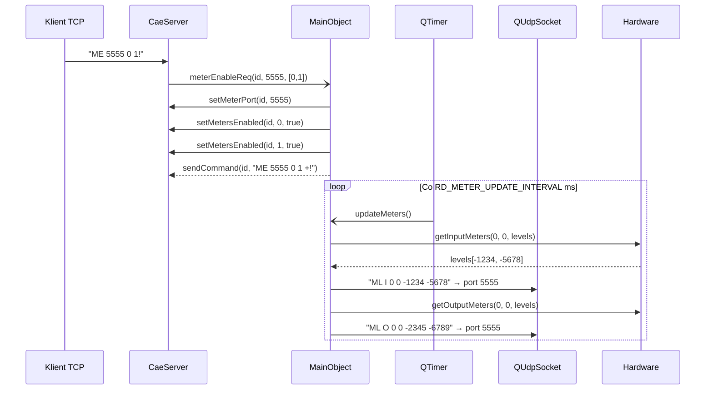

# CAE-005: Real-time Metering System

## Kontekst biznesowy

Stacja radiowa wymaga ciaglego monitorowania poziomow audio na wszystkich portach i streamach -- VU metry, progress bary odtwarzania, detekcja ciszy. System meteringu odczytuje dane z hardware periodycznie i wysyla je UDP do klientow, umozliwiajac wyswietlanie w czasie rzeczywistym. Kazdy klient moze niezaleznie wybrac ktore karty chce monitorowac.

## Aktorzy

| Aktor | Rola w tej feature |
|-------|-------------------|
| Klient TCP | Wlacza metering (ME), wybiera karty do monitorowania |
| Timer (QTimer) | Periodycznie odczytuje metery i wysyla UDP |

## Granica funkcjonalnosci

```
IN SCOPE:
  - Wlaczenie meteringu per-klient per-karta (ME)
  - Periodyczne odczytywanie poziomow z hardware (input/output/stream meters)
  - Periodyczne odczytywanie pozycji playbacku
  - Wysylanie danych meteringu UDP na meter_port klienta
  - Detekcja zmian input status i broadcast TCP
  - Filtrowanie: tylko karty z wlaczonym meteringiem

OUT OF SCOPE:
  - Playback/recording operations → patrz CAE-002, CAE-003
  - Mixer control → patrz CAE-004
  - Exit handling (tez w updateMeters) → patrz CAE-006
```

---

## Use Cases

| ID | Aktor | Akcja | Efekt biznesowy | Priorytet |
|----|-------|-------|----------------|-----------|
| UC-1 | Klient | Wlacza metering (ME) | Klient zaczyna otrzymywac dane audio levels UDP | MUST |
| UC-2 | Timer | Odczytuje input/output meters | Poziomy audio odczytane z hardware | MUST |
| UC-3 | Timer | Wysyla metering UDP | Klienty z wlaczonym meteringiem dostaja dane | MUST |
| UC-4 | Timer | Wykrywa zmiane input status | Broadcast IS do wszystkich klientow | SHOULD |

---

## Reguly biznesowe (Gherkin)

```gherkin
Rule: Metering per-klient per-karta

  Scenario: Wlaczenie meteringu
    Given klient autoryzowany
    When  ME udp_port card1 card2 ...!
    And   udp_port w zakresie 0-65535
    And   kazda karta < RD_MAX_CARDS
    Then  meter_port klienta ustawiony
    And   meters_enabled[card] = true dla podanych kart
    And   "ME ... +!"

  Scenario: Bledny port UDP
    Given klient autoryzowany
    When  ME z udp_port poza zakresem
    Then  "ME ... -!"
  # Zrodlo: cae.cpp:1413-1439 | Pewnosc: potwierdzone

Rule: Periodyczne wysylanie meteringu

  Scenario: Timer odpala updateMeters
    Given klienty z wlaczonym meteringiem
    When  timer co RD_METER_UPDATE_INTERVAL ms
    Then  dla kazdej karty z aktywnym driverem:
    And   input meters odczytane → UDP "ML I card port levelL levelR"
    And   output meters odczytane → UDP "ML O card port levelL levelR"
    And   stream meters odczytane → UDP "MO card stream levelL levelR"
    And   pozycje playbacku → UDP "MP card pos0 pos1 ..."
    And   UDP wysylany TYLKO na meter_port klientow z wlaczonym meteringiem danej karty
  # Zrodlo: cae.cpp:1510-1600, 2097-2170 | Pewnosc: potwierdzone

Rule: Input status change detection

  Scenario: Status wejscia zmienia sie
    Given port_status[card][port] sldezony
    When  hardware input status zmienia sie (np. kabel podlaczony/odlaczony)
    Then  broadcast TCP "IS card port new_status" do WSZYSTKICH klientow
    And   nie wymaga wlaczonego meteringu
  # Zrodlo: cae.cpp:1530-1537, 1557-1561, 1579-1583 | Pewnosc: potwierdzone
```

---

## Data Model

Brak bezposrednich operacji DB.

---

## API klas w scope

### MainObject (metering)

**Sloty:**
| Slot | Parametry | Efekt |
|------|-----------|-------|
| meterEnableData | int id, uint16_t udp_port, QList<unsigned> cards | Wlacza metering |
| updateMeters | - | Periodyczny: odczyt + wyslanie |

**Metody prywatne:**
| Metoda | Efekt |
|--------|-------|
| SendMeterLevelUpdate(type, card, port, levels) | UDP "ML I/O" do klientow |
| SendStreamMeterLevelUpdate(card, stream, levels) | UDP "MO" do klientow |
| SendMeterPositionUpdate(card, positions) | UDP "MP" do klientow |
| SendMeterOutputStatusUpdate() | TCP broadcast OS |
| SendMeterUpdate(msg, conn_id) | Wysyla UDP datagram |

**Driver Interface (metering):**
| Metoda | Zwraca | Opis |
|--------|--------|------|
| *GetInputMeters(card, port, levels[2]) | bool | Input L/R levels |
| *GetOutputMeters(card, port, levels[2]) | bool | Output L/R levels |
| *GetStreamOutputMeters(card, stream, levels[2]) | bool | Stream output L/R |
| *GetOutputPosition(card, pos[]) | void | Pozycje wszystkich streamow |
| *GetInputStatus(card, port) | bool | Status wejscia |

### CaeServer (metering API)

| Metoda | Efekt |
|--------|-------|
| meterPort(id) | Zwraca UDP port klienta |
| setMeterPort(id, port) | Ustawia UDP port |
| metersEnabled(id, card) | Czy metering wlaczony |
| setMetersEnabled(id, card, state) | Wlacza/wylacza |

---

## Protokoly komunikacji

**TCP (komenda):**
| Komenda | Parametry | Odpowiedz | Znaczenie |
|---------|-----------|-----------|-----------|
| ME | udp_port card1 [card2...] | ME ... +! | Meter Enable |

**UDP (dane meteringu):**
| Format | Znaczenie |
|--------|-----------|
| ML I card port levelL levelR | Input meter levels |
| ML O card port levelL levelR | Output meter levels |
| MO card stream levelL levelR | Stream output meter levels |
| MP card pos0 pos1 ... posN | Playback positions |

**TCP (broadcast):**
| Format | Znaczenie |
|--------|-----------|
| IS card port status | Input status change |
| OS card port stream state | Output status update |

---

## UI Contracts

Brak -- feature jest backend-only. Klienci wyswietlaja VU metry we wlasnym UI.

---

## Sygnaly integracji

### Sequence diagram -- metering flow



**Odbierane:**
| Nadawca | Sygnal | Slot |
|---------|--------|------|
| CaeServer | meterEnableReq | meterEnableData |
| QTimer | timeout() | updateMeters() |

---

## Platform Independence

| Funkcja | Oryginal | Klon | Priorytet |
|---------|----------|------|-----------|
| Hardware meter reads | ALSA/JACK/HPI meter APIs | Computed from audio stream | CRITICAL |
| UDP datagrams | QUdpSocket | WebSocket streaming | HIGH |
| Input status polling | Hardware status query | Software status | LOW |
| Timer interval | QTimer (RD_METER_UPDATE_INTERVAL) | setInterval / requestAnimationFrame | LOW |

---

## Configuration

| Klucz | Typ | Domyslna | Wplyw |
|-------|-----|---------|-------|
| RD_METER_UPDATE_INTERVAL | int (ms) | w rd.h | Czestotliwosc meteringu |

---

## Acceptance Criteria (E2E)

```gherkin
Feature: Real-time Metering

  Scenario: Klient monitoruje poziomy audio
    Given daemon z aktywna karta 0
    And   klient autoryzowany
    When  "ME 5555 0!"
    Then  "ME 5555 0 +!"
    And   co RD_METER_UPDATE_INTERVAL ms:
    And   UDP na port 5555: "ML I 0 0 <levelL> <levelR>"
    And   UDP na port 5555: "ML O 0 0 <levelL> <levelR>"

  Scenario: Wiele klientow z roznym filtrowaniem
    Given klient A: ME 5555 0 (karta 0)
    And   klient B: ME 6666 1 (karta 1)
    When  timer odpala
    Then  klient A dostaje dane TYLKO z karty 0
    And   klient B dostaje dane TYLKO z karty 1
```

---

## Working Packages

| WP | Opis | Zaleznosci |
|----|------|-----------|
| WP-1 | Metering enable: meterEnableData, meter_port/meters_enabled | - |
| WP-2 | Driver interface: GetInputMeters/GetOutputMeters/GetStreamOutputMeters | - |
| WP-3 | Periodic loop: updateMeters, clock processing | WP-2 |
| WP-4 | UDP sending: SendMeterLevelUpdate, SendMeterPositionUpdate | WP-3 |
| WP-5 | Tests | WP-1..WP-4 |
