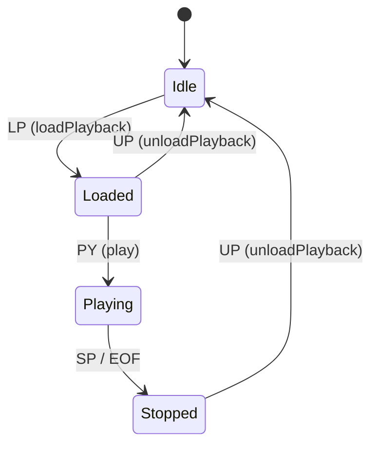
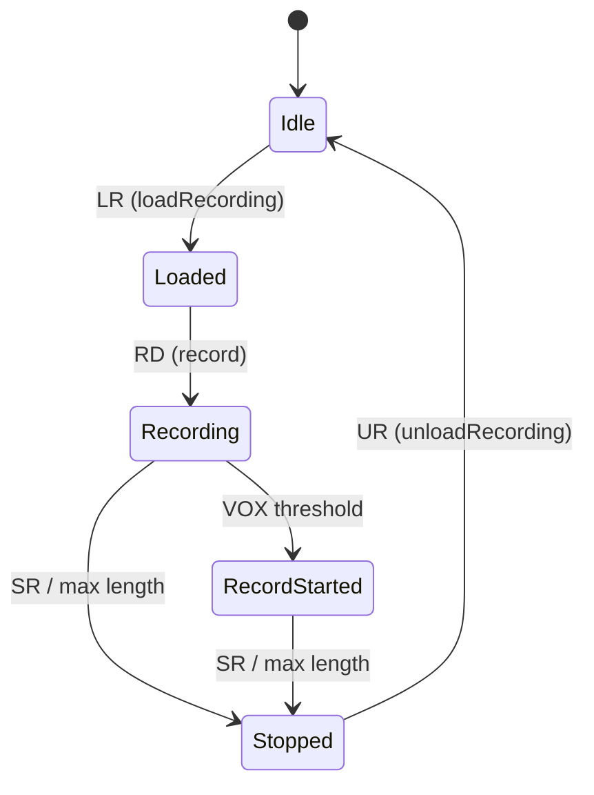
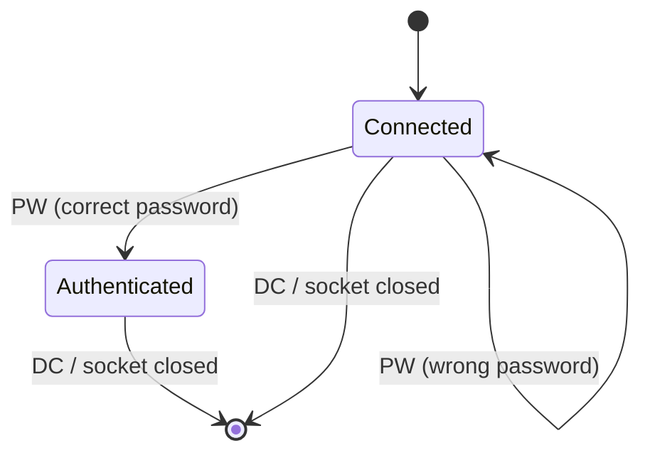

# SPEC: caed (Core Audio Engine)
## Behavioral Specification -- WHAT without HOW

> Dokument ten opisuje CO system robi i JAKIE MA ZACHOWANIE.
> Jest **nawigacyjnym PRD** -- podsumowuje i linkuje do szczegolw w fazach 2-5.
> Agenci kodujacy czytaja FEAT pliki (Phase 7) ktore zawieraja kompletne dane.

### Zrodla szczegolow

| Dokument | Zawiera | Czytaj gdy |
|----------|---------|-----------|
| `inventory.md` | Pelne API klas (MainObject, CaeServer, CaeServerConnection), driver interface | Potrzebujesz sygnatury metody |
| `ui-contracts.md` | N/A (headless daemon) | - |
| `call-graph.md` | 31 connect(), protokol CAE (26 komend), sequence diagrams | Potrzebujesz grafu zdarzen |
| `facts.md` | 52 fakty, 14 UC, 8 regul Gherkin, 3 state machines, limity | Potrzebujesz regul z dowodami |
| `data-model.md` | ERD, 3 tabele uzywane (STATIONS, SERVICES, AUDIO_PORTS) | Potrzebujesz schematu DB |

---

## Sekcja 1 -- Project Overview

**Czym jest caed (Core Audio Engine):**
Centralny daemon zarzadzajacy odtwarzaniem i nagrywaniem audio w systemie radiowym Rivendell. Przyjmuje komendy od klientow (aplikacji takich jak rdairplay, rdlibrary) przez siec TCP, wykonuje operacje audio na fizycznym hardware i wysyla dane meteringu w czasie rzeczywistym. Dziala jako warstwa abstrakcji nad roznymi systemami audio, pozwalajac klientom na jednolite sterowanie niezaleznie od typu karty dzwiekowej.

**Glowni aktorzy:**

| Aktor | Rola |
|-------|------|
| Klient TCP (rdairplay, rdlibrary, rdcatch...) | Wysyla komendy sterowania audio przez protokol CAE |
| System (startup) | Inicjalizuje daemon, provisionuje baze danych, konfiguruje hardware |
| Timer (periodyczny) | Odpala metering i clock processing |
| Administrator | Konfiguruje karty audio i porty w bazie danych |

**Kluczowe wartosci biznesowe:**
- Jednolity interfejs sterowania audio niezaleznie od typu karty dzwiekowej
- Wieloklientowy dostep do zasobow audio z kontrola wlasnosci (ownership)
- Metering w czasie rzeczywistym przez UDP dla VU metrow i progress barow
- Auto-provisioning stacji i serwisow eliminujacy reczna konfiguracje

---

## Sekcja 2 -- Domain Model

### Encje biznesowe

| Encja | Opis | Kluczowe pola | Pelne API |
|-------|------|--------------|-----------|
| MainObject | Glowna klasa daemona - zarzadza audio, dispatchuje komendy | cae_driver[], play_handle[], system_sample_rate | `inventory.md#MainObject` |
| CaeServer | Serwer TCP - parsuje protokol CAE, emituje sygnaly | cae_connections, cae_server | `inventory.md#CaeServer` |
| CaeServerConnection | Stan polaczenia klienta | socket, authenticated, meter_port, meters_enabled | `inventory.md#CaeServerConnection` |
| Playback Stream | Logiczny strumien odtwarzania | card, stream, handle, owner, length, speed, pitch | `inventory.md#MainObject` (pola play_*) |
| Recording Stream | Logiczny strumien nagrywania | card, stream, owner, length, threshold | `inventory.md#MainObject` (pola record_*) |
| Audio Driver | Abstrakcja nad hardware audio | typ (HPI/JACK/ALSA), metody Init/Free/Load/Play/Record/... | `inventory.md#MainObject` (sekcja Driver API) |

### Relacje

```
MainObject 1──────────1 CaeServer          (daemon posiada serwer)
CaeServer  1──────────N CaeServerConnection (serwer ma wielu klientow)
MainObject 1──────────N Audio Driver        (daemon zarzadza wieloma kartami)
Klient     1──────────N Playback Stream     (klient moze miec wiele playbackow)
Klient     1──────────N Recording Stream    (klient moze miec wiele nagrywan)
```

### Enums (z librd)

| Enum | Wartosci | Znaczenie |
|------|----------|-----------|
| RDStation::AudioDriver | None, Hpi, Jack, Alsa | Typ drivera audio per karta |
| RDCae::InputType | Analog, AesEbu | Typ wejscia audio |
| Input Mode | 0=Normal, 1=Swap, 2=Left, 3=Right | Tryb kanalu wejsciowego |
| Record Coding | 0-4 | Typ kodowania nagrywania |

---

## Sekcja 3 -- Data Model (schemat DB)

CAE nie definiuje wlasnych tabel -- korzysta z tabel zarzadzanych przez librd.

> Pelny schemat: `data-model.md`

### Tabele uzywane

| Tabela | Operacje CAE | Mapowanie na encje | Kiedy |
|--------|-------------|-------------------|-------|
| STATIONS | READ, UPDATE (capabilities) | RDStation → MainObject.cae_station | Startup (provisioning, ProbeCaps) |
| SERVICES | READ, CREATE | RDSvc | Startup (provisioning) |
| AUDIO_PORTS | READ | RDAudioPort | Startup (InitMixers) |

### Relacje FK

```
STATIONS.NAME → AUDIO_PORTS.STATION_NAME
```

---

## Sekcja 4 -- Functional Capabilities (Use Cases)

| ID | Aktor | Akcja | Efekt biznesowy | Priorytet |
|----|-------|-------|----------------|-----------|
| UC-001 | Klient TCP | Laduje plik audio do odtwarzania | Stream przydzielony, handle zwrocony | MUST |
| UC-002 | Klient TCP | Rozpoczyna odtwarzanie | Audio odtwarzane, klient notyfikowany | MUST |
| UC-003 | Klient TCP | Zatrzymuje odtwarzanie | Playback zatrzymany | MUST |
| UC-004 | Klient TCP | Laduje nagrywanie | Recording stream gotowy z parametrami kodowania | MUST |
| UC-005 | Klient TCP | Rozpoczyna nagrywanie | Audio nagrywane do pliku | MUST |
| UC-006 | Klient TCP | Zatrzymuje nagrywanie | Plik zamkniety, dlugosc zwrocona | MUST |
| UC-007 | Klient TCP | Ustawia glosnosc (input/output) | Volume zmieniony na hardware | MUST |
| UC-008 | Klient TCP | Fade glosnosc wyjscia | Volume zmienia sie plynnie w czasie | SHOULD |
| UC-009 | Klient TCP | Wlacza metering | Klient otrzymuje strumien UDP z poziomami | MUST |
| UC-010 | Klient TCP | Ustawia passthrough | Audio z wejscia na wyjscie | SHOULD |
| UC-011 | System | Startup i provisioning | Daemon gotowy, hardware zainicjalizowany | MUST |
| UC-012 | Klient TCP | Autoryzacja haslem | Dostep do komend | MUST |
| UC-013 | System | Metering periodyczny | Poziomy audio wysylane do klientow | MUST |
| UC-014 | System | Cleanup przy rozlaczeniu | Zasoby klienta zwolnione automatycznie | MUST |

-> Pelne reguly: `facts.md`

---

## Sekcja 5 -- Business Rules (Gherkin)

> Kluczowe reguly definiujace zachowanie systemu.
> Kompletna lista z source references: `facts.md`

```gherkin
Rule: Autoryzacja klienta
  Scenario: Komendy wymagaja autoryzacji
    Given klient polaczony do CAE
    When  klient wysyla komende audio bez wczesniejszego PW
    Then  komenda jest ignorowana
    And   tylko PW (haslo) i DC (disconnect) sa dozwolone

Rule: Driver dispatch
  Scenario: Kazda operacja audio jest dispatchowana do wlasciwego drivera
    Given karta audio ma przypisany typ drivera (HPI/JACK/ALSA)
    When  klient wysyla komende na te karte
    Then  komenda jest przekazana do odpowiedniego drivera
    And   jesli karta nie ma drivera (None) → blad

Rule: Ownership i cleanup
  Scenario: Zasoby audio maja wlasciciela
    Given klient zaladowal playback lub nagrywanie
    When  klient sie rozlacza
    Then  wszystkie jego streamy (play i record) sa automatycznie zwalniane
    And   ownery resetowane do -1

Rule: Handle management
  Scenario: Pula 256 handleow playbacku
    Given pula handleow ma 256 slotow
    When  nowy playback jest ladowany
    Then  nastepny wolny handle przydzielany (round-robin)
    And   handle mapuje na pare (card, stream)

Rule: Metering per-klient per-karta
  Scenario: Klient wybiera ktore karty monitorowac
    Given klient wlacza metering komenda ME
    When  podaje numer portu UDP i liste kart
    Then  tylko dane z wybranych kart sa wysylane na ten port UDP
```

---

## Sekcja 6 -- State Machines

### Playback Stream



### Recording Stream



### Client Connection



-> Pelne tabele przejsc: `facts.md`

---

## Sekcja 7 -- Reactive Architecture

### Kluczowe przeplyw zdarzen

**Przepyw: Odtwarzanie audio**
```
[Klient] "LP card filename!"
    → CaeServer parsuje komende
    → emit loadPlaybackReq → MainObject::loadPlaybackData
    → driver allocates stream → handle assigned
    → odpowiedz "LP card filename handle stream +!"
[Klient] "PY handle length speed pitch!"
    → driver starts playback → async callback
    → "PY handle length speed +!" (playing)
    → [koniec] "SP handle +!" (stopped)
```

**Przepyw: Metering real-time**
```
[Timer co N ms] → updateMeters()
    → odczyt levels z hardware (per karta, per port)
    → dla kazdego klienta z wlaczonym meteringiem:
        → UDP datagram z poziomami na meter_port klienta
```

**Przepyw: Cleanup przy disconnect**
```
[Socket closed] → connectionDropped → connectionDroppedData → KillSocket
    → iteracja ALL cards x streams
    → unload record/play dla streamow tego klienta
    → reset ownerow
```

### Cross-artifact komunikacja

| Zrodlo | Zdarzenie | Cel | Efekt |
|--------|-----------|-----|-------|
| Klienci (rdairplay etc.) | Komendy TCP | CAE daemon | Sterowanie audio |
| CAE daemon | Metering UDP | Klienci | Poziomy audio real-time |
| CAE daemon | Input status broadcast (TCP) | Klienci | Zmiana statusu portow |

-> Pelny graf: `call-graph.md`

---

## Sekcja 8 -- UI/UX Contracts

CAE jest headless daemon (QCoreApplication). Nie posiada interfejsu graficznego.

Jedynym "interfejsem uzytkownika" jest:
1. **Protokol TCP** -- patrz Sekcja 9
2. **Metering UDP** -- patrz Sekcja 9
3. **CLI flag** `-d` (debug mode)

-> UI Contracts: `ui-contracts.md` (potwierdza brak UI)

---

## Sekcja 9 -- API & Protocol Contracts

### CAE Protocol (TCP → caed, port CAED_TCP_PORT)

Protokol tekstowy. Komendy = 2-literowe tokeny + parametry rozdzielone spacjami, terminowane '!'.
Odpowiedzi: "{CMD} {params} +!" (sukces) lub "{CMD} {params} -!" (blad).

#### Komendy autoryzacji (bez auth)

| Komenda | Parametry | Odpowiedz | Znaczenie |
|---------|-----------|-----------|-----------|
| PW | password | PW +! / PW -! | Autoryzacja haslem |
| DC | - | - | Disconnect |

#### Komendy playbacku (wymagaja auth)

| Komenda | Parametry | Odpowiedz | Znaczenie |
|---------|-----------|-----------|-----------|
| LP | card filename | LP card filename handle stream +! | Load Playback |
| UP | handle | UP handle +! | Unload Playback |
| PP | handle pos | PP handle pos +! | Play Position (seek) |
| PY | handle length speed pitch | PY handle length speed +! | Play |
| SP | handle | SP handle +! | Stop Playback |
| TS | card | TS card +! / TS card -! | Timescaling Support query |

#### Komendy nagrywania (wymagaja auth)

| Komenda | Parametry | Odpowiedz | Znaczenie |
|---------|-----------|-----------|-----------|
| LR | card port coding chans srate brate filename | LR ... stream +! | Load Recording |
| UR | card stream | UR card stream length +! | Unload Recording |
| RD | card stream length threshold | RD ... +! | Record |
| SR | card stream | SR card stream +! | Stop Recording |

#### Komendy mixera (wymagaja auth)

| Komenda | Parametry | Odpowiedz | Znaczenie |
|---------|-----------|-----------|-----------|
| IV | card stream level | IV card stream level +! | Set Input Volume |
| OV | card stream port level | OV ... +! | Set Output Volume |
| FV | card stream port level length | FV ... +! | Fade Output Volume |
| IL | card port level | IL card port level +! | Set Input Level |
| OL | card port level | OL card port level +! | Set Output Level |
| IM | card port mode(0-3) | IM ... +! | Set Input Mode |
| OM | card port mode(0-3) | OM ... +! | Set Output Mode |
| IX | card stream level | IX ... +! | Set Input Vox Level |
| IT | card port type(0-1) | IT ... +! | Set Input Type |
| IS | card port | IS card port status +! | Get Input Status |
| AL | card input output level | AL ... +! | Set Audio Passthrough Level |
| CS | card input | CS card input +! | Set Clock Source |
| OS | card port stream state(0/1) | OS ... +! | Set Output Status Flag |

#### Komendy meteringu (wymagaja auth)

| Komenda | Parametry | Odpowiedz | Znaczenie |
|---------|-----------|-----------|-----------|
| ME | udp_port card1 [card2...] | ME ... +! | Meter Enable |

#### Asynchroniczne notyfikacje (serwer → klient)

| Format | Znaczenie |
|--------|-----------|
| PY handle length speed +! | Playback started (async) |
| SP handle +! | Playback stopped (async) |
| RS card stream +! | Record Started (VOX triggered) |
| SR card stream +! | Record stopped (async) |
| IS card port status | Input status change (broadcast) |

### Metering UDP (CAE → klienci)

| Format | Znaczenie |
|--------|-----------|
| ML I card port levelL levelR | Input meter levels (dB * 100) |
| ML O card port levelL levelR | Output meter levels (dB * 100) |
| MO card stream levelL levelR | Stream output meter levels |
| MP card pos0 pos1 ... posN | Playback positions (all streams) |

---

## Sekcja 10 -- Data Flow

```
[rd.conf] → RDConfig → MainObject (konfiguracja)
[MySQL DB] → RDStation/RDAudioPort → MainObject (driver types, mixer config)
[Klient TCP] → CaeServer → MainObject (komendy)
[MainObject] → Audio Drivers → [Hardware audio] (sterowanie)
[Hardware audio] → Audio Drivers → MainObject → [UDP] → [Klient] (metering)
[MainObject] → CaeServer → [TCP] → [Klient] (odpowiedzi, notyfikacje)
```

| Transformacja | Od | Do | Co sie zmienia |
|--------------|----|----|----------------|
| Komenda TCP | Tekst "LP 0 myfile" | Parametry (card=0, name="myfile") | Parse i walidacja |
| Driver dispatch | Parametry + driver type | Wywolanie hardware | Switch na cae_driver[card] |
| Metering | Surowe levele z hardware | UDP datagram "ML I 0 0 -1234 -5678" | Formatowanie i filtrowanie per-klient |
| State callback | Driver state change | TCP notyfikacja "PY handle +!" | Mapowanie handle → owner |

---

## Sekcja 11 -- Error Taxonomy

| Kod/Typ | Kategoria | Co wywoluje | Zachowanie | Komunikat |
|---------|-----------|-------------|-----------|-----------|
| "{CMD} ... -!" | Operacja audio failed | Driver zwraca false | Odpowiedz bledu do klienta | Komenda z "-!" zamiast "+!" |
| "PW -!" | Auth failed | Bledne haslo | Klient nie-autoryzowany | "PW -!" |
| exit(1) | Server bind failed | Port TCP zajety | Daemon konczy prace | syslog "failed to bind port" |
| exit(256) | Provisioning failed | Nie mozna utworzyc stacji/serwisu | Daemon konczy prace | stderr "unable to provision" |
| log WARNING | Stale handle | Handle juz przydzielony | Auto-czyszczenie | "clearing stale stream assignment" |
| log WARNING | No free stream | Driver nie moze przydzielic | Odpowiedz LP ... -1 -1 -! | "unable to allocate stream" |
| Ignored | Unauth command | Komenda bez PW | Cicha odmowa | brak odpowiedzi |
| "{CMD}-!" | Unknown command | Nierozpoznana komenda | Generic error | Komenda z "-!" |

---

## Sekcja 12 -- Integration Contracts

### Cross-artifact

| Artifact | Mechanizm | Kierunek | Kontrakt |
|----------|-----------|---------|---------|
| LIB (librd) | Linkowanie | CAE → LIB | RDConfig, RDStation, RDAudioPort, RDWaveFile, RDSqlQuery |
| HPI (librdhpi) | Linkowanie (ifdef HPI) | CAE → HPI | RDHPISoundCard, RDHPIPlayStream, RDHPIRecordStream |
| Klienci (rdairplay etc.) | TCP | Klienci → CAE | Protokol CAE (Sekcja 9) |
| Klienci | UDP | CAE → Klienci | Metering datagrams (Sekcja 9) |

### Zewnetrzne systemy

| System | Rola | Protokol | Dane |
|--------|------|----------|------|
| ALSA | Niskopoziomowy audio I/O | libasound C API | PCM samples |
| JACK | Audio routing daemon | libjack C API | Audio buffers, port connections |
| AudioScience HPI | Pro audio hardware | libhpi C API | Audio streams |
| MySQL/MariaDB | Baza danych | QtSql (via librd) | STATIONS, SERVICES, AUDIO_PORTS |
| SoundTouch | Time-stretching | C++ library | Pitched audio samples |
| TwoLAME | MP2 encoding | dlopen'd C API | MPEG audio frames |
| MAD | MP3 decoding | dlopen'd C API | PCM samples |

---

## Sekcja 13 -- Platform Independence Map

| Funkcja | Oryginal | Klon (generic) | Priorytet |
|---------|----------|----------------|-----------|
| Audio playback | ALSA/JACK/HPI drivers | Generic audio backend (Web Audio API / platform API) | CRITICAL |
| Audio recording | ALSA/JACK/HPI drivers | Generic audio capture | CRITICAL |
| Real-time audio processing | pthread + ALSA PCM threads | Audio worklet / platform thread | CRITICAL |
| Audio metering | Hardware meter reads + UDP broadcast | Computed from audio stream + WebSocket | CRITICAL |
| Volume control | Hardware mixer levels (dB) | Software volume (normalized 0.0-1.0) | HIGH |
| Audio passthrough | Hardware routing (port→port) | Software mixing/routing | HIGH |
| Timescaling | SoundTouch C++ library | Web Audio API playbackRate / library | HIGH |
| MP2 encoding | TwoLAME (dlopen) | Standard codec library | MEDIUM |
| MP3 decoding | MAD (dlopen) | Standard codec library | MEDIUM |
| Signal handling | SIGHUP/SIGINT/SIGTERM | Platform graceful shutdown | MEDIUM |
| TCP server | QTcpServer | WebSocket / HTTP API | HIGH |
| UDP metering | QUdpSocket datagrams | WebSocket streaming | HIGH |
| Database | MySQL via QtSql | Any SQL database | HIGH |
| Config | rd.conf file (RDConfig) | Environment variables / config file | LOW |

---

## Sekcja 14 -- Non-Functional Requirements

```gherkin
Scenario: Metering latency
  Given klient z wlaczonym meteringiem
  When  timer updateMeters() odpala
  Then  dane metryczne sa odczytane z hardware i wyslane UDP
  And   caly cykl w ramach RD_METER_UPDATE_INTERVAL

Scenario: Multi-client concurrency
  Given wiele klientow polaczonych jednoczesnie
  When  kazdy wysyla komendy audio
  Then  kazdy klient operuje na swoich streamach (izolacja przez ownership)
  And   metering jest wysylany rownolegle do wszystkich klientow

Scenario: Graceful shutdown
  Given daemon otrzymuje SIGTERM
  When  nastepny cykl updateMeters()
  Then  wszystkie drivery zwolnione (Free)
  And   daemon konczy prace z kodem 0

Scenario: Multi-card support
  Given RD_MAX_CARDS kart audio skonfigurowanych
  When  kazda karta moze miec inny driver (HPI/JACK/ALSA)
  Then  komendy dispatchowane do wlasciwego drivera per karta
```

---

## Sekcja 15 -- Configuration

| Klucz (rd.conf) | Typ | Domyslna | Opis |
|-------|-----|---------|------|
| password | string | - | Haslo autoryzacji klientow CAE |
| provisioningCreateHost | bool | false | Auto-tworzenie stacji w DB |
| provisioningCreateService | bool | false | Auto-tworzenie serwisu w DB |
| provisioningHostTemplate | string | "" | Template nazwy stacji |
| provisioningServiceTemplate | string | "" | Template nazwy serwisu |
| stationName | string | - | Nazwa stacji w DB |

| Klucz (DB: STATIONS) | Typ | Opis |
|---|---|---|
| AudioDriver per card | enum | Typ drivera (None/HPI/JACK/ALSA) |
| HAVE_* capabilities | bool | Dostepnosc kodekow |

| Klucz (DB: AUDIO_PORTS) | Typ | Opis |
|---|---|---|
| CLOCK_SOURCE | int | Zrodlo zegara audio |
| INPUT_*_TYPE | int | Typ wejscia (Analog/Digital) |
| INPUT_*_LEVEL | int | Poziom wejscia |
| OUTPUT_*_LEVEL | int | Poziom wyjscia |

| Klucz (stala C++) | Wartosc | Opis |
|---|---|---|
| RINGBUFFER_SIZE | 262144 | Rozmiar ring buffer (bytes) |
| CAED_TCP_PORT | w rd.h | Port TCP serwera |
| RD_METER_UPDATE_INTERVAL | w rd.h | Interwal meteringu (ms) |

---

## Sekcja 16 -- E2E Acceptance Scenarios

```gherkin
Feature: Audio Playback Lifecycle
  Scenario: Klient odtwarza plik audio od poczatku do konca
    Given daemon CAE dziala z skonfigurowana karta audio
    And   klient polaczyl sie przez TCP
    And   klient autoryzwal sie komenda "PW haslo!"
    When  klient wysyla "LP 0 myaudio!"
    Then  otrzymuje "LP 0 myaudio <handle> <stream> +!"
    When  klient wysyla "PY <handle> 0 100 0!"
    Then  audio jest odtwarzane
    And   klient otrzymuje asynchronicznie "PY <handle> 0 100 +!"
    When  plik audio konczy sie (EOF)
    Then  klient otrzymuje "SP <handle> +!"
    When  klient wysyla "UP <handle>!"
    Then  otrzymuje "UP <handle> +!"
    And   handle i stream sa zwolnione

Feature: Audio Recording with VOX
  Scenario: Klient nagrywa audio z progiem VOX
    Given daemon CAE dziala z karta audio z wejsciem
    And   klient autoryzowany
    When  klient wysyla "LR 0 0 0 2 48000 0 myrecording!"
    Then  otrzymuje "LR ... <stream> +!"
    When  klient wysyla "RD 0 <stream> 60000 -3000!"
    Then  nagrywanie czeka na sygnal ponad -3000
    When  sygnal audio przekracza prog
    Then  klient otrzymuje "RS 0 <stream> +!" (record started)
    When  klient wysyla "SR 0 <stream>!"
    Then  nagrywanie zatrzymane, plik zamkniety
    And   klient otrzymuje "SR 0 <stream> +!"

Feature: Real-time Metering
  Scenario: Klient monitoruje poziomy audio w czasie rzeczywistym
    Given klient autoryzowany
    When  klient wysyla "ME 5555 0 1!"
    Then  otrzymuje "ME 5555 0 1 +!"
    And   co RD_METER_UPDATE_INTERVAL ms:
    And   na UDP port 5555 przychodzi "ML I 0 0 -1234 -5678"
    And   na UDP port 5555 przychodzi "ML O 0 0 -2345 -6789"
    And   na UDP port 5555 przychodzi "MO 0 0 -3456 -7890"
    And   na UDP port 5555 przychodzi "MP 0 12345 0 0 ..."
    When  klient rozlacza sie
    Then  metering na ten port jest zatrzymany
```

---

## Assumptions & Open Questions

| # | Zalozenie | Alternatywa | Wplyw |
|---|-----------|-------------|-------|
| 1 | RTP Capture (komenda openRtpCaptureChannelReq) moze byc niekompletna/nieuzywanej | Moze byc uzywana w specjalistycznych konfiguracjach | Nizki - opcjonalny feature |
| 2 | JACK jest jedyna karta na systemie (jack_card to jeden slot w RD_MAX_CARDS) | Mozliwe wiele instancji | Sredni - architektura JACK |
| 3 | Haslo autoryzacji jest jednakowe dla wszystkich klientow (z rd.conf) | Osobne hasla per klient | Niski - uproszczenie |
| 4 | Brak szyfrowania TCP/UDP | Zakladane bezpieczne srodowisko LAN | Sredni - bezpieczenstwo |

---

*SPEC wygenerowany przez Qt Reverse Engineering Multi-Agent System v1.3.0*
*Zrodla: inventory.md + ui-contracts.md + call-graph.md + facts.md + kod zrodlowy*
