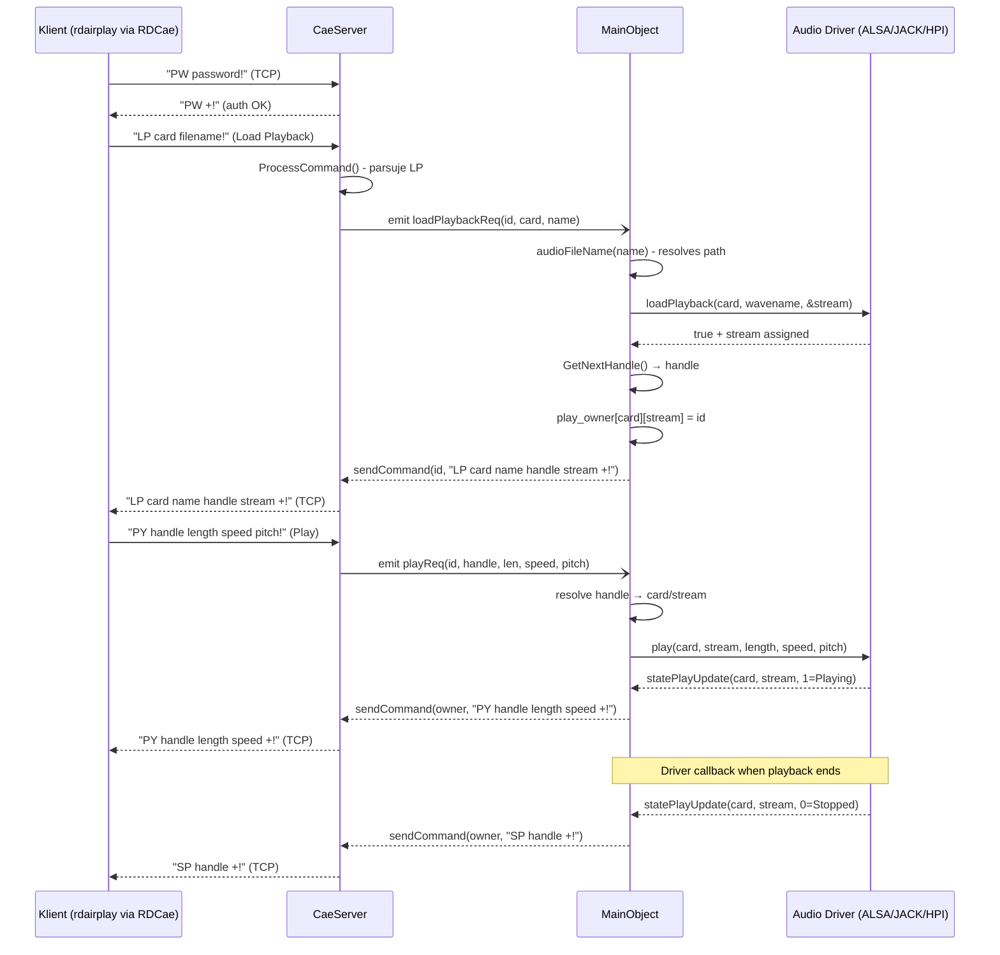
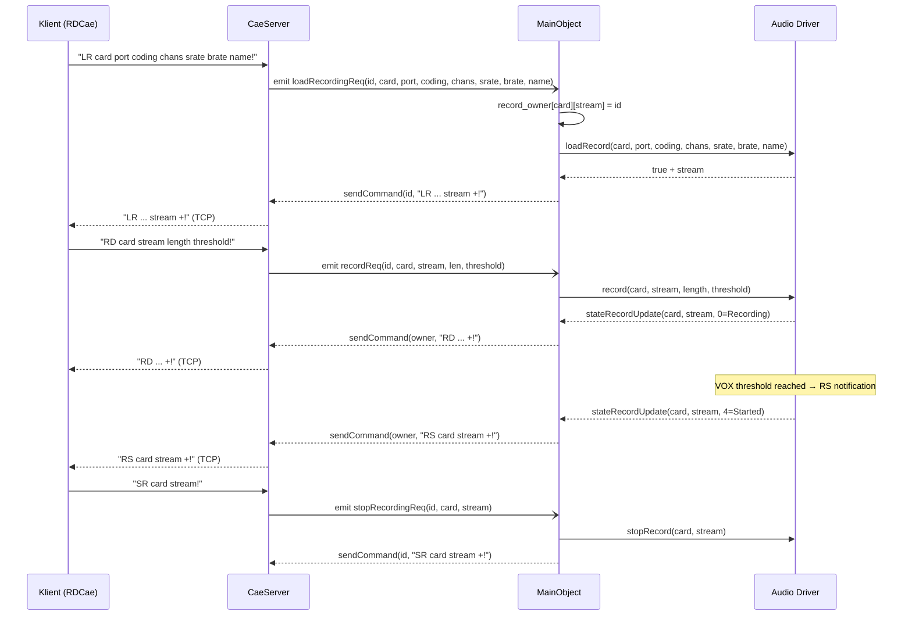
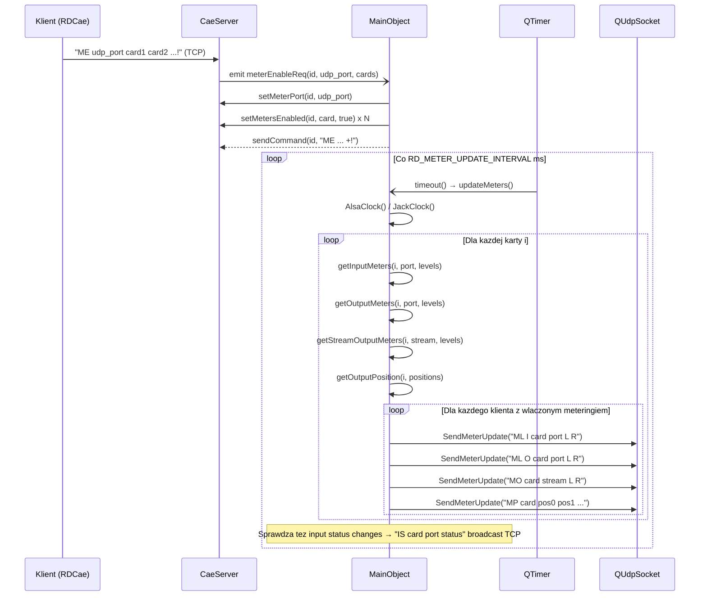
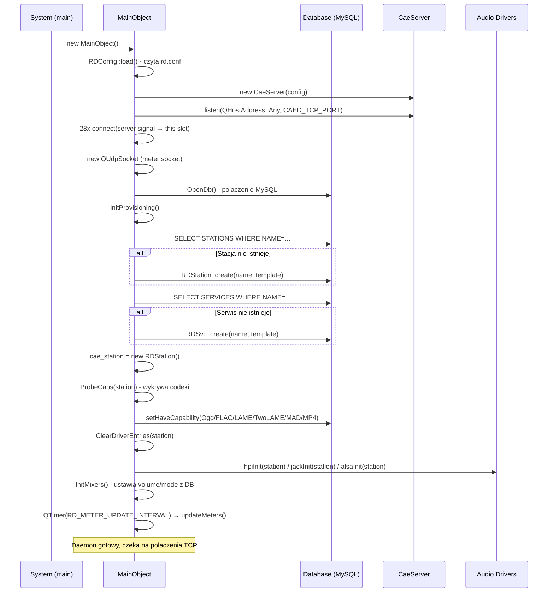
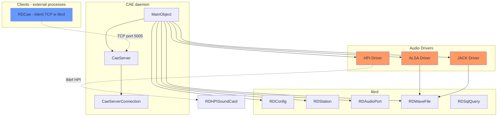

# Call Graph: caed (Core Audio Engine)

## Statystyki

| Metryka | Wartosc |
|---------|---------|
| Polaczenia connect() lacznie | 31 |
| Unikalne sygnaly | 28 |
| Klasy emitujace | 1 (CaeServer) |
| Klasy odbierajace | 1 (MainObject) |
| Cross-artifact polaczenia | 1 (TCP protocol → klienci librd::RDCae) |
| Circular dependencies | 0 |
| Q_PROPERTY z NOTIFY | 0 |

---

## Diagramy

### Sequence: Odtwarzanie pliku audio (Load + Play)



### Sequence: Nagrywanie audio



### Sequence: Metering (periodyczne)



### Sequence: Startup i Provisioning



### Graf zaleznosci



---

## Graf polaczen (connect registry)

| # | Nadawca (klasa) | Sygnal | Odbiorca (klasa) | Slot | Zdefiniowane w | Warunek |
|---|----------------|--------|-----------------|------|---------------|---------|
| 1 | CaeServer | connectionDropped(int) | MainObject | connectionDroppedData(int) | cae.cpp:159 | zawsze |
| 2 | CaeServer | loadPlaybackReq(int,unsigned,QString) | MainObject | loadPlaybackData(int,unsigned,QString) | cae.cpp:161 | zawsze |
| 3 | CaeServer | unloadPlaybackReq(int,unsigned) | MainObject | unloadPlaybackData(int,unsigned) | cae.cpp:163 | zawsze |
| 4 | CaeServer | playPositionReq(int,unsigned,unsigned) | MainObject | playPositionData(int,unsigned,unsigned) | cae.cpp:165 | zawsze |
| 5 | CaeServer | playReq(int,unsigned,unsigned,unsigned,unsigned) | MainObject | playData(int,unsigned,unsigned,unsigned,unsigned) | cae.cpp:167 | zawsze |
| 6 | CaeServer | stopPlaybackReq(int,unsigned) | MainObject | stopPlaybackData(int,unsigned) | cae.cpp:169 | zawsze |
| 7 | CaeServer | timescalingSupportReq(int,unsigned) | MainObject | timescalingSupportData(int,unsigned) | cae.cpp:171 | zawsze |
| 8 | CaeServer | loadRecordingReq(int,unsigned,unsigned,unsigned,unsigned,unsigned,unsigned,QString) | MainObject | loadRecordingData(...) | cae.cpp:173 | zawsze |
| 9 | CaeServer | unloadRecordingReq(int,unsigned,unsigned) | MainObject | unloadRecordingData(int,unsigned,unsigned) | cae.cpp:179 | zawsze |
| 10 | CaeServer | recordReq(int,unsigned,unsigned,unsigned,int) | MainObject | recordData(int,unsigned,unsigned,unsigned,int) | cae.cpp:181 | zawsze |
| 11 | CaeServer | stopRecordingReq(int,unsigned,unsigned) | MainObject | stopRecordingData(int,unsigned,unsigned) | cae.cpp:183 | zawsze |
| 12 | CaeServer | setInputVolumeReq(int,unsigned,unsigned,int) | MainObject | setInputVolumeData(int,unsigned,unsigned,int) | cae.cpp:185 | zawsze |
| 13 | CaeServer | setOutputVolumeReq(int,unsigned,unsigned,unsigned,int) | MainObject | setOutputVolumeData(int,unsigned,unsigned,unsigned,int) | cae.cpp:187 | zawsze |
| 14 | CaeServer | fadeOutputVolumeReq(int,unsigned,unsigned,unsigned,int,unsigned) | MainObject | fadeOutputVolumeData(int,unsigned,unsigned,unsigned,int,unsigned) | cae.cpp:191 | zawsze |
| 15 | CaeServer | setInputLevelReq(int,unsigned,unsigned,int) | MainObject | setInputLevelData(int,unsigned,unsigned,int) | cae.cpp:195 | zawsze |
| 16 | CaeServer | setOutputLevelReq(int,unsigned,unsigned,int) | MainObject | setOutputLevelData(int,unsigned,unsigned,int) | cae.cpp:197 | zawsze |
| 17 | CaeServer | setInputModeReq(int,unsigned,unsigned,unsigned) | MainObject | setInputModeData(int,unsigned,unsigned,unsigned) | cae.cpp:199 | zawsze |
| 18 | CaeServer | setOutputModeReq(int,unsigned,unsigned,unsigned) | MainObject | setOutputModeData(int,unsigned,unsigned,unsigned) | cae.cpp:201 | zawsze |
| 19 | CaeServer | setInputVoxLevelReq(int,unsigned,unsigned,int) | MainObject | setInputVoxLevelData(int,unsigned,unsigned,int) | cae.cpp:203 | zawsze |
| 20 | CaeServer | setInputTypeReq(int,unsigned,unsigned,unsigned) | MainObject | setInputTypeData(int,unsigned,unsigned,unsigned) | cae.cpp:205 | zawsze |
| 21 | CaeServer | getInputStatusReq(int,unsigned,unsigned) | MainObject | getInputStatusData(int,unsigned,unsigned) | cae.cpp:207 | zawsze |
| 22 | CaeServer | setAudioPassthroughLevelReq(int,unsigned,unsigned,unsigned,int) | MainObject | setAudioPassthroughLevelData(int,unsigned,unsigned,unsigned,int) | cae.cpp:209 | zawsze |
| 23 | CaeServer | setClockSourceReq(int,unsigned,int) | MainObject | setClockSourceData(int,unsigned,int) | cae.cpp:213 | zawsze |
| 24 | CaeServer | setOutputStatusFlagReq(int,unsigned,unsigned,unsigned,bool) | MainObject | setOutputStatusFlagData(int,unsigned,unsigned,unsigned,bool) | cae.cpp:215 | zawsze |
| 25 | CaeServer | openRtpCaptureChannelReq(int,unsigned,unsigned,uint16_t,unsigned,unsigned) | MainObject | openRtpCaptureChannelData(int,unsigned,unsigned,uint16_t,unsigned,unsigned) | cae.cpp:219 | zawsze |
| 26 | CaeServer | meterEnableReq(int,uint16_t,QList<unsigned>) | MainObject | meterEnableData(int,uint16_t,QList<unsigned>) | cae.cpp:225 | zawsze |
| 27 | QTimer | timeout() | MainObject | updateMeters() | cae.cpp:290 | zawsze (periodyczne) |
| 28 | QTcpServer | newConnection() | CaeServer | newConnectionData() | cae_server.cpp:62 | zawsze |
| 29 | QSignalMapper(readyRead) | mapped(int) | CaeServer | readyReadData(int) | cae_server.cpp:65 | zawsze |
| 30 | QSignalMapper(closed) | mapped(int) | CaeServer | connectionClosedData(int) | cae_server.cpp:69 | zawsze |
| 31 | QTcpSocket | readyRead()/disconnected() | QSignalMapper | map() | cae_server.cpp:155,158 | per nowe polaczenie |

---

## Kluczowe przeplyw zdarzen

### Przepyw: Odtwarzanie pliku audio

```
[Klient TCP] wysyla "LP card filename!"
    → CaeServer::ProcessCommand() parsuje "LP"
    → emit loadPlaybackReq(id, card, name)
    → MainObject::loadPlaybackData()
    → dispatch wg cae_driver[card]: hpiLoadPlayback() / alsaLoadPlayback() / jackLoadPlayback()
    → GetNextHandle() → handle
    → play_owner[card][stream] = id
    → sendCommand(id, "LP card name handle stream +!")

[Klient TCP] wysyla "PY handle length speed pitch!"
    → CaeServer::ProcessCommand() parsuje "PY"
    → emit playReq(id, handle, len, speed, pitch)
    → MainObject::playData()
    → dispatch: hpiPlay() / alsaPlay() / jackPlay()
    → [async] driver callback → statePlayUpdate(card, stream, 1=Playing)
    → sendCommand(owner, "PY handle length speed +!")

[Koniec playbacku]
    → driver callback → statePlayUpdate(card, stream, 0=Stopped)
    → sendCommand(owner, "SP handle +!")
```

**Efekt biznesowy:** Klient (np. rdairplay) laduje plik audio, rozpoczyna odtwarzanie i otrzymuje asynchroniczne powiadomienia o zmianie stanu (playing → stopped).

### Przepyw: Nagrywanie

```
[Klient TCP] → "LR card port coding chans srate brate name!"
    → loadRecordingReq → loadRecordingData()
    → record_owner[card][stream] = id
    → dispatch: loadRecord()
    → sendCommand("LR ... stream +!")

[Klient TCP] → "RD card stream length threshold!"
    → recordReq → recordData()
    → dispatch: record()
    → [async] stateRecordUpdate(card, stream, 0=Recording) → sendCommand("RD ... +!")
    → [async VOX] stateRecordUpdate(card, stream, 4=Started) → sendCommand("RS card stream +!")

[Klient TCP] → "SR card stream!"
    → stopRecordingReq → stopRecordingData()
    → dispatch: stopRecord()
    → sendCommand("SR card stream +!")
```

**Efekt biznesowy:** Klient nagryla audio z podanymi parametrami kodowania. Obsluguje VOX (voice-activated recording start).

### Przepyw: Metering UDP

```
[Klient TCP] → "ME udp_port card1 card2!"
    → meterEnableReq → meterEnableData()
    → setMeterPort(id, udp_port)
    → setMetersEnabled(id, card, true) per karta

[Timer co RD_METER_UPDATE_INTERVAL ms] → updateMeters()
    → AlsaClock() / JackClock()
    → Dla kazdej karty z aktywnym driverem:
        → getInputMeters(card, port) → SendMeterLevelUpdate("I", card, port, levels)
        → getOutputMeters(card, port) → SendMeterLevelUpdate("O", card, port, levels)
        → getStreamOutputMeters(card, stream) → SendStreamMeterLevelUpdate()
        → getOutputPosition(card, positions) → SendMeterPositionUpdate()
    → Kazdy meter update → UDP datagram na meter_port kazdego klienta z wlaczonym meteringiem danej karty
```

**Efekt biznesowy:** Klienci otrzymuja ciagly strumien danych o poziomach audio (input/output/stream) i pozycjach odtwarzania przez UDP, umozliwiajac wyswietlanie VU meters i progress bars.

---

## Cross-artifact polaczenia

| Zrodlo artifact | Mechanizm | Cel artifact | Sygnal/Metoda | Znaczenie |
|----------------|-----------|-------------|--------------|-----------|
| Klienci (LIB::RDCae) | TCP port CAED_TCP_PORT (5005) | CAE (CaeServer) | Protokol tekstowy (LP/PY/SP/LR/RD/SR/IV/OV/FV/IL/OL/IM/OM/IX/IT/IS/AL/CS/OS/ME/DC/PW) | Zdalne sterowanie audio engine |
| CAE (MainObject) | UDP | Klienci (LIB::RDCae) | Metering datagrams (ML/MO/MP/OS) | Streaming poziomow audio |
| CAE (MainObject) | TCP broadcast | Klienci (LIB::RDCae) | Input status change "IS card port status!" | Zmiana statusu wejscia audio |

---

## Protokol CAE TCP — pelna referencja komend

### Komendy klienta → serwer

| Cmd | Nazwa | Parametry | Wymaga auth |
|-----|-------|-----------|------------|
| PW | Password | password | NIE |
| DC | Disconnect | - | NIE |
| LP | Load Playback | card filename | TAK |
| UP | Unload Playback | handle | TAK |
| PP | Play Position | handle pos | TAK |
| PY | Play | handle length speed pitch | TAK |
| SP | Stop Playback | handle | TAK |
| TS | Timescaling Support | card | TAK |
| LR | Load Recording | card port coding chans srate brate filename | TAK |
| UR | Unload Recording | card stream | TAK |
| RD | Record | card stream length threshold | TAK |
| SR | Stop Recording | card stream | TAK |
| IV | Set Input Volume | card stream level | TAK |
| OV | Set Output Volume | card stream port level | TAK |
| FV | Fade Output Volume | card stream port level length | TAK |
| IL | Set Input Level | card port level | TAK |
| OL | Set Output Level | card port level | TAK |
| IM | Set Input Mode | card port mode(0-3) | TAK |
| OM | Set Output Mode | card port mode(0-3) | TAK |
| IX | Set Input Vox Level | card stream level | TAK |
| IT | Set Input Type | card port type(0-1) | TAK |
| IS | Get Input Status | card port | TAK |
| AL | Set Audio Passthrough Level | card input output level | TAK |
| CS | Set Clock Source | card input | TAK |
| OS | Set Output Status Flag | card port stream state(0/1) | TAK |
| ME | Meter Enable | udp_port card1 [card2...] | TAK |

### Odpowiedzi serwer → klient

| Format | Znaczenie |
|--------|-----------|
| {CMD} ... +! | Sukces |
| {CMD} ... -! | Blad |
| RS card stream +! | Record Started (VOX triggered, async) |

### Metering UDP datagrams (serwer → klient)

| Format | Znaczenie |
|--------|-----------|
| ML I card port levelL levelR | Input meter levels |
| ML O card port levelL levelR | Output meter levels |
| MO card stream levelL levelR | Stream output meter levels |
| MP card pos0 pos1 ... posN | Playback positions (all streams) |

---

## Q_PROPERTY Reactive Bindings

Brak. CAE nie uzywa Q_PROPERTY z NOTIFY.

---

## Circular Dependencies

Brak. Graf CAE jest acykliczny: CaeServer → (sygnaly) → MainObject → (sendCommand) → CaeServer. To nie jest cykl sygnalow - to request/response pattern.

---

## Missing Coverage

| Klasa | Sygnal | Prawdopodobne wyjasnienie |
|-------|--------|--------------------------|
| CaeServer | openRtpCaptureChannelReq | Polaczony z MainObject ale implementacja w slocie moze byc niekompletna (specjalistyczny RTP capture) |

Spot-check 3/3 PASS:
1. CaeServer::loadPlaybackReq - 27 sygnalow w headerze, wszystkie 27 w connect registry ✓
2. MainObject sloty - 30+ slotow, wszystkie zmapowane na sygnaly CaeServer ✓
3. Timer → updateMeters() - potwierdzony connect w cae.cpp:290 ✓
