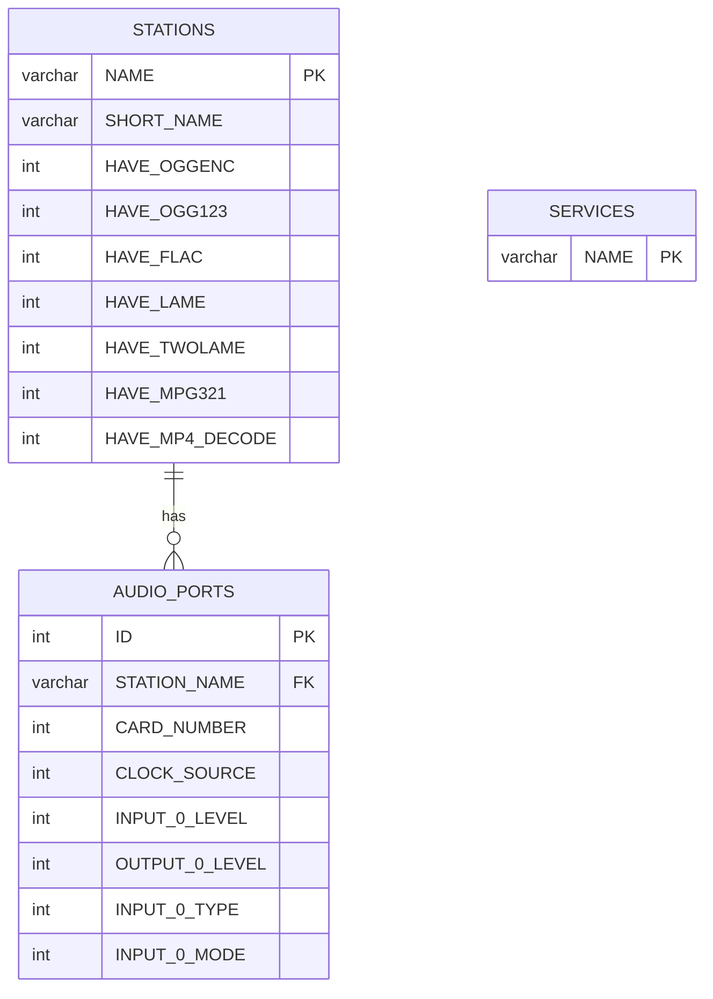

# Data Model: caed (Core Audio Engine)

## ERD -- Entity Relationship Diagram

CAE nie definiuje wlasnych tabel. Uzywa tabel zdefiniowanych w librd (LIB) poprzez klasy Active Record z biblioteki.

## Tabele uzywane przez CAE

### STATIONS

**Klasy CRUD:** RDStation (via librd) -- uzywane w ProbeCaps(), ClearDriverEntries()
**Operacje:** READ (sprawdzanie istnienia), UPDATE (ProbeCaps zapisuje capabilities)

CAE przy starcie:
1. Sprawdza czy stacja istnieje w DB (InitProvisioning)
2. Jesli nie -- tworzy ja z template (RDStation::create)
3. Zapisuje capabilities kodekow (ProbeCaps → setHaveCapability)
4. Czysci i reinicjalizuje wpisy kart audio (ClearDriverEntries)

### SERVICES

**Klasy CRUD:** RDSvc (via librd) -- uzywane w InitProvisioning()
**Operacje:** READ (sprawdzanie istnienia), CREATE (auto-provisioning)

CAE przy starcie auto-tworzy serwis jesli skonfigurowany w rd.conf.

### AUDIO_PORTS

**Klasy CRUD:** RDAudioPort (via librd) -- uzywane w InitMixers()
**Operacje:** READ (odczyt konfiguracji portow do inicjalizacji mixerow)

CAE odczytuje konfiguracje portow per karta i ustawia hardware:
- clock source
- input/output levels
- input type (analog/digital)
- passthrough levels

## Mapowanie Tabela - Klasa C++

| Tabela DB | Klasa C++ (librd) | Wzorzec | Operacje w CAE |
|-----------|-------------------|---------|----------------|
| STATIONS | RDStation | Active Record (librd) | R, U (capabilities) |
| SERVICES | RDSvc | Active Record (librd) | R, C (provisioning) |
| AUDIO_PORTS | RDAudioPort | Active Record (librd) | R (mixer init) |

Uwaga: CAE nie wykonuje bezposrednich zapytan SQL na tabelach -- korzysta wylacznie z klas librd jako warstwy abstrakcji (z wyjatkiem sprawdzania istnienia stacji/serwisu w InitProvisioning).
