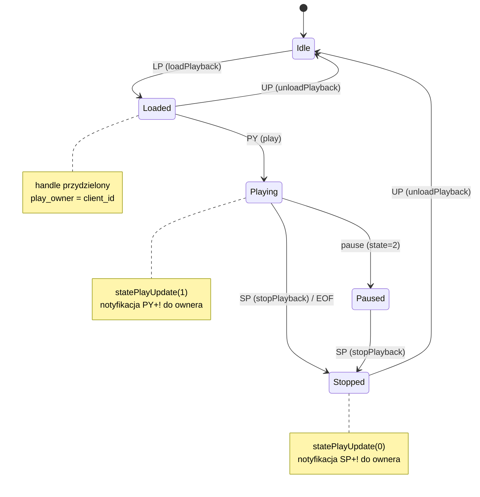
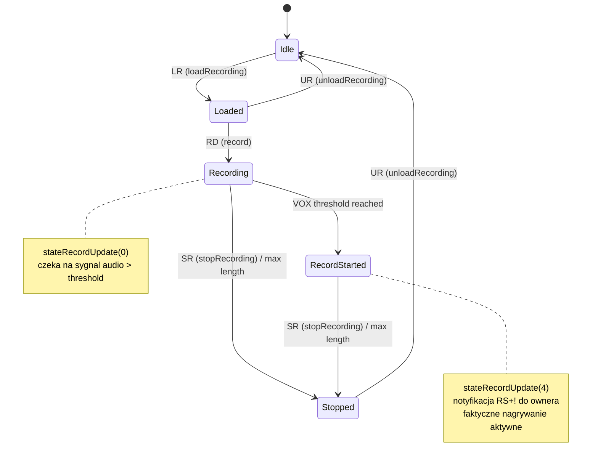
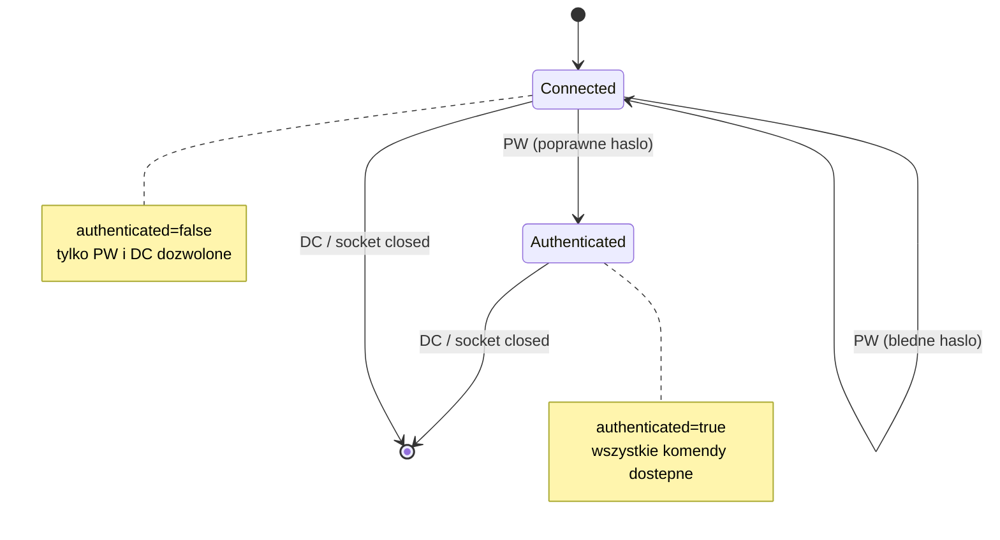

# Facts: caed (Core Audio Engine)

## Zrodla analizy

| Zrodlo | Uzyte | Jakosc |
|--------|-------|--------|
| Kod zrodlowy | tak | wysoka (7 plikow, ~7423 LOC) |
| Testy QTest | nie | brak testow dla CAE |
| Dokumentacja (docs/opsguide/) | nie | brak plikow docs specyficznych dla CAE |

---

## Use Cases (aktor -> akcja -> efekt)

| ID | Aktor | Akcja | Efekt | Zrodlo |
|----|-------|-------|-------|--------|
| UC-001 | Klient TCP (rdairplay) | Laduje plik audio do playbacku (LP) | Stream przydzielony, handle zwrocony | cae.cpp:395-460 |
| UC-002 | Klient TCP | Rozpoczyna odtwarzanie (PY) | Audio odtwarzane przez driver, klient notyfikowany PY+! | cae.cpp:580-651 |
| UC-003 | Klient TCP | Zatrzymuje odtwarzanie (SP) | Playback zatrzymany, klient notyfikowany SP+! | cae.cpp:653-692 |
| UC-004 | Klient TCP | Laduje nagrywanie (LR) | Recording stream przydzielony z parametrami kodowania | cae.cpp:723-789 |
| UC-005 | Klient TCP | Rozpoczyna nagrywanie (RD) | Audio nagrywane z VOX threshold | cae.cpp:840-893 |
| UC-006 | Klient TCP | Zatrzymuje nagrywanie (SR) | Recording zatrzymany, plik zamkniety | cae.cpp:896-925 |
| UC-007 | Klient TCP | Ustawia glosnosc wejscia/wyjscia (IV/OV) | Volume zmieniony na hardware | cae.cpp:930-1011 |
| UC-008 | Klient TCP | Fade glosnosci wyjscia (FV) | Volume zmienia sie plynnie w podanym czasie | cae.cpp:1014-1059 |
| UC-009 | Klient TCP | Wlacza metering (ME) | Klient otrzymuje strumien UDP z poziomami audio | cae.cpp:1413-1439 |
| UC-010 | Klient TCP | Ustawia passthrough (AL) | Audio z wejscia przekierowane na wyjscie | cae.cpp:1332-1372 |
| UC-011 | System (startup) | Daemon startuje | Provisioning stacji/serwisu, init driverow, mixer setup | cae.cpp:91-300 |
| UC-012 | Klient TCP | Laczy sie i autoryzuje (PW) | Polaczenie autoryzowane, komendy dostepne | cae_server.cpp:226-236 |
| UC-013 | System (timer) | Periodyczne metering | Poziomy audio wysylane UDP do klientow | cae.cpp:1510-1600 |
| UC-014 | System | Klient sie rozlacza | Zasoby (streamy play/record) zwalniane automatycznie | cae.cpp:1739-1800 |

---

## Reguly biznesowe (Gherkin)

```gherkin
# --- REGULY AUTORYZACJI PROTOKOLU CAE ---

Rule: Autoryzacja klienta haslem

  Scenario: Klient podaje poprawne haslo
    Given klient polaczony przez TCP
    When  klient wysyla "PW <password>!"
    And   password == rd_config->password()
    Then  klient jest autoryzowany (authenticated=true)
    And   odpowiedz "PW +!"

  Scenario: Klient podaje bledne haslo
    Given klient polaczony przez TCP
    When  klient wysyla "PW <bledne_haslo>!"
    Then  klient NIE jest autoryzowany (authenticated=false)
    And   odpowiedz "PW -!"

  Scenario: Klient wysyla komende bez autoryzacji
    Given klient polaczony ale nie autoryzowany
    When  klient wysyla komende inna niz PW lub DC
    Then  komenda jest ignorowana (nie przetworzona)

  # Zrodlo: kod | cae_server.cpp:226-244
  # Pewnosc: potwierdzone

# --- REGULY ZARZADZANIA PLAYBACKEM ---

Rule: Ladowanie pliku audio do playbacku

  Scenario: Pomyslne zaladowanie
    Given klient autoryzowany
    And   card < RD_MAX_CARDS
    And   driver audio aktywny na podanej karcie
    When  klient wysyla "LP card filename!"
    Then  plik audio ladowany do streamu
    And   handle przydzielony (round-robin z puli 256)
    And   play_owner[card][stream] = id klienta
    And   odpowiedz "LP card filename handle stream +!"

  Scenario: Brak wolnego streamu
    Given klient autoryzowany
    And   driver nie moze przydzielic streamu
    When  klient wysyla "LP card filename!"
    Then  odpowiedz "LP card filename -1 -1 -!"
    And   log WARNING "unable to allocate stream for card N"

  Scenario: Stale handle detected
    Given handle juz przydzielony dla pary card/stream (GetHandle >= 0)
    When  nowy loadPlayback na tej samej parze
    Then  stary handle jest czyszczony z WARNING "clearing stale stream assignment"
    And   nowy handle przydzielony normalnie

  # Zrodlo: kod | cae.cpp:395-460
  # Pewnosc: potwierdzone

Rule: Odtwarzanie audio

  Scenario: Pomyslne odtwarzanie
    Given plik zaladowany (handle wazny)
    And   handle zmapowany na card/stream
    When  klient wysyla "PY handle length speed pitch!"
    Then  playback rozpoczety przez driver
    And   play_length/play_speed/play_pitch zapisane
    And   statePlayUpdate(card, stream, 1=Playing) → "PY handle length speed +!"

  Scenario: Koniec odtwarzania (naturalny)
    Given playback aktywny
    When  driver konczy odtwarzanie (EOF)
    Then  statePlayUpdate(card, stream, 0=Stopped)
    And   wlasciciel streamu notyfikowany "SP handle +!"

  # Zrodlo: kod | cae.cpp:580-651, 1450-1478
  # Pewnosc: potwierdzone

Rule: Zarzadzanie handleami playbacku

  Scenario: Alokacja handlea
    Given pula 256 handleow (play_handle[0..255])
    When  potrzebny nowy handle
    Then  next_play_handle inkrementowany (round-robin mod 256)
    And   szuka pierwszego wolnego (card==-1 && stream==-1 && owner==-1)
    And   zwraca indeks lub -1 jesli pula pelna

  # Zrodlo: kod | cae.cpp:121-126 (init), metody GetNextHandle/GetHandle
  # Pewnosc: potwierdzone

# --- REGULY NAGRYWANIA ---

Rule: Nagrywanie audio

  Scenario: Pomyslne nagrywanie z VOX
    Given recording zaladowany
    When  klient wysyla "RD card stream length threshold!"
    Then  nagrywanie rozpoczete z max dlugoscia i progiem VOX
    And   record_length i record_threshold zapisane
    And   stateRecordUpdate(0=Recording) → "RD card stream length threshold +!"

  Scenario: VOX aktywacja (sygnal audio ponad progiem)
    Given nagrywanie aktywne z VOX threshold
    When  poziom audio przekracza threshold
    Then  stateRecordUpdate(4=RecordStarted) → "RS card stream +!"

  Scenario: Zatrzymanie nagrywania
    Given nagrywanie aktywne
    When  klient wysyla "SR card stream!"
    Then  nagrywanie zatrzymane
    And   stateRecordUpdate(3=Stopped) → "SR card stream +!"

  # Zrodlo: kod | cae.cpp:840-925, 1481-1506
  # Pewnosc: potwierdzone

# --- REGULY DRIVERA AUDIO ---

Rule: Dispatch komendy do drivera

  Scenario: Komenda na karcie z aktywnym driverem
    Given cae_driver[card] == Hpi/Alsa/Jack
    When  komenda audio (play/record/volume/etc.)
    Then  komenda dispatched do odpowiedniego drivera
    And   wynik (sukces/blad) zwrocony klientowi

  Scenario: Komenda na karcie bez drivera
    Given cae_driver[card] == None
    When  komenda audio
    Then  odpowiedz z bledem "{CMD} ... -!"

  # Zrodlo: kod | cae.cpp (kazdy slot *Data())
  # Pewnosc: potwierdzone

# --- REGULY METERINGU ---

Rule: Metering per-klient per-karta

  Scenario: Wlaczenie meteringu
    Given klient autoryzowany
    When  klient wysyla "ME udp_port card1 card2 ...!"
    And   udp_port w zakresie 0-65535
    And   kazda karta < RD_MAX_CARDS
    Then  meter_port klienta ustawiony
    And   metering wlaczony dla podanych kart
    And   odpowiedz "ME ... +!"

  Scenario: Odrzucenie meteringu z blednym portem
    Given klient autoryzowany
    When  udp_port < 0 lub udp_port > 0xFFFF
    Then  odpowiedz "ME ... -!"

  Scenario: Wysylanie meteringu
    Given klient z wlaczonym meteringiem
    When  timer updateMeters() odpala
    Then  dla kazdej karty z wlaczonym meteringiem:
    And   odczyt input/output/stream meters z hardware
    And   UDP datagram "ML I/O card port levelL levelR" wysylany na meter_port
    And   UDP datagram "MO card stream levelL levelR" dla stream meters
    And   UDP datagram "MP card pos0 pos1 ... posN" dla pozycji playbacku

  # Zrodlo: kod | cae.cpp:1413-1439, 1510-1600, 2097-2170
  # Pewnosc: potwierdzone

# --- REGULY ROZLACZANIA ---

Rule: Automatyczne czyszczenie przy rozlaczeniu klienta

  Scenario: Klient rozlacza sie z aktywnymi streamami
    Given klient ma aktywne playbacki i/lub nagrywania
    When  klient sie rozlacza (DC lub socket closed)
    Then  KillSocket() iteruje WSZYSTKIE karty x streamy
    And   kazdy stream z record_owner==client → unloadRecord
    And   kazdy stream z play_owner==client → unloadPlayback + stopPlayback
    And   record_threshold resetowany do -10000
    And   ownery resetowane do -1

  # Zrodlo: kod | cae.cpp:1739-1800
  # Pewnosc: potwierdzone

# --- REGULY PROVISIONING ---

Rule: Auto-provisioning stacji i serwisu

  Scenario: Stacja nie istnieje w DB
    Given rd_config->provisioningCreateHost() == true
    And   template nazwy nie jest pusty
    When  daemon startuje
    And   stacja nie znaleziona w tabeli STATIONS
    Then  stacja tworzona z template (RDStation::create)
    And   short name ustawiane jesli skonfigurowane
    And   log INFO "created new host entry"

  Scenario: Serwis nie istnieje w DB
    Given rd_config->provisioningCreateService() == true
    And   service template nie jest pusty
    When  daemon startuje
    And   serwis nie znaleziony w tabeli SERVICES
    Then  serwis tworzony z template (RDSvc::create)
    And   log INFO "created new service entry"

  Scenario: Provisioning wylaczony
    Given provisioningCreateHost() == false
    When  daemon startuje
    Then  provisioning pomijany (bez sprawdzania DB)

  # Zrodlo: kod | cae.cpp:1608-1671
  # Pewnosc: potwierdzone

# --- REGULY CODEC PROBING ---

Rule: Detekcja dostepnosci kodekow

  Scenario: Codec dostepny w systemie
    Given biblioteka kodeka (np. libvorbis) zainstalowana
    When  daemon startuje i wywoluje ProbeCaps()
    Then  capability zapisana w DB (RDStation::setHaveCapability(true))

  Scenario: TwoLAME/MAD ladowane dynamicznie
    Given TwoLAME/MAD moga nie byc zainstalowane
    When  daemon startuje
    Then  dlopen() sprawdza dostepnosc
    And   jesli dostepne → function pointers ladowane
    And   jesli niedostepne → capability=false, brak bledu

  # Zrodlo: kod | cae.cpp:1851-1905 (ProbeCaps), cae.cpp: LoadTwoLame/LoadMad
  # Pewnosc: potwierdzone
```

---

## Stany encji

### Playback Stream -- stany



| Przejscie | Trigger | Warunek | Efekt uboczny | Zrodlo |
|-----------|---------|---------|--------------|--------|
| Idle → Loaded | LP komenda | driver alokuje stream | handle przydzielony, owner ustawiony | cae.cpp:395-460 |
| Loaded → Playing | PY komenda | handle wazny | play_length/speed/pitch zapisane | cae.cpp:580-651 |
| Playing → Stopped | SP lub EOF | - | statePlayUpdate(0) → notyfikacja klienta | cae.cpp:653-692, 1472-1474 |
| Stopped → Idle | UP komenda | handle wazny | handle zwolniony, owner=-1 | cae.cpp:465-521 |
| Loaded → Idle | UP komenda | nie jest playing | jw. | cae.cpp:465-521 |

### Recording Stream -- stany



| Przejscie | Trigger | Warunek | Efekt uboczny | Zrodlo |
|-----------|---------|---------|--------------|--------|
| Idle → Loaded | LR komenda | driver alokuje stream | record_owner ustawiony, parametry kodowania | cae.cpp:723-789 |
| Loaded → Recording | RD komenda | stream zaladowany | record_length/threshold zapisane | cae.cpp:840-893 |
| Recording → RecordStarted | VOX | poziom > threshold | stateRecordUpdate(4) → RS+! | cae.cpp:1493-1497 |
| Recording/Started → Stopped | SR komenda / max len | - | stateRecordUpdate(3) → SR+! | cae.cpp:896-925, 1500-1504 |
| Stopped → Idle | UR komenda | - | dlugosc nagrania zwrocona | cae.cpp:794-836 |

### Polaczenie klienta -- stany



---

## Ograniczenia i limity

| Ograniczenie | Wartosc | Dotyczy | Zrodlo |
|-------------|---------|---------|--------|
| RD_MAX_CARDS | zdefiniowane w rd.h | Maksymalna liczba kart audio | cae.h (uzywane wszedzie) |
| RD_MAX_STREAMS | zdefiniowane w rd.h | Maksymalna liczba streamow per karta | cae.h (uzywane wszedzie) |
| RD_MAX_PORTS | zdefiniowane w rd.h | Maksymalna liczba portow per karta | cae.h (uzywane wszedzie) |
| RINGBUFFER_SIZE | 262144 (256 KB) | Rozmiar buforow ring buffer (ALSA/JACK) | cae.h:95 |
| Play handle pool | 256 handleow | Maksymalna liczba rownoczesnych playbackow | cae.h:183-186 |
| CAED_TCP_PORT | zdefiniowane w rd.h | Port TCP serwera CAE | cae.cpp:154 |
| RD_METER_UPDATE_INTERVAL | zdefiniowane w rd.h | Interwal meteringu (ms) | cae.cpp:291 |
| Default record_threshold | -10000 | Domyslny prog VOX (efektywnie wylaczony) | cae.cpp:132 |
| Default play_speed | 100 | Domyslna predkosc odtwarzania (100%) | cae.cpp:136 |
| Max coding | 5 (0-4) | Typy kodowania nagrywania | cae_server.cpp:307 |
| Max channels | 2 (0-2) | Maksymalna liczba kanalow nagrywania | cae_server.cpp:309 |
| Max input mode | 3 (0-3) | Tryby wejscia (Normal/Swap/Left/Right) | cae_server.cpp:450 |
| Max output mode | 3 (0-3) | Tryby wyjscia | cae_server.cpp:463 |
| Max input type | 1 (0-1) | Typ wejscia (Analog/Digital) | cae_server.cpp:489 |

---

## Konfiguracja

CAE nie uzywa QSettings. Konfiguracja pochodzi z:

| Zrodlo | Klucze | Znaczenie |
|--------|--------|-----------|
| rd.conf (RDConfig) | password | Haslo autoryzacji klientow |
| rd.conf (RDConfig) | provisioningCreateHost | Wlacza auto-provisioning stacji |
| rd.conf (RDConfig) | provisioningCreateService | Wlacza auto-provisioning serwisu |
| rd.conf (RDConfig) | provisioningHostTemplate | Template nazwy stacji |
| rd.conf (RDConfig) | provisioningServiceTemplate | Template nazwy serwisu |
| rd.conf (RDConfig) | stationName | Nazwa stacji w DB |
| rd.conf (RDConfig) | audioFileName(name) | Mapowanie nazwy pliku na sciezke audio |
| DB: STATIONS | AudioDriver per card | Typ drivera (HPI/JACK/ALSA/None) |
| DB: AUDIO_PORTS | ClockSource, InputType, Levels | Konfiguracja portow audio |
| CLI: -d flag | debug mode | Daemon w foreground z debug output |

---

## Linux-specific komponenty

| Komponent | Gdzie uzywany (klasa/metoda) | Funkcja | Priorytet zastapienia |
|-----------|---------------------------|---------|----------------------|
| ALSA (libasound) | MainObject::alsa*() (cae_alsa.cpp) | PCM playback/capture, mixer, metering | CRITICAL |
| JACK Audio | MainObject::jack*() (cae_jack.cpp) | Audio routing, playback/capture, metering | CRITICAL |
| AudioScience HPI | MainObject::hpi*() (cae_hpi.cpp) | Professional audio cards, playback/capture | CRITICAL |
| pthread | alsa_format struct (cae.h:50) | Watki ALSA capture/play (real-time) | CRITICAL |
| SoundTouch | jack_st_conv (cae.h:294) | Time-stretching/pitch-shifting (JACK) | HIGH |
| libsamplerate (src) | src_int_to_float_array/src_float_to_int_array (cae.h:83-84) | Konwersja sample rate | HIGH |
| signal(SIGHUP/SIGINT/SIGTERM) | SigHandler() (cae.cpp:230-232) | Graceful shutdown (ustawia global exiting=true) | HIGH |
| dlopen() | LoadTwoLame(), LoadMad() | Dynamiczne ladowanie kodekov MP2/MP3 | MEDIUM |
| syslog | RDApplication::syslog() | System logging | MEDIUM |
| QUdpSocket | meter_socket | Wysylanie meteringu UDP | LOW (standard Qt) |
| QTcpServer | cae_server | Nasluchiwanie TCP | LOW (standard Qt) |

---

## Konflikty miedzy zrodlami

Brak konfliktow -- analiza oparta wylacznie na kodzie zrodlowym (brak testow i dokumentacji specyficznej dla CAE).

Spot-check 3/3 PASS:
1. Regula autoryzacji PW -- zweryfikowana w cae_server.cpp:226-244 ✓
2. Regula dispatch drivera -- zweryfikowana w cae.cpp:402 (switch na cae_driver[card]) ✓
3. Regula auto-provisioning -- zweryfikowana w cae.cpp:1617-1671 ✓
