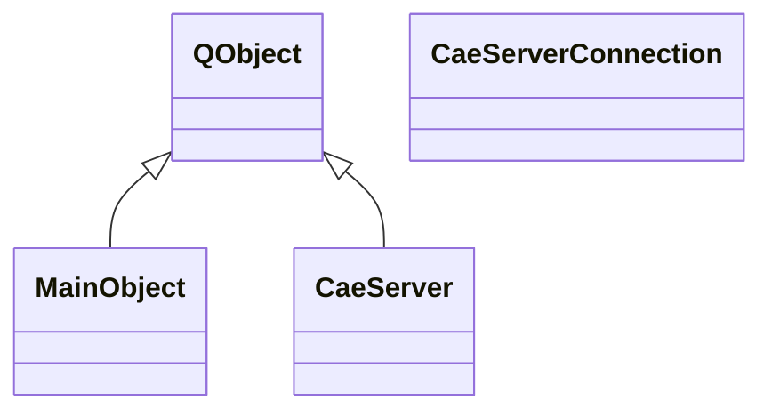
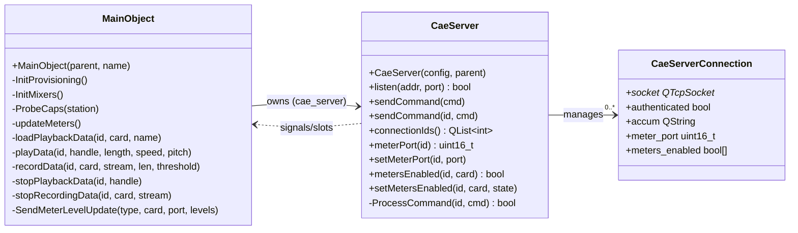

# Inventory: caed (Core Audio Engine)

## Statystyki

| Typ | Liczba |
|-----|--------|
| Klasy lacznie | 3 |
| QMainWindow subclassy | 0 |
| QDialog subclassy | 0 |
| QWidget subclassy | 0 |
| QObject subclassy (serwisy) | 2 |
| QAbstractItemModel subclassy | 0 |
| QThread subclassy | 0 |
| Plain C++ (non-Qt) klasy | 1 |
| Active Record (CRUD) klasy | 0 |

---

## Diagram klas -- dziedziczenie

## Diagram klas -- zaleznosci domenowe

---

## Klasy -- szczegolowy inwentarz

### CaeServerConnection

**Typ Qt:** Plain C++ (non-Qt)
**Plik:** `cae/cae_server.h` (zadeklarowana w tym samym pliku co CaeServer)
**Odpowiedzialnosc:** Struktura danych przechowujaca stan pojedynczego polaczenia klienta TCP do CAE. Sluzy jako kontener na socket, flage autoryzacji, bufor akumulacji komend i konfiguracje meteringu per-karta.
**Tabela DB:** brak

**Sygnaly:** brak (plain C++)
**Sloty:** brak (plain C++)

**Publiczne API:**

| Metoda | Parametry | Efekt | Warunki wywolania |
|--------|-----------|-------|------------------|
| CaeServerConnection() | QTcpSocket *sock | Tworzy polaczenie z podanym socketem, inicjalizuje authenticated=false | Nowe polaczenie TCP |
| ~CaeServerConnection() | - | Niszczy polaczenie | Rozlaczenie klienta |

**Pola publiczne:**

| Pole | Typ | Znaczenie |
|------|-----|-----------|
| socket | QTcpSocket* | Socket TCP polaczenia |
| authenticated | bool | Czy klient przeszedl autoryzacje (komenda PW) |
| accum | QString | Bufor akumulacji danych z socketa (do kompletnej komendy) |
| meter_port | uint16_t | Port UDP na ktory wysylac metering do tego klienta |
| meters_enabled | bool[RD_MAX_CARDS] | Ktore karty maja wlaczony metering dla tego klienta |

**Reguly biznesowe (z implementacji):**
- Kazde nowe polaczenie startuje jako nieautoryzowane (authenticated=false)
- Metering jest per-karta per-polaczenie - klient wybiera ktore karty chce monitorowac
- Dane meteringu sa wysylane UDP (nie TCP) na meter_port klienta

---

### CaeServer

**Typ Qt:** QObject
**Plik:** `cae/cae_server.h` + `cae/cae_server.cpp`
**Odpowiedzialnosc:** Serwer TCP nasluchujacy na porcie CAED_TCP_PORT (default 5005). Przyjmuje polaczenia od klientow Rivendell (rdairplay, rdlibrary, etc.), parsuje komendy tekstowe z protokolu CAE i emituje sygnaly z parametrami do MainObject. Obsluguje autoryzacje haslem.
**Tabela DB:** brak

**Sygnaly:**

| Sygnal | Parametry | Znaczenie biznesowe |
|--------|-----------|---------------------|
| connectionDropped | int id | Klient rozlaczyl sie |
| loadPlaybackReq | int id, unsigned card, const QString &name | Zadanie zaladowania pliku audio do playbacku |
| unloadPlaybackReq | int id, unsigned handle | Zadanie zwolnienia zaladowanego playbacku |
| playPositionReq | int id, unsigned handle, unsigned pos | Zadanie ustawienia pozycji odtwarzania |
| playReq | int id, unsigned handle, unsigned length, unsigned speed, unsigned pitch_flag | Zadanie rozpoczecia odtwarzania |
| stopPlaybackReq | int id, unsigned handle | Zadanie zatrzymania odtwarzania |
| timescalingSupportReq | int id, unsigned card | Zapytanie o wsparcie timescalingu na karcie |
| loadRecordingReq | int id, unsigned card, unsigned port, unsigned coding, unsigned channels, unsigned samprate, unsigned bitrate, const QString &name | Zadanie zaladowania nagrywania |
| unloadRecordingReq | int id, unsigned card, unsigned stream | Zadanie zwolnienia nagrywania |
| recordReq | int id, unsigned card, unsigned stream, unsigned len, int threshold_level | Zadanie rozpoczecia nagrywania |
| stopRecordingReq | int id, unsigned card, unsigned stream | Zadanie zatrzymania nagrywania |
| setInputVolumeReq | int id, unsigned card, unsigned stream, int level | Ustawienie glosnosci wejscia |
| setOutputVolumeReq | int id, unsigned card, unsigned stream, unsigned port, int level | Ustawienie glosnosci wyjscia |
| fadeOutputVolumeReq | int id, unsigned card, unsigned stream, unsigned port, int level, unsigned length | Fade glosnosci wyjscia w czasie |
| setInputLevelReq | int id, unsigned card, unsigned port, int level | Ustawienie poziomu wejscia |
| setOutputLevelReq | int id, unsigned card, unsigned port, int level | Ustawienie poziomu wyjscia |
| setInputModeReq | int id, unsigned card, unsigned stream, unsigned mode | Ustawienie trybu wejscia (normal/swap/left/right) |
| setOutputModeReq | int id, unsigned card, unsigned stream, unsigned mode | Ustawienie trybu wyjscia |
| setInputVoxLevelReq | int id, unsigned card, unsigned stream, int level | Ustawienie progu VOX (voice-activated) |
| setInputTypeReq | int id, unsigned card, unsigned port, unsigned type | Ustawienie typu wejscia (analog/digital) |
| getInputStatusReq | int id, unsigned card, unsigned port | Zapytanie o status wejscia |
| setAudioPassthroughLevelReq | int id, unsigned card, unsigned input, unsigned output, int level | Ustawienie poziomu passthrough miedzy portami |
| setClockSourceReq | int id, unsigned card, int input | Ustawienie zrodla zegara audio |
| setOutputStatusFlagReq | int id, unsigned card, unsigned port, unsigned stream, bool state | Ustawienie flagi statusu wyjscia |
| openRtpCaptureChannelReq | int id, unsigned card, unsigned port, uint16_t udp_port, unsigned samprate, unsigned chans | Otwarcie kanalu przechwytywania RTP |
| meterEnableReq | int id, uint16_t udp_port, const QList<unsigned> &cards | Wlaczenie meteringu UDP dla podanych kart |

**Sloty:**

| Slot | Parametry | Widocznosc | Efekt |
|------|-----------|------------|-------|
| newConnectionData | - | private | Akceptuje nowe polaczenie TCP, tworzy CaeServerConnection, mapuje sygnaly |
| readyReadData | int id | private | Odczytuje dane z socketa, akumuluje w accum, przy '!' parsuje komende |
| connectionClosedData | int id | private | Czysci polaczenie, emituje connectionDropped |

**Publiczne API:**

| Metoda | Parametry | Efekt | Warunki wywolania |
|--------|-----------|-------|------------------|
| listen | QHostAddress &addr, uint16_t port | Rozpoczyna nasluchiwanie na podanym adresie/porcie | Inicjalizacja daemona |
| sendCommand | const QString &cmd | Wysyla komende do WSZYSTKICH polaczonych klientow (broadcast) | Metering, status updates |
| sendCommand | int id, const QString &cmd | Wysyla komende do konkretnego klienta (response) | Odpowiedz na request |
| connectionIds | - | Zwraca liste ID aktywnych polaczen | Iteracja po klientach |
| meterPort | int id | Zwraca port UDP meteringu dla klienta | Wysylanie meteringu |
| setMeterPort | int id, uint16_t port | Ustawia port UDP meteringu | Konfiguracja meteringu |
| metersEnabled | int id, unsigned card | Czy metering wlaczony dla karty u klienta | Filtrowanie meteringu |
| setMetersEnabled | int id, unsigned card, bool state | Wlacza/wylacza metering karty u klienta | Komenda ME |
| peerAddress | int id | Adres IP klienta | Logging |
| peerPort | int id | Port TCP klienta | Logging |

**Reguly biznesowe (z implementacji):**
- Protokol tekstowy: komendy sa 2-literowe tokeny + parametry rozdzielone spacjami, terminowane '!'
- Autoryzacja: komenda PW z haslem musi byc pierwsza; bez niej tylko DC (disconnect) dozwolone
- Walidacja: kazdy parametr jest walidowany (card < RD_MAX_CARDS, port < RD_MAX_PORTS, stream < RD_MAX_STREAMS, etc.)
- Nieznane/bledne komendy dostaja odpowiedz "{komenda}-!" (error)
- Poprawne komendy dostaja odpowiedz "{komenda} {wynik}+!" (success) lub "{komenda} {wynik}-!" (failure)
- Komendy (protokol CAE): DC, PW, LP, UP, PP, PY, SP, TS, LR, UR, RD, SR, IV, OV, FV, IL, OL, IM, OM, IX, IT, IS, AL, CS, OS, ME
- Separator komendy = '!' (wykrzyknik), nie newline

**Linux-specific:**

| Komponent | Uzycie | Priorytet zastapienia |
|-----------|--------|----------------------|
| QTcpServer | Nasluchiwanie TCP | LOW (standard Qt) |
| QSignalMapper | Mapowanie socketow na ID | LOW (standard Qt, deprecated w Qt5+) |

**Zaleznosci od shared libraries:**
- librd::RDConfig: odczyt hasla (cae_config->password()) i konfiguracji
- librd::RDApplication: syslog logging

---

### MainObject

**Typ Qt:** QObject
**Plik:** `cae/cae.h` + `cae/cae.cpp` + `cae/cae_alsa.cpp` + `cae/cae_hpi.cpp` + `cae/cae_jack.cpp`
**Odpowiedzialnosc:** Glowna klasa daemona CAE. Zarzadza cyklem zycia audio: ladowanie plikow, odtwarzanie, nagrywanie, kontrola glosnosci, metering. Dispatchuje komendy od klientow TCP do odpowiedniego drivera audio (ALSA, JACK lub HPI) w oparciu o konfiguracje per-karta. Obsluguje provisioning bazy danych i inicjalizacje mixerow.
**Tabela DB:** STATIONS (read via RDStation), SERVICES (read via RDSvc), AUDIO_PORTS (read via RDAudioPort) -- posrednio przez librd

**Sygnaly:** brak (MainObject nie emituje sygnalow -- jest czysto reaktywny, odpowiada na sygnaly CaeServer)

**Sloty:**

| Slot | Parametry | Widocznosc | Efekt |
|------|-----------|------------|-------|
| loadPlaybackData | int id, unsigned card, const QString &name | private | Laduje plik audio do odtwarzania na karcie, przydziela stream/handle, odpowiada klientowi |
| unloadPlaybackData | int id, unsigned handle | private | Zwalnia zaladowany playback, oddaje handle |
| playPositionData | int id, unsigned handle, unsigned pos | private | Ustawia pozycje odtwarzania (seek) |
| playData | int id, unsigned handle, unsigned length, unsigned speed, unsigned pitch | private | Rozpoczyna odtwarzanie z parametrami dlugosci, predkosci i pitcha |
| stopPlaybackData | int id, unsigned handle | private | Zatrzymuje odtwarzanie |
| timescalingSupportData | int id, unsigned card | private | Sprawdza i odpowiada czy karta wspiera timescaling |
| loadRecordingData | int id, unsigned card, unsigned port, unsigned coding, unsigned channels, unsigned samprate, unsigned bitrate, const QString &name | private | Laduje nagrywanie z podanymi parametrami kodowania |
| unloadRecordingData | int id, unsigned card, unsigned stream | private | Zwalnia nagrywanie, zwraca dlugosc nagrania |
| recordData | int id, unsigned card, unsigned stream, unsigned len, int threshold | private | Rozpoczyna nagrywanie z max dlugoscia i progiem VOX |
| stopRecordingData | int id, unsigned card, unsigned stream | private | Zatrzymuje nagrywanie |
| setInputVolumeData | int id, unsigned card, unsigned stream, int level | private | Ustawia glosnosc wejscia na strumieniu |
| setOutputVolumeData | int id, unsigned card, unsigned stream, unsigned port, int level | private | Ustawia glosnosc wyjscia na porcie |
| fadeOutputVolumeData | int id, unsigned card, unsigned stream, unsigned port, int level, unsigned length | private | Fade glosnosci wyjscia w podanym czasie |
| setInputLevelData | int id, unsigned card, unsigned stream, int level | private | Ustawia poziom wejscia |
| setOutputLevelData | int id, unsigned card, unsigned port, int level | private | Ustawia poziom wyjscia |
| setInputModeData | int id, unsigned card, unsigned stream, unsigned mode | private | Ustawia tryb wejscia (Normal/Swap/Left/Right) |
| setOutputModeData | int id, unsigned card, unsigned stream, unsigned mode | private | Ustawia tryb wyjscia |
| setInputVoxLevelData | int id, unsigned card, unsigned stream, int level | private | Ustawia prog VOX |
| setInputTypeData | int id, unsigned card, unsigned port, unsigned type | private | Ustawia typ wejscia (Analog/AES/EBU/Digital) |
| getInputStatusData | int id, unsigned card, unsigned port | private | Odpowiada statusem wejscia |
| setAudioPassthroughLevelData | int id, unsigned card, unsigned input, unsigned output, int level | private | Ustawia poziom passthrough miedzy portami |
| setClockSourceData | int id, unsigned card, int input | private | Ustawia zrodlo zegara audio |
| setOutputStatusFlagData | int id, unsigned card, unsigned port, unsigned stream, bool state | private | Ustawia flage statusu wyjscia |
| openRtpCaptureChannelData | int id, unsigned card, unsigned port, uint16_t udp_port, unsigned samprate, unsigned chans | private | Otwiera kanal przechwytywania RTP |
| meterEnableData | int id, uint16_t udp_port, const QList<unsigned> &cards | private | Wlacza metering UDP dla klienta na podanych kartach |
| statePlayUpdate | int card, int stream, int state | private | Aktualizacja stanu odtwarzania (callback z driverow) |
| stateRecordUpdate | int card, int stream, int state | private | Aktualizacja stanu nagrywania (callback z driverow) |
| updateMeters | - | private | Periodyczny timer slot: odczytuje metery ze wszystkich kart/portow, wysyla UDP do klientow, obsluguje AlsaClock/JackClock, sprawdza exit |
| connectionDroppedData | int id | private | Czysci zasoby rozlaczonego klienta (zwalnia ownery stramow/nagrywania) |
| jackStopTimerData | int stream | private | Timer JACK: zatrzymanie po zakonczeniu playbacku |
| jackFadeTimerData | int stream | private | Timer JACK: krok fade volume |
| jackRecordTimerData | int stream | private | Timer JACK: sprawdzenie dlugosci nagrania |
| jackClientStartData | - | private | Timer JACK: opozniony start procesow klienta JACK |
| alsaStopTimerData | int cardstream | private | Timer ALSA: zatrzymanie po zakonczeniu playbacku |
| alsaFadeTimerData | int cardstream | private | Timer ALSA: krok fade volume |
| alsaRecordTimerData | int cardport | private | Timer ALSA: sprawdzenie dlugosci nagrania |

**Publiczne API:**

| Metoda | Parametry | Efekt | Warunki wywolania |
|--------|-----------|-------|------------------|
| MainObject | QObject *parent, const char *name | Inicjalizuje caly daemon: config, server TCP, DB, drivery audio, metering timer, mixery | Jedna instancja w main() |

**Metody prywatne (kluczowe):**

| Metoda | Efekt |
|--------|-------|
| InitProvisioning() | Auto-provisioning: tworzy wpis STATIONS i SERVICES w DB jesli nie istnieja (na bazie template z rd.conf) |
| InitMixers() | Inicjalizuje mixery na wszystkich kartach: input/output levels, passthrough, clock source, modes z bazy AUDIO_PORTS |
| ProbeCaps(station) | Wykrywa dostepne codeki (Ogg, FLAC, LAME, TwoLAME, MAD, MP4) i zapisuje capabilities do RDStation w DB |
| ClearDriverEntries(station) | Czysci wpisy kart/portow w DB dla tej stacji |
| GetNextHandle() | Przydziela nastepny wolny handle do playbacku (round-robin 0-255) |
| GetHandle(card, stream) | Szuka istniejacego handle'a dla pary card/stream |
| SendMeterLevelUpdate(type, card, port, levels) | Wysyla aktualizacje poziomu (ML I/O) UDP do klientow z wlaczonym meteringiem |
| SendStreamMeterLevelUpdate(card, stream, levels) | Wysyla aktualizacje poziomu streamu (MO) UDP |
| SendMeterPositionUpdate(card, pos[]) | Wysyla pozycje odtwarzania (MP) UDP |
| SendMeterOutputStatusUpdate() | Wysyla status wyjsc (OS) do wszystkich klientow |
| SendMeterUpdate(msg, conn_id) | Wysyla poj. wiadomosc metering UDP na meter_port klienta |
| KillSocket(id) | Zamyka socket i czysci dane polaczenia |

**Driver API (identyczny interface dla kazdego drivera):**

Kazdy driver (HPI/JACK/ALSA) implementuje identyczny zestaw metod:

| Metoda (prefix hpi/jack/alsa) | Zwraca | Opis |
|-------------------------------|--------|------|
| Init(station) | void | Inicjalizacja drivera, detekcja kart |
| Free() | void | Zwolnienie zasobow drivera |
| LoadPlayback(card, wavename, *stream) | bool | Zaladuj plik do odtwarzania |
| UnloadPlayback(card, stream) | bool | Zwolnij playback |
| PlaybackPosition(card, stream, pos) | bool | Ustaw pozycje odtwarzania |
| Play(card, stream, length, speed, pitch, rates) | bool | Rozpocznij odtwarzanie |
| StopPlayback(card, stream) | bool | Zatrzymaj odtwarzanie |
| TimescaleSupported(card) | bool | Czy karta wspiera timescaling |
| LoadRecord(card, port, coding, chans, samprate, bitrate, wavename) | bool | Zaladuj nagrywanie |
| UnloadRecord(card, stream, *len) | bool | Zwolnij nagrywanie (zwraca dlugosc) |
| Record(card, stream, length, thres) | bool | Rozpocznij nagrywanie |
| StopRecord(card, stream) | bool | Zatrzymaj nagrywanie |
| SetInputVolume(card, stream, level) | bool | Glosnosc wejscia |
| SetOutputVolume(card, stream, port, level) | bool | Glosnosc wyjscia |
| FadeOutputVolume(card, stream, port, level, length) | bool | Fade wyjscia |
| SetInputLevel(card, port, level) | bool | Poziom wejscia hardware |
| SetOutputLevel(card, port, level) | bool | Poziom wyjscia hardware |
| SetInputMode(card, stream, mode) | bool | Tryb wejscia |
| SetOutputMode(card, stream, mode) | bool | Tryb wyjscia |
| SetInputVoxLevel(card, stream, level) | bool | Prog VOX |
| SetInputType(card, port, type) | bool | Typ wejscia (analog/digital) |
| GetInputStatus(card, port) | bool | Status wejscia |
| GetInputMeters(card, port, levels[2]) | bool | Poziomy meteringu wejscia (L/R) |
| GetOutputMeters(card, port, levels[2]) | bool | Poziomy meteringu wyjscia (L/R) |
| GetStreamOutputMeters(card, stream, levels[2]) | bool | Poziomy meteringu streamu wyjscia |
| SetPassthroughLevel(card, in_port, out_port, level) | bool | Poziom passthrough |
| GetOutputPosition(card, pos[]) | void | Pozycje wszystkich streamow |

**Enums (z zaleznosci):**
Uzywa enumow z librd:
- RDStation::AudioDriver: None, Hpi, Jack, Alsa
- RDCae::InputType: Analog, AesEbu
- RDStation capability flags: HaveOggenc, HaveOgg123, HaveFlac, HaveLame, HaveTwoLame, HaveMpg321, HaveMp4Decode

**Reguly biznesowe (z implementacji):**
- **Driver dispatch**: Kazda komenda audio jest dispatchowana do wlasciwego drivera na podstawie cae_driver[card] (ustalonego przy init)
- **Handle management**: Playback uzywa globalnej puli 256 handleow (play_handle[256]), mapowanych na pary card/stream. Round-robin alokacja.
- **Ownership tracking**: Kazdy stream play/record ma wlasciciela (connection id). Przy rozlaczeniu klienta jego streamy sa zwalniane automatycznie.
- **Provisioning**: Przy starcie daemon auto-tworzy wpis stacji i serwisu w DB jesli skonfigurowane w rd.conf
- **Mixer initialization**: Przy starcie odczytuje konfiguracje portow audio z DB (RDAudioPort) i ustawia volume/mode/passthrough na hardware
- **Periodic metering**: Timer co RD_METER_UPDATE_INTERVAL ms odczytuje poziomy z hardware i wysyla UDP do klientow
- **Metering per-client filtering**: Kazdy klient osobno wlacza metering dla wybranych kart (komenda ME)
- **Exit handling**: Zamiast natychmiastowego exit(), daemon czeka na updateMeters() ktory robi cleanup driverow i dopiero wtedy exit(0)
- **Codec probing**: Przy starcie sprawdza dostepnosc bibliotek kodekow (Ogg, FLAC, LAME, TwoLAME, MAD, MP4) i zapisuje do DB
- **TwoLAME/MAD dynamic loading**: Enkoder TwoLAME i dekoder MAD sa ladowane dynamicznie (dlopen) - brak twardej zaleznosci

**Linux-specific:**

| Komponent | Uzycie | Priorytet zastapienia |
|-----------|--------|----------------------|
| ALSA (libasound) | Driver audio: odtwarzanie/nagrywanie, metering, PCM I/O | CRITICAL |
| JACK | Driver audio: odtwarzanie/nagrywanie, metering, port routing | CRITICAL |
| HPI (AudioScience) | Driver audio: odtwarzanie/nagrywanie, metering | CRITICAL |
| SoundTouch | Timescaling/pitch shifting (JACK driver) | HIGH |
| pthread | Watki ALSA playback/capture | CRITICAL |
| signal(SIGHUP/SIGINT/SIGTERM) | Unix signal handling do graceful shutdown | HIGH |
| syslog (via RDApplication) | Logging daemona | MEDIUM |
| dlopen (TwoLAME, MAD) | Dynamiczne ladowanie kodekov | MEDIUM |
| libsamplerate (src) | Konwersja sample rate | HIGH |

**Zaleznosci od shared libraries:**
- librd::RDConfig: konfiguracja (rd.conf), haslo, provisioningHostTemplate
- librd::RDStation: dane stacji, capabilities, AudioDriver enum
- librd::RDSvc: provisioning serwisow
- librd::RDAudioPort: konfiguracja portow audio (input type, levels)
- librd::RDWaveFile: odczyt/zapis plikow audio
- librd::RDCmdSwitch: parsowanie argumentow CLI
- librd::RDApplication: syslog logging
- librd::RDSqlQuery: zapytania SQL do DB
- librdhpi::RDHPISoundCard, RDHPIPlayStream, RDHPIRecordStream: drivery HPI (warunkowe #ifdef HPI)

---

## Missing Coverage

brak

---

## Conflicts

brak
