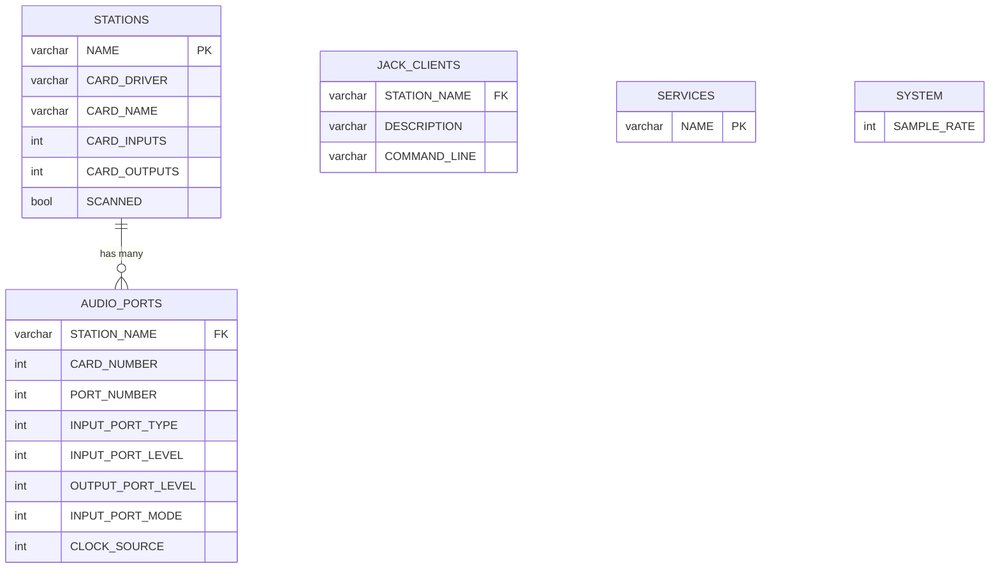
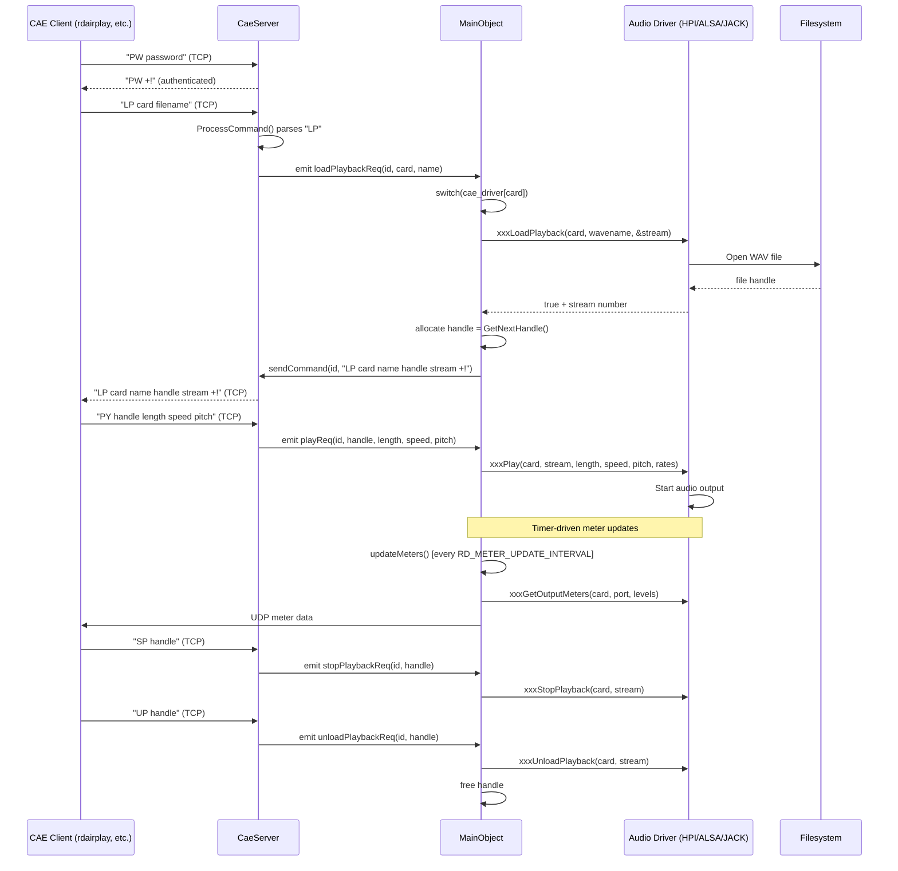
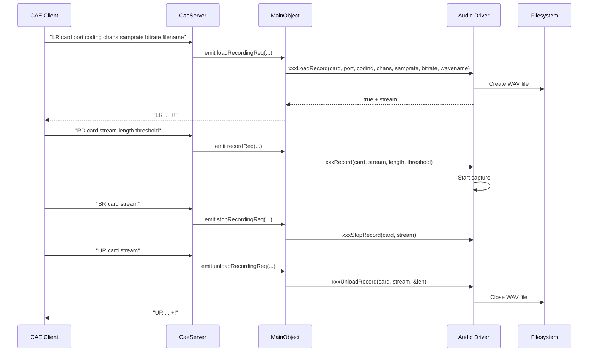
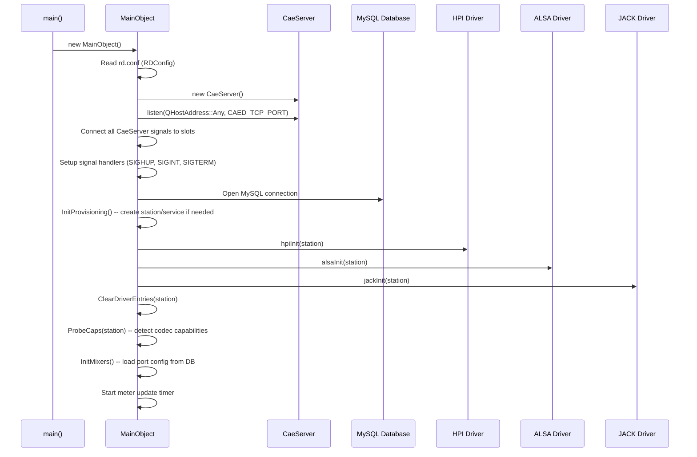
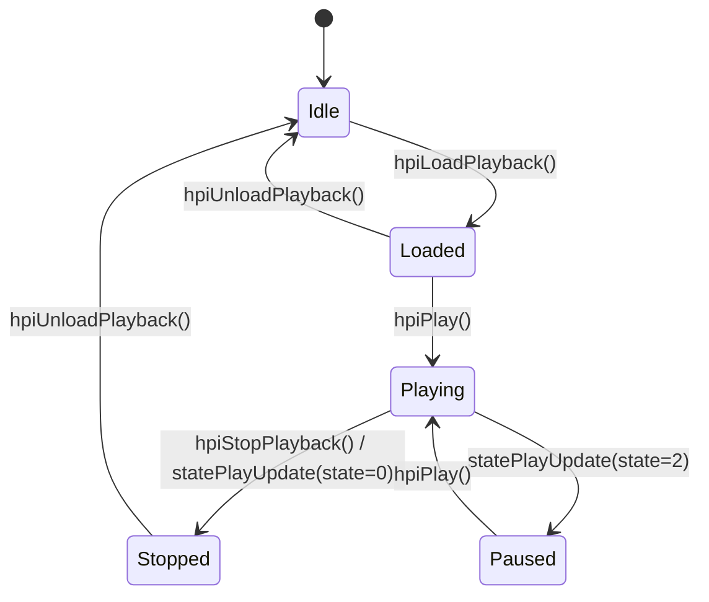
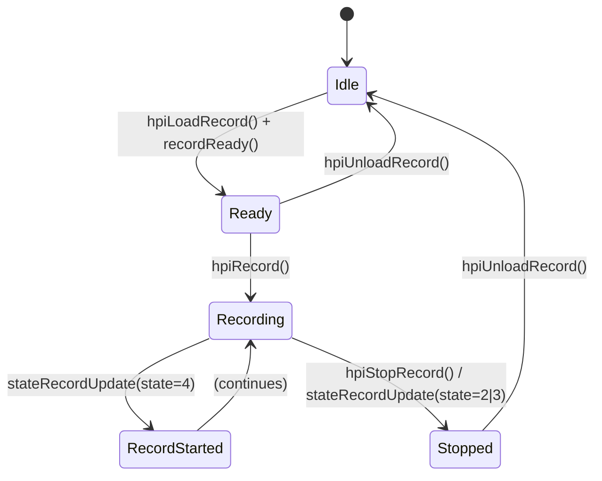

# Semantic Context: CAE (caed)

## Files & Symbols

### Source Files
| File | Type | Symbols | LOC (est) |
|------|------|---------|-----------|
| cae/cae.h | header | MainObject, alsa_format, src_int_to_float_array, src_float_to_int_array, SigHandler, rd_config | ~410 |
| cae/cae_server.h | header | CaeServerConnection, CaeServer | ~115 |
| cae/cae.cpp | source | MainObject (constructor + all dispatcher slots + utility methods), main() | ~1800 |
| cae/cae_server.cpp | source | CaeServerConnection, CaeServer (TCP command parser) | ~500 |
| cae/cae_alsa.cpp | source | MainObject ALSA driver methods (31 methods) | ~900 |
| cae/cae_jack.cpp | source | MainObject JACK driver methods (36 methods) | ~1200 |
| cae/cae_hpi.cpp | source | MainObject HPI driver methods (29 methods) | ~600 |

### Symbol Index
| Symbol | Kind | File | Qt Class? |
|--------|------|------|-----------|
| MainObject | Class | cae/cae.h | Yes (Q_OBJECT) |
| CaeServer | Class | cae/cae_server.h | Yes (Q_OBJECT) |
| CaeServerConnection | Class | cae/cae_server.h | No (plain C++ class) |
| alsa_format | Struct | cae/cae.h | No (C struct, #ifdef ALSA) |
| src_int_to_float_array | Function | cae/cae.h | No |
| src_float_to_int_array | Function | cae/cae.h | No |
| SigHandler | Function | cae/cae.h | No |
| rd_config | Global Variable | cae/cae.h | No (RDConfig*) |
| main | Function | cae/cae.cpp | No |

### Key Constants
| Constant | Value | Description |
|----------|-------|-------------|
| RINGBUFFER_SIZE | 262144 | Size of audio ring buffers |
| CAED_USAGE | "[-d]..." | Command-line usage string; -d for debug mode |

## Class API Surface

### MainObject [Service - Audio Engine Daemon]
- **File:** cae/cae.h (decl), cae/cae.cpp + cae/cae_alsa.cpp + cae/cae_jack.cpp + cae/cae_hpi.cpp (impl)
- **Inherits:** QObject
- **Qt Object:** Yes (Q_OBJECT)
- **Category:** Service daemon -- core audio engine dispatcher with multi-driver backend
- **Design Pattern:** Strategy pattern via switch(cae_driver[card]) dispatching to HPI/ALSA/JACK backends

#### Signals
_None_ -- MainObject has no signals. It is the terminal receiver of CaeServer signals.

#### Slots (all private)
| Slot | Parameters | Description |
|------|-----------|-------------|
| loadPlaybackData | (int id, unsigned card, const QString &name) | Load audio file for playback on given card; dispatches to hpi/alsa/jack backend; allocates handle |
| unloadPlaybackData | (int id, unsigned handle) | Unload playback stream by handle |
| playPositionData | (int id, unsigned handle, unsigned pos) | Set playback position (seek) |
| playData | (int id, unsigned handle, unsigned length, unsigned speed, unsigned pitch_flag) | Start playback with speed/pitch control |
| stopPlaybackData | (int id, unsigned handle) | Stop playback |
| timescalingSupportData | (int id, unsigned card) | Query whether card supports timescaling |
| loadRecordingData | (int id, unsigned card, unsigned port, unsigned coding, unsigned channels, unsigned samprate, unsigned bitrate, const QString &name) | Load recording session with codec params |
| unloadRecordingData | (int id, unsigned card, unsigned stream) | Unload recording stream |
| recordData | (int id, unsigned card, unsigned stream, unsigned len, int threshold_level) | Start recording with length/threshold |
| stopRecordingData | (int id, unsigned card, unsigned stream) | Stop recording |
| setInputVolumeData | (int id, unsigned card, unsigned stream, int level) | Set input volume in dB |
| setOutputVolumeData | (int id, unsigned card, unsigned stream, unsigned port, int level) | Set output volume in dB |
| fadeOutputVolumeData | (int id, unsigned card, unsigned stream, unsigned port, int level, unsigned length) | Fade output volume over time |
| setInputLevelData | (int id, unsigned card, unsigned stream, int level) | Set input level |
| setOutputLevelData | (int id, unsigned card, unsigned port, int level) | Set output level |
| setInputModeData | (int id, unsigned card, unsigned stream, unsigned mode) | Set input mode (normal/swap/left/right) |
| setOutputModeData | (int id, unsigned card, unsigned stream, unsigned mode) | Set output mode |
| setInputVoxLevelData | (int id, unsigned card, unsigned stream, int level) | Set VOX (voice-operated) threshold |
| setInputTypeData | (int id, unsigned card, unsigned port, unsigned type) | Set input type (analog/digital) |
| getInputStatusData | (int id, unsigned card, unsigned port) | Query input signal status |
| setAudioPassthroughLevelData | (int id, unsigned card, unsigned input, unsigned output, int level) | Set passthrough routing level |
| setClockSourceData | (int id, unsigned card, int input) | Set clock source for card |
| setOutputStatusFlagData | (int id, unsigned card, unsigned port, unsigned stream, bool state) | Set output status flag |
| openRtpCaptureChannelData | (int id, unsigned card, unsigned port, uint16_t udp_port, unsigned samprate, unsigned chans) | Open RTP capture channel |
| meterEnableData | (int id, uint16_t udp_port, const QList<unsigned> &cards) | Enable metering for specified cards via UDP |
| statePlayUpdate | (int card, int stream, int state) | Internal: playback state changed callback |
| stateRecordUpdate | (int card, int stream, int state) | Internal: recording state changed callback |
| updateMeters | () | Timer-driven: poll and send meter level updates via UDP |
| connectionDroppedData | (int id) | Handle client disconnect; cleanup owned resources |
| jackFadeTimerData | (int stream) | JACK: fade timer expired |
| jackRecordTimerData | (int stream) | JACK: record timer expired |
| jackClientStartData | () | JACK: client start notification |
| alsaFadeTimerData | (int cardstream) | ALSA: fade timer expired |  
| alsaRecordTimerData | (int cardport) | ALSA: record timer expired |

#### Private Methods (Utility/Infrastructure)
| Method | Return | Parameters | Brief |
|--------|--------|-----------|-------|
| InitProvisioning() | void | () const | Initialize auto-provisioning (DB station record) |
| InitMixers() | void | () | Initialize mixer settings from DB |
| KillSocket(int) | void | (int) | Force-close a client socket |
| CheckDaemon(QString) | bool | (QString) | Check if another daemon is running |
| GetPid(QString) | pid_t | (QString pidfile) | Read PID from pidfile |
| GetNextHandle() | int | () | Allocate next available play handle (0-255 circular) |
| GetHandle(int,int) | int | (int card, int stream) | Lookup handle by card+stream |
| ProbeCaps(RDStation*) | void | (RDStation* station) | Probe audio hardware capabilities and write to DB |
| ClearDriverEntries(RDStation*) | void | (RDStation* station) | Clear stale driver entries in DB |
| SendMeterLevelUpdate | void | (const QString &type, int cardnum, int portnum, short levels[]) | Send meter level via UDP |
| SendStreamMeterLevelUpdate | void | (int cardnum, int streamnum, short levels[]) | Send stream meter level via UDP |
| SendMeterPositionUpdate | void | (int cardnum, unsigned pos[]) | Send playback position via UDP |
| SendMeterOutputStatusUpdate | void | () / (int card, int port, int stream) | Send output status via UDP (2 overloads) |
| SendMeterUpdate | void | (const QString &msg, int conn_id) | Send raw meter update to specific connection |
| CheckLame() | bool | () | Check if LAME MP3 encoder is available |
| CheckMp4Decode() | bool | () | Check if MP4 decoder is available |
| LoadTwoLame() | void | () | Dynamically load TwoLAME library |
| InitTwoLameEncoder | void | () | Initialize TwoLAME MP2 encoder |
| FreeTwoLameEncoder | void | () | Free TwoLAME encoder |
| LoadMad() | void | () | Dynamically load MAD MP3 decoder |
| InitMadDecoder | void | () | Initialize MAD decoder |
| FreeMadDecoder | void | () | Free MAD decoder |

#### Private Methods (HPI Driver -- cae_hpi.cpp)
| Method | Return | Parameters | Brief |
|--------|--------|-----------|-------|
| hpiInit | void | (RDStation* station) | Initialize HPI (AudioScience) hardware |
| hpiFree | void | () | Release HPI resources |
| hpiVersion | QString | () | Get HPI driver version string |
| hpiLoadPlayback | bool | (int card, QString wavename, int* stream) | Load audio for HPI playback |
| hpiUnloadPlayback | bool | (int card, int stream) | Unload HPI playback |
| hpiPlaybackPosition | bool | (int card, int stream, unsigned pos) | Seek HPI playback |
| hpiPlay | bool | (int card, int stream, int length, int speed, bool pitch, bool rates) | Start HPI playback |
| hpiStopPlayback | bool | (int card, int stream) | Stop HPI playback |
| hpiTimescaleSupported | bool | (int card) | Check HPI timescale support |
| hpiLoadRecord | bool | (int card, int port, int coding, int chans, int samprate, int bitrate, QString wavename) | Load HPI recording |
| hpiUnloadRecord | bool | (int card, int stream, unsigned* len) | Unload HPI recording |
| hpiRecord | bool | (int card, int stream, int length, int thres) | Start HPI recording |
| hpiStopRecord | bool | (int card, int stream) | Stop HPI recording |
| hpiSetClockSource | bool | (int card, int input) | Set HPI clock source |
| hpiSetInputVolume | bool | (int card, int stream, int level) | Set HPI input volume |
| hpiSetOutputVolume | bool | (int card, int stream, int port, int level) | Set HPI output volume |
| hpiFadeOutputVolume | bool | (int card, int stream, int port, int level, int length) | Fade HPI output |
| hpiSetInputLevel | bool | (int card, int port, int level) | Set HPI input level |
| hpiSetOutputLevel | bool | (int card, int port, int level) | Set HPI output level |
| hpiSetInputMode | bool | (int card, int stream, int mode) | Set HPI input mode |
| hpiSetOutputMode | bool | (int card, int stream, int mode) | Set HPI output mode |
| hpiSetInputVoxLevel | bool | (int card, int stream, int level) | Set HPI VOX level |
| hpiSetInputType | bool | (int card, int port, int type) | Set HPI input type |
| hpiGetInputStatus | bool | (int card, int port) | Get HPI input status |
| hpiGetInputMeters | bool | (int card, int port, short levels[2]) | Get HPI input meters |
| hpiGetOutputMeters | bool | (int card, int port, short levels[2]) | Get HPI output meters |
| hpiGetStreamOutputMeters | bool | (int card, int stream, short levels[2]) | Get HPI stream meters |
| hpiSetPassthroughLevel | bool | (int card, int in_port, int out_port, int level) | Set HPI passthrough |
| hpiGetOutputPosition | bool | (int card, unsigned pos[]) | Get HPI output position |

#### Private Methods (JACK Driver -- cae_jack.cpp)
| Method | Return | Parameters | Brief |
|--------|--------|-----------|-------|
| jackInit | void | (RDStation* station) | Initialize JACK audio client |
| jackFree | void | () | Release JACK resources |
| jackLoadPlayback | bool | (int card, QString wavename, int* stream) | Load audio for JACK playback |
| jackUnloadPlayback | bool | (int card, int stream) | Unload JACK playback |
| jackPlaybackPosition | bool | (int card, int stream, unsigned pos) | Seek JACK playback |
| jackPlay | bool | (int card, int stream, int length, int speed, bool pitch, bool rates) | Start JACK playback |
| jackStopPlayback | bool | (int card, int stream) | Stop JACK playback |
| jackTimescaleSupported | bool | (int card) | Check JACK timescale support |
| jackLoadRecord | bool | (int card, int port, int coding, int chans, int samprate, int bitrate, QString wavename) | Load JACK recording |
| jackUnloadRecord | bool | (int card, int stream, unsigned* len) | Unload JACK recording |
| jackRecord | bool | (int card, int stream, int length, int thres) | Start JACK recording |
| jackStopRecord | bool | (int card, int stream) | Stop JACK recording |
| jackSetInputVolume | bool | (int card, int stream, int level) | Set JACK input volume |
| jackSetOutputVolume | bool | (int card, int stream, int port, int level) | Set JACK output volume |
| jackFadeOutputVolume | bool | (int card, int stream, int port, int level, int length) | Fade JACK output |
| jackSetInputLevel | bool | (int card, int port, int level) | Set JACK input level |
| jackSetOutputLevel | bool | (int card, int port, int level) | Set JACK output level |
| jackSetInputMode | bool | (int card, int stream, int mode) | Set JACK input mode |
| jackSetOutputMode | bool | (int card, int stream, int mode) | Set JACK output mode |
| jackSetInputVoxLevel | bool | (int card, int stream, int level) | Set JACK VOX level |
| jackSetInputType | bool | (int card, int port, int type) | Set JACK input type |
| jackGetInputStatus | bool | (int card, int port) | Get JACK input status |
| jackGetInputMeters | bool | (int card, int port, short levels[2]) | Get JACK input meters |
| jackGetOutputMeters | bool | (int card, int port, short levels[2]) | Get JACK output meters |
| jackGetStreamOutputMeters | bool | (int card, int stream, short levels[2]) | Get JACK stream meters |
| jackSetPassthroughLevel | bool | (int card, int in_port, int out_port, int level) | Set JACK passthrough |
| jackGetOutputPosition | bool | (int card, unsigned pos[]) | Get JACK output position |
| jackConnectPorts | void | (...) | Connect JACK ports |
| jackDisconnectPorts | void | (...) | Disconnect JACK ports |
| GetJackOutputStream | int | (...) | Get available JACK output stream |
| FreeJackOutputStream | void | (...) | Free JACK output stream |
| EmptyJackInputStream | void | (...) | Empty JACK input buffer |
| FillJackOutputStream | void | (...) | Fill JACK output buffer |
| JackClock | void | (...) | JACK clock callback |
| JackSessionSetup | void | (...) | JACK session setup |

#### Private Methods (ALSA Driver -- cae_alsa.cpp)
| Method | Return | Parameters | Brief |
|--------|--------|-----------|-------|
| alsaInit | void | (RDStation* station) | Initialize ALSA audio devices |
| alsaFree | void | () | Release ALSA resources |
| alsaLoadPlayback | bool | (int card, QString wavename, int* stream) | Load audio for ALSA playback |
| alsaUnloadPlayback | bool | (int card, int stream) | Unload ALSA playback |
| alsaPlaybackPosition | bool | (int card, int stream, unsigned pos) | Seek ALSA playback |
| alsaPlay | bool | (int card, int stream, int length, int speed, bool pitch, bool rates) | Start ALSA playback |
| alsaStopPlayback | bool | (int card, int stream) | Stop ALSA playback |
| alsaTimescaleSupported | bool | (int card) | Check ALSA timescale support |
| alsaLoadRecord | bool | (int card, int port, int coding, int chans, int samprate, int bitrate, QString wavename) | Load ALSA recording |
| alsaUnloadRecord | bool | (int card, int stream, unsigned* len) | Unload ALSA recording |
| alsaRecord | bool | (int card, int stream, int length, int thres) | Start ALSA recording |
| alsaStopRecord | bool | (int card, int stream) | Stop ALSA recording |
| alsaSetInputVolume | bool | (int card, int stream, int level) | Set ALSA input volume |
| alsaSetOutputVolume | bool | (int card, int stream, int port, int level) | Set ALSA output volume |
| alsaFadeOutputVolume | bool | (int card, int stream, int port, int level, int length) | Fade ALSA output |
| alsaSetInputLevel | bool | (int card, int port, int level) | Set ALSA input level |
| alsaSetOutputLevel | bool | (int card, int port, int level) | Set ALSA output level |
| alsaSetInputMode | bool | (int card, int stream, int mode) | Set ALSA input mode |
| alsaSetOutputMode | bool | (int card, int stream, int mode) | Set ALSA output mode |
| alsaSetInputVoxLevel | bool | (int card, int stream, int level) | Set ALSA VOX level |
| alsaSetInputType | bool | (int card, int port, int type) | Set ALSA input type |
| alsaGetInputStatus | bool | (int card, int port) | Get ALSA input status |
| alsaGetInputMeters | bool | (int card, int port, short levels[2]) | Get ALSA input meters |
| alsaGetOutputMeters | bool | (int card, int port, short levels[2]) | Get ALSA output meters |
| alsaGetStreamOutputMeters | bool | (int card, int stream, short levels[2]) | Get ALSA stream meters |
| alsaSetPassthroughLevel | bool | (int card, int in_port, int out_port, int level) | Set ALSA passthrough |
| alsaGetOutputPosition | bool | (int card, unsigned pos[]) | Get ALSA output position |
| AlsaClock | void | (...) | ALSA clock callback |

#### Key Fields
| Field | Type | Description |
|-------|------|-------------|
| debug | bool | Debug mode flag (-d command line) |
| system_sample_rate | unsigned | System-wide sample rate from RDSystem |
| cae_server | CaeServer* | TCP command server instance |
| tcp_port | uint16_t | TCP listening port |
| meter_socket | QUdpSocket* | UDP socket for meter updates |
| cae_driver[RD_MAX_CARDS] | RDStation::AudioDriver | Per-card driver type (None/Hpi/Alsa/Jack) |
| record_owner[RD_MAX_CARDS][RD_MAX_STREAMS] | int | Connection ID owning each record stream |
| record_length[RD_MAX_CARDS][RD_MAX_STREAMS] | int | Recording length per stream |
| record_threshold[RD_MAX_CARDS][RD_MAX_STREAMS] | int | Recording VOX threshold per stream |
| play_owner[RD_MAX_CARDS][RD_MAX_STREAMS] | int | Connection ID owning each play stream |
| play_length[RD_MAX_CARDS][RD_MAX_STREAMS] | int | Playback length per stream |
| play_speed[RD_MAX_CARDS][RD_MAX_STREAMS] | int | Playback speed per stream (100 = normal) |
| play_pitch[RD_MAX_CARDS][RD_MAX_STREAMS] | bool | Pitch correction enabled per stream |
| port_status[...] | -- | Port status tracking |
| output_status_flag[RD_MAX_CARDS][RD_MAX_PORTS][RD_MAX_STREAMS] | bool | Output status flags |
| play_handle[256] | struct {card, stream, owner} | Handle-to-card/stream mapping (256 handles max) |
| next_play_handle | int | Next available handle index (circular 0-255) |
| cae_station | RDStation* | Local station configuration object |
| jack_connected | bool | JACK client connection state |
| jack_activated | bool | JACK client activation state |
| twolame_handle | void* | TwoLAME (MP2 encoder) dynamic library handle |
| mad_handle | void* | MAD (MP3 decoder) dynamic library handle |

---

### CaeServer [Service - TCP Command Protocol Server]
- **File:** cae/cae_server.h (decl), cae/cae_server.cpp (impl)
- **Inherits:** QObject
- **Qt Object:** Yes (Q_OBJECT)
- **Category:** Network protocol server -- accepts TCP connections, parses text commands, emits typed signals

#### Signals
| Signal | Parameters | Description |
|--------|-----------|-------------|
| connectionDropped | (int id) | Client connection closed/lost |
| loadPlaybackReq | (int id, unsigned card, const QString &name) | LP command: load playback |
| unloadPlaybackReq | (int id, unsigned handle) | UP command: unload playback |
| playPositionReq | (int id, unsigned handle, unsigned pos) | PP command: set play position |
| playReq | (int id, unsigned handle, unsigned length, unsigned speed, unsigned pitch_flag) | PY command: start playback |
| stopPlaybackReq | (int id, unsigned handle) | SP command: stop playback |
| timescalingSupportReq | (int id, unsigned card) | TS command: query timescale support |
| loadRecordingReq | (int id, unsigned card, unsigned port, unsigned coding, unsigned channels, unsigned samprate, unsigned bitrate, const QString &name) | LR command: load recording |
| unloadRecordingReq | (int id, unsigned card, unsigned stream) | UR command: unload recording |
| recordReq | (int id, unsigned card, unsigned stream, unsigned len, int threshold_level) | RD command: start recording |
| stopRecordingReq | (int id, unsigned card, unsigned stream) | SR command: stop recording |
| setInputVolumeReq | (int id, unsigned card, unsigned stream, int level) | IV command: set input volume |
| setOutputVolumeReq | (int id, unsigned card, unsigned stream, unsigned port, int level) | OV command: set output volume |
| fadeOutputVolumeReq | (int id, unsigned card, unsigned stream, unsigned port, int level, unsigned length) | FV command: fade output volume |
| setInputLevelReq | (int id, unsigned card, unsigned port, int level) | IL command: set input level |
| setOutputLevelReq | (int id, unsigned card, unsigned port, int level) | OL command: set output level |
| setInputModeReq | (int id, unsigned card, unsigned stream, unsigned mode) | IM command: set input mode |
| setOutputModeReq | (int id, unsigned card, unsigned stream, unsigned mode) | OM command: set output mode |
| setInputVoxLevelReq | (int id, unsigned card, unsigned stream, int level) | IX command: set VOX level |
| setInputTypeReq | (int id, unsigned card, unsigned port, unsigned type) | IT command: set input type |
| getInputStatusReq | (int id, unsigned card, unsigned port) | IS command: get input status |
| setAudioPassthroughLevelReq | (int id, unsigned card, unsigned input, unsigned output, int level) | AL command: set passthrough level |
| setClockSourceReq | (int id, unsigned card, int input) | CS command: set clock source |
| setOutputStatusFlagReq | (int id, unsigned card, unsigned port, unsigned stream, bool state) | OS command: set output status flag |
| openRtpCaptureChannelReq | (int id, unsigned card, unsigned port, uint16_t udp_port, unsigned samprate, unsigned chans) | RTP capture channel |
| meterEnableReq | (int id, uint16_t udp_port, const QList<unsigned> &cards) | ME command: enable metering |

#### Slots (private)
| Slot | Visibility | Parameters | Description |
|------|-----------|-----------|-------------|
| newConnectionData | private | () | Accept new TCP connection |
| readyReadData | private | (int id) | Read and parse data from connection |
| connectionClosedData | private | (int id) | Handle disconnection cleanup |

#### Public Methods
| Method | Return | Parameters | Brief |
|--------|--------|-----------|-------|
| CaeServer | ctor | (RDConfig* config, QObject* parent) | Constructor |
| connectionIds | QList<int> | () const | List active connection IDs |
| peerAddress | QHostAddress | (int id) | Get peer IP for connection |
| peerPort | uint16_t | (int id) | Get peer port for connection |
| meterPort | uint16_t | (int id) | Get meter UDP port for connection |
| setMeterPort | void | (int id, uint16_t port) | Set meter UDP port for connection |
| metersEnabled | bool | (int id) | Check if metering enabled |
| setMetersEnabled | void | (int id, bool state) | Enable/disable metering |
| listen | bool | (QHostAddress addr, uint16_t port) | Start TCP server on address:port |
| sendCommand | void | (int id, const QString &cmd) | Send response to specific connection |
| sendCommand | void | (const QString &cmd) | Broadcast response to all connections |

#### Private Methods
| Method | Return | Parameters | Brief |
|--------|--------|-----------|-------|
| ProcessCommand | bool | (int id, const QString &cmd) | Parse and dispatch text command; returns true if connection should close |

#### Key Fields
| Field | Type | Description |
|-------|------|-------------|
| cae_connections | QMap<int, CaeServerConnection*> | Map of socket descriptor to connection state |
| cae_server | QTcpServer* | Underlying Qt TCP server |
| cae_ready_read_mapper | QSignalMapper* | Maps socket readyRead to connection ID |
| cae_connection_closed_mapper | QSignalMapper* | Maps socket disconnected to connection ID |
| cae_config | RDConfig* | Configuration reference |

---

### CaeServerConnection [Value Object - Connection State]
- **File:** cae/cae_server.h (decl), cae/cae_server.cpp (impl)
- **Inherits:** none
- **Qt Object:** No
- **Category:** Plain C++ class holding per-connection state

#### Public Fields
| Field | Type | Description |
|-------|------|-------------|
| socket | QTcpSocket* | The TCP socket for this connection |
| authenticated | bool | Whether PW command succeeded |
| accum | QString | Command accumulator buffer (newline-delimited protocol) |
| meter_port | uint16_t | UDP port for meter updates |
| meters_enabled | bool | Whether metering is enabled |

#### Constructor/Destructor
| Method | Parameters | Brief |
|--------|-----------|-------|
| CaeServerConnection | (QTcpSocket* sock) | Wraps socket, initializes state |
| ~CaeServerConnection | () | Destructor |

### CAE Text Protocol
The CaeServer implements a text-based TCP protocol where commands are space-delimited tokens terminated by newline (0x0A) or carriage return (0x0D). The first token is a 2-letter command code.

#### Protocol Commands
| Code | Name | Args | Signal Emitted |
|------|------|------|----------------|
| DC | Disconnect | (none) | connectionDropped (closes connection) |
| PW | Password | password_string | (inline auth check, no signal) |
| LP | Load Playback | card filename | loadPlaybackReq |
| UP | Unload Playback | handle | unloadPlaybackReq |
| PP | Play Position | handle pos | playPositionReq |
| PY | Play | handle length speed pitch | playReq |
| SP | Stop Playback | handle | stopPlaybackReq |
| TS | Timescale Support | card | timescalingSupportReq |
| LR | Load Recording | card port coding channels samprate bitrate filename | loadRecordingReq |
| UR | Unload Recording | card stream | unloadRecordingReq |
| RD | Record | card stream length threshold | recordReq |
| SR | Stop Recording | card stream | stopRecordingReq |
| IV | Input Volume | card stream level | setInputVolumeReq |
| OV | Output Volume | card stream port level | setOutputVolumeReq |
| FV | Fade Volume | card stream port level length | fadeOutputVolumeReq |
| IL | Input Level | card port level | setInputLevelReq |
| OL | Output Level | card port level | setOutputLevelReq |
| IM | Input Mode | card port mode | setInputModeReq |
| OM | Output Mode | card port mode | setOutputModeReq |
| IX | Input Vox Level | card stream level | setInputVoxLevelReq |
| IT | Input Type | card port type | setInputTypeReq |
| IS | Input Status | card port | getInputStatusReq |
| AL | Audio Passthrough Level | card input output level | setAudioPassthroughLevelReq |
| CS | Clock Source | card input | setClockSourceReq |
| OS | Output Status Flag | card port stream state(0/1) | setOutputStatusFlagReq |
| ME | Meter Enable | udp_port card1 [card2...] | meterEnableReq |

#### Protocol Authentication
- PW command is unprivileged (can be sent before auth)
- DC command is unprivileged
- All other commands require prior successful PW authentication
- Response format: `COMMAND_CODE +!` (success) or `COMMAND_CODE -!` (failure)
- Unrecognized commands get a generic error: `command_tokens-!`

## Data Model

CAE does NOT define any tables (no CREATE TABLE). It accesses tables defined in the LIB artifact via Active Record classes (RDStation, RDSystem, RDAudioPort, RDSvc) and raw SQL.

### Tables Accessed (defined in LIB)

#### Table: STATIONS
- **Access:** SELECT (InitProvisioning: check if station exists), INSERT (via RDStation::create)
- **Query:** `select NAME from STATIONS where NAME="{station_name}"`
- **Purpose:** Auto-provisioning -- creates station record if it does not exist on startup

#### Table: SERVICES
- **Access:** SELECT (InitProvisioning: check if service exists), INSERT (via RDSvc::create)
- **Query:** `select NAME from SERVICES where NAME="{service_name}"`
- **Purpose:** Auto-provisioning -- creates service record if not found

#### Table: JACK_CLIENTS
- **Access:** SELECT (JackSessionSetup: load JACK client configurations)
- **Query:** `select DESCRIPTION, COMMAND_LINE from JACK_CLIENTS where STATION_NAME="{station_name}"`
- **Purpose:** Launch configured JACK client processes at startup

### Active Record Classes Used (from LIB)
| Class | Tables | Usage in CAE |
|-------|--------|-------------|
| RDStation | STATIONS | Read/write station config: card drivers, capabilities, driver versions |
| RDSystem | SYSTEM | Read system-wide sample rate |
| RDAudioPort | AUDIO_PORTS | Read per-port config: input type, levels, modes, clock source |
| RDConfig | (rd.conf file) | Config file reader -- not DB, but used for MySQL credentials, passwords, audio paths |
| RDSvc | SERVICES | Auto-provision service entries |

### Data Flow Summary


### Audio File Access
CAE accesses audio files on the filesystem (not DB) via RDWaveFile:
- Playback: reads WAV files from `rd_config->audioFileName(name)` path
- Recording: writes WAV files to same location
- File ownership set via `chown()` to rd_config->uid()/gid()
- Supports PCM, MPEG (MP2 via TwoLAME), MP3 (via MAD decoder), Ogg Vorbis, FLAC codecs

## Reactive Architecture

### Signal/Slot Connections

#### CaeServer Internal (cae_server.cpp)
| # | Sender | Signal | Receiver | Slot | File |
|---|--------|--------|----------|------|------|
| 1 | cae_server (QTcpServer) | newConnection() | this (CaeServer) | newConnectionData() | cae_server.cpp:62 |
| 2 | cae_ready_read_mapper | mapped(int) | this | readyReadData(int) | cae_server.cpp:65 |
| 3 | cae_connection_closed_mapper | mapped(int) | this | connectionClosedData(int) | cae_server.cpp:69 |
| 4 | sock (per-connection) | disconnected() | cae_connection_closed_mapper | map() | cae_server.cpp:155 |
| 5 | sock (per-connection) | readyRead() | cae_ready_read_mapper | map() | cae_server.cpp:158 |

#### MainObject Constructor -- CaeServer signals to MainObject slots (cae.cpp:159-228)
| # | Sender | Signal | Receiver | Slot |
|---|--------|--------|----------|------|
| 6 | cae_server | connectionDropped(int) | this | connectionDroppedData(int) |
| 7 | cae_server | loadPlaybackReq(...) | this | loadPlaybackData(...) |
| 8 | cae_server | unloadPlaybackReq(...) | this | unloadPlaybackData(...) |
| 9 | cae_server | playPositionReq(...) | this | playPositionData(...) |
| 10 | cae_server | playReq(...) | this | playData(...) |
| 11 | cae_server | stopPlaybackReq(...) | this | stopPlaybackData(...) |
| 12 | cae_server | timescalingSupportReq(...) | this | timescalingSupportData(...) |
| 13 | cae_server | loadRecordingReq(...) | this | loadRecordingData(...) |
| 14 | cae_server | unloadRecordingReq(...) | this | unloadRecordingData(...) |
| 15 | cae_server | recordReq(...) | this | recordData(...) |
| 16 | cae_server | stopRecordingReq(...) | this | stopRecordingData(...) |
| 17 | cae_server | setInputVolumeReq(...) | this | setInputVolumeData(...) |
| 18 | cae_server | setOutputVolumeReq(...) | this | setOutputVolumeData(...) |
| 19 | cae_server | fadeOutputVolumeReq(...) | this | fadeOutputVolumeData(...) |
| 20 | cae_server | setInputLevelReq(...) | this | setInputLevelData(...) |
| 21 | cae_server | setOutputLevelReq(...) | this | setOutputLevelData(...) |
| 22 | cae_server | setInputModeReq(...) | this | setInputModeData(...) |
| 23 | cae_server | setOutputModeReq(...) | this | setOutputModeData(...) |
| 24 | cae_server | setInputVoxLevelReq(...) | this | setInputVoxLevelData(...) |
| 25 | cae_server | setInputTypeReq(...) | this | setInputTypeData(...) |
| 26 | cae_server | getInputStatusReq(...) | this | getInputStatusData(...) |
| 27 | cae_server | setAudioPassthroughLevelReq(...) | this | setAudioPassthroughLevelData(...) |
| 28 | cae_server | setClockSourceReq(...) | this | setClockSourceData(...) |
| 29 | cae_server | setOutputStatusFlagReq(...) | this | setOutputStatusFlagData(...) |
| 30 | cae_server | openRtpCaptureChannelReq(...) | this | openRtpCaptureChannelData(...) |
| 31 | cae_server | meterEnableReq(...) | this | meterEnableData(...) |

#### Meter Timer (cae.cpp:290)
| # | Sender | Signal | Receiver | Slot |
|---|--------|--------|----------|------|
| 32 | timer (QTimer) | timeout() | this | updateMeters() |

#### HPI Driver (cae_hpi.cpp)
| # | Sender | Signal | Receiver | Slot |
|---|--------|--------|----------|------|
| 33 | play[card][stream] (RDHPIPlayStream) | stateChanged(int,int,int) | this | statePlayUpdate(int,int,int) |
| 34 | record[card][stream] (RDHPIRecordStream) | stateChanged(int,int,int) | this | stateRecordUpdate(int,int,int) |

#### JACK Driver (cae_jack.cpp)
| # | Sender | Signal | Receiver | Slot |
|---|--------|--------|----------|------|
| 35 | jack_client_start_timer | timeout() | this | jackClientStartData() |
| 36 | stop_mapper (QSignalMapper) | mapped(int) | this | jackStopTimerData(int) |
| 37 | fade_mapper (QSignalMapper) | mapped(int) | this | jackFadeTimerData(int) |
| 38 | record_mapper (QSignalMapper) | mapped(int) | this | jackRecordTimerData(int) |
| 39 | jack_stop_timer[i] | timeout() | stop_mapper | map() |
| 40 | jack_fade_timer[i] | timeout() | fade_mapper | map() |
| 41 | jack_record_timer[i] | timeout() | record_mapper | map() |

#### ALSA Driver (cae_alsa.cpp)
| # | Sender | Signal | Receiver | Slot |
|---|--------|--------|----------|------|
| 42 | stop_mapper (QSignalMapper) | mapped(int) | this | alsaStopTimerData(int) |
| 43 | fade_mapper (QSignalMapper) | mapped(int) | this | alsaFadeTimerData(int) |
| 44 | record_mapper (QSignalMapper) | mapped(int) | this | alsaRecordTimerData(int) |
| 45 | alsa_stop_timer[i][j] / alsa_fade_timer[i][j] / alsa_record_timer[i][j] | timeout() | respective mapper | map() |

### Key Sequence Diagrams

#### Playback Flow


#### Recording Flow


#### Startup Initialization Flow


### Cross-Artifact Dependencies
| External Class | From Artifact | Used In Files | Purpose |
|---------------|---------------|---------------|---------|
| RDConfig | LIB | cae.cpp, cae_server.cpp | Configuration file reader (rd.conf) |
| RDStation | LIB | cae.cpp | Station DB record, driver config, capabilities |
| RDSystem | LIB | cae.cpp | System-wide settings (sample rate) |
| RDAudioPort | LIB | cae.cpp | Per-port audio configuration from DB |
| RDWaveFile | LIB | cae_alsa.cpp, cae_jack.cpp, cae_hpi.cpp | WAV file I/O |
| RDRingBuffer | LIB | cae_alsa.cpp, cae_jack.cpp | Audio ring buffer for streaming |
| RDSqlQuery | LIB | cae.cpp, cae_jack.cpp | SQL query execution |
| RDCmdSwitch | LIB | cae.cpp | Command-line argument parsing |
| RDApplication | LIB | cae.cpp, cae_server.cpp, all drivers | syslog wrapper |
| RDSvc | LIB | cae.cpp | Service auto-provisioning |
| RDHPIPlayStream | HPI | cae_hpi.cpp | HPI playback stream (#ifdef HPI) |
| RDHPIRecordStream | HPI | cae_hpi.cpp | HPI recording stream (#ifdef HPI) |
| RDHPISoundCard | HPI | cae_hpi.cpp | HPI sound card abstraction (#ifdef HPI) |
| RDCae | LIB | cae.cpp | Enum constants (Analog, AesEbu) |

## Business Rules

### Rule: Authentication Required for Audio Operations
- **Source:** cae/cae_server.cpp:242
- **Trigger:** Any command received from TCP client
- **Condition:** `!conn->authenticated` (PW command not yet successfully processed)
- **Action:** Command silently ignored (returns false, no response sent)
- **Gherkin:**
  ```gherkin
  Scenario: Unauthenticated client sends audio command
    Given a TCP client connected to CAE
    And the client has NOT sent a valid PW command
    When the client sends "LP 0 filename"
    Then the command is silently ignored
    And no response is sent
  ```

### Rule: Password Validation
- **Source:** cae/cae_server.cpp:226-236
- **Trigger:** PW command received
- **Condition:** `f0.at(1) == cae_config->password()`
- **Action:** On match: set authenticated=true, respond "PW +!"; on mismatch: authenticated=false, respond "PW -!"
- **Gherkin:**
  ```gherkin
  Scenario: Client authenticates with correct password
    Given a TCP client connected to CAE
    When the client sends "PW correct_password"
    Then the connection is marked as authenticated
    And the response is "PW +!"

  Scenario: Client authenticates with wrong password
    Given a TCP client connected to CAE
    When the client sends "PW wrong_password"
    Then the connection is marked as not authenticated
    And the response is "PW -!"
  ```

### Rule: Card Boundary Validation
- **Source:** cae/cae_server.cpp (throughout ProcessCommand)
- **Trigger:** Any command with card parameter
- **Condition:** `card < RD_MAX_CARDS`
- **Action:** If out of range, command is not processed; generic error response sent
- **Gherkin:**
  ```gherkin
  Scenario: Command with invalid card number
    Given an authenticated CAE client
    When the client sends "LP 999 filename"
    Then the card number exceeds RD_MAX_CARDS
    And a generic error response is sent
  ```

### Rule: Port/Stream Boundary Validation
- **Source:** cae/cae_server.cpp (throughout ProcessCommand)
- **Trigger:** Commands with port/stream parameters
- **Condition:** `port < RD_MAX_PORTS`, `stream < RD_MAX_STREAMS`
- **Action:** If out of range, command not processed

### Rule: Input Mode Range Validation
- **Source:** cae/cae_server.cpp:450
- **Trigger:** IM (Set Input Mode) command
- **Condition:** `mode <= 3` (Normal=0, Swap=1, Left=2, Right=3)
- **Action:** If mode > 3, command not processed

### Rule: Input Type Range Validation
- **Source:** cae/cae_server.cpp:489
- **Trigger:** IT (Set Input Type) command
- **Condition:** `type <= 1` (Analog=0, AesEbu=1)
- **Action:** If type > 1, command not processed

### Rule: Recording Coding Range Validation
- **Source:** cae/cae_server.cpp:307
- **Trigger:** LR (Load Recording) command
- **Condition:** `coding < 5` (PCM16=0, MPEG_L2=1, MPEG_L3=2, PCM24=3, FLAC=4)
- **Action:** If coding >= 5, command not processed

### Rule: Recording Channels Validation
- **Source:** cae/cae_server.cpp:308
- **Trigger:** LR (Load Recording) command
- **Condition:** `chans <= 2` (mono or stereo only)
- **Action:** If channels > 2, command not processed

### Rule: Driver Dispatch Strategy
- **Source:** cae/cae.cpp (all dispatch slots)
- **Trigger:** Any audio operation slot
- **Condition:** `switch(cae_driver[card])` -- checks RDStation::Hpi, Alsa, Jack, None
- **Action:** Dispatches to corresponding driver method (hpi*, alsa*, jack*); for None, returns error response
- **Gherkin:**
  ```gherkin
  Scenario: Audio operation on unconfigured card
    Given card 5 has cae_driver[5] == RDStation::None
    When a Load Playback command is received for card 5
    Then the response is "LP 5 filename -1 -1 -!"
    And no driver method is called
  ```

### Rule: Handle Management (256 circular pool)
- **Source:** cae/cae.cpp:1827-1847 (GetNextHandle, GetHandle)
- **Trigger:** loadPlaybackData successfully loads a stream
- **Condition:** play_handle array has 256 entries, circular allocation via `next_play_handle & 0xFF`
- **Action:** Scans for free handle (card==-1), assigns card+stream+owner. If stale handle found for same card+stream, it is cleared with a warning.
- **Gherkin:**
  ```gherkin
  Scenario: Allocate playback handle
    Given a successful loadPlayback on card 0 stream 3
    When GetNextHandle() is called
    Then the next free handle slot is assigned card=0, stream=3, owner=connection_id
    And the handle number is returned to the client in the LP response

  Scenario: Stale handle detected
    Given handle 42 is assigned to card=0, stream=3
    And a new loadPlayback also gets card=0, stream=3
    When the handle mapping is checked
    Then the stale handle 42 is cleared with a warning log
    And a new handle is allocated
  ```

### Rule: Graceful Shutdown via Signal
- **Source:** cae/cae.cpp:79-88 (SigHandler), cae/cae.cpp:1515-1520 (updateMeters)
- **Trigger:** SIGHUP, SIGINT, or SIGTERM received
- **Condition:** Global `exiting` flag set to true by signal handler
- **Action:** On next updateMeters() timer tick: free JACK, ALSA, HPI resources, log exit, call exit(0)
- **Gherkin:**
  ```gherkin
  Scenario: Daemon receives SIGTERM
    Given caed is running
    When SIGTERM is received
    Then the exiting flag is set
    And on the next meter update cycle
    Then JACK resources are freed
    And ALSA resources are freed
    And HPI resources are freed
    And the daemon exits cleanly with code 0
  ```

### Rule: Connection Drop Resource Cleanup
- **Source:** cae/cae.cpp:1444 (connectionDroppedData) -> KillSocket (1739-1803)
- **Trigger:** TCP client disconnects
- **Condition:** Connection ID matches record_owner or play_owner for any card/stream
- **Action:** For each stream owned by this connection: unload recording (if recording), stop+unload playback (if playing), reset owner to -1
- **Gherkin:**
  ```gherkin
  Scenario: Client disconnects while playing and recording
    Given connection 5 owns playback on card 0 stream 2
    And connection 5 owns recording on card 1 stream 0
    When connection 5 drops
    Then playback on card 0 stream 2 is stopped and unloaded
    And recording on card 1 stream 0 is stopped and unloaded
    And all ownership references to connection 5 are cleared
  ```

### Rule: Auto-Provisioning on Startup
- **Source:** cae/cae.cpp:1608-1671 (InitProvisioning)
- **Trigger:** Daemon startup
- **Condition:** rd_config->provisioningCreateHost() is true AND provisioningHostTemplate is not empty AND station not in STATIONS table
- **Action:** Creates a new STATIONS record from template; similarly for SERVICES if provisioningCreateService is enabled
- **Error:** If provisioning fails, daemon exits with code 256

### State Machines

#### Playback State (HPI)


#### Recording State (HPI)


### Error Patterns
| Error | Severity | Condition | Message | Action |
|-------|----------|-----------|---------|--------|
| Port bind failure | LOG_ERR | listen() fails on CAED_TCP_PORT | "caed: failed to bind port %d" | exit(1) |
| MySQL connection failure | LOG_ERR | db.open() fails | "unable to connect to mySQL Server" | exit(1) |
| Stream allocation failure | LOG_WARNING | xxxLoadPlayback() returns false | "unable to allocate stream for card %d" | Return error to client ("-!") |
| Stale handle | LOG_WARNING | GetHandle() finds existing handle for new card/stream | "clearing stale stream assignment..." | Clear old handle, continue |
| Realtime scheduling failure | LOG_WARNING | pthread_setschedparam fails | "unable to set realtime scheduling: %s" | Continue without RT priority |
| TwoLAME init failure | LOG_WARNING | twolame_init() returns NULL | "unable to initialize twolame instance..." | Return false to caller |
| TwoLAME params failure | LOG_WARNING | twolame_init_params() != 0 | "invalid twolame parameters..." | Return false to caller |
| Host provisioning failure | stderr | RDStation::create() fails | "unable to provision host" | exit(256) |
| Service provisioning failure | stderr | RDSvc::create() fails | "unable to provision service" | exit(256) |

### Configuration (from rd.conf via RDConfig)
| Key | Type | Usage |
|-----|------|-------|
| mysqlDriver/Dbname/Username/Password/Hostname | string | MySQL connection parameters |
| stationName | string | This station's identity in STATIONS table |
| password | string | Authentication password for CAE protocol |
| audioFileName(name) | string | Maps logical audio name to filesystem path |
| uid / gid | int | File ownership for recorded audio files |
| provisioningCreateHost | bool | Enable auto-host provisioning |
| provisioningHostTemplate | string | Template station name for provisioning |
| provisioningHostIpAddress | string | IP for provisioned host |
| provisioningHostShortName | string | Short name for provisioned host |
| provisioningCreateService | bool | Enable auto-service provisioning |
| provisioningServiceTemplate | string | Template service for provisioning |
| provisioningServiceName | string | Service name to provision |

## UI Contracts

_N/A -- CAE (caed) is a headless daemon with no user interface. It communicates exclusively via TCP socket (commands) and UDP socket (meter data). No .ui files, no QML files, no programmatic UI construction found._
