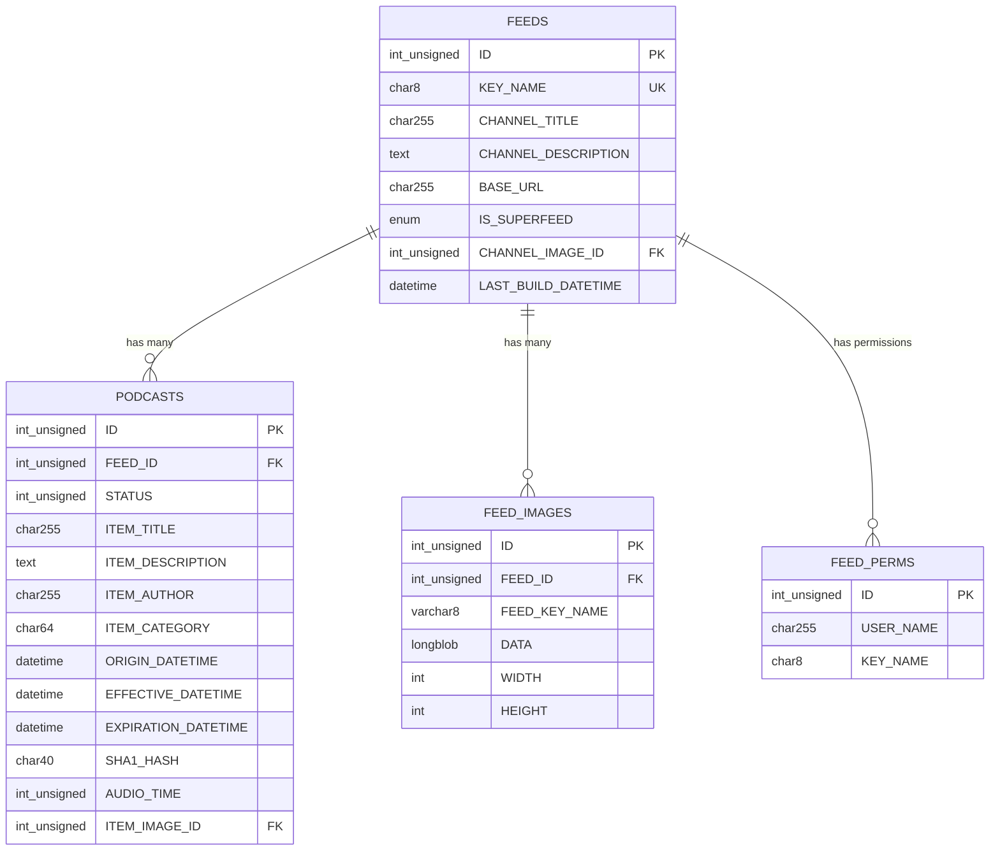
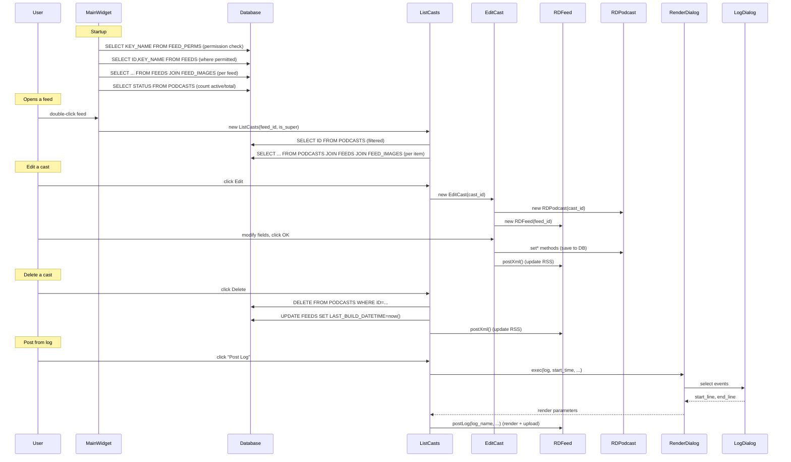
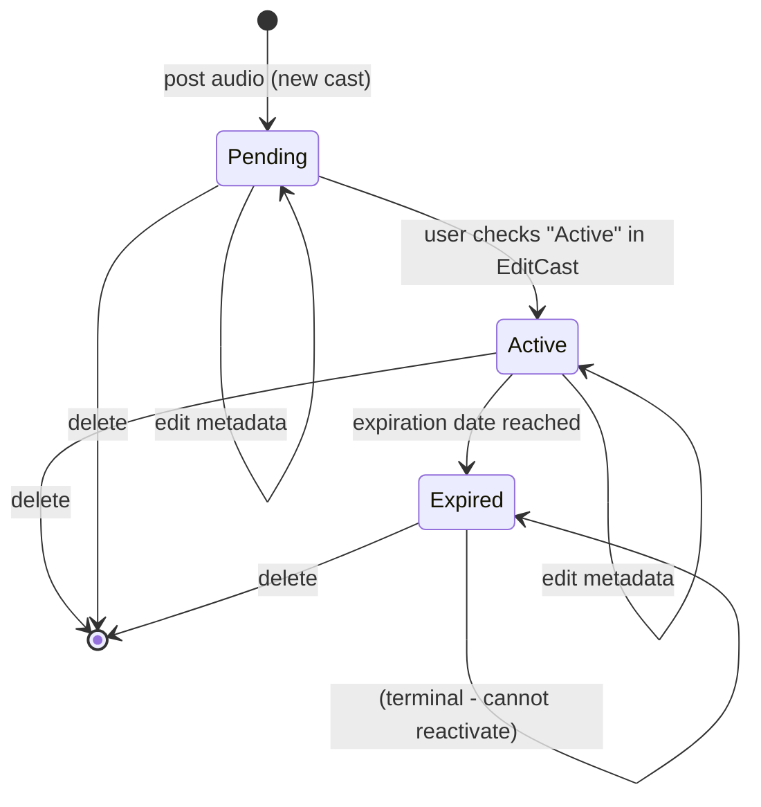

# Semantic Context: CSM (rdcastmanager)

> Podcast / RSS feed cast manager application for Rivendell radio automation system.

## Files & Symbols

### Source Files

| File | Type | Symbols | LOC (est) |
|------|------|---------|-----------|
| rdcastmanager.h | header | MainWidget | ~50 |
| rdcastmanager.cpp | source | MainWidget impl, main() | ~350 |
| list_casts.h | header | ListCasts | ~60 |
| list_casts.cpp | source | ListCasts impl | ~600 |
| edit_cast.h | header | EditCast | ~60 |
| edit_cast.cpp | source | EditCast impl | ~350 |
| render_dialog.h | header | RenderDialog | ~40 |
| render_dialog.cpp | source | RenderDialog impl | ~250 |
| logdialog.h | header | LogDialog | ~30 |
| logdialog.cpp | source | LogDialog impl | ~150 |
| logmodel.h | header | LogModel | ~30 |
| logmodel.cpp | source | LogModel impl | ~200 |
| globals.h | header | cast_filter, cast_group, cast_schedcode (globals) | ~10 |

### Symbol Index

| Symbol | Kind | File | Qt Class? |
|--------|------|------|-----------|
| MainWidget | Class | rdcastmanager.h | Yes (Q_OBJECT) |
| ListCasts | Class | list_casts.h | Yes (Q_OBJECT) |
| EditCast | Class | edit_cast.h | Yes (Q_OBJECT) |
| RenderDialog | Class | render_dialog.h | Yes (Q_OBJECT) |
| LogDialog | Class | logdialog.h | Yes (Q_OBJECT) |
| LogModel | Class | logmodel.h | Yes (Q_OBJECT) |
| main | Function | rdcastmanager.cpp | No |
| cast_filter | Variable | globals.h | No |
| cast_group | Variable | globals.h | No |
| cast_schedcode | Variable | globals.h | No |

## Class API Surface

### MainWidget [Application Main Window]
- **File:** rdcastmanager.h / rdcastmanager.cpp
- **Inherits:** RDWidget (from LIB)
- **Qt Object:** Yes (Q_OBJECT)
- **Constructor:** `MainWidget(RDConfig *c, QWidget *parent=0)`

#### Slots (private)
| Slot | Parameters | Description |
|------|-----------|-------------|
| openData | () | Open selected feed's cast list |
| copyData | () | Copy feed URL to clipboard |
| reportData | () | Generate report for selected feed |
| userChangedData | () | Handle user change notification |
| feedClickedData | (Q3ListViewItem *item) | Feed selection changed |
| feedDoubleclickedData | (Q3ListViewItem *item, const QPoint &pt, int col) | Double-click opens feed |
| notificationReceivedData | (RDNotification *notify) | Handle RD notification |
| quitMainWidget | () | Quit application |

#### Protected Methods
| Method | Parameters | Description |
|--------|-----------|-------------|
| closeEvent | (QCloseEvent *e) | Window close handler |
| resizeEvent | (QResizeEvent *e) | Window resize handler |

#### Private Methods
| Method | Return | Parameters | Description |
|--------|--------|-----------|-------------|
| RefreshItem | void | (RDListViewItem *item) | Refresh single feed item |
| RefreshList | void | () | Refresh all feeds in list |

#### Key Fields
| Field | Type | Description |
|-------|------|-------------|
| cast_feed_list | RDListView* | Main feed list widget |
| cast_open_button | QPushButton* | Open button |
| cast_copy_button | QPushButton* | Copy URL button |
| cast_report_button | QPushButton* | Report button |
| cast_close_button | QPushButton* | Close button |
| cast_temp_directories | QList<RDTempDirectory*> | Temporary directories for operations |

#### LIB Dependencies
- RDWidget, RDConfig, RDLogLine, RDTempDirectory, RDListView, RDListViewItem, RDNotification

---

### ListCasts [Feed Cast Items Dialog]
- **File:** list_casts.h / list_casts.cpp
- **Inherits:** RDDialog (from LIB)
- **Qt Object:** Yes (Q_OBJECT)
- **Constructor:** `ListCasts(unsigned feed_id, bool is_super, QWidget *parent=0)`

#### Slots (private)
| Slot | Parameters | Description |
|------|-----------|-------------|
| addCartData | () | Add cast from existing cart |
| addFileData | () | Add cast from file upload |
| addLogData | () | Add cast from rendered log |
| editData | () | Edit selected cast item |
| deleteData | () | Delete selected cast item |
| doubleClickedData | (Q3ListViewItem *item, const QPoint &pt, int col) | Double-click to edit |
| userChangedData | () | Handle user change |
| filterChangedData | (const QString &str) | Filter text changed |
| notexpiredToggledData | (bool state) | Toggle non-expired filter |
| activeToggledData | (bool state) | Toggle active filter |
| postProgressChangedData | (int step) | Post upload progress |
| closeData | () | Close dialog |
| notificationReceivedData | (RDNotification *notify) | Handle RD notification |

#### Protected Methods
| Method | Parameters | Description |
|--------|-----------|-------------|
| resizeEvent | (QResizeEvent *e) | Resize handler |

#### Private Methods
| Method | Return | Parameters | Description |
|--------|--------|-----------|-------------|
| RefreshList | void | () | Refresh all cast items |
| RefreshItem | void | (RDListViewItem *item) | Refresh single cast item |
| GetEncoderId | void | () | Get encoder ID for feed |

#### Key Fields
| Field | Type | Description |
|-------|------|-------------|
| list_casts_view | RDListView* | Cast items list view |
| list_feed_id | unsigned | Current feed ID |
| list_feed | RDFeed* | Current feed object |
| list_is_superfeed | bool | Whether feed is a superfeed |
| list_progress_dialog | QProgressDialog* | Upload progress dialog |
| list_render_dialog | RenderDialog* | Log render dialog |
| list_filter_edit | QLineEdit* | Filter text input |
| list_active_check | QCheckBox* | Active filter checkbox |

#### LIB Dependencies
- RDDialog, RDFeed, RDListViewItem, RDNotification

---

### EditCast [Cast Item Editor Dialog]
- **File:** edit_cast.h / edit_cast.cpp
- **Inherits:** RDDialog (from LIB)
- **Qt Object:** Yes (Q_OBJECT)
- **Constructor:** `EditCast(unsigned cast_id, QWidget *parent=0)`

#### Slots (private)
| Slot | Parameters | Description |
|------|-----------|-------------|
| effectiveSelectData | () | Select effective date |
| expirationSelectedData | (int state) | Expiration option changed |
| expirationSelectData | () | Select expiration date |
| okData | () | Save and close |
| cancelData | () | Discard and close |

#### Protected Methods
| Method | Parameters | Description |
|--------|-----------|-------------|
| resizeEvent | (QResizeEvent *e) | Resize handler |

#### Key Fields
| Field | Type | Description |
|-------|------|-------------|
| cast_feed | RDFeed* | Parent feed object |
| cast_cast | RDPodcast* | Podcast cast object being edited |
| cast_schema | RDRssSchemas::RssSchema | RSS schema type |
| cast_item_title_edit | QLineEdit* | Episode title |
| cast_item_author_edit | QLineEdit* | Episode author |
| cast_item_category_edit | QLineEdit* | Episode category |
| cast_item_link_edit | QLineEdit* | Episode link URL |
| cast_item_origin_edit | QLineEdit* | Origin URL |
| cast_item_description_edit | QTextEdit* | Episode description |
| cast_item_explicit_check | QCheckBox* | Explicit content flag |
| cast_item_image_box | RDImagePickerBox* | Image selector |
| cast_item_comments_edit | QLineEdit* | Episode comments URL |
| cast_item_expiration_box | QComboBox* | Expiration mode selector |
| cast_item_expiration_edit | QDateTimeEdit* | Expiration date/time |
| cast_item_effective_edit | QDateTimeEdit* | Effective date/time |
| cast_active_check | QCheckBox* | Active flag |
| cast_status | RDPodcast::Status | Current cast status |

#### LIB Dependencies
- RDDialog, RDFeed, RDPodcast, RDRssSchemas, RDImagePickerBox

---

### RenderDialog [Log Render Configuration Dialog]
- **File:** render_dialog.h / render_dialog.cpp
- **Inherits:** RDDialog (from LIB)
- **Qt Object:** Yes (Q_OBJECT)
- **Constructor:** `RenderDialog(QWidget *parent=0)`

#### Public Slots
| Slot | Return | Parameters | Description |
|------|--------|-----------|-------------|
| exec | int | (RDLogEvent *log, QTime *start_time, bool *ignore_stops, int *start_line, int *end_line) | Execute render config dialog |

#### Slots (private)
| Slot | Parameters | Description |
|------|-----------|-------------|
| startTimeActivatedData | (int n) | Start time mode changed |
| selectData | () | Select log events |
| okData | () | Confirm render settings |
| cancelData | () | Cancel render |

#### Protected Methods
| Method | Parameters | Description |
|--------|-----------|-------------|
| closeEvent | (QCloseEvent *e) | Close handler |
| resizeEvent | (QResizeEvent *e) | Resize handler |

#### Private Methods
| Method | Return | Parameters | Description |
|--------|--------|-----------|-------------|
| UpdateLogEventsSelection | void | () | Update selection display |

#### Key Fields
| Field | Type | Description |
|-------|------|-------------|
| d_start_time_box | QComboBox* | Start time mode selector |
| d_start_time_edit | QTimeEdit* | Start time value |
| d_ignorestop_box | QComboBox* | Ignore stops mode |
| d_select_button | QPushButton* | Select log events button |
| d_log_dialog | LogDialog* | Log event selection dialog |
| d_log | RDLogEvent* | Log event data |
| d_start_line | int* | Output: start line index |
| d_end_line | int* | Output: end line index |
| d_start_time | QTime* | Output: start time |
| d_ignore_stops | bool* | Output: ignore stops flag |

#### LIB Dependencies
- RDDialog, RDCutDialog, RDLogEvent

---

### LogDialog [Log Event Selection Dialog]
- **File:** logdialog.h / logdialog.cpp
- **Inherits:** RDDialog (from LIB)
- **Qt Object:** Yes (Q_OBJECT)
- **Constructor:** `LogDialog(QWidget *parent=0)`

#### Public Slots
| Slot | Return | Parameters | Description |
|------|--------|-----------|-------------|
| exec | int | (RDLogEvent *log, int *start_line, int *end_line) | Execute log event selection |

#### Slots (private)
| Slot | Parameters | Description |
|------|-----------|-------------|
| okData | () | Confirm selection |
| cancelData | () | Cancel selection |

#### Protected Methods
| Method | Parameters | Description |
|--------|-----------|-------------|
| resizeEvent | (QResizeEvent *e) | Resize handler |

#### Key Fields
| Field | Type | Description |
|-------|------|-------------|
| d_log_view | QTableView* | Log events table |
| d_log_model | LogModel* | Log model for table |
| d_log | RDLogEvent* | Log event data |
| d_start_line | int* | Output: start line |
| d_end_line | int* | Output: end line |

#### LIB Dependencies
- RDDialog, RDLogEvent

---

### LogModel [Log Event Table Model]
- **File:** logmodel.h / logmodel.cpp
- **Inherits:** QAbstractTableModel (Qt)
- **Qt Object:** Yes (Q_OBJECT)
- **Constructor:** `LogModel(QObject *parent=0)`
- **Category:** Data Model (MVC pattern)

#### Public Methods
| Method | Return | Parameters | Description |
|--------|--------|-----------|-------------|
| setLogEvent | void | (RDLogEvent *log) | Set log event data source |
| clearLogEvent | void | () | Clear log event data |
| setFont | void | (const QFont &font) | Set display font |
| columnCount | int | (const QModelIndex &parent) | Number of columns |
| rowCount | int | (const QModelIndex &parent) | Number of rows |
| headerData | QVariant | (int section, Qt::Orientation orient, int role) | Column headers |
| data | QVariant | (const QModelIndex &index, int role) | Cell data |

#### Key Fields
| Field | Type | Description |
|-------|------|-------------|
| d_log | RDLogEvent* | Log event data |
| d_font | QFont | Display font |
| d_bold_font | QFont | Bold font for emphasis |
| d_headers | QStringList | Column header labels |
| d_alignments | QList<int> | Column alignments |
| d_log_icons | RDLogIcons | Log type icons |

#### LIB Dependencies
- RDLogEvent, RDLogIcons

## Data Model

### Table: FEEDS (defined in utils/rddbmgr/create.cpp:1266)

| Column | Type | Constraints |
|--------|------|------------|
| ID | int unsigned | PRIMARY KEY AUTO_INCREMENT |
| KEY_NAME | char(8) | UNIQUE NOT NULL |
| CHANNEL_TITLE | char(255) | |
| CHANNEL_DESCRIPTION | text | |
| CHANNEL_CATEGORY | char(64) | |
| CHANNEL_LINK | char(255) | |
| CHANNEL_COPYRIGHT | char(64) | |
| CHANNEL_WEBMASTER | char(64) | |
| CHANNEL_LANGUAGE | char(5) | DEFAULT 'en-us' |
| CHANNEL_IMAGE_ID | int unsigned | FK to FEED_IMAGES.ID (added via schema update) |
| IS_SUPERFEED | enum('N','Y') | DEFAULT 'N' (added via schema update) |
| RSS_SCHEMA | int | (added via schema update) |
| BASE_URL | char(255) | |
| BASE_PREAMBLE | char(255) | |
| PURGE_URL | char(255) | |
| PURGE_USERNAME | char(64) | |
| PURGE_PASSWORD | char(64) | |
| HEADER_XML | text | |
| CHANNEL_XML | text | |
| ITEM_XML | text | |
| CAST_ORDER | enum('N','Y') | DEFAULT 'N' |
| MAX_SHELF_LIFE | int | |
| LAST_BUILD_DATETIME | datetime | |
| ORIGIN_DATETIME | datetime | |
| ENABLE_AUTOPOST | enum('N','Y') | DEFAULT 'N' |
| KEEP_METADATA | enum('N','Y') | DEFAULT 'Y' |
| UPLOAD_FORMAT | int | DEFAULT 2 |
| UPLOAD_CHANNELS | int | DEFAULT 2 |
| UPLOAD_SAMPRATE | int | DEFAULT 44100 |
| UPLOAD_BITRATE | int | DEFAULT 32000 |
| UPLOAD_QUALITY | int | DEFAULT 0 |
| UPLOAD_EXTENSION | char(16) | DEFAULT 'mp3' |
| NORMALIZE_LEVEL | int | DEFAULT -100 |
| REDIRECT_PATH | char(255) | |
| MEDIA_LINK_MODE | int | DEFAULT 0 |

- **Primary Key:** ID
- **Indexes:** KEY_NAME_IDX(KEY_NAME), CHANNEL_IMAGE_ID_IDX(CHANNEL_IMAGE_ID)
- **CRUD in CSM:** MainWidget (SELECT), ListCasts (SELECT, UPDATE LAST_BUILD_DATETIME)
- **CRUD via LIB:** RDFeed (full CRUD)

### Table: PODCASTS (defined in utils/rddbmgr/create.cpp:1309)

| Column | Type | Constraints |
|--------|------|------------|
| ID | int unsigned | PRIMARY KEY AUTO_INCREMENT |
| FEED_ID | int unsigned | NOT NULL, FK to FEEDS.ID |
| STATUS | int unsigned | DEFAULT 1 |
| ITEM_TITLE | char(255) | |
| ITEM_DESCRIPTION | text | |
| ITEM_CATEGORY | char(64) | |
| ITEM_LINK | char(255) | |
| ITEM_COMMENTS | char(255) | (added via schema update) |
| ITEM_AUTHOR | char(255) | (added via schema update) |
| ITEM_SOURCE_TEXT | char(64) | |
| ITEM_SOURCE_URL | char(255) | |
| ITEM_EXPLICIT | enum('N','Y') | (added via schema update) |
| ITEM_IMAGE_ID | int unsigned | FK to FEED_IMAGES.ID (added via schema update) |
| AUDIO_FILENAME | char(255) | |
| AUDIO_LENGTH | int unsigned | |
| AUDIO_TIME | int unsigned | |
| SHELF_LIFE | int | |
| SHA1_HASH | char(40) | (added via schema update) |
| ORIGIN_DATETIME | datetime | |
| ORIGIN_LOGIN_NAME | char(255) | (added via schema update) |
| ORIGIN_STATION | char(64) | (added via schema update) |
| EFFECTIVE_DATETIME | datetime | |
| EXPIRATION_DATETIME | datetime | (added via schema update) |

- **Primary Key:** ID
- **Foreign Keys:** FEED_ID -> FEEDS.ID, ITEM_IMAGE_ID -> FEED_IMAGES.ID
- **Indexes:** FEED_ID_IDX(FEED_ID, ORIGIN_DATETIME)
- **CRUD in CSM:** ListCasts (SELECT, DELETE), MainWidget (SELECT for status counts)
- **CRUD via LIB:** RDPodcast (full CRUD)

### Table: FEED_PERMS (defined in utils/rddbmgr/create.cpp:1352)

| Column | Type | Constraints |
|--------|------|------------|
| ID | int unsigned | PRIMARY KEY AUTO_INCREMENT |
| USER_NAME | char(255) | |
| KEY_NAME | char(8) | |

- **Primary Key:** ID
- **Indexes:** USER_IDX(USER_NAME), KEYNAME_IDX(KEY_NAME)
- **CRUD in CSM:** MainWidget (SELECT - permission check)

### Table: FEED_IMAGES (defined in utils/rddbmgr/updateschema.cpp:10033)

| Column | Type | Constraints |
|--------|------|------------|
| ID | int unsigned | PRIMARY KEY AUTO_INCREMENT |
| FEED_ID | int unsigned | NOT NULL |
| FEED_KEY_NAME | varchar(8) | NOT NULL |
| WIDTH | int | NOT NULL |
| HEIGHT | int | NOT NULL |
| DEPTH | int | NOT NULL |
| DESCRIPTION | varchar(191) | NOT NULL |
| FILE_EXTENSION | varchar(10) | NOT NULL |
| DATA | longblob | NOT NULL |

- **Primary Key:** ID
- **Foreign Keys:** FEED_ID -> FEEDS.ID
- **Indexes:** FEED_ID_IDX(FEED_ID), FEED_KEY_NAME_IDX(FEED_KEY_NAME)
- **CRUD in CSM:** MainWidget (SELECT via JOIN), ListCasts (SELECT via JOIN), EditCast (via RDImagePickerBox)

### ERD



## Reactive Architecture

### Signal/Slot Connections

#### MainWidget (rdcastmanager.cpp)
| # | Sender | Signal | Receiver | Slot | File:Line |
|---|--------|--------|----------|------|-----------|
| 1 | rda | userChanged() | this | userChangedData() | rdcastmanager.cpp:93 |
| 2 | rda->ripc() | notificationReceived(RDNotification*) | this | notificationReceivedData(RDNotification*) | rdcastmanager.cpp:109 |
| 3 | cast_feed_list | clicked(Q3ListViewItem*) | this | feedClickedData(Q3ListViewItem*) | rdcastmanager.cpp:118 |
| 4 | cast_feed_list | doubleClicked(Q3ListViewItem*,...) | this | feedDoubleclickedData(Q3ListViewItem*,...) | rdcastmanager.cpp:120 |
| 5 | cast_open_button | clicked() | this | openData() | rdcastmanager.cpp:146 |
| 6 | cast_copy_button | clicked() | this | copyData() | rdcastmanager.cpp:155 |
| 7 | cast_report_button | clicked() | this | reportData() | rdcastmanager.cpp:164 |
| 8 | cast_close_button | clicked() | this | quitMainWidget() | rdcastmanager.cpp:172 |

#### ListCasts (list_casts.cpp)
| # | Sender | Signal | Receiver | Slot | File:Line |
|---|--------|--------|----------|------|-----------|
| 9 | rda->ripc() | notificationReceived(RDNotification*) | this | notificationReceivedData(RDNotification*) | list_casts.cpp:71 |
| 10 | list_feed | postProgressChanged(int) | this | postProgressChangedData(int) | list_casts.cpp:89 |
| 11 | list_feed | postProgressRangeChanged(int,int) | list_progress_dialog | setRange(int,int) | list_casts.cpp:91 |
| 12 | list_filter_edit | textChanged(const QString&) | this | filterChangedData(const QString&) | list_casts.cpp:102 |
| 13 | list_active_check | toggled(bool) | this | activeToggledData(bool) | list_casts.cpp:113 |
| 14 | list_casts_view | doubleClicked(Q3ListViewItem*,...) | this | doubleClickedData(Q3ListViewItem*,...) | list_casts.cpp:151 |
| 15 | list_cart_button | clicked() | this | addCartData() | list_casts.cpp:164 |
| 16 | list_file_button | clicked() | this | addFileData() | list_casts.cpp:173 |
| 17 | list_log_button | clicked() | this | addLogData() | list_casts.cpp:182 |
| 18 | list_edit_button | clicked() | this | editData() | list_casts.cpp:190 |
| 19 | list_delete_button | clicked() | this | deleteData() | list_casts.cpp:198 |
| 20 | list_close_button | clicked() | this | closeData() | list_casts.cpp:207 |
| 21 | rda->ripc() | userChanged() | this | userChangedData() | list_casts.cpp:211 |

#### EditCast (edit_cast.cpp)
| # | Sender | Signal | Receiver | Slot | File:Line |
|---|--------|--------|----------|------|-----------|
| 22 | cast_item_effective_button | clicked() | this | effectiveSelectData() | edit_cast.cpp:153 |
| 23 | cast_item_expiration_box | activated(int) | this | expirationSelectedData(int) | edit_cast.cpp:162 |
| 24 | cast_item_expiration_button | clicked() | this | expirationSelectData() | edit_cast.cpp:182 |
| 25 | cast_ok_button | clicked() | this | okData() | edit_cast.cpp:197 |
| 26 | cast_cancel_button | clicked() | this | cancelData() | edit_cast.cpp:205 |

#### RenderDialog (render_dialog.cpp)
| # | Sender | Signal | Receiver | Slot | File:Line |
|---|--------|--------|----------|------|-----------|
| 27 | d_start_time_box | activated(int) | this | startTimeActivatedData(int) | render_dialog.cpp:54 |
| 28 | d_select_button | clicked() | this | selectData() | render_dialog.cpp:89 |
| 29 | d_ok_button | clicked() | this | okData() | render_dialog.cpp:98 |
| 30 | d_cancel_button | clicked() | this | cancelData() | render_dialog.cpp:107 |

#### LogDialog (logdialog.cpp)
| # | Sender | Signal | Receiver | Slot | File:Line |
|---|--------|--------|----------|------|-----------|
| 31 | d_ok_button | clicked() | this | okData() | logdialog.cpp:45 |
| 32 | d_cancel_button | clicked() | this | cancelData() | logdialog.cpp:49 |

### Key Sequence Diagrams



### Cross-Artifact Dependencies

| External Class | From Artifact | Used In Files | Purpose |
|---------------|---------------|---------------|---------|
| RDWidget | LIB | rdcastmanager.h | Base class for MainWidget |
| RDDialog | LIB | list_casts.h, edit_cast.h, render_dialog.h, logdialog.h | Base class for dialogs |
| RDConfig | LIB | rdcastmanager.h | Application configuration |
| RDFeed | LIB | list_casts.h, edit_cast.h | RSS feed data access |
| RDPodcast | LIB | edit_cast.h | Podcast episode data access |
| RDListView | LIB | rdcastmanager.h, list_casts.h | Custom Q3ListView |
| RDListViewItem | LIB | rdcastmanager.h, list_casts.h | Custom Q3ListViewItem |
| RDNotification | LIB | rdcastmanager.cpp, list_casts.cpp | Inter-process notification |
| RDLogEvent | LIB | render_dialog.h, logdialog.h, logmodel.h | Log event data |
| RDLogIcons | LIB | logmodel.h | Log type icons |
| RDTempDirectory | LIB | rdcastmanager.h | Temporary file management |
| RDImagePickerBox | LIB | edit_cast.h | Image picker widget for feed images |
| RDCutDialog | LIB | render_dialog.h | Cut selection dialog |
| RDRssSchemas | LIB | edit_cast.h | RSS schema definitions |
| RDCastSearch | LIB | list_casts.cpp | SQL filter builder for podcast search |

## Business Rules

### Rule: Feed Access Permission Check
- **Source:** rdcastmanager.cpp:382-391
- **Trigger:** MainWidget::RefreshList() on startup or user change
- **Condition:** User must have FEED_PERMS entries matching their login name
- **Action:** Only feeds with matching FEED_PERMS entries are shown in the feed list; if no permissions, list is empty
- **Gherkin:**
  ```gherkin
  Scenario: User can only see feeds they have permission for
    Given a user is logged in
    When the feed list is refreshed
    Then only feeds with matching FEED_PERMS for that user are displayed
    And if no FEED_PERMS entries exist, the list is empty
  ```

### Rule: Superfeed Operation Restrictions
- **Source:** list_casts.cpp:451-458
- **Trigger:** ListCasts::userChangedData() when user context changes
- **Condition:** Feed is a superfeed (IS_SUPERFEED='Y')
- **Action:** Add Cart, Add File, Add Log, Edit, and Delete buttons are all disabled for superfeeds
- **Gherkin:**
  ```gherkin
  Scenario: Superfeed does not allow adding or modifying casts
    Given a feed is marked as a superfeed
    When the user opens the cast list for that feed
    Then the "Post From Cart", "Post From File", "Post From Log", "Edit", and "Delete" buttons are disabled
  ```

### Rule: Podcast Privilege Enforcement
- **Source:** list_casts.cpp:453-458
- **Trigger:** ListCasts::userChangedData()
- **Condition:** User must have specific podcast privileges (addPodcast, editPodcast, deletePodcast)
- **Action:** Buttons are enabled/disabled based on user's privilege flags AND superfeed status
- **Gherkin:**
  ```gherkin
  Scenario: User without addPodcast privilege cannot add casts
    Given a user does not have ADD_PODCAST_PRIV
    When the user views a non-superfeed cast list
    Then the "Post From Cart", "Post From File", and "Post From Log" buttons are disabled
  ```

### Rule: Expiration Date Must Be After Effective Date
- **Source:** edit_cast.cpp:340-346
- **Trigger:** EditCast::okData() when saving cast
- **Condition:** Expiration is enabled AND effective datetime > expiration datetime
- **Action:** Warning dialog shown, save aborted
- **Gherkin:**
  ```gherkin
  Scenario: Expiration date cannot be before air date
    Given a cast has expiration enabled
    And the air date is set to 2026-04-15
    When the user sets expiration to 2026-04-10
    And clicks OK
    Then an error message "Item expiration cannot be prior to Air Date/Time!" is shown
    And the dialog remains open
  ```

### Rule: Expiration Date Must Be In Future
- **Source:** edit_cast.cpp:347-351
- **Trigger:** EditCast::okData() when saving cast
- **Condition:** Expiration is enabled AND expiration datetime < current datetime
- **Action:** Warning dialog shown, save aborted
- **Gherkin:**
  ```gherkin
  Scenario: Expiration date must be in the future
    Given a cast has expiration enabled
    When the user sets expiration to a past date
    And clicks OK
    Then an error message "Item expiration must be in the future!" is shown
    And the dialog remains open
  ```

### Rule: Delete Requires Confirmation
- **Source:** list_casts.cpp:386-391
- **Trigger:** ListCasts::deleteData()
- **Condition:** Always (when delete is clicked on a selected item)
- **Action:** Confirmation dialog; if "No", operation aborted
- **Gherkin:**
  ```gherkin
  Scenario: Deleting a cast requires confirmation
    Given a cast item is selected
    When the user clicks Delete
    Then a confirmation dialog "Are you sure you want to delete this item?" appears
    And if user clicks No, the item is not deleted
  ```

### Rule: Remote Audio Drop Failure Handling
- **Source:** list_casts.cpp:403-412
- **Trigger:** ListCasts::deleteData() during cast deletion
- **Condition:** cast->dropAudio() fails
- **Action:** User is prompted whether to continue deleting despite remote audio drop failure
- **Gherkin:**
  ```gherkin
  Scenario: Remote audio drop fails during delete
    Given a cast item is being deleted
    When the remote audio drop fails
    Then a warning "Unable to drop remote audio!" with server error is shown
    And the user is asked "Continue deleting cast?"
    And if user clicks No, the delete is aborted
    And if user clicks Yes, the local podcast record is still deleted
  ```

### Rule: Post-Delete XML Regeneration
- **Source:** list_casts.cpp:424-427
- **Trigger:** ListCasts::deleteData() after successful local deletion
- **Condition:** After deleting podcast record and updating LAST_BUILD_DATETIME
- **Action:** Attempt postXml(); warn if remote XML update fails
- **Gherkin:**
  ```gherkin
  Scenario: RSS XML is regenerated after cast deletion
    Given a cast item has been deleted from the database
    When the FEEDS.LAST_BUILD_DATETIME is updated
    Then the feed XML is posted to the remote server
    And if the XML post fails, a warning "Unable to update remote XML data!" is shown
  ```

### Rule: Post Workflow - Cart, File, Log
- **Source:** list_casts.cpp:237-352
- **Trigger:** addCartData(), addFileData(), addLogData()
- **Condition:** User selects source (cart/file/log) and posting succeeds
- **Action:** Cast is created via RDFeed.postCut/postFile/postLog, EditCast dialog opens for metadata, notifications sent
- **Gherkin:**
  ```gherkin
  Scenario: Post from cart creates cast and opens editor
    Given the user is viewing a non-superfeed cast list
    When the user clicks "Post From Cart" and selects a cut
    Then RDFeed.postCut() is called to upload audio
    And if posting succeeds, the EditCast dialog opens for metadata entry
    And a FeedItemType AddAction notification is sent
    And a FeedType ModifyAction notification is sent
  ```

### Rule: Active/Expired Status Display
- **Source:** list_casts.cpp:619-636
- **Trigger:** ListCasts::RefreshItem()
- **Condition:** PODCASTS.STATUS value
- **Action:** Status icon displayed: green ball = active (effective now), blue ball = active (future), red ball = pending, white ball = expired
- **Gherkin:**
  ```gherkin
  Scenario: Active cast with future effective date shows blue
    Given a podcast has StatusActive
    And the effective datetime is in the future
    When the cast list is displayed
    Then the status icon shows a blue ball

  Scenario: Active cast with current effective date shows green
    Given a podcast has StatusActive
    And the effective datetime is now or past
    When the cast list is displayed
    Then the status icon shows a green ball
  ```

### State Machines



### Error Patterns

| Error | Severity | Condition | Message |
|-------|----------|-----------|---------|
| AppInitFailure | critical | rda->open() fails | Dynamic error message |
| UnknownCmdOption | critical | Unprocessed command switch | "Unknown command option: {key}" |
| PostingError | warning | RDFeed::postCut/postFile/postLog fails | RDFeed::errorString(err) |
| RemoteAudioDrop | warning | cast->dropAudio() fails | "Unable to drop remote audio!" + server message |
| RemoteXmlUpdate | warning | list_feed->postXml() fails | "Unable to update remote XML data!" |
| ExpirationBeforeAir | warning | expiration < effective | "Item expiration cannot be prior to Air Date/Time!" |
| ExpirationInPast | warning | expiration < now | "Item expiration must be in the future!" |
| TempDirCreate | warning | RDTempDirectory::create() fails | "Unable to create temporary directory." |
| LogSelectionEmpty | information | No log events selected | "At least one log event must be selected!" |

## UI Contracts

### Window: MainWidget [Main Application Window]
- **Type:** RDWidget (extends QWidget)
- **Title:** "RDCastManager vX.X.X - Host: {station} User {user}"
- **Size:** 640x480 (resizable, minimum)
- **Layout:** Manual geometry (absolute positioning with resize handling)

#### Widgets
| Widget | Type | Label/Text | Binding | Enabled-When |
|--------|------|-----------|---------|--------------|
| cast_feed_list | RDListView (Q3ListView) | -- | clicked->feedClickedData, doubleClicked->feedDoubleclickedData | Always |
| cast_open_button | QPushButton | "View\nFeed" | clicked->openData() | Feed selected |
| cast_copy_button | QPushButton | "Copy URL to\nClipboard" | clicked->copyData() | Feed selected |
| cast_report_button | QPushButton | "Online Feed\nReport" | clicked->reportData() | Feed selected |
| cast_close_button | QPushButton | "&Close" | clicked->quitMainWidget() | Always |

#### Feed List Columns
| # | Header | Alignment | Content |
|---|--------|-----------|---------|
| 0 | (icon) | Center | Feed image (32x32) or default icon |
| 1 | Key Name | Left | FEEDS.KEY_NAME |
| 2 | Feed Name | Left | FEEDS.CHANNEL_TITLE |
| 3 | Casts | Center | "{active}/{total}" or "[superfeed]" |
| 4 | Public URL | Left | Computed from BASE_URL + KEY_NAME |

#### Data Flow
- **Source:** FEEDS table joined with FEED_IMAGES, filtered by FEED_PERMS for current user
- **Display:** RDListView with feed info, active/total cast counts, feed images
- **Navigation:** Double-click or View Feed button opens ListCasts dialog for that feed

---

### Window: ListCasts [Podcast Item List Dialog]
- **Type:** RDDialog (extends QDialog)
- **Title:** "RDCastManager - Podcast Item List [Feed ID: {id}]"
- **Size:** 640x480 (resizable, minimum)
- **Layout:** Manual geometry with resize handling

#### Widgets
| Widget | Type | Label/Text | Binding | Enabled-When |
|--------|------|-----------|---------|--------------|
| list_casts_view | RDListView (Q3ListView) | -- | doubleClicked->doubleClickedData | Always |
| list_filter_edit | QLineEdit | -- | textChanged->filterChangedData | Always |
| list_active_check | QCheckBox | "Active" | toggled->activeToggledData | Always |
| list_cart_button | QPushButton | "Post From\nCart" | clicked->addCartData | addPodcast && !superfeed |
| list_file_button | QPushButton | "Post From\nFile" | clicked->addFileData | addPodcast && !superfeed |
| list_log_button | QPushButton | "Post From\nLog" | clicked->addLogData | addPodcast && !superfeed |
| list_edit_button | QPushButton | "&Edit" | clicked->editData | editPodcast && !superfeed |
| list_delete_button | QPushButton | "&Delete" | clicked->deleteData | deletePodcast && !superfeed |
| list_close_button | QPushButton | "&Close" | clicked->closeData | Always |
| list_progress_dialog | QProgressDialog | "Progress" | postProgressChanged->update | During post operations |

#### Cast List Columns
| # | Header | Alignment | Sort Type | Content |
|---|--------|-----------|-----------|---------|
| 0 | (icon) | Center | -- | Podcast image or feed image (32x32) |
| 1 | Title | Left | -- | PODCASTS.ITEM_TITLE |
| 2 | Status | Center | -- | Status ball (green/blue/red/white) |
| 3 | Start | Left | DateTimeSort | PODCASTS.EFFECTIVE_DATETIME |
| 4 | Expiration | Center | DateTimeSort | PODCASTS.EXPIRATION_DATETIME or "Never" |
| 5 | Length | Right | -- | PODCASTS.AUDIO_TIME |
| 6 | Feed | Left | -- | FEEDS.KEY_NAME |
| 7 | Category | Center | -- | PODCASTS.ITEM_CATEGORY |
| 8 | Posted By | Left | -- | "{login_name} on {station} {datetime}" |
| 9 | SHA1 | Left | -- | PODCASTS.SHA1_HASH |

#### Data Flow
- **Source:** PODCASTS table with JOIN to FEEDS and FEED_IMAGES
- **Filter:** Text filter on item fields + active/non-expired toggles (via RDCastSearch)
- **Add:** Via cart (RDCutDialog), file (QFileDialog), or log (RDListLogs + RenderDialog)
- **Edit:** Opens EditCast dialog for selected item
- **Delete:** Confirmation, drop remote audio, delete DB record, regenerate XML

---

### Window: EditCast [Cast Item Editor Dialog]
- **Type:** RDDialog (extends QDialog)
- **Title:** "RDCastManager - Editing Item [Cast ID: {id}]"
- **Size:** 640x430 (resizable, minimum)
- **Layout:** Manual geometry

#### Widgets
| Widget | Type | Label/Text | Binding | Enabled-When |
|--------|------|-----------|---------|--------------|
| cast_item_origin_edit | QLineEdit | "Origin" | Read-only | -- |
| cast_item_title_edit | QLineEdit | "Item Title" | -- | Always |
| cast_item_author_edit | QLineEdit | "Item Author" | -- | Always |
| cast_item_category_edit | QLineEdit | "Item Category" | -- | Always |
| cast_item_link_edit | QLineEdit | "Item Link" | -- | Always |
| cast_item_description_edit | QTextEdit | "Item Description" | -- | Always |
| cast_item_explicit_check | QCheckBox | "Item contains explicit content" | -- | Always |
| cast_item_image_box | RDImagePickerBox | "Item Image" | FEED_IMAGES table | Always |
| cast_item_comments_edit | QLineEdit | "Item Comments URL" | -- | Always |
| cast_item_effective_edit | QDateTimeEdit | "Air Date/Time" | -- | Always |
| cast_item_effective_button | QPushButton | "Select" | clicked->effectiveSelectData | Always |
| cast_item_expiration_box | QComboBox | "Item Expires" | activated->expirationSelectedData | Status != Expired |
| cast_item_expiration_edit | QDateTimeEdit | -- | -- | When expiration enabled |
| cast_item_expiration_button | QPushButton | "Select" | clicked->expirationSelectData | When expiration enabled |
| cast_active_check | QCheckBox | "Active" | -- | Status != Expired |
| cast_ok_button | QPushButton | "OK" | clicked->okData | Always |
| cast_cancel_button | QPushButton | "Cancel" | clicked->cancelData | Always |

#### Data Flow
- **Source:** RDPodcast (loaded by cast_id) + RDFeed (loaded by feedId)
- **Display:** Form with all podcast metadata fields
- **Save:** Validates expiration dates, updates RDPodcast fields, calls postXmlConditional

---

### Window: RenderDialog [Log Render Options Dialog]
- **Type:** RDDialog (extends QDialog)
- **Title:** "RDCastManager - Log Render Options"
- **Size:** 500x145 (fixed)
- **Layout:** Manual geometry

#### Widgets
| Widget | Type | Label/Text | Binding | Enabled-When |
|--------|------|-----------|---------|--------------|
| d_start_time_box | QComboBox | "Start Time" | activated->startTimeActivatedData | Always |
| d_start_time_edit | QTimeEdit | -- | -- | When "As Specified" selected |
| d_ignorestop_box | QComboBox | "Ignore Stops" | -- | Always |
| d_select_label | QLabel | "{start_line}-{end_line}" | -- | Read-only |
| d_select_button | QPushButton | "Select" | clicked->selectData | Always |
| d_ok_button | QPushButton | "OK" | clicked->okData | Always |
| d_cancel_button | QPushButton | "Cancel" | clicked->cancelData | Always |

#### Data Flow
- **Input:** RDLogEvent, output pointers for start_time, ignore_stops, start_line, end_line
- **Display:** Render configuration options (start time mode, event selection)
- **Select Events:** Opens LogDialog for event range selection
- **Output:** Configured render parameters via pointer output params

---

### Window: LogDialog [Log Event Selection Dialog]
- **Type:** RDDialog (extends QDialog)
- **Title:** "RDCastManager - List Log Events"
- **Size:** 640x480 (resizable)
- **Layout:** Manual geometry

#### Widgets
| Widget | Type | Label/Text | Binding | Enabled-When |
|--------|------|-----------|---------|--------------|
| d_log_view | QTableView | -- | Multi-row selection | Always |
| d_ok_button | QPushButton | "OK" | clicked->okData | Selection exists |
| d_cancel_button | QPushButton | "Cancel" | clicked->cancelData | Always |

#### Log Table Columns (LogModel)
| # | Header | Alignment | Content |
|---|--------|-----------|---------|
| 0 | Start Time | Right | RDLogLine::startTimeText() |
| 1 | Trans | Center | RDLogLine::transText() |
| 2 | Cart | Center | RDLogLine::cartNumberText() |
| 3 | Group | Center | RDLogLine::groupName() (colored) |
| 4 | Length | Right | RDLogLine::forcedLengthText() |
| 5 | Title | Left | RDLogLine::titleText() |
| 6 | Artist | Left | RDLogLine::artist() |
| 7 | Client | Left | -- |
| 8 | Agency | Left | -- |
| 9 | Label | Left | -- |
| 10 | Source | Left | -- |
| 11 | Ext Data | Left | -- |
| 12 | Line ID | Right | -- |
| 13 | Count | Right | -- |

#### Data Flow
- **Input:** RDLogEvent, output pointers for start_line, end_line
- **Display:** Full log event list as table (read from RDLogEvent)
- **Selection:** Multi-row selection, min/max row used as start_line/end_line
- **Validation:** At least one row must be selected

