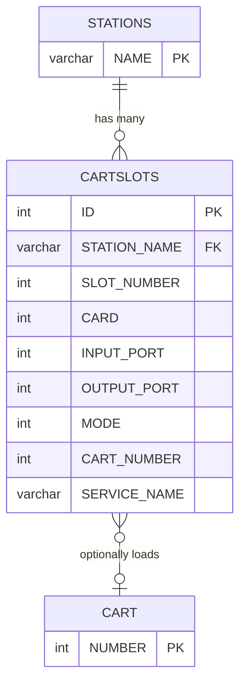
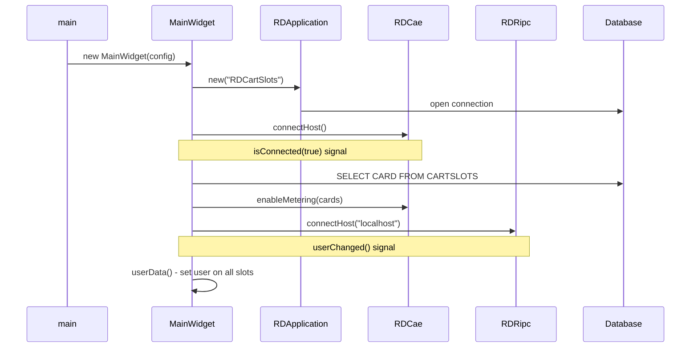
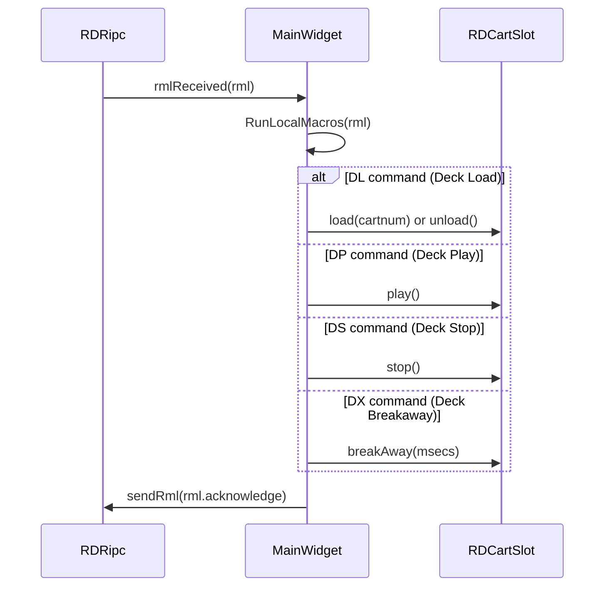
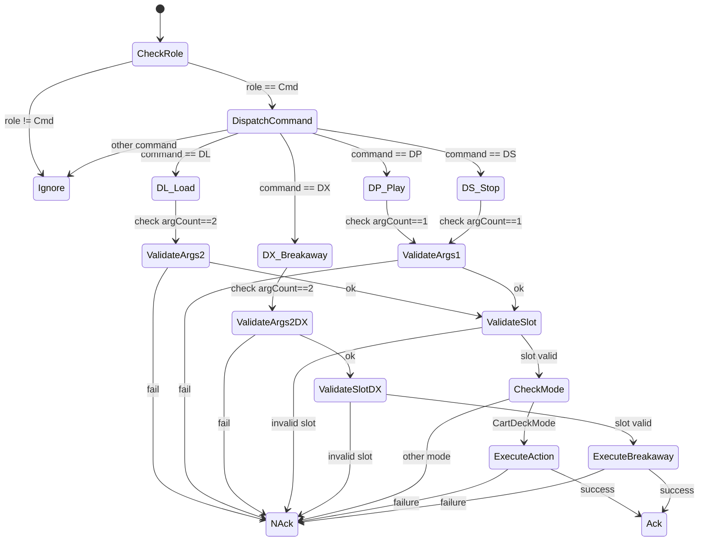

# Semantic Context: CST (rdcartslots)

> Application for managing cart slot assignments in Rivendell radio automation system.
> Depends on: LIB (librd)

## Section A: Files & Symbols

### Source Files

| File | Type | Symbols | LOC (est) |
|------|------|---------|-----------|
| rdcartslots.h | header | MainWidget (class) | ~40 |
| rdcartslots.cpp | source | MainWidget ctor, main(), caeConnectedData, rmlReceivedData, userData, sizeHint, sizePolicy, paintEvent, closeEvent, SetCaption | ~215 |
| local_macros.cpp | source | MainWidget::RunLocalMacros | ~177 |

### Symbol Index

| Symbol | Kind | File | Qt Class? |
|--------|------|------|-----------|
| MainWidget | Class | rdcartslots.h | Yes (Q_OBJECT, inherits RDWidget) |
| main | Function | rdcartslots.cpp | No (entry point) |

### Key LIB Dependencies Used

| LIB Class | Purpose in CST |
|-----------|----------------|
| RDCartSlot | Individual cart slot widget (audio playback deck) |
| RDSlotOptions | Configuration for each cart slot (mode, stop action, cart number) |
| RDCartDialog | Cart picker dialog |
| RDSlotDialog | Slot configuration dialog |
| RDCueEditDialog | Cue point editor dialog |
| RDListSvcs | Service picker dialog |
| RDEventPlayer | Macro event player |
| RDApplication (rda) | Central application context (DB, CAE, RIPC, station, user) |
| RDWidget | Base widget class |
| RDConfig | Configuration reader |
| RDMacro | RML (Rivendell Macro Language) command object |
| RDCae | Core Audio Engine client |
| RDRipc | Rivendell Inter-Process Communication client |
| RDAirPlayConf | Airplay configuration (shared with RDCartSlot) |

## Section B: Class API Surface

### MainWidget [Application Main Window]
- **File:** rdcartslots.h / rdcartslots.cpp / local_macros.cpp
- **Inherits:** RDWidget
- **Qt Object:** Yes (Q_OBJECT)

#### Signals
None defined in MainWidget itself.

#### Slots

| Slot | Visibility | Parameters | Description |
|------|-----------|-----------|-------------|
| caeConnectedData | private | (bool state) | Called when CAE connection established; queries CARTSLOTS table for audio cards and enables metering |
| userData | private | () | Called when user changes; propagates user to all cart slots, updates caption, sends on-air flag |
| rmlReceivedData | private | (RDMacro *rml) | Called when RML command received via RIPC; delegates to RunLocalMacros() |

#### Public Methods

| Method | Return | Parameters | Brief |
|--------|--------|-----------|-------|
| MainWidget() | ctor | (RDConfig *c, QWidget *parent=0) | Initializes app, DB, CAE, RIPC, creates slot grid, dialogs |
| sizeHint() | QSize | () const | Calculates window size from station's cartSlotColumns * cartSlotRows |
| sizePolicy() | QSizePolicy | () const | Returns Fixed/Fixed policy |

#### Protected Methods

| Method | Return | Parameters | Brief |
|--------|--------|-----------|-------|
| paintEvent() | void | (QPaintEvent *e) | Draws black column dividers between slot columns |
| closeEvent() | void | (QCloseEvent *e) | Deletes all cart slots (cleans up temp carts), exits |

#### Private Methods

| Method | Return | Parameters | Brief |
|--------|--------|-----------|-------|
| RunLocalMacros() | void | (RDMacro *rml) | RML command dispatcher: handles DL (deck load), DP (deck play), DS (deck stop), DX (deck breakaway) |
| SetCaption() | void | () | Sets window title: "RDCartSlots vX.Y.Z - Station: NAME  User: USER" |

#### Fields

| Field | Type | Description |
|-------|------|-------------|
| panel_player | RDEventPlayer* | Macro event player |
| lib_rivendell_map | QPixmap* | Application icon (22x22) |
| panel_filter | QString | Cart dialog filter state |
| panel_group | QString | Cart dialog group filter |
| panel_schedcode | QString | Cart dialog scheduler code filter |
| panel_slots | std::vector<RDCartSlot*> | Grid of cart slot widgets |
| panel_cart_dialog | RDCartDialog* | Shared cart picker dialog |
| panel_slot_dialog | RDSlotDialog* | Shared slot config dialog |
| panel_cue_dialog | RDCueEditDialog* | Shared cue editor dialog |
| panel_svcs_dialog | RDListSvcs* | Shared service picker dialog |

## Section C: Data Model

### Table: CARTSLOTS (defined in LIB, used by CST)

The CARTSLOTS table stores per-station cart slot configuration. The Active Record class is `RDSlotOptions` (in LIB).

| Column | Type | Description |
|--------|------|-------------|
| ID | int | PRIMARY KEY AUTO_INCREMENT |
| STATION_NAME | varchar | Station identifier (FK to STATIONS) |
| SLOT_NUMBER | unsigned int | Slot index (0-based) |
| CARD | int | Audio card number |
| INPUT_PORT | int | Audio input port |
| OUTPUT_PORT | int | Audio output port |
| MODE | int | Operating mode (0=CartDeck, 1=Breakaway) |
| DEFAULT_MODE | int | Default mode override (-1=use MODE) |
| HOOK_MODE | int | Hook playback mode flag |
| DEFAULT_HOOK_MODE | int | Default hook mode override (-1=use HOOK_MODE) |
| STOP_ACTION | int | Stop behavior (0=Unload, 1=Recue, 2=Loop) |
| DEFAULT_STOP_ACTION | int | Default stop action override (-1=use STOP_ACTION) |
| CART_NUMBER | int | Loaded cart number |
| DEFAULT_CART_NUMBER | int | Default cart override (-1=use CART_NUMBER, 0=none) |
| SERVICE_NAME | varchar | Breakaway service name |

- **Primary Key:** ID
- **Foreign Keys:** STATION_NAME -> STATIONS.NAME
- **CRUD in CST:** SELECT (caeConnectedData queries CARD column)
- **CRUD in LIB:** Full CRUD via RDSlotOptions (load/save), RDStation (clone/delete)

### SQL Queries in CST

| Query | Method | Operation | Purpose |
|-------|--------|-----------|---------|
| `SELECT CARD FROM CARTSLOTS WHERE STATION_NAME=?` | caeConnectedData() | SELECT | Get audio cards for meter enabling |

### ERD



## Section D: Reactive Architecture

### Signal/Slot Connections

| # | Sender | Signal | Receiver | Slot | File:Line |
|---|--------|--------|----------|------|-----------|
| 1 | rda->cae() | isConnected(bool) | this (MainWidget) | caeConnectedData(bool) | rdcartslots.cpp:69 |
| 2 | rda | userChanged() | this (MainWidget) | userData() | rdcartslots.cpp:76 |
| 3 | rda->ripc() | rmlReceived(RDMacro*) | this (MainWidget) | rmlReceivedData(RDMacro*) | rdcartslots.cpp:77 |
| 4 | timer (QTimer) | timeout() | panel_slots[i] (RDCartSlot) | updateMeters() | rdcartslots.cpp:117 |

### Key Sequence Diagrams

#### Application Startup


#### RML Command Processing (Deck Load)


### Cross-Artifact Dependencies

| External Class | From Artifact | Used In Files | Purpose |
|---------------|---------------|---------------|---------|
| RDCartSlot | LIB | rdcartslots.cpp | Individual cart slot widget with playback |
| RDSlotOptions | LIB | (via RDCartSlot) | Cart slot configuration persistence |
| RDCartDialog | LIB | rdcartslots.cpp | Cart picker dialog |
| RDSlotDialog | LIB | rdcartslots.cpp | Slot configuration dialog |
| RDCueEditDialog | LIB | rdcartslots.cpp | Cue point editing |
| RDListSvcs | LIB | rdcartslots.cpp | Service selection |
| RDEventPlayer | LIB | rdcartslots.cpp | Macro event playback |
| RDApplication | LIB | rdcartslots.cpp | Application framework (DB, CAE, RIPC, station, config, user) |
| RDWidget | LIB | rdcartslots.h | Base Qt widget for Rivendell apps |
| RDConfig | LIB | rdcartslots.cpp | Configuration loading |
| RDMacro | LIB | rdcartslots.h, local_macros.cpp | RML command representation |
| RDCae | LIB | rdcartslots.cpp | Core Audio Engine client |
| RDRipc | LIB | rdcartslots.cpp | Inter-process communication |
| RDAirPlayConf | LIB | rdcartslots.cpp | Airplay configuration |
| RDStation | LIB | (via rda->station()) | Station settings (cartSlotRows, cartSlotColumns, cueCard, cuePort) |

## Section E: Business Rules & Logic

### Rule: RML Command Validation (General)
- **Source:** local_macros.cpp:30-33
- **Trigger:** Any RML command received
- **Condition:** `rml->role() != RDMacro::Cmd`
- **Action:** Silently ignore non-command RML messages
- **Gherkin:**
  ```gherkin
  Scenario: Ignore non-command RML messages
    Given the application receives an RML message
    When the RML role is not Cmd
    Then the message is silently ignored
  ```

### Rule: DL (Deck Load) - Argument Count Validation
- **Source:** local_macros.cpp:37-43
- **Trigger:** DL command received
- **Condition:** `rml->argQuantity() != 2`
- **Action:** Send negative acknowledgment
- **Gherkin:**
  ```gherkin
  Scenario: DL command requires exactly 2 arguments
    Given an RML DL command is received
    When the argument count is not 2
    Then a negative acknowledgment is sent back
  ```

### Rule: DL (Deck Load) - Slot Number Validation
- **Source:** local_macros.cpp:44-50
- **Trigger:** DL command with valid arg count
- **Condition:** Slot number is not a valid unsigned int OR slot index >= panel_slots.size()
- **Action:** Send negative acknowledgment
- **Gherkin:**
  ```gherkin
  Scenario: DL command slot number must be valid
    Given an RML DL command with 2 arguments
    When the first argument is not a valid slot number
    Or the slot number exceeds the number of configured slots
    Then a negative acknowledgment is sent back
  ```

### Rule: DL (Deck Load) - Mode Restriction
- **Source:** local_macros.cpp:51-57
- **Trigger:** DL command with valid slot
- **Condition:** Slot mode is not CartDeckMode
- **Action:** Send negative acknowledgment
- **Gherkin:**
  ```gherkin
  Scenario: DL command only works in CartDeck mode
    Given an RML DL command targets a valid slot
    When the slot is not in CartDeck mode
    Then a negative acknowledgment is sent back
  ```

### Rule: DL (Deck Load) - Cart Number Handling
- **Source:** local_macros.cpp:58-75
- **Trigger:** DL command with valid slot in CartDeck mode
- **Condition:** Cart number == 0
- **Action:** Unload the slot; otherwise load the specified cart
- **Gherkin:**
  ```gherkin
  Scenario: DL command with cart number 0 unloads the slot
    Given an RML DL command targets a valid CartDeck slot
    When the cart number argument is 0
    Then the slot is unloaded

  Scenario: DL command with valid cart number loads the cart
    Given an RML DL command targets a valid CartDeck slot
    When the cart number is between 1 and 999999
    Then the specified cart is loaded into the slot
  ```

### Rule: DP (Deck Play) - Play Slot
- **Source:** local_macros.cpp:89-120
- **Trigger:** DP command received
- **Condition:** Requires 1 argument, valid slot number, slot in CartDeck mode
- **Action:** Starts playback on the specified slot
- **Gherkin:**
  ```gherkin
  Scenario: DP command starts playback
    Given an RML DP command with 1 argument
    When the slot number is valid and in CartDeck mode
    Then playback begins on the specified slot
  ```

### Rule: DS (Deck Stop) - Stop Slot
- **Source:** local_macros.cpp:122-153
- **Trigger:** DS command received
- **Condition:** Same as DP (1 arg, valid slot, CartDeck mode)
- **Action:** Stops playback on the specified slot
- **Gherkin:**
  ```gherkin
  Scenario: DS command stops playback
    Given an RML DS command with 1 argument
    When the slot number is valid and in CartDeck mode
    Then playback is stopped on the specified slot
  ```

### Rule: DX (Deck Breakaway) - Breakaway
- **Source:** local_macros.cpp:155-196
- **Trigger:** DX command received
- **Condition:** Requires 2 arguments (slot number, length in msecs), valid slot
- **Action:** Initiates breakaway on the specified slot for the given duration
- **Gherkin:**
  ```gherkin
  Scenario: DX command initiates breakaway
    Given an RML DX command with 2 arguments
    When the slot number is valid
    Then breakaway is initiated for the specified duration in milliseconds
  ```

### Rule: Application Startup - Database Required
- **Source:** rdcartslots.cpp:42-46
- **Trigger:** Application start
- **Condition:** Database connection fails
- **Action:** Show critical error dialog and exit(1)
- **Gherkin:**
  ```gherkin
  Scenario: Application fails to start without database
    Given the RDCartSlots application is starting
    When the database connection cannot be established
    Then a critical error dialog is displayed
    And the application exits with code 1
  ```

### Rule: Application Startup - Unknown Options
- **Source:** rdcartslots.cpp:51-56
- **Trigger:** Application start
- **Condition:** Unprocessed command-line switch detected
- **Action:** Show critical error dialog and exit(2)
- **Gherkin:**
  ```gherkin
  Scenario: Application rejects unknown command options
    Given the RDCartSlots application is starting
    When an unknown command-line option is provided
    Then a critical error dialog is displayed
    And the application exits with code 2
  ```

### Rule: Close Event - Temporary Cart Cleanup
- **Source:** rdcartslots.cpp:195-201
- **Trigger:** Window close
- **Condition:** Always on close
- **Action:** Explicitly deletes all cart slot objects to ensure temporary carts are cleaned up, then exit(0)
- **Gherkin:**
  ```gherkin
  Scenario: Temporary carts are cleaned up on exit
    Given the user closes the RDCartSlots window
    Then all cart slot objects are explicitly deleted
    And temporary carts are properly cleaned up
    And the application exits with code 0
  ```

### State Machine: RML Command Dispatch



### Error Patterns

| Error | Severity | Condition | Message |
|-------|----------|-----------|---------|
| DB Open Failure | critical | rda->open() returns false | Dynamic error from RDApplication |
| Unknown CLI Option | critical | Unprocessed cmdSwitch key | "Unknown command option: {key}" |

## Section F: UI Contracts

### Window: MainWidget
- **Type:** RDWidget (extends QWidget)
- **Title:** "RDCartSlots vX.Y.Z - Station: {STATION_NAME}  User: {USERNAME}"
- **Size:** Dynamic, calculated from station's cartSlotColumns x cartSlotRows
- **Layout:** Manual geometry (no Qt layout manager); grid of RDCartSlot widgets
- **Size Policy:** Fixed/Fixed (not resizable unless RESIZABLE macro defined)

#### Widget Layout

The main window is a grid of RDCartSlot widgets arranged programmatically:
- Columns: `rda->station()->cartSlotColumns()`
- Rows: `rda->station()->cartSlotRows()`
- Each slot positioned at: `(10 + col*(slotWidth+10), 10 + row*(slotHeight+5))`
- Black divider bars painted between columns

#### Widgets

| Widget | Type | Source | Description |
|--------|------|--------|-------------|
| panel_slots[n] | RDCartSlot* | rdcartslots.cpp:108-118 | Grid of cart slot widgets (each slot has its own start/load/options buttons) |
| panel_cart_dialog | RDCartDialog* | rdcartslots.cpp:95 | Modal cart picker (shared by all slots) |
| panel_slot_dialog | RDSlotDialog* | rdcartslots.cpp:97 | Modal slot options dialog (shared) |
| panel_cue_dialog | RDCueEditDialog* | rdcartslots.cpp:98 | Modal cue editor dialog (shared) |
| panel_svcs_dialog | RDListSvcs* | rdcartslots.cpp:86 | Service picker dialog (shared) |

No .ui files exist; the entire UI is constructed programmatically.

#### RDCartSlot Widget (from LIB, each slot instance)

Each RDCartSlot is a self-contained widget with:
- Start button (play/pause/stop)
- Load button (select cart)
- Options button (configure slot)
- RDSlotBox display (cart info, meters, position)
- Signals: tick(), buttonFlash(bool), selectClicked(unsigned,int,int)
- Slots: updateMeters() (connected to shared QTimer at METER_INTERVAL)

#### Data Flow
- **Source:** CARTSLOTS table (slot configuration), CART table (audio content loaded on demand)
- **Display:** Grid of RDCartSlot widgets showing cart info, playback state, audio meters
- **Control:** RML commands (DL/DP/DS/DX) via RIPC, or direct button interaction on each slot
- **Persistence:** Slot options saved via RDSlotOptions to CARTSLOTS table

#### No UI Files
No .ui or .qml files. All UI is programmatic.
