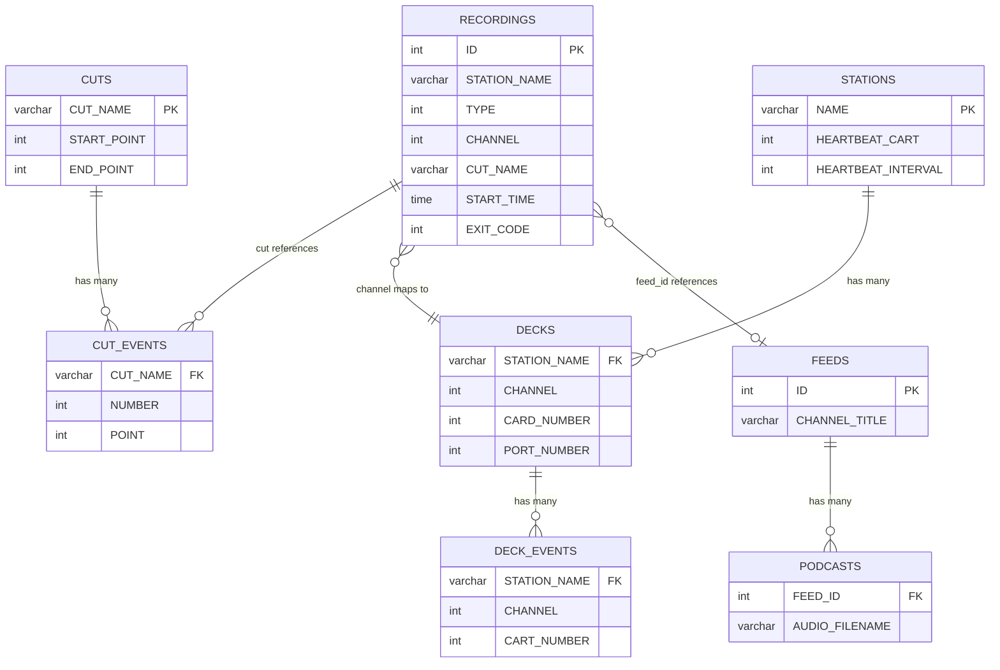
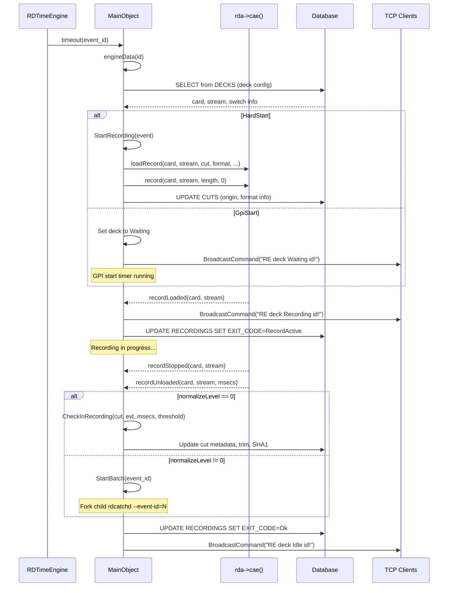
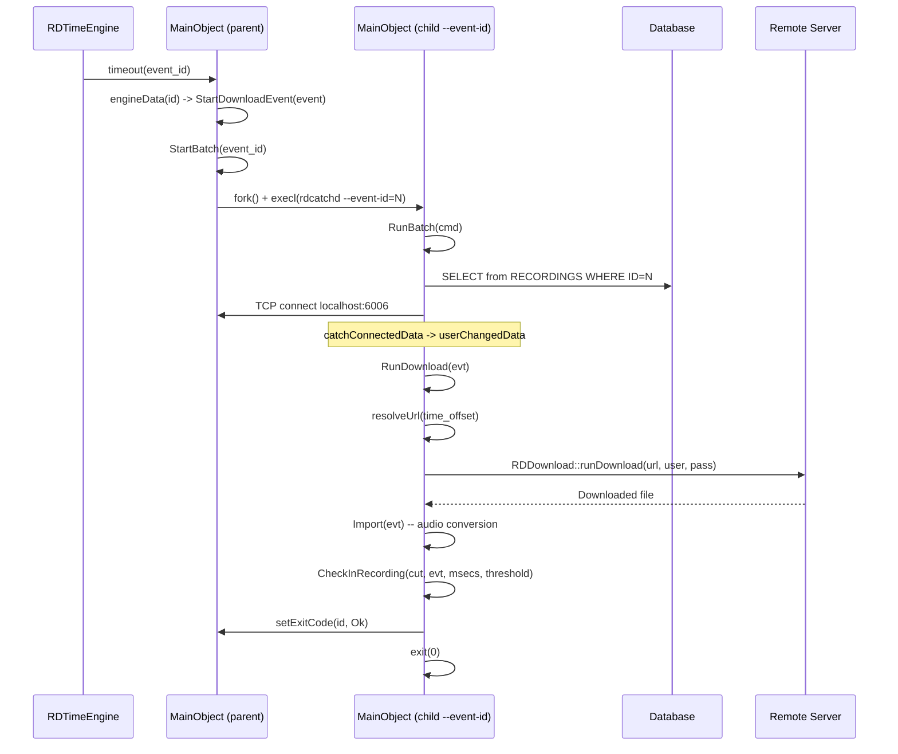
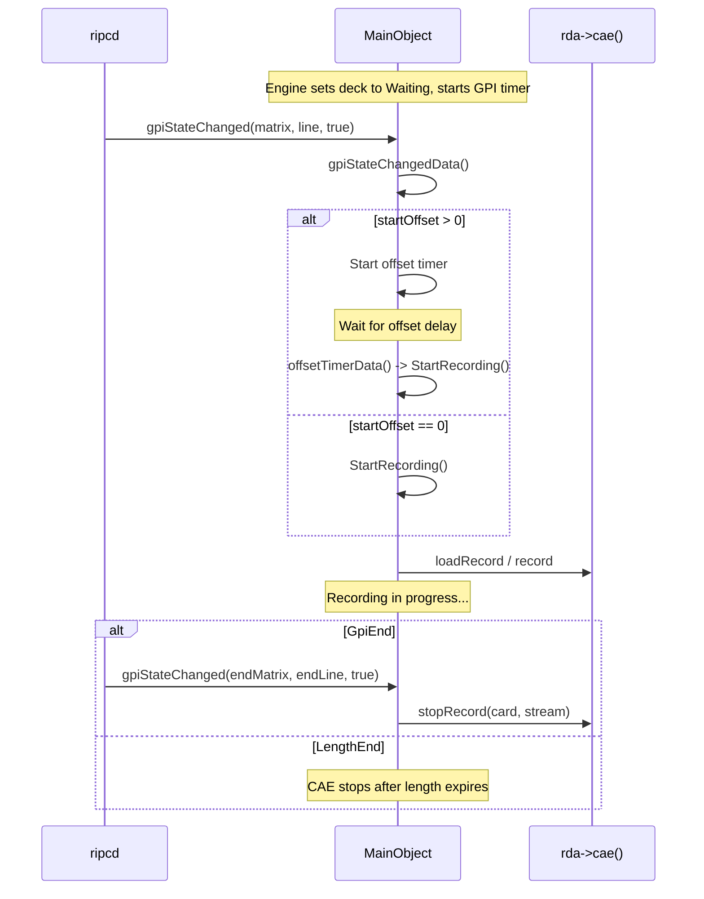
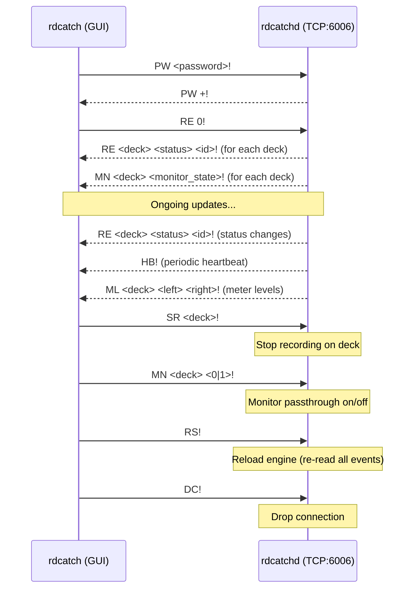
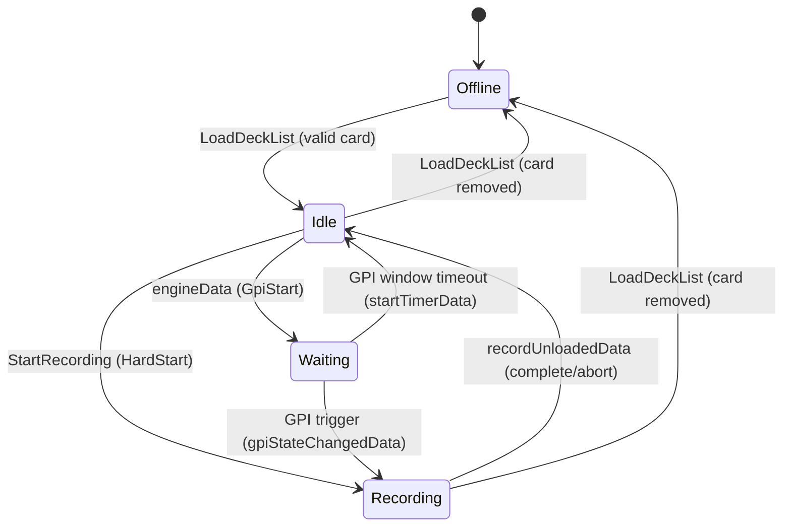
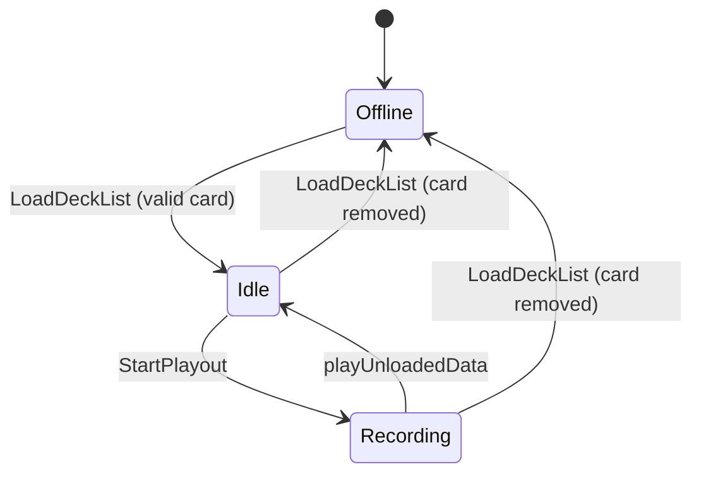

# Semantic Context: CTD (rdcatchd)

## Overview

rdcatchd is the Rivendell catch daemon -- a background service responsible for scheduling and executing timed audio events including recordings, playouts, macro executions, switch operations, downloads, and uploads. It manages a pool of events loaded from the database, monitors GPI (General Purpose Input) triggers, and communicates with connected clients via TCP socket protocol.

- **Type:** daemon
- **Depends On:** LIB (librd)
- **Folder:** rdcatchd/

## Section A: Files & Symbols

### Source Files

| File | Type | Symbols | LOC (est) |
|------|------|---------|-----------|
| rdcatchd.h | header | ServerConnection, MainObject | ~200 |
| catch_event.h | header | CatchEvent | ~170 |
| event_player.h | header | EventPlayer | ~30 |
| rdcatchd.cpp | source | main(), SigHandler(), ServerConnection impl, MainObject (core logic) | ~2500 |
| batch.cpp | source | MainObject::RunBatch, RunImport, RunDownload, RunUpload, Export, Import | ~500 |
| catch_event.cpp | source | CatchEvent impl (getters/setters, resolveUrl, clear) | ~800 |
| event_player.cpp | source | EventPlayer impl (load, start, stop, timeoutData) | ~100 |
| local_macros.cpp | source | MainObject::RunLocalMacros | ~250 |

### Symbol Index

| Symbol | Kind | File | Qt Class? |
|--------|------|------|-----------|
| MainObject | Class | rdcatchd.h | Yes (Q_OBJECT) |
| ServerConnection | Class | rdcatchd.h | No |
| CatchEvent | Class | catch_event.h | No |
| EventPlayer | Class | event_player.h | Yes (Q_OBJECT) |
| SigHandler | Function | rdcatchd.cpp | -- |
| main | Function | rdcatchd.cpp | -- |

## Section B: Class API Surface

### MainObject [Service / Daemon Core]
- **File:** rdcatchd.h / rdcatchd.cpp, batch.cpp, local_macros.cpp
- **Inherits:** QObject
- **Qt Object:** Yes (Q_OBJECT)

MainObject is the central daemon controller. It manages:
1. A time engine that fires events at scheduled times
2. A TCP command server for client connections (rdcatch GUI)
3. Recording decks (up to MAX_DECKS=8 record + 8 playout)
4. GPI-triggered recording start/stop
5. Batch subprocess spawning for downloads/uploads/normalization
6. Macro cart execution
7. Audio switch control via RML commands

#### Signals
None (daemon -- only receives signals, does not emit).

#### Slots (all private)

| Slot | Parameters | Source File | Description |
|------|-----------|-------------|-------------|
| newConnectionData | () | rdcatchd.cpp | Accept new TCP client connection |
| rmlReceivedData | (RDMacro *rml) | rdcatchd.cpp | Handle incoming RML command from ripcd |
| gpiStateChangedData | (int matrix, int line, bool state) | rdcatchd.cpp | Handle GPI state change for start/stop triggers |
| startTimerData | (int id) | rdcatchd.cpp | GPI start window timeout -- auto-start or cancel wait |
| offsetTimerData | (int id) | rdcatchd.cpp | GPI offset delay timer expired -- start recording |
| engineData | (int id) | rdcatchd.cpp | Time engine fires -- dispatch event by type (Recording/Playout/Macro/Switch/Download/Upload) |
| socketReadyReadData | (int conn_id) | rdcatchd.cpp | Read data from TCP client socket |
| socketKillData | (int conn_id) | rdcatchd.cpp | Handle client socket disconnect |
| garbageData | () | rdcatchd.cpp | Garbage collect closed connections |
| isConnectedData | (bool state) | rdcatchd.cpp | CAE connection status callback |
| recordLoadedData | (int card, int stream) | rdcatchd.cpp | CAE: record deck loaded |
| recordingData | (int card, int stream) | rdcatchd.cpp | CAE: recording started |
| recordStoppedData | (int card, int stream) | rdcatchd.cpp | CAE: recording stopped |
| recordUnloadedData | (int card, int stream, unsigned msecs) | rdcatchd.cpp | CAE: recording unloaded -- triggers CheckInRecording or normalization batch |
| playLoadedData | (int handle) | rdcatchd.cpp | CAE: playout loaded |
| playingData | (int handle) | rdcatchd.cpp | CAE: playout started |
| playStoppedData | (int handle) | rdcatchd.cpp | CAE: playout stopped |
| playUnloadedData | (int handle) | rdcatchd.cpp | CAE: playout unloaded |
| runCartData | (int chan, int number, unsigned cartnum) | rdcatchd.cpp | EventPlayer requests macro cart execution during playout |
| meterData | () | rdcatchd.cpp | Periodic audio level meter broadcast to clients |
| eventFinishedData | (int id) | rdcatchd.cpp | Macro event (RDMacroEvent) finished execution |
| freeEventsData | () | rdcatchd.cpp | Periodically free completed macro event slots |
| heartbeatData | () | rdcatchd.cpp | Broadcast heartbeat "HB!" to all connected clients |
| sysHeartbeatData | () | rdcatchd.cpp | Execute system heartbeat cart from STATIONS config |
| updateXloadsData | () | rdcatchd.cpp | Periodic update for active download/upload batch processes |
| startupCartData | () | rdcatchd.cpp | Execute startup cart (one-shot 10 second delay after start) |
| notificationReceivedData | (RDNotification *notify) | rdcatchd.cpp | Handle CatchEvent add/modify/delete notifications |
| catchConnectedData | (int serial, bool state) | batch.cpp | Batch mode: connected to main daemon TCP port |
| userChangedData | () | batch.cpp | Batch mode: dispatch handler (RunImport/RunDownload/RunUpload) |
| exitData | () | batch.cpp | Batch mode: delayed exit |

#### Key Private Methods

| Method | Return | Parameters | Brief |
|--------|--------|-----------|-------|
| StartRecording | bool | (int event) | Set up and start audio recording on a deck |
| StartPlayout | void | (int event) | Set up and start audio playout on a deck |
| StartMacroEvent | void | (int event) | Execute a macro cart for a scheduled event |
| StartSwitchEvent | void | (int event) | Send RML switch command for a scheduled event |
| StartDownloadEvent | void | (int event) | Begin download batch process |
| StartUploadEvent | void | (int event) | Begin upload batch process |
| ExecuteMacroCart | bool | (RDCart *cart, int id, int event) | Allocate macro event slot and execute cart macros |
| SendFullStatus | void | (int ch) | Send complete deck status to a specific client |
| SendMeterLevel | void | (int deck, short levels[2]) | Send meter levels for a deck |
| SendDeckEvent | void | (int deck, int number) | Send deck event notification |
| ParseCommand | void | (int ch) | Parse raw TCP data from client into commands |
| DispatchCommand | void | (ServerConnection *conn) | Route parsed command to appropriate handler |
| EchoCommand | void | (int ch, const QString &cmd) | Send command response to specific client |
| BroadcastCommand | void | (const QString &cmd) | Broadcast command to all authenticated clients |
| LoadEngine | void | (bool adv_day=false) | Load all events from RECORDINGS table into memory |
| LoadEventSql | QString | () | Build SQL SELECT for all RECORDINGS columns |
| LoadEvent | void | (RDSqlQuery *q, CatchEvent *e, bool add) | Populate CatchEvent from SQL result row |
| LoadDeckList | void | () | Load recording/playout deck configuration from DECKS table |
| GetRecordDeck | int | (int card, int stream) | Find record deck index by card/stream |
| GetPlayoutDeck | int | (int handle) | Find playout deck index by handle |
| GetFreeEvent | int | () | Allocate a free macro event slot (max RDCATCHD_MAX_MACROS=64) |
| AddEvent | void | (int id) | Add a single event to the engine |
| RemoveEvent | void | (int id) | Remove event from engine |
| UpdateEvent | void | (unsigned id) | Reload a single event from DB (on notification) |
| GetEvent | int | (int id) | Find event index by ID |
| PurgeEvent | void | (int event) | Deactivate and remove a one-shot event |
| LoadHeartbeat | void | () | Load heartbeat cart/interval from STATIONS table |
| CheckInRecording | void | (QString cutname, CatchEvent *evt, unsigned msecs, unsigned threshold) | Finalize recorded cut: metadata, trim, hash, cart update |
| CheckInPodcast | void | (CatchEvent *e) | Add podcast entry to PODCASTS table after upload |
| ReadExitCode | RDRecording::ExitCode | (int event) | Read exit code from RECORDINGS table |
| WriteExitCode | void | (int event, RDRecording::ExitCode code, ...) | Write exit code to RECORDINGS table |
| WriteExitCodeById | void | (int id, RDRecording::ExitCode code) | Write exit code by event ID |
| BuildTempName | QString | (CatchEvent *evt, const QString &ext) | Generate temp file path for batch operations |
| GetFileExtension | QString | (const QString &filename) | Extract file extension |
| SendErrorMessage | void | (int id, const QString &msg) | Send error via macro execution |
| ResolveErrorWildcards | QString | (const QString &pattern, ...) | Substitute error message wildcards |
| RunLocalMacros | void | (RDMacro *rml) | Handle local RML macros: CE, CP, EX, RS, RR |
| GetNextDynamicId | unsigned | () | Allocate next dynamic event ID (starting at RDCATCHD_DYNAMIC_BASE_ID=1000000000) |
| RunRmlRecordingCache | void | (int deck) | Execute cached RML recording after previous finishes |
| StartRmlRecording | void | (int chan, unsigned cartnum, unsigned cutnum, unsigned len) | Create and start an RML-triggered recording |
| StartBatch | void | (int id) | Fork a child rdcatchd process with --event-id=<id> |
| SendNotification | void | (RDNotification::Type, RDNotification::Action, QVariant) | Send notification to ripcd |
| GetTempRecordingName | QString | (int id) | Generate temp recording filename |

#### Batch Mode Methods (batch.cpp)
| Method | Return | Parameters | Brief |
|--------|--------|-----------|-------|
| RunBatch | void | (RDCmdSwitch *cmd) | Entry point for --event-id mode: load event, connect to main daemon |
| RunImport | void | (CatchEvent *evt) | Import (normalize) a recorded file into its final cut location |
| RunDownload | void | (CatchEvent *evt) | Download file from URL, then import into cut |
| RunUpload | void | (CatchEvent *evt) | Export cut to temp file, then upload to URL |
| Export | bool | (CatchEvent *evt) | Convert cut audio to export format |
| Import | bool | (CatchEvent *evt) | Convert downloaded file and import into cut |

### ServerConnection [DTO / Connection State]
- **File:** rdcatchd.h / rdcatchd.cpp
- **Inherits:** (none)
- **Qt Object:** No

Simple data container tracking per-client TCP connection state.

#### Public Methods
| Method | Return | Parameters | Brief |
|--------|--------|-----------|-------|
| ServerConnection | ctor | (int id, QTcpSocket *sock) | Create connection with ID and socket |
| ~ServerConnection | dtor | () | Destructor |
| id | int | () | Connection identifier |
| isAuthenticated | bool | () | Password authenticated? |
| setAuthenticated | void | (bool) | Set authentication state |
| meterEnabled | bool | () | Meter data enabled for this client? |
| setMeterEnabled | void | (bool) | Enable/disable meter data |
| socket | QTcpSocket* | () | Underlying TCP socket |
| isClosing | bool | () | Connection being closed? |
| close | void | () | Mark for closing |

#### Public Fields
| Field | Type | Description |
|-------|------|-------------|
| accum | QString | Command accumulator buffer (data before '!' terminator) |

### CatchEvent [Value Object / Active Record]
- **File:** catch_event.h / catch_event.cpp
- **Inherits:** (none)
- **Qt Object:** No

Data container representing a scheduled catch event (recording, playout, macro, switch, download, or upload). Populated from the RECORDINGS database table via LoadEvent(). Has ~50 getter/setter pairs for all event properties.

#### Key Methods (beyond getters/setters)
| Method | Return | Parameters | Brief |
|--------|--------|-----------|-------|
| resolveUrl | void | (int time_offset) | Resolve URL wildcards with date/time substitution |
| clear | void | () | Reset all fields to defaults |
| dayOfWeek | bool | (int dow) | Check if event is active on given day of week |
| setDayOfWeek | void | (int dow, bool state) | Enable/disable day of week |

#### Key Properties (via getters/setters)
| Property | Type | Description |
|----------|------|-------------|
| id | unsigned | Event ID (from RECORDINGS.ID) |
| isActive | bool | Event enabled |
| type | RDRecording::Type | Event type: Recording, Playout, MacroEvent, SwitchEvent, Download, Upload |
| channel | unsigned | Deck channel (1-8 for record, 129-136 for playout) |
| cutName | QString | Target cut name (e.g., "000001_001") |
| tempName | QString | Temporary file path for batch operations |
| deleteTempFile | bool | Whether to delete temp file after processing |
| dayOfWeek | bool[7] | Active days (Sun-Sat) |
| startType | RDRecording::StartType | HardStart or GpiStart |
| startTime | QTime | Scheduled start time |
| startLength | int | GPI start window length (ms) |
| startMatrix | int | GPI start matrix number |
| startLine | int | GPI start line number |
| startOffset | int | GPI start offset delay (ms) |
| endType | RDRecording::EndType | LengthEnd, HardEnd, or GpiEnd |
| endTime | QTime | End time (for HardEnd/GpiEnd) |
| endLength | int | GPI end window length (ms) |
| endMatrix | int | GPI end matrix number |
| endLine | int | GPI end line number |
| length | unsigned | Recording length (ms, for LengthEnd) |
| startGpi | int | GPI start trigger |
| endGpi | int | GPI end trigger |
| allowMultipleRecordings | bool | Allow restart after GPI-ended recording |
| maxGpiRecordLength | unsigned | Max recording length for GPI-triggered records |
| trimThreshold | unsigned | Auto-trim threshold level |
| startdateOffset | unsigned | Start date offset in days |
| enddateOffset | unsigned | End date offset in days |
| format | RDCae::AudioCoding | Audio format (Pcm16, Pcm24, MpegL2, MpegL3) |
| channels | int | Number of audio channels |
| sampleRate | unsigned | Sample rate |
| bitrate | int | Encoding bitrate |
| quality | int | VBR quality parameter |
| normalizeLevel | int | Normalization level (0=disabled) |
| macroCart | int | Cart number for macro execution events |
| switchInput | int | Switch input number |
| switchOutput | int | Switch output number |
| status | RDDeck::Status | Current deck status (Idle, Waiting, Recording) |
| oneShot | bool | One-shot event (auto-deactivate after execution) |
| url | QString | URL for download/upload events |
| resolvedUrl | QString | URL with wildcards resolved |
| urlUsername | QString | URL authentication username |
| urlPassword | QString | URL authentication password |
| enableMetadata | bool | Include metadata in export/import |
| feedId | unsigned | Podcast feed ID (>0 enables podcast check-in) |
| podcastLength | unsigned | Podcast audio file length in bytes |
| podcastTime | unsigned | Podcast audio duration |
| eventdateOffset | int | Event date offset for URL wildcard resolution |
| description | QString | Event description text |
| gpiStartTimer | QTimer* | GPI start window timer |
| gpiOffsetTimer | QTimer* | GPI offset delay timer |

### EventPlayer [Service / Event Sequencer]
- **File:** event_player.h / event_player.cpp
- **Inherits:** QObject
- **Qt Object:** Yes (Q_OBJECT)

Manages timed execution of cut events (markers/triggers embedded in audio) during playout. When a cut is played, the EventPlayer loads its event list and fires runCart signals at the correct times.

#### Signals
| Signal | Parameters | Description |
|--------|-----------|-------------|
| runCart | (int chan, int number, unsigned cartnum) | Request execution of a macro cart at a playout event point |

#### Slots (private)
| Slot | Parameters | Description |
|------|-----------|-------------|
| timeoutData | () | Timer expired -- emit runCart for current event, schedule next |

#### Public Methods
| Method | Return | Parameters | Brief |
|--------|--------|-----------|-------|
| EventPlayer | ctor | (RDStation *station, int chan, QObject *parent) | Create event player for a playout channel |
| load | void | (const QString &cutname) | Load CUT_EVENTS for the given cut name |
| start | void | (int start_ptr) | Start event sequencing from a given audio position |
| stop | void | () | Stop event sequencing |

## Section C: Data Model

### Tables Referenced by CTD

CTD does not define (CREATE TABLE) any tables itself. All tables are defined in LIB (librd) and/or the database manager. CTD performs CRUD operations on the following tables:

### Table: RECORDINGS
Primary data source for scheduled events. Each row represents one scheduled catch event.

| Column | Type | Used In | Operation |
|--------|------|---------|-----------|
| ID | int | LoadEventSql, GetEvent, PurgeEvent, WriteExitCode | SELECT, UPDATE, DELETE |
| IS_ACTIVE | varchar | LoadEvent | SELECT |
| TYPE | int | LoadEvent | SELECT (RDRecording::Type enum) |
| CHANNEL | int | LoadEvent | SELECT |
| CUT_NAME | varchar | LoadEvent | SELECT |
| SUN, MON, TUE, WED, THU, FRI, SAT | varchar | LoadEvent | SELECT (day-of-week booleans) |
| START_TIME | time | LoadEvent | SELECT |
| LENGTH | int | LoadEvent | SELECT |
| START_GPI | int | LoadEvent | SELECT |
| END_GPI | int | LoadEvent | SELECT |
| TRIM_THRESHOLD | int | LoadEvent | SELECT |
| STARTDATE_OFFSET | int | LoadEvent | SELECT |
| ENDDATE_OFFSET | int | LoadEvent | SELECT |
| FORMAT | int | LoadEvent | SELECT (RDSettings::Format) |
| CHANNELS | int | LoadEvent | SELECT |
| SAMPRATE | int | LoadEvent | SELECT |
| BITRATE | int | LoadEvent | SELECT |
| MACRO_CART | int | LoadEvent | SELECT |
| SWITCH_INPUT | int | LoadEvent | SELECT |
| SWITCH_OUTPUT | int | LoadEvent | SELECT |
| ONE_SHOT | varchar | LoadEvent | SELECT |
| START_TYPE | int | LoadEvent | SELECT (RDRecording::StartType) |
| START_LENGTH | int | LoadEvent | SELECT |
| START_MATRIX | int | LoadEvent | SELECT |
| START_LINE | int | LoadEvent | SELECT |
| START_OFFSET | int | LoadEvent | SELECT |
| END_TYPE | int | LoadEvent | SELECT (RDRecording::EndType) |
| END_TIME | time | LoadEvent | SELECT |
| END_LENGTH | int | LoadEvent | SELECT |
| END_MATRIX | int | LoadEvent | SELECT |
| END_LINE | int | LoadEvent | SELECT |
| URL | varchar | LoadEvent | SELECT |
| URL_USERNAME | varchar | LoadEvent | SELECT |
| URL_PASSWORD | varchar | LoadEvent | SELECT |
| QUALITY | int | LoadEvent | SELECT |
| NORMALIZE_LEVEL | int | LoadEvent | SELECT |
| ALLOW_MULT_RECS | varchar | LoadEvent | SELECT |
| MAX_GPI_REC_LENGTH | int | LoadEvent | SELECT |
| DESCRIPTION | varchar | LoadEvent | SELECT |
| FEED_ID | int | LoadEvent | SELECT |
| EVENTDATE_OFFSET | int | LoadEvent | SELECT |
| ENABLE_METADATA | varchar | LoadEvent | SELECT |
| EXIT_CODE | int | ReadExitCode, WriteExitCode | SELECT, UPDATE |
| EXIT_TEXT | varchar | WriteExitCode | UPDATE |
| STATION_NAME | varchar | LoadEngine (WHERE clause) | SELECT |

- **CRUD Classes:** MainObject (SELECT, UPDATE, DELETE)
- **Key Filter:** STATION_NAME = current station name

### Table: DECKS
Audio deck configuration per station. Maps channels to sound cards and ports.

| Column | Type | Used In | Operation |
|--------|------|---------|-----------|
| STATION_NAME | varchar | LoadDeckList, engineData | SELECT (WHERE) |
| CHANNEL | int | LoadDeckList, engineData | SELECT |
| CARD_NUMBER | int | LoadDeckList, engineData | SELECT |
| PORT_NUMBER | int | LoadDeckList, engineData | SELECT |
| MON_PORT_NUMBER | int | LoadDeckList, constructor | SELECT |
| DEFAULT_MONITOR_ON | varchar | constructor | SELECT (WHERE) |
| SWITCH_STATION | varchar | engineData | SELECT |
| SWITCH_MATRIX | int | engineData | SELECT |
| SWITCH_OUTPUT | int | engineData | SELECT |
| SWITCH_DELAY | int | engineData | SELECT |

- **CRUD Classes:** MainObject (SELECT only)

### Table: CUTS
Audio cut metadata. Used for playout start/end points and recording check-in.

| Column | Type | Used In | Operation |
|--------|------|---------|-----------|
| CUT_NAME | varchar | StartPlayout | SELECT (WHERE) |
| START_POINT | int | StartPlayout | SELECT |
| END_POINT | int | StartPlayout | SELECT |

- **CRUD Classes:** MainObject (SELECT only; RDCut class handles updates via CheckInRecording)

### Table: CUT_EVENTS
Timed event markers within audio cuts, used during playout to trigger macro carts.

| Column | Type | Used In | Operation |
|--------|------|---------|-----------|
| CUT_NAME | varchar | EventPlayer::load, engineData (delete), RunLocalMacros (insert) | SELECT, DELETE, INSERT |
| NUMBER | int | EventPlayer::load, RunLocalMacros | SELECT, INSERT |
| POINT | int | EventPlayer::load, RunLocalMacros | SELECT, INSERT |

- **CRUD Classes:** EventPlayer (SELECT), MainObject (INSERT via CE macro, DELETE before recording)

### Table: DECK_EVENTS
Macro carts assigned to deck event numbers. Maps deck event numbers to cart numbers.

| Column | Type | Used In | Operation |
|--------|------|---------|-----------|
| STATION_NAME | varchar | EventPlayer::load | SELECT (WHERE) |
| CHANNEL | int | EventPlayer::load | SELECT (WHERE) |
| CART_NUMBER | unsigned | EventPlayer::load | SELECT |
| NUMBER | int | EventPlayer::load | ORDER BY |

- **CRUD Classes:** EventPlayer (SELECT only)

### Table: STATIONS
Station configuration including heartbeat settings.

| Column | Type | Used In | Operation |
|--------|------|---------|-----------|
| NAME | varchar | LoadHeartbeat | SELECT (WHERE) |
| HEARTBEAT_CART | unsigned | LoadHeartbeat | SELECT |
| HEARTBEAT_INTERVAL | unsigned | LoadHeartbeat | SELECT |

- **CRUD Classes:** MainObject (SELECT only)

### Table: RDLIBRARY
Library import configuration per station.

| Column | Type | Used In | Operation |
|--------|------|---------|-----------|
| STATION | varchar | engineData (Download) | SELECT (WHERE) |
| DEFAULT_FORMAT | int | engineData | SELECT |
| DEFAULT_CHANNELS | int | engineData | SELECT |
| DEFAULT_LAYER | int | engineData | SELECT |
| DEFAULT_BITRATE | int | engineData | SELECT |
| RIPPER_LEVEL | int | engineData | SELECT |

- **CRUD Classes:** MainObject (SELECT only)

### Table: FEEDS
Podcast feed configuration.

| Column | Type | Used In | Operation |
|--------|------|---------|-----------|
| ID | int | CheckInPodcast | SELECT (WHERE), UPDATE |
| ENABLE_AUTOPOST | varchar | CheckInPodcast | SELECT |
| CHANNEL_TITLE | varchar | CheckInPodcast | SELECT |
| CHANNEL_DESCRIPTION | varchar | CheckInPodcast | SELECT |
| CHANNEL_CATEGORY | varchar | CheckInPodcast | SELECT |
| CHANNEL_LINK | varchar | CheckInPodcast | SELECT |
| MAX_SHELF_LIFE | int | CheckInPodcast | SELECT |
| LAST_BUILD_DATETIME | datetime | CheckInPodcast | UPDATE |

- **CRUD Classes:** MainObject (SELECT, UPDATE)

### Table: PODCASTS
Individual podcast episodes. Created after successful upload when feedId > 0.

| Column | Type | Used In | Operation |
|--------|------|---------|-----------|
| FEED_ID | int | CheckInPodcast | INSERT, DELETE (WHERE) |
| STATUS | int | CheckInPodcast | INSERT |
| ITEM_TITLE | varchar | CheckInPodcast | INSERT |
| ITEM_DESCRIPTION | varchar | CheckInPodcast | INSERT |
| ITEM_CATEGORY | varchar | CheckInPodcast | INSERT |
| ITEM_LINK | varchar | CheckInPodcast | INSERT |
| AUDIO_FILENAME | varchar | CheckInPodcast | INSERT, DELETE (WHERE) |
| AUDIO_LENGTH | unsigned | CheckInPodcast | INSERT |
| AUDIO_TIME | unsigned | CheckInPodcast | INSERT |
| SHELF_LIFE | unsigned | CheckInPodcast | INSERT |
| EFFECTIVE_DATETIME | datetime | CheckInPodcast | INSERT (now()) |
| ORIGIN_DATETIME | datetime | CheckInPodcast | INSERT (now()) |

- **CRUD Classes:** MainObject (INSERT, DELETE)

### ERD



## Section D: Reactive Architecture

### Signal/Slot Connections

All connections are established in MainObject::MainObject() constructor unless noted.

| # | Sender | Signal | Receiver | Slot | Context |
|---|--------|--------|----------|------|---------|
| 1 | catch_event_mapper (QSignalMapper) | mapped(int) | this | eventFinishedData(int) | Macro event completion |
| 2 | free_events_timer (QTimer) | timeout() | this | freeEventsData() | Periodic cleanup of finished macro events |
| 3 | server (QTcpServer) | newConnection() | this | newConnectionData() | TCP client connection |
| 4 | catch_ready_mapper (QSignalMapper) | mapped(int) | this | socketReadyReadData(int) | Client data ready |
| 5 | catch_kill_mapper (QSignalMapper) | mapped(int) | this | socketKillData(int) | Client disconnect |
| 6 | catch_garbage_timer (QTimer) | timeout() | this | garbageData() | Garbage collect connections |
| 7 | catch_gpi_start_mapper (QSignalMapper) | mapped(int) | this | startTimerData(int) | GPI start window timeout |
| 8 | catch_gpi_offset_mapper (QSignalMapper) | mapped(int) | this | offsetTimerData(int) | GPI offset delay expired |
| 9 | catch_xload_timer (QTimer) | timeout() | this | updateXloadsData() | Download/upload progress |
| 10 | rda->ripc() (RDRipc) | rmlReceived(RDMacro*) | this | rmlReceivedData(RDMacro*) | RML command from ripcd |
| 11 | rda->ripc() (RDRipc) | gpiStateChanged(int,int,bool) | this | gpiStateChangedData(int,int,bool) | GPI trigger from ripcd |
| 12 | rda->ripc() (RDRipc) | notificationReceived(RDNotification*) | this | notificationReceivedData(RDNotification*) | Event modification notification |
| 13 | rda->cae() (RDCae) | isConnected(bool) | this | isConnectedData(bool) | CAE connection state |
| 14 | rda->cae() (RDCae) | recordLoaded(int,int) | this | recordLoadedData(int,int) | CAE record deck loaded |
| 15 | rda->cae() (RDCae) | recording(int,int) | this | recordingData(int,int) | CAE recording started |
| 16 | rda->cae() (RDCae) | recordStopped(int,int) | this | recordStoppedData(int,int) | CAE recording stopped |
| 17 | rda->cae() (RDCae) | recordUnloaded(int,int,unsigned) | this | recordUnloadedData(int,int,unsigned) | CAE record unloaded |
| 18 | rda->cae() (RDCae) | playLoaded(int) | this | playLoadedData(int) | CAE playout loaded |
| 19 | rda->cae() (RDCae) | playing(int) | this | playingData(int) | CAE playout started |
| 20 | rda->cae() (RDCae) | playStopped(int) | this | playStoppedData(int) | CAE playout stopped |
| 21 | rda->cae() (RDCae) | playUnloaded(int) | this | playUnloadedData(int) | CAE playout unloaded |
| 22 | catch_playout_event_player[i] (EventPlayer) | runCart(int,int,unsigned) | this | runCartData(int,int,unsigned) | Playout cut event trigger |
| 23 | catch_engine (RDTimeEngine) | timeout(int) | this | engineData(int) | Scheduled event fires |
| 24 | heartbeat_timer (QTimer) | timeout() | this | heartbeatData() | Client heartbeat broadcast |
| 25 | meter_timer (QTimer) | timeout() | this | meterData() | Audio meter updates |
| 26 | catch_heartbeat_timer (QTimer) | timeout() | this | sysHeartbeatData() | System heartbeat cart |
| 27 | startup_cart_timer (QTimer) | timeout() | this | startupCartData() | One-shot startup (10s delay) |

Additional connections in LoadEvent (per GPI-start event):
- e->gpiStartTimer() SIGNAL(timeout()) -> catch_gpi_start_mapper SLOT(map())
- e->gpiOffsetTimer() SIGNAL(timeout()) -> catch_gpi_offset_mapper SLOT(map())

Additional connections in ExecuteMacroCart:
- catch_event_pool[event_id] SIGNAL(finished()) -> catch_event_mapper SLOT(map())

Additional connections in batch.cpp (batch subprocess mode):
- catch_connect SIGNAL(connected(int,bool)) -> this SLOT(catchConnectedData(int,bool))
- rda SIGNAL(userChanged()) -> this SLOT(userChangedData())
- timer SIGNAL(timeout()) -> this SLOT(exitData())

### Key Sequence Diagrams

#### Scheduled Recording Flow


#### Download Batch Flow


#### GPI-Triggered Recording Flow


#### TCP Command Protocol


### Cross-Artifact Dependencies

| External Class | From Artifact | Used In | Purpose |
|---------------|---------------|---------|---------|
| RDApplication (rda) | LIB | rdcatchd.cpp | Application context, DB, config, logging |
| RDCae (rda->cae()) | LIB | rdcatchd.cpp | Audio engine interface (record, play, meters) |
| RDRipc (rda->ripc()) | LIB | rdcatchd.cpp | IPC daemon connection (RML, GPI, notifications) |
| RDTimeEngine | LIB | rdcatchd.cpp | Time-based event scheduling |
| RDMacro | LIB | rdcatchd.cpp, local_macros.cpp | RML command representation |
| RDMacroEvent | LIB | rdcatchd.cpp | Macro cart execution engine |
| RDRecording | LIB | rdcatchd.cpp | Event types, start/end types, exit codes (enums) |
| RDDeck | LIB | rdcatchd.cpp | Deck status enum (Idle, Waiting, Recording, Offline) |
| RDCart | LIB | rdcatchd.cpp, batch.cpp | Cart metadata access |
| RDCut | LIB | rdcatchd.cpp, batch.cpp, local_macros.cpp | Cut metadata and audio file access |
| RDStation | LIB | rdcatchd.cpp | Station configuration |
| RDCatchConf | LIB | rdcatchd.cpp | Catch-specific configuration |
| RDCatchConnect | LIB | batch.cpp | TCP client connection to main daemon (batch mode) |
| RDDownload | LIB | batch.cpp | URL download (FTP/HTTP/SCP) |
| RDUpload | LIB | batch.cpp | URL upload (FTP/HTTP/SCP) |
| RDAudioConvert | LIB | batch.cpp | Audio format conversion |
| RDWaveFile | LIB | batch.cpp | WAV file reader |
| RDNotification | LIB | rdcatchd.cpp | Inter-daemon notification system |
| RDSqlQuery | LIB | all .cpp files | Database query wrapper |
| RDPodcast | LIB | rdcatchd.cpp | Podcast status enum |
| RDConfig / RDConfiguration | LIB | all .cpp files | System configuration |
| RDUser | LIB | local_macros.cpp | User authentication for CP macro |

## Section E: Business Rules

### Rule: Event Day-of-Week Filtering
- **Source:** rdcatchd.cpp:engineData (line ~608)
- **Trigger:** Time engine fires for an event
- **Condition:** Event must be active AND the current day of week must be enabled
- **Action:** Skip event if inactive or wrong day
- **Gherkin:**
  ```gherkin
  Scenario: Event skipped on inactive day
    Given a recording event scheduled for Monday through Friday
    When the time engine fires on Saturday
    Then the event is ignored with log message "not valid for this DOW"
  ```

### Rule: Recording Deck Availability
- **Source:** rdcatchd.cpp:StartRecording (line ~1228)
- **Trigger:** Attempt to start recording
- **Condition:** Deck must be Idle or Waiting; card/stream must be valid (>=0)
- **Action:** If deck is busy, write ExitCode=DeviceBusy and broadcast status; return false
- **Gherkin:**
  ```gherkin
  Scenario: Recording rejected when deck is busy
    Given record deck 1 is currently recording event 100
    When event 200 tries to start recording on deck 1
    Then exit code DeviceBusy is written for event 200
    And status broadcast is sent to all clients
  ```

### Rule: Cut Must Exist Before Recording/Playout/Download
- **Source:** rdcatchd.cpp:engineData (lines ~635, ~721, ~790, ~828)
- **Trigger:** engineData dispatches event
- **Condition:** RDCut::exists(cutName) must return true
- **Action:** Write ExitCode=NoCut, broadcast error status, log warning, return
- **Gherkin:**
  ```gherkin
  Scenario: Recording aborted for missing cut
    Given a recording event referencing cut "999999_001"
    When the cut does not exist in the database
    Then exit code NoCut is written
    And the event is aborted with log warning
  ```

### Rule: GPI Start Window
- **Source:** rdcatchd.cpp:engineData (Recording, GpiStart case, line ~694)
- **Trigger:** engineData fires for a GPI-start recording
- **Condition:** startType == GpiStart
- **Action:** Set deck to Waiting, start GPI timer for startLength window
- **Gherkin:**
  ```gherkin
  Scenario: GPI start window opens
    Given a recording event with GPI start trigger on matrix 1, line 3
    When the scheduled start time arrives
    Then the deck enters Waiting state
    And a GPI start window timer starts for the configured duration
  ```

### Rule: GPI Start with Offset Delay
- **Source:** rdcatchd.cpp:gpiStateChangedData (line ~510)
- **Trigger:** GPI input goes high during start window
- **Condition:** startOffset > 0
- **Action:** Start offset timer; on offset expiry, start recording
- **Gherkin:**
  ```gherkin
  Scenario: GPI recording starts after offset delay
    Given a GPI-triggered recording with 5000ms start offset
    When the GPI input triggers during the start window
    Then a 5000ms offset timer starts
    And recording begins when the offset timer expires
  ```

### Rule: GPI End of Recording
- **Source:** rdcatchd.cpp:gpiStateChangedData (line ~530)
- **Trigger:** GPI input goes high during end window
- **Condition:** endType == GpiEnd AND current time is within end window AND event not already handled by start
- **Action:** Stop recording via CAE
- **Gherkin:**
  ```gherkin
  Scenario: GPI ends recording
    Given a recording in progress with GPI end trigger
    When the GPI input triggers during the end time window
    Then the recording is stopped
  ```

### Rule: Recording End Type Determines Length
- **Source:** rdcatchd.cpp:StartRecording (line ~1256)
- **Trigger:** StartRecording calculates recording length
- **Condition:** endType is LengthEnd, HardEnd, or GpiEnd
- **Action:**
  - LengthEnd: use event.length directly
  - HardEnd: calculate from current time to end time
  - GpiEnd: calculate from current time to end time + endLength, capped by maxGpiRecordLength
- **Gherkin:**
  ```gherkin
  Scenario: Recording length determined by end type
    Given a recording event with HardEnd at 14:00:00
    When the recording starts at 13:55:00
    Then the maximum recording length is set to 5 minutes
  ```

### Rule: Normalization Triggers Batch Process
- **Source:** rdcatchd.cpp:recordUnloadedData (line ~960)
- **Trigger:** Recording finishes (CAE unloads)
- **Condition:** normalizeLevel != 0
- **Action:** Fork a batch subprocess to normalize instead of checking in directly
- **Gherkin:**
  ```gherkin
  Scenario: Normalized recording spawns batch process
    Given a recording event with normalize level -12dB
    When the recording finishes
    Then a child rdcatchd process is spawned for normalization
    And the recording is saved to a temp file for processing
  ```

### Rule: One-Shot Event Auto-Purge
- **Source:** rdcatchd.cpp:recordUnloadedData (line ~992), StartSwitchEvent (line ~1485)
- **Trigger:** Event completes
- **Condition:** event.oneShot() == true
- **Action:** Delete event from RECORDINGS table and remove from engine
- **Gherkin:**
  ```gherkin
  Scenario: One-shot event purged after execution
    Given a one-shot switch event
    When the switch event executes successfully
    Then the event is deleted from the RECORDINGS table
    And removed from the time engine
  ```

### Rule: Multiple Recordings Restart
- **Source:** rdcatchd.cpp:recordUnloadedData (line ~1000)
- **Trigger:** GPI-triggered recording completes
- **Condition:** type==Recording AND startType==GpiStart AND (endType==GpiEnd OR LengthEnd) AND allowMultipleRecordings==true
- **Action:** Re-invoke engineData to restart the GPI wait cycle
- **Gherkin:**
  ```gherkin
  Scenario: GPI recording restarts after completion
    Given a GPI-triggered recording with allowMultipleRecordings enabled
    When the recording finishes
    Then the event re-enters the GPI waiting state
  ```

### Rule: Anonymous FTP Credentials
- **Source:** batch.cpp:RunDownload (line ~216), RunUpload (line ~340)
- **Trigger:** Download or upload event with empty username
- **Condition:** urlUsername is empty AND URL scheme is "ftp"
- **Action:** Use anonymous FTP credentials (RD_ANON_FTP_USERNAME, password includes VERSION)
- **Gherkin:**
  ```gherkin
  Scenario: Anonymous FTP download
    Given a download event with no URL username
    And the URL scheme is FTP
    When the download starts
    Then anonymous FTP credentials are used
  ```

### Rule: Podcast Check-In After Upload
- **Source:** batch.cpp:RunUpload (line ~374), rdcatchd.cpp:CheckInPodcast
- **Trigger:** Upload completes successfully
- **Condition:** feedId > 0
- **Action:** Delete stale podcast entries, create new PODCASTS row, update FEEDS.LAST_BUILD_DATETIME
- **Gherkin:**
  ```gherkin
  Scenario: Podcast published after upload
    Given an upload event with feed ID 5
    When the upload completes successfully
    Then any stale podcast entries for this filename are deleted
    And a new podcast entry is inserted into PODCASTS
    And the feed's last build datetime is updated
  ```

### Rule: TCP Command Authentication
- **Source:** rdcatchd.cpp:DispatchCommand (line ~1653)
- **Trigger:** Client sends a command
- **Condition:** All commands except DC (disconnect) and PW (authenticate) require authentication
- **Action:** If not authenticated, echo '-' (error) and ignore command
- **Gherkin:**
  ```gherkin
  Scenario: Unauthenticated command rejected
    Given a TCP client that has not sent a PW command
    When the client sends "RE 0!"
    Then the command is rejected with '-' response
  ```

### Rule: Interrupted Events on Startup
- **Source:** rdcatchd.cpp:MainObject constructor (line ~393)
- **Trigger:** Daemon starts
- **Condition:** Events with EXIT_CODE of Uploading, Downloading, or RecordActive
- **Action:** Mark as Interrupted; events with Waiting or PlayActive are marked Ok
- **Gherkin:**
  ```gherkin
  Scenario: Interrupted events cleaned up on startup
    Given events in Uploading or Downloading state from a previous crash
    When rdcatchd starts
    Then those events are marked as Interrupted
  ```

### RML Macro Commands Handled Locally

| RML | Name | Parameters | Description |
|-----|------|-----------|-------------|
| CE | Cut Event | deck, event_number | Insert a CUT_EVENT marker at current recording position |
| CP | Cut Copy | src_cart, src_cut, dst_cart, dst_cut | Copy audio cut to another location |
| EX | Execute | cart_number | Execute a macro cart |
| RS | Record Start | channel, cart, cut, length | Start RML-triggered recording on a deck |
| RR | Record Stop | channel | Stop recording on a deck |

### State Machine: Record Deck Status



### State Machine: Playout Deck Status



### Constants

| Constant | Value | Description |
|----------|-------|-------------|
| RDCATCHD_TCP_PORT | 6006 | TCP server listen port |
| MAX_DECKS | 8 | Maximum number of record/playout decks |
| RDCATCHD_MAX_MACROS | 64 | Maximum concurrent macro event slots |
| RDCATCHD_FREE_EVENTS_INTERVAL | 1000 | Interval (ms) for freeing completed macro events |
| RDCATCHD_HEARTBEAT_INTERVAL | 10000 | Interval (ms) for client heartbeat broadcast |
| RDCATCHD_ERROR_ID_OFFSET | 1000000 | Offset for error handler macro event IDs |
| RDCATCHD_DYNAMIC_BASE_ID | 1000000000 | Base ID for dynamically created (RML) events |
| XLOAD_UPDATE_INTERVAL | 1000 | Interval (ms) for download/upload progress updates |

### TCP Command Protocol

| Command | Args | Auth Required | Description |
|---------|------|--------------|-------------|
| PW | password | No | Authenticate client |
| DC | -- | No | Disconnect |
| RS | -- | Yes | Reset/reload engine |
| RD | -- | Yes | Reload deck list |
| RO | -- | Yes | Reload time offset |
| RE | channel | Yes | Request deck status (0=all) |
| RM | 0/1 | Yes | Enable/disable meter data |
| SR | channel | Yes | Stop recording/playout |
| RH | -- | Yes | Reload heartbeat config |
| MN | channel, state | Yes | Set monitor passthrough on/off |
| SC | id, code, text | Yes | Set exit code (from batch subprocess) |

## Section F: UI Contracts

This artifact is a daemon with no user interface. No .ui files, no .qml files, no programmatic UI. Section F is skipped.
