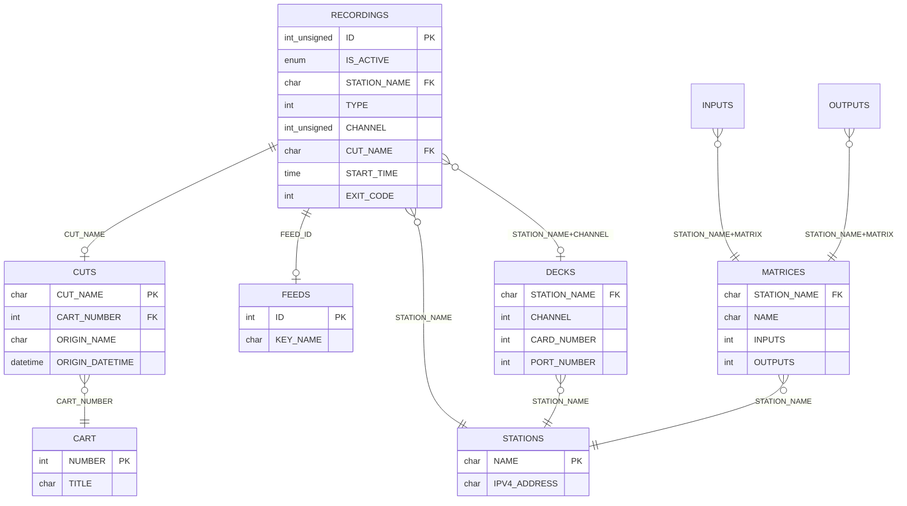
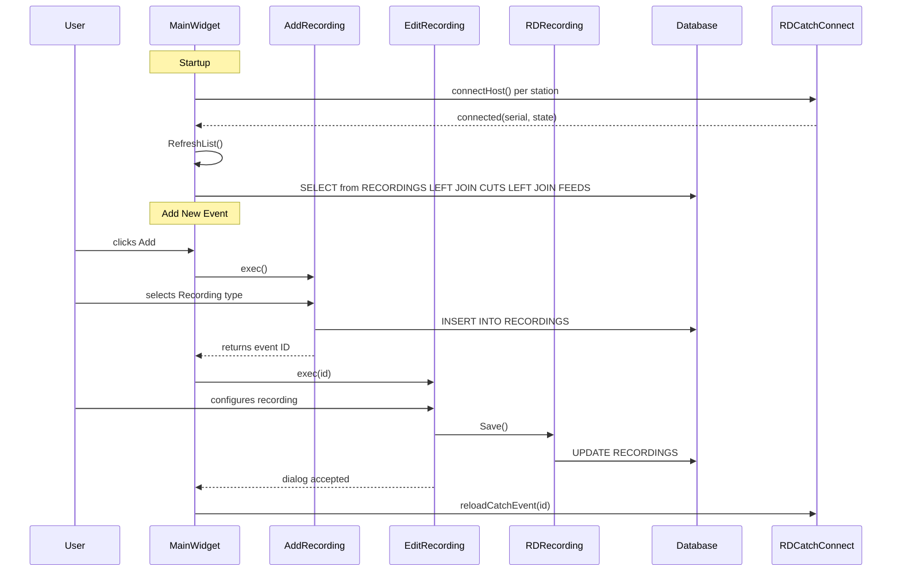
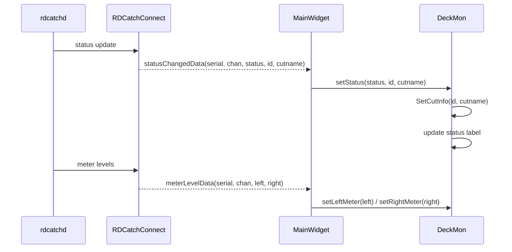
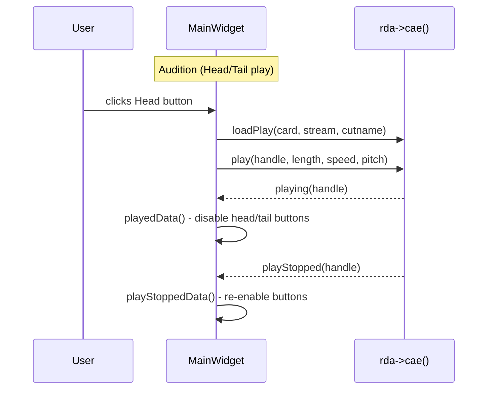
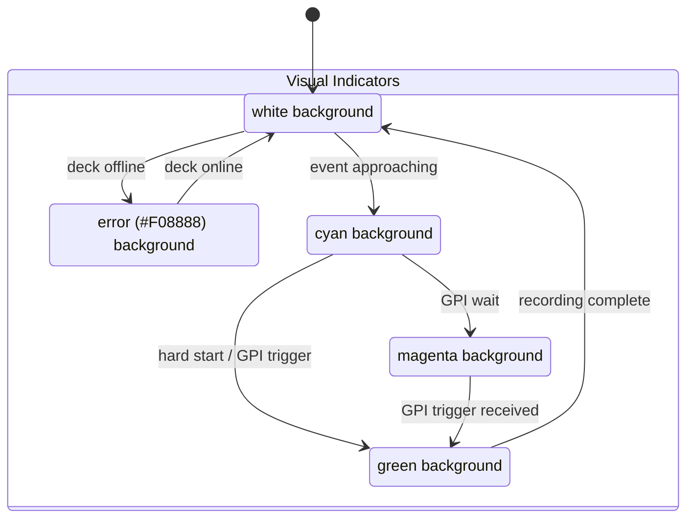

# Semantic Context: CTH (rdcatch)

## Files & Symbols

### Source Files

| File | Type | Symbols | LOC (est) |
|------|------|---------|-----------|
| rdcatch.h | header | CatchConnector, MainWidget | ~300 |
| rdcatch.cpp | source | MainWidget impl | ~1500 |
| deckmon.h | header | DeckMon | ~80 |
| deckmon.cpp | source | DeckMon impl | ~400 |
| edit_recording.h | header | EditRecording | ~120 |
| edit_recording.cpp | source | EditRecording impl | ~800 |
| edit_download.h | header | EditDownload | ~100 |
| edit_download.cpp | source | EditDownload impl | ~600 |
| edit_upload.h | header | EditUpload | ~100 |
| edit_upload.cpp | source | EditUpload impl | ~600 |
| edit_playout.h | header | EditPlayout | ~80 |
| edit_playout.cpp | source | EditPlayout impl | ~400 |
| edit_switchevent.h | header | EditSwitchEvent | ~90 |
| edit_switchevent.cpp | source | EditSwitchEvent impl | ~500 |
| edit_cartevent.h | header | EditCartEvent | ~70 |
| edit_cartevent.cpp | source | EditCartEvent impl | ~350 |
| add_recording.h | header | AddRecording | ~50 |
| add_recording.cpp | source | AddRecording impl | ~200 |
| catch_monitor.h | header | CatchMonitor | ~40 |
| catch_monitor.cpp | source | CatchMonitor impl | ~100 |
| catch_listview.h | header | CatchListView | ~40 |
| catch_listview.cpp | source | CatchListView impl | ~100 |
| list_reports.h | header | ListReports | ~60 |
| list_reports.cpp | source | ListReports impl | ~300 |
| vbox.h | header | VBox | ~30 |
| vbox.cpp | source | VBox impl | ~50 |
| globals.h | header | (global variables) | ~15 |
| colors.h | header | (color constants) | ~10 |

### Symbol Index

| Symbol | Kind | File | Qt Class? |
|--------|------|------|-----------|
| MainWidget | Class | rdcatch.h | Yes (Q_OBJECT) |
| CatchConnector | Class | rdcatch.h | No (helper struct) |
| DeckMon | Class | deckmon.h | Yes (Q_OBJECT) |
| EditRecording | Class | edit_recording.h | Yes (Q_OBJECT) |
| EditDownload | Class | edit_download.h | Yes (Q_OBJECT) |
| EditUpload | Class | edit_upload.h | Yes (Q_OBJECT) |
| EditPlayout | Class | edit_playout.h | Yes (Q_OBJECT) |
| EditSwitchEvent | Class | edit_switchevent.h | Yes (Q_OBJECT) |
| EditCartEvent | Class | edit_cartevent.h | Yes (Q_OBJECT) |
| AddRecording | Class | add_recording.h | Yes (Q_OBJECT) |
| CatchMonitor | Class | catch_monitor.h | No (data class) |
| CatchListView | Class | catch_listview.h | Yes (Q_OBJECT) |
| ListReports | Class | list_reports.h | Yes (Q_OBJECT) |
| VBox | Class | vbox.h | Yes (Q_OBJECT) |

## Class API Surface

### MainWidget [Application Main Window]
- **File:** rdcatch.h / rdcatch.cpp
- **Inherits:** RDWidget
- **Qt Object:** Yes (Q_OBJECT)
- **Constructor:** `MainWidget(RDConfig *c, QWidget *parent=0)`

#### Signals
(none)

#### Slots (private)
| Slot | Parameters | Description |
|------|-----------|-------------|
| resizeData | () | Handle delayed resize |
| connectedData | (int serial, bool state) | Catch daemon connection status change |
| nextEventData | () | Timer-driven display of next scheduled event |
| addData | () | Add new event button handler |
| editData | () | Edit selected event |
| deleteData | () | Delete selected event |
| ripcConnectedData | (bool) | RIPC connection status callback |
| ripcUserData | () | RIPC user authentication callback |
| statusChangedData | (int, unsigned, RDDeck::Status, int, const QString &cutname) | Deck status change notification |
| monitorChangedData | (int serial, unsigned chan, bool state) | Monitor on/off state change |
| deckEventSentData | (int serial, int chan, int number) | Deck event number update |
| scrollButtonData | () | Toggle auto-scroll |
| reportsButtonData | () | Open reports dialog |
| headButtonData | () | Audition head of cut |
| tailButtonData | () | Audition tail of cut |
| stopButtonData | () | Stop audition playback |
| initData | (bool) | Initialization complete callback |
| playedData | (int) | Audition play started |
| playStoppedData | (int) | Audition play stopped |
| meterLevelData | (int, int, int, int) | Audio meter level update |
| abortData | (int) | Abort recording on deck N |
| monitorData | (int) | Toggle monitor on deck N |
| selectionChangedData | (Q3ListViewItem *item) | List selection changed |
| doubleClickedData | (Q3ListViewItem *, const QPoint &, int) | Double-click on event row |
| filterChangedData | (bool state) | Filter checkbox toggled |
| filterActivatedData | (int id) | Filter combo selection changed |
| clockData | () | Clock timer tick (update time display) |
| midnightData | () | Midnight rollover handler |
| eventUpdatedData | (int id) | External event update notification |
| eventPurgedData | (int id) | External event purge notification |
| heartbeatFailedData | (int id) | Catch daemon heartbeat failure |
| quitMainWidget | () | Application quit handler |

#### Protected Methods
| Method | Return | Parameters | Brief |
|--------|--------|-----------|-------|
| closeEvent | void | (QCloseEvent *e) | Window close handler |
| resizeEvent | void | (QResizeEvent *e) | Window resize handler |

#### Private Methods
| Method | Return | Parameters | Brief |
|--------|--------|-----------|-------|
| ShowEvent | void | (...) | Show event details |
| ShowNextEvents | void | () | Display upcoming events |
| AddRecord | void | (...) | Add a record to the list |
| ProcessNewRecords | void | (...) | Process newly added records |
| EnableScroll | void | (bool) | Enable/disable auto-scroll |
| UpdateScroll | void | () | Update scroll state |
| RefreshSql | QString | () | Build SQL query for event list |
| RefreshRow | void | (...) | Refresh single row data |
| RefreshList | void | () | Refresh entire event list |
| RefreshLine | void | (...) | Refresh single line display |
| UpdateExitCode | void | (...) | Update exit code display |
| DisplayExitCode | QString | (...) | Format exit code for display |
| GetSourceName | QString | (...) | Get audio source name |
| GetDestinationName | QString | (...) | Get audio destination name |
| GetItem | Q3ListViewItem* | (...) | Get list item by ID |
| GetMonitor | int | (...) | Get monitor index |
| GetConnection | int | (...) | Get connection index |
| GeometryFile | QString | () | Get geometry settings file path |
| LoadGeometry | void | () | Load window geometry from file |
| SaveGeometry | void | () | Save window geometry to file |

#### Key Fields
| Field | Type | Purpose |
|-------|------|---------|
| catch_monitor | vector<CatchMonitor*> | Collection of deck monitors |
| catch_monitor_view | vector<DeckMon*> | Visual deck monitor widgets |
| catch_connect | vector<CatchConnector> | Catch daemon connections |
| catch_recordings_list | CatchListView* | Main event list widget |
| catch_filter | RDStationListModel* | Station filter model |
| catch_scroll | bool | Auto-scroll state |
| catch_time_offset | int | Time offset for display |

---

### CatchConnector [Value Object]
- **File:** rdcatch.h
- **Inherits:** (none)
- **Qt Object:** No

#### Public Methods
| Method | Return | Parameters | Brief |
|--------|--------|-----------|-------|
| CatchConnector | (ctor) | () | Default constructor |
| connector | RDCatchConnect* | () | Get catch connection pointer |
| stationName | QString | () | Get station name |

#### Fields
| Field | Type | Purpose |
|-------|------|---------|
| chan | unsigned | Channel number |
| mon_id | int | Monitor ID |
| catch_connect | RDCatchConnect* | Pointer to catch connection |
| catch_station_name | QString | Station name |

---

### DeckMon [UI Component - Deck Monitor Widget]
- **File:** deckmon.h / deckmon.cpp
- **Inherits:** RDFrame
- **Qt Object:** Yes (Q_OBJECT)
- **Constructor:** `DeckMon(QString station, unsigned channel, QWidget *parent=0)`

#### Signals
| Signal | Parameters | Description |
|--------|-----------|-------------|
| monitorClicked | () | Monitor button was clicked |
| abortClicked | () | Abort button was clicked |

#### Public Slots
| Slot | Parameters | Description |
|------|-----------|-------------|
| setMonitor | (bool state) | Set monitor on/off |
| setStatus | (RDDeck::Status status, int id, const QString &cutname) | Update deck status display |
| setEvent | (int number) | Set current event number |
| setLeftMeter | (int level) | Update left audio meter |
| setRightMeter | (int level) | Update right audio meter |

#### Public Methods
| Method | Return | Parameters | Brief |
|--------|--------|-----------|-------|
| enableMonitorButton | void | (bool state) | Enable/disable monitor button |

#### Private Slots
| Slot | Parameters | Description |
|------|-----------|-------------|
| monitorButtonData | () | Internal monitor button click handler |
| abortButtonData | () | Internal abort button click handler |
| eventResetData | () | Reset event display timer |

#### Private Methods
| Method | Return | Parameters | Brief |
|--------|--------|-----------|-------|
| SetCutInfo | void | (int id, const QString &cutname) | Display cut info on deck |

---

### EditRecording [Dialog - Recording Event Editor]
- **File:** edit_recording.h / edit_recording.cpp
- **Inherits:** RDDialog
- **Qt Object:** Yes (Q_OBJECT)
- **Constructor:** `EditRecording(int id, std::vector<int> *adds, QString *filter, QWidget *parent=0)`

#### Private Slots
| Slot | Parameters | Description |
|------|-----------|-------------|
| activateStationData | (int, bool use_temp=true) | Station selection change handler |
| startTypeClickedData | (int id) | Start type radio button clicked |
| endTypeClickedData | (int id) | End type radio button clicked |
| selectCutData | () | Open cut selection dialog |
| autotrimToggledData | (bool state) | Auto-trim checkbox toggled |
| normalizeToggledData | (bool state) | Normalize checkbox toggled |
| saveasData | () | Save As button handler |
| okData | () | OK button handler |
| cancelData | () | Cancel button handler |

#### Private Methods
| Method | Return | Parameters | Brief |
|--------|--------|-----------|-------|
| PopulateDecks | void | (QComboBox *box) | Fill deck combo with available decks |
| Save | void | () | Persist recording settings to DB |
| CheckEvent | bool | (bool include_myself) | Check for scheduling conflicts |
| GetSourceName | QString | (int input) | Get audio source name by input number |
| GetSource | int | () | Get currently selected source |
| GetLocation | QString | (int *chan) const | Get station/channel location string |

#### Key Fields
| Field | Type | Purpose |
|-------|------|---------|
| edit_recording | RDRecording* | Recording data object |
| edit_deck | RDDeck* | Deck configuration object |
| edit_starttype_group | QButtonGroup* | Start trigger type (hard/GPI) |
| edit_endtype_group | QButtonGroup* | End trigger type (hard/GPI/length) |
| edit_channels_box | QComboBox* | Mono/stereo selection |
| edit_autotrim_box | QCheckBox* | Auto-trim enable |
| edit_normalize_box | QCheckBox* | Normalize enable |
| edit_multirec_box | QCheckBox* | Allow multiple recordings |

---

### EditDownload [Dialog - Download Event Editor]
- **File:** edit_download.h / edit_download.cpp
- **Inherits:** RDDialog
- **Qt Object:** Yes (Q_OBJECT)
- **Constructor:** `EditDownload(int id, std::vector<int> *adds, QString *filter, QWidget *parent=0)`

#### Private Slots
| Slot | Parameters | Description |
|------|-----------|-------------|
| urlChangedData | (const QString &str) | URL text changed handler |
| selectCartData | () | Open cart selection dialog |
| autotrimToggledData | (bool state) | Auto-trim checkbox toggled |
| normalizeToggledData | (bool state) | Normalize checkbox toggled |
| saveasData | () | Save As button handler |
| okData | () | OK button handler |
| cancelData | () | Cancel button handler |

#### Private Methods
| Method | Return | Parameters | Brief |
|--------|--------|-----------|-------|
| Save | void | () | Persist download settings to DB |
| CheckEvent | bool | (bool include_myself) | Check for scheduling conflicts |

#### Key Fields
| Field | Type | Purpose |
|-------|------|---------|
| edit_recording | RDRecording* | Recording/event data object |
| edit_url_edit | QLineEdit* | Download URL |
| edit_username_edit | QLineEdit* | Auth username |
| edit_password_edit | QLineEdit* | Auth password |
| edit_metadata_box | QCheckBox* | Update metadata from download |

---

### EditUpload [Dialog - Upload Event Editor]
- **File:** edit_upload.h / edit_upload.cpp
- **Inherits:** RDDialog
- **Qt Object:** Yes (Q_OBJECT)
- **Constructor:** `EditUpload(int id, std::vector<int> *adds, QString *filter, QWidget *parent=0)`

#### Private Slots
| Slot | Parameters | Description |
|------|-----------|-------------|
| stationChangedData | (const QString &str) | Station combo changed |
| urlChangedData | (const QString &str) | URL text changed |
| selectCartData | () | Open cart selection dialog |
| setFormatData | () | Open format settings dialog |
| normalizeCheckData | (bool state) | Normalize checkbox toggled |
| saveasData | () | Save As button handler |
| okData | () | OK button handler |
| cancelData | () | Cancel button handler |

#### Private Methods
| Method | Return | Parameters | Brief |
|--------|--------|-----------|-------|
| Save | void | () | Persist upload settings to DB |
| CheckEvent | bool | (bool include_myself) | Check for scheduling conflicts |
| CheckFormat | bool | () | Validate audio format settings |

#### Key Fields
| Field | Type | Purpose |
|-------|------|---------|
| edit_recording | RDRecording* | Recording/event data object |
| edit_settings | RDSettings | Audio format settings |
| edit_feed_box | QComboBox* | Podcast feed selection |
| edit_format_edit | QLineEdit* | Format display string |

---

### EditPlayout [Dialog - Playout Event Editor]
- **File:** edit_playout.h / edit_playout.cpp
- **Inherits:** RDDialog
- **Qt Object:** Yes (Q_OBJECT)
- **Constructor:** `EditPlayout(int id, std::vector<int> *adds, QString *filter, QWidget *parent=0)`

#### Private Slots
| Slot | Parameters | Description |
|------|-----------|-------------|
| activateStationData | (int, bool use_temp=true) | Station selection change |
| selectCutData | () | Open cut selection dialog |
| saveasData | () | Save As button handler |
| okData | () | OK button handler |
| cancelData | () | Cancel button handler |

#### Private Methods
| Method | Return | Parameters | Brief |
|--------|--------|-----------|-------|
| PopulateDecks | void | (QComboBox *box) | Fill deck combo |
| Save | void | () | Persist playout settings |
| GetLocation | QString | (int *chan) const | Get station/channel location |

---

### EditSwitchEvent [Dialog - Switch Event Editor]
- **File:** edit_switchevent.h / edit_switchevent.cpp
- **Inherits:** RDDialog
- **Qt Object:** Yes (Q_OBJECT)
- **Constructor:** `EditSwitchEvent(int id, std::vector<int> *adds, QWidget *parent=0)`

#### Private Slots
| Slot | Parameters | Description |
|------|-----------|-------------|
| activateStationData | (const QString &str) | Station combo changed |
| activateMatrixData | (const QString &str) | Matrix combo changed |
| activateInputData | (const QString &str) | Input combo changed |
| activateOutputData | (const QString &str) | Output combo changed |
| inputChangedData | (int value) | Input spin changed |
| outputChangedData | (int value) | Output spin changed |
| saveasData | () | Save As button handler |
| okData | () | OK button handler |
| cancelData | () | Cancel button handler |

#### Private Methods
| Method | Return | Parameters | Brief |
|--------|--------|-----------|-------|
| Save | void | () | Persist switch event settings |
| GetMatrix | int | () | Get selected matrix ID |
| GetSource | int | () | Get selected source |
| GetDestination | int | () | Get selected destination |
| CheckEvent | bool | (bool include_myself) | Check for scheduling conflicts |

#### Key Fields
| Field | Type | Purpose |
|-------|------|---------|
| edit_matrix | RDMatrix* | Matrix configuration object |
| edit_matrix_box | QComboBox* | Matrix selection combo |
| edit_input_box | QComboBox* | Input selection combo |
| edit_output_box | QComboBox* | Output selection combo |

---

### EditCartEvent [Dialog - Cart/Macro Event Editor]
- **File:** edit_cartevent.h / edit_cartevent.cpp
- **Inherits:** RDDialog
- **Qt Object:** Yes (Q_OBJECT)
- **Constructor:** `EditCartEvent(int id, std::vector<int> *adds, QWidget *parent=0)`

#### Private Slots
| Slot | Parameters | Description |
|------|-----------|-------------|
| selectCartData | () | Open cart selection dialog |
| saveasData | () | Save As button handler |
| okData | () | OK button handler |
| cancelData | () | Cancel button handler |

#### Private Methods
| Method | Return | Parameters | Brief |
|--------|--------|-----------|-------|
| Save | void | () | Persist cart event settings |
| CheckEvent | bool | (bool include_myself) | Check for scheduling conflicts |

#### Key Fields
| Field | Type | Purpose |
|-------|------|---------|
| edit_cart | RDCart* | Cart data object |
| edit_recording | RDRecording* | Event data object |

---

### AddRecording [Dialog - New Event Type Selector]
- **File:** add_recording.h / add_recording.cpp
- **Inherits:** RDDialog
- **Qt Object:** Yes (Q_OBJECT)
- **Constructor:** `AddRecording(int id, QString *filter, QWidget *parent=0)`

#### Private Slots
| Slot | Parameters | Description |
|------|-----------|-------------|
| recordingData | () | Create new Recording event |
| playoutData | () | Create new Playout event |
| downloadData | () | Create new Download event |
| uploadData | () | Create new Upload event |
| macroData | () | Create new Macro/Cart event |
| switchData | () | Create new Switch event |
| cancelData | () | Cancel dialog |

---

### CatchMonitor [Value Object - Deck Monitor Data]
- **File:** catch_monitor.h / catch_monitor.cpp
- **Inherits:** (none)
- **Qt Object:** No

#### Public Methods
| Method | Return | Parameters | Brief |
|--------|--------|-----------|-------|
| CatchMonitor | (ctor) | () | Default constructor |
| CatchMonitor | (ctor) | (copy) | Copy constructor |
| deckMon | DeckMon* | () | Get DeckMon widget pointer |
| setDeckMon | void | (DeckMon*) | Set DeckMon widget pointer |
| serialNumber | int | () | Get serial number |
| setSerialNumber | void | (int) | Set serial number |
| channelNumber | unsigned | () | Get channel number |
| setChannelNumber | void | (unsigned) | Set channel number |

---

### CatchListView [UI Component - Custom List View]
- **File:** catch_listview.h / catch_listview.cpp
- **Inherits:** RDListView
- **Qt Object:** Yes (Q_OBJECT)

#### Private Slots
| Slot | Parameters | Description |
|------|-----------|-------------|
| aboutToShowData | () | Context menu about to show |
| editAudioMenuData | () | Edit audio from context menu |

#### Protected Methods
| Method | Return | Parameters | Brief |
|--------|--------|-----------|-------|
| contentsMousePressEvent | void | (QMouseEvent *e) | Right-click context menu handler |
| contentsMouseDoubleClickEvent | void | (QMouseEvent *e) | Double-click handler |

---

### ListReports [Dialog - Report Generator]
- **File:** list_reports.h / list_reports.cpp
- **Inherits:** RDDialog
- **Qt Object:** Yes (Q_OBJECT)
- **Constructor:** `ListReports(bool active_only, bool today_only, int dow, QWidget *parent=0)`

#### Private Slots
| Slot | Parameters | Description |
|------|-----------|-------------|
| generateData | () | Generate selected report |
| closeData | () | Close dialog |

#### Private Methods
| Method | Return | Parameters | Brief |
|--------|--------|-----------|-------|
| GenerateEventReport | void | (QString *report) | Generate event listing report |
| GenerateXloadReport | void | (QString *report) | Generate upload/download report |
| GetSourceName | QString | (const QString &station, int matrix, int input) | Get source name |
| GetDestinationName | QString | (const QString &station, int matrix, int output) | Get destination name |

---

### VBox [UI Component - Vertical Box Layout]
- **File:** vbox.h / vbox.cpp
- **Inherits:** (none, but has Q_OBJECT)
- **Qt Object:** Yes (Q_OBJECT)

#### Public Methods
| Method | Return | Parameters | Brief |
|--------|--------|-----------|-------|
| addWidget | void | (QWidget*) | Add widget to vertical layout |
| setSpacing | void | (int) | Set spacing between widgets |

#### Public Slots
| Slot | Parameters | Description |
|------|-----------|-------------|
| setGeometry | (int x, int y, int w, int h) | Set geometry and reflow children |
| setGeometry | (const QRect &r) | Set geometry (overload) |

---

### Global Variables (globals.h)
| Variable | Type | Purpose |
|----------|------|---------|
| rdaudioport_conf | RDAudioPort* | Audio port configuration |
| catch_cart_dialog | RDCartDialog* | Shared cart selection dialog |
| catch_audition_card | int | Audition sound card number |
| catch_audition_port | int | Audition sound port number |

## Data Model

### Table: RECORDINGS (primary table)

| Column | Type | Constraints / Default |
|--------|------|----------------------|
| ID | int unsigned | PRIMARY KEY AUTO_INCREMENT |
| IS_ACTIVE | enum('N','Y') | default 'Y' |
| STATION_NAME | char(64) | NOT NULL, indexed |
| TYPE | int | default 0 (Recording=0, Playout=1, Download=2, Upload=3, MacroEvent=4, SwitchEvent=5) |
| CHANNEL | int unsigned | NOT NULL |
| CUT_NAME | char(12) | NOT NULL |
| SUN | enum('N','Y') | default 'N' |
| MON | enum('N','Y') | default 'N' |
| TUE | enum('N','Y') | default 'N' |
| WED | enum('N','Y') | default 'N' |
| THU | enum('N','Y') | default 'N' |
| FRI | enum('N','Y') | default 'N' |
| SAT | enum('N','Y') | default 'N' |
| DESCRIPTION | char(64) | |
| START_TYPE | int unsigned | default 0 |
| START_TIME | time | |
| START_LENGTH | int | default 0 |
| START_MATRIX | int | default -1 |
| START_LINE | int | default -1 |
| START_OFFSET | int | default 0 |
| END_TYPE | int | default 0 |
| END_TIME | time | |
| END_LENGTH | int | default 0 |
| END_MATRIX | int | default -1 |
| END_LINE | int | default -1 |
| LENGTH | int unsigned | |
| START_GPI | int | default -1 |
| END_GPI | int | default -1 |
| ALLOW_MULT_RECS | enum('N','Y') | default 'N' |
| MAX_GPI_REC_LENGTH | int unsigned | default 3600000 |
| TRIM_THRESHOLD | int | |
| NORMALIZE_LEVEL | int | default -1300 |
| STARTDATE_OFFSET | int unsigned | default 0 |
| ENDDATE_OFFSET | int unsigned | default 0 |
| EVENTDATE_OFFSET | int | default 0 |
| FORMAT | int | default 0 |
| SAMPRATE | int unsigned | default 44100 |
| CHANNELS | int | default 2 |
| BITRATE | int | default 0 |
| QUALITY | int | default 0 |
| MACRO_CART | int | default -1 |
| SWITCH_INPUT | int | default -1 |
| SWITCH_OUTPUT | int | default -1 |
| EXIT_CODE | int | default 0 |
| EXIT_TEXT | text | |
| ONE_SHOT | enum('N','Y') | default 'N' |
| URL | char(255) | |
| URL_USERNAME | char(64) | |
| URL_PASSWORD | char(64) | |
| ENABLE_METADATA | enum('N','Y') | default 'N' |
| FEED_ID | int | default -1 |

- **Primary Key:** ID
- **Index:** STATION_NAME_IDX (STATION_NAME)
- **CRUD Classes:** RDRecording (via LIB, full CRUD), MainWidget (SELECT, INSERT, DELETE), EditRecording/EditDownload/EditUpload/EditPlayout/EditSwitchEvent/EditCartEvent (SELECT for conflict check)

### Table: DECKS (referenced, defined in LIB)

Used for: listing available record/playout decks per station.

| Key Columns Used | Purpose |
|-----------------|---------|
| STATION_NAME | Filter by station |
| CHANNEL | Deck channel number (1-9=record, 129-137=playout) |
| CARD_NUMBER | Audio card number (-1 = not configured) |
| PORT_NUMBER | Audio port number (-1 = not configured) |

- **CRUD:** SELECT only (read deck configurations)
- **Used in:** rdcatch.cpp, edit_recording.cpp, edit_playout.cpp, add_recording.cpp, list_reports.cpp

### Table: STATIONS (referenced, defined in LIB)

Used for: populating station selection combos, establishing catch connections.

| Key Columns Used | Purpose |
|-----------------|---------|
| NAME | Station name (excludes "DEFAULT") |
| IPV4_ADDRESS | Station IP address for catch connections |

- **CRUD:** SELECT only
- **Used in:** rdcatch.cpp, edit_cartevent.cpp, edit_download.cpp, edit_switchevent.cpp, edit_upload.cpp

### Table: CUTS (referenced, defined in LIB)

Used for: JOIN with RECORDINGS to get cut origin info.

| Key Columns Used | Purpose |
|-----------------|---------|
| CUT_NAME | Cut identifier (JOIN key) |
| ORIGIN_NAME | Origin station name |
| ORIGIN_DATETIME | Origin timestamp |
| CART_NUMBER | Parent cart number |

- **CRUD:** SELECT only (via JOIN)
- **Used in:** rdcatch.cpp (RefreshSql), deckmon.cpp (SetCutInfo)

### Table: CART (referenced, defined in LIB)

Used for: getting cart title information from cut.

| Key Columns Used | Purpose |
|-----------------|---------|
| NUMBER | Cart number (JOIN key) |
| TITLE | Cart title |

- **CRUD:** SELECT only
- **Used in:** deckmon.cpp (SetCutInfo)

### Table: MATRICES (referenced, defined in LIB)

Used for: populating matrix selection in switch event editor.

| Key Columns Used | Purpose |
|-----------------|---------|
| STATION_NAME | Filter by station |
| NAME | Matrix display name |
| INPUTS | Input count |
| OUTPUTS | Output count |

- **CRUD:** SELECT only
- **Used in:** edit_switchevent.cpp

### Table: INPUTS / OUTPUTS (referenced, defined in LIB)

Used for: populating input/output combos and resolving names.

| Key Columns Used | Purpose |
|-----------------|---------|
| STATION_NAME | Filter by station |
| MATRIX | Filter by matrix |
| NUMBER | Input/output number |
| NAME | Input/output display name |

- **CRUD:** SELECT only
- **Used in:** rdcatch.cpp, edit_recording.cpp, edit_switchevent.cpp, list_reports.cpp

### Table: FEEDS (referenced, defined in LIB)

Used for: populating podcast feed selection in upload editor.

| Key Columns Used | Purpose |
|-----------------|---------|
| ID | Feed ID (JOIN key) |
| KEY_NAME | Feed display name |

- **CRUD:** SELECT only
- **Used in:** rdcatch.cpp (RefreshSql JOIN), edit_upload.cpp

### ERD



## Reactive Architecture

### Signal/Slot Connections (MainWidget)

| # | Sender | Signal | Receiver | Slot | File:Line |
|---|--------|--------|----------|------|-----------|
| 1 | rda->ripc() | connected(bool) | this | ripcConnectedData(bool) | rdcatch.cpp:180 |
| 2 | rda | userChanged() | this | ripcUserData() | rdcatch.cpp:182 |
| 3 | rda->cae() | isConnected(bool) | this | initData(bool) | rdcatch.cpp:188 |
| 4 | rda->cae() | playing(int) | this | playedData(int) | rdcatch.cpp:189 |
| 5 | rda->cae() | playStopped(int) | this | playStoppedData(int) | rdcatch.cpp:190 |
| 6 | QSignalMapper(abort) | mapped(int) | this | abortData(int) | rdcatch.cpp:203 |
| 7 | QSignalMapper(monitor) | mapped(int) | this | monitorData(int) | rdcatch.cpp:205 |
| 8 | CatchConnector | statusChanged(...) | this | statusChangedData(...) | rdcatch.cpp:213 |
| 9 | CatchConnector | monitorChanged(int,unsigned,bool) | this | monitorChangedData(...) | rdcatch.cpp:217 |
| 10 | CatchConnector | connected(int,bool) | this | connectedData(int,bool) | rdcatch.cpp:220 |
| 11 | CatchConnector | meterLevel(int,int,int,int) | this | meterLevelData(...) | rdcatch.cpp:223 |
| 12 | CatchConnector | eventUpdated(int) | this | eventUpdatedData(int) | rdcatch.cpp:226 |
| 13 | CatchConnector | eventPurged(int) | this | eventPurgedData(int) | rdcatch.cpp:229 |
| 14 | CatchConnector | deckEventSent(int,int,int) | this | deckEventSentData(...) | rdcatch.cpp:232 |
| 15 | CatchConnector | heartbeatFailed(int) | this | heartbeatFailedData(int) | rdcatch.cpp:235 |
| 16 | DeckMon | abortClicked() | mapper | map() | rdcatch.cpp:269 |
| 17 | DeckMon | monitorClicked() | mon_mapper | map() | rdcatch.cpp:273 |
| 18 | catch_show_active_box | toggled(bool) | this | filterChangedData(bool) | rdcatch.cpp:292 |
| 19 | catch_show_today_box | toggled(bool) | this | filterChangedData(bool) | rdcatch.cpp:299 |
| 20 | catch_dow_box | activated(int) | this | filterActivatedData(int) | rdcatch.cpp:315 |
| 21 | catch_type_box | activated(int) | this | filterActivatedData(int) | rdcatch.cpp:318 |
| 22 | catch_recordings_list | selectionChanged(Q3ListViewItem*) | this | selectionChangedData(...) | rdcatch.cpp:341 |
| 23 | catch_recordings_list | doubleClicked(...) | this | doubleClickedData(...) | rdcatch.cpp:343 |
| 24 | catch_add_button | clicked() | this | addData() | rdcatch.cpp:422 |
| 25 | catch_edit_button | clicked() | this | editData() | rdcatch.cpp:430 |
| 26 | catch_delete_button | clicked() | this | deleteData() | rdcatch.cpp:438 |
| 27 | catch_scroll_button | clicked() | this | scrollButtonData() | rdcatch.cpp:446 |
| 28 | catch_reports_button | clicked() | this | reportsButtonData() | rdcatch.cpp:454 |
| 29 | catch_clock_timer | timeout() | this | clockData() | rdcatch.cpp:463 |
| 30 | catch_head_button | clicked() | this | headButtonData() | rdcatch.cpp:471 |
| 31 | catch_tail_button | clicked() | this | tailButtonData() | rdcatch.cpp:478 |
| 32 | catch_stop_button | clicked() | this | stopButtonData() | rdcatch.cpp:486 |
| 33 | catch_close_button | clicked() | this | quitMainWidget() | rdcatch.cpp:497 |
| 34 | catch_next_timer | timeout() | this | nextEventData() | rdcatch.cpp:503 |
| 35 | catch_midnight_timer | timeout() | this | midnightData() | rdcatch.cpp:509 |
| 36 | timer (resize) | timeout() | this | resizeData() | rdcatch.cpp:528 |

### Signal/Slot Connections (DeckMon)

| # | Sender | Signal | Receiver | Slot | File:Line |
|---|--------|--------|----------|------|-----------|
| 37 | mon_monitor_button | clicked() | this | monitorButtonData() | deckmon.cpp:73 |
| 38 | mon_abort_button | clicked() | this | abortButtonData() | deckmon.cpp:83 |
| 39 | mon_event_timer | timeout() | this | eventResetData() | deckmon.cpp:101 |

### Emit Statements

| # | Class | Signal Emitted | Trigger | File:Line |
|---|-------|---------------|---------|-----------|
| 1 | DeckMon | monitorClicked() | monitorButtonData slot | deckmon.cpp:241 |
| 2 | DeckMon | abortClicked() | abortButtonData slot | deckmon.cpp:247 |

### Key Sequence Diagrams







### Cross-Artifact Dependencies

| External Class | From Artifact | Used In Files | Purpose |
|---------------|---------------|---------------|---------|
| RDRecording | LIB | edit_recording.cpp, edit_download.cpp, edit_upload.cpp, edit_playout.cpp, edit_switchevent.cpp, edit_cartevent.cpp | Recording event data model (Active Record) |
| RDDeck | LIB | edit_recording.cpp, edit_download.cpp, edit_upload.cpp, edit_playout.cpp, edit_switchevent.cpp, deckmon.cpp | Deck configuration data model |
| RDCatchConnect | LIB | rdcatch.cpp | Network connection to rdcatchd daemon |
| RDCart | LIB | edit_cartevent.cpp | Cart data model |
| RDMatrix | LIB | edit_switchevent.cpp | Switcher matrix configuration |
| RDSettings | LIB | edit_upload.cpp | Audio format settings |
| RDWidget | LIB | rdcatch.h | Base widget class for main window |
| RDDialog | LIB | edit_recording.h, edit_download.h, edit_upload.h, edit_playout.h, edit_switchevent.h, edit_cartevent.h, add_recording.h, list_reports.h | Base dialog class |
| RDFrame | LIB | deckmon.h | Base frame widget |
| RDListView / RDListViewItem | LIB | catch_listview.h, rdcatch.cpp | Custom list view widget |
| RDPlayMeter | LIB | deckmon.h | Audio level meter widget |
| RDCut | LIB | rdcatch.cpp | Cut metadata access |
| RDCartDialog | LIB | globals.h | Shared cart selection dialog |
| RDAudioPort | LIB | globals.h | Audio port configuration |
| RDStationListModel | LIB | rdcatch.h | Station filter model |
| RDApplication (rda) | LIB | rdcatch.cpp | Application singleton (ripc, cae, station, config, user) |

## Business Rules

### Rule: Application initialization failure is fatal
- **Source:** rdcatch.cpp:101-103
- **Trigger:** Application startup
- **Condition:** `!rda->open(&err_msg)`
- **Action:** Show critical error dialog and exit(1)
- **Gherkin:**
  ```gherkin
  Scenario: Application fails to initialize
    Given the rdcatch application is starting
    When the RDApplication cannot be opened
    Then a critical error dialog is shown with the error message
    And the application exits with code 1
  ```

### Rule: Unknown command line options are rejected
- **Source:** rdcatch.cpp:114-119
- **Trigger:** Application startup, command line parsing
- **Condition:** `!rda->cmdSwitch()->processed(i)`
- **Action:** Show critical error dialog and exit(2)
- **Gherkin:**
  ```gherkin
  Scenario: Unknown command line option provided
    Given the rdcatch application is starting
    When an unrecognized command line option is provided
    Then a critical error dialog shows "Unknown command option: <option>"
    And the application exits with code 2
  ```

### Rule: Active events cannot be edited
- **Source:** rdcatch.cpp:682-693
- **Trigger:** User clicks Edit on an event
- **Condition:** Event exit code is Downloading, Uploading, RecordActive, PlayActive, or Waiting
- **Action:** Show information dialog "You cannot edit an active event!" and return
- **Gherkin:**
  ```gherkin
  Scenario: Attempt to edit an active event
    Given a catch event is currently active (recording, playing, downloading, uploading, or waiting)
    When the user selects the event and clicks Edit
    Then an information dialog shows "You cannot edit an active event!"
    And the edit action is cancelled
  ```

### Rule: Delete requires confirmation
- **Source:** rdcatch.cpp:767-774
- **Trigger:** User clicks Delete on an event
- **Condition:** Always (shows warning confirmation)
- **Action:** Show Yes/No confirmation dialog; proceed only if Yes
- **Gherkin:**
  ```gherkin
  Scenario: Delete event with confirmation
    Given a catch event is selected in the list
    When the user clicks Delete
    Then a confirmation dialog asks "Are you sure you want to delete event <description>?"
    And the event is deleted only if the user clicks Yes
  ```

### Rule: RIPC connection is required
- **Source:** rdcatch.cpp:798-803
- **Trigger:** RIPC connection state change
- **Condition:** `!state` (disconnected)
- **Action:** Show warning "Unable to connect to ripcd!" and exit(0)
- **Gherkin:**
  ```gherkin
  Scenario: RIPC daemon connection lost
    Given the rdcatch application is running
    When the connection to ripcd fails
    Then a warning dialog shows "Unable to connect to ripcd!"
    And the application exits
  ```

### Rule: CAE connection is required
- **Source:** rdcatch.cpp:1016-1023
- **Trigger:** CAE connection state change
- **Condition:** `!state` (disconnected)
- **Action:** Show warning "Unable to connect to Core AudioEngine" and exit(1)
- **Gherkin:**
  ```gherkin
  Scenario: CAE daemon connection lost
    Given the rdcatch application is running
    When the connection to the Core Audio Engine fails
    Then a warning dialog shows "Unable to connect to Core AudioEngine"
    And the application exits with code 1
  ```

### Rule: Heartbeat failure shows warning
- **Source:** rdcatch.cpp:1142-1146
- **Trigger:** heartbeatFailedData signal from CatchConnector
- **Condition:** Catch daemon heartbeat timeout
- **Action:** Show warning "Control connection timed out to host <hostname>"
- **Gherkin:**
  ```gherkin
  Scenario: Catch daemon heartbeat failure
    Given rdcatch is connected to a catch daemon on a remote station
    When the heartbeat check times out
    Then a warning dialog shows "Control connection timed out to host <hostname>"
  ```

### Rule: Recording requires a cut assignment
- **Source:** edit_recording.cpp:931-935
- **Trigger:** User clicks OK in recording event editor
- **Condition:** `edit_cutname.isEmpty()`
- **Action:** Show warning "You must assign a record cut!" and reject
- **Gherkin:**
  ```gherkin
  Scenario: Recording event without cut assignment
    Given the user is editing a Recording event
    When no record cut has been assigned
    And the user clicks OK
    Then a warning shows "You must assign a record cut!"
    And the dialog remains open
  ```

### Rule: Recording time window validation (multiple sub-rules)
- **Source:** edit_recording.cpp:941-1006
- **Trigger:** User clicks OK in recording event editor
- **Conditions and Actions:**
  - GPI start window cannot end before it begins (start >= end)
  - Recording cannot end before it begins (hard start >= hard end)
  - End GPI window cannot end before it begins
  - Start GPI matrix must exist
  - Start GPI line must exist
  - End GPI matrix must exist
  - End GPI line must exist
- **Gherkin:**
  ```gherkin
  Scenario: GPI start window validation
    Given the user configures a GPI-triggered recording
    When the start window end time is before the start window begin time
    Then a warning shows "The start GPI window cannot end before it begins!"

  Scenario: Recording end before start
    Given the user configures a hard-start, hard-end recording
    When the end time is before or equal to the start time
    Then a warning shows "The recording cannot end before it begins!"

  Scenario: Invalid GPI matrix
    Given the user configures a GPI-triggered recording
    When the specified GPI matrix does not exist
    Then a warning shows "The start GPI matrix doesn't exist!"
  ```

### Rule: Duplicate event prevention
- **Source:** edit_recording.cpp:1059-1107, edit_download.cpp:592, edit_upload.cpp:667, edit_cartevent.cpp:394, edit_switchevent.cpp:578
- **Trigger:** User clicks OK or Save As on any event editor
- **Condition:** Another event exists with same station, type, start time, and (for recording) channel
- **Action:** Show warning "An event with these parameters already exists!" and reject
- **Gherkin:**
  ```gherkin
  Scenario: Prevent duplicate events
    Given an event already exists for station X, type Recording, at 10:00:00
    When the user tries to create another event with the same parameters
    Then a warning shows "An event with these parameters already exists!"
    And the save is rejected
  ```

### Rule: Download/Upload URL validation
- **Source:** edit_download.cpp:497-519, edit_upload.cpp:515-544
- **Trigger:** User clicks OK on download/upload event editor
- **Conditions:**
  - URL cannot be relative or end with "/"
  - Protocol must be one of: ftp, ftps, http, https, file, scp, sftp (download); ftp, ftps, file, scp, sftp (upload)
  - File protocol requires a username
- **Gherkin:**
  ```gherkin
  Scenario: Invalid download URL
    Given the user is editing a Download event
    When the URL is relative or ends with "/"
    Then a warning shows "The URL is invalid!"

  Scenario: Unsupported protocol
    Given the user enters a URL with an unsupported protocol
    When they click OK
    Then a warning shows "Unsupported URL protocol!"

  Scenario: File protocol without username
    Given the user enters a file:// URL
    When no username is specified
    Then a warning shows "You must specify a username!"
  ```

### Rule: Upload format must be supported on target host
- **Source:** edit_upload.cpp:439-444, 517-520
- **Trigger:** Station change or OK click in upload editor
- **Condition:** Selected export format is not supported on the selected station
- **Action:** Show warning about unsupported format
- **Gherkin:**
  ```gherkin
  Scenario: Unsupported upload format
    Given the user is editing an Upload event
    When the selected audio format is not supported on the target host
    Then a warning shows "The currently selected export format is unsupported on host <hostname>!"
  ```

### Rule: Invalid cart rejection
- **Source:** edit_cartevent.cpp:330-334
- **Trigger:** User clicks OK on cart/macro event editor
- **Condition:** `!edit_cart->exists()`
- **Action:** Show information "That cart doesn't exist!" and reject
- **Gherkin:**
  ```gherkin
  Scenario: Non-existent cart specified
    Given the user is editing a Cart/Macro event
    When the specified cart number does not exist in the database
    Then an information dialog shows "That cart doesn't exist!"
  ```

### State Machines

#### Deck Status State Machine



#### Event Exit Code State Machine

```mermaid
stateDiagram-v2
    [*] --> Ok : successful completion
    [*] --> Short : recording too short
    [*] --> LowLevel : audio level too low
    [*] --> HighLevel : audio level too high
    [*] --> Interrupted : user aborted
    [*] --> DeviceBusy : deck already in use
    [*] --> NoCut : no cut assigned
    [*] --> UnknownFormat : unsupported format
    [*] --> ServerError : server communication error
    [*] --> InternalError : internal error
    [*] --> Downloading : download in progress
    [*] --> Uploading : upload in progress
    [*] --> RecordActive : recording active
    [*] --> PlayActive : playout active
    [*] --> Waiting : waiting for trigger

    state "Normal" as normal {
        Ok
        Downloading
        Uploading
        RecordActive
        PlayActive
        Waiting
    }
    state "Error (red background)" as error {
        Short
        LowLevel
        HighLevel
        Interrupted
        DeviceBusy
        NoCut
        UnknownFormat
        ServerError
        InternalError
    }
```



### Event Type Routing

The RECORDINGS.TYPE field determines which editor dialog opens:

| Type Value | Enum | Editor Dialog | Description |
|-----------|------|--------------|-------------|
| 0 | Recording | EditRecording | Timed audio recording |
| 1 | Playout | EditPlayout | Timed audio playout |
| 2 | Download | EditDownload | File download from URL |
| 3 | Upload | EditUpload | File upload to URL |
| 4 | MacroEvent | EditCartEvent | Execute a macro cart |
| 5 | SwitchEvent | EditSwitchEvent | Switch matrix route |

### Recording Start Types

| Start Type | Enum | Behavior |
|-----------|------|----------|
| 0 | HardStart | Start at exact time |
| 1 | GpiStart | Wait for GPI trigger within window |

### Recording End Types

| End Type | Enum | Behavior |
|---------|------|----------|
| 0 | LengthEnd | End after specified duration |
| 1 | HardEnd | End at exact time |
| 2 | GpiEnd | Wait for GPI trigger within window |

### Event Color Coding

| Constant | Color | Meaning |
|----------|-------|---------|
| EVENT_IDLE_COLOR | white | Idle/no activity |
| EVENT_READY_COLOR | cyan | Event about to start |
| EVENT_ACTIVE_COLOR | green | Event currently active |
| EVENT_NEXT_COLOR | yellow | Next scheduled event |
| EVENT_WAITING_COLOR | magenta | Waiting for GPI trigger |
| EVENT_ERROR_COLOR | #F08888 (pink) | Event completed with error |
| EVENT_ACTIVE_TEXT_COLOR | black | Active event text |
| EVENT_INACTIVE_TEXT_COLOR | darkGray | Inactive event text |
| BUTTON_ACTIVE_BACKGROUND_COLOR | blue | Active button |
| BUTTON_MONITOR_FLASHING_COLOR | red | Monitor flashing state |

### Filter Logic

The event list supports multi-dimensional filtering:
1. **Active Only** (checkbox) -- show only IS_ACTIVE='Y' events
2. **Today Only** (checkbox) -- show only events scheduled for current day of week
3. **Day of Week** (combo) -- All Days / Weekdays / Sunday / Monday / ... / Saturday
4. **Event Type** (combo) -- All Types / Recording / Playout / Download / Upload / Macro / Switch
- All filters are combinable (AND logic)
- Filtering is done client-side via show/hide of list items

## UI Contracts

### Window: MainWidget [Main Application Window]
- **Type:** RDWidget (extends QWidget)
- **Title:** "RDCatch <version> [Host: <stationName>]" then updated to include user after login
- **Size:** 940x600 (default, resizable, minimum size enforced, geometry saved/restored)
- **Layout:** Absolute positioning (no layout manager), handles resizeEvent

#### Top Section: Deck Monitors
- Dynamic VBox containing DeckMon widgets (one per configured deck per station)
- Each DeckMon: 780x30, shows station label, status, cut info, meters, monitor/abort buttons

#### Filter Bar
| Widget | Type | Label/Text | Object Name | Binding |
|--------|------|-----------|-------------|---------|
| catch_show_active_box | QCheckBox | "Show Only Active Events" | - | toggled->filterChangedData |
| catch_show_today_box | QCheckBox | "Show Only Today's Events" | - | toggled->filterChangedData |
| catch_dow_box | QComboBox | "Show Day of Week" | - | activated->filterActivatedData |
| catch_type_box | QComboBox | "Show Event Type" | - | activated->filterActivatedData |

#### Main Event List
- **Widget:** CatchListView (extends RDListView, which extends Q3ListView)
- **Columns (visible):**

| Col# | Header | Content |
|------|--------|---------|
| 0 | (icon) | Event type icon |
| 1 | Description | Event description |
| 2 | Location | Station : Deck |
| 3 | Start | Start time/trigger info |
| 4 | End | End time/trigger info |
| 5 | Source | Audio source name |
| 6 | Destination | Audio destination / URL |
| 7-13 | (day columns) | Su Mo Tu We Th Fr Sa checkmarks |
| 14 | RSS Feed | Feed key name |
| 15 | Origin | Origin station + datetime |
| 16 | One Shot | Yes/No |
| 17 | Trim Threshold | dB value |
| 18 | StartDate Offset | days |
| 19 | EndDate Offset | days |
| 20 | Format | PCM16/PCM24/MPEG/FLAC/OggVorbis |
| 21 | Channels | 1 or 2 |
| 22 | Sample Rate | Hz |
| 23 | Bit Rate | bps |

- **Hidden columns (data storage):** Host(24), Deck(25), Cut(26), Cart(27), ID(28), Type(29), Status(30), Exit Code(31), State(32)
- **Right-click context menu:** "Edit Audio" (opens RDLibrary for selected cut)
- **Row coloring:** Based on deck status (see Event Color Coding)

#### Next Event Display
- Clock label showing current time
- Timer-driven next event display updated periodically

#### Button Bar
| Widget | Type | Label/Text | Binding | Description |
|--------|------|-----------|---------|-------------|
| catch_add_button | RDAddButton | (add icon) | clicked->addData | Add new event |
| catch_edit_button | RDEditButton | (edit icon) | clicked->editData | Edit selected event |
| catch_delete_button | RDDeleteButton | (delete icon) | clicked->deleteData | Delete selected event |
| catch_scroll_button | QPushButton | "Scroll" | clicked->scrollButtonData | Toggle auto-scroll to next event |
| catch_reports_button | QPushButton | "Reports" | clicked->reportsButtonData | Open reports dialog |
| catch_head_button | RDTransportButton (PlayFrom) | (play head) | clicked->headButtonData | Audition head of selected cut |
| catch_tail_button | RDTransportButton (PlayTo) | (play tail) | clicked->tailButtonData | Audition tail of selected cut |
| catch_stop_button | RDTransportButton (Stop) | (stop) | clicked->stopButtonData | Stop audition playback |
| catch_close_button | QPushButton | "Close" | clicked->quitMainWidget | Close application |

#### Data Flow
- **Source:** RECORDINGS table LEFT JOIN CUTS, FEEDS (via RefreshSql)
- **Display:** Multi-column list view with color-coded rows
- **Edit:** Double-click or Edit button opens type-specific dialog
- **Save:** Each dialog saves via RDRecording Active Record class to RECORDINGS table
- **Real-time:** RDCatchConnect receives status updates from rdcatchd daemon

---

### Window: DeckMon [Deck Monitor Widget]
- **Type:** RDFrame (embedded widget, not standalone)
- **Size:** 780x30 (fixed)

#### Widgets
| Widget | Type | Purpose |
|--------|------|---------|
| mon_station_label | QLabel | Station name and channel |
| mon_cut_label | QLabel | Current cut name / cart title |
| mon_event_label | QLabel | Event description |
| mon_status_label | QLabel | Deck status text (Idle/Ready/Recording/etc.) |
| mon_abort_button | QPushButton | Abort current recording |
| mon_monitor_button | QPushButton | Toggle audio monitoring |
| mon_left_meter | RDPlayMeter | Left channel audio level |
| mon_right_meter | RDPlayMeter | Right channel audio level |

---

### Dialog: AddRecording [New Event Type Selector]
- **Type:** RDDialog (modal)
- **Title:** "RDCatch"
- **Size:** 200x400 (fixed)

#### Widgets
| Widget | Type | Label | Binding |
|--------|------|-------|---------|
| (title) | QLabel | "Add Event" | - |
| button | QPushButton | "&Recording" | clicked->recordingData (disabled if no record decks) |
| button | QPushButton | "&Playout" | clicked->playoutData (disabled if no playout decks) |
| button | QPushButton | "&Download" | clicked->downloadData |
| button | QPushButton | "&Upload" | clicked->uploadData |
| button | QPushButton | "&Macro Cart" | clicked->macroData |
| button | QPushButton | "&Switch Event" | clicked->switchData |
| button | QPushButton | "&Cancel" | clicked->cancelData (default) |

---

### Dialog: EditRecording [Recording Event Editor]
- **Type:** RDDialog (modal)
- **Title:** "RDCatch - Edit Recording"
- **Size:** 560x619 (fixed)

#### Widget Groups
- **Station/Deck:** QComboBox for station selection
- **Start Trigger:** QButtonGroup (Hard Start / GPI Start) with time edits, GPI matrix/line spins, window times
- **End Trigger:** QButtonGroup (Length End / Hard End / GPI End) with time/length edits, GPI settings
- **Description:** QLineEdit
- **Source:** QComboBox (audio inputs from deck's switch matrix)
- **Destination:** QLineEdit (read-only) + Select button (opens cut dialog)
- **Day of Week:** 7 checkboxes (Sun-Sat) in group box
- **Audio Settings:** Channels combo, Autotrim checkbox+spin, Normalize checkbox+spin
- **Options:** Active checkbox, One Shot checkbox, Allow Multiple Recordings checkbox, Max Length edit
- **Actions:** Save As New, OK, Cancel buttons

---

### Dialog: EditDownload [Download Event Editor]
- **Type:** RDDialog (modal)
- **Title:** "RDCatch - Edit Download"
- **Size:** 520x432 (fixed)

#### Widget Groups
- **Station:** QComboBox
- **Start Time:** QTimeEdit (hh:mm:ss)
- **Description:** QLineEdit
- **URL:** QLineEdit (with protocol validation)
- **Username/Password:** QLineEdit pair (password masked)
- **Destination:** QLineEdit (read-only) + Select button (opens cart dialog)
- **Day of Week:** 7 checkboxes in group box
- **Options:** Active, One Shot, Update Metadata checkboxes, Event Offset spin
- **Audio Settings:** Channels combo, Autotrim checkbox+spin, Normalize checkbox+spin
- **Actions:** Save As New, OK, Cancel

---

### Dialog: EditUpload [Upload Event Editor]
- **Type:** RDDialog (modal)
- **Title:** "RDCatch - Edit Upload"
- **Size:** 520x441 (fixed)

#### Widget Groups
- **Station:** QComboBox
- **Start Time:** QTimeEdit
- **Source:** QLineEdit (read-only) + Select button (cart dialog)
- **Description:** QLineEdit
- **URL:** QLineEdit (with protocol validation)
- **Username/Password:** QLineEdit pair
- **Export Format:** QLineEdit (read-only) + Set button (opens format dialog)
- **Feed:** QComboBox (podcast feeds)
- **Day of Week:** 7 checkboxes
- **Options:** Active, One Shot, Update Metadata, Normalize checkbox+spin, Event Offset
- **Actions:** Save As New, OK, Cancel

---

### Dialog: EditPlayout [Playout Event Editor]
- **Type:** RDDialog (modal)
- **Title:** "RDCatch - Edit Playout"
- **Size:** 540x245 (fixed)

#### Widget Groups
- **Station/Deck:** QComboBox
- **Start Time:** QTimeEdit
- **Description:** QLineEdit
- **Destination:** QLineEdit (read-only) + Select button (cut dialog)
- **Day of Week:** 7 checkboxes
- **Options:** Active, One Shot
- **Actions:** Save As New, OK, Cancel

---

### Dialog: EditSwitchEvent [Switch Event Editor]
- **Type:** RDDialog (modal)
- **Title:** "RDCatch - Edit Switcher Event"
- **Size:** 540x360 (fixed)

#### Widget Groups
- **Station:** QComboBox
- **Start Time:** QTimeEdit
- **Description:** QLineEdit
- **Switch Matrix:** QComboBox (populated from MATRICES table)
- **Switch Input:** QComboBox + QSpinBox (populated from INPUTS table)
- **Switch Output:** QComboBox + QSpinBox (populated from OUTPUTS table)
- **Day of Week:** 7 checkboxes
- **Options:** Active, One Shot
- **Actions:** Save As New, OK, Cancel

---

### Dialog: EditCartEvent [Cart/Macro Event Editor]
- **Type:** RDDialog (modal)
- **Title:** "RDCatch - Edit Cart Event"
- **Size:** 520x255 (fixed)

#### Widget Groups
- **Station:** QComboBox
- **Start Time:** QTimeEdit
- **Description:** QLineEdit
- **Cart:** QLineEdit + Select button (cart dialog, validates cart exists)
- **Day of Week:** 7 checkboxes
- **Options:** Active, One Shot
- **Actions:** Save As New, OK, Cancel

---

### Dialog: ListReports [Report Generator]
- **Type:** RDDialog (modal)
- **Title:** "RDCatch - RDLibrary Reports"
- **Size:** 350x110 (fixed)

#### Widgets
| Widget | Type | Label | Binding |
|--------|------|-------|---------|
| list_reports_box | QComboBox | "Report:" | Event Report, Upload/Download Report |
| generate_button | QPushButton | "&Generate" | clicked->generateData (default) |
| close_button | QPushButton | "&Close" | clicked->closeData |

#### Reports
1. **Event Report:** Lists all events with type, description, station, start/end, source/dest, days, status
2. **Upload/Download Report:** Lists upload/download events with URL, username, destination, format details
