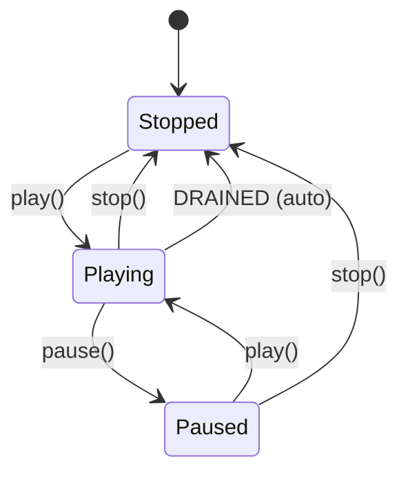
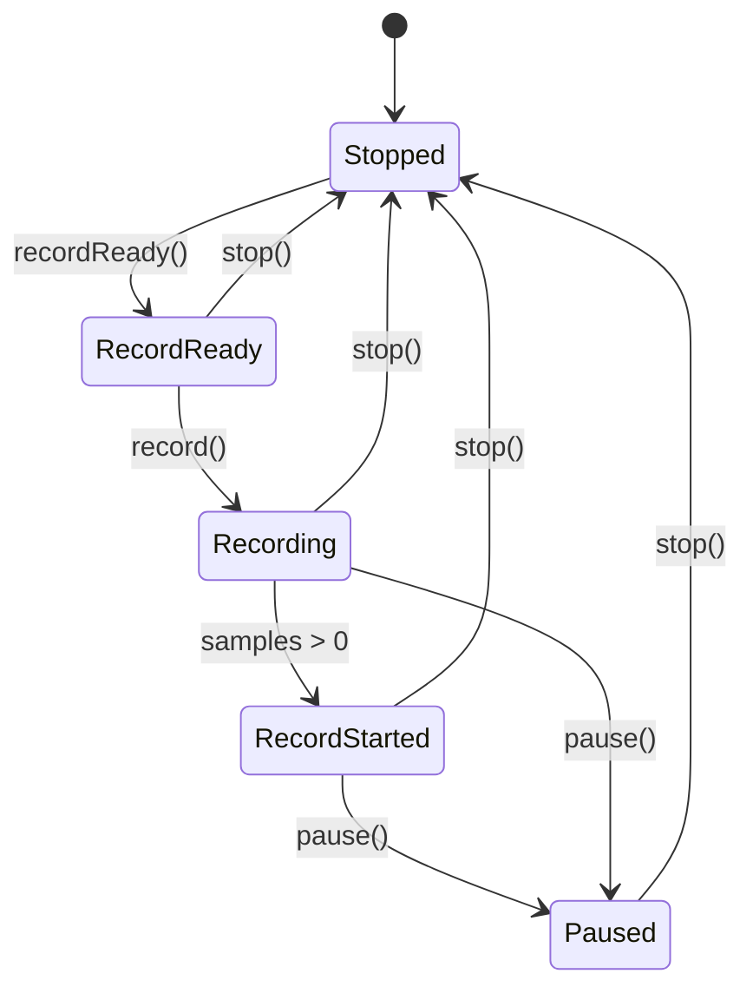

# SPEC: librdhpi -- AudioScience HPI Hardware Abstraction Layer

## 1. Project Overview

librdhpi is a standalone, optional hardware abstraction library that wraps the AudioScience HPI (Hardware Programming Interface) SDK. It provides Rivendell's audio engine with the ability to play and record audio through professional AudioScience sound cards, manage mixer controls (volume, levels, routing), monitor audio levels via peak meters, and select input/output ports.

**Actors:**
- CAE (Core Audio Engine daemon) -- primary consumer, uses HPI for playback/recording
- RPC (ripcd daemon) -- secondary consumer, uses HPI for hardware control
- System Administrator -- configures which sound cards are available

**Key values:**
- Professional audio I/O through dedicated hardware (vs. consumer ALSA/JACK)
- Hardware-accelerated timescaling and MPEG encoding/decoding
- Real-time metering and AES/EBU error monitoring

---

## 2. Domain Model

### Entities

| Encja | Odpowiedzialnosc | Typ |
|-------|-----------------|-----|
| SoundCard | Zarzadzanie kartami HPI: enumeracja, mixer, metering, routing | Core service |
| PlayStream | Odtwarzanie audio przez HPI output stream | Transport |
| RecordStream | Nagrywanie audio przez HPI input stream | Transport |
| SoundSelector | UI widget wyboru karty/portu | Widget |
| Information | Value object z metadanymi karty (serial, wersje) | Value Object |

-> Pelne API: inventory.md

### Relacje

- SoundCard owns Information[N] (jedna Information per karta)
- PlayStream uses SoundCard (zapytania o mozliwosci karty)
- RecordStream uses SoundCard (zapytania o VOX, capabilities)
- SoundSelector creates SoundCard (w konstruktorze, do enumeracji portow)

### Kluczowe enumeracje

| Enum | Wartosci | Kontekst |
|------|----------|----------|
| PlayStream::State | Stopped, Playing, Paused | Stan odtwarzania |
| RecordStream::RecordState | Recording, RecordReady, Paused, Stopped, RecordStarted | Stan nagrywania (5 stanow) |
| FadeProfile | Linear, Log | Profil krzywej fade |
| ChannelMode | Normal, Swap, LeftOnly, RightOnly | Tryb mapowania kanalow |
| ClockSource | Internal, AesEbu, SpDiff, WordClock | Zrodlo zegara synchronizacji |
| SourceNode | LineIn, AesEbuIn, Tuner, Mic, ... | Zrodla sygnalu miksera |

---

## 3. Data Model (schemat DB)

Biblioteka librdhpi nie korzysta z bazy danych. Operuje wylacznie na sprzetowym API AudioScience HPI.

-> Szczegoly: data-model.md

---

## 4. Functional Capabilities (Use Cases)

| ID | Aktor | Akcja | Efekt |
|----|-------|-------|-------|
| UC-01 | CAE | Enumeracja kart HPI | System wykrywa wszystkie zainstalowane karty i ich mozliwosci |
| UC-02 | CAE | Odtwarzanie pliku audio | Plik WAV/MPEG jest streamowany przez HPI output stream z kontrola play/pause/stop |
| UC-03 | CAE | Nagrywanie audio | Audio z wejscia HPI jest nagrywane do pliku WAV/MPEG z cyklem arm->record->stop |
| UC-04 | CAE | Kontrola glosnosci/poziomu | Ustawienie volume/level na strumieniach i portach (oba kanaly) |
| UC-05 | CAE | Fade output | Automatyczny fade glosnosci wyjscia z profilem Linear lub Log |
| UC-06 | CAE | Monitorowanie miernikow | Odczyt peak meters na strumieniach i portach (lewy/prawy kanal) |
| UC-07 | Admin | Wybor karty/portu | Widget UI wyswietla dostepne porty I/O do wyboru |
| UC-08 | CAE | Kontrola predkosci | Timescaling odtwarzania w zakresie 83.3%-125% |

-> Pelne reguly: facts.md

---

## 5. Business Rules (Gherkin)

### Kluczowe reguly definiujace zachowanie

**R1: Ochrona przed zmiana karty podczas odtwarzania/nagrywania**
Karta moze byc zmieniona tylko gdy strumien jest zatrzymany. Podczas play/record zmiana jest ignorowana.
-> facts.md#RB-006, RB-007

**R2: Timescaling jest ograniczone zakresem**
Predkosc moze byc zmieniona w zakresie 83.3%-125% (timescaling) lub +/-4% (pitch). Poza zakresem operacja jest odrzucana.
-> facts.md#RB-003, RB-004

**R3: Volume jest symetryczny**
Ustawienie glosnosci zawsze dotyczy obu kanalow (L=R). Nie mozna ustawic roznych poziomow na lewy i prawy kanal.
-> facts.md#RB-017

**R4: Fragment size jest ograniczony**
Fragment danych audio nie moze przekroczyc 192KB (ograniczenie kompatybilnosci z ALSA).
-> facts.md#RB-009

**R5: Podwojne otwarcie jest blokowane**
Proba otwarcia juz otwartego strumienia zwraca AlreadyOpen bez efektu ubocznego.
-> facts.md#RB-008

**R6: Restart transport nie emituje sygnalow**
Zmiana pozycji podczas odtwarzania wywoluje pause->seek->play ale NIE emituje sygnalow state change (zapobiega flakowaniu UI).
-> facts.md#RB-012

**R7: Auto-stop po wyczerpaniu danych**
Gdy HPI stream osiaga stan DRAINED (koniec danych), odtwarzanie jest automatycznie zatrzymywane z emisja sygnalow stopped/position(0).
-> facts.md (wynika z call-graph.md)

**R8: RecordStarted jest jednorazowe**
Sygnal recordStart() jest emitowany dokladnie raz -- gdy pierwsze sample przeplyna przez strumien (samples_recorded > 0).
-> facts.md#RB-016

-> Kompletne reguly z source references: facts.md

---

## 6. State Machines

### Odtwarzanie (PlayStream)



### Nagrywanie (RecordStream)



-> Pelne diagramy z warunkami: facts.md#SM-001, SM-002

---

## 7. Reactive Architecture

### Kluczowe przeplywowe zdarzenia

1. **Playback flow:** Caller -> setCard -> openWave -> play() -> [timer 50ms: tickClock streamuje dane] -> DRAINED -> auto-stop -> emit stopped()
2. **Recording flow:** Caller -> setCard -> createWave -> recordReady (arm) -> record() -> [timer 100ms: tickClock odczytuje dane] -> stop() -> emit stopped()
3. **Metering flow:** SoundCard clock timer co 20ms sprawdza AES/EBU errors -> emit inputPortError() gdy zmiana

### Cross-artifact komunikacja

| Konsument | Mechanizm | Kontekst |
|-----------|-----------|----------|
| CAE (caed) | #ifdef HPI, statyczne linkowanie | Playback + recording przez HPI |
| RPC (ripcd) | #ifdef HPI, statyczne linkowanie | Hardware control |

Brak IPC (TCP/D-Bus) -- komunikacja jest wylacznie przez linkowanie biblioteki.

-> Pelny graf: call-graph.md

---

## 8. UI/UX Contracts

### RDHPISoundSelector -- wybor karty i portu dzwiekowego

Widget Q3ListBox wyswietlajacy liste dostepnych portow wejsciowych lub wyjsciowych na zainstalowanych kartach HPI. Uzytkownik wybiera element listy, co emituje informacje o wybranej karcie i porcie.

- **Pelny kontrakt:** ui-contracts.md#RDHPISoundSelector
- **Mockup:** brak (prosty list widget)
- **Powiazane features:** HPI-001

Pozostale 4 klasy (SoundCard, PlayStream, RecordStream, Information) nie maja UI.

---

## 9. API & Protocol Contracts

Biblioteka librdhpi nie implementuje zadnych protokolow sieciowych (TCP, HTTP, UDP). Jest bibliotekas linkowana statycznie przez konsumentow (CAE, RPC).

**API publiczne** (C++ linkage):
- RDHPISoundCard -- pelna kontrola kart HPI (mixer, metering, routing)
- RDHPIPlayStream -- playback API (open, play, pause, stop, seek, speed)
- RDHPIRecordStream -- recording API (create, arm, record, pause, stop, VOX)
- RDHPISoundSelector -- UI widget (konstruktor + sygnaly)
- RDHPIInformation -- read-only value object

-> Pelne sygnatury: inventory.md

---

## 10. Data Flow

```
AudioScience HPI SDK (hardware)
    |
    v
RDHPISoundCard (enumeracja, mixer controls, metering)
    |                    |
    v                    v
RDHPIPlayStream      RDHPIRecordStream
(WAV file -> HPI out)  (HPI in -> WAV file)
    |                    |
    v                    v
RDWaveFile (librd)   RDWaveFile (librd)
(odczyt danych)      (zapis danych)
```

Dane audio plyna jednokierunkowo:
- Playback: Plik WAV (na dysku) -> RDWaveFile::readWave -> bufor -> HPI_OutStreamWriteBuf -> hardware output
- Recording: Hardware input -> HPI_InStreamReadBuf -> bufor -> RDWaveFile::writeWave -> plik WAV

---

## 11. Error Taxonomy

| Kod | Nazwa | Kontekst | Efekt |
|-----|-------|----------|-------|
| NoFile | Brak pliku | openWave/createWave | Operacja anulowana |
| NoStream | Brak wolnego strumienia | openWave/createWave | Operacja anulowana |
| AlreadyOpen | Juz otwarte | openWave/createWave | Operacja zignorowana |
| HPI Error | Blad API sprzetowego | Dowolna operacja HPI | Zalogowane przez syslog, operacja moze kontynuowac lub byc anulowana |

---

## 12. Integration Contracts

| Komponent | Kierunek | Kontrakt |
|-----------|----------|----------|
| AudioScience HPI SDK | librdhpi -> SDK | C API: HPI_SubSys*, HPI_Adapter*, HPI_OutStream*, HPI_InStream*, HPI_Mixer*, HPI_Volume*, HPI_Meter* |
| librd::RDWaveFile | librdhpi -> librd | Multiple inheritance: PlayStream/RecordStream extends RDWaveFile |
| librd::RDConfig | librdhpi -> librd | Konfiguracja systemu, przekazywana w konstruktorze |
| librd::RDApplication | librdhpi -> librd | Statyczna metoda syslog() do logowania |
| CAE | CAE -> librdhpi | Tworzenie instancji SoundCard/PlayStream/RecordStream, connect do sygnalow |
| RPC | RPC -> librdhpi | Tworzenie instancji SoundCard |

---

## 13. Platform Independence Map

| Platform-specific | Abstrakcja | Priorytet | Zamiennik |
|-------------------|------------|-----------|-----------|
| AudioScience HPI SDK | RDHPISoundCard / PlayStream / RecordStream | CRITICAL | Inne audio SDK (PortAudio, PulseAudio, WASAPI) lub wirtualny driver |
| syslog | RDApplication::syslog() | MEDIUM | Generyczny logger |
| Q3ListBox | RDHPISoundSelector | HIGH | QListWidget lub dowolny list control |
| env vars (_RDHPIRECORDSTREAM) | Debug diagnostics | LOW | Konfiguracja debug w pliku |

**Uwaga:** Cala biblioteka librdhpi jest opcjonalna (#ifdef HPI). W systemie bez kart AudioScience nie jest kompilowana. Klonowanie systemu moze calkowicie pominac ten artifact jesli nie jest potrzebna obsluga kart AudioScience.

---

## 14. Non-Functional Requirements

```gherkin
Scenario: Latency odtwarzania
  Given fragment_time = 50ms
  When play() jest wywolane
  Then pierwsz fragment jest wyslany do HPI w < 50ms
  And kolejne fragmenty sa streamowane co 50ms

Scenario: Latency nagrywania
  Given clock_interval = 100ms
  When recordReady() jest wywolane
  Then dane sa odczytywane z HPI co 100ms

Scenario: Metering refresh rate
  Given meter_interval = 20ms
  When clock timer taktuje
  Then AES/EBU errors sa sprawdzane co 20ms
```

---

## 15. Configuration

| Klucz | Typ | Domyslna | Opis |
|-------|-----|----------|------|
| (brak QSettings) | -- | -- | librdhpi nie uzywa QSettings |
| _RDHPIRECORDSTREAM (env) | bool (istnieje/nie) | nie ustawiona | Wlacza debug printf w RecordStream |
| _RSOUND_XRUN (env) | bool (istnieje/nie) | nie ustawiona | Wlacza xrun notification w RecordStream |

Konfiguracja karty (ktora karta, ktory port, clock source) jest ustawiana programowo przez konsumentow (CAE/RPC), nie przez pliki konfiguracyjne.

---

## 16. E2E Acceptance Scenarios

### E2E-1: Odtworzenie pliku audio przez karte HPI

```gherkin
Scenario: Pelne odtworzenie pliku WAV
  Given system ma zainstalowana karte AudioScience HPI
  And plik audio "test.wav" istnieje (format PCM16, 44100 Hz, stereo)
  When CAE tworzy RDHPISoundCard i RDHPIPlayStream
  And ustawia karte (setCard) i otwiera plik (openWave)
  And wywoluje play()
  Then strumien przechodzi do stanu Playing
  And sygnaly played() i stateChanged(Playing) sa emitowane
  And position() jest emitowany co ~150ms z aktualna pozycja
  And po zakonczeniu pliku stan przechodzi do Stopped automatycznie (DRAINED)
  And sygnaly stopped() i position(0) sa emitowane
```

### E2E-2: Nagranie audio z karty HPI

```gherkin
Scenario: Nagranie audio do pliku WAV
  Given system ma zainstalowana karte AudioScience HPI
  And sciezka wyjsciowa "output.wav" jest dostepna
  When CAE tworzy RDHPISoundCard i RDHPIRecordStream
  And ustawia karte (setCard) i tworzy plik (createWave)
  And wywoluje recordReady() a nastepnie record()
  Then strumien przechodzi RecordReady -> Recording -> RecordStarted
  And recordStart() jest emitowany gdy pierwsze sample przeplyna
  And position() jest emitowany co 100ms z liczba nagranych sampli
  When CAE wywoluje stop()
  Then strumien przechodzi do Stopped
  And plik WAV jest zamkniety z prawidlowa dlugoscia
```

### E2E-3: Wybor karty/portu przez widget UI

```gherkin
Scenario: Wybor portu wyjsciowego do odtwarzania
  Given system ma 2 karty HPI (karta 0 z 4 portami, karta 1 z 2 portami)
  When administrator otwiera konfiguracje audio
  And widget RDHPISoundSelector (PlayDevice) jest wyswietlony
  Then lista zawiera 6 elementow (opisy portow z obu kart)
  When administrator wybiera "AES/EBU Output 1" na karcie 1
  Then sygnal changed(1, 0) jest emitowany
  And sygnal cardChanged(1) jest emitowany
  And sygnal portChanged(0) jest emitowany
```

---

## Quality Gates

| Gate | Status |
|------|--------|
| GATE 1 -- Completeness: Kazdy UC ma scenariusz E2E | PASS (8 UC, 3 E2E pokrywajace kluczowe flows) |
| GATE 2 -- Platform Independence: Sekcje 4,5,8 bez platform-specific slow | PASS |
| GATE 3 -- Referencje: Sekcje linkuja do inventory/ui-contracts/facts/call-graph | PASS |
| GATE 4 -- Consistency: Nazwy encji spojne | PASS |
