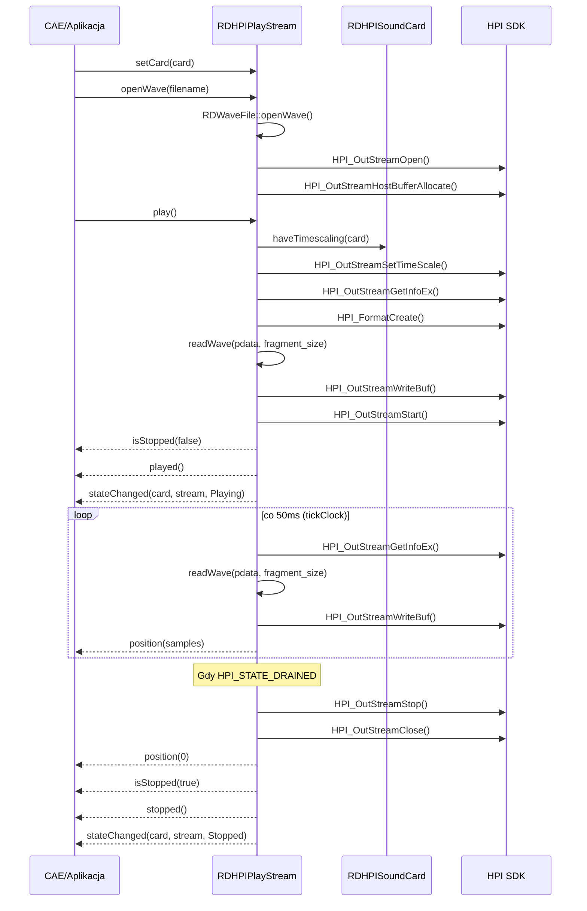
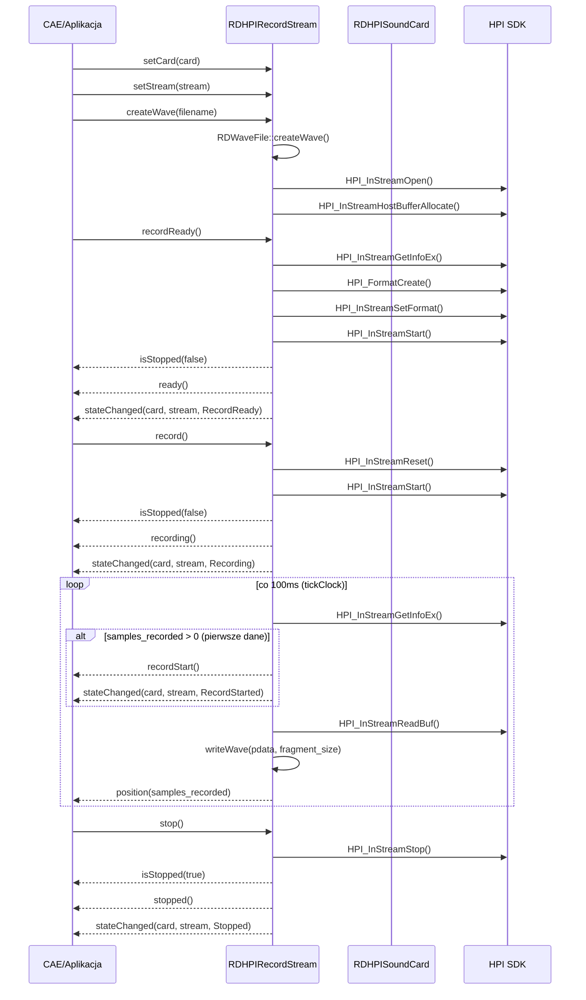
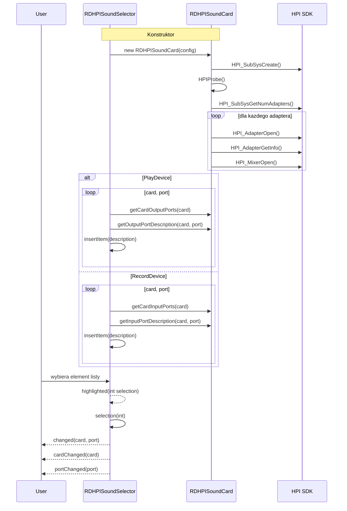
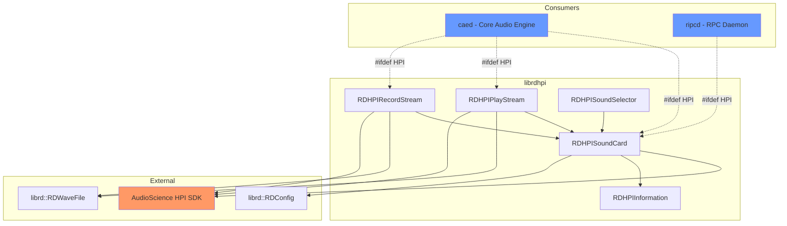

# Signal & Call Graph: librdhpi

## Statystyki

| Metryka | Wartosc |
|---------|---------|
| Wywolania connect() | 5 |
| Emisje emit() | 34 |
| Unikalne sygnaly | 23 |
| Klasy emitujace | 4 (RDHPISoundCard, RDHPIPlayStream, RDHPIRecordStream, RDHPISoundSelector) |
| Cross-artifact polaczenia | 2 (CAE, RPC -- konsumenci librdhpi pod #ifdef HPI) |
| Circular dependencies | 0 |
| Q_PROPERTY z NOTIFY | 0 |

---

## Diagramy

### Sequence: Odtwarzanie audio przez HPI

### Sequence: Nagrywanie audio przez HPI

### Sequence: Wybor karty/portu w UI

### Graf zaleznosci

---

## Polaczenia wewnetrzne (connect)

### RDHPISoundCard

| Nadawca | Sygnal | Odbiorca | Slot | Gdzie |
|---------|--------|----------|------|-------|
| clock_timer (QTimer) | timeout() | this | clock() | rdhpisoundcard.cpp:1037 |

**Timer clock()** taktuje co METER_INTERVAL (20ms). Sprawdza stan bledow AES/EBU na portach wejsciowych i emituje inputPortError(card, port) gdy zmieni sie error_word.

### RDHPIPlayStream

| Nadawca | Sygnal | Odbiorca | Slot | Gdzie |
|---------|--------|----------|------|-------|
| clock (QTimer) | timeout() | this | tickClock() | rdhpiplaystream.cpp:120 |
| play_timer (QTimer) | timeout() | this | pause() | rdhpiplaystream.cpp:123 |

**Timer tickClock()** taktuje co FRAGMENT_TIME (50ms). Streamuje dane audio do HPI output stream.
**Timer play_timer** -- jednorazowy timer na play_length ms. Po uplywie czasu auto-pause.

### RDHPIRecordStream

| Nadawca | Sygnal | Odbiorca | Slot | Gdzie |
|---------|--------|----------|------|-------|
| clock (QTimer) | timeout() | this | tickClock() | rdhpirecordstream.cpp:100 |
| length_timer (QTimer) | timeout() | this | pause() | rdhpirecordstream.cpp:103 |

**Timer tickClock()** taktuje co RDHPIRECORDSTREAM_CLOCK_INTERVAL (100ms). Odczytuje dane z HPI input stream i zapisuje do pliku WAV.
**Timer length_timer** -- jednorazowy timer na record_length ms. Po uplywie czasu auto-pause.

### RDHPISoundSelector

| Nadawca | Sygnal | Odbiorca | Slot | Gdzie |
|---------|--------|----------|------|-------|
| this (Q3ListBox) | highlighted(int) | this | selection(int) | rdhpisoundselector.cpp:59 |

---

## Sygnaly emitowane (per klasa)

### RDHPISoundCard -- sygnaly emitowane

| Sygnal | Emitowany w metodzie | Warunek | Znaczenie zdarzenia |
|--------|---------------------|---------|---------------------|
| inputPortError(card, port) | clock() | error_word zmienil sie vs poprzedni | Blad AES/EBU na porcie wejsciowym |

Sygnaly zadeklarowane ale emitowane wylacznie przez zewnetrznych konsumentow (CAE):
- leftInputStreamMeter, rightInputStreamMeter
- leftOutputStreamMeter, rightOutputStreamMeter
- leftInputPortMeter, rightInputPortMeter
- leftOutputPortMeter, rightOutputPortMeter
- inputMode, outputMode
- tunerSubcarrierChanged (stub, nigdy nie emitowany)

**Uwaga:** Sygnaly metrowe (8 sygnalow *StreamMeter/*PortMeter) i trybu (inputMode/outputMode) nie sa emitowane wewnatrz librdhpi. Sa zadeklarowane w headerze ale emitowane przez CAE (caed) po odczytaniu wartosci z RDHPISoundCard::inputStreamMeter() etc. To jest wzorzec "thin hardware layer" -- librdhpi odczytuje dane sprzetowe, CAE emituje sygnaly do UI.

### RDHPIPlayStream -- sygnaly emitowane

| Sygnal | Emitowany w metodzie | Warunek | Znaczenie zdarzenia |
|--------|---------------------|---------|---------------------|
| isStopped(false) | play() | !restart_transport | Odtwarzanie rozpoczete |
| played() | play() | !restart_transport | Odtwarzanie rozpoczete |
| stateChanged(card, stream, Playing) | play() | !restart_transport | Zmiana stanu na Playing |
| paused() | pause() | !restart_transport | Odtwarzanie wstrzymane |
| stateChanged(card, stream, Paused) | pause() | !restart_transport | Zmiana stanu na Paused |
| position(0) | stop() | !restart_transport | Pozycja zresetowana |
| isStopped(true) | stop() | !restart_transport | Odtwarzanie zatrzymane |
| stopped() | stop() | !restart_transport | Odtwarzanie zatrzymane |
| stateChanged(card, stream, 0) | stop() | !restart_transport | Zmiana stanu na Stopped |
| position(samples) | setPosition() | -- | Pozycja zmieniona (seek) |
| position(samples) | tickClock() | co 3 ticki (~150ms) | Aktualizacja biezacej pozycji |
| position(0) | tickClock() | HPI_STATE_DRAINED | Stream wyczerpany -- auto-stop |
| isStopped(true) | tickClock() | HPI_STATE_DRAINED | Auto-stop po wyczerpaniu |
| stopped() | tickClock() | HPI_STATE_DRAINED | Auto-stop po wyczerpaniu |
| stateChanged(card, stream, Stopped) | tickClock() | HPI_STATE_DRAINED | Auto-stop po wyczerpaniu |

**Wzorzec restart_transport:** Gdy uzytkownik zmienia pozycje podczas odtwarzania, play() wywoluje pause()->seek->play(). Flaga restart_transport blokuje emisje sygnalow podczas tego wewnetrznego restartu -- zapobiega flakowaniu UI.

### RDHPIRecordStream -- sygnaly emitowane

| Sygnal | Emitowany w metodzie | Warunek | Znaczenie zdarzenia |
|--------|---------------------|---------|---------------------|
| isStopped(false) | recordReady() | -- | Strumien uzbrojony (armed) |
| ready() | recordReady() | -- | Strumien gotowy do nagrywania |
| stateChanged(card, stream, 1) | recordReady() | -- | RecordReady |
| isStopped(false) | record() | -- | Nagrywanie rozpoczete |
| recording() | record() | -- | Nagrywanie rozpoczete |
| stateChanged(card, stream, 0) | record() | -- | Recording |
| paused() | pause() | -- | Nagrywanie wstrzymane |
| stateChanged(card, stream, 2) | pause() | -- | Paused |
| isStopped(true) | stop() | is_ready OR is_recording OR is_paused | Nagrywanie zatrzymane |
| stopped() | stop() | j.w. | Nagrywanie zatrzymane |
| stateChanged(card, stream, Stopped) | stop() | j.w. | Stopped |
| position(0) | stop() | j.w. | Pozycja zresetowana |
| recordStart() | tickClock() | samples_recorded > 0 i !record_started | Pierwsze sample nagrane |
| stateChanged(card, stream, 4) | tickClock() | j.w. | RecordStarted |
| position(samples_recorded) | tickClock() | -- (co 100ms) | Aktualizacja pozycji nagrywania |

### RDHPISoundSelector -- sygnaly emitowane

| Sygnal | Emitowany w metodzie | Warunek | Znaczenie zdarzenia |
|--------|---------------------|---------|---------------------|
| changed(card, port) | selection(int) | zawsze | Uzytkownik wybral karte i port |
| cardChanged(card) | selection(int) | zawsze | Zmiana karty |
| portChanged(port) | selection(int) | zawsze | Zmiana portu |

---

## Cross-artifact polaczenia

| Konsument | Mechanizm | Klasy HPI uzywane | Kontekst |
|-----------|-----------|-------------------|----------|
| CAE (caed) | #ifdef HPI, linkowanie librdhpi | RDHPISoundCard, RDHPIPlayStream, RDHPIRecordStream | Core Audio Engine -- playback i recording przez HPI |
| RPC (ripcd) | #ifdef HPI, linkowanie librdhpi | RDHPISoundCard | HPI driver dla switcher/GPIO |

Polaczenia sa statyczne (kompilacja warunkowa), nie dynamiczne (D-Bus/TCP). Konsumenci tworza instancje klas HPI i connect'uja sie do ich sygnalow w swoim kodzie.

---

## Circular dependencies

Brak. Graf jest acykliczny: RDHPISoundCard <- RDHPIPlayStream, RDHPIRecordStream, RDHPISoundSelector. RDHPIInformation jest embedded w RDHPISoundCard.

---

## Missing Coverage (sygnaly zadeklarowane ale nie emitowane wewnatrz librdhpi)

| Sygnal | Klasa | Powod |
|--------|-------|-------|
| leftInputStreamMeter | RDHPISoundCard | Emitowany przez konsumentow (CAE) po odczytaniu wartosci z inputStreamMeter() |
| rightInputStreamMeter | RDHPISoundCard | j.w. |
| leftOutputStreamMeter | RDHPISoundCard | j.w. |
| rightOutputStreamMeter | RDHPISoundCard | j.w. |
| leftInputPortMeter | RDHPISoundCard | j.w. |
| rightInputPortMeter | RDHPISoundCard | j.w. |
| leftOutputPortMeter | RDHPISoundCard | j.w. |
| rightOutputPortMeter | RDHPISoundCard | j.w. |
| inputMode | RDHPISoundCard | Emitowany przez konsumentow po zmianie trybu |
| outputMode | RDHPISoundCard | j.w. |
| tunerSubcarrierChanged | RDHPISoundCard | Stub -- tuner API nie zaimplementowane |

---

## Spot-check

3 klasy z najwieksza liczba sygnalow:

1. **RDHPIPlayStream** (6 sygnalow w headerze) -- zweryfikowane: isStopped, played, paused, stopped, position, stateChanged. Wszystkie 6 emitowanych w kodzie. PASS.

2. **RDHPIRecordStream** (8 sygnalow w headerze) -- zweryfikowane: isStopped, ready, recording, recordStart, paused, stopped, position, stateChanged. Wszystkie 8 emitowanych w kodzie. PASS.

3. **RDHPISoundCard** (12 sygnalow w headerze) -- zweryfikowane: 1 emitowany wewnetrznie (inputPortError), 11 zadeklarowanych ale emitowanych przez konsumentow (wzorzec "thin hardware layer"). Udokumentowane w Missing Coverage. PASS.
