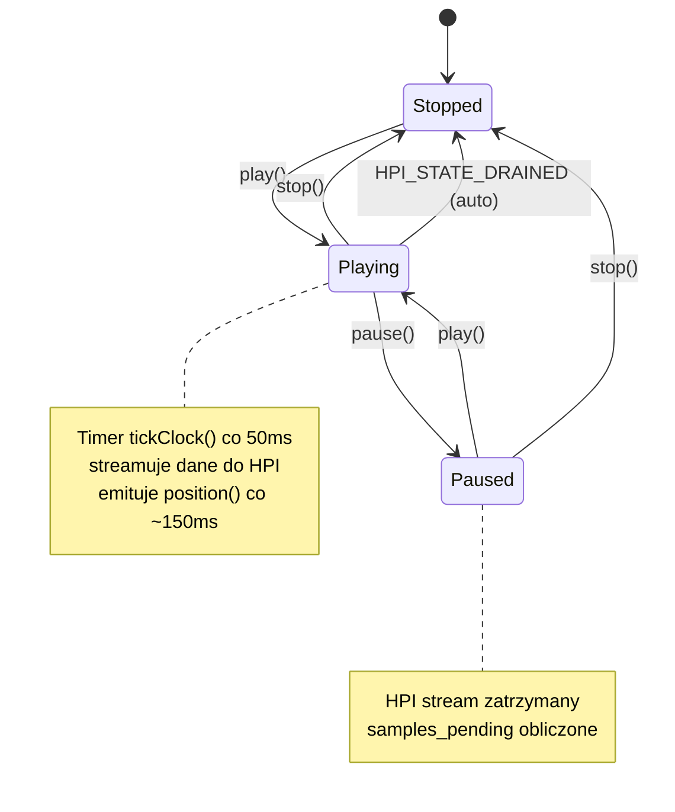
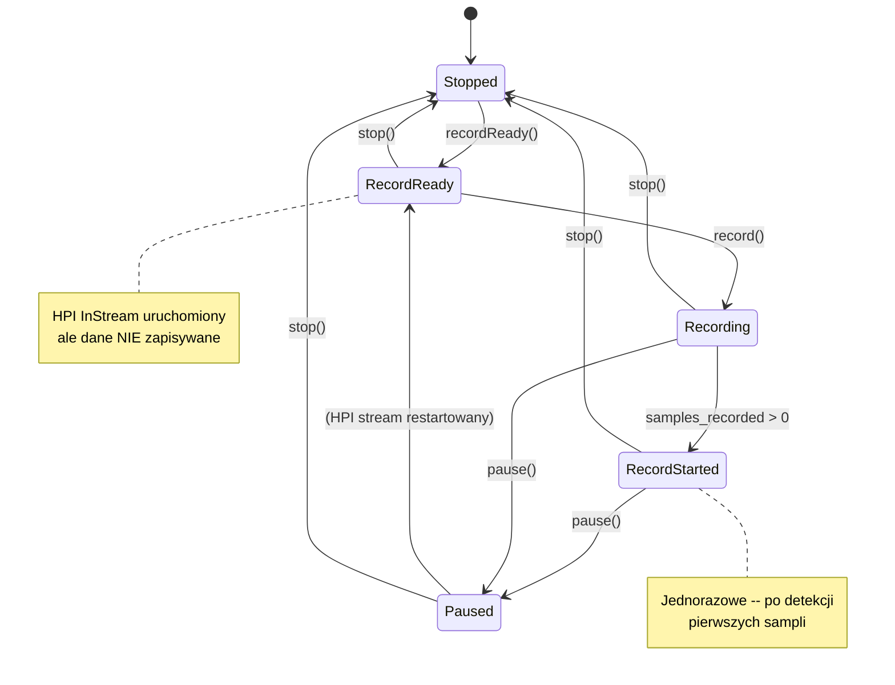

# Facts Mining: librdhpi

## Zrodla

| Zrodlo | Status | Opis |
|--------|--------|------|
| Kod (rdhpi/*.cpp, *.h) | przeanalizowany | 5 par plikow, ~3480 LOC |
| Testy | brak | Brak plikow testowych dla librdhpi |
| Dokumentacja PDF | brak | Brak dedykowanej dokumentacji PDF dla HPI |

---

## Stale i ograniczenia (Constants & Constraints)

| Stala | Wartosc | Plik | Znaczenie |
|-------|---------|------|-----------|
| METER_INTERVAL | 20 ms | rdhpisoundcard.h:24 | Interwal pollingowy AES/EBU error checking |
| RDHPISOUNDCARD_HPI_MAX_LEVEL | 2400 | rdhpisoundcard.h:47 | Maksymalny poziom glosnosci HPI (0.01 dB units) |
| RDHPISOUNDCARD_HPI_MIN_LEVEL | 0 | rdhpisoundcard.h:48 | Minimalny poziom glosnosci HPI |
| MAX_FRAGMENT_SIZE | 192000 bytes | rdhpiplaystream.h:42 | Maksymalny rozmiar fragmentu danych audio |
| FRAGMENT_TIME | 50 ms | rdhpiplaystream.h:43 | Interwal taktowania playback timer |
| TIMESCALE_LOW_LIMIT | 83300 | rdhpiplaystream.h:44 | Dolna granica timescaling (83.3% predkosci) |
| TIMESCALE_HIGH_LIMIT | 125000 | rdhpiplaystream.h:45 | Gorna granica timescaling (125% predkosci) |
| AUDIO_SIZE | 32768 bytes | rdhpirecordstream.h:44 | Rozmiar bufora audio do nagrywania |
| RDHPIRECORDSTREAM_CLOCK_INTERVAL | 100 ms | rdhpirecordstream.h:45 | Interwal taktowania recording timer |
| DEBUG_VAR | "_RDHPIRECORDSTREAM" | rdhpirecordstream.h:37 | Zmienna srodowiskowa wlaczajaca debug output |
| XRUN_VAR | "_RSOUND_XRUN" | rdhpirecordstream.h:38 | Zmienna srodowiskowa wlaczajaca xrun notification |
| HPI_MAX_ADAPTERS | (z HPI SDK) | asihpi/hpi.h | Max kart w systemie (20) |
| HPI_MAX_STREAMS | (z HPI SDK) | asihpi/hpi.h | Max strumieni na karte (16) |
| HPI_MAX_NODES | (z HPI SDK) | asihpi/hpi.h | Max portow/wezlow na karte |
| HPI_MAX_CHANNELS | (z HPI SDK) | asihpi/hpi.h | Max kanalow audio (stereo = 2) |

---

## Reguly biznesowe (Gherkin)

### RB-001: Alokacja kart HPI

```gherkin
Scenario: Enumeracja kart HPI przy starcie
  Given system posiada zainstalowane karty AudioScience HPI
  When RDHPISoundCard jest tworzony
  Then HPIProbe() enumeruje wszystkie adaptery przez HPI_SubSysGetNumAdapters
  And dla kazdego adaptera rejestruje mixer controls (volume, level, meter, mode, mux, vox, aesebu, passthrough)
  And zapisuje ilosc strumieni wejsciowych/wyjsciowych i portow na karte
  And startuje clock timer co 20ms do monitorowania AES/EBU errors
```
Zrodlo: rdhpisoundcard.cpp:31-79, 689-1038

### RB-002: Bounds checking na indeksach sprzetowych

```gherkin
Scenario: Walidacja indeksow kart/strumieni/portow
  Given karta card, strumien stream, port port
  When wywolana jest metoda haveInputVolume(card, stream, port)
  Then zwraca false jesli card >= HPI_MAX_ADAPTERS
  And zwraca false jesli stream >= HPI_MAX_STREAMS
  And zwraca false jesli port >= HPI_MAX_NODES
```
Zrodlo: rdhpisoundcard.cpp:206-211

### RB-003: Timescaling ograniczenia

```gherkin
Scenario: Ustawienie predkosci odtwarzania z timescaling
  Given karta wspiera timescaling (haveTimescaling = true)
  When setSpeed(speed, pitch=false, rate=false) jest wywolane
  Then predkosc musi byc w zakresie 83300-125000 (83.3%-125%)
  And jesli speed == RD_TIMESCALE_DIVISOR (100000), brak ograniczen
  And jesli poza zakresem, zwraca false
```
Zrodlo: rdhpiplaystream.cpp:374-398

### RB-004: Pitch variation ograniczenia

```gherkin
Scenario: Ustawienie predkosci z pitch variation
  Given setSpeed(speed, pitch=true, rate=true)
  When rate=true (variable speed with resampling)
  Then predkosc musi byc w zakresie 96000-104000 (+/- 4%)
  And jesli pitch=true i rate=false, zwraca false (not supported)
```
Zrodlo: rdhpiplaystream.cpp:385-392

### RB-005: Odtwarzanie wymaga otwartego pliku

```gherkin
Scenario: Play na zamknietym strumieniu
  Given strumien nie jest otwarty (is_open = false)
  When play() jest wywolane
  Then zwraca false bez efektu
```
Zrodlo: rdhpiplaystream.cpp:412-413

### RB-006: Zmiana karty tylko gdy nie gra

```gherkin
Scenario: Zmiana karty podczas odtwarzania
  Given strumien gra (playing = true)
  When setCard(card) jest wywolane
  Then karta NIE jest zmieniana (operacja zignorowana)
```
Zrodlo: rdhpiplaystream.cpp:354-358

### RB-007: Zmiana karty nagrywania tylko gdy nie nagrywa

```gherkin
Scenario: Zmiana karty podczas nagrywania
  Given strumien nagrywa (is_recording = true)
  When setCard(card) jest wywolane
  Then karta NIE jest zmieniana (operacja zignorowana)
```
Zrodlo: rdhpirecordstream.cpp:325-333

### RB-008: Podwojne otwarcie strumienia

```gherkin
Scenario: Otwarcie juz otwartego strumienia
  Given strumien jest juz otwarty (is_open = true)
  When openWave() lub createWave() jest wywolane
  Then zwraca Error::AlreadyOpen
  And nie zmienia stanu strumienia
```
Zrodlo: rdhpiplaystream.cpp:303-306, rdhpirecordstream.cpp:144-148

### RB-009: Fragment size ograniczenie

```gherkin
Scenario: Obliczanie rozmiaru fragmentu audio
  Given bufor HPI ma rozmiar buffer_size
  When fragment_size jest obliczany
  Then fragment_size = buffer_size / 4
  And jesli fragment_size > MAX_FRAGMENT_SIZE (192000), to fragment_size = 192000
```
Zrodlo: rdhpiplaystream.cpp:426-429, rdhpirecordstream.cpp:409-411

### RB-010: Auto-pause po uplywie czasu odtwarzania

```gherkin
Scenario: Ograniczony czas odtwarzania
  Given play_length > 0
  When play() jest wywolane
  Then play_timer startuje na play_length ms (jednorazowy)
  And po uplywie czasu wywoluje pause()
```
Zrodlo: rdhpiplaystream.cpp:529-532

### RB-011: Auto-pause po uplywie czasu nagrywania

```gherkin
Scenario: Ograniczony czas nagrywania
  Given record_length > 0
  When recordStart jest emitowany (samples > 0)
  Then length_timer startuje na record_length ms (jednorazowy)
  And po uplywie czasu wywoluje pause()
```
Zrodlo: rdhpirecordstream.cpp:666-668

### RB-012: Restart transport przy pozycjonowaniu

```gherkin
Scenario: Zmiana pozycji podczas odtwarzania
  Given strumien gra (playing = true)
  When setPosition(samples) jest wywolane z inna pozycja
  Then restart_transport = true
  And pause() jest wywolane (bez emisji sygnalow!)
  And seek do nowej pozycji
  And play() jest wywolane (bez emisji sygnalow!)
  And restart_transport = false
  And sygnaly NIE sa emitowane podczas restartu (zapobiega flakowaniu UI)
```
Zrodlo: rdhpiplaystream.cpp:642-690

### RB-013: Walidacja pozycji

```gherkin
Scenario: Ustawienie pozycji poza zakresem
  Given pozycja samples
  When setPosition(samples) jest wywolane
  Then jesli samples < 0 lub samples > getSampleLength(), zwraca false
```
Zrodlo: rdhpiplaystream.cpp:648-649

### RB-014: Mutex na strumieniach output

```gherkin
Scenario: Alokacja strumienia output z mutex
  Given dostepne strumienie na karcie
  When GetStream() jest wywolane
  Then inkrementuje stream_mutex[card][stream]
  And jesli mutex == 1 (pierwszy uzytkownik), otwiera HPI_OutStreamOpen
  And jesli mutex > 1 (juz zajety), dekrementuje i probuje nastepny
  And zwraca -1 jesli brak wolnych strumieni
```
Zrodlo: rdhpiplaystream.cpp:789-815

### RB-015: RecordReady jako arm

```gherkin
Scenario: Arm nagrywania (recordReady)
  Given strumien nie nagrywa i nie jest paused
  When recordReady() jest wywolane
  Then konfiguruje format HPI
  And startuje HPI InStream (ale NIE zapisuje danych)
  And ustawia is_ready = true
  And emituje ready() i stateChanged(RecordReady)
```
Zrodlo: rdhpirecordstream.cpp:387-561

### RB-016: RecordStarted detekcja

```gherkin
Scenario: Detekcja poczatku faktycznego nagrywania
  Given strumien nagrywa (is_recording = true)
  And record_started = false
  When tickClock() sprawdza samples_recorded
  And samples_recorded > 0
  Then emituje recordStart()
  And emituje stateChanged(RecordStarted)
  And record_started = true (jednorazowe)
```
Zrodlo: rdhpirecordstream.cpp:664-676

### RB-017: Volume na oba kanaly

```gherkin
Scenario: Ustawienie glosnosci
  Given karta card, strumien stream, port port
  When setOutputVolume(card, stream, port, level) jest wywolane
  Then gain[0] = level (lewy kanal)
  And gain[1] = level (prawy kanal)
  And oba kanaly ustawione na ten sam poziom
  And jesli haveOutputVolume = false, operacja zignorowana
```
Zrodlo: rdhpisoundcard.cpp:559-570

### RB-018: Fade profile

```gherkin
Scenario: Fade output volume z profilem
  Given fade_type = Log (domyslny)
  When fadeOutputVolume(card, stream, port, level, length) jest wywolane
  Then wywoluje HPI_VolumeAutoFadeProfile z hpi_fade_type
  And Log -> HPI_VOLUME_AUTOFADE_LOG
  And Linear -> HPI_VOLUME_AUTOFADE_LINEAR
  And jesli haveOutputVolume = false, operacja zignorowana
```
Zrodlo: rdhpisoundcard.cpp:574-587

---

## Maszyny stanow (State Machines)

### SM-001: RDHPIPlayStream -- stany odtwarzania



Stany: Stopped(0), Playing(1), Paused(2)
Przejscia warunkowane na: is_open, playing, is_paused, restart_transport

### SM-002: RDHPIRecordStream -- stany nagrywania



Stany: Recording(0), RecordReady(1), Paused(2), Stopped(3), RecordStarted(4)
Przejscia warunkowane na: is_ready, is_recording, is_paused, record_started

---

## Edge cases

### EC-001: Brak kart HPI
Jesli HPI_SubSysCreate() zwroci NULL, HPIProbe() NIE jest wywoływane, card_quantity = 0. System kontynuuje bez bledow -- brak kart = pusta lista.
Zrodlo: rdhpisoundcard.cpp:75-77

### EC-002: Brak wolnych strumieni
GetStream() iteruje po wszystkich strumieniach output i zwraca -1 jesli wszystkie zajete. openWave() zwraca Error::NoStream.
Zrodlo: rdhpiplaystream.cpp:789-815

### EC-003: Nieznany format audio
Play/record z nieznanym formatem (nie PCM, nie MPEG, nie Vorbis): metody zwracaja false/state=1 i operacja jest anulowana.
Zrodlo: rdhpiplaystream.cpp:241-243, rdhpirecordstream.cpp:257-259

### EC-004: HPI API version compatibility
Kod zawiera #if HPI_VER < X w wielu miejscach. Wspierane wersje HPI API: od < 0x030500 do najnowszych. Rozne API calls w roznych wersjach (np. HPI_OutStreamWriteBuf vs HPI_OutStreamWrite + HPI_DataCreate).
Zrodlo: rdhpiplaystream.h:121-128, rdhpiplaystream.cpp:496-500, 515-521

### EC-005: Dekodowanie card/port w SoundSelector niespojne
RDHPISoundSelector koduje indeks jako card * HPI_MAX_NODES + port, ale dekoduje jako card = selection / HPI_MAX_ADAPTERS, port = selection % HPI_MAX_ADAPTERS. Jesli HPI_MAX_NODES != HPI_MAX_ADAPTERS, dekodowanie jest bledne. Potencjalny bug (ale prawdopodobnie te stale sa rowne w typowej konfiguracji).
Zrodlo: rdhpisoundselector.cpp:46-48 vs 65-68

### EC-006: Play timer adjustment
setPlayLength() moze zmieniac play_length w trakcie odtwarzania. Jesli nowy length jest krotszy niz czas juz odtworzony (diff <= 0), timer jest ustawiany na 0 (natychmiastowe pause).
Zrodlo: rdhpiplaystream.cpp:694-706

---

## Wsparcie formatow audio

| Format | Playback | Recording | Uwagi |
|--------|----------|-----------|-------|
| PCM 8-bit unsigned | TAK | TAK | HPI_FORMAT_PCM8_UNSIGNED |
| PCM 16-bit signed | TAK | TAK | HPI_FORMAT_PCM16_SIGNED |
| PCM 24-bit signed | TAK | TAK | HPI_FORMAT_PCM24_SIGNED |
| PCM 32-bit signed | TAK | TAK | Tylko w play() |
| MPEG Layer 1 | TAK | TAK | HPI_FORMAT_MPEG_L1 |
| MPEG Layer 2 | TAK | TAK | HPI_FORMAT_MPEG_L2 |
| MPEG Layer 3 | TAK | TAK | HPI_FORMAT_MPEG_L3 |
| Vorbis | warunkowo | warunkowo | #ifdef HAVE_VORBIS; recording jako PCM16 pass-through |

---

## Linux-specific komponenty

| Komponent | Uzycie | Priorytet zastapienia |
|-----------|--------|----------------------|
| AudioScience HPI SDK (asihpi/hpi.h) | Cale sprzetowe API -- 100% kodu operuje na HPI | CRITICAL |
| syslog (via RDApplication::syslog) | Logowanie bledow HPI | MEDIUM |
| zmienne srodowiskowe (_RDHPIRECORDSTREAM, _RSOUND_XRUN) | Diagnostyka debugowania | LOW |
| Q3ListBox (Qt3Support) | Widget UI w RDHPISoundSelector | HIGH (deprecated) |

---

## Crosscheck

Brak crosscheck -- tylko jedno zrodlo (kod). Brak testow i dokumentacji PDF.
Wszystkie fakty potwierdzone bezposrednio w kodzie z source references.

---

## Spot-check

3 reguly zweryfikowane:

1. **RB-003 (Timescale limits)** -- rdhpiplaystream.cpp:374-398: potwierdzone. Zakres 83300-125000, sprawdzanie !haveTimescaling, return false poza zakresem. PASS.

2. **RB-012 (Restart transport)** -- rdhpiplaystream.cpp:642-690: potwierdzone. restart_transport blokuje emisje sygnalow, pause->seek->play. PASS.

3. **RB-016 (RecordStarted detection)** -- rdhpirecordstream.cpp:664-676: potwierdzone. Warunek !record_started && is_recording && samples_recorded > 0. PASS.
