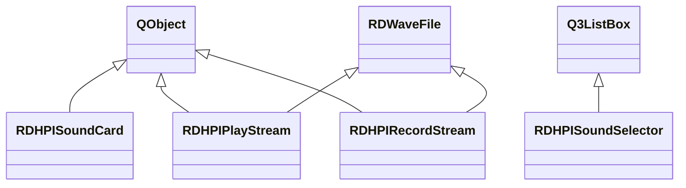
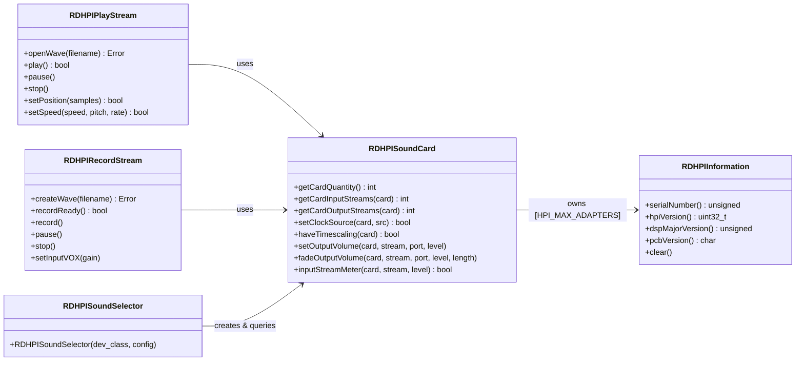

# Inventory: librdhpi

## Statystyki

| Typ | Liczba |
|-----|--------|
| Klasy lacznie | 5 |
| QMainWindow subclassy | 0 |
| QDialog subclassy | 0 |
| QWidget subclassy (Q3ListBox) | 1 |
| QObject subclassy (serwisy) | 3 |
| QAbstractItemModel subclassy | 0 |
| QThread subclassy | 0 |
| Plain C++ (non-Qt) klasy | 1 |
| Active Record (CRUD) klasy | 0 |

---

## Diagram klas -- dziedziczenie

## Diagram klas -- zaleznosci domenowe

---

## Klasy -- szczegolowy inwentarz

### RDHPIInformation

**Typ Qt:** Plain C++ (non-Qt)
**Plik:** `rdhpi/rdhpiinformation.h` + `rdhpi/rdhpiinformation.cpp`
**Odpowiedzialnosc:** Value object przechowujacy informacje identyfikacyjne karty AudioScience HPI: numer seryjny, wersje firmware (HPI API, DSP, PCB, assembly).
**Tabela DB:** brak

**Sygnaly:** brak (nie jest QObject)

**Sloty:** brak

**Stan (Q_PROPERTY):** brak

**Publiczne API:**
| Metoda | Parametry | Efekt | Warunki wywolania |
|--------|-----------|-------|-------------------|
| serialNumber | -- | Zwraca numer seryjny karty | -- |
| setSerialNumber | unsigned num | Ustawia numer seryjny | Wolane przez RDHPISoundCard podczas probe |
| hpiMajorVersion | -- | Zwraca major wersji HPI (bity 31-16) | -- |
| hpiMinorVersion | -- | Zwraca minor wersji HPI (bity 15-8) | -- |
| hpiPointVersion | -- | Zwraca point wersji HPI (bity 7-0) | -- |
| hpiVersion | -- | Zwraca pelna wersje HPI jako uint32_t | -- |
| setHpiVersion | uint32_t ver | Ustawia pelna wersje HPI | Wolane przez HPIProbe |
| dspMajorVersion | -- | Zwraca major wersji DSP | -- |
| setDspMajorVersion | unsigned ver | Ustawia major wersji DSP | -- |
| dspMinorVersion | -- | Zwraca minor wersji DSP | -- |
| setDspMinorVersion | unsigned ver | Ustawia minor wersji DSP | -- |
| pcbVersion | -- | Zwraca wersje PCB jako char | -- |
| setPcbVersion | char ver | Ustawia wersje PCB | -- |
| assemblyVersion | -- | Zwraca wersje assembly | -- |
| setAssemblyVersion | unsigned ver | Ustawia wersje assembly | -- |
| clear | -- | Resetuje wszystkie pola do wartosci domyslnych (0, '0') | -- |

**Enums:** brak

**Reguly biznesowe (z implementacji):**
- Wersja HPI jest przechowywana jako uint32_t i dekodowana bitowo: major = bity 31-16, minor = bity 15-8, point = bity 7-0
- Konstruktor wywoluje clear() -- obiekt startuje z zerami
- Jest uzywana jako embedded array w RDHPISoundCard (hpi_info[HPI_MAX_ADAPTERS])

**Linux-specific:** brak

**Zaleznosci od innych klas tego artifaktu:** brak

**Zaleznosci od shared libraries:** brak

---

### RDHPISoundCard

**Typ Qt:** QObject
**Plik:** `rdhpi/rdhpisoundcard.h` + `rdhpi/rdhpisoundcard.cpp`
**Odpowiedzialnosc:** Centralna klasa zarzadzania kartami dzwiekowymi AudioScience HPI. Odpowiada za enumeracje kart, kontrole mikserow (volume, level, mux, mode), metering audio (peak meters), routing sygnalu (clock source, passthrough), fading i konfiguracje VOX.
**Tabela DB:** brak

**Sygnaly:**
| Sygnal | Parametry | Znaczenie biznesowe |
|--------|-----------|---------------------|
| inputPortError | int card, int port | Zmiana stanu bledu AES/EBU na porcie wejsciowym (polling co METER_INTERVAL ms) |
| leftInputStreamMeter | int card, int stream, int level | Poziom peak metra lewego kanalu strumienia wejsciowego |
| leftOutputStreamMeter | int card, int stream, int level | Poziom peak metra lewego kanalu strumienia wyjsciowego |
| rightInputStreamMeter | int card, int stream, int level | Poziom peak metra prawego kanalu strumienia wejsciowego |
| rightOutputStreamMeter | int card, int stream, int level | Poziom peak metra prawego kanalu strumienia wyjsciowego |
| leftInputPortMeter | int card, int port, int level | Poziom peak metra lewego kanalu portu wejsciowego |
| leftOutputPortMeter | int card, int port, int level | Poziom peak metra lewego kanalu portu wyjsciowego |
| rightInputPortMeter | int card, int port, int level | Poziom peak metra prawego kanalu portu wejsciowego |
| rightOutputPortMeter | int card, int port, int level | Poziom peak metra prawego kanalu portu wyjsciowego |
| inputMode | int card, int port, ChannelMode mode | Zmiana trybu kanalu wejsciowego (Normal/Swap/LeftOnly/RightOnly) |
| outputMode | int card, int stream, ChannelMode mode | Zmiana trybu kanalu wyjsciowego |
| tunerSubcarrierChanged | Subcarrier car, bool state | Zmiana stanu subcarrier tunera (MPX/RDS) -- stub, nie zaimplementowane |

**Sloty:**
| Slot | Parametry | Widocznosc | Efekt |
|------|-----------|------------|-------|
| setInputVolume | int card, int stream, int level | public | Ustawia glosnosc wejscia (oba kanaly na ten sam level) |
| setOutputVolume | int card, int stream, int port, int level | public | Ustawia glosnosc wyjscia (oba kanaly na ten sam level) |
| fadeOutputVolume | int card, int stream, int port, int level, int length | public | Uruchamia automatyczny fade wyjscia do docelowego poziomu w zadanym czasie (Linear lub Log) |
| setInputLevel | int card, int port, int level | public | Ustawia poziom wejsciowy portu (wszystkie kanaly) |
| setOutputLevel | int card, int port, int level | public | Ustawia poziom wyjsciowy portu (wszystkie kanaly) |
| setInputMode | int card, int port, ChannelMode mode | public | Ustawia tryb kanalu wejsciowego (Normal/Swap/LeftOnly/RightOnly) |
| setOutputMode | int card, int stream, ChannelMode mode | public | Ustawia tryb kanalu wyjsciowego |
| setInputStreamVOX | int card, int stream, short gain | public | Ustawia prog VOX (Voice Operated eXchange) na strumieniu wejsciowym |
| havePassthroughVolume | int card, int in_port, int out_port | public | Sprawdza czy passthrough volume control istnieje |
| setPassthroughVolume | int card, int in_port, int out_port, int level | public | Ustawia poziom passthrough miedzy portem wejsciowym a wyjsciowym |
| clock | -- | private | Timer callback (co METER_INTERVAL=20ms) -- sprawdza bledy AES/EBU na portach wejsciowych |

**Stan (Q_PROPERTY):** brak

**Publiczne API:**
| Metoda | Parametry | Efekt | Warunki wywolania |
|--------|-----------|-------|-------------------|
| driver | -- | Zawsze zwraca RDHPISoundCard::Hpi | -- |
| hpiInformation | int card | Zwraca wskaznik do RDHPIInformation dla karty | card < HPI_MAX_ADAPTERS |
| getCardQuantity | -- | Zwraca liczbe wykrytych kart HPI | Po konstruktorze |
| getCardInputStreams | int card | Zwraca liczbe strumieni wejsciowych karty | -- |
| getCardOutputStreams | int card | Zwraca liczbe strumieni wyjsciowych karty | -- |
| getCardInputPorts | int card | Zwraca liczbe portow wejsciowych karty | -- |
| getCardOutputPorts | int card | Zwraca liczbe portow wyjsciowych karty | -- |
| getCardDescription | int card | Zwraca nazwe/opis karty | -- |
| getInputStreamDescription | int card, int stream | Opis strumienia wejsciowego | -- |
| getOutputStreamDescription | int card, int stream | Opis strumienia wyjsciowego | -- |
| getInputPortDescription | int card, int port | Opis portu wejsciowego | -- |
| getOutputPortDescription | int card, int port | Opis portu wyjsciowego | -- |
| setClockSource | int card, ClockSource src | Ustawia zrodlo zegara (Internal/AesEbu/SpDiff/WordClock) | -- |
| haveTimescaling | int card | Sprawdza czy karta wspiera timescaling | card < HPI_MAX_ADAPTERS |
| haveInputVolume | int card, int stream, int port | Sprawdza czy volume control input istnieje | Bounds check card/stream/port |
| haveOutputVolume | int card, int stream, int port | Sprawdza czy volume control output istnieje | Bounds check |
| inputStreamMeter | int card, int stream, short *level | Odczytuje peak meter strumienia wejsciowego | card < card_quantity, stream < card_input_streams |
| outputStreamMeter | int card, int stream, short *level | Odczytuje peak meter strumienia wyjsciowego | card < card_quantity |
| getInputVolume | int card, int stream, int port | Zwraca aktualna glosnosc wejscia | -- |
| getOutputVolume | int card, int stream, int port | Zwraca aktualna glosnosc wyjscia | -- |
| getInputPortMux | int card, int port | Zwraca aktualny wybor zrodla na multiplekserze | -- |
| setInputPortMux | int card, int port, SourceNode node | Ustawia zrodlo multipleksera (LineIn lub AesEbuIn) | -- |
| getFadeProfile | -- | Zwraca aktualny profil fade (Linear/Log) | -- |
| setFadeProfile | FadeProfile profile | Ustawia profil fade i aktualizuje typ HPI | -- |
| getInputPortError | int card, int port | Zwraca slowo bledu AES/EBU receivera | input_port_aesebu[card][port] musi byc true |

**Enums:**
| Enum | Wartosci | Znaczenie |
|------|----------|-----------|
| FadeProfile | Linear=0, Log=1 | Profil krzywej fade (liniowy vs logarytmiczny) |
| Channel | Left=0, Right=1 | Kanal audio |
| ChannelMode | Normal=0, Swap=1, LeftOnly=2, RightOnly=3 | Tryb mapowania kanalow (odpowiada HPI_CHANNEL_MODE_* - 1) |
| DeviceClass | RecordDevice=0, PlayDevice=1 | Typ urzadzenia (do filtrowania w selektorze) |
| Driver | Alsa=0, Hpi=1, Jack=2 | Typ drivera audio |
| ClockSource | Internal=0, AesEbu=1, SpDiff=2, WordClock=4 | Zrodlo zegara synchronizacji |
| SourceNode | SourceBase=100..Mic=108 | Typy wezlow zrodlowych miksera (mapowanie 1:1 na HPI_SOURCENODE_*) |
| DestNode | DestBase=200..Speaker=205 | Typy wezlow docelowych miksera (mapowanie 1:1 na HPI_DESTNODE_*) |
| TunerBand | Fm=0, FmStereo=1, Am=2, Tv=3 | Pasma tunera (stub -- nie zaimplementowane) |
| Subcarrier | Mpx=0, Rds=1 | Subcarriery tunera (stub -- nie zaimplementowane) |

**Reguly biznesowe (z implementacji):**
- Konstruktor wywoluje HPIProbe() ktory enumeruje wszystkie karty HPI i rejestruje mixer controls (volume, level, meter, mode, mux, vox, aesebu, passthrough) dla kazdego adaptera/strumienia/portu
- Bounds checking: metody haveInput*/haveOutput* sprawdzaja czy indeksy card/stream/port nie przekraczaja HPI_MAX_ADAPTERS, HPI_MAX_STREAMS, HPI_MAX_NODES
- Metering: metody inputStreamMeter/outputStreamMeter odczytuja peak levels z kontrolek HPI (dwukanalowo: left+right)
- Clock timer (co 20ms) sprawdza stan bledow AES/EBU i emituje inputPortError gdy zmieni sie error_word
- Volume jest ustawiany na oba kanaly jednoczesnie (gain[0]=gain[1]=level)
- Fade profil moze byc Linear (HPI_VOLUME_AUTOFADE_LINEAR) lub Log (HPI_VOLUME_AUTOFADE_LOG), domyslnie Log
- Multiplekser portu wejsciowego wspiera tylko LineIn i AesEbuIn jako source nodes
- Tuner API jest zdeklarowane ale nie zaimplementowane (metody zwracaja 0/false)
- Domyslna wartosc fade_type to Log (ustawiona w konstruktorze)

**Linux-specific:**
| Komponent | Uzycie | Priorytet zastapienia |
|-----------|--------|----------------------|
| AudioScience HPI SDK (asihpi/hpi.h) | Cale API sprzetu -- enumeracja, mixer, metering | CRITICAL |
| syslog | Logowanie bledow HPI | MEDIUM |

**Zaleznosci od innych klas tego artifaktu:**
- RDHPIInformation: embedded array hpi_info[HPI_MAX_ADAPTERS] -- przechowuje info o kartach

**Zaleznosci od shared libraries:**
- librd::RDConfig: konfiguracja systemowa, przekazywana do logow
- librd::RDApplication: syslog() do logowania bledow HPI

---

### RDHPIPlayStream

**Typ Qt:** QObject + RDWaveFile (multiple inheritance)
**Plik:** `rdhpi/rdhpiplaystream.h` + `rdhpi/rdhpiplaystream.cpp`
**Odpowiedzialnosc:** Odtwarzanie plikow audio (WAV/MPEG) przez karty AudioScience HPI. Zarzadza otwieraniem plikow, strumieniowaniem danych do HPI output stream, kontrola play/pause/stop, pozycjonowaniem, kontrola predkosci (timescaling) i raportowaniem pozycji.
**Tabela DB:** brak

**Sygnaly:**
| Sygnal | Parametry | Znaczenie biznesowe |
|--------|-----------|---------------------|
| isStopped | bool state | Zmiana stanu zatrzymania (true=zatrzymany, false=gra) |
| played | -- | Odtwarzanie rozpoczete |
| paused | -- | Odtwarzanie wstrzymane |
| stopped | -- | Odtwarzanie zatrzymane |
| position | int samples | Aktualna pozycja odtwarzania w samplach (emitowane co ~3 ticki zegara ~150ms) |
| stateChanged | int card, int stream, int state | Zmiana stanu strumienia (0=Stopped, 1=Playing, 2=Paused) |

**Sloty:**
| Slot | Parametry | Widocznosc | Efekt |
|------|-----------|------------|-------|
| setCard | int card | public | Ustawia karte (tylko gdy nie gra) |
| play | -- | public | Rozpoczyna odtwarzanie: alokuje stream, formatuje dane, uruchamia timer |
| pause | -- | public | Wstrzymuje odtwarzanie: zatrzymuje HPI stream, oblicza samples_pending |
| stop | -- | public | Zatrzymuje odtwarzanie: resetuje stream, pozycje, bufor |
| currentPosition | -- | public | Zwraca aktualna pozycje (samples_played + samples_skipped) |
| setPosition | unsigned samples | public | Pozycjonuje odtwarzanie: jesli gra to pause-seek-play, jesli nie to seek |
| setPlayLength | int length | public | Ustawia maksymalny czas odtwarzania (ms) -- po tym auto-pause |
| tickClock | -- | public | Timer callback (co FRAGMENT_TIME=50ms) -- streamuje dane do HPI |

**Stan (Q_PROPERTY):** brak

**Publiczne API:**
| Metoda | Parametry | Efekt | Warunki wywolania |
|--------|-----------|-------|-------------------|
| errorString | Error err | Zwraca opis bledu w tekscie | -- |
| formatSupported | RDWaveFile::Format format | Sprawdza czy format jest wspierany przez karte | card_number >= 0 |
| formatSupported | -- | Sprawdza czy aktualny format pliku jest wspierany | Plik otwarty lub karta ustawiona |
| openWave | -- | Otwiera WAV z ustawionej nazwy, alokuje HPI stream | Nie moze byc juz otwarte |
| openWave | QString filename | Ustawia nazwe i otwiera WAV | Nie moze byc juz otwarte |
| closeWave | -- | Zamyka plik i zwalnia HPI stream (stop jesli gra) | -- |
| getCard | -- | Zwraca numer karty | -- |
| getStream | -- | Zwraca numer strumienia | -- |
| getSpeed | -- | Zwraca aktualna predkosc odtwarzania | -- |
| setSpeed | int speed, bool pitch, bool rate | Ustawia predkosc: domyslnie timescale, opcjonalnie pitch/rate | Ograniczenia zakresu |
| getState | -- | Zwraca aktualny stan (Stopped/Playing/Paused) | -- |

**Enums:**
| Enum | Wartosci | Znaczenie |
|------|----------|-----------|
| State | Stopped=0, Playing=1, Paused=2 | Stan odtwarzania |
| Error | Ok=0, NoFile=1, NoStream=2, AlreadyOpen=3 | Kody bledow operacji |

**Reguly biznesowe (z implementacji):**
- Alokacja strumienia uzywa local mutex (stream_mutex[card][stream]) do synchronizacji dostepu miedzy instancjami
- Wsparcie formatow: PCM8/16/24/32, MPEG L1/L2/L3, Vorbis (warunkowo HAVE_VORBIS)
- Fragment size = buffer_size/4, max MAX_FRAGMENT_SIZE (192000 bytes)
- Timer taktuje co FRAGMENT_TIME (50ms) -- streamuje dane do HPI w petli dopoki bufor ma miejsce
- Timescaling: ograniczone do zakresu 83.3%-125% (TIMESCALE_LOW_LIMIT..TIMESCALE_HIGH_LIMIT) z dzielnikiem RD_TIMESCALE_DIVISOR
- Pitch variation: alternatywny tryb z ograniczeniem +/-4% (96000-104000)
- setPosition przy aktywnym odtwarzaniu: pause -> seek -> play (restart_transport)
- Auto-drain: gdy strumien sie konczy (HPI_STATE_DRAINED), automatycznie stop i emit signals
- play_length > 0 uruchamia timer ktory po uplywie czasu wywoluje pause()
- Position reporting: emit position() co 3 ticki zegara (~150ms)
- Karta moze byc zmieniona (setCard) tylko gdy nie gra

**Linux-specific:**
| Komponent | Uzycie | Priorytet zastapienia |
|-----------|--------|----------------------|
| AudioScience HPI SDK | Streaming audio (HPI_OutStream*) | CRITICAL |
| syslog | Logowanie bledow HPI | MEDIUM |

**Zaleznosci od innych klas tego artifaktu:**
- RDHPISoundCard: wskaznik sound_card -- zapytania o ilosc streamow, timescaling, config

**Zaleznosci od shared libraries:**
- librd::RDWaveFile: bazowa klasa plikow WAV (multiple inheritance)
- librd::RDConfig: konfiguracja (przez sound_card->config())
- librd::RDApplication: syslog

---

### RDHPIRecordStream

**Typ Qt:** QObject + RDWaveFile (multiple inheritance)
**Plik:** `rdhpi/rdhpirecordstream.h` + `rdhpi/rdhpirecordstream.cpp`
**Odpowiedzialnosc:** Nagrywanie audio z kart AudioScience HPI do plikow WAV/MPEG. Zarzadza cyklem nagrywania: recordReady (arm) -> record -> pause -> stop, obsluguje VOX, monitoruje pozycje nagrywania i stan strumienia.
**Tabela DB:** brak

**Sygnaly:**
| Sygnal | Parametry | Znaczenie biznesowe |
|--------|-----------|---------------------|
| isStopped | bool state | Zmiana stanu zatrzymania |
| ready | -- | Strumien gotowy do nagrywania (armed) |
| recording | -- | Nagrywanie rozpoczete |
| recordStart | -- | Pierwsze sample nagrane (actual data flowing) |
| paused | -- | Nagrywanie wstrzymane |
| stopped | -- | Nagrywanie zatrzymane |
| position | int samples | Aktualna pozycja nagrywania w samplach |
| stateChanged | int card, int stream, int state | Zmiana stanu (0=Recording, 1=RecordReady, 2=Paused, 3=Stopped, 4=RecordStarted) |

**Sloty:**
| Slot | Parametry | Widocznosc | Efekt |
|------|-----------|------------|-------|
| setCard | int card | public | Ustawia karte (tylko gdy nie nagrywa) |
| setStream | int stream | public | Ustawia numer strumienia |
| recordReady | -- | public | Arm nagrywania: alokuje bufor, konfiguruje format, startuje HPI InStream |
| record | -- | public | Rozpoczyna nagrywanie: resetuje i restartuje HPI stream |
| pause | -- | public | Wstrzymuje nagrywanie: zatrzymuje HPI, restartuje (armed) |
| stop | -- | public | Zatrzymuje nagrywanie: zatrzymuje HPI, zwalnia bufor |
| setInputVOX | int gain | public | Ustawia prog VOX (deleguje do sound_card) |
| setRecordLength | int length | public | Ustawia max czas nagrywania (ms) -- po tym auto-pause |

**Stan (Q_PROPERTY):** brak

**Publiczne API:**
| Metoda | Parametry | Efekt | Warunki wywolania |
|--------|-----------|-------|-------------------|
| errorString | Error err | Zwraca opis bledu | -- |
| createWave | -- | Tworzy plik WAV i alokuje HPI input stream | Nie moze byc juz otwarte |
| createWave | QString filename | Ustawia nazwe i tworzy WAV | Nie moze byc juz otwarte |
| closeWave | -- | Zamyka plik (stop jesli nagrywa), zwalnia stream | -- |
| formatSupported | RDWaveFile::Format format | Sprawdza wsparcie formatu na karcie | card_number >= 0 |
| formatSupported | -- | Sprawdza wsparcie aktualnego formatu | -- |
| getCard | -- | Zwraca numer karty | -- |
| getStream | -- | Zwraca numer strumienia | -- |
| haveInputVOX | -- | Sprawdza czy VOX jest dostepny (deleguje do sound_card) | -- |
| getState | -- | Zwraca stan nagrywania (maszyna stanow 5-stanowa) | -- |
| getPosition | -- | Zwraca pozycje w samplach (0 jesli zatrzymany) | -- |
| samplesRecorded | -- | Zwraca liczbe nagranych sampli | -- |

**Enums:**
| Enum | Wartosci | Znaczenie |
|------|----------|-----------|
| RecordState | Recording=0, RecordReady=1, Paused=2, Stopped=3, RecordStarted=4 | Stan nagrywania (5-stanowa maszyna) |
| Error | Ok=0, NoFile=1, NoStream=2, AlreadyOpen=3 | Kody bledow |

**Reguly biznesowe (z implementacji):**
- Maszyna stanow: Stopped -> RecordReady -> Recording -> RecordStarted; z kazdego stanu mozna pause/stop
- RecordStarted jest emitowany gdy samples_recorded > 0 (faktyczne dane przeplynely)
- recordReady() jest etapem "arm" -- startuje HPI InStream ale nie nagrywa jeszcze danych do pliku
- record() automatycznie wywoluje recordReady() jesli nie jest w stanie ready
- pause() zatrzymuje nagrywanie ale restartuje HPI stream (pozostaje armed)
- Fragment size = buffer_size/4, max 192000 (ALSA compatibility limitation)
- Timer taktuje co RDHPIRECORDSTREAM_CLOCK_INTERVAL (100ms)
- Debugowanie: zmienne srodowiskowe _RDHPIRECORDSTREAM (debug printf) i _RSOUND_XRUN (xrun notification)
- Wsparcie formatow: PCM 8/16/24/32, MPEG L1/L2/L3, Vorbis (jako PCM16 pass-through)
- MPEG: gdy obecny MEXT chunk, konfiguruje metadane (homogenous, padding, frame size, ancillary, energy present)
- record_length > 0 uruchamia timer ktory po uplywie czasu wywoluje pause()
- Karta moze byc zmieniona (setCard) tylko gdy nie nagrywa

**Linux-specific:**
| Komponent | Uzycie | Priorytet zastapienia |
|-----------|--------|----------------------|
| AudioScience HPI SDK | Recording audio (HPI_InStream*) | CRITICAL |
| syslog | Logowanie bledow HPI | MEDIUM |
| env vars | _RDHPIRECORDSTREAM, _RSOUND_XRUN | LOW |

**Zaleznosci od innych klas tego artifaktu:**
- RDHPISoundCard: wskaznik sound_card -- zapytania o VOX, config

**Zaleznosci od shared libraries:**
- librd::RDWaveFile: bazowa klasa plikow WAV (multiple inheritance)
- librd::RDConfig: konfiguracja
- librd::RDApplication: syslog

---

### RDHPISoundSelector

**Typ Qt:** Q3ListBox (QWidget subclass via Qt3Support)
**Plik:** `rdhpi/rdhpisoundselector.h` + `rdhpi/rdhpisoundselector.cpp`
**Odpowiedzialnosc:** Widget UI do wyboru karty dzwiekowej i portu HPI. Wyswietla liste dostepnych portow wejsciowych lub wyjsciowych (w zaleznosci od DeviceClass) i emituje sygnaly przy zmianie wyboru.
**Tabela DB:** brak

**Sygnaly:**
| Sygnal | Parametry | Znaczenie biznesowe |
|--------|-----------|---------------------|
| changed | int card, int port | Uzytkownik wybral karte i port |
| cardChanged | int card | Zmiana wybranej karty |
| portChanged | int port | Zmiana wybranego portu |

**Sloty:**
| Slot | Parametry | Widocznosc | Efekt |
|------|-----------|------------|-------|
| selection | int selection | private | Dekoduje indeks listy na card/port i emituje sygnaly |

**Stan (Q_PROPERTY):** brak

**Publiczne API:**
| Metoda | Parametry | Efekt | Warunki wywolania |
|--------|-----------|-------|-------------------|
| (konstruktor) | DeviceClass dev_class, RDConfig *config, QWidget *parent | Tworzy RDHPISoundCard, enumeruje porty i wypelnia liste | -- |

**Enums:** brak (uzywa RDHPISoundCard::DeviceClass)

**Reguly biznesowe (z implementacji):**
- Konstruktor tworzy wlasna instancje RDHPISoundCard i enumeruje porty
- Dla PlayDevice: iteruje po kartach i portach wyjsciowych (getCardOutputPorts)
- Dla RecordDevice: iteruje po kartach i portach wejsciowych (getCardInputPorts)
- Indeks listy = card * HPI_MAX_NODES + port (kodowanie card/port w jednym int)
- Dekodowanie: card = selection / HPI_MAX_ADAPTERS, port = selection % HPI_MAX_ADAPTERS
- Sygnaly emitowane przy highlighted (nie clicked) -- reaguje na nawigacje klawiszowa tez
- Uwaga: dekodowanie uzywa HPI_MAX_ADAPTERS do dzielenia ale kodowanie HPI_MAX_NODES -- potencjalna niespojnosc

**Linux-specific:**
| Komponent | Uzycie | Priorytet zastapienia |
|-----------|--------|----------------------|
| AudioScience HPI SDK (posrednio przez RDHPISoundCard) | Enumeracja portow | CRITICAL |

**Zaleznosci od innych klas tego artifaktu:**
- RDHPISoundCard: tworzy instancje w konstruktorze, uzywa do enumeracji portow

**Zaleznosci od shared libraries:**
- librd::RDConfig: konfiguracja
- Qt3Support::Q3ListBox: bazowa klasa widgetu

---

## Missing Coverage

| Klasa | Plik | Powod braku |
|-------|------|-------------|
| (brak) | -- | Wszystkie 5 klas zinwentaryzowane |

---

## Conflicts

| ID | Klasa | Opis konfliktu | Status |
|----|-------|----------------|--------|
| (brak) | -- | -- | -- |
