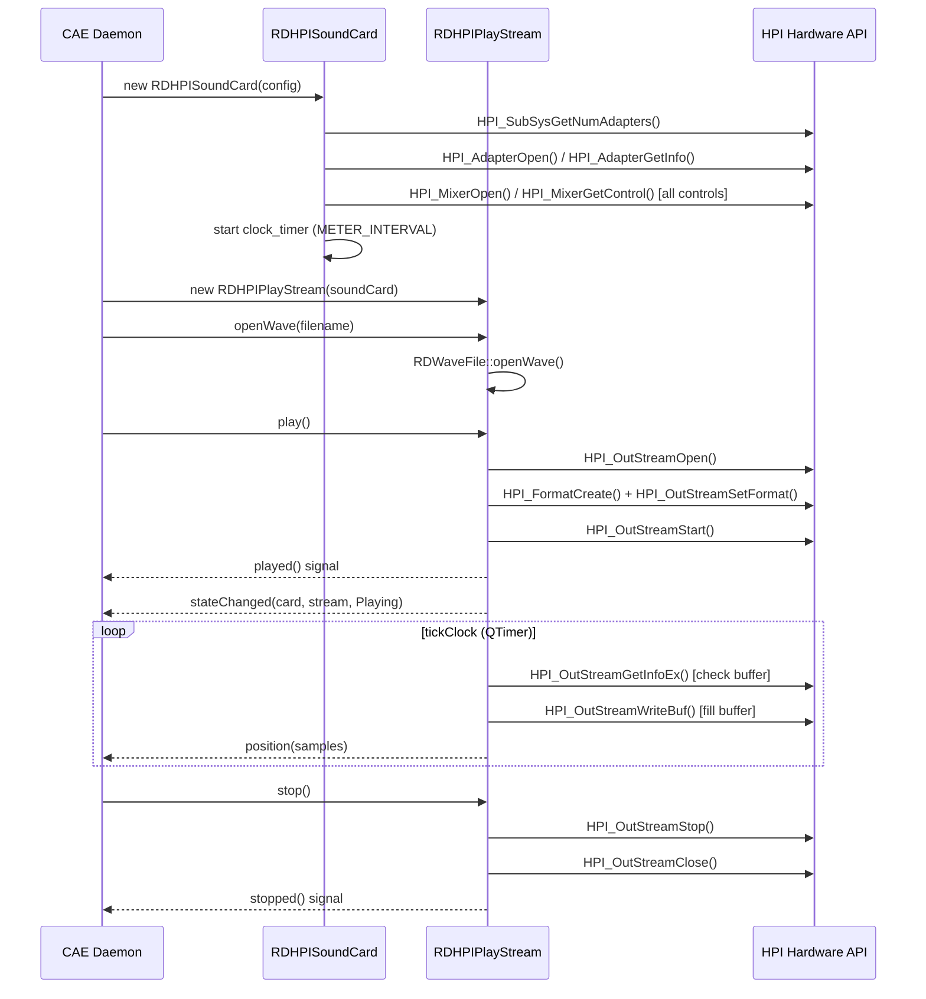
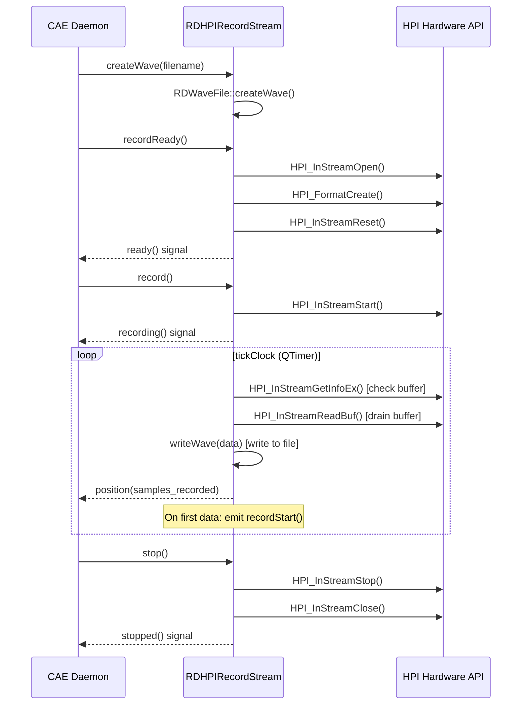
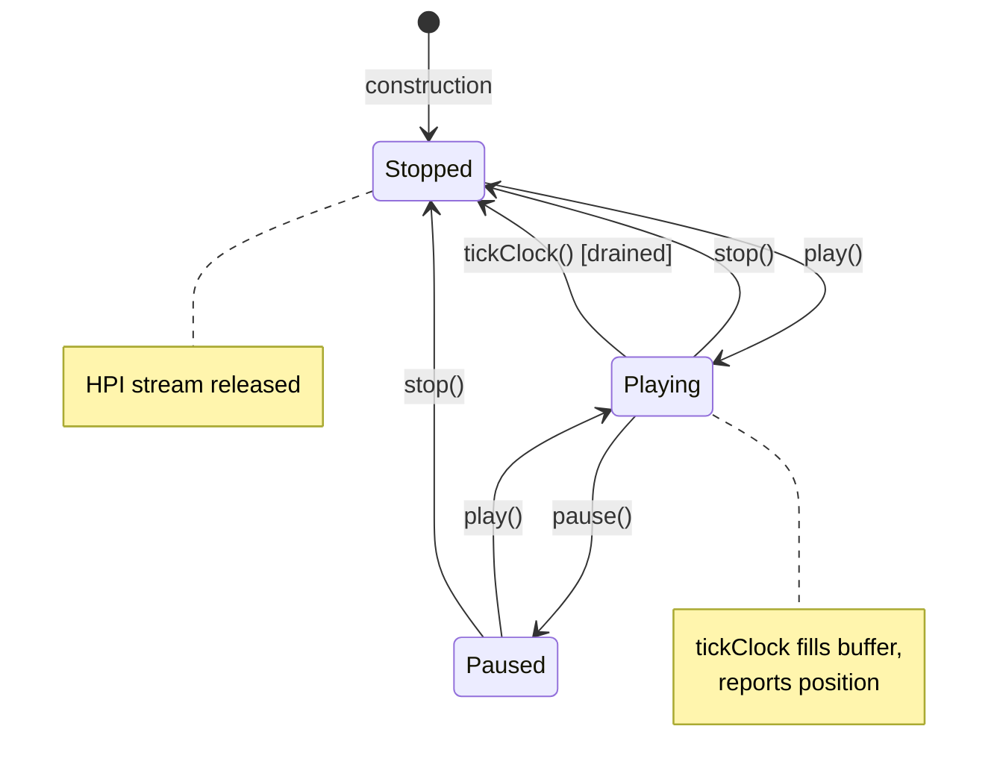
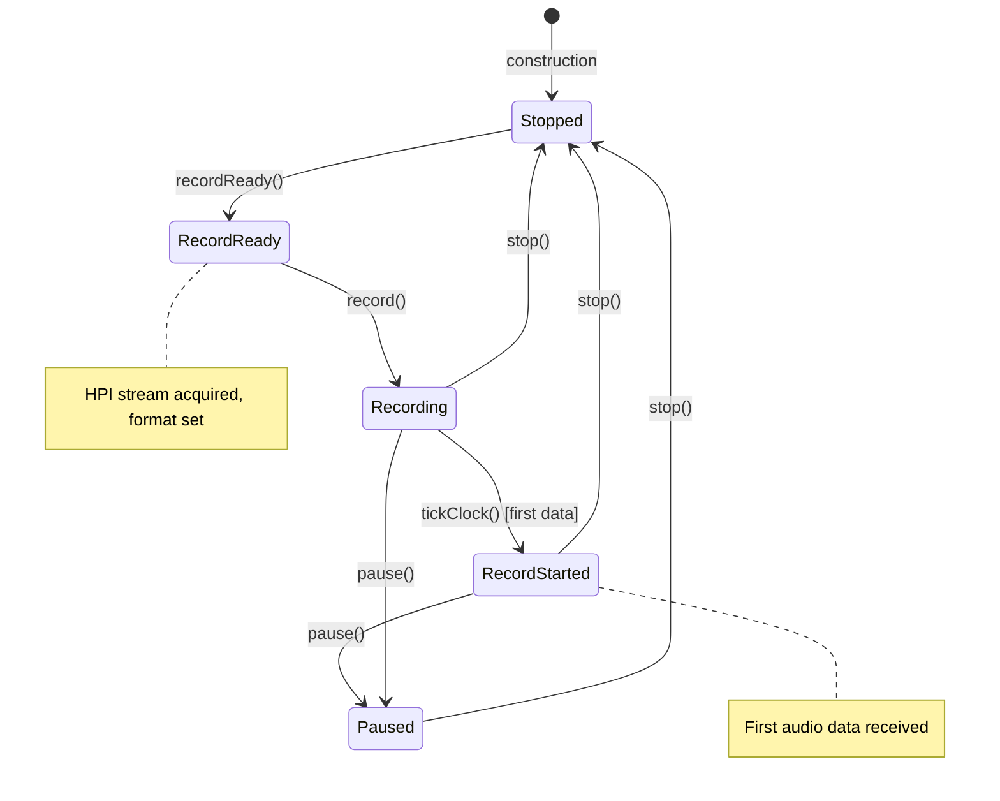

# Semantic Context: HPI (librdhpi)

## Overview

librdhpi is a Qt/C++ wrapper library around the AudioScience HPI (Host Programming Interface) SDK.
It provides an object-oriented abstraction for AudioScience professional sound cards used in broadcast
environments. The library encapsulates hardware probing, audio stream playback/recording, mixer control,
metering, and sound card selection. It is a priority-0 library that depends on LIB (librd) and is consumed
primarily by the CAE (caed) audio engine daemon and the RPC (ripcd) IPC daemon.

## Section A: Files & Symbols

### Source Files

| File | Type | Symbols | LOC (est) |
|------|------|---------|-----------|
| rdhpiinformation.h | header | RDHPIInformation | ~30 |
| rdhpiinformation.cpp | source | RDHPIInformation impl | ~50 |
| rdhpisoundcard.h | header | RDHPISoundCard (10 enums, ~80 methods) | ~190 |
| rdhpisoundcard.cpp | source | RDHPISoundCard impl | ~1050 |
| rdhpiplaystream.h | header | RDHPIPlayStream (2 enums, ~20 methods) | ~90 |
| rdhpiplaystream.cpp | source | RDHPIPlayStream impl | ~780 |
| rdhpirecordstream.h | header | RDHPIRecordStream (2 enums, ~20 methods) | ~90 |
| rdhpirecordstream.cpp | source | RDHPIRecordStream impl | ~700 |
| rdhpisoundselector.h | header | RDHPISoundSelector | ~25 |
| rdhpisoundselector.cpp | source | RDHPISoundSelector impl | ~70 |

Non-source files (not analyzed): rdhpi.pro, Makefile.am, 7 translation files (.ts)

### Symbol Index

| Symbol | Kind | File | Qt Class? |
|--------|------|------|-----------|
| RDHPIInformation | Class | rdhpiinformation.h | No (plain C++ class) |
| RDHPISoundCard | Class | rdhpisoundcard.h | Yes (Q_OBJECT) |
| RDHPISoundCard::FadeProfile | Enum | rdhpisoundcard.h | -- |
| RDHPISoundCard::Channel | Enum | rdhpisoundcard.h | -- |
| RDHPISoundCard::ChannelMode | Enum | rdhpisoundcard.h | -- |
| RDHPISoundCard::DeviceClass | Enum | rdhpisoundcard.h | -- |
| RDHPISoundCard::Driver | Enum | rdhpisoundcard.h | -- |
| RDHPISoundCard::ClockSource | Enum | rdhpisoundcard.h | -- |
| RDHPISoundCard::SourceNode | Enum | rdhpisoundcard.h | -- |
| RDHPISoundCard::DestNode | Enum | rdhpisoundcard.h | -- |
| RDHPISoundCard::TunerBand | Enum | rdhpisoundcard.h | -- |
| RDHPISoundCard::Subcarrier | Enum | rdhpisoundcard.h | -- |
| RDHPIPlayStream | Class | rdhpiplaystream.h | Yes (Q_OBJECT) |
| RDHPIPlayStream::State | Enum | rdhpiplaystream.h | -- |
| RDHPIPlayStream::Error | Enum | rdhpiplaystream.h | -- |
| RDHPIRecordStream | Class | rdhpirecordstream.h | Yes (Q_OBJECT) |
| RDHPIRecordStream::RecordState | Enum | rdhpirecordstream.h | -- |
| RDHPIRecordStream::Error | Enum | rdhpirecordstream.h | -- |
| RDHPISoundSelector | Class | rdhpisoundselector.h | Yes (Q_OBJECT) |

## Section B: Class API Surface

### RDHPIInformation [Value Object]
- **File:** rdhpiinformation.h / rdhpiinformation.cpp
- **Inherits:** (none)
- **Qt Object:** No
- **Size:** 24 bytes

Simple data container for AudioScience adapter hardware information (serial number, HPI version, DSP version, PCB version, assembly version). Pure getter/setter class with a `clear()` method.

#### Public Methods
| Method | Return | Parameters | Brief |
|--------|--------|-----------|-------|
| serialNumber() | unsigned | () | Get adapter serial number |
| setSerialNumber() | void | (unsigned num) | Set adapter serial number |
| hpiMajorVersion() | unsigned | () | Get HPI major version |
| setHpiMajorVersion() | void | (unsigned ver) | Set HPI major version |
| hpiMinorVersion() | unsigned | () | Get HPI minor version |
| setHpiMinorVersion() | void | (unsigned ver) | Set HPI minor version |
| hpiPointVersion() | unsigned | () | Get HPI point version |
| setHpiPointVersion() | void | (unsigned ver) | Set HPI point version |
| hpiVersion() | uint32_t | () | Get composite HPI version |
| setHpiVersion() | void | (uint32_t ver) | Set composite HPI version (decomposes to major/minor/point) |
| dspMajorVersion() | unsigned | () | Get DSP firmware major version |
| setDspMajorVersion() | void | (unsigned ver) | Set DSP firmware major version |
| dspMinorVersion() | unsigned | () | Get DSP firmware minor version |
| setDspMinorVersion() | void | (unsigned ver) | Set DSP firmware minor version |
| pcbVersion() | unsigned | () | Get PCB version letter |
| setPcbVersion() | void | (unsigned ver) | Set PCB version letter |
| assemblyVersion() | unsigned | () | Get assembly version |
| setAssemblyVersion() | void | (unsigned ver) | Set assembly version |
| clear() | void | () | Reset all fields to zero |

#### Enums
(none)

---

### RDHPISoundCard [Service / Hardware Abstraction]
- **File:** rdhpisoundcard.h / rdhpisoundcard.cpp
- **Inherits:** QObject
- **Qt Object:** Yes (Q_OBJECT)
- **Constructor:** `RDHPISoundCard(RDConfig *config, QObject *parent=0)`

Central class wrapping the AudioScience HPI subsystem. On construction, probes all available adapters via `HPIProbe()`, discovers capabilities (streams, ports, mixers, meters, VOX, mux controls), and starts a periodic timer for AES/EBU error monitoring. Provides full mixer control API.

#### Signals
| Signal | Parameters | Description |
|--------|-----------|-------------|
| inputPortError | (int card, int port) | AES/EBU error status changed on input port |
| leftInputStreamMeter | (int card, int stream, int level) | Left channel input stream meter level |
| leftOutputStreamMeter | (int card, int stream, int level) | Left channel output stream meter level |
| rightInputStreamMeter | (int card, int stream, int level) | Right channel input stream meter level |
| rightOutputStreamMeter | (int card, int stream, int level) | Right channel output stream meter level |
| leftInputPortMeter | (int card, int port, int level) | Left channel input port meter level |
| leftOutputPortMeter | (int card, int port, int level) | Left channel output port meter level |
| rightInputPortMeter | (int card, int port, int level) | Right channel input port meter level |
| rightOutputPortMeter | (int card, int port, int level) | Right channel output port meter level |
| inputMode | (int card, int port, RDHPISoundCard::ChannelMode mode) | Input port channel mode changed |
| outputMode | (int card, int stream, RDHPISoundCard::ChannelMode mode) | Output stream channel mode changed |
| tunerSubcarrierChanged | (RDHPISoundCard::Subcarrier car, bool state) | Tuner subcarrier state changed |

#### Slots
| Slot | Visibility | Parameters | Description |
|------|-----------|-----------|-------------|
| setInputVolume | public | (int card, int stream, int level) | Set input stream volume gain |
| setOutputVolume | public | (int card, int stream, int port, int level) | Set output stream volume gain |
| fadeOutputVolume | public | (int card, int stream, int port, int level, int length) | Auto-fade output volume over time |
| setInputLevel | public | (int card, int port, int level) | Set input port trim level |
| setOutputLevel | public | (int card, int port, int level) | Set output port trim level |
| setInputMode | public | (int card, int port, ChannelMode mode) | Set input port channel mode |
| setOutputMode | public | (int card, int stream, ChannelMode mode) | Set output stream channel mode |
| setInputStreamVOX | public | (int card, int stream, short gain) | Set VOX threshold on input stream |
| havePassthroughVolume | public | (int card, int in_port, int out_port) -> bool | Check passthrough volume support |
| setPassthroughVolume | public | (int card, int in_port, int out_port, int level) -> bool | Set passthrough volume |
| clock | private | () | Periodic timer handler: polls AES/EBU error status |

#### Public Methods
| Method | Return | Parameters | Brief |
|--------|--------|-----------|-------|
| driver() | Driver | () const | Returns driver type (always Hpi for this lib) |
| hpiInformation() | RDHPIInformation* | (int card) | Get hardware info for adapter |
| getCardQuantity() | int | () const | Number of detected adapters |
| getCardInputStreams() | int | (int card) const | Number of input streams on adapter |
| getCardOutputStreams() | int | (int card) const | Number of output streams on adapter |
| getCardInputPorts() | int | (int card) const | Number of input ports on adapter |
| getCardOutputPorts() | int | (int card) const | Number of output ports on adapter |
| getCardInfo() | const void* | (int card) const | Raw adapter info pointer |
| getCardDescription() | QString | (int card) const | Human-readable adapter description |
| getInputStreamDescription() | QString | (int card, int stream) const | Input stream description |
| getOutputStreamDescription() | QString | (int card, int stream) const | Output stream description |
| getInputPortDescription() | QString | (int card, int port) const | Input port description |
| getOutputPortDescription() | QString | (int card, int port) const | Output port description |
| setClockSource() | bool | (int card, ClockSource src) | Set sample clock source |
| haveTimescaling() | bool | (int card) const | Check timescale support (ASI 6xxx cards) |
| haveInputVolume() | bool | (int card, int stream, int port) const | Check input volume control exists |
| haveOutputVolume() | bool | (int card, int stream, int port) const | Check output volume control exists |
| haveInputLevel() | bool | (int card, int port) const | Check input level control exists |
| haveOutputLevel() | bool | (int card, int port) const | Check output level control exists |
| haveInputStreamMeter() | bool | (int card, int stream) const | Check input stream meter exists |
| haveOutputStreamMeter() | bool | (int card, int stream) const | Check output stream meter exists |
| haveInputPortMeter() | bool | (int card, int port) const | Check input port meter exists |
| haveOutputPortMeter() | bool | (int card, int port) const | Check output port meter exists |
| haveTuner() | bool | (int card, int port) const | Check tuner support (always returns false -- stub) |
| tunerBand() | TunerBand | (int card, int port) | Get tuner band (stub) |
| setTunerBand() | void | (int card, int port, TunerBand band) | Set tuner band (stub) |
| tunerFrequency() | int | (int card, int port) | Get tuner frequency (stub, returns 0) |
| setTunerFrequency() | void | (int card, int port, int freq) | Set tuner frequency (stub) |
| tunerSubcarrier() | bool | (int card, int port, Subcarrier sub) | Get subcarrier state (stub, returns false) |
| tunerLowFrequency() | int | (int card, int port, TunerBand band) | Get tuner low freq (stub, returns 0) |
| tunerHighFrequency() | int | (int card, int port, TunerBand band) | Get tuner high freq (stub, returns 0) |
| inputStreamMeter() | bool | (int card, int stream, short *level) | Read input stream peak meter |
| outputStreamMeter() | bool | (int card, int stream, short *level) | Read output stream peak meter |
| inputPortMeter() | bool | (int card, int port, short *level) | Read input port peak meter |
| outputPortMeter() | bool | (int card, int port, short *level) | Read output port peak meter |
| haveInputMode() | bool | (int card, int port) const | Check channel mode control exists |
| haveOutputMode() | bool | (int card, int stream) const | Check output mode control exists |
| haveInputStreamVOX() | bool | (int card, int stream) const | Check VOX control exists |
| haveInputPortMux() | bool | (int card, int port) const | Check input port multiplexer exists |
| queryInputPortMux() | bool | (int card, int port, SourceNode node) const | Check if source node available on mux |
| haveInputStreamMux() | bool | (int card, int stream) const | Check input stream mux exists |
| getInputVolume() | int | (int card, int stream, int port) | Get input stream volume gain |
| getOutputVolume() | int | (int card, int stream, int port) | Get output stream volume gain |
| getInputLevel() | int | (int card, int port) | Get input port trim level |
| getOutputLevel() | int | (int card, int port) | Get output port trim level |
| getInputPortMux() | SourceNode | (int card, int port) | Get current mux source selection |
| setInputPortMux() | bool | (int card, int port, SourceNode node) | Set mux source selection |
| getFadeProfile() | FadeProfile | () const | Get current fade profile |
| getInputPortError() | unsigned short | (int card, int port) | Get AES/EBU error word |
| setFadeProfile() | void | (FadeProfile profile) | Set fade profile (Linear or Log) |
| config() | RDConfig* | () const | Get configuration object |

#### Private Methods
| Method | Return | Parameters | Brief |
|--------|--------|-----------|-------|
| HPIProbe() | void | () | Probe all adapters, init mixer controls |
| LogHpi() | hpi_err_t | (hpi_err_t err, int lineno) | Log HPI errors via syslog |

#### Enums
| Enum | Values |
|------|--------|
| FadeProfile | Linear=0, Log=1 |
| Channel | Left=0, Right=1 |
| ChannelMode | Normal=0, Swap=1, LeftOnly=2, RightOnly=3 |
| DeviceClass | RecordDevice=0, PlayDevice=1 |
| Driver | Alsa=0, Hpi=1, Jack=2 |
| ClockSource | Internal=0, AesEbu=1, SpDiff=2, WordClock=4 |
| SourceNode | SourceBase=100, OStream=101, LineIn=102, AesEbuIn=103, Tuner=104, RfIn=105, Clock=106, Raw=107, Mic=108 |
| DestNode | DestBase=200, IStream=201, LineOut=202, AesEbuOut=203, RfOut=204, Speaker=205 |
| TunerBand | Fm=0, FmStereo=1, Am=2, Tv=3 |
| Subcarrier | Mpx=0, Rds=1 |

---

### RDHPIPlayStream [Service / Audio Playback]
- **File:** rdhpiplaystream.h / rdhpiplaystream.cpp
- **Inherits:** RDWaveFile (from LIB)
- **Qt Object:** Yes (Q_OBJECT)
- **Constructor:** `RDHPIPlayStream(RDHPISoundCard *card, QWidget *parent=0)`

HPI-based audio playback stream. Opens a wave file, acquires an HPI output stream, and plays audio with support for pause, stop, position seek, speed/pitch control, and play length limiting. Uses a QTimer (`clock`) for periodic buffer filling and position reporting via `tickClock()`.

#### Signals
| Signal | Parameters | Description |
|--------|-----------|-------------|
| isStopped | (bool state) | Stopped state changed |
| played | () | Playback started |
| paused | () | Playback paused |
| stopped | () | Playback stopped |
| position | (int samples) | Current playback position in samples |
| stateChanged | (int card, int stream, int state) | Stream state changed (card, stream, new state) |

#### Slots
| Slot | Visibility | Parameters | Description |
|------|-----------|-----------|-------------|
| setCard | public | (int card) | (declared but not shown in overview) |
| play | public | () -> bool | Start playback; acquires stream, opens adapter |
| pause | public | () | Pause playback |
| stop | public | () | Stop playback and free stream |
| currentPosition | public | () -> int | Get current position in samples |
| setPosition | public | (unsigned samples) -> bool | Seek to position |
| setPlayLength | public | (int length) | Set max play length (timer-based cutoff) |
| tickClock | public | () | Timer handler: fill buffer, report position, detect drain |

#### Public Methods
| Method | Return | Parameters | Brief |
|--------|--------|-----------|-------|
| errorString() | QString | (Error err) | Human-readable error description |
| formatSupported() | bool | (RDWaveFile::Format format) | Check if HPI card supports format |
| formatSupported() | bool | () | Check current file format support |
| openWave() | Error | () | Open current wave file for playback |
| openWave() | Error | (QString filename) | Open named wave file for playback |
| closeWave() | void | () | Close wave file |
| getCard() | int | () const | Get card number |
| getStream() | int | () const | Get stream number |
| getSpeed() | int | () const | Get playback speed |
| setSpeed() | bool | (int speed, bool pitch, bool rate) | Set playback speed with pitch/rate control |
| getState() | State | () const | Get current stream state |

#### Private Methods
| Method | Return | Parameters | Brief |
|--------|--------|-----------|-------|
| Drained() | void | () | Handle stream drain (end of playback) |
| GetStream() | int | () | Acquire HPI output stream |
| FreeStream() | void | () | Release HPI output stream |
| LogHpi() | hpi_err_t | (hpi_err_t err, int lineno) | Log HPI errors |

#### Enums
| Enum | Values |
|------|--------|
| State | Stopped=0, Playing=1, Paused=2 |
| Error | Ok=0, NoFile=1, NoStream=2, AlreadyOpen=3 |

---

### RDHPIRecordStream [Service / Audio Recording]
- **File:** rdhpirecordstream.h / rdhpirecordstream.cpp
- **Inherits:** RDWaveFile (from LIB)
- **Qt Object:** Yes (Q_OBJECT)
- **Constructor:** `RDHPIRecordStream(RDHPISoundCard *card, QWidget *parent=0)`

HPI-based audio recording stream. Creates wave files, acquires an HPI input stream, and records audio with support for pause, stop, VOX (voice-operated switching), and record length limiting. Uses a QTimer for periodic buffer draining and position reporting.

#### Signals
| Signal | Parameters | Description |
|--------|-----------|-------------|
| isStopped | (bool state) | Stopped state changed |
| ready | () | Stream is ready to record |
| recording | () | Recording has started capturing data |
| recordStart | () | First audio data received (actual record start) |
| paused | () | Recording paused |
| stopped | () | Recording stopped |
| position | (int samples) | Current record position in samples |
| stateChanged | (int card, int stream, int state) | Stream state changed |

#### Slots
| Slot | Visibility | Parameters | Description |
|------|-----------|-----------|-------------|
| setCard | public | (int card) | Set card number |
| setStream | public | (int stream) | Set stream number |
| recordReady | public | () -> bool | Prepare stream for recording (acquire, format, reset) |
| record | public | () | Start recording |
| pause | public | () | Pause recording |
| stop | public | () | Stop recording and free stream |
| setInputVOX | public | (int gain) | Set VOX threshold |
| setRecordLength | public | (int length) | Set max record length (timer-based cutoff) |
| tickClock | private | () | Timer handler: drain buffer, report position, detect start |

#### Public Methods
| Method | Return | Parameters | Brief |
|--------|--------|-----------|-------|
| errorString() | QString | (Error err) | Human-readable error description |
| createWave() | Error | () | Create wave file for recording |
| createWave() | Error | (QString filename) | Create named wave file |
| closeWave() | void | () | Close wave file |
| formatSupported() | bool | (RDWaveFile::Format format) | Check if HPI card supports format |
| formatSupported() | bool | () | Check current format support |
| getCard() | int | () const | Get card number |
| getStream() | int | () const | Get stream number |
| haveInputVOX() | bool | () const | Check if VOX is available |
| getState() | RecordState | () | Get current record state |
| getPosition() | int | () const | Get current position |
| samplesRecorded() | unsigned | () const | Get total samples recorded |

#### Private Methods
| Method | Return | Parameters | Brief |
|--------|--------|-----------|-------|
| GetStream() | bool | () | Acquire HPI input stream |
| FreeStream() | void | () | Release HPI input stream |
| LogHpi() | hpi_err_t | (hpi_err_t err, int lineno) | Log HPI errors |

#### Enums
| Enum | Values |
|------|--------|
| RecordState | Recording=0, RecordReady=1, Paused=2, Stopped=3, RecordStarted=4 |
| Error | Ok=0, NoFile=1, NoStream=2, AlreadyOpen=3 |

---

### RDHPISoundSelector [UI Widget]
- **File:** rdhpisoundselector.h / rdhpisoundselector.cpp
- **Inherits:** Q3ListBox (Qt3 legacy list widget)
- **Qt Object:** Yes (Q_OBJECT)
- **Constructor:** `RDHPISoundSelector(RDHPISoundCard::DeviceClass dev_class, RDConfig *config, QWidget *parent=0)`

UI widget that displays available AudioScience sound card ports in a list box. When the user selects an item, it decodes the selection into card/port indices and emits change signals. Uses integer division/modulo with HPI_MAX_ADAPTERS to encode card+port into list index.

#### Signals
| Signal | Parameters | Description |
|--------|-----------|-------------|
| changed | (int card, int port) | User selected a different card/port combination |
| cardChanged | (int card) | Card selection changed |
| portChanged | (int port) | Port selection changed |

#### Slots
| Slot | Visibility | Parameters | Description |
|------|-----------|-----------|-------------|
| selection | private | (int selection) | Handles Q3ListBox::highlighted signal, decomposes selection |

#### Public Methods
(none beyond constructor)

#### Enums
(none)

## Section C: Data Model

This artifact contains **no database tables**. librdhpi is a pure hardware abstraction library that interacts with AudioScience HPI hardware API directly, not with any database. No CREATE TABLE, SELECT, INSERT, UPDATE, or DELETE statements exist in the rdhpi/ folder.

The library has no SQL dependencies. All state is held in-memory arrays indexed by card/stream/port numbers (using HPI_MAX_ADAPTERS, HPI_MAX_STREAMS, HPI_MAX_NODES constants).

## Section D: Reactive Architecture

### Signal/Slot Connections

| # | Sender | Signal | Receiver | Slot | File:Line |
|---|--------|--------|----------|------|-----------|
| 1 | clock_timer (QTimer) | timeout() | this (RDHPISoundCard) | clock() | rdhpisoundcard.cpp:1037 |
| 2 | clock (QTimer) | timeout() | this (RDHPIPlayStream) | tickClock() | rdhpiplaystream.cpp:120 |
| 3 | play_timer (QTimer) | timeout() | this (RDHPIPlayStream) | pause() | rdhpiplaystream.cpp:123 |
| 4 | clock (QTimer) | timeout() | this (RDHPIRecordStream) | tickClock() | rdhpirecordstream.cpp:100 |
| 5 | length_timer (QTimer) | timeout() | this (RDHPIRecordStream) | pause() | rdhpirecordstream.cpp:103 |
| 6 | this (Q3ListBox) | highlighted(int) | this (RDHPISoundSelector) | selection(int) | rdhpisoundselector.cpp:59 |

### Emit Summary

**RDHPISoundCard** emits:
- `inputPortError(card, port)` -- from `clock()` when AES/EBU error word changes

**RDHPIPlayStream** emits:
- `isStopped(bool)`, `played()`, `stateChanged(card,stream,state)` -- from `play()`
- `paused()`, `stateChanged(...)` -- from `pause()`
- `position(0)`, `isStopped(true)`, `stopped()`, `stateChanged(...)` -- from `stop()`
- `position(samples)` -- from `tickClock()` (periodic position update, every 3rd tick)
- `position(0)`, `isStopped(true)`, `stopped()`, `stateChanged(...)` -- from `tickClock()` on drain
- `position(samples)` -- from `setPosition()`

**RDHPIRecordStream** emits:
- `isStopped(false)`, `ready()`, `stateChanged(..., 1)` -- from `recordReady()`
- `isStopped(false)`, `recording()`, `stateChanged(..., 0)` -- from `record()`
- `paused()`, `stateChanged(..., 2)` -- from `pause()`
- `isStopped(true)`, `stopped()`, `stateChanged(..., Stopped)`, `position(0)` -- from `stop()`
- `recordStart()`, `stateChanged(..., 4)` -- from `tickClock()` on first data
- `position(samples_recorded)` -- from `tickClock()` periodically

**RDHPISoundSelector** emits:
- `changed(card, port)`, `cardChanged(card)`, `portChanged(port)` -- from `selection()`

### Key Sequence Diagrams





### Cross-Artifact Dependencies

| External Class | From Artifact | Used In HPI Files | Purpose |
|---------------|---------------|-------------------|---------|
| RDConfig | LIB | rdhpisoundcard.cpp | Configuration access |
| RDWaveFile | LIB | rdhpiplaystream.h, rdhpirecordstream.h | Base class for stream classes |
| RDApplication | LIB | rdhpisoundcard.cpp | Syslog access for error logging |
| Q3ListBox | Qt3Support | rdhpisoundselector.h | Base class for sound selector widget |

**Consumers of HPI (downstream):**

| External Artifact | Files | Classes Used | Purpose |
|------------------|-------|-------------|---------|
| CAE (caed) | cae/cae.h, cae/cae_hpi.cpp | RDHPISoundCard, RDHPIPlayStream, RDHPIRecordStream, RDHPIInformation | Full audio engine using HPI cards |
| RPC (ripcd) | ripcd/ | RDHPISoundCard | Sound card access for GPIO/status |
| All GUI apps | rdairplay, rdadmin, rdlibrary, etc. | (indirect via #include) | Sound card configuration headers |

## Section E: Business Rules

### Rule: Array Bounds Validation
- **Source:** rdhpisoundcard.cpp:197-249 (multiple methods)
- **Trigger:** Any getter/setter call with card/stream/port indices
- **Condition:** `card >= HPI_MAX_ADAPTERS || stream >= HPI_MAX_STREAMS || port >= HPI_MAX_NODES`
- **Action:** Return false / return immediately without performing operation
- **Gherkin:**
  ```gherkin
  Scenario: Out-of-bounds card index rejected
    Given an HPI sound card instance
    When a method is called with card index >= HPI_MAX_ADAPTERS
    Then the method returns false (or void returns early)
    And no HPI API call is made
  ```

### Rule: Meter Bounds Validation
- **Source:** rdhpisoundcard.cpp:409-460
- **Trigger:** inputStreamMeter(), outputStreamMeter(), inputPortMeter(), outputPortMeter()
- **Condition:** `card >= card_quantity` or `stream >= card_input_streams[card]` (or port equivalent)
- **Action:** Returns false
- **Gherkin:**
  ```gherkin
  Scenario: Meter read on non-existent stream
    Given sound card with N input streams
    When inputStreamMeter is called with stream >= N
    Then returns false without reading hardware
  ```

### Rule: Volume Capability Guard
- **Source:** rdhpisoundcard.cpp:548, 561, 577, 594, 609, 623, 634, 658
- **Trigger:** setInputVolume, setOutputVolume, fadeOutputVolume, setInputLevel, setOutputLevel, setInputMode, setOutputMode, setPassthroughVolume
- **Condition:** Corresponding `have*()` returns false
- **Action:** Returns immediately (void) or returns false
- **Gherkin:**
  ```gherkin
  Scenario: Set volume on unsupported control
    Given a sound card without input volume on stream S
    When setInputVolume is called for stream S
    Then the method returns immediately without calling HPI API
  ```

### Rule: Input Port Mux Source Validation
- **Source:** rdhpisoundcard.cpp:266-290
- **Trigger:** setInputPortMux(card, port, node)
- **Condition:** node is not LineIn or AesEbuIn
- **Action:** Returns false (unsupported source node)
- **Gherkin:**
  ```gherkin
  Scenario: Set mux to unsupported source
    Given a sound card with multiplexer control
    When setInputPortMux is called with source node = Tuner
    Then returns false (only LineIn and AesEbuIn supported)
  ```

### Rule: Timescale Support Detection
- **Source:** rdhpisoundcard.cpp:717-722
- **Trigger:** HPIProbe() during construction
- **Condition:** `(adapter_type & 0xF000) == 0x6000` (ASI 6xxx series)
- **Action:** Sets timescale_support[i] = true
- **Gherkin:**
  ```gherkin
  Scenario: ASI 6xxx card detected for timescaling
    Given an AudioScience adapter with type 0x6xxx
    When the sound card is probed during initialization
    Then timescale support is enabled for that adapter
  ```

### Rule: Adapter-Specific Mux Type
- **Source:** rdhpisoundcard.cpp:723-731
- **Trigger:** HPIProbe() during construction
- **Condition:** Adapter type is 0x5111 or 0x5211
- **Action:** Sets input_mux_type[i] = true (stream-level mux vs port-level mux)
- **Gherkin:**
  ```gherkin
  Scenario: ASI 5111/5211 uses stream-level mux
    Given an AudioScience adapter type 0x5111 or 0x5211
    When probed during initialization
    Then input mux controls are at stream level (not port level)
  ```

### Rule: Format Support Dispatch
- **Source:** rdhpiplaystream.cpp:258-299, rdhpirecordstream.cpp:274-315
- **Trigger:** formatSupported() called without parameters
- **Condition:** Dispatches based on WAVE_FORMAT_PCM (by bits) or WAVE_FORMAT_MPEG (by layer)
- **Action:** Queries HPI card for specific format support
- **Gherkin:**
  ```gherkin
  Scenario: Check PCM16 format support
    Given a wave file with PCM format and 16-bit samples
    When formatSupported() is called
    Then it queries the HPI card for PCM16 signed format support
  ```

### Rule: Play Length Limit
- **Source:** rdhpiplaystream.cpp:123 (connect play_timer to pause)
- **Trigger:** setPlayLength(length) called before play()
- **Condition:** play_timer fires after specified milliseconds
- **Action:** Automatically pauses playback
- **Gherkin:**
  ```gherkin
  Scenario: Playback auto-pauses at length limit
    Given a play length of 5000ms set
    When playback runs for 5000ms
    Then playback is automatically paused
  ```

### Rule: Record Length Limit
- **Source:** rdhpirecordstream.cpp:103 (connect length_timer to pause)
- **Trigger:** setRecordLength(length) called before record()
- **Condition:** length_timer fires after specified milliseconds
- **Action:** Automatically pauses recording
- **Gherkin:**
  ```gherkin
  Scenario: Recording auto-pauses at length limit
    Given a record length of 60000ms set
    When recording runs for 60000ms
    Then recording is automatically paused
  ```

### Rule: HPI Error Logging
- **Source:** rdhpisoundcard.cpp:1042-1052 (and equivalent in play/record streams)
- **Trigger:** Any HPI API call wrapped in LogHpi()
- **Condition:** HPI function returns non-zero error code
- **Action:** Logs error text via RDApplication::syslog with LOG_WARNING, returns error code
- **Gherkin:**
  ```gherkin
  Scenario: HPI API error logged
    Given an HPI API call returns a non-zero error
    When the result passes through LogHpi()
    Then the error text is written to syslog at WARNING level
    And the error code is propagated to the caller
  ```

### Rule: AES/EBU Error Monitoring
- **Source:** rdhpisoundcard.cpp:671-686
- **Trigger:** clock() timer fires at METER_INTERVAL
- **Condition:** Error word changed since last poll
- **Action:** Emits inputPortError(card, port) signal
- **Gherkin:**
  ```gherkin
  Scenario: AES/EBU error detected
    Given an input port with AES/EBU receiver
    When the error status word changes between timer polls
    Then inputPortError signal is emitted for that card/port
  ```

### State Machines


*RDHPIPlayStream State Machine*


*RDHPIRecordStream State Machine*

### Error Patterns
| Error | Severity | Condition | Message |
|-------|----------|-----------|---------|
| HPI API Error | LOG_WARNING | Any HPI call returns non-zero | "HPI Error: {error_text}, {file} line {lineno}" |
| PlayStream NoFile | Error enum | File not found on openWave | "No such file or directory" |
| PlayStream NoStream | Error enum | No output stream available | "No output stream available" |
| PlayStream AlreadyOpen | Error enum | Stream already open | "Stream is already open" |
| RecordStream NoFile | Error enum | Cannot create file | "Unable to create/open file" |
| RecordStream NoStream | Error enum | No input stream available | "Input stream unavailable" |
| RecordStream AlreadyOpen | Error enum | Stream already open | "Stream is already open" |

## Section F: UI Contracts

This artifact contains **no .ui files and no .qml files**. The only UI component is `RDHPISoundSelector`, which is a programmatic widget (inherits Q3ListBox). It is documented fully in Section B.

### Widget: RDHPISoundSelector
- **Type:** Q3ListBox (Qt3 legacy list widget)
- **Layout:** Single list showing "Card Description - Port Description" entries
- **Selection:** Single selection; decodes to card/port via integer division/modulo
- **Data Flow:**
  - Source: RDHPISoundCard probed adapter/port descriptions
  - Display: Flat list of available card+port combinations
  - Edit: User selects item from list
  - Output: changed(card, port), cardChanged(card), portChanged(port) signals
