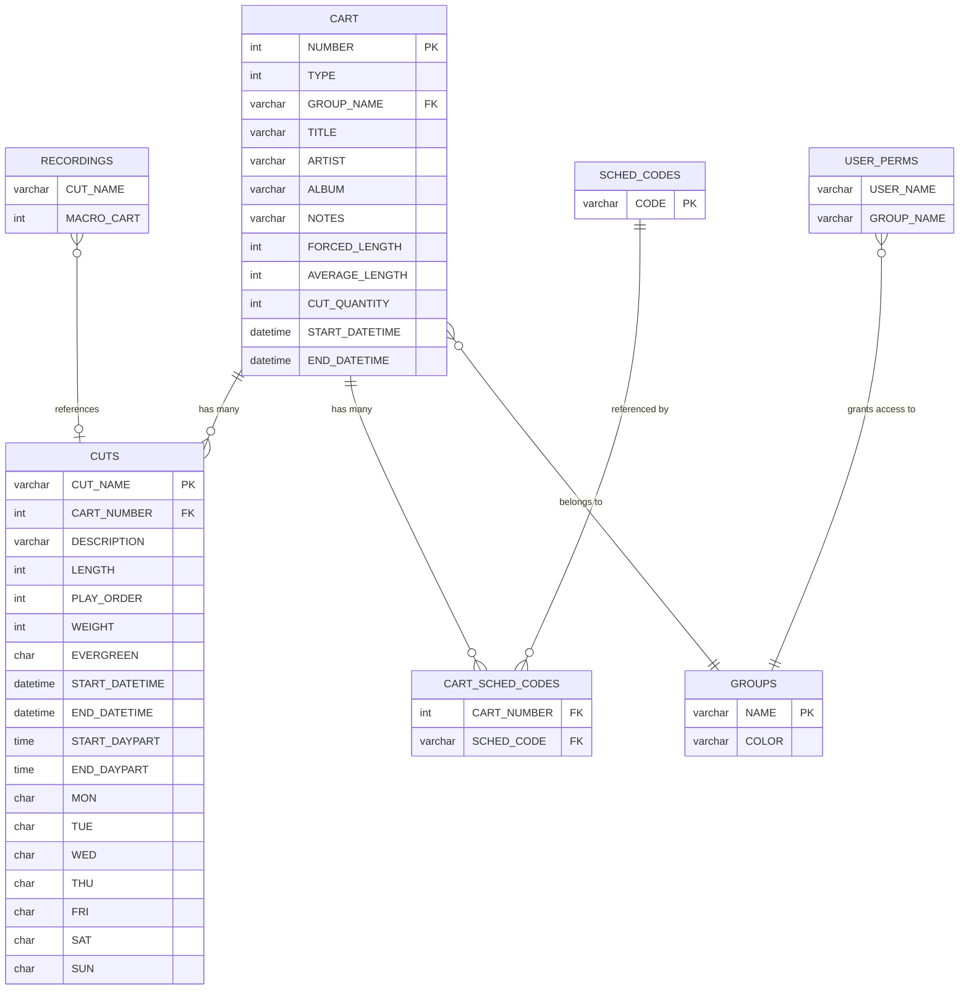
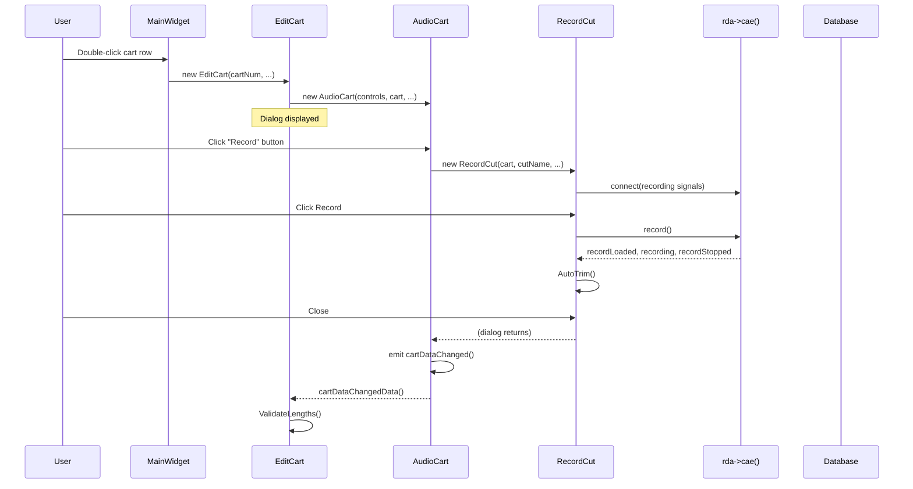
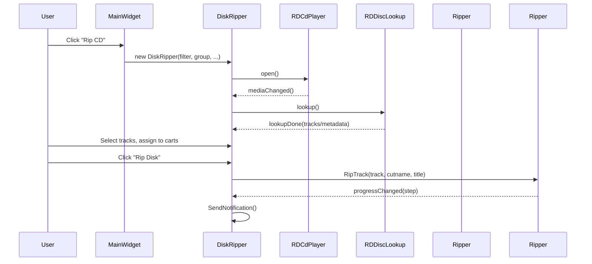
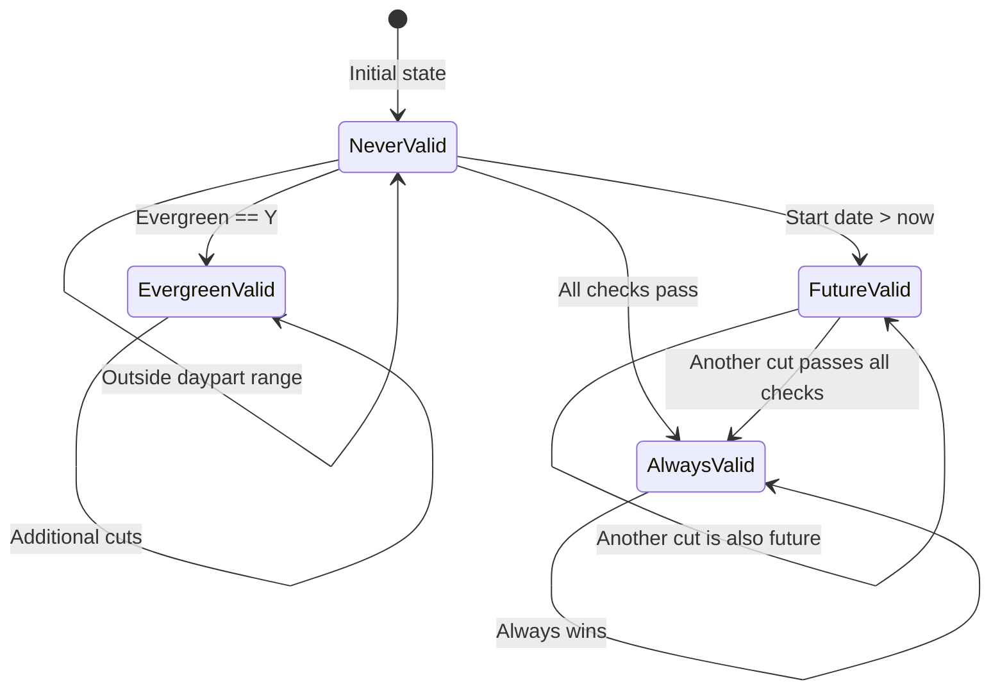

# Semantic Context: LBR (rdlibrary)

## Files & Symbols

### Source Files

| File | Type | Symbols | LOC (est) |
|------|------|---------|-----------|
| rdlibrary.h | header | MainWidget | ~200 |
| rdlibrary.cpp | source | MainWidget (impl), main(), SigHandler | ~900 |
| edit_cart.h | header | EditCart | ~80 |
| edit_cart.cpp | source | EditCart (impl) | ~600 |
| audio_cart.h | header | AudioCart, import_active | ~80 |
| audio_cart.cpp | source | AudioCart (impl) | ~500 |
| macro_cart.h | header | MacroCart | ~80 |
| macro_cart.cpp | source | MacroCart (impl) | ~400 |
| record_cut.h | header | RecordCut | ~150 |
| record_cut.cpp | source | RecordCut (impl) | ~600 |
| disk_ripper.h | header | DiskRipper | ~120 |
| disk_ripper.cpp | source | DiskRipper (impl) | ~700 |
| cdripper.h | header | CdRipper | ~100 |
| cdripper.cpp | source | CdRipper (impl) | ~500 |
| edit_macro.h | header | EditMacro | ~30 |
| edit_macro.cpp | source | EditMacro (impl) | ~100 |
| edit_notes.h | header | EditNotes | ~30 |
| edit_notes.cpp | source | EditNotes (impl) | ~100 |
| edit_schedulercodes.h | header | EditSchedulerCodes | ~30 |
| edit_schedulercodes.cpp | source | EditSchedulerCodes (impl) | ~100 |
| list_reports.h | header | ListReports | ~50 |
| list_reports.cpp | source | ListReports (impl) | ~300 |
| lib_listview.h | header | LibListView | ~30 |
| lib_listview.cpp | source | LibListView (impl) | ~100 |
| validate_cut.h | header | ValidateCutFields(), ValidateCut() | ~20 |
| validate_cut.cpp | source | ValidateCutFields(), ValidateCut() | ~100 |
| disk_gauge.h | header | DiskGauge | ~30 |
| disk_gauge.cpp | source | DiskGauge (impl) | ~80 |
| notebubble.h | header | NoteBubble | ~20 |
| notebubble.cpp | source | NoteBubble (impl) | ~50 |
| globals.h | header | globals (rdaudioport_conf, disk_gauge, cut_clipboard, import_running, ripper_running) | ~15 |
| audio_controls.h | header | AudioControls (struct/class) | ~30 |

### Symbol Index

| Symbol | Kind | File | Qt Class? |
|--------|------|------|-----------|
| MainWidget | Class | rdlibrary.h | Yes (Q_OBJECT) |
| EditCart | Class | edit_cart.h | Yes (Q_OBJECT) |
| AudioCart | Class | audio_cart.h | Yes (Q_OBJECT) |
| MacroCart | Class | macro_cart.h | Yes (Q_OBJECT) |
| RecordCut | Class | record_cut.h | Yes (Q_OBJECT) |
| DiskRipper | Class | disk_ripper.h | Yes (Q_OBJECT) |
| CdRipper | Class | cdripper.h | Yes (Q_OBJECT) |
| EditMacro | Class | edit_macro.h | Yes (Q_OBJECT) |
| EditNotes | Class | edit_notes.h | Yes (Q_OBJECT) |
| EditSchedulerCodes | Class | edit_schedulercodes.h | Yes (Q_OBJECT) |
| ListReports | Class | list_reports.h | Yes (Q_OBJECT) |
| LibListView | Class | lib_listview.h | Yes (Q_OBJECT) |
| DiskGauge | Class | disk_gauge.h | Yes (Q_OBJECT) |
| NoteBubble | Class | notebubble.h | Yes (Q_OBJECT) |
| AudioControls | Class/Struct | audio_controls.h | No |
| ValidateCutFields | Function | validate_cut.h | No |
| ValidateCut | Function | validate_cut.h | No |
| import_active | Variable | audio_cart.h | No |
| rdaudioport_conf | Variable | globals.h | No |
| disk_gauge | Variable | globals.h | No |
| cut_clipboard | Variable | globals.h | No |
| import_running | Variable | globals.h | No |
| ripper_running | Variable | globals.h | No |
| main | Function | rdlibrary.cpp | No |
| SigHandler | Function | rdlibrary.cpp | No |

## Class API Surface

### MainWidget [Application Main Window]
- **File:** rdlibrary.h / rdlibrary.cpp
- **Inherits:** RDWidget
- **Qt Object:** Yes (Q_OBJECT)
- **Constructor:** `MainWidget(RDConfig *c, QWidget *parent=0)`

#### Enums
| Enum | Values |
|------|--------|
| Column | Icon=0, Cart=1, Group=2, Length=3, Talk=4, Title=5, Artist=6, Start=7, End=8, Album=9, Label=10, Composer=11, Conductor=12, Publisher=13, Client=14, Agency=15, UserDefined=16, Cuts=17, LastCutPlayed=18, EnforceLength=19, PreservePitch=20, LengthDeviation=21, OwnedBy=22 |

#### Signals
None.

#### Slots
| Slot | Visibility | Parameters | Description |
|------|-----------|-----------|-------------|
| caeConnectedData | private | (bool state) | Handle CAE connection state |
| userData | private | () | Handle user login/change |
| filterChangedData | private | (const QString &str) | React to filter text changes |
| searchClickedData | private | () | Execute search |
| clearClickedData | private | () | Clear search filter |
| groupActivatedData | private | (const QString &str) | Group selection changed |
| addData | private | () | Add new cart |
| editData | private | () | Edit selected cart |
| deleteData | private | () | Delete selected cart |
| macroData | private | () | Add new macro cart |
| ripData | private | () | Open disk ripper |
| reportsData | private | () | Open reports dialog |
| playerShortcutData | private | () | Handle player keyboard shortcut |
| cartOnItemData | private | (Q3ListViewItem *item) | Cart list item hover |
| cartClickedData | private | () | Cart list item clicked |
| cartDoubleclickedData | private | (Q3ListViewItem *, const QPoint &, int) | Cart list item double-clicked (edit) |
| audioChangedData | private | (int state) | Audio filter checkbox changed |
| macroChangedData | private | (int state) | Macro filter checkbox changed |
| searchLimitChangedData | private | (int state) | Search limit checkbox changed |
| dragsChangedData | private | (int state) | Drag-and-drop checkbox changed |
| notificationReceivedData | private | (RDNotification *notify) | Handle RD notification |
| quitMainWidget | private | () | Quit application |

#### Public Methods
| Method | Return | Parameters | Brief |
|--------|--------|-----------|-------|
| sizeHint | QSize | () | Preferred window size |
| sizePolicy | QSizePolicy | () | Size policy |

#### Private Methods
| Method | Return | Parameters | Brief |
|--------|--------|-----------|-------|
| RefreshList | void | () | Refresh entire cart list |
| RefreshCuts | void | (RDListViewItem *p, unsigned cartnum) | Refresh cuts for a cart |
| WhereClause | QString | () | Build SQL WHERE clause for filtering |
| RefreshLine | void | (RDListViewItem *item) | Refresh single list line |
| UpdateItemColor | void | (RDListViewItem *item) | Update row color coding |
| SetCaption | void | (QString user) | Set window title with user |
| GetTypeFilter | QString | () | Get cart type filter string |
| GeometryFile | QString | () | Get geometry save file path |
| LoadGeometry | void | () | Load saved window geometry |
| SaveGeometry | void | () | Save window geometry |
| LockUser | void | () | Lock current user session |
| UnlockUser | void | () | Unlock user session |
| SendNotification | void | (RDNotification::Type, RDNotification::Action, QVariant) | Send notification to other clients |

#### Key Fields
| Field | Type | Purpose |
|-------|------|---------|
| lib_cart_list | LibListView* | Main cart list view widget |
| lib_filter_edit | QLineEdit* | Filter/search text input |
| lib_group_box | QComboBox* | Group selector dropdown |
| lib_player | RDSimplePlayer* | Embedded audio player |
| lib_progress_dialog | Q3ProgressDialog* | Progress indicator |
| lib_deleted_carts | std::vector<unsigned> | Track deleted carts for notifications |

---

### EditCart [Cart Editor Dialog]
- **File:** edit_cart.h / edit_cart.cpp
- **Inherits:** RDDialog
- **Qt Object:** Yes (Q_OBJECT)
- **Constructor:** `EditCart(unsigned number, QString *path, bool new_cart, bool profile_rip, QWidget *parent=0, const char *name=0, Q3ListView *lib_cart_list=NULL)`

#### Signals
None.

#### Slots
| Slot | Visibility | Parameters | Description |
|------|-----------|-----------|-------------|
| notesData | private | () | Open notes editor |
| scriptData | private | () | Open script/URL handler |
| lengthChangedData | private | (unsigned len) | React to length change from MacroCart |
| okData | private | () | Save and close |
| cancelData | private | () | Cancel and close |
| forcedLengthData | private | (bool) | Toggle forced length mode |
| asyncronousToggledData | private | (bool state) | Toggle async playback |
| cartDataChangedData | private | () | React to cart data modification |
| schedCodesData | private | () | Open scheduler codes editor |

#### Private Methods
| Method | Return | Parameters | Brief |
|--------|--------|-----------|-------|
| PopulateGroupList | void | () | Fill group dropdown |
| ValidateLengths | bool | () | Validate cart length fields |

#### Key Fields
| Field | Type | Purpose |
|-------|------|---------|
| rdcart_cart | RDCart* | Cart data object |
| rdcart_audio_cart | AudioCart* | Embedded audio cart widget |
| rdcart_macro_cart | MacroCart* | Embedded macro cart widget |
| rdcart_controls | AudioControls | Shared audio metadata controls |
| rdcart_new_cart | bool | Whether this is a new cart |
| sched_codes | QString | Scheduler codes |

---

### AudioCart [Audio Cut Manager Widget]
- **File:** audio_cart.h / audio_cart.cpp
- **Inherits:** RDWidget
- **Qt Object:** Yes (Q_OBJECT)
- **Constructor:** `AudioCart(AudioControls *controls, RDCart *cart, QString *path, bool select_cut, bool profile_rip, QWidget *parent=0)`

#### Signals
| Signal | Parameters | Description |
|--------|-----------|-------------|
| cartDataChanged | () | Emitted when cart data is modified |
| audioChanged | () | Emitted when audio content changes |

#### Slots
| Slot | Visibility | Parameters | Description |
|------|-----------|-----------|-------------|
| changeCutScheduling | public | (int sched) | Change cut scheduling mode |
| addCutData | private | () | Add a new cut |
| deleteCutData | private | () | Delete selected cut(s) |
| copyCutData | private | () | Copy selected cut |
| pasteCutData | private | () | Paste cut from clipboard |
| editCutData | private | () | Edit selected cut metadata |
| recordCutData | private | () | Open recording dialog |
| ripCutData | private | () | Open CD ripper for cut |
| importCutData | private | () | Import audio file as cut |
| extEditorCutData | private | () | Fork external audio editor for cut |
| doubleClickedData | private | (Q3ListViewItem*, const QPoint&, int) | Handle cut double-click |
| copyProgressData | private | (const QVariant &step) | Update copy progress |

#### Private Methods
| Method | Return | Parameters | Brief |
|--------|--------|-----------|-------|
| SelectedCuts | RDListViewItem* | (std::vector<QString> *cutnames) | Get currently selected cuts |
| RefreshList | void | () | Refresh cut list |
| RefreshLine | void | (RDListViewItem *item) | Refresh single cut line |
| NextCut | unsigned | () | Get next available cut number |

---

### MacroCart [Macro Event Editor Widget]
- **File:** macro_cart.h / macro_cart.cpp
- **Inherits:** RDWidget
- **Qt Object:** Yes (Q_OBJECT)
- **Constructor:** `MacroCart(RDCart *cart, QWidget *parent=0)`

#### Signals
| Signal | Parameters | Description |
|--------|-----------|-------------|
| lengthChanged | (unsigned len) | Emitted when total macro length changes |

#### Slots
| Slot | Visibility | Parameters | Description |
|------|-----------|-----------|-------------|
| addMacroData | private | () | Add macro line |
| deleteMacroData | private | () | Delete selected macro line |
| copyMacroData | private | () | Copy macro line |
| pasteMacroData | private | () | Paste macro line |
| editMacroData | private | () | Edit macro line |
| runLineMacroData | private | () | Execute single macro line |
| runCartMacroData | private | () | Execute entire macro cart |
| selectionChangedData | private | (Q3ListViewItem*) | Selection changed in list |
| doubleClickedData | private | (Q3ListViewItem*) | Double-click to edit |

#### Public Methods
| Method | Return | Parameters | Brief |
|--------|--------|-----------|-------|
| length | unsigned | () | Get total macro length |
| save | void | () | Save macro events to DB |

#### Private Methods
| Method | Return | Parameters | Brief |
|--------|--------|-----------|-------|
| RefreshList | void | () | Refresh macro list |
| RefreshLine | void | (Q3ListViewItem *item) | Refresh single line |
| AddLine | void | (unsigned line, RDMacro *cmd) | Add macro command at line |
| DeleteLine | void | (Q3ListViewItem *item) | Delete a macro line |
| UpdateLength | void | () | Recalculate total length |
| SortLines | void | () | Sort macro lines by order |

---

### RecordCut [Cut Recording/Editing Dialog]
- **File:** record_cut.h / record_cut.cpp
- **Inherits:** RDDialog
- **Qt Object:** Yes (Q_OBJECT)
- **Constructor:** `RecordCut(RDCart *cart, QString cut, bool use_weight, QWidget *parent=0)`

#### Signals
None.

#### Slots
| Slot | Visibility | Parameters | Description |
|------|-----------|-----------|-------------|
| airDateButtonData | private | (int) | Toggle air date enable/disable |
| daypartButtonData | private | (int) | Toggle daypart enable/disable |
| setAllData | private | () | Set all days of week |
| clearAllData | private | () | Clear all days of week |
| channelsData | private | (int) | Change channel count |
| recordData | private | () | Start recording |
| playData | private | () | Start playback |
| stopData | private | () | Stop recording/playback |
| recordLoadedData | private | (int, int) | Recording loaded callback |
| recordedData | private | (int, int) | Recording in-progress callback |
| recordStoppedData | private | (int, int) | Recording stopped callback |
| recordUnloadedData | private | (int, int, unsigned) | Recording unloaded callback |
| playedData | private | (int) | Playback started callback |
| playStoppedData | private | (int) | Playback stopped callback |
| closeData | private | () | Save and close dialog |
| initData | private | (bool) | Initialize recording |
| recTimerData | private | () | Recording timer tick |
| aesAlarmData | private | (int, int, bool) | AES alarm callback |
| meterData | private | () | Audio meter update |
| evergreenToggledData | private | (bool) | Toggle evergreen status |

#### Private Methods
| Method | Return | Parameters | Brief |
|--------|--------|-----------|-------|
| AutoTrim | void | (RDWaveFile *name) | Auto-trim silence from recording |

#### Key Fields
| Field | Type | Purpose |
|-------|------|---------|
| rec_cut | RDCut* | Cut data object |
| rec_card_no / rec_stream_no / rec_port_no | int | Audio hardware config |
| is_playing / is_recording / is_closing | bool | State flags |
| rec_evergreen_box | QCheckBox* | Evergreen (never expires) toggle |

---

### DiskRipper [Batch CD Ripper Dialog]
- **File:** disk_ripper.h / disk_ripper.cpp
- **Inherits:** RDDialog
- **Qt Object:** Yes (Q_OBJECT)
- **Constructor:** `DiskRipper(QString *filter, QString *group, QString *schedcode, bool profile_rip, QWidget *parent=0)`

#### Signals
None.

#### Slots
| Slot | Visibility | Parameters | Description |
|------|-----------|-----------|-------------|
| ejectButtonData | private | () | Eject CD |
| playButtonData | private | () | Play selected track |
| stopButtonData | private | () | Stop playback |
| ripDiskButtonData | private | () | Start batch ripping |
| ejectedData | private | () | CD ejected callback |
| setCutButtonData | private | () | Assign cut to track |
| setMultiButtonData | private | () | Set multi-track rip mode |
| setSingleButtonData | private | () | Set single-track rip mode |
| modifyCartLabelData | private | () | Modify cart label for track |
| clearSelectionData | private | () | Clear track selections |
| mediaChangedData | private | () | CD media changed |
| playedData | private | (int) | Playback started |
| stoppedData | private | () | Playback stopped |
| lookupDoneData | private | (RDDiscLookup::Result, const QString &err_msg) | CDDB/MusicBrainz lookup complete |
| normalizeCheckData | private | (bool) | Toggle normalize |
| autotrimCheckData | private | (bool) | Toggle auto-trim |
| selectionChangedData | private | () | Track selection changed |
| openBrowserData | private | () | Open browser for metadata |
| doubleClickedData | private | (Q3ListViewItem*, const QPoint&, int) | Track double-click |
| closeData | private | () | Close dialog |

#### Private Methods
| Method | Return | Parameters | Brief |
|--------|--------|-----------|-------|
| FocusSelection | void | (int cart_num) | Focus on specific cart |
| RipTrack | void | (int track, int end_track, QString cutname, QString title) | Rip a track range |
| UpdateRipButton | void | () | Update rip button state |
| BuildTrackName | QString | (int start_track, int end_track) const | Build track display name |
| SetArtistAlbum | void | () | Set artist/album from lookup |
| SendNotification | void | () | Notify other clients of new carts |

---

### CdRipper [Single Track CD Ripper Dialog]
- **File:** cdripper.h / cdripper.cpp
- **Inherits:** RDDialog
- **Qt Object:** Yes (Q_OBJECT)
- **Constructor:** `CdRipper(QString cutname, RDDiscRecord *rec, RDLibraryConf *conf, bool profile_rip, QWidget *parent=0)`

#### Slots
| Slot | Visibility | Parameters | Description |
|------|-----------|-----------|-------------|
| exec | public | (QString *title, QString *artist, QString *album, QString *label) | Execute dialog, return metadata |
| trackSelectionChangedData | private | () | Track selection changed |
| ejectButtonData | private | () | Eject CD |
| playButtonData | private | () | Play track |
| stopButtonData | private | () | Stop playback |
| ripTrackButtonData | private | () | Rip selected track |
| ejectedData | private | () | CD ejected |
| mediaChangedData | private | () | Media changed |
| playedData | private | (int) | Playback started |
| stoppedData | private | () | Playback stopped |
| lookupDoneData | private | (RDDiscLookup::Result, const QString &err_msg) | Lookup done |
| normalizeCheckData | private | (bool) | Toggle normalize |
| autotrimCheckData | private | (bool) | Toggle autotrim |
| openBrowserData | private | () | Open metadata browser |
| closeData | private | () | Close dialog |

#### Private Methods
| Method | Return | Parameters | Brief |
|--------|--------|-----------|-------|
| Profile | void | (const QString &msg) | Log profiling message |

---

### EditMacro [Macro Command Editor Dialog]
- **File:** edit_macro.h / edit_macro.cpp
- **Inherits:** RDDialog
- **Qt Object:** Yes (Q_OBJECT)
- **Constructor:** `EditMacro(RDMacro *cmd, bool highlight, QWidget *parent=0)`

#### Slots
| Slot | Visibility | Parameters | Description |
|------|-----------|-----------|-------------|
| okData | private | () | Save and close |
| cancelData | private | () | Cancel and close |

---

### EditNotes [Cart Notes Editor Dialog]
- **File:** edit_notes.h / edit_notes.cpp
- **Inherits:** RDDialog
- **Qt Object:** Yes (Q_OBJECT)
- **Constructor:** `EditNotes(RDCart *cart, QWidget *parent=0)`

#### Slots
| Slot | Visibility | Parameters | Description |
|------|-----------|-----------|-------------|
| okData | private | () | Save notes and close |
| cancelData | private | () | Cancel and close |

---

### EditSchedulerCodes [Scheduler Code Editor Dialog]
- **File:** edit_schedulercodes.h / edit_schedulercodes.cpp
- **Inherits:** RDDialog
- **Qt Object:** Yes (Q_OBJECT)
- **Constructor:** `EditSchedulerCodes(QString *sched_codes, QString *remove_codes, QWidget *parent=0)`

#### Slots
| Slot | Visibility | Parameters | Description |
|------|-----------|-----------|-------------|
| okData | private | () | Save codes and close |
| cancelData | private | () | Cancel and close |

---

### ListReports [Report Generator Dialog]
- **File:** list_reports.h / list_reports.cpp
- **Inherits:** RDDialog
- **Qt Object:** Yes (Q_OBJECT)
- **Constructor:** `ListReports(const QString &filter, const QString &type_filter, const QString &group, const QString &schedcode, QWidget *parent=0)`

#### Slots
| Slot | Visibility | Parameters | Description |
|------|-----------|-----------|-------------|
| typeActivatedData | private | (int index) | Report type selection changed |
| generateData | private | () | Generate selected report |
| closeData | private | () | Close dialog |

#### Private Methods
| Method | Return | Parameters | Brief |
|--------|--------|-----------|-------|
| GenerateCartReport | void | (QString *report) | Generate cart report |
| GenerateCutReport | void | (QString *report) | Generate cut report |
| GenerateCartDumpCsv | void | (QString *report, bool prepend_names) | Generate CSV export |

---

### LibListView [Custom Cart List View]
- **File:** lib_listview.h / lib_listview.cpp
- **Inherits:** RDListView
- **Qt Object:** Yes (Q_OBJECT)
- **Constructor:** `LibListView(QWidget *parent)`

#### Slots
| Slot | Visibility | Parameters | Description |
|------|-----------|-----------|-------------|
| enableNoteBubbles | public | (bool state) | Enable/disable note bubble tooltips |

#### Public Methods
| Method | Return | Parameters | Brief |
|--------|--------|-----------|-------|
| noteBubblesEnabled | bool | () const | Check if note bubbles are enabled |

#### Protected Methods (event overrides)
- leaveEvent, contentsMousePressEvent, contentsMouseMoveEvent, contentsMouseReleaseEvent

---

### DiskGauge [Disk Space Gauge Widget]
- **File:** disk_gauge.h / disk_gauge.cpp
- **Inherits:** RDWidget
- **Qt Object:** Yes (Q_OBJECT)
- **Constructor:** `DiskGauge(int samp_rate, int chans, QWidget *parent)`

#### Slots
| Slot | Visibility | Parameters | Description |
|------|-----------|-----------|-------------|
| update | public | () | Refresh disk space display |

#### Private Methods
| Method | Return | Parameters | Brief |
|--------|--------|-----------|-------|
| GetMinutes | unsigned | (uint64_t bytes) | Convert bytes to recording minutes |

---

### NoteBubble [Tooltip Popup for Cart Notes]
- **File:** notebubble.h / notebubble.cpp
- **Inherits:** QLabel
- **Qt Object:** Yes (Q_OBJECT)
- **Constructor:** `NoteBubble(QWidget *parent=0)`

#### Public Methods
| Method | Return | Parameters | Brief |
|--------|--------|-----------|-------|
| cartNumber | unsigned | () const | Get displayed cart number |
| setCartNumber | bool | (unsigned cartnum) | Set cart and show notes |

---

### AudioControls [Metadata Fields Container - DTO]
- **File:** audio_controls.h
- **Inherits:** (none)
- **Qt Object:** No
- **Category:** DTO (Data Transfer Object)

#### Fields
| Field | Type | Description |
|-------|------|-------------|
| enforce_length_box | QCheckBox* | Enforce length checkbox |
| forced_length_edit | RDTimeEdit* | Forced length time editor |
| song_id_edit | QLineEdit* | Song ID field |
| bpm_spin | QSpinBox* | Beats per minute spinner |
| title_edit | QLineEdit* | Title field |
| artist_edit | QLineEdit* | Artist field |
| album_edit | QLineEdit* | Album field |
| year_edit | QLineEdit* | Year field |
| label_edit | QLineEdit* | Label field |
| client_edit | QLineEdit* | Client field |
| agency_edit | QLineEdit* | Agency field |
| publisher_edit | QLineEdit* | Publisher field |
| conductor_edit | QLineEdit* | Conductor field |
| composer_edit | QLineEdit* | Composer field |
| user_defined_edit | QLineEdit* | User-defined field |

---

### Standalone Functions

#### ValidateCutFields
- **Signature:** `QString ValidateCutFields()`
- **Purpose:** Returns SQL field list for cut validation queries

#### ValidateCut
- **Signature:** `RDCart::Validity ValidateCut(RDSqlQuery *q, unsigned offset, RDCart::Validity prev_validity, const QDateTime &datetime)`
- **Purpose:** Validate a cut's scheduling validity (dates, dayparts, days of week)

## Data Model

### Tables Used by LBR (rdlibrary)

Note: Tables are defined in the LIB (librd) library via rddbmgr. LBR performs direct SQL against them.

### Table: CART
- **Used by:** MainWidget (SELECT, INSERT), EditCart (SELECT), NoteBubble (SELECT), ListReports (SELECT)
- **Operations:**
  - SELECT: Cart list display, filtering, search, note bubble tooltips
  - INSERT: New cart creation (addData)
  - UPDATE: Via RDCart library class (edit_cart okData)
  - DELETE: Via RDCart::remove() library call
- **Key columns accessed:** NUMBER, TYPE, GROUP_NAME, TITLE, ARTIST, ALBUM, YEAR, LABEL, CLIENT, AGENCY, PUBLISHER, CONDUCTOR, COMPOSER, USER_DEFINED, FORCED_LENGTH, AVERAGE_LENGTH, LENGTH_DEVIATION, CUT_QUANTITY, LAST_CUT_PLAYED, VALIDITY, ENFORCE_LENGTH, PRESERVE_PITCH, ASYNCRONOUS, OWNER, NOTES, MACROS, SONG_ID, BPM, START_DATETIME, END_DATETIME, USE_EVENT_LENGTH

### Table: CUTS
- **Used by:** MainWidget (SELECT), AudioCart (SELECT), EditCart (SELECT), ValidateCut (SELECT), ListReports (SELECT)
- **Operations:**
  - SELECT: Cut list display, validation, length calculation, reports
  - INSERT/UPDATE/DELETE: Via RDCut library class
- **Key columns accessed:** CUT_NAME, CART_NUMBER, DESCRIPTION, LENGTH, PLAY_ORDER, WEIGHT, EVERGREEN, START_DATETIME, END_DATETIME, START_DAYPART, END_DAYPART, MON, TUE, WED, THU, FRI, SAT, SUN, LAST_PLAY_DATETIME, PLAY_COUNTER, ORIGIN_DATETIME, ORIGIN_NAME, ORIGIN_LOGIN_NAME, SOURCE_HOSTNAME, OUTCUE, SHA1_HASH, TALK_START_POINT, TALK_END_POINT

### Table: GROUPS
- **Used by:** MainWidget (SELECT via JOIN), ListReports (SELECT via JOIN)
- **Operations:**
  - SELECT: Group color for cart list display, group name joins
- **Key columns accessed:** NAME, COLOR

### Table: USER_PERMS
- **Used by:** MainWidget (SELECT), EditCart (SELECT)
- **Operations:**
  - SELECT: Populate group dropdown filtered by user permissions
- **Key columns accessed:** USER_NAME, GROUP_NAME

### Table: SCHED_CODES
- **Used by:** MainWidget (SELECT), EditSchedulerCodes (SELECT)
- **Operations:**
  - SELECT: Populate scheduler code dropdowns
- **Key columns accessed:** CODE

### Table: CART_SCHED_CODES
- **Used by:** ListReports (SELECT)
- **Operations:**
  - SELECT: Get scheduler codes for cart in CSV reports
- **Key columns accessed:** CART_NUMBER, SCHED_CODE

### Table: RECORDINGS
- **Used by:** MainWidget (SELECT), AudioCart (SELECT)
- **Operations:**
  - SELECT: Check if cart/cut is used in catch events (prevents deletion)
- **Key columns accessed:** CUT_NAME, MACRO_CART

### ERD (tables accessed by LBR)



## Reactive Architecture

### Signal/Slot Connections

#### MainWidget (rdlibrary.cpp)

| # | Sender | Signal | Receiver | Slot | File:Line |
|---|--------|--------|----------|------|-----------|
| 1 | rda | userChanged() | this | userData() | rdlibrary.cpp:142 |
| 2 | rda->ripc() | notificationReceived(RDNotification*) | this | notificationReceivedData(RDNotification*) | rdlibrary.cpp:143 |
| 3 | lib_user_timer | timeout() | this | userData() | rdlibrary.cpp:149 |
| 4 | rda->cae() | isConnected(bool) | this | caeConnectedData(bool) | rdlibrary.cpp:154 |
| 5 | lib_filter_edit | textChanged(const QString&) | this | filterChangedData(const QString&) | rdlibrary.cpp:165 |
| 6 | lib_filter_edit | returnPressed() | this | searchClickedData() | rdlibrary.cpp:167 |
| 7 | lib_search_button | clicked() | this | searchClickedData() | rdlibrary.cpp:175 |
| 8 | lib_clear_button | clicked() | this | clearClickedData() | rdlibrary.cpp:191 |
| 9 | lib_group_box | activated(const QString&) | this | groupActivatedData(const QString&) | rdlibrary.cpp:200 |
| 10 | lib_codes_box | activated(const QString&) | this | groupActivatedData(const QString&) | rdlibrary.cpp:210 |
| 11 | lib_codes2_box | activated(const QString&) | this | groupActivatedData(const QString&) | rdlibrary.cpp:220 |
| 12 | lib_allowdrag_box | stateChanged(int) | this | dragsChangedData(int) | rdlibrary.cpp:240 |
| 13 | lib_showaudio_box | stateChanged(int) | this | audioChangedData(int) | rdlibrary.cpp:255 |
| 14 | lib_showmacro_box | stateChanged(int) | this | macroChangedData(int) | rdlibrary.cpp:266 |
| 15 | lib_showmatches_box | stateChanged(int) | this | searchLimitChangedData(int) | rdlibrary.cpp:289 |
| 16 | lib_cart_list | doubleClicked(Q3ListViewItem*,...) | this | cartDoubleclickedData(...) | rdlibrary.cpp:302 |
| 17 | lib_cart_list | selectionChanged() | this | cartClickedData() | rdlibrary.cpp:306 |
| 18 | lib_cart_list | onItem(Q3ListViewItem*) | this | cartOnItemData(Q3ListViewItem*) | rdlibrary.cpp:308 |
| 19 | lib_shownotes_box | toggled(bool) | lib_cart_list | enableNoteBubbles(bool) | rdlibrary.cpp:310 |
| 20 | lib_add_button | clicked() | this | addData() | rdlibrary.cpp:388 |
| 21 | lib_edit_button | clicked() | this | editData() | rdlibrary.cpp:397 |
| 22 | lib_delete_button | clicked() | this | deleteData() | rdlibrary.cpp:406 |
| 23 | lib_macro_button | clicked() | this | macroData() | rdlibrary.cpp:416 |
| 24 | lib_rip_button | clicked() | this | ripData() | rdlibrary.cpp:430 |
| 25 | lib_reports_button | clicked() | this | reportsData() | rdlibrary.cpp:438 |
| 26 | lib_close_button | clicked() | this | quitMainWidget() | rdlibrary.cpp:446 |
| 27 | lib_player_shortcut | activated() | this | playerShortcutData() | rdlibrary.cpp:469 |

#### EditCart (edit_cart.cpp)

| # | Sender | Signal | Receiver | Slot | File:Line |
|---|--------|--------|----------|------|-----------|
| 28 | enforce_length_box | toggled(bool) | this | forcedLengthData(bool) | edit_cart.cpp:174 |
| 29 | sched_codes_button | clicked() | this | schedCodesData() | edit_cart.cpp:318 |
| 30 | syncronous_box | toggled(bool) | this | asyncronousToggledData(bool) | edit_cart.cpp:456 |
| 31 | use_event_length_box | toggled(bool) | this | asyncronousToggledData(bool) | edit_cart.cpp:472 |
| 32 | notes_button | clicked() | this | notesData() | edit_cart.cpp:509 |
| 33 | script_button | clicked() | this | scriptData() | edit_cart.cpp:518 |
| 34 | rdcart_audio_cart | cartDataChanged() | this | cartDataChangedData() | edit_cart.cpp:533 |
| 35 | rdcart_cut_sched_box | activated(int) | rdcart_audio_cart | changeCutScheduling(int) | edit_cart.cpp:535 |
| 36 | rdcart_macro_cart | lengthChanged(unsigned) | this | lengthChangedData(unsigned) | edit_cart.cpp:545 |
| 37 | ok_button | clicked() | this | okData() | edit_cart.cpp:572 |
| 38 | cancel_button | clicked() | this | cancelData() | edit_cart.cpp:586 |

#### AudioCart (audio_cart.cpp)

| # | Sender | Signal | Receiver | Slot | File:Line |
|---|--------|--------|----------|------|-----------|
| 39 | add_cut_button | clicked() | this | addCutData() | audio_cart.cpp:68 |
| 40 | delete_cut_button | clicked() | this | deleteCutData() | audio_cart.cpp:77 |
| 41 | copy_cut_button | clicked() | this | copyCutData() | audio_cart.cpp:86 |
| 42 | paste_cut_button | clicked() | this | pasteCutData() | audio_cart.cpp:95 |
| 43 | rdcart_cut_list | doubleClicked(...) | this | doubleClickedData(...) | audio_cart.cpp:106 |
| 44 | record_cut_button | clicked() | this | recordCutData() | audio_cart.cpp:175 |
| 45 | ext_editor_cut_button | clicked() | this | extEditorCutData() | audio_cart.cpp:184 |
| 46 | edit_cut_button | clicked() | this | editCutData() | audio_cart.cpp:200 |
| 47 | import_cut_button | clicked() | this | importCutData() | audio_cart.cpp:217 |
| 48 | rip_cut_button | clicked() | this | ripCutData() | audio_cart.cpp:226 |

#### MacroCart (macro_cart.cpp)

| # | Sender | Signal | Receiver | Slot | File:Line |
|---|--------|--------|----------|------|-----------|
| 49 | add_button | clicked() | this | addMacroData() | macro_cart.cpp:46 |
| 50 | delete_button | clicked() | this | deleteMacroData() | macro_cart.cpp:56 |
| 51 | copy_button | clicked() | this | copyMacroData() | macro_cart.cpp:66 |
| 52 | paste_macro_button | clicked() | this | pasteMacroData() | macro_cart.cpp:77 |
| 53 | macro_list | selectionChanged(Q3ListViewItem*) | this | selectionChangedData(Q3ListViewItem*) | macro_cart.cpp:90 |
| 54 | macro_list | doubleClicked(Q3ListViewItem*) | this | doubleClickedData(Q3ListViewItem*) | macro_cart.cpp:94 |
| 55 | edit_button | clicked() | this | editMacroData() | macro_cart.cpp:119 |
| 56 | runline_button | clicked() | this | runLineMacroData() | macro_cart.cpp:129 |
| 57 | runcart_button | clicked() | this | runCartMacroData() | macro_cart.cpp:139 |

#### RecordCut (record_cut.cpp)

| # | Sender | Signal | Receiver | Slot | File:Line |
|---|--------|--------|----------|------|-----------|
| 58 | rda->cae() | isConnected(bool) | this | initData(bool) | record_cut.cpp:65 |
| 59 | rda->cae() | playing(int) | this | playedData(int) | record_cut.cpp:66 |
| 60 | rda->cae() | playStopped(int) | this | playStoppedData(int) | record_cut.cpp:67 |
| 61 | rda->cae() | recordLoaded(int,int) | this | recordLoadedData(int,int) | record_cut.cpp:68 |
| 62 | rda->cae() | recordUnloaded(int,int,unsigned) | this | recordUnloadedData(int,int,unsigned) | record_cut.cpp:70 |
| 63 | rda->cae() | recording(int,int) | this | recordedData(int,int) | record_cut.cpp:72 |
| 64 | rda->cae() | recordStopped(int,int) | this | recordStoppedData(int,int) | record_cut.cpp:73 |
| 65 | rda->cae() | inputStatusChanged(int,int,bool) | this | aesAlarmData(int,int,bool) | record_cut.cpp:75 |
| 66 | rec_evergreen_box | toggled(bool) | this | evergreenToggledData(bool) | record_cut.cpp:187 |
| 67 | kill_datetime_group | buttonClicked(int) | this | airDateButtonData(int) | record_cut.cpp:205 |
| 68 | daypart_group | buttonClicked(int) | this | daypartButtonData(int) | record_cut.cpp:229 |
| 69 | rec_set_button | clicked() | this | setAllData() | record_cut.cpp:290 |
| 70 | rec_clear_button | clicked() | this | clearAllData() | record_cut.cpp:294 |
| 71 | timer (meter) | timeout() | this | meterData() | record_cut.cpp:303 |
| 72 | rec_timer | timeout() | this | recTimerData() | record_cut.cpp:320 |
| 73 | rec_channels_box | activated(int) | this | channelsData(int) | record_cut.cpp:334 |
| 74 | rec_record_button | clicked() | this | recordData() | record_cut.cpp:342 |
| 75 | rec_play_button | clicked() | this | playData() | record_cut.cpp:349 |
| 76 | rec_stop_button | clicked() | this | stopData() | record_cut.cpp:358 |
| 77 | close_button | clicked() | this | closeData() | record_cut.cpp:383 |

#### DiskRipper (disk_ripper.cpp)

| # | Sender | Signal | Receiver | Slot | File:Line |
|---|--------|--------|----------|------|-----------|
| 78 | rip_cdrom | ejected() | this | ejectedData() | disk_ripper.cpp:68 |
| 79 | rip_cdrom | mediaChanged() | this | mediaChangedData() | disk_ripper.cpp:69 |
| 80 | rip_cdrom | played(int) | this | playedData(int) | disk_ripper.cpp:70 |
| 81 | rip_cdrom | stopped() | this | stoppedData() | disk_ripper.cpp:71 |
| 82 | rip_disc_lookup | lookupDone(...) | this | lookupDoneData(...) | disk_ripper.cpp:86 |
| 83 | rip_track_list | selectionChanged() | this | selectionChangedData() | disk_ripper.cpp:165 |
| 84 | rip_rip_button | clicked() | this | ripDiskButtonData() | disk_ripper.cpp:321 |
| 85 | ripper | progressChanged(int) | rip_track_bar | setValue(int) | disk_ripper.cpp:1053 |

#### CdRipper (cdripper.cpp)

| # | Sender | Signal | Receiver | Slot | File:Line |
|---|--------|--------|----------|------|-----------|
| 86 | rip_cdrom | ejected() | this | ejectedData() | cdripper.cpp:71 |
| 87 | rip_cdrom | mediaChanged() | this | mediaChangedData() | cdripper.cpp:72 |
| 88 | rip_cdrom | played(int) | this | playedData(int) | cdripper.cpp:73 |
| 89 | rip_cdrom | stopped() | this | stoppedData() | cdripper.cpp:74 |
| 90 | rip_disc_lookup | lookupDone(...) | this | lookupDoneData(...) | cdripper.cpp:89 |
| 91 | rip_track_list | selectionChanged() | this | trackSelectionChangedData() | cdripper.cpp:181 |
| 92 | rip_rip_button | clicked() | this | ripTrackButtonData() | cdripper.cpp:227 |
| 93 | ripper | progressChanged(int) | rip_bar | setValue(int) | cdripper.cpp:466 |

#### Other Dialogs

| # | Sender | Signal | Receiver | Slot | File:Line |
|---|--------|--------|----------|------|-----------|
| 94 | note_show_timer | timeout() | this (NoteBubble) | show() | notebubble.cpp:40 |
| 95 | disk_timer | timeout() | this (DiskGauge) | update() | disk_gauge.cpp:60 |
| 96 | list_reports_box | activated(int) | this (ListReports) | typeActivatedData(int) | list_reports.cpp:62 |

### Emit Statements

| # | Class | Signal Emitted | Trigger Context | File:Line |
|---|-------|---------------|----------------|-----------|
| 1 | AudioCart | cartDataChanged() | After addCutData | audio_cart.cpp:299 |
| 2 | AudioCart | cartDataChanged() | After deleteCutData | audio_cart.cpp:413 |
| 3 | AudioCart | cartDataChanged() | After pasteCutData | audio_cart.cpp:491 |
| 4 | AudioCart | cartDataChanged() | After editCutData (RecordCut dialog) | audio_cart.cpp:514 |
| 5 | AudioCart | cartDataChanged() | After recordCutData | audio_cart.cpp:539 |
| 6 | AudioCart | cartDataChanged() | After ripCutData (CdRipper dialog) | audio_cart.cpp:582 |
| 7 | AudioCart | cartDataChanged() | After importCutData | audio_cart.cpp:658 |
| 8 | MacroCart | lengthChanged(rdcart_length) | After UpdateLength detects change | macro_cart.cpp:396 |
| 9 | LibListView | clicked(item) | After drag-and-drop completes | lib_listview.cpp:109 |

### Key Sequence Diagrams





### Cross-Artifact Dependencies

| External Class | From Artifact | Used In Files | Purpose |
|---------------|---------------|---------------|---------|
| RDCart | LIB | edit_cart.cpp, audio_cart.cpp, rdlibrary.cpp, notebubble.cpp | Cart data access (Active Record) |
| RDCut | LIB | record_cut.cpp, cdripper.cpp, audio_cart.cpp | Cut data access (Active Record) |
| RDCdPlayer | LIB | disk_ripper.cpp, cdripper.cpp | CD-ROM control |
| RDDiscLookup | LIB | disk_ripper.cpp, cdripper.cpp | CDDB/MusicBrainz metadata lookup |
| RDDiscRecord | LIB | disk_ripper.cpp, cdripper.cpp | Disc metadata container |
| RDCdRipper | LIB | disk_ripper.cpp, cdripper.cpp | Audio ripping engine |
| RDAudioImport | LIB | audio_cart.cpp, disk_ripper.cpp, cdripper.cpp | Audio file import |
| RDLibraryConf | LIB | cdripper.cpp, rdlibrary.cpp | Library configuration |
| RDMacroEvent | LIB | macro_cart.cpp | Macro event container |
| RDMacro | LIB | edit_macro.cpp, macro_cart.cpp | Single macro command |
| RDSimplePlayer | LIB | rdlibrary.cpp | Embedded audio player widget |
| RDNotification | LIB | rdlibrary.cpp | Inter-client notification system |
| RDDialog | LIB | All dialog classes | Base dialog class |
| RDWidget | LIB | MainWidget, AudioCart, MacroCart, DiskGauge | Base widget class |
| RDListView / RDListViewItem | LIB | rdlibrary.cpp, audio_cart.cpp, list_reports.cpp | Custom list view |
| RDConfig | LIB | rdlibrary.cpp (main) | System configuration |
| RDSqlQuery | LIB | All files with SQL | Database query wrapper |
| RDWaveFile | LIB | record_cut.cpp | Audio file I/O |
| RDSettings | LIB | disk_ripper.cpp, cdripper.cpp | Audio encoding settings |
| RDStation | LIB | rdlibrary.cpp | Station configuration |
| RDUser | LIB | rdlibrary.cpp, edit_cart.cpp | User permissions |
| RDListSelector | LIB | edit_schedulercodes.cpp | Dual-list selector widget |
| RDTextFile | LIB | list_reports.cpp | Text file output for reports |

## Business Rules

### Rule: Cart Title Required
- **Source:** edit_cart.cpp:795
- **Trigger:** User clicks OK in EditCart dialog (single edit mode)
- **Condition:** `rdcart_controls.title_edit->text().isEmpty()`
- **Action:** Warning: "You must provide at least a Cart Title!" -- save aborted
- **Gherkin:**
  ```gherkin
  Scenario: Cart title is mandatory
    Given the user is editing a cart
    When the user clears the title field and clicks OK
    Then a warning "You must provide at least a Cart Title!" is shown
    And the cart is not saved
  ```

### Rule: Duplicate Cart Title Prevention
- **Source:** edit_cart.cpp:801-812
- **Trigger:** User clicks OK in EditCart dialog
- **Condition:** `!system->allowDuplicateCartTitles()` AND another cart with same title exists
- **Action:** Warning: "The cart title must be unique!" -- save aborted
- **Gherkin:**
  ```gherkin
  Scenario: No duplicate titles when system forbids them
    Given the system configuration disallows duplicate cart titles
    And a cart with title "My Song" already exists
    When the user tries to save another cart with title "My Song"
    Then a warning "The cart title must be unique!" is shown
    And the cart is not saved
  ```

### Rule: Length Mismatch Warning
- **Source:** edit_cart.cpp:816-827
- **Trigger:** User clicks OK with Enforce Length enabled
- **Condition:** `ValidateLengths()` returns false (cut lengths exceed timescaling limits)
- **Action:** Warning with Yes/No: "One or more cut lengths exceed the timescaling limits" -- user can override

### Rule: Duplicate Cut Play Order Prevention
- **Source:** edit_cart.cpp:829-856
- **Trigger:** User clicks OK with Play Order scheduling (not weight-based)
- **Condition:** Multiple cuts share the same PLAY_ORDER value
- **Action:** Warning: "The following cut order values are assigned more than once" -- save aborted

### Rule: Cart Deletion Confirmation
- **Source:** rdlibrary.cpp:792-794
- **Trigger:** User clicks Delete button
- **Condition:** At least one cart is selected
- **Action:** Question: "Are you sure you want to delete cart(s)" -- requires Yes to proceed

### Rule: Cart in RDCatch Protection
- **Source:** rdlibrary.cpp:803-813
- **Trigger:** Deleting a cart
- **Condition:** Cart's CUT_NAME appears in RECORDINGS table OR MACRO_CART matches
- **Action:** Warning: "Cart NNNNNN is used in one or more RDCatch events! Do you still want to delete it?" -- user can override

### Rule: Clipboard Emptying on Cart Delete
- **Source:** rdlibrary.cpp:816-832
- **Trigger:** Deleting a cart whose cut is in the clipboard
- **Condition:** `cut_clipboard->cartNumber()` matches the cart being deleted
- **Action:** Question: "Deleting cart will also empty the clipboard. Do you still want to proceed?"

### Rule: Owned Cart Cannot Be Deleted
- **Source:** rdlibrary.cpp:834
- **Trigger:** Deleting a cart
- **Condition:** `item->text(OwnedBy).isEmpty()` must be true (cart is NOT owned)
- **Action:** If cart has an owner (voice track owner), deletion is silently skipped
- **Gherkin:**
  ```gherkin
  Scenario: Cannot delete a cart owned by a voice tracker
    Given a cart is owned by a voice tracking session
    When the user attempts to delete the cart
    Then the cart is not deleted
  ```

### Rule: Maximum Cuts Per Cart
- **Source:** audio_cart.cpp:287-290
- **Trigger:** User clicks "Add" cut button
- **Condition:** `next_name.isEmpty()` (no more cut numbers available)
- **Action:** Warning: "This cart cannot contain any additional cuts!"

### Rule: Cut Deletion with RDCatch Check
- **Source:** audio_cart.cpp:346-354
- **Trigger:** Deleting cut(s)
- **Condition:** Cut's CUT_NAME exists in RECORDINGS table
- **Action:** Warning: "One or more cuts are used in one or more RDCatch events! Do you still want to delete?"

### Rule: Cut Clipboard Protection on Cut Delete
- **Source:** audio_cart.cpp:362-369
- **Trigger:** Deleting a cut that's in the clipboard
- **Condition:** Clipboard cut matches a cut being deleted
- **Action:** Question: "Deleting this cut will also empty the clipboard."

### Rule: Paste Overwrite Confirmation
- **Source:** audio_cart.cpp:475-479
- **Trigger:** Pasting audio to a cut
- **Condition:** Target cut already has audio file on disk
- **Action:** Warning: "This will overwrite the existing recording. Do you want to proceed?"

### Rule: External Editor Requires Audio
- **Source:** audio_cart.cpp:504-507
- **Trigger:** User clicks external editor button
- **Condition:** `!RDAudioExists(cutname)`
- **Action:** Information: "No audio is present in the cut!"

### Rule: Copy Requires Single Selection
- **Source:** audio_cart.cpp:422-425
- **Trigger:** User clicks Copy
- **Condition:** No single cut selected
- **Action:** Information: "No data copied - you must select a single cut!"

### Cut Validity State Machine

The ValidateCut function implements a priority-based validity check:



Validation priority order:
1. If any cut is AlwaysValid -> cart is AlwaysValid
2. Length must be > 0 (has audio)
3. Evergreen flag bypasses all date/time checks
4. Day-of-week check (MON-SUN flags)
5. Start/End date range check
6. Start/End daypart (time-of-day) check

### Notification System

The application uses RDNotification for real-time cross-client updates:

| Action | When | Notification Type | Effect |
|--------|------|------------------|--------|
| AddAction | After addData() creates cart | CartType | Other clients add cart to list if matches filter |
| ModifyAction | After editData() saves | CartType | Other clients refresh the cart line |
| DeleteAction | After deleteData() removes | CartType | Other clients remove cart from list |

**Reception logic** (notificationReceivedData):
- AddAction: Checks if new cart matches current filter (WhereClause), adds if visible
- ModifyAction: Refreshes the cart line in the list
- DeleteAction: If edit is pending (LockUser), defers deletion. Otherwise deletes immediately.

### User Session Locking

- `LockUser()`: Sets `lib_edit_pending=true` before opening dialogs
- `UnlockUser()`: Processes pending deletions from notifications received during edit, then checks if user changed during the edit (handles multi-user re-login)

### Configuration Keys

| Key / Source | Type | Description |
|-------------|------|-------------|
| rda->libraryConf()->ripperDevice() | string | CD-ROM device path for ripping |
| rda->libraryConf()->defaultBitrate() | int | Default audio encoding bitrate |
| rda->libraryConf()->defaultChannels() | int | Default channel count (1=mono, 2=stereo) |
| rda->libraryConf()->trimThreshold() | int | Auto-trim silence threshold in dB |
| rda->libraryConf()->enableEditor() | bool | Enable external audio editor button |
| rda->station()->enableDragdrop() | bool | Enable drag-and-drop from cart list |
| rda->system()->allowDuplicateCartTitles() | bool | Allow duplicate cart titles system-wide |
| RDStation::FilterSynchronous | enum | Filter mode: synchronous (real-time) vs. async (search button) |
| profile_ripping (--profile-ripping) | bool | Command-line flag for profiling CD rip operations |

### Error Patterns

| Error | Severity | Condition | Message |
|-------|----------|-----------|---------|
| DB Open Fail | critical | `!rda->open()` | Dynamic error message from RDApplication |
| Unknown CLI Option | critical | Unrecognized command switch | "Unknown command option: {key}" |
| Max Cuts Reached | warning | No available cut numbers | "This cart cannot contain any additional cuts!" |
| Delete Audio Fail | warning | `!rdcart->remove()` | "Unable to delete audio!" |
| Delete Cut Audio Fail | warning | `!rdcart_cart->removeCut()` | "Unable to delete audio for cut N!" |
| Missing Title | warning | Title field empty | "You must provide at least a Cart Title!" |
| Duplicate Title | warning | Title exists, system forbids dupes | "The cart title must be unique!" |
| Clipboard Empty | information | Paste with no clipboard data | "Clipboard is currently empty." |
| No Audio for Editor | information | External editor on empty cut | "No audio is present in the cut!" |

## UI Contracts

### Window: MainWidget [Main Application Window]
- **Type:** RDWidget (top-level)
- **Title:** "RDLibrary {station}, User: {username}"
- **Size:** 1010x600 (resizable, saves/restores geometry)
- **Layout:** Programmatic absolute positioning with resize handling
- **Icon:** rdlibrary_22x22_xpm

#### Cart List View (Central Widget)
| Column | Name | Alignment | Width |
|--------|------|-----------|-------|
| 0 | (Icon) | Center | Small |
| 1 | Cart | Left | ~60 |
| 2 | Group | Left | ~80 |
| 3 | Length | Right | ~60 |
| 4 | Talk | Right | ~60 |
| 5 | Title | Left | ~200 |
| 6 | Artist | Left | ~150 |
| 7 | Start | Left | ~100 |
| 8 | End | Left | ~100 |
| 9 | Album | Left | ~120 |
| 10 | Label | Left | ~80 |
| 11 | Composer | Left | ~100 |
| 12 | Conductor | Left | ~100 |
| 13 | Publisher | Left | ~100 |
| 14 | Client | Left | ~80 |
| 15 | Agency | Left | ~80 |
| 16 | User Defined | Left | ~100 |
| 17 | Cuts | Center | ~40 |
| 18 | Last Cut Played | Left | ~100 |
| 19 | Enforce Length | Center | ~50 |
| 20 | Preserve Pitch | Center | ~50 |
| 21 | Length Deviation | Right | ~60 |
| 22 | Owned By | Center | ~80 |

#### Filter Bar Widgets
| Widget | Type | Label/Text | Object Name | Binding | Description |
|--------|------|-----------|-------------|---------|-------------|
| lib_filter_edit | QLineEdit | "Filter:" | -- | textChanged->filterChangedData, returnPressed->searchClickedData | Search/filter text input |
| lib_search_button | QPushButton | "Search" | -- | clicked->searchClickedData | Execute search (hidden in synchronous mode) |
| lib_clear_button | QPushButton | "Clear" | -- | clicked->clearClickedData | Clear filter |
| lib_group_box | QComboBox | "Group:" | -- | activated->groupActivatedData | Group filter dropdown |
| lib_codes_box | QComboBox | "Scheduler Code:" | -- | activated->groupActivatedData | Scheduler code filter 1 |
| lib_codes2_box | QComboBox | "Scheduler Code:" | -- | activated->groupActivatedData | Scheduler code filter 2 |

#### Checkbox Options
| Widget | Type | Label/Text | Binding | Description |
|--------|------|-----------|---------|-------------|
| lib_showaudio_box | QCheckBox | "Show Audio Carts" | stateChanged->audioChangedData | Filter: show audio type carts |
| lib_showmacro_box | QCheckBox | "Show Macro Carts" | stateChanged->macroChangedData | Filter: show macro type carts |
| lib_shownotes_box | QCheckBox | "Show Note Bubbles" | toggled->lib_cart_list.enableNoteBubbles | Toggle note tooltips |
| lib_showmatches_box | QCheckBox | "Show Matches" | stateChanged->searchLimitChangedData | Limit results to matches |
| lib_allowdrag_box | QCheckBox | "Allow Drag" | stateChanged->dragsChangedData | Enable drag-and-drop (conditional on station config) |

#### Action Buttons
| Widget | Type | Label/Text | Binding | Description |
|--------|------|-----------|---------|-------------|
| lib_add_button | QPushButton | "Add" | clicked->addData | Add new cart |
| lib_edit_button | QPushButton | "Edit" | clicked->editData | Edit selected cart(s) |
| lib_delete_button | QPushButton | "Delete" | clicked->deleteData | Delete selected cart(s) |
| lib_macro_button | QPushButton | "Run Macro" | clicked->macroData | Execute selected macro cart |
| lib_rip_button | QPushButton | "Rip CD" | clicked->ripData | Open disk ripper |
| lib_reports_button | QPushButton | "Reports" | clicked->reportsData | Open reports dialog |
| lib_close_button | QPushButton | "Close" | clicked->quitMainWidget | Exit application |

#### Embedded Widgets
| Widget | Type | Description |
|--------|------|-------------|
| lib_player | RDSimplePlayer | Embedded audio player for preview |
| disk_gauge (global) | DiskGauge | Disk space remaining gauge |
| lib_progress_dialog | Q3ProgressDialog | Progress bar for operations |
| lib_player_shortcut | QShortcut | Space key -> playerShortcutData |

#### Data Flow
- **Source:** Database (CART join GROUPS join CUTS) via SQL, filtered by WhereClause
- **Display:** LibListView (Q3ListView) with multi-column, hierarchical (cart->cuts), color-coded by group
- **Edit:** Double-click or Edit button opens EditCart dialog
- **Save:** Via RDCart Active Record class methods
- **Notifications:** SendNotification for add/modify/delete; receives via RDNotification

---

### Window: EditCart [Cart Editor Dialog]
- **Type:** RDDialog (modal)
- **Title:** "RDLibrary - Edit Cart NNNNNN [title]" or "RDLibrary - Edit Carts [multiple]"
- **Size:** 640x750 (minimum)

#### Layout
The dialog contains:
- Top area: Cart metadata fields (type, number, group, scheduler codes)
- Middle area: AudioControls (title, artist, album, year, label, etc.) -- shared DTO
- Embedded widget: AudioCart (for audio carts) or MacroCart (for macro carts)
- Bottom area: Forced length, synchronous settings, dates, notes/script buttons, OK/Cancel

#### Key Widgets
| Widget | Type | Description |
|--------|------|-------------|
| rdcart_type_edit | QLineEdit (read-only) | Cart type display |
| rdcart_number_edit | QLineEdit (read-only) | Cart number display |
| rdcart_group_box | QComboBox | Group selector (filtered by user perms) |
| rdcart_cut_sched_box | QComboBox | Cut scheduling mode (Weight/Play Order) |
| rdcart_syncronous_box | QCheckBox | Synchronous playback (macro carts only) |
| rdcart_use_event_length_box | QCheckBox | Use event length (macro carts only) |
| rdcart_notes_button | QPushButton | Open notes editor |
| rdcart_usage_box | QComboBox | Usage code selector |
| AudioControls fields | Various | Title, artist, album, year, label, client, agency, publisher, conductor, composer, user_defined, song_id, BPM, enforce_length, forced_length |

---

### Window: AudioCart [Audio Cut Manager - embedded in EditCart]
- **Type:** RDWidget (embedded, not a dialog)
- **Size:** 640x290

#### Widgets
| Widget | Type | Label | Binding | Description |
|--------|------|-------|---------|-------------|
| add_cut_button | QPushButton | "Add" | clicked->addCutData | Add new cut |
| delete_cut_button | QPushButton | "Delete" | clicked->deleteCutData | Delete selected cut(s) |
| copy_cut_button | QPushButton | "Copy" | clicked->copyCutData | Copy cut to clipboard |
| paste_cut_button | QPushButton | "Paste" | clicked->pasteCutData | Paste from clipboard |
| record_cut_button | QPushButton | "Record" | clicked->recordCutData | Open recording dialog |
| ext_editor_cut_button | QPushButton | "Edit Audio" | clicked->extEditorCutData | Open external editor |
| edit_cut_button | QPushButton | "Edit" | clicked->editCutData | Edit cut metadata |
| import_cut_button | QPushButton | "Import" | clicked->importCutData | Import audio file |
| rip_cut_button | QPushButton | "Rip" | clicked->ripCutData | Rip CD to this cut |
| rdcart_cut_list | RDListView | -- | doubleClicked->doubleClickedData | Cut list view |

---

### Window: MacroCart [Macro Event Editor - embedded in EditCart]
- **Type:** RDWidget (embedded, not a dialog)
- **Size:** 640x290

#### Widgets
| Widget | Type | Label | Binding | Description |
|--------|------|-------|---------|-------------|
| rdcart_add_button | QPushButton | "Add" | clicked->addMacroData | Add macro line |
| rdcart_delete_button | QPushButton | "Delete" | clicked->deleteMacroData | Delete macro line |
| rdcart_copy_button | QPushButton | "Copy" | clicked->copyMacroData | Copy macro line |
| paste_macro_button | QPushButton | "Paste" | clicked->pasteMacroData | Paste macro line |
| rdcart_edit_button | QPushButton | "Edit" | clicked->editMacroData | Edit macro command |
| rdcart_runline_button | QPushButton | "Run Line" | clicked->runLineMacroData | Execute single macro line |
| rdcart_runcart_button | QPushButton | "Run Cart" | clicked->runCartMacroData | Execute entire macro |
| rdcart_macro_list | Q3ListView | -- | selection/doubleClick | Macro line list |

---

### Window: RecordCut [Cut Recording/Editing Dialog]
- **Type:** RDDialog (modal)
- **Title:** "RDLibrary - Cut Info / Record"
- **Size:** 375x673 (fixed)

#### Layout Sections
1. **Cut metadata:** Description, outcue, ISRC, ISCI, source, weight, play date/counter
2. **Air date scheduling:** Start/End datetime with enable/disable radio buttons
3. **Daypart scheduling:** Start/End time-of-day with enable/disable
4. **Day of week:** 7 checkboxes (MON-SUN) with Set All / Clear All
5. **Evergreen:** Checkbox to mark as evergreen (never expires)
6. **Recording controls:** Record/Play/Stop buttons, audio meter, timer
7. **Channel/Mode settings:** Channel count, record mode, trim mode

---

### Window: DiskRipper [Batch CD Ripper Dialog]
- **Type:** RDDialog (modal)
- **Title:** "RDLibrary - Rip Disk"
- **Size:** 730x716 (resizable)

#### Layout
- Track list (RDListView) showing CD tracks with metadata from CDDB/MusicBrainz
- Album/Artist/Other metadata fields with "Apply" checkbox
- Track assignment buttons: Set Cut, Set Multi, Set Single, Modify Cart Label, Clear Selection
- Transport: Eject, Play, Stop
- Ripping settings: Normalize checkbox+level, Autotrim checkbox+level, Channels
- Progress bars: Disk (overall) and Track
- Browser button (for disc lookup service)

---

### Window: CdRipper [Single Track CD Ripper Dialog]
- **Type:** RDDialog (modal)
- **Title:** "RDLibrary - Rip CD"
- **Size:** 730x628 (resizable)
- **exec() returns:** title, artist, album, label metadata

#### Layout
Similar to DiskRipper but for single track:
- Track list for selection
- Title/Album/Artist/Label/Other metadata fields
- Transport: Eject, Play, Stop
- Rip Track button
- Normalize/Autotrim/Channels settings
- Single progress bar

---

### Window: EditMacro [Macro Command Editor]
- **Type:** RDDialog (modal)
- **Title:** (none set explicitly)
- **Size:** 400x110 (fixed)
- **Widgets:** QLineEdit for macro command text, OK/Cancel buttons

---

### Window: EditNotes [Cart Notes Editor]
- **Type:** RDDialog (modal)
- **Title:** "RDLibrary - Notes for cart NNNNNN [title]"
- **Size:** 640x480 (resizable)
- **Widgets:** QTextEdit for notes text, OK/Cancel buttons

---

### Window: EditSchedulerCodes [Scheduler Code Selector]
- **Type:** RDDialog (modal)
- **Title:** "RDLibrary - Select Scheduler Codes"
- **Size:** 400x292
- **Widgets:** RDListSelector (dual-list: available codes <-> assigned codes), with optional REMOVE section

---

### Window: ListReports [Report Generator]
- **Type:** RDDialog (modal)
- **Title:** "RDLibrary - Select Report"
- **Size:** 350x130 (fixed)

#### Widgets
| Widget | Type | Description |
|--------|------|-------------|
| list_reports_box | QComboBox | Report type: "Cart Report", "Cut Report", "Cart Data Dump (CSV)" |
| list_fieldnames_check | QCheckBox | Prepend field names (for CSV) |
| generate_button | QPushButton | Generate report |
| close_button | QPushButton | Close dialog |

#### Report Types
1. **Cart Report** - HTML report of carts matching current filter
2. **Cut Report** - HTML report of cuts within matching carts
3. **Cart Data Dump (CSV)** - CSV export of cart/cut data with optional field headers
