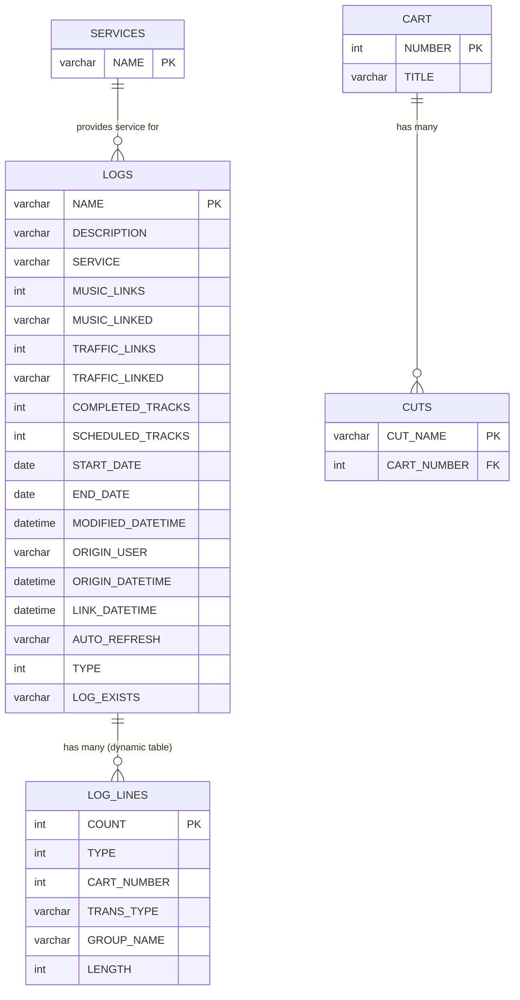
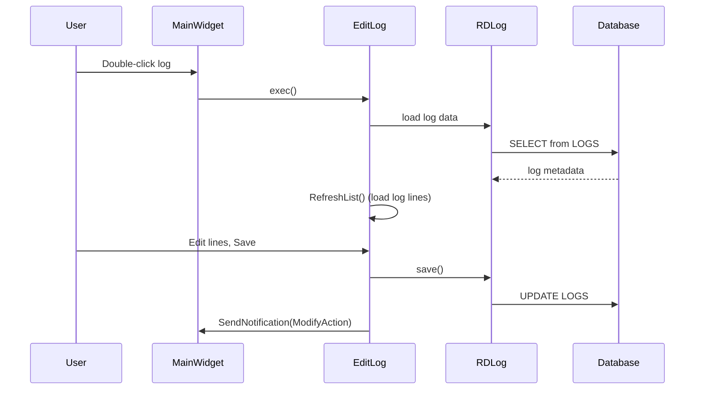
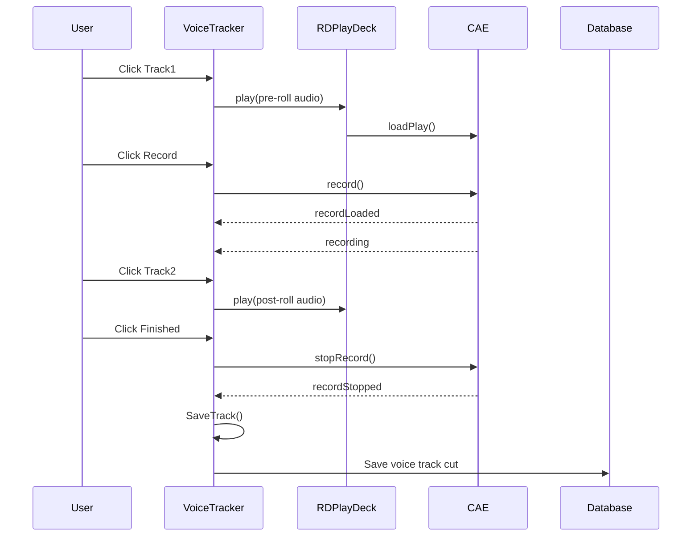
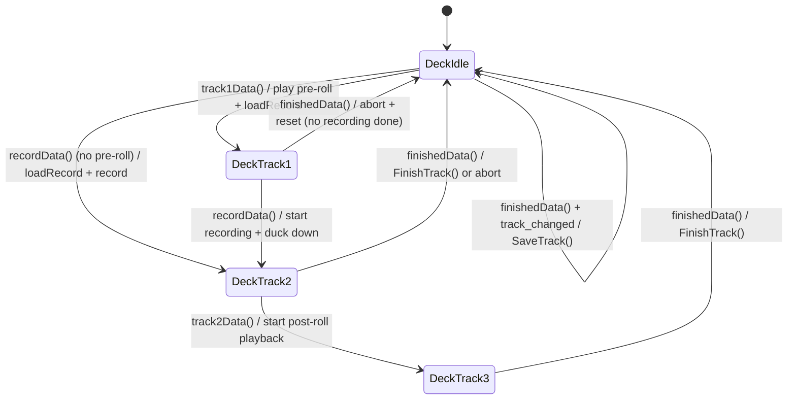

# Semantic Context: LGE (rdlogedit)

## Section A: Files & Symbols

### Source Files

| File | Type | Key Symbols |
|------|------|-------------|
| rdlogedit.h / .cpp | header/source | MainWidget |
| edit_log.h / .cpp | header/source | EditLog |
| edit_logline.h / .cpp | header/source | EditLogLine |
| edit_event.h / .cpp | header/source | EditEvent |
| edit_chain.h / .cpp | header/source | EditChain |
| edit_marker.h / .cpp | header/source | EditMarker |
| edit_track.h / .cpp | header/source | EditTrack |
| voice_tracker.h / .cpp | header/source | VoiceTracker |
| log_listview.h / .cpp | header/source | LogListView |
| drop_listview.h / .cpp | header/source | DropListView |
| list_listviewitem.h / .cpp | header/source | ListListViewItem |
| list_reports.h / .cpp | header/source | ListReports |
| render_dialog.h / .cpp | header/source | RenderDialog |
| add_meta.h / .cpp | header/source | AddMeta |
| globals.h | header | global_import_running, global_top_window_size, global_logedit_window_size, global_start_time_style |

### Symbol Index

| Symbol | Kind | File | Category |
|--------|------|------|----------|
| MainWidget | Class | rdlogedit.h | Main Window (Q_OBJECT) |
| EditLog | Class | edit_log.h | Log Editor Dialog (Q_OBJECT) |
| EditLogLine | Class | edit_logline.h | Log Line Editor Dialog (Q_OBJECT) |
| EditEvent | Class | edit_event.h | Event Editor Dialog (Q_OBJECT) |
| EditChain | Class | edit_chain.h | Chain Editor Dialog (Q_OBJECT) |
| EditMarker | Class | edit_marker.h | Marker Editor Dialog (Q_OBJECT) |
| EditTrack | Class | edit_track.h | Track Editor Dialog (Q_OBJECT) |
| VoiceTracker | Class | voice_tracker.h | Voice Tracker Window (Q_OBJECT) |
| LogListView | Class | log_listview.h | Custom List View (Q_OBJECT) |
| DropListView | Class | drop_listview.h | Drag-Drop List View (Q_OBJECT) |
| ListListViewItem | Class | list_listviewitem.h | Custom List Item |
| ListReports | Class | list_reports.h | Reports Dialog (Q_OBJECT) |
| RenderDialog | Class | render_dialog.h | Render/Export Dialog (Q_OBJECT) |
| AddMeta | Class | add_meta.h | Add Metadata Dialog (Q_OBJECT) |
| VoiceTracker::DeckState | Enum | voice_tracker.h | Voice tracker deck states |
| VoiceTracker::Target | Enum | voice_tracker.h | Voice tracker target types |

## Section B: Class API Surface

### MainWidget [Main Window]
- **File:** rdlogedit.h / rdlogedit.cpp
- **Inherits:** RDWidget
- **Qt Object:** Yes (Q_OBJECT)

#### Slots
| Slot | Visibility | Parameters | Brief |
|------|-----------|-----------|-------|
| connectedData | private | (bool state) | Handle RPC connection state change |
| caeConnectedData | private | (bool state) | Handle CAE connection state change |
| userData | private | () | Handle user authentication/change |
| recentData | private | (bool state) | Handle recent log filter toggle |
| addData | private | () | Add new log |
| editData | private | () | Edit selected log |
| deleteData | private | () | Delete selected log(s) |
| trackData | private | () | Open voice tracker for selected log |
| reportData | private | () | Open reports dialog |
| filterChangedData | private | (const QString &str) | Filter log list by text |
| logSelectionChangedData | private | () | Handle log list selection change |
| logDoubleclickedData | private | (Q3ListViewItem*, const QPoint&, int) | Double-click on log opens edit |
| notificationReceivedData | private | (RDNotification *notify) | Handle RD notifications |
| quitMainWidget | private | () | Close application |

#### Private Methods
| Method | Return | Parameters | Brief |
|--------|--------|-----------|-------|
| RefreshItem | void | (ListListViewItem *item) | Refresh single log list item |
| RefreshList | void | () | Refresh entire log list |
| SelectedLogs | unsigned | (vector<ListListViewItem*>*, int*) | Get selected log items |
| SendNotification | void | (RDNotification::Action, const QString&) | Send notification to other clients |
| LockList | void | () | Lock log list UI |
| UnlockList | void | () | Unlock log list UI |
| LoadPositions | void | () const | Load saved window positions |
| SavePositions | void | () const | Save window positions |

---

### EditLog [Log Editor Dialog]
- **File:** edit_log.h / edit_log.cpp
- **Inherits:** RDDialog
- **Qt Object:** Yes (Q_OBJECT)

#### Slots
| Slot | Visibility | Parameters | Brief |
|------|-----------|-----------|-------|
| exec | public | () | Execute log editor dialog |
| descriptionChangedData | private | (const QString&) | Description text changed |
| purgeDateChangedData | private | (const QDate&) | Purge date changed |
| purgeDateToggledData | private | (bool state) | Purge date enabled/disabled |
| selectPurgeDateData | private | () | Open purge date picker |
| serviceActivatedData | private | (const QString &svcname) | Service selection changed |
| dateValueChangedData | private | (const QDate&) | Date value changed |
| autorefreshChangedData | private | (int index) | Auto-refresh toggle changed |
| startDateEnabledData | private | (bool) | Start date enable/disable |
| endDateEnabledData | private | (bool) | End date enable/disable |
| timestyleChangedData | private | (int index) | Time style changed (12h/24h) |
| insertCartButtonData | private | () | Insert cart into log |
| insertMarkerButtonData | private | () | Insert marker/chain/track into log |
| clickedData | private | (Q3ListViewItem*) | Item clicked in log list |
| selectionChangedData | private | () | Selection changed in log list |
| doubleClickData | private | (Q3ListViewItem*) | Double-click opens line editor |
| editButtonData | private | () | Edit selected log line |
| deleteButtonData | private | () | Delete selected log line(s) |
| upButtonData | private | () | Move line up |
| downButtonData | private | () | Move line down |
| cutButtonData | private | () | Cut line to clipboard |
| copyButtonData | private | () | Copy line to clipboard |
| pasteButtonData | private | () | Paste line from clipboard |
| cartDroppedData | private | (int line, RDLogLine *ll) | Handle cart drag-drop |
| notificationReceivedData | private | (RDNotification *notify) | Handle RD notification |
| saveData | private | () | Save log |
| saveasData | private | () | Save log as new name |
| renderasData | private | () | Render log to audio file |
| reportsData | private | () | Open reports dialog |
| okData | private | () | OK - save and close |
| cancelData | private | () | Cancel and close |

#### Private Methods
| Method | Return | Parameters | Brief |
|--------|--------|-----------|-------|
| DeleteLines | void | (...) | Delete selected lines from log |
| SaveLog | bool | () | Save log to database |
| RefreshLine | void | (RDListViewItem*) | Refresh display of single line |
| SetStartTimeField | void | (...) | Set start time display field |
| RefreshList | void | () | Refresh entire log line list |
| UpdateSelection | void | () | Update UI based on selection |
| RenumberList | void | (int, int) | Renumber log lines |
| UpdateColor | void | (...) | Update line color coding |
| SelectRecord | void | (int) | Select specific record |
| UpdateTracks | void | () | Update voice track count |
| DeleteTracks | void | () | Delete voice track audio |
| ValidateSvc | bool | () | Validate service assignment |
| LoadClipboard | void | () | Load clipboard from storage |
| SingleSelection | bool | () | Check if single item selected |
| SetLogModified | void | (bool) | Set log modified flag |
| SendNotification | void | (...) | Send notification |

---

### EditEvent [Event Editor Base Dialog - Abstract]
- **File:** edit_event.h / edit_event.cpp
- **Inherits:** RDDialog
- **Qt Object:** Yes (Q_OBJECT)

#### Slots
| Slot | Visibility | Parameters | Brief |
|------|-----------|-----------|-------|
| timeChangedData | private | (const QTime&) | Time value changed |
| timeToggledData | private | (bool state) | Time type toggled |
| graceClickedData | private | (int id) | Grace time option clicked |
| selectTimeData | private | (int) | Time selection changed |
| okData | private | () | OK - save and close |
| cancelData | private | () | Cancel and close |

#### Protected Methods
| Method | Return | Parameters | Brief |
|--------|--------|-----------|-------|
| logLine | RDLogLine* | () | Get the log line being edited |
| saveData | bool | () | Pure virtual - save data (=0) |

---

### EditLogLine [Log Line Cart Editor]
- **File:** edit_logline.h / edit_logline.cpp
- **Inherits:** EditEvent
- **Qt Object:** Yes (Q_OBJECT)

#### Slots
| Slot | Visibility | Parameters | Brief |
|------|-----------|-----------|-------|
| selectCartData | private | () | Open cart selection dialog |

#### Protected Methods
| Method | Return | Parameters | Brief |
|--------|--------|-----------|-------|
| saveData | bool | () | Save log line data (override) |

#### Private Methods
| Method | Return | Parameters | Brief |
|--------|--------|-----------|-------|
| FillCart | void | (int cartnum) | Fill cart info fields from cart number |

---

### EditChain [Chain/Link Editor]
- **File:** edit_chain.h / edit_chain.cpp
- **Inherits:** EditEvent
- **Qt Object:** Yes (Q_OBJECT)

#### Slots
| Slot | Visibility | Parameters | Brief |
|------|-----------|-----------|-------|
| selectLogData | private | () | Open log selection dialog |
| labelChangedData | private | (const QString&) | Label text changed |

#### Protected Methods
| Method | Return | Parameters | Brief |
|--------|--------|-----------|-------|
| saveData | bool | () | Save chain data (override) |

---

### EditMarker [Marker Editor]
- **File:** edit_marker.h / edit_marker.cpp
- **Inherits:** EditEvent
- **Qt Object:** Yes (Q_OBJECT)

#### Protected Methods
| Method | Return | Parameters | Brief |
|--------|--------|-----------|-------|
| saveData | bool | () | Save marker data (override) |

---

### EditTrack [Track Marker Editor]
- **File:** edit_track.h / edit_track.cpp
- **Inherits:** EditEvent
- **Qt Object:** Yes (Q_OBJECT)

#### Protected Methods
| Method | Return | Parameters | Brief |
|--------|--------|-----------|-------|
| saveData | bool | () | Save track data (override) |

---

### VoiceTracker [Voice Tracking Window]
- **File:** voice_tracker.h / voice_tracker.cpp
- **Inherits:** RDDialog
- **Qt Object:** Yes (Q_OBJECT)

#### Enums
| Enum | Values |
|------|--------|
| DeckState | DeckIdle=0, DeckTrack1=1, DeckTrack2=2, DeckTrack3=3 |
| Target | FadeupGain=0, FadeupPoint=1, FadedownGain=2, FadedownPoint=3, TrackFadeupGain=4, TrackFadeupPoint=5, TrackFadedownGain=6, TrackFadedownPoint=7, TargetSize=8 |

#### Slots
| Slot | Visibility | Parameters | Brief |
|------|-----------|-----------|-------|
| exec | public | () | Execute voice tracker dialog |
| updateMenuData | private | () | Update context menu |
| hideMenuData | private | () | Hide context menu |
| playData | private | () | Play current audio |
| stopData | private | () | Stop playback |
| track1Data | private | () | Activate track 1 (pre-roll) |
| recordData | private | () | Start recording voice track |
| track2Data | private | () | Activate track 2 (post-roll) |
| finishedData | private | () | Mark recording finished |
| postData | private | () | Post/finalize track |
| resetData | private | () | Reset current track |
| insertData | private | () | Insert new voice track |
| insertData | private | (int line, RDLogLine*, bool warn) | Insert at specific line |
| deleteData | private | () | Delete current voice track |
| deleteData | private | (int line, bool warn) | Delete at specific line |
| previousData | private | () | Navigate to previous track |
| nextData | private | () | Navigate to next track |
| editAudioData | private | () | Open audio editor |
| undoChangesData | private | () | Undo changes to current track |
| setStartPointData | private | () | Set start point |
| setEndPointData | private | () | Set end point |
| setHookPointData | private | () | Set hook point |
| stateChangedData | private | (int id, RDPlayDeck::State state) | Deck state changed |
| positionData | private | (int id, int msecs) | Playback position update |
| segueStartData | private | (int id) | Segue start reached |
| logClickedData | private | (Q3ListViewItem*, const QPoint&, int) | Log list item clicked |
| transitionChangedData | private | (int line, RDLogLine::TransType trans) | Transition type changed |
| meterData | private | () | Update VU meters |
| recordLoadedData | private | (int card, int stream) | Record deck loaded |
| recordingData | private | (int card, int stream) | Recording in progress |
| recordStoppedData | private | (int card, int stream) | Recording stopped |
| recordUnloadedData | private | (int cart, int stream, unsigned msecs) | Record deck unloaded |
| notificationReceivedData | private | (RDNotification *notify) | Handle notification |
| closeData | private | () | Close voice tracker |

#### Private Methods
| Method | Return | Parameters | Brief |
|--------|--------|-----------|-------|
| LoadTrack | void | (...) | Load track audio data |
| SaveTrack | bool | (...) | Save track audio to storage |
| ImportTrack | void | (...) | Import external track |
| RenderTransition | void | (...) | Render audio transition/segue |
| LoadBlockLength | void | (...) | Load block timing data |
| RefreshList | void | () | Refresh log list display |
| RefreshLine | void | (...) | Refresh single line |
| StartNext | void | (...) | Start next track playback |
| GetCutName | QString | (...) | Get cut name for track |
| GetClick | int | (...) | Get click position |
| DragTrack | void | (...) | Handle track drag |
| DragTarget | void | (...) | Handle target drag |
| DrawTrackMap | void | (...) | Draw waveform map |
| DrawCursor | void | (...) | Draw playback cursor |
| DrawRubberBand | void | (...) | Draw rubber band selection |
| DrawTarget | void | (...) | Draw target indicator |
| WriteTrackMap | void | (...) | Write waveform map to pixmap |
| TransportActive | bool | () | Check if transport is active |
| PlayoutActive | bool | () | Check if playout is active |
| UpdateControls | void | () | Update button/control states |
| UpdateRemaining | void | () | Update remaining time display |
| TrackAvailable | bool | () | Check if track is available |
| LogLine | RDLogLine* | (...) | Get log line by index |
| InitTrack | void | (...) | Initialize new track |
| FinishTrack | void | (...) | Finalize track recording |
| GetCurrentTime | QTime | () | Get current timestamp |
| IsTrack | bool | (...) | Check if line is a track |
| CanInsertTrack | bool | () | Check if track can be inserted |
| CanDeleteTrack | bool | () | Check if track can be deleted |
| ClearCursor | void | () | Clear playback cursor |
| GetItemByLine | RDListViewItem* | (...) | Get list item by line number |
| CheckChanges | bool | () | Check for unsaved changes |
| PushSegues | void | () | Push segue state |
| PopSegues | void | () | Pop segue state |
| SendNotification | void | (...) | Send notification |

---

### LogListView [Custom Log List Widget]
- **File:** log_listview.h / log_listview.cpp
- **Inherits:** RDListView
- **Qt Object:** Yes (Q_OBJECT)

#### Signals
| Signal | Parameters | Description |
|--------|-----------|-------------|
| transitionChanged | (int line, RDLogLine::TransType trans) | Emitted when transition type is changed via context menu |

#### Slots
| Slot | Visibility | Parameters | Brief |
|------|-----------|-----------|-------|
| aboutToShowData | private | () | Context menu about to show |
| playData | private | () | Play transition from context menu |
| segueData | private | () | Set segue transition |
| stopData | private | () | Stop playback |

---

### DropListView [Drag-Drop Log List Widget]
- **File:** drop_listview.h / drop_listview.cpp
- **Inherits:** RDListView
- **Qt Object:** Yes (Q_OBJECT)

#### Signals
| Signal | Parameters | Description |
|--------|-----------|-------------|
| cartDropped | (int line, RDLogLine *ll) | Emitted when a cart is dropped onto the list |

#### Protected Methods
| Method | Return | Parameters | Brief |
|--------|--------|-----------|-------|
| dragEnterEvent | void | (QDragEnterEvent*) | Handle drag enter |
| dropEvent | void | (QDropEvent*) | Handle drop event |

---

### ListListViewItem [Log List Item]
- **File:** list_listviewitem.h / list_listviewitem.cpp
- **Inherits:** RDListViewItem (inferred from context)
- **Qt Object:** No

#### Public Methods
| Method | Return | Parameters | Brief |
|--------|--------|-----------|-------|
| trackColumn | int | () | Get track column index |
| setTrackColumn | void | (int) | Set track column index |
| tracks | int | () | Get number of tracks |
| setTracks | void | (int) | Set number of tracks |
| totalTracks | int | () | Get total tracks |
| setTotalTracks | void | (int) | Set total tracks |
| paintCell | void | (...) | Custom cell painting |

---

### ListReports [Reports Dialog]
- **File:** list_reports.h / list_reports.cpp
- **Inherits:** RDDialog
- **Qt Object:** Yes (Q_OBJECT)

#### Slots
| Slot | Visibility | Parameters | Brief |
|------|-----------|-----------|-------|
| selectDateData | private | () | Select date for report |
| generateData | private | () | Generate selected report |
| closeData | private | () | Close dialog |

#### Private Methods
| Method | Return | Parameters | Brief |
|--------|--------|-----------|-------|
| GenerateLogReport | void | (QString *report) | Generate text log report |
| GenerateLogCsvReport | void | (QString *report) | Generate CSV log report |
| GenerateExceptionReport | void | (QString *report, const QDate&) | Generate exception report |

---

### RenderDialog [Render/Export Dialog]
- **File:** render_dialog.h / render_dialog.cpp
- **Inherits:** RDDialog
- **Qt Object:** Yes (Q_OBJECT)

#### Slots
| Slot | Visibility | Parameters | Brief |
|------|-----------|-----------|-------|
| exec | public | (RDUser*, RDLogEvent*, int, int) | Execute render dialog with log data |
| toChangedData | private | (int item) | Render target changed |
| filenameChangedData | private | (const QString&) | Filename changed |
| selectData | private | () | Select output file |
| starttimeSourceData | private | (int item) | Start time source changed |
| audiosettingsData | private | () | Open audio settings dialog |
| lineStartedData | private | (int linno, int totallines) | Render progress update |
| renderData | private | () | Start rendering |
| cancelData | private | () | Cancel rendering |

---

### AddMeta [Add Metadata Dialog]
- **File:** add_meta.h / add_meta.cpp
- **Inherits:** RDDialog
- **Qt Object:** Yes (Q_OBJECT)

#### Slots
| Slot | Visibility | Parameters | Brief |
|------|-----------|-----------|-------|
| markerData | private | () | Add marker selected |
| chainData | private | () | Add chain/link selected |
| trackData | private | () | Add voice track selected |
| cancelData | private | () | Cancel dialog |

## Section C: Data Model

rdlogedit does NOT define tables (no CREATE TABLE). It consumes tables defined in the LIB (librd) library.

### Tables Used (via direct SQL)

#### LOGS Table (Primary)
Used in: rdlogedit.cpp (RefreshItem, RefreshList, notification handling), edit_chain.cpp (label lookup)

Columns accessed:
| Column | Usage Context |
|--------|--------------|
| NAME | Primary identifier, list display, filtering |
| DESCRIPTION | List display, edit dialog |
| SERVICE | List display, filtering, edit dialog |
| MUSIC_LINKS | Track linkage status display |
| MUSIC_LINKED | Track linkage status display |
| TRAFFIC_LINKS | Traffic linkage status display |
| TRAFFIC_LINKED | Traffic linkage status display |
| COMPLETED_TRACKS | Voice track progress tracking |
| SCHEDULED_TRACKS | Voice track progress tracking |
| START_DATE | Log validity date range |
| END_DATE | Log validity date range |
| MODIFIED_DATETIME | List display (last modified) |
| ORIGIN_USER | Log origin info display |
| ORIGIN_DATETIME | Log origin info display |
| LINK_DATETIME | Link timestamp display |
| AUTO_REFRESH | Auto-refresh flag |
| TYPE | Filter (TYPE=0 for standard logs) |
| LOG_EXISTS | Filter (LOG_EXISTS="Y") |

**Operations:** SELECT (list, detail, filter)

#### SERVICES Table
Used in: edit_log.cpp (service dropdown population)

Columns accessed:
| Column | Usage Context |
|--------|--------------|
| NAME | Service name for dropdown |

**Operations:** SELECT

### Indirect Data Access (via Library Classes)

| Library Class | Table(s) | Operations | Used By |
|--------------|----------|-----------|---------|
| RDLog | LOGS | Create, Delete, Load, Save | MainWidget (add/delete), EditLog (save/saveas) |
| RDLogEvent | LOG_LINES (dynamic table per log) | Full CRUD | EditLog (line editing), VoiceTracker (track editing) |
| RDLogLine | LOG_LINES columns | Read/Write fields | All edit dialogs |
| RDCart | CART | Read properties | EditLogLine (cart info), VoiceTracker (track carts) |
| RDCut | CUTS | Read/Write | VoiceTracker (audio cuts) |
| RDLogLock | LOG_MACHINES / lock mechanism | Lock/Unlock | EditLog, VoiceTracker (concurrent editing protection) |
| RDSvc | SERVICES | Read config | VoiceTracker (service config) |
| RDLibraryConf | RDLIBRARY | Read config | VoiceTracker (tail preroll) |
| RDStation | STATIONS | Read config | RenderDialog (station config) |
| RDSystem | SYSTEM | Read config | RenderDialog (system config) |
| RDSettings | AUDIO_SETTINGS (inferred) | Read/Write | RenderDialog (audio format settings) |
| RDGroup / RDGroupList | GROUPS | Read | EditLogLine (group filtering) |

### ERD (Tables accessed by rdlogedit)



## Section D: Reactive Architecture

### Signal/Slot Connections

#### MainWidget (rdlogedit.cpp)
| # | Sender | Signal | Receiver | Slot | Context |
|---|--------|--------|----------|------|---------|
| 1 | rda->cae() | isConnected(bool) | this | caeConnectedData(bool) | CAE audio engine connection |
| 2 | rda->ripc() | connected(bool) | this | connectedData(bool) | RPC daemon connection |
| 3 | rda->ripc() | notificationReceived(RDNotification*) | this | notificationReceivedData(RDNotification*) | Cross-client notifications |
| 4 | rda | userChanged() | this | userData() | User login/switch |
| 5 | log_filter_widget | filterChanged(const QString&) | this | filterChangedData(const QString&) | Filter text changed |
| 6 | log_log_list | selectionChanged() | this | logSelectionChangedData() | Log selection changed |
| 7 | log_log_list | doubleClicked(Q3ListViewItem*,...) | this | logDoubleclickedData(...) | Double-click opens edit |
| 8 | log_add_button | clicked() | this | addData() | Add new log |
| 9 | log_edit_button | clicked() | this | editData() | Edit selected log |
| 10 | log_delete_button | clicked() | this | deleteData() | Delete selected log(s) |
| 11 | log_track_button | clicked() | this | trackData() | Open voice tracker |
| 12 | log_report_button | clicked() | this | reportData() | Open reports |
| 13 | log_close_button | clicked() | this | quitMainWidget() | Close application |

#### EditLog (edit_log.cpp)
| # | Sender | Signal | Receiver | Slot | Context |
|---|--------|--------|----------|------|---------|
| 1 | rda->ripc() | notificationReceived(RDNotification*) | this | notificationReceivedData(RDNotification*) | Cross-client notifications |
| 2 | edit_description_edit | textChanged(const QString&) | this | descriptionChangedData(const QString&) | Description editing |
| 3 | edit_purgedate_box | toggled(bool) | this | purgeDateToggledData(bool) | Purge date toggle |
| 4 | edit_purgedate_box | toggled(bool) | edit_purgedate_edit | setEnabled(bool) | Enable/disable date picker |
| 5 | edit_purgedate_box | toggled(bool) | edit_purgedate_button | setEnabled(bool) | Enable/disable date button |
| 6 | edit_purgedate_edit | valueChanged(const QDate&) | this | purgeDateChangedData(const QDate&) | Purge date changed |
| 7 | edit_purgedate_button | clicked() | this | selectPurgeDateData() | Select purge date |
| 8 | edit_service_box | activated(const QString&) | this | serviceActivatedData(const QString&) | Service selection |
| 9 | edit_autorefresh_box | activated(int) | this | autorefreshChangedData(int) | Auto-refresh toggle |
| 10 | edit_startdate_edit | valueChanged(const QDate&) | this | dateValueChangedData(const QDate&) | Start date changed |
| 11 | edit_enddate_edit | valueChanged(const QDate&) | this | dateValueChangedData(const QDate&) | End date changed |
| 12 | edit_startdate_box | toggled(bool) | this | startDateEnabledData(bool) | Start date enable |
| 13 | edit_enddate_box | toggled(bool) | this | endDateEnabledData(bool) | End date enable |
| 14 | edit_log_list | doubleClicked(Q3ListViewItem*) | this | doubleClickData(Q3ListViewItem*) | Double-click edit line |
| 15 | edit_log_list | cartDropped(int, RDLogLine*) | this | cartDroppedData(int, RDLogLine*) | Cart drag-drop |
| 16 | edit_log_list | clicked(Q3ListViewItem*) | this | clickedData(Q3ListViewItem*) | Item click |
| 17 | edit_log_list | selectionChanged() | this | selectionChangedData() | Selection change |
| 18 | edit_cart_button | clicked() | this | insertCartButtonData() | Insert cart |
| 19 | edit_marker_button | clicked() | this | insertMarkerButtonData() | Insert marker/meta |
| 20 | edit_edit_button | clicked() | this | editButtonData() | Edit line |
| 21 | edit_delete_button | clicked() | this | deleteButtonData() | Delete line |
| 22 | edit_up_button | clicked() | this | upButtonData() | Move up |
| 23 | edit_down_button | clicked() | this | downButtonData() | Move down |
| 24 | edit_cut_button | clicked() | this | cutButtonData() | Cut to clipboard |
| 25 | edit_copy_button | clicked() | this | copyButtonData() | Copy to clipboard |
| 26 | edit_paste_button | clicked() | this | pasteButtonData() | Paste from clipboard |
| 27 | edit_save_button | clicked() | this | saveData() | Save log |
| 28 | edit_saveas_button | clicked() | this | saveasData() | Save As |
| 29 | edit_renderas_button | clicked() | this | renderasData() | Render log to audio |
| 30 | edit_reports_button | clicked() | this | reportsData() | Open reports |
| 31 | edit_timestyle_box | activated(int) | this | timestyleChangedData(int) | Time style change |
| 32 | edit_ok_button | clicked() | this | okData() | OK |
| 33 | edit_cancel_button | clicked() | this | cancelData() | Cancel |

#### VoiceTracker (voice_tracker.cpp)
| # | Sender | Signal | Receiver | Slot | Context |
|---|--------|--------|----------|------|---------|
| 1 | rda->ripc() | notificationReceived(RDNotification*) | this | notificationReceivedData(RDNotification*) | Notifications |
| 2 | edit_deck[i] | stateChanged(int, RDPlayDeck::State) | this | stateChangedData(int, RDPlayDeck::State) | Deck state changes |
| 3 | edit_deck[i] | segueStart(int) | this | segueStartData(int) | Segue start |
| 4 | rda->cae() | recordLoaded(int,int) | this | recordLoadedData(int,int) | Record loaded |
| 5 | rda->cae() | recording(int,int) | this | recordingData(int,int) | Recording active |
| 6 | rda->cae() | recordStopped(int,int) | this | recordStoppedData(int,int) | Recording stopped |
| 7 | rda->cae() | recordUnloaded(int,int,unsigned) | this | recordUnloadedData(int,int,unsigned) | Record unloaded |
| 8 | track_menu | aboutToShow() | this | updateMenuData() | Context menu show |
| 9 | track_menu | aboutToHide() | this | hideMenuData() | Context menu hide |
| 10 | track_track1_button | clicked() | this | track1Data() | Track 1 (pre-roll) |
| 11 | track_record_button | clicked() | this | recordData() | Start recording |
| 12 | track_track2_button | clicked() | this | track2Data() | Track 2 (post-roll) |
| 13 | track_finished_button | clicked() | this | finishedData() | Finished |
| 14 | track_previous_button | clicked() | this | previousData() | Previous track |
| 15 | track_next_button | clicked() | this | nextData() | Next track |
| 16 | track_play_button | clicked() | this | playData() | Play |
| 17 | track_stop_button | clicked() | this | stopData() | Stop |
| 18 | track_meter_timer | timeout() | this | meterData() | VU meter update |
| 19 | track_log_list | clicked(Q3ListViewItem*,...) | this | logClickedData(...) | Log item click |
| 20 | track_log_list | transitionChanged(int, TransType) | this | transitionChangedData(...) | Transition changed |
| 21 | track_reset_button | clicked() | this | resetData() | Reset |
| 22 | track_post_button | clicked() | this | postData() | Post |
| 23 | track_insert_button | clicked() | this | insertData() | Insert track |
| 24 | track_delete_button | clicked() | this | deleteData() | Delete track |
| 25 | track_close_button | clicked() | this | closeData() | Close |

#### RenderDialog (render_dialog.cpp)
| # | Sender | Signal | Receiver | Slot | Context |
|---|--------|--------|----------|------|---------|
| 1 | render_to_box | activated(int) | this | toChangedData(int) | Render target changed |
| 2 | render_filename_edit | textChanged(const QString&) | this | filenameChangedData(const QString&) | Filename changed |
| 3 | render_filename_button | clicked() | this | selectData() | Select output file |
| 4 | render_audiosettings_button | clicked() | this | audiosettingsData() | Audio settings |
| 5 | render_starttime_box | activated(int) | this | starttimeSourceData(int) | Start time source |
| 6 | render_render_button | clicked() | this | renderData() | Start render |
| 7 | render_cancel_button | clicked() | this | cancelData() | Cancel |
| 8 | RDRenderer(r) | lineStarted(int,int) | this | lineStartedData(int,int) | Render progress |
| 9 | render_progress_dialog | canceled() | r | abort() | Cancel rendering |

#### Emit Statements
| Emitter Class | Signal | Condition | File |
|--------------|--------|-----------|------|
| LogListView | transitionChanged(line, RDLogLine::Play) | Context menu "PLAY Transition" | log_listview.cpp |
| LogListView | transitionChanged(line, RDLogLine::Segue) | Context menu "SEGUE Transition" | log_listview.cpp |
| LogListView | transitionChanged(line, RDLogLine::Stop) | Context menu "STOP Transition" | log_listview.cpp |
| DropListView | cartDropped(line, &ll) | Cart dropped from external drag | drop_listview.cpp |

### Key Sequence Diagrams





### Cross-Artifact Dependencies
| External Class | From Artifact | Used In | Purpose |
|---------------|---------------|---------|---------|
| RDWidget | LIB | rdlogedit.cpp | Base class for MainWidget |
| RDDialog | LIB | edit_log, edit_event, voice_tracker, etc. | Base class for all dialogs |
| RDLog | LIB | rdlogedit.cpp, edit_log.cpp | Log CRUD operations |
| RDLogEvent | LIB | edit_log.cpp, voice_tracker.cpp, list_reports.cpp | Log line event collection |
| RDLogLine | LIB | All edit dialogs, voice_tracker | Individual log line data |
| RDLogLock | LIB | edit_log.cpp, voice_tracker.cpp | Concurrent edit locking |
| RDCart | LIB | edit_logline.cpp, edit_log.cpp, voice_tracker.cpp | Cart data access |
| RDCut | LIB | voice_tracker.cpp | Audio cut data |
| RDPlayDeck | LIB | voice_tracker.cpp | Audio playback deck |
| RDCartDialog | LIB | edit_logline.cpp | Cart selection dialog |
| RDListView / RDListViewItem | LIB | log_listview, drop_listview, list_listviewitem | Custom list widgets |
| RDFilterWidget | LIB | rdlogedit.cpp | Log filter widget |
| RDNotification | LIB | rdlogedit.cpp, edit_log.cpp, voice_tracker.cpp | Inter-client notifications |
| RDRenderer | LIB | render_dialog.cpp | Audio rendering engine |
| RDWavePainter | LIB | voice_tracker.cpp | Waveform visualization |
| RDSvc | LIB | voice_tracker.cpp | Service configuration |
| RDLibraryConf | LIB | voice_tracker.cpp | Library configuration |
| RDStation | LIB | render_dialog.cpp | Station configuration |
| RDSystem | LIB | render_dialog.cpp | System configuration |
| RDSettings | LIB | render_dialog.cpp | Audio format settings |
| RDGroup / RDGroupList | LIB | edit_logline.cpp | Group management |
| RDTextFile | LIB | rdlogedit.cpp | Text file output (reports) |
| RDApplication (rda) | LIB | Multiple files | Application singleton |
| RDTimeEdit | LIB | edit_event.cpp | Custom time edit widget |

## Section E: Business Rules & Logic

### Rule: Log Locking (Concurrent Edit Protection)
- **Source:** edit_log.cpp (EditLog::exec)
- **Trigger:** User opens a log for editing
- **Condition:** `edit_log_lock->tryLock()` fails (another user has it locked)
- **Action:** Show warning "Log already being edited by {user}@{station}" and return false
- **Gherkin:**
  ```gherkin
  Scenario: Prevent concurrent log editing
    Given a log "Morning_Show" is being edited by user "admin" on station "RD01"
    When another user tries to open "Morning_Show" for editing
    Then a warning dialog shows "Log already being edited by admin@RD01"
    And the log editor does not open
  ```

### Rule: Cart Validation Against Service
- **Source:** edit_logline.cpp (EditLogLine::saveData)
- **Trigger:** User saves a log line with a cart number
- **Condition:** Cart's group is not valid for the selected service (`!edit_group_list->isGroupValid(cart->groupName())`)
- **Action:** Show warning "This cart belongs to a disabled group for the specified service!" and prevent save
- **Gherkin:**
  ```gherkin
  Scenario: Reject cart from disabled group
    Given a log is assigned to service "Production"
    And the cart 10001 belongs to group "MUSIC" which is disabled for "Production"
    When the user tries to save the log line with cart 10001
    Then a warning "Disabled Cart" is shown
    And the save is prevented
  ```

### Rule: Cart Number Required
- **Source:** edit_logline.cpp (EditLogLine::saveData)
- **Trigger:** User saves a log line
- **Condition:** `edit_cart_edit->text().isEmpty()`
- **Action:** Show warning "You must supply a cart number!"
- **Gherkin:**
  ```gherkin
  Scenario: Require cart number for log line
    Given the user is editing a cart-type log line
    When the user leaves the cart number empty and clicks OK
    Then a warning "Missing Cart" is shown
    And the save is prevented
  ```

### Rule: Service Validation on Save
- **Source:** edit_log.cpp (EditLog::saveData, saveasData, okData)
- **Trigger:** User saves a log
- **Condition:** `!ValidateSvc()` -- log contains carts disabled for the selected service
- **Action:** Warn user with option to save anyway (Yes/No) or block save
- **Gherkin:**
  ```gherkin
  Scenario: Warn about invalid carts on save
    Given a log contains carts that are disabled for the selected service
    When the user clicks Save
    Then a warning "The log contains carts that are disabled for the selected service!" is shown
    And the user can choose to save anyway or cancel
  ```

### Rule: Delete Confirmation (Single Log)
- **Source:** rdlogedit.cpp (MainWidget::deleteData)
- **Trigger:** User deletes a single selected log
- **Condition:** Confirmation required; additional confirmation if voice tracks exist
- **Action:** Two-stage confirmation: first "Are you sure?", then if tracks > 0, "This will also delete {N} voice tracks"
- **Gherkin:**
  ```gherkin
  Scenario: Delete log with voice tracks
    Given the log "Morning_Show" has 5 voice tracks
    When the user clicks Delete
    Then a confirmation "Are you sure you want to delete the 'Morning_Show' log?" is shown
    And when confirmed, a second warning "This will also delete the 5 voice tracks" is shown
    And only after both confirmations is the log deleted
  ```

### Rule: Delete Confirmation (Multiple Logs)
- **Source:** rdlogedit.cpp (MainWidget::deleteData)
- **Trigger:** User deletes multiple selected logs
- **Condition:** items.size() > 1
- **Action:** Similar two-stage confirmation with plural text

### Rule: Audio Deletion Error on Track Delete
- **Source:** edit_log.cpp (EditLog::DeleteTracks), rdlogedit.cpp
- **Trigger:** Saving log after removing voice tracks
- **Condition:** `cart->remove()` fails
- **Action:** Show error "Unable to save log, audio deletion error!" and prevent save

### Rule: Unsaved Changes on Cancel
- **Source:** edit_log.cpp (EditLog::cancelData)
- **Trigger:** User cancels log editor with unsaved changes
- **Condition:** `edit_changed == true`
- **Action:** Three-way dialog: Yes (save and close), No (discard and close), Cancel (stay open)
- **Gherkin:**
  ```gherkin
  Scenario: Cancel with unsaved changes
    Given the user has modified the log
    When the user clicks Cancel
    Then a dialog "The log has been modified. Do you want to save your changes?" appears
    And the user can choose Yes, No, or Cancel
  ```

### Rule: Log Locked by Another Station
- **Source:** rdlogedit.cpp (MainWidget::deleteData)
- **Trigger:** User tries to delete a log that is locked by another user
- **Condition:** Log lock cannot be acquired
- **Action:** Show error with locking user/station info, skip deletion of that log

### Rule: Segue Gain from Overlap Checkbox
- **Source:** edit_logline.cpp (EditLogLine::saveData)
- **Trigger:** User saves log line with no custom segue/end/fadedown points
- **Condition:** No custom segue start/end, no end point, no fadedown point set
- **Action:** If overlap checkbox is checked, set segue gain to 0 (hard segue); otherwise set to RD_FADE_DEPTH (fade)

### Rule: Voice Track Cart Creation Failure
- **Source:** voice_tracker.cpp (VoiceTracker::track1Data, recordData)
- **Trigger:** User starts recording a voice track
- **Condition:** `InitTrack()` fails (cannot create cart/cut)
- **Action:** Show warning "Unable to create new cart for voice track!"

### Cart Validity Color Coding
- **Source:** edit_log.cpp (EditLog::UpdateColor)
- **Logic:** Each log line is color-coded based on cart validity state:

| Cart State | Color | Meaning |
|-----------|-------|---------|
| AlwaysValid + valid group | Default (white) | Cart is valid |
| AlwaysValid + invalid group | RD_CART_INVALID_SERVICE_COLOR | Group disabled for service |
| ConditionallyValid | RD_CART_CONDITIONAL_COLOR | Cart valid only at certain times |
| FutureValid | RD_CART_FUTURE_COLOR | Cart valid in the future |
| EvergreenValid | RD_CART_EVERGREEN_COLOR | Evergreen (always available fallback) |
| NeverValid | RD_CART_ERROR_COLOR | Invalid cart, display "[INVALID CART]" |

### State Machine: Voice Tracker Deck States



**Deck State Transitions:**
- **DeckIdle:** No audio transport active. Can save completed track.
- **DeckTrack1:** Pre-roll audio playing. Recording loaded but not started. Cancel returns to idle.
- **DeckTrack2:** Recording active. Pre-roll fading down. Can finish or move to post-roll.
- **DeckTrack3:** Post-roll audio playing while recording continues. Finish completes track.

### Voice Tracker Recording Workflow
1. **Track1 (Pre-Roll):** Loads recording hardware, starts playing preceding audio
2. **Record:** Starts actual recording, ducks down pre-roll audio, enters DeckTrack2
3. **Track2 (Post-Roll):** Starts playing following audio (optional, requires enableSecondStart config)
4. **Finished:** Stops recording, saves track, calculates segue points
5. **Import:** Alternative to recording - imports an existing audio file as voice track

### Global Variables
| Variable | Type | Purpose |
|----------|------|---------|
| global_import_running | (bool inferred) | Flag for import operation in progress |
| global_top_window_size | (QSize inferred) | Saved main window dimensions |
| global_logedit_window_size | (QSize inferred) | Saved log edit window dimensions |
| global_start_time_style | (int inferred) | Time display style (12h/24h) |

### Error Patterns
| Error | Severity | Condition | Message |
|-------|----------|-----------|---------|
| AppInitFail | critical | rda->open() fails | Error message from RDApplication |
| UnknownCmdOption | critical | Unprocessed command switch | "Unknown command option: {key}" |
| LogCreateFail | warning | RDLog::create() fails | Error from create function |
| LogDeleteFail | warning | Cart audio remove fails | "Unable to delete log {name}, audio deletion error!" |
| LogLocked | warning | Another user has log locked | "Log already being edited by {user}@{station}" |
| InvalidCarts | warning | Carts disabled for service | "The log contains carts that are disabled for the selected service!" |
| MissingCart | warning | Empty cart number | "You must supply a cart number!" |
| DisabledCart | warning | Cart group disabled for service | "This cart belongs to a disabled group for the specified service!" |
| CartCreationFail | warning | Cannot create voice track cart | "Unable to create new cart for voice track!" |
| AudioDeleteFail | warning | Track audio deletion error | "Unable to save log, audio deletion error!" |

## Section F: UI Contracts

No .ui files -- all UI is programmatic (Qt3/Qt4 C++ widgets).

### Window: MainWidget (Main Application Window)
- **Type:** RDWidget (extends QWidget)
- **Title:** "RDLogEdit v{VERSION} - Host: {station}, User: {user}"
- **Layout:** Programmatic absolute positioning with resizeEvent

#### Widgets
| Widget | Type | Label/Text | Binding | Purpose |
|--------|------|-----------|---------|---------|
| log_filter_widget | RDFilterWidget | (filter bar) | filterChanged -> filterChangedData | Log name/service/group filtering |
| log_log_list | RDListView | (log table) | selectionChanged, doubleClicked | Main log list |
| log_add_button | QPushButton | "&Add" | clicked -> addData() | Create new log |
| log_edit_button | QPushButton | "&Edit" | clicked -> editData() | Edit selected log |
| log_delete_button | QPushButton | "&Delete" | clicked -> deleteData() | Delete selected log(s) |
| log_track_button | QPushButton | "Voice\n&Tracker" | clicked -> trackData() | Open voice tracker |
| log_report_button | QPushButton | "Log\nReport" | clicked -> reportData() | Generate reports |
| log_close_button | QPushButton | "&Close" | clicked -> quitMainWidget() | Exit application |

#### Log List Columns
| # | Column | Content |
|---|--------|---------|
| 0 | (icon) | Status icons (lock, checkmark, etc.) |
| 1 | Log Name | Log name (primary key) |
| 2 | Description | Log description |
| 3 | Service | Service name |
| 4 | Music | Music link status |
| 5 | Traffic | Traffic link status |
| 6 | Tracks | Voice track progress (completed/scheduled) |
| 7 | Valid From | Start date |
| 8 | Valid To | End date |
| 9 | Auto Refresh | Auto-refresh flag |
| 10 | Origin | Origin user + datetime |
| 11 | Last Linked | Link datetime |
| 12 | Last Modified | Modified datetime |

#### Status Icons
| Icon | Meaning |
|------|---------|
| log_rivendell_map | Rivendell icon |
| log_greencheckmark_map | Valid/complete |
| log_redx_map | Invalid/error |
| log_whiteball_map | Neutral state |
| log_greenball_map | Linked/active |
| log_redball_map | Not linked/inactive |

#### Data Flow
- **Source:** SQL query on LOGS table (filtered by TYPE=0, LOG_EXISTS="Y")
- **Display:** Tabular list view with status icons and color coding
- **Edit:** Double-click or Edit button opens EditLog dialog
- **Save:** Changes saved via EditLog dialog; notifications sent to other clients

---

### Window: EditLog (Log Editor Dialog)
- **Type:** RDDialog (extends QDialog)
- **Title:** "RDLogEdit - Edit Log"
- **Layout:** Programmatic absolute positioning with resizeEvent

#### Widgets - Metadata Section
| Widget | Type | Label/Text | Binding | Purpose |
|--------|------|-----------|---------|---------|
| edit_logname_label | QLabel | (log name) | -- | Display log name |
| edit_origin_label | QLabel | (origin info) | -- | Display origin user/date |
| edit_track_label | QLabel | (track count) | -- | Display voice track count |
| edit_description_edit | QLineEdit | Description | textChanged -> descriptionChangedData | Edit log description |
| edit_service_box | QComboBox | Service | activated -> serviceActivatedData | Select service |
| edit_autorefresh_box | QComboBox | Auto Refresh | activated -> autorefreshChangedData | Auto-refresh toggle |
| edit_startdate_box | QCheckBox | Start Date | toggled -> startDateEnabledData | Enable start date |
| edit_startdate_edit | Q3DateEdit | (date) | valueChanged -> dateValueChangedData | Set start date |
| edit_enddate_box | QCheckBox | End Date | toggled -> endDateEnabledData | Enable end date |
| edit_enddate_edit | Q3DateEdit | (date) | valueChanged -> dateValueChangedData | Set end date |
| edit_purgedate_box | QCheckBox | Enable Purge Date | toggled -> purgeDateToggledData | Enable purge date |
| edit_purgedate_edit | Q3DateEdit | (date) | valueChanged -> purgeDateChangedData | Set purge date |
| edit_purgedate_button | QPushButton | Select | clicked -> selectPurgeDateData | Date picker |
| edit_timestyle_box | QComboBox | Time Style | activated -> timestyleChangedData | 12h/24h time display |
| edit_modified_label | QLabel | Modified indicator | -- | Show modified state |

#### Widgets - Log Lines Section
| Widget | Type | Label/Text | Binding | Purpose |
|--------|------|-----------|---------|---------|
| edit_log_list | DropListView | (log line table) | doubleClicked, cartDropped, clicked, selectionChanged | Log line list with drag-drop |
| edit_cart_button | QPushButton | Insert Cart | clicked -> insertCartButtonData | Insert cart into log |
| edit_marker_button | QPushButton | Insert Meta | clicked -> insertMarkerButtonData | Insert marker/chain/track |
| edit_edit_button | QPushButton | Edit | clicked -> editButtonData | Edit selected line |
| edit_delete_button | QPushButton | Delete | clicked -> deleteButtonData | Delete selected line(s) |
| edit_up_button | QPushButton | Up | clicked -> upButtonData | Move line up |
| edit_down_button | QPushButton | Down | clicked -> downButtonData | Move line down |
| edit_cut_button | QPushButton | Cut | clicked -> cutButtonData | Cut to clipboard |
| edit_copy_button | QPushButton | Copy | clicked -> copyButtonData | Copy to clipboard |
| edit_paste_button | QPushButton | Paste | clicked -> pasteButtonData | Paste from clipboard |

#### Widgets - Action Buttons
| Widget | Type | Label/Text | Binding | Purpose |
|--------|------|-----------|---------|---------|
| edit_save_button | QPushButton | Save | clicked -> saveData | Save log |
| edit_saveas_button | QPushButton | Save As | clicked -> saveasData | Save as new log |
| edit_renderas_button | QPushButton | Render | clicked -> renderasData | Render to audio |
| edit_reports_button | QPushButton | Reports | clicked -> reportsData | Generate reports |
| edit_ok_button | QPushButton | OK | clicked -> okData | Save and close |
| edit_cancel_button | QPushButton | Cancel | clicked -> cancelData | Cancel and close |

#### Log Line List Columns
| # | Column | Content |
|---|--------|---------|
| 0 | (icon) | Line type icon (playout, macro, marker, chain, track, music, traffic) |
| 1 | Time | Start time |
| 2 | Trans | Transition type (Play/Segue/Stop) |
| 3 | Cart | Cart number |
| 4 | Group | Group name |
| 5 | Length | Duration |
| 6 | Title | Cart/marker title |
| 7 | Artist | Artist name |
| 8 | Client | Client |
| 9 | Agency | Agency |
| 10 | Label | Label text |
| 11 | Source | Source |
| 12 | Ext Data | External data |
| 13 | Line ID | Internal line ID |
| 14 | Count | Line count (hidden, used for indexing) |

#### Line Type Icons
| Icon Field | Meaning |
|-----------|---------|
| edit_playout_map | Audio playout cart |
| edit_macro_map | Macro cart |
| edit_marker_map | Marker |
| edit_chain_map | Chain/link to another log |
| edit_track_cart_map | Voice track |
| edit_notemarker_map | Note marker |
| edit_music_map | Music import marker |
| edit_traffic_map | Traffic import marker |
| edit_mic16_map | Microphone/live audio icon |

#### Data Flow
- **Source:** RDLogEvent loads log lines from dynamic per-log table
- **Display:** Tabular list with type icons and color-coded validity
- **Edit:** Double-click opens appropriate editor (cart, marker, chain, track)
- **Save:** RDLogEvent.save() writes to database; SendNotification() alerts other clients

---

### Window: VoiceTracker (Voice Tracking Dialog)
- **Type:** RDDialog (extends QDialog)
- **Title:** "RDLogEdit - Voice Tracker"
- **Layout:** Complex programmatic layout with waveform display area

#### Transport Controls
| Widget | Type | Label/Text | Binding | Purpose |
|--------|------|-----------|---------|---------|
| track_play_button | RDTransportButton | Play | clicked -> playData | Play audio |
| track_stop_button | RDTransportButton | Stop | clicked -> stopData | Stop playback |
| track_track1_button | QPushButton | "Track 1" / "Import" | clicked -> track1Data | Pre-roll / Import |
| track_record_button | QPushButton | "Record" / "Import" | clicked -> recordData | Start recording / Import |
| track_track2_button | QPushButton | "Track 2" | clicked -> track2Data | Post-roll (optional, config-dependent) |
| track_finished_button | QPushButton | "Finished" | clicked -> finishedData | Finish recording |
| track_post_button | QPushButton | "Post" | clicked -> postData | Post/finalize |
| track_reset_button | QPushButton | "Reset" | clicked -> resetData | Reset current |

#### Navigation Controls
| Widget | Type | Label/Text | Binding | Purpose |
|--------|------|-----------|---------|---------|
| track_previous_button | QPushButton | "Previous" | clicked -> previousData | Previous track |
| track_next_button | QPushButton | "Next" | clicked -> nextData | Next track |
| track_insert_button | QPushButton | "Insert" | clicked -> insertData | Insert new voice track |
| track_delete_button | QPushButton | "Delete" | clicked -> deleteData | Delete voice track |
| track_close_button | QPushButton | "Close" | clicked -> closeData | Close tracker |

#### Display Widgets
| Widget | Type | Purpose |
|--------|------|---------|
| track_meter | RDStereoMeter | VU level meter display |
| edit_wave_map[3] | QPixmap | Waveform display for 3 tracks (pre-roll, recording, post-roll) |
| track_log_list | LogListView | Log line list with transition context menu |
| edit_length_label | QLabel | Track length display |
| edit_tracks_remaining_label | QLabel | Remaining tracks count |
| edit_time_remaining_label | QLabel | Remaining time display |

#### Context Menu (right-click on waveform)
| Item | Action | Purpose |
|------|--------|---------|
| Edit Cue Markers | editAudioData() | Open cue marker editor |
| Undo Segue Changes | undoChangesData() | Revert segue modifications |
| Set Start Point Here | setStartPointData() | Set start point at click position |
| Set End Point Here | setEndPointData() | Set end point at click position |
| Set to Hook Markers | setHookPointData() | Reset to hook marker positions |

#### Voice Tracker Log List Columns
| # | Column | Content |
|---|--------|---------|
| 0 | (icon) | Line type icon |
| 1 | Time | Start time |
| 2 | Trans | Transition type |
| 3 | Cart | Cart number |
| 4 | Group | Group name |
| 5 | Length | Duration |
| 6 | Title | Title |
| 7 | Artist | Artist |
| 8 | Album | Album |
| 9 | Label | Label |

#### Data Flow
- **Source:** RDLogEvent (log lines), CAE (audio engine for playback/recording)
- **Display:** Waveform visualization of 3 tracks, VU meters, log list
- **Edit:** Interactive recording with segue/crossfade adjustment via mouse drag
- **Save:** SaveTrack() writes recorded audio; log line updates saved via RDLogEvent

---

### Dialog: EditEvent (Base Event Editor)
- **Type:** RDDialog (abstract base)
- **Title:** (set by subclasses)

#### Common Widgets
| Widget | Type | Label/Text | Binding | Purpose |
|--------|------|-----------|---------|---------|
| edit_timetype_box | QCheckBox | "Hard Start Time" | toggled -> timeToggledData | Toggle hard start time |
| edit_time_edit | RDTimeEdit | (time) | valueChanged -> timeChangedData | Set start time |
| edit_transtype_box | QComboBox | "Transition Type" | selectTimeData | Transition type selection |
| edit_grace_bgroup | QButtonGroup | "Grace Time" | buttonClicked -> graceClickedData | Grace time options |
| edit_grace_timeedit | QTimeEdit | (grace time) | -- | Grace time value |
| edit_ok_button | QPushButton | "OK" | clicked -> okData | Save and close |
| edit_cancel_button | QPushButton | "Cancel" | clicked -> cancelData | Cancel |

---

### Dialog: EditLogLine (Cart Line Editor)
- **Type:** EditEvent subclass
- **Title:** "RDLogEdit - Edit Log Entry"

#### Additional Widgets
| Widget | Type | Label/Text | Binding | Purpose |
|--------|------|-----------|---------|---------|
| edit_cart_edit | QLineEdit | Cart Number | -- | Cart number input |
| edit_title_edit | QLineEdit | Title | -- | Cart title (read-only display) |
| edit_artist_edit | QLineEdit | Artist | -- | Artist (read-only display) |
| edit_overlap_box | QCheckBox | Overlap | -- | Allow overlapping segue |
| (select button) | QPushButton | Select | clicked -> selectCartData | Open cart selection dialog |

---

### Dialog: EditChain (Chain/Link Editor)
- **Type:** EditEvent subclass
- **Title:** "RDLogEdit - Edit Log Chain"

#### Additional Widgets
| Widget | Type | Label/Text | Binding | Purpose |
|--------|------|-----------|---------|---------|
| edit_label_edit | QLineEdit | Label | textChanged -> labelChangedData | Log name to chain to |
| edit_comment_edit | QLineEdit | Comment | -- | Description (auto-filled from target log) |
| edit_select_button | QPushButton | Select | clicked -> selectLogData | Open log selection dialog |

---

### Dialog: EditMarker (Marker Editor)
- **Type:** EditEvent subclass
- **Title:** "RDLogEdit - Edit Log Marker"

#### Additional Widgets
| Widget | Type | Label/Text | Purpose |
|--------|------|-----------|---------|
| edit_comment_edit | QLineEdit | Comment | Marker comment text |
| edit_label_edit | QLineEdit | Label | Marker label |

---

### Dialog: EditTrack (Voice Track Marker Editor)
- **Type:** EditEvent subclass
- **Title:** "RDLogEdit - Edit Voice Track Marker"

#### Additional Widgets
| Widget | Type | Label/Text | Purpose |
|--------|------|-----------|---------|
| edit_comment_edit | QLineEdit | Comment | Track marker comment |
| edit_overlap_box | QCheckBox | Overlap | Allow overlapping segue |

---

### Dialog: AddMeta (Add Metadata/Meta-Event)
- **Type:** RDDialog
- **Title:** "RDLogEdit"

#### Widgets
| Widget | Type | Label/Text | Binding | Purpose |
|--------|------|-----------|---------|---------|
| (marker button) | QPushButton | "Add &Marker" | clicked -> markerData | Add marker to log |
| (track button) | QPushButton | "Add &Track" | clicked -> trackData | Add voice track marker |
| (chain button) | QPushButton | "Add Log C&hain" | clicked -> chainData | Add log chain |
| (cancel button) | QPushButton | "&Cancel" | clicked -> cancelData | Cancel |

---

### Dialog: ListReports (Report Generator)
- **Type:** RDDialog
- **Title:** "RDLogEdit - Reports"

#### Widgets
| Widget | Type | Label/Text | Binding | Purpose |
|--------|------|-----------|---------|---------|
| list_reports_box | QComboBox | Report type | -- | Select report type |
| list_date_edit | Q3DateEdit | Date | -- | Date for exception report |
| (select button) | QPushButton | Select | clicked -> selectDateData | Date picker |
| (generate button) | QPushButton | Generate | clicked -> generateData | Generate report |
| (close button) | QPushButton | Close | clicked -> closeData | Close dialog |

#### Report Types
| Report | Description |
|--------|-------------|
| Log Listing | Text format log contents |
| Log Listing (CSV) | CSV format log contents |
| Log Exception Report | Exceptions for specified date |

---

### Dialog: RenderDialog (Render/Export)
- **Type:** RDDialog
- **Title:** "RDLogEdit - Render Log"

#### Widgets
| Widget | Type | Label/Text | Binding | Purpose |
|--------|------|-----------|---------|---------|
| render_to_box | QComboBox | Render To | activated -> toChangedData | Target: Cart/Cut or File |
| render_filename_edit | QLineEdit | Cart/Cut or Filename | textChanged -> filenameChangedData | Output destination |
| render_filename_button | QPushButton | Select | clicked -> selectData | File/cart browser |
| render_starttime_box | QComboBox | Virtual Start Time | activated -> starttimeSourceData | [now] or As Specified |
| render_starttime_edit | QTimeEdit | (time) | -- | Specific start time |
| render_audiosettings_edit | QLineEdit | Audio Settings | -- | Settings display (read-only) |
| render_audiosettings_button | QPushButton | Set | clicked -> audiosettingsData | Audio format settings |
| render_events_box | QComboBox | Events | -- | All Events or Only Selected |
| render_ignorestop_box | QCheckBox | Ignore STOP | -- | Ignore stop transitions |
| render_render_button | QPushButton | Render | clicked -> renderData | Start rendering |
| render_cancel_button | QPushButton | Cancel | clicked -> cancelData | Cancel |
| render_progress_dialog | QProgressDialog | Render Progress | canceled -> abort() | Progress display |

#### Render Targets
| Target | Description |
|--------|-------------|
| Cart/Cut | Render to a Rivendell cart/cut |
| File | Render to external audio file |

#### Start Time Options
| Option | Description |
|--------|-------------|
| [now] | Use current time as virtual start |
| As Specified | Use manually entered time |

#### Event Selection
| Option | Description |
|--------|-------------|
| All Events | Render all log events |
| Only Selected Events | Render only selected line range |
