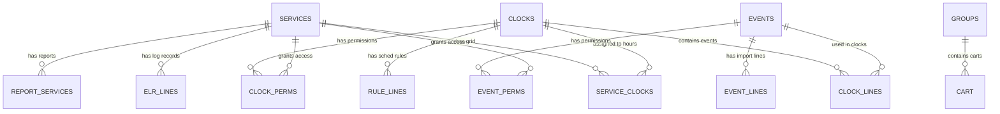
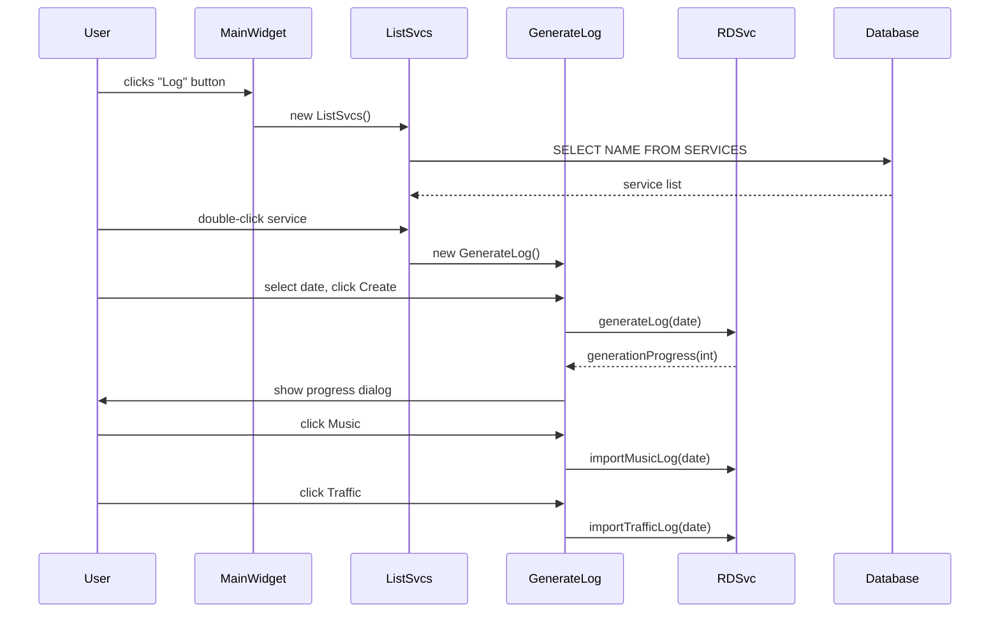
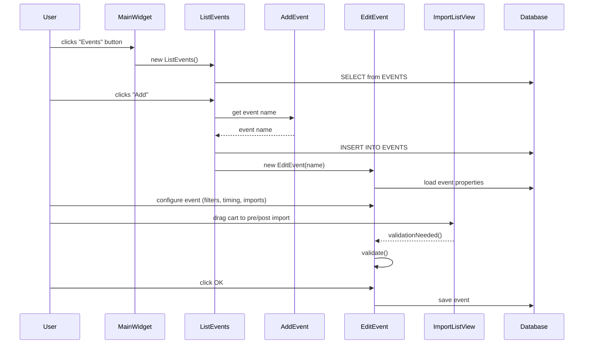
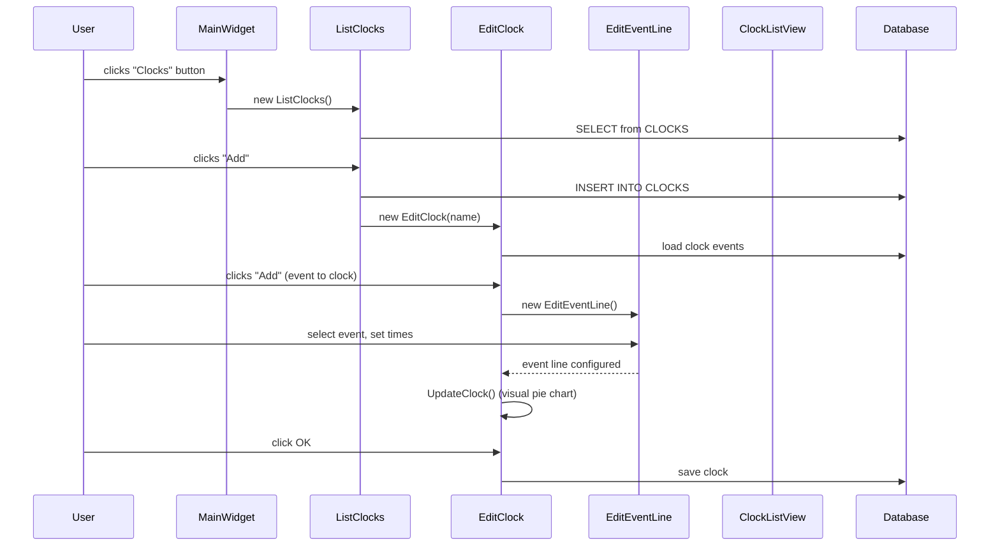
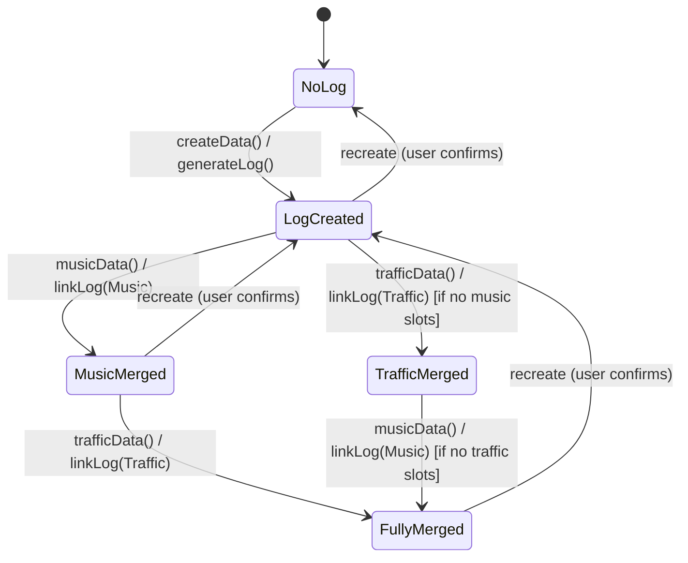
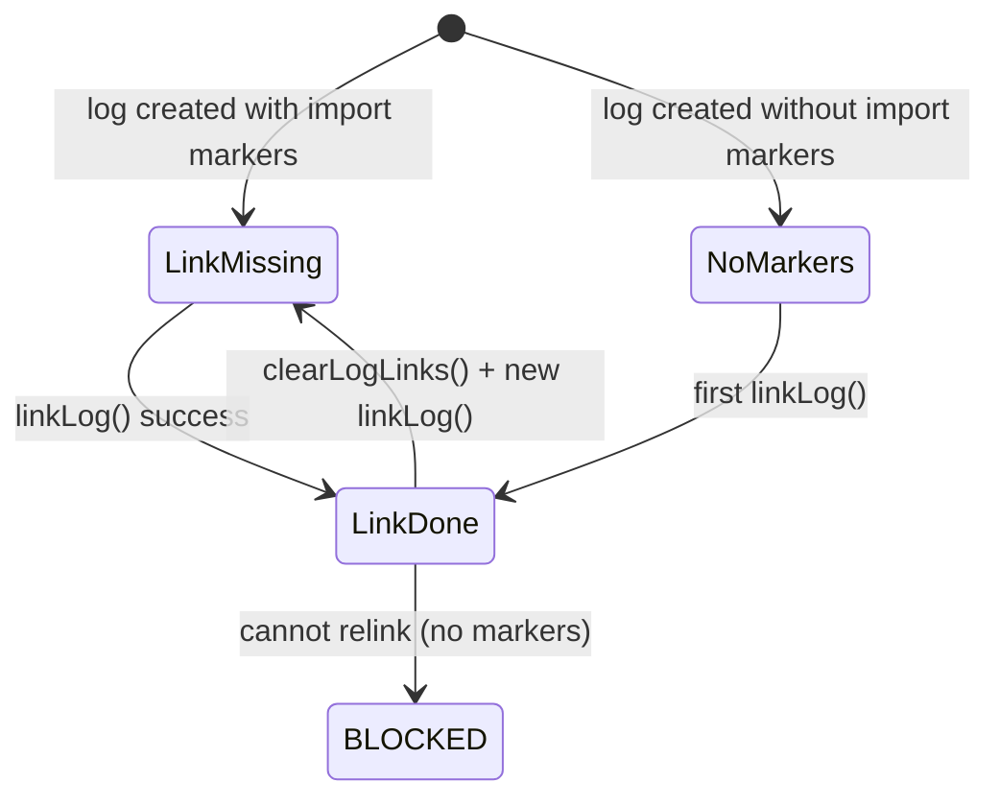
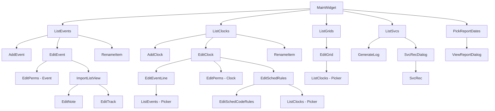

# Semantic Context: LGM (rdlogmanager)

## Files & Symbols

### Source Files

| File | Type | Symbols | LOC (est) |
|------|------|---------|-----------|
| rdlogmanager.h | header | MainWidget, RunLogOperation, RunReportOperation | ~70 |
| rdlogmanager.cpp | source | MainWidget impl | ~200 |
| logobject.h | header | LogObject | ~45 |
| logobject.cpp | source | LogObject impl | ~200 |
| globals.h | header | event_filter, clock_filter, skip_db_check | ~15 |
| commandline_ops.cpp | source | command-line parsing | ~100 |
| edit_event.h | header | EditEvent | ~170 |
| edit_event.cpp | source | EditEvent impl | ~1200 |
| edit_clock.h | header | EditClock | ~95 |
| edit_clock.cpp | source | EditClock impl | ~800 |
| edit_grid.h | header | EditGrid | ~60 |
| edit_grid.cpp | source | EditGrid impl | ~400 |
| edit_eventline.h | header | EditEventLine | ~53 |
| edit_eventline.cpp | source | EditEventLine impl | ~150 |
| edit_perms.h | header | EditPerms | ~48 |
| edit_perms.cpp | source | EditPerms impl | ~150 |
| edit_schedrules.h | header | EditSchedRules | ~63 |
| edit_schedrules.cpp | source | EditSchedRules impl | ~300 |
| edit_schedcoderules.h | header | EditSchedCodeRules | ~68 |
| edit_schedcoderules.cpp | source | EditSchedCodeRules impl | ~200 |
| edit_track.h | header | EditTrack | ~49 |
| edit_track.cpp | source | EditTrack impl | ~100 |
| edit_note.h | header | EditNote | ~49 |
| edit_note.cpp | source | EditNote impl | ~100 |
| list_events.h | header | ListEvents | ~75 |
| list_events.cpp | source | ListEvents impl | ~500 |
| list_clocks.h | header | ListClocks | ~76 |
| list_clocks.cpp | source | ListClocks impl | ~500 |
| list_grids.h | header | ListGrids | ~43 |
| list_grids.cpp | source | ListGrids impl | ~150 |
| list_svcs.h | header | ListSvcs | ~52 |
| list_svcs.cpp | source | ListSvcs impl | ~200 |
| generate_log.h | header | GenerateLog | ~82 |
| generate_log.cpp | source | GenerateLog impl | ~500 |
| svc_rec.h | header | SvcRec | ~78 |
| svc_rec.cpp | source | SvcRec impl | ~300 |
| svc_rec_dialog.h | header | SvcRecDialog | ~47 |
| svc_rec_dialog.cpp | source | SvcRecDialog impl | ~100 |
| viewreportdialog.h | header | ViewReportDialog | ~52 |
| viewreportdialog.cpp | source | ViewReportDialog impl | ~100 |
| pick_report_dates.h | header | PickReportDates | ~51 |
| pick_report_dates.cpp | source | PickReportDates impl | ~200 |
| add_event.h | header | AddEvent | ~47 |
| add_event.cpp | source | AddEvent impl | ~100 |
| add_clock.h | header | AddClock | ~45 |
| add_clock.cpp | source | AddClock impl | ~100 |
| rename_item.h | header | RenameItem | ~44 |
| rename_item.cpp | source | RenameItem impl | ~100 |
| clock_listview.h | header | ClockListView | ~52 |
| clock_listview.cpp | source | ClockListView impl | ~100 |
| lib_listview.h | header | LibListView | ~40 |
| lib_listview.cpp | source | LibListView impl | ~50 |
| import_listview.h | header | ImportListView | ~78 |
| import_listview.cpp | source | ImportListView impl | ~400 |

### Symbol Index

| Symbol | Kind | File | Qt Class? | Inherits |
|--------|------|------|-----------|----------|
| MainWidget | Class | rdlogmanager.h | Yes (Q_OBJECT) | RDWidget |
| LogObject | Class | logobject.h | Yes (Q_OBJECT) | (none visible) |
| EditEvent | Class | edit_event.h | Yes (Q_OBJECT) | RDDialog |
| EditClock | Class | edit_clock.h | Yes (Q_OBJECT) | RDDialog |
| EditGrid | Class | edit_grid.h | Yes (Q_OBJECT) | RDDialog |
| EditEventLine | Class | edit_eventline.h | Yes (Q_OBJECT) | RDDialog |
| EditPerms | Class | edit_perms.h | Yes (Q_OBJECT) | RDDialog |
| EditSchedRules | Class | edit_schedrules.h | Yes (Q_OBJECT) | RDDialog |
| EditSchedCodeRules | Class | edit_schedcoderules.h | Yes (Q_OBJECT) | RDDialog |
| EditTrack | Class | edit_track.h | Yes (Q_OBJECT) | RDDialog |
| EditNote | Class | edit_note.h | Yes (Q_OBJECT) | RDDialog |
| ListEvents | Class | list_events.h | Yes (Q_OBJECT) | RDDialog |
| ListClocks | Class | list_clocks.h | Yes (Q_OBJECT) | RDDialog |
| ListGrids | Class | list_grids.h | Yes (Q_OBJECT) | RDDialog |
| ListSvcs | Class | list_svcs.h | Yes (Q_OBJECT) | RDDialog |
| GenerateLog | Class | generate_log.h | Yes (Q_OBJECT) | RDDialog |
| SvcRec | Class | svc_rec.h | Yes (Q_OBJECT) | RDWidget |
| SvcRecDialog | Class | svc_rec_dialog.h | Yes (Q_OBJECT) | RDDialog |
| ViewReportDialog | Class | viewreportdialog.h | Yes (Q_OBJECT) | RDDialog |
| PickReportDates | Class | pick_report_dates.h | Yes (Q_OBJECT) | RDDialog |
| AddEvent | Class | add_event.h | Yes (Q_OBJECT) | RDDialog |
| AddClock | Class | add_clock.h | Yes (Q_OBJECT) | RDDialog |
| RenameItem | Class | rename_item.h | Yes (Q_OBJECT) | RDDialog |
| ClockListView | Class | clock_listview.h | Yes (Q_OBJECT) | RDListView |
| LibListView | Class | lib_listview.h | Yes (Q_OBJECT) | (custom) |
| ImportListView | Class | import_listview.h | Yes (Q_OBJECT) | RDListView |
| RunLogOperation | Function | rdlogmanager.h | No | -- |
| RunReportOperation | Function | rdlogmanager.h | No | -- |
| event_filter | Variable | globals.h | No | -- |
| clock_filter | Variable | globals.h | No | -- |
| skip_db_check | Variable | globals.h | No | -- |

## Class API Surface

### MainWidget [Application Main Window]
- **File:** rdlogmanager.h / rdlogmanager.cpp
- **Inherits:** RDWidget
- **Qt Object:** Yes (Q_OBJECT)
- **Constructor:** `MainWidget(RDConfig *c, QWidget *parent=0)`

#### Signals
(none)

#### Slots
| Slot | Visibility | Parameters | Description |
|------|-----------|-----------|-------------|
| userData | private | () | Handle user authentication/display |
| eventsData | private | () | Open Events list dialog |
| clocksData | private | () | Open Clocks list dialog |
| gridsData | private | () | Open Grids list dialog |
| generateData | private | () | Open Generate/Logs dialog |
| reportsData | private | () | Open Reports date picker |
| quitMainWidget | private | () | Exit application |

#### Public Methods
| Method | Return | Parameters | Brief |
|--------|--------|-----------|-------|
| sizeHint | QSize | () const | Preferred widget size |
| sizePolicy | QSizePolicy | () const | Size policy |

#### Private Methods
| Method | Return | Parameters | Brief |
|--------|--------|-----------|-------|
| LoadConfig | void | () | Load application configuration |

---

### LogObject [Command-Line Log Generation Object]
- **File:** logobject.h / logobject.cpp
- **Inherits:** QObject
- **Qt Object:** Yes (Q_OBJECT)
- **Constructor:** `LogObject(const QString &svcname, int start_offset, bool protect_existing, bool gen_log, bool merge_mus, bool merge_tfc, QObject *parent=0)`

#### Signals
(none)

#### Slots
| Slot | Visibility | Parameters | Description |
|------|-----------|-----------|-------------|
| userData | private | () | Triggered after user auth; executes CLI log operations |

#### Private Methods
| Method | Return | Parameters | Brief |
|--------|--------|-----------|-------|
| SendNotification | void | (RDNotification::Action action, const QString &logname) | Send notification about log action |

---

### EditEvent [Event Editor Dialog]
- **File:** edit_event.h / edit_event.cpp
- **Inherits:** RDDialog
- **Qt Object:** Yes (Q_OBJECT)
- **Constructor:** `EditEvent(QString eventname, bool new_event, std::vector<QString> *new_events, QWidget *parent=0)`

#### Signals
(none)

#### Slots
| Slot | Visibility | Parameters | Description |
|------|-----------|-----------|-------------|
| filterChangedData | private | (const QString &str) | Library filter text changed |
| filterActivatedData | private | (const QString &str) | Library filter activated |
| filterClickedData | private | (int id) | Library filter type clicked (Audio/Macro) |
| searchData | private | () | Search library |
| cartClickedData | private | (Q3ListViewItem *item) | Cart selected in library list |
| prepositionToggledData | private | (bool state) | Preposition checkbox toggled |
| timeToggledData | private | (bool) | Time type checkbox toggled |
| graceClickedData | private | (int) | Grace time radio button clicked |
| timeTransitionData | private | (int) | Time transition type changed |
| autofillToggledData | private | (bool) | Autofill checkbox toggled |
| autofillWarnToggledData | private | (bool) | Autofill warn checkbox toggled |
| importClickedData | private | (int) | Import source clicked |
| preimportLengthChangedData | private | (int msecs) | Pre-import length changed |
| preimportUpData | private | () | Move pre-import item up |
| preimportDownData | private | () | Move pre-import item down |
| postimportUpData | private | () | Move post-import item up |
| postimportDownData | private | () | Move post-import item down |
| postimportLengthChangedData | private | (int msecs) | Post-import length changed |
| artistData | private | () | Artist separation settings |
| titleData | private | () | Title separation settings |
| saveData | private | () | Save event |
| saveAsData | private | () | Save event with new name |
| svcData | private | () | Edit service permissions |
| colorData | private | () | Set event color |
| validate | private | () | Validate event configuration |
| okData | private | () | Accept and close |
| cancelData | private | () | Cancel and close |

#### Private Methods
| Method | Return | Parameters | Brief |
|--------|--------|-----------|-------|
| RefreshLibrary | void | () | Refresh cart library list |
| Save | bool | () | Save event to database |
| CopyEventPerms | void | (old_name, new_name) | Copy event permissions |
| AbandonEvent | void | (name) | Discard unsaved event |
| GetProperties | void | () | Load event properties from DB |

---

### EditClock [Clock Editor Dialog]
- **File:** edit_clock.h / edit_clock.cpp
- **Inherits:** RDDialog
- **Qt Object:** Yes (Q_OBJECT)

#### Slots
| Slot | Visibility | Parameters | Description |
|------|-----------|-----------|-------------|
| selectionChangedData | private | (Q3ListViewItem *) | Clock event list selection changed |
| addData | private | () | Add event to clock |
| cloneData | private | () | Clone event in clock |
| editData | private | () | Edit selected event |
| deleteData | private | () | Delete selected event from clock |
| svcData | private | () | Edit service permissions |
| schedRules | private | () | Edit scheduler rules |
| saveData | private | () | Save clock |
| saveAsData | private | () | Save clock with new name |
| doubleClickedData | private | (Q3ListViewItem*, QPoint&, int) | Double-click on event list |
| colorData | private | () | Set clock color |
| editEventData | private | (int line) | Edit event at specific line |
| okData | private | () | Accept and close |
| cancelData | private | () | Cancel and close |

#### Private Methods
| Method | Return | Parameters | Brief |
|--------|--------|-----------|-------|
| Save | void | () | Save clock to database |
| RefreshList | void | (int select_line=-1) | Refresh event list |
| RefreshNames | void | () | Refresh event names |
| UpdateClock | void | (int line=-1) | Update clock visualization |
| CopyClockPerms | void | (old_name, new_name) | Copy clock permissions |
| AbandonClock | void | (name) | Discard unsaved clock |
| ValidateCode | bool | () | Validate clock short name |

---

### EditGrid [Service Grid Editor Dialog]
- **File:** edit_grid.h / edit_grid.cpp
- **Inherits:** RDDialog
- **Qt Object:** Yes (Q_OBJECT)
- **Constructor:** `EditGrid(QString servicename, QWidget *parent=0)`

#### Slots
| Slot | Visibility | Parameters | Description |
|------|-----------|-----------|-------------|
| hourButtonData | private | (int id) | Hour button clicked (assign clock) |
| allHourButtonData | private | () | All hours button (assign clock to all) |
| rightHourButtonData | private | (int id, QPoint &pt) | Right-click on hour button |
| aboutToShowData | private | () | Context menu about to show |
| editClockData | private | () | Edit selected clock |
| clearHourData | private | () | Clear hour assignment |
| closeData | private | () | Close dialog |

#### Private Methods
| Method | Return | Parameters | Brief |
|--------|--------|-----------|-------|
| LoadButtons | void | () | Load button states from DB |
| LabelButton | void | (int dayofweek, int hour, QString code) | Label a specific hour button |
| GetClock | QString | (int dayofweek, int hour) | Get clock assigned to day/hour |

---

### ListEvents [Events List/Picker Dialog]
- **File:** list_events.h / list_events.cpp
- **Inherits:** RDDialog
- **Qt Object:** Yes (Q_OBJECT)

#### Slots
| Slot | Visibility | Parameters | Description |
|------|-----------|-----------|-------------|
| addData | private | () | Add new event |
| editData | private | () | Edit selected event |
| deleteData | private | () | Delete selected event |
| renameData | private | () | Rename selected event |
| doubleClickedData | private | (Q3ListViewItem*, QPoint&, int) | Double-click on event |
| filterActivatedData | private | (int id) | Service filter changed |
| closeData | private | () | Close dialog |
| okData | private | () | Accept selection |
| cancelData | private | () | Cancel selection |

#### Private Methods
| Method | Return | Parameters | Brief |
|--------|--------|-----------|-------|
| RefreshList | void | () | Refresh events list from DB |
| RefreshItem | void | (Q3ListViewItem*, vector<QString>*) | Refresh single item |
| UpdateItem | void | (Q3ListViewItem*, QString) | Update item display |
| WriteItem | void | (Q3ListViewItem*, RDSqlQuery*) | Write item from SQL query |
| WriteItemSql | QString | () const | Generate SQL for item display |
| ActiveEvents | int | (QString, QString*) | Count active uses of event |
| DeleteEvent | void | (QString) | Delete event from DB |
| GetEventFilter | QString | (QString svc_name) | Get filter SQL for service |
| GetNoneFilter | QString | () | Get filter for unassigned |

---

### ListClocks [Clocks List/Picker Dialog]
- **File:** list_clocks.h / list_clocks.cpp
- **Inherits:** RDDialog
- **Qt Object:** Yes (Q_OBJECT)

#### Slots
| Slot | Visibility | Parameters | Description |
|------|-----------|-----------|-------------|
| addData | private | () | Add new clock |
| editData | private | () | Edit selected clock |
| deleteData | private | () | Delete selected clock |
| renameData | private | () | Rename selected clock |
| doubleClickedData | private | (Q3ListViewItem*, QPoint&, int) | Double-click on clock |
| filterActivatedData | private | (int id) | Service filter changed |
| closeData | private | () | Close dialog |
| clearData | private | () | Clear selection |
| okData | private | () | Accept selection |
| cancelData | private | () | Cancel selection |

#### Private Methods
| Method | Return | Parameters | Brief |
|--------|--------|-----------|-------|
| RefreshList | void | () | Refresh clocks list from DB |
| RefreshItem | void | (Q3ListViewItem*, vector<QString>*) | Refresh single item |
| UpdateItem | void | (Q3ListViewItem*, QString) | Update item display |
| WriteItem | void | (Q3ListViewItem*, RDSqlQuery*) | Write item from SQL query |
| ActiveClocks | int | (QString, QString*) | Count active uses of clock |
| DeleteClock | void | (QString) | Delete clock from DB |
| GetClockFilter | QString | (QString svc_name) | Get filter SQL for service |
| GetNoneFilter | QString | () | Get filter for unassigned |

---

### ListGrids [Service Grids List Dialog]
- **File:** list_grids.h / list_grids.cpp
- **Inherits:** RDDialog
- **Qt Object:** Yes (Q_OBJECT)

#### Slots
| Slot | Visibility | Parameters | Description |
|------|-----------|-----------|-------------|
| editData | private | () | Edit selected grid |
| doubleClickedData | private | (Q3ListViewItem*, QPoint&, int) | Double-click on grid |
| closeData | private | () | Close dialog |

#### Private Methods
| Method | Return | Parameters | Brief |
|--------|--------|-----------|-------|
| RefreshList | void | () | Refresh grids list from DB |

---

### ListSvcs [Services List Dialog (Log Generation)]
- **File:** list_svcs.h / list_svcs.cpp
- **Inherits:** RDDialog
- **Qt Object:** Yes (Q_OBJECT)

#### Slots
| Slot | Visibility | Parameters | Description |
|------|-----------|-----------|-------------|
| generateData | private | () | Generate log for selected service |
| purgeData | private | () | Purge old logs for selected service |
| listDoubleClickedData | private | (Q3ListViewItem*, QPoint&, int) | Double-click on service |
| closeData | private | () | Close dialog |

#### Private Methods
| Method | Return | Parameters | Brief |
|--------|--------|-----------|-------|
| RefreshList | void | () | Refresh services list from DB |
| RefreshLine | void | (Q3ListViewItem*) | Refresh single service line |

---

### GenerateLog [Log Generation Dialog]
- **File:** generate_log.h / generate_log.cpp
- **Inherits:** RDDialog
- **Qt Object:** Yes (Q_OBJECT)
- **Constructor:** `GenerateLog(QWidget *parent=0, int cmd_switch=0, QString *cmd_service=NULL, QDate *cmd_date=NULL)`

#### Slots
| Slot | Visibility | Parameters | Description |
|------|-----------|-----------|-------------|
| serviceActivatedData | private | (int index) | Service combo box selection changed |
| dateChangedData | private | (const QDate &date) | Date changed |
| selectDateData | private | () | Open date picker |
| createData | private | () | Create/generate log |
| musicData | private | () | Import/merge music data |
| trafficData | private | () | Import/merge traffic data |
| fileScanData | private | () | Scan for import files |
| closeData | private | () | Close dialog |

#### Private Methods
| Method | Return | Parameters | Brief |
|--------|--------|-----------|-------|
| UpdateControls | void | () | Update button/label states |
| SendNotification | void | (RDNotification::Action, QString&) | Notify about log changes |

---

### EditEventLine [Event Line Editor Dialog]
- **File:** edit_eventline.h / edit_eventline.cpp
- **Inherits:** RDDialog
- **Qt Object:** Yes (Q_OBJECT)

#### Slots
| Slot | Visibility | Parameters | Description |
|------|-----------|-----------|-------------|
| selectData | private | () | Select event name |
| okData | private | () | Accept and close |
| cancelData | private | () | Cancel and close |

---

### EditPerms [Service Permissions Editor Dialog]
- **File:** edit_perms.h / edit_perms.cpp
- **Inherits:** RDDialog
- **Qt Object:** Yes (Q_OBJECT)
- **Constructor:** `EditPerms(QString object_name, ObjectType type, QWidget *parent=0)`

#### Enums
| Enum | Values |
|------|--------|
| ObjectType | ObjectEvent=1, ObjectClock=2 |

#### Slots
| Slot | Visibility | Parameters | Description |
|------|-----------|-----------|-------------|
| okData | private | () | Save permissions and close |
| cancelData | private | () | Cancel and close |

---

### EditSchedRules [Scheduler Rules Editor Dialog]
- **File:** edit_schedrules.h / edit_schedrules.cpp
- **Inherits:** RDDialog
- **Qt Object:** Yes (Q_OBJECT)

#### Slots
| Slot | Visibility | Parameters | Description |
|------|-----------|-----------|-------------|
| editData | private | () | Edit selected sched code rule |
| importData | private | () | Import scheduler rules |
| doubleClickedData | private | (Q3ListViewItem*, QPoint&, int) | Double-click on rule |
| okData | private | () | Save rules and close |
| cancelData | private | () | Cancel and close |

#### Private Methods
| Method | Return | Parameters | Brief |
|--------|--------|-----------|-------|
| Load | void | () | Load rules from DB |
| Close | void | () | Cleanup on close |

---

### EditSchedCodeRules [Individual Scheduler Code Rule Editor]
- **File:** edit_schedcoderules.h / edit_schedcoderules.cpp
- **Inherits:** RDDialog
- **Qt Object:** Yes (Q_OBJECT)

#### Slots
| Slot | Visibility | Parameters | Description |
|------|-----------|-----------|-------------|
| okData | private | () | Save rule and close |
| cancelData | private | () | Cancel and close |

---

### EditTrack [Voice Track Text Editor Dialog]
- **File:** edit_track.h / edit_track.cpp
- **Inherits:** RDDialog
- **Qt Object:** Yes (Q_OBJECT)

#### Slots
| Slot | Visibility | Parameters | Description |
|------|-----------|-----------|-------------|
| okData | private | () | Save track text and close |
| cancelData | private | () | Cancel and close |

---

### EditNote [Note Text Editor Dialog]
- **File:** edit_note.h / edit_note.cpp
- **Inherits:** RDDialog
- **Qt Object:** Yes (Q_OBJECT)

#### Slots
| Slot | Visibility | Parameters | Description |
|------|-----------|-----------|-------------|
| okData | private | () | Save note text and close |
| cancelData | private | () | Cancel and close |

---

### SvcRec [Service Calendar/Date Picker Widget]
- **File:** svc_rec.h / svc_rec.cpp
- **Inherits:** RDWidget
- **Qt Object:** Yes (Q_OBJECT)
- **Constructor:** `SvcRec(const QString &svcname, QWidget *parent=0)`

#### Signals
| Signal | Parameters | Description |
|--------|-----------|-------------|
| dateSelected | (const QDate &date, bool active) | Emitted when user selects a date; active indicates if log exists |

#### Slots
| Slot | Visibility | Parameters | Description |
|------|-----------|-----------|-------------|
| monthActivatedData | private | (int id) | Month combo changed |
| yearActivatedData | private | (int id) | Year combo changed |
| yearChangedData | private | (int year) | Year spin changed |

#### Public Methods
| Method | Return | Parameters | Brief |
|--------|--------|-----------|-------|
| serviceName | QString | () const | Get service name |
| date | QDate | () const | Get current selected date |
| setDate | bool | (QDate date) | Set current date |
| dayActive | bool | (int day) const | Check if day has log |
| deleteDay | void | () | Delete log for selected day |

---

### SvcRecDialog [Service Record Delete Dialog]
- **File:** svc_rec_dialog.h / svc_rec_dialog.cpp
- **Inherits:** RDDialog
- **Qt Object:** Yes (Q_OBJECT)

#### Slots
| Slot | Visibility | Parameters | Description |
|------|-----------|-----------|-------------|
| dateSelectedData | private | (const QDate&, bool active) | Date selected in calendar |
| deleteData | private | () | Delete selected log |
| closeData | private | () | Close dialog |

---

### ViewReportDialog [Report Viewer Dialog]
- **File:** viewreportdialog.h / viewreportdialog.cpp
- **Inherits:** RDDialog
- **Qt Object:** Yes (Q_OBJECT)

#### Slots
| Slot | Visibility | Parameters | Description |
|------|-----------|-----------|-------------|
| exec | public | (const QString &rpt_filename) | Execute dialog with report file |
| viewData | private | () | Open report in external viewer |
| closeData | private | () | Close dialog |

---

### PickReportDates [Report Date Range Picker Dialog]
- **File:** pick_report_dates.h / pick_report_dates.cpp
- **Inherits:** RDDialog
- **Qt Object:** Yes (Q_OBJECT)

#### Slots
| Slot | Visibility | Parameters | Description |
|------|-----------|-----------|-------------|
| selectStartDateData | private | () | Pick start date |
| selectEndDateData | private | () | Pick end date |
| generateData | private | () | Generate report |
| closeData | private | () | Close dialog |

---

### AddEvent [Add Event Name Dialog]
- **File:** add_event.h / add_event.cpp
- **Inherits:** RDDialog
- **Qt Object:** Yes (Q_OBJECT)

#### Slots
| Slot | Visibility | Parameters | Description |
|------|-----------|-----------|-------------|
| okData | private | () | Accept event name |
| cancelData | private | () | Cancel |

---

### AddClock [Add Clock Name Dialog]
- **File:** add_clock.h / add_clock.cpp
- **Inherits:** RDDialog
- **Qt Object:** Yes (Q_OBJECT)

#### Slots
| Slot | Visibility | Parameters | Description |
|------|-----------|-----------|-------------|
| okData | private | () | Accept clock name |
| cancelData | private | () | Cancel |

---

### RenameItem [Rename Event/Clock Dialog]
- **File:** rename_item.h / rename_item.cpp
- **Inherits:** RDDialog
- **Qt Object:** Yes (Q_OBJECT)

#### Slots
| Slot | Visibility | Parameters | Description |
|------|-----------|-----------|-------------|
| okData | private | () | Accept new name |
| cancelData | private | () | Cancel |

---

### ClockListView [Clock Events List View with Context Menu]
- **File:** clock_listview.h / clock_listview.cpp
- **Inherits:** RDListView
- **Qt Object:** Yes (Q_OBJECT)

#### Signals
| Signal | Parameters | Description |
|--------|-----------|-------------|
| editLine | (int count) | Request to edit event at line |

#### Slots
| Slot | Visibility | Parameters | Description |
|------|-----------|-----------|-------------|
| aboutToShowData | private | () | Context menu about to show |
| editEventData | private | () | Edit event from context menu |

---

### LibListView [Library Cart List View with Drag Support]
- **File:** lib_listview.h / lib_listview.cpp
- **Inherits:** Q3ListView
- **Qt Object:** Yes (Q_OBJECT)

(no signals, no slots, only overrides contentsMousePressEvent for drag initiation)

---

### ImportListView [Event Import List View with Drag/Drop and Context Menu]
- **File:** import_listview.h / import_listview.cpp
- **Inherits:** Q3ListView
- **Qt Object:** Yes (Q_OBJECT)

#### Signals
| Signal | Parameters | Description |
|--------|-----------|-------------|
| sizeChanged | (int size) | Import list size changed |
| lengthChanged | (int msecs) | Total import length changed |
| validationNeeded | () | Validation of event required |

#### Slots
| Slot | Visibility | Parameters | Description |
|------|-----------|-----------|-------------|
| aboutToShowData | private | () | Context menu about to show |
| insertNoteMenuData | private | () | Insert note marker |
| editNoteMenuData | private | () | Edit note marker |
| insertTrackMenuData | private | () | Insert voice track marker |
| editTrackMenuData | private | () | Edit voice track text |
| playMenuData | private | () | Set transition to Play |
| segueMenuData | private | () | Set transition to Segue |
| stopMenuData | private | () | Set transition to Stop |
| deleteMenuData | private | () | Delete import item |

#### Public Methods
| Method | Return | Parameters | Brief |
|--------|--------|-----------|-------|
| eventImportList | RDEventImportList* | () const | Get underlying import list |
| setAllowFirstTrans | void | (bool state) | Allow editing first transition |
| move | void | (int from, int to) | Move item in list |
| setEventName | void | (const QString&) | Set parent event name |
| load | bool | (const QString&, ImportType) | Load imports from DB |
| save | void | (RDLogLine::TransType) | Save imports to DB |
| refreshList | void | (int line=-1) | Refresh list display |
| fixupTransitions | void | (RDLogLine::TransType) | Fix transition types |

## Data Model

### Tables Used (no CREATE TABLE in artifact; tables defined in LIB)

### Table: CLOCKS
- **CRUD Classes:** ListClocks (SELECT, INSERT, UPDATE, DELETE), EditClock (SELECT, DELETE), EditSchedRules (SELECT)
- **Key Columns Used:** NAME, SHORT_NAME, COLOR, ARTISTSEP

### Table: CLOCK_LINES
- **CRUD Classes:** ListClocks (DELETE, UPDATE), EditClock (DELETE), ListEvents (DELETE, UPDATE)
- **Key Columns Used:** CLOCK_NAME, EVENT_NAME

### Table: CLOCK_PERMS
- **CRUD Classes:** EditClock (SELECT, INSERT), ListClocks (SELECT, INSERT, DELETE, UPDATE), EditPerms (SELECT, INSERT, DELETE)
- **Key Columns Used:** CLOCK_NAME, SERVICE_NAME

### Table: EVENTS
- **CRUD Classes:** ListEvents (SELECT, INSERT, UPDATE, DELETE), EditEvent (SELECT, DELETE), EditEventLine (SELECT)
- **Key Columns Used:** NAME, NESTED_EVENT, and many event property columns

### Table: EVENT_PERMS
- **CRUD Classes:** ListEvents (SELECT, INSERT, DELETE, UPDATE), EditEvent (SELECT, INSERT, DELETE), EditPerms (SELECT, INSERT, DELETE)
- **Key Columns Used:** EVENT_NAME, SERVICE_NAME

### Table: EVENT_LINES
- **CRUD Classes:** ListEvents (DELETE, UPDATE), EditEvent (DELETE)
- **Key Columns Used:** EVENT_NAME

### Table: SERVICES
- **CRUD Classes:** (read-only reference) ListEvents, ListClocks, EditPerms, ListGrids, GenerateLog, ListSvcs
- **Key Columns Used:** NAME, DESCRIPTION

### Table: SERVICE_CLOCKS
- **CRUD Classes:** ListClocks (SELECT, UPDATE), EditGrid (SELECT, UPDATE)
- **Key Columns Used:** SERVICE_NAME, CLOCK_NAME, HOUR
- **Note:** Maps clocks to service grid hours (168 hours = 7 days x 24 hours)

### Table: GROUPS
- **CRUD Classes:** EditEvent (SELECT, read-only)
- **Key Columns Used:** NAME

### Table: SCHED_CODES
- **CRUD Classes:** EditEvent (SELECT, read-only)
- **Key Columns Used:** CODE

### Table: CART
- **CRUD Classes:** EditEvent (SELECT, read-only for library browsing)
- **Key Columns Used:** NUMBER, TITLE, ARTIST, GROUP_NAME, END_DATETIME, etc.

### Table: RDLOGEDIT
- **CRUD Classes:** EditEvent (SELECT, read-only)
- **Key Columns Used:** STATION, INPUT_CARD, INPUT_PORT, START_CART, END_CART

### Table: ELR_LINES
- **CRUD Classes:** ListSvcs (SELECT), SvcRec (SELECT, DELETE)
- **Key Columns Used:** SERVICE_NAME, EVENT_DATETIME, ID
- **Note:** "ELR" = Event Log Record; stores log existence/runtime data per day

### Table: RULE_LINES
- **CRUD Classes:** ListClocks (DELETE, UPDATE)
- **Key Columns Used:** CLOCK_NAME

### Table: REPORT_SERVICES
- **CRUD Classes:** PickReportDates (SELECT)
- **Key Columns Used:** REPORT_NAME, SERVICE_NAME

### ERD (Key Relationships)



## Reactive Architecture

### Signal/Slot Connections (Key Connections)

#### MainWidget (rdlogmanager.cpp)
| # | Sender | Signal | Receiver | Slot | File:Line |
|---|--------|--------|----------|------|-----------|
| 1 | rda | userChanged() | this | userData() | rdlogmanager.cpp:76 |
| 2 | log_events_button | clicked() | this | eventsData() | rdlogmanager.cpp:110 |
| 3 | log_clocks_button | clicked() | this | clocksData() | rdlogmanager.cpp:119 |
| 4 | log_grids_button | clicked() | this | gridsData() | rdlogmanager.cpp:128 |
| 5 | log_logs_button | clicked() | this | generateData() | rdlogmanager.cpp:137 |
| 6 | log_reports_button | clicked() | this | reportsData() | rdlogmanager.cpp:146 |
| 7 | log_close_button | clicked() | this | quitMainWidget() | rdlogmanager.cpp:157 |

#### LogObject (logobject.cpp) - CLI Mode
| # | Sender | Signal | Receiver | Slot | File:Line |
|---|--------|--------|----------|------|-----------|
| 1 | rda | userChanged() | this | userData() | logobject.cpp:55 |

#### EditEvent (edit_event.cpp)
| # | Sender | Signal | Receiver | Slot | File:Line |
|---|--------|--------|----------|------|-----------|
| 1 | event_lib_filter_edit | returnPressed() | this | searchData() | edit_event.cpp:74 |
| 2 | event_lib_filter_edit | textChanged(QString) | this | filterChangedData(QString) | edit_event.cpp:80 |
| 3 | event_search_button | clicked() | this | searchData() | edit_event.cpp:90 |
| 4 | event_group_box | activated(QString) | this | filterActivatedData(QString) | edit_event.cpp:99 |
| 5 | event_lib_type_group | buttonClicked(int) | this | filterClickedData(int) | edit_event.cpp:110 |
| 6 | event_lib_list | clicked(Q3ListViewItem*) | this | cartClickedData(Q3ListViewItem*) | edit_event.cpp:154 |
| 7 | event_position_box | toggled(bool) | this | prepositionToggledData(bool) | edit_event.cpp:225 |
| 8 | event_timetype_check | toggled(bool) | this | timeToggledData(bool) | edit_event.cpp:287 |
| 9 | event_grace_group | buttonClicked(int) | this | graceClickedData(int) | edit_event.cpp:289 |
| 10 | event_firsttrans_box | activated(int) | this | timeTransitionData(int) | edit_event.cpp:325 |
| 11 | event_autofill_box | toggled(bool) | this | autofillToggledData(bool) | edit_event.cpp:363 |
| 12 | event_autofill_slop_box | toggled(bool) | this | autofillWarnToggledData(bool) | edit_event.cpp:372 |
| 13 | event_preimport_list | validationNeeded() | this | validate() | edit_event.cpp:441 |
| 14 | event_preimport_list | lengthChanged(int) | this | preimportLengthChangedData(int) | edit_event.cpp:453 |
| 15 | event_source_group | buttonClicked(int) | this | importClickedData(int) | edit_event.cpp:473 |
| 16 | event_postimport_list | lengthChanged(int) | this | postimportLengthChangedData(int) | edit_event.cpp:673 |
| 17 | event_postimport_list | validationNeeded() | this | validate() | edit_event.cpp:675 |

#### EditClock (edit_clock.cpp)
| # | Sender | Signal | Receiver | Slot | File:Line |
|---|--------|--------|----------|------|-----------|
| 1 | edit_clocks_list | doubleClicked(...) | this | doubleClickedData(...) | edit_clock.cpp:95 |
| 2 | edit_clocks_list | selectionChanged(...) | this | selectionChangedData(...) | edit_clock.cpp:98 |
| 3 | edit_clocks_list | editLine(int) | this | editEventData(int) | edit_clock.cpp:100 |

#### EditGrid (edit_grid.cpp)
| # | Sender | Signal | Receiver | Slot | File:Line |
|---|--------|--------|----------|------|-----------|
| 1 | mapper | mapped(int) | this | hourButtonData(int) | edit_grid.cpp:50 |
| 2 | edit_hour_button[i][j] | clicked() | mapper | map() | edit_grid.cpp:62 |
| 3 | edit_hour_button[i][j] | rightClicked(int,QPoint&) | this | rightHourButtonData(int,QPoint&) | edit_grid.cpp:63 |
| 4 | edit_right_menu | aboutToShow() | this | aboutToShowData() | edit_grid.cpp:88 |
| 5 | all_button | clicked() | this | allHourButtonData() | edit_grid.cpp:102 |

#### GenerateLog (generate_log.cpp)
| # | Sender | Signal | Receiver | Slot | File:Line |
|---|--------|--------|----------|------|-----------|
| 1 | gen_service_box | activated(int) | this | serviceActivatedData(int) | generate_log.cpp:80 |
| 2 | gen_date_edit | dateChanged(QDate&) | this | dateChangedData(QDate&) | generate_log.cpp:113 |
| 3 | gen_select_button | clicked() | this | selectDateData() | generate_log.cpp:122 |
| 4 | gen_create_button | clicked() | this | createData() | generate_log.cpp:130 |
| 5 | gen_music_button | clicked() | this | musicData() | generate_log.cpp:138 |
| 6 | gen_traffic_button | clicked() | this | trafficData() | generate_log.cpp:146 |
| 7 | timer | timeout() | this | fileScanData() | generate_log.cpp:207 |
| 8 | svc (RDSvc) | generationProgress(int) | gen_progress_dialog | setValue(int) | generate_log.cpp:318,427,487 |

#### ClockListView (clock_listview.cpp)
| # | Sender | Signal | Receiver | Slot | File:Line |
|---|--------|--------|----------|------|-----------|
| 1 | clock_menu | aboutToShow() | this | aboutToShowData() | clock_listview.cpp:40 |

#### ImportListView (import_listview.cpp)
| # | Sender | Signal | Receiver | Slot | File:Line |
|---|--------|--------|----------|------|-----------|
| 1 | import_menu | aboutToShow() | this | aboutToShowData() | import_listview.cpp:75 |

#### SvcRec (svc_rec.cpp)
| # | Sender | Signal | Receiver | Slot | File:Line |
|---|--------|--------|----------|------|-----------|
| 1 | pick_month_box | activated(int) | this | monthActivatedData(int) | svc_rec.cpp:66 |
| 2 | pick_year_box | activated(int) | this | yearActivatedData(int) | svc_rec.cpp:77 |

### Emit Statements
| Emitter | Signal | File:Line | Context |
|---------|--------|-----------|---------|
| LibListView | clicked(item) | lib_listview.cpp:43 | After drag copy operation |
| ClockListView | editLine(lineNum) | clock_listview.cpp:55 | Context menu "Edit Event" |
| ImportListView | lengthChanged(total_len) | import_listview.cpp:237 | After refreshList recalculates total |
| ImportListView | validationNeeded() | import_listview.cpp:340,380,422,525 | After note/track insert/delete/drop |
| ImportListView | sizeChanged(childCount()) | import_listview.cpp:342,382,424,527 | After item count changes |
| SvcRec | dateSelected(date, active) | svc_rec.cpp:290 | User clicks calendar day |

### Key Sequence Diagrams







### Cross-Artifact Dependencies
| External Class | From Artifact | Used In Files | Purpose |
|---------------|---------------|---------------|---------|
| RDWidget | LIB | rdlogmanager.h, svc_rec.h | Base widget class |
| RDDialog | LIB | All dialog classes | Base dialog class |
| RDConfig | LIB | rdlogmanager.cpp | Application configuration |
| RDSvc | LIB | generate_log.cpp | Service log generation/import |
| RDClock | LIB | edit_clock.cpp, edit_eventline.cpp | Clock data model |
| RDEventLine | LIB | edit_eventline.cpp | Event line in clock |
| RDEventImportList | LIB | import_listview.cpp | Import list data model |
| RDEventImportItem | LIB | import_listview.cpp | Individual import item |
| RDLogLine | LIB | import_listview.cpp | Log line transition types |
| RDSqlQuery | LIB | Multiple files | Database query wrapper |
| RDListView | LIB | clock_listview.h | Enhanced list view |
| RDListSelector | LIB | edit_perms.cpp | Dual-list selector widget |
| RDPushButton | LIB | edit_grid.cpp | Enhanced push button |
| RDSchedRulesList | LIB | edit_schedrules.h | Scheduler rules data model |
| RDNotification | LIB | generate_log.cpp, logobject.cpp | Notification system |
| RDTimeEdit | LIB | edit_eventline.h | Time edit widget |
| RDStation | LIB | edit_event.cpp | Station configuration |
| RDTransportButton | LIB | edit_event.cpp | Transport control button |

## Business Rules

### Rule: Log Existence Protection (GUI)
- **Source:** generate_log.cpp:284-296
- **Trigger:** User clicks "Create" (createData)
- **Condition:** Log already exists for selected date
- **Action:** Confirmation dialog asking "Recreate?"; warns that merged Music/Traffic events will be removed
- **Gherkin:**
  ```gherkin
  Scenario: Recreating existing log warns user
    Given a log already exists for the selected date
    When the user clicks Create
    Then a confirmation dialog warns about losing merged music/traffic data
    And the log is only recreated if user confirms
  ```

### Rule: Voice Track Protection on Recreate
- **Source:** generate_log.cpp:297-308
- **Trigger:** User confirms log recreation when completed voice tracks exist
- **Condition:** log->completedTracks() > 0
- **Action:** Additional warning about deleting voice tracks; requires secondary confirmation
- **Gherkin:**
  ```gherkin
  Scenario: Recreating log with voice tracks
    Given a log exists with completed voice tracks
    When the user confirms log recreation
    Then an additional warning states how many voice tracks will be deleted
    And the user must confirm again to proceed
  ```

### Rule: Music/Traffic Remerge Protection
- **Source:** generate_log.cpp:376-410
- **Trigger:** User clicks "Music" or "Traffic" button
- **Condition:** Log already has merged music/traffic data AND log includes import markers
- **Action:** Confirmation dialog; if markers absent, relink is blocked entirely
- **Gherkin:**
  ```gherkin
  Scenario: Remerging music when data exists
    Given a log has already-merged music data
    And the log includes import markers
    When the user clicks the Music button
    Then a confirmation dialog warns about removing existing data
    And remerge proceeds only if confirmed
  ```

### Rule: Cannot Relink Without Import Markers
- **Source:** generate_log.cpp:404-409, 472-477
- **Trigger:** User clicks Music or Traffic when log has no import markers
- **Condition:** !log->includeImportMarkers() AND linkState != LinkMissing
- **Action:** Error message "cannot be relinked"; operation blocked
- **Gherkin:**
  ```gherkin
  Scenario: Cannot relink log without import markers
    Given a log exists without import markers
    And music or traffic is already linked
    When the user attempts to remerge
    Then an error states the log cannot be relinked
  ```

### Rule: Traffic Import Requires Music First
- **Source:** generate_log.cpp:537-542
- **Trigger:** Traffic button enable/disable logic in fileScanData
- **Condition:** Traffic button enabled only when: (music is not enabled OR music is already linked) AND (import markers exist OR traffic not yet linked)
- **Action:** Traffic button is disabled until music merge is complete
- **Gherkin:**
  ```gherkin
  Scenario: Traffic import requires music to be merged first
    Given a log has both music and traffic import slots
    And the music has not yet been merged
    When the generate log dialog is shown
    Then the Traffic button is disabled
    And it becomes enabled only after music is successfully merged
  ```

### Rule: Log Existence Protection (CLI)
- **Source:** logobject.cpp:87-91
- **Trigger:** Command-line log generation with --protect-existing flag
- **Condition:** log_protect_existing && log->exists()
- **Action:** Exit with ExitOutputProtected error code
- **Gherkin:**
  ```gherkin
  Scenario: CLI protect existing log
    Given the --protect-existing flag is set
    And a log already exists for the target date
    When rdlogmanager runs in CLI mode
    Then it exits with ExitOutputProtected error code
  ```

### Rule: CLI Music Already Imported Protection
- **Source:** logobject.cpp:129-134
- **Trigger:** CLI merge music operation
- **Condition:** log_protect_existing AND music linkState == LinkDone
- **Action:** Exit with ExitLogLinkFailed error
- **Gherkin:**
  ```gherkin
  Scenario: CLI protect already-imported music
    Given the --protect-existing flag is set
    And music is already imported for the log
    When rdlogmanager attempts to merge music via CLI
    Then it exits with ExitLogLinkFailed
  ```

### Rule: CLI Cannot Reimport Without Markers
- **Source:** logobject.cpp:136-141
- **Trigger:** CLI merge music when log lacks import markers
- **Condition:** !log->includeImportMarkers() AND linkState != LinkMissing
- **Action:** Exit with ExitLogLinkFailed: "cannot be reimported"
- **Gherkin:**
  ```gherkin
  Scenario: CLI cannot reimport music without markers
    Given a log exists without import markers
    And music has already been linked
    When rdlogmanager attempts to merge music via CLI
    Then it exits with ExitLogLinkFailed
  ```

### Rule: Event Duplicate Name Check
- **Source:** list_events.cpp:193-201
- **Trigger:** User creates new event
- **Condition:** Event with same name already exists in EVENTS table
- **Action:** Information dialog "An event with that name already exists!"

### Rule: Event In-Use Check Before Delete
- **Source:** list_events.cpp:284-295
- **Trigger:** User deletes event
- **Condition:** Event is used in one or more clocks (ActiveEvents > 0)
- **Action:** Warning lists which clocks use the event; requires confirmation

### Rule: Clock Duplicate Name Check
- **Source:** list_clocks.cpp:209-214
- **Trigger:** User creates new clock
- **Condition:** Clock name already exists in CLOCKS table
- **Action:** Prevents creation

### Rule: Clock Modified Save Prompt
- **Source:** edit_clock.cpp:441-451
- **Trigger:** User attempts to Save As or close modified clock
- **Condition:** edit_modified == true
- **Action:** Three-way dialog: Save / No / Cancel

### Rule: Missing Clock Short Code
- **Source:** edit_clock.cpp:453-456
- **Trigger:** User attempts to Save As
- **Condition:** edit_shortname_edit->text().isEmpty()
- **Action:** Warning "You must specify a clock code!"

### Rule: Clock Short Code Uniqueness
- **Source:** edit_clock.cpp:747-752
- **Trigger:** Save clock
- **Condition:** Another clock already uses same SHORT_NAME
- **Action:** Error "That code is already in use!"

### Rule: Event Validation (Pre-Position / Timed Start)
- **Source:** edit_event.cpp:1262-1315
- **Trigger:** Import list changes (validationNeeded signal)
- **Condition:** Pre-position or timed start enabled
- **Action:** Automatically adjusts first transition to Stop; manages post-import first-transition permissions; fixes up transition types

### Rule: Report Date Range Validation
- **Source:** commandline_ops.cpp:44-48 (RunReportOperation)
- **Trigger:** CLI report generation
- **Condition:** end_offset < start_offset
- **Action:** Error "end date offset must be larger than start date offset"

### Rule: Report Output Existence Protection
- **Source:** commandline_ops.cpp:69-73
- **Trigger:** CLI report generation with protect_existing
- **Condition:** Report output file already exists for the date
- **Action:** Exit with ExitOutputProtected

### Rule: Service Calendar Log Deletion
- **Source:** svc_rec_dialog.cpp:110-114 / svc_rec.cpp:211-214
- **Trigger:** User selects date and clicks Delete
- **Condition:** Date has active log (dayActive)
- **Action:** Confirmation dialog "Are you sure?"; deletes ELR_LINES for that service+date

### State: Log Generation Workflow States


### State: Link States (per import source)


### Configuration Keys
(No QSettings or direct config key access in this artifact; all config is accessed through RDConfig, RDStation, and RDSvc objects from LIB)

### Error Patterns
| Error | Severity | Condition | Message |
|-------|----------|-----------|---------|
| Event Exists | info | Duplicate event name | "An event with that name already exists!" |
| Event In Use | warning | Delete event used in clocks | "{name} is in use in the following clocks: {list}" |
| Log Exists | question | Recreate existing log | "already exists. Recreating will remove merged data" |
| Tracks Exist | warning | Recreate log with tracks | "This will also delete the N voice tracks" |
| Music Exists | question | Remerge already-merged music | "already contains merged music. Remerge?" |
| Traffic Exists | question | Remerge already-merged traffic | "already contains merged traffic. Remerge?" |
| Cannot Relink | warning | No import markers in log | "cannot be relinked" |
| Missing Clock Code | warning | Empty short name on save | "You must specify a clock code!" |
| Code In Use | warning | Duplicate clock short code | "That code is already in use!" |
| Clock Modified | question | Close modified clock | "The clock has been modified. Do you want to save?" |
| Rules Modified | question | Close modified sched rules | "The rules have been modified. Do you want to save?" |
| Log Generation Failed | error | generateLog() returns false | "Unable to generate log: {msg}" |
| Music Import Failed | error | clearLogLinks/linkLog fails | "Unable to clear music links: {msg}" |
| Traffic Import Failed | error | clearLogLinks/linkLog fails | "Unable to clear traffic links: {msg}" |
| No Such Service (CLI) | fatal | Service not found | "rdlogmanager: no such service" |
| No Such Report (CLI) | fatal | Report not found | "rdlogmanager: no such report" |
| File Error | warning | Report file can't open | "Unable to open report file" |

## UI Contracts

### Window: MainWidget (Main Application)
- **Type:** RDWidget (top-level)
- **Title:** "RDLogManager"
- **Size:** 200x360 (fixed)
- **Layout:** Programmatic (absolute positioning)

#### Widgets
| Widget | Type | Label/Text | Binding | Description |
|--------|------|-----------|---------|-------------|
| log_user_label | QLabel | (username) | -- | Displays logged-in user |
| log_events_button | QPushButton | "Events" | clicked->eventsData() | Opens event list |
| log_clocks_button | QPushButton | "Clocks" | clicked->clocksData() | Opens clock list |
| log_grids_button | QPushButton | "Grids" | clicked->gridsData() | Opens grid list |
| log_logs_button | QPushButton | "Logs" | clicked->generateData() | Opens log generation |
| log_reports_button | QPushButton | "Reports" | clicked->reportsData() | Opens report date picker |
| log_close_button | QPushButton | "Close" | clicked->quitMainWidget() | Exit application |

#### Data Flow
- Source: User authentication via rda->userChanged() signal
- Display: Button panel for navigation to sub-dialogs
- Edit: None (navigation only)

---

### Window: ListEvents (Events List/Picker)
- **Type:** RDDialog
- **Title:** "RDLogManager - Log Events"
- **Size:** 600x400 (resizable)

#### Widgets
| Widget | Type | Label/Text | Binding | Description |
|--------|------|-----------|---------|-------------|
| edit_filter_box | QComboBox | Service filter | activated->filterActivatedData() | Filter events by service |
| edit_events_list | Q3ListView | Event list | doubleClicked->doubleClickedData() | Main event list (NAME, PROPERTIES, COLOR, etc.) |
| edit_add_button | QPushButton | "Add" | clicked->addData() | Create new event |
| edit_edit_button | QPushButton | "Edit" | clicked->editData() | Edit selected event |
| edit_delete_button | QPushButton | "Delete" | clicked->deleteData() | Delete selected event |
| edit_rename_button | QPushButton | "Rename" | clicked->renameData() | Rename selected event |
| edit_close_button | QPushButton | "Close" | clicked->closeData() | Close (standalone mode) |
| edit_ok_button | QPushButton | "OK" | clicked->okData() | Accept selection (picker mode) |
| edit_cancel_button | QPushButton | "Cancel" | clicked->cancelData() | Cancel selection (picker mode) |

#### Data Flow
- Source: SELECT from EVENTS with optional service filter (EVENT_PERMS)
- Display: Multi-column list showing event name, properties, nested event, color
- Edit: Via EditEvent dialog on add/edit
- Save: INSERT/UPDATE/DELETE on EVENTS, EVENT_PERMS, EVENT_LINES

---

### Window: EditEvent (Event Editor)
- **Type:** RDDialog
- **Title:** "RDLogManager - Editing Event - {name}"
- **Size:** 1024x715 (fixed)

#### Layout Sections
The dialog is split into a left panel and a right panel by a vertical CENTER_LINE.

**Left Panel (Library Browser):**
| Widget | Type | Description |
|--------|------|-------------|
| event_lib_filter_edit | QLineEdit | Search filter text |
| event_search_button | QPushButton | Trigger search |
| event_group_box | QComboBox | Group filter (ALL + groups) |
| event_lib_type_group | QButtonGroup | Audio/Macro radio buttons |
| event_lib_list | LibListView | Draggable cart library list |

**Right Panel (Event Properties):**
| Widget | Type | Description |
|--------|------|-------------|
| event_position_box | QCheckBox | Pre-position log |
| event_position_edit | RDTimeEdit | Pre-position time |
| event_timetype_check | QCheckBox | Use hard start time |
| event_grace_group | QButtonGroup | Grace time: Immediate/Next/Wait |
| event_grace_edit | RDTimeEdit | Grace time value |
| event_firsttrans_box | QComboBox | First event transition type (Play/Segue/Stop) |
| event_defaulttrans_box | QComboBox | Default transition type |
| event_autofill_box | QCheckBox | Use AutoFill |
| event_autofill_slop_box | QCheckBox | AutoFill slop (warning threshold) |
| event_autofill_slop_edit | RDTimeEdit | Slop time value |
| event_timescale_box | QCheckBox | Use Time Scaling |
| event_source_group | QButtonGroup | Import source: None/Scheduler/File |
| event_startslop_edit | RDTimeEdit | Start slop time |
| event_endslop_edit | RDTimeEdit | End slop time |
| event_nestevent_box | QComboBox | Nested event selection |
| event_sched_group_box | QComboBox | Scheduler group |
| event_artist_sep_spinbox | QSpinBox | Artist separation |
| event_title_sep_spinbox | QSpinBox | Title separation |
| event_have_code_box | QComboBox | Required sched code 1 |
| event_have_code2_box | QComboBox | Required sched code 2 |
| event_preimport_list | ImportListView | Pre-import item list (drag-drop) |
| event_postimport_list | ImportListView | Post-import item list (drag-drop) |
| event_remarks_edit | QTextEdit | Event remarks |
| event_color_button | QPushButton | Event color selector |
| Save/Save As/Services/OK/Cancel | QPushButton | Action buttons |

#### Data Flow
- Source: RDEvent object loaded from EVENTS table + CART table for library
- Display: Complex multi-panel form with library browser and import lists
- Edit: Drag carts from library to pre/post import lists; configure timing/transitions
- Save: RDEvent.save() persists to EVENTS + EVENT_LINES tables

---

### Window: EditClock (Clock Editor)
- **Type:** RDDialog
- **Title:** "RDLogManager - Edit Clock: {name}"
- **Size:** 1024x698 (fixed)
- **Custom Paint:** Vertical divider line at CENTER_LINE

#### Layout
Split into left panel (event list) and right panel (clock visualization).

| Widget | Type | Description |
|--------|------|-------------|
| edit_clocks_list | ClockListView | Event list with context menu |
| edit_shortname_edit | QLineEdit | 3-character clock short code |
| edit_remarks_edit | QTextEdit | Clock remarks |
| edit_add_button | QPushButton | Add event to clock |
| edit_clone_button | QPushButton | Clone event in clock |
| edit_edit_button | QPushButton | Edit selected event |
| edit_delete_button | QPushButton | Delete event from clock |
| edit_color_button | QPushButton | Clock color |
| Sched Rules/Save/Save As/Services/OK/Cancel | QPushButton | Action buttons |

#### Data Flow
- Source: RDClock object loaded from CLOCKS + CLOCK_LINES tables
- Display: List of events with times + visual clock representation
- Edit: Add/remove/reorder events via EditEventLine dialog
- Save: RDClock.save() persists to CLOCKS + CLOCK_LINES + RULE_LINES

---

### Window: EditGrid (Service Grid Editor)
- **Type:** RDDialog
- **Title:** "RDLogManager - Edit Grid: {servicename}"
- **Size:** 1024x638 (fixed)

#### Layout
7 day groups (Mon-Sun), each containing 24 hour buttons. Color-coded by assigned clock.

| Widget | Type | Description |
|--------|------|-------------|
| edit_day_boxes[7] | QGroupBox | Day of week containers |
| edit_hour_button[7][24] | RDPushButton | 168 hour buttons, labeled with clock short code |
| all_button | QPushButton | "Set All Clocks" (apply one clock to all hours) |
| Close button | QPushButton | Close grid editor |
| edit_right_menu | Q3PopupMenu | Right-click context menu (Edit Clock / Clear Hour) |

#### Data Flow
- Source: SELECT from SERVICE_CLOCKS for this service (168 rows)
- Display: 7x24 button grid, color-coded by clock color
- Edit: Click hour button to pick clock from ListClocks (picker mode); right-click for edit/clear
- Save: UPDATE SERVICE_CLOCKS per hour assignment

---

### Window: ListClocks (Clocks List/Picker)
- **Type:** RDDialog
- **Title:** "RDLogManager - Log Clocks"
- **Size:** 600x400 (resizable)
- **Dual Mode:** Standalone list manager OR clock picker (when called from EditGrid)

#### Widgets
| Widget | Type | Description |
|--------|------|-------------|
| edit_filter_box | QComboBox | Service filter |
| edit_clocks_list | Q3ListView | Clock list (NAME, SHORT_NAME, COLOR) |
| edit_add_button | QPushButton | Add new clock |
| edit_edit_button | QPushButton | Edit clock |
| edit_delete_button | QPushButton | Delete clock |
| edit_rename_button | QPushButton | Rename clock |
| edit_close_button | QPushButton | Close (list mode) |
| edit_clear_button | QPushButton | Clear selection (picker mode) |
| edit_ok_button | QPushButton | Accept (picker mode) |
| edit_cancel_button | QPushButton | Cancel (picker mode) |

---

### Window: ListGrids (Service Grids List)
- **Type:** RDDialog
- **Title:** "RDLogManager - Log Grids"
- **Size:** 400x300

#### Widgets
| Widget | Type | Description |
|--------|------|-------------|
| edit_grids_list | Q3ListView | Service list (NAME, DESCRIPTION) |
| Edit button | QPushButton | Edit selected service grid |
| Close button | QPushButton | Close |

---

### Window: ListSvcs (Services for Log Generation)
- **Type:** RDDialog
- **Title:** "RDLogManager - Rivendell Services"
- **Size:** 400x300 (resizable)

#### Widgets
| Widget | Type | Description |
|--------|------|-------------|
| list_log_list | Q3ListView | Service list with log date range |
| list_generate_button | QPushButton | Generate log for service |
| list_purge_button | QPushButton | Purge old logs |
| list_close_button | QPushButton | Close |

---

### Window: GenerateLog (Log Generation)
- **Type:** RDDialog
- **Title:** "RDLogManager - Generate Log"
- **Size:** 240x270 (resizable)

#### Widgets
| Widget | Type | Description |
|--------|------|-------------|
| gen_service_box | QComboBox | Service selector |
| gen_date_edit | QDateEdit | Target date |
| gen_select_button | QPushButton | Date picker |
| gen_create_button | QPushButton | "Create New Log" |
| gen_music_button | QPushButton | "Merge Music" |
| gen_traffic_button | QPushButton | "Merge Traffic" |
| gen_mus_avail_label | QLabel (pixmap) | Music file available (green/red/white ball) |
| gen_mus_merged_label | QLabel (pixmap) | Music merged status (green/red/white ball) |
| gen_tfc_avail_label | QLabel (pixmap) | Traffic file available (green/red/white ball) |
| gen_tfc_merged_label | QLabel (pixmap) | Traffic merged status (green/red/white ball) |
| gen_close_button | QPushButton | Close |
| gen_progress_dialog | QProgressDialog | Generation progress |

#### Status Indicators
- **White ball:** Not applicable (no import slots)
- **Green ball (available):** Import file found on disk
- **Red ball (available):** Import file not found
- **Green ball (merged):** Import already merged
- **Red ball (merged):** Import needed but not yet done

#### Data Flow
- Source: RDSvc (service config), RDLog (log state), file system (import files)
- Display: Status indicators + action buttons
- Actions: Create log via RDSvc::generateLog(), merge via RDSvc::linkLog()
- Timer: fileScanData runs periodically to check import file availability

---

### Window: EditEventLine (Event Assignment in Clock)
- **Type:** RDDialog
- **Title:** "RDLogManager - Edit Event Assignment"
- **Size:** 550x130 (fixed)

#### Widgets
| Widget | Type | Description |
|--------|------|-------------|
| edit_eventname_edit | QLineEdit | Event name (with Select button) |
| edit_starttime_edit | RDTimeEdit | Start time within hour |
| edit_endtime_edit | RDTimeEdit | End time within hour |
| Select button | QPushButton | Pick event from ListEvents |

---

### Window: EditPerms (Service Permissions)
- **Type:** RDDialog
- **Title:** "RDLogManager - {name} - Service Associations"
- **Size:** 400x212 (fixed)

#### Widgets
| Widget | Type | Description |
|--------|------|-------------|
| svc_object_sel | RDListSelector | Dual-list: Available Services <-> Assigned Services |

---

### Window: EditSchedRules (Scheduler Rules)
- **Type:** RDDialog
- **Title:** "RDLogManager - Scheduler Rules"
- **Size:** 650x450

#### Widgets
| Widget | Type | Description |
|--------|------|-------------|
| edit_artist_sep_spin | QSpinBox | Artist separation value |
| edit_schedcodes_view | RDListView | Scheduler code rules list |
| Edit/Import/OK/Cancel | QPushButton | Action buttons |

---

### Window: EditSchedCodeRules (Code Rule Editor)
- **Type:** RDDialog
- **Title:** "RDLogManager - Edit Rules for Code"
- **Size:** 500x350

#### Widgets
| Widget | Type | Description |
|--------|------|-------------|
| edit_max_row_spin | QSpinBox | Maximum in a row |
| edit_min_wait_spin | QSpinBox | Minimum wait |
| edit_not_after_box | QComboBox | Not after code |
| edit_or_after_box | QComboBox | Or after code |
| edit_or_after_box_II | QComboBox | Or after code II |

---

### Window: PickReportDates (Report Date Picker)
- **Type:** RDDialog
- **Title:** "RDLogManager - Select Report Dates"
- **Size:** 400x160

#### Widgets
| Widget | Type | Description |
|--------|------|-------------|
| edit_report_box | QComboBox | Report selector (filtered by service) |
| edit_startdate_edit | QDateEdit | Start date |
| edit_enddate_edit | QDateEdit | End date |
| Generate/Close | QPushButton | Action buttons |

---

### Window: ViewReportDialog (Report Viewer)
- **Type:** RDDialog
- **Title:** "RDLogManager - Report Complete"
- **Size:** 300x120

#### Widgets
| Widget | Type | Description |
|--------|------|-------------|
| view_message_label | QLabel | Report file info |
| view_view_button | QPushButton | Open in external viewer |
| view_close_button | QPushButton | Close |

---

### Window: SvcRecDialog (Service Record/Log Purge)
- **Type:** RDDialog
- **Title:** "RDLogManager - {svcname} Report Data"
- **Size:** dynamic (calendar + buttons)

#### Widgets
| Widget | Type | Description |
|--------|------|-------------|
| date_picker | SvcRec | Calendar widget showing active days |
| date_delete_button | QPushButton | Delete log for selected date |
| Close button | QPushButton | Close |

---

### Window: SvcRec (Calendar Widget)
- **Type:** RDWidget (embedded, not standalone)
- **Size:** 220x175
- **Custom rendering:** Calendar grid with bold days indicating existing logs

---

### Window: AddEvent / AddClock
- **Type:** RDDialog
- **Title:** "RDLogManager - Add Log Event" / "RDLogManager - Add Clock"
- **Size:** 400x105

#### Widgets
| Widget | Type | Description |
|--------|------|-------------|
| name_edit | QLineEdit | New event/clock name |
| OK/Cancel | QPushButton | Action buttons |

---

### Window: RenameItem
- **Type:** RDDialog
- **Title:** "RDLogManager - Rename"
- **Size:** 400x100

---

### Window: EditNote / EditTrack
- **Type:** RDDialog
- **Title:** "Edit Log Note" / "Edit Voice Track Marker"
- **Size:** 400x250 (resizable)

#### Widgets
| Widget | Type | Description |
|--------|------|-------------|
| edit_text_edit | QTextEdit | Note/track text |
| OK/Cancel | QPushButton | Action buttons |

### Navigation Flow

