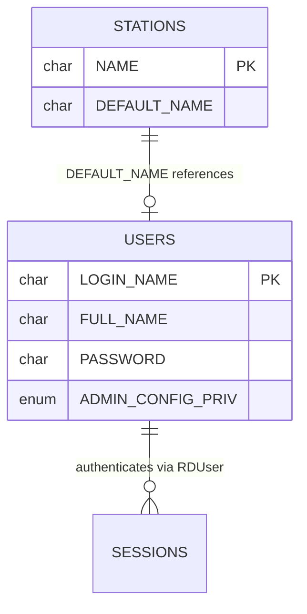
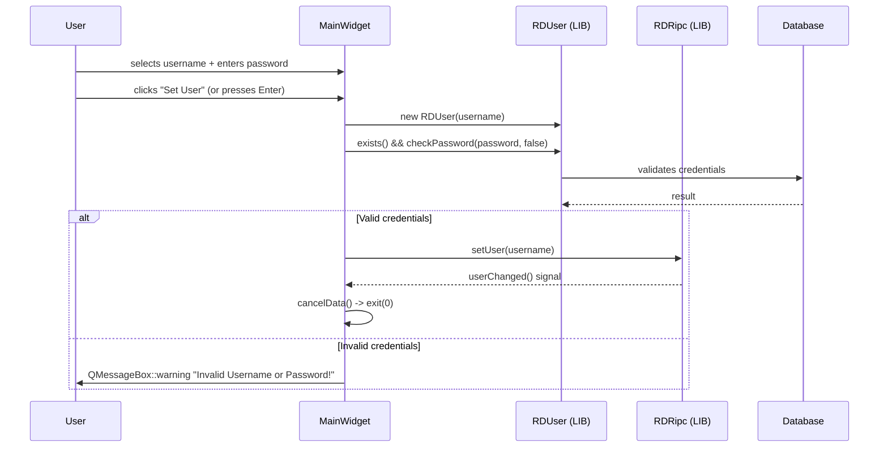
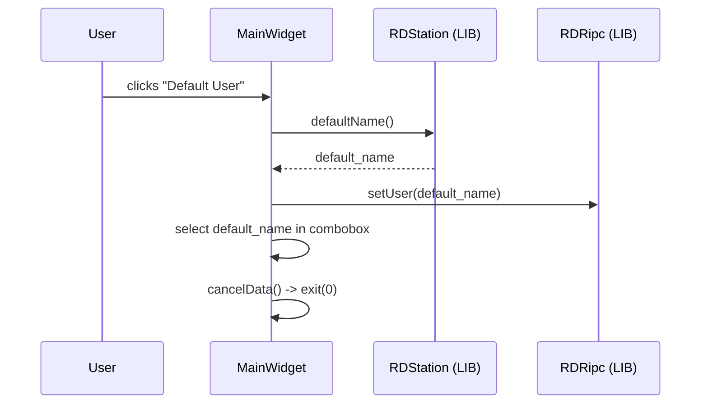
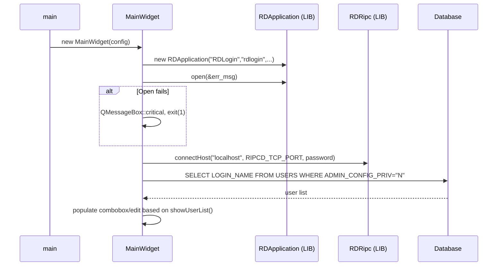

# Semantic Context: LGN (rdlogin)

## Files & Symbols

### Source Files
| File | Type | Symbols | LOC (est) |
|------|------|---------|-----------|
| rdlogin/rdlogin.h | header | MainWidget (class) | ~35 |
| rdlogin/rdlogin.cpp | source | MainWidget (impl), main() | ~275 |

### Other Files
| File | Type | Description |
|------|------|-------------|
| rdlogin/rdlogin.pro | qmake | Build configuration |
| rdlogin/Makefile.am | autotools | Build configuration |
| rdlogin/rdlogin_*.ts | translation | Translations (de, fr, nn, pt_BR, cs, es, nb) |

### Symbol Index
| Symbol | Kind | File | Qt Class? |
|--------|------|------|-----------|
| MainWidget | Class | rdlogin.h | Yes (Q_OBJECT) |
| main | Function | rdlogin.cpp | No |

---

## Class API Surface

### MainWidget [Application Main Window]
- **File:** rdlogin/rdlogin.h
- **Inherits:** RDWidget (from LIB)
- **Qt Object:** Yes (Q_OBJECT)
- **Category:** UI Controller -- manages the login dialog window

#### Signals
None defined. This class only receives signals; it does not emit any.

#### Slots
| Slot | Visibility | Parameters | Description |
|------|-----------|-----------|-------------|
| connectedData | private | (bool state) | Called when RIPC connection state changes (currently empty/no-op) |
| userData | private | () | Called when RIPC user changes; updates the "Current User" label |
| loginData | private | () | Validates credentials and sets the active user via RIPC |
| logoutData | private | () | Resets to the station's default user via RIPC |
| cancelData | private | () | Exits the application with exit(0) |
| quitMainWidget | private | () | Quits the application via qApp->quit() |

#### Public Methods
| Method | Return | Parameters | Brief |
|--------|--------|-----------|-------|
| MainWidget | (ctor) | (RDConfig *c, QWidget *parent=0) | Constructs the login window, initializes RIPC connection and UI |
| ~MainWidget | (dtor) | () | Destructor |
| sizeHint | QSize | () const | Returns QSize(120+login_user_width, 160) -- dynamic width based on longest username |
| sizePolicy | QSizePolicy | () const | Returns Fixed/Fixed policy |

#### Protected Methods
| Method | Return | Parameters | Brief |
|--------|--------|-----------|-------|
| resizeEvent | void | (QResizeEvent *e) | Repositions all widgets based on current window size |

#### Private Fields
| Field | Type | Description |
|-------|------|-------------|
| login_ripc_hostport | Q_UINT16 | RIPC host port (not used in visible code) |
| login_label | QLabel* | Displays "Current User: {username}" |
| login_username_label | QLabel* | Label for username field |
| login_username_box | QComboBox* | Dropdown user selector (visible when showUserList=true) |
| login_username_edit | QLineEdit* | Text input for username (visible when showUserList=false) |
| login_password_label | QLabel* | Label for password field |
| login_password_edit | QLineEdit* | Password input (echo mode: Password) |
| login_rivendell_map | QPixmap* | Application icon (22x22 Rivendell logo) |
| login_button | QPushButton* | "Set User" button |
| logout_button | QPushButton* | "Default User" button |
| cancel_button | QPushButton* | "Cancel" button |
| login_user_width | int | Width of widest username string (min 160, max 900) |
| login_resize | bool | Guard flag preventing layout during construction |

#### Enums
None.

---

## Data Model

### Table: USERS (read-only access from this artifact)
| Column | Type | Constraints |
|--------|------|------------|
| LOGIN_NAME | CHAR(8) | PRIMARY KEY, NOT NULL |
| FULL_NAME | CHAR(64) | INDEX (FULL_NAME_IDX) |
| PHONE_NUMBER | CHAR(20) | |
| DESCRIPTION | CHAR(255) | |
| PASSWORD | CHAR(32) | NOT NULL |
| ADMIN_USERS_PRIV | ENUM('N','Y') | NOT NULL DEFAULT 'N' |
| ADMIN_CONFIG_PRIV | ENUM('N','Y') | NOT NULL DEFAULT 'N' |
| CREATE_CARTS_PRIV | ENUM('N','Y') | NOT NULL DEFAULT 'N' |
| DELETE_CARTS_PRIV | ENUM('N','Y') | NOT NULL DEFAULT 'N' |
| MODIFY_CARTS_PRIV | ENUM('N','Y') | NOT NULL DEFAULT 'N' |
| EDIT_AUDIO_PRIV | ENUM('N','Y') | NOT NULL DEFAULT 'N' |
| ASSIGN_CART_PRIV | ENUM('N','Y') | NOT NULL DEFAULT 'N' |
| CREATE_LOG_PRIV | ENUM('N','Y') | NOT NULL DEFAULT 'N' |
| DELETE_LOG_PRIV | ENUM('N','Y') | NOT NULL DEFAULT 'N' |
| PLAYOUT_LOG_PRIV | ENUM('N','Y') | NOT NULL DEFAULT 'N' |
| ARRANGE_LOG_PRIV | ENUM('N','Y') | NOT NULL DEFAULT 'N' |
| ADDTO_LOG_PRIV | ENUM('N','Y') | NOT NULL DEFAULT 'N' |
| REMOVEFROM_LOG_PRIV | ENUM('N','Y') | NOT NULL DEFAULT 'N' |
| EDIT_CATCHES_PRIV | ENUM('N','Y') | NOT NULL DEFAULT 'N' |

- **Primary Key:** LOGIN_NAME
- **Foreign Keys:** None
- **CRUD from this artifact:** SELECT only (populating user dropdown)

### SQL Queries in Artifact
| # | Operation | Query | File:Line |
|---|-----------|-------|-----------|
| 1 | SELECT | `SELECT LOGIN_NAME FROM USERS WHERE ADMIN_CONFIG_PRIV="N" ORDER BY LOGIN_NAME` | rdlogin.cpp:102 |

### Indirect Data Access (via LIB classes)
| Class | From | Purpose |
|-------|------|---------|
| RDUser | LIB | User authentication -- exists(), checkPassword() |
| RDApplication | LIB | Application bootstrap, config, system settings, RIPC connection |
| RDStation | LIB | Station default user name (defaultName()) |
| RDSystem | LIB | System configuration (showUserList()) |
| RDRipc | LIB | IPC connection for user change notifications (setUser(), user()) |

### ERD


---

## Reactive Architecture

### Signal/Slot Connections
| # | Sender | Signal | Receiver | Slot | File:Line |
|---|--------|--------|----------|------|-----------|
| 1 | rda->ripc() | connected(bool) | this | connectedData(bool) | rdlogin.cpp:83 |
| 2 | rda->ripc() | userChanged() | this | userData() | rdlogin.cpp:84 |
| 3 | login_password_edit | returnPressed() | this | loginData() | rdlogin.cpp:135 |
| 4 | login_button | clicked() | this | loginData() | rdlogin.cpp:143 |
| 5 | logout_button | clicked() | this | logoutData() | rdlogin.cpp:151 |
| 6 | cancel_button | clicked() | this | cancelData() | rdlogin.cpp:159 |

### Key Sequence Diagrams

#### Login Flow


#### Logout (Default User) Flow


#### Startup Flow


### Cross-Artifact Dependencies
| External Class | From Artifact | Used In | Purpose |
|---------------|---------------|---------|---------|
| RDWidget | LIB | rdlogin.h | Base class for MainWidget |
| RDApplication | LIB | rdlogin.cpp | Application bootstrap, config, system, station, ripc access |
| RDConfig | LIB | rdlogin.cpp (main) | Configuration loading |
| RDUser | LIB | rdlogin.cpp (loginData) | User authentication |
| RDRipc | LIB | rdlogin.cpp | IPC connection for user switching |
| RDStation | LIB | rdlogin.cpp (logoutData) | Station default user |
| RDSystem | LIB | rdlogin.cpp | System-wide settings (showUserList) |
| RDSqlQuery | LIB | rdlogin.cpp | Database query execution |
| RDCmdSwitch | LIB | rdlogin.cpp | Command-line argument parsing |

---

## Business Rules

### Rule: Filter Admin Users from Login List
- **Source:** rdlogin.cpp:102
- **Trigger:** Application startup (constructor)
- **Condition:** `ADMIN_CONFIG_PRIV = "N"`
- **Action:** Only non-admin-config users are shown in the login dropdown
- **Gherkin:**
  ```gherkin
  Scenario: Admin config users excluded from login list
    Given the USERS table contains users with ADMIN_CONFIG_PRIV = "Y"
    When rdlogin starts and populates the user dropdown
    Then only users with ADMIN_CONFIG_PRIV = "N" are listed
  ```

### Rule: User List Display Mode
- **Source:** rdlogin.cpp:119
- **Trigger:** Application startup (constructor)
- **Condition:** `rda->system()->showUserList()` returns true/false
- **Action:** If true, show QComboBox dropdown with user list; if false, show QLineEdit for manual username entry
- **Gherkin:**
  ```gherkin
  Scenario: Show user list as dropdown
    Given the system setting showUserList is enabled
    When rdlogin starts
    Then a dropdown combobox with all non-admin users is shown
    And the manual username text field is hidden

  Scenario: Show manual username entry
    Given the system setting showUserList is disabled
    When rdlogin starts
    Then a text input field for username is shown
    And the dropdown combobox is hidden
  ```

### Rule: Authentication Validation
- **Source:** rdlogin.cpp:209
- **Trigger:** User clicks "Set User" or presses Enter in password field
- **Condition:** `user->exists() && user->checkPassword(password, false)`
- **Action:** If valid, set user via RIPC and exit. If invalid, show warning dialog.
- **Gherkin:**
  ```gherkin
  Scenario: Successful login
    Given a valid username is selected/entered
    And the correct password is provided
    When the user clicks "Set User"
    Then the active user is changed via RIPC
    And the application exits with code 0

  Scenario: Failed login
    Given an invalid username or wrong password is provided
    When the user clicks "Set User"
    Then a warning dialog "Invalid Username or Password!" is shown
    And the application remains open
  ```

### Rule: Username Width Capping
- **Source:** rdlogin.cpp:106-109
- **Trigger:** Application startup (constructor)
- **Condition:** `login_user_width > 900`
- **Action:** Cap the username display width at 900 pixels to prevent excessively wide windows
- **Gherkin:**
  ```gherkin
  Scenario: Normal username widths
    Given all usernames fit within 900 pixels
    When rdlogin starts
    Then the window width adapts to the longest username (min 160px)

  Scenario: Very long username
    Given a username exceeds 900 pixels width
    When rdlogin starts
    Then the window width is capped at 1020 pixels (120 + 900)
  ```

### Error Patterns
| Error | Severity | Condition | Message |
|-------|----------|-----------|---------|
| App open failure | critical | `!rda->open(&err_msg)` | Dynamic error message from RDApplication, exits with code 1 |
| Unknown CLI option | critical | `!rda->cmdSwitch()->processed(i)` | "Unknown command option: {key}", exits with code 2 |
| Auth failure | warning | `!user->exists() or !checkPassword()` | "Invalid Username or Password!" |

### Configuration Keys
| Setting | Source | Type | Description |
|---------|--------|------|-------------|
| showUserList | RDSystem (via rda->system()) | bool | Whether to show user dropdown or manual entry |
| defaultName | RDStation (via rda->station()) | string | Station's default username for "logout" action |
| password | RDConfig (via rda->config()) | string | RIPC connection password |

---

## UI Contracts

### Window: MainWidget
- **Type:** RDWidget (inherits QWidget)
- **Title:** "RDLogin"
- **Icon:** rivendell-22x22.xpm (Rivendell logo)
- **Size:** Dynamic width (120 + longest_username_width) x 160, min 280x160, max width ~1020
- **Size Policy:** Fixed/Fixed (not resizable vertically, horizontally expandable to content)
- **Layout:** Manual positioning via resizeEvent (no Qt layout managers)

#### Widgets
| Widget | Type | Label/Text | Object Name | Binding | Position |
|--------|------|-----------|-------------|---------|----------|
| login_label | QLabel | "Current User: {name}" | -- | Updated by userData() slot | top center (0,10,width,21) |
| login_username_label | QLabel | "&Username:" | -- | -- | left (10,40,85,19) |
| login_username_box | QComboBox | {user list} | -- | Populated from USERS table at startup | (110,40,w-120,19) |
| login_username_edit | QLineEdit | {manual entry} | -- | Alternative to combobox | (110,40,w-120,19) |
| login_password_label | QLabel | "&Password:" | -- | -- | left (10,61,85,19) |
| login_password_edit | QLineEdit | {password} | -- | returnPressed->loginData(), maxLen=RD_MAX_PASSWORD_LENGTH, echoMode=Password | (110,61,w-120,19) |
| login_button | QPushButton | "&Set User" | -- | clicked->loginData() | bottom-right area (w-270,h-60,80,50) |
| logout_button | QPushButton | "&Default\nUser" | -- | clicked->logoutData() | bottom-right area (w-180,h-60,80,50) |
| cancel_button | QPushButton | "&Cancel" | -- | clicked->cancelData() | bottom-right area (w-90,h-60,80,50) |

#### Conditional Visibility
| Condition | Visible | Hidden |
|-----------|---------|--------|
| showUserList = true | login_username_box (QComboBox) | login_username_edit (QLineEdit) |
| showUserList = false | login_username_edit (QLineEdit) | login_username_box (QComboBox) |

#### Data Flow
- **Source:** USERS table (SELECT LOGIN_NAME WHERE ADMIN_CONFIG_PRIV="N") at startup
- **Display:** Username dropdown (QComboBox) or text field (QLineEdit), current user label
- **Edit:** User selects/types username, enters password
- **Save:** User change propagated via RDRipc::setUser() to ripcd daemon (IPC, not direct DB write)

#### Window Layout Diagram
```
+----------------------------------------------+
|        Current User: {username}              |  <- login_label (centered)
|                                              |
|  Username: [dropdown/text_________]          |  <- login_username_box or _edit
|  Password: [**********************]          |  <- login_password_edit
|                                              |
|              [Set User] [Default] [Cancel]   |  <- 3 buttons, bottom-right
|              [        ] [ User  ] [      ]   |
+----------------------------------------------+
```
