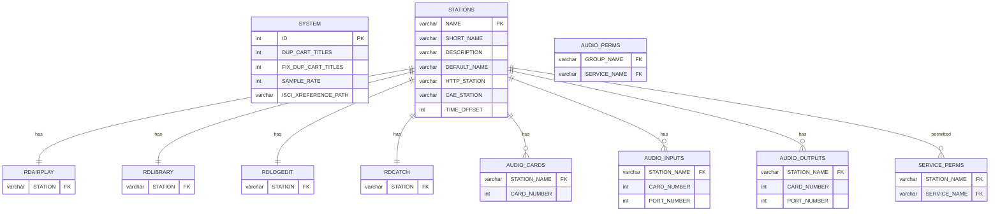
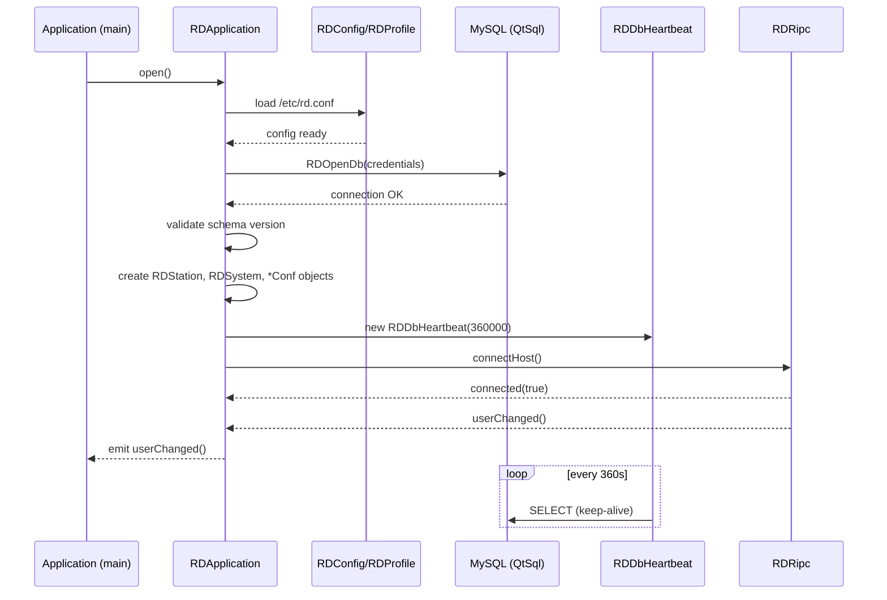

# LIB-001: Infrastructure & Configuration

## Business Context

This feature provides the foundational layer upon which every Rivendell application depends. It covers application bootstrap (singleton initialization, database connection, user session), configuration parsing (rd.conf INI file and per-station DB settings), database keep-alive, SQL abstraction, DPI-aware font scaling, and the shared UI control library. No user-facing workflow directly maps to this layer — it is pure infrastructure consumed by all other features.

## Actors

| Actor | Role in this feature |
|-------|---------------------|
| System (application process) | Bootstraps RDApplication singleton, opens DB, loads config, establishes heartbeat |
| Administrator | Maintains rd.conf and DB configuration tables (SYSTEM, STATIONS, RDAIRPLAY, etc.) |

## Scope Boundary

```
IN SCOPE:
  - Application bootstrap (RDApplication.open())
  - rd.conf parsing (RDConfig / RDProfile)
  - Global settings from SYSTEM table (RDSystem)
  - Per-station config from STATIONS table (RDStation)
  - Per-station app config readers (RDAirplayConf, RDLibraryConf, RDLogeditConf, RDCatchConf)
  - DB heartbeat keep-alive (RDDbHeartbeat)
  - SQL query wrapper with auto-reconnect (RDSqlQuery, RDOpenDb)
  - DPI-aware font engine (RDFontEngine) and base widget classes (RDWidget, RDDialog, RDFrame)
  - Shared UI controls: meters, transport buttons, pickers, selectors, busy dialog
  - Audio hardware config tables (AUDIO_CARDS, AUDIO_INPUTS, AUDIO_OUTPUTS)
  - Permission join tables schema (SERVICE_PERMS, AUDIO_PERMS)
  - Report generator framework (RDReport — 22 formats)

OUT OF SCOPE:
  - User authentication / authorization logic -> see LIB-003
  - Audio playback engine (RDCae, RDPlayDeck, RDLogPlay) -> see LIB-004
  - Cart/Cut data model (RDCart, RDCut) -> see LIB-002
  - Network transfer / IPC protocols -> see LIB-005
  - Podcast / Feed management -> see LIB-007
```

---

## Use Cases

| ID | Actor | Action | Business Effect | Priority |
|----|-------|--------|-----------------|----------|
| UC-1 | System | Bootstraps application via RDApplication::open() | Config loaded, DB connected, subsystems initialized, user session active | MUST |
| UC-2 | System | Parses rd.conf via RDConfig/RDProfile | Database credentials, audio store path, font settings, syslog facility available to all subsystems | MUST |
| UC-3 | System | Reads global settings from SYSTEM table | Sample rate, duplicate-title policy, temp directory, realm name available system-wide | MUST |
| UC-4 | System | Reads station config from STATIONS table | Host-specific audio cards, codec capabilities, time offset configured | MUST |
| UC-5 | System | Maintains DB heartbeat every 360s | MySQL connection stays alive despite server idle-timeout | MUST |
| UC-6 | System | Executes SQL with auto-reconnect (RDSqlQuery) | Transparent recovery from transient DB disconnects | MUST |
| UC-7 | System | Calculates DPI-aware fonts (RDFontEngine) | UI text renders at correct size on any screen density | SHOULD |
| UC-8 | Administrator | Configures per-station app settings (RDAIRPLAY, RDLIBRARY, etc.) | Application behavior customized per workstation | MUST |
| UC-9 | System | Generates reports via RDReport (22 formats) | Traffic reconciliation, royalty, and playout reports exportable | SHOULD |

---

## Business Rules (Gherkin)

```gherkin
Rule: Application Bootstrap Sequence

  Scenario: Successful startup
    Given a valid /etc/rd.conf file exists
    And   MySQL server is reachable with credentials from [mySQL] section
    When  RDApplication::open() is called
    Then  CLI args parsed, rd.conf loaded via RDProfile
    And   systemd service verified running (if applicable)
    And   database opened via RDOpenDb()
    And   schema version validated (must match RD_VERSION_DATABASE = 347)
    And   subsystem objects created: RDStation, RDUser, RDCae, RDRipc, all *Conf readers
    And   atexit callback registered for temp file cleanup

  # Source: lib/rdapplication.h + lib/rdapplication.cpp | Certainty: confirmed

Rule: DB Heartbeat Keep-Alive

  Scenario: Preventing MySQL connection timeout
    Given RDDbHeartbeat started with interval
    When  360 seconds elapse (RD_DB_HEARTBEAT_INTERVAL)
    Then  a lightweight SELECT query is executed
    And   connection stays alive despite MySQL wait_timeout

  # Source: lib/rddbheartbeat.cpp:28, lib/rd.h:68 | Certainty: confirmed

Rule: rd.conf INI Parsing

  Scenario: Reading configuration keys
    Given /etc/rd.conf with [Section]/Tag=Value format
    When  RDConfig loads the file via RDProfile
    Then  keys available: [Identity]/AudioRoot, AudioExtension, Label
    And   [mySQL]/Hostname (default "localhost"), Database (default "Rivendell"),
          Loginname (default "rduser"), Password (default "letmein")
    And   [Fonts]/Family, ButtonSize
    And   [AudioStore]/MountSource, MountType, MountOptions (default "defaults")

  # Source: lib/rdconfig.cpp:101-164, lib/rd.h:63-66 | Certainty: confirmed

Rule: SQL Escape for Injection Prevention

  Scenario: Building SQL queries
    Given user-provided string input
    When  RDSqlQuery::builtInSQLEscape() is applied
    Then  dangerous characters escaped to prevent SQL injection

  # Source: lib/rddb.h (RDSqlQuery) | Certainty: confirmed

Rule: System Limits (compile-time constants)

  Scenario: Enforcing hardware limits
    Given system configuration
    Then  RD_MAX_CARDS = 24 (audio cards per host)
    And   RD_MAX_STREAMS = 48 (streams per card/type)
    And   RD_MAX_PORTS = 24 (ports per card/type)
    And   MAX_TTYS = 8 (serial ports per host)
    And   MAX_DECKS = 8 (record decks per station)
    And   MAX_MATRICES = 8 (matrices per station)

  # Source: lib/rd.h:129-159 | Certainty: confirmed

Rule: Station Cascade Delete

  Scenario: Removing a station from the system
    Given a station NAME in STATIONS table
    When  RDStation::remove() is called
    Then  cascade-deletes rows from 25+ dependent tables (RDAIRPLAY, RDLIBRARY,
          RDLOGEDIT, RDCATCH, AUDIO_CARDS, AUDIO_INPUTS, AUDIO_OUTPUTS, DECKS,
          TTYS, DROPBOXES, MATRICES, SERVICE_PERMS, etc.)

  # Source: inventory.md#RDStation | Certainty: confirmed

Rule: Duplicate Cart Titles Policy

  Scenario: Global setting controls title uniqueness
    Given SYSTEM.DUP_CART_TITLES setting
    When  DUP_CART_TITLES = 0 (disallowed)
    Then  duplicate cart titles get " [N]" suffix appended
    When  DUP_CART_TITLES = 1 (allowed)
    Then  no uniqueness enforcement

  # Source: lib/rdcart.cpp:2361-2385, data-model.md#SYSTEM | Certainty: confirmed
```

---

## Data Model (DB tables in scope)

> From data-model.md -- only tables belonging to this FEAT.
> Full schema: `data-model.md`

### ERD for this feature



### Table: SYSTEM

| Column | Type | Null | Description |
|--------|------|------|-------------|
| ID | int | NO | Singleton row (always 1) |
| DUP_CART_TITLES | int | YES | Allow duplicate cart titles (0=no, 1=yes) |
| FIX_DUP_CART_TITLES | int | YES | Auto-fix existing duplicates flag |
| SAMPLE_RATE | int | YES | System-wide sample rate (default 48000) |
| ISCI_XREFERENCE_PATH | varchar | YES | ISCI cross-reference file path |

**CRUD class:** RDSystem (Config Reader, READ/UPDATE)

### Table: STATIONS

| Column | Type | Null | Description |
|--------|------|------|-------------|
| NAME | varchar PK | NO | Hostname identifier |
| SHORT_NAME | varchar | YES | Display short name |
| DESCRIPTION | varchar | YES | Human description |
| DEFAULT_NAME | varchar | YES | Default user login |
| HTTP_STATION | varchar | YES | HTTP proxy host |
| CAE_STATION | varchar | YES | CAE host |
| TIME_OFFSET | int | YES | Time zone offset |

**CRUD class:** RDStation (Active Record, full CRUD -- cascade 30+ tables on delete)

### Table: RDAIRPLAY / RDLIBRARY / RDLOGEDIT / RDCATCH

Per-station application configuration tables. Each keyed by STATION (FK to STATIONS.NAME).

**CRUD classes:** RDAirplayConf, RDLibraryConf, RDLogeditConf, RDCatchConf (Config Reader, READ/UPDATE)

### Table: AUDIO_CARDS / AUDIO_INPUTS / AUDIO_OUTPUTS

Audio hardware configuration per station, per card, per port.

**CRUD class:** RDAudioPort (Config Reader, READ/UPDATE), RDStation (indirect)

### Relacje FK

| Source | Column | -> Target | PK |
|--------|--------|-----------|-----|
| RDAIRPLAY | STATION | STATIONS | NAME |
| RDLIBRARY | STATION | STATIONS | NAME |
| RDLOGEDIT | STATION | STATIONS | NAME |
| RDCATCH | STATION | STATIONS | NAME |
| AUDIO_CARDS | STATION_NAME | STATIONS | NAME |
| AUDIO_INPUTS | STATION_NAME | STATIONS | NAME |
| AUDIO_OUTPUTS | STATION_NAME | STATIONS | NAME |
| SERVICE_PERMS | STATION_NAME | STATIONS | NAME |

---

## Class API in scope

> From inventory.md -- full method signatures, parameters, effects.

### RDApplication

**Responsibility:** Central application singleton (`rda` global pointer). Initializes config, database, syslog, all subsystem accessors. Manages user session lifecycle and centralized logging.
**Full description:** `inventory.md#RDApplication`

**Public API:**
| Method | Parameters | Effect | Call conditions |
|--------|-----------|--------|-----------------|
| open() | CLI args, ErrorType flags, bool syslog | Full init: parse CLI, load rd.conf, verify systemd, open DB, validate schema, create subsystems | Once at app startup |
| station() | - | Returns RDStation* for this host | After open() |
| user() | - | Returns current RDUser* | After open() |
| cae() | - | Returns RDCae* proxy | After open() |
| ripc() | - | Returns RDRipc* proxy | After open() |
| system() | - | Returns RDSystem* | After open() |
| config() | - | Returns RDConfig* (rd.conf) | After open() |
| airplayConf() | - | Returns RDAirPlayConf* | After open() |
| libraryConf() | - | Returns RDLibraryConf* | After open() |
| logeditConf() | - | Returns RDLogeditConf* | After open() |
| catchConf() | - | Returns RDCatchConf* | After open() |
| syslog() | priority, fmt, ... | Centralized syslog output | Anytime after open() |

**Signals:**
| Signal | Parameters | Business meaning |
|--------|-----------|------------------|
| userChanged() | - | Active user session changed (re-evaluate permissions) |

### RDConfig

**Responsibility:** System configuration from /etc/rd.conf INI file. Provides database credentials, audio store path, syslog facility, station name, font settings, transcoding delay.
**Full description:** `inventory.md#RDConfig`

**Public API:**
| Method | Parameters | Effect | Call conditions |
|--------|-----------|--------|-----------------|
| load() | - | Parses rd.conf via RDProfile | At bootstrap |
| mysqlHostname() | - | Returns DB host (default "localhost") | After load() |
| mysqlDbname() | - | Returns DB name (default "Rivendell") | After load() |
| mysqlUsername() | - | Returns DB user (default "rduser") | After load() |
| mysqlPassword() | - | Returns DB password (default "letmein") | After load() |
| audioRoot() | - | Returns audio file root path | After load() |
| audioExtension() | - | Returns audio file extension | After load() |
| fontFamily() | - | Returns UI font family | After load() |
| fontButtonSize() | - | Returns button font size | After load() |
| audioStoreMountSource() | - | Returns mount source for audio store | After load() |
| audioStoreMountType() | - | Returns mount type (NFS, etc.) | After load() |
| audioStoreMountOptions() | - | Returns mount options (default "defaults") | After load() |
| label() | - | Returns config label (default "Default Configuration") | After load() |

### RDProfile

**Responsibility:** INI-style configuration file parser ([Section] + Tag=Value). Used for rd.conf.
**Full description:** `inventory.md#RDProfile`

**Public API:**
| Method | Parameters | Effect | Call conditions |
|--------|-----------|--------|-----------------|
| setSource() | QString filename | Sets file to parse | Before access |
| stringValue() | section, tag, default | Returns string value | After setSource() |
| intValue() | section, tag, default | Returns int value | After setSource() |
| boolValue() | section, tag, default | Returns bool value | After setSource() |

### RDSystem

**Responsibility:** System-wide settings singleton: sample rate, max POST size, temp directory, DuplicateCarts policy, fix-duplicate-carts flag, show-user-list, realm name.
**Full description:** `inventory.md#RDSystem`

**Public API:**
| Method | Parameters | Effect | Call conditions |
|--------|-----------|--------|-----------------|
| sampleRate() | - | Returns system sample rate | Anytime |
| allowDuplicateCartTitles() | - | Returns DUP_CART_TITLES flag | Anytime |
| fixDuplicateCartTitles() | - | Returns FIX_DUP_CART_TITLES flag | Anytime |
| tempDirectory() | - | Returns temp dir path | Anytime |
| realmName() | - | Returns auth realm | Anytime |
| maxPostLength() | - | Returns max HTTP POST size | Anytime |
| showUserList() | - | Returns whether to show user picker at login | Anytime |

### RDStation

**Responsibility:** Workstation/host model with audio hardware configuration, codec capabilities, and per-station application settings.
**Full description:** `inventory.md#RDStation`

**Public API:**
| Method | Parameters | Effect | Call conditions |
|--------|-----------|--------|-----------------|
| create() | - | Provisions station across 25+ dependent tables | Admin only |
| remove() | - | Cascade-deletes from all dependent tables | Admin only |
| name() | - | Returns station hostname | Anytime |
| shortName() | - | Returns display short name | Anytime |
| defaultName() | - | Returns default user | Anytime |
| caeStation() | - | Returns CAE host | Anytime |
| timeOffset() | - | Returns timezone offset | Anytime |

**Enums:**
| Enum | Values | Meaning |
|------|--------|---------|
| AudioDriver | None, Hpi, Jack, Alsa | Sound card driver type |
| Capability | HaveOggenc, HaveFlac, HaveLame, etc. | Codec availability flags |

### RDDbHeartbeat

**Responsibility:** Periodic lightweight SQL query to prevent MySQL connection timeout.
**Full description:** `inventory.md#RDDbHeartbeat`

**Public API:**
| Method | Parameters | Effect | Call conditions |
|--------|-----------|--------|-----------------|
| (constructor) | int interval_ms, QObject* parent | Creates timer with specified interval | At app startup |

**Signals:** None (internal timer fires `intervalTimeoutData()` slot).

### RDSqlQuery

**Responsibility:** Extended QSqlQuery with automatic reconnect and error logging. Plus `RDOpenDb()` for MySQL connection initialization.
**Full description:** `inventory.md#RDSqlQuery`

**Public API:**
| Method | Parameters | Effect | Call conditions |
|--------|-----------|--------|-----------------|
| (constructor) | QString sql | Executes query with auto-reconnect | Anytime |
| builtInSQLEscape() | QString | Returns SQL-escaped string | Before building queries |
| RDOpenDb() | (global function) | Opens MySQL connection via QtSql | At bootstrap |

### RDFontEngine

**Responsibility:** DPI-aware font calculation engine providing named font presets. Used via multiple inheritance by RDWidget, RDDialog, RDFrame, RDPushButton.
**Full description:** `inventory.md#RDFontEngine`

**Public API:**
| Method | Parameters | Effect | Call conditions |
|--------|-----------|--------|-----------------|
| (provides font presets) | - | Named font objects scaled for current DPI | At widget construction |

### RDAirplayConf

**Responsibility:** Most complex configuration class. Per-station RDAirPlay settings: audio channels, GPIO triggers, log machines, operation modes, panel settings, display templates, exit security.
**Full description:** `inventory.md#RDAirPlayConf`
**DB:** RDAIRPLAY, RDAIRPLAY_CHANNELS, LOG_MACHINES, LOG_MODES

### RDLibraryConf

**Responsibility:** Per-station RDLibrary settings: recording defaults (format, channels, bitrate), CD ripper config, metadata server (CDDB/MusicBrainz), search behavior.
**Full description:** `inventory.md#RDLibraryConf`
**DB:** RDLIBRARY, SYSTEM

### RDLogeditConf

**Responsibility:** Per-station RDLogEdit settings: audio I/O, recording defaults, voicetrack parameters, macro cart triggers.
**Full description:** `inventory.md#RDLogeditConf`
**DB:** RDLOGEDIT, SYSTEM

### RDCatchConf

**Responsibility:** Per-station RDCatch settings. Currently stores only the error RML macro.
**Full description:** `inventory.md#RDCatchConf`
**DB:** RDCATCH

### RDReport

**Responsibility:** Report generation engine with 22 export format filters (CBSI DeltaFlex, TextLog, BMI EMR, SoundExchange, RadioTraffic, VisualTraffic, WideOrbit, SpinCount, etc.). Each format in a separate export_*.cpp file.
**Full description:** `inventory.md#RDReport`
**DB:** REPORTS, ELR_LINES, REPORT_STATIONS/GROUPS/SERVICES

---

## Communication Protocols

None -- this feature is backend-only infrastructure. No IPC/TCP protocols are directly owned by these classes (RDCae and RDRipc proxies are accessed through RDApplication but belong to LIB-005).

---

## UI Contracts

> References to full contracts + key widgets for this FEAT.
> Coding agent MUST read full contracts and open mockups.

**Design Tokens:** `../design-tokens.json`

> **OBOWIĄZKOWE:** Załaduj design-tokens.json do konfiguracji UI frameworka
> aby zachować spójność kolorów, fontów i spacingu z innymi artefaktami.

This feature does not own any top-level dialogs or windows. It provides the **shared UI control library** used by all other features. The controls below are reusable building blocks.

### Shared Audio Meters

**Full contract:** `ui-contracts.md` (no dedicated section -- embedded in parent widgets)
**Mockup HTML:** `mockups/RDStereoMeter.html` (RDStereoMeter)

| Widget | Type | Description | Used by |
|--------|------|-------------|---------|
| RDStereoMeter | QWidget | Dual-channel stereo LED-bar level meter with peak hold | RDEditAudio, RDCartSlot, all playout UIs |
| RDSegMeter | QWidget | Segmented bar-graph level meter (single channel) | Embedded in RDStereoMeter and standalone |

### Shared Transport & Input Controls

| Widget | Type | Description | Used by |
|--------|------|-------------|---------|
| RDTransportButton | QPushButton | Audio transport icon (Play/Stop/Record/FF/Rewind/Eject/Pause), On/Off/Flashing states | RDSimplePlayer, RDCueEdit, RDTimeEdit, RDEditAudio |
| RDPushButton | QPushButton + RDFontEngine | Extended button: flashing, word-wrap, middle/right-click signals | Sound panels, editors, admin dialogs |
| RDComboBox | QComboBox | Extended combo: setup mode click, unique item insertion, key filtering | RDCartDialog (group_box, schedcode_box), RDSoundPanel |
| RDTimeEdit | Q3Frame derivative | Time editor HH:MM:SS.mmm with millisecond precision, Up/Down transport buttons | Event editors (rdairplay, rdlogedit) |

### Shared Picker & Selector Controls

| Widget | Type | Description | Used by |
|--------|------|-------------|---------|
| RDDatePicker | RDWidget | Calendar grid for date selection | RDDateDialog (embedded) |
| RDCardSelector | RDWidget | Audio card + port selector with cascading port filtering | Audio configuration dialogs |
| RDListSelector | RDWidget | Dual-list (available/selected) with Add/Remove buttons | RDSchedCodesDialog (single & bulk mode) |

### Shared Dialogs

| Widget | Type | Title | Description | Used by |
|--------|------|-------|-------------|---------|
| RDDateDialog | RDDialog (modal) | "Select Date" | Wraps RDDatePicker with OK/Cancel | Scheduling, report date selection |

**Mockup HTML:** `mockups/RDDateDialog.html` (RDDateDialog), `mockups/RDSchedCodesDialog.html` (RDSchedCodesDialog — uses RDListSelector)
| RDBusyDialog | RDDialog (modeless) | (dynamic caption) | Indeterminate progress bar for long operations | RDCartDialog (cart_busy_dialog), import/export |
| RDListGroups | RDDialog (modal) | "Select Group" | Group selector filtered by user permissions (GROUPS + USER_PERMS) | Cart creation, filtering |
| RDListSvcs | RDDialog (modal) | "Rivendell Services" | Service selector from SERVICES table | Log creation, report filtering |

### Shared Player Widget

**Full contract:** `ui-contracts.md` (embedded in RDCartDialog)

| Widget | Type | Description | Used by |
|--------|------|-------------|---------|
| RDSimplePlayer | QWidget | Minimal play/stop widget for previewing single carts/cuts. Contains 2 RDTransportButtons (Play, Stop). Connects to RDCae for playback. | RDCartDialog (cart_player), RDLogPlay (audition) |

---

## Integration Signals (from call-graph.md)

### Sequence diagram -- bootstrap flow



**Emitted (this feature -> others):**
| Signal | Class | Receiver | Slot | Context |
|--------|-------|----------|------|---------|
| userChanged() | RDApplication | rdairplay, rdlibrary, all apps | (app-specific) | When user session changes via RDRipc |

**Received (others -> this feature):**
| Sender | Signal | Class (here) | Slot | Context |
|---------|--------|--------------|------|---------|
| RDRipc | userChanged() | RDApplication | userChangedData() | ripcd notifies user change |
| QTimer | timeout() | RDDbHeartbeat | intervalTimeoutData() | Every 360s heartbeat |

---

## Platform Independence

| Function | Original | Clone | Priority |
|----------|----------|-------|----------|
| Database | MySQL via QtSql (RDSqlQuery, RDOpenDb) | Any RDBMS via ORM/driver abstraction | CRITICAL |
| Config file | /etc/rd.conf parsed by RDProfile (custom INI) | Standard config format (TOML/YAML/env) or platform config service | HIGH |
| DPI font scaling | RDFontEngine manual pixel calculation | CSS rem/em units or system DPI scaling (Qt6 auto-scaling) | HIGH |
| Qt3 widgets | Q3ListView, Q3Frame (RDTimeEdit), Q3SocketDevice | Modern Qt6 equivalents (QTreeView, QFrame, QTcpSocket) | HIGH |
| Base widget classes | RDWidget/RDDialog/RDFrame with manual font mixin | Standard QWidget subclass with stylesheet-based theming | MEDIUM |
| syslog integration | Direct syslog() calls | Platform logging abstraction (structured logging) | MEDIUM |
| PID file locking | RDInstanceLock (PID file-based) | Platform process management or systemd integration | LOW |

---

## Configuration (keys in scope)

### rd.conf keys (via RDConfig / RDProfile)

| Key | Type | Default | Effect on this feature |
|-----|------|---------|------------------------|
| [Identity]/AudioRoot | string | (required) | Root directory for audio file storage |
| [Identity]/AudioExtension | string | (required) | File extension for audio files |
| [Identity]/Label | string | "Default Configuration" | Configuration label displayed in UI |
| [mySQL]/Hostname | string | "localhost" | Database server host |
| [mySQL]/Database | string | "Rivendell" | Database name |
| [mySQL]/Loginname | string | "rduser" | Database login |
| [mySQL]/Password | string | "letmein" | Database password |
| [Fonts]/Family | string | (system default) | UI font family name |
| [Fonts]/ButtonSize | int | (system default) | Button font size in points |
| [AudioStore]/MountSource | string | (none) | NFS/CIFS mount source for audio store |
| [AudioStore]/MountType | string | (none) | Mount filesystem type |
| [AudioStore]/MountOptions | string | "defaults" | Mount options |

### DB configuration (SYSTEM table via RDSystem)

| Key | Type | Default | Effect on this feature |
|-----|------|---------|------------------------|
| SAMPLE_RATE | int | 48000 | System-wide audio sample rate |
| DUP_CART_TITLES | int | - | Allow duplicate cart titles (0/1) |
| FIX_DUP_CART_TITLES | int | - | Auto-fix duplicates on startup |

### Compile-time constants (rd.h)

| Constant | Value | Effect |
|----------|-------|--------|
| RD_MAX_CARDS | 24 | Max audio cards per host |
| RD_MAX_STREAMS | 48 | Max streams per card |
| RD_MAX_PORTS | 24 | Max ports per card |
| RD_DB_HEARTBEAT_INTERVAL | 360s | DB keep-alive interval |
| RD_VERSION_DATABASE | 347 | Required DB schema version |

---

## Acceptance Criteria (E2E)

```gherkin
Feature: Infrastructure & Configuration

  Scenario: Application bootstrap succeeds with valid config
    Given a valid /etc/rd.conf with correct MySQL credentials
    And   MySQL server running with Rivendell schema version 347
    When  the application calls RDApplication::open()
    Then  rda->config() returns valid RDConfig with all rd.conf keys
    And   rda->system() returns RDSystem with SYSTEM table values
    And   rda->station() returns RDStation matching current hostname
    And   rda->airplayConf(), libraryConf(), logeditConf(), catchConf() are non-null
    And   DB heartbeat timer is active (360s interval)

  Scenario: Application fails gracefully with invalid DB credentials
    Given rd.conf with incorrect [mySQL] credentials
    When  the application calls RDApplication::open()
    Then  startup aborts with descriptive error
    And   no subsystem objects are created

  Scenario: DB heartbeat prevents connection timeout
    Given application running for > 6 minutes
    And   MySQL wait_timeout set to 300s
    When  360s elapse
    Then  RDDbHeartbeat executes keep-alive SELECT
    And   subsequent SQL queries succeed without reconnect

  Scenario: SQL auto-reconnect on transient failure
    Given a running application with active DB connection
    When  MySQL connection drops temporarily
    And   next RDSqlQuery is executed
    Then  auto-reconnect is attempted
    And   query succeeds transparently

  Scenario: DPI-aware font rendering
    Given a display with non-standard DPI (e.g., 144 DPI)
    When  RDWidget/RDDialog is constructed
    Then  RDFontEngine provides scaled font presets
    And   all text renders at visually correct size

  Scenario: Station cascade delete removes all dependent data
    Given station "TESTHOST" exists in STATIONS table
    And   dependent rows exist in RDAIRPLAY, RDLIBRARY, AUDIO_CARDS, etc.
    When  RDStation::remove() is called
    Then  all 25+ dependent tables have rows for "TESTHOST" removed

  Scenario: Shared UI controls render correctly
    Given any Rivendell dialog using shared controls
    When  RDStereoMeter is displayed
    Then  dual-channel LED-bar meters animate with peak hold
    When  RDTransportButton(Play) is clicked
    Then  button shows Play icon in On state
    When  RDDatePicker is shown
    Then  calendar grid allows date selection
    When  RDListSelector is shown
    Then  dual-list with Add/Remove buttons transfers items correctly
```

---

## Open Questions

- [ ] What is the minimum MySQL/MariaDB version required? Schema uses features that may constrain version.
- [ ] Should rd.conf parsing migrate to a standard format (TOML/YAML) or remain INI-compatible for backward compat?
- [ ] RDFontEngine does manual DPI calculation -- does the target platform (Qt6/web) handle this automatically?
- [ ] RDReport has 22 export formats -- are all still needed or can some legacy formats be dropped?
- [ ] Station cascade delete touches 30+ tables -- should this use DB-level CASCADE constraints instead of application code?

---

## Working Packages (preliminary breakdown)

| WP | Description | Dependencies |
|----|-------------|-------------|
| WP-1 | Config model: RDConfig + RDProfile equivalents (rd.conf parser, typed accessors) | - |
| WP-2 | Database layer: connection management (RDOpenDb), RDSqlQuery (auto-reconnect, escape), RDDbHeartbeat (360s timer) | WP-1 |
| WP-3 | System/Station model: RDSystem (SYSTEM table), RDStation (STATIONS + cascade CRUD), AudioDriver/Capability enums | WP-2 |
| WP-4 | Per-station config readers: RDAirplayConf, RDLibraryConf, RDLogeditConf, RDCatchConf (DB-backed config read/update) | WP-2, WP-3 |
| WP-5 | Application bootstrap: RDApplication singleton (open(), subsystem wiring, user session, syslog, atexit cleanup) | WP-1, WP-2, WP-3, WP-4 |
| WP-6 | UI foundation: RDFontEngine (DPI scaling), RDWidget/RDDialog/RDFrame base classes | WP-1 |
| WP-7 | Shared UI controls: meters (RDStereoMeter, RDSegMeter), transport (RDTransportButton, RDPushButton), inputs (RDComboBox, RDTimeEdit), pickers (RDDatePicker, RDCardSelector, RDListSelector), dialogs (RDDateDialog, RDBusyDialog, RDListGroups, RDListSvcs), player (RDSimplePlayer) | WP-6 |
| WP-8 | Report framework: RDReport (22 format filters, ELR_LINES consumption, station/group/service filtering) | WP-2, WP-3 |
| WP-9 | Tests: unit tests for config parsing, DB layer, system limits, UI control rendering | WP-1..WP-8 |

*Preliminary estimate -- implementation agent may reorganize.*
