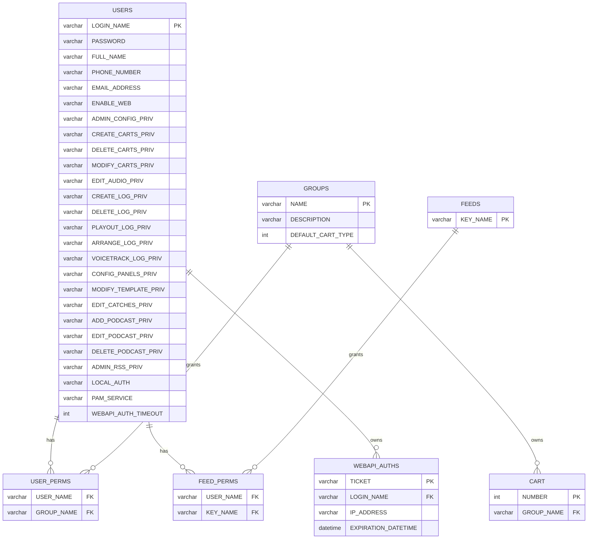
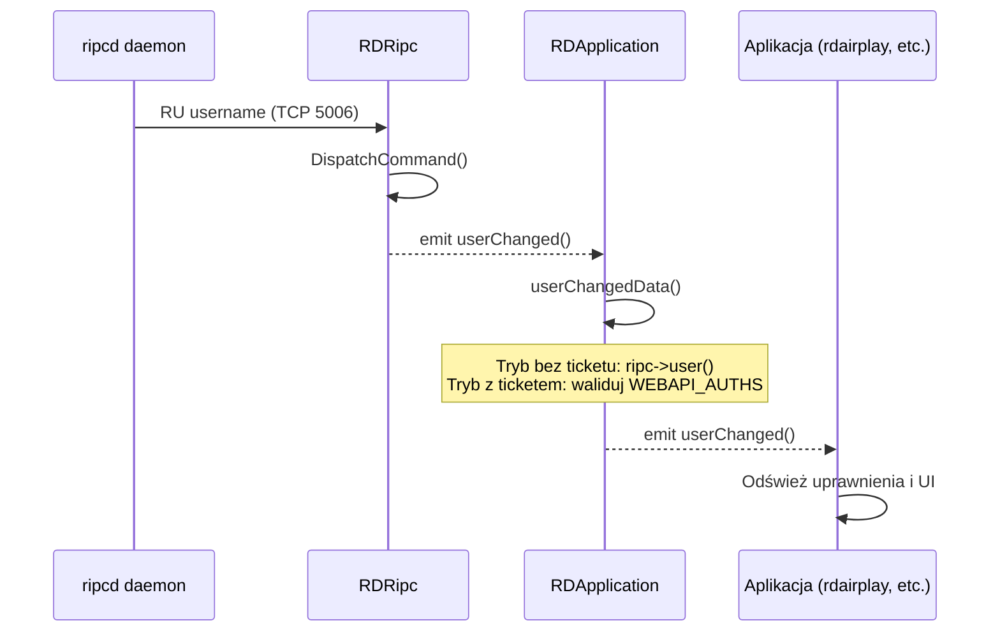
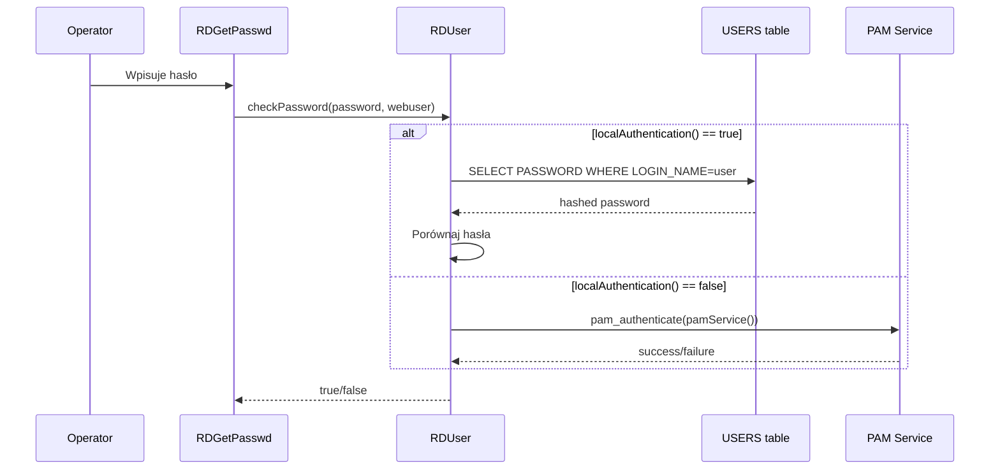

# LIB-002: Authentication & Authorization

## Kontekst biznesowy

Stacja radiowa wymaga kontroli dostępu do systemu: kto może się zalogować i jakie zasoby (carty, feedy podcastowe) może edytować. System obsługuje dwa tryby autentykacji — lokalne hasło w bazie danych oraz delegację do PAM (Pluggable Authentication Modules) — co pozwala na integrację z katalogami korporacyjnymi. Autoryzacja oparta jest na grupach: użytkownik ma dostęp do cartów danej grupy tylko jeśli posiada odpowiedni wpis w tabeli uprawnień, analogicznie dla feedów podcastowych. Dodatkowo każdy użytkownik ma 20+ granularnych flag uprawnień sterujących dostępem do poszczególnych funkcji aplikacji.

## Aktorzy

| Aktor | Rola w tej feature |
|-------|-------------------|
| Operator | Loguje się do systemu, zmienia hasło, wykonuje operacje wymagające uprawnień |
| Administrator | Zarządza użytkownikami, przypisuje uprawnienia i grupy w RDAdmin |
| ripcd daemon | Pośredniczy w autentykacji i zarządzaniu sesją użytkownika przez protokół RIPC |

## Granica funkcjonalności

```
IN SCOPE:
  - Dual-mode authentication (local DB password + PAM)
  - Group-based cart authorization (USER_PERMS)
  - Feed authorization (FEED_PERMS)
  - 20+ boolean privilege flags per user
  - Password entry/change UI dialogs
  - User session lifecycle (userChanged signal chain)
  - Web API ticket management (createTicket, ticketIsValid)
  - RIPC protocol user commands (RU, SU, PW)

OUT OF SCOPE:
  - Administrowanie użytkownikami (CRUD w RDAdmin) → poza lib/
  - GPIO/RML/notification handling przez RIPC → patrz LIB-005
  - Audio operations authorization (kto może odtwarzać) → patrz LIB-003
  - Service-level permissions (USER_SERVICE_PERMS) → nie obsługiwane przez RDUser
```

---

## Use Cases

| ID | Aktor | Akcja | Efekt biznesowy | Priorytet |
|----|-------|-------|----------------|-----------|
| UC-015 | Operator | Loguje się do systemu | System autentykuje użytkownika dual-mode: local DB password lub PAM | MUST |
| UC-016 | Operator | Próbuje edytować cart/feed | System autoryzuje dostęp przez GROUP_NAME join z USER_PERMS / FEED_PERMS | MUST |
| UC-017 | Operator | Zmienia hasło | System waliduje zgodność haseł i zapisuje nowe hasło | SHOULD |
| UC-018 | ripcd | Zmienia użytkownika na stacji (SU) | Cały system odświeża uprawnienia bez restartu aplikacji | MUST |
| UC-019 | Web API client | Żąda ticketu sesji | System generuje SHA1 ticket z timeout i powiązaniem IP | SHOULD |

---

## Reguły biznesowe (Gherkin)

> Pełne reguły z source references. Z facts.md.

```gherkin
Rule: User Authentication — Dual Mode

  Scenario: Authenticating a user via local database
    Given a user login attempt
    When  localAuthentication() is true
    Then  check PASSWORD in USERS table (+ ENABLE_WEB for web users)

  Scenario: Authenticating a user via PAM
    Given a user login attempt
    When  localAuthentication() is false
    Then  delegate to PAM (Pluggable Authentication Modules) using pamService()

  # Źródło: lib/rduser.cpp:65-95 | tests/test_pam.cpp | doc overview.xml
  # Pewność: potwierdzone (kod + test + doc)

Rule: Group-Based Cart Authorization

  Scenario: Checking if user can access a cart
    Given a user and a cart number
    When  cartAuthorized() is called
    Then  CART.GROUP_NAME must match a row in USER_PERMS for that user

  Scenario: User has no permission for cart's group
    Given a user without matching USER_PERMS row
    When  cartAuthorized() is called
    Then  return false — access denied

  # Źródło: lib/rduser.cpp:545-559 | doc rdadmin.xml
  # Pewność: potwierdzone (kod + doc)

Rule: Feed Authorization

  Scenario: Checking if user can access a podcast feed
    Given a user and a feed key_name
    When  feedAuthorized() is called
    Then  must exist matching row in FEED_PERMS for user + key_name

  Scenario: User has no feed permission
    Given a user without matching FEED_PERMS row
    When  feedAuthorized() is called
    Then  return false — access denied

  # Źródło: lib/rduser.cpp:563-576 | doc rdadmin.xml
  # Pewność: potwierdzone (kod + doc)

Rule: Password Change Validation

  Scenario: Passwords must match
    Given operator enters new password and confirmation
    When  passwords differ
    Then  show "The passwords don't match, please try again!"
    And   do not accept change

  Scenario: Password length limit
    Given operator enters new password
    Then  max RD_MAX_PASSWORD_LENGTH (32) characters enforced by QLineEdit maxLength

  # Źródło: lib/rdpasswd.cpp | lib/rd.h (RD_MAX_PASSWORD_LENGTH)
  # Pewność: potwierdzone (kod)

Rule: Web API Ticket Authentication

  Scenario: Creating a session ticket
    Given authenticated user and client IP address
    When  createTicket() is called
    Then  generate SHA1 ticket, store in WEBAPI_AUTHS with expire_dt and client IP

  Scenario: Validating a session ticket
    Given a ticket string and client IP
    When  ticketIsValid() is called
    Then  verify ticket exists in WEBAPI_AUTHS, IP matches, and not expired

  # Źródło: lib/rduser.cpp (createTicket, ticketIsValid) | lib/rdapplication.cpp (userChangedData)
  # Pewność: potwierdzone (kod)
```

---

## Data Model (tabele DB w scope)

> Z data-model.md — tylko tabele dotyczące tego FEAT.
> Pełny schemat: `data-model.md`

### ERD dla tej feature



### Tabela: USERS

| Kolumna | Typ | Null | Opis |
|---------|-----|------|------|
| LOGIN_NAME | varchar PK | NO | Unikalna nazwa logowania |
| PASSWORD | varchar | YES | Zahashowane hasło (local auth) |
| FULL_NAME | varchar | YES | Pełna nazwa użytkownika |
| ENABLE_WEB | enum(Y/N) | NO | Czy dozwolony dostęp web |
| LOCAL_AUTH | bool | NO | true=local DB, false=PAM |
| PAM_SERVICE | varchar | YES | Nazwa serwisu PAM (gdy LOCAL_AUTH=false) |
| ADMIN_CONFIG_PRIV..DELETE_PODCAST_PRIV | enum(Y/N) | NO | 20+ flag uprawnień |
| WEBAPI_AUTH_TIMEOUT | int | NO | Timeout sesji API (sekundy) |

### Tabela: USER_PERMS (join table)

| Kolumna | Typ | Null | Opis |
|---------|-----|------|------|
| USER_NAME | varchar FK | NO | → USERS.LOGIN_NAME |
| GROUP_NAME | varchar FK | NO | → GROUPS.NAME |

### Tabela: FEED_PERMS (join table)

| Kolumna | Typ | Null | Opis |
|---------|-----|------|------|
| USER_NAME | varchar FK | NO | → USERS.LOGIN_NAME |
| KEY_NAME | varchar FK | NO | → FEEDS.KEY_NAME |

### Tabela: WEBAPI_AUTHS

| Kolumna | Typ | Null | Opis |
|---------|-----|------|------|
| TICKET | varchar PK | NO | SHA1 token sesji |
| LOGIN_NAME | varchar FK | NO | → USERS.LOGIN_NAME |
| IP_ADDRESS | varchar | NO | IP klienta powiązane z ticketem |
| EXPIRATION_DATETIME | datetime | NO | Czas wygaśnięcia |

### Relacje FK

| Źródło | Kolumna | → Cel | PK |
|--------|---------|-------|-----|
| USER_PERMS | USER_NAME | USERS | LOGIN_NAME |
| USER_PERMS | GROUP_NAME | GROUPS | NAME |
| FEED_PERMS | USER_NAME | USERS | LOGIN_NAME |
| FEED_PERMS | KEY_NAME | FEEDS | KEY_NAME |
| WEBAPI_AUTHS | LOGIN_NAME | USERS | LOGIN_NAME |
| CART | GROUP_NAME | GROUPS | NAME |

---

## API klas w scope

> Z inventory.md — pełne sygnatury metod, parametry, efekty.

### RDUser

**Odpowiedzialność:** User account model — profil, 20+ boolean privilege flags, dual authentication (local DB hash / PAM), group-based resource authorization, Web API ticket management.
**Pełny opis:** `inventory.md#RDUser`

**Publiczne API:**

| Metoda | Parametry | Efekt | Warunki wywołania |
|--------|-----------|-------|------------------|
| `RDUser(name)` | `const QString &name` | Tworzy obiekt użytkownika powiązany z LOGIN_NAME | Przy identyfikacji użytkownika |
| `RDUser()` | — | Tworzy pusty obiekt (bez nazwy) | Placeholder |
| `name()` | — | Zwraca LOGIN_NAME | — |
| `setName(name)` | `const QString &name` | Ustawia LOGIN_NAME | Zmiana tożsamości |
| `exists()` | — | Sprawdza czy użytkownik istnieje w USERS | Walidacja |
| `authenticated(webuser)` | `bool webuser` | Sprawdza autentykację (local DB lub PAM); webuser wymaga ENABLE_WEB=Y | Logowanie |
| `checkPassword(password, webuser)` | `const QString &password, bool webuser` | Weryfikuje hasło i ustawia stan autentykacji | Logowanie |
| `password()` | — | Zwraca zahashowane hasło z DB | Admin |
| `setPassword(password)` | `const QString &password` | Zapisuje nowe hasło do USERS | Zmiana hasła |
| `enableWeb()` / `setEnableWeb(state)` | `bool state` | Getter/setter flagi ENABLE_WEB | Admin |
| `localAuthentication()` / `setLocalAuthentication(state)` | `bool state` | Getter/setter trybu auth (local vs PAM) | Admin |
| `pamService()` / `setPamService(str)` | `const QString &str` | Getter/setter nazwy serwisu PAM | Admin |
| `groupAuthorized(group_name)` | `const QString &group_name` | Sprawdza czy user ma dostęp do grupy (USER_PERMS) | Autoryzacja |
| `groups()` | — | Zwraca QStringList grup z USER_PERMS | Listowanie |
| `cartAuthorized(cartnum)` | `unsigned cartnum` | Sprawdza dostęp do carta przez GROUP_NAME join z USER_PERMS | Autoryzacja |
| `feedAuthorized(keyname)` | `const QString &keyname` | Sprawdza dostęp do feedu przez FEED_PERMS | Autoryzacja |
| `serviceCheckDefault(serv)` | `QString serv` | Sprawdza domyślny serwis użytkownika | Konfiguracja |
| `services()` | — | Zwraca QStringList serwisów użytkownika | Listowanie |
| `createTicket(ticket, expire_dt, client_addr, start_dt)` | `QString*, QDateTime*, QHostAddress&, QDateTime` | Generuje SHA1 ticket sesji Web API | Web auth |
| `ticketIsValid(ticket, client_addr, username, expire_dt)` | `const QString&, const QHostAddress&, QString*, QDateTime*` | Waliduje ticket (static) | Web auth |

**Privilege flags (20+ getterów/setterów bool):**

| Flag | Getter | Kontroluje |
|------|--------|-----------|
| ADMIN_CONFIG_PRIV | `adminConfig()` | Dostęp do konfiguracji systemu |
| ADMIN_RSS_PRIV | `adminRss()` | Zarządzanie RSS/podcastami |
| CREATE_CARTS_PRIV | `createCarts()` | Tworzenie cartów |
| DELETE_CARTS_PRIV | `deleteCarts()` | Usuwanie cartów |
| MODIFY_CARTS_PRIV | `modifyCarts()` | Modyfikacja cartów |
| EDIT_AUDIO_PRIV | `editAudio()` | Edycja audio |
| WEBGET_LOGIN_PRIV | `webgetLogin()` | Logowanie WebGet |
| CREATE_LOG_PRIV | `createLog()` | Tworzenie logów |
| DELETE_LOG_PRIV | `deleteLog()` | Usuwanie logów |
| DELETE_REC_PRIV | `deleteRec()` | Usuwanie nagrań |
| PLAYOUT_LOG_PRIV | `playoutLog()` | Odtwarzanie logów |
| ARRANGE_LOG_PRIV | `arrangeLog()` | Układanie logów |
| ADDTO_LOG_PRIV | `addtoLog()` | Dodawanie do logów |
| REMOVEFROM_LOG_PRIV | `removefromLog()` | Usuwanie z logów |
| CONFIG_PANELS_PRIV | `configPanels()` | Konfiguracja paneli |
| VOICETRACK_LOG_PRIV | `voicetrackLog()` | Voice tracking |
| MODIFY_TEMPLATE_PRIV | `modifyTemplate()` | Modyfikacja szablonów |
| EDIT_CATCHES_PRIV | `editCatches()` | Edycja zaplanowanych nagrań |
| ADD_PODCAST_PRIV | `addPodcast()` | Dodawanie podcastów |
| EDIT_PODCAST_PRIV | `editPodcast()` | Edycja podcastów |
| DELETE_PODCAST_PRIV | `deletePodcast()` | Usuwanie podcastów |

### RDApplication (fragment auth-related)

**Odpowiedzialność:** Central application singleton. W kontekście auth: zarządza sesją użytkownika, emituje userChanged() przy zmianie tożsamości.
**Pełny opis:** `inventory.md#RDApplication`

**Publiczne API (auth scope):**

| Metoda | Parametry | Efekt | Warunki wywołania |
|--------|-----------|-------|------------------|
| `user()` | — | Zwraca bieżący RDUser | Sprawdzanie uprawnień |
| `setUser(name)` | `const QString &name` | Zmienia bieżącego użytkownika | Zmiana sesji |

**Sygnały:**

| Sygnał | Parametry | Znaczenie biznesowe |
|--------|-----------|---------------------|
| `userChanged()` | — | Aktywna sesja użytkownika zmieniła się — aplikacje odświeżają uprawnienia i UI |

---

## Protokoły komunikacji

> Z SPEC.md Sekcja 9 — komendy RIPC używane przez klasy w scope.

| Komenda | Parametry | Odpowiedź | Znaczenie |
|---------|-----------|-----------|-----------|
| PW | password | PW +/- | Autentykacja połączenia z ripcd |
| RU | — | RU username | Żądanie/otrzymanie tożsamości aktualnego użytkownika |
| SU | user | — | Ustawienie nowego użytkownika na stacji |

**Protokół:** RIPC (TCP 5006, text-based, bidirectional)
**Klasa kliencka:** RDRipc

---

## UI Contracts

> Referencje do pełnych kontraktów + kluczowe widgety dla tego FEAT.

**Design Tokens:** `../design-tokens.json`

> **OBOWIĄZKOWE:** Załaduj design-tokens.json do konfiguracji UI frameworka
> aby zachować spójność kolorów, fontów i spacingu z innymi artefaktami.

### RDGetPasswd — Enter Password

**Pełny kontrakt:** `ui-contracts.md#RDGetPasswd`
**Mockup HTML:** brak
**Rozmiar:** 190x120 (fixed)

**Kluczowe widgety w scope tej feature:**

| Widget | Typ | Etykieta | Akcja | Slot |
|--------|-----|----------|-------|------|
| pw_password_edit | QLineEdit | — | Pole hasła, EchoMode::Password | — |
| ok_button | QPushButton | "&OK" | Zapisuje hasło, done(0) | okData() |
| cancel_button | QPushButton | "&Cancel" | done(-1) | cancelData() |

**Stany widoku:**

| Stan | Kiedy | Efekt wizualny |
|------|-------|---------------|
| Domyślny | Otwarcie | Puste pole hasła z maskowaniem, etykieta "Enter password" |

**Walidacje:** Brak walidacji — akceptuje dowolne hasło (nawet puste).

### RDPasswd — Change Password

**Pełny kontrakt:** `ui-contracts.md#RDPasswd`
**Mockup HTML:** brak
**Rozmiar:** 450x125 (resizable via resizeEvent)

**Kluczowe widgety w scope tej feature:**

| Widget | Typ | Etykieta | Akcja | Slot |
|--------|-----|----------|-------|------|
| passwd_password_1_edit | QLineEdit | "&Password:" | Nowe hasło, EchoMode::Password, max 32 znaków, RDTextValidator, autoFocus | — |
| passwd_password_2_edit | QLineEdit | "C&onfirm:" | Potwierdzenie, EchoMode::Password, max 32 znaków, RDTextValidator | — |
| passwd_ok_button | QPushButton | "&OK" | Walidacja + done(0) | okData() |
| passwd_cancel_button | QPushButton | "&Cancel" | done(1) | cancelData() |

**Stany widoku:**

| Stan | Kiedy | Efekt wizualny |
|------|-------|---------------|
| Domyślny | Otwarcie | Dwa puste pola hasła z maskowaniem, fokus na pierwszym |

**Walidacje (z source reference):**

| Pole | Reguła | Komunikat | Źródło |
|------|--------|-----------|--------|
| password_1 vs password_2 | Hasła muszą być identyczne | "The passwords don't match,\nplease try again!" | lib/rdpasswd.cpp |
| oba pola | RDTextValidator (blokuje niedozwolone znaki) | — | lib/rdpasswd.cpp |
| oba pola | max RD_MAX_PASSWORD_LENGTH (32) | — | lib/rd.h |

### RDGetAth — Enter ATH (Aggregate Tuning Hours)

**Pełny kontrakt:** `ui-contracts.md#RDGetAth`
**Mockup HTML:** brak
**Rozmiar:** 250x160 (fixed)

> Uwaga: RDGetAth nie jest bezpośrednio dialogiem autentykacji. Jest to dialog do wpisywania wartości ATH (Aggregate Tuning Hours) dla raportowania. Włączony w scope ze względu na wspólny wzorzec "modal input dialog" z RDGetPasswd.

**Kluczowe widgety w scope tej feature:**

| Widget | Typ | Etykieta | Akcja | Slot |
|--------|-----|----------|-------|------|
| ath_ath_edit | QLineEdit | "ATH:" | Wartość ATH, QDoubleValidator >= 0.0 | — |
| ok_button | QPushButton | "&OK" | Walidacja + done(0) | okData() |
| cancel_button | QPushButton | "&Cancel" | done(-1) | cancelData() |

**Walidacje (z source reference):**

| Pole | Reguła | Komunikat | Źródło |
|------|--------|-----------|--------|
| ath_ath_edit | Nie może być pusty | "You must provide a valid ATH figure!" | lib/rdget_ath.cpp |
| ath_ath_edit | QDoubleValidator >= 0.0 | — (blokuje input) | lib/rdget_ath.cpp |

---

## Sygnały integracji (z call-graph.md)

### Sequence diagram — zmiana użytkownika (główny flow)



### Sequence diagram — autentykacja hasłem



**Emitowane (ta feature → inne):**

| Sygnał | Klasa | Odbiorca | Slot | Kontekst |
|--------|-------|----------|------|----------|
| `userChanged()` | RDApplication | rdairplay, rdlibrary, rdpanel, itp. | per-app slot | Zmiana sesji użytkownika — odśwież uprawnienia |

**Odbierane (inne → ta feature):**

| Nadawca | Sygnał | Klasa (tu) | Slot | Kontekst |
|---------|--------|------------|------|----------|
| RDRipc | `userChanged()` | RDApplication | `userChangedData()` | ripcd raportuje zmianę użytkownika na stacji |

---

## Platform Independence

| Funkcja | Oryginał | Klon | Priorytet |
|---------|----------|------|-----------|
| PAM authentication | Linux PAM (pam_authenticate) | OAuth2 / LDAP / OIDC | HIGH |
| MySQL password storage | Direct DB hash comparison | Modern hashing (bcrypt/argon2) + abstraction layer | HIGH |
| SHA1 ticket generation | SHA1 + QUuid | JWT or similar modern token standard | MEDIUM |

---

## Configuration (klucze w scope)

| Klucz | Typ | Domyślna | Wpływ na tę feature |
|-------|-----|---------|---------------------|
| RD_MAX_PASSWORD_LENGTH | int (constant) | 32 | Maksymalna długość hasła w polach UI i DB |
| LOCAL_AUTH (per user) | bool | true | Przełącza tryb auth: local DB vs PAM |
| PAM_SERVICE (per user) | varchar | "" | Nazwa serwisu PAM dla danego użytkownika |
| ENABLE_WEB (per user) | enum(Y/N) | N | Czy użytkownik może logować się przez Web API |
| WEBAPI_AUTH_TIMEOUT (per user) | int (seconds) | — | Czas ważności ticketu Web API |

---

## Acceptance Criteria (E2E)

```gherkin
Feature: Authentication & Authorization

  Scenario: Local DB authentication — happy path
    Given user "admin" exists with LOCAL_AUTH=true and known password
    When  checkPassword("correct_pass", false) is called
    Then  authenticated(false) returns true

  Scenario: Local DB authentication — wrong password
    Given user "admin" exists with LOCAL_AUTH=true
    When  checkPassword("wrong_pass", false) is called
    Then  authenticated(false) returns false

  Scenario: PAM authentication delegation
    Given user "pam_user" exists with LOCAL_AUTH=false and PAM_SERVICE="rivendell"
    When  checkPassword("pam_pass", false) is called
    Then  system delegates to PAM service "rivendell"
    And   result matches PAM response

  Scenario: Web user requires ENABLE_WEB
    Given user "web_user" exists with ENABLE_WEB=N
    When  checkPassword("correct_pass", true) is called
    Then  authenticated(true) returns false

  Scenario: Cart authorization — user has group permission
    Given user "dj" has USER_PERMS row for group "MUSIC"
    And   cart 10001 belongs to group "MUSIC"
    When  cartAuthorized(10001) is called
    Then  returns true

  Scenario: Cart authorization — no permission
    Given user "intern" has no USER_PERMS row for group "NEWS"
    And   cart 20001 belongs to group "NEWS"
    When  cartAuthorized(20001) is called
    Then  returns false

  Scenario: Feed authorization — happy path
    Given user "podcaster" has FEED_PERMS row for key_name "morning_show"
    When  feedAuthorized("morning_show") is called
    Then  returns true

  Scenario: User session change via RIPC
    Given application connected to ripcd
    When  ripcd sends SU command changing user to "new_operator"
    Then  RDRipc emits userChanged()
    And   RDApplication updates user object
    And   RDApplication emits userChanged()
    And   all connected application modules refresh their permissions and UI

  Scenario: Password change — matching passwords
    Given operator opens RDPasswd dialog
    When  enters "newpass123" in both fields
    And   clicks OK
    Then  dialog returns done(0) with new password

  Scenario: Password change — mismatched passwords
    Given operator opens RDPasswd dialog
    When  enters "newpass123" and "different123"
    And   clicks OK
    Then  warning "The passwords don't match, please try again!" shown
    And   dialog remains open

  Scenario: Web API ticket lifecycle
    Given authenticated user "api_user" from IP 192.168.1.100
    When  createTicket() is called
    Then  SHA1 ticket stored in WEBAPI_AUTHS with IP and expiry
    And   ticketIsValid(ticket, same_ip) returns true
    And   ticketIsValid(ticket, different_ip) returns false
```

---

## Open Questions

- [ ] Jaki algorytm hashowania hasła jest używany w local auth? (MD5, SHA, plain text?) — wpływ na migrację do modern hashing
- [ ] Czy PAM service name jest globalny czy per-user? (Analiza wskazuje per-user — do potwierdzenia)
- [ ] Czy Web API ticket powinien zostać zastąpiony przez JWT w klonie?

---

## Working Packages (wstępny podział)

| WP | Opis | Zależności |
|----|------|-----------|
| WP-1 | Domain model: User entity z privilege flags + auth state | - |
| WP-2 | Data access: USERS, USER_PERMS, FEED_PERMS, WEBAPI_AUTHS — repository/ORM | WP-1 |
| WP-3 | Business logic: dual-mode auth (local + external provider), cart/feed authorization | WP-1, WP-2 |
| WP-4 | UI: Enter Password dialog, Change Password dialog | WP-1, WP-3 |
| WP-5 | Integration: userChanged signal chain, RIPC user commands (RU/SU/PW) | WP-1, WP-3 |
| WP-6 | Web API: ticket creation/validation (or JWT replacement) | WP-1, WP-2 |
| WP-7 | Tests: auth scenarios, authorization matrix, ticket lifecycle | WP-1..WP-6 |

*Szacunek wstępny — agent PM może podzielić inaczej.*
