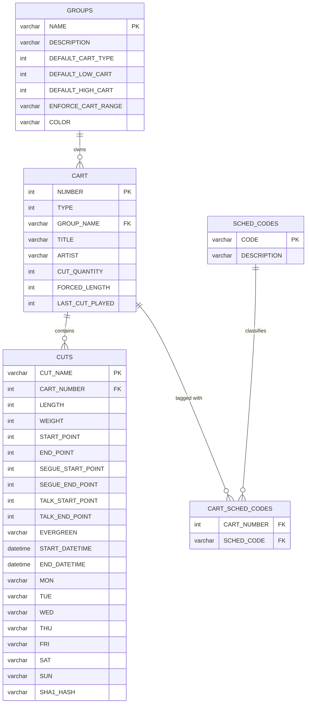
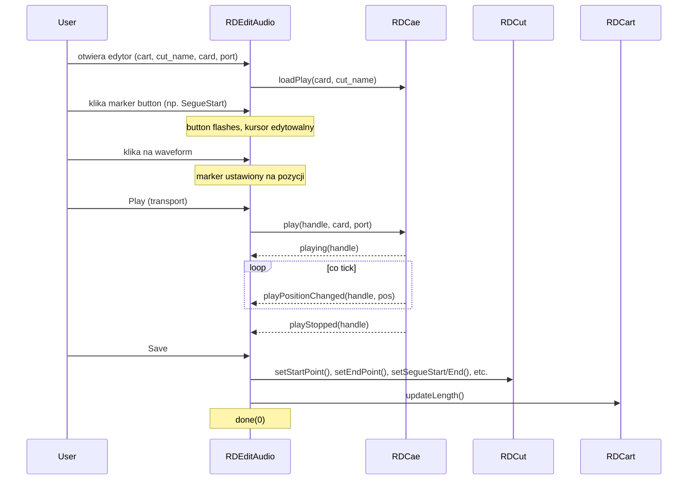

# LIB-003: Cart & Cut Domain Model

## Kontekst biznesowy

Cart i Cut to fundamentalne encje modelu domenowego Rivendell. Cart jest kontenerem audio (lub makra), a Cut to konkretny segment audio wewnątrz carta. Operator radiowy tworzy karty w grupach z zakresami numerów, przypisuje metadane (tytuł, artysta, scheduler codes), ustawia markery audio (11 typow: start/end, talk, segue, hook, fade), a system automatycznie wybiera cuty do odtworzenia na podstawie walidacji dat, daypartingu, dnia tygodnia i rotacji wagowej. Ten model jest atomem schedulingu i playout - wszystkie inne podsystemy (logi, panele, dropboxy) operuja na kartach i cutach.

## Aktorzy

| Aktor | Rola w tej feature |
|-------|-------------------|
| Operator radiowy | Tworzy karty, importuje audio, edytuje metadane i markery, zarzadza cutami |
| System (scheduler/playout) | Wybiera cuty do odtworzenia (walidacja + rotacja), aktualizuje statystyki |

## Granica funkcjonalnosci

```
IN SCOPE:
  - RDCart: CRUD, cut selection, validity computation, rotation (weight/order), updateLength()
  - RDCut: CRUD, markery audio (11 typow), validity check, metadata, autoTrim/autoSegue
  - RDGroup: Active Record, cart range enforcement, free cart counting
  - RDWaveData: DTO metadanych audio (title, artist, album, ~80 pol)
  - RDSchedCode: scheduler code assignment (SCHED_CODES, CART_SCHED_CODES)
  - UI: RDCartDialog, RDCutDialog, RDEditAudio, RDWaveDataDialog, RDAddCart,
         RDSchedCodesDialog, RDCueEdit, RDCueEditDialog, RDExportSettingsDialog
  - DB: CART, CUTS, GROUPS, SCHED_CODES, CART_SCHED_CODES

OUT OF SCOPE:
  - Audio import/export pipeline -> patrz LIB-005
  - Playout engine (RDLogPlay, RDPlayDeck) -> patrz LIB-006
  - Log model (RDLog, RDLogEvent, RDLogLine) -> patrz LIB-007
  - Sound Panel -> patrz LIB-008
  - User/Group permissions model -> patrz LIB-002
```

---

## Use Cases

| ID | Aktor | Akcja | Efekt biznesowy | Priorytet |
|----|-------|-------|----------------|-----------|
| UC-001 | Operator | Tworzy nowa karte audio | Karta z unikalnym numerem w zakresie grupy (1-999999) | MUST |
| UC-006 | Operator | Ustawia markery audio w edytorze | 11 typow markerow (Start/End/Talk/Segue/Hook/Fade) ustawionych na waveformie | MUST |
| UC-007 | System | Wybiera cut do odtworzenia | Cut przechodzi walidacje (data/czas/DOW/evergreen) + rotacje (weight/order) | MUST |

---

## Reguly biznesowe (Gherkin)

> Pelne reguly z source references. Z facts.md.

```gherkin
Rule: Cut Selection -- Validity Window

  Scenario: Selecting a cut for playback from an audio cart
    Given a cart of type Audio with cuts in CUTS table
    When  the system selects the next cut to play
    Then  only cuts matching ALL of the following are eligible:
          - START_DATETIME <= now <= END_DATETIME (or dates are NULL)
          - START_DAYPART <= current_time <= END_DAYPART (or dayparts are NULL)
          - Current day-of-week column (MON-SUN) = "Y"
          - EVERGREEN = "N" (non-evergreen cuts tried first)
          - LENGTH > 0 (cut must have audio content)

  # Zrodlo: lib/rdcart.cpp:113-128 | doc rdlibrary.xml:sect.rdlibrary.cut_dayparting
  # Pewnosc: potwierdzone (kod + doc + crosscheck)

Rule: Evergreen Fallback

  Scenario: No valid non-evergreen cuts found
    Given an audio cart where no cuts pass the validity window
    When  the system needs a cut to play
    Then  the system falls back to EVERGREEN="Y" cuts with LENGTH>0
    And   if no evergreen cuts exist either, no playback occurs

  # Zrodlo: lib/rdcart.cpp:145-168 | doc rdlibrary.xml:cart_and_cut_color_coding
  # Pewnosc: potwierdzone (kod + doc)

Rule: Cut Validity -- Evergreen Override

  Scenario: Checking if a specific cut is valid
    Given a cut with EVERGREEN = "Y"
    When  validity is checked
    Then  the cut bypasses all date/day/daypart checks -- always valid

  # Zrodlo: lib/rdcut.cpp:128-131
  # Pewnosc: potwierdzone

Rule: Cart Validity Levels (5-state model)

  Scenario: Computing overall cart validity from its cuts
    Given a cart with one or more cuts
    When  cart validity is computed
    Then  validity = HIGHEST of any cut's validity:
          - NeverValid: no playable cuts
          - ConditionallyValid: cuts with daypart/DOW/date restrictions
          - FutureValid: START_DATETIME is in the future
          - AlwaysValid: promoted from Conditionally when ALL 7 days + no daypart
          - EvergreenValid: ALL cuts are evergreen

  # Zrodlo: lib/rdcart.cpp:1131-1196
  # Pewnosc: potwierdzone (doc upraszcza do 4 kolorow UI)

Rule: Cart Number Range Enforcement

  Scenario: Creating/validating a cart number for a group
    Given a group with ENFORCE_CART_RANGE = "Y"
    When  a cart number is validated
    Then  must be between DEFAULT_LOW_CART and DEFAULT_HIGH_CART (inclusive)
    And   must be between 1 and 999999 (global range)

  # Zrodlo: lib/rdgroup.cpp:331-356 | tests/reserve_carts_test.cpp | doc rdadmin.xml
  # Pewnosc: potwierdzone (kod + test + doc)

Rule: Duplicate Cart Titles

  Scenario: Setting a cart title when duplicates are disallowed
    Given allowDuplicateCartTitles() is false
    When  a cart title already exists on another cart
    Then  system appends " [N]" suffix (incrementing) until unique

  # Zrodlo: lib/rdcart.cpp:2361-2385
  # Pewnosc: potwierdzone

Rule: Cut Name Format

  Scenario: Creating a new cut
    Given a cart with number N
    When  adding a new cut
    Then  cut_name = sprintf("%06d_%03d", cart_number, cut_number)
    And   cut_number is next available slot (1 to 999)

  # Zrodlo: lib/rdcart.cpp:1252-1255
  # Pewnosc: potwierdzone

Rule: Cut Rotation -- By Weight

  Scenario: Selecting next cut with weighting enabled
    Given a cart with Schedule Cuts = "By Weight"
    When  selecting the next cut
    Then  cut with lowest ratio (LOCAL_COUNTER / WEIGHT) is chosen
    And   expired cuts (past END_DATETIME) have WEIGHT=0 (excluded)

  # Zrodlo: lib/rdcart.cpp:129-131, 2231-2237 | doc rdlibrary.xml
  # Pewnosc: potwierdzone (kod + doc)

Rule: Cut Rotation -- By Specified Order

  Scenario: Selecting next cut with weighting disabled
    Given a cart with Schedule Cuts = "By Specified Order"
    When  selecting the next cut
    Then  cuts sorted by LAST_PLAY_DATETIME desc, PLAY_ORDER desc
    And   picks next PLAY_ORDER after last played, wraps around

  # Zrodlo: lib/rdcart.cpp:133-135, 2239-2259 | doc rdlibrary.xml
  # Pewnosc: potwierdzone (kod + doc)

Rule: Timescale Feasibility

  Scenario: Enforced length check
    Given a cut with enforce_length enabled
    When  LENGTH * RD_TIMESCALE_MAX < forced_length OR LENGTH * RD_TIMESCALE_MIN > forced_length
    Then  the cut is NeverValid (cannot be timescaled to fit)

  # Zrodlo: lib/rdcart.cpp:2348-2355
  # Pewnosc: potwierdzone
```

---

## Data Model (tabele DB w scope)

> Z data-model.md -- tylko tabele dotyczace tego FEAT.
> Pelny schemat: `data-model.md`

### ERD dla tej feature



### Tabela: CART

| Kolumna | Typ | Null | Opis |
|---------|-----|------|------|
| NUMBER | int PK | NO | Numer carta (1-999999) |
| TYPE | int | NO | 1=Audio, 2=Macro |
| GROUP_NAME | varchar FK->GROUPS | NO | Grupa wlascicielska |
| TITLE | varchar | YES | Tytul |
| ARTIST | varchar | YES | Artysta |
| CUT_QUANTITY | int | NO | Liczba cutow |
| FORCED_LENGTH | int | YES | Wymuszona dlugosc (ms) |
| LAST_CUT_PLAYED | int | YES | Ostatnio odtworzony cut |

### Tabela: CUTS

| Kolumna | Typ | Null | Opis |
|---------|-----|------|------|
| CUT_NAME | varchar PK | NO | Format NNNNNN_NNN |
| CART_NUMBER | int FK->CART | NO | Numer carta |
| LENGTH | int | NO | Dlugosc (ms) |
| WEIGHT | int | NO | Waga rotacji |
| START_POINT / END_POINT | int | YES | Markery start/end (ms) |
| SEGUE_START_POINT / SEGUE_END_POINT | int | YES | Markery segue (ms) |
| TALK_START_POINT / TALK_END_POINT | int | YES | Markery talk (ms) |
| EVERGREEN | enum(Y/N) | NO | Czy zawsze dostepny |
| START_DATETIME / END_DATETIME | datetime | YES | Zakres waznosci |
| MON..SUN | enum(Y/N) | NO | Dni tygodnia |
| SHA1_HASH | varchar | YES | Hash audio |

### Tabela: GROUPS

| Kolumna | Typ | Null | Opis |
|---------|-----|------|------|
| NAME | varchar PK | NO | Nazwa grupy |
| DESCRIPTION | varchar | YES | Opis |
| DEFAULT_CART_TYPE | int | NO | Domyslny typ carta |
| DEFAULT_LOW_CART | int | NO | Dolna granica zakresu |
| DEFAULT_HIGH_CART | int | NO | Gorna granica zakresu |
| ENFORCE_CART_RANGE | varchar | NO | Czy wymuszac zakres (Y/N) |
| COLOR | varchar | YES | Kolor grupy |

### Tabela: SCHED_CODES / CART_SCHED_CODES

| Kolumna | Typ | Null | Opis |
|---------|-----|------|------|
| SCHED_CODES.CODE | varchar PK | NO | Kod schedulera |
| SCHED_CODES.DESCRIPTION | varchar | YES | Opis kodu |
| CART_SCHED_CODES.CART_NUMBER | int FK->CART | NO | Numer carta |
| CART_SCHED_CODES.SCHED_CODE | varchar FK->SCHED_CODES | NO | Kod schedulera |

### Relacje FK

| Zrodlo | Kolumna | -> Cel | PK |
|--------|---------|-------|-----|
| CART | GROUP_NAME | GROUPS | NAME |
| CUTS | CART_NUMBER | CART | NUMBER |
| CART_SCHED_CODES | CART_NUMBER | CART | NUMBER |
| CART_SCHED_CODES | SCHED_CODE | SCHED_CODES | CODE |

---

## API klas w scope

> Z inventory.md -- pelne sygnatury metod, parametry, efekty.

### RDCart

**Odpowiedzialnosc:** Centralny model kontenera audio/makro. Active Record z pelnym CRUD na tabeli CART. Zarzadza cutami, cut selection z rotacja/waga/dayparting/date-validity, i metadanymi.
**Pelny opis:** `inventory.md#RDCart`

**Publiczne API:**
| Metoda | Parametry | Efekt | Warunki wywolania |
|--------|-----------|-------|------------------|
| create() | group, type, title | Tworzy carte w DB, auto-assigns numer z zakresu grupy | nowy cart |
| remove() | station, user, cart_num | Usuwa carte (cascade: cuty, audio, DB record) | operator z uprawnieniami |
| selectCut() | - | Zwraca cut_name wybranego cuta (validity + rotation) | playout/scheduler |
| addCut() | - | Tworzy nowy cut w carcie, zwraca cut_name | operator |
| removeCut() | station, user, cut_name | Usuwa cut (audio + DB), resetuje rotacje | operator |
| updateLength() | enforce_length, forced_length | Przelicza avg_length, segue, hook, talk na podstawie cutow | po zmianie cuta |
| type() | - | Zwraca Cart::Type (Audio/Macro) | odczyt |
| validity() | - | Zwraca Cart::Validity (5-state) | odczyt |

**Enums:**
| Enum | Wartosci | Znaczenie |
|------|----------|-----------|
| Type | Audio=1, Macro=2, All=3 | Typ zawartosci carta |
| Validity | NeverValid, ConditionallyValid, FutureValid, AlwaysValid, EvergreenValid | 5-stanowy model dostepnosci |
| PlayOrder | Sequence=0, Random=1 | Tryb rotacji cutow |
| UsageCode | Feature=0, Open=1, Close=2, Theme=3, Background=4, Promo=5, Legal=6, Other=7 | Kategoria uzycia radiowego |

**Formuly:**
| Formula | Definicja |
|---------|-----------|
| avg_length | sum(cut_length * weight) / sum(weight) |
| avg_segue | analogicznie z segue points |
| hook_length | hook_end - hook_start |
| talk_length | talk_end - talk_start |
| cut_ratio | LOCAL_COUNTER / WEIGHT |

### RDCut

**Odpowiedzialnosc:** Reprezentuje pojedynczy segment audio w carcie. Zarzadza markerami audio (11 typow), oknami schedulingu (daypart, date validity, DOW), licznikiem odtworzen, i operacjami na pliku audio.
**Pelny opis:** `inventory.md#RDCut`

**Publiczne API:**
| Metoda | Parametry | Efekt | Warunki wywolania |
|--------|-----------|-------|------------------|
| isValid() | datetime | Sprawdza czy cut jest valid w danym momencie (date/daypart/DOW/evergreen) | walidacja |
| autoTrim() | RDCae*, station, card, port, level | Zleca server-side silence detection i ustawia markery start/end | operator |
| autoSegue() | RDCae*, station, card, port, level | Zleca server-side silence detection i ustawia markery segue | operator |
| logPlayout() | - | Inkrementuje play counter, zapisuje last play datetime | po odtworzeniu |
| setStartPoint() / setEndPoint() | int ms | Ustawia markery start/end | edycja markerow |
| setSegueStartPoint() / setSegueEndPoint() | int ms | Ustawia markery segue | edycja markerow |
| setTalkStartPoint() / setTalkEndPoint() | int ms | Ustawia markery talk | edycja markerow |
| setHookStartPoint() / setHookEndPoint() | int ms | Ustawia markery hook | edycja markerow |
| setFadeupPoint() / setFadedownPoint() | int ms | Ustawia markery fade | edycja markerow |

**Audio markers (11 typow):**
| Marker | Kolor | Para |
|--------|-------|------|
| Start / End | RED (RD_START_END_MARKER_COLOR) | Granice odtwarzanego audio |
| TalkStart / TalkEnd | BLUE (RD_TALK_MARKER_COLOR) | Segment mowiony (talk-over) |
| SegueStart / SegueEnd | CYAN (RD_SEGUE_MARKER_COLOR) | Punkt crossfade do nastepnego elementu |
| HookStart / HookEnd | VIOLET (RD_HOOK_MARKER_COLOR) | Fragment promotional (hook/preview) |
| FadeUp | YELLOW (RD_FADE_MARKER_COLOR) | Punkt fade-in |
| FadeDown | YELLOW (RD_FADE_MARKER_COLOR) | Punkt fade-out |

### RDGroup

**Odpowiedzialnosc:** Organizator grup cartow z konfigurowalnymi zakresami numerow, politykami lifecycle i flagami raportowania.
**Pelny opis:** `inventory.md#RDGroup`

**Publiczne API:**
| Metoda | Parametry | Efekt | Warunki wywolania |
|--------|-----------|-------|------------------|
| nextFreeCart() | - | Skanuje tabele CART w poszukiwaniu luk w zakresie grupy | tworzenie carta |
| reserveCarts() | count | Atomowo rezerwuje ciagly blok numerow z rollback przy konflikcie | bulk reservation |
| cartNumberValid() | cart_number | Sprawdza czy numer jest w zakresie (jesli ENFORCE_CART_RANGE=Y) | walidacja |

**Formuly:**
| Formula | Definicja |
|---------|-----------|
| free_carts | high_cart - low_cart - used_carts |

### RDWaveData

**Odpowiedzialnosc:** DTO metadanych audio (~80 pol). Kontener przenos/przek danych miedzy komponentami (title, artist, album, markers, scheduling, ISRC, ISCI).
**Pelny opis:** `inventory.md#RDWaveData`

**Publiczne API:**
| Metoda | Parametry | Efekt | Warunki wywolania |
|--------|-----------|-------|------------------|
| title() / setTitle() | QString | Tytul | odczyt/zapis |
| artist() / setArtist() | QString | Artysta | odczyt/zapis |
| album() / setAlbum() | QString | Album | odczyt/zapis |
| year() / setYear() | int | Rok wydania | odczyt/zapis |
| beatsPerMinute() / setBeatsPerMinute() | int | BPM (0=Unknown) | odczyt/zapis |
| songId() / setSongId() | QString | ID piosenki | odczyt/zapis |
| usageCode() / setUsageCode() | RDCart::UsageCode | Kategoria uzycia | odczyt/zapis |

### RDSchedCode

**Odpowiedzialnosc:** Active Record kodu schedulera. Uzywany przez engine schedulingu do rotacji i regul separacji.
**Pelny opis:** `inventory.md#RDSchedCode`

---

## Protokoly komunikacji (jesli dotyczy)

Brak -- feature nie uzywa protokolow IPC/TCP. Operacje CRUD sa lokalne (Active Record pattern z SQL). autoTrim/autoSegue komunikuja sie z caed przez RDCae, ale to jest infrastruktura audio (LIB-005).

---

## UI Contracts

> Referencje do pelnych kontraktow + kluczowe widgety dla tego FEAT.
> Agent kodujacy MUSI przeczytac pelne kontrakty i otworzyc mockupy.

**Design Tokens:** `../design-tokens.json`

> **OBOWIĄZKOWE:** Załaduj design-tokens.json do konfiguracji UI frameworka
> aby zachować spójność kolorów, fontów i spacingu z innymi artefaktami.

### RDCartDialog -- Select Cart (modal)

**Pelny kontrakt:** `ui-contracts.md#RDCartDialog`
**Mockup HTML:** `mockups/RDCartDialog.html`

**Kluczowe widgety w scope tej feature:**
| Widget | Typ | Etykieta | Akcja | Slot |
|--------|-----|----------|-------|------|
| cart_filter_edit | QLineEdit | "Cart Filter:" | tekst filtra | filterChangedData() |
| cart_search_button | QPushButton | "&Search" | wyszukiwanie | filterSearchedData() |
| cart_group_box | RDComboBox | "Group:" | wybor grupy | groupActivatedData() |
| cart_schedcode_box | RDComboBox | "Scheduler Code:" | wybor sched code | schedcodeActivatedData() |
| cart_limit_box | QCheckBox | "Show Only First N Matches" | limitowanie | limitChangedData() |
| cart_cart_list | RDListView | 13 kolumn | lista cartow | clickedData(), doubleClickedData() |
| cart_player | RDSimplePlayer | embedded | odtwarzanie audio | (wbudowane) |
| cart_ok_button | QPushButton | "&OK" | potwierdza wybor | okData() |
| cart_cancel_button | QPushButton | "&Cancel" | anuluje | cancelData() |

**Stany widoku (relevantne dla tej feature):**
| Stan | Kiedy | Efekt wizualny |
|------|-------|---------------|
| Macro mode | type==RDCart::Macro | Bez edytora, bez player |
| Audio mode | type==Audio/All | Pelny widok z player |
| No cart selected | cartnum==0 | OK disabled |

**Walidacje (z source reference):**
| Pole | Regula | Komunikat | Zrodlo |
|------|--------|-----------|--------|
| cart selection | musi byc wybrany item | (brak, return) | rdcart_dialog.cpp:582 |
| temp import | plik musi istniec | "Cart Error" / "Unable to create temporary cart for import!" | rdcart_dialog.cpp:525 |

### RDCutDialog -- Select Cut (modal, dwupanelowy)

**Pelny kontrakt:** `ui-contracts.md#RDCutDialog`
**Mockup HTML:** `mockups/RDCutDialog.html`

**Kluczowe widgety w scope tej feature:**
| Widget | Typ | Etykieta | Akcja | Slot |
|--------|-----|----------|-------|------|
| cut_cart_list | RDListView | 4 kolumny (ikona, Number, Title, Group) | lista cartow | cartClickedData() |
| cut_cut_list | Q3ListView | 2 kolumny (Description, Number) | lista cutow | (brak) |
| add_button | QPushButton | "&Add New\nCart" | dodaj cart | addButtonData() |
| clear_button | QPushButton | "&Clear" | wyczysc wybor | clearButtonData() |

**Stany widoku (relevantne dla tej feature):**
| Stan | Kiedy | Efekt wizualny |
|------|-------|---------------|
| Allow add | allow_add==true | Przycisk "Add New Cart" widoczny |
| Show clear | show_clear==true | Przycisk "Clear" widoczny |
| Empty cutname | cutname->isEmpty() | OK disabled |

### RDEditAudio -- Edytor markerow (modal, waveform)

**Pelny kontrakt:** `ui-contracts.md#RDEditAudio`
**Mockup HTML:** `mockups/RDEditAudio.html`

**Kluczowe widgety w scope tej feature:**
| Widget | Typ | Etykieta | Akcja | Slot |
|--------|-----|----------|-------|------|
| edit_cue_button[Start] | RDMarkerButton | "Cut\nStart" (RED) | ustaw marker start | cuePointData(Start) |
| edit_cue_button[End] | RDMarkerButton | "Cut\nEnd" (RED) | ustaw marker end | cuePointData(End) |
| edit_cue_button[TalkStart] | RDMarkerButton | "Talk\nStart" (BLUE) | ustaw marker talk start | cuePointData(TalkStart) |
| edit_cue_button[TalkEnd] | RDMarkerButton | "Talk\nEnd" (BLUE) | ustaw marker talk end | cuePointData(TalkEnd) |
| edit_cue_button[SegueStart] | RDMarkerButton | "Segue\nStart" (CYAN) | ustaw marker segue start | cuePointData(SegueStart) |
| edit_cue_button[SegueEnd] | RDMarkerButton | "Segue\nEnd" (CYAN) | ustaw marker segue end | cuePointData(SegueEnd) |
| edit_cue_button[HookStart] | RDMarkerButton | "Hook\nStart" (VIOLET) | ustaw marker hook start | cuePointData(HookStart) |
| edit_cue_button[HookEnd] | RDMarkerButton | "Hook\nEnd" (VIOLET) | ustaw marker hook end | cuePointData(HookEnd) |
| edit_cue_button[FadeUp] | RDMarkerButton | "Fade\nUp" (YELLOW) | ustaw marker fade up | cuePointData(FadeUp) |
| edit_cue_button[FadeDown] | RDMarkerButton | "Fade\nDown" (YELLOW) | ustaw marker fade down | cuePointData(FadeDown) |
| edit_remove_button | RDPushButton | "Remove\nMarker" | usuwanie markerow (toggle) | removeButtonData() |
| edit_overlap_box | QCheckBox | "No Fade on Segue Out" | disable fade on segue | (odczyt przy save) |
| save_button | QPushButton | "&Save" | zapisz markery | saveData() |
| cancel_button | QPushButton | "&Cancel" | anuluj | cancelData() |
| edit_play_cursor_button | RDTransportButton | PlayBetween | play between markers | playCursorData() |
| edit_play_start_button | RDTransportButton | Play | play from start | playStartData() |
| edit_stop_button | RDTransportButton | Stop | stop | stopData() |
| edit_loop_button | RDTransportButton | Loop | toggle loop | loopData() |

**Stany widoku (relevantne dla tej feature):**
| Stan | Kiedy | Efekt wizualny |
|------|-------|---------------|
| No audio device | card<0 or port<0 | Transport buttons disabled |
| Not editing allowed | !user->editAudio() or cart has owner | Marker edits readonly, buttons disabled |
| Marker active | cue_button toggled | Button flashes, cursor editable |
| Delete mode | edit_remove_button toggled | Remove button flashes red |

**Walidacje (z source reference):**
| Pole | Regula | Komunikat | Zrodlo |
|------|--------|-----------|--------|
| markers (playable) | >50% audio musi byc playable | "Marker Warning" / "Less than half of the audio is playable..." | rdedit_audio.cpp:2117 |
| markers (fade) | <50% audio powinno byc fade | "Marker Warning" / "More than half of the audio will be faded..." | rdedit_audio.cpp:2130 |

**Context Menu:**
| Pozycja | Slot |
|---------|------|
| "Delete Talk Markers" | deleteTalkData() |
| "Delete Segue Markers" | deleteSegueData() |
| "Delete Hook Markers" | deleteHookData() |
| "Delete Fade Up Marker" | deleteFadeupData() |
| "Delete Fade Down Marker" | deleteFadedownData() |

### RDWaveDataDialog -- Edit Cart Label (modal)

**Pelny kontrakt:** `ui-contracts.md#RDWaveDataDialog`

**Kluczowe widgety w scope tej feature:**
| Widget | Typ | Etykieta | Akcja | Slot |
|--------|-----|----------|-------|------|
| wave_title_edit | QLineEdit | "Title:" (max 255) | edycja tytulu | - |
| wave_artist_edit | QLineEdit | "Artist:" (max 255) | edycja artysty | - |
| wave_year_edit | QLineEdit | "Year:" (max 4, walidator 1980-8000) | edycja roku | - |
| wave_usage_box | QComboBox | "Usage:" | wybor UsageCode | - |
| wave_sched_button | QPushButton | "Scheduler Codes" | otwiera RDSchedCodesDialog | schedClickedData() |
| wave_songid_edit | QLineEdit | "Song ID:" (max 32) | edycja ID | - |
| wave_bpm_spin | QSpinBox | "Beats per Minute:" (0-300) | BPM | - |
| wave_album_edit | QLineEdit | "Album:" (max 255) | edycja albumu | - |
| wave_ok_button | QPushButton | "OK" | zapisz | okData() |
| wave_cancel_button | QPushButton | "Cancel" | anuluj | cancelData() |

### RDAddCart -- Add Cart (modal)

**Pelny kontrakt:** `ui-contracts.md#RDAddCart`

**Kluczowe widgety w scope tej feature:**
| Widget | Typ | Etykieta | Akcja | Slot |
|--------|-----|----------|-------|------|
| cart_group_box | QComboBox | "&Group:" | wybor grupy (z USER_PERMS) | groupActivatedData() |
| cart_number_edit | QLineEdit | "&New Cart Number:" (max 6, QIntValidator 1-999999) | numer carta | - |
| cart_type_box | QComboBox | "&New Cart Type:" | Audio/Macro | - |
| cart_title_edit | QLineEdit | "&New Cart Title:" (max 255, default "[new cart]") | tytul | - |

**Walidacje (z source reference):**
| Pole | Regula | Komunikat | Zrodlo |
|------|--------|-----------|--------|
| cart_number_edit | Musi byc liczba > 0 | "Invalid Cart Number!" | rdadd_cart.cpp |
| cart_title_edit | Nie moze byc pusty | "You must enter a cart title!" | rdadd_cart.cpp |
| cart_title_edit | Unikalnosc (jesli system wymaga) | "The cart title must be unique!" | rdadd_cart.cpp |
| cart_number_edit | Zakres grupy (jesli enforceCartRange) | "The cart number is outside of the permitted range for this group!" | rdadd_cart.cpp |
| cart_number_edit | Numer nie moze juz istniec | "This cart already exists." | rdadd_cart.cpp |

### RDSchedCodesDialog -- Select Scheduler Codes (modal)

**Pelny kontrakt:** `ui-contracts.md#RDSchedCodesDialog`

**Kluczowe widgety w scope tej feature:**
| Widget | Typ | Etykieta | Akcja | Slot |
|--------|-----|----------|-------|------|
| codes_sel | RDListSelector | "Available Codes" / "Assigned Codes" | przenoszenie kodow | - |
| remove_codes_sel | RDListSelector | "REMOVE from Carts" | przenoszenie kodow (bulk mode) | - |

**Stany widoku:**
| Stan | Kiedy | Efekt wizualny |
|------|-------|---------------|
| Single mode | exec(sched_codes, NULL) | Jeden selektor, szerokosc 400 |
| Dual mode (bulk) | exec(sched_codes, remove_codes) | Dwa selektory, szerokosc 800 |

### RDCueEdit -- Cue Point Editor (embedded widget)

**Pelny kontrakt:** `ui-contracts.md#RDCueEdit`

**Kluczowe widgety w scope tej feature:**
| Widget | Typ | Etykieta | Akcja | Slot |
|--------|-----|----------|-------|------|
| edit_position_bar | RDMarkerBar | (pasek markerow) | wizualizacja pozycji | - |
| edit_slider | RDSlider | (suwak pozycji) | zmiana pozycji/markera | sliderChangedData() |
| edit_start_button | RDPushButton | "Start" (toggle) | ustaw marker Start | startClickedData() |
| edit_end_button | RDPushButton | "End" (toggle) | ustaw marker End | endClickedData() |
| edit_recue_button | RDPushButton | "&Recue" | resetuj Start do 0 | recue() |
| edit_audition_button | RDTransportButton | PlayBetween | odtwarzaj fragment | auditionButtonData() |

### RDCueEditDialog -- Set Cue Point (modal)

**Pelny kontrakt:** `ui-contracts.md#RDCueEditDialog`

Wrapper dialog osadzajacy RDCueEdit. Przyjmuje RDLogLine* przez exec(), porownuje pozycje Start/End po zatwierdzeniu.

### RDExportSettingsDialog -- Edit Audio Settings (modal)

**Pelny kontrakt:** `ui-contracts.md#RDExportSettingsDialog`

Dialog wyboru formatu audio (PCM16/24, FLAC, MPEG L2/L3, OggVorbis), sample rate, bitrate, normalizacja, autotrim. Uzywany przy eksporcie/imporcie.

---

## Sygnaly integracji (z call-graph.md)

### Sequence diagram -- edycja markerow w RDEditAudio



**Emitowane (ta feature -> inne):**
| Sygnal | Klasa | Odbiorca | Slot | Kontekst |
|--------|-------|----------|------|----------|
| (brak sygnalow publicznych) | RDEditAudio | - | - | RDEditAudio nie emituje sygnalow; komunikuje wynik przez done(0)/done(-1) |

**Odbierane (inne -> ta feature):**
| Nadawca | Sygnal | Klasa (tu) | Slot | Kontekst |
|---------|--------|------------|------|----------|
| RDCae | playing(int) | RDEditAudio | playedData(int) | CAE potwierdzil play |
| RDCae | playStopped(int) | RDEditAudio | pausedData(int) | CAE zatrzymal |
| RDCae | playPositionChanged(int,unsigned) | RDEditAudio | positionData(int,unsigned) | Tick pozycji |
| RDMarkerEdit | escapePressed() | RDEditAudio | cueEscData(int) | Escape w polu markera (przez esc_mapper) |
| RDPlayDeck | position(int,int) | RDCueEdit | positionData(int,int) | Pozycja audio |
| RDPlayDeck | stateChanged(int,State) | RDCueEdit | stateChangedData(int,State) | Zmiana stanu |
| RDSlider | sliderMoved(int) | RDCueEdit | sliderChangedData(int) | Ruch suwaka |
| QTimer | timeout() | RDCueEdit | auditionTimerData() | Audycja timeout |

---

## Platform Independence

Brak -- feature jest platform-agnostic. Model domenowy Cart/Cut/Group operuje wylacznie na SQL (Active Record) i nie ma zaleznosci od platformy OS.

---

## Configuration (klucze w scope)

| Klucz | Typ | Domyslna | Wplyw na te feature |
|-------|-----|---------|---------------------|
| SYSTEM.DUP_CART_TITLES | enum(Y/N) | Y | Czy zezwalac na duplikaty tytulow cartow |
| SYSTEM.FIX_DUP_CART_TITLES | enum(Y/N) | N | Czy automatycznie naprawiac duplikaty sufixem [N] |
| GROUPS.ENFORCE_CART_RANGE | enum(Y/N) | Y | Czy wymuszac zakres numerow przy tworzeniu carta |
| GROUPS.DEFAULT_LOW_CART | int | - | Dolna granica zakresu numerow grupy |
| GROUPS.DEFAULT_HIGH_CART | int | - | Gorna granica zakresu numerow grupy |
| GROUPS.DEFAULT_CART_TYPE | int | 1 | Domyslny typ carta (1=Audio, 2=Macro) |

---

## Acceptance Criteria (E2E)

```gherkin
Feature: Cart & Cut Domain Model

  Scenario: Operator tworzy nowa karte audio w grupie z zakresem
    Given grupa "MUSIC" z ENFORCE_CART_RANGE=Y, LOW=10000, HIGH=19999
    And   user ma uprawnienia do grupy "MUSIC"
    When  operator otwiera RDAddCart i wybiera grupe "MUSIC"
    Then  pole "New Cart Number" jest wypelnione nextFreeCart() z zakresu 10000-19999
    When  operator klika OK
    Then  karta jest utworzona w DB (tabela CART)
    And   CUT_QUANTITY = 0
    And   numer jest w zakresie 10000-19999

  Scenario: Operator ustawia markery segue w edytorze audio
    Given karta audio z cutem zawierajacym audio
    When  operator otwiera RDEditAudio
    And   klika "Segue Start" marker button
    And   klika na pozycji 45000ms na waveformie
    And   klika "Segue End" marker button
    And   klika na pozycji 48000ms
    And   klika Save
    Then  CUTS.SEGUE_START_POINT = 45000
    And   CUTS.SEGUE_END_POINT = 48000
    And   CART.updateLength() przelicza avg_segue

  Scenario: System wybiera cut z walidacja i rotacja wagowa
    Given karta z 3 cutami:
          | cut | WEIGHT | LOCAL_COUNTER | EVERGREEN | LENGTH | MON |
          | 001 | 10     | 5             | N         | 30000  | Y   |
          | 002 | 5      | 3             | N         | 25000  | Y   |
          | 003 | 10     | 4             | N         | 28000  | Y   |
    When  system wywoluje selectCut() w poniedzialek
    Then  oblicza ratios: cut_001=0.5, cut_002=0.6, cut_003=0.4
    And   wybiera cut_003 (najnizszy ratio)

  Scenario: Evergreen fallback gdy brak valid cutow
    Given karta z 2 cutami:
          | cut | EVERGREEN | END_DATETIME      |
          | 001 | N         | 2025-01-01 (past) |
          | 002 | Y         | NULL              |
    When  system wywoluje selectCut()
    Then  cut_001 jest odrzucony (expired)
    And   system fallback do cut_002 (evergreen)

  Scenario: Walidacja numerow z zakresem grupy
    Given grupa z ENFORCE_CART_RANGE=Y, LOW=1000, HIGH=1999
    When  operator wpisuje numer 5000 w RDAddCart
    And   klika OK
    Then  pojawia sie komunikat "The cart number is outside of the permitted range for this group!"
    And   dialog nie zamyka sie

  Scenario: Marker warning przy zapisie
    Given cut z audio dlugosci 60000ms
    When  operator ustawia Start=0, End=20000 (33% playable)
    And   klika Save
    Then  pojawia sie "Less than half of the audio is playable. Continue?"
    When  operator klika Yes
    Then  markery sa zapisane

  Scenario: Cut name format
    Given karta numer 123456
    When  operator dodaje nowy cut (pierwszy w karcie)
    Then  cut_name = "123456_001"
    When  operator dodaje drugi cut
    Then  cut_name = "123456_002"
```

---

## Open Questions

Brak otwartych pytan -- feature gotowa do implementacji.

---

## Working Packages (wstepny podzial)

| WP | Opis | Zaleznosci |
|----|------|-----------|
| WP-1 | Domain model: RDCart, RDCut, RDGroup, RDWaveData, RDSchedCode (encje + enums + DTO) | - |
| WP-2 | Data access: CART, CUTS, GROUPS, SCHED_CODES, CART_SCHED_CODES (Active Record CRUD) | WP-1 |
| WP-3 | Business logic: cut selection (validity window + rotation), cart validity 5-state, range enforcement, duplicate title handling | WP-1, WP-2 |
| WP-4 | UI: RDAddCart, RDCartDialog, RDCutDialog (cart creation + selection) | WP-1, WP-2 |
| WP-5 | UI: RDEditAudio (waveform, 11 marker types, transport, zoom, trim, gain) | WP-1, WP-3 |
| WP-6 | UI: RDWaveDataDialog, RDSchedCodesDialog, RDCueEdit/RDCueEditDialog, RDExportSettingsDialog | WP-1 |
| WP-7 | Tests: unit (validity, rotation, range), integration (CRUD + UI flows) | WP-1..WP-6 |

*Szacunek wstepny -- agent PM moze podzielic inaczej.*
