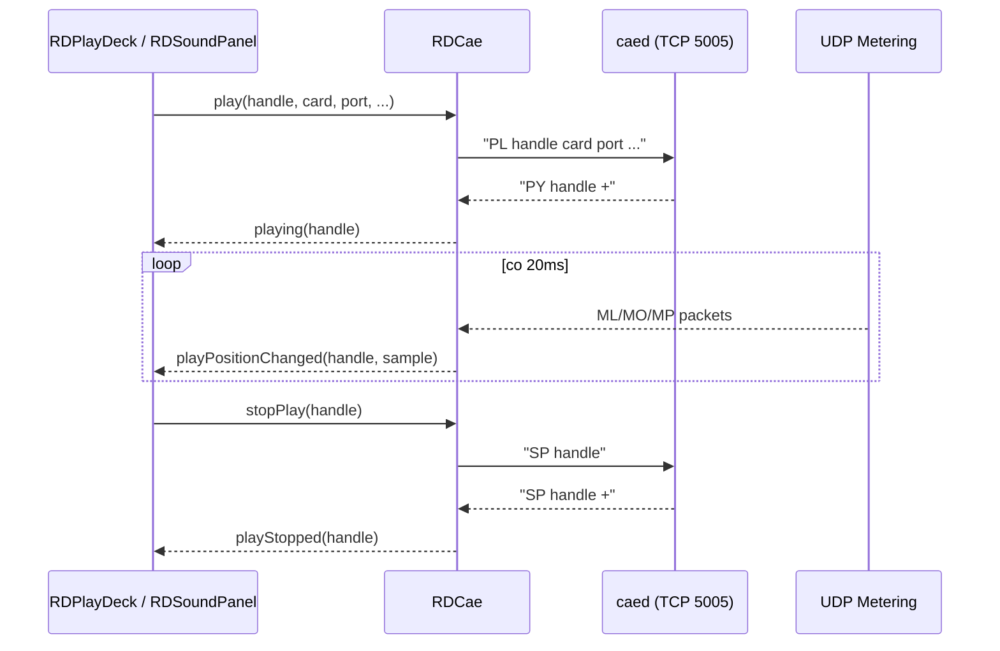
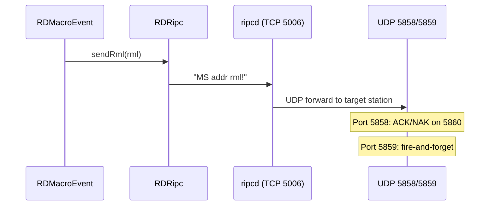
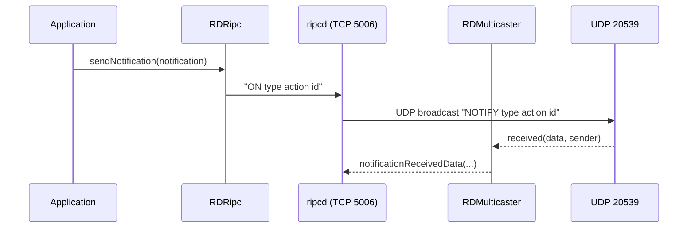

# LIB-004: Network Communication & Protocols

## Kontekst biznesowy

Rivendell jest systemem rozproszonym, w ktorym poszczegolne moduly (playout engine, audio daemon, scheduler, GPIO controller) komunikuja sie przez siec za pomoca dedykowanych protokolow tekstowych TCP, komunikatow UDP oraz transferow plikow. Ta feature dostarcza kompletna warstwe komunikacji sieciowej: klientow TCP dla demonow systemowych (CAE, RIPC, Catch), wysylanie komend RML, broadcastowanie notyfikacji miedzy stacjami, transfer plikow FTP/SFTP/HTTP, sterowanie GPIO przez port szeregowy i kernel, oraz integracje z urzadzeniami Axia LiveWire. Bez tej warstwy zadna aplikacja Rivendell nie moze kontrolowac odtwarzania audio, dispatchowac makr ani synchronizowac stanu miedzy stacjami.

## Aktorzy

| Aktor | Rola w tej feature |
|-------|-------------------|
| System (playout engine) | Wysyla komendy audio do CAE, dispatchuje RML przez RIPC, broadcastuje notyfikacje |
| System (scheduler) | Komunikuje sie z rdcatchd przez Catch protocol, monitoruje heartbeat |
| Operator | Inicjuje transfery plikow (download/upload/delete) przez libcurl |
| System (GPIO) | Steruje wejsciami/wyjsciami GPIO, odbiera zmiany stanu z urzadzen |
| System (LiveWire) | Komunikuje sie z wezlami Axia przez protokol LWRP |

## Granica funkcjonalnosci

```
IN SCOPE:
  - TCP text protocol clients: RDCae (5005), RDRipc (5006), RDCatchConnect (6006)
  - RDSocket — QTcpSocket wrapper z watchdog timer
  - UDP: RML dispatch (5858/5859), notification broadcast (20539)
  - RDMulticaster — UDP multicast sender/receiver
  - RDNotification — notification data object (type/action/id)
  - File transfer: RDTransfer/RDDownload/RDUpload/RDDelete (libcurl)
  - RDDataPacer — throttled data sending
  - RDLiveWire — Axia LWRP protocol client
  - RDGpio / RDKernelGpio — GPIO via serial/kernel

OUT OF SCOPE:
  - Unix domain sockets (RDUnixServer/RDUnixSocket, PAD) → patrz LIB-005
  - Audio engine logic (RDPlayDeck, RDLogPlay) → patrz LIB-005
  - HTTP/RDXport web API → patrz LIB-006
  - Audio codecs and conversion → patrz LIB-003
```

---

## Use Cases

| ID | Aktor | Akcja | Efekt biznesowy | Priorytet |
|----|-------|-------|----------------|-----------|
| UC-013 | Operator | Pobiera/wysyla/kasuje plik zdalny | FTP/SFTP/HTTP transfer z credentials i SSH identity | SHOULD |
| UC-017 | System | Wysyla komende RML | UDP 5858 (echo z ACK/NAK) lub 5859 (fire-and-forget), terminator '!' | MUST |
| UC-018 | System | Emituje PAD update | JSON na TCP 34289: now/next metadata | MUST |
| UC-019 | System | Broadcastuje notyfikacje | UDP 20539: "NOTIFY type action id" | MUST |

---

## Reguly biznesowe (Gherkin)

> Pelne reguly z source references. Z facts.md.

```gherkin
Rule: RML Protocol

  Scenario: Sending an RML command with echo
    Given command format: cmd [arg] [...]!
    When  sent to UDP 5858
    Then  ACK(+) or NAK(-) reply returned on port 5860
    And   command terminates with '!' (ASCII 33)
    And   binary data encoded as %hexcode (e.g. %0D%0A)
    And   max message length is 2048 bytes

  Scenario: Sending an RML command fire-and-forget
    Given command format: cmd [arg] [...]!
    When  sent to UDP 5859
    Then  no reply expected
    And   command terminates with '!' (ASCII 33)

  # Zrodlo: docs/opsguide/rml.xml:sect.rml.protocol | lib/rd.h:282-284
  # Pewnosc: potwierdzone (kod + doc)

Rule: Inter-Station Notifications via UDP

  Scenario: Broadcasting state changes
    Given a cart, log, feed, or other entity modified
    When  notification sent
    Then  UDP packet on port 20539: "NOTIFY <type> <action> <id>"
    And   types: Cart, Log, Pypad, Dropbox, CatchEvent, FeedItem
    And   actions: Add, Delete, Modify

  # Zrodlo: lib/rdnotification.cpp:82-120, rd.h:588 | tests/notification_test.cpp
  # Pewnosc: potwierdzone (kod + test)

Rule: File Transfer — URL Validation

  Scenario: Deleting a file by relative URL
    Given URL is relative (not fully qualified)
    Then  rejected — "URL's must be fully qualified"

  Scenario: Unsupported URL scheme
    Given URL scheme not supported
    Then  rejected — "unsupported URL scheme"

  # Zrodlo: tests/delete_test.cpp
  # Pewnosc: potwierdzone

Rule: Heartbeat (Catch Protocol)

  Scenario: Catch daemon heartbeat monitoring
    Given RDCatchConnect connected to rdcatchd on port 6006
    When  HB command not received within timeout period
    Then  heartbeatFailed() signal emitted
    And   application can attempt reconnection

  # Zrodlo: lib/rdcatch_connect.cpp
  # Pewnosc: potwierdzone

Rule: TCP Text Protocol Common Pattern

  Scenario: Authentication on any daemon connection
    Given client connects to caed (5005), ripcd (5006), or rdcatchd (6006)
    When  connection established
    Then  first command MUST be PW (password authentication)
    And   response PW + (success) or PW - (failure)
    And   all commands terminated with '!' character

  # Zrodlo: SPEC.md Sekcja 9
  # Pewnosc: potwierdzone

Rule: File Transfer Timeout

  Scenario: Curl transfer exceeds timeout
    Given a curl-based transfer in progress
    When  1200 seconds (20 min) pass
    Then  transfer times out and reports error

  # Zrodlo: lib/rd.h:496
  # Pewnosc: potwierdzone
```

---

## Data Model (tabele DB w scope)

Brak bezposrednich operacji DB. Klasy komunikacji sieciowej sa IPC-only (TCP/UDP) lub korzystaja z libcurl. Jedynym wyjatkiem jest RDRipc ktory zapisuje do tabeli HOSTVARS, ale ta tabela nalezy do domeny konfiguracji (LIB-002).

---

## API klas w scope

### RDCae

**Odpowiedzialnosc:** Client proxy for the Core Audio Engine daemon (caed). Controls audio playback, recording, metering, and hardware configuration via TCP text protocol on port 5005, with UDP meter data.
**Pelny opis:** `inventory.md#RDCae`

**Publiczne API:**
| Metoda | Parametry | Efekt | Warunki wywolania |
|--------|-----------|-------|------------------|
| loadPlay() | handle, card, name | Synchronous-blocking load for playback with busy-wait polling | Przed odtworzeniem |
| play() | handle, card, port, length, speed, pitch | Start playback via PL+PY commands | Po loadPlay() |
| stopPlay() | handle | Stop playback via SP command | Podczas odtwarzania |
| loadRecord() | card, stream, coding, chan, srate, brate, name | Load for recording via LR command | Przed nagrywaniem |
| record() | card, stream, length, threshold | Start recording via RD command | Po loadRecord() |
| stopRecord() | card, stream | Stop recording via SR command | Podczas nagrywania |
| setInputVolume() | card, stream, level | Set input volume via IV command | Dowolnie |
| setOutputVolume() | card, stream, port, level | Set output volume via OV command | Dowolnie |
| fadeOutputVolume() | card, stream, port, level, length | Fade output volume via FV command | Dowolnie |
| enableMetering() | udp_port, cards | Enable metering UDP via ME command | Po polaczeniu |

**Sygnaly:**
| Sygnal | Parametry | Znaczenie biznesowe |
|--------|-----------|---------------------|
| playing(int) | handle | CAE potwierdzil start playback |
| playStopped(int) | handle | Playback zatrzymany |
| playPositionChanged(int, unsigned) | handle, sample | Aktualizacja pozycji co 20ms |
| recordLoaded/recording/recordStopped/recordUnloaded | handle/card+stream | Cykl zycia nagrywania |
| timescalingSupported(int, bool) | card, state | Raport zdolnosci timescale karty |

---

### RDRipc

**Odpowiedzialnosc:** Client for the Rivendell IPC daemon (ripcd). Bidirectional text protocol over TCP for user management, GPI/GPO state, RML macro dispatch, and system notifications.
**Pelny opis:** `inventory.md#RDRipc`

**Publiczne API:**
| Metoda | Parametry | Efekt | Warunki wywolania |
|--------|-----------|-------|------------------|
| sendRml() | rml (RDMacro) | Dispatch RML via MS command to ripcd | Dowolnie po PW |
| setUser() | username | Switch active user via SU command | Po autentykacji |
| sendGpiStatus() | matrix | Query GPI state via GI command | Dowolnie |
| sendGpoStatus() | matrix | Query GPO state via GO command | Dowolnie |
| sendGpiMask() | matrix, line, state | Set GPI mask via GM command | Dowolnie |
| sendGpoMask() | matrix, line, state | Set GPO mask via GN command | Dowolnie |
| sendGpiCart() | matrix, line, off_cart, on_cart | Set GPI trigger cart via GC command | Dowolnie |
| sendGpoCart() | matrix, line, off_cart, on_cart | Set GPO trigger cart via GD command | Dowolnie |
| sendOnairFlag() | flag | Set on-air flag via TA command | Dowolnie |
| sendNotification() | notification | Broadcast notification via ON command | Dowolnie |

**Sygnaly:**
| Sygnal | Parametry | Znaczenie biznesowe |
|--------|-----------|---------------------|
| connected(bool) | state | Pierwszy user response odebrany |
| userChanged() | — | Tozsamosc usera zmieniona |
| gpiStateChanged/gpoStateChanged | matrix, line, state, mask | Zmiana stanu GPIO (mask-filtered) |
| rmlReceived(RDMacro*) | macro | Makro RML odebrane |
| notificationReceived(RDNotification*) | notification | Notyfikacja systemowa |
| onairFlagChanged(bool) | flag | Zmiana flagi on-air |

---

### RDCatchConnect

**Odpowiedzialnosc:** TCP client for the rdcatchd scheduling daemon. Sends commands and receives async status/events with heartbeat watchdog.
**Pelny opis:** `inventory.md#RDCatchConnect`

**Publiczne API:**
| Metoda | Parametry | Efekt | Warunki wywolania |
|--------|-----------|-------|------------------|
| connectHost() | host, port, password | Connect + authenticate via PW command | Na starcie |
| refresh() | — | Refresh channel status via RE command | Po polaczeniu |
| enableMetering() | state | Enable/disable metering via RM command | Dowolnie |
| stop() | deck | Stop deck via SR command | Podczas nagrywania/playoutu |
| monitor() | deck, state | Set monitor on/off via MN command | Dowolnie |
| setExitCode() | id, code, msg | Set exit code via SC command | Po zakonczeniu eventu |
| reloadDropboxes() | — | Reload dropboxes via RX command | Po zmianie konfiguracji |
| reloadHeartbeat() | — | Reload heartbeat via RH command | Dowolnie |
| sendHeartbeat() | — | Send heartbeat via HB command | Periodycznie |

**Sygnaly:**
| Sygnal | Parametry | Znaczenie biznesowe |
|--------|-----------|---------------------|
| connected(bool) | state | Polaczenie nawiazane |
| readyData | — | Dane gotowe do odczytu |
| heartbeatFailed() | — | Brak odpowiedzi heartbeat — daemon utracony |

---

### RDSocket

**Odpowiedzialnosc:** QTcpSocket wrapper adding a connection watchdog timer. Forwards hostFound, readyRead, and other signals.
**Pelny opis:** `inventory.md#RDSocket`

**Publiczne API:**
| Metoda | Parametry | Efekt | Warunki wywolania |
|--------|-----------|-------|------------------|
| connectToHost() | host, port | Connect with watchdog monitoring | Na starcie |
| writeBlock() | data | Write data to socket | Po polaczeniu |

**Sygnaly:**
| Sygnal | Parametry | Znaczenie biznesowe |
|--------|-----------|---------------------|
| hostFound() | — | DNS resolution complete |
| readyRead() | — | Data available for reading |
| connectionClosed() | — | Socket disconnected |
| error(QAbstractSocket::SocketError) | error | Socket error |
| bytesWritten(int) | count | Data successfully written |

---

### RDMulticaster

**Odpowiedzialnosc:** UDP multicast sender/receiver for inter-station notifications and LiveWire advertisement protocol.
**Pelny opis:** `inventory.md#RDMulticaster`

**Publiczne API:**
| Metoda | Parametry | Efekt | Warunki wywolania |
|--------|-----------|-------|------------------|
| send() | data, address, port | Send UDP multicast packet | Dowolnie |
| enableReception() | group, port | Join multicast group, begin receiving | Na starcie |

**Sygnaly:**
| Sygnal | Parametry | Znaczenie biznesowe |
|--------|-----------|---------------------|
| received(QString, QHostAddress) | data, sender | Pakiet UDP multicast odebrany |

---

### RDNotification

**Odpowiedzialnosc:** Event bus message for object change notifications. XML serialization for inter-process transport.
**Pelny opis:** `inventory.md#RDNotification`

**Publiczne API:**
| Metoda | Parametry | Efekt | Warunki wywolania |
|--------|-----------|-------|------------------|
| type() | — | Returns notification type (Cart/Log/Pypad/Dropbox/CatchEvent/FeedItem) | Zawsze |
| action() | — | Returns action (Add/Delete/Modify) | Zawsze |
| id() | — | Returns entity ID | Zawsze |
| toXml() | — | Serialize to XML | Przed wyslaniem |
| fromXml() | xml | Deserialize from XML | Po odebraniu |

**Enums:**
| Enum | Wartosci | Znaczenie |
|------|----------|-----------|
| Type | CartType, LogType, PypadType, DropboxType, CatchEventType, FeedItemType | Typ encji zmienionej |
| Action | AddAction, DeleteAction, ModifyAction | Rodzaj zmiany |

---

### RDTransfer

**Odpowiedzialnosc:** Base class for file transfer operations (RDDownload, RDUpload, RDDelete). Provides URL scheme validation and config access.
**Pelny opis:** `inventory.md#RDTransfer`

**Publiczne API:**
| Metoda | Parametry | Efekt | Warunki wywolania |
|--------|-----------|-------|------------------|
| urlIsSupported() | url | Validates URL scheme (file/ftp/ftps/http/https/sftp) | Przed transferem |

---

### RDDownload

**Odpowiedzialnosc:** Downloads files from remote URLs (file/ftp/ftps/http/https/sftp) using libcurl. Progress reporting, abort capability, structured error codes.
**Pelny opis:** `inventory.md#RDDownload`

**Publiczne API:**
| Metoda | Parametry | Efekt | Warunki wywolania |
|--------|-----------|-------|------------------|
| download() | url, dest_file, credentials | Download file from remote URL | Dowolnie |
| abort() | — | Cancel in-progress download | Podczas transferu |

**Sygnaly:**
| Sygnal | Parametry | Znaczenie biznesowe |
|--------|-----------|---------------------|
| progressChanged(int) | percent | Postep pobierania (0-100) |

---

### RDUpload

**Odpowiedzialnosc:** Uploads files to remote URLs (ftp/ftps/sftp) using libcurl. Progress reporting, abort capability.
**Pelny opis:** `inventory.md#RDUpload`

**Publiczne API:**
| Metoda | Parametry | Efekt | Warunki wywolania |
|--------|-----------|-------|------------------|
| upload() | source_file, url, credentials | Upload file to remote URL | Dowolnie |
| abort() | — | Cancel in-progress upload | Podczas transferu |

**Sygnaly:**
| Sygnal | Parametry | Znaczenie biznesowe |
|--------|-----------|---------------------|
| progressChanged(int) | percent | Postep wysylania (0-100) |

---

### RDDelete

**Odpowiedzialnosc:** Deletes remote files via FTP/SFTP/FTPS/local filesystem using libcurl. Lenient error handling: "file not found" treated as success.
**Pelny opis:** `inventory.md#RDDelete`

**Publiczne API:**
| Metoda | Parametry | Efekt | Warunki wywolania |
|--------|-----------|-------|------------------|
| delete_() | url, credentials | Delete remote file | Dowolnie |

---

### RDDataPacer

**Odpowiedzialnosc:** Throttled data sender ensuring bytes are sent at a controlled rate (pacing for serial/network protocols).
**Pelny opis:** `inventory.md#RDDataPacer`

**Publiczne API:**
| Metoda | Parametry | Efekt | Warunki wywolania |
|--------|-----------|-------|------------------|
| send() | data, pace_interval | Queue data for throttled sending | Dowolnie |

**Sygnaly:**
| Sygnal | Parametry | Znaczenie biznesowe |
|--------|-----------|---------------------|
| dataSent(QByteArray) | data | Chunk danych wyslany (do actual device write) |

---

### RDLiveWire

**Odpowiedzialnosc:** Axia LiveWire audio protocol client (LWRP). Communicates with LiveWire nodes for source/destination configuration and GPIO control.
**Pelny opis:** `inventory.md#RDLiveWire`

**Publiczne API:**
| Metoda | Parametry | Efekt | Warunki wywolania |
|--------|-----------|-------|------------------|
| connectToHost() | host, port | Connect to LiveWire node via LWRP | Na starcie |
| setSource() | slot, source | Configure audio source | Po polaczeniu |
| setDestination() | slot, destination | Configure audio destination | Po polaczeniu |

**Sygnaly:**
| Sygnal | Parametry | Znaczenie biznesowe |
|--------|-----------|---------------------|
| connected(unsigned) | node_id | Polaczenie LWRP nawiazane |
| sourceChanged(unsigned, RDLiveWireSource*) | node_id, source | Zmiana konfiguracji zrodla |
| destinationChanged(unsigned, RDLiveWireDestination*) | node_id, dest | Zmiana konfiguracji destynacji |
| watchdogStateChanged(unsigned, QString) | node_id, state | Utrata lub odzysk polaczenia z wezlem |

---

### RDGpio

**Odpowiedzialnosc:** GPIO hardware abstraction for custom kernel driver (/dev/gpio*) and Linux input event subsystem (/dev/input/event*).
**Pelny opis:** `inventory.md#RDGpio`

**Publiczne API:**
| Metoda | Parametry | Efekt | Warunki wywolania |
|--------|-----------|-------|------------------|
| open() | device | Open GPIO device file | Na starcie |
| setOutput() | line, state | Set GPIO output line | Po open() |

**Sygnaly:**
| Sygnal | Parametry | Znaczenie biznesowe |
|--------|-----------|---------------------|
| inputChanged(int, bool) | line, state | Zmiana stanu wejscia GPIO |
| outputChanged(int, bool) | line, state | Zmiana stanu wyjscia GPIO |

---

### RDKernelGpio

**Odpowiedzialnosc:** Linux SysFS GPIO interface (/sys/class/gpio) with polling-based change detection.
**Pelny opis:** `inventory.md#RDKernelGpio`

**Publiczne API:**
| Metoda | Parametry | Efekt | Warunki wywolania |
|--------|-----------|-------|------------------|
| open() | gpio_number | Export and open SysFS GPIO pin | Na starcie |
| setValue() | state | Set GPIO output value | Po open() |

**Sygnaly:**
| Sygnal | Parametry | Znaczenie biznesowe |
|--------|-----------|---------------------|
| valueChanged(int, bool) | gpio, state | Zmiana stanu pinu GPIO (polling-based) |

---

## Protokoly komunikacji

> Z SPEC.md Sekcja 9 — kompletne tabele komend dla wszystkich protokolow w scope.

### CAE Protocol (TCP 5005 -> caed)

Tekstowy protokol, komendy terminowane '!', odpowiedzi z '+' (sukces) lub '-' (blad).

| Komenda | Parametry | Odpowiedz | Znaczenie |
|---------|-----------|-----------|-----------|
| PW | password | PW +/- | Autentykacja |
| LP | card name | LP card name stream handle +/- | Load for playback |
| UP | handle | UP handle +/- | Unload playback |
| PP | handle pos | PP handle pos +/- | Position play |
| PY | handle length speed pitch | PY handle +/- | Start playback |
| SP | handle | SP handle +/- | Stop playback |
| LR | card stream coding chan srate brate name | LR ... +/- | Load for recording |
| UR | card stream | UR card stream len +/- | Unload recording |
| RD | card stream length threshold | — | Start recording |
| SR | card stream | SR card stream +/- | Stop recording |
| TS | card | TS card +/- | Query timescale support |
| IS | card port | IS card port 0/1 | Query input status |
| CS | card source | — | Set clock source |
| IV | card stream level | — | Set input volume |
| OV | card stream port level | — | Set output volume |
| FV | card stream port level length | — | Fade output volume |
| IL | card port level | — | Set input level |
| OL | card port level | — | Set output level |
| IM | card stream mode | — | Set input channel mode |
| OM | card stream mode | — | Set output channel mode |
| IX | card stream level | — | Set input VOX level |
| IT | card port type | — | Set input type |
| AL | card in_port out_port level | — | Set passthrough volume |
| ME | udp_port card [card...] | — | Enable metering on UDP port |

**Metering (UDP):**

| Komenda | Format | Znaczenie |
|---------|--------|-----------|
| ML | ML I/O card port left right | Meter levels (input/output) |
| MO | MO card stream left right | Output stream levels |
| MP | MP card stream pos | Play position |

### RIPC Protocol (TCP 5006 -> ripcd)

| Komenda | Parametry | Odpowiedz | Znaczenie |
|---------|-----------|-----------|-----------|
| PW | password | PW +/- | Autentykacja |
| RU | — | RU username | Request/receive user identity |
| SU | user | — | Set user |
| MS | addr port rml | — | Send RML command |
| ME | addr port rml | — | Send RML reply |
| GI | matrix | GI matrix line state mask | Query/receive GPI state |
| GO | matrix | GO matrix line state mask | Query/receive GPO state |
| GM | matrix | GM matrix line state | GPI mask query/change |
| GN | matrix | GN matrix line state | GPO mask query/change |
| GC | matrix | GC matrix line off_cart on_cart | GPI cart query/change |
| GD | matrix | GD matrix line off_cart on_cart | GPO cart query/change |
| TA | flag | TA flag | Set/receive on-air flag |
| ON | type action id | ON type action id | Send/receive notification |
| RH | — | — | Reload heartbeat |

### Catch Protocol (TCP 6006 -> rdcatchd)

| Komenda | Parametry | Odpowiedz | Znaczenie |
|---------|-----------|-----------|-----------|
| PW | password | PW +/- | Autentykacja |
| RE | 0 | RE chan status id name | Refresh/receive channel status |
| RM | state | RM deck channel level | Set/receive metering |
| SR | deck | — | Stop deck |
| MN | deck state | MN deck state | Monitor on/off |
| SC | id code msg | — | Set exit code |
| RD | — | — | Reload events |
| RS | — | — | Reset |
| RH | — | — | Reload heartbeat |
| RX | — | — | Reload dropboxes |
| RO | — | — | Reload time offset |
| HB | — | HB | Heartbeat |
| DE | — | DE deck number | Deck event notification |
| RU | — | RU id | Update event |
| PE | — | PE id | Purge event |

### Notification Protocol (UDP 20539 -> broadcast)

| Format | Parametry | Znaczenie |
|--------|-----------|-----------|
| NOTIFY | type action id | Inter-station state change broadcast |
| Types | Cart, Log, Pypad, Dropbox, CatchEvent, FeedItem | Encja zmieniona |
| Actions | Add, Delete, Modify | Typ zmiany |

### RML Protocol (UDP 5858/5859)

| Port | Zachowanie |
|------|-----------|
| 5858 | Echo — ACK(+)/NAK(-) reply na port 5860 |
| 5859 | Fire-and-forget |
| Format | `cmd [arg] [...]!` — terminator '!' (ASCII 33) |
| Escape | `%hexcode` (np. %0D%0A) |
| Max length | 2048 bytes |

---

## UI Contracts

Brak — feature jest backend-only. Klasy komunikacji sieciowej nie posiadaja wlasnego UI.

---

## Sygnaly integracji (z call-graph.md)

### Sequence diagram — CAE audio command flow



### Sequence diagram — RML dispatch flow



### Sequence diagram — Notification broadcast



**Emitowane (ta feature -> inne):**
| Sygnal | Klasa | Odbiorca | Slot | Kontekst |
|--------|-------|----------|------|----------|
| playing(int) | RDCae | RDPlayDeck | playingData(int) | CAE potwierdzil play |
| playing(int) | RDCae | RDEditAudio | playedData(int) | CAE potwierdzil play |
| playing(int) | RDCae | RDSimplePlayer | playingData(int) | CAE potwierdzil play |
| playStopped(int) | RDCae | RDPlayDeck | playStoppedData(int) | CAE zatrzymal |
| playStopped(int) | RDCae | RDEditAudio | pausedData(int) | CAE zatrzymal |
| playStopped(int) | RDCae | RDSimplePlayer | playStoppedData(int) | CAE zatrzymal |
| playPositionChanged(int,unsigned) | RDCae | RDEditAudio | positionData(int,unsigned) | Tick pozycji |
| timescalingSupported(int,bool) | RDCae | RDCartSlot | timescalingSupportedData(int,bool) | Zdolnosc karty |
| timescalingSupported(int,bool) | RDCae | RDLogPlay | timescalingSupportedData(int,bool) | Zdolnosc karty |
| timescalingSupported(int,bool) | RDCae | RDSoundPanel | timescalingSupportedData(int,bool) | Zdolnosc karty |
| userChanged() | RDRipc | RDApplication | userChangedData() | Zmiana usera |
| notificationReceived(RDNotification*) | RDRipc | RDLogPlay | notificationReceivedData(RDNotification*) | Notyfikacja syst. |
| onairFlagChanged(bool) | RDRipc | RDLogPlay | onairFlagChangedData(bool) | Zmiana on-air |
| onairFlagChanged(bool) | RDRipc | RDSoundPanel | onairFlagChangedData(bool) | Zmiana on-air |
| received(QString, QHostAddress) | RDMulticaster | Ripcd | notificationReceivedData(...) | Pakiet UDP multicast |
| inputChanged(int,bool) | RDGpio | LocalGpio (ripcd) | gpiChangedData(int,bool) | Zmiana GPI |
| outputChanged(int,bool) | RDGpio | LocalGpio (ripcd) | gpoChangedData(int,bool) | Zmiana GPO |
| valueChanged(int,bool) | RDKernelGpio | KernelGpio (ripcd) | gpiChangedData(int,bool) | Zmiana GPIO |
| connected(unsigned) | RDLiveWire | LwrpAudio (ripcd) | nodeConnectedData(unsigned) | Polaczenie LWRP |
| sourceChanged(unsigned, RDLiveWireSource*) | RDLiveWire | LwrpAudio (ripcd) | sourceChangedData(...) | Zmiana zrodla |
| destinationChanged(unsigned, RDLiveWireDestination*) | RDLiveWire | LwrpAudio (ripcd) | destinationChangedData(...) | Zmiana destynacji |
| watchdogStateChanged(unsigned, QString) | RDLiveWire | LwrpAudio (ripcd) | watchdogStateChangedData(...) | Utrata/odzysk polaczenia |
| dataSent(QByteArray) | RDDataPacer | Gvc7000 (ripcd) | sendCommandData(QByteArray) | Wyslanie danych |

**Odbierane (inne -> ta feature):**
| Nadawca | Sygnal | Klasa (tu) | Slot | Kontekst |
|---------|--------|------------|------|----------|
| QTcpSocket | connected() | RDRipc | connectedData() | Polaczenie TCP nawiazane |
| QTcpSocket | readyRead() | RDRipc | readyData() | Dane TCP dostepne |
| QTcpSocket | error(...) | RDRipc | errorData(...) | Blad sieci |
| QTcpSocket | connected() | RDCatchConnect | connectedData() | Polaczenie TCP nawiazane |
| QTcpSocket | readyRead() | RDCatchConnect | readyData() | Dane TCP dostepne |
| QTcpSocket | connected() | RDLiveWire | connectedData() | Polaczenie LWRP nawiazane |
| QTcpSocket | readyRead() | RDLiveWire | readyReadData() | Dane LWRP dostepne |
| QTcpSocket | connectionClosed() | RDLiveWire | connectionClosedData() | Rozlaczenie LWRP |
| QTcpSocket | error(...) | RDLiveWire | errorData(...) | Blad sieci LWRP |
| QSocketNotifier | activated(int) | RDMulticaster | activatedData(int) | Dane UDP gotowe |
| QTimer | timeout() | RDCae | clockData() | Co 10ms — metering clock |
| QTimer | timeout() | RDCae | readyData() | Co 10ms — TCP read |
| QTimer | timeout() | RDCatchConnect | heartbeatTimeoutData() | Heartbeat timeout |
| QTimer | timeout() | RDDataPacer | timeoutData() | Co pace_interval |
| QTimer | timeout() | RDGpio | inputTimerData() | Polling GPIO |
| QTimer | timeout() | RDKernelGpio | pollData() | Co POLL_INTERVAL |
| QTimer | timeout() | RDLiveWire | holdoffData() | Reconnect holdoff |
| QTimer | timeout() | RDLiveWire | watchdogData() | Heartbeat LWRP |
| QTimer | timeout() | RDLiveWire | watchdogTimeoutData() | Timeout watchdog LWRP |

---

## Platform Independence

| Funkcja | Oryginal | Klon | Priorytet |
|---------|----------|------|-----------|
| TCP text protocols (CAE/RIPC/Catch) | Custom text protocol '!' terminated | gRPC / WebSocket / REST | HIGH |
| File transfer | libcurl (FTP/SFTP/HTTP) | Standard HTTP client | HIGH |
| Unix sockets (PAD) | SOCK_STREAM | WebSocket / named pipe | MEDIUM |
| UDP broadcast (notifications) | Raw UDP 20539 | Message queue / WebSocket pub-sub | MEDIUM |
| GPIO (/dev/gpio, /dev/input) | Linux kernel driver + SysFS | Platform-specific or USB I/O | MEDIUM |
| LiveWire LWRP | Custom TCP protocol | (keep or abstract) | MEDIUM |

---

## Configuration (klucze w scope)

| Klucz | Typ | Domyslna | Wplyw na te feature |
|-------|-----|---------|---------------------|
| CAE TCP port | int | 5005 | Port demona audio (lib/rd.h) |
| RIPCD TCP port | int | 5006 | Port demona GPIO/RML (lib/rd.h) |
| RDCatchd TCP port | int | 6006 | Port demona schedulera (lib/rd.h) |
| RML echo port | int (UDP) | 5858 | RML z ACK/NAK (lib/rd.h:282) |
| RML noecho port | int (UDP) | 5859 | RML fire-and-forget (lib/rd.h:283) |
| RML reply port | int (UDP) | 5860 | Port odpowiedzi RML (lib/rd.h:284) |
| Notification port | int (UDP) | 20539 | Inter-station broadcast (lib/rd.h:588) |
| PAD client port | int (TCP) | 34289 | Program Associated Data (lib/rd.h:610) |
| CURL timeout | int (s) | 1200 | Timeout transferow plikow (lib/rd.h:496) |

---

## Acceptance Criteria (E2E)

```gherkin
Feature: Network Communication & Protocols

  Scenario: CAE playback command round-trip
    Given RDCae connected to caed on TCP port 5005
    And   authenticated with PW command
    When  loadPlay() followed by play() called
    Then  PL and PY commands sent to caed
    And   playing(handle) signal emitted on PY+ response
    And   playStopped(handle) signal emitted on SP response

  Scenario: CAE metering UDP
    Given metering enabled via ME command
    When  audio is playing
    Then  ML/MO/MP UDP packets received
    And   playPositionChanged signal emitted every 20ms

  Scenario: RML command dispatch via RIPC
    Given RDRipc connected to ripcd on TCP port 5006
    When  sendRml(rml) called
    Then  MS command sent to ripcd
    And   ripcd forwards RML to target station via UDP

  Scenario: RML echo vs fire-and-forget
    Given RML command prepared
    When  sent to port 5858
    Then  ACK(+) or NAK(-) reply received on port 5860
    When  sent to port 5859
    Then  no reply expected

  Scenario: Inter-station notification broadcast
    Given entity (Cart/Log/Feed) modified
    When  sendNotification() called on RDRipc
    Then  ON command sent to ripcd
    And   ripcd broadcasts "NOTIFY type action id" on UDP 20539
    And   RDMulticaster receives packet, emits received() signal

  Scenario: Catch heartbeat monitoring
    Given RDCatchConnect connected to rdcatchd on port 6006
    When  heartbeat HB not received within timeout
    Then  heartbeatFailed() signal emitted

  Scenario: File download with progress
    Given RDDownload configured with valid URL and credentials
    When  download() called
    Then  file downloaded via libcurl
    And   progressChanged(int) emitted during transfer
    And   transfer completes within 1200s timeout

  Scenario: File transfer URL validation
    Given URL is relative or has unsupported scheme
    When  transfer attempted
    Then  rejected with appropriate error message

  Scenario: GPIO state change detection
    Given RDGpio or RDKernelGpio monitoring a device
    When  hardware input changes state
    Then  inputChanged(line, state) or valueChanged(gpio, state) signal emitted
    And   ripcd GPI driver processes the change

  Scenario: LiveWire node connection
    Given RDLiveWire connecting to Axia node
    When  LWRP handshake completes
    Then  connected(node_id) signal emitted
    And   sourceChanged/destinationChanged signals report current configuration
    When  watchdog detects connection loss
    Then  watchdogStateChanged signal emitted
```

---

## Open Questions

- [ ] Czy klon powinien zachowac text-based TCP protocols czy migrowac do gRPC/WebSocket/REST od razu?
- [ ] Czy UDP broadcast notifications (port 20539) powinny byc zastapione message queue (np. NATS/Redis pub-sub)?
- [ ] Czy GPIO support jest wymagany w klonie, czy deprecate na rzecz USB I/O?
- [ ] Czy LiveWire LWRP jest wymagany, czy Axia integration jest niszowa?

---

## Working Packages (wstepny podzial)

| WP | Opis | Zaleznosci |
|----|------|-----------|
| WP-1 | Domain model: RDNotification (type/action/id), RDLiveWireSource/Destination | - |
| WP-2 | TCP protocol base: RDSocket (watchdog wrapper), text protocol parser ('!' terminator, +/- responses) | WP-1 |
| WP-3 | CAE client: RDCae (24 commands, metering UDP ML/MO/MP) | WP-2 |
| WP-4 | RIPC client: RDRipc (14 commands, GPIO state, RML dispatch, notifications) | WP-2, WP-1 |
| WP-5 | Catch client: RDCatchConnect (15 commands, heartbeat watchdog) | WP-2 |
| WP-6 | UDP layer: RDMulticaster (multicast send/receive), RML protocol (5858/5859), notification broadcast (20539) | WP-1 |
| WP-7 | File transfer: RDTransfer/RDDownload/RDUpload/RDDelete (libcurl wrapper, URL validation, progress) | - |
| WP-8 | Hardware I/O: RDGpio (/dev/gpio, /dev/input), RDKernelGpio (SysFS), RDDataPacer (throttled sending), RDLiveWire (LWRP) | WP-2 |
| WP-9 | Tests | WP-1..WP-8 |

*Szacunek wstepny — agent PM moze podzielic inaczej.*
