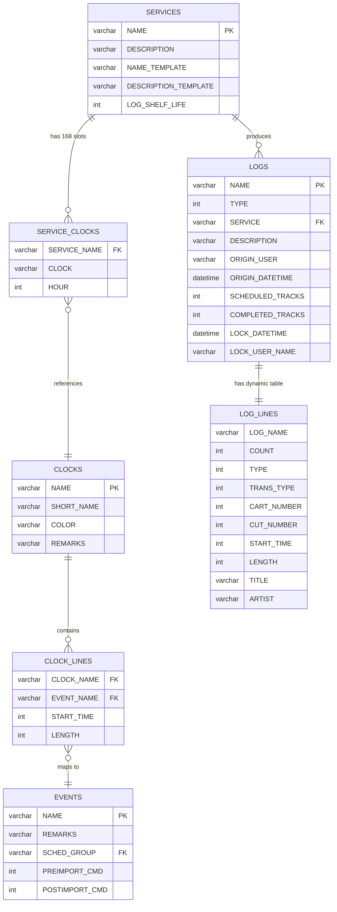
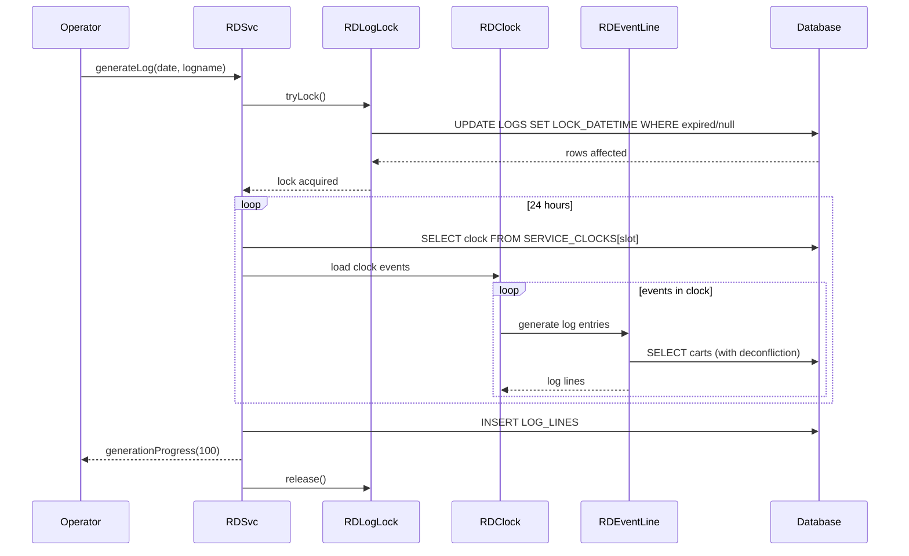
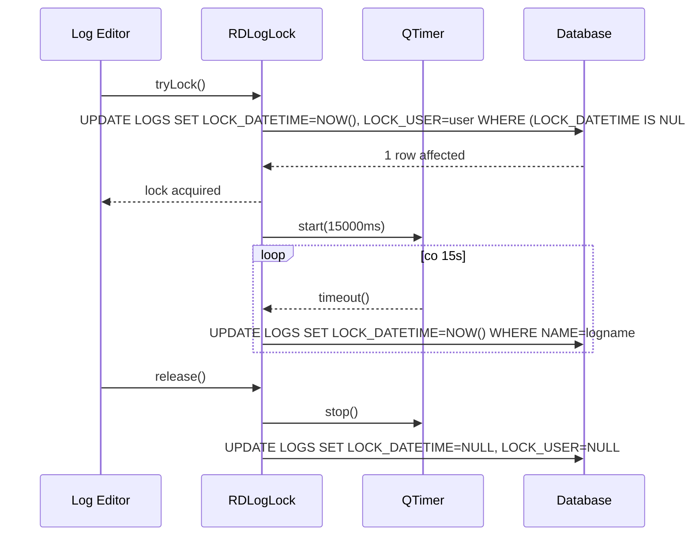

# LIB-005: Log Lifecycle

## Kontekst biznesowy

Logi (playlisty) stanowia podstawowy artefakt planowania emisji radiowej. Kazdy log nalezny do serwisu (stacji/programu) zawiera sekwencje eventow do odtworzenia w ciagu doby. System umozliwia reczne tworzenie logow, automatyczne generowanie z zegarow (168 slotow = 7 dni x 24 godziny), edycje z pesymistycznym lockowaniem, oraz filtrowanie i wyszukiwanie logow. Scheduler wypelnia log eventami z dekonfliktacja (title/artist separation, max-in-a-row, not-after).

## Aktorzy

| Aktor | Rola w tej feature |
|-------|-------------------|
| Operator | Tworzy logi recznie, wybiera logi do edycji, filtruje liste logow |
| System (Scheduler) | Generuje logi automatycznie z zegarow serwisu, wypelnia eventy z dekonfliktacja |
| System (Lock Manager) | Zarzadza pesymistycznymi lockami na logach z heartbeat |

## Granica funkcjonalnosci

```
IN SCOPE:
  - Tworzenie logu (RDLog, RDAddLog)
  - Generowanie logu z zegarow serwisu (RDSvc.generateLog, RDClock, RDEvent, RDEventLine)
  - Pesymistyczne lockowanie logu (RDLogLock — tryLock, heartbeat, release)
  - Kolekcja i persystencja linii logu (RDLogEvent — load/save/validate)
  - Model pojedynczej linii logu (RDLogLine — typy, tranzycje, 3-warstwowe pointery)
  - Scheduler deconfliction: title_sep, artist_sep, max_in_row, not_after
  - UI: dialog tworzenia logu (RDAddLog), dialog wyboru logu (RDListLogs), widget filtra (RDLogFilter), dialog wyboru serwisu (RDListSvcs)

OUT OF SCOPE:
  - Playout logu (RDLogPlay, RDPlayDeck) → patrz LIB-007
  - Log refresh w trakcie odtwarzania (4-pass merge) → patrz LIB-007
  - Import traffic/music data (RDSvc.importData) → patrz LIB-003
  - Renderowanie logu do pliku audio (RDRenderer) → patrz LIB-008
  - Voice tracking → osobna feature
```

---

## Use Cases

| ID | Aktor | Akcja | Efekt biznesowy | Priorytet |
|----|-------|-------|----------------|-----------|
| UC-010 | System | Generuje log z zegarow | 168 slotow (7x24h), clock per godzina, eventy z dekonfliktacja | MUST |
| UC-011 | System | Lockuje log do edycji | Pesymistyczny lock z 30s timeout, 15s heartbeat | MUST |
| UC-CRE | Operator | Tworzy nowy log | Log z nazwa i serwisem zapisany w DB | MUST |
| UC-SEL | Operator | Wybiera log z listy | Log wybrany z filtrowana lista (po serwisie, tekscie, recent) | MUST |
| UC-SAV | System | Zapisuje linie logu | Bulk DELETE+INSERT wszystkich linii logu | MUST |
| UC-VAL | System | Waliduje log | Sprawdzenie dostepnosci cutow (data/czas/DOW) | SHOULD |

---

## Reguly biznesowe (Gherkin)

> Pelne reguly z source references. Z facts.md, nie streszczone.

```gherkin
Rule: Log Pessimistic Locking

  Scenario: Acquiring a lock on a log for editing
    Given a log to be edited
    When  tryLock() is called
    Then  atomic SQL UPDATE with condition: LOCK_DATETIME is null OR expired (>30s)
    And   if 0 rows affected, lock held by another user
    And   heartbeat refreshes every 15s

  Scenario: Lock expiration
    Given a lock held by a user
    When  no heartbeat received for >30 seconds
    Then  lock considered expired and available for acquisition

  # Zrodlo: lib/rdloglock.cpp:59-136, rd.h:578 | Pewnosc: potwierdzone

Rule: Log Generation Requires Lock

  Scenario: Generating a log from clock/service
    Given a service generating a log for a date
    When  log already exists, it must be locked first
    Then  if locking fails, generation aborts

  # Zrodlo: lib/rdsvc.cpp:819-842 | Pewnosc: potwierdzone

Rule: Log Generation — Clock per Hour

  Scenario: Populating log events from service clocks
    Given log generated for a specific date
    When  iterating through 24 hours
    Then  clock determined by SERVICE_CLOCKS[SERVICE_NAME, 24*(dayOfWeek-1)+hour]
    And   168 slots total (7 days x 24 hours)

  # Zrodlo: lib/rdsvc.cpp:853-865 | Pewnosc: potwierdzone

Rule: Title Separation

  Scenario: Scheduling a cart from scheduler group
    Given event with title_sep >= 0
    When  selecting carts
    Then  carts with TITLE matching any title in last N stack entries excluded
    And   N = title_sep (default 100 if out of range)
    And   if all excluded, rule "broken" (logged), exclusion reverted

  # Zrodlo: lib/rdevent_line.cpp:638-666 | Pewnosc: potwierdzone

Rule: Artist Separation

  Scenario: Scheduling a cart
    Given event with artist_sep >= 0
    When  selecting carts
    Then  carts with ARTIST matching last N entries excluded
    And   N = artist_sep (default 15 if out of range)

  # Zrodlo: lib/rdevent_line.cpp:670-698 | Pewnosc: potwierdzone

Rule: Max In A Row / Min Wait (Clock Rules)

  Scenario: Applying clock scheduler rules
    Given clock defines RULE_LINES with CODE, MAX_ROW, MIN_WAIT
    When  selecting carts
    Then  range = MAX_ROW + MIN_WAIT back in stack
    And   if carts with sched_code >= MAX_ROW in range, exclude them

  # Zrodlo: lib/rdevent_line.cpp:700-740 | Pewnosc: potwierdzone

Rule: Do Not Schedule After

  Scenario: Applying "not after" constraint
    Given clock rule has NOT_AFTER sched code
    When  immediately previous stack entry has that code
    Then  carts with the rule's CODE excluded

  # Zrodlo: lib/rdevent_line.cpp:742-770 | Pewnosc: potwierdzone

Rule: Scheduler Code Filtering

  Scenario: Filtering by required sched codes
    Given event defines HAVE_CODE and/or HAVE_CODE2
    When  building candidate cart list
    Then  only carts possessing ALL required sched codes included

  # Zrodlo: lib/rdevent_line.cpp:618-633 | Pewnosc: potwierdzone

Rule: Import Source Types

  Scenario: Event log generation with import source
    Given event has import_source = Traffic, Music, or Scheduler
    When  generating log
    Then  Traffic -> TrafficLink placeholder
    And   Music -> MusicLink placeholder
    And   Scheduler -> directly fill from CART table with deconfliction

  # Zrodlo: lib/rdevent_line.cpp:504-549 | Pewnosc: potwierdzone

Rule: Preposition Override

  Scenario: Event has preposition value >= 0
    Given a clock event with preposition set
    When  generating log entries
    Then  time_type forced to Hard, grace_time = -1
    And   start time moved earlier by preposition ms

  # Zrodlo: lib/rdevent_line.cpp:462-471 | Pewnosc: potwierdzone
```

---

## Data Model (tabele DB w scope)

> Z data-model.md — tylko tabele dotyczace tego FEAT.
> Pelny schemat: `data-model.md`

### ERD dla tej feature



### Tabela: LOGS

| Kolumna | Typ | Null | Opis |
|---------|-----|------|------|
| NAME | varchar PK | NO | Unikalna nazwa logu (max 64 zn.) |
| TYPE | int | NO | Typ logu (0=standard) |
| SERVICE | varchar FK | NO | FK -> SERVICES.NAME |
| DESCRIPTION | varchar | YES | Opis logu |
| ORIGIN_USER | varchar | YES | Uzytkownik tworzacy |
| ORIGIN_DATETIME | datetime | YES | Data utworzenia |
| SCHEDULED_TRACKS | int | YES | Ilosc zaplanowanych trackow |
| COMPLETED_TRACKS | int | YES | Ilosc ukonczonych trackow |
| LOCK_DATETIME | datetime | YES | Timestamp ostatniego heartbeat locka |
| LOCK_USER_NAME | varchar | YES | Uzytkownik trzymajacy lock |

### Tabela: LOG_LINES (dynamicznie: {LOG_NAME}_LOG)

| Kolumna | Typ | Null | Opis |
|---------|-----|------|------|
| COUNT | int | NO | Numer pozycji w logu |
| TYPE | int | NO | Typ eventu (Cart/Marker/Macro/Chain/Track/MusicLink/TrafficLink) |
| TRANS_TYPE | int | NO | Typ tranzycji (Play/Segue/Stop) |
| CART_NUMBER | int | YES | Numer carta |
| CUT_NUMBER | int | YES | Numer cutu |
| START_TIME | int | YES | Czas startu (ms od polnocy) |
| LENGTH | int | YES | Dlugosc (ms) |
| TITLE | varchar | YES | Tytul (skopiowany z CART) |
| ARTIST | varchar | YES | Artysta (skopiowany z CART) |

### Tabela: SERVICE_CLOCKS

| Kolumna | Typ | Null | Opis |
|---------|-----|------|------|
| SERVICE_NAME | varchar FK | NO | FK -> SERVICES.NAME |
| HOUR | int | NO | Indeks slotu (0-167), formula: 24*(dayOfWeek-1)+hour |
| CLOCK | varchar FK | YES | FK -> CLOCKS.NAME (null = brak zegara dla tego slotu) |

### Relacje FK

| Zrodlo | Kolumna | -> Cel | PK |
|--------|---------|-------|-----|
| LOGS | SERVICE | SERVICES | NAME |
| SERVICE_CLOCKS | SERVICE_NAME | SERVICES | NAME |
| SERVICE_CLOCKS | CLOCK | CLOCKS | NAME |
| CLOCK_LINES | CLOCK_NAME | CLOCKS | NAME |
| CLOCK_LINES | EVENT_NAME | EVENTS | NAME |

---

## API klas w scope

> Z inventory.md — pelne sygnatury metod, parametry, efekty.

### RDLog

**Odpowiedzialnosc:** Active Record dla tabeli LOGS — metadane logu, lifecycle (create/delete/exists/readiness).
**Pelny opis:** `inventory.md#RDLog`

**Publiczne API:**
| Metoda | Parametry | Efekt | Warunki wywolania |
|--------|-----------|-------|------------------|
| exists() | - | Sprawdza czy log istnieje w DB | Dowolny moment |
| remove() | RDStation*, RDUser*, RDConfig* | Kaskadowe usuwanie: voice-track carty, LOG_LINES, LOGS | Log musi istniec |
| isReady() | - | true gdy music+traffic links done i voice tracks completed | Sprawdzenie gotowosci logu |

**Enums:**
| Enum | Wartosci | Znaczenie |
|------|----------|-----------|
| Type | Standard(0) | Typ logu |

### RDLogEvent

**Odpowiedzialnosc:** In-memory kolekcja linii logu (RDLogLine). Load/save/validate/manipulate.
**Pelny opis:** `inventory.md#RDLogEvent`

**Publiczne API:**
| Metoda | Parametry | Efekt | Warunki wywolania |
|--------|-----------|-------|------------------|
| load() | - | Laduje linie z tabeli LOG_LINES do pamieci | Po utworzeniu obiektu |
| save() | RDConfig* | Bulk DELETE + INSERT wszystkich linii | Po modyfikacjach |
| validate() | date, time | Walidacja dostepnosci cutow wg daty/czasu/DOW | Przed emisja |
| append() | RDLogEvent* | Konkatenacja innego logu na koniec | Laczenie logow |

### RDLogLine

**Odpowiedzialnosc:** Pojedyncze zdarzenie w logu (~100 pol, ~200 akcesorow). Cart/cut metadata, pointery audio, tranzycje, scheduling data.
**Pelny opis:** `inventory.md#RDLogLine`

**Publiczne API:**
| Metoda | Parametry | Efekt | Warunki wywolania |
|--------|-----------|-------|------------------|
| setEvent() | - | Przygotowuje event do odtwarzania: selekcja cutu, load audio points, timescaling | Przed play |
| resolveWildcards() | - | Zamienia ~30 template placeholderow (%t=title, %a=artist, etc.) | Przy generowaniu |

**Enums:**
| Enum | Wartosci | Znaczenie |
|------|----------|-----------|
| Type | Cart, Marker, Macro, Chain, Track, MusicLink, TrafficLink | Typ eventu w logu |
| TransType | Play, Segue, Stop | Tranzycja do nastepnego eventu |
| TimeType | Relative, Hard | Tryb startu |
| Status | Scheduled, Playing, Finished, Paused | Stan runtime |

### RDLogLock

**Odpowiedzialnosc:** Pesymistyczny lock bazodanowy na logu z heartbeat i auto-expiry.
**Pelny opis:** `inventory.md#RDLogLock`

**Publiczne API:**
| Metoda | Parametry | Efekt | Warunki wywolania |
|--------|-----------|-------|------------------|
| tryLock() | - | Atomic SQL UPDATE: LOCK_DATETIME null OR expired(>30s) | Przed edycja logu |
| release() | - | Zwalnia lock (NULL-uje LOCK_DATETIME) | Po zakonczeniu edycji |

**Sygnaly:**
| Sygnal | Parametry | Znaczenie biznesowe |
|--------|-----------|---------------------|
| (QTimer::timeout) | - | Heartbeat co 15s odswiezajacy LOCK_DATETIME |

### RDSvc

**Odpowiedzialnosc:** Model serwisu (stacji radiowej). Generowanie logow z zegarow, import traffic/music.
**Pelny opis:** `inventory.md#RDSvc`

**Publiczne API:**
| Metoda | Parametry | Efekt | Warunki wywolania |
|--------|-----------|-------|------------------|
| generateLog() | date, logname, nextname, &result, RDLogLock* | Tworzy log iterujac 168 slotow zegarow | Lock musi byc uzyskany jesli log istnieje |

**Sygnaly:**
| Sygnal | Parametry | Znaczenie biznesowe |
|--------|-----------|---------------------|
| generationProgress(int) | procent postępu | Informuje UI o postepie generowania |

### RDClock

**Odpowiedzialnosc:** Szablon zegarowy — definicja layoutu eventow dla jednej godziny.
**Pelny opis:** `inventory.md#RDClock`

**Publiczne API:**
| Metoda | Parametry | Efekt | Warunki wywolania |
|--------|-----------|-------|------------------|
| (load/save event lines) | - | Laduje/zapisuje kolekcje RDEventLine | Przy edycji/generowaniu |

### RDEvent

**Odpowiedzialnosc:** Szablon eventu schedulera — definiuje preposition, grace time, autofill, timescale, tranzycje, import source, scheduler group, anti-repeat.
**Pelny opis:** `inventory.md#RDEvent`

### RDEventLine

**Odpowiedzialnosc:** Pojedyncza linia eventu w zegarze. Laczy event z pozycja czasowa i obsluguje generowanie logu (fill + dekonfliktacja).
**Pelny opis:** `inventory.md#RDEventLine`

**Publiczne API:**
| Metoda | Parametry | Efekt | Warunki wywolania |
|--------|-----------|-------|------------------|
| (fill logic) | sched_group, stack, rules | Wypelnia slot z CART z dekonfliktacja (title/artist sep, max_in_row, not_after) | Podczas generowania logu |

---

## Protokoly komunikacji

> Komendy RDXport HTTP uzywane przez klasy w scope.

| Komenda | Parametry | Odpowiedz | Znaczenie |
|---------|-----------|-----------|-----------|
| COMMAND=28 (SAVE_LOG) | LOG_NAME, LOG_LINES data | OK/Error | Zapis logu przez HTTP |
| COMMAND=29 (ADD_LOG) | SERVICE_NAME, LOG_NAME | OK/Error | Tworzenie logu przez HTTP |
| COMMAND=30 (DELETE_LOG) | LOG_NAME | OK/Error | Usuwanie logu przez HTTP |

---

## UI Contracts

> Referencje do pelnych kontraktow + kluczowe widgety dla tego FEAT.

### RDAddLog — Create Log

**Pelny kontrakt:** `ui-contracts.md#RDAddLog`
**Rozmiar:** 400x132 (fixed), modal

**Kluczowe widgety w scope tej feature:**
| Widget | Typ | Etykieta | Akcja | Slot |
|--------|-----|----------|-------|------|
| add_name_edit | QLineEdit | "&New Log Name:" | Nazwa loga, max 64 zn., RDIdValidator (spacje zabronione) | nameChangedData(const QString&) |
| add_service_box | QComboBox | "&Service:" | Wybor serwisu wg FilterMode | - |
| add_ok_button | QPushButton | "&OK" | Walidacja + done(0) | okData() |
| add_cancel_button | QPushButton | "&Cancel" | done(-1) | cancelData() |

**Stany widoku (relevantne dla tej feature):**
| Stan | Kiedy | Efekt wizualny |
|------|-------|---------------|
| Domyslny | Otwarcie | Puste pole nazwy, OK disabled |
| Nazwa wpisana | textChanged != "" | OK enabled |
| NoFilter/UserFilter/StationFilter | mode | Filtrowanie listy serwisow |

**Walidacje (z source reference):**
| Pole | Regula | Komunikat | Zrodlo |
|------|--------|-----------|--------|
| add_name_edit | Nie moze byc pusty | (button disabled) | logika enabled/disabled |
| add_name_edit | Spacje zabronione | (walidator blokuje input) | RDIdValidator |
| add_service_box | Serwis nie moze byc pusty | "The service is invalid!" | QMessageBox::warning |

### RDListLogs — Select Log

**Pelny kontrakt:** `ui-contracts.md#RDListLogs`
**Rozmiar:** min 500x300, resizable, modal

**Kluczowe widgety w scope tej feature:**
| Widget | Typ | Etykieta | Akcja | Slot |
|--------|-----|----------|-------|------|
| list_filter_widget | RDLogFilter | (composite: Service combo, Filter edit, Clear, Recent checkbox) | Filtruje liste logow | filterChangedData(const QString&) |
| list_log_list | Q3ListView | kolumny: "Name", "Description", "Service" | Wyswietla logi; double-click = OK | doubleClickedData() |
| list_ok_button | QPushButton | "OK" | Potwierdza wybor | okButtonData() |
| list_cancel_button | QPushButton | "Cancel" | Zamyka bez wyboru | cancelButtonData() |

**Filtrowanie SQL:**
- TYPE=0 (standard log), LOG_EXISTS="Y"
- START_DATE <= today OR null, END_DATE >= today OR null
- Dynamiczny WHERE z RDLogFilter::whereSql()

### RDLogFilter — Log Filter Widget

**Pelny kontrakt:** `ui-contracts.md#RDLogFilter`
**Rozmiar:** 400x60, MinimumExpanding x Fixed

**Kluczowe widgety w scope tej feature:**
| Widget | Typ | Etykieta | Akcja | Slot |
|--------|-----|----------|-------|------|
| Service combo | QComboBox | "Service:" | Filtr po serwisie (ALL lub konkretny) | - |
| Filter edit | QLineEdit | "Filter:" | Filtr tekstowy (LIKE na NAME, DESCRIPTION) | - |
| Clear button | QPushButton | "Clear" | Czysci filtr tekstowy | - |
| Recent checkbox | QCheckBox | "Show Only Recent Logs" | Ogranicza do najnowszych | - |

**Enum FilterMode:**
| Wartosc | Opis |
|---------|------|
| NoFilter (0) | Wszystkie serwisy z SERVICES |
| UserFilter (1) | Serwisy z USER_SERVICE_PERMS dla usera |
| StationFilter (2) | Serwisy z SERVICE_PERMS dla stacji |

### RDListSvcs — Service Selector

**Pelny kontrakt:** `ui-contracts.md#RDListSvcs`
**Rozmiar:** min 300x240, resizable, modal

**Kluczowe widgety w scope tej feature:**
| Widget | Typ | Etykieta | Akcja | Slot |
|--------|-----|----------|-------|------|
| edit_svc_list | Q3ListBox | (lista nazw) | Wyswietla serwisy; double-click = OK | doubleClickedData() |
| edit_ok_button | QPushButton | "&OK" | Potwierdza wybor | okData() |
| edit_cancel_button | QPushButton | "&Cancel" | Zamyka | cancelData() |

---

## Sygnaly integracji (z call-graph.md)

### Sequence diagram — generowanie logu



### Sequence diagram — pesymistyczny lock z heartbeat



**Emitowane (ta feature -> inne):**
| Sygnal | Klasa | Odbiorca | Slot | Kontekst |
|--------|-------|----------|------|----------|
| filterChanged(QString) | RDLogFilter | RDListLogs | filterChangedData(const QString&) | Zmiana filtra logow |
| filterChanged(QString) | RDLogFilter | ListLogs (rdairplay) | filterChangedData(const QString&) | Zmiana filtra logow w airplay |
| filterChanged(QString) | RDLogFilter | RDLogEdit (rdlogedit) | filterChangedData(const QString&) | Zmiana filtra logow w logedit |
| generationProgress(int) | RDSvc | GenerateLog (rdlogmanager) | setValue(int) | Postep generowania logu |

**Odbierane (inne -> ta feature):**
| Nadawca | Sygnal | Klasa (tu) | Slot | Kontekst |
|---------|--------|------------|------|----------|
| QTimer | timeout() | RDLogLock | updateLock() | Heartbeat co 15s |

---

## Platform Independence

Brak — feature jest platform-agnostic (czysto SQL + Qt).

---

## Configuration (klucze w scope)

| Klucz | Typ | Domyslna | Wplyw na te feature |
|-------|-----|---------|---------------------|
| RD_LOG_LOCK_TIMEOUT | int (s) | 30 | Czas wygasniecia locka logu |
| RD_LOG_LOCK_TIMEOUT/2 | int (s) | 15 | Interwat heartbeat locka |
| Max log name | int | 64 | Maksymalna dlugosc nazwy logu |
| LOG_SHELF_LIFE | int (days) | per service | Czas zycia logu przed purge |

---

## Acceptance Criteria (E2E)

```gherkin
Feature: Log Lifecycle

  Scenario: Create a new log manually
    Given operator opens Create Log dialog
    When  operator enters valid log name (max 64 chars, no spaces) and selects a service
    Then  log record created in LOGS table with NAME, SERVICE, ORIGIN_USER, ORIGIN_DATETIME
    And   dynamic LOG_LINES table created for this log

  Scenario: Generate log from service clocks
    Given a service with configured clock grid (168 slots)
    When  system generates log for a given date
    Then  for each hour, clock is resolved via SERVICE_CLOCKS[24*(dayOfWeek-1)+hour]
    And   each clock's events are expanded into log lines
    And   scheduler fills carts from SCHED_GROUP with deconfliction rules applied
    And   SCHEDULED_TRACKS count is updated in LOGS

  Scenario: Deconfliction — title separation
    Given event with title_sep = 100
    When  selecting carts for scheduler fill
    Then  carts whose TITLE matches any of the last 100 stack entries are excluded
    And   if all carts excluded, rule is broken (logged) and exclusion reverted

  Scenario: Deconfliction — artist separation
    Given event with artist_sep = 15
    When  selecting carts
    Then  carts whose ARTIST matches last 15 entries are excluded

  Scenario: Pessimistic lock acquisition
    Given a log not currently locked
    When  editor calls tryLock()
    Then  LOCK_DATETIME and LOCK_USER_NAME set atomically
    And   heartbeat timer starts refreshing every 15 seconds

  Scenario: Lock contention
    Given a log locked by user A (heartbeat active)
    When  user B calls tryLock()
    Then  0 rows affected, lock denied
    And   user B sees lock holder information

  Scenario: Lock expiration
    Given a log locked by user A
    When  no heartbeat for >30 seconds (crash, network loss)
    Then  lock is considered expired
    And   next tryLock() succeeds

  Scenario: Select log with filter
    Given operator opens Select Log dialog
    When  operator selects service "Production" and types "Morning" in filter
    Then  list shows only logs where SERVICE="Production" AND (NAME LIKE "%Morning%" OR DESCRIPTION LIKE "%Morning%")
    And   only logs with TYPE=0, LOG_EXISTS=Y, valid date range shown

  Scenario: Log save — bulk pattern
    Given a log with modified lines in memory
    When  save() is called
    Then  all existing LOG_LINES deleted
    And   all in-memory lines inserted sequentially
    And   operation is atomic (single transaction)
```

---

## Open Questions

- [ ] Czy generowanie logu powinno byc transakcyjne (rollback przy bledzie w polowie godzin)?
- [ ] Jak obsluzyc sytuacje gdy clock slot jest pusty (null) — pominac godzine czy wstawic marker?
- [ ] Czy walidacja dostepnosci cutow (validate) powinna byc blocking przy edycji czy tylko informacyjna?

---

## Working Packages (wstepny podzial)

| WP | Opis | Zaleznosci |
|----|------|-----------|
| WP-1 | Domain model: RDLog, RDLogEvent, RDLogLine (enums, 3-layer pointers, ~100 fields) | LIB-001 (Cart/Cut) |
| WP-2 | Data access: LOGS table CRUD, dynamic LOG_LINES tables (bulk DELETE+INSERT) | WP-1 |
| WP-3 | Lock manager: RDLogLock (tryLock, heartbeat timer, release, expiry) | WP-2 |
| WP-4 | Scheduler engine: RDClock, RDEvent, RDEventLine (fill logic, deconfliction rules) | WP-1, LIB-003 (Services) |
| WP-5 | Log generation: RDSvc.generateLog (168-slot iteration, clock resolution, progress signal) | WP-3, WP-4 |
| WP-6 | UI: RDAddLog, RDListLogs, RDLogFilter, RDListSvcs | WP-1, WP-2 |
| WP-7 | Integration: RDXport HTTP commands (SAVE/ADD/DELETE_LOG), signal wiring | WP-2, WP-5 |

*Szacunek wstepny — agent PM moze podzielic inaczej.*
