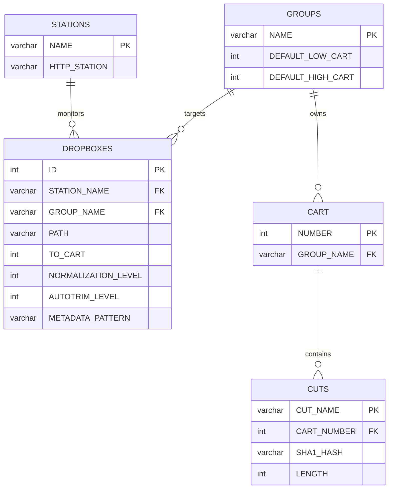
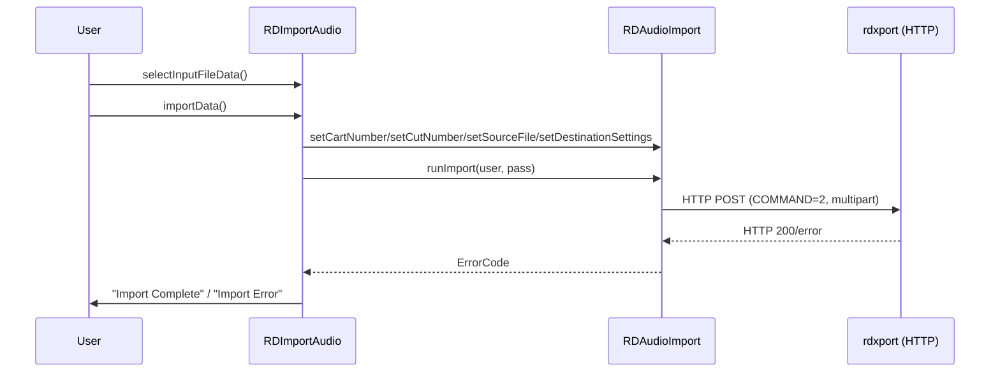
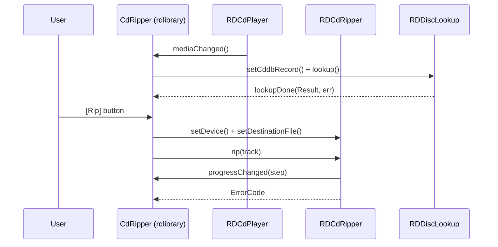

# LIB-006: Audio Processing Pipeline

## Kontekst biznesowy

Rdzen przetwarzania audio w systemie radiowym. Obejmuje caly cykl zycia pliku audio: import z dysku lub CD, konwersje miedzy 7+ formatami, eksport do roznych formatow, automatyczny import z monitorowanych katalogow (dropbox) oraz analize plikow audio (parsowanie, trim, metadane). Uzywany przez operatorow radiowych do zasilania biblioteki audio tresciami z roznych zrodel.

## Aktorzy

| Aktor | Rola w tej feature |
|-------|-------------------|
| Operator | Importuje, eksportuje i konwertuje pliki audio, rippuje CD |
| System (Dropbox daemon) | Automatycznie importuje pliki z monitorowanych katalogow |
| RDXport (serwer) | Wykonuje import/eksport/trim/rehash po stronie serwera via HTTP |

## Granica funkcjonalnosci

```
IN SCOPE:
  - Import audio do cuta via HTTP (RDAudioImport)
  - Eksport audio z cuta via HTTP (RDAudioExport)
  - Lokalna konwersja formatow audio (RDAudioConvert) — 3-etapowy pipeline
  - Parsowanie plikow audio (RDWaveFile) — WAV/MPEG/Ogg/FLAC/AIFF/ATX/TMC/M4A
  - Rippowanie trackow z CD (RDCdRipper + RDCdPlayer)
  - Lookup metadanych CD (CDDB/MusicBrainz)
  - Auto-import z dropbox (konfiguracja RDDropbox)
  - Zapytania o metadane audio (RDAudioInfo), pojemnosc storage (RDAudioStore)
  - Analiza ciszy / trim (RDTrimAudio)
  - Rehash SHA1 audio (RDRehash)
  - Dialog Import/Export Audio File (RDImportAudio)
  - Dialogi CD lookup (RDDiscLookup, RDCddbLookup, RDMbLookup)

OUT OF SCOPE:
  - Odtwarzanie audio (playout engine) -> patrz LIB-005
  - Edycja audio (marker editing) -> patrz LIB-007
  - Podcast publishing / feed management -> patrz LIB-008
  - Nagrywanie audio z karty dzwiekowej -> patrz RDCATCH
```

---

## Use Cases

| ID | Aktor | Akcja | Efekt biznesowy | Priorytet |
|----|-------|-------|----------------|-----------|
| UC-002 | Operator | Importuje plik audio do cuta | WAV/MP/OGG/FLAC przeslany do serwera, normalizacja + autotrim zastosowane | MUST |
| UC-003 | Operator | Eksportuje audio z cuta | Plik w wybranym formacie (Pcm16/MpegL2/L3/Flac/OggVorbis) zapisany na dysku | MUST |
| UC-004 | Operator | Rippuje track z CD | Audio z CD zapisane jako WAV, metadane z CDDB/MusicBrainz przypisane | SHOULD |
| UC-005 | Operator | Konwertuje audio miedzy formatami | 3-etapowy pipeline Decode->Transform->Encode, 7 formatow docelowych | MUST |
| UC-021 | System | Dropbox auto-importuje plik audio | Jednokrotny import, nowy cart w grupie, opcjonalne kasowanie zrodla | SHOULD |

---

## Reguly biznesowe (Gherkin)

> Pelne reguly z source references. Z facts.md.

```gherkin
Rule: Audio Import Validation

  Scenario: Importing audio with invalid cart/cut
    Given cart_number > 999999 OR cut_number > 999
    When  import attempted
    Then  rejected as "invalid"

  Scenario: Importing audio with invalid levels
    Given normalization_level > 0 OR autotrim_level > 0
    When  import attempted
    Then  rejected — levels must be <= 0 dB

  # Zrodlo: tests/audio_import_test.cpp | Pewnosc: potwierdzone

Rule: Audio Export — Pcm24 Not Supported

  Scenario: Exporting audio in Pcm24 format
    Given destination format = Pcm24
    When  export is attempted
    Then  rejected as "invalid destination format"
    And   Pcm24 IS supported for conversion, but NOT for export

  # Zrodlo: tests/audio_export_test.cpp | tests/audio_convert_test.cpp | Pewnosc: potwierdzone

Rule: Audio Conversion Parameters

  Scenario: Converting with mutually exclusive options
    Given bit-rate AND quality both specified (nonzero)
    When  conversion attempted
    Then  rejected as "mutually exclusive"

  # Zrodlo: tests/audio_convert_test.cpp | Pewnosc: potwierdzone

Rule: Audio Conversion — Speed Ratio

  Scenario: Speed ratio out of range
    Given speed_ratio <= 0 OR outside [RD_TIMESCALE_MIN, RD_TIMESCALE_MAX]
    When  conversion attempted
    Then  ErrorInvalidSpeed returned

  # Zrodlo: lib/rdaudioconvert.cpp | Pewnosc: potwierdzone

Rule: WAV File Validation

  Scenario: Truncated WAV file
    Given file < 12 bytes
    When  openWave() called
    Then  abort with "truncated"

  Scenario: Chunk size beyond file boundary
    Given WAV chunk size exceeds physical file length
    When  parsing chunk
    Then  WARNING logged, chunk skipped

  # Zrodlo: tests/wav_chunk_test.cpp | Pewnosc: potwierdzone

Rule: Dropbox Auto-Import

  Scenario: Dropbox detects new file
    Given dropbox configured with PathSpec and Default Group
    And   group has Default Cart Number range set
    When  matching file appears
    Then  new cart created in group, audio imported
    And   import is ONE-TIME per file (requires Reset for re-import)
    And   optionally: source file deleted after import
    And   PathSpec MUST include file part (not just directory)

  # Zrodlo: docs/opsguide/rdadmin.xml:sect.rdadmin.manage_hosts.configuring_dropboxes | Pewnosc: potwierdzone
```

---

## Data Model (tabele DB w scope)

> Z data-model.md — tylko tabele dotyczace tego FEAT.
> Pelny schemat: `data-model.md`

### ERD dla tej feature



### Tabela: DROPBOXES

| Kolumna | Typ | Null | Opis |
|---------|-----|------|------|
| ID | int PK | NO | Auto-increment ID |
| STATION_NAME | varchar FK | NO | Stacja wlascicielska |
| GROUP_NAME | varchar FK | NO | Grupa docelowa dla importowanych cartow |
| PATH | varchar | YES | Sciezka monitorowanego katalogu (PathSpec) |
| TO_CART | unsigned | YES | Konkretny numer carta docelowego (0 = auto) |
| SINGLE_CART | enum Y/N | NO | Import wszystkich plikow do jednego carta |
| DELETE_CUTS | enum Y/N | NO | Usun istniejace cuty przed importem |
| DELETE_SOURCE | enum Y/N | NO | Usun plik zrodlowy po imporcie |
| NORMALIZATION_LEVEL | int | NO | Poziom normalizacji (dBFS, <= 0) |
| AUTOTRIM_LEVEL | int | NO | Prog autotrim (dBFS, <= 0) |
| FORCE_TO_MONO | enum Y/N | NO | Downmix do mono |
| METADATA_PATTERN | varchar | YES | Wzorzec nazwy pliku do ekstrakcji metadanych |
| USE_CARTCHUNK_ID | enum Y/N | NO | Uzyj CartChunk ID z metadanych pliku |
| FIX_BROKEN_FORMATS | enum Y/N | NO | Proba naprawy uszkodzonych formatow |
| SEND_EMAIL | enum Y/N | NO | Wyslij email po imporcie |
| LOG_TO_SYSLOG | enum Y/N | NO | Loguj do syslog |
| LOG_PATH | varchar | YES | Sciezka do pliku logu |
| SEGUE_LEVEL | int | YES | Poziom detekcji segue |
| SEGUE_LENGTH | int | YES | Dlugosc segue |
| STARTDATE_OFFSET | int | YES | Offset daty poczatkowej (dni) |
| ENDDATE_OFFSET | int | YES | Offset daty koncowej (dni) |
| IMPORT_CREATE_DATES | enum Y/N | NO | Tworzenie zakresu dat przy imporcie |
| CREATE_STARTDATE_OFFSET | int | YES | Offset daty poczatkowej tworzenia |
| CREATE_ENDDATE_OFFSET | int | YES | Offset daty koncowej tworzenia |

### Relacje FK

| Zrodlo | Kolumna | -> Cel | PK |
|--------|---------|-------|-----|
| DROPBOXES | STATION_NAME | STATIONS | NAME |
| DROPBOXES | GROUP_NAME | GROUPS | NAME |

---

## API klas w scope

> Z inventory.md — pelne sygnatury metod, parametry, efekty.

### RDAudioImport

**Odpowiedzialnosc:** Proxy HTTP do importowania plikow audio do systemu via RDXport web service (COMMAND=2).
**Pelny opis:** `inventory.md#RDAudioImport`

**Publiczne API:**
| Metoda | Parametry | Efekt | Warunki wywolania |
|--------|-----------|-------|------------------|
| setCartNumber(unsigned) | cart number | Ustawia numer carta docelowego | przed runImport |
| setCutNumber(unsigned) | cut number | Ustawia numer cuta docelowego | przed runImport |
| setSourceFile(QString) | sciezka pliku | Ustawia plik zrodlowy do uploadu | przed runImport |
| setDestinationSettings(RDSettings*) | format settings | Ustawia parametry konwersji (channels, normalization, autotrim) | przed runImport |
| setUseMetadata(bool) | flaga | Czy ekstrakowac metadane z pliku | przed runImport |
| runImport(QString, QString, ErrorCode*) | username, password, conv_err | Wykonuje import — HTTP multipart POST | po ustawieniu parametrow |
| abort() | - | Przerywa trwajacy upload (slot) | w trakcie runImport |

**Enums:**
| Enum | Wartosci | Znaczenie |
|------|----------|-----------|
| ErrorCode | ErrorOk(0), ErrorInvalidSettings(1), ErrorNoSource(2), ErrorNoDestination(3), ErrorInternal(5), ErrorUrlInvalid(7), ErrorService(8), ErrorInvalidUser(9), ErrorAborted(10), ErrorConverter(11) | Wynik operacji importu |

---

### RDAudioExport

**Odpowiedzialnosc:** Proxy HTTP do eksportowania audio z cartow/cutow via RDXport (COMMAND=1).
**Pelny opis:** `inventory.md#RDAudioExport`

**Publiczne API:**
| Metoda | Parametry | Efekt | Warunki wywolania |
|--------|-----------|-------|------------------|
| setCartNumber(unsigned) | cart number | Ustawia numer carta zrodlowego | przed runExport |
| setCutNumber(unsigned) | cut number | Ustawia numer cuta zrodlowego | przed runExport |
| setDestinationFile(QString) | sciezka pliku | Ustawia plik docelowy | przed runExport |
| setDestinationSettings(RDSettings*) | format/channels/rate/bitrate/quality/normalization | Ustawia format eksportu | przed runExport |
| setEnableMetadata(bool) | flaga | Czy dolaczyc metadane | przed runExport |
| setRange(int, int) | start_pt, end_pt | Zakres czasowy eksportu (-1 = calosc) | przed runExport |
| runExport(QString, QString, ErrorCode*) | username, password, conv_err | Wykonuje eksport — HTTP POST, zapisuje odpowiedz do pliku | po ustawieniu parametrow |
| abort() | - | Przerywa trwajacy download (slot) | w trakcie runExport |

**Sygnaly:**
| Sygnal | Parametry | Znaczenie biznesowe |
|--------|-----------|---------------------|
| strobe() | - | Postep eksportu (emitowany z CURL progress callback) |

**Enums:**
| Enum | Wartosci | Znaczenie |
|------|----------|-----------|
| ErrorCode | ErrorOk(0), ErrorInvalidSettings(1), ErrorNoSource(2), ErrorNoDestination(3), ErrorInternal(5), ErrorUrlInvalid(7), ErrorService(8), ErrorInvalidUser(9), ErrorAborted(10), ErrorConverter(11) | Wynik operacji eksportu |

---

### RDAudioConvert

**Odpowiedzialnosc:** Lokalna konwersja audio przez 3-etapowy pipeline: Decode -> Transform -> Encode. Obsluguje 7+ formatow.
**Pelny opis:** `inventory.md#RDAudioConvert`

**Publiczne API:**
| Metoda | Parametry | Efekt | Warunki wywolania |
|--------|-----------|-------|------------------|
| setSourceFile(QString) | sciezka | Ustawia plik zrodlowy | przed convert |
| setDestinationFile(QString) | sciezka | Ustawia plik docelowy | przed convert |
| setDestinationSettings(RDSettings*) | format/bitrate/rate/channels/normalization | Ustawia parametry docelowe | przed convert |
| setDestinationWaveData(RDWaveData*) | metadane | Ustawia metadane do osadzenia | opcjonalne |
| setDestinationRdxl(QString) | RDXL XML | Ustawia cart XML do osadzenia w ID3v2 | opcjonalne |
| setRange(int, int) | start, end (ms) | Zakres czasowy (-1 = calosc) | opcjonalne |
| setSpeedRatio(float) | wspolczynnik | Zmiana tempa (bez zmiany pitch) | opcjonalne |
| convert() | - | Uruchamia 3-etapowy pipeline konwersji | po ustawieniu src/dst/settings |
| sourceWaveData() | - | Zwraca metadane odczytane ze zrodla | po convert |
| sourceRdxl() | - | Zwraca RDXL XML ze zrodla | po convert |

**Enums:**
| Enum | Wartosci | Znaczenie |
|------|----------|-----------|
| ErrorCode | ErrorOk(0), ErrorInvalidSettings(1), ErrorNoSource(2), ErrorNoDestination(3), ErrorInvalidSource(4), ErrorInternal(5), ErrorFormatNotSupported(6), ErrorNoDisc(7), ErrorNoTrack(8), ErrorInvalidSpeed(9), ErrorFormatError(10), ErrorNoSpace(11) | Wynik konwersji |

---

### RDAudioInfo

**Odpowiedzialnosc:** Proxy HTTP do pobierania metadanych audio (format, channels, sample rate, dlugosc) via RDXport (COMMAND=19).
**Pelny opis:** `inventory.md#RDAudioInfo`

**Publiczne API:**
| Metoda | Parametry | Efekt | Warunki wywolania |
|--------|-----------|-------|------------------|
| setCartNumber(unsigned) | cart number | Ustawia cart do zapytania | przed runInfo |
| setCutNumber(unsigned) | cut number | Ustawia cut do zapytania | przed runInfo |
| runInfo(QString, QString) | username, password | Pobiera metadane audio z serwera | po ustawieniu cart/cut |
| format() | - | Zwraca format audio (Pcm16, etc.) | po runInfo |
| channels() | - | Zwraca liczbe kanalow | po runInfo |
| sampleRate() | - | Zwraca sample rate (Hz) | po runInfo |
| bitRate() | - | Zwraca bit rate | po runInfo |
| frames() | - | Zwraca liczbe ramek | po runInfo |
| length() | - | Zwraca dlugosc (ms) | po runInfo |

---

### RDAudioStore

**Odpowiedzialnosc:** Proxy HTTP do zapytania o pojemnosc storage audio via RDXport (COMMAND=23).
**Pelny opis:** `inventory.md#RDAudioStore`

**Publiczne API:**
| Metoda | Parametry | Efekt | Warunki wywolania |
|--------|-----------|-------|------------------|
| runStore(QString, QString) | username, password | Pobiera info o storage | - |
| freeBytes() | - | Wolne bajty | po runStore |
| totalBytes() | - | Calkowita pojemnosc | po runStore |

---

### RDTrimAudio

**Odpowiedzialnosc:** Proxy HTTP do analizy ciszy (auto-trim) w audio cuta via RDXport (COMMAND=17).
**Pelny opis:** `inventory.md#RDTrimAudio`

**Publiczne API:**
| Metoda | Parametry | Efekt | Warunki wywolania |
|--------|-----------|-------|------------------|
| setCartNumber(unsigned) | cart | Ustawia cart | przed runTrim |
| setCutNumber(unsigned) | cut | Ustawia cut | przed runTrim |
| setTrimLevel(int) | poziom dBFS | Ustawia prog ciszy | przed runTrim |
| runTrim(QString, QString) | username, password | Wykonuje analize trim | po ustawieniu parametrow |
| startPoint() | - | Poczatek nieciszy (ms) | po runTrim |
| endPoint() | - | Koniec nieciszy (ms) | po runTrim |

---

### RDRehash

**Odpowiedzialnosc:** Proxy HTTP do przeliczania SHA-1 hash pliku audio cuta via RDXport (COMMAND=32).
**Pelny opis:** `inventory.md#RDRehash`

**Publiczne API:**
| Metoda | Parametry | Efekt | Warunki wywolania |
|--------|-----------|-------|------------------|
| setCartNumber(unsigned) | cart | Ustawia cart | przed runRehash |
| setCutNumber(unsigned) | cut | Ustawia cut | przed runRehash |
| runRehash(QString, QString) | username, password | Uruchamia przeliczenie SHA-1 po stronie serwera | po ustawieniu cart/cut |

---

### RDWaveFile

**Odpowiedzialnosc:** Kompletna obsluga plikow audio — odczyt/zapis WAV, MPEG, Ogg Vorbis, FLAC, AIFF, ATX, TMC, M4A. Parsowanie chunkow (fmt, data, cart, bext, mext, levl, RDXL).
**Pelny opis:** `inventory.md#RDWaveFile`

**Publiczne API:**
| Metoda | Parametry | Efekt | Warunki wywolania |
|--------|-----------|-------|------------------|
| openWave(RDWaveData*) | optional metadata out | Otwiera plik, parsuje format i chunki | plik istnieje |
| createWave(RDWaveData*) | optional metadata in | Tworzy nowy plik audio | sciezka ustawiona |
| closeWave() | - | Zamyka plik, finalizuje chunki | po open/create |
| readWave(void*, int) | bufor, rozmiar | Odczytuje dane audio | po openWave |
| writeWave(void*, int) | bufor, rozmiar | Zapisuje dane audio | po createWave |
| getSampleLength() | - | Dlugosc w probkach | po openWave |
| getTimeLength() | - | Dlugosc w ms | po openWave |
| startTrim(int level) | prog dBFS | Punkt poczatku nieciszy | po openWave |
| endTrim(int level) | prog dBFS | Punkt konca nieciszy | po openWave |
| hasEnergy() / energy() | - | Dane peak/energy per ramka | po openWave |
| getFormatTag() | - | Format audio (0x0001=PCM, 0x0050=MPEG, etc.) | po openWave |

**Enums:**
| Enum | Wartosci | Znaczenie |
|------|----------|-----------|
| Format | Pcm8, Pcm16, Pcm24, Float, MpegL1, MpegL2, MpegL3, OggVorbis, Atx, Tmc, Flac, Aiff, M4A | Formaty audio |
| Type | Unknown, Wave, Mpeg, Ogg, Atx, Tmc, Flac, Aiff, M4A | Typ kontenera |

---

### RDCdPlayer

**Odpowiedzialnosc:** Abstrakcja napedu CD-ROM Linux. Transport (play/pause/stop/eject), odczyt TOC, identyfikacja CDDB disc ID, detekcja zmiany nosnika.
**Pelny opis:** `inventory.md#RDCdPlayer`

**Publiczne API:**
| Metoda | Parametry | Efekt | Warunki wywolania |
|--------|-----------|-------|------------------|
| open() / close() | - | Otwiera/zamyka urzadzenie CD | device ustawiony |
| play(int track) | numer sciezki | Rozpoczyna odtwarzanie | urzadzenie otwarte, plyta zaladowana |
| pause() | - | Pauzuje odtwarzanie | w trakcie play |
| stop() | - | Zatrzymuje odtwarzanie | w trakcie play/pause |
| eject() | - | Wysuwa plyte | urzadzenie otwarte |
| tracks() | - | Liczba sciezek z TOC | po mediaChanged |
| isAudio(int) | numer sciezki | Czy sciezka jest audio (vs data) | po TOC read |
| trackLength(int) | numer sciezki | Czas trwania (ms) | po TOC read |
| setCddbRecord(RDDiscRecord*) | rekord | Wypelnia dane CDDB z TOC | po TOC read |

**Sygnaly:**
| Sygnal | Parametry | Znaczenie biznesowe |
|--------|-----------|---------------------|
| ejected() | - | Nosnik zostal wysuniety |
| mediaChanged() | - | Nowy nosnik wlozony, TOC odczytany |
| played(int track) | numer sciezki | Odtwarzanie rozpoczete |
| stopped() | - | Odtwarzanie zatrzymane |
| paused() | - | Odtwarzanie spauzowane |

**Enums:**
| Enum | Wartosci | Znaczenie |
|------|----------|-----------|
| Status | NoStatusInfo, NoDriveDisc, TrayOpen, NotReady, Ok | Status naped CD |
| Medium | NoMediumInfo, NoMediumLoaded, AudioDisc, Data1, Data2, Xa21, Xa22, Mixed | Typ nosnika |
| State | NoStateInfo(0), Stopped(1), Playing(2), Paused(3) | Stan odtwarzania |
| PlayMode | Single(0), Continuous(1) | Tryb odtwarzania (1 sciezka vs calosc) |

---

### RDCdRipper

**Odpowiedzialnosc:** Rippowanie sciezek audio z CD do pliku WAV. Uzywa cdparanoia (ekstrakcja) i libsndfile (zapis WAV).
**Pelny opis:** `inventory.md#RDCdRipper`

**Publiczne API:**
| Metoda | Parametry | Efekt | Warunki wywolania |
|--------|-----------|-------|------------------|
| setDevice(QString) | sciezka | Ustawia urzadzenie CD | przed rip |
| setDestinationFile(QString) | sciezka | Ustawia plik wyjsciowy WAV | przed rip |
| rip(int track) | numer sciezki | Rippuje pojedyncza sciezke | po setDevice + setDest |
| rip(int first, int last) | zakres | Rippuje zakres sciezek do jednego WAV | po setDevice + setDest |
| abort() | - | Przerywa rippowanie (slot) | w trakcie rip |
| totalSteps() | - | Zwraca 4 (kroki progresu) | zawsze |

**Sygnaly:**
| Sygnal | Parametry | Znaczenie biznesowe |
|--------|-----------|---------------------|
| progressChanged(int) | krok 0-4 | Postep rippowania (~25% interwaly) |

**Enums:**
| Enum | Wartosci | Znaczenie |
|------|----------|-----------|
| ErrorCode | ErrorOk(0), ErrorNoDevice(1), ErrorNoDestination(2), ErrorInternal(3), ErrorNoDisc(4), ErrorNoTrack(5), ErrorAborted(6) | Wynik rippowania |

---

### RDDiscLookup (abstract base)

**Odpowiedzialnosc:** Bazowa klasa dialogowa lookup metadanych plyt CD. Definiuje interfejs wyszukiwania z obsluga CD-Text, walidacja ISRC/UPC-A.
**Pelny opis:** `inventory.md#RDDiscLookup`

**Publiczne API:**
| Metoda | Parametry | Efekt | Warunki wywolania |
|--------|-----------|-------|------------------|
| setCddbRecord(RDDiscRecord*) | rekord | Ustawia rekord plyty do lookup | przed lookup |
| lookup() | - | Rozpoczyna wyszukiwanie metadanych | po setCddbRecord |
| sourceName() | - | Nazwa zrodla metadanych (abstrakcyjna) | - |
| hasCdText() | - | Czy plyta ma CD-Text | po lookup |
| isrcIsValid(QString) | ISRC string | Walidacja ISRC | dowolny moment |
| upcAIsValid(QString) | UPC-A string | Walidacja UPC-A | dowolny moment |

**Sygnaly:**
| Sygnal | Parametry | Znaczenie biznesowe |
|--------|-----------|---------------------|
| lookupDone(Result, QString) | wynik + opis bledu | Wyszukiwanie zakonczone (ExactMatch/NoMatch/LookupError) |

---

### RDCddbLookup

**Odpowiedzialnosc:** Implementacja lookup CD przez protokol CDDB (FreeDB) via TCP socket.
**Pelny opis:** `inventory.md#RDCddbLookup`

**Publiczne API:**
| Metoda | Parametry | Efekt | Warunki wywolania |
|--------|-----------|-------|------------------|
| lookupRecord() | - | CDDB query via TCP (port 8880): handshake -> query discid -> read disc data | po setCddbRecord |
| sourceName() | - | Zwraca "FreeDB" | - |

---

### RDMbLookup

**Odpowiedzialnosc:** Implementacja lookup CD przez MusicBrainz API (libmusicbrainz5 + libcoverart).
**Pelny opis:** `inventory.md#RDMbLookup`

**Publiczne API:**
| Metoda | Parametry | Efekt | Warunki wywolania |
|--------|-----------|-------|------------------|
| lookupRecord() | - | Lookup via libmusicbrainz5: disc ID -> release list -> track titles + cover art | po setCddbRecord |
| sourceName() | - | Zwraca "MusicBrainz" | - |
| sourceLogo() | - | Logo MusicBrainz | - |
| sourceUrl() | - | URL do release na musicbrainz.org | po lookup |

---

### RDDropbox

**Odpowiedzialnosc:** Model konfiguracji dropbox — monitorowany katalog z auto-importem audio. Active Record na tabeli DROPBOXES.
**Pelny opis:** `inventory.md#RDDropbox`

**Publiczne API:**
| Metoda | Parametry | Efekt | Warunki wywolania |
|--------|-----------|-------|------------------|
| RDDropbox(int id, QString station) | id (-1=nowy), stacja | Tworzy/laduje konfiguracje dropbox | - |
| duplicate() | - | Klonuje dropbox z nowym ID | istniejacy dropbox |
| path() / setPath(QString) | sciezka | Get/set monitorowanego katalogu | - |
| groupName() / setGroupName(QString) | nazwa grupy | Get/set grupy docelowej | - |
| normalizationLevel() / setNormalizationLevel(int) | dBFS | Get/set poziomu normalizacji | - |
| autotrimLevel() / setAutotrimLevel(int) | dBFS | Get/set progu autotrim | - |
| deleteSource() / setDeleteSource(bool) | flaga | Get/set kasowania zrodla po imporcie | - |
| deleteCuts() / setDeleteCuts(bool) | flaga | Get/set kasowania istniejacych cutow | - |
| metadataPattern() / setMetadataPattern(QString) | wzorzec | Get/set wzorca ekstrakcji metadanych z nazwy | - |
| singleCart() / setSingleCart(bool) | flaga | Import do jednego carta | - |
| useCartchunkId() / setUseCartchunkId(bool) | flaga | Uzyj CartChunk ID z metadanych | - |

---

## Protokoly komunikacji

> Z call-graph.md i inventory — komendy RDXport uzywane przez klasy w scope.

| Komenda | ID | Parametry | Odpowiedz | Klasa klienta |
|---------|-----|-----------|-----------|---------------|
| EXPORT | 1 | CART_NUMBER, CUT_NUMBER, FORMAT, CHANNELS, SAMPLE_RATE, BIT_RATE, QUALITY, NORMALIZATION_LEVEL, START_POINT, END_POINT, ENABLE_METADATA | Plik audio (body) lub XML error | RDAudioExport |
| IMPORT | 2 | CART_NUMBER, CUT_NUMBER, CHANNELS, NORMALIZATION_LEVEL, AUTOTRIM_LEVEL, USE_METADATA, FILENAME (file upload) | HTTP 200/400/401/404 | RDAudioImport |
| TRIMAUDIO | 17 | CART_NUMBER, CUT_NUMBER, TRIM_LEVEL | XML: startTrimPoint, endTrimPoint | RDTrimAudio |
| AUDIOINFO | 19 | CART_NUMBER, CUT_NUMBER | XML: format, channels, sampleRate, bitRate, frames, length | RDAudioInfo |
| AUDIOSTORE | 23 | (brak cart/cut) | XML: freeBytes, totalBytes | RDAudioStore |
| REHASH | 32 | CART_NUMBER, CUT_NUMBER | HTTP 200/error | RDRehash |

**Protokol CDDB (TCP, port 8880):**
| Faza | Komenda | Odpowiedz |
|------|---------|-----------|
| 0 | (connect) | Banner serwera |
| 1 | cddb hello ... | Handshake response |
| 2 | proto 6 | Protocol level set |
| 3 | cddb query {discid} {tracks} {offsets} {length} | 200=exact, 210=multiple, 202=no match |
| 4 | (multiple: user wybiera) | - |
| 5 | cddb read {genre} {discid} | Record lines |
| 6 | (parse) | DTITLE, TTITLE0..N, DYEAR, DGENRE |

---

## UI Contracts

> Referencje do pelnych kontraktow + kluczowe widgety dla tego FEAT.

**Design Tokens:** `../design-tokens.json`

> **OBOWIĄZKOWE:** Załaduj design-tokens.json do konfiguracji UI frameworka
> aby zachować spójność kolorów, fontów i spacingu z innymi artefaktami.

### RDImportAudio — Import/Export Audio File

**Pelny kontrakt:** `ui-contracts.md#RDImportAudio`
**Mockup HTML:** `mockups/RDImportAudio.html`

**Kluczowe widgety w scope tej feature:**
| Widget | Typ | Etykieta | Akcja | Slot |
|--------|-----|----------|-------|------|
| import_importmode_button | QRadioButton | "Import File" | przelacz na tryb import | modeClickedData(0) |
| import_exportmode_button | QRadioButton | "Export File" | przelacz na tryb export | modeClickedData(1) |
| import_in_filename_edit | QLineEdit | "Filename:" | sciezka pliku wejsciowego | filenameChangedData |
| import_in_selector_button | QPushButton | "&Select" | wybor pliku do importu | selectInputFileData() |
| import_in_metadata_box | QCheckBox | "Import file metadata" | import metadanych | (odczyt) |
| import_channels_box | QComboBox | "Channels:" | wybor kanalow (1/2) | (odczyt) |
| import_autotrim_box | QCheckBox | "Autotrim" | wlacz autotrim | autotrimCheckData(bool) |
| import_autotrim_spin | QSpinBox | "Level:" (-99..0) | poziom autotrim | (odczyt) |
| import_normalize_box | QCheckBox | "Normalize" | wlacz normalizacje | normalizeCheckData(bool) |
| import_normalize_spin | QSpinBox | "Level:" (-30..0) | poziom normalizacji | (odczyt) |
| import_import_button | QPushButton | "&Import" / "&Export" | uruchom operacje | importData() |
| import_cancel_button | QPushButton | "&Cancel" | anuluj | cancelData() |
| import_out_format_button | QPushButton | "S&et" | wybor formatu eksportu | selectOutputFormatData() |
| import_bar | RDBusyBar | - | pasek postepu | (wbudowane) |

**Stany widoku (relevantne dla tej feature):**
| Stan | Kiedy | Efekt wizualny |
|------|-------|---------------|
| Import mode | import radio selected | Sekcja import aktywna, export disabled |
| Export mode | export radio selected | Sekcja export aktywna, import disabled |
| Import running | import_conv != NULL | Przycisk zmienia sie na "Abort" |
| Export running | export_conv != NULL | Przycisk zmienia sie na "Abort" |
| Autotrim off | unchecked | Spin+label disabled |
| Normalize off | unchecked | Spin+label disabled |

**Walidacje (z source reference):**
| Pole | Regula | Komunikat | Zrodlo |
|------|--------|-----------|--------|
| input file | plik musi istniec | "File does not exist!" | rdimport_audio.cpp:519 |
| import result | import musi sie powiesc | "Import Error" + errorText | rdimport_audio.cpp:563 |
| output file | plik juz istnieje | "Do you want to overwrite it?" (Yes/No) | rdimport_audio.cpp:590 |
| export result | export musi sie powiesc | "Export Error" + errorText | rdimport_audio.cpp:624 |

---

### RDDiscLookup — Multiple Matches Found!

**Pelny kontrakt:** `ui-contracts.md#RDDiscLookup`
**Mockup HTML:** `mockups/RDDiscLookup.html`

**Kluczowe widgety w scope tej feature:**
| Widget | Typ | Etykieta | Akcja | Slot |
|--------|-----|----------|-------|------|
| lookup_titles_label | QLabel | "Multiple Matches Found!" (bold) | Informacja | - |
| lookup_titles_box | QComboBox | (lista tytulow) | Wybor tytulu z wielu dopasowan | - |
| lookup_ok_button | QPushButton | "OK" | Potwierdza wybor | okData() |
| lookup_cancel_button | QPushButton | "Cancel" | Anuluje | cancelData() |

**Stany widoku:**
| Stan | Kiedy | Efekt wizualny |
|------|-------|---------------|
| Chooser visible | podklasa wywolala exec() | Label + combo + OK/Cancel widoczne |
| Multiple matches (CDDB) | serwer zwrocil kod 210 | Combo z tytulami |
| Multiple matches (MB) | wiele release'ow | Combo z tytulami i okladkami (ikony 60x60) |
| Exact match | kod 200/201 | Brak dialogu — automatycznie czyta rekord |
| No match | kod 202/211 | Brak dialogu — lookupDone(NoMatch) |

---

## Sygnaly integracji (z call-graph.md)

### Sequence diagram — Import audio flow



### Sequence diagram — CD Rip flow



**Emitowane (ta feature -> inne):**
| Sygnal | Klasa | Odbiorca | Slot | Kontekst |
|--------|-------|----------|------|----------|
| ejected() | RDCdPlayer | CdRipper (rdlibrary) | ejectedData() | nosnik wysuniety |
| mediaChanged() | RDCdPlayer | CdRipper (rdlibrary) | mediaChangedData() | nowy nosnik wlozony |
| played(int) | RDCdPlayer | CdRipper (rdlibrary) | playedData(int) | CD gra |
| stopped() | RDCdPlayer | CdRipper (rdlibrary) | stoppedData() | CD zatrzymane |
| progressChanged(int) | RDCdRipper | QProgressBar (rip_bar) | setValue(int) | postep rippowania |
| lookupDone(Result, QString) | RDDiscLookup | CdRipper (rdlibrary) | lookupDoneData() | lookup metadanych zakonczony |

**Odbierane (inne -> ta feature):**
| Nadawca | Sygnal | Klasa (tu) | Slot | Kontekst |
|---------|--------|------------|------|----------|
| QTcpSocket | connected() | RDCddbLookup | (implicit) | polaczenie CDDB nawiazane |
| QTcpSocket | readyRead() | RDCddbLookup | readyReadData() | dane CDDB dostepne |
| QTcpSocket | error() | RDCddbLookup | errorData() | blad sieci CDDB |
| QTimer | timeout() | RDCdPlayer | clockData() | polling stanu napedu (1s) |
| QTimer | timeout() | RDCdPlayer | buttonTimerData() | przetworzenie kolejki operacji (100ms) |

---

## Platform Independence

| Funkcja | Oryginal | Klon | Priorytet |
|---------|----------|------|-----------|
| Kodeki MPEG (decode/encode) | libmad + libmp3lame + libtwolame (dlopen) | ffmpeg / Web Codec API | HIGH |
| Kodeki Ogg/FLAC | libvorbis + FLAC API | ffmpeg / Web Audio API | HIGH |
| Parsowanie plikow audio | libsndfile (fallback) + wlasny parser | ffmpeg / Web Audio API | HIGH |
| Resampling | libsamplerate (SRC) | ffmpeg resampler / Web Audio | HIGH |
| Zmiana tempa | SoundTouch | Tone.js / Rubberband.js | MEDIUM |
| CD ripping | cdparanoia (cdda_*) | deprecate lub USB audio import | LOW |
| CD player | Linux CDROM ioctl | deprecate | LOW |
| CD metadata (CDDB) | QTcpSocket (port 8880) | nowoczesne HTTP API (MusicBrainz only) | MEDIUM |
| CD metadata (MusicBrainz) | libmusicbrainz5 + libdiscid + libcoverart | MusicBrainz REST API (HTTP/JSON) | MEDIUM |
| M4A/AAC decode | mp4v2 + libfaad (warunkowe) | ffmpeg | MEDIUM |
| ID3v2 tagging | TagLib | ffmpeg metadata / music-metadata (JS) | MEDIUM |
| Pliki tymczasowe | /tmp/ + POSIX I/O (open/write/close/unlink) | OS temp dir API | LOW |

---

## Configuration (klucze w scope)

| Klucz | Typ | Domyslna | Wplyw na te feature |
|-------|-----|---------|---------------------|
| RDLIBRARY.CD_SERVER_TYPE | enum | None | Typ serwera metadanych CD (None/CDDB/MusicBrainz) |
| RDLIBRARY.CDDB_SERVER | varchar | freedb.freedb.org | Adres serwera CDDB |
| RDLIBRARY.MB_SERVER | varchar | musicbrainz.org | Adres serwera MusicBrainz |
| RDLIBRARY.SRC_CONVERTER | int | SRC_SINC_MEDIUM_QUALITY | Typ konwertera libsamplerate |
| RDLIBRARY.DEFAULT_CHANNELS | int | 2 | Domyslna liczba kanalow |
| SYSTEM.SAMPLE_RATE | int | 48000 | Systemowy sample rate |
| rd.conf: TranscodingDelay | int | 0 | Opoznienie CPU throttle w konwersji (usleep) |

---

## Acceptance Criteria (E2E)

```gherkin
Feature: Audio Processing Pipeline

  Scenario: Import WAV file to cart/cut
    Given operator has a valid WAV file on disk
    And   cart 100001 cut 001 exists in the system
    When  operator opens Import/Export dialog for cut 100001_001
    And   selects the WAV file
    And   enables normalization at -13 dB
    And   clicks "Import"
    Then  file is uploaded to RDXport via HTTP POST (COMMAND=2)
    And   server normalizes audio to -13 dB
    And   dialog shows "Import Complete"

  Scenario: Export audio to MP3
    Given cart 100001 cut 001 contains audio
    When  operator switches to Export mode
    And   selects destination file path
    And   sets format to MPEG Layer 3, 128 kbps
    And   clicks "Export"
    Then  audio is downloaded from RDXport via HTTP POST (COMMAND=1)
    And   MP3 file saved to disk
    And   dialog shows "Export Complete"

  Scenario: Export Pcm24 rejected
    Given destination format = Pcm24
    When  export attempted
    Then  rejected as "invalid destination format"

  Scenario: Convert audio between formats
    Given source file is Ogg Vorbis
    And   destination format is MPEG Layer 2 at 256 kbps
    When  RDAudioConvert::convert() is called
    Then  Stage 1 decodes Ogg to WAV32
    And   Stage 2 applies normalization and resampling
    And   Stage 3 encodes to MPEG Layer 2
    And   ErrorOk returned

  Scenario: Convert with invalid speed ratio
    Given speed_ratio = 0 (or negative)
    When  convert() called
    Then  ErrorInvalidSpeed returned

  Scenario: Rip CD track
    Given audio CD is inserted in drive
    And   RDCdPlayer emits mediaChanged()
    And   disc lookup returns track metadata from CDDB
    When  operator clicks Rip for track 3
    Then  RDCdRipper rips track 3 to WAV file
    And   progressChanged emitted at ~25% intervals
    And   metadata from CDDB applied to cart

  Scenario: Dropbox auto-imports file
    Given dropbox configured for /mnt/incoming/ with group MUSIC
    And   group MUSIC has cart range 200000-299999
    When  file "song.wav" appears in /mnt/incoming/
    Then  new cart created in MUSIC group
    And   audio imported via RDAudioImport
    And   import is ONE-TIME (file not re-imported)
    And   optionally source file deleted

  Scenario: Truncated WAV file rejected
    Given WAV file is < 12 bytes
    When  RDWaveFile::openWave() called
    Then  aborted as "truncated"

  Scenario: Import with invalid cart number
    Given cart_number > 999999
    When  import attempted
    Then  rejected as "invalid"
```

---

## Open Questions

- [ ] Czy CD ripping (cdparanoia) powinien byc zachowany w klonie, czy zastapiony importem z USB/pliku?
- [ ] Czy CDDB (FreeDB) jest nadal dostepny jako serwis? Rozwazyc wylacznosc MusicBrainz.
- [ ] Czy format M4A/AAC (warunkowa kompilacja) powinien byc obslugiwany w klonie?

---

## Working Packages (wstepny podzial)

| WP | Opis | Zaleznosci |
|----|------|-----------|
| WP-1 | Domain model: RDSettings, RDWaveData, RDDiscRecord, RDDropbox, audio enums | - |
| WP-2 | Audio file parser: RDWaveFile (WAV/MPEG/Ogg/FLAC chunk parsing, format detection, metadata) | WP-1 |
| WP-3 | Audio conversion pipeline: RDAudioConvert (3-stage Decode->Transform->Encode) | WP-1, WP-2 |
| WP-4 | HTTP audio services: RDAudioImport, RDAudioExport, RDAudioInfo, RDAudioStore, RDTrimAudio, RDRehash | WP-1 |
| WP-5 | CD subsystem: RDCdPlayer, RDCdRipper, RDDiscLookup, RDCddbLookup, RDMbLookup | WP-1 |
| WP-6 | UI: RDImportAudio dialog (import/export), RDDiscLookup dialogs (CDDB/MB selection) | WP-1, WP-3, WP-4, WP-5 |
| WP-7 | Tests: unit tests for all business rules, format conversion, edge cases | WP-1..WP-6 |

*Szacunek wstepny — agent PM moze podzielic inaczej.*
