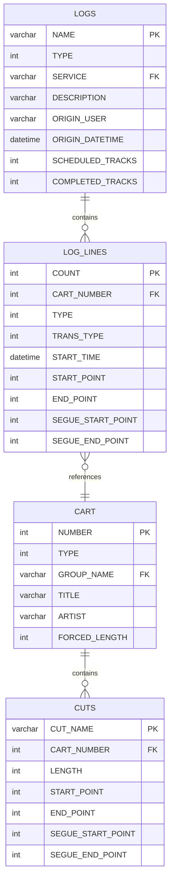
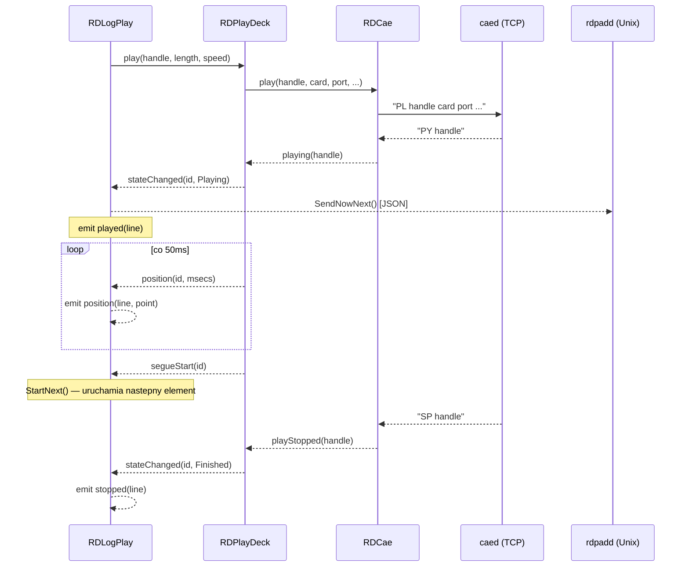
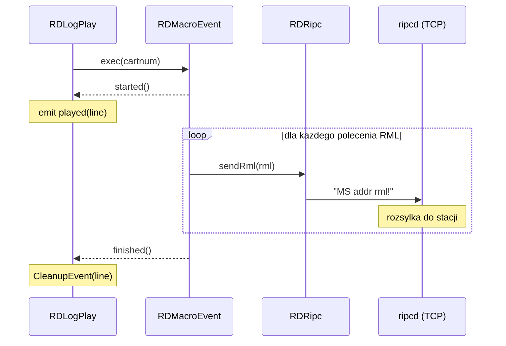
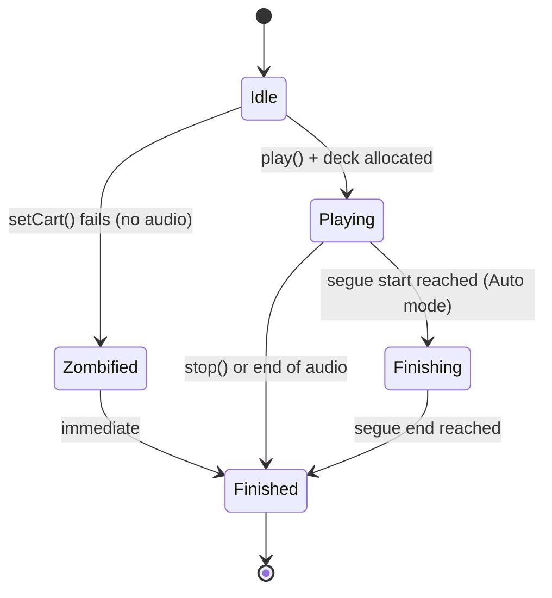
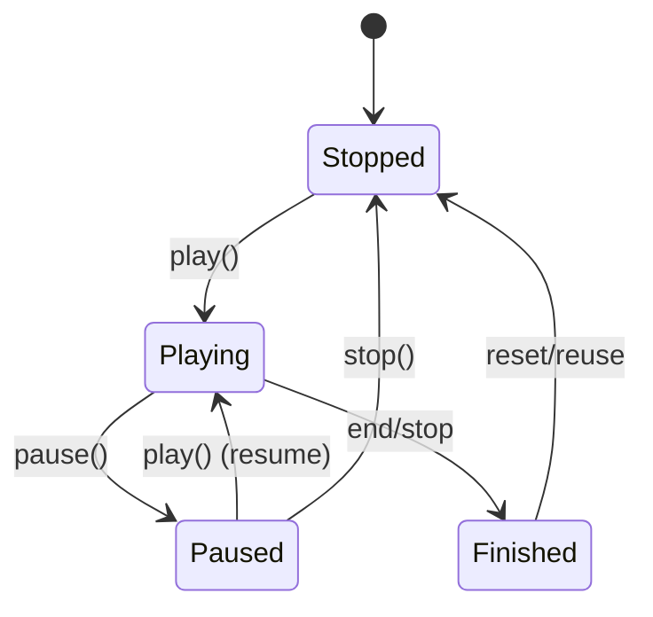

# LIB-007: Playout Engine

## Kontekst biznesowy

Silnik playout odpowiada za odtwarzanie logu emisyjnego w czasie rzeczywistym — sekwencyjne
uruchamianie eventow audio i makr, automatyczne przejscia segue miedzy nimi, zarzadzanie
do 7 rownoleglych strumieni audio oraz aktualizacje PAD (Program Associated Data) dla
systemow zewnetrznych. Jest centralnym komponentem on-air workflow: bez niego stacja radiowa
nie moze emitowac zaprogramowanego materialu. Obsluguje trzy tryby pracy (Automatic, LiveAssist,
Manual) dostosowane do roznych stylow emisji — od pelnej automatyzacji po reczne sterowanie
przez operatora.

## Aktorzy

| Aktor | Rola w tej feature |
|-------|-------------------|
| System (Automation) | Automatycznie odtwarza eventy z logu, wykonuje segue, hard times |
| Operator (DJ) | Recznie uruchamia/zatrzymuje eventy, wybiera tryb, nagrywa voice tracki |
| rdpadd (daemon) | Odbiera PAD updates (now/next) przez Unix socket |
| caed (daemon) | Wykonuje fizyczne odtwarzanie audio na zlecenie RDCae |
| ripcd (daemon) | Wykonuje komendy RML z makr |

## Granica funkcjonalnosci

```
IN SCOPE:
  - Real-time log playback (play/stop/pause/resume events)
  - Segue auto-transition (crossfade between consecutive events)
  - Deck management (7 simultaneous plays, allocation/deallocation)
  - Macro execution (RML command sequences via RDMacroEvent)
  - Log refresh during playback (4-pass algorithm)
  - Voice tracking (auto-create/delete voice track cards)
  - Automation modes (Automatic/LiveAssist/Manual)
  - PAD emission (now/next JSON via Unix socket)
  - Position tracking and timescale speed
  - ELR traffic reconciliation logging
  - Offline log rendering (RDRenderer)
  - Time-based event triggering (hard times, grace periods)

OUT OF SCOPE:
  - Audio file storage and cart/cut management -> patrz LIB-003
  - CAE protocol layer and audio device abstraction -> patrz LIB-004
  - Log creation, editing, scheduling -> patrz LIB-005
  - Sound Panel playback (separate RDSoundPanel workflow) -> patrz LIB-008
```

---

## Use Cases

| ID | Aktor | Akcja | Efekt biznesowy | Priorytet |
|----|-------|-------|----------------|-----------|
| UC-008 | System | Odtwarza event z logu | PlayDeck alokowany, audio odtwarzane przez CAE, PAD update emitowany do rdpadd | MUST |
| UC-009 | System | Auto-segue do nastepnego eventu | Crossfade startuje gdy biezacy event osiaga segue start (tryb Auto) | MUST |
| UC-012 | System | Odswieeza log podczas odtwarzania | 4-pass algorithm: mark, purge, add, delete orphans — bez przerywania playbacku | MUST |
| UC-020 | Operator | Nagrywa voice track | Karty voice track auto-tworzone/kasowane, transition adjustable | SHOULD |

---

## Reguly biznesowe (Gherkin)

> Pelne reguly z source references. Z facts.md, nie streszczone.

```gherkin
Rule: Play Deck Allocation

  Scenario: Starting an event on the log play machine
    Given an event to play
    When  event is not Paused, a free PlayDeck must be allocated
    Then  if no deck available (max 7 = LOGPLAY_MAX_PLAYS), playback cannot start

  # Zrodlo: lib/rdlogplay.cpp:2090-2094 | Pewnosc: potwierdzone

Rule: Missing Audio Zombification

  Scenario: Starting playback but no audio file exists
    Given a log line with a cart/cut assignment
    When  playdeck->setCart() returns false
    Then  event "zombified" — transitions immediately Playing->Finished
    And   LOG_WARNING emitted

  # Zrodlo: lib/rdlogplay.cpp:1881-1892 | Pewnosc: potwierdzone

Rule: Position Bounds Check

  Scenario: Starting playback at stored position
    Given a log line with play position
    When  playPosition > effectiveLength
    Then  play position reset to 0

  # Zrodlo: lib/rdlogplay.cpp:1903-1906 | Pewnosc: potwierdzone

Rule: Segue Auto-Transition

  Scenario: Auto-segue to next event
    Given playing event reaches segue start point
    When  mode = Auto AND next event transition = Segue
    Then  next event starts automatically with crossfade

  Scenario: LiveAssist mode segue
    Given playing event reaches segue start point
    When  mode = LiveAssist
    Then  auto crossfade occurs (but no auto transition to next)

  Scenario: Manual mode
    Given playing event reaches segue start point
    When  mode = Manual
    Then  NO auto crossfade, full manual control

  # Zrodlo: lib/rdlogplay.cpp:1525-1536, doc rdairplay.xml | Pewnosc: potwierdzone

Rule: Segue End — Auto Stop

  Scenario: Segue end point reached
    Given playing event reaches segue end point in Auto mode
    When  event status = Finishing
    Then  play deck stopped, event cleaned up, traffic logged to ELR_LINES

  # Zrodlo: lib/rdlogplay.cpp:1552-1561 | Pewnosc: potwierdzone

Rule: Log Refresh — 4-Pass Algorithm

  Scenario: Log refreshed while playing (live update from DB)
    Given a log is playing and new version available in DB
    When  log is refreshed (rescan interval 5000ms)
    Then  Pass 1: Mark matching events old<->new by ID
    Then  Pass 2: Purge events not in new log (preserving playing items)
    Then  Pass 3: Add new events (after holdovers)
    Then  Pass 4: Delete orphaned finished events

  # Zrodlo: lib/rdlogplay.cpp:680-732 | Pewnosc: potwierdzone

Rule: Holdover Events

  Scenario: Events carry over during log refresh
    Given events marked as holdovers (from previous log)
    When  log is refreshed
    Then  holdovers stay at top, new events inserted after last holdover

  # Zrodlo: lib/rdlogplay.cpp:692-703 | Pewnosc: potwierdzone

Rule: Automation Modes

  Scenario: Automatic mode
    Given a log loaded in a log machine
    When  mode = Automatic
    Then  all functions enabled: PLAY, SEGUE, hard times

  Scenario: LiveAssist mode
    Given a log loaded in a log machine
    When  mode = LiveAssist
    Then  no auto transitions/hard times, BUT auto crossfade

  Scenario: Manual mode
    Given a log loaded in a log machine
    When  mode = Manual
    Then  like LiveAssist but NO auto crossfade (full manual control)

  # Zrodlo: doc rdairplay.xml:sect.rdairplay.layout | Pewnosc: potwierdzone

Rule: Timescale Speed Range

  Scenario: Calculating timescale speed for a play deck
    Given timescale ratio calculated for a log line
    When  speed < 0.833 (RD_TIMESCALE_MIN) OR > 1.250 (RD_TIMESCALE_MAX)
    Then  timescale reset to 1.0 (no scaling)

  # Zrodlo: lib/rdplay_deck.cpp:180-186 | Pewnosc: potwierdzone

Rule: Timescale Feasibility

  Scenario: Enforced length check before playback
    Given a cut with enforce_length enabled
    When  LENGTH * RD_TIMESCALE_MAX < forced_length OR LENGTH * RD_TIMESCALE_MIN > forced_length
    Then  the cut is NeverValid (cannot be timescaled to fit)

  # Zrodlo: lib/rdcart.cpp:2348-2355 | Pewnosc: potwierdzone
```

---

## Data Model (tabele DB w scope)

> Z data-model.md — tylko tabele dotyczace tego FEAT.
> Pelny schemat: `data-model.md`

### ERD dla tej feature



### Tabela: LOG_LINES (dynamicznie tworzone per log)

Linie logu — kazdy log ma tabele `{LOG_NAME}_LOG` z liniami eventow.

**Klasy CRUD:** RDLogEvent (full CRUD), RDLogLine (READ)

### Relacje FK

| Zrodlo | Kolumna | -> Cel | PK |
|--------|---------|-------|-----|
| LOG_LINES | CART_NUMBER | CART | NUMBER |
| CUTS | CART_NUMBER | CART | NUMBER |
| LOGS | SERVICE | SERVICES | NAME |

---

## API klas w scope

> Z inventory.md — pelne sygnatury metod, parametry, efekty.

### RDLogPlay

**Odpowiedzialnosc:** Central playout engine managing real-time broadcast log execution. Handles event chaining, timed starts, segue transitions, Now/Next PAD updates, and operation modes (Auto/Manual).
**Pelny opis:** `inventory.md#RDLogPlay`

**Publiczne API:**
| Metoda | Parametry | Efekt | Warunki wywolania |
|--------|-----------|-------|------------------|
| `load(logname)` | QString logname | Laduje log z DB, inicjalizuje linie | Log istnieje w DB |
| `play(line, startpos, mode)` | int line, int startpos, RDLogPlay::StartMode | Alokuje deck, laduje cart/cut, uruchamia audio | Wolny deck dostepny |
| `stop(line)` | int line | Zatrzymuje odtwarzanie na linii | Linia w stanie Playing |
| `pause(line)` | int line | Pauzuje odtwarzanie | Linia w stanie Playing |
| `refresh()` | - | 4-pass merge zmian DB do dzialajacego logu | Log zaladowany |
| `setMode(mode)` | RDLogPlay::OpMode | Zmiana trybu: Auto/LiveAssist/Manual | Log zaladowany |
| `setTransType(line, type)` | int line, RDLogLine::TransType | Zmienia typ przejscia (Play/Segue/Stop) | Linia istnieje |

**Sygnaly:**
| Sygnal | Parametry | Znaczenie biznesowe |
|--------|-----------|---------------------|
| `played(int)` | line number | Event rozpoczal odtwarzanie |
| `stopped(int)` | line number | Event zakonczyl odtwarzanie |
| `position(int,int)` | line, msecs | Aktualna pozycja odtwarzania (co 50ms) |
| `transportChanged()` | - | Stan transportu zmieniony (play/stop/pause) |

**Enums:**
| Enum | Wartosci | Znaczenie |
|------|----------|-----------|
| `OpMode` | Automatic, LiveAssist, Manual | Tryb automatyzacji logu |
| `StartMode` | StartPlay, StartNext, StartFinish | Sposob uruchomienia eventu |

**Limity:**
| Parametr | Wartosc | Znaczenie |
|----------|---------|-----------|
| LOGPLAY_MAX_PLAYS | 7 | Max jednoczesnych odtwarzan |
| Lookahead | 20 | Eventy skanowane z wyprzedzeniem |
| Rescan interval | 5000ms | Czestotliwosc refresh z DB |

### RDPlayDeck

**Odpowiedzialnosc:** Single audio playout deck abstraction. Manages the full lifecycle of playing one audio file with timer-based segue, hook, talk, fade, and duck points.
**Pelny opis:** `inventory.md#RDPlayDeck`

**Publiczne API:**
| Metoda | Parametry | Efekt | Warunki wywolania |
|--------|-----------|-------|------------------|
| `setCart(logline, timescale)` | RDLogLine*, bool | Laduje cart/cut na deck, zwraca false jesli brak audio | Deck w stanie Stopped |
| `play(handle, length, speed)` | unsigned, int, int | Rozpoczyna odtwarzanie przez RDCae | Cart zaladowany |
| `stop()` | - | Zatrzymuje odtwarzanie | Deck w stanie Playing/Paused |
| `pause()` | - | Pauzuje odtwarzanie | Deck w stanie Playing |
| `duckDown(gain)` | int gain | Scisza deck (duck) o zadana wartosc | Deck w stanie Playing |
| `duckUp()` | - | Przywraca glosnosc po ducku | Deck w stanie Playing + ducked |

**Sygnaly:**
| Sygnal | Parametry | Znaczenie biznesowe |
|--------|-----------|---------------------|
| `stateChanged(int, State)` | id, state | Zmiana stanu decku (Stopped/Playing/Paused/Finished) |
| `position(int, int)` | id, msecs | Pozycja odtwarzania co 100ms |
| `segueStart(int)` | id | Osiagnieto punkt poczatku segue |
| `segueEnd(int)` | id | Osiagnieto punkt konca segue |
| `talkStart(int)` | id | Osiagnieto punkt poczatku talk-over |
| `talkEnd(int)` | id | Osiagnieto punkt konca talk-over |
| `hookEnd(int)` | id | Osiagnieto punkt konca hooka |

**Enums:**
| Enum | Wartosci | Znaczenie |
|------|----------|-----------|
| `State` | Stopped, Playing, Paused, Finished | Stan cyklu zycia decku |

**Timery:**
| Timer | Interwat | Cel |
|-------|----------|-----|
| position_timer | 50ms | Propagacja pozycji |
| fade_timer | - | Fade in/out ramp |
| duck_timer | - | Duck down (750ms) / duck up (1500ms) |
| stop_timer | - | Auto-stop po zakonczeniu |

### RDMacroEvent

**Odpowiedzialnosc:** Container for RML macro lists with sequential execution, sleep/pause support, and host variable resolution.
**Pelny opis:** `inventory.md#RDMacroEvent`

**Publiczne API:**
| Metoda | Parametry | Efekt | Warunki wywolania |
|--------|-----------|-------|------------------|
| `exec(cartnum)` | unsigned | Laduje i wykonuje sekwencje komend RML z macro cart | Cart jest typu Macro |
| `stop()` | - | Przerywa wykonywanie makra | Makro w trakcie |

**Sygnaly:**
| Sygnal | Parametry | Znaczenie biznesowe |
|--------|-----------|---------------------|
| `started()` | - | Makro rozpoczelo wykonywanie |
| `finished()` | - | Makro zakonczylo wykonywanie |
| `stopped()` | - | Makro przerwane przez operatora |

### RDTimeEngine

**Odpowiedzialnosc:** Schedules events to fire at specific wall-clock times. Manages a single QTimer targeting the next upcoming event.
**Pelny opis:** `inventory.md#RDTimeEngine`

**Publiczne API:**
| Metoda | Parametry | Efekt | Warunki wywolania |
|--------|-----------|-------|------------------|
| `setEvent(id, time)` | int, QTime | Rejestruje event na konkretna godzine | - |
| `clearEvent(id)` | int | Usuwa zaplanowany event | Event zarejestrowany |

**Sygnaly:**
| Sygnal | Parametry | Znaczenie biznesowe |
|--------|-----------|---------------------|
| `timeout(int)` | event id | Nadeszla zaplanowana godzina — uruchom event |

### RDRenderer

**Odpowiedzialnosc:** Renders a broadcast log into a single audio file by sequentially mixing overlapping audio events with segue gain ramps. Supports render-to-file and render-to-cart modes.
**Pelny opis:** `inventory.md#RDRenderer`

**Publiczne API:**
| Metoda | Parametry | Efekt | Warunki wywolania |
|--------|-----------|-------|------------------|
| `renderToFile(filename, settings)` | QString, RDSettings* | Renderuje log do pliku audio | Log zaladowany |
| `renderToCart(cartnum, cutnum, settings)` | unsigned, int, RDSettings* | Renderuje log do carta w bibliotece | Log zaladowany, cart istnieje |
| `abort()` | - | Anuluje rendering | Rendering w trakcie |

**Sygnaly:**
| Sygnal | Parametry | Znaczenie biznesowe |
|--------|-----------|---------------------|
| `lineStarted(int, int)` | line, total | Rozpoczeto renderowanie linii N z M |
| `progressMessageSent(QString)` | message | Informacja o postepie |

---

## Protokoly komunikacji

> Z SPEC.md i call-graph.md — komendy uzywane przez klasy w scope.

### CAE TCP Protocol (RDPlayDeck -> RDCae -> caed)

| Komenda | Parametry | Odpowiedz | Znaczenie |
|---------|-----------|-----------|-----------|
| `PL` | handle, card, port, cut, start, end, speed | `PY handle` | Play audio (start playback) |
| `SP` | handle | `SP handle` | Stop playing (also emitted by caed on end) |
| `LP` | handle, card, port, cut, start, end | - | Load/prepare audio for playback |
| `PY` | handle | - | Playing confirmation from caed |

### RIPC TCP Protocol (RDMacroEvent -> RDRipc -> ripcd)

| Komenda | Parametry | Odpowiedz | Znaczenie |
|---------|-----------|-----------|-----------|
| `MS` | addr, rml! | - | Send RML macro command for execution |

### PAD Unix Socket (RDLogPlay -> rdpadd)

| Komenda | Parametry | Odpowiedz | Znaczenie |
|---------|-----------|-----------|-----------|
| SendNowNext | JSON payload | - | Now/Next cart/cut details + metadata |

---

## UI Contracts

Brak — feature jest backend-only (library component). UI kontrolujace playout (RDAirPlay)
jest w osobnym artefakcie.

---

## Sygnaly integracji (z call-graph.md)

### Sequence diagram — Audio Playback



### Sequence diagram — Macro Execution



**Emitowane (ta feature -> inne):**
| Sygnal | Klasa | Odbiorca | Slot | Kontekst |
|--------|-------|----------|------|----------|
| `played(int)` | RDLogPlay | rdairplay UI | update display | Event rozpoczal odtwarzanie |
| `stopped(int)` | RDLogPlay | rdairplay UI | update display | Event zakonczyl odtwarzanie |
| `position(int,int)` | RDLogPlay | rdairplay UI | update progress | Pozycja co 50ms |
| `transportChanged()` | RDLogPlay | rdairplay UI | refresh buttons | Zmiana stanu transportu |
| `SendNowNext() [JSON]` | RDLogPlay | rdpadd | PAD update | Now/Next do systemow zewnetrznych |

**Odbierane (inne -> ta feature):**
| Nadawca | Sygnal | Klasa (tu) | Slot | Kontekst |
|---------|--------|------------|------|----------|
| `RDCae` | `playing(int)` | RDPlayDeck | `playingData(int)` | CAE potwierdzil play |
| `RDCae` | `playStopped(int)` | RDPlayDeck | `playStoppedData(int)` | CAE zatrzymal audio |
| `RDCae` | `timescalingSupported(int,bool)` | RDLogPlay | `timescalingSupportedData(int,bool)` | Odpowiedz CAE o wsparciu timescale |
| `RDPlayDeck` | `stateChanged(int,State)` | RDLogPlay | `playStateChangedData(int,State)` | Zmiana stanu decku |
| `RDPlayDeck` | `position(int,int)` | RDLogPlay | `positionData(int,int)` | Pozycja audio |
| `RDPlayDeck` | `segueStart(int)` | RDLogPlay | `segueStartData(int)` | Start segue — trigger StartNext() |
| `RDPlayDeck` | `segueEnd(int)` | RDLogPlay | `segueEndData(int)` | Koniec segue — stop deck |
| `RDPlayDeck` | `talkStart(int)` | RDLogPlay | `talkStartData(int)` | Start talk-over |
| `RDPlayDeck` | `talkEnd(int)` | RDLogPlay | `talkEndData(int)` | Koniec talk-over |
| `RDMacroEvent` | `started()` | RDLogPlay | `macroStartedData()` | Makro wystartowalo |
| `RDMacroEvent` | `finished()` | RDLogPlay | `macroFinishedData()` | Makro zakonczone |
| `RDMacroEvent` | `stopped()` | RDLogPlay | `macroStoppedData()` | Makro przerwane |
| `RDRipc` | `notificationReceived(RDNotification*)` | RDLogPlay | `notificationReceivedData(...)` | Notyfikacja systemowa |
| `RDRipc` | `onairFlagChanged(bool)` | RDLogPlay | `onairFlagChangedData(bool)` | Zmiana flagi on-air |
| `RDRenderer` | `lineStarted(int,int)` | zewnetrzne (rdlogedit, rdfeed) | UI progress | Postep renderowania |

---

## State Machines

### Log Event Playback State Machine



### PlayDeck.State



---

## Platform Independence

| Funkcja | Oryginal | Klon | Priorytet |
|---------|----------|------|-----------|
| Audio playback | ALSA/JACK/HPI via caed (TCP) | Web Audio API | CRITICAL |
| Position tracking | QTimer 50ms | requestAnimationFrame / setInterval | HIGH |
| Timescale/pitch | SoundTouch via caed | Web Audio playbackRate | HIGH |
| PAD emission | Unix domain socket (JSON) | WebSocket / SSE | HIGH |
| RML dispatch | TCP to ripcd | WebSocket / REST API | MEDIUM |

---

## Configuration (klucze w scope)

| Klucz | Typ | Domyslna | Wplyw na te feature |
|-------|-----|---------|---------------------|
| LOGPLAY_MAX_PLAYS | int | 7 | Max jednoczesnych odtwarzan |
| Lookahead events | int | 20 | Ile eventow skanowanych z wyprzedzeniem |
| Rescan interval | int | 5000ms | Czestotliwosc odswierzania logu z DB |
| Fade depth | dB | -30dB | Glebokosc fade out |
| Duck down time | ms | 750ms | Czas duck down |
| Duck up time | ms | 1500ms | Czas duck up |
| Position timer | ms | 50ms | Interwat propagacji pozycji |
| RD_TIMESCALE_MIN | float | 0.833 | Minimalna predkosc timescale |
| RD_TIMESCALE_MAX | float | 1.250 | Maksymalna predkosc timescale |

---

## Acceptance Criteria (E2E)

```gherkin
Feature: Playout Engine

  Scenario: Play an audio event from log
    Given a log loaded with audio events
    And   at least one PlayDeck is free
    When  system triggers play on line N
    Then  PlayDeck allocated and audio starts via CAE
    And   PAD now/next updated via Unix socket
    And   position emitted every 50ms
    And   played(N) signal emitted

  Scenario: Auto-segue transition in Automatic mode
    Given mode = Automatic and event A is Playing
    And   event B transition type = Segue
    When  event A reaches segue start point
    Then  event B starts playing (crossfade)
    And   event A transitions to Finishing
    When  event A reaches segue end point
    Then  event A deck stopped and cleaned up

  Scenario: Zombified event (missing audio)
    Given a log line referencing a cart with no audio
    When  system attempts to play the line
    Then  setCart() returns false
    And   event immediately transitions to Finished
    And   LOG_WARNING emitted

  Scenario: Log refresh during playback
    Given a log is playing and DB has been updated
    When  rescan interval triggers refresh
    Then  4-pass algorithm merges changes
    And   currently playing events preserved
    And   holdover events stay at top
    And   new events inserted after holdovers

  Scenario: Macro execution
    Given a log line of type Macro
    When  system plays the macro line
    Then  RDMacroEvent executes RML commands sequentially via ripcd
    And   started() emitted at begin, finished() at end

  Scenario: Manual mode — no auto transitions
    Given mode = Manual and event A is Playing
    When  event A reaches segue start point
    Then  no auto-segue, no crossfade
    And   operator must manually trigger next event

  Scenario: Timescale out of range
    Given a cut with enforced length requiring speed 0.7
    When  timescale calculated
    Then  speed reset to 1.0 (below 0.833 minimum)

  Scenario: All decks busy
    Given 7 events already playing (LOGPLAY_MAX_PLAYS)
    When  system attempts to play event 8
    Then  playback cannot start (no free deck)

  Scenario: Offline log rendering
    Given a log loaded in RDRenderer
    When  renderToFile() called with output settings
    Then  all events mixed sequentially with segue gain ramps
    And   single audio file produced
    And   lineStarted() emitted for progress tracking
```

---

## Open Questions

- [ ] Voice tracking workflow: dokladna logika auto-tworzenia i kasowania kart VT wymaga wiecej analizy kodu rdairplay (UC-020 czesciowo w UI layer)
- [ ] Grace period semantics: jak dokladnie grace timer interacts z hard times w RDTimeEngine
- [ ] ELR reconciliation format: dokladna struktura rekordu ELR_LINES do traffic reconciliation

---

## Working Packages (wstepny podzial)

| WP | Opis | Zaleznosci |
|----|------|-----------|
| WP-1 | Domain model: PlayDeck state machine, deck pool (7 slots) | - |
| WP-2 | Data access: log line loading, ELR_LINES logging | WP-1 |
| WP-3 | Core engine: RDLogPlay play/stop/pause, deck allocation, position tracking | WP-1, WP-2 |
| WP-4 | Segue & transitions: auto-segue, crossfade, segue start/end handling | WP-3 |
| WP-5 | Automation modes: Automatic/LiveAssist/Manual mode switching & behavior | WP-3, WP-4 |
| WP-6 | Macro execution: RDMacroEvent RML dispatch, started/finished lifecycle | WP-3 |
| WP-7 | Log refresh: 4-pass algorithm, holdover preservation | WP-3 |
| WP-8 | Time engine: hard times, grace periods (RDTimeEngine integration) | WP-3, WP-5 |
| WP-9 | PAD emission: now/next JSON over WebSocket (replaces Unix socket) | WP-3 |
| WP-10 | Offline renderer: RDRenderer log-to-file mixing with segue ramps | WP-1 |
| WP-11 | Platform: Web Audio API integration (replaces ALSA/JACK/HPI) | WP-1, WP-3 |
| WP-12 | Tests | WP-1..WP-11 |

*Szacunek wstepny — agent PM moze podzielic inaczej.*
