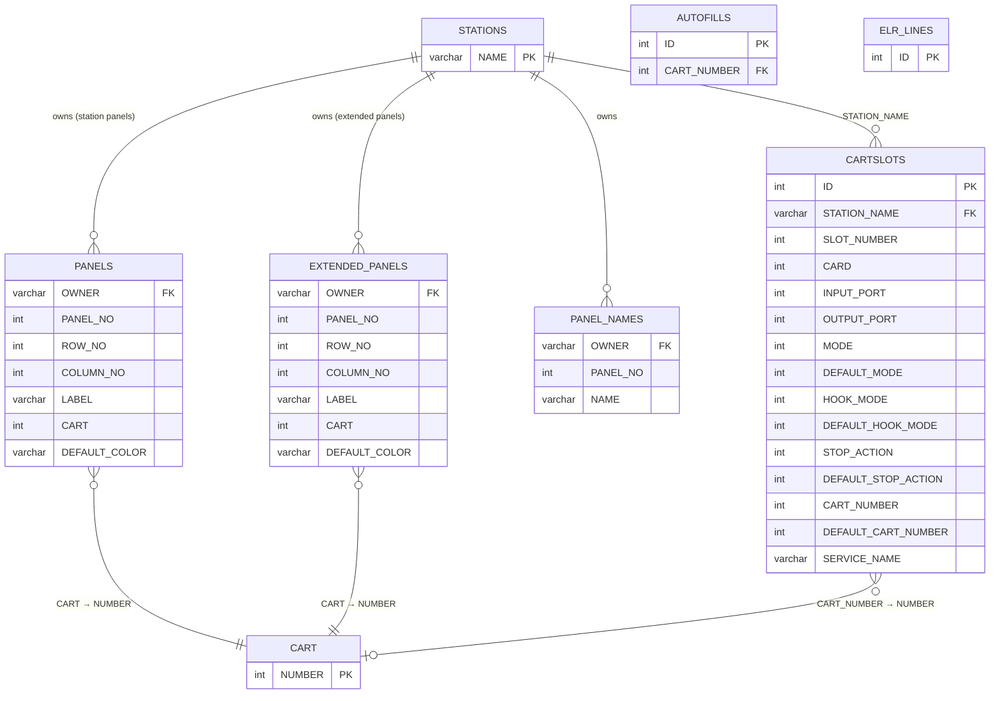
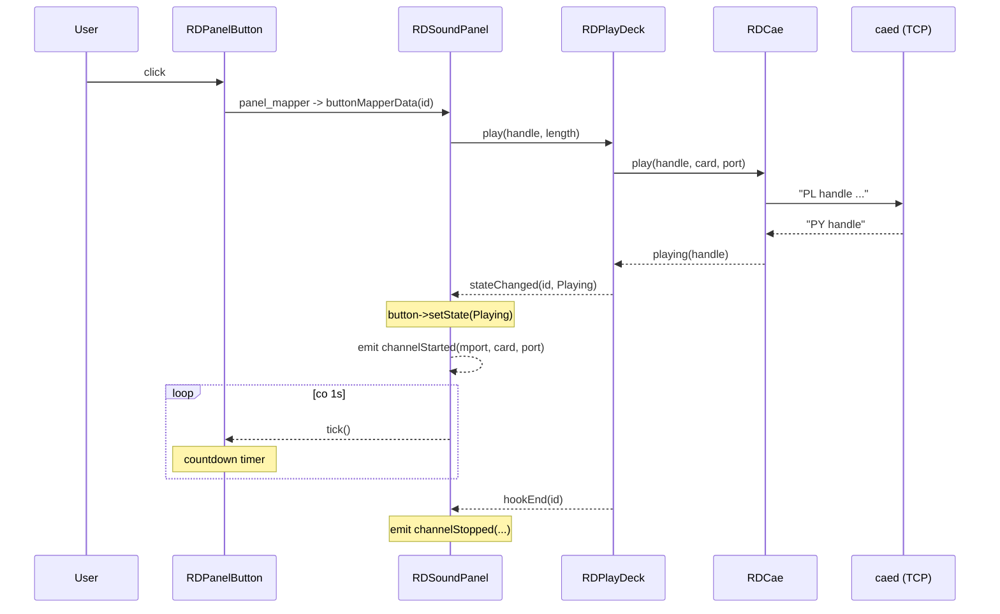
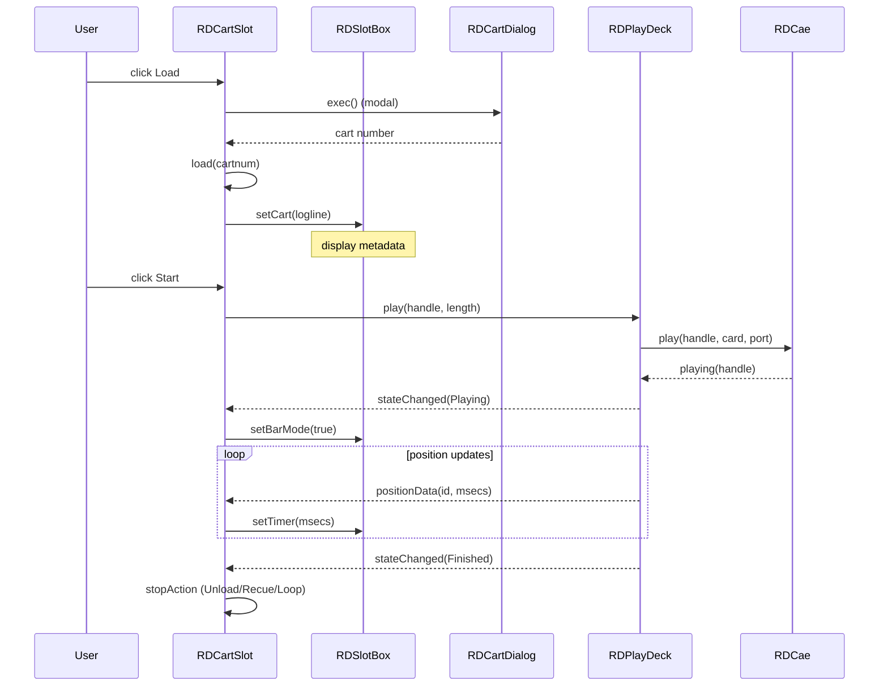

# LIB-008: Sound Panel & Cart Slots

## Kontekst biznesowy

Sound Panel to interaktywna siatka programowalnych przycisków umozliwiajaca operatorowi natychmiastowe odtwarzanie jingla, spotu lub innego materialu audio jednym kliknieciem. Cart Slots to uzupelniajacy mechanizm slotow z obsluga trybu breakaway (automatyczne wypelnienie z serwisu). Oba komponenty sluza do szybkiego, reaktywnego odtwarzania audio w kontekscie emisji na zywo (RDAirPlay). Operator widzi wizualny feedback: zmiana koloru przycisku, countdown timer, poziomy audio.

## Aktorzy

| Aktor | Rola w tej feature |
|-------|-------------------|
| Operator radiowy | Klika przyciski panelu, laduje/wyladowuje carty do slotow, konfiguruje przypisania i opcje |
| Administrator | Konfiguruje domyslne ustawienia slotow (DEFAULT_* w CARTSLOTS), blokuje tryby |
| System (playout) | Odtwarza audio przez RDPlayDeck/RDCae, aktualizuje stan przyciskow, loguje playout do ELR_LINES |

## Granica funkcjonalnosci

```
IN SCOPE:
  - RDSoundPanel: siatka przyciskow, panel selector, play mode, setup mode, reset, action modes
  - RDPanelButton: wizualny stan przycisku (idle/playing/paused), countdown timer, kolor, flash
  - RDButtonPanel: kontener siatki 20x20 przyciskow dla jednej strony panelu
  - RDCartSlot: widget slotu carta z trybami CartDeck/Breakaway, load/unload/play/pause/stop
  - RDSlotBox: display box z metadanymi carta, progress bar, level meters, drag-and-drop
  - RDEventPlayer: pool RDMacroEvent do wykonywania makr RML z przyciskow panelu
  - Dialogi: RDButtonDialog, RDSlotDialog, RDEditPanelName
  - DB: PANELS, EXTENDED_PANELS, PANEL_NAMES, EXTENDED_PANEL_NAMES, CARTSLOTS
  - Periodic scan (10s) odswieza dane panelu z DB

OUT OF SCOPE:
  - RDPlayDeck (silnik odtwarzania) -> patrz LIB-007
  - RDCae (Core Audio Engine protocol) -> patrz LIB-004
  - RDCartDialog (wybor carta z biblioteki) -> patrz LIB-003
  - RDLogPlay (log machine playout engine) -> osobny artefakt
  - Konfiguracja audio card/port -> patrz RDCardSelector
```

---

## Use Cases

| ID | Aktor | Akcja | Efekt biznesowy | Priorytet |
|----|-------|-------|----------------|-----------|
| UC-1 | Operator | Klika przycisk na Sound Panel | Audio cart odtwarzany natychmiast; przycisk zmienia kolor, countdown timer startuje | MUST |
| UC-2 | Operator | Klika przycisk z macro cart | Komendy RML wykonane przez RDEventPlayer | MUST |
| UC-3 | Operator | Klika przycisk w trybie Hook | Odtwarzany tylko fragment hook (od hook start do hook end) | MUST |
| UC-4 | Operator | Wchodzi w Setup mode i edytuje przycisk | RDButtonDialog: przypisuje cart, label, kolor do przycisku | MUST |
| UC-5 | Operator | Zmienia panel (panel selector) | Przeladowuje siatke przyciskow z wybranego panelu (station/user) | MUST |
| UC-6 | Operator | Klika Reset i potem przycisk | Zatrzymuje odtwarzanie na kliknietym przycisku | SHOULD |
| UC-7 | Operator | Zmienia nazwe panelu (panel setup) | RDEditPanelName: nowa nazwa zapisana do PANEL_NAMES | SHOULD |
| UC-8 | Operator | Laduje cart do Cart Slot | Przez RDCartDialog lub drag-and-drop; slot wyswietla metadane | MUST |
| UC-9 | Operator | Klika Start na Cart Slot | Audio odtwarzane z slotu; progress bar i metery aktywne | MUST |
| UC-10 | Operator | Konfiguruje opcje slotu | RDSlotDialog: tryb (CartDeck/Breakaway), play mode (Full/Hook), stop action | MUST |
| UC-11 | System | Breakaway mode: auto-fill | System automatycznie wybiera cart z AUTOFILLS pasujacy do dlugosci | SHOULD |
| UC-12 | System | Periodic scan (10s) | Panel odswieza dane z DB (moze byc zmieniony z innej stacji) | SHOULD |

---

## Reguly biznesowe (Gherkin)

> Pelne reguly z source references. Z facts.md i kodu.

```gherkin
Rule: Sound Panel Button Grid Limits

  Scenario: Panel grid dimensions
    Given a sound panel being constructed
    When  rows and columns are specified
    Then  maximum grid size is 20 columns x 20 rows (MAX_BUTTON_COLUMNS x MAX_BUTTON_ROWS)
    And   maximum number of panels per type is 50 (MAX_PANELS)
    And   maximum audio outputs per panel is 5

  # Zrodlo: lib/rdbutton_panel.h:37-38, lib/rdsound_panel.h:46, lib/rd.h:175
  # Pewnosc: potwierdzone

Rule: Panel Scan Refresh

  Scenario: Periodic panel data refresh
    Given a sound panel is active
    When  10 seconds elapse (PANEL_SCAN_INTERVAL = 10000ms)
    Then  panel data is refreshed from DB (PANELS/EXTENDED_PANELS)
    And   button assignments updated if changed externally

  # Zrodlo: lib/rdsound_panel.h:47, lib/rdsound_panel.cpp:229
  # Pewnosc: potwierdzone

Rule: Sound Panel Action Modes

  Scenario: Normal mode — play/stop on click
    Given action mode is Normal
    When  operator clicks a button with assigned cart
    Then  if button is idle, playback starts (PlayButton)
    And   if button is playing, playback stops (StopButton)

  Scenario: Setup mode — edit button on click
    Given operator clicks Setup button
    When  operator clicks any panel button
    Then  RDButtonDialog opens for that button
    And   operator can assign cart, label, and color

  Scenario: Reset mode — stop on click
    Given operator clicks Reset button (button flashes)
    When  operator clicks a playing button
    Then  playback on that button is stopped
    And   reset mode deactivates

  # Zrodlo: lib/rdsound_panel.cpp (buttonMapperData, action modes)
  # Pewnosc: potwierdzone

Rule: Play Mode — Full vs Hook

  Scenario: Full mode playback
    Given play mode is "Play All"
    When  button is clicked
    Then  entire cart is played (full length)

  Scenario: Hook mode playback
    Given play mode is "Play Hook"
    When  button is clicked
    Then  only hook portion is played (hook start to hook end)
    And   hookEnd signal stops playback when hook endpoint reached

  # Zrodlo: lib/rdsound_panel.cpp (playmodeActivatedData, hookEndData)
  # Pewnosc: potwierdzone

Rule: Button Label Auto-Generation

  Scenario: Empty label with cart assigned
    Given a button has cart assigned but label is empty
    When  operator confirms in RDButtonDialog (okData)
    Then  label is auto-generated from label_template via RDLogLine::resolveWildcards()

  # Zrodlo: lib/rdbutton_dialog.cpp (okData)
  # Pewnosc: potwierdzone

Rule: Cart Slot Modes

  Scenario: CartDeck mode — manual load/play
    Given slot mode is CartDeckMode
    When  operator loads a cart
    Then  cart metadata displayed in RDSlotBox
    And   Start/Load/Options buttons active
    And   stop action configurable (Unload/Recue/Loop)

  Scenario: Breakaway mode — auto-fill from service
    Given slot mode is BreakawayMode
    When  breakaway is triggered with duration
    Then  system selects best-fit cart from AUTOFILLS table
    And   play mode and stop action are locked (disabled in UI)
    And   temporary cart created if needed, cleaned up after

  # Zrodlo: lib/rdcartslot.cpp, lib/rdslotoptions.cpp
  # Pewnosc: potwierdzone

Rule: Cart Slot Stop Actions

  Scenario: UnloadOnStop
    Given stop action is UnloadOnStop
    When  playback finishes
    Then  cart is unloaded from slot

  Scenario: RecueOnStop
    Given stop action is RecueOnStop
    When  playback finishes
    Then  cart is recued to beginning (ready for replay)

  Scenario: LoopOnStop
    Given stop action is LoopOnStop
    When  playback finishes
    Then  cart automatically replays from beginning

  # Zrodlo: lib/rdslotoptions.h (enum StopAction)
  # Pewnosc: potwierdzone

Rule: Cart Slot Grid Limits

  Scenario: Cart slot grid dimensions
    Given cart slots are configured for a station
    When  slots are created
    Then  maximum is 16 rows x 4 columns (RDCARTSLOTS_MAX_ROWS x RDCARTSLOTS_MAX_COLUMNS)

  # Zrodlo: lib/rd.h:557-558
  # Pewnosc: potwierdzone

Rule: Slot Options Default Override

  Scenario: Administrator locks a setting
    Given CARTSLOTS.DEFAULT_MODE >= 0 for a station/slot
    When  slot options are loaded
    Then  the default value overrides user setting
    And   user cannot change this setting

  Scenario: Administrator allows user choice
    Given CARTSLOTS.DEFAULT_MODE = -1
    When  slot options are loaded
    Then  user-set value is used

  # Zrodlo: lib/rdslotoptions.cpp (load() — DEFAULT_* logic)
  # Pewnosc: potwierdzone
```

---

## Data Model (tabele DB w scope)

> Z data-model.md i inventory partials — tabele dotyczace tego FEAT.
> Pelny schemat: `data-model.md`

### ERD dla tej feature



### Tabela: PANELS / EXTENDED_PANELS

| Kolumna | Typ | Null | Opis |
|---------|-----|------|------|
| OWNER | varchar | NO | Nazwa stacji (FK -> STATIONS.NAME) |
| PANEL_NO | int | NO | Numer panelu |
| ROW_NO | int | NO | Wiersz przycisku |
| COLUMN_NO | int | NO | Kolumna przycisku |
| LABEL | varchar | YES | Etykieta przycisku |
| CART | int | YES | Numer przypisanego carta |
| DEFAULT_COLOR | varchar | YES | Kolor przycisku (hex) |

### Tabela: CARTSLOTS

| Kolumna | Typ | Null | Opis |
|---------|-----|------|------|
| STATION_NAME | varchar | NO | Nazwa stacji (FK) |
| SLOT_NUMBER | int | NO | Numer slotu (0-based) |
| CARD | int | YES | Numer karty audio |
| INPUT_PORT | int | YES | Port wejsciowy |
| OUTPUT_PORT | int | YES | Port wyjsciowy |
| MODE | int | YES | Tryb uzytkownika (0=CartDeck, 1=Breakaway) |
| DEFAULT_MODE | int | YES | Domyslny tryb admin (-1 = brak nadpisania) |
| HOOK_MODE | int | YES | Tryb hook uzytkownika (0=Full, 1=Hook) |
| DEFAULT_HOOK_MODE | int | YES | Domyslny hook admin |
| STOP_ACTION | int | YES | Akcja po zakonczeniu (0=Unload, 1=Recue, 2=Loop) |
| DEFAULT_STOP_ACTION | int | YES | Domyslna akcja admin |
| CART_NUMBER | int | YES | Numer carta przypisanego do slotu |
| DEFAULT_CART_NUMBER | int | YES | Domyslny cart admin |
| SERVICE_NAME | varchar | YES | Serwis breakaway |

### Relacje FK

| Zrodlo | Kolumna | -> Cel | PK |
|--------|---------|-------|-----|
| PANELS | OWNER | STATIONS | NAME |
| EXTENDED_PANELS | OWNER | STATIONS | NAME |
| PANEL_NAMES | OWNER | STATIONS | NAME |
| CARTSLOTS | STATION_NAME | STATIONS | NAME |
| PANELS | CART | CART | NUMBER |
| CARTSLOTS | CART_NUMBER | CART | NUMBER |

---

## API klas w scope

> Z inventory.md — pelne sygnatury metod, parametry, efekty.

### RDSoundPanel

**Odpowiedzialnosc:** Glowny widget panelu dzwiekowego. Zarzadza siatka programowalnych przyciskow, przelacza panele (station/user), obsluguje tryby odtwarzania i akcji, loguje playout.
**Pelny opis:** `inventory.md#RDSoundPanel`

**Publiczne API:**
| Metoda | Parametry | Efekt | Warunki wywolania |
|--------|-----------|-------|------------------|
| setButton() | type, panel, row, col, cartnum, title | Przypisuje cart do konkretnej pozycji przycisku | Programowe ustawienie przycisku |
| acceptCartDrop() | row, col, cartnum, color, title | Obsluguje drag-and-drop carta na przycisk | Drop event z innego widgetu |
| changeUser() | - | Przeladowuje panele uzytkownika po zmianie sesji | Sygnal userChanged z RDRipc |
| tickClock() | - | Aktualizuje countdown timery na aktywnych przyciskach | Co 1s z zewnetrznego timera |
| panelUp() / panelDown() | - | Nawigacja panel selector do przodu/tylu | Przycisk nawigacji |

**Sygnaly:**
| Sygnal | Parametry | Znaczenie biznesowe |
|--------|-----------|---------------------|
| tick() | - | Takt zegara do odswiezania countdown na przyciskach |
| buttonFlash(bool) | stan migania | Zmiana stanu flash animacji przyciskow |
| selectClicked(unsigned, int, int) | cartnum, row, col | Przycisk wybrany w trybie CopyFrom/CopyTo/AddTo/DeleteFrom |
| channelStarted(int, int, int) | mport, card, port | Rozpoczecie odtwarzania na kanale audio |
| channelStopped(int, int, int) | mport, card, port | Zakonczenie odtwarzania na kanale audio |

**Enums (via RDAirPlayConf):**
| Enum | Wartosci | Znaczenie |
|------|----------|-----------|
| ActionMode | Normal, CopyFrom, CopyTo, AddTo, DeleteFrom, Setup | Tryb akcji przy kliknieciu przycisku |
| PanelType | StationPanel, UserPanel | Typ panelu (per stacja / per uzytkownik) |

### RDPanelButton

**Odpowiedzialnosc:** Pojedynczy przycisk panelu z wizualnym stanem (idle/playing/paused), countdown timerem, kolorami i animacja flash.
**Pelny opis:** `inventory.md#RDPanelButton`

**Publiczne API:**
| Metoda | Parametry | Efekt | Warunki wywolania |
|--------|-----------|-------|------------------|
| setState(State) | state | Zmienia wizualny stan przycisku (kolor tla) | Po zmianie stanu PlayDeck |
| setColor(QColor) | color | Ustawia niestandardowy kolor przycisku | Konfiguracja z DB lub dialogu |
| tickClock() | - | Dekrementuje countdown timer, aktualizuje tekst | Co 1s z RDSoundPanel::tick() |
| setLength(int) | ms | Ustawia calkowita dlugosc (do countdown) | Przy ladowaniu carta |
| playDeck() | - | Zwraca RDPlayDeck przycisku | Przy odtwarzaniu |

**Sygnaly:**
| Sygnal | Parametry | Znaczenie biznesowe |
|--------|-----------|---------------------|
| clicked() | - | Przycisk klikniety (QPushButton inherited) |

### RDButtonPanel

**Odpowiedzialnosc:** Kontener zarzadzajacy siatka RDPanelButton dla jednej strony panelu.
**Pelny opis:** `inventory.md#RDButtonPanel`

**Publiczne API:**
| Metoda | Parametry | Efekt | Warunki wywolania |
|--------|-----------|-------|------------------|
| button(row, col) | wiersz, kolumna | Zwraca RDPanelButton na danej pozycji | Dostep do przycisku |

### RDCartSlot

**Odpowiedzialnosc:** Widget slotu carta. Obsluguje tryby CartDeck (reczny load/play) i Breakaway (auto-fill z serwisu). Zapewnia transport controls i logowanie playout.
**Pelny opis:** `inventory.md#RDCartSlot`

**Publiczne API:**
| Metoda | Parametry | Efekt | Warunki wywolania |
|--------|-----------|-------|------------------|
| load(cartnum, break_len) | numer carta, dlugosc breakaway | Laduje cart do slotu | Operator wybiera cart lub breakaway trigger |
| unload() | - | Wyladowuje biezacy cart | Operator lub stop action=Unload |
| play() / pause() / stop() | - | Transport controls | Operator lub system |
| breakAway(msecs) | dlugosc ms | Inicjuje breakaway — auto-fill | System trigger |
| setCart(RDCart*, break_len) | obiekt carta, dlugosc | Laduje cart obiekt | Wewnetrzne po selekcji |
| updateOptions() | - | Przeladowuje opcje z DB | Po zmianie konfiguracji |
| slotOptions() | - | Zwraca RDSlotOptions | Odczyt konfiguracji |
| setUser(RDUser*) | uzytkownik | Ustawia uzytkownika (uprawnienia) | Zmiana sesji |
| setSvcNames(vector<QString>*) | lista serwisow | Ustawia serwisy dla breakaway | Inicjalizacja |

**Sygnaly:**
| Sygnal | Parametry | Znaczenie biznesowe |
|--------|-----------|---------------------|
| tick() | - | Takt zegara (forwarded) |
| buttonFlash(bool) | stan | Flash state change |
| selectClicked(unsigned, int, int) | cartnum, row, col | Cart wybrany |

### RDSlotBox

**Odpowiedzialnosc:** Widget wyswietlania metadanych carta w slocie: etykiety, progress bar, metery audio, drag-and-drop.
**Pelny opis:** `inventory.md#RDSlotBox`

**Publiczne API:**
| Metoda | Parametry | Efekt | Warunki wywolania |
|--------|-----------|-------|------------------|
| setCart(RDLogLine*) | logline z metadanymi | Wyswietla metadane carta (tytul, artysta, grupa, dlugosc) | Po zaladowaniu carta |
| clear() | - | Czysci wyswietlanie | Po wyladowaniu |
| setBarMode(bool) | tryb paska | Pokazuje/ukrywa progress bar i timery | Przy start/stop odtwarzania |
| setTimer(int) | pozycja ms | Aktualizuje pozycje | Co tick |
| updateMeters(short[2]) | poziomy L/R | Aktualizuje metery audio | Z PlayDeck |
| setMode(Mode) | tryb | Ustawia tryb wyswietlania (standard/breakaway) | Zmiana trybu slotu |

**Sygnaly:**
| Sygnal | Parametry | Znaczenie biznesowe |
|--------|-----------|---------------------|
| doubleClicked() | - | Podwojne klikniecie — otwiera cue edit |
| cartDropped(unsigned) | cartnum | Cart upuszczony przez drag-and-drop |

### RDEventPlayer

**Odpowiedzialnosc:** Asynchroniczny executor komend RML z pula RDMacroEvent slotow i garbage collection.
**Pelny opis:** `inventory.md#RDEventPlayer`

**Publiczne API:**
| Metoda | Parametry | Efekt | Warunki wywolania |
|--------|-----------|-------|------------------|
| exec(cartnum) | numer carta | Wykonuje makro cart przez RDMacroEvent | Klikniecie macro button na panelu |

**Sygnaly:**
| Sygnal | Parametry | Znaczenie biznesowe |
|--------|-----------|---------------------|
| macroFinishedData(int) | slot index | Makro zakonczono — slot zwolniony |

### RDSlotOptions

**Odpowiedzialnosc:** Model konfiguracji slotu carta. Persystencja do/z tabeli CARTSLOTS z mechanizmem DEFAULT override.
**Pelny opis:** `inventory.md#RDSlotOptions`

**Publiczne API:**
| Metoda | Parametry | Efekt | Warunki wywolania |
|--------|-----------|-------|------------------|
| load() | - | Czyta konfiguracje z CARTSLOTS | Inicjalizacja slotu |
| save() | - | Zapisuje konfiguracje do CARTSLOTS | Po zmianie przez operatora |
| mode() / setMode() | Mode | Tryb slotu (CartDeck/Breakaway) | Konfiguracja |
| hookMode() / setHookMode() | bool | Tryb hook (Full/Hook) | Konfiguracja |
| stopAction() / setStopAction() | StopAction | Akcja po zakonczeniu | Konfiguracja |

**Enums:**
| Enum | Wartosci | Znaczenie |
|------|----------|-----------|
| Mode | CartDeckMode=0, BreakawayMode=1 | Tryb operacji slotu |
| StopAction | UnloadOnStop=0, RecueOnStop=1, LoopOnStop=2 | Co robic po zakonczeniu odtwarzania |

---

## Protokoly komunikacji (jesli dotyczy)

> Z SPEC.md Sekcja 9 — komendy uzywane przez klasy w scope.

| Komenda | Parametry | Odpowiedz | Znaczenie |
|---------|-----------|-----------|-----------|
| PL (LP) | card name | LP card name stream handle +/- | Load audio for playback (via RDCae) |
| PY | handle length speed pitch | PY handle +/- | Start playback |
| SP | handle | SP handle +/- | Stop playback |
| UP | handle | UP handle +/- | Unload playback |
| PP | handle pos | PP handle pos +/- | Position play (set position) |
| TS | card | TS card +/- | Query timescale support |
| MS | addr port rml | - | Send RML command (macro execution via RDRipc -> ripcd) |

---

## UI Contracts

> Referencje do pelnych kontraktow + kluczowe widgety dla tego FEAT.
> Agent kodujacy MUSI przeczytac pelne kontrakty i otworzyc mockupy.

### RDSoundPanel — Sound Panel Grid

**Pelny kontrakt:** `ui-contracts.md#RDSoundPanel`
**Mockup HTML:** brak (screenshot: `docs/opsguide/rdairplay.soundpanel_widget.png`)

**Kluczowe widgety w scope tej feature:**
| Widget | Typ | Etykieta | Akcja | Slot |
|--------|-----|----------|-------|------|
| panel_buttons[] | RDButtonPanel* (vector) | siatka cols x rows | klikniecie przycisku | buttonMapperData(int) via QSignalMapper |
| panel_selector_box | RDComboBox | "[S:N] Panel S:N" / "[U:N] Panel U:N" | wybor aktywnego panelu | panelActivatedData(int) |
| panel_playmode_box | QComboBox | "Play All" / "Play Hook" | wybor trybu odtwarzania | playmodeActivatedData(int) |
| panel_reset_button | RDPushButton | "Reset" | reset aktywnych odtwarzan | resetClickedData() |
| panel_all_button | RDPushButton | "All" | akcja na wszystkich (ukryty domyslnie) | allClickedData() |
| panel_setup_button | RDPushButton | "Setup" | wejscie w tryb konfiguracji | setupClickedData() |
| panel_scan_timer | QTimer | - | cykliczny skan panelu (10s) | scanPanelData() |

**Stany widoku (relevantne dla tej feature):**
| Stan | Kiedy | Efekt wizualny |
|------|-------|---------------|
| Normal | domyslnie | Siatka przyciskow z etykietami, selector, playmode, reset, setup |
| Setup mode | po kliknieciu Setup | Klikniecie przycisku otwiera dialog edycji |
| Reset mode | po kliknieciu Reset | Reset button miga; klikniecie przycisku zatrzymuje odtwarzanie |
| Playing | przycisk odtwarza | Przycisk zmienia kolor na kolor odtwarzania |
| Paused | pause enabled + klik grającego | Przycisk w stanie pauzy |
| Disabled | brak paneli (station=0, user=0) | Caly widget disabled |
| Play All / Play Hook | wybor w combobox | Odtwarzanie pelnej dlugosci vs. tylko hook |

**Walidacje (z source reference):**
| Pole | Regula | Komunikat | Zrodlo |
|------|--------|-----------|--------|
| (brak walidacji UI) | Panel nie waliduje inputu | - | lib/rdsound_panel.cpp |

### RDCartSlot — Cart Slot Widget

**Pelny kontrakt:** `ui-contracts.md#RDCartSlot`
**Mockup HTML:** brak

**Kluczowe widgety w scope tej feature:**
| Widget | Typ | Etykieta | Akcja | Slot |
|--------|-----|----------|-------|------|
| slot_start_button | QPushButton | "{slotnum+1}" | start/pause/resume | startData() |
| slot_box | RDSlotBox | (metadane carta) | double-click, drag-drop | doubleClickedData(), cartDroppedData() |
| slot_load_button | QPushButton | "Load" / "Unload" | zaladuj/wyladuj cart | loadData() |
| slot_options_button | QPushButton | "Options [Full/Hook/Breakaway]" | opcje slotu | optionsData() |

**Stany widoku (relevantne dla tej feature):**
| Stan | Kiedy | Efekt wizualny |
|------|-------|---------------|
| Empty | brak zaladowanej karty | slot_box pusty, start disabled |
| Loaded (CartDeck) | karta zaladowana | Metadane widoczne, start enabled, load="Unload" |
| Loaded (Breakaway) | tryb breakaway | "Waiting for break...", start disabled |
| Playing | odtwarzanie | start_button kolor playing, progress bar aktywny |
| Ready | zaladowane, gotowe | start_button kolor stopped, load="Unload" |

### RDSlotBox — Cart Slot Display Box

**Pelny kontrakt:** `ui-contracts.md#RDSlotBox`
**Mockup HTML:** brak

**Kluczowe widgety w scope tej feature:**
| Widget | Typ | Etykieta | Akcja | Slot |
|--------|-----|----------|-------|------|
| line_meter[0..1] | RDPlayMeter | "L" / "R" | Poziomy audio L/R | updateMeters() |
| line_position_bar | QProgressBar | (pasek pozycji) | Postep odtwarzania | setTimer() |
| line_up_label / line_down_label | QLabel | count up/down | Czas od poczatku / do konca | - |
| line_cart_label | QLabel | numer carta | Wyswietla 6-cyfrowy numer | - |
| line_title_label | QLabel | tytul | Tytul carta (bold) | - |
| line_artist_label | QLabel | artysta | Artysta | - |
| line_group_label | QLabel | grupa | Nazwa grupy (bold) | - |

### RDSlotDialog — Edit Slot Options

**Pelny kontrakt:** `ui-contracts.md#RDSlotDialog`
**Mockup HTML:** brak (screenshot: ✅)

**Kluczowe widgety w scope tej feature:**
| Widget | Typ | Etykieta | Akcja | Slot |
|--------|-----|----------|-------|------|
| edit_mode_box | QComboBox | "Slot Mode:" | Wybor CartDeck/Breakaway | modeActivatedData(int) |
| edit_hook_box | QComboBox | "Play Mode:" | Full Cart / Hook | - |
| edit_stop_action_box | QComboBox | "At Playout End:" | Unload/Recue/Loop | - |
| edit_ok_button | QPushButton | "&OK" | Zapisz | okData() |
| edit_cancel_button | QPushButton | "&Cancel" | Anuluj | cancelData() |

### RDButtonDialog — Edit Button

**Pelny kontrakt:** `ui-contracts.md#RDButtonDialog`
**Mockup HTML:** brak

**Kluczowe widgety w scope tej feature:**
| Widget | Typ | Etykieta | Akcja | Slot |
|--------|-----|----------|-------|------|
| edit_label_edit | QLineEdit | "Label:" | Edycja etykiety | - |
| edit_cart_edit | QLineEdit | "Cart:" (readonly) | Wyswietla numer/tytul | - |
| set_cart_button | QPushButton | "Set Cart" | Otwiera RDCartDialog | setCartData() |
| clear_button | QPushButton | "Clear" | Czysci przypisanie | clearCartData() |
| edit_color_button | QPushButton | "Set Color" | QColorDialog | setColorData() |

### RDEditPanelName — Edit Panel Name

**Pelny kontrakt:** `ui-contracts.md#RDEditPanelName`
**Mockup HTML:** brak

**Kluczowe widgety w scope tej feature:**
| Widget | Typ | Etykieta | Akcja | Slot |
|--------|-----|----------|-------|------|
| panel_name_edit | QLineEdit | "Panel Name:" | Edycja nazwy (max 64 znaki) | - |
| ok_button | QPushButton | "&OK" | Zapisz | okData() |
| cancel_button | QPushButton | "&Cancel" | Anuluj | cancelData() |

---

## Sygnaly integracji (z call-graph.md)

### Sequence diagram — Sound Panel button click (glowny flow)



### Sequence diagram — Cart Slot load and play



**Emitowane (ta feature -> inne):**
| Sygnal | Klasa | Odbiorca | Slot | Kontekst |
|--------|-------|----------|------|----------|
| channelStarted(int,int,int) | RDSoundPanel | RDAirPlay (aplikacja) | (slot w app) | Poczatek odtwarzania na kanale |
| channelStopped(int,int,int) | RDSoundPanel | RDAirPlay (aplikacja) | (slot w app) | Koniec odtwarzania na kanale |
| tick() | RDSoundPanel | RDPanelButton | tickClock() | Takt countdown timera |
| buttonFlash(bool) | RDSoundPanel | RDAirPlay | (slot w app) | Animacja flash |
| selectClicked(unsigned,int,int) | RDSoundPanel | RDAirPlay | (slot w app) | Button selected w trybie CopyFrom/CopyTo |

**Odbierane (inne -> ta feature):**
| Nadawca | Sygnal | Klasa (tu) | Slot | Kontekst |
|---------|--------|------------|------|----------|
| QSignalMapper | mapped(int) | RDSoundPanel | buttonMapperData(int) | Routing klikniec przyciskow |
| RDPlayDeck | stateChanged(int, State) | RDSoundPanel | stateChangedData() | Zmiana stanu odtwarzania |
| RDPlayDeck | hookEnd(int) | RDSoundPanel | hookEndData() | Koniec hook — stop/transition |
| RDPlayDeck | position(int, int) | RDCartSlot | positionData() | Aktualizacja pozycji |
| RDPlayDeck | stateChanged(int, State) | RDCartSlot | stateChangedData() | Zmiana stanu slotu |
| RDCae | timescalingSupported(int, bool) | RDSoundPanel | timescalingSupportedData() | Odpowiedz CAE dot. timescale |
| RDCae | timescalingSupported(int, bool) | RDCartSlot | timescalingSupportedData() | Odpowiedz CAE dot. timescale |
| RDComboBox | setupClicked() | RDSoundPanel | panelSetupData() | Panel naming dialog |
| RDRipc | onairFlagChanged(bool) | RDSoundPanel | onairFlagChangedData() | Zmiana statusu on-air |
| QTimer | timeout() | RDSoundPanel | scanPanelData() | Periodic refresh (10s) |
| QTimer | timeout() | RDCartSlot | startData() etc. | Cart slot events |
| RDSlotBox | doubleClicked() | RDCartSlot | doubleClickedData() | Otwiera cue edit |
| RDSlotBox | cartDropped(unsigned) | RDCartSlot | cartDroppedData() | Drag-drop carta do slotu |
| QSignalMapper | mapped(int) | RDEventPlayer | macroFinishedData(int) | Macro finish routing |
| RDMacroEvent | finished() | RDEventPlayer | (through mapper) | Makro zakonczone |

---

## Platform Independence

| Funkcja | Oryginal | Klon | Priorytet |
|---------|----------|------|-----------|
| Audio playback via caed | TCP protocol to caed daemon (Linux ALSA/JACK) | Natywny audio backend platformy | CRITICAL |
| RML execution via ripcd | TCP protocol to ripcd daemon | Odpowiednik systemu makr | HIGH |
| Drag-and-drop (QDrag) | Qt4 QDrag/QMimeData | Qt6 equivalent | HIGH |
| QSignalMapper | Qt4 QSignalMapper | Qt6 lambda lub functor connect | MEDIUM |

---

## Configuration (klucze w scope)

| Klucz | Typ | Domyslna | Wplyw na te feature |
|-------|-----|---------|---------------------|
| CARTSLOTS.DEFAULT_MODE | int | -1 | Wymusza tryb slotu (CartDeck/Breakaway) gdy >= 0 |
| CARTSLOTS.DEFAULT_HOOK_MODE | int | -1 | Wymusza tryb hook gdy >= 0 |
| CARTSLOTS.DEFAULT_STOP_ACTION | int | -1 | Wymusza stop action gdy >= 0 |
| CARTSLOTS.DEFAULT_CART_NUMBER | int | -1 | Wymusza cart gdy >= 0 |
| CARTSLOTS.CARD / INPUT_PORT / OUTPUT_PORT | int | - | Audio routing per slot (admin config) |
| PANELS/EXTENDED_PANELS.DEFAULT_COLOR | varchar | - | Kolor przycisku w DB |
| panel_flash (konstruktor) | bool | - | Czy przyciski migaja podczas odtwarzania |
| extended (konstruktor) | bool | - | false=PANELS, true=EXTENDED_PANELS |
| label_template (konstruktor) | QString | - | Szablon automatycznej etykiety (%t, %a, etc.) |

---

## Acceptance Criteria (E2E)

```gherkin
Feature: Sound Panel & Cart Slots

  Scenario: Play audio cart from Sound Panel
    Given a sound panel with button at row 0, col 0 assigned to audio cart 100001
    And   play mode is "Play All"
    When  operator clicks the button
    Then  audio playback starts via RDPlayDeck -> RDCae -> caed
    And   button changes color to playing state
    And   countdown timer displays remaining time
    And   channelStarted signal is emitted with correct mport, card, port
    And   when playback finishes, button returns to idle state
    And   channelStopped signal is emitted
    And   playout is logged to ELR_LINES

  Scenario: Play macro cart from Sound Panel
    Given a button assigned to macro cart 200001
    When  operator clicks the button
    Then  RDEventPlayer executes the RML commands
    And   button shows playing state during execution

  Scenario: Configure button via Setup mode
    Given operator clicks Setup button on sound panel
    When  operator clicks a panel button
    Then  RDButtonDialog opens (modal)
    And   operator can set cart (via RDCartDialog), label, and color
    And   on OK, button assignment is saved to PANELS/EXTENDED_PANELS table

  Scenario: Switch between panels
    Given sound panel has 3 station panels and 2 user panels
    When  operator selects "[U:1] User Panel 1" from panel_selector_box
    Then  button grid reloads with assignments from user panel 1
    And   DB query reads PANELS/EXTENDED_PANELS for that panel

  Scenario: Load and play cart in Cart Slot
    Given an empty cart slot in CartDeck mode
    When  operator clicks Load
    Then  RDCartDialog opens
    When  operator selects cart 100050
    Then  slot displays cart metadata (title, artist, group, length)
    When  operator clicks Start
    Then  audio plays, progress bar advances, meters show levels
    When  playback finishes and stop action is RecueOnStop
    Then  cart is recued to beginning (ready for replay)

  Scenario: Cart Slot breakaway mode
    Given a cart slot configured as BreakawayMode with service "Production"
    When  breakAway(30000) is triggered (30s fill needed)
    Then  system queries AUTOFILLS table for best-fit cart
    And   cart is loaded and played automatically
    And   temporary cart is cleaned up after playback

  Scenario: Drag-and-drop cart to slot
    Given an empty cart slot
    When  operator drags cart 100010 from another widget onto RDSlotBox
    Then  cartDropped(100010) signal emitted
    And   cart is loaded into the slot

  Scenario: Panel periodic refresh
    Given sound panel is active
    When  10 seconds elapse
    Then  scanPanelData() reloads button assignments from DB
    And   any external changes (from another station) are reflected
```

---

## Open Questions

- [ ] Czy panel_flash (animacja migania) jest obowiazkowy czy opcjonalny w klonie? W oryginale jest parametrem konstruktora.
- [ ] Jak obsluzyc breakaway mode bez ripcd/caed? Wymaga niezaleznego mechanizmu auto-fill.
- [ ] Czy ELR_LINES (traffic logging) jest krytyczny dla MVP czy moze byc odlozony?

---

## Working Packages (wstepny podzial)

| WP | Opis | Zaleznosci |
|----|------|-----------|
| WP-1 | Domain model: RDSlotOptions (mode, hookMode, stopAction, DB persistence), RDButtonPanel (grid container) | - |
| WP-2 | Data access: PANELS/EXTENDED_PANELS/PANEL_NAMES CRUD, CARTSLOTS CRUD, AUTOFILLS query | WP-1 |
| WP-3 | Core widget: RDPanelButton (visual states, countdown timer, color, flash) | WP-1 |
| WP-4 | Core widget: RDSlotBox (metadata display, progress bar, meters, drag-and-drop) | WP-1 |
| WP-5 | RDSoundPanel: button grid, panel selector, action modes, play modes, scan timer | WP-2, WP-3 |
| WP-6 | RDCartSlot: CartDeck mode (load/unload/play/pause/stop), Breakaway mode, stop actions | WP-2, WP-4 |
| WP-7 | RDEventPlayer: macro execution pool with QSignalMapper routing | LIB-007 |
| WP-8 | Dialogs: RDButtonDialog, RDSlotDialog, RDEditPanelName | WP-3, WP-5, WP-6 |
| WP-9 | Integration: signal wiring (channelStarted/Stopped, tick, flash), traffic logging (ELR_LINES) | WP-5, WP-6, WP-7 |
| WP-10 | Tests | WP-1..WP-9 |

*Szacunek wstepny — agent PM moze podzielic inaczej.*
