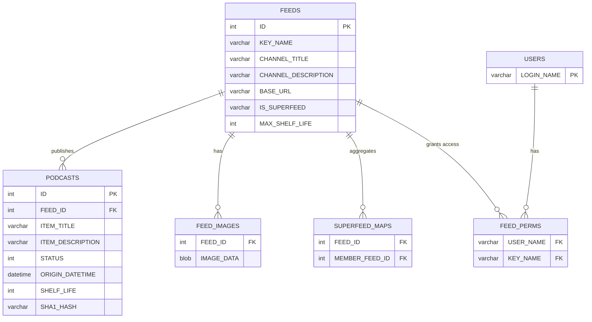
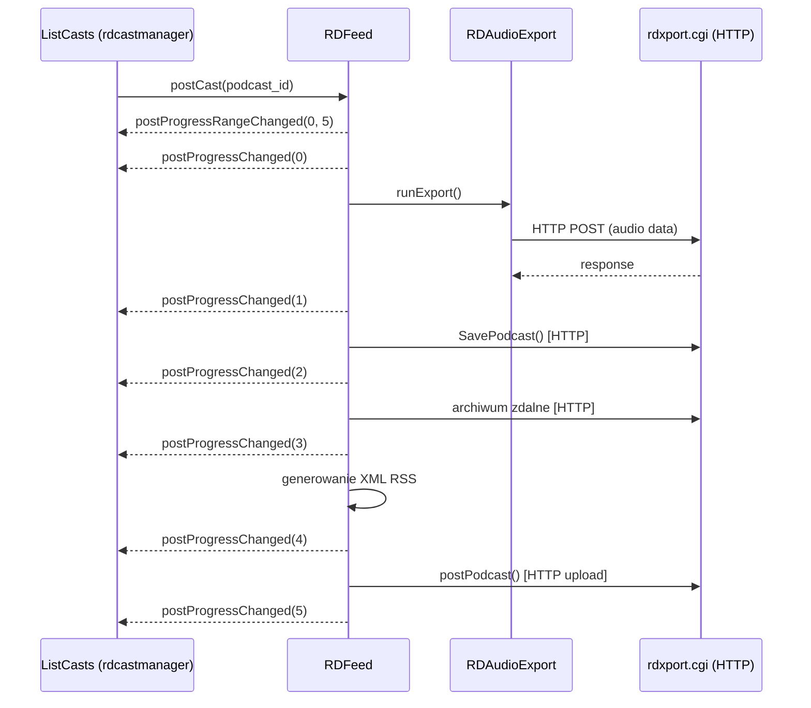
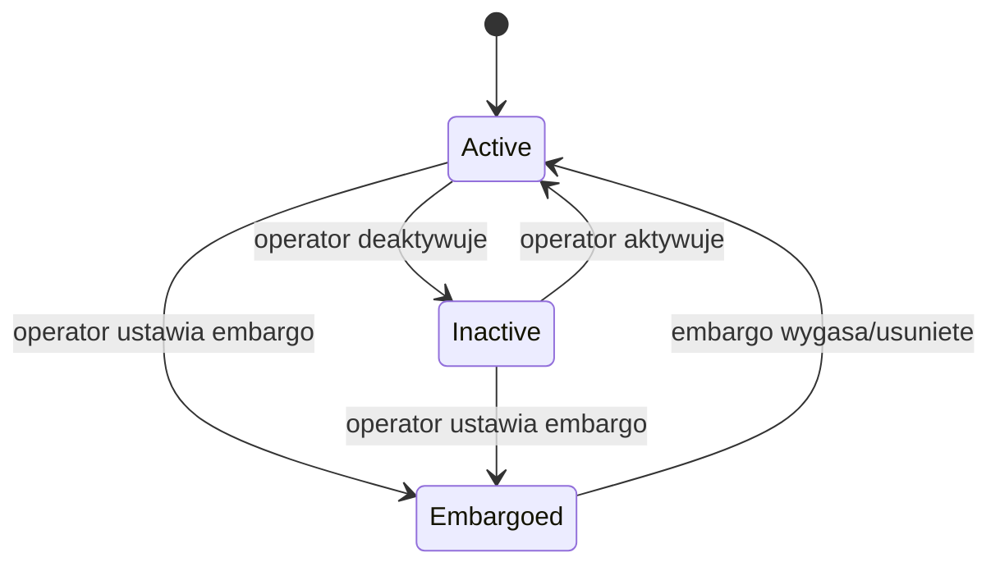

# LIB-009: Podcast & Feed Management

## Kontekst biznesowy

Stacja radiowa publikuje audio jako podcasty dostepne przez RSS. Operator tworzy feedy, postuje epizody (z cartow, plikow lub renderowanych logow), zarzadza ich widocznoscia (aktywne, nieaktywne, embargo) oraz obrazami. System generuje standardowy XML RSS i uploaduje go na zdalny serwer. Superfeedy agreguja epizody z wielu feedow w jeden strumien. Caly pipeline postowania jest 5-krokowy z sygnalami progress, co pozwala UI (rdcastmanager) na wyswietlanie paska postepu.

## Aktorzy

| Aktor | Rola w tej feature |
|-------|-------------------|
| Operator | Postuje epizody, zmienia statusy (Active/Inactive/Embargoed), zarzadza obrazami feedu |
| System (rdxport.cgi) | Obsluguje HTTP POST komendy pipeline: eksport audio, zapis metadanych, upload RSS |
| rdcastmanager (UI) | Wyswietla feedy i epizody, podlacza sie do sygnalow progress — poza scope librd |

## Granica funkcjonalnosci

```
IN SCOPE:
  - Model feedu podcastowego (CRUD na FEEDS)
  - Model epizodu podcastu (CRUD na PODCASTS)
  - Podcast Item State Machine (Active/Inactive/Embargoed)
  - 5-krokowy pipeline postowania (postCut/postFile/postLog)
  - RSS XML generation (rssXml) z RSS schema templates
  - Superfeed aggregation (SUPERFEED_MAPS)
  - Feed image management (push/pop/list na FEED_IMAGES)
  - Feed image validation (QImage::loadFromData)
  - Sygnaly progress (postProgressChanged, postProgressRangeChanged)
  - Feed authorization (FEED_PERMS) — integracja z LIB-002

OUT OF SCOPE:
  - UI feedow i epizodow → artifact CST (rdcastmanager)
  - Administracja feedow w RDAdmin → poza lib/
  - Transport HTTP (libcurl) → patrz LIB-004
  - Audio export engine (RDAudioExport) → patrz LIB-003
  - Renderer (RDRenderer) dla postLog → patrz LIB-006
```

---

## Use Cases

| ID | Aktor | Akcja | Efekt biznesowy | Priorytet |
|----|-------|-------|----------------|-----------|
| UC-014 | Operator | Zarządza feedem podcast | Postowanie cutow/plikow/logow, RSS XML, superfeed | SHOULD |
| UC-014a | Operator | Postuje cut/plik/log jako epizod | 5-krokowy pipeline: export → save → archive → RSS → upload | SHOULD |
| UC-014b | Operator | Zmienia status epizodu | Przelaczenie Active/Inactive/Embargoed, RSS regenerowany | SHOULD |
| UC-014c | Operator | Zarzadza obrazami feedu | Push/pop/list obrazow z walidacja formatu | SHOULD |
| UC-014d | System | Renderuje superfeed | Agreguje epizody z member feedow przez SUPERFEED_MAPS | SHOULD |

---

## Reguly biznesowe (Gherkin)

> Pelne reguly z source references. Z facts.md.

```gherkin
Rule: Superfeed Aggregation

  Scenario: Feed marked as superfeed
    Given IS_SUPERFEED = "Y" in FEEDS table
    When  rendering the feed
    Then  aggregates items from all member feeds in SUPERFEED_MAPS

  # Zrodlo: lib/rdfeed.cpp:112-139 | Pewnosc: potwierdzone

Rule: Feed Image Validation

  Scenario: Pushing valid image to feed
    Given image file provided
    When  QImage::loadFromData succeeds
    Then  image stored in FEED_IMAGES

  Scenario: Pushing invalid image to feed
    Given image file provided
    When  QImage::loadFromData fails
    Then  rejected as "invalid image file"

  # Zrodlo: tests/feed_image_test.cpp::RunPush | Pewnosc: potwierdzone

Rule: Feed Authorization

  Scenario: Checking if user can access a podcast feed
    Given a user and a feed key_name
    When  feedAuthorized() is called
    Then  must exist matching row in FEED_PERMS for user + key_name

  # Zrodlo: lib/rduser.cpp:563-576 | Pewnosc: potwierdzone (kod + doc)

Rule: Podcast Posting Pipeline

  Scenario: Operator posts audio cut to feed
    Given a configured feed with valid RSS schema
    And   operator has feed authorization
    When  postCut() is called
    Then  5-step pipeline executes:
      Step 1: RDAudioExport exports audio [HTTP POST → rdxport.cgi]
      Step 2: SavePodcast() saves metadata [HTTP → rdxport.cgi]
      Step 3: Remote archive [HTTP]
      Step 4: RSS XML generation [local]
      Step 5: postPodcast() uploads RSS [HTTP → rdxport.cgi]
    And   postProgressChanged emitted after each step (0-5)

  # Zrodlo: lib/rdfeed.cpp, call-graph.md | Pewnosc: potwierdzone

Rule: FeedItem Notification

  Scenario: Podcast episode modified
    Given a feed item is created, modified, or deleted
    When  change is committed
    Then  UDP NOTIFY "FeedItem <action> <id>" broadcast on port 20539

  # Zrodlo: lib/rdnotification.cpp:82-120 | Pewnosc: potwierdzone
```

---

## Data Model (tabele DB w scope)

> Z data-model.md — tylko tabele dotyczace tego FEAT.
> Pelny schemat: `data-model.md`

### ERD dla tej feature



### Tabela: FEEDS

| Kolumna | Typ | Null | Opis |
|---------|-----|------|------|
| ID | int PK | NO | Identyfikator feedu |
| KEY_NAME | varchar | NO | Unikalny klucz feedu (uzywany w FEED_PERMS) |
| CHANNEL_TITLE | varchar | YES | Tytul kanalu RSS |
| CHANNEL_DESCRIPTION | varchar | YES | Opis kanalu |
| BASE_URL | varchar | YES | Bazowy URL do publikacji RSS |
| IS_SUPERFEED | varchar | YES | "Y" = agreguje member feeds |
| MAX_SHELF_LIFE | int | YES | Maksymalny czas zycia epizodow (dni) |

### Tabela: PODCASTS

| Kolumna | Typ | Null | Opis |
|---------|-----|------|------|
| ID | int PK | NO | Identyfikator epizodu |
| FEED_ID | int FK→FEEDS | NO | Feed nadrzedny |
| ITEM_TITLE | varchar | YES | Tytul epizodu |
| ITEM_DESCRIPTION | varchar | YES | Opis epizodu |
| STATUS | int | NO | 0=Active, 1=Inactive, 2=Embargoed |
| ORIGIN_DATETIME | datetime | YES | Data publikacji |
| SHELF_LIFE | int | YES | Czas zycia w dniach |
| SHA1_HASH | varchar | YES | Hash pliku audio |

### Tabela: FEED_IMAGES

| Kolumna | Typ | Null | Opis |
|---------|-----|------|------|
| FEED_ID | int FK→FEEDS | NO | Feed wlasciciel |
| IMAGE_DATA | blob | YES | Dane obrazu |

### Tabela: SUPERFEED_MAPS

| Kolumna | Typ | Null | Opis |
|---------|-----|------|------|
| FEED_ID | int FK→FEEDS | NO | Superfeed (parent) |
| MEMBER_FEED_ID | int FK→FEEDS | NO | Member feed (child) |

### Relacje FK

| Zrodlo | Kolumna | → Cel | PK |
|--------|---------|-------|-----|
| PODCASTS | FEED_ID | FEEDS | ID |
| FEED_IMAGES | FEED_ID | FEEDS | ID |
| SUPERFEED_MAPS | FEED_ID | FEEDS | ID |
| SUPERFEED_MAPS | MEMBER_FEED_ID | FEEDS | ID |
| FEED_PERMS | USER_NAME | USERS | LOGIN_NAME |
| FEED_PERMS | KEY_NAME | FEEDS | KEY_NAME |

---

## API klas w scope

> Z inventory.md — pelne sygnatury metod, parametry, efekty.

### RDFeed

**Odpowiedzialnosc:** Podcast/RSS feed management. Handles feed metadata, RSS XML generation, audio content posting (from cuts, files, or rendered logs), image management, and superfeed aggregation.
**Pelny opis:** `inventory.md#RDFeed`

**Publiczne API:**
| Metoda | Parametry | Efekt | Warunki wywolania |
|--------|-----------|-------|------------------|
| postCut() | podcast_id, cut info | Eksportuje audio z cuta, tworzy epizod, upload RSS — 5-krokowy pipeline | Feed skonfigurowany, user autoryzowany |
| postFile() | podcast_id, file path | Eksportuje z pliku, tworzy epizod, upload RSS — 5-krokowy pipeline | Feed skonfigurowany, user autoryzowany |
| postLog() | podcast_id, log info | Renderuje log, tworzy epizod, upload RSS — 5-krokowy pipeline (uzywa RDRenderer) | Feed skonfigurowany, user autoryzowany |
| rssXml() | — | Generuje kompletny dokument RSS XML z filtrowanie itemow i schema templates | Feed istnieje |
| (image push) | image data | Zapisuje obraz do FEED_IMAGES po walidacji QImage | Obraz poprawny |
| (image pop) | — | Usuwa obraz z FEED_IMAGES | Obraz istnieje |

**Sygnaly:**
| Sygnal | Parametry | Znaczenie biznesowe |
|--------|-----------|---------------------|
| postProgressChanged(int) | step (0-5) | Postep pipeline postowania — emitowany po kazdym kroku |
| postProgressRangeChanged(int, int) | min, max (0, 5) | Zakres postepu — emitowany na starcie postowania |

**Zaleznosci:**
- RDAudioExport — eksport audio w kroku 1
- RDRenderer — renderowanie logow w postLog()
- RDRssSchemas — szablony XML (header, channel, item) i constrainty (image sizes, category support)

### RDPodcast

**Odpowiedzialnosc:** Single podcast episode/item. Manages metadata (title, description, author, status, dates) and audio removal from remote store.
**Pelny opis:** `inventory.md#RDPodcast`

**Publiczne API:**
| Metoda | Parametry | Efekt | Warunki wywolania |
|--------|-----------|-------|------------------|
| (status getters/setters) | int status | Odczyt/zapis statusu epizodu (Active/Inactive/Embargoed) | Epizod istnieje |
| (metadata getters/setters) | various | CRUD na polach ITEM_TITLE, ITEM_DESCRIPTION, ORIGIN_DATETIME, SHELF_LIFE | Epizod istnieje |
| (audio removal) | — | Usuwa audio z remote store | Epizod istnieje |

**Enums:**
| Enum | Wartosci | Znaczenie |
|------|----------|-----------|
| Status | Active (0), Inactive (1), Embargoed (2) | Stan widocznosci epizodu dla odbiorcow |

---

## Protokoly komunikacji

> Z SPEC.md Sekcja 9 — komendy uzywane przez klasy w scope.

### RDXport Web API (HTTP POST → /rd-bin/rdxport.cgi)

| Komenda | Parametry | Odpowiedz | Znaczenie |
|---------|-----------|-----------|-----------|
| 37-45 | COMMAND=37..45 | XML response | Podcast operations: GET/SAVE/DELETE/POST/REMOVE PODCAST/RSS/IMAGE |

Pipeline postowania uzywa komend:
- Krok 1: COMMAND=1 (Export audio) via RDAudioExport
- Krok 2: SavePodcast (COMMAND z zakresu 37-45)
- Krok 3: HTTP do zdalnego archiwum
- Krok 5: postPodcast/upload RSS (COMMAND z zakresu 37-45)

### Notification Protocol (UDP 20539)

| Format | Parametry | Znaczenie |
|--------|-----------|-----------|
| NOTIFY FeedItem Add id | type=FeedItem, action=Add | Nowy epizod |
| NOTIFY FeedItem Modify id | type=FeedItem, action=Modify | Zmiana epizodu |
| NOTIFY FeedItem Delete id | type=FeedItem, action=Delete | Usuniecie epizodu |

---

## UI Contracts

Brak bezposrednich UI w librd — UI jest w rdcastmanager (artifact CST). Sygnaly progress podlaczone w rdcastmanager/list_casts.cpp.

**Polaczenia signal-slot z call-graph.md:**

| Sygnal (librd) | Odbierany w | Plik | Linia |
|----------------|-------------|------|-------|
| RDFeed::postProgressChanged(int) | ListCasts (rdcastmanager) | rdcastmanager/list_casts.cpp | 89 |
| RDFeed::postProgressRangeChanged(int,int) | ListCasts (rdcastmanager) | rdcastmanager/list_casts.cpp | 91 |

---

## Sygnaly integracji (z call-graph.md)

### Sequence diagram — Podcast Posting Pipeline



### Podcast Item State Machine



| Stan | Kolor | Znaczenie |
|------|-------|-----------|
| Active | GREEN | Widoczny dla odbiorcow |
| Inactive | RED | Niewidoczny |
| Embargoed | BLUE | Tymczasowo niewidoczny (aktywny ale ukryty) |

**Emitowane (ta feature → inne):**
| Sygnal | Klasa | Odbiorca | Slot | Kontekst |
|--------|-------|----------|------|----------|
| postProgressChanged(int) | RDFeed | ListCasts (rdcastmanager) | (progress slot) | Postep pipeline postowania |
| postProgressRangeChanged(int,int) | RDFeed | ListCasts (rdcastmanager) | (range slot) | Zakres postepu na starcie |

**Odbierane (inne → ta feature):**
| Nadawca | Sygnal | Klasa (tu) | Slot | Kontekst |
|---------|--------|------------|------|----------|
| RDRenderer | lineStarted(int,int) | RDFeed | renderLineStartedData(int,int) | Postep renderowania logu w postLog |
| RDRenderer | progressMessageSent(const QString &) | RDFeed | renderMessage(const QString &) | Wiadomosc postepu renderowania |

---

## Platform Independence

| Funkcja | Oryginal | Klon | Priorytet |
|---------|----------|------|-----------|
| RSS XML generation | Standard XML library | Standard XML library | LOW — already platform-agnostic |
| HTTP posting (libcurl) | libcurl | Standard HTTP client | Covered by LIB-004 |

---

## Configuration (klucze w scope)

| Klucz | Typ | Domyslna | Wplyw na te feature |
|-------|-----|---------|---------------------|
| FEEDS.BASE_URL | varchar | — | Docelowy URL do uploadu RSS |
| FEEDS.MAX_SHELF_LIFE | int | — | Automatyczne wygasanie epizodow |
| FEEDS.IS_SUPERFEED | varchar | "N" | "Y" wlacza agregacje z SUPERFEED_MAPS |

---

## Acceptance Criteria (E2E)

```gherkin
Feature: Podcast & Feed Management

  Scenario: Operator posts audio cut as podcast episode
    Given a configured feed with valid RSS schema
    And   operator has feed authorization (FEED_PERMS)
    When  operator invokes postCut on the feed
    Then  5-step pipeline executes with progress signals 0-5
    And   audio exported via RDXport in feed's configured format
    And   podcast record created in PODCASTS with status Active
    And   RSS XML regenerated with new item
    And   RSS file uploaded to feed's BASE_URL
    And   UDP NOTIFY "FeedItem Add <id>" broadcast

  Scenario: Operator sets embargo on episode
    Given an Active podcast episode
    When  operator sets embargo
    Then  episode STATUS changes to Embargoed (2)
    And   RSS regenerated without the embargoed item
    And   episode color displayed as BLUE in UI

  Scenario: Superfeed aggregation
    Given a feed with IS_SUPERFEED = "Y"
    And   member feeds mapped in SUPERFEED_MAPS
    When  rssXml() is called
    Then  RSS XML includes items from all member feeds

  Scenario: Feed image push with invalid file
    Given an image file that QImage::loadFromData cannot parse
    When  operator pushes image to feed
    Then  rejected with "invalid image file" error

  Scenario: Unauthorized feed access
    Given a user without matching row in FEED_PERMS
    When  feedAuthorized() is called
    Then  access denied
```

---

## Open Questions

Brak otwartych pytan — feature gotowa do implementacji.

---

## Working Packages (wstepny podzial)

| WP | Opis | Zaleznosci |
|----|------|-----------|
| WP-1 | Domain model: RDFeed, RDPodcast, RDRssSchemas | - |
| WP-2 | Data access: FEEDS, PODCASTS, FEED_IMAGES, SUPERFEED_MAPS CRUD | WP-1 |
| WP-3 | Podcast state machine (Active/Inactive/Embargoed transitions) | WP-1 |
| WP-4 | RSS XML generation (rssXml + schema templates + superfeed aggregation) | WP-1, WP-2 |
| WP-5 | Posting pipeline (postCut/postFile/postLog — 5-step with progress signals) | WP-1, WP-2, LIB-003, LIB-004 |
| WP-6 | Feed image management (push/pop/list + QImage validation) | WP-1, WP-2 |
| WP-7 | Integration: feed authorization (FEED_PERMS via LIB-002), notifications (UDP) | WP-1, LIB-002 |
| WP-8 | Tests | WP-1..WP-7 |

*Szacunek wstepny — agent PM moze podzielic inaczej.*
