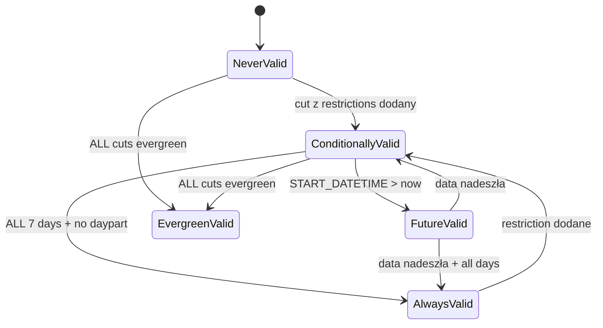
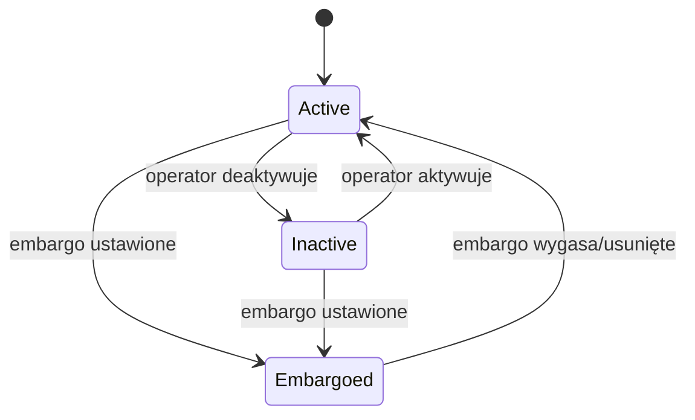
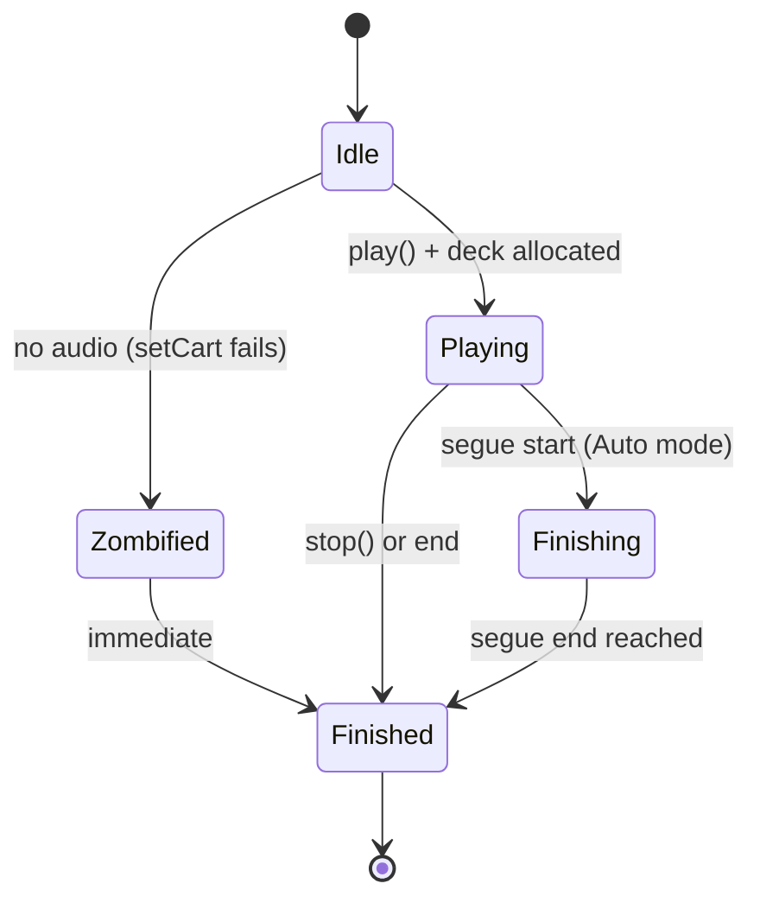

# SPEC: librd
## Behavioral Specification — WHAT without HOW

> Dokument ten opisuje CO system robi i JAKIE MA ZACHOWANIE.
> Jest **nawigacyjnym PRD** — podsumowuje i linkuje do szczegółów w fazach 2-5.
> Agenci kodujący czytają FEAT pliki (Phase 7) które zawierają kompletne dane.

### Źródła szczegółów

| Dokument | Zawiera | Czytaj gdy |
|----------|---------|-----------|
| `inventory.md` | Pełne API klas (193), sygnały, sloty, enums | Potrzebujesz sygnatury metody |
| `data-model.md` | Schemat DB (82 tabele), ERD, mapowanie klasa↔tabela | Potrzebujesz struktury danych |
| `ui-contracts.md` | 43 kontrakty UI, widgety, stany, walidacje | Potrzebujesz detali UI |
| `call-graph.md` | 97 connect(), 78 sygnałów, 4 sequence diagramy | Potrzebujesz grafu zdarzeń |
| `facts.md` | 135 faktów, 40+ reguł Gherkin, 3 state machines | Potrzebujesz reguł z dowodami |

---

## Sekcja 1 — Project Overview

**Czym jest librd:**
Współdzielona biblioteka stanowiąca fundament całego systemu automatyki radiowej Rivendell. Dostarcza model domenowy audio (carty, cuty, logi, feedy), silnik playout, protokoły komunikacyjne z demonami systemowymi, i zestaw komponentów UI wielokrotnego użytku. Każda aplikacja i demon w ekosystemie Rivendell linkuje się z librd.

**Główni aktorzy:**

| Aktor | Rola |
|-------|------|
| Operator radiowy | Zarządza biblioteką audio, importuje/eksportuje pliki, edytuje markery, tworzy logi |
| System (scheduler) | Generuje logi z zegarów, wybiera cuty do odtworzenia, obsługuje rotację |
| System (playout engine) | Odtwarza logi emisyjne w czasie rzeczywistym, zarządza przejściami audio |
| Administrator | Konfiguruje stacje, użytkowników, grupy, uprawnienia |
| Dropbox (automat) | Automatycznie importuje pliki audio z monitorowanych katalogów |

**Kluczowe wartości biznesowe:**
- Centralne repozytorium audio z automatyczną rotacją cutów i schedulingiem
- Playout w czasie rzeczywistym z auto-segue i wielowarstwowym overlapping (do 7 eventów)
- Zarządzanie podcastami (RSS feed, publikacja, superfeed aggregation)
- Pełny model uprawnień (użytkownik → grupa → cart/feed) z dual auth (local/PAM)

---

## Sekcja 2 — Domain Model

### Encje biznesowe

| Encja | Opis | Kluczowe pola | Pełne API |
|-------|------|--------------|-----------|
| Cart | Kontener audio lub makro — atom schedulingu | number (1-999999), type, group, title, artist | `inventory.md#RDCart` |
| Cut | Segment audio w carcie (do 999/cart) | cut_name, length, markery (start/end/segue/talk/hook/fade), validity dates | `inventory.md#RDCut` |
| Log | Playlista emisyjna — uporządkowana lista eventów | name, service, origin_user, scheduled_tracks | `inventory.md#RDLog` |
| LogEvent | Kolekcja linii logu (in-memory) | load/save/validate, bulk DELETE+INSERT | `inventory.md#RDLogEvent` |
| LogLine | Pojedyncze zdarzenie w logu (~100 pól) | type, trans_type, cart/cut, 3-layer pointers | `inventory.md#RDLogLine` |
| Group | Kategoria cartów z zakresem numerów | name, low_cart, high_cart, enforce_range | `inventory.md#RDGroup` |
| User | Konto z 20+ flagami uprawnień | login, dual auth (local/PAM), group perms | `inventory.md#RDUser` |
| Station | Stacja robocza z konfiguracją sprzętu | name, audio_driver, capabilities | `inventory.md#RDStation` |
| Service | Serwis radiowy (stacja/stream) | name, name_template, log generation | `inventory.md#RDSvc` |
| Feed | Podcast RSS feed | key_name, base_url, superfeed support | `inventory.md#RDFeed` |
| Podcast | Epizod podcastu | feed_id, title, status (Active/Inactive/Embargoed) | `inventory.md#RDPodcast` |
| Event | Szablon zdarzenia schedulera | name, sched_group, preposition, timescale | `inventory.md#RDEvent` |
| Clock | Szablon godzinny (24 eventy) | name, event lines | `inventory.md#RDClock` |
| Recording | Zaplanowane nagranie/zdarzenie | station, type, cut_name, start/end time | `inventory.md#RDRecording` |
| Report | Generator raportów (22 formaty) | name, filter station/group/service | `inventory.md#RDReport` |

### Relacje

```
Group 1──────────N Cart        (grupa posiada carty w zakresie numerów)
Cart  1──────────N Cut         (cart zawiera 1-999 cutów)
Service 1────────N Log         (serwis generuje logi per data)
Log   1──────────1 LogEvent    (log ładuje swoją kolekcję linii)
LogEvent 1───────N LogLine     (kolekcja eventów w logu)
Feed  1──────────N Podcast     (feed publikuje epizody)
User  N──────────N Group       (uprawnienia: USER_PERMS)
User  N──────────N Feed        (uprawnienia: FEED_PERMS)
Station 1────────N Recording   (stacja hostuje nagrania)
Station 1────────N Dropbox     (stacja monitoruje katalogi)
```

### Enums

| Enum | Wartości | Znaczenie |
|------|----------|-----------|
| Cart.Type | Audio=1, Macro=2, All=3 | Typ zawartości carta |
| Cart.Validity | NeverValid, ConditionallyValid, FutureValid, AlwaysValid, EvergreenValid | 5-stanowy model dostępności |
| Cart.PlayOrder | Sequence=0, Random=1 | Tryb rotacji cutów |
| LogLine.Type | Cart, Marker, Macro, Chain, Track, MusicLink, TrafficLink | Typ zdarzenia w logu |
| LogLine.TransType | Play, Segue, Stop | Przejście do następnego eventu |
| LogLine.Status | Scheduled, Playing, Finished, Paused | Status runtime |
| PlayDeck.State | Stopped, Playing, Paused, Finished | Stan decku |
| Station.AudioDriver | None, Hpi, Jack, Alsa | Sterownik audio |
| Recording.Type | Recording, Macro, Switch, Playout, Download, Upload | Typ zaplanowanego zdarzenia |

---

## Sekcja 3 — Data Model (schemat DB)

> 82 tabele DB, Active Record pattern. Pełny schemat: `data-model.md`

### Tabela: CART
| Kolumna | Typ | Opis | Mapowanie |
|---------|-----|------|-----------|
| NUMBER | int PK | Numer carta (1-999999) | → Cart.number |
| TYPE | int | 1=Audio, 2=Macro | → Cart.type |
| GROUP_NAME | varchar FK→GROUPS | Grupa właścicielska | → Cart.group |
| TITLE | varchar | Tytuł | → Cart.title |
| ARTIST | varchar | Artysta | → Cart.artist |
| CUT_QUANTITY | int | Liczba cutów | → Cart.cutQuantity |
| FORCED_LENGTH | int | Wymuszona długość (ms) | → Cart.forcedLength |
| LAST_CUT_PLAYED | int | Ostatnio odtworzony cut | → Cart.lastCutPlayed |

### Tabela: CUTS
| Kolumna | Typ | Opis | Mapowanie |
|---------|-----|------|-----------|
| CUT_NAME | varchar PK | Format NNNNNN_NNN | → Cut.cutName |
| CART_NUMBER | int FK→CART | Numer carta | → Cut.cartNumber |
| LENGTH | int | Długość (ms) | → Cut.length |
| WEIGHT | int | Waga rotacji | → Cut.weight |
| START_POINT / END_POINT | int | Markery start/end (ms) | → Cut.startPoint/endPoint |
| SEGUE_START_POINT / SEGUE_END_POINT | int | Markery segue (ms) | → Cut.segueStart/End |
| TALK_START_POINT / TALK_END_POINT | int | Markery talk (ms) | → Cut.talkStart/End |
| EVERGREEN | enum(Y/N) | Czy zawsze dostępny | → Cut.evergreen |
| START_DATETIME / END_DATETIME | datetime | Zakres ważności | → Cut.startDatetime/endDatetime |
| MON..SUN | enum(Y/N) | Dni tygodnia | → Cut.dayOfWeek |
| SHA1_HASH | varchar | Hash audio | → Cut.sha1Hash |

### Tabela: LOGS
| Kolumna | Typ | Opis | Mapowanie |
|---------|-----|------|-----------|
| NAME | varchar PK | Nazwa logu | → Log.name |
| SERVICE | varchar FK→SERVICES | Serwis radiowy | → Log.service |
| ORIGIN_USER | varchar | Kto stworzył | → Log.originUser |
| SCHEDULED_TRACKS / COMPLETED_TRACKS | int | Voice tracks | → Log.scheduledTracks |
| LOCK_DATETIME | datetime | Pessimistic lock | → Log.lockDatetime |

### Tabela: USERS
| Kolumna | Typ | Opis | Mapowanie |
|---------|-----|------|-----------|
| LOGIN_NAME | varchar PK | Login użytkownika | → User.loginName |
| FULL_NAME | varchar | Imię i nazwisko | → User.fullName |
| ENABLE_WEB | enum(Y/N) | Dostęp do Web API | → User.enableWeb |
| ADMIN_CONFIG_PRIV | enum(Y/N) | Uprawnienie admin | → User.adminConfigPriv |
| 20+ priv flags | enum(Y/N) | Flagi uprawnień | → User.*Priv() |

### Tabele konfiguracyjne (per stacja)

| Tabela | Klasa C++ | Zakres |
|--------|-----------|--------|
| RDAIRPLAY | RDAirplayConf | Konfiguracja RDAirPlay |
| RDLIBRARY | RDLibraryConf | Konfiguracja RDLibrary |
| RDLOGEDIT | RDLogeditConf | Konfiguracja RDLogEdit |
| RDCATCH | RDCatchConf | Konfiguracja RDCatch |
| SYSTEM | RDSystem | Ustawienia globalne |
| AUDIO_CARDS / AUDIO_INPUTS / AUDIO_OUTPUTS | RDAudioPort | Porty audio |

### Tabele uprawnień (join tables)

| Tabela | Relacja |
|--------|---------|
| USER_PERMS | USERS ↔ GROUPS |
| FEED_PERMS | USERS ↔ FEEDS |
| AUDIO_PERMS | GROUPS ↔ SERVICES |
| SERVICE_PERMS | STATIONS ↔ SERVICES |

### Relacje FK

```
CART.GROUP_NAME → GROUPS.NAME
CUTS.CART_NUMBER → CART.NUMBER
LOGS.SERVICE → SERVICES.NAME
RECORDINGS.STATION_NAME → STATIONS.NAME
RECORDINGS.CUT_NAME → CUTS.CUT_NAME
PODCASTS.FEED_ID → FEEDS.ID
DROPBOXES.STATION_NAME → STATIONS.NAME
DROPBOXES.GROUP_NAME → GROUPS.NAME
USER_PERMS.LOGIN_NAME → USERS.LOGIN_NAME
USER_PERMS.GROUP_NAME → GROUPS.NAME
FEED_PERMS.USER_NAME → USERS.LOGIN_NAME
FEED_PERMS.KEY_NAME → FEEDS.KEY_NAME
EVENTS.SCHED_GROUP → GROUPS.NAME
```

→ Pełny schemat z ERD Mermaid: `data-model.md`

---

## Sekcja 4 — Functional Capabilities (Use Cases)

| ID | Aktor | Akcja | Efekt biznesowy | Priorytet |
|----|-------|-------|----------------|-----------|
| UC-001 | Operator | Tworzy nową kartę audio | Karta z unikalnym numerem w zakresie grupy | MUST |
| UC-002 | Operator | Importuje plik audio do cuta | Audio zaimportowane (WAV/MP/OGG/FLAC), opcja normalize+autotrim | MUST |
| UC-003 | Operator | Eksportuje audio z cuta | Plik w wybranym formacie (PCM16/MPEG L2/L3/FLAC/OGG) | MUST |
| UC-004 | Operator | Rippuje track z CD | Audio zrippowane, metadane z CDDB/MusicBrainz | SHOULD |
| UC-005 | Operator | Konwertuje audio między formatami | Plik skonwertowany (7 formatów), normalization/timescale | MUST |
| UC-006 | Operator | Ustawia markery audio | 11 typów markerów (Start/End/Talk/Segue/Hook/Fade) na waveformie | MUST |
| UC-007 | System | Wybiera cut do odtworzenia | Cut przechodzi walidację (data/czas/DOW/evergreen) + rotację | MUST |
| UC-008 | System | Odtwarza event z logu | PlayDeck alokowany, audio odtwarzane, PAD update | MUST |
| UC-009 | System | Auto-segue do następnego eventu | Crossfade gdy bieżący event osiąga segue start (tryb Auto) | MUST |
| UC-010 | System | Generuje log z zegarów | 168 slotów (7×24h), clock per godzina, dekonfliktacja | MUST |
| UC-011 | System | Lockuje log do edycji | Pesymistyczny lock z 30s timeout, 15s heartbeat | MUST |
| UC-012 | System | Odświeża log podczas odtwarzania | 4-pass algorithm: mark, purge, add, delete orphans | MUST |
| UC-013 | Operator | Pobiera/wysyła/kasuje plik zdalny | FTP/SFTP/HTTP transfer z credentials | SHOULD |
| UC-014 | Operator | Zarządza feedem podcast | Postowanie cutów/plików/logów, RSS XML, superfeed | SHOULD |
| UC-015 | System | Autentykuje użytkownika | Dual mode: local DB password lub PAM | MUST |
| UC-016 | System | Autoryzuje dostęp do cartu/feedu | GROUP_NAME join z USER_PERMS / FEED_PERMS | MUST |
| UC-017 | System | Wysyła komendę RML | UDP 5858 (echo) / 5859 (fire-and-forget), terminator '!' | MUST |
| UC-018 | System | Emituje PAD update | JSON na TCP 34289: now/next z metadanymi | MUST |
| UC-019 | System | Broadcastuje notyfikację | UDP 20539: "NOTIFY type action id" | MUST |
| UC-020 | Operator | Nagrywa voice track | Auto-tworzenie/kasowanie kart voice track | SHOULD |
| UC-021 | Dropbox | Auto-importuje plik audio | Jednokrotny import do grupy, opcja kasowania źródła | SHOULD |

→ Pełne reguły: `facts.md`

---

## Sekcja 5 — Business Rules (Gherkin)

> Kluczowe reguły definiujące zachowanie systemu.
> Kompletna lista z source references: `facts.md`

```gherkin
Rule: Cut Selection — Validity Window
  Scenario: Selecting a cut for playback
    Given an audio cart with cuts
    When  the system selects the next cut
    Then  only cuts matching ALL conditions are eligible:
          | START_DATETIME <= now <= END_DATETIME (or NULL)
          | START_DAYPART <= time <= END_DAYPART (or NULL)
          | Current day-of-week = "Y"
          | EVERGREEN = "N" (tried first)
          | LENGTH > 0

Rule: Evergreen Fallback
  Scenario: No valid non-evergreen cuts
    Given no cuts pass the validity window
    When  system needs a cut to play
    Then  falls back to EVERGREEN="Y" cuts with LENGTH>0
    And   if no evergreen cuts either, no playback occurs

Rule: Cart Validity — 5-State Model
  Scenario: Computing cart validity from cuts
    Given a cart with cuts
    When  validity computed
    Then  validity = HIGHEST of: NeverValid < ConditionallyValid < FutureValid < AlwaysValid < EvergreenValid

Rule: Cut Rotation — By Weight
  Scenario: Selecting next cut with weighting
    Given cart with "By Weight" mode
    When  selecting next cut
    Then  cut with lowest ratio (LOCAL_COUNTER / WEIGHT) chosen

Rule: User Authentication — Dual Mode
  Scenario: Authenticating a user
    Given localAuthentication() is true → check PASSWORD in USERS table
    Given localAuthentication() is false → delegate to PAM

Rule: Group-Based Cart Authorization
  Scenario: Checking cart access
    Given a user and cart number
    Then  CART.GROUP_NAME must match a row in USER_PERMS

Rule: Segue Auto-Transition
  Scenario: Auto-segue in playout
    Given playing event reaches segue start point
    When  mode = Auto AND next transition = Segue
    Then  next event starts with crossfade

Rule: Log Pessimistic Locking
  Scenario: Acquiring log edit lock
    Given a log to be edited
    Then  atomic SQL UPDATE with condition: LOCK_DATETIME null OR expired (>30s)
    And   heartbeat refreshes every 15s

Rule: Log Refresh — 4-Pass Algorithm
  Scenario: Live log update from DB
    Given a log is playing and new version available
    Then  Pass 1: Mark matching events old↔new
    Then  Pass 2: Purge removed (preserve playing)
    Then  Pass 3: Add new (after holdovers)
    Then  Pass 4: Delete orphaned finished

Rule: Timescale Speed Range
  Scenario: Adjusting playback speed
    Given timescale ratio calculated
    When  speed < 0.833 OR > 1.250
    Then  timescale reset to 1.0 (no scaling)
```

---

## Sekcja 6 — State Machines

### Cart Validity State Machine



| Przejście | Trigger | Efekt (UI kolor) |
|-----------|---------|------------------|
| NeverValid → ConditionallyValid | Cut dodany z LENGTH>0 i restrictions | RED |
| ConditionallyValid → AlwaysValid | Wszystkie 7 dni + brak daypart | NO COLOR |
| ConditionallyValid → FutureValid | START_DATETIME w przyszłości | CYAN |
| * → EvergreenValid | Wszystkie cuty evergreen | GREEN |

### Podcast Item State Machine



| Stan | Kolor | Znaczenie |
|------|-------|-----------|
| Active | GREEN | Widoczny dla odbiorców |
| Inactive | RED | Niewidoczny |
| Embargoed | BLUE | Tymczasowo niewidoczny |

### Log Event Playback State Machine



→ Pełne przejścia z source references: `facts.md#Stany encji`

---

## Sekcja 7 — Reactive Architecture

### Kluczowe przepływy zdarzeń

**Przepływ: Audio Playback (log player)**
```
[RDLogPlay] decyzja o odtworzeniu
    → RDPlayDeck::play() → RDCae::play() [TCP → caed]
    ← caed potwierdza → RDPlayDeck::stateChanged(Playing)
    → RDLogPlay emituje played(), aktualizuje PAD [Unix → rdpadd]
    [co 50ms] pozycja audio propagowana → UI
    [segue point] → automatyczny start następnego eventu
```

**Przepływ: Makro RML**
```
[RDLogPlay] event typu Macro
    → RDMacroEvent::exec() → RDRipc::sendRml() [TCP → ripcd]
    → ripcd rozsyła RML do docelowych stacji
    → RDMacroEvent::finished() → cleanup
```

**Przepływ: Zmiana użytkownika**
```
[ripcd] → RDRipc::userChanged() → RDApplication::userChangedData()
    → aktualizacja sesji → emit userChanged()
    → aplikacje odświeżają uprawnienia i widok
```

**Przepływ: Sound Panel klik**
```
[Operator] klik → RDSoundPanel::buttonMapperData()
    → RDPlayDeck::play() → RDCae → caed
    → przycisk zmienia stan, countdown timer startuje
```

**Przepływ: Podcast posting**
```
[RDFeed::postCut()] 5-krokowy pipeline:
    1. RDAudioExport [HTTP] → 2. SavePodcast [HTTP]
    → 3. archiwum zdalne → 4. RSS XML generation
    → 5. upload [HTTP] → progress updates na każdym kroku
```

### Cross-artifact komunikacja

| Źródło | Zdarzenie | Cel | Mechanizm | Efekt |
|--------|-----------|-----|-----------|-------|
| librd (RDCae) | PL/SP/LP/... | caed | TCP 5005 | Audio playback/recording |
| librd (RDRipc) | MS/ME/SU/... | ripcd | TCP 5006 | RML dispatch, GPIO, user mgmt |
| librd (RDCatchConnect) | RE/SR/MN/... | rdcatchd | TCP 6006 | Scheduled event control |
| librd (RDLogPlay) | Now/Next JSON | rdpadd | Unix socket | PAD data delivery |
| librd (RDMulticaster) | NOTIFY | LAN | UDP 20539 | Inter-station notifications |
| librd (RDAudio*) | COMMAND=N | rdxport.cgi | HTTP POST | Audio import/export/info |
| librd (RDRipc) | RML | stacje | UDP 5858/5859 | Macro Language commands |

→ Pełny graf: `call-graph.md`

---

## Sekcja 8 — UI/UX Contracts

> 43 komponenty UI: 24 dialogi, 7 widgetów, 12 kontrolek. Tryb B (Code-first).

### RDCartDialog — wybór carta z biblioteki
Modalny dialog z filtrowaniem po grupie, scheduler code i tekście. Lista cartów z 13 kolumnami, embedded player do odsłuchu, możliwość importu z pliku.
- **Kontrakt:** `ui-contracts.md#RDCartDialog`
- **Features:** LIB-xxx (cart management)

### RDCutDialog — wybór cuta
Modalny dialog z dwupanelowym widokiem (carty + cuty wybranego carta). Filtrowanie, voice track exclusion.
- **Kontrakt:** `ui-contracts.md#RDCutDialog`

### RDEditAudio — edytor markerów audio
Zaawansowany edytor z wizualizacją waveformu, 11 typów markerów (Start/End/Talk/Segue/Hook/Fade), zoom, playback z looping.
- **Kontrakt:** `ui-contracts.md#RDEditAudio`

### RDImportAudio — import/eksport audio
Dialog importu/eksportu z wyborem pliku, normalizacją, autotrim, konfiguracja kanałów.
- **Kontrakt:** `ui-contracts.md#RDImportAudio`

### RDSoundPanel — panel dźwiękowy
Grid programowalnych przycisków odtwarzających carty audio/macro. Selector paneli, play mode switching, konfiguracja przycisków.
- **Kontrakt:** `ui-contracts.md#RDSoundPanel`

### RDCartSlot — slot carta
Widget slotu carta z trybami standard/breakaway, load/unload/play/pause/stop, drag-and-drop.
- **Kontrakt:** `ui-contracts.md#RDCartSlot`

### RDCueEdit — edytor cue pointów
Widget z suwakiem pozycji, kontrolkami audycji, edycja markerów start/end.
- **Kontrakt:** `ui-contracts.md#RDCueEdit`

### RDWaveDataDialog — edycja etykiety carta
Dialog edycji metadanych carta (title, artist, album, composer, etc.).
- **Kontrakt:** `ui-contracts.md#RDWaveDataDialog`

### RDSchedCodesDialog — kody schedulera
Dialog wyboru scheduler codes przypisanych do carta.
- **Kontrakt:** `ui-contracts.md#RDSchedCodesDialog`

### RDListLogs — wybór logu
Dialog wyboru logu z filtrowaniem po serwisie i tekście.
- **Kontrakt:** `ui-contracts.md#RDListLogs`

### RDDiscLookup / RDCddbLookup / RDMbLookup — lookup CD
Dialogi wyszukiwania metadanych CD (CDDB protocol, MusicBrainz API).
- **Kontrakt:** `ui-contracts.md#RDDiscLookup`

### Pozostałe dialogi (13)
RDAddCart, RDAddLog, RDGetPasswd, RDPasswd, RDGetAth, RDEditPanelName, RDButtonDialog, RDExportSettingsDialog, RDDateDialog, RDCueEditDialog, RDBusyDialog, RDListGroups, RDListSvcs — proste formularze, selektory, busy indicators.

### Kontrolki wielokrotnego użytku (12)
RDStereoMeter (level meter), RDSegMeter, RDSimplePlayer (play/stop), RDTimeEdit, RDTransportButton, RDPanelButton, RDPushButton (flash), RDComboBox, RDLogFilter (SQL WHERE generator), RDCardSelector, RDListSelector (dual-list), RDGpioSelector.

→ Pełna dokumentacja UI: `ui-contracts.md`

---

## Sekcja 9 — API & Protocol Contracts

### CAE Protocol (TCP 5005 → caed)

Tekstowy protokół, komendy terminowane '!', odpowiedzi z '+' (sukces) lub '-' (błąd).

| Komenda | Parametry | Odpowiedź | Znaczenie |
|---------|-----------|-----------|-----------|
| PW | password | PW +/- | Autentykacja |
| LP | card name | LP card name stream handle +/- | Load for playback |
| UP | handle | UP handle +/- | Unload playback |
| PP | handle pos | PP handle pos +/- | Position play |
| PY | handle length speed pitch | PY handle +/- | Start playback |
| SP | handle | SP handle +/- | Stop playback |
| LR | card stream coding chan srate brate name | LR ... +/- | Load for recording |
| UR | card stream | UR card stream len +/- | Unload recording |
| RD | card stream length threshold | — | Start recording |
| SR | card stream | SR card stream +/- | Stop recording |
| TS | card | TS card +/- | Query timescale support |
| IS | card port | IS card port 0/1 | Query input status |
| CS | card source | — | Set clock source |
| IV | card stream level | — | Set input volume |
| OV | card stream port level | — | Set output volume |
| FV | card stream port level length | — | Fade output volume |
| IL | card port level | — | Set input level |
| OL | card port level | — | Set output level |
| IM | card stream mode | — | Set input channel mode |
| OM | card stream mode | — | Set output channel mode |
| IX | card stream level | — | Set input VOX level |
| IT | card port type | — | Set input type |
| AL | card in_port out_port level | — | Set passthrough volume |
| ME | udp_port card [card...] | — | Enable metering on UDP port |

**Metering (UDP):**

| Komenda | Format | Znaczenie |
|---------|--------|-----------|
| ML | ML I/O card port left right | Meter levels (input/output) |
| MO | MO card stream left right | Output stream levels |
| MP | MP card stream pos | Play position |

### RIPC Protocol (TCP 5006 → ripcd)

| Komenda | Parametry | Odpowiedź | Znaczenie |
|---------|-----------|-----------|-----------|
| PW | password | PW +/- | Autentykacja |
| RU | — | RU username | Request/receive user identity |
| SU | user | — | Set user |
| MS | addr port rml | — | Send RML command |
| ME | addr port rml | — | Send RML reply |
| GI | matrix | GI matrix line state mask | Query/receive GPI state |
| GO | matrix | GO matrix line state mask | Query/receive GPO state |
| GM | matrix | GM matrix line state | GPI mask query/change |
| GN | matrix | GN matrix line state | GPO mask query/change |
| GC | matrix | GC matrix line off_cart on_cart | GPI cart query/change |
| GD | matrix | GD matrix line off_cart on_cart | GPO cart query/change |
| TA | flag | TA flag | Set/receive on-air flag |
| ON | type action id | ON type action id | Send/receive notification |
| RH | — | — | Reload heartbeat |

### Catch Protocol (TCP 6006 → rdcatchd)

| Komenda | Parametry | Odpowiedź | Znaczenie |
|---------|-----------|-----------|-----------|
| PW | password | PW +/- | Autentykacja |
| RE | 0 | RE chan status id name | Refresh/receive channel status |
| RM | state | RM deck channel level | Set/receive metering |
| SR | deck | — | Stop deck |
| MN | deck state | MN deck state | Monitor on/off |
| SC | id code msg | — | Set exit code |
| RD | — | — | Reload events |
| RS | — | — | Reset |
| RH | — | — | Reload heartbeat |
| RX | — | — | Reload dropboxes |
| RO | — | — | Reload time offset |
| HB | — | HB | Heartbeat |
| DE | — | DE deck number | Deck event notification |
| RU | — | RU id | Update event |
| PE | — | PE id | Purge event |

### RDXport Web API (HTTP POST → /rd-bin/rdxport.cgi)

| COMMAND | Operacja | Parametry kluczowe |
|---------|----------|-------------------|
| 1 | Export audio | CART_NUMBER, CUT_NUMBER, FORMAT |
| 2 | Import audio | CART_NUMBER, CUT_NUMBER + multipart file |
| 3 | Delete audio | CART_NUMBER, CUT_NUMBER |
| 6 | List carts | GROUP_NAME, FILTER |
| 7 | List cart | CART_NUMBER |
| 9 | List cuts | CART_NUMBER |
| 10 | Add cut | CART_NUMBER |
| 11 | Remove cut | CART_NUMBER, CUT_NUMBER |
| 12 | Add cart | GROUP_NAME, TYPE |
| 13 | Remove cart | CART_NUMBER |
| 14 | Edit cart | CART_NUMBER + fields |
| 15 | Edit cut | CART_NUMBER, CUT_NUMBER + fields |
| 16 | Export peaks | CART_NUMBER, CUT_NUMBER |
| 17 | Trim audio | CART_NUMBER, CUT_NUMBER, TRIM_LEVEL |
| 18 | Copy audio | SOURCE_CART/CUT, DEST_CART/CUT |
| 19 | Audio info | CART_NUMBER, CUT_NUMBER |
| 23 | Audio store | (free/total space) |
| 28-30 | Log ops | SAVE_LOG, ADD_LOG, DELETE_LOG |
| 31 | Create ticket | LOGIN_NAME, PASSWORD → TICKET |
| 32 | Rehash | CART_NUMBER, CUT_NUMBER |
| 37-45 | Podcast ops | GET/SAVE/DELETE/POST/REMOVE PODCAST/RSS/IMAGE |

### Notification Protocol (UDP 20539 → broadcast)

| Format | Parametry | Znaczenie |
|--------|-----------|-----------|
| NOTIFY | type action id | Inter-station state change broadcast |
| Types | Cart, Log, Pypad, Dropbox, CatchEvent, FeedItem | Encja zmieniona |
| Actions | Add, Delete, Modify | Typ zmiany |

### RML Protocol (UDP 5858/5859)

| Port | Zachowanie |
|------|-----------|
| 5858 | Echo — ACK(+)/NAK(-) reply na 5860 |
| 5859 | Fire-and-forget |
| Format | `cmd [arg] [...]!` — terminator '!' (ASCII 33) |
| Escape | `%hexcode` (np. %0D%0A) |
| Max length | 2048 bytes |

---

## Sekcja 10 — Data Flow

```
[rd.conf / MySQL] → [RDConfig + Active Record models] → [Business Logic (Cae/Ripc/LogPlay)]
    → [UI Widgets / Dialogs] → [Operator]

[MySQL DB] ←→ [Active Record (RDCart, RDCut, RDLog...)] ←→ [Playout Engine]
    → [TCP/UDP protocols] → [caed, ripcd, rdcatchd, rdpadd]
    → [HTTP/RDXport] → [Remote audio store]
```

| Transformacja | Od | Do | Co się zmienia |
|--------------|----|----|----------------|
| Load cart metadata | DB (CART, CUTS) | RDCart/RDCut in-memory | SQL → obiekty z rotacją i walidacją |
| Cut selection | RDCart | selected CUT_NAME | Filtracja po dacie/czasie/DOW + rotacja weight/order |
| Log generation | RDSvc + Clocks + Events | LOG_LINES w DB | 168 slotów → sekwencja eventów z dekonfliktacją |
| Log load | LOG_LINES DB | RDLogEvent in-memory | SQL → uporządkowana lista RDLogLine |
| Playout | RDLogPlay + RDPlayDeck | TCP commands → caed | Logika przejść → komendy audio |
| PAD update | RDLogPlay | JSON → rdpadd | Now/Next metadata z bieżącego logu |
| Audio transfer | RDAudio* | HTTP → rdxport.cgi | Import/export/info przez Web API |

---

## Sekcja 11 — Error Taxonomy

| Kod/Typ | Kategoria | Co wywołuje | Zachowanie | Komunikat |
|---------|-----------|-------------|-----------|-----------|
| Missing audio | Playback | setCart() fails — brak pliku audio | Event "zombified" → Finished natychmiast | LOG_WARNING |
| No free deck | Playback | Brak wolnego PlayDeck (max 7) | Odtworzenie niemożliwe | (silent skip) |
| Lock conflict | Log editing | Inny user trzyma lock (< 30s) | Edycja odrzucona | "Log locked by {user}" |
| Auth failure | Security | Złe hasło (local) lub PAM reject | Odmowa logowania | (auth-specific) |
| Cart range violation | Cart mgmt | Numer poza zakresem grupy | Odrzucenie tworzenia | "Cart out of range" |
| Import invalid | Audio import | cart_number > 999999 OR norm_level > 0 | Odrzucenie | "invalid" |
| Export Pcm24 | Audio export | Format Pcm24 nie wspierany w eksporcie | Odrzucenie | "invalid destination format" |
| URL invalid | File transfer | Relative URL lub unsupported scheme | Odrzucenie | "URL's must be fully qualified" |
| Bitrate+Quality | Conversion | Oba parametry ustawione jednocześnie | Odrzucenie | "mutually exclusive" |
| Truncated WAV | File parse | Plik < 12 bajtów | Abort | "truncated" |
| Heartbeat fail | Network | Brak HB od rdcatchd w timeout | emit heartbeatFailed() | (reconnect) |

---

## Sekcja 12 — Integration Contracts

### Cross-artifact

| Artifact | Mechanizm | Kierunek | Kontrakt |
|----------|-----------|---------|---------|
| caed (CAE) | TCP 5005 (text protocol) | bidirectional | RDCae ↔ caed: PL/SP/LP/PY/LR/RD/SR + metering UDP |
| ripcd (RPC) | TCP 5006 (text protocol) | bidirectional | RDRipc ↔ ripcd: RU/SU/MS/GI/GO/TA/ON |
| rdcatchd (CTD) | TCP 6006 (text protocol) | bidirectional | RDCatchConnect ↔ rdcatchd: RE/SR/MN/RD |
| rdpadd (PAD) | Unix domain socket | outbound | RDLogPlay → rdpadd: Now/Next JSON |
| rdxport.cgi (WEB) | HTTP POST | outbound | RDAudio*/RDFeed → rdxport: COMMAND=N |
| Wszystkie apps | @LIB_RDLIBS@ link | inbound | Każda app linkuje librd |

### Zewnętrzne systemy

| System | Rola | Protokół | Dane |
|--------|------|----------|------|
| MySQL/MariaDB | Persistent storage | SQL (QtSql) | 82 tabel — cały model domenowy |
| CDDB (FreeDB) | Metadane CD | TCP | DiscID → artist/title/tracks |
| MusicBrainz | Metadane CD | HTTP/XML | DiscID → rich metadata, cover art |
| libcurl destinations | File transfer | FTP/SFTP/HTTP/FTPS | Audio files, podcast media |
| Axia LiveWire nodes | Audio routing | TCP (LWRP protocol) | Source/destination config, GPIO |
| PAM | Authentication | System API | User credential verification |

---

## Sekcja 13 — Platform Independence Map

| Funkcja | Oryginał | Klon (sugestia) | Priorytet |
|---------|----------|-----------------|-----------|
| Audio playback/recording | ALSA/JACK/HPI via caed TCP | Web Audio API / platform audio | CRITICAL |
| Database | MySQL via QtSql | PostgreSQL / SQLite / any RDBMS | CRITICAL |
| TCP text protocols | Custom text protocol '!' terminated | gRPC / WebSocket / REST | HIGH |
| Audio codecs | libmad/lame/twolame/vorbis/flac (dlopen) | ffmpeg / Web Codec API | HIGH |
| CD ripping | cdparanoia + kernel ioctl | (deprecate or USB audio import) | LOW |
| File transfer | libcurl (FTP/SFTP/HTTP) | Standard HTTP client | HIGH |
| Unix sockets | SOCK_STREAM (PAD) | WebSocket / named pipe | MEDIUM |
| UDP broadcast | Raw UDP 20539 | Message queue / WebSocket pub-sub | MEDIUM |
| PAM auth | libpam | OAuth2 / LDAP / OIDC | HIGH |
| GPIO | /dev/gpio, kernel ioctl | (platform-specific or USB I/O) | MEDIUM |
| DPI-aware fonts | RDFontEngine (manual DPI calc) | CSS / system font scaling | LOW |
| Qt3 widgets | Q3ListView, Q3TimeEdit, Q3Url | Modern framework equivalents | LOW |

---

## Sekcja 14 — Non-Functional Requirements

```gherkin
Scenario: Simultaneous playback capacity
  Given a log machine with active playout
  When  7 events overlap simultaneously
  Then  all 7 play without dropout or priority conflict

Scenario: Log refresh without interruption
  Given a log is actively playing
  When  a new version of the log is available in DB
  Then  4-pass merge completes without interrupting current playback
  And   holdover events preserved at top

Scenario: Position update latency
  Given audio is playing on a PlayDeck
  When  position changes
  Then  UI receives position update within 100ms (50ms timer + propagation)

Scenario: Database heartbeat
  Given application connected to MySQL
  When  360 seconds pass without query
  Then  heartbeat SELECT keeps connection alive

Scenario: Web session timeout
  Given a Web API ticket created
  When  900 seconds (15 min) pass without activity
  Then  ticket expires and requires re-authentication

Scenario: File transfer timeout
  Given a curl-based transfer in progress
  When  1200 seconds (20 min) pass
  Then  transfer times out and reports error
```

---

## Sekcja 15 — Configuration

### rd.conf (plik INI via RDProfile)

| Klucz | Typ | Domyślna | Opis |
|-------|-----|---------|------|
| [Identity]/AudioRoot | string | (config) | Root katalog plików audio |
| [Identity]/AudioExtension | string | (config) | Rozszerzenie plików audio |
| [Identity]/Label | string | "Default Configuration" | Etykieta konfiguracji |
| [mySQL]/Hostname | string | "localhost" | Host bazy danych |
| [mySQL]/Database | string | "Rivendell" | Nazwa bazy |
| [mySQL]/Loginname | string | "rduser" | Użytkownik bazy |
| [mySQL]/Password | string | "letmein" | Hasło bazy |
| [Fonts]/Family | string | (system) | Rodzina czcionki UI |
| [Fonts]/ButtonSize | int | (default) | Rozmiar czcionki przycisków |
| [AudioStore]/MountSource | string | (none) | Źródło montowania audio |
| [AudioStore]/MountType | string | (none) | Typ montowania (NFS, etc.) |
| [AudioStore]/MountOptions | string | "defaults" | Opcje montowania |

### SYSTEM table (globalne)

| Klucz | Typ | Domyślna | Opis |
|-------|-----|---------|------|
| SAMPLE_RATE | int | 48000 | Systemowa częstotliwość próbkowania |
| DUP_CART_TITLES | bool | — | Czy dozwolone duplikaty tytułów |
| FIX_DUP_CART_TITLES | bool | — | Auto-fix duplikatów (" [N]" suffix) |
| ISCI_XREFERENCE_PATH | string | — | Ścieżka cross-reference ISCI |
| MAX_POST_LENGTH | int | — | Max rozmiar POST dla Web API |
| TEMP_CART_GROUP | string | — | Grupa dla tymczasowych cartów |

### System Limits (rd.h constants)

| Limit | Wartość | Opis |
|-------|---------|------|
| Max cart number | 999999 | RD_MAX_CART_NUMBER |
| Max cuts/cart | 999 | RD_MAX_CUT_NUMBER |
| Max audio cards | 24 | RD_MAX_CARDS |
| Max streams | 48 | RD_MAX_STREAMS |
| Max ports | 24 | RD_MAX_PORTS |
| Max panels | 50 | MAX_PANELS |
| Max panel buttons | 20×20 | MAX_BUTTON_COLUMNS × MAX_BUTTON_ROWS |
| Max simultaneous plays | 7 | LOGPLAY_MAX_PLAYS |
| Timescale range | 0.833–1.250 | RD_TIMESCALE_MIN/MAX |
| Fade depth | -30 dB | RD_FADE_DEPTH |
| Log lock timeout | 30s | RD_LOG_LOCK_TIMEOUT |
| DB heartbeat | 360s | Configured interval |
| RML max length | 2048 bytes | RD_RML_MAX_LENGTH |
| DB schema version | 347 | RD_VERSION_DATABASE |

---

## Sekcja 16 — E2E Acceptance Scenarios

```gherkin
Feature: Cart Management and Playback
  Scenario: Operator creates cart, imports audio, and plays it
    Given operator is authenticated with library access
    And   group "MUSIC" has free cart numbers in range 100000-199999
    When  operator creates a new audio cart in group "MUSIC"
    Then  system assigns next free number in range
    When  operator imports a WAV file into the cart's first cut
    Then  audio is stored, LENGTH computed, SHA1 hash generated
    When  operator sets Start/End/Segue markers in RDEditAudio
    Then  markers are saved to CUTS table
    When  the cart is scheduled in a log and log machine plays it
    Then  audio plays from Start to End marker
    And   segue transition triggers at SegueStart point
    And   PAD update is sent with cart title and artist

Feature: Log Generation and Playout
  Scenario: System generates log from service clocks and plays it
    Given service "STATION1" has a complete weekly clock grid (168 slots)
    And   each clock has events with scheduler groups
    When  system generates log for tomorrow's date
    Then  log created with events from clocks, deconflicted by title_sep/artist_sep
    When  log machine loads the generated log
    Then  events appear in sequence with correct time types (Hard/Relative)
    When  playout starts in Automatic mode
    Then  events chain automatically via segue transitions
    And   hard-time events wait for their scheduled time
    When  traffic department updates the log in DB
    Then  4-pass refresh merges changes without stopping current playback

Feature: Podcast Publishing
  Scenario: Operator posts audio cut as podcast episode
    Given a configured feed with valid RSS schema
    And   operator has feed authorization
    When  operator posts a cart/cut to the feed
    Then  audio is exported via RDXport in feed's configured format
    And   podcast record created in PODCASTS table with status Active
    And   RSS XML regenerated with new item
    And   RSS file uploaded to feed's base URL
    When  operator sets embargo on the episode
    Then  episode status changes to Embargoed (BLUE)
    And   RSS regenerated without the embargoed item
```

---

## Assumptions & Open Questions

| # | Założenie | Alternatywa | Wpływ |
|---|-----------|-------------|-------|
| 1 | M4A/AAC format jest eksperymentalny (zdefiniowany w kodzie, brak w docs) | Może być w pełni wspierany w nowszych wersjach | Niski — nie blokuje klonowania |
| 2 | Dayparting wpływa TYLKO na moduł on-air — w innych kontekstach cut zawsze gra | Logika kontekstu on-air jest w aplikacjach, nie w librd | Średni — klon musi zdecydować gdzie enforcować |
| 3 | "Transmit Now & Next" (Group) jest DEPRECATED | Pole w DB, brak kodu obsługi | Niski — pominąć w klonie |
| 4 | Log tables są dynamicznie tworzone (LOG_NAME_LOG) | Alternatywa: jedna tabela LOG_LINES z FK | Wysoki — klon powinien użyć jednej tabeli |

---

*SPEC wygenerowany przez Qt Reverse Engineering Multi-Agent System v1.3.0*
*Źródła: inventory.md + data-model.md + ui-contracts.md + call-graph.md + facts.md + kod źródłowy (rdcae.cpp, rdripc.cpp, rdcatch_connect.cpp, rdxport_interface.h)*
