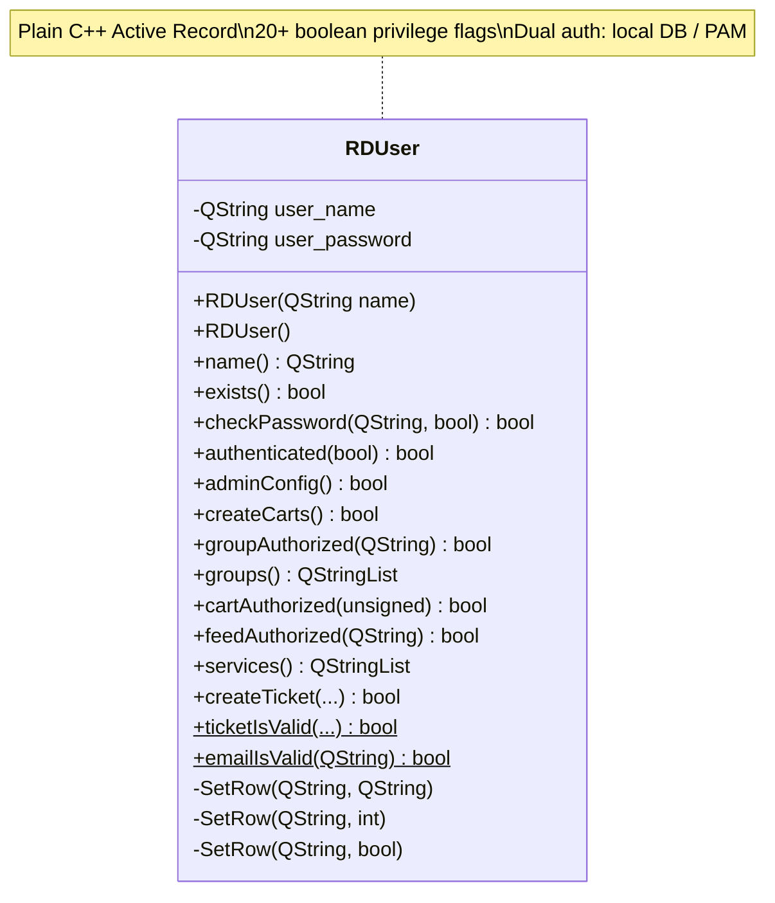

# inv-007 — RDUser

## Identyfikacja
| Pole | Wartość |
|------|---------|
| Klasa | `RDUser` |
| Header | `lib/rduser.h` |
| Source | `lib/rduser.cpp` |
| Typ | Plain C++ Active Record (nie-QObject) |
| Tabela DB (primary) | `USERS` |
| Klucz główny | `LOGIN_NAME` (QString) |

## Opis
Model użytkownika systemu Rivendell. Reprezentuje konto z profilem (nazwa, email, telefon), hasłem,
uprawnieniami (ponad 20 flag boolean) oraz przypisaniem do grup. Obsługuje dwa tryby uwierzytelniania:
lokalne (hasło w DB) i PAM (zewnętrzna usługa). Zarządza także ticketami Web API.

## Konstruktory
| Sygnatura | Zachowanie |
|-----------|------------|
| `RDUser(const QString &name)` | Tworzy instancję powiązaną z użytkownikiem o podanej nazwie (login) |
| `RDUser()` | Tworzy pustą instancję (user_name = "") |

## Pola prywatne
| Pole | Typ | Rola |
|------|-----|------|
| `user_name` | `QString` | Login użytkownika (klucz do tabeli USERS) |
| `user_password` | `QString` | Hasło tymczasowo przechowywane w pamięci (do weryfikacji) |

## Metody — Profil użytkownika (getter/setter -> DB column)

Wzorzec Active Record: getter czyta z DB przez `RDGetSqlValue("USERS","LOGIN_NAME",user_name,COLUMN)`,
setter zapisuje przez `SetRow(COLUMN, value)`.

| Getter | Setter | Typ | DB Column |
|--------|--------|-----|-----------|
| `name()` | `setName(QString)` | QString | `LOGIN_NAME` |
| `password()` | `setPassword(QString)` | QString | `PASSWORD` |
| `enableWeb()` | `setEnableWeb(bool)` | bool | `ENABLE_WEB` |
| `localAuthentication()` | `setLocalAuthentication(bool)` | bool | `LOCAL_AUTH` |
| `pamService()` | `setPamService(QString)` | QString | `PAM_SERVICE` |
| `fullName()` | `setFullName(QString)` | QString | `FULL_NAME` |
| `emailAddress()` | `setEmailAddress(QString)` | QString | `EMAIL_ADDRESS` |
| `description()` | `setDescription(QString)` | QString | `DESCRIPTION` |
| `phone()` | `setPhone(QString)` | QString | `PHONE_NUMBER` |
| `webapiAuthTimeout()` | `setWebapiAuthTimeout(int)` | int | `WEBAPI_AUTH_TIMEOUT` |

## Metody — Uprawnienia (boolean privilege flags)

Wszystkie uprawnienia to pary getter/setter mapowane na kolumny USERS tabeli.
Wzorzec: getter = `RDBool(RDGetSqlValue("USERS",...,"COLUMN_PRIV"))`, setter = `SetRow("COLUMN_PRIV", bool)`.

| Getter | DB Column | Domena |
|--------|-----------|--------|
| `adminConfig()` | `ADMIN_CONFIG_PRIV` | Konfiguracja systemu |
| `adminRss()` | `ADMIN_RSS_PRIV` | Zarządzanie RSS |
| `createCarts()` | `CREATE_CARTS_PRIV` | Tworzenie cartów |
| `deleteCarts()` | `DELETE_CARTS_PRIV` | Usuwanie cartów |
| `modifyCarts()` | `MODIFY_CARTS_PRIV` | Modyfikacja cartów |
| `editAudio()` | `EDIT_AUDIO_PRIV` | Edycja audio |
| `webgetLogin()` | `WEBGET_LOGIN_PRIV` | Logowanie Webget |
| `createLog()` | `CREATE_LOG_PRIV` | Tworzenie logów |
| `deleteLog()` | `DELETE_LOG_PRIV` | Usuwanie logów |
| `deleteRec()` | `DELETE_REC_PRIV` | Usuwanie nagrań |
| `playoutLog()` | `PLAYOUT_LOG_PRIV` | Odtwarzanie logów |
| `arrangeLog()` | `ARRANGE_LOG_PRIV` | Układanie logów |
| `addtoLog()` | `ADDTO_LOG_PRIV` | Dodawanie do logów |
| `removefromLog()` | `REMOVEFROM_LOG_PRIV` | Usuwanie z logów |
| `configPanels()` | `CONFIG_PANELS_PRIV` | Konfiguracja paneli |
| `voicetrackLog()` | `VOICETRACK_LOG_PRIV` | Voicetracking logów |
| `modifyTemplate()` | `MODIFY_TEMPLATE_PRIV` | Modyfikacja szablonów |
| `editCatches()` | `EDIT_CATCHES_PRIV` | Edycja przechwytów |
| `addPodcast()` | `ADD_PODCAST_PRIV` | Dodawanie podcastów |
| `editPodcast()` | `EDIT_PODCAST_PRIV` | Edycja podcastów |
| `deletePodcast()` | `DELETE_PODCAST_PRIV` | Usuwanie podcastów |

## Metody — Uwierzytelnianie

| Metoda | Zachowanie |
|--------|------------|
| `checkPassword(password, webuser)` | Zapisuje hasło w `user_password`, deleguje do `authenticated()` |
| `authenticated(webuser)` | Dwa tryby: (1) **lokalne** — porównuje login+hasło z tabelą USERS; dla web-userów wymaga `ENABLE_WEB=Y`; (2) **PAM** — deleguje do `RDPam::authenticate()` z usługą z `pamService()` |
| `exists()` | Sprawdza czy wiersz z `LOGIN_NAME` istnieje w tabeli USERS (via `RDDoesRowExist`) |

## Metody — Autoryzacja zasobów

| Metoda | Zachowanie | Tabele |
|--------|------------|--------|
| `groupAuthorized(group_name)` | Sprawdza czy użytkownik ma uprawnienie do grupy | `USER_PERMS` |
| `groups()` | Zwraca listę nazw grup przypisanych do użytkownika (posortowane) | `USER_PERMS` |
| `cartAuthorized(cartnum)` | Sprawdza czy cart należy do grupy, do której użytkownik ma dostęp | `CART` JOIN `USER_PERMS` |
| `feedAuthorized(keyname)` | Sprawdza uprawnienie do konkretnego feedu podcast | `FEED_PERMS` |
| `serviceCheckDefault(serv)` | Weryfikuje czy usługa jest na liście dostępnych; zwraca ją lub pusty string | deleguje do `services()` |
| `services()` | Admin: zwraca wszystkie serwisy (tabela `SERVICES`). Inni: serwisy dostępne przez grupy użytkownika | `SERVICES`, `USER_PERMS` JOIN `AUDIO_PERMS` |

## Metody — Ticket Web API

| Metoda | Zachowanie | Tabele |
|--------|------------|--------|
| `createTicket(ticket*, expire_dt*, client_addr, start_dt)` | Generuje SHA1-based ticket, wstawia do DB z czasem wygaśnięcia (obliczonym z `webapiAuthTimeout()`) | `WEBAPI_AUTHS` (INSERT) |
| `ticketIsValid(ticket, client_addr, username*, expire_dt*)` [static] | Sprawdza ważność ticketu: porównuje ticket + IP + expiration > now() | `WEBAPI_AUTHS` (SELECT) |

## Metody — Email (statyczne utility)

| Metoda | Zachowanie |
|--------|------------|
| `emailIsValid(addr)` [static] | Prosta walidacja: wymaga dokładnie jednego `@` i co najmniej jednej `.` w domenie |
| `emailContact(addr, fullname)` [static] | Formatuje kontakt: `addr (fullname)` jeśli adres jest poprawny |
| `emailContact()` [instance] | Pobiera EMAIL_ADDRESS + FULL_NAME z DB i formatuje przez statyczną wersję |

## Metody prywatne — SetRow (Active Record helper)

3 przeciążenia zapisu do tabeli USERS:
- `SetRow(param, QString value)` — UPDATE USERS SET param=value WHERE LOGIN_NAME=user_name
- `SetRow(param, int value)` — j.w. z wartością int
- `SetRow(param, bool value)` — konwertuje bool na "Y"/"N" przez `RDYesNo()` i deleguje do wersji QString

## Tabele DB

| Tabela | Rola | Operacje |
|--------|------|----------|
| `USERS` | Profil użytkownika + uprawnienia + hasło | SELECT, UPDATE |
| `USER_PERMS` | Mapowanie użytkownik -> grupy | SELECT |
| `FEED_PERMS` | Mapowanie użytkownik -> feedy podcast | SELECT |
| `AUDIO_PERMS` | Mapowanie grupa -> serwis audio | SELECT (JOIN) |
| `CART` | Carty (sprawdzanie przynależności do grupy) | SELECT (JOIN) |
| `SERVICES` | Lista serwisów (dla admina) | SELECT |
| `WEBAPI_AUTHS` | Tickety sesji Web API | INSERT, SELECT |

## Zależności zewnętrzne
- `RDSqlQuery` / `RDSqlQuery::apply()` — warstwa SQL
- `RDGetSqlValue()` / `RDDoesRowExist()` — helper functions do odczytu z DB
- `RDEscapeString()` — escape SQL
- `RDBool()` / `RDYesNo()` — konwersja bool <-> "Y"/"N"
- `RDPam` — uwierzytelnianie PAM (zewnętrzne)
- OpenSSL SHA1 — generowanie ticketów

## Diagramy

