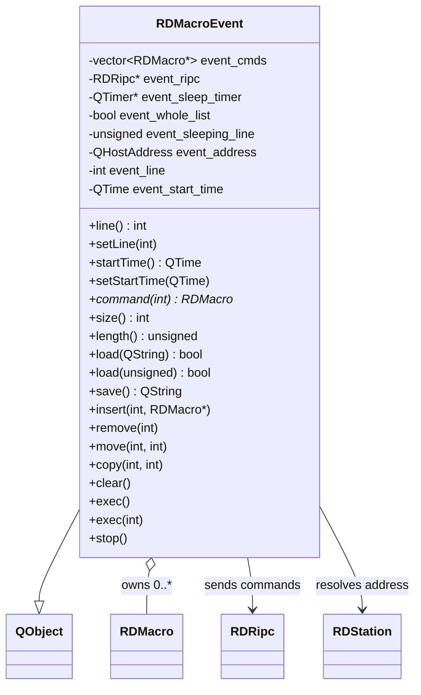

# inv-015 — RDMacroEvent

**Plik H:** `lib/rdmacro_event.h`
**Plik CPP:** `lib/rdmacro_event.cpp`
**Klasa bazowa:** `QObject`
**Opis:** Container class for a list of RML (Rivendell Macro Language) macros. Manages an ordered collection of RDMacro commands, supports loading from string or database, serialization, list manipulation, and sequential execution with sleep/pause support.

---

## Konstruktory

| Sygnatura | Opis |
|-----------|------|
| `RDMacroEvent(RDRipc *ripc=0, QObject *parent=0, const char *name=0)` | Creates event container targeting localhost (127.0.0.1). RDRipc is optional (execution disabled without it). |
| `RDMacroEvent(QHostAddress addr, RDRipc *ripc=0, QObject *parent=0, const char *name=0)` | Creates event container targeting a specific host address. |
| `~RDMacroEvent()` | Destroys container and frees all owned RDMacro objects. |

---

## Pola (prywatne)

| Pole | Typ | Rola |
|------|-----|------|
| `event_cmds` | `std::vector<RDMacro *>` | Ordered list of macro commands (owned pointers). |
| `event_ripc` | `RDRipc *` | RPC interface for sending RML commands to the system. |
| `event_sleep_timer` | `QTimer *` | Single-shot timer for SP (Sleep) macro pauses. |
| `event_whole_list` | `bool` | Flag: true when executing the entire list sequentially. |
| `event_sleeping_line` | `unsigned` | Index of the macro line currently sleeping. |
| `event_address` | `QHostAddress` | Default target address for loaded macros. |
| `event_line` | `int` | External "line" identifier (metadata, not execution index). |
| `event_start_time` | `QTime` | Associated start time for this macro event. |

---

## Metody publiczne

| Metoda | Zwraca | Opis |
|--------|--------|------|
| `line()` | `int` | Returns the external line identifier. |
| `setLine(int)` | `void` | Sets the external line identifier. |
| `startTime()` | `QTime` | Returns the associated start time. |
| `setStartTime(QTime)` | `void` | Sets the associated start time. |
| `command(int line)` | `RDMacro *` | Returns pointer to the macro at position `line`. |
| `size()` | `int` | Returns number of macros in the list. |
| `length()` | `unsigned` | Returns total serialized length of all macros combined. |
| `load(const QString &str)` | `bool` | Parses an RML string (commands delimited by `!`). Each parsed command gets the container's default address, echo disabled. Returns false and clears list on parse error. |
| `load(unsigned cartnum)` | `bool` | Loads macros from database for a given cart number (macro carts only, TYPE=2). |
| `save()` | `QString` | Serializes all macros back to a single RML string. |
| `insert(int line, const RDMacro *cmd)` | `void` | Inserts a copy of `cmd` at position `line`. |
| `remove(int line)` | `void` | Removes and deletes the macro at position `line`. |
| `move(int from, int to)` | `void` | Moves macro from one position to another (insert-then-remove). |
| `copy(int from, int to)` | `void` | Copies macro from one position to another (insert only). |
| `clear()` | `void` | Clears all macros, resets line to -1 and start time. |

---

## Public Slots

| Slot | Opis |
|------|------|
| `exec()` | Starts sequential execution of the entire macro list from line 0. Requires RDRipc. |
| `exec(int line)` | Executes a single macro at specified line. Handles SP (Sleep) and CC (Send Command) specially; all others are dispatched directly via RDRipc. |
| `stop()` | Stops execution if currently paused in a Sleep macro. Only effective for SP commands. |

---

## Signals

| Signal | Opis |
|--------|------|
| `started()` | Emitted when whole-list execution begins (line 0). |
| `started(int line)` | Emitted when execution of a specific line begins. |
| `finished()` | Emitted when whole-list execution completes. |
| `finished(int line)` | Emitted when a specific line finishes execution. |
| `stopped()` | Emitted when execution is stopped via `stop()` during a sleep. |

---

## Private Slots

| Slot | Opis |
|------|------|
| `sleepTimerData()` | Timer callback after SP (Sleep) macro expires. Emits `finished(line)` for the sleeping line, then continues sequential execution of remaining macros if in whole-list mode. |

---

## Metody prywatne

| Metoda | Opis |
|--------|------|
| `ExecList(int line)` | Sequentially executes macros starting from `line`. On encountering an SP (Sleep) command, pauses and returns (timer resumes later). At completion of all lines, emits `finished()`. |

---

## Zachowanie wykonania (Execution Model)

- **Sequential with pause:** `exec()` triggers `ExecList(0)`, which iterates through macros. Most macros execute instantly via `RDRipc::sendRml()`. SP (Sleep) macros start a single-shot QTimer and return; when the timer fires, `sleepTimerData()` resumes from the next line.
- **Single-line execution:** `exec(int line)` handles three cases:
  1. **SP (Sleep):** Starts the sleep timer with duration from arg(0) in milliseconds.
  2. **CC (Send Command):** Resolves a target station (by host variable lookup or direct station name/IP), constructs a new RDMacro with command and args extracted from the CC macro, and sends it via RDRipc. Supports optional port specification via `station:port` syntax.
  3. **Default:** Sends the macro directly via `RDRipc::sendRml()`.
- **Stop:** Only effective when a Sleep timer is active. Emits `stopped()`.

---

## SQL

| Zapytanie | Tabela | Operacja | Kontekst |
|-----------|--------|----------|----------|
| `SELECT MACROS FROM CART WHERE (NUMBER=?) AND (TYPE=2)` | `CART` | READ | `load(unsigned cartnum)` -- loads RML string for a macro cart. |
| `SELECT VARVALUE FROM HOSTVARS WHERE (STATION_NAME=?) AND (NAME=?)` | `HOSTVARS` | READ | `exec(int line)` CC handler -- resolves host variable to station name/address. |

---

## Zależności

| Klasa/Plik | Rola |
|------------|------|
| `RDMacro` (`rdmacro.h`) | Individual RML command object. Parsed from strings, stored in the list. |
| `RDRipc` (`rdripc.h`) | RPC interface for sending RML commands. Required for execution. |
| `RDStation` (`rdstation.h`) | Station lookup (address resolution) during CC command execution. |
| `RDSqlQuery` (`rddb.h`) | Database access for loading cart macros and resolving host variables. |
| `RDEscapeString` (`rdescape_string.h`) | SQL string escaping utility. |

---

## Specyfika Linux/Platform

Brak specyficznej logiki platformowej. Klasa jest przenośna (Qt + SQL).

---

## Diagramy

