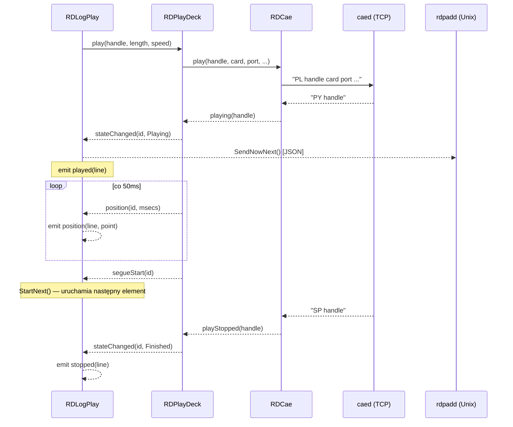
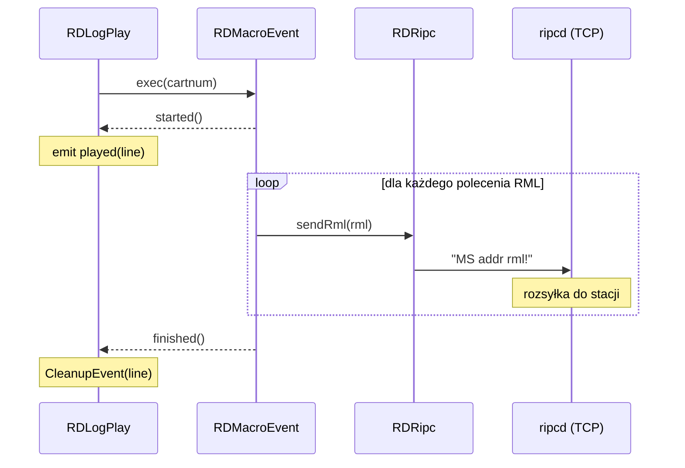
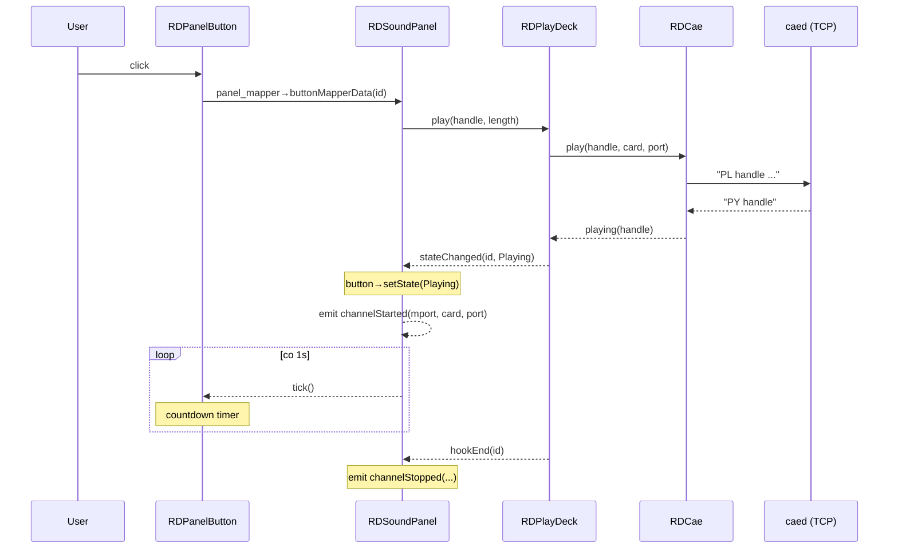
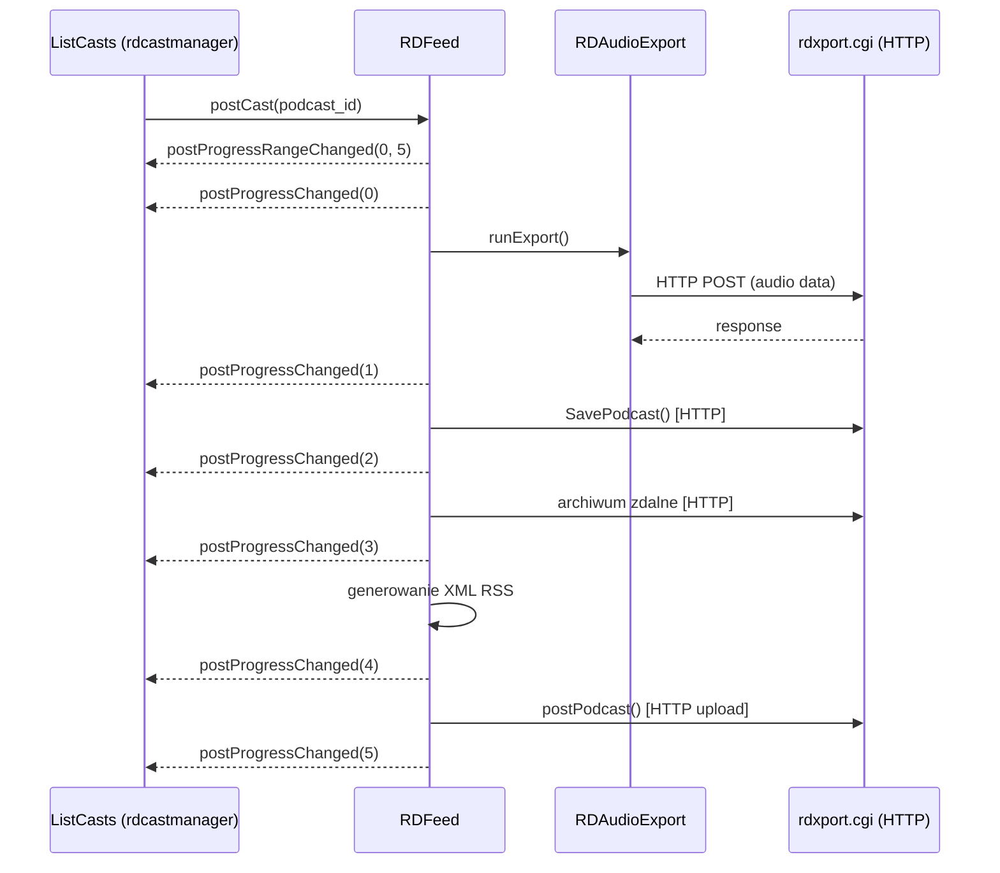

# Call Graph: librd (LIB)

## Statystyki

| Metryka | Wartość |
|---------|---------|
| Połączenia connect() łącznie | 97 |
| Unikalne sygnały | 78 |
| Klasy emitujące (lib-owned) | 28 |
| Klasy odbierające (lib-owned) | 24 |
| Cross-artifact połączenia (TCP/IPC/UDP) | 9 |
| Circular dependencies | 2 |

---

## Diagramy

### Sequence: Odtwarzanie audio z logu emisyjnego



### Sequence: Wykonanie makra RML



### Sequence: Sound Panel — klik przycisku



### Sequence: Postowanie podcastu (RDFeed pipeline)



### Graf zależności (dependency graph)

```mermaid
graph TD
    subgraph "Playout Engine"
        RDLogPlay --> RDPlayDeck
        RDLogPlay --> RDMacroEvent
        RDLogPlay --> RDSimplePlayer
        RDPlayDeck --> RDCae
        RDMacroEvent --> RDRipc
    end

    subgraph "Sound Panel"
        RDSoundPanel --> RDPanelButton
        RDSoundPanel --> RDPlayDeck
        RDSoundPanel --> RDCae
        RDSoundPanel --> RDRipc
        RDCartSlot --> RDPlayDeck
        RDCartSlot --> RDSlotBox
    end

    subgraph "Audio Operations"
        RDFeed --> RDRenderer
        RDFeed --> RDAudioExport
        RDRenderer --> RDCae
        RDCdRipper --> RDCdPlayer
    end

    subgraph "Communication Layer"
        RDCae -.->|TCP| caed
        RDRipc -.->|TCP| ripcd
        RDCatchConnect -.->|TCP| rdcatchd
        RDLiveWire -.->|TCP/LWRP| AxiaNodes
        RDLogPlay -.->|Unix socket| rdpadd
        RDMulticaster -.->|UDP| LAN
    end

    subgraph "Utilities"
        RDApplication --> RDRipc
        RDApplication --> RDCae
        RDTimeEngine -.->|timer| rdcatchd
        RDOneShot -.->|timer| ripcd_drivers
    end

    subgraph "Transfer (HTTP/CURL)"
        RDAudioExport -.->|HTTP| rdxport
        RDAudioImport -.->|HTTP| rdxport
        RDDownload -.->|HTTP| rdxport
        RDUpload -.->|HTTP| rdxport
    end

    style caed fill:#f96
    style ripcd fill:#f96
    style rdcatchd fill:#f96
    style AxiaNodes fill:#f96
    style rdpadd fill:#f96
    style LAN fill:#f96
    style rdxport fill:#f96
    style ripcd_drivers fill:#f96
```



---

## Graf połączeń (connect registry)

Jeden wiersz per unikalne połączenie connect(), posortowane po nadawcy (klasa emitująca sygnał).
Połączenia z zewnętrznymi modułami (rdairplay, rdlibrary itp.) są włączone dla kompletności,
oznaczone prefixem modułu w kolumnie "Zdefiniowane w".

| # | Nadawca (klasa) | Sygnał | Odbiorca (klasa) | Slot | Zdefiniowane w | Warunek |
|---|----------------|--------|-----------------|------|----------------|---------|
| 1 | `QProgressDialog` | `canceled()` | `RDRenderer` | `abort()` | rdlogedit/render_dialog.cpp:280 | Użytkownik anuluje dialog |
| 2 | `QSignalMapper` | `mapped(int)` | `RDEventPlayer` | `macroFinishedData(int)` | lib/rdevent_player.cpp:34 | zawsze |
| 3 | `QSignalMapper` | `mapped(int)` | `RDPlayDeck` | `pointTimerData(int)` | lib/rdplay_deck.cpp:64 | zawsze |
| 4 | `QSignalMapper` | `mapped(int)` | `RDGpio` | `revertData(int)` | lib/rdgpio.cpp:348 | zawsze |
| 5 | `QSignalMapper` | `mapped(int)` | `RDSoundPanel` | `buttonMapperData(int)` | lib/rdsound_panel.cpp:87 | zawsze |
| 6 | `QSignalMapper` | `mapped(int)` | `RDOneShot` | `timeoutData(int)` | lib/rdoneshot.cpp:31 | zawsze |
| 7 | `QSocketNotifier` | `activated(int)` | `RDMulticaster` | `activatedData(int)` | lib/rdmulticaster.cpp:36 | dane UDP gotowe |
| 8 | `QSocketNotifier` | `activated(int)` | `RDUnixServer` | `newConnectionData(int)` | lib/rdunixserver.cpp:100,131,183 | nowe połączenie UNIX |
| 9 | `QTcpSocket` | `connected()` | `RDCatchConnect` | `connectedData()` | lib/rdcatch_connect.cpp:44 | zawsze |
| 10 | `QTcpSocket` | `connected()` | `RDCddbLookup` | — | lib/rdcddblookup.cpp (implicit) | zawsze |
| 11 | `QTcpSocket` | `connected()` | `RDLiveWire` | `connectedData()` | lib/rdlivewire.cpp:98 | zawsze |
| 12 | `QTcpSocket` | `connected()` | `RDRipc` | `connectedData()` | lib/rdripc.cpp:50 | zawsze |
| 13 | `QTcpSocket` | `connectionClosed()` | `RDLiveWire` | `connectionClosedData()` | lib/rdlivewire.cpp:99 | zawsze |
| 14 | `QTcpSocket` | `error(QAbstractSocket::SocketError)` | `RDCddbLookup` | `errorData(QAbstractSocket::SocketError)` | lib/rdcddblookup.cpp:49-50 | błąd sieci |
| 15 | `QTcpSocket` | `error(QAbstractSocket::SocketError)` | `RDLiveWire` | `errorData(QAbstractSocket::SocketError)` | lib/rdlivewire.cpp:102 | błąd sieci |
| 16 | `QTcpSocket` | `error(QAbstractSocket::SocketError)` | `RDRipc` | `errorData(QAbstractSocket::SocketError)` | lib/rdripc.cpp:51 | błąd sieci |
| 17 | `QTcpSocket` | `readyRead()` | `RDCatchConnect` | `readyData()` | lib/rdcatch_connect.cpp:45 | dane dostępne |
| 18 | `QTcpSocket` | `readyRead()` | `RDCddbLookup` | `readyReadData()` | lib/rdcddblookup.cpp:48 | dane dostępne |
| 19 | `QTcpSocket` | `readyRead()` | `RDLiveWire` | `readyReadData()` | lib/rdlivewire.cpp:101 | dane dostępne |
| 20 | `QTcpSocket` | `readyRead()` | `RDRipc` | `readyData()` | lib/rdripc.cpp:53 | dane dostępne |
| 21 | `QTcpSocket` (self) | `bytesWritten(int)` | `RDSocket` | `bytesWrittenData(int)` | lib/rdsocket.cpp:37 | zawsze |
| 22 | `QTcpSocket` (self) | `connected()` | `RDSocket` | `connectedData()` | lib/rdsocket.cpp:32 | zawsze |
| 23 | `QTcpSocket` (self) | `disconnected()` | `RDSocket` | `connectionClosedData()` | lib/rdsocket.cpp:33 | zawsze |
| 24 | `QTcpSocket` (self) | `error(QAbstractSocket::SocketError)` | `RDSocket` | `errorData(...)` | lib/rdsocket.cpp:38 | błąd sieci |
| 25 | `QTcpSocket` (self) | `hostFound()` | `RDSocket` | `hostFoundData()` | lib/rdsocket.cpp:31 | zawsze |
| 26 | `QTcpSocket` (self) | `readyRead()` | `RDSocket` | `readyReadData()` | lib/rdsocket.cpp:36 | dane dostępne |
| 27 | `QTimer` | `timeout()` | `RDCae` | `clockData()` | lib/rdcae.cpp:95 | co 10ms |
| 28 | `QTimer` | `timeout()` | `RDCae` | `readyData()` | lib/rdcae.cpp:111 | co 10ms |
| 29 | `QTimer` | `timeout()` | `RDCartSlot` (wew.) | `startData()` itp. | lib/rdcartslot.cpp:95 | zdarzenia UI |
| 30 | `QTimer` | `timeout()` | `RDCatchConnect` | `heartbeatTimeoutData()` | lib/rdcatch_connect.cpp:51 | heartbeat |
| 31 | `QTimer` | `timeout()` | `RDCdPlayer` | `buttonTimerData()` | lib/rdcdplayer.cpp:51 | opóźnienie przycisku |
| 32 | `QTimer` | `timeout()` | `RDCdPlayer` | `clockData()` | lib/rdcdplayer.cpp:57 | co CLOCK_INTERVAL |
| 33 | `QTimer` | `timeout()` | `RDCueEdit` | `auditionTimerData()` | lib/rdcueedit.cpp:178 | audycja timeout |
| 34 | `QTimer` | `timeout()` | `RDDataPacer` | `timeoutData()` | lib/rddatapacer.cpp:30 | co pace_interval |
| 35 | `QTimer` | `timeout()` | `RDDbHeartbeat` | `intervalTimeoutData()` | lib/rddbheartbeat.cpp:28 | co interval*1000ms |
| 36 | `QTimer` | `timeout()` | `RDGpio` | `inputTimerData()` | lib/rdgpio.cpp:41 | polling GPIO |
| 37 | `QTimer` | `timeout()` | `RDKernelGpio` | `pollData()` | lib/rdkernelgpio.cpp:27 | co POLL_INTERVAL |
| 38 | `QTimer` | `timeout()` | `RDLiveWire` | `holdoffData()` | lib/rdlivewire.cpp:116 | reconnect holdoff |
| 39 | `QTimer` | `timeout()` | `RDLiveWire` | `watchdogData()` | lib/rdlivewire.cpp:109 | heartbeat |
| 40 | `QTimer` | `timeout()` | `RDLiveWire` | `watchdogTimeoutData()` | lib/rdlivewire.cpp:112 | timeout watchdog |
| 41 | `QTimer` | `timeout()` | `RDLogLock` | `updateLock()` | lib/rdloglock.cpp:40 | co RD_LOG_LOCK_TIMEOUT/2 |
| 42 | `QTimer` | `timeout()` | `RDLogPlay` | `graceTimerData()` | lib/rdlogplay.cpp:161 | po grace period |
| 43 | `QTimer` | `timeout()` | `RDLogPlay` | `transTimerData()` | lib/rdlogplay.cpp:157 | transition timer |
| 44 | `QTimer` | `timeout()` | `RDOneShot` | `zombieData()` | lib/rdoneshot.cpp:37 | cleanup timerów |
| 45 | `QTimer` | `timeout()` | `RDPlayDeck` | `duckTimerData()` | lib/rdplay_deck.cpp:78 | duck |
| 46 | `QTimer` | `timeout()` | `RDPlayDeck` | `fadeTimerData()` | lib/rdplay_deck.cpp:74 | fade |
| 47 | `QTimer` | `timeout()` | `RDPlayDeck` | `positionTimerData()` | lib/rdplay_deck.cpp:71 | co POSITION_INTERVAL |
| 48 | `QTimer` | `timeout()` | `RDPlayDeck` | `stop()` | lib/rdplay_deck.cpp:76 | stop timer |
| 49 | `QTimer` | `timeout()` | `RDSoundPanel` | `scanPanelData()` | lib/rdsound_panel.cpp:229 | scan |
| 50 | `QTimer` | `timeout()` | `RDTimeEngine` | `timerData()` | lib/rdtimeengine.cpp:31 | co 1s |
| 51 | `RDCae` | `playing(int)` | `RDEditAudio` | `playedData(int)` | lib/rdedit_audio.cpp:91 | CAE potwierdził play |
| 52 | `RDCae` | `playing(int)` | `RDPlayDeck` | `playingData(int)` | lib/rdplay_deck.cpp:53 | CAE potwierdził play |
| 53 | `RDCae` | `playing(int)` | `RDSimplePlayer` | `playingData(int)` | lib/rdsimpleplayer.cpp:45 | CAE potwierdził play |
| 54 | `RDCae` | `playStopped(int)` | `RDEditAudio` | `pausedData(int)` | lib/rdedit_audio.cpp:92 | CAE zatrzymał |
| 55 | `RDCae` | `playStopped(int)` | `RDPlayDeck` | `playStoppedData(int)` | lib/rdplay_deck.cpp:54 | CAE zatrzymał |
| 56 | `RDCae` | `playStopped(int)` | `RDSimplePlayer` | `playStoppedData(int)` | lib/rdsimpleplayer.cpp:46 | CAE zatrzymał |
| 57 | `RDCae` | `playPositionChanged(int,unsigned)` | `RDEditAudio` | `positionData(int,unsigned)` | lib/rdedit_audio.cpp:93-94 | tick pozycji |
| 58 | `RDCae` | `timescalingSupported(int,bool)` | `RDCartSlot` | `timescalingSupportedData(int,bool)` | lib/rdcartslot.cpp:85 | odpowiedź CAE |
| 59 | `RDCae` | `timescalingSupported(int,bool)` | `RDLogPlay` | `timescalingSupportedData(int,bool)` | lib/rdlogplay.cpp:120 | odpowiedź CAE |
| 60 | `RDCae` | `timescalingSupported(int,bool)` | `RDSoundPanel` | `timescalingSupportedData(int,bool)` | lib/rdsound_panel.cpp:190 | odpowiedź CAE |
| 61 | `RDCdPlayer` | `ejected()` | `CdRipper` | `ejectedData()` | rdlibrary/cdripper.cpp:71 | nośnik wysunięty |
| 62 | `RDCdPlayer` | `ejected()` | `DiskRipper` | `ejectedData()` | rdlibrary/disk_ripper.cpp:68 | nośnik wysunięty |
| 63 | `RDCdPlayer` | `mediaChanged()` | `CdRipper` | `mediaChangedData()` | rdlibrary/cdripper.cpp:72 | nośnik włożony |
| 64 | `RDCdPlayer` | `mediaChanged()` | `DiskRipper` | `mediaChangedData()` | rdlibrary/disk_ripper.cpp:69 | nośnik włożony |
| 65 | `RDCdPlayer` | `played(int)` | `CdRipper` | `playedData(int)` | rdlibrary/cdripper.cpp:73 | CD gra |
| 66 | `RDCdPlayer` | `played(int)` | `DiskRipper` | `playedData(int)` | rdlibrary/disk_ripper.cpp:70 | CD gra |
| 67 | `RDCdPlayer` | `stopped()` | `CdRipper` | `stoppedData()` | rdlibrary/cdripper.cpp:74 | CD zatrzymane |
| 68 | `RDCdPlayer` | `stopped()` | `DiskRipper` | `stoppedData()` | rdlibrary/disk_ripper.cpp:71 | CD zatrzymane |
| 69 | `RDCdRipper` | `progressChanged(int)` | `QProgressBar` (rip_bar) | `setValue(int)` | rdlibrary/cdripper.cpp:466 | postęp rippowania |
| 70 | `RDCdRipper` | `progressChanged(int)` | `QProgressBar` (rip_track_bar) | `setValue(int)` | rdlibrary/disk_ripper.cpp:1053-1054 | postęp rippowania |
| 71 | `RDComboBox` | `setupClicked()` | `RDSoundPanel` | `panelSetupData()` | lib/rdsound_panel.cpp:103 | klik w setup mode |
| 72 | `RDDataPacer` | `dataSent(const QByteArray &)` | `Gvc7000` (ripcd) | `sendCommandData(const QByteArray &)` | ripcd/gvc7000.cpp:62 | wysłanie danych |
| 73 | `RDDiscLookup` | `lookupDone(RDDiscLookup::Result, const QString &)` | `CdRipper` | `lookupDoneData(...)` | rdlibrary/cdripper.cpp:89-90 | CDDB/MB gotowe |
| 74 | `RDDiscLookup` | `lookupDone(RDDiscLookup::Result, const QString &)` | `DiskRipper` | `lookupDoneData(...)` | rdlibrary/disk_ripper.cpp:86-88 | CDDB/MB gotowe |
| 75 | `RDDownload` | `progressChanged(int)` | `QProgressBar` | `setValue(int)` | rdlibrary/disk_ripper.cpp:1053 | postęp pobierania |
| 76 | `RDFeed` | `postProgressChanged(int)` | `ListCasts` (rdcastmanager) | (progress slot) | rdcastmanager/list_casts.cpp:89 | postęp postowania |
| 77 | `RDFeed` | `postProgressRangeChanged(int,int)` | `ListCasts` (rdcastmanager) | (range slot) | rdcastmanager/list_casts.cpp:91 | zakres postępu |
| 78 | `RDGpio` | `inputChanged(int,bool)` | `LocalGpio` (ripcd) | `gpiChangedData(int,bool)` | ripcd/local_gpio.cpp:55 | zmiana GPI |
| 79 | `RDGpio` | `outputChanged(int,bool)` | `LocalGpio` (ripcd) | `gpoChangedData(int,bool)` | ripcd/local_gpio.cpp:57 | zmiana GPO |
| 80 | `RDKernelGpio` | `valueChanged(int,bool)` | `KernelGpio` (ripcd) | `gpiChangedData(int,bool)` | ripcd/kernelgpio.cpp:44 | zmiana GPIO |
| 81 | `RDLiveWire` | `connected(unsigned)` | `LwrpAudio` (ripcd) | `nodeConnectedData(unsigned)` | ripcd/livewire_lwrpaudio.cpp:57 | połączenie LWRP |
| 82 | `RDLiveWire` | `destinationChanged(unsigned, RDLiveWireDestination *)` | `LwrpAudio` (ripcd) | `destinationChangedData(...)` | ripcd/livewire_lwrpaudio.cpp:63 | zmiana destynacji |
| 83 | `RDLiveWire` | `sourceChanged(unsigned, RDLiveWireSource *)` | `LwrpAudio` (ripcd) | `sourceChangedData(...)` | ripcd/livewire_lwrpaudio.cpp:59 | zmiana źródła |
| 84 | `RDLiveWire` | `watchdogStateChanged(unsigned, const QString &)` | `LwrpAudio` (ripcd) | `watchdogStateChangedData(...)` | ripcd/livewire_lwrpaudio.cpp:67 | utrata/odzysk połączenia |
| 85 | `RDLogFilter` | `filterChanged(const QString &)` | `RDListLogs` | `filterChangedData(const QString &)` | lib/rdlist_logs.cpp:43 | zmiana filtra |
| 86 | `RDLogFilter` | `filterChanged(const QString &)` | `ListLogs` (rdairplay) | `filterChangedData(const QString &)` | rdairplay/list_logs.cpp:48 | zmiana filtra |
| 87 | `RDLogFilter` | `filterChanged(const QString &)` | `RDLogEdit` (rdlogedit) | `filterChangedData(const QString &)` | rdlogedit/rdlogedit.cpp:126 | zmiana filtra |
| 88 | `RDMacroEvent` | `finished()` | `RDEventPlayer` (przez QSignalMapper) | `macroFinishedData(int)` | lib/rdevent_player.cpp:55 | makro zakończone |
| 89 | `RDMacroEvent` | `finished()` | `RDLogPlay` | `macroFinishedData()` | lib/rdlogplay.cpp:114 | makro zakończone |
| 90 | `RDMacroEvent` | `started()` | `RDLogPlay` | `macroStartedData()` | lib/rdlogplay.cpp:113 | makro wystartowało |
| 91 | `RDMacroEvent` | `stopped()` | `RDLogPlay` | `macroStoppedData()` | lib/rdlogplay.cpp:115 | makro przerwane |
| 92 | `RDMarkerEdit` | `escapePressed()` | `RDEditAudio` (przez esc_mapper) | `cueEscData(int)` | lib/rdedit_audio.cpp:278,307,336,365,396,426,454,482,512,543 | Escape w polu markera |
| 93 | `RDMulticaster` | `received(const QString &, const QHostAddress &)` | `Ripcd` (ripcd) | `notificationReceivedData(...)` | ripcd/ripcd.cpp:178 | pakiet UDP multicast |
| 94 | `RDOneShot` | `timeout(int)` | GPIO sterowniki (ripcd) | `gpiOneshotData(int)` / `gpoOneshotData(int)` | ripcd/kernelgpio.cpp:66, btss42.cpp:70-72, itp. | one-shot timer GPIO |
| 95 | `RDPanelButton` | `clicked()` (QPushButton) | `RDSoundPanel::panel_mapper` | `map()` | lib/rdsound_panel.cpp:1215,1230 | klik przycisku panelu |
| 96 | `RDPlayDeck` | `hookEnd(int)` | `RDCartSlot` | `hookEndData(int)` | lib/rdcartslot.cpp:84 | koniec hook |
| 97 | `RDPlayDeck` | `hookEnd(int)` | `RDSoundPanel` | `hookEndData(int)` | lib/rdsound_panel.cpp:1031 | koniec hook |
| 98 | `RDPlayDeck` | `position(int,int)` | `RDCartSlot` | `positionData(int,int)` | lib/rdcartslot.cpp:82 | pozycja audio |
| 99 | `RDPlayDeck` | `position(int,int)` | `RDCueEdit` | `positionData(int,int)` | lib/rdcueedit.cpp:186 | pozycja audio |
| 100 | `RDPlayDeck` | `position(int,int)` | `RDLogPlay` | `positionData(int,int)` | lib/rdlogplay.cpp:2107 | pozycja audio |
| 101 | `RDPlayDeck` | `segueEnd(int)` | `RDLogPlay` | `segueEndData(int)` | lib/rdlogplay.cpp:2111 | koniec segue |
| 102 | `RDPlayDeck` | `segueStart(int)` | `RDLogPlay` | `segueStartData(int)` | lib/rdlogplay.cpp:2109 | start segue |
| 103 | `RDPlayDeck` | `stateChanged(int,RDPlayDeck::State)` | `RDCartSlot` | `stateChangedData(int,RDPlayDeck::State)` | lib/rdcartslot.cpp:80 | zmiana stanu |
| 104 | `RDPlayDeck` | `stateChanged(int,RDPlayDeck::State)` | `RDCueEdit` | `stateChangedData(int,RDPlayDeck::State)` | lib/rdcueedit.cpp:184 | zmiana stanu |
| 105 | `RDPlayDeck` | `stateChanged(int,RDPlayDeck::State)` | `RDLogPlay` | `playStateChangedData(int,RDPlayDeck::State)` | lib/rdlogplay.cpp:2105 | zmiana stanu |
| 106 | `RDPlayDeck` | `stateChanged(int,RDPlayDeck::State)` | `RDSoundPanel` | `stateChangedData(int,RDPlayDeck::State)` | lib/rdsound_panel.cpp:1029 | zmiana stanu |
| 107 | `RDPlayDeck` | `talkEnd(int)` | `RDLogPlay` | `talkEndData(int)` | lib/rdlogplay.cpp:2115 | koniec talk-over |
| 108 | `RDPlayDeck` | `talkStart(int)` | `RDLogPlay` | `talkStartData(int)` | lib/rdlogplay.cpp:2113 | start talk-over |
| 109 | `RDProcess` | `finished(int)` | `rdservice/MainObject` | `processFinishedData(int)` | rdservice/maint_routines.cpp:122 | proces zakończony |
| 110 | `RDPushButton` | `rightClicked(int, const QPoint &)` | `EditGrid` (rdlogmanager) | `rightHourButtonData(int, const QPoint &)` | rdlogmanager/edit_grid.cpp:63,79 | prawy klik siatki |
| 111 | `RDRenderer` | `lineStarted(int,int)` | `RDFeed` | `renderLineStartedData(int,int)` | lib/rdfeed.cpp:1511 | postęp renderowania |
| 112 | `RDRenderer` | `lineStarted(int,int)` | `RenderDialog` (rdlogedit) | `lineStartedData(int,int)` | rdlogedit/render_dialog.cpp:279 | postęp renderowania |
| 113 | `RDRenderer` | `progressMessageSent(const QString &)` | `MainObject` (rdrender) | `printProgressMessage(const QString &)` | utils/rdrender/rdrender.cpp:300 | wiadomość postępu |
| 114 | `RDRenderer` | `progressMessageSent(const QString &)` | `RDFeed` | `renderMessage(const QString &)` | lib/rdfeed.cpp:1509 | wiadomość postępu |
| 115 | `RDRipc` | `notificationReceived(RDNotification *)` | `RDLogPlay` | `notificationReceivedData(RDNotification *)` | lib/rdlogplay.cpp:128 | notyfikacja syst. |
| 116 | `RDRipc` | `onairFlagChanged(bool)` | `RDLogPlay` | `onairFlagChangedData(bool)` | lib/rdlogplay.cpp:126 | zmiana on-air |
| 117 | `RDRipc` | `onairFlagChanged(bool)` | `RDSoundPanel` | `onairFlagChangedData(bool)` | lib/rdsound_panel.cpp:196 | zmiana on-air |
| 118 | `RDRipc` | `userChanged()` | `RDApplication` | `userChangedData()` | lib/rdapplication.cpp:208 | zmiana użytkownika |
| 119 | `RDSimplePlayer` | `played()` | `RDLogPlay` | `auditionStartedData()` | lib/rdlogplay.cpp:143 | audycja start |
| 120 | `RDSimplePlayer` | `stopped()` | `RDLogPlay` | `auditionStoppedData()` | lib/rdlogplay.cpp:145 | audycja stop |
| 121 | `RDSlider` | `sliderMoved(int)` | `RDCueEdit` | `sliderChangedData(int)` | lib/rdcueedit.cpp:77 | ruch suwaka |
| 122 | `RDSlider` | `sliderPressed()` | `RDCueEdit` | `sliderPressedData()` | lib/rdcueedit.cpp:79 | wciśnięcie suwaka |
| 123 | `RDSlider` | `sliderReleased()` | `RDCueEdit` | `sliderReleasedData()` | lib/rdcueedit.cpp:80 | zwolnienie suwaka |
| 124 | `RDSlotBox` | `cartDropped(unsigned)` | `RDCartSlot` | `cartDroppedData(unsigned)` | lib/rdcartslot.cpp:108 | drag-drop koszyka |
| 125 | `RDSlotBox` | `doubleClicked()` | `RDCartSlot` | `doubleClickedData()` | lib/rdcartslot.cpp:107 | podwójny klik |
| 126 | `RDSoundPanel` | `tick()` | `RDPanelButton` | `tickClock()` | lib/rdsound_panel.cpp:1033 | takt zegara 1s |
| 127 | `RDSvc` | `generationProgress(int)` | `GenerateLog` (rdlogmanager) | `setValue(int)` | rdlogmanager/generate_log.cpp:318,427,487 | postęp generowania |
| 128 | `RDTimeEdit` | `valueChanged(const QTime &)` | `EditEvent` (rdairplay) | `timeChangedData(const QTime &)` | rdairplay/edit_event.cpp:46-47 | zmiana czasu |
| 129 | `RDTimeEdit` | `valueChanged(const QTime &)` | `EditEvent` (rdlogedit) | `timeChangedData(const QTime &)` | rdlogedit/edit_event.cpp:53-54 | zmiana czasu |
| 130 | `RDTimeEngine` | `timeout(int)` | `rdcatchd/MainObject` | `engineData(int)` | rdcatchd/rdcatchd.cpp:358 | event czasowy |
| 131 | `RDTransportButton` | `clicked()` | `RDCueEdit` | `auditionButtonData()` | lib/rdcueedit.cpp:104 | klik transport |
| 132 | `RDTransportButton` | `clicked()` | `RDCueEdit` | `pauseButtonData()` | lib/rdcueedit.cpp:117 | klik transport |
| 133 | `RDTransportButton` | `clicked()` | `RDCueEdit` | `stopButtonData()` | lib/rdcueedit.cpp:130 | klik transport |
| 134 | `RDTransportButton` | `clicked()` | `RDSimplePlayer` | `play()` | lib/rdsimpleplayer.cpp:58 | klik play |
| 135 | `RDTransportButton` | `clicked()` | `RDSimplePlayer` | `stop()` | lib/rdsimpleplayer.cpp:66 | klik stop |
| 136 | `RDTransportButton` | `clicked()` | `RDTimeEdit` (up/down) | `upClickedData()` / `downClickedData()` | lib/rdtimeedit.cpp:68,71 | zmiana czasu |
| 137 | `RDUnixServer` | `newConnection()` | `CaeServer` (rdcae) | `newConnectionData()` | cae/cae_server.cpp:62 | nowe połączenie |
| 138 | `RDUnixServer` | `newConnection()` | `MainObject` (rdcatchd) | `newConnectionData()` | rdcatchd/rdcatchd.cpp:238 | nowe połączenie |
| 139 | `RDUnixServer` | `newConnection()` | `MainObject` (rdpadd) | `newConnectionData()` | rdpadd/rdpadd.cpp:86,106 | nowe połączenie |
| 140 | `RDUnixServer` | `newConnection()` | `MainObject` (ripcd) | `newConnectionData()` | ripcd/ripcd.cpp:114 | nowe połączenie |

---

## Kluczowe przepływy zdarzeń

### Przepływ 1: Audio Playback (log player)

```
[RDLogPlay] StartAudioEvent() — decyzja o odtworzeniu zdarzenia audio
    → RDPlayDeck::play() — załadowanie i start odtwarzania
        → rda->cae()->play(handle, card, port, ...)  [TCP → caed]
            ← RDCae::playing(handle)  [CAE potwierdza start]
                → RDPlayDeck::playingData(handle)
                    → emit stateChanged(id, Playing)
                        → RDLogPlay::playStateChangedData(id, Playing)
                            → emit played(line)
                            → UpdatePostPoint()
                            → SendNowNext()  [Unix socket → rdpadd]
    [co 50ms] RDPlayDeck::positionTimerData()
        → emit position(id, msecs)
            → RDLogPlay::positionData(id, msecs)
                → emit position(line, point)
    [segue point] RDPlayDeck::pointTimerData(Segue)
        → emit segueStart(id)
            → RDLogPlay::segueStartData(id) — uruchomienie następnego zdarzenia
```

**Efekt biznesowy:** Zdarzenie audio z logu emisyjnego jest odtwarzane przez silnik CAE, log otrzymuje aktualizacje pozycji co 50ms, a w momencie osiągnięcia punktu segue automatycznie startuje następny element.

---

### Przepływ 2: Wykonanie makra RML

```
[RDLogPlay] StartEvent(line) — zdarzenie typu Macro
    → play_macro_deck->exec(cartnum)  [RDMacroEvent]
        → emit started()
            → RDLogPlay::macroStartedData()
                → emit played(line)
        [dla każdej komendy RML]
        → event_ripc->sendRml(rml)  [TCP → ripcd]
            → ripcd rozsyła RML do docelowych stacji/modułów
        → emit finished()
            → RDLogPlay::macroFinishedData()
                → CleanupEvent(line)
```

**Efekt biznesowy:** Cart-makro (lista poleceń RML) jest wykonywany sekwencyjnie; każde polecenie jest wysyłane przez ripcd do odpowiednich odbiorców w sieci Rivendell (np. zmiana głośności, wyzwolenie GPI, uruchomienie innego cartu).

---

### Przepływ 3: Zmiana użytkownika (autentykacja)

```
[ripcd daemon] identyfikacja użytkownika (RU komenda)
    → TCP → RDRipc::readyData() → DispatchCommand()
        → emit userChanged()
            → RDApplication::userChangedData()
                [tryb bez ticketu]
                → app_ripc->user() → aktualizacja app_user
                → emit userChanged()  [RDApplication]
                    → [aplikacje: rdairplay, rdlibrary itp. poza lib/]
                        → odświeżenie uprawnień, menu, widoku
```

**Efekt biznesowy:** Gdy operator zmienia użytkownika na stacji (np. przez rdpanel lub rsyslog), cały system automatycznie aktualizuje uprawnienia i interfejs bez restartu aplikacji.

---

### Przepływ 4: Sound Panel — odtwarzanie przycisku

```
[Operator] klik na RDPanelButton
    → QPushButton::clicked()
        → RDSoundPanel::panel_mapper->map()
            → RDSoundPanel::buttonMapperData(id)
                → PlayButton(row, col)
                    → button->playDeck()->play()  [RDPlayDeck]
                        → rda->cae()->play(...)  [TCP → caed]
                            ← RDCae::playing(handle)
                                → RDPlayDeck::playingData()
                                    → emit stateChanged(Playing)
                                        → RDSoundPanel::stateChangedData()
                                            → button->setState(Playing) — wizualizacja
                                        → emit channelStarted(mport,card,port)
    [co 1s] RDSoundPanel::tickClock()
        → emit tick()
            → RDPanelButton::tickClock() — countdown timer na przycisku
```

**Efekt biznesowy:** Kliknięcie przycisku na panelu dźwiękowym uruchamia cart; przycisk zmienia kolor na aktywny i wyświetla odliczanie czasu pozostałego.

---

### Przepływ 5: Postowanie podcastu (RDFeed pipeline)

```
[operator] klik "Post" w rdcastmanager
    → RDFeed::postCast(podcast_id)
        → emit postProgressRangeChanged(0, 5)
            → ListCasts::setRange(0, 5)
        → emit postProgressChanged(0)  — start
        [krok 1] RDAudioExport::runExport()  [HTTP/CURL → rdxport]
        → emit postProgressChanged(1)
        [krok 2] SavePodcast()  [HTTP/CURL → rdxport]
        → emit postProgressChanged(2)
        [krok 3] archiwum zdalne  [HTTP/CURL → serwer docelowy]
        → emit postProgressChanged(3)
        [krok 4] generowanie XML RSS
        → emit postProgressChanged(4)
        [krok 5] postPodcast() — upload RSS  [HTTP/CURL]
        → emit postProgressChanged(5)  — koniec
```

**Efekt biznesowy:** Nagranie podcastu jest eksportowane, uploadowane do magazynu Rivendell, archiwizowane, a feed RSS jest regenerowany i opublikowany na zdalnym serwerze — operator widzi pasek postępu przez cały pipeline.

---

## Cross-artifact połączenia

| Źródło (klasa) | Mechanizm | Cel (daemon/serwis) | Sygnał/Metoda | Znaczenie |
|----------------|-----------|---------------------|---------------|-----------|
| `RDCae` | TCP (Q3SocketDevice, port CAED_TCP_PORT) | `caed` (Core Audio Engine) | `connectToServer()` / `DispatchCommand()` | Sterowanie odtwarzaniem i nagrywaniem audio; protokół tekstowy kończący się `!`; odpowiedzi PW/LP/UP/PP/PY/SP/TS/LR/UR/RS/SR/IS → sygnały Qt |
| `RDCae` | UDP (meter port) | `caed` | `UpdateMeters()` | Odbiór poziomów VU z caed co 10ms; port `cae_meter_base_port + card*10 + port` |
| `RDRipc` | TCP (QTcpSocket) | `ripcd` (RPC/IPC daemon) | `connectHost()` / `SendCommand()` / `DispatchCommand()` | Autentykacja (PW/RU), zmiana użytkownika (SU), GPIO (GI/GO/GM/GN/GC/GD), RML (MS/ME), notyfikacje (ON), on-air flag (TA) |
| `RDCatchConnect` | TCP (QTcpSocket) | `rdcatchd` (Catch daemon) | `connectHost()` / `SendCommand()` | Monitorowanie i kontrola nagrań zaplanowanych; heartbeat `RH!` co CC_HEARTBEAT_INTERVAL ms |
| `RDLiveWire` | TCP (LWRP protocol) | Węzły Axia LiveWire | `connectToHost()` / `SendCommand()` | Protokół LWRP — routing audio IP, konfiguracja źródeł/celów, GPIO; watchdog co RDLIVEWIRE_WATCHDOG_INTERVAL ms |
| `RDLogPlay` | Unix socket (abstract) | `rdpadd` (PAD daemon) | `SendNowNext()` — JSON | Aktualizacja Now/Next (aktualnie i następnie grający cart) dla zewnętrznych systemów PAD (RadioText, RDS, DAB+) |
| `RDDownload` / `RDUpload` / `RDAudioExport` / `RDAudioImport` / `RDAudioInfo` / `RDAudioStore` / `RDTrimAudio` / `RDRehash` / `RDCopyAudio` | HTTP/CURL (libcurl) | `rdxport.cgi` (WebAPI) | `runDownload()` / `runUpload()` / `runExport()` / `runImport()` / `runInfo()` / `runStore()` / `runTrim()` / `runRehash()` / `runCopy()` | Transfer plików audio i metadanych przez WebAPI Rivendell; synchroniczne wywołania blokujące |
| `RDCddbLookup` | TCP (QTcpSocket, port 888) | Serwer CDDB/FreeDB | `lookupRecord()` / `SendToServer()` | Pobieranie metadanych CD (tytuł, wykonawca, ścieżki) po disc ID; protokół CDDB |
| `RDMulticaster` | UDP Multicast (Q3SocketDevice) | Sieć lokalna / inne stacje | `send()` / `subscribe()` / `unsubscribe()` | Rozsyłanie notyfikacji systemowych do wszystkich stacji Rivendell w sieci LAN |
| `RDUnixServer` | UNIX domain socket (AF_UNIX) | `ripcd`, `rdcatchd`, `caed`, `rdpadd` | `newConnection()` | Lokalne IPC — każdy demon nasłuchuje na gniazdo UNIX; używany do komunikacji aplikacji z demonami na tej samej maszynie |

---

## Q_PROPERTY Reactive Bindings

(none — Qt4 project, brak Q_PROPERTY z NOTIFY w całej librd)

---

## Circular Dependencies

| # | Cykl | Klasy w cyklu | Intentional? | Uwagi |
|---|------|--------------|--------------|-------|
| 1 | **RDLogPlay ↔ RDPlayDeck** | RDLogPlay tworzy i podłącza RDPlayDeck (w StartAudioEvent); RDPlayDeck emituje `stateChanged`, `position`, `segueStart`, `segueEnd`, `talkStart`, `talkEnd` → RDLogPlay | Tak — intentional | Wzorzec Owner–Worker: LogPlay jest właścicielem i konsumentem PlayDeck. Cykl jest "up–down" przez interfejs sygnałów (nie przez include-cycle) — PlayDeck nigdy nie posiada wskaźnika do LogPlay. |
| 2 | **RDCae ↔ RDPlayDeck** | RDPlayDeck subskrybuje `RDCae::playing` i `RDCae::playStopped`; RDPlayDeck wywołuje `play_cae->play()` / `play_cae->stopPlay()` | Tak — intentional | Wzorzec Client–Server: PlayDeck wysyła polecenia do CAE (przez metody) i odbiera odpowiedzi (przez sygnały). Pętla jest deliberatna — CAE potwierdza wykonanie poleceń asynchronicznie. |

**Uwaga:** RDSoundPanel ↔ RDPanelButton to pseudo-cykl: SoundPanel emituje `tick()` do PanelButton, a PanelButton::clicked() jest łączone przez panel_mapper z SoundPanel::buttonMapperData. Jest to jednak wzorzec hub-spoke (SoundPanel jest centralą), nie prawdziwy cykl zależności.

---

## Missing Coverage

Sygnały zadeklarowane w nagłówkach, dla których nie znaleziono connect() w lib/*.cpp
(mogą być podłączone przez aplikacje poza lib/ lub są martwym kodem):

| Klasa | Sygnał | Prawdopodobne wyjaśnienie |
|-------|--------|--------------------------|
| `RDPlayDeck` | `hookStart(int id)` | Emitowany (rdplay_deck.cpp:655) ale brak connect() w całym projekcie — hook mode obsługiwany tylko przez hookEnd; hookStart nigdy nie jest konsumowany |
| `RDCae` | `playLoaded(int handle)` | LP response loguje błąd i wywołuje `unloadPlay()` zamiast emitować sygnał — de facto martwy sygnał |
| `RDCae` | `gpiInputChanged(int line, bool state)` | GPI przez CAE nie jest implementowane w kliencie lib; GPI obsługiwane przez RDRipc/ripcd |
| `RDCae` | `connected(bool state)` | Zadeklarowany w RDCae, ale używany przez RDRipc; niejasność nazwy — potencjalny błąd dokumentacji |
| `RDCartSlot` | `tick()`, `buttonFlash(bool)`, `selectClicked(...)` | Deklarowane dla kompatybilności interfejsu z RDSoundPanel; emitowane przez zewnętrzne orkestratory (rdcartslots) poza lib/ |
| `RDAudioExport` | `strobe()` | Zadeklarowany, brak `emit` w rdaudioexport.cpp — martwy kod lub emitowany przez C-callback CURL poza widocznością analizatora |
| `RDGpioSelector` | `pinChanged(int)` | Brak connect() w przeszukanych plikach — podłączany w modułach rdadmin poza lib/ |
| `RDRipc` | `rmlReceived(RDMacro*)`, `gpiStateChanged(...)`, `gpoStateChanged(...)`, `gpiMaskChanged(...)`, `gpoMaskChanged(...)`, `gpiCartChanged(...)`, `gpoCartChanged(...)`, `connected(bool)` | Subskrybenci wyłącznie w aplikacjach (rdairplay, rdcatch, rdpanel) poza lib/ — poprawne, lib/ nie zawiera logiki aplikacyjnej |
| `RDStereoMeter` | `clip()` | Brak connect() w kodzie lib — widget pasywny, aplikacje mogą subskrybować w swoim kodzie |
| `RDCatchConnect` | wszystkie sygnały | Subskrybenci w rdcatch/rdcatch.cpp poza lib/ — prawidłowa separacja warstw |
