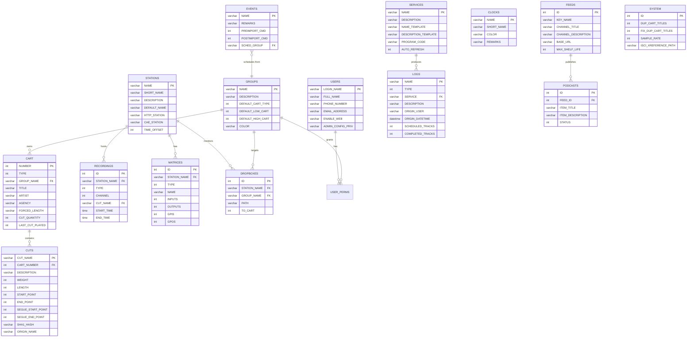

# Data Model: librd

## ERD — Entity Relationship Diagram

## Tabele główne (używane przez librd)

### CART
Centralny kontener audio — każdy cart ma unikalny NUMBER i zawiera 1+ cutów.

| Kolumna kluczowa | Typ | Opis |
|---------|-----|------|
| NUMBER | int PK | Numer carta (1-999999) |
| TYPE | int | 1=Audio, 2=Macro |
| GROUP_NAME | varchar FK→GROUPS | Grupa właścicielska |
| TITLE | varchar | Tytuł |
| ARTIST | varchar | Artysta |
| CUT_QUANTITY | int | Liczba cutów |
| FORCED_LENGTH | int | Wymuszona długość (ms) |

**Klasy CRUD:** RDCart (full CRUD), RDLogLine (READ), RDSvc (READ)
**Operacje:** CREATE / READ / UPDATE / DELETE (cascade)

### CUTS
Segment audio w carcie — dane o markerach, datach ważno��ci, audio metadata.

| Kolumna kluczowa | Typ | Opis |
|---------|-----|------|
| CUT_NAME | varchar PK | Format NNNNNN_NNN |
| CART_NUMBER | int FK→CART | Numer carta |
| LENGTH | int | Długość (ms) |
| START_POINT/END_POINT | int | Markery start/end (ms) |
| SEGUE_START/END_POINT | int | Markery segue (ms) |
| TALK_START/END_POINT | int | Markery talk (ms) |
| EVERGREEN | enum | Y/N |
| START_DATETIME/END_DATETIME | datetime | Zakres ważności |

**Klasy CRUD:** RDCut (full CRUD), RDLogEvent (READ), RDCart (READ/DELETE)

### LOGS
Playlista radiowa — uporządkowana lista eventów.

**Klasy CRUD:** RDLog (full CRUD), RDLogEvent (READ/WRITE via LOG_LINES)

### LOG_LINES (dynamicznie tworzone per log)
Linie logu — każdy log ma tabelę `{LOG_NAME}_LOG` z liniami eventów.

**Klasy CRUD:** RDLogEvent (full CRUD), RDLogLine (READ)

### USERS
Użytkownicy systemu z uprawnieniami.

**Klasy CRUD:** RDUser (full CRUD)

### STATIONS
Stacje robocze (hosty) z konfiguracją sprzętową.

**Klasy CRUD:** RDStation (full CRUD — cascade 30+ tabel)

### GROUPS
Grupy cartów z zakresami numeracji i regułami.

**Klasy CRUD:** RDGroup (full CRUD), RDCart (READ)

### SERVICES
Serwisy (stacje radiowe / programy).

**Klasy CRUD:** RDSvc (full CRUD)

### EVENTS
Eventy schedulera — definicje bloków programowych.

**Klasy CRUD:** RDEvent (full CRUD)

### CLOCKS
Zegary (szablony godzinne) schedulera.

**Klasy CRUD:** RDClock (full CRUD)

### RECORDINGS
Zaplanowane nagrania.

**Klasy CRUD:** RDRecording (full CRUD)

### FEEDS / PODCASTS
Podcasty i feedy RSS.

**Klasy CRUD:** RDFeed (full CRUD), RDPodcast (full CRUD)

### MATRICES
Matrycy audio switcherów.

**Klasy CRUD:** RDMatrix (READ/UPDATE)

### DROPBOXES
Auto-import (watchfolder).

**Klasy CRUD:** RDDropbox (full CRUD)

## Tabele konfiguracyjne

| Tabela | Klasa C++ | Zakres |
|--------|-----------|--------|
| RDAIRPLAY | RDAirplayConf | Konfiguracja per stacja |
| RDLIBRARY | RDLibraryConf | Konfiguracja per stacja |
| RDLOGEDIT | RDLogeditConf | Konfiguracja per stacja |
| RDCATCH | RDCatchConf | Konfiguracja per stacja |
| RDPANEL | — | Konfiguracja paneli per stacja |
| AUDIO_CARDS | RDStation (indirect) | Karty audio per stacja |
| AUDIO_INPUTS / AUDIO_OUTPUTS | RDAudioPort | Porty audio per karta |
| DECKS | RDDeck | Decki nagrywania per stacja |
| TTYS | RDTty | Porty szeregowe |
| SYSTEM | RDSystem | Ustawienia globalne |

## Tabele uprawnień (join tables)

| Tabela | Relacja | Klasa C++ |
|--------|---------|-----------|
| USER_PERMS | USERS ↔ GROUPS | RDUser |
| FEED_PERMS | USERS ↔ FEEDS | RDUser |
| AUDIO_PERMS | GROUPS ↔ SERVICES | — |
| SERVICE_PERMS | STATIONS ↔ SERVICES | — |
| CLOCK_PERMS | SERVICES ↔ CLOCKS | — |
| EVENT_PERMS | SERVICES ↔ EVENTS | — |
| USER_SERVICE_PERMS | USERS ↔ SERVICES | — |

## Tabele eventów/logów

| Tabela | Opis | Klasa C++ |
|--------|------|-----------|
| HOSTVARS | Zmienne hostowe (key-value per stacja) | RDRipc, RDMacroEvent |
| WEBAPI_AUTHS | Tokeny API (SHA1 + IP + expiry) | RDApplication, RDUser |
| CUT_EVENTS | Eventy cutów (play log) | RDCut |
| SCHED_CODES | Kody schedulera | RDSchedCode |
| CART_SCHED_CODES | Cart ↔ Sched Code mapping | RDCart |
| REPL_CART_STATE / REPL_CUT_STATE | Stan replikacji | RDCart, RDReplicator |

## Mapowanie Tabela ↔ Klasa C++

| Tabela DB | Klasa C++ | Wzorzec | Operacje |
|-----------|-----------|---------|----------|
| CART | RDCart | Active Record | CRUD |
| CUTS | RDCut | Active Record | CRUD |
| LOGS | RDLog | Active Record | CRUD |
| LOG_LINES (dynamic) | RDLogEvent | Active Record | CRUD |
| USERS | RDUser | Active Record | CRUD |
| STATIONS | RDStation | Active Record | CRUD (cascade 30+) |
| GROUPS | RDGroup | Active Record | CRUD |
| SERVICES | RDSvc | Active Record | CRUD |
| EVENTS | RDEvent | Active Record | CRUD |
| CLOCKS | RDClock | Active Record | CRUD |
| RECORDINGS | RDRecording | Active Record | CRUD |
| FEEDS | RDFeed | Active Record | CRUD |
| PODCASTS | RDPodcast | Active Record | CRUD |
| REPORTS | RDReport | Active Record | CRUD |
| MATRICES | RDMatrix | Active Record | RU |
| DROPBOXES | RDDropbox | Active Record | CRUD |
| REPLICATORS | RDReplicator | Active Record | CRUD |
| DECKS | RDDeck | Active Record | RU |
| TTYS | RDTty | Active Record | RU |
| RDAIRPLAY | RDAirplayConf | Config Reader | RU |
| RDLIBRARY | RDLibraryConf | Config Reader | RU |
| RDLOGEDIT | RDLogeditConf | Config Reader | RU |
| RDCATCH | RDCatchConf | Config Reader | RU |
| SYSTEM | RDSystem | Config Reader | RU |
| AUDIO_PORTS (via AUDIO_INPUTS/OUTPUTS) | RDAudioPort | Config Reader | RU |
| HOTKEYS | RDHotKeys/RDHotKeyList | Config Reader | CR |
| HOSTVARS | RDRipc (READ) | Lookup | R |
| WEBAPI_AUTHS | RDUser, RDApplication | Auth Token | CRUD |
| SCHED_CODES | RDSchedCode | Active Record | CRUD |
