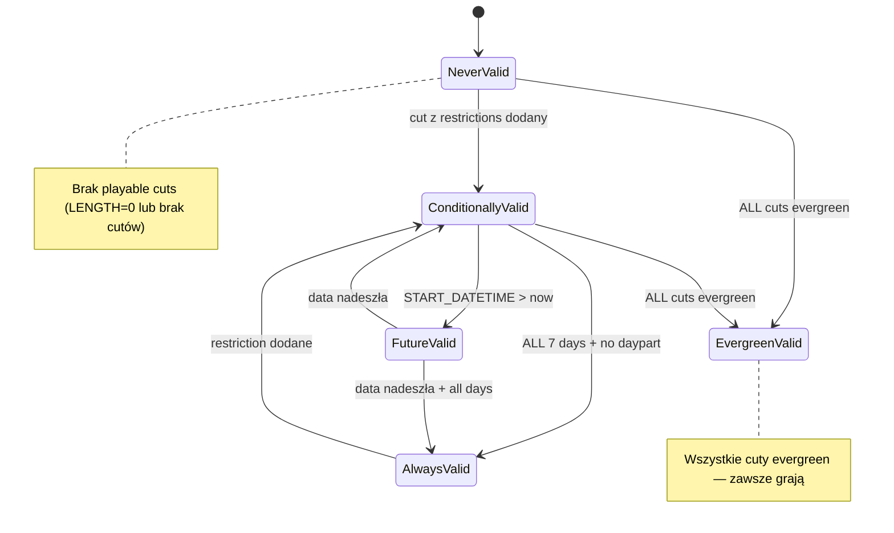
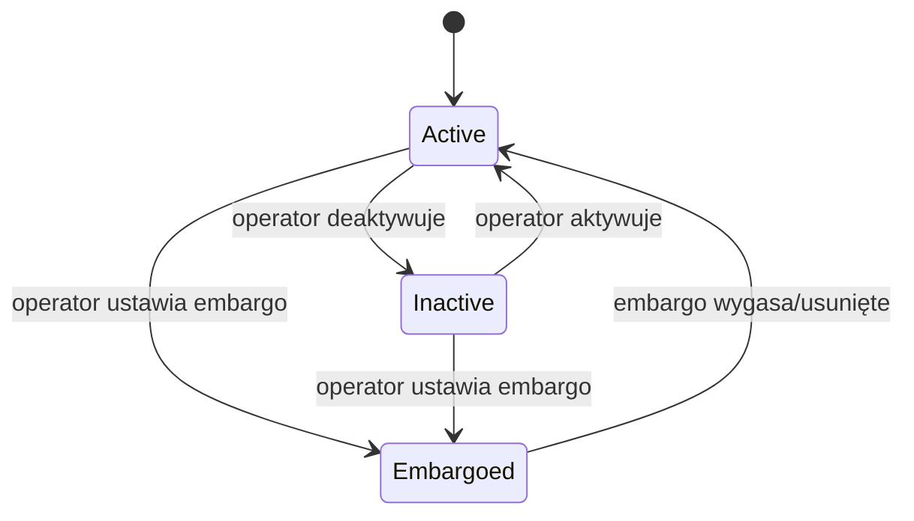
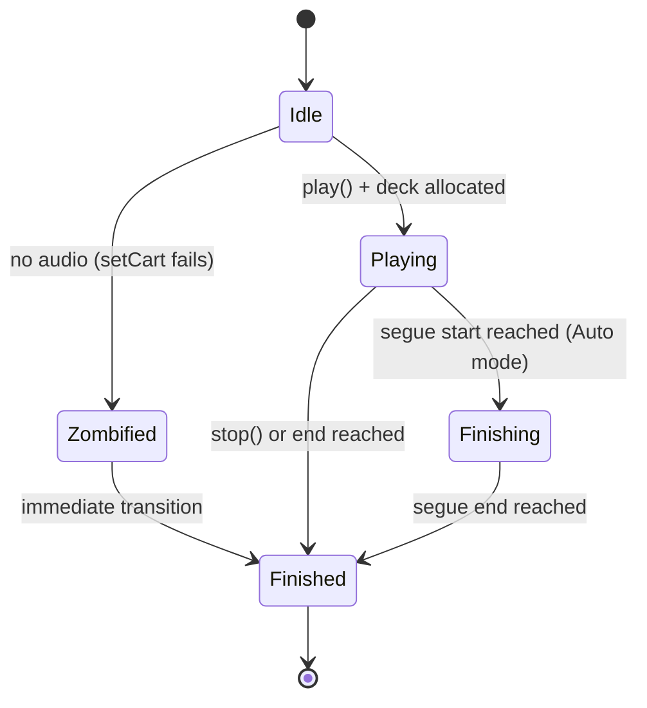

# Facts: librd

## Źródła analizy

| Źródło | Użyte | Jakość |
|--------|-------|--------|
| Kod źródłowy | tak | wysoka — 204 plików .cpp w lib/ (~101k LOC) |
| Testy | tak | średnia — 28 plików testowych (bez QTest framework, proste main()+MainObject) |
| Dokumentacja XML | tak | wysoka — docs/opsguide/*.xml (DocBook XML, 12 plików + screenshoty) |

---

## Koncepty bazowe

| Koncept | Definicja | Źródło |
|---------|-----------|--------|
| Host | Fizyczny komputer w sieci Rivendell. Indywidualnie konfigurowalny i kontrolowany zdalnie. | docs/opsguide/overview.xml:sect.overview.hosts |
| User | Zestaw polityk dostępu definiujący uprawnienia. Każdy host ma default user ładowanego przy starcie. | docs/opsguide/overview.xml:sect.overview.users |
| Group | System kategorii do organizacji audio. Operacje specyfikowane per grupa. Schemat dowolny. | docs/opsguide/overview.xml:sect.overview.groups |
| Service | Docelowe miejsce przeznaczenia audio (stacja, stream). Parametry playout i log creation per service. | docs/opsguide/overview.xml:sect.overview.services |
| Cart | Kontener danych: audio (audio cart) lub makra RML (macro cart). Fundamentalny "atom" schedulingu. | docs/opsguide/rdlibrary.xml:sect2_rdlibrary_carts |
| Cut | Rzeczywisty kawałek audio w karcie. Analogiczny do "track" na CD. Karta może zawierać do 999 cutów. | docs/opsguide/rdlibrary.xml:sect.rdlibrary.cuts |
| Log | Sekwencja eventów do wykonania (playlist). Każdy log należy do dokładnie jednego service. | docs/opsguide/rdlogedit.xml:sect.rdlogedit.logs_and_log_events |
| Log Machine | Wirtualne "urządzenie" do ładowania i wykonywania logów. RDAirPlay ma 3: Main, Aux 1, Aux 2. | docs/opsguide/rdairplay.xml:sect.rdairplay.log_machines |
| Macro Cart | Karta zawierająca komendy RML (Rivendell Macro Language) zamiast audio. | docs/opsguide/rdlibrary.xml:sect.rdlibrary.macro_carts |
| Scheduler Code | Kod przypisywany do kart, używany przez schedulery do klasyfikacji. | docs/opsguide/rdadmin.xml:sect.rdadmin.manage_scheduler_codes |
| Dropbox | Proces tła automatycznie importujący pliki audio z systemu plików. | docs/opsguide/rdadmin.xml:sect.rdadmin.manage_hosts.configuring_dropboxes |
| Feed | Podcast feed zarządzany przez Rivendell. Itemy: active (green), inactive (red), embargoed (blue). | docs/opsguide/rdcastmanager.xml:sect.rdcastmanager.overview |
| PAD | Program Associated Data — dane o aktualnie granym i następnym elemencie, JSON przez TCP port 34289. | docs/opsguide/pad.xml:sect.pad.the_json_interface |

---

## Use Cases (aktor → akcja → efekt)

| ID | Aktor | Akcja | Efekt | Źródło |
|----|-------|-------|-------|--------|
| UC-001 | Operator | Tworzy nową kartę audio | Karta z unikalnym numerem 1-999999 w zakresie grupy | docs/opsguide/rdlibrary.xml, lib/rdgroup.cpp:331 |
| UC-002 | Operator | Importuje plik audio do cuta | Audio zaimportowane (WAV/MP/OGG/FLAC), opcjonalnie normalize+autotrim | docs/opsguide/rdlibrary.xml, tests/audio_import_test.cpp |
| UC-003 | Operator | Eksportuje audio z cuta do pliku | Plik w wybranym formacie (Pcm16/MpegL2/L3/Flac/OggVorbis) | tests/audio_export_test.cpp |
| UC-004 | Operator | Rippuje track z CD | Audio zrippowane do cuta, opcjonalnie metadane FreeDB na label karty | docs/opsguide/rdlibrary.xml |
| UC-005 | Operator | Konwertuje audio między formatami | Plik skonwertowany (7 formatów), opcjonalnie normalization/timescale | tests/audio_convert_test.cpp |
| UC-006 | Operator | Ustawia markery audio w edytorze | Markery Start/End/Talk/Segue/Hook/Fade ustawione na waveformie | docs/opsguide/rdlibrary.xml:rdlibrary.editing_markers |
| UC-007 | System | Wybiera cut do odtworzenia | Cut przechodzi walidację (data/czas/DOW/evergreen) + rotację (weight/order) | lib/rdcart.cpp:113-168, lib/rdcut.cpp:128-151 |
| UC-008 | System | Odtwarza event z logu | PlayDeck alokowany, audio odtwarzane, PAD update emitowany | lib/rdlogplay.cpp:1881-1906 |
| UC-009 | System | Auto-segue do następnego eventu | Crossfade startuje gdy bieżący event osiąga segue start (tryb Auto) | lib/rdlogplay.cpp:1525-1536 |
| UC-010 | System | Generuje log z zegarów | 168 slotów (7×24h), clock per godzina, eventy z dekonfliktacją | lib/rdsvc.cpp:853-865 |
| UC-011 | System | Lockuje log do edycji | Pesymistyczny lock z 30s timeout, 15s heartbeat | lib/rdloglock.cpp:59-136 |
| UC-012 | System | Odświeża log w trakcie odtwarzania | 4-pass algorithm: mark, purge, add, delete orphans | lib/rdlogplay.cpp:680-732 |
| UC-013 | Operator | Pobiera/wysyła/usuwa plik zdalny | RDDownload/RDUpload/RDDelete z credentials + SSH identity | tests/download_test.cpp, upload_test.cpp, delete_test.cpp |
| UC-014 | Operator | Zarządza obrazami feedu podcast | List/push/pop via FEED_IMAGES (SQL), walidacja QImage | tests/feed_image_test.cpp |
| UC-015 | System | Autentykuje użytkownika | Dual mode: local DB password lub PAM | lib/rduser.cpp:65-95 |
| UC-016 | System | Autoryzuje dostęp do cartu/feedu | GROUP_NAME join z USER_PERMS / FEED_PERMS | lib/rduser.cpp:545-576 |
| UC-017 | System | Wysyła komendę RML | UDP port 5858 (z echo) lub 5859 (fire-and-forget), terminata '!' | docs/opsguide/rml.xml |
| UC-018 | System | Emituje PAD update | JSON na TCP 34289: now/next cart/cut details + metadata | docs/opsguide/pad.xml |
| UC-019 | System | Broadcastuje notyfikację | UDP port 20539, format "NOTIFY type action id" | lib/rdnotification.cpp:82-120 |
| UC-020 | Operator | Nagrywa voice track | Karty voice track auto-tworzone/kasowane, transition adjustable | docs/opsguide/voicetracking.xml |
| UC-021 | Dropbox | Automatycznie importuje plik | Jednokrotny import, tworzy kartę w grupie, opcjonalnie kasuje źródło | docs/opsguide/rdadmin.xml |

---

## Reguły biznesowe (Gherkin)

```gherkin
# ─── REGUŁY ZARZĄDZANIA CART/CUT ──────────────────────────

Rule: Cut Selection — Validity Window
  Scenario: Selecting a cut for playback from an audio cart
    Given a cart of type Audio with cuts in CUTS table
    When  the system selects the next cut to play
    Then  only cuts matching ALL of the following are eligible:
          - START_DATETIME <= now <= END_DATETIME (or dates are NULL)
          - START_DAYPART <= current_time <= END_DAYPART (or dayparts are NULL)
          - Current day-of-week column (MON-SUN) = "Y"
          - EVERGREEN = "N" (non-evergreen cuts tried first)
          - LENGTH > 0 (cut must have audio content)
  # Źródło: kod lib/rdcart.cpp:113-128 | doc rdlibrary.xml:sect.rdlibrary.cut_dayparting
  # Pewność: potwierdzone (kod + doc + crosscheck)

Rule: Evergreen Fallback
  Scenario: No valid non-evergreen cuts found
    Given an audio cart where no cuts pass the validity window
    When  the system needs a cut to play
    Then  the system falls back to EVERGREEN="Y" cuts with LENGTH>0
    And   if no evergreen cuts exist either, no playback occurs
  # Źródło: kod lib/rdcart.cpp:145-168 | doc rdlibrary.xml:cart_and_cut_color_coding
  # Pewność: potwierdzone (kod + doc)

Rule: Cut Validity — Evergreen Override
  Scenario: Checking if a specific cut is valid
    Given a cut with EVERGREEN = "Y"
    When  validity is checked
    Then  the cut bypasses all date/day/daypart checks — always valid
  # Źródło: lib/rdcut.cpp:128-131
  # Pewność: potwierdzone

Rule: Cart Validity Levels (5-state model)
  Scenario: Computing overall cart validity from its cuts
    Given a cart with one or more cuts
    When  cart validity is computed
    Then  validity = HIGHEST of any cut's validity:
          - NeverValid: no playable cuts
          - ConditionallyValid: cuts with daypart/DOW/date restrictions
          - FutureValid: START_DATETIME is in the future
          - AlwaysValid: promoted from Conditionally when ALL 7 days + no daypart
          - EvergreenValid: ALL cuts are evergreen
  # Źródło: lib/rdcart.cpp:1131-1196
  # Pewność: potwierdzone (doc upraszcza do 4 kolorów UI — patrz Konflikty)

Rule: Cart Number Range Enforcement
  Scenario: Creating/validating a cart number for a group
    Given a group with ENFORCE_CART_RANGE = "Y"
    When  a cart number is validated
    Then  must be between DEFAULT_LOW_CART and DEFAULT_HIGH_CART (inclusive)
    And   must be between 1 and 999999 (global range)
  # Źródło: lib/rdgroup.cpp:331-356 | tests/reserve_carts_test.cpp | doc rdadmin.xml
  # Pewność: potwierdzone (kod + test + doc)

Rule: Duplicate Cart Titles
  Scenario: Setting a cart title when duplicates are disallowed
    Given allowDuplicateCartTitles() is false
    When  a cart title already exists on another cart
    Then  system appends " [N]" suffix (incrementing) until unique
  # Źródło: lib/rdcart.cpp:2361-2385
  # Pewność: potwierdzone

Rule: Cut Name Format
  Scenario: Creating a new cut
    Given a cart with number N
    When  adding a new cut
    Then  cut_name = sprintf("%06d_%03d", cart_number, cut_number)
    And   cut_number is next available slot (1 to 999)
  # Źródło: lib/rdcart.cpp:1252-1255
  # Pewność: potwierdzone

Rule: Cut Rotation — By Weight
  Scenario: Selecting next cut with weighting enabled
    Given a cart with Schedule Cuts = "By Weight"
    When  selecting the next cut
    Then  cut with lowest ratio (LOCAL_COUNTER / WEIGHT) is chosen
    And   expired cuts (past END_DATETIME) have WEIGHT=0 (excluded)
  # Źródło: lib/rdcart.cpp:129-131, 2231-2237 | doc rdlibrary.xml
  # Pewność: potwierdzone (kod + doc)

Rule: Cut Rotation — By Specified Order
  Scenario: Selecting next cut with weighting disabled
    Given a cart with Schedule Cuts = "By Specified Order"
    When  selecting the next cut
    Then  cuts sorted by LAST_PLAY_DATETIME desc, PLAY_ORDER desc
    And   picks next PLAY_ORDER after last played, wraps around
  # Źródło: lib/rdcart.cpp:133-135, 2239-2259 | doc rdlibrary.xml
  # Pewność: potwierdzone (kod + doc)

Rule: Timescale Feasibility
  Scenario: Enforced length check
    Given a cut with enforce_length enabled
    When  LENGTH * RD_TIMESCALE_MAX < forced_length OR LENGTH * RD_TIMESCALE_MIN > forced_length
    Then  the cut is NeverValid (cannot be timescaled to fit)
  # Źródło: lib/rdcart.cpp:2348-2355
  # Pewność: potwierdzone

Rule: Timescale Speed Range
  Scenario: Calculating timescale speed for a play deck
    Given timescale ratio calculated for a log line
    When  speed < 0.833 (MIN) OR > 1.250 (MAX)
    Then  timescale reset to 1.0 (no scaling)
  # Źródło: lib/rdplay_deck.cpp:180-186
  # Pewność: potwierdzone

# ─── REGUŁY AUTENTYKACJI I AUTORYZACJI ──────────────────────────

Rule: User Authentication — Dual Mode
  Scenario: Authenticating a user
    Given a user login attempt
    When  localAuthentication() is true
    Then  check PASSWORD in USERS table (+ ENABLE_WEB for web users)
    When  localAuthentication() is false
    Then  delegate to PAM (Pluggable Authentication Modules)
  # Źródło: lib/rduser.cpp:65-95 | tests/test_pam.cpp | doc overview.xml
  # Pewność: potwierdzone (kod + test + doc)

Rule: Group-Based Cart Authorization
  Scenario: Checking if user can access a cart
    Given a user and a cart number
    When  cartAuthorized() is called
    Then  CART.GROUP_NAME must match a row in USER_PERMS for that user
  # Źródło: lib/rduser.cpp:545-559 | doc rdadmin.xml
  # Pewność: potwierdzone (kod + doc)

Rule: Feed Authorization
  Scenario: Checking if user can access a podcast feed
    Given a user and a feed key_name
    When  feedAuthorized() is called
    Then  must exist matching row in FEED_PERMS for user + key_name
  # Źródło: lib/rduser.cpp:563-576 | doc rdadmin.xml
  # Pewność: potwierdzone (kod + doc)

# ─── REGUŁY LOG PLAYBACK ──────────────────────────

Rule: Play Deck Allocation
  Scenario: Starting an event on the log play machine
    Given an event to play
    When  event is not Paused, a free PlayDeck must be allocated
    Then  if no deck available (NULL), playback cannot start
  # Źródło: lib/rdlogplay.cpp:2090-2094
  # Pewność: potwierdzone

Rule: Missing Audio Zombification
  Scenario: Starting playback but no audio file exists
    Given a log line with a cart/cut assignment
    When  playdeck->setCart() returns false
    Then  event "zombified" — transitions immediately Playing→Finished
    And   LOG_WARNING emitted
  # Źródło: lib/rdlogplay.cpp:1881-1892
  # Pewność: potwierdzone

Rule: Position Bounds Check
  Scenario: Starting playback at stored position
    Given a log line with play position
    When  playPosition > effectiveLength
    Then  play position reset to 0
  # Źródło: lib/rdlogplay.cpp:1903-1906
  # Pewność: potwierdzone

Rule: Segue Auto-Transition
  Scenario: Auto-segue to next event
    Given playing event reaches segue start point
    When  mode = Auto AND next event transition = Segue
    Then  next event starts automatically with crossfade
  # Źródło: lib/rdlogplay.cpp:1525-1536 | doc rdairplay.xml
  # Pewność: potwierdzone (kod + doc)

Rule: Segue End — Auto Stop
  Scenario: Segue end point reached
    Given playing event reaches segue end point in Auto mode
    When  event status = Finishing
    Then  play deck stopped, event cleaned up, traffic logged
  # Źródło: lib/rdlogplay.cpp:1552-1561
  # Pewność: potwierdzone

Rule: Log Pessimistic Locking
  Scenario: Acquiring a lock on a log for editing
    Given a log to be edited
    When  tryLock() is called
    Then  atomic SQL UPDATE with condition: LOCK_DATETIME is null OR expired (>30s)
    And   if 0 rows affected, lock held by another user
    And   heartbeat refreshes every 15s
  # Źródło: lib/rdloglock.cpp:59-136, rd.h:578
  # Pewność: potwierdzone

Rule: Log Generation Requires Lock
  Scenario: Generating a log from clock/service
    Given a service generating a log for a date
    When  log already exists, it must be locked first
    Then  if locking fails, generation aborts
  # Źródło: lib/rdsvc.cpp:819-842
  # Pewność: potwierdzone

Rule: Log Generation — Clock per Hour
  Scenario: Populating log events from service clocks
    Given log generated for a specific date
    When  iterating through 24 hours
    Then  clock determined by SERVICE_CLOCKS[SERVICE_NAME, 24*(dayOfWeek-1)+hour]
    And   168 slots total (7 days × 24 hours)
  # Źródło: lib/rdsvc.cpp:853-865
  # Pewność: potwierdzone

Rule: Log Refresh — 4-Pass Algorithm
  Scenario: Log refreshed while playing (live update from DB)
    Given a log is playing and new version available
    When  log is refreshed
    Then  Pass 1: Mark matching events old↔new by ID
    Then  Pass 2: Purge events not in new log (preserving playing items)
    Then  Pass 3: Add new events (after holdovers)
    Then  Pass 4: Delete orphaned finished events
  # Źródło: lib/rdlogplay.cpp:680-732
  # Pewność: potwierdzone

Rule: Holdover Events
  Scenario: Events carry over during log refresh
    Given events marked as holdovers (from previous log)
    When  log is refreshed
    Then  holdovers stay at top, new events inserted after last holdover
  # Źródło: lib/rdlogplay.cpp:692-703
  # Pewność: potwierdzone

Rule: Automation Modes
  Scenario: Changing log machine mode
    Given a log loaded in a log machine
    When  mode = Automatic → all functions enabled: PLAY, SEGUE, hard times
    When  mode = LiveAssist → no auto transitions/hard times, BUT auto crossfade
    When  mode = Manual → like LiveAssist but NO auto crossfade (full manual control)
  # Źródło: doc rdairplay.xml:sect.rdairplay.layout
  # Pewność: potwierdzone

# ─── REGUŁY SCHEDULERA ──────────────────────────

Rule: Title Separation
  Scenario: Scheduling a cart from scheduler group
    Given event with title_sep >= 0
    When  selecting carts
    Then  carts with TITLE matching any title in last N stack entries excluded
    And   N = title_sep (default 100 if out of range)
    And   if all excluded, rule "broken" (logged), exclusion reverted
  # Źródło: lib/rdevent_line.cpp:638-666
  # Pewność: potwierdzone

Rule: Artist Separation
  Scenario: Scheduling a cart
    Given event with artist_sep >= 0
    When  selecting carts
    Then  carts with ARTIST matching last N entries excluded
    And   N = artist_sep (default 15 if out of range)
  # Źródło: lib/rdevent_line.cpp:670-698
  # Pewność: potwierdzone

Rule: Max In A Row / Min Wait (Clock Rules)
  Scenario: Applying clock scheduler rules
    Given clock defines RULE_LINES with CODE, MAX_ROW, MIN_WAIT
    When  selecting carts
    Then  range = MAX_ROW + MIN_WAIT back in stack
    And   if carts with sched_code >= MAX_ROW in range, exclude them
  # Źródło: lib/rdevent_line.cpp:700-740
  # Pewność: potwierdzone

Rule: Do Not Schedule After
  Scenario: Applying "not after" constraint
    Given clock rule has NOT_AFTER sched code
    When  immediately previous stack entry has that code
    Then  carts with the rule's CODE excluded
  # Źródło: lib/rdevent_line.cpp:742-770
  # Pewność: potwierdzone

Rule: Scheduler Code Filtering
  Scenario: Filtering by required sched codes
    Given event defines HAVE_CODE and/or HAVE_CODE2
    When  building candidate cart list
    Then  only carts possessing ALL required sched codes included
  # Źródło: lib/rdevent_line.cpp:618-633
  # Pewność: potwierdzone

Rule: Import Source Types
  Scenario: Event log generation with import source
    Given event has import_source = Traffic, Music, or Scheduler
    When  generating log
    Then  Traffic → TrafficLink placeholder
    And   Music → MusicLink placeholder
    And   Scheduler → directly fill from CART table with deconfliction
  # Źródło: lib/rdevent_line.cpp:504-549
  # Pewność: potwierdzone

Rule: Preposition Override
  Scenario: Event has preposition value >= 0
    Given a clock event with preposition set
    When  generating log entries
    Then  time_type forced to Hard, grace_time = -1
    And   start time moved earlier by preposition ms
  # Źródło: lib/rdevent_line.cpp:462-471
  # Pewność: potwierdzone

# ─── REGUŁY AUDIO ──────────────────────────

Rule: Audio Import Validation
  Scenario: Importing audio with invalid parameters
    Given cart_number > 999999 OR cut_number > 999
    Then  rejected as "invalid"
    Given normalization_level > 0 OR autotrim_level > 0
    Then  rejected — levels must be <= 0 dB
  # Źródło: tests/audio_import_test.cpp
  # Pewność: potwierdzone

Rule: Audio Export — Pcm24 Not Supported
  Scenario: Exporting audio in Pcm24 format
    Given destination format = Pcm24
    When  export is attempted
    Then  rejected as "invalid destination format"
    And   Pcm24 IS supported for conversion, but NOT for export
  # Źródło: tests/audio_export_test.cpp | tests/audio_convert_test.cpp
  # Pewność: potwierdzone

Rule: Audio Conversion Parameters
  Scenario: Converting with mutually exclusive options
    Given bit-rate AND quality both specified (nonzero)
    When  conversion attempted
    Then  rejected as "mutually exclusive"
  # Źródło: tests/audio_convert_test.cpp
  # Pewność: potwierdzone

Rule: File Transfer — URL Validation
  Scenario: Deleting a file by URL
    Given URL is relative (not fully qualified)
    Then  rejected — "URL's must be fully qualified"
    Given URL scheme not supported
    Then  rejected — "unsupported URL scheme"
  # Źródło: tests/delete_test.cpp
  # Pewność: potwierdzone

# ─── REGUŁY PODCASTING ──────────────────────────

Rule: Superfeed Aggregation
  Scenario: Feed marked as superfeed
    Given IS_SUPERFEED = "Y" in FEEDS table
    When  rendering the feed
    Then  aggregates items from all member feeds in SUPERFEED_MAPS
  # Źródło: lib/rdfeed.cpp:112-139
  # Pewność: potwierdzone

Rule: Feed Image Validation
  Scenario: Pushing image to feed
    Given image file provided
    When  QImage::loadFromData fails
    Then  rejected as "invalid image file"
  # Źródło: tests/feed_image_test.cpp::RunPush
  # Pewność: potwierdzone

# ─── REGUŁY NOTYFIKACJI ──────────────────────────

Rule: Inter-Station Notifications via UDP
  Scenario: Broadcasting state changes
    Given a cart, log, feed, or other entity modified
    When  notification sent
    Then  UDP packet on port 20539: "NOTIFY <type> <action> <id>"
    And   types: Cart, Log, Pypad, Dropbox, CatchEvent, FeedItem
  # Źródło: lib/rdnotification.cpp:82-120, rd.h:588 | tests/notification_test.cpp
  # Pewność: potwierdzone (kod + test)

# ─── REGUŁY RML ──────────────────────────

Rule: RML Protocol
  Scenario: Sending an RML command
    Given command format: cmd [arg] [...]!
    When  sent to UDP 5858 → ACK(+)/NAK(-) reply on 5860
    When  sent to UDP 5859 → fire-and-forget
    And   command terminates with '!' (ASCII 33)
    And   binary data: %hexcode escape (e.g. %0D%0A)
  # Źródło: docs/opsguide/rml.xml:sect.rml.protocol | lib/rd.h:282-284
  # Pewność: potwierdzone (kod + doc)

# ─── REGUŁY DROPBOX ──────────────────────────

Rule: Dropbox Auto-Import
  Scenario: Dropbox detects new file
    Given dropbox configured with PathSpec and Default Group
    And   group has Default Cart Number range set
    When  matching file appears
    Then  new cart created in group, audio imported
    And   import is ONE-TIME per file (requires Reset for re-import)
    And   optionally: source file deleted after import
    And   PathSpec MUST include file part (not just directory)
  # Źródło: docs/opsguide/rdadmin.xml:sect.rdadmin.manage_hosts.configuring_dropboxes
  # Pewność: potwierdzone
```

---

## Stany encji

### Cart Validity — stany



| Przejście | Trigger | Warunek | Efekt uboczny | Źródło |
|-----------|---------|---------|--------------|--------|
| NeverValid → ConditionallyValid | Dodanie cuta z restrictions | LENGTH > 0 | Kolor: RED (w UI) | lib/rdcart.cpp:1131-1196 |
| ConditionallyValid → AlwaysValid | Wszystkie 7 dni aktywne + brak daypart | - | Kolor: NO COLOR | lib/rdcart.cpp:1165-1175 |
| ConditionallyValid → FutureValid | START_DATETIME > now | - | Kolor: CYAN | lib/rdcart.cpp:1150-1160 |
| * → EvergreenValid | ALL cuty evergreen | - | Kolor: GREEN | lib/rdcart.cpp:1180-1190 |

### Podcast Item — stany



| Stan | Kolor | Znaczenie | Źródło |
|------|-------|-----------|--------|
| Active | GREEN | Widoczny dla audience | docs/opsguide/rdcastmanager.xml |
| Inactive | RED | Niewidoczny | docs/opsguide/rdcastmanager.xml |
| Embargoed | BLUE | Active ale tymczasowo niewidoczny | docs/opsguide/rdcastmanager.xml |

### Log Event — stany playback



| Przejście | Trigger | Źródło |
|-----------|---------|--------|
| Idle → Zombified | setCart() returns false | lib/rdlogplay.cpp:1881-1892 |
| Playing → Finishing | segue start + Auto + next=Segue | lib/rdlogplay.cpp:1525-1536 |
| Finishing → Finished | segue end reached | lib/rdlogplay.cpp:1552-1561 |

---

## Ograniczenia i limity

### System Limits

| Ograniczenie | Wartość | Dotyczy | Źródło |
|-------------|---------|---------|--------|
| Max cart number | 999999 (RD_MAX_CART_NUMBER) | Cały system | lib/rd.h:180 |
| Max cuts per cart | 999 (RD_MAX_CUT_NUMBER) | Per karta | lib/rd.h:185 |
| Max audio cards | 24 (RD_MAX_CARDS) | Per host | lib/rd.h:129 |
| Max audio streams | 48 (RD_MAX_STREAMS) | Per card/type | lib/rd.h:134 |
| Max audio ports | 24 (RD_MAX_PORTS) | Per card/type | lib/rd.h:139 |
| Max serial ports | 8 (MAX_TTYS) | Per host | lib/rd.h:144 |
| Max record decks | 8 (MAX_DECKS) | Per station | lib/rd.h:149 |
| Max switch endpoints | 2048 (MAX_ENDPOINTS) | Per matrix | lib/rd.h:154 |
| Max matrices | 8 (MAX_MATRICES) | Per station | lib/rd.h:159 |
| Max macro timers | 16 (RD_MAX_MACRO_TIMERS) | Per station | lib/rd.h:164 |
| Max panels | 50 (MAX_PANELS) | Per type | lib/rd.h:175 |
| Max GPIO pins | 32768 (MAX_GPIO_PINS) | GPI/GPO | lib/rd.h:124 |
| Max password length | 32 (RD_MAX_PASSWORD_LENGTH) | User password | lib/rd.h:76 |
| Max log name length | 64 characters | Log identifier | docs/opsguide/rdlogedit.xml |
| Log machines in RDAirPlay | 3 (RDAIRPLAY_LOG_QUANTITY) | Main + Aux1 + Aux2 | lib/rd.h:419 |
| Max RML command length | 2048 (RD_RML_MAX_LENGTH) | RML protocol | lib/rd.h:286 |
| DB schema version | 347 (RD_VERSION_DATABASE) | Database | lib/dbversion.h:27 |

### Audio & Playback

| Ograniczenie | Wartość | Dotyczy | Źródło |
|-------------|---------|---------|--------|
| Default sample rate | 48000 Hz | System-wide | lib/rd.h:370 |
| Default channels | 2 (stereo) | System-wide | lib/rd.h:375 |
| Timescale min | 0.833 (~83.3%) | Slowdown limit | lib/rd.h:342 |
| Timescale max | 1.250 (~125%) | Speedup limit | lib/rd.h:343 |
| Fade depth | -30 dB (RD_FADE_DEPTH=-3000) | Segue end volume | lib/rd.h:317 |
| Mute depth | -100 dB (RD_MUTE_DEPTH=-10000) | Full silence | lib/rd.h:322 |
| Base analog level | -16 dBFS = +4 dBu (1600) | Reference | lib/rd.h:170 |
| Max bandpass | 15000 Hz | FM stereo limit | lib/rd.h:337 |
| Cue editor preroll | 5000 ms | Audition preview | lib/rd.h:428 |
| Max simultaneous plays | 7 (LOGPLAY_MAX_PLAYS) | Per log machine | lib/rdlogplay.h:45 |
| Lookahead events | 20 | Log engine | lib/rdlogplay.h:47 |
| Rescan interval | 5000 ms (5s) | Log engine | lib/rdlogplay.h:48 |
| Duck down length | 750 ms | PlayDeck ducking | lib/rdplay_deck.h:36 |
| Duck up length | 1500 ms | PlayDeck ducking | lib/rdplay_deck.h:37 |
| Normalization level | Must be ≤ 0 dB | Import/export | tests/audio_import_test.cpp |
| Autotrim level | Must be ≤ 0 dB | Import | tests/audio_import_test.cpp |

### Networking

| Ograniczenie | Wartość | Dotyczy | Źródło |
|-------------|---------|---------|--------|
| CAE TCP port | 5005 | Core Audio Engine | lib/rd.h:104 |
| RIPCD TCP port | 5006 | GPIO/serial daemon | lib/rd.h:99 |
| RDCatchd TCP port | 6006 | Scheduler daemon | lib/rd.h:109 |
| RML echo port | 5858 (UDP) | With reply | lib/rd.h:282 |
| RML noecho port | 5859 (UDP) | Fire-and-forget | lib/rd.h:283 |
| RML reply port | 5860 (UDP) | Reply destination | lib/rd.h:284 |
| Notification port | 20539 (UDP) | Inter-station | lib/rd.h:588 |
| PAD client port | 34289 (TCP) | Program data | lib/rd.h:610 |
| Log lock timeout | 30000 ms (30s) | Pessimistic lock | lib/rd.h:578 |
| Web session timeout | 900 s (15 min) | Web services | lib/rdweb.h:38 |
| CURL timeout | 1200 s (20 min) | File transfer | lib/rd.h:496 |
| DB heartbeat interval | 360 s (6 min) | Keep-alive | lib/rd.h:68 |

### Sound Panel

| Ograniczenie | Wartość | Dotyczy | Źródło |
|-------------|---------|---------|--------|
| Panel max outputs | 5 | Audio outputs | lib/rdsound_panel.h:46 |
| Panel scan interval | 10000 ms (10s) | Refresh | lib/rdsound_panel.h:47 |
| Max button columns | 20 | Button grid | lib/rdbutton_panel.h:37 |
| Max button rows | 20 | Button grid | lib/rdbutton_panel.h:38 |
| CartSlots max rows | 16 | Cart slot grid | lib/rd.h:557 |
| CartSlots max columns | 4 | Cart slot grid | lib/rd.h:558 |

### Scheduler Defaults

| Ograniczenie | Wartość | Dotyczy | Źródło |
|-------------|---------|---------|--------|
| Default artist_sep | 15 | If out of range -1..50000 | lib/rdevent_line.cpp:561-566 |
| Default title_sep | 100 | If out of range -1..50000 | lib/rdevent_line.cpp:568-573 |
| GPIO event retention | 30 days | Event history | lib/rd.h:626 |

---

## Obliczenia i Formuły

| Formuła | Kontekst | Znaczenie | Źródło |
|---------|----------|-----------|--------|
| `avg_length = Σ(cut_length × weight) / Σ(weight)` | Cart update | Średnia ważona długość carta | lib/rdcart.cpp:1062-1108 |
| `avg_segue = Σ(segue_portion × weight) / Σ(weight)` | Cart update | Segue = segue_start - start_point | lib/rdcart.cpp:1092-1097 |
| `hook_length = hook_end - hook_start` | Cart update | Długość hooka | lib/rdcart.cpp:1098 |
| `talk_length = talk_end - talk_start` | Cart update | Min/max talk segment | lib/rdcart.cpp:1099-1103 |
| `free_carts = high_cart - low_cart - used_carts` | Group | Wolne carty w zakresie | lib/rdgroup.cpp:263-292 |
| `timescale_speed = DIVISOR × forced_length / actual_length` | PlayDeck | Prędkość dopasowania | lib/rdplay_deck.cpp:180-190 |
| `talk_point = cut_talk × (DIVISOR / timescale_speed)` | PlayDeck | Korekta talk pointów | lib/rdplay_deck.cpp:212-216 |
| `gap_length = 1000 × (next_start - prev_secs) - prev_length` | Import | Przerwa traffic/music | lib/rdsvc.cpp:761-763 |
| `clock_hour = 24 × (dayOfWeek - 1) + hour_index` | Log gen | 168 slotów tygodniowo | lib/rdsvc.cpp:856 |
| `cut_ratio = LOCAL_COUNTER / WEIGHT` | Rotation | Weighted selection | lib/rdcart.cpp:2233 |

---

## Formaty audio

| Format | ID | Konwersja | Eksport | Import | Źródło |
|--------|-----|-----------|---------|--------|--------|
| PCM 16-bit | 0x0001 | ✅ | ✅ | ✅ | lib/rdwavefile.h:1259 |
| PCM 24-bit | 0x0001 | ✅ | ❌ | ✅ | tests/audio_export_test.cpp |
| MPEG L2 | 0x0050 | ✅ | ✅ | ✅ | lib/rdwavefile.h:1302 |
| MPEG L2 WAV | 0x0050 | ✅ | ✅ | ✅ | lib/rdwavefile.h:1302 |
| MP3 | 0x0055 | ✅ | ✅ | ✅ | lib/rdwavefile.h:1305 |
| Ogg Vorbis | 0xFFFF | ✅ | ✅ | ✅ | lib/rdwavefile.h:1369 |
| FLAC | 0xFFFE | ✅ | ✅ | ✅ | lib/rdwavefile.h:1370 |
| M4A/AAC | 0xFFFD | ✅ (w kodzie) | ❌ | ❌ (brak w docs) | lib/rdwavefile.h:1371 |

---

## Typy markerów audio

| Marker | Funkcja | Kolor | Parzysty | Źródło |
|--------|---------|-------|----------|--------|
| Start / End | Początek/koniec odtwarzanego audio | RED | Tak (zawsze obecne, nie można usunąć) | docs/opsguide/rdlibrary.xml |
| TalkStart / TalkEnd | Odliczanie Talk Counter w RDAirPlay | BLUE | Tak | docs/opsguide/rdlibrary.xml |
| SegueStart / SegueEnd | Overlap audio podczas przejść Segue | CYAN | Tak | docs/opsguide/rdlibrary.xml |
| HookStart / HookEnd | Highlighted audio dla button panels / Hook Mode | VIOLET | Tak | docs/opsguide/rdlibrary.xml |
| FadeUp | Fade up po starcie | YELLOW | Nie (pojedynczy) | docs/opsguide/rdlibrary.xml |
| FadeDown | Fade down przed końcem | YELLOW | Nie (pojedynczy) | docs/opsguide/rdlibrary.xml |

---

## Konfiguracja (rd.conf via RDProfile)

Rivendell NIE używa QSettings. Konfiguracja przez RDProfile (INI-style) + MySQL.

| Klucz (rd.conf) | Typ | Domyślna | Znaczenie | Źródło |
|-------|-----|----------|-----------|--------|
| [Identity]/AudioRoot | string | (config) | Root katalog plików audio | lib/rdconfig.cpp:101-104 |
| [Identity]/AudioExtension | string | (config) | Rozszerzenie plików audio | lib/rdconfig.cpp:107-109 |
| [Identity]/Label | string | "Default Configuration" | Etykieta konfiguracji | lib/rdconfig.cpp:120-122 |
| [mySQL]/Hostname | string | "localhost" | Host bazy danych | lib/rd.h:63 |
| [mySQL]/Database | string | "Rivendell" | Nazwa bazy | lib/rd.h:64 |
| [mySQL]/Loginname | string | "rduser" | Użytkownik bazy | lib/rd.h:65 |
| [mySQL]/Password | string | "letmein" | Hasło bazy | lib/rd.h:66 |
| [Fonts]/Family | string | (system) | Rodzina czcionki UI | lib/rdconfig.cpp:156-158 |
| [Fonts]/ButtonSize | int | (default) | Rozmiar czcionki przycisków | lib/rdconfig.cpp:162-164 |
| [AudioStore]/MountSource | string | (none) | Źródło montowania audio store | lib/rdconfig.cpp:126-128 |
| [AudioStore]/MountType | string | (none) | Typ montowania (NFS, etc.) | lib/rdconfig.cpp:132-134 |
| [AudioStore]/MountOptions | string | "defaults" | Opcje montowania | lib/rdconfig.cpp:138-140 |

---

## Linux-specific komponenty

| Komponent | Gdzie używany (klasa/metoda) | Funkcja | Priorytet zastąpienia |
|-----------|---------------------------|---------|----------------------|
| MySQL/MariaDB | RDSqlQuery, RDApplication, cały system | Baza danych — wszystkie dane biznesowe | CRITICAL |
| ALSA audio | Zewnętrzne (caed) via RDCae IPC | Playback/capture audio | CRITICAL |
| JACK audio | Zewnętrzne (caed) via RDCae IPC | Routing audio, low-latency | CRITICAL |
| AudioScience HPI | Zewnętrzne (caed) via librdhpi | Profesjonalne karty broadcast | HIGH |
| PAM | RDUser::checkPassword() lib/rduser.cpp:65-95 | Autentykacja użytkowników | HIGH |
| cdparanoia | RDCdRipper lib/rdcdripper.cpp | Rippowanie CD | MEDIUM |
| libdiscid/MusicBrainz | RDDiscLookup lib/rddisclookup.cpp | Metadane CD (DiscID, ISRC) | MEDIUM |
| libcurl | RDDownload, RDUpload, RDDelete | Transfer plików HTTP/FTP/SSH | HIGH |
| libsndfile | RDAudioConvert lib/rdaudioconvert.cpp | Konwersja audio | HIGH |
| libvorbis/FLAC | RDWaveFile lib/rdwavefile.cpp | Kodeki audio | HIGH |
| Unix sockets | RDUnixServer, RDUnixSocket | IPC lokalne (SOCK_STREAM) | MEDIUM |
| Kernel GPIO (/dev/gpio) | RDKernelGpio lib/rdkernelgpio.cpp | Sterowanie GPIO hardware | MEDIUM |

---

## Konflikty między źródłami

### TYP 1 — W dokumentacji, brak w kodzie

| Fakt z dokumentacji | Źródło doc | Status |
|---------------------|-----------|--------|
| Dayparting wpływa TYLKO na moduł on-air — w innych modułach cut zawsze gra | docs/opsguide/rdlibrary.xml:sect.rdlibrary.cut_dayparting | nie_dotyczy_LIB — logika kontekstu on-air jest w aplikacjach |
| Rename grupy do istniejącej = merge (karty przenoszone) | docs/opsguide/rdadmin.xml | nie_dotyczy_LIB — operacja merge w RDAdmin UI |
| Transmit Now & Next (Group) DEPRECATED — usunięcie w v4.x | docs/opsguide/rdadmin.xml | undocumented_gap — pole w DB, brak kodu obsługi w librd |

### TYP 2 — W kodzie, brak w dokumentacji

| Fakt z kodu | Źródło kod | Status |
|-------------|-----------|--------|
| Log pessimistic locking (30s timeout, 15s heartbeat) | lib/rdloglock.cpp:59-136 | hidden_feature |
| Log refresh 4-pass algorithm | lib/rdlogplay.cpp:680-732 | internal_only |
| Holdover events (z poprzedniego logu) | lib/rdlogplay.cpp:692-703 | hidden_feature |
| Duplicate title deduplikacja " [N]" suffix | lib/rdcart.cpp:2361-2385 | hidden_feature |
| Superfeed aggregation (SUPERFEED_MAPS) | lib/rdfeed.cpp:112-139 | needs_doc |
| UDP inter-station notifications (port 20539) | lib/rdnotification.cpp:82-120 | hidden_feature |
| Scheduler "Do Not Schedule After" rule | lib/rdevent_line.cpp:742-770 | hidden_feature |
| Preposition override | lib/rdevent_line.cpp:462-471 | hidden_feature |
| Missing audio zombification | lib/rdlogplay.cpp:1881-1892 | internal_only |

### TYP 3 — Sprzeczność kod ↔ dokumentacja

| Kod mówi | PDF mówi | Źródło kod | Źródło doc | Rozstrzygnięcie |
|----------|----------|-----------|-----------|----------------|
| M4A/AAC format (WAVE_FORMAT_M4A=0xFFFD) zdefiniowany w kodzie | Docs wymieniają WAV/MPEG/OGG/FLAC — brak M4A | lib/rdwavefile.h:1371 | rdlibrary.xml:importing_audio | kod_wins — M4A zdefiniowany ale prawdopodobnie eksperymentalny |
| Cart validity: 5 poziomów (NeverValid→EvergreenValid) | Docs: 4 kolory UI (NO COLOR/CYAN/RED/GREEN) | lib/rdcart.cpp:1131-1196 | rdlibrary.xml:color_coding | kod_wins — docs upraszczają do wizualnej prezentacji |

### TYP 4 — Edge cases tylko w testach

| Test | Constraint odkryta | Plik testowy | Zmapowana na klasę |
|------|--------------------|-------------|-------------------|
| dateparse_test | --datetime i --time mutually exclusive | tests/dateparse_test.cpp | RDParseRfc822DateTime |
| dateparse_test | --time z formatem RFC822 nieobsługiwany | tests/dateparse_test.cpp | RDParseRfc822DateTime |
| dateparse_test | --print z formatem auto nieobsługiwany | tests/dateparse_test.cpp | RDParseDateTime |
| dateparse_test | day_offset < 0 → "lost N day" | tests/dateparse_test.cpp | RDParseXmlTime |
| wav_chunk_test | Plik obcięty (< 4/8/12 bajtów) → exit "truncated" | tests/wav_chunk_test.cpp | RDWaveFile |
| wav_chunk_test | Chunk size poza plikiem → WARNING | tests/wav_chunk_test.cpp | RDWaveFile |
| audio_convert_test | bit-rate i quality mutually exclusive | tests/audio_convert_test.cpp | RDAudioConvert |
| audio_convert_test | metadata-cart poza zakresem → invalid | tests/audio_convert_test.cpp | RDAudioConvert |
| audio_convert_test | normalization_level > 0 → invalid | tests/audio_convert_test.cpp | RDAudioConvert |
| audio_convert_test | speed_ratio ≤ 0 → invalid | tests/audio_convert_test.cpp | RDAudioConvert |
| audio_export_test | cart_number > 999999 → invalid | tests/audio_export_test.cpp | RDAudioExport |
| audio_export_test | cut_number > 999 → invalid | tests/audio_export_test.cpp | RDAudioExport |
| delete_test | URL relatywne → "must be fully qualified" | tests/delete_test.cpp | RDDelete |
| feed_image_test | Niepoprawny plik obrazu → "invalid image file" | tests/feed_image_test.cpp | RDFeed |
