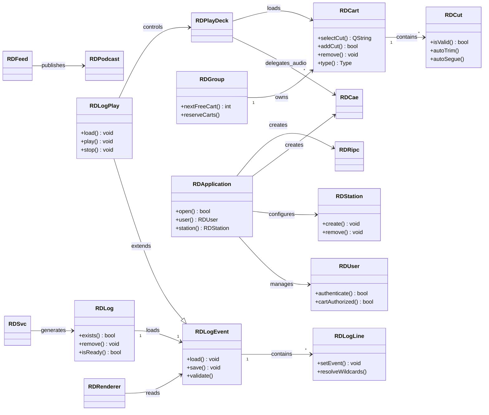

# LIB (librd) — Inventory

## Statistics

| Category | Count |
|----------|-------|
| **Plain C++ / Active Record** | 68 |
| **QObject (services/engines)** | 32 |
| **QWidget derivatives** | 22 |
| **QDialog derivatives (RDDialog)** | 18 |
| **QPushButton derivatives** | 3 |
| **QComboBox derivatives** | 3 |
| **QValidator derivatives** | 2 |
| **QAbstractListModel** | 1 |
| **QIODevice derivative** | 1 |
| **QPainter derivative** | 1 |
| **QFile derivative** | 1 |
| **QStringList derivative** | 1 |
| **Q3Url derivative** | 1 |
| **Header-only (globals/constants)** | 3 |
| **Global utility functions** | 15 |
| **Value Objects / DTOs** | 14 |
| **Factory functions** | 1 |
| **TOTAL** | ~193 |

---

## Class Inheritance Diagram

```mermaid
classDiagram
    direction TB
    QObject <|-- RDApplication
    QObject <|-- RDCae
    QObject <|-- RDRipc
    QObject <|-- RDCatchConnect
    QObject <|-- RDLogPlay
    QObject <|-- RDPlayDeck
    QObject <|-- RDMacroEvent
    QObject <|-- RDRenderer
    QObject <|-- RDFeed
    QObject <|-- RDTimeEngine
    QObject <|-- RDAudioConvert
    QObject <|-- RDAudioExport
    QObject <|-- RDAudioImport
    QObject <|-- RDAudioInfo
    QObject <|-- RDAudioStore
    QObject <|-- RDTrimAudio
    QObject <|-- RDRehash
    QObject <|-- RDCdPlayer
    QObject <|-- RDCdRipper
    QObject <|-- RDGpio
    QObject <|-- RDKernelGpio
    QObject <|-- RDOneShot
    QObject <|-- RDCodeTrap
    QObject <|-- RDEventPlayer
    QObject <|-- RDProcess
    QObject <|-- RDDbHeartbeat
    QObject <|-- RDLogLock
    QObject <|-- RDLiveWire
    QObject <|-- RDMulticaster
    QObject <|-- RDDataPacer
    QObject <|-- RDTransfer
    RDTransfer <|-- RDDownload
    RDTransfer <|-- RDUpload
    RDTransfer <|-- RDDelete
    QTcpSocket <|-- RDSocket
    QWidget <|-- RDWidget
    QWidget <|-- RDStereoMeter
    QWidget <|-- RDSegMeter
    QWidget <|-- RDSimplePlayer
    QWidget <|-- RDGpioSelector
    RDWidget <|-- RDSoundPanel
    RDWidget <|-- RDCartSlot
    RDWidget <|-- RDSlotBox
    RDWidget <|-- RDCueEdit
    RDWidget <|-- RDDatePicker
    RDWidget <|-- RDCardSelector
    RDWidget <|-- RDListSelector
    RDWidget <|-- RDLogFilter
    QDialog <|-- RDDialog
    RDDialog <|-- RDCartDialog
    RDDialog <|-- RDCutDialog
    RDDialog <|-- RDEditAudio
    RDDialog <|-- RDImportAudio
    RDDialog <|-- RDDiscLookup
    RDDialog <|-- RDSlotDialog
    RDDialog <|-- RDButtonDialog
    RDDialog <|-- RDCueEditDialog
    RDDialog <|-- RDBusyDialog
    RDDialog <|-- RDDateDialog
    RDDialog <|-- RDAddCart
    RDDialog <|-- RDAddLog
    RDDialog <|-- RDGetPasswd
    RDDialog <|-- RDPasswd
    RDDialog <|-- RDListLogs
    RDDialog <|-- RDListGroups
    RDDialog <|-- RDListSvcs
    RDDialog <|-- RDExportSettingsDialog
    RDDialog <|-- RDWaveDataDialog
    RDDialog <|-- RDSchedCodesDialog
    RDDiscLookup <|-- RDCddbLookup
    RDDiscLookup <|-- RDMbLookup
    RDDiscLookup <|-- RDDummyLookup
    QPushButton <|-- RDPushButton
    QPushButton <|-- RDTransportButton
    RDPushButton <|-- RDPanelButton
    QComboBox <|-- RDComboBox
    QComboBox <|-- RDImagePickerBox
    QComboBox <|-- RDRssCategoryBox
    QLineEdit <|-- RDLineEdit
    QAbstractListModel <|-- RDImagePickerModel
    QValidator <|-- RDTextValidator
    QIntValidator <|-- RDIdValidator
```

## Domain Dependency Diagram

---

## 1. Core Domain

### RDCart
**Typ:** Plain C++ / Active Record | **Plik:** `lib/rdcart.h` | **DB:** CART
Central audio container model. Each cart holds 1..999 cuts and provides metadata (title, artist, album), cut selection with rotation/weight/dayparting/date-validity logic, and full CRUD against the CART table. Supports audio and macro cart types.

| Enum | Values | Purpose |
|------|--------|---------|
| Type | Audio=1, Macro=2, All=3 | Cart content type |
| Validity | NeverValid, ConditionallyValid, FutureValid, AlwaysValid, EvergreenValid | Cut availability classification |
| PlayOrder | Sequence=0, Random=1 | How cuts rotate during playout |
| UsageCode | Feature=0, Open=1, Close=2, Theme=3, Background=4, Promo=5, Legal=6, Other=7 | Radio usage category |

- Cut selection respects START/END_DATETIME, daypart windows, day-of-week, rotation (sequential or weighted), and evergreen fallback.
- `create()` auto-assigns cart number from group range if not specified.
- `removeCut()` deletes audio (locally or via XPORT API), removes DB record, and resets rotation.

### RDCut
**Typ:** Plain C++ / Active Record | **Plik:** `lib/rdcart.h` | **DB:** CUTS
Represents a single audio segment within a cart. Manages audio markers (start/end/segue/talk/hook/fade points), scheduling windows (daypart, date validity, day-of-week), play counter, and audio file operations (auto-trim, auto-segue, hash verification).

- `autoTrim()` / `autoSegue()` request server-side silence detection and apply results to marker points.
- `logPlayout()` increments play counter and records last play datetime.
- Scheduling: each cut has independent date validity windows and day-of-week availability masks.

### RDLog
**Typ:** Plain C++ / Active Record | **Plik:** `lib/rdlog.h` | **DB:** LOGS
Represents a broadcast log (daily playlist). Manages log metadata (service, origin, dates, link status, track counts) and lifecycle operations (create, delete, exists, readiness check).

- **Readiness rule:** A log is ready when music links are done, traffic links are done, and all scheduled voice tracks are completed.
- **Deletion cascade:** removes voice-track carts, LOG_LINES, then LOGS record.
- Purge date calculated from service shelflife configuration.

### RDLogEvent
**Typ:** Plain C++ | **Plik:** `lib/rdlog_event.h` | **DB:** LOG_LINES, LOGS, CART, CUTS, GROUPS
In-memory ordered container for log lines. Provides load/save/validate/manipulate operations on the sequence of RDLogLine entries comprising a broadcast log.

- Bulk save uses DELETE-all then INSERT-all pattern.
- Validation is date-aware: checks cut availability against date, time, daypart, and day-of-week constraints.
- Supports log concatenation via `append()`.

### RDLogLine
**Typ:** Plain C++ | **Plik:** `lib/rdlog_line.h` | **DB:** CART, CUTS, GROUPS
Single log event with ~100 fields and ~200 accessors. Holds cart/cut metadata, multi-layer audio points (CartPointer/LogPointer/AutoPointer), transition settings, scheduling data, and runtime playback state.

| Enum | Key Values | Purpose |
|------|------------|---------|
| Type | Cart, Marker, Macro, Chain, Track, MusicLink, TrafficLink | Event type in log |
| TransType | Play, Segue, Stop | Transition to next event |
| TimeType | Relative, Hard | Start time mode |
| Status | Scheduled, Playing, Finished, Paused | Runtime state |

- Three-layer pointer system: CartPointer (from CUTS), LogPointer (manual override), AutoPointer (timescaling).
- `setEvent()` prepares event for playback: selects cut, loads audio points, applies timescaling.
- `resolveWildcards()` replaces ~30 template placeholders (%t=title, %a=artist, etc.).

### RDGroup
**Typ:** Plain C++ / Active Record | **Plik:** `lib/rdgroup.h` | **DB:** GROUPS, CART
Cart group organizer with configurable number ranges, lifecycle policies, and reporting flags.

- `nextFreeCart()` scans CART table for gaps in the group's range.
- `reserveCarts()` atomically reserves a contiguous block of cart numbers with rollback on conflicts.
- `cartNumberValid()` enforces range constraints when enabled.

### RDUser
**Typ:** Plain C++ / Active Record | **Plik:** `lib/rduser.h` | **DB:** USERS, USER_PERMS, FEED_PERMS, WEBAPI_AUTHS
User account model with profile, 20+ boolean privilege flags, dual authentication (local DB hash or PAM), group-based resource authorization, and Web API ticket management.

- `authenticated()` supports local password check and PAM delegation.
- `cartAuthorized()` verifies cart group membership through USER_PERMS.
- `createTicket()` generates SHA1-based session tokens for Web API.

### RDStation
**Typ:** Plain C++ / Active Record | **Plik:** `lib/rdstation.h` | **DB:** STATIONS + ~25 related tables
Workstation/host model with audio hardware configuration, codec capabilities, and application settings.

| Enum | Values | Purpose |
|------|--------|---------|
| AudioDriver | None, Hpi, Jack, Alsa | Sound card driver type |
| Capability | HaveOggenc, HaveFlac, HaveLame, etc. | Codec availability flags |

- `create()` provisions a complete station across 25+ dependent tables.
- `remove()` cascade-deletes from all dependent tables.

### RDSvc
**Typ:** Plain C++ / Active Record | **Plik:** `lib/rdsvc.h` | **DB:** SERVICES, IMPORTER_LINES
Represents a broadcast service (e.g., a radio station's programming stream). Manages log generation, traffic/music data import, and voicetrack metadata templates.

- `generateLog()` creates a new log for a given date by iterating through the service's clock grid.
- `importData()` parses traffic/music schedule files using configurable field position maps.

---

## 2. Services (QObject)

### RDApplication
**Typ:** QObject (singleton) | **Plik:** `lib/rdapplication.h` | **DB:** via subsystems
Central application singleton (global `rda` pointer). Initializes config, database, syslog, and all subsystem accessors (station, user, CAE, RIPC, configs). Manages user session lifecycle and provides centralized logging.

| Signal | Emitted When |
|--------|-------------|
| `userChanged()` | Active user session changes |

- `open()` performs full initialization: parse CLI, load rd.conf, verify systemd service, open DB, validate schema, create all subsystem objects.
- Manages temporary file cleanup via atexit callback.

### RDCae
**Typ:** QObject | **Plik:** `lib/rdcae.h` | **DB:** none (IPC only)
Client proxy for the Core Audio Engine daemon (`caed`). Controls audio playback, recording, metering, and hardware configuration via TCP text protocol on port 5005, with UDP meter data.

| Signal | Emitted When |
|--------|-------------|
| `playing(handle)` | Playback started |
| `playStopped(handle)` | Playback stopped |
| `playPositionChanged(handle, sample)` | Position update |
| `recordLoaded/recording/recordStopped/recordUnloaded` | Recording lifecycle |
| `timescalingSupported(card, state)` | Card timescale capability report |

- `loadPlay()` is synchronous-blocking with busy-wait polling.
- Position change detection runs every 20ms comparing UDP positions with last-emitted values.

### RDRipc
**Typ:** QObject | **Plik:** `lib/rdripc.h` | **DB:** HOSTVARS
Client for the Rivendell IPC daemon (`ripcd`). Bidirectional text protocol over TCP for user management, GPI/GPO state, RML macro dispatch, and system notifications.

| Signal | Emitted When |
|--------|-------------|
| `connected(bool)` | First user response received |
| `userChanged()` | User identity changed |
| `gpiStateChanged/gpoStateChanged` | GPIO state change (mask-filtered) |
| `rmlReceived(RDMacro*)` | RML macro received |
| `notificationReceived(RDNotification*)` | System notification |
| `onairFlagChanged(bool)` | On-air flag change |

### RDLogPlay
**Typ:** QObject + RDLogEvent | **Plik:** `lib/rdlogplay.h` | **DB:** ELR_LINES, LOG_LINES, LOGS
Central playout engine managing real-time broadcast log execution. Handles event chaining, timed starts, segue transitions, Now/Next PAD updates, and operation modes (Auto/Manual).

- Supports up to 7 simultaneous overlapping audio events.
- `refresh()` performs 4-pass merge of DB changes into running log without interrupting playback.
- Logs every play/stop/finish event to ELR_LINES for traffic reconciliation.
- Sends Now/Next JSON over Unix domain socket to rdpadd.

### RDPlayDeck
**Typ:** QObject | **Plik:** `lib/rdplay_deck.h` | **DB:** none (delegates to RDCae)
Single audio playout deck abstraction. Manages the full lifecycle of playing one audio file with timer-based segue, hook, talk, fade, and duck points.

| Signal | Emitted When |
|--------|-------------|
| `stateChanged(id, State)` | Deck state changes (Stopped/Playing/Paused/Finished) |
| `position(id, msecs)` | Position update every 100ms |
| `segueStart/segueEnd(id)` | Segue region reached |
| `talkStart/talkEnd(id)` | Talk region reached |

- Timescale speed calculated as ratio of actual audio length to forced length.
- Duck and fade interact: fade-down suppressed when duck-down active.

### RDCatchConnect
**Typ:** QObject | **Plik:** `lib/rdcatch_connect.h` | **DB:** none (TCP protocol)
TCP client for the rdcatchd scheduling daemon. Sends commands and receives async status/events with heartbeat watchdog.

### RDMacroEvent
**Typ:** QObject | **Plik:** `lib/rdmacro_event.h` | **DB:** CART, HOSTVARS
Container for RML macro lists with sequential execution, sleep/pause support, and host variable resolution.

### RDRenderer
**Typ:** QObject | **Plik:** `lib/rdrenderer.h` | **DB:** none (delegates)
Renders a broadcast log into a single audio file by sequentially mixing overlapping audio events with segue gain ramps. Supports render-to-file and render-to-cart modes.

### RDTimeEngine
**Typ:** QObject | **Plik:** `lib/rdtimeengine.h` | **DB:** none
Schedules events to fire at specific wall-clock times. Manages a single QTimer targeting the next upcoming event.

### RDOneShot
**Typ:** QObject | **Plik:** `lib/rdoneshot.h` | **DB:** none
Pool of dynamically created one-shot timers that auto-clean after firing.

### RDCodeTrap
**Typ:** QObject | **Plik:** `lib/rdcodetrap.h` | **DB:** none
Character sequence pattern matcher for detecting control codes in byte streams (serial port, protocol triggers).

### RDEventPlayer
**Typ:** QObject | **Plik:** `lib/rdevent_player.h` | **DB:** none
Asynchronous RML command executor with a fixed-size pool of RDMacroEvent slots and garbage collection.

### RDProcess
**Typ:** QObject | **Plik:** `lib/rdprocess.h` | **DB:** none
QProcess wrapper adding numeric ID and started/finished signals with that ID.

### RDDbHeartbeat
**Typ:** QObject | **Plik:** `lib/rddbheartbeat.h` | **DB:** keepalive SELECT
Periodic lightweight SQL query to prevent MySQL connection timeout.

### RDLogLock
**Typ:** QObject | **Plik:** `lib/rdloglock.h` | **DB:** LOGS
Database-backed edit lock for logs with periodic heartbeat refresh and automatic expiration.

---

## 3. Audio Operations

### RDAudioConvert
**Typ:** QObject | **Plik:** `lib/rdaudioconvert.h` | **DB:** none
Three-stage audio conversion pipeline: Decode (any format to WAV32), Transform (normalize/resample/rechannelize/tempo), Encode (to target format). Supports WAV, MPEG L2/L3, Ogg Vorbis, FLAC, AIFF, ATX, TMC, M4A. Applies ID3v2 metadata and RDXL cart XML.

- Libraries loaded dynamically via dlopen (libmad, libmp3lame, libtwolame).
- Speed ratio change via SoundTouch (tempo without pitch shift).

### RDAudioExport
**Typ:** QObject | **Plik:** `lib/rdaudioexport.h` | **DB:** none (HTTP)
Client proxy for exporting audio cuts from the RDXport web service. Posts cart/cut/format parameters, receives audio file via HTTP.

### RDAudioImport
**Typ:** QObject | **Plik:** `lib/rdaudioimport.h` | **DB:** none (HTTP)
Client proxy for importing audio files into the system via RDXport web service multipart POST.

### RDAudioInfo
**Typ:** QObject | **Plik:** `lib/rdaudioinfo.h` | **DB:** none (HTTP)
Remote client retrieving audio metadata (format, channels, sample rate, length) for a cart/cut from RDXport.

### RDAudioStore
**Typ:** QObject | **Plik:** `lib/rdaudiostore.h` | **DB:** none (HTTP)
Remote client querying audio storage capacity (free/total bytes) from RDXport.

### RDTrimAudio
**Typ:** QObject | **Plik:** `lib/rdtrimaudio.h` | **DB:** none (HTTP)
Remote client requesting silence-trim analysis for a cart/cut from RDXport.

### RDCopyAudio
**Typ:** Plain C++ | **Plik:** `lib/rdcopyaudio.h` | **DB:** none (HTTP)
Copies audio data between cuts via RDXport web service.

### RDRehash
**Typ:** QObject | **Plik:** `lib/rdrehash.h` | **DB:** none (HTTP)
Triggers server-side SHA-1 hash recalculation for a cart/cut audio file via RDXport.

### RDDelete
**Typ:** QObject (extends RDTransfer) | **Plik:** `lib/rddelete.h` | **DB:** none
Deletes remote files via FTP/SFTP/FTPS/local filesystem using libcurl. Lenient error handling: "file not found" treated as success.

### RDPeaksExport
**Typ:** Plain C++ | **Plik:** `lib/rdpeaksexport.h` | **DB:** none (HTTP)
Fetches waveform peak/energy data from RDXport for visual display. Returns raw unsigned short array.

### RDCdPlayer
**Typ:** QObject | **Plik:** `lib/rdcdplayer.h` | **DB:** none
Linux CD-ROM player abstraction via kernel CDROM ioctl. Transport controls, TOC reading, CDDB disc identification, media change detection.

### RDCdRipper
**Typ:** QObject | **Plik:** `lib/rdcdripper.h` | **DB:** none
Rips audio tracks from physical CD to WAV using cdparanoia library and libsndfile. Progress reporting and abort capability.

---

## 4. Scheduler / Report

### RDEvent
**Typ:** Plain C++ / Active Record | **Plik:** `lib/rdevent.h` | **DB:** EVENTS
Scheduler event template defining properties for log generation: preposition, grace time, autofill, timescale, transitions, import source, scheduler group, and anti-repeat separation.

### RDEventLine
**Typ:** Plain C++ | **Plik:** `lib/rdevent_line.h` | **DB:** EVENTS, LOG_LINES, STACK_LINES, IMPORTER_LINES
Single event line in a clock. Links an event to a time position and handles log generation and linking. Key class in the log generation pipeline.

### RDEventImportList
**Typ:** Plain C++ | **Plik:** `lib/rdeventimportlist.h` | **DB:** EVENT_LINES
Managed collection of pre/post-import items for scheduler events. Persists to EVENT_LINES table.

### RDClock
**Typ:** Plain C++ | **Plik:** `lib/rdclock.h` | **DB:** CLOCKS, CLOCK_LINES
Clock template defining event layout for one hour. Contains RDEventLine collection and generates log sections.

### RDRecording
**Typ:** Plain C++ / Active Record | **Plik:** `lib/rdrecording.h` | **DB:** RECORDINGS, FEEDS
Scheduled recording/event model supporting recording, macro, switch, playout, download, and upload event types. Configures start/end modes (hard time, GPI trigger, length), day-of-week scheduling.

### RDReport
**Typ:** Plain C++ | **Plik:** `lib/rdreport.h` | **DB:** REPORTS, ELR_LINES, REPORT_STATIONS/GROUPS/SERVICES
Report generation engine with 22 export format filters (CBSI DeltaFlex, TextLog, BMI EMR, SoundExchange, RadioTraffic, VisualTraffic, WideOrbit, SpinCount, etc.). Each format implemented in a separate export_*.cpp file.

### RDSchedCode
**Typ:** Plain C++ / Active Record | **Plik:** `lib/rdschedcode.h` | **DB:** SCHED_CODES
Scheduler code entity for cart tagging. Used by scheduling engine for rotation and separation rules.

### RDSchedRulesList
**Typ:** Plain C++ | **Plik:** `lib/rdschedruleslist.h` | **DB:** RULE_LINES
Collection of scheduler rules (code + max-in-row + min-wait) for a clock. Manages rule persistence.

### RDSchedCartList
**Typ:** Plain C++ | **Plik:** `lib/rdschedcartlist.h` | **DB:** via SQL
List of carts matching scheduler criteria. Used during log generation to find eligible carts.

### RDGrid
**Typ:** Plain C++ / Active Record | **Plik:** `lib/rdgrid.h` | **DB:** SERVICE_CLOCKS
Weekly clock grid (7 days x 24 hours) mapping each hour-slot to a clock template for a service.

### RDReplicator
**Typ:** Plain C++ / Active Record | **Plik:** `lib/rdreplicator.h` | **DB:** REPLICATORS
Replicator configuration for synchronizing carts between Rivendell instances.

### RDDropbox
**Typ:** Plain C++ / Active Record | **Plik:** `lib/rddropbox.h` | **DB:** DROPBOXES
Dropbox configuration for automatic import of audio files from monitored directories.

### RDDeck
**Typ:** Plain C++ / Active Record | **Plik:** `lib/rddeck.h` | **DB:** DECKS
Record/play deck configuration per station. Manages audio card/port assignments and deck status.

---

## 5. Configuration

### RDConfig
**Typ:** Plain C++ | **Plik:** `lib/rdconfig.h` | **DB:** none (file: /etc/rd.conf)
System configuration from rd.conf INI file. Provides database credentials, audio store path, syslog facility, station name, service timeout, font settings, and transcoding delay.

### RDSystem
**Typ:** Plain C++ / Active Record | **Plik:** `lib/rdsystem.h` | **DB:** SYSTEM
System-wide settings: sample rate, max POST size, temp directory, DuplicateCarts policy, fix-duplicate-carts flag, show-user-list, realm name.

### RDAirPlayConf
**Typ:** Plain C++ / Active Record | **Plik:** `lib/rdairplay_conf.h` | **DB:** RDAIRPLAY, RDAIRPLAY_CHANNELS, LOG_MACHINES, LOG_MODES
Most complex configuration class. Manages per-station RDAirPlay settings: audio channels, GPIO triggers, log machines, operation modes, panel settings, display templates, exit security.

### RDLibraryConf
**Typ:** Plain C++ / Active Record | **Plik:** `lib/rdlibrary_conf.h` | **DB:** RDLIBRARY, SYSTEM
Per-station RDLibrary settings: recording defaults (format, channels, bitrate), CD ripper config, metadata server (CDDB/MusicBrainz), search behavior.

### RDLogeditConf
**Typ:** Plain C++ / Active Record | **Plik:** `lib/rdlogedit_conf.h` | **DB:** RDLOGEDIT, SYSTEM
Per-station RDLogEdit settings: audio I/O, recording defaults, voicetrack parameters, macro cart triggers.

### RDCatchConf
**Typ:** Plain C++ / Active Record | **Plik:** `lib/rdcatch_conf.h` | **DB:** RDCATCH
Per-station RDCatch settings. Currently stores only the error RML macro.

### RDMonitorConfig
**Typ:** Plain C++ | **Plik:** `lib/rdmonitor_config.h` | **DB:** none (file: ~/.rdmonitorrc)
File-based display position and screen assignment for RDMonitor application.

### RDAudioPort
**Typ:** Plain C++ | **Plik:** `lib/rdaudio_port.h` | **DB:** AUDIO_CARDS, AUDIO_INPUTS, AUDIO_OUTPUTS
Per-station, per-card audio port configuration. Caches port data in arrays at construction (unlike other config classes).

---

## 6. Network / Transfer

### RDSocket
**Typ:** QTcpSocket derivative | **Plik:** `lib/rdsocket.h` | **DB:** none
Extended TCP socket adding a connection watchdog timer.

### RDUnixServer
**Typ:** QObject | **Plik:** `lib/rdunixserver.h` | **DB:** none
Unix domain socket server accepting local connections. Used by rdpadd for PAD data.

### RDUnixSocket
**Typ:** QObject | **Plik:** `lib/rdunixsocket.h` | **DB:** none
Unix domain socket client for local IPC. Used for Now/Next PAD data delivery.

### RDDownload
**Typ:** QObject (extends RDTransfer) | **Plik:** `lib/rddownload.h` | **DB:** none
Downloads files from remote URLs (file/ftp/ftps/http/https/sftp) using libcurl. Progress reporting, abort capability, structured error codes.

### RDUpload
**Typ:** QObject (extends RDTransfer) | **Plik:** `lib/rdupload.h` | **DB:** none
Uploads files to remote URLs (ftp/ftps/sftp) using libcurl. Progress reporting, abort capability.

### RDTransfer
**Typ:** QObject | **Plik:** `lib/rdtransfer.h` | **DB:** none
Base class for file transfer operations (RDDownload, RDUpload, RDDelete). Provides URL scheme validation and config access.

### RDLiveWire
**Typ:** QObject | **Plik:** `lib/rdlivewire.h` | **DB:** none
Axia LiveWire audio protocol client. Communicates with LiveWire nodes for source/destination configuration and GPIO control.

### RDMulticaster
**Typ:** QObject | **Plik:** `lib/rdmulticaster.h` | **DB:** none
UDP multicast sender/receiver for LiveWire advertisement protocol.

### RDDataPacer
**Typ:** QObject | **Plik:** `lib/rddatapacer.h` | **DB:** none
Throttled data sender ensuring bytes are sent at a controlled rate (pacing for serial/network protocols).

---

## 7. Feed / Podcast

### RDFeed
**Typ:** QObject | **Plik:** `lib/rdfeed.h` | **DB:** FEEDS, PODCASTS, FEED_IMAGES, SUPERFEED_MAPS, FEED_PERMS
Podcast/RSS feed management. Handles feed metadata, RSS XML generation, audio content posting (from cuts, files, or rendered logs), image management, and superfeed aggregation.

| Signal | Emitted When |
|--------|-------------|
| `postProgressChanged(int)` | During multi-step posting operations |
| `postProgressRangeChanged(int, int)` | At start of posting |

- `postCut()` / `postFile()` / `postLog()` export audio, create podcast entry, upload, update RSS.
- `rssXml()` generates complete RSS document with schema templates and item filtering.
- Superfeed aggregates items from multiple sub-feeds.

### RDPodcast
**Typ:** Plain C++ / Active Record | **Plik:** `lib/rdpodcast.h` | **DB:** PODCASTS, FEEDS
Single podcast episode/item. Manages metadata (title, description, author, status, dates) and audio removal from remote store.

### RDRssSchemas
**Typ:** Plain C++ | **Plik:** `lib/rdrssschemas.h` | **DB:** none
Registry of RSS schema templates (header, channel, item XML) and constraints (image sizes, category support) per schema type.

---

## 8. UI Widgets

### RDSoundPanel
**Typ:** RDWidget | **Plik:** `lib/rdsound_panel.h` | **DB:** PANELS, EXTENDED_PANELS
Main sound panel widget for RDAirPlay. Grid of programmable buttons playing audio carts or macros with panel selector, play mode switching, and button configuration.

### RDCartSlot
**Typ:** RDWidget | **Plik:** `lib/rdcartslot.h` | **DB:** CARTSLOTS
Cart slot widget for RDAirPlay's cart slot deck. Supports standard and breakaway modes with load/unload/play/pause/stop controls.

### RDSlotBox
**Typ:** RDWidget | **Plik:** `lib/rdslotbox.h` | **DB:** none
Cart slot label/display with metadata, progress bar, and stereo meters. Supports drag-and-drop.

### RDPanelButton
**Typ:** RDPushButton | **Plik:** `lib/rdpanel_button.h` | **DB:** none
Individual sound panel button with visual state (idle/playing/paused), countdown timer, color coding, and flash animation.

### RDButtonPanel
**Typ:** Plain C++ | **Plik:** `lib/rdbutton_panel.h` | **DB:** none
Container managing a grid of RDPanelButton widgets for one panel page.

### RDEditAudio
**Typ:** RDDialog | **Plik:** `lib/rdedit_audio.h` | **DB:** via RDCut
Advanced audio editor with waveform visualization, 11 marker types, zoom, playback with looping, trim, and gain adjustment.

### RDImportAudio
**Typ:** RDDialog | **Plik:** `lib/rdimport_audio.h` | **DB:** none
Import/export audio dialog with file selection, normalization, autotrim, and channel configuration.

### RDSimplePlayer
**Typ:** QWidget | **Plik:** `lib/rdsimpleplayer.h` | **DB:** none
Minimal play/stop widget for previewing single carts/cuts.

### RDCueEdit
**Typ:** RDWidget | **Plik:** `lib/rdcueedit.h` | **DB:** none
Cue point editor widget with position slider, audition controls, and start/end marker editing.

### RDStereoMeter
**Typ:** QWidget | **Plik:** `lib/rdstereometer.h` | **DB:** none
Dual-channel stereo level meter (LED-bar style) with peak hold.

### RDSegMeter
**Typ:** QWidget | **Plik:** `lib/rdsegmeter.h` | **DB:** none
Segmented bar-graph level meter for single channel audio display.

### RDPlayMeter
**Typ:** QWidget | **Plik:** `lib/rdplaymeter.h` | **DB:** none
Horizontal/vertical play level meter with peak indicator.

### RDSlider
**Typ:** QWidget | **Plik:** `lib/rdslider.h` | **DB:** none
Custom slider widget for audio position/level control.

### RDBusyBar
**Typ:** QWidget | **Plik:** `lib/rdbusybar.h` | **DB:** none
Indeterminate progress bar (busy indicator) for long operations.

### RDEmptyCart
**Typ:** QWidget | **Plik:** `lib/rdemptycart.h` | **DB:** none
Visual placeholder widget for empty cart slots.

### RDCartDrag
**Typ:** Plain C++ | **Plik:** `lib/rdcartdrag.h` | **DB:** none
Cart drag-and-drop data wrapper encoding cart number and color for QDrag operations.

### RDListView / RDListViewItem
**Typ:** Q3ListView/Q3ListViewItem derivatives | **Plik:** `lib/rdlistview.h` | **DB:** none
Extended list view with column sorting, color support, and per-item data storage.

### RDWavePainter
**Typ:** QPainter derivative | **Plik:** `lib/rdwavepainter.h` | **DB:** none (via RDPeaksExport)
Waveform renderer drawing peak data on any QPaintDevice. Not a widget.

### RDMarkerEdit
**Typ:** QLineEdit | **Plik:** `lib/rdmarker_edit.h` | **DB:** none
Marker value text field with Escape key signal for cancel.

### RDMarkerBar
**Typ:** QWidget | **Plik:** `lib/rdmarker_bar.h` | **DB:** none
Visual indicator bar showing marker positions within audio region.

### RDMarkerButton
**Typ:** QPushButton | **Plik:** `lib/rdmarker_button.h` | **DB:** none
Toggle button for selecting active marker type in audio editor.

### RDWidget
**Typ:** QWidget + RDFontEngine | **Plik:** `lib/rdwidget.h` | **DB:** none
Base class for all Rivendell non-dialog widgets. Provides DPI-aware font engine.

### RDDialog
**Typ:** QDialog + RDFontEngine | **Plik:** `lib/rddialog.h` | **DB:** none
Base class for all Rivendell modal dialogs. Provides DPI-aware font engine and modal behavior.

### RDFrame
**Typ:** QFrame + RDFontEngine | **Plik:** `lib/rdframe.h` | **DB:** none
Base class for Rivendell QFrame-based containers with DPI-aware font engine.

### RDPushButton
**Typ:** QPushButton + RDFontEngine | **Plik:** `lib/rdpushbutton.h` | **DB:** none
Extended push button with flashing, word-wrap, middle/right-click signals.

### RDTransportButton
**Typ:** QPushButton | **Plik:** `lib/rdtransportbutton.h` | **DB:** none
Audio transport icon button (Play/Stop/Record/FF/Rewind/Eject/Pause) with On/Off/Flashing states.

### RDComboBox
**Typ:** QComboBox | **Plik:** `lib/rdcombobox.h` | **DB:** none
Extended combo box with setup mode, unique item insertion, and key filtering.

### RDLineEdit
**Typ:** QLineEdit | **Plik:** `lib/rdlineedit.h` | **DB:** none
Line edit emitting `escapePressed()` signal.

### RDFontEngine
**Typ:** Plain C++ (mixin) | **Plik:** `lib/rdfontengine.h` | **DB:** none
DPI-aware font calculation engine providing named font presets. Used via multiple inheritance by RDWidget, RDDialog, RDFrame, RDPushButton.

### RDTimeEdit
**Typ:** Q3Frame derivative | **Plik:** `lib/rdtimeedit.h` | **DB:** none
Time editor (HH:MM:SS.mmm) with millisecond precision.

### RDDatePicker
**Typ:** RDWidget | **Plik:** `lib/rddatepicker.h` | **DB:** none
Calendar grid widget for date selection.

### RDGpioSelector
**Typ:** QWidget | **Plik:** `lib/rdgpioselector.h` | **DB:** none
GPIO matrix and line selector widget.

### RDCardSelector
**Typ:** RDWidget | **Plik:** `lib/rdcardselector.h` | **DB:** AUDIO_CARDS
Audio card and port selector with cascading port filtering.

### RDListSelector
**Typ:** RDWidget | **Plik:** `lib/rdlistselector.h` | **DB:** none
Dual-list selector (available/selected) with Add/Remove buttons.

### RDLogFilter
**Typ:** QWidget | **Plik:** `lib/rdlogfilter.h` | **DB:** none
Log filter widget generating SQL WHERE clauses for service/type/text filtering.

### RDImagePickerModel
**Typ:** QAbstractListModel | **Plik:** `lib/rdimagepickermodel.h` | **DB:** FEED_IMAGES
Image thumbnail model for podcast feed image selection.

### RDImagePickerBox
**Typ:** QComboBox | **Plik:** `lib/rdimagepickerbox.h` | **DB:** via RDImagePickerModel
ComboBox for selecting podcast/feed images with thumbnails.

### RDRssCategoryBox
**Typ:** QComboBox | **Plik:** `lib/rdrsscategorybox.h` | **DB:** none
ComboBox for Apple Podcasts category selection from RDRssSchemas.

### RDBusyDialog
**Typ:** RDDialog | **Plik:** `lib/rdbusydialog.h` | **DB:** none
Modal dialog with indeterminate progress bar for long-running operations.

---

## 9. Dialogs

### RDCartDialog
**Typ:** RDDialog | **Plik:** `lib/rdcart_dialog.h` | **DB:** CART, GROUPS, SCHED_CODES
Modal cart browser/selector with text/group/scheduler code filtering, optional cart editor launch, and file import.

### RDCutDialog
**Typ:** RDDialog | **Plik:** `lib/rdcut_dialog.h` | **DB:** CART, CUTS
Modal cut selector with two-panel view (carts + cuts for selected cart). Supports filtering and voice track exclusion.

### RDAddCart
**Typ:** RDDialog | **Plik:** `lib/rdadd_cart.h` | **DB:** none
Dialog for creating a new cart: collects group, type (Audio/Macro), and title.

### RDAddLog
**Typ:** RDDialog | **Plik:** `lib/rdadd_log.h` | **DB:** none
Dialog for creating a new log: collects log name and service.

### RDGetPasswd
**Typ:** RDDialog | **Plik:** `lib/rdgetpasswd.h` | **DB:** none
Simple password prompt dialog.

### RDGetAth
**Typ:** RDDialog | **Plik:** `lib/rdget_ath.h` | **DB:** none
Audio threshold value input dialog.

### RDPasswd
**Typ:** RDDialog | **Plik:** `lib/rdpasswd.h` | **DB:** none
Change password dialog with confirmation.

### RDEditPanelName
**Typ:** RDDialog | **Plik:** `lib/rdedit_panel_name.h` | **DB:** none
Panel name editing dialog.

### RDExportSettingsDialog
**Typ:** RDDialog | **Plik:** `lib/rdexport_settings_dialog.h` | **DB:** none
Audio export format configuration dialog (format, channels, sample rate, bitrate, normalization).

### RDWaveDataDialog
**Typ:** RDDialog | **Plik:** `lib/rdwavedata_dialog.h` | **DB:** none
Audio metadata editor dialog (title, artist, album, scheduler codes, etc.).

### RDSchedCodesDialog
**Typ:** RDDialog | **Plik:** `lib/rdschedcodes_dialog.h` | **DB:** SCHED_CODES
Dual-list scheduler code assignment dialog.

### RDListLogs
**Typ:** RDDialog | **Plik:** `lib/rdlist_logs.h` | **DB:** LOGS
Modal log browser/selector with service filtering.

### RDListGroups
**Typ:** RDDialog | **Plik:** `lib/rdlist_groups.h` | **DB:** GROUPS, USER_PERMS
Group selector dialog filtered by user permissions.

### RDListSvcs
**Typ:** RDDialog | **Plik:** `lib/rdlistsvcs.h` | **DB:** SERVICES
Service selector dialog.

### RDSlotDialog
**Typ:** RDDialog | **Plik:** `lib/rdslotdialog.h` | **DB:** none
Cart slot options editor (mode, hook mode, stop action).

### RDButtonDialog
**Typ:** RDDialog | **Plik:** `lib/rdbutton_dialog.h` | **DB:** none
Sound panel button editor (cart assignment, label, color).

### RDCueEditDialog
**Typ:** RDDialog | **Plik:** `lib/rdcueeditdialog.h` | **DB:** none
Modal wrapper around RDCueEdit widget with OK/Cancel.

### RDDateDialog
**Typ:** RDDialog | **Plik:** `lib/rddatedialog.h` | **DB:** none
Modal date picker dialog wrapping RDDatePicker.

### RDDiscLookup
**Typ:** RDDialog (abstract base) | **Plik:** `lib/rddisclookup.h` | **DB:** none
Base class for CD metadata lookup dialogs. Supports CD-Text, ISRC, UPC-A validation.

### RDCddbLookup
**Typ:** RDDiscLookup | **Plik:** `lib/rdcddblookup.h` | **DB:** none
CDDB (FreeDB) protocol implementation for CD metadata lookup via TCP socket.

### RDMbLookup
**Typ:** RDDiscLookup | **Plik:** `lib/rdmblookup.h` | **DB:** none
MusicBrainz API implementation for CD metadata lookup via libmusicbrainz5 and libcoverart.

### RDDummyLookup
**Typ:** RDDiscLookup | **Plik:** `lib/rddummylookup.h` | **DB:** none
Null Object pattern — stub lookup returning empty results when no service configured.

---

## 10. Utility

### RDWaveFile
**Typ:** QFile derivative | **Plik:** `lib/rdwavefile.h` | **DB:** none
Complete audio file handler supporting WAV, MPEG, Ogg Vorbis, FLAC, AIFF, ATX, TMC, M4A. Parses/generates WAV chunks (fmt, data, cart, bext, mext, levl, RDXL). Handles broadcast metadata (AES46/Cart Chunk, BWF/Bext).

### RDWaveData
**Typ:** Plain C++ / DTO | **Plik:** `lib/rdwavedata.h` | **DB:** none
Audio metadata container (~80 fields): title, artist, markers, scheduling, ISRC, ISCI. Used as DTO between components.

### RDMacro
**Typ:** Plain C++ / Value Object | **Plik:** `lib/rdmacro.h` | **DB:** none
Single RML (Rivendell Macro Language) command. Parses/serializes ~80 command types with arguments, address, port, and role.

### RDNotification
**Typ:** Plain C++ / Value Object | **Plik:** `lib/rdnotification.h` | **DB:** none
Event bus message for object change notifications (Cart/Log/Feed/Dropbox + Add/Modify/Delete actions). XML serialization for inter-process transport.

### RDSettings
**Typ:** Plain C++ / Value Object | **Plik:** `lib/rdsettings.h` | **DB:** presets table
Audio format settings container: format, channels, sample rate, bitrate, quality, normalization, autotrim. Supports named presets with DB persistence.

### RDAudioSettings
**Typ:** Plain C++ / Value Object | **Plik:** `lib/rdaudiosettings.h` | **DB:** RDLIBRARY
Advanced audio settings per channel (format, sample rate, bitrate, channels).

### RDDiscRecord
**Typ:** Plain C++ / DTO | **Plik:** `lib/rddiscrecord.h` | **DB:** none
CD metadata container: disc ID, MCN, title, artist, track list with ISRCs and offsets.

### RDLiveWireSource / RDLiveWireDestination
**Typ:** Plain C++ / Value Object | **Plik:** `lib/rdlivewiresource.h`, `lib/rdlivewiredestination.h` | **DB:** none
Axia LiveWire audio source/destination descriptors (channel number, name, stream address).

### RDSlotOptions
**Typ:** Plain C++ / Active Record | **Plik:** `lib/rdslotoptions.h` | **DB:** CARTSLOTS
Cart slot configuration: mode, hook mode, stop action, cart number, service, audio channel.

### RDTty
**Typ:** Plain C++ / Active Record | **Plik:** `lib/rdtty.h` | **DB:** TTYS
Serial port TTY configuration (baud rate, data bits, parity) for RS-232 device control.

### RDMatrix
**Typ:** Plain C++ / Active Record | **Plik:** `lib/rdmatrix.h` | **DB:** MATRICES
Audio switcher/router model supporting ~30 hardware types (Quartz, SAS, LiveWire, BT, etc.) with I/O ports, GPIO lines, RS-232/TCP configuration.

### RDTimEvent
**Typ:** Plain C++ / Value Object | **Plik:** `lib/rdtimeevent.h` | **DB:** none
Time/callback-ID pair for RDTimeEngine scheduled events.

### RDHotkeys
**Typ:** Plain C++ / Active Record | **Plik:** `lib/rdhotkeys.h` | **DB:** HOTKEYS
Per-station keyboard shortcut configuration.

### RDHotKeyList
**Typ:** Plain C++ / Collection | **Plik:** `lib/rdhotkeylist.h` | **DB:** HOTKEYS
Loaded collection of hotkey mappings (key string to action).

### RDGroupList
**Typ:** Plain C++ / Collection | **Plik:** `lib/rdgroup_list.h` | **DB:** GROUPS, USER_PERMS
User-filtered group list.

### RDProfile
**Typ:** Plain C++ | **Plik:** `lib/rdprofile.h` | **DB:** none
INI-style configuration file parser ([Section] + Tag=Value). Used for rd.conf.

### RDFormPost
**Typ:** Plain C++ | **Plik:** `lib/rdformpost.h` | **DB:** none
HTTP POST parser (URL-encoded and multipart/form-data). Handles file uploads. Used by rdxport.

### RDCmdSwitch
**Typ:** Plain C++ | **Plik:** `lib/rdcmd_switch.h` | **DB:** none
Command-line argument parser (--key=value format) with processed-state tracking.

### RDCmdCache
**Typ:** Plain C++ / Collection | **Plik:** `lib/rdcmd_cache.h` | **DB:** none
FIFO command buffer for IPC command queuing.

### RDCartSearchText
**Typ:** Plain C++ / Query Builder | **Plik:** `lib/rdcart_search_text.h` | **DB:** none (generates SQL)
SQL WHERE clause builder for cart searching (text/group/type/scheduler code filtering).

### RDCastSearch
**Typ:** Plain C++ / Query Builder | **Plik:** `lib/rdcastsearch.h` | **DB:** none (generates SQL)
SQL WHERE clause builder for podcast status filtering.

### RDLogIcons
**Typ:** Plain C++ | **Plik:** `lib/rdlog_icons.h` | **DB:** none
Maps log line types to QPixmap icons.

### RDStatus
**Typ:** Plain C++ / Value Object | **Plik:** `lib/rdstatus.h` | **DB:** none
Component status container (Idle/Active/Error with description).

### RDSqlQuery
**Typ:** QSqlQuery derivative | **Plik:** `lib/rddb.h` | **DB:** any
Extended SQL query with automatic reconnect and error logging. Plus `RDOpenDb()` for MySQL connection initialization.

### RDInstanceLock
**Typ:** Plain C++ | **Plik:** `lib/rdinstancelock.h` | **DB:** none
PID file-based process instance lock with stale lock detection.

### RDTempDirectory
**Typ:** Plain C++ | **Plik:** `lib/rdtempdirectory.h` | **DB:** none
RAII temporary directory creation and cleanup.

### RDSystemUser
**Typ:** Plain C++ | **Plik:** `lib/rdsystemuser.h` | **DB:** none
Linux/UNIX system user lookup (getpwnam) with PAM password validation.

### RDPam
**Typ:** Plain C++ | **Plik:** `lib/rdpam.h` | **DB:** none
Linux PAM authentication wrapper.

### RDRingBuffer
**Typ:** Plain C++ | **Plik:** `lib/rdringbuffer.h` | **DB:** none
Lock-free single-producer/single-consumer circular buffer for audio streaming.

### RDMeterAverage
**Typ:** Plain C++ | **Plik:** `lib/rdmeteraverage.h` | **DB:** none
Sliding window average for smooth VU/PPM meter display.

### RDGainEnvelope
**Typ:** Plain C++ | **Plik:** `lib/rdgain_envelope.h` | **DB:** none
Gain envelope (time/gain curve) for fade and ducking in audio rendering.

### RDSendMail
**Typ:** Plain C++ (static) | **Plik:** `lib/rdsendmail.h` | **DB:** none
Email sending via /usr/sbin/sendmail or configurable MTA.

### RDWeb / RDWebResult
**Typ:** Plain C++ | **Plik:** `lib/rdweb.h` | **DB:** none
HTTP/web utilities (XML escaping, MIME type detection) and web API response parser.

### RDUrl
**Typ:** Q3Url derivative | **Plik:** `lib/rdurl.h` | **DB:** none
Extended URL handler adding sftp:// and ftps:// support.

### RDSocketStrings
**Typ:** Plain C++ | **Plik:** `lib/rdsocketstrings.h` | **DB:** none
Socket error code to string conversion utility.

### RDStringList
**Typ:** QStringList derivative | **Plik:** `lib/rdstringlist.h` | **DB:** none
Extended QStringList with escaped-separator split.

### RDCsv
**Typ:** Plain C++ | **Plik:** `lib/rdcsv.h` | **DB:** none
CSV parser and generator with quoted field support.

### RDTextFile
**Typ:** Plain C++ | **Plik:** `lib/rdtextfile.h` | **DB:** none
Simple text file read/write utility (RDReadTextFile/RDWriteTextFile).

### RDFLACDecode
**Typ:** Plain C++ | **Plik:** `lib/rdflacdecode.h` | **DB:** none
FLAC to PCM WAV decoder wrapper around libFLAC.

### RDMp4
**Typ:** Plain C++ | **Plik:** `lib/rdmp4.h` | **DB:** none
MP4/M4A container parser extracting audio metadata (codec, sample rate, channels, duration).

### RDMixer
**Typ:** Plain C++ (global functions) | **Plik:** `lib/rdmixer.h` | **DB:** none
ALSA mixer API wrapper for volume control.

### RDTextValidator
**Typ:** QValidator | **Plik:** `lib/rdtextvalidator.h` | **DB:** none
Text validator rejecting banned characters (', `, ", \) to prevent SQL injection.

### RDIdValidator
**Typ:** QIntValidator | **Plik:** `lib/rdidvalidator.h` | **DB:** none
Numeric ID validator with additional range rules.

### RDGpio
**Typ:** QObject | **Plik:** `lib/rdgpio.h` | **DB:** none
GPIO hardware abstraction for custom kernel driver (/dev/gpio*) and Linux input event subsystem (/dev/input/event*).

### RDKernelGpio
**Typ:** QObject | **Plik:** `lib/rdkernelgpio.h` | **DB:** none
Linux SysFS GPIO interface (/sys/class/gpio) with polling-based change detection.

### RDTtyOut
**Typ:** Plain C++ | **Plik:** `lib/rdttyout.h` | **DB:** none
Serial port TTY output for RS-232 device control.

### RDTtyDevice
**Typ:** QIODevice derivative | **Plik:** `lib/rdttydevice.h` | **DB:** none
Serial port as QIODevice using POSIX termios.

### RDConf (utility functions)
**Typ:** Plain C++ (global functions) | **Plik:** `lib/rdconf.h` | **DB:** none
Utility: RDGetTimeLength (ms to string), RDSetTimeLength (string to ms), path parsing, SQL escaping, daemon checking.

### RDDateDecode
**Typ:** Plain C++ (global function) | **Plik:** `lib/rddatedecode.h` | **DB:** none
Date token decoder (%d, %m, %Y, etc.) for automatic filename generation.

### RDDateTime
**Typ:** Plain C++ (global functions) | **Plik:** `lib/rddatetime.h` | **DB:** none
Date/time conversion utilities (UTC/local, XML parsing, formatting).

### RDEscapeString
**Typ:** Plain C++ (global function) | **Plik:** `lib/rdescape_string.h` | **DB:** none
SQL string escaping (apostrophe, backslash).

### RDCheckVersion
**Typ:** Plain C++ (global function) | **Plik:** `lib/rdcheck_version.h` | **DB:** schema check
Database schema version validation.

### RDAudioExists
**Typ:** Plain C++ (global function) | **Plik:** `lib/rdaudio_exists.h` | **DB:** via HTTP API
Checks audio file existence on server via RDXport.

### RDCutPath
**Typ:** Plain C++ (global function) | **Plik:** `lib/rdcut_path.h` | **DB:** none
Generates filesystem path for a cut name (NNNNNN_NNN to full audio store path).

### RDDiscLookupFactory
**Typ:** Plain C++ (factory) | **Plik:** `lib/rddisclookup_factory.h` | **DB:** none
Factory creating appropriate RDDiscLookup implementation (MusicBrainz, CDDB, or Dummy) based on configuration.

### RDDebug
**Typ:** Plain C++ (global functions) | **Plik:** `lib/rddebug.h` | **DB:** none
Debug logging and hex dump utilities.

### RDHash
**Typ:** Plain C++ (global function) | **Plik:** `lib/rdhash.h` | **DB:** none
SHA-1 file hash computation using OpenSSL.

### RDVersion
**Typ:** Plain C++ (global function) | **Plik:** `lib/rdversion.h` | **DB:** none
Returns Rivendell version string.

---

## 11. Globals / Header-only

### rd.h
**Typ:** Header-only | **Plik:** `lib/rd.h`
Central global definitions: RD_MAX_CARDS (8), RD_MAX_PORTS (8), RD_MAX_STREAMS (9), MAX_DECKS (24), RD_RDXPORT_PORT (80), and dozens of other system constants, port numbers, buffer sizes, and protocol values. Included by virtually every file.

### dbversion.h
**Typ:** Header-only | **Plik:** `lib/dbversion.h`
Defines RD_VERSION_DATABASE -- the current database schema version number used by rddbmgr for migrations and by RDApplication for schema validation.

### rdxport_interface.h
**Typ:** Header-only | **Plik:** `lib/rdxport_interface.h`
Defines ~40 RDXPORT_COMMAND_* constants defining the complete HTTP API between client library and rdxport CGI server: audio operations (EXPORT, IMPORT, DELETE, COPY, TRIM, AUDIOINFO, PEAKS), cart/cut CRUD (LISTCARTS, ADDCART, EDITCART, REMOVECART), log operations (LISTLOGS, ADDLOG, DELETELOG, SAVELOG), scheduler codes, feeds, and podcasts.

---

## Missing Coverage

None. All 193 partial files were processed.

## Conflicts

None found.
