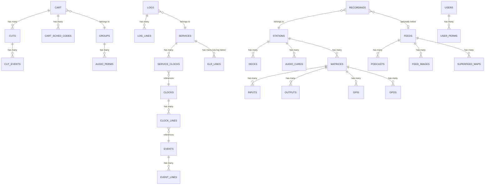
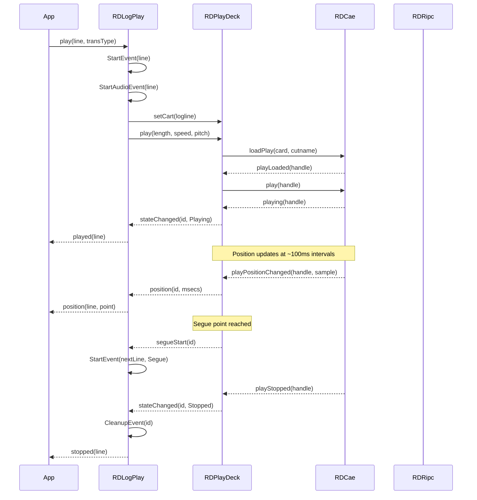
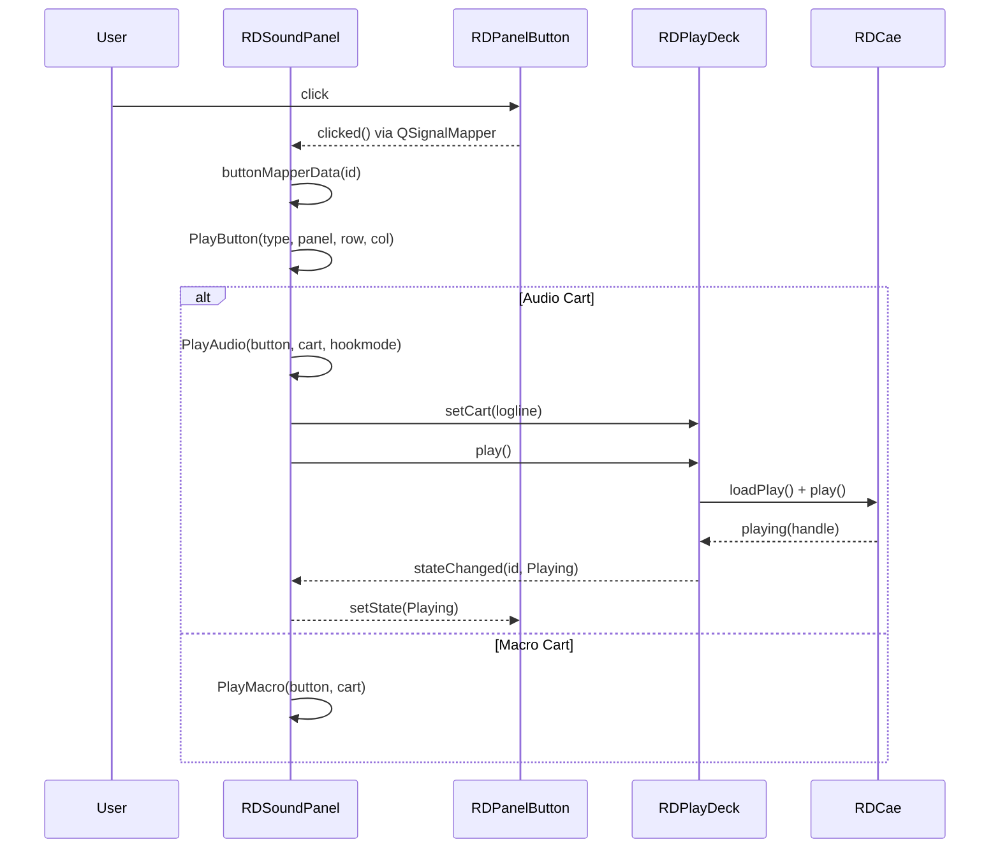
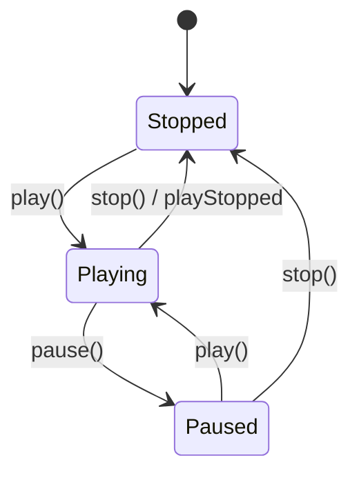
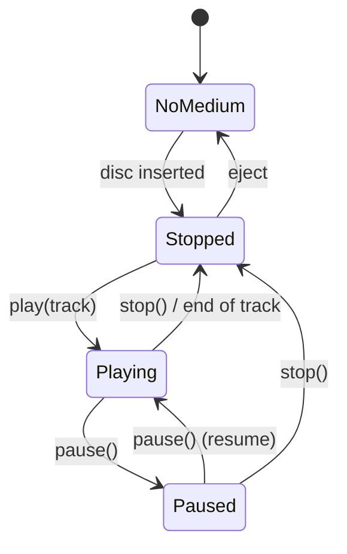
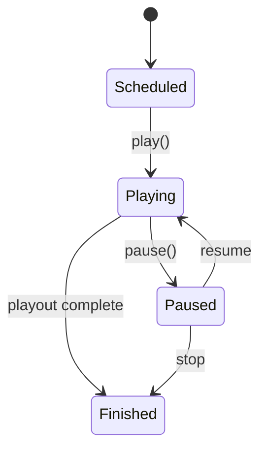

# Semantic Context: LIB (librd)

Core shared library for the Rivendell radio automation system.
All other artifacts depend on this library.

## Section A: Files & Symbols

### Source Files Summary

- **Header files (.h):** 194
- **Source files (.cpp):** 205
- **Total:** 399

### Source Files

| File | Type | Primary Symbols | Category |
|------|------|-----------------|----------|
| rdcart.h / .cpp | header+source | RDCart | Active Record |
| rdcut.h / .cpp | header+source | RDCut | Active Record |
| rdlog.h / .cpp | header+source | RDLog | Active Record |
| rdlog_line.h / .cpp | header+source | RDLogLine | Value Object / DTO |
| rdlog_event.h / .cpp | header+source | RDLogEvent | Collection / Service |
| rdlogplay.h / .cpp | header+source | RDLogPlay | Service (Playback Engine) |
| rdcae.h / .cpp | header+source | RDCae | Service (Audio Engine Client) |
| rdripc.h / .cpp | header+source | RDRipc | Service (IPC Client) |
| rdstation.h / .cpp | header+source | RDStation | Active Record |
| rdconfig.h / .cpp | header+source | RDConfig | Configuration |
| rdapplication.h / .cpp | header+source | RDApplication | Singleton / Application Context |
| rddb.h / .cpp | header+source | RDSqlQuery, RDOpenDb | Utility (Database) |
| rduser.h / .cpp | header+source | RDUser | Active Record |
| rdgroup.h / .cpp | header+source | RDGroup | Active Record |
| rdsvc.h / .cpp | header+source | RDSvc | Active Record + Service |
| rdfeed.h / .cpp | header+source | RDFeed | Active Record + Service (RSS/Podcast) |
| rdpodcast.h / .cpp | header+source | RDPodcast | Active Record |
| rdmatrix.h / .cpp | header+source | RDMatrix | Active Record |
| rdevent.h / .cpp | header+source | RDEvent | Active Record |
| rdclock.h / .cpp | header+source | RDClock | Active Record + Service |
| rdwavefile.h / .cpp | header+source | RDWaveFile | Service (Audio File I/O) |
| rdaudioconvert.h / .cpp | header+source | RDAudioConvert | Service (Format Conversion) |
| rdaudioimport.h / .cpp | header+source | RDAudioImport | Service (Audio Import) |
| rdaudioexport.h / .cpp | header+source | RDAudioExport | Service (Audio Export) |
| rdimport_audio.h / .cpp | header+source | RDImportAudio | UI Widget (Import Dialog) |
| rddownload.h / .cpp | header+source | RDDownload | Service (File Transfer) |
| rdupload.h / .cpp | header+source | RDUpload | Service (File Transfer) |
| rdsound_panel.h / .cpp | header+source | RDSoundPanel | UI Widget (Sound Panel) |
| rdcartslot.h / .cpp | header+source | RDCartSlot | UI Widget (Cart Slot) |
| rdplay_deck.h / .cpp | header+source | RDPlayDeck | Service (Playback Deck) |
| rdmacro.h / .cpp | header+source | RDMacro | Value Object (RML Command) |
| rdmacro_event.h / .cpp | header+source | RDMacroEvent | Service (Macro Execution) |
| rdrecording.h / .cpp | header+source | RDRecording | Active Record |
| rdreport.h / .cpp | header+source | RDReport | Active Record + Service (Report Generation) |
| rdrenderer.h / .cpp | header+source | RDRenderer | Service (Log Rendering) |
| rdwavedata.h / .cpp | header+source | RDWaveData | DTO (Audio Metadata) |
| rdsettings.h / .cpp | header+source | RDSettings | Value Object (Audio Settings) |
| rdsystem.h / .cpp | header+source | RDSystem | Active Record (System Config) |
| rdnotification.h / .cpp | header+source | RDNotification | Value Object (IPC Notification) |
| rd.h | header | (Global constants/defines) | Constants |
| rdcatch_connect.h / .cpp | header+source | RDCatchConnect | Service (Catch Daemon Client) |
| rddropbox.h / .cpp | header+source | RDDropbox | Active Record |
| rdairplay_conf.h / .cpp | header+source | RDAirPlayConf | Active Record (Airplay Config) |
| rdlibrary_conf.h / .cpp | header+source | RDLibraryConf | Active Record (Library Config) |
| rdlogedit_conf.h / .cpp | header+source | RDLogeditConf | Active Record (Logedit Config) |
| rdcatch_conf.h / .cpp | header+source | RDCatchConf | Active Record (Catch Config) |
| rdaudio_port.h / .cpp | header+source | RDAudioPort | Active Record |
| rddeck.h / .cpp | header+source | RDDeck | Active Record |
| rdtty.h / .cpp | header+source | RDTty | Active Record |
| rdgpio.h / .cpp | header+source | RDGpio | Service (GPIO Hardware) |
| rdhotkeys.h / .cpp | header+source | RDHotkeys | Active Record |
| rdreplicator.h / .cpp | header+source | RDReplicator | Active Record |
| rdlivewire.h / .cpp | header+source | RDLiveWire | Service (Livewire Protocol) |
| rdformpost.h / .cpp | header+source | RDFormPost | Service (HTTP Form Parser) |
| rdtimeengine.h / .cpp | header+source | RDTimeEngine | Service (Time Event Scheduler) |
| rdlogfilter.h / .cpp | header+source | RDLogFilter | UI Widget (Log Filter) |
| rdevent_line.h / .cpp | header+source | RDEventLine | Active Record + Service |
| rdeventimportlist.h / .cpp | header+source | RDEventImportList, RDEventImportItem | Collection + Value Object |
| rdweb.h / .cpp | header+source | (Utility functions: XML/JSON/Web) | Utility |
| rddialog.h / .cpp | header+source | RDDialog | UI Base Class |
| rdwidget.h / .cpp | header+source | RDWidget | UI Base Class |
| rdcart_dialog.h / .cpp | header+source | RDCartDialog | UI Dialog (Cart Selection) |
| rdcut_dialog.h / .cpp | header+source | RDCutDialog | UI Dialog (Cut Selection) |
| rdedit_audio.h / .cpp | header+source | RDEditAudio | UI Dialog (Waveform Editor) |
| rdpanel_button.h / .cpp | header+source | RDPanelButton | UI Widget (Panel Button) |
| rdbutton_panel.h / .cpp | header+source | RDButtonPanel | UI Widget (Button Grid) |
| rdbutton_dialog.h / .cpp | header+source | RDButtonDialog | UI Dialog (Button Config) |
| rdslotbox.h / .cpp | header+source | RDSlotBox | UI Widget (Slot Display) |
| rdcueedit.h / .cpp | header+source | RDCueEdit | UI Widget (Cue Editor) |
| rdsimpleplayer.h / .cpp | header+source | RDSimplePlayer | UI Widget (Simple Audio Player) |
| rdschedruleslist.h / .cpp | header+source | RDSchedRulesList | Collection (Scheduler Rules) |
| rdschedcode.h / .cpp | header+source | RDSchedCode | Active Record |
| rdschedcartlist.h / .cpp | header+source | RDSchedCartList | Collection (Scheduler Cart List) |
| rdcopyaudio.h / .cpp | header+source | RDCopyAudio | Service (Audio Copy) |
| rdmonitor_config.h / .cpp | header+source | RDMonitorConfig | Configuration |
| rdcdplayer.h / .cpp | header+source | RDCdPlayer | Service (CD Player Hardware) |
| rdcdripper.h / .cpp | header+source | RDCdRipper | Service (CD Ripping) |
| rddisclookup.h / .cpp | header+source | RDDiscLookup | Service (CD Metadata Lookup Base) |
| rdcddblookup.h / .cpp | header+source | RDCddbLookup | Service (CDDB Lookup) |
| rdmblookup.h / .cpp | header+source | RDMbLookup | Service (MusicBrainz Lookup) |
| rdconf.h / .cpp | header+source | (Utility functions: ini, path, pid, etc.) | Utility |
| rddatetime.h / .cpp | header+source | (DateTime parsing/formatting functions) | Utility |
| rdescape_string.h / .cpp | header+source | (SQL/Shell escaping functions) | Utility |
| rdsendmail.h / .cpp | header+source | RDSendMail() | Utility |
| rdtextfile.h / .cpp | header+source | RDTextFile(), RDTextViewer() | Utility |
| rdhash.h / .cpp | header+source | RDSha1Hash() | Utility |
| rdprofile.h / .cpp | header+source | RDProfile | Utility (INI File Parser) |
| export_*.cpp (x14) | source | (Report export implementations) | Report Plugins |
| rdstereometer.h / .cpp | header+source | RDStereoMeter | UI Widget (VU Meter) |
| rdsegmeter.h / .cpp | header+source | RDSegMeter | UI Widget (Segment Meter) |
| rdplaymeter.h / .cpp | header+source | RDPlayMeter | UI Widget (Play Meter) |
| rdtransportbutton.h / .cpp | header+source | RDTransportButton | UI Widget (Transport Controls) |
| rdpushbutton.h / .cpp | header+source | RDPushButton | UI Widget (Enhanced Button) |
| rdcombobox.h / .cpp | header+source | RDComboBox | UI Widget (Enhanced ComboBox) |
| rdlineedit.h / .cpp | header+source | RDLineEdit | UI Widget (Enhanced LineEdit) |
| rdtimeedit.h / .cpp | header+source | RDTimeEdit | UI Widget (Time Editor) |
| rddatepicker.h / .cpp | header+source | RDDatePicker | UI Widget (Date Picker) |
| rddatedialog.h / .cpp | header+source | RDDateDialog | UI Dialog (Date Selection) |
| rdslider.h / .cpp | header+source | RDSlider | UI Widget (Enhanced Slider) |
| rdmarker_bar.h / .cpp | header+source | RDMarkerBar | UI Widget (Audio Marker Bar) |
| rdmarker_edit.h / .cpp | header+source | RDMarkerEdit | UI Widget (Marker Editor) |
| rdmarker_button.h / .cpp | header+source | RDMarkerButton | UI Widget (Marker Button) |
| rdwavepainter.h / .cpp | header+source | RDWavePainter | UI Service (Waveform Rendering) |
| rdgain_envelope.h / .cpp | header+source | RDGainEnvelope | UI Widget (Gain Envelope) |
| rdcardselector.h / .cpp | header+source | RDCardSelector | UI Widget (Audio Card Selector) |
| rdgpioselector.h / .cpp | header+source | RDGpioSelector | UI Widget (GPIO Selector) |
| rdlistselector.h / .cpp | header+source | RDListSelector | UI Widget (List Selector) |
| rdlistview.h / .cpp | header+source | RDListView | UI Widget (Enhanced ListView) |
| rdlistviewitem.h / .cpp | header+source | RDListViewItem | UI Widget (ListView Item) |
| rdbusybar.h / .cpp | header+source | RDBusyBar | UI Widget (Progress Bar) |
| rdbusydialog.h / .cpp | header+source | RDBusyDialog | UI Dialog (Busy Indicator) |
| rdfontengine.h / .cpp | header+source | RDFontEngine | UI Service (Font Management) |
| rdframe.h / .cpp | header+source | RDFrame | UI Widget (Frame Container) |
| rdgrid.h / .cpp | header+source | RDGrid | UI Widget (Grid Layout) |
| rdimagepickermodel.h / .cpp | header+source | RDImagePickerModel | UI Model (Image Picker) |
| rdimagepickerbox.h / .cpp | header+source | RDImagePickerBox | UI Widget (Image Picker) |
| rdrsscategorybox.h / .cpp | header+source | RDRssCategoryBox | UI Widget (RSS Category) |
| rdschedcodes_dialog.h / .cpp | header+source | RDSchedCodesDialog | UI Dialog (Scheduler Codes) |
| rdwavedata_dialog.h / .cpp | header+source | RDWaveDataDialog | UI Dialog (Wave Data Editor) |
| rdexport_settings_dialog.h / .cpp | header+source | RDExportSettingsDialog | UI Dialog (Export Settings) |
| rdcueeditdialog.h / .cpp | header+source | RDCueEditDialog | UI Dialog (Cue Editor) |
| rdslotdialog.h / .cpp | header+source | RDSlotDialog | UI Dialog (Slot Options) |
| rdslotoptions.h / .cpp | header+source | RDSlotOptions | Value Object (Slot Configuration) |
| rdadd_cart.h / .cpp | header+source | RDAddCart | UI Dialog (Add Cart) |
| rdadd_log.h / .cpp | header+source | RDAddLog | UI Dialog (Add Log) |
| rdgetpasswd.h / .cpp | header+source | RDGetPasswd | UI Dialog (Password Prompt) |
| rdget_ath.h / .cpp | header+source | RDGetAth | UI Dialog (Auth Token) |
| rdpasswd.h / .cpp | header+source | RDPasswd | UI Dialog (Change Password) |
| rdedit_panel_name.h / .cpp | header+source | RDEditPanelName | UI Dialog (Panel Name Edit) |
| rdlist_logs.h / .cpp | header+source | RDListLogs | UI Dialog (Log List) |
| rdlist_groups.h / .cpp | header+source | RDListGroups | UI Dialog (Group List) |
| rdlistsvcs.h / .cpp | header+source | RDListSvcs | UI Dialog (Service List) |
| rdcastsearch.h / .cpp | header+source | RDCastSearch | UI Widget (Podcast Search) |
| rdloglock.h / .cpp | header+source | RDLogLock | Service (Log Locking) |
| rddbheartbeat.h / .cpp | header+source | RDDbHeartbeat | Service (DB Heartbeat) |
| rdcart_search_text.h / .cpp | header+source | RDCartSearchText() | Utility (SQL Builder) |
| rdinstancelock.h / .cpp | header+source | RDInstanceLock | Service (Process Locking) |
| rdoneshot.h / .cpp | header+source | RDOneShot | Service (One-Shot Timer) |
| rdmulticaster.h / .cpp | header+source | RDMulticaster | Service (UDP Multicast) |
| rddatapacer.h / .cpp | header+source | RDDataPacer | Service (Data Rate Control) |
| rdtimevent.h / .cpp | header+source | RDTimeEvent | Value Object (Time Event) |
| rdemptycart.h / .cpp | header+source | RDEmptyCart | Utility (Empty Cart Builder) |
| rdringbuffer.h / .cpp | header+source | RDRingBuffer | Utility (Ring Buffer) |
| rdunixsocket.h / .cpp | header+source | RDUnixSocket | Service (Unix Socket Client) |
| rdunixserver.h / .cpp | header+source | RDUnixServer | Service (Unix Socket Server) |
| rdsocket.h / .cpp | header+source | RDSocket | Service (TCP Socket) |
| rdsocketstrings.h / .cpp | header+source | (Socket string utilities) | Utility |
| rdttydevice.h / .cpp | header+source | RDTTYDevice | Service (Serial/TTY) |
| rdttyout.h / .cpp | header+source | RDTTYOut | Service (TTY Output) |
| rdkernelgpio.h / .cpp | header+source | RDKernelGpio | Service (Kernel GPIO) |
| rdcodetrap.h / .cpp | header+source | RDCodeTrap | Service (Code Sequence Detector) |
| rdprocess.h / .cpp | header+source | RDProcess | Service (Process Management) |
| rddelete.h / .cpp | header+source | RDDelete | Service (HTTP Delete) |
| rdtrimaudio.h / .cpp | header+source | RDTrimAudio | Service (Audio Trim) |
| rdpeaksexport.h / .cpp | header+source | RDPeaksExport | Service (Peaks Data Export) |
| rdaudioinfo.h / .cpp | header+source | RDAudioInfo | Service (Audio Info Query) |
| rdaudiostore.h / .cpp | header+source | RDAudioStore | Service (Audio Store Query) |
| rdaudio_exists.h / .cpp | header+source | RDAudioExists() | Utility (Audio Existence Check) |
| rdrehash.h / .cpp | header+source | RDRehash | Service (Audio Rehash) |
| rdpam.h / .cpp | header+source | RDPam | Service (PAM Authentication) |
| rdtempdirectory.h / .cpp | header+source | RDTempDirectory | Utility (Temp Directory) |
| rdcmd_switch.h / .cpp | header+source | RDCmdSwitch | Utility (Command Line Parser) |
| rdcmd_cache.h / .cpp | header+source | RDCmdCache | Utility (Command Caching) |
| rdstatus.h / .cpp | header+source | RDStatus | Value Object (System Status) |
| rdversion.h / .cpp | header+source | (Version info functions) | Utility |
| rddiscrecord.h / .cpp | header+source | RDDiscRecord | DTO (CD Disc Info) |
| rdlivewiresource.h / .cpp | header+source | RDLiveWireSource | DTO (Livewire Source) |
| rdlivewiredestination.h / .cpp | header+source | RDLiveWireDestination | DTO (Livewire Dest) |
| rdhotkeylist.h / .cpp | header+source | RDHotkeyList | Collection (Hotkey List) |
| rddatedecode.h / .cpp | header+source | RDDateDecode() | Utility (Date Decoding) |
| rdcut_path.h / .cpp | header+source | RDCutPath() | Utility (Cut Path Resolution) |
| rdgroup_list.h / .cpp | header+source | RDGroupList | Collection (Group List) |
| rdflacdecode.h / .cpp | header+source | (FLAC decode utilities) | Utility |
| rdmp4.h / .cpp | header+source | (MP4/M4A utilities) | Utility |
| rdlog_icons.h / .cpp | header+source | RDLogIcons | UI Service (Log Entry Icons) |
| rdstringlist.h / .cpp | header+source | RDStringList | Utility (Enhanced String List) |
| rdtextvalidator.h / .cpp | header+source | RDTextValidator | UI Widget (Text Validator) |
| rdidvalidator.h / .cpp | header+source | RDIdValidator | UI Widget (ID Validator) |
| rdmixer.h / .cpp | header+source | RDMixerControl() | Utility (ALSA Mixer) |
| rdcheck_version.h / .cpp | header+source | RDCheckVersion() | Utility (DB Version Check) |
| rddisclookup_factory.h / .cpp | header+source | RDDiscLookupFactory() | Factory (Disc Lookup) |
| rdmeteraverage.h / .cpp | header+source | RDMeterAverage | Utility (Meter Averaging) |
| rdcartdrag.h / .cpp | header+source | RDCartDrag | UI Service (Cart Drag & Drop) |
| rdxport_interface.h | header | (Xport interface constants) | Constants |
| gpio.h | header | (GPIO type definitions) | Constants |
| dbversion.h | header | (Database version constant) | Constants |
| rdrssschemas.h / .cpp | header+source | RDRssSchemas | Active Record (RSS Schema Defs) |
| rdcsv.h / .cpp | header+source | RDCsv | Utility (CSV Parser) |
| rdurl.h / .cpp | header+source | RDUrl | Utility (URL Parser) |
| rdevent_player.h / .cpp | header+source | RDEventPlayer | Service (RML Event Player) |
| rdtransfer.h / .cpp | header+source | RDTransfer | UI Widget (Transfer Progress) |

### Symbol Index (Key Classes)

| Symbol | Kind | File | Qt Class? | Category |
|--------|------|------|-----------|----------|
| RDCart | Class | rdcart.h | No | Active Record |
| RDCut | Class | rdcut.h | No | Active Record |
| RDLog | Class | rdlog.h | No | Active Record |
| RDLogLine | Class | rdlog_line.h | No | Value Object/DTO |
| RDLogEvent | Class | rdlog_event.h | No | Collection |
| RDLogPlay | Class | rdlogplay.h | Yes (Q_OBJECT) | Service |
| RDCae | Class | rdcae.h | Yes (Q_OBJECT) | Service |
| RDRipc | Class | rdripc.h | Yes (Q_OBJECT) | Service |
| RDStation | Class | rdstation.h | No | Active Record |
| RDConfig | Class | rdconfig.h | No | Configuration |
| RDApplication | Class | rdapplication.h | Yes (Q_OBJECT) | Singleton |
| RDSqlQuery | Class | rddb.h | No | Utility |
| RDUser | Class | rduser.h | No | Active Record |
| RDGroup | Class | rdgroup.h | No | Active Record |
| RDSvc | Class | rdsvc.h | No | Active Record + Service |
| RDFeed | Class | rdfeed.h | Yes (Q_OBJECT) | Active Record + Service |
| RDPodcast | Class | rdpodcast.h | No | Active Record |
| RDMatrix | Class | rdmatrix.h | No | Active Record |
| RDEvent | Class | rdevent.h | No | Active Record |
| RDClock | Class | rdclock.h | No | Active Record + Service |
| RDEventLine | Class | rdevent_line.h | No | Active Record + Service |
| RDWaveFile | Class | rdwavefile.h | No | Service |
| RDAudioConvert | Class | rdaudioconvert.h | Yes (Q_OBJECT) | Service |
| RDAudioImport | Class | rdaudioimport.h | Yes (Q_OBJECT) | Service |
| RDAudioExport | Class | rdaudioexport.h | Yes (Q_OBJECT) | Service |
| RDDownload | Class | rddownload.h | Yes (Q_OBJECT) | Service |
| RDUpload | Class | rdupload.h | Yes (Q_OBJECT) | Service |
| RDPlayDeck | Class | rdplay_deck.h | Yes (Q_OBJECT) | Service |
| RDMacro | Class | rdmacro.h | No | Value Object |
| RDMacroEvent | Class | rdmacro_event.h | Yes (Q_OBJECT) | Service |
| RDRecording | Class | rdrecording.h | No | Active Record |
| RDReport | Class | rdreport.h | No | Active Record + Service |
| RDRenderer | Class | rdrenderer.h | Yes (Q_OBJECT) | Service |
| RDWaveData | Class | rdwavedata.h | No | DTO |
| RDSettings | Class | rdsettings.h | No | Value Object |
| RDSystem | Class | rdsystem.h | No | Active Record |
| RDNotification | Class | rdnotification.h | No | Value Object |
| RDCatchConnect | Class | rdcatch_connect.h | Yes (Q_OBJECT) | Service |
| RDDropbox | Class | rddropbox.h | No | Active Record |
| RDAirPlayConf | Class | rdairplay_conf.h | No | Active Record |
| RDLibraryConf | Class | rdlibrary_conf.h | No | Active Record |
| RDLogeditConf | Class | rdlogedit_conf.h | No | Active Record |
| RDCatchConf | Class | rdcatch_conf.h | No | Active Record |
| RDAudioPort | Class | rdaudio_port.h | No | Active Record |
| RDDeck | Class | rddeck.h | No | Active Record |
| RDTty | Class | rdtty.h | No | Active Record |
| RDGpio | Class | rdgpio.h | Yes (Q_OBJECT) | Service |
| RDReplicator | Class | rdreplicator.h | No | Active Record |
| RDLiveWire | Class | rdlivewire.h | Yes (Q_OBJECT) | Service |
| RDFormPost | Class | rdformpost.h | No | Service |
| RDTimeEngine | Class | rdtimeengine.h | Yes (Q_OBJECT) | Service |
| RDSoundPanel | Class | rdsound_panel.h | Yes (Q_OBJECT) | UI Widget |
| RDCartSlot | Class | rdcartslot.h | Yes (Q_OBJECT) | UI Widget |
| RDCdPlayer | Class | rdcdplayer.h | Yes (Q_OBJECT) | Service |
| RDCdRipper | Class | rdcdripper.h | Yes (Q_OBJECT) | Service |
| RDDiscLookup | Class | rddisclookup.h | Yes (Q_OBJECT) | Service |
| RDCddbLookup | Class | rdcddblookup.h | Yes (Q_OBJECT) | Service |
| RDMbLookup | Class | rdmblookup.h | Yes (Q_OBJECT) | Service |
| RDDialog | Class | rddialog.h | Yes (Q_OBJECT) | UI Base |
| RDWidget | Class | rdwidget.h | Yes (Q_OBJECT) | UI Base |
| RDCartDialog | Class | rdcart_dialog.h | Yes (Q_OBJECT) | UI Dialog |
| RDCutDialog | Class | rdcut_dialog.h | Yes (Q_OBJECT) | UI Dialog |
| RDEditAudio | Class | rdedit_audio.h | Yes (Q_OBJECT) | UI Dialog |
| RDSlotBox | Class | rdslotbox.h | Yes (Q_OBJECT) | UI Widget |
| RDLogFilter | Class | rdlogfilter.h | Yes (Q_OBJECT) | UI Widget |
| RDSimplePlayer | Class | rdsimpleplayer.h | Yes (Q_OBJECT) | UI Widget |

## Section B: Class API Surface

### RDApplication [Singleton / Application Context]
- **File:** rdapplication.h
- **Inherits:** QObject
- **Qt Object:** Yes (Q_OBJECT)
- **Global instance:** `rda` (extern pointer)

#### Signals
| Signal | Parameters | Description |
|--------|-----------|-------------|
| userChanged | () | Emitted when authenticated user changes |

#### Public Methods
| Method | Return | Parameters | Brief |
|--------|--------|-----------|-------|
| open() | bool | (QString *err_msg, ...) | Initialize application, connect DB, CAE, RIPC |
| airplayConf() | RDAirPlayConf* | () | Get airplay configuration |
| cae() | RDCae* | () | Get CAE audio engine client |
| cmdSwitch() | RDCmdSwitch* | () | Get command line parser |
| config() | RDConfig* | () | Get system configuration |
| libraryConf() | RDLibraryConf* | () | Get library configuration |
| logeditConf() | RDLogeditConf* | () | Get logedit configuration |
| panelConf() | RDAirPlayConf* | () | Get panel configuration |
| ripc() | RDRipc* | () | Get RIPC client |
| rssSchemas() | RDRssSchemas* | () | Get RSS schema definitions |
| station() | RDStation* | () | Get current station |
| system() | RDSystem* | () | Get system settings |
| user() | RDUser* | () | Get current user |
| syslog() | void | (int priority, const char *fmt, ...) | Log to syslog |
| dropTable() | void | (const QString &tbl_name) | Drop temp table |
| addTempFile() | void | (const QString &pathname) | Register temp file for cleanup |

#### Enums
| Enum | Values |
|------|--------|
| ErrorType | (error codes for open()) |
| ExitCode | (application exit codes) |

---

### RDCae [Service - Audio Engine Client]
- **File:** rdcae.h
- **Inherits:** QObject
- **Qt Object:** Yes (Q_OBJECT)

#### Signals
| Signal | Parameters | Description |
|--------|-----------|-------------|
| isConnected | (bool state) | CAE connection state changed |
| playLoaded | (int handle) | Audio play loaded into memory |
| playPositioned | (int handle, unsigned pos) | Playback position set |
| playing | (int handle) | Playback started |
| playStopped | (int handle) | Playback stopped |
| playUnloaded | (int handle) | Audio play unloaded |
| recordLoaded | (int card, int stream) | Record channel loaded |
| recording | (int card, int stream) | Recording started |
| recordStopped | (int card, int stream) | Recording stopped |
| recordUnloaded | (int card, int stream, unsigned msecs) | Record unloaded with duration |
| gpiInputChanged | (int line, bool state) | GPI input state changed |
| connected | (bool state) | Connection state changed |
| inputStatusChanged | (int card, int stream, bool state) | Input status changed |
| playPositionChanged | (int handle, unsigned sample) | Playback position updated |
| timescalingSupported | (int card, bool state) | Timescaling support status |

#### Public Methods
| Method | Return | Parameters | Brief |
|--------|--------|-----------|-------|
| connectHost | void | (QString hostname, uint16_t port, QString passwd) | Connect to CAE daemon |
| enableMetering | void | (QHostAddress *addr) | Enable audio metering |
| loadPlay | void | (int card, QString name, int *stream, int *handle) | Load audio for playback |
| unloadPlay | void | (int handle) | Unload play stream |
| positionPlay | void | (int handle, int pos) | Set play position |
| play | void | (int handle, int length, int speed, bool pitch) | Start playback |
| stopPlay | void | (int handle) | Stop playback |
| loadRecord | void | (int card, int port, int coding, int chans, int rate, int bitrate) | Load recording channel |
| unloadRecord | void | (int card, int stream, unsigned *msecs) | Unload record channel |
| record | void | (int card, int stream, int length, int thres) | Start recording |
| stopRecord | void | (int card, int stream) | Stop recording |
| setInputVolume | void | (int card, int stream, int level) | Set input volume |
| setOutputVolume | void | (int card, int stream, int port, int level) | Set output volume |
| fadeOutputVolume | void | (int card, int stream, int port, int level, int len) | Fade output volume |
| setInputLevel | void | (int card, int port, int level) | Set input level |
| setOutputLevel | void | (int card, int port, int level) | Set output level |
| setInputMode | void | (int card, int stream, int mode) | Set input mode |
| setOutputMode | void | (int card, int stream, int mode) | Set output mode |
| setPassthroughVolume | void | (int card, int in_port, int out_port, int level) | Set passthrough volume |
| requestTimescale | void | (int card) | Request timescaling support |

#### Enums
| Enum | Values |
|------|--------|
| ChannelMode | Normal=0, Swap=1, LeftOnly=2, RightOnly=3 |
| SourceType | Analog=0, AesEbu=1 |
| AudioCoding | Pcm16=0, Pcm24=1, MpegL1=2, MpegL2=3, MpegL3=4, OggVorbis=5, Flac=6 |

---

### RDRipc [Service - IPC Client]
- **File:** rdripc.h
- **Inherits:** QObject
- **Qt Object:** Yes (Q_OBJECT)

#### Signals
| Signal | Parameters | Description |
|--------|-----------|-------------|
| connected | (bool state) | Connection state changed |
| userChanged | () | Authenticated user changed |
| gpiStateChanged | (int matrix, int line, bool state) | GPI state changed |
| gpoStateChanged | (int matrix, int line, bool state) | GPO state changed |
| gpiMaskChanged | (int matrix, int line, bool state) | GPI mask changed |
| gpoMaskChanged | (int matrix, int line, bool state) | GPO mask changed |
| gpiCartChanged | (int matrix, int line, int off_cartnum, int on_cartnum) | GPI cart association changed |
| gpoCartChanged | (int matrix, int line, int off_cartnum, int on_cartnum) | GPO cart association changed |
| notificationReceived | (RDNotification *notify) | System notification received |
| onairFlagChanged | (bool state) | On-air flag changed |
| rmlReceived | (RDMacro *rml) | RML macro command received |

#### Public Methods
| Method | Return | Parameters | Brief |
|--------|--------|-----------|-------|
| connectHost | void | (QString hostname, uint16_t port, QString passwd) | Connect to RIPC daemon |
| sendGpiStatus | void | (int matrix) | Request GPI status |
| sendGpoStatus | void | (int matrix) | Request GPO status |
| sendNotification | void | (RDNotification) | Send system notification |
| sendOnairFlag | void | () | Send on-air flag |
| sendRml | void | (RDMacro *rml) | Send RML command |
| setUser | void | (QString user) | Set current user |
| user | QString | () | Get current user |

---

### RDCart [Active Record]
- **File:** rdcart.h
- **Inherits:** (none)
- **Qt Object:** No

#### Public Methods (key subset)
| Method | Return | Parameters | Brief |
|--------|--------|-----------|-------|
| exists() | bool | () | Check if cart exists in DB |
| selectCut() | QString | (...) | Select next cut for playback (rotation logic) |
| type() / setType() | RDCart::Type / void | () / (Type) | Cart type getter/setter |
| number() | unsigned | () | Cart number |
| title() / setTitle() | QString / void | () / (QString) | Cart title |
| artist() / setArtist() | QString / void | () / (QString) | Cart artist |
| groupName() / setGroupName() | QString / void | () / (QString) | Group assignment |
| forcedLength() / setForcedLength() | unsigned / void | () / (unsigned) | Forced playback length |
| averageLength() | unsigned | () | Average length across cuts |
| cutQuantity() | unsigned | () | Number of cuts |
| playOrder() / setPlayOrder() | PlayOrder / void | () / (PlayOrder) | Playback order |
| validity() / setValidity() | Validity / void | () / (Validity) | Cart validity status |
| macros() / setMacros() | QString / void | () / (QString) | Macro cart RML commands |
| updateLength() | void | (bool enforce_length, unsigned cart_forced_length) | Recalculate average length |
| addCut() | int | () | Add new cut to cart |
| removeCut() | void | (QString cutname) | Remove a cut |
| remove() | void | () | Remove cart entirely |
| create() | (static) | (QString group, Type type, ...) | Create new cart |
| xml() | QString | (...) | Generate XML representation |
| validateLengths() | void | (unsigned sched_length) | Validate cut lengths |
| getMetadata() | void | (RDWaveData *data) | Get metadata as RDWaveData |
| setMetadata() | void | (RDWaveData *data) | Set metadata from RDWaveData |

#### Enums
| Enum | Values |
|------|--------|
| Type | Audio=0, Macro=1, All=2 |
| PlayOrder | Sequence=0, Random=1 |
| UsageCode | UseLast=0, UseFeature=1, UseOpen=2, UseClose=3 |
| Validity | NeverValid=0, ConditionallyValid=1, AlwaysValid=2, EvergreenValid=3 |

---

### RDCut [Active Record]
- **File:** rdcut.h
- **Inherits:** (none)
- **Qt Object:** No

#### Public Methods (key subset)
| Method | Return | Parameters | Brief |
|--------|--------|-----------|-------|
| exists() | bool | () | Check if cut exists in DB |
| isValid() | bool | (overloaded: by date, daypart, etc.) | Check if cut is currently valid |
| cutName() | QString | () | Cut name (e.g., "000001_001") |
| cartNumber() | unsigned | () | Parent cart number |
| cutNumber() | int | () | Cut number within cart |
| length() / setLength() | int / void | () / (int) | Audio length in ms |
| startPoint() / setStartPoint() | int / void | () / (int) | Start marker position |
| endPoint() / setEndPoint() | int / void | () / (int) | End marker position |
| segueStartPoint() / segueEndPoint() | int | () | Segue marker positions |
| talkStartPoint() / talkEndPoint() | int | () | Talk marker positions |
| hookStartPoint() / hookEndPoint() | int | () | Hook marker positions |
| fadeupPoint() / fadedownPoint() | int | () | Fade marker positions |
| playGain() / setPlayGain() | int / void | () / (int) | Play gain in 0.01 dB |
| weight() / setWeight() | int / void | () / (int) | Rotation weight |
| description() / setDescription() | QString / void | () / (QString) | Cut description |
| logPlayout() | void | (RDAirPlayConf *conf) | Log playout to ELR |
| copyTo() | bool | (RDConfig *config, unsigned dst_cart, int dst_cut) | Copy cut audio+metadata |
| autoTrim() | void | (RDCut::AudioEnd, int threshold) | Auto-trim silence |
| autoSegue() | void | (int level, int length) | Auto-set segue markers |
| checkInRecording() | void | (QString stationname, RDSettings *settings, unsigned msecs) | Finalize recording |
| create() | (static) | (unsigned cartnum, int cutnum) | Create new cut |
| pathName() | (static) | (unsigned cartnum, int cutnum) | Get audio file path |

#### Enums
| Enum | Values |
|------|--------|
| AudioEnd | AudioHead=0, AudioTail=1 |
| Validity | NeverValid=0, ConditionallyValid=1, AlwaysValid=2, FutureDaypartValid=3 |

---

### RDLogLine [Value Object / DTO]
- **File:** rdlog_line.h
- **Inherits:** (none)
- **Qt Object:** No

#### Enums
| Enum | Values |
|------|--------|
| Type | Cart=0, Marker=1, Macro=2, OpenBracket=3, CloseBracket=4, Chain=5, Track=6, MusicLink=7, TrafficLink=8, UnknownType=9 |
| TransType | Play=0, Segue=1, Stop=2, NoTrans=255 |
| Source | Manual=0, Traffic=1, Music=2, Template=3, Tracker=4 |
| TimeType | Relative=0, Hard=1 |
| Status | Scheduled=1, Playing=2, Auditioning=3, Finished=4, Paused=5 |
| State | Ok=0, NoCart=1, NoCut=2 |
| StartSource | StartUnknown=0, StartManual=1, StartPlay=2, StartSegue=3, StartTime=4, StartPanel=5, StartMacro=6, StartChannel=7 |

#### Key Methods
| Method | Return | Parameters | Brief |
|--------|--------|-----------|-------|
| loadCart() | bool | (unsigned cartnum, ...) | Load cart data into log line |
| setEvent() | void | (int id, ...) | Set event from log event |
| effectiveLength() | int | () | Calculate effective play length |
| talkLength() | int | () | Calculate talk segment length |
| segueLength() | int | () | Calculate segue overlap length |
| resolveWildcards() | (static) | (QString pattern, RDWaveData *data) | Resolve wildcards in NOW/NEXT |
| xml() | QString | (int line) | Generate XML representation |

---

### RDLogEvent [Collection / Service]
- **File:** rdlog_event.h
- **Inherits:** (none)
- **Qt Object:** No

#### Public Methods
| Method | Return | Parameters | Brief |
|--------|--------|-----------|-------|
| load() | void | (bool track_ptrs) | Load log from database |
| save() | void | (RDConfig *config, ...) | Save log to database |
| append() | void | (const RDLogLine &line) | Append line to log |
| insert() | void | (int line, int num, bool preserve_trans) | Insert lines |
| remove() | void | (int line, int num, ...) | Remove lines |
| move() | void | (int from, int to) | Move line |
| copy() | void | (int from, int to) | Copy line |
| logLine() | RDLogLine* | (int line) | Get log line at position |
| size() | int | () | Number of lines |
| length() | int | (int from, int to) | Total length |
| validate() | int | (QString *report, QDate date) | Validate log, return error count |
| xml() | QString | (int version, ...) | Generate XML representation |

---

### RDLogPlay [Service - Playback Engine]
- **File:** rdlogplay.h
- **Inherits:** RDLogEvent, QObject
- **Qt Object:** Yes (Q_OBJECT)

#### Signals
| Signal | Parameters | Description |
|--------|-----------|-------------|
| renamed | () | Log was renamed |
| reloaded | () | Log was reloaded |
| transportChanged | () | Transport state changed |
| inserted | (int line) | Line inserted |
| removed | (int line, int num, bool moving) | Lines removed |
| modified | (int line) | Line modified |
| played | (int line) | Playback started on line |
| paused | (int line) | Playback paused on line |
| stopped | (int line) | Playback stopped on line |
| position | (int line, int point) | Playback position update |
| topEventChanged | (int line) | Top visible event changed |
| nextEventChanged | (int line) | Next event changed |
| activeEventChanged | (int line, RDLogLine::TransType trans) | Active event changed |
| nextStopChanged | (QTime time) | Next stop time changed |
| postPointChanged | (QTime point, int offset, bool offset_valid, bool running) | Post point changed |
| runStatusChanged | (bool running) | Log running status changed |
| refreshabilityChanged | (bool state) | Log refreshability changed |
| refreshStatusChanged | (bool active) | Refresh status changed |
| channelStarted | (int id, int mport, int card, int port) | Audio channel started |
| channelStopped | (int id, int mport, int card, int port) | Audio channel stopped |
| auditionHeadPlayed | (int line) | Audition head played |
| auditionTailPlayed | (int line) | Audition tail played |
| auditionStopped | (int line) | Audition stopped |

#### Public Methods (key subset)
| Method | Return | Parameters | Brief |
|--------|--------|-----------|-------|
| play | void | (int line, RDLogLine::TransType, int length, ...) | Play a log line |
| stop | void | (bool all, int port) | Stop playback |
| pause | void | (int line) | Pause playback |
| makeNext | void | (int line) | Set next line to play |
| load | void | () | Load log from DB |
| refresh | bool | () | Refresh running log |
| setChannels | void | (int cards[], int ports[], ...) | Set audio channels |
| setOpMode | void | (RDAirPlayConf::OpMode mode) | Set operation mode |
| duckVolume | void | (int level, int fade, int port) | Duck audio volume |
| channelPlay | void | (int mport) | Play on specific channel |
| channelStop | void | (int mport) | Stop specific channel |

---

### RDConfig [Configuration]
- **File:** rdconfig.h
- **Inherits:** (none)
- **Qt Object:** No

#### Key Methods
| Method | Return | Parameters | Brief |
|--------|--------|-----------|-------|
| load() | bool | () | Load config from /etc/rd.conf |
| mysqlHostname() | QString | () | MySQL server hostname |
| mysqlUsername() | QString | () | MySQL username |
| mysqlDbname() | QString | () | MySQL database name |
| mysqlPassword() | QString | () | MySQL password |
| stationName() | QString | () | Local station name |
| audioRoot() | QString | () | Audio file root directory |
| audioExtension() | QString | () | Audio file extension |
| audioFileName() | QString | (unsigned cartnum, int cutnum) | Full audio file path |
| alsaPeriodQuantity() | unsigned | () | ALSA period quantity |
| alsaPeriodSize() | unsigned | () | ALSA period size |
| fontFamily() | QString | () | UI font family |
| fontButtonSize() | int | () | Button font size |
| fontLabelSize() | int | () | Label font size |
| jackConnections() | int | () | JACK connections count |
| meterBasePort() | unsigned | () | Meter UDP base port |
| meterPortRange() | unsigned | () | Meter port range |
| syslogFacility() | int | () | Syslog facility |
| tempDirectory() | QString | () | Temporary directory |

#### Enums
| Enum | Values |
|------|--------|
| RDSelectExitCode | ExitOk=0, ExitReboot=1 |

---

### RDStation [Active Record]
- **File:** rdstation.h
- **Inherits:** (none)
- **Qt Object:** No

#### Key Methods
| Method | Return | Parameters | Brief |
|--------|--------|-----------|-------|
| name() | QString | () | Station name |
| exists() | bool | () | Check if station exists in DB |
| address() / setAddress() | QHostAddress / void | () / (QHostAddress) | Station IP address |
| httpStation() / caeStation() | QString | () | HTTP/CAE station names |
| cueCard() / cuePort() | int | () | Cue output card/port |
| cards() | int | () | Number of audio cards |
| cardDriver() / setCardDriver() | AudioDriver / void | (int) / (int, AudioDriver) | Audio driver per card |
| cardInputs() / cardOutputs() | int | (int card) | Input/output count per card |
| haveCapability() | bool | (Capability) | Check station capability |
| create() / remove() | (static) | (...) | Create/remove station |

#### Enums
| Enum | Values |
|------|--------|
| AudioDriver | None=0, Hpi=1, Jack=2, Alsa=3 |
| Capability | HaveCapability(various) |
| FilterMode | FilterSynchronous=0, FilterAsynchronous=1 |

---

### RDUser [Active Record]
- **File:** rduser.h
- **Inherits:** (none)
- **Qt Object:** No

#### Key Methods (permissions)
| Method | Return | Parameters | Brief |
|--------|--------|-----------|-------|
| authenticated() | bool | (bool webuser) | Check user authentication |
| checkPassword() | bool | (QString password, bool webuser) | Verify password |
| adminConfig() | bool | () | Has admin config permission |
| createCarts() / deleteCarts() / modifyCarts() | bool | () | Cart CRUD permissions |
| editAudio() | bool | () | Can edit audio |
| createLog() / deleteLog() | bool | () | Log CRUD permissions |
| playoutLog() | bool | () | Can playout logs |
| arrangeLog() / addtoLog() / removefromLog() | bool | () | Log editing permissions |
| configPanels() | bool | () | Can configure panels |
| voicetrackLog() | bool | () | Can voice track |
| addPodcast() / editPodcast() / deletePodcast() | bool | () | Podcast CRUD permissions |
| groupAuthorized() | bool | (QString group) | Check group authorization |
| cartAuthorized() | bool | (unsigned cartnum) | Check cart authorization |
| feedAuthorized() | bool | (QString keyname) | Check feed authorization |

---

### RDSvc [Active Record + Service]
- **File:** rdsvc.h
- **Inherits:** QObject
- **Qt Object:** Yes (Q_OBJECT)

#### Signals
| Signal | Parameters | Description |
|--------|-----------|-------------|
| generationProgress | (int step) | Log generation progress |

#### Key Methods
| Method | Return | Parameters | Brief |
|--------|--------|-----------|-------|
| import() | bool | (ImportSource src, QDate date, ...) | Import traffic/music data |
| generateLog() | bool | (QDate date, ...) | Generate log from clocks |
| linkLog() | bool | (RDSvc::ImportSource src, QDate date, ...) | Link traffic/music to log |
| clearLogLinks() | void | (RDSvc::ImportSource src, QDate date, ...) | Clear log links |
| create() / remove() | (static) | (...) | Create/remove service |

#### Enums
| Enum | Values |
|------|--------|
| ImportField | (various field mappings for traffic/music import) |
| ShelflifeOrigin | OriginCreation=0, OriginAirDate=1 |
| SubEventInheritance | ParentEvent=0, SchedGroup=1 |

---

### RDFeed [Active Record + Service - RSS/Podcast]
- **File:** rdfeed.h
- **Inherits:** QObject
- **Qt Object:** Yes (Q_OBJECT)

#### Signals
| Signal | Parameters | Description |
|--------|-----------|-------------|
| postProgressChanged | (int step) | Post progress update |
| postProgressRangeChanged | (int min, int max) | Post progress range |

#### Key Methods
| Method | Return | Parameters | Brief |
|--------|--------|-----------|-------|
| postPodcast() | RDFeed::Error | (...) | Post podcast episode |
| postXml() | bool | () | Post RSS XML feed |
| postImage() / removeImage() | bool | (int img_id, ...) | Manage feed images |
| postCut() | unsigned | (RDUser *user, RDStation *station, unsigned cartnum, int cutnum, ...) | Post audio cut as podcast |
| postFile() | unsigned | (RDUser *user, const QString &srcfile, ...) | Post file as podcast |
| postLog() | unsigned | (RDUser *user, const QString &logname, ...) | Post rendered log as podcast |
| rssXml() | QString | (QString *err_msg, ...) | Generate RSS XML |
| create() | (static) | (...) | Create new feed |

---

### RDPlayDeck [Service - Playback Deck]
- **File:** rdplay_deck.h
- **Inherits:** QObject
- **Qt Object:** Yes (Q_OBJECT)

#### Signals
| Signal | Parameters | Description |
|--------|-----------|-------------|
| stateChanged | (int id, RDPlayDeck::State) | Deck state changed |
| position | (int id, int msecs) | Playback position update |
| segueStart | (int id) | Segue start point reached |
| segueEnd | (int id) | Segue end point reached |
| hookStart | (int id) | Hook start point reached |
| hookEnd | (int id) | Hook end point reached |
| talkStart | (int id) | Talk start point reached |
| talkEnd | (int id) | Talk end point reached |

#### Public Methods
| Method | Return | Parameters | Brief |
|--------|--------|-----------|-------|
| setCart() | bool | (RDLogLine *logline, int id) | Load cart into deck |
| playable() | bool | () | Check if deck can play |
| state() | State | () | Current deck state |
| play() | void | (unsigned length, int speed, bool pitch, int duck_length) | Start playback |
| playHook() | void | () | Play hook segment only |
| pause() | void | () | Pause playback |
| stop() | void | (int fadeout_length) | Stop with optional fadeout |
| duckVolume() | void | (int level, int fade, int port) | Duck volume |
| position() | int | () | Current position in ms |
| clear() | void | () | Clear deck |
| reset() | void | () | Reset deck state |

---

### RDMacro [Value Object - RML Command]
- **File:** rdmacro.h
- **Inherits:** (none)
- **Qt Object:** No

#### Key Methods
| Method | Return | Parameters | Brief |
|--------|--------|-----------|-------|
| command() / setCommand() | Command / void | () / (Command) | RML command code |
| role() / setRole() | Role / void | () / (Role) | Cmd/Reply/Notify |
| arg() | QString | (int n) | Get argument n |
| addArg() | void | (QString/int/unsigned) | Add argument |
| toString() | QString | () | Serialize to string |
| fromString() | bool | (QString) | Parse from string |
| isNull() | bool | () | Check if empty |

#### Enums
| Enum | Values (partial) |
|------|--------|
| Command | BO=0x424f, CC=0x4343, ... (RML 2-letter commands: ~80 commands) |
| Role | Cmd=0, Reply=1, Notify=2 |

---

### RDMacroEvent [Service - Macro Execution]
- **File:** rdmacro_event.h
- **Inherits:** QObject
- **Qt Object:** Yes (Q_OBJECT)

#### Signals
| Signal | Parameters | Description |
|--------|-----------|-------------|
| started | () / (int line) | Macro execution started |
| finished | () / (int line) | Macro execution finished |
| stopped | () | Macro execution stopped |

#### Public Methods
| Method | Return | Parameters | Brief |
|--------|--------|-----------|-------|
| load() | void | (RDLogLine *logline) / (QString cmds) | Load macros |
| exec() | void | (int line, ...) | Execute macro list |
| stop() | void | () | Stop execution |
| size() | int | () | Number of macros |

---

### RDRecording [Active Record]
- **File:** rdrecording.h
- **Inherits:** (none)

#### Enums
| Enum | Values |
|------|--------|
| Type | Recording=0, Playout=1, MacroEvent=2, SwitchEvent=3, Download=4, Upload=5 |
| StartType | HardStart=0, GpiStart=1 |
| EndType | HardEnd=0, GpiEnd=1, LengthEnd=2 |
| ExitCode | Ok=0, Short=1, LowLevel=2, Interrupted=3, DeviceBusy=4, ServerError=5, NoCut=6, Unknown=7 |

---

### RDReport [Active Record + Service - Report Generation]
- **File:** rdreport.h
- **Inherits:** (none)

#### Key Methods
| Method | Return | Parameters | Brief |
|--------|--------|-----------|-------|
| generateReport() | bool | (QDate *start, QDate *end, bool *valid, ...) | Generate report output |
| outputExists() | bool | (QDate *start, QDate *end) | Check if output exists |

#### Enums
| Enum | Values |
|------|--------|
| ExportFilter | LastFilter=0..14 (Deltaflex, TextLog, BMI, Technical, SoundEx, etc.) |
| StationType | TypeOther=0, TypeAm=1, TypeFm=2 |

---

### RDNotification [Value Object - IPC Notification]
- **File:** rdnotification.h
- **Inherits:** (none)

#### Enums
| Enum | Values |
|------|--------|
| Type | NullType=0, CartType=1, LogType=2, FeedType=3, FeedItemType=4, CatchEventType=5, DropboxType=6 |
| Action | NoAction=0, AddAction=1, ModifyAction=2, DeleteAction=3, LastAction=4 |

---

### RDWaveFile [Service - Audio File I/O]
- **File:** rdwavefile.h
- **Inherits:** (none)

#### Enums
| Enum | Values |
|------|--------|
| Format | Pcm8=0, Pcm16=1, Float32=3, MpegL1=6, MpegL2=7, MpegL3=8, DolbyAc2=9, Pcm24=10, OggVorbis=11, Atx=12, Tmc=13, Flac=14, Aiff=15, M4A=16 |
| Type | Unknown=0, Wave=1, Mpeg=2, Ogg=3, Atx=4, Tmc=5, Flac=6, Aiff=7, M4A=8 |

#### Key Methods
| Method | Return | Parameters | Brief |
|--------|--------|-----------|-------|
| openWave() | bool | (RDWaveData *data) | Open audio file for reading |
| createWave() | bool | (RDWaveData *data) | Create new audio file |
| closeWave() | void | () | Close audio file |
| readWave() | int | (void *buf, int count) | Read audio samples |
| writeWave() | int | (void *buf, int count) | Write audio samples |
| getTimeLength() | unsigned | () | Get duration in ms |
| getSampleLength() | unsigned | () | Get duration in samples |
| hasEnergy() | bool | () | Check if energy data available |
| energy() | unsigned short | (unsigned frame) | Get energy at frame |
| startTrim() | int | (int threshold) | Find start trim point |
| endTrim() | int | (int threshold) | Find end trim point |
| getSettings() | void | (RDSettings *settings) | Extract audio settings |
| setSettings() | void | (RDSettings *settings) | Apply audio settings |

---

### RDAudioConvert [Service - Format Conversion]
- **File:** rdaudioconvert.h
- **Inherits:** QObject
- **Qt Object:** Yes (Q_OBJECT)

#### Enums
| Enum | Values |
|------|--------|
| ErrorCode | ErrorOk=0, ErrorInvalidSource=1, ErrorNoSource=2, ErrorNoDestination=3, ErrorInternal=4, ErrorNoSpace=5, ErrorUnsupported=6, ErrorNoDisc=7, ErrorFormatError=8 |

#### Key Methods
| Method | Return | Parameters | Brief |
|--------|--------|-----------|-------|
| convert() | ErrorCode | () | Execute format conversion (3-stage pipeline) |
| setSourceFile() | void | (QString filename) | Set source file |
| setDestinationFile() | void | (QString filename) | Set destination file |
| setDestinationSettings() | void | (RDSettings *settings) | Set output format |
| setRange() | void | (int start_pt, int end_pt) | Set conversion range |
| setSpeedRatio() | void | (float ratio) | Set time-stretching ratio |

---

### RDSoundPanel [UI Widget - Sound Panel]
- **File:** rdsound_panel.h
- **Inherits:** RDWidget, QObject
- **Qt Object:** Yes (Q_OBJECT)

#### Signals
| Signal | Parameters | Description |
|--------|-----------|-------------|
| tick | () | Clock tick for counters |
| buttonFlash | (bool state) | Flash state for buttons |
| selectClicked | (unsigned cartnum, int row, int col) | Button selected in setup mode |
| channelStarted | (int mport, int card, int port) | Audio channel started |
| channelStopped | (int mport, int card, int port) | Audio channel stopped |

---

### RDCatchConnect [Service - Catch Daemon Client]
- **File:** rdcatch_connect.h
- **Inherits:** QObject
- **Qt Object:** Yes (Q_OBJECT)

#### Signals
| Signal | Parameters | Description |
|--------|-----------|-------------|
| connected | (int serial, bool state) | Connection state changed |
| statusChanged | (int serial, unsigned channel, RDDeck::Status, int id, QString cutname) | Deck status changed |
| monitorChanged | (int serial, unsigned channel, bool state) | Monitor state changed |
| meterLevel | (int serial, int deck, int chan, int level) | Audio meter level |
| eventUpdated | (int id) | Recording event updated |
| eventPurged | (int id) | Recording event purged |
| deckEventSent | (int serial, int chan, int number) | Deck event sent |
| heartbeatFailed | (int id) | Heartbeat timeout |

---

### RDLiveWire [Service - Livewire Protocol]
- **File:** rdlivewire.h
- **Inherits:** QObject
- **Qt Object:** Yes (Q_OBJECT)

#### Signals
| Signal | Parameters | Description |
|--------|-----------|-------------|
| connected | (unsigned id) | Connected to Livewire node |
| sourceChanged | (unsigned id, RDLiveWireSource *src) | Audio source changed |
| destinationChanged | (unsigned id, RDLiveWireDestination *dst) | Audio destination changed |
| gpoConfigChanged | (unsigned id, unsigned slot, unsigned chan) | GPO config changed |
| gpiChanged | (unsigned id, unsigned slot, unsigned line, bool state) | GPI state changed |
| gpoChanged | (unsigned id, unsigned slot, unsigned line, bool state) | GPO state changed |
| watchdogStateChanged | (unsigned id, const QString &msg) | Watchdog state changed |

---

### RDRenderer [Service - Log Rendering]
- **File:** rdrenderer.h
- **Inherits:** QObject
- **Qt Object:** Yes (Q_OBJECT)

#### Signals
| Signal | Parameters | Description |
|--------|-----------|-------------|
| progressMessageSent | (const QString &msg) | Render progress message |
| lineStarted | (int lineno, int totallines) | Render line started |

#### Key Methods
| Method | Return | Parameters | Brief |
|--------|--------|-----------|-------|
| renderToFile() | bool | (const QString &outfile, RDLogEvent *log, RDSettings *s, ...) | Render log to audio file |
| renderToCart() | bool | (unsigned cartnum, int cutnum, RDLogEvent *log, RDSettings *s, ...) | Render log to cart/cut |
| warnings() | QStringList | () | Get render warnings |

---

### RDTimeEngine [Service - Time Event Scheduler]
- **File:** rdtimeengine.h
- **Inherits:** QObject
- **Qt Object:** Yes (Q_OBJECT)

#### Signals
| Signal | Parameters | Description |
|--------|-----------|-------------|
| timeout | (int id) | Time event triggered |

#### Key Methods
| Method | Return | Parameters | Brief |
|--------|--------|-----------|-------|
| addEvent() | void | (int id, QTime time) | Schedule time event |
| removeEvent() | void | (int id) | Remove time event |
| setTimeOffset() | void | (int msecs) | Set time offset |

---

### UI Base Classes

#### RDDialog
- **File:** rddialog.h
- **Inherits:** QDialog
- **Qt Object:** Yes
- **Purpose:** Base class for all Rivendell dialogs (applies font settings)

#### RDWidget
- **File:** rdwidget.h
- **Inherits:** QWidget
- **Qt Object:** Yes
- **Purpose:** Base class for all Rivendell widgets (applies font settings)

---

### Key Dialog Classes

| Dialog | File | Purpose |
|--------|------|---------|
| RDCartDialog | rdcart_dialog.h | Cart selection with filtering, group/schedcode selection |
| RDCutDialog | rdcut_dialog.h | Cut selection within a cart |
| RDEditAudio | rdedit_audio.h | Waveform editor with markers, cue points, gain control |
| RDButtonDialog | rdbutton_dialog.h | Panel button configuration (cart assignment, color, label) |
| RDSchedCodesDialog | rdschedcodes_dialog.h | Scheduler code assignment |
| RDWaveDataDialog | rdwavedata_dialog.h | Audio metadata editor |
| RDExportSettingsDialog | rdexport_settings_dialog.h | Audio export format settings |
| RDCueEditDialog | rdcueeditdialog.h | Cue point editor |
| RDSlotDialog | rdslotdialog.h | Cart slot options |
| RDAddCart | rdadd_cart.h | Add new cart dialog |
| RDAddLog | rdadd_log.h | Add new log dialog |
| RDGetPasswd | rdgetpasswd.h | Password prompt |
| RDPasswd | rdpasswd.h | Change password |
| RDDateDialog | rddatedialog.h | Date selection |
| RDListLogs | rdlist_logs.h | Log browser/selector |

### Key Widget Classes

| Widget | File | Purpose |
|--------|------|---------|
| RDPanelButton | rdpanel_button.h | Sound panel button with cart/timer display |
| RDButtonPanel | rdbutton_panel.h | Grid of panel buttons |
| RDSlotBox | rdslotbox.h | Log line display with metadata and progress |
| RDCueEdit | rdcueedit.h | Cue point editor with transport controls |
| RDSimplePlayer | rdsimpleplayer.h | Simple play/stop with event player |
| RDStereoMeter | rdstereometer.h | VU meter with left/right channels |
| RDSegMeter | rdsegmeter.h | Segmented level meter |
| RDPlayMeter | rdplaymeter.h | Playback level meter |
| RDTransportButton | rdtransportbutton.h | Transport control buttons (play/stop/pause/record/etc.) |
| RDMarkerBar | rdmarker_bar.h | Audio marker position display |
| RDWavePainter | rdwavepainter.h | Waveform rendering service |
| RDCardSelector | rdcardselector.h | Audio card/port selector |
| RDLogFilter | rdlogfilter.h | Log filter with service/text filter |
| RDTimeedit | rdtimeedit.h | Time value editor (HH:MM:SS.mmm) |
| RDDatePicker | rddatepicker.h | Calendar date picker |
| RDSlider | rdslider.h | Custom slider widget |
| RDImagePickerBox | rdimagepickerbox.h | Image picker combo box |
| RDRssCategoryBox | rdrsscategorybox.h | RSS category combo box |

## Section C: Data Model

The LIB artifact does not contain CREATE TABLE statements (those reside in utils/rddbmgr/).
However, LIB's Active Record classes perform extensive CRUD operations against the following tables.
This section maps all database tables referenced by LIB code to their CRUD classes.

### Tables Referenced by LIB

| Table | CRUD Classes | Operations |
|-------|-------------|------------|
| CART | RDCart, RDLogLine, RDLogEvent, RDSoundPanel, RDGroup, RDCartDialog, RDLog, RDMacroEvent, RDCutDialog, RDSvc, RDAddCart, RDCartSearchText | SELECT, INSERT, UPDATE, DELETE |
| CUTS | RDCut, RDCart, RDLogLine, RDLogEvent, RDSoundPanel, RDCutDialog, RDSimplePlayer, RDSvc | SELECT, INSERT, UPDATE, DELETE |
| CART_SCHED_CODES | RDCart | SELECT, INSERT, DELETE |
| CUT_EVENTS | RDCut | SELECT, INSERT, DELETE |
| LOGS | RDLog, RDLogLock, RDSvc, RDListLogs, RDLogEvent, RDLogFilter | SELECT, INSERT, UPDATE, DELETE |
| LOG_LINES | RDLogEvent, RDLog, RDSvc, RDLogPlay, RDEventLine | SELECT, INSERT, UPDATE, DELETE |
| SERVICES | RDSvc, RDAddLog, RDLogFilter, RDListSvcs, RDStation, RDLog | SELECT, INSERT, UPDATE, DELETE |
| SERVICE_CLOCKS | RDSvc | SELECT, INSERT, DELETE |
| SERVICE_PERMS | RDStation, RDSvc, RDCutDialog, RDLogFilter | SELECT, INSERT, DELETE |
| STATIONS | RDStation, RDFormPost, RDCut | SELECT, INSERT, UPDATE, DELETE |
| GROUPS | RDGroup, RDCartDialog, RDCutDialog, RDListGroups, RDReport | SELECT, INSERT, UPDATE, DELETE |
| USERS | RDUser | SELECT, UPDATE |
| USER_PERMS | RDGroupList, RDAddCart, RDCartSearchText, RDCutDialog, RDListGroups, RDUser | SELECT |
| USER_SERVICE_PERMS | RDAddLog, RDLogFilter, RDUser | SELECT |
| AUDIO_PERMS | RDGroupList, RDSvc | SELECT, INSERT, DELETE |
| FEEDS | RDFeed, RDRecording, RDCastSearch | SELECT, INSERT, UPDATE, DELETE |
| FEED_IMAGES | RDFeed, RDImagePickerModel | SELECT, INSERT, DELETE |
| SUPERFEED_MAPS | RDFeed, RDCastSearch | SELECT |
| PODCASTS | RDPodcast, RDFeed | SELECT, INSERT, UPDATE, DELETE |
| RECORDINGS | RDRecording | SELECT, INSERT, UPDATE, DELETE |
| EVENTS | RDEvent, RDEventLine, RDClock | SELECT, UPDATE |
| EVENT_LINES | RDEventImportList | SELECT, INSERT, DELETE |
| EVENT_PERMS | RDSvc | SELECT, INSERT, DELETE |
| CLOCKS | RDClock | SELECT, UPDATE |
| CLOCK_LINES | RDClock, RDEventLine | SELECT, INSERT, DELETE |
| CLOCK_PERMS | RDSvc | SELECT, INSERT, DELETE |
| MATRICES | RDMatrix, RDStation | SELECT, INSERT, UPDATE, DELETE |
| INPUTS | RDMatrix, RDStation | SELECT, INSERT, DELETE |
| OUTPUTS | RDMatrix, RDStation, RDDeck | SELECT, INSERT, DELETE |
| GPIS | RDStation | SELECT, INSERT, DELETE |
| GPOS | RDStation | SELECT, INSERT, DELETE |
| DECKS | RDDeck, RDStation | SELECT, INSERT, UPDATE, DELETE |
| DECK_EVENTS | RDStation | SELECT, INSERT, DELETE |
| TTYS | RDTty, RDStation | SELECT, INSERT, UPDATE, DELETE |
| RDAIRPLAY | RDAirPlayConf, RDStation | SELECT, UPDATE, DELETE |
| RDAIRPLAY_CHANNELS | RDAirPlayConf, RDStation | SELECT, UPDATE, DELETE |
| RDPANEL | RDStation | SELECT, DELETE |
| RDPANEL_CHANNELS | RDStation | SELECT, DELETE |
| RDLIBRARY | RDLibraryConf, RDStation | SELECT, UPDATE, DELETE |
| RDLOGEDIT | RDLogeditConf, RDStation | SELECT, UPDATE, DELETE |
| RDCATCH | RDCatchConf | SELECT, UPDATE |
| RDHOTKEYS | RDHotkeys, RDStation | SELECT, INSERT, DELETE |
| REPORTS | RDReport | SELECT, UPDATE |
| REPORT_STATIONS | RDReport, RDStation | SELECT, DELETE |
| REPORT_GROUPS | RDReport | SELECT |
| REPORT_SERVICES | RDReport, RDSvc | SELECT, DELETE |
| ELR_LINES | RDReport (all export_*.cpp), RDSvc | SELECT, INSERT, DELETE |
| LOG_MACHINES | RDAirPlayConf, RDStation | SELECT, UPDATE, DELETE |
| LOG_MODES | RDAirPlayConf, RDStation | SELECT, UPDATE, DELETE |
| DROPBOXES | RDDropbox | SELECT, INSERT, UPDATE |
| REPLICATORS | RDReplicator | SELECT, UPDATE |
| REPL_CART_STATE | RDCart | DELETE |
| REPL_CUT_STATE | RDCart | DELETE |
| HOSTVARS | RDRipc, RDMacroEvent, RDStation | SELECT, DELETE |
| PANELS | RDStation | SELECT, INSERT, DELETE |
| EXTENDED_PANELS | RDStation | SELECT, DELETE |
| SCHED_CODES | RDSchedCode, RDSchedRulesList | SELECT |
| RULE_LINES | RDSchedRulesList, RDEventLine | SELECT, INSERT, DELETE |
| STACK_LINES | RDEventLine, RDSvc | SELECT, INSERT, DELETE |
| STACK_SCHED_CODES | RDEventLine, RDSvc | SELECT, DELETE |
| IMPORTER_LINES | RDSvc, RDEventLine | SELECT, INSERT, DELETE |
| AUTOFILLS | RDEventLine, RDSvc | SELECT, INSERT, DELETE |
| ENCODER_PRESETS | RDSettings, RDExportSettingsDialog | SELECT, INSERT, UPDATE, DELETE |
| VGUEST_RESOURCES | RDStation | SELECT, DELETE |
| WEB_CONNECTIONS | RDWeb functions | SELECT, INSERT, DELETE |
| WEBAPI_AUTHS | RDUser, RDApplication | SELECT, INSERT, DELETE |
| FEED_PERMS | RDUser | SELECT |
| AUDIO_CARDS | RDAudioPort, RDStation | SELECT, INSERT, UPDATE, DELETE |
| AUDIO_INPUTS | RDAudioPort, RDStation | SELECT, INSERT, DELETE |
| AUDIO_OUTPUTS | RDAudioPort, RDStation | SELECT, INSERT, DELETE |
| CARTSLOTS | RDSlotOptions, RDStation | SELECT, INSERT, UPDATE, DELETE |
| PYPAD_INSTANCES | RDStation | SELECT, DELETE |
| SWITCHER_NODES | RDStation | SELECT, DELETE |
| JACK_CLIENTS | RDStation | SELECT, DELETE |

### Key Entity Relationships



### CRUD Summary by Class Category

| Category | Tables (primary) | Operations |
|----------|-----------------|------------|
| Cart/Audio Content | CART, CUTS, CART_SCHED_CODES, CUT_EVENTS | Full CRUD |
| Log/Scheduling | LOGS, LOG_LINES, SERVICES, EVENTS, CLOCKS, CLOCK_LINES, EVENT_LINES | Full CRUD |
| Station Config | STATIONS, DECKS, AUDIO_CARDS, AUDIO_INPUTS, AUDIO_OUTPUTS, MATRICES, INPUTS, OUTPUTS | Full CRUD |
| User/Permissions | USERS, USER_PERMS, AUDIO_PERMS, SERVICE_PERMS, FEED_PERMS | SELECT, some CRUD |
| App Config | RDAIRPLAY, RDAIRPLAY_CHANNELS, RDLIBRARY, RDLOGEDIT, RDCATCH, RDHOTKEYS | SELECT, UPDATE |
| Reporting | REPORTS, ELR_LINES, REPORT_STATIONS, REPORT_GROUPS | SELECT, some CRUD |
| Podcasting | FEEDS, PODCASTS, FEED_IMAGES, SUPERFEED_MAPS | Full CRUD |
| Recording | RECORDINGS, DROPBOXES | Full CRUD |
| Routing/GPIO | GPIS, GPOS, VGUEST_RESOURCES, HOSTVARS | SELECT, DELETE |
| Scheduler | SCHED_CODES, RULE_LINES, STACK_LINES, IMPORTER_LINES, AUTOFILLS | SELECT, INSERT, DELETE |
| Replication | REPLICATORS, REPL_CART_STATE, REPL_CUT_STATE | SELECT, UPDATE, DELETE |
| Sound Panels | PANELS, EXTENDED_PANELS, CARTSLOTS | Full CRUD |

## Section D: Reactive Architecture

### Signal/Slot Connection Patterns

The library uses Qt's legacy SIGNAL/SLOT macro-based connections exclusively (no C++11 lambda connections).
Total connect() calls in lib/: approximately 250+.

### Key Architectural Connection Flows

#### 1. Audio Playback Pipeline
```
RDCae::playing(handle) --> RDPlayDeck::playingData(handle)
RDCae::playStopped(handle) --> RDPlayDeck::playStoppedData(handle)
RDCae::playPositionChanged(handle,sample) --> RDPlayDeck::positionTimerData()
RDCae::timescalingSupported(card,state) --> RDLogPlay::timescalingSupportedData()
                                        --> RDSoundPanel::timescalingSupportedData()
                                        --> RDCartSlot::timescalingSupportedData()

RDPlayDeck::stateChanged(id,state) --> RDLogPlay::playStateChangedData()
                                   --> RDSoundPanel::stateChangedData()
                                   --> RDCartSlot::stateChangedData()
                                   --> RDCueEdit::stateChangedData()

RDPlayDeck::position(id,msecs) --> RDLogPlay::positionData()
                               --> RDCartSlot::positionData()
                               --> RDCueEdit::positionData()

RDPlayDeck::segueStart/End(id) --> RDLogPlay::segueStartData/EndData()
RDPlayDeck::talkStart/End(id)  --> RDLogPlay::talkStartData/EndData()
RDPlayDeck::hookEnd(id)        --> RDSoundPanel::hookEndData()
                               --> RDCartSlot::hookEndData()
```

#### 2. IPC / Notification Flow
```
RDRipc::connected(state) --> (application-level handlers)
RDRipc::userChanged() --> RDApplication::userChangedData()
RDRipc::onairFlagChanged(state) --> RDLogPlay::onairFlagChangedData()
                                --> RDSoundPanel::onairFlagChangedData()
RDRipc::notificationReceived(notify) --> RDLogPlay::notificationReceivedData()
RDRipc::rmlReceived(rml) --> (application-level macro execution)
RDRipc::gpiStateChanged/gpoStateChanged --> (application-level GPIO handlers)
```

#### 3. Macro Execution Flow
```
RDMacroEvent::started(line) --> RDLogPlay::macroStartedData()
RDMacroEvent::finished(line) --> RDLogPlay::macroFinishedData()
                             --> RDEventPlayer::macroFinishedData()
RDMacroEvent::stopped() --> RDLogPlay::macroStoppedData()
```

#### 4. Simple Player / Audition Flow
```
RDCae::playing(handle) --> RDSimplePlayer::playingData()
RDCae::playStopped(handle) --> RDSimplePlayer::playStoppedData()
RDSimplePlayer::played() --> RDLogPlay::auditionStartedData()
RDSimplePlayer::stopped() --> RDLogPlay::auditionStoppedData()
```

#### 5. Log Rendering Flow
```
RDRenderer::progressMessageSent(msg) --> RDFeed::renderMessage()
RDRenderer::lineStarted(lineno,total) --> RDFeed::renderLineStartedData()
RDFeed::postProgressChanged(step) --> (caller progress handler)
```

#### 6. Sound Panel Flow
```
User clicks button --> QSignalMapper::mapped(id)
  --> RDSoundPanel::buttonMapperData(id) --> PlayButton() --> PlayAudio/PlayMacro
RDSoundPanel::tick() --> RDPanelButton::tickClock() (counter updates)
RDSoundPanel::buttonFlash(state) --> RDPanelButton::flashButton(state)
RDSoundPanel::selectClicked(cartnum,row,col) --> (parent app handler)
RDSoundPanel::channelStarted/Stopped --> (parent app channel tracking)
```

#### 7. Cart Slot Flow
```
RDSlotBox::cartDropped(cartnum) --> RDCartSlot::cartDroppedData()
RDSlotBox::doubleClicked() --> RDCartSlot::doubleClickedData()
RDCartSlot::tick() --> (parent clock tick)
RDCartSlot::buttonFlash(state) --> (parent flash control)
RDCartSlot::selectClicked(cartnum,row,col) --> (parent selection handler)
```

#### 8. Network Client Connections
```
QTcpSocket::connected() --> RDRipc::connectedData()
QTcpSocket::readyRead() --> RDRipc::readyData()
QTcpSocket::error() --> RDRipc::errorData()

QTcpSocket::connected() --> RDCatchConnect::connectedData()
QTcpSocket::readyRead() --> RDCatchConnect::readyData()

QTcpSocket::connected() --> RDLiveWire::connectedData()
QTcpSocket::readyRead() --> RDLiveWire::readyReadData()
QTcpSocket::error() --> RDLiveWire::errorData()
```

### Key Sequence Diagrams

#### Audio Playback (RDLogPlay)


#### Sound Panel Button Press


### Cross-Artifact Dependencies

The LIB artifact is consumed by ALL other artifacts. Its key public interfaces are:

| Public Interface | Used By (Artifacts) | Purpose |
|-----------------|---------------------|---------|
| RDApplication (rda) | ALL (AIR, ADM, LBR, LGE, LGM, CTH, PNL, CST, CSM, MON, SEL, LGN) | App initialization, shared services |
| RDCae | AIR, LBR, CAE (client side), LGE | Audio engine client |
| RDRipc | AIR, ADM, LBR, LGE, LGM, CTH | IPC/notification client |
| RDLogPlay | AIR | Log playback engine |
| RDSoundPanel | AIR, PNL | Sound panel widget |
| RDCartSlot | CST | Cart slot widget |
| RDCart/RDCut | ALL | Cart/cut data access |
| RDLog/RDLogEvent/RDLogLine | AIR, LGE, LGM, CTH | Log data structures |
| RDSvc | LGM, ADM | Service/log generation |
| RDFeed/RDPodcast | CSM, ADM | Podcast management |
| RDReport | ADM | Report generation |
| RDConfig/RDStation/RDSystem/RDUser | ALL | System configuration |
| RDWaveFile/RDAudioConvert | LBR, IMP, UTL | Audio file handling |
| RDCatchConnect | CTH, CTD | Catch daemon client |
| RDMacro/RDMacroEvent | AIR, RPC | RML macro handling |
| RDMatrix/RDLiveWire | RPC, ADM | Routing/Livewire |
| RDRenderer | LGE, CSM | Log rendering to audio |
| UI Widgets (RDDialog, RDWidget, etc.) | ALL GUI apps | Common UI components |
| Utility Functions (rdconf, rddatetime, etc.) | ALL | String, date, SQL utilities |

## Section E: Business Rules & Logic

### Rule: Cut Selection / Rotation
- **Source:** rdcart.cpp:selectCut(), GetNextCut()
- **Trigger:** Playback of an audio cart (type=Audio)
- **Condition:** Cart has valid cuts (not expired, correct daypart/day-of-week)
- **Action:** Selects next cut using one of two algorithms:
  - **Weighted rotation:** ratio = LOCAL_COUNTER / WEIGHT, lowest ratio wins
  - **Sequential rotation:** follows PLAY_ORDER, wraps around at end
- **Fallback:** If no valid cuts, tries EVERGREEN cuts (always-valid backup)
- **Gherkin:**
  ```gherkin
  Scenario: Cut rotation with weighting
    Given a cart with 3 cuts having weights 1, 2, 3
    And all cuts are currently valid
    When the cart is played
    Then the cut with lowest play_count/weight ratio is selected
    And the selected cut's LOCAL_COUNTER is incremented

  Scenario: Evergreen fallback
    Given a cart with 2 cuts both outside their valid date range
    And 1 evergreen cut exists
    When the cart is played
    Then the evergreen cut is selected
  ```

### Rule: Cut Validity Checking
- **Source:** rdcut.cpp:isValid() (multiple overloads)
- **Trigger:** Cut selection during playback or log validation
- **Condition:** Checks multiple validity dimensions:
  - Date range: startDatetime <= now <= endDatetime
  - Daypart: startDaypart <= time_of_day <= endDaypart
  - Day of week: weekPart[dow] must be true
  - Audio existence: LENGTH > 0
- **Action:** Returns NeverValid, ConditionallyValid, AlwaysValid, or FutureDaypartValid

### Rule: Cart Number Range Enforcement
- **Source:** rdadd_cart.cpp:okData()
- **Trigger:** User creates new cart with explicit number
- **Condition:** Group has enforceCartRange enabled AND cart number is outside defaultLowCart..defaultHighCart
- **Action:** Warns user "cart number is outside permitted range" and blocks creation
- **Gherkin:**
  ```gherkin
  Scenario: Cart number range enforcement
    Given a group "MUSIC" with cart range 10000-19999
    And enforceCartRange is enabled
    When user tries to create cart 20001 in group "MUSIC"
    Then error "cart number is outside permitted range" is shown
    And cart creation is blocked
  ```

### Rule: Duplicate Cart Title Prevention
- **Source:** rdadd_cart.cpp:okData(), rdcart.cpp:titleIsUnique()
- **Trigger:** Cart creation or title modification
- **Condition:** System setting allowDuplicateCartTitles is false AND another cart has same title
- **Action:** Blocks creation with "cart title must be unique" warning

### Rule: Cart Title Required
- **Source:** rdadd_cart.cpp:okData()
- **Trigger:** Cart creation
- **Condition:** Title field is empty
- **Action:** Blocks creation with "You must enter a cart title" warning

### Rule: Audio Marker Validation
- **Source:** rdedit_audio.cpp:SaveMarkers()
- **Trigger:** User saves audio markers in waveform editor
- **Condition 1:** Less than half of audio is playable (start/end markers too close)
- **Action 1:** Warning "Less than half of the audio is playable" with Yes/No confirmation
- **Condition 2:** Segue markers cause more than half the audio to fade
- **Action 2:** Warning "More than half of the audio will be faded" with Yes/No confirmation

### Rule: Password Matching
- **Source:** rdpasswd.cpp:okData()
- **Trigger:** User sets new password
- **Condition:** Password and confirmation fields don't match
- **Action:** Warning "The passwords don't match, please try again"

### Rule: Service Required for Log Creation
- **Source:** rdadd_log.cpp:okData()
- **Trigger:** User creates new log
- **Condition:** No service selected
- **Action:** Warning "The service is invalid"

### Rule: Log Generation from Clocks
- **Source:** rdsvc.cpp:generateLog(), rdclock.cpp:generateLog(), rdevent_line.cpp:generateLog()
- **Trigger:** Automatic or manual log generation for a specific date
- **Process:**
  1. Service determines which clock applies for each hour (via SERVICE_CLOCKS)
  2. Each clock contains event lines at specific start times
  3. Each event defines: import source, transition types, autofill, timescaling
  4. Scheduler selects carts based on: scheduling group, scheduler codes, artist/title separation, rotation rules
  5. Traffic/music data is imported from external files using configurable field mappings
  6. Events are linked into the log, replacing link markers with imported data
- **Gherkin:**
  ```gherkin
  Scenario: Generate daily log
    Given service "FM1" has clocks assigned for all 24 hours
    And today's date is 2026-04-08
    When log generation is triggered for FM1 on 2026-04-08
    Then a log named per nameTemplate is created
    And each hour's clock events are populated
    And scheduler codes/rules are respected
    And artist/title separation is enforced
  ```

### Rule: Scheduler Rules Enforcement
- **Source:** rdevent_line.cpp:generateLog() (lines ~600-850)
- **Trigger:** Cart selection during log generation
- **Process:**
  1. Fetch candidate carts matching scheduling group and codes (HAVE_CODE, HAVE_CODE2)
  2. Apply MAX_ROW rule: cart cannot appear more than N times in the log
  3. Apply MIN_WAIT rule: minimum number of rows between same cart plays
  4. Apply NOT_AFTER rule: cart cannot follow a specific scheduler code
  5. Apply OR_AFTER rules: cart must follow one of the specified codes
  6. Apply artist separation: same artist cannot appear within N rows
  7. Apply title separation: same title cannot appear within N rows
  8. Remaining candidates are picked randomly

### Rule: Log Validation
- **Source:** rdlog_event.cpp:validate()
- **Trigger:** Log validation check
- **Checks:**
  - Cart exists in database
  - Cart has valid cuts for the log date
  - Hard-time events have correct time types
  - Required transitions are properly defined

### Rule: User Permission Checking
- **Source:** rduser.cpp (multiple methods)
- **Trigger:** Any privileged operation
- **Model:** Per-user boolean permissions: adminConfig, createCarts, deleteCarts, modifyCarts, editAudio, createLog, deleteLog, playoutLog, arrangeLog, voicetrackLog, configPanels, addPodcast, editPodcast, deletePodcast
- **Group authorization:** Users are assigned to groups via USER_PERMS table
- **Cart authorization:** Checked via group membership (USER_PERMS -> GROUPS -> CART.GROUP_NAME)

### Rule: Audio Import Validation
- **Source:** rdimport_audio.cpp:Import()
- **Trigger:** User imports audio file
- **Checks:**
  - Source file exists
  - Destination format is valid
  - Conversion succeeds (checked via RDAudioConvert error codes)

### Rule: Audio Export File Overwrite
- **Source:** rdimport_audio.cpp:Export()
- **Trigger:** User exports audio file
- **Condition:** Target file already exists
- **Action:** Confirmation dialog "The selected file already exists! Do you want to overwrite it?"

### Rule: Feed XML Upload Failure
- **Source:** rdfeed.cpp:postXmlConditional()
- **Trigger:** Podcast feed XML update
- **Condition:** XML upload fails
- **Action:** Warning "XML data upload failed!"

### State Machines

#### RDPlayDeck States


#### RDCdPlayer States


#### RDLogLine Status


### Configuration Keys (from rd.conf / RDConfig)

| Key Section | Key | Default | Type | Description |
|-------------|-----|---------|------|-------------|
| mySQL | Hostname | localhost | string | MySQL server hostname |
| mySQL | Loginname | rduser | string | MySQL username |
| mySQL | Database | Rivendell | string | MySQL database name |
| mySQL | Password | letmein | string | MySQL password |
| mySQL | Driver | QMYSQL3 | string | Qt SQL driver |
| mySQL | HeartbeatInterval | 360 | int | DB heartbeat interval (secs) |
| Identity | StationName | (hostname) | string | Station name override |
| Identity | Password | (empty) | string | Station password |
| Identity | AudioOwner | (user) | string | Audio file owner |
| Identity | AudioGroup | (group) | string | Audio file group |
| Format | AudioRoot | /var/snd | string | Audio file root directory |
| Format | AudioExtension | wav | string | Audio file extension |
| Cae | AlsaPeriodQuantity | 4 | unsigned | ALSA periods |
| Cae | AlsaPeriodSize | 1024 | unsigned | ALSA period size |
| Cae | AlsaChannelsPerPcm | -1 | int | ALSA channels per PCM |
| Fonts | Family | (system) | string | UI font family |
| Fonts | ButtonSize | (computed) | int | Button font size |
| Fonts | LabelSize | (computed) | int | Label font size |
| Metering | BasePort | 30000 | unsigned | Meter UDP base port |
| Metering | PortRange | 1000 | unsigned | Meter port range |
| Provisioning | CreateHost | No | bool | Auto-create host on first connect |
| Provisioning | HostTemplate | (empty) | string | Template for new hosts |
| Provisioning | CreateService | No | bool | Auto-create service |

### Error Patterns

| Error | Severity | Condition | Message |
|-------|----------|-----------|---------|
| FileNotFound | warning | Import source file missing | "File does not exist!" |
| ImportFailed | warning | Audio conversion error | (RDAudioImport::errorText) |
| ExportOverwrite | question | Export target exists | "The selected file already exists!" |
| CartRangeViolation | warning | Cart number out of group range | "cart number is outside permitted range" |
| DuplicateTitle | warning | Cart title already exists | "The cart title must be unique!" |
| EmptyTitle | warning | Cart title is empty | "You must enter a cart title!" |
| NoFreeCarts | warning | Group cart range exhausted | "no more available cart numbers for the group" |
| CartExists | information | Cart number already in use | "This cart already exists" |
| PasswordMismatch | warning | Passwords don't match | "The passwords don't match" |
| InvalidService | warning | No service selected | "The service is invalid!" |
| MarkerWarning | question | Markers limit playable audio | "Less than half of the audio is playable" |
| XmlUploadFailed | warning | RSS feed XML upload fails | "XML data upload failed!" |
| PeakDataError | warning | Can't download peak data | "Unable to download peak data" |
| TempFileError | warning | Can't create temp file | "Unable to create temporary file" |
| NoBrowser | warning | No browser configured | "No web browser configured!" |
| CdReadError | warning | Can't read CD | "Unable to read CD" |

## Section F: UI Contracts

The LIB artifact contains no .ui (Qt Designer) files. All UI is constructed programmatically.
LIB provides reusable dialogs and widgets consumed by application artifacts.

### All UI is Programmatic
- No .ui files, no .qml files
- All widgets created in constructors using `new QWidget(this)` + `setGeometry()`
- Layout uses absolute positioning (not Qt layout managers)

### Dialog Windows

#### RDCartDialog
- **Type:** QDialog (via RDDialog)
- **Title:** "{caption} - Select Cart"
- **Size:** resizable (setMinimumSize via sizeHint)
- **Purpose:** Cart selection with full search/filter capabilities

##### Widgets
| Widget | Type | Label/Text | Binding | Description |
|--------|------|-----------|---------|-------------|
| cart_filter_edit | QLineEdit | "Filter:" | textChanged->filterChangedData | Search text filter |
| cart_search_button | QPushButton | "Search" | clicked->filterSearchedData | Apply filter |
| cart_clear_button | QPushButton | "Clear" | clicked->filterClearedData | Clear filter |
| cart_group_box | RDComboBox | "Group:" | activated->groupActivatedData | Group filter dropdown |
| cart_schedcode_box | RDComboBox | "Sched Code:" | activated->schedcodeActivatedData | Scheduler code filter |
| cart_limit_box | QCheckBox | "Show Only First 100" | stateChanged->limitChangedData | Limit results |
| cart_cart_list | RDListView | (none) | clicked/doubleClicked | Cart list view |
| cart_editor_button | QPushButton | "Editor" | clicked->editorData | Open external editor |
| cart_file_button | QPushButton | "Load From File" | clicked->loadFileData | Import audio file |
| cart_ok_button | QPushButton | "OK" | clicked->okData | Accept selection |
| cart_cancel_button | QPushButton | "Cancel" | clicked->cancelData | Cancel |

##### Data Flow
- Source: CART table joined with GROUPS, filtered by user permissions (USER_PERMS)
- Display: RDListView with columns for Cart#, Title, Artist, Group, Length, etc.
- Edit: Double-click or OK to accept, Load From File to import
- Save: Returns selected cart number to caller

#### RDCutDialog
- **Type:** QDialog (via RDDialog)
- **Title:** "{caption} - Select Cut"
- **Size:** resizable
- **Purpose:** Cut selection from carts with preview

##### Key Widgets
| Widget | Type | Description |
|--------|------|-------------|
| cut_cart_list | RDListView | Cart list with filter |
| cut_cut_list | RDListView | Cut list for selected cart |
| cut_filter_edit | QLineEdit | Search filter |
| cut_group_box | QComboBox | Group filter |

#### RDEditAudio (Waveform Editor)
- **Type:** QDialog
- **Title:** "RDLibrary - Edit Audio"
- **Size:** large, resizable
- **Purpose:** Full waveform editor with marker editing

##### Key Widgets
| Widget | Type | Description |
|--------|------|-------------|
| Waveform display | Custom paint (QPainter) | Visual waveform with markers |
| edit_hscroll | QScrollBar | Horizontal scroll |
| Zoom buttons | QPushButton x4 | X/Y zoom in/out |
| Navigation buttons | QPushButton x3 | Go to cursor/home/end |
| Marker edits | RDMarkerEdit x10 | Start, End, Talk, Segue, FadeUp, FadeDown, Hook (start/end each) |
| Marker buttons | RDMarkerButton x10 | Cue point set buttons |
| Transport controls | RDTransportButton | Play from start, Play from cursor, Pause, Stop, Loop |
| edit_meter | RDStereoMeter | VU meter |
| edit_gain_edit | QLineEdit | Cut gain value |
| Gain buttons | RDTransportButton x2 | Gain up/down |
| Trim buttons | QPushButton x2 | Trim head/tail |
| edit_remove_button | QPushButton | Remove audio |

##### Data Flow
- Source: Audio file via RDCae (streaming), peak data via RDPeaksExport
- Display: Waveform painted via QPainter, markers as colored lines/regions
- Edit: Click/drag markers, set gain, trim, cue points
- Save: Updates CUTS table (start/end/segue/talk/hook/fadeup/fadedown points, play gain)

#### RDImportAudio
- **Type:** RDWidget (embedded, not dialog)
- **Title:** "{caption} - Import/Export Audio File"
- **Purpose:** Audio import/export with format conversion

##### Key Widgets
| Widget | Type | Description |
|--------|------|-------------|
| Import/Export mode | QRadioButton x2 | Mode selection |
| Source/Dest file | QLineEdit + Browse button | File path |
| Format display | QLineEdit | Output format |
| Normalize checkbox | QCheckBox + QSpinBox | Normalization level |
| Autotrim checkbox | QCheckBox + QSpinBox | Autotrim level |
| Channels | QComboBox | Mono/Stereo |
| Progress bar | RDBusyBar | Import/export progress |
| Import/Cancel | QPushButton x2 | Actions |

#### RDAddCart
- **Type:** QDialog
- **Title:** "{caption} - Add Cart"
- **Purpose:** Create new cart with number, title, type, group

##### Key Widgets
| Widget | Type | Description |
|--------|------|-------------|
| cart_group_box | QComboBox | Group selection |
| cart_number_edit | QLineEdit | Cart number (auto-filled from group range) |
| cart_title_edit | QLineEdit | Cart title |
| cart_type (label) | QLabel | Shows default cart type from group |

#### RDExportSettingsDialog
- **Type:** QDialog
- **Title:** "{caption} - Edit Audio Settings"
- **Purpose:** Configure audio export format, bitrate, sample rate

##### Key Widgets
| Widget | Type | Description |
|--------|------|-------------|
| lib_format_box | QComboBox | Format (PCM16, PCM24, MPEG L2, MPEG L3, OGG, FLAC) |
| lib_channels_box | QComboBox | 1 (Mono) / 2 (Stereo) |
| lib_samprate_box | QComboBox | Sample rate (32000, 44100, 48000) |
| lib_bitrate_box | QComboBox | Bitrate (format-dependent) |
| lib_quality_spin | QSpinBox | Quality (for OGG) |

#### Other Dialogs

| Dialog | Title | Size | Purpose |
|--------|-------|------|---------|
| RDButtonDialog | "Edit Button" | small | Configure panel button (cart, label, color) |
| RDWaveDataDialog | "Edit Cart Label" | medium | Edit audio metadata (title, artist, etc.) |
| RDSchedCodesDialog | "Select Scheduler Codes" | medium | Assign scheduler codes via dual list selector |
| RDSlotDialog | "Edit Slot Options" | small | Configure cart slot (mode, cart, service) |
| RDCueEditDialog | "Set Cue Point" | small | Set a single cue point value |
| RDPasswd | "Change Password" | small | New password + confirmation |
| RDGetPasswd | "Enter Password" | small | Password prompt |
| RDGetAth | "Enter ATH" | small | Average total hours input |
| RDAddLog | "Create Log" | small | New log: name + service |
| RDListLogs | "Select Log" | medium/large | Log browser with filter |
| RDListGroups | "Select Group" | medium | Group selector |
| RDListSvcs | "Rivendell Services" | small | Service selector |
| RDDateDialog | "Select Date" | small | Date picker dialog |
| RDBusyDialog | (variable) | small | Busy/progress indicator |
| RDDiscLookup | (variable) | medium | CD metadata lookup (CDDB/MusicBrainz) |

### Reusable Widgets (non-dialog)

| Widget | Type | Purpose | Key Properties |
|--------|------|---------|---------------|
| RDSoundPanel | RDWidget | Sound panel with button grid + transport | Configurable rows/cols, play modes |
| RDCartSlot | RDWidget | Single cart slot with load/play/options | Start button, load button, slot box display |
| RDSlotBox | RDWidget | Log line display with metadata | Cart, title, artist, length, progress bar |
| RDCueEdit | RDWidget | Cue editor with slider and transport | Slider, audition/pause/stop, start/end buttons |
| RDSimplePlayer | RDWidget | Play/stop buttons for a cart | Play button, stop button, event player |
| RDButtonPanel | QWidget | Grid of RDPanelButton widgets | N x M button grid |
| RDPanelButton | QPushButton | Sound panel button with cart info | Cart assignment, countdown timer, flash |
| RDStereoMeter | QWidget | Dual VU meter (L+R) | Fixed 335x60/80px |
| RDSegMeter | QWidget | Single segmented level meter | Configurable segments/colors |
| RDPlayMeter | QWidget | Combined label + meter | Horizontal/vertical orientation |
| RDTransportButton | QPushButton | Transport control (play/stop/pause/etc.) | 7 button types with icons |
| RDCardSelector | RDWidget | Audio card + port number selector | SpinBox pair with validation |
| RDLogFilter | RDWidget | Service + text filter for logs | Service combo, text field, recent checkbox |
| RDTimeEdit | RDWidget | Time value editor | HH:MM:SS.mmm with section editing |
| RDDatePicker | RDWidget | Calendar date picker | Month/year combo, day grid |
| RDSlider | QWidget | Custom slider (horiz/vert) | Knob-style with custom painting |
| RDMarkerBar | QWidget | Audio position bar with markers | Color-coded marker positions |
| RDMarkerEdit | RDLineEdit | Time position editor | Escape key handling |
| RDMarkerButton | QPushButton | Marker set button | Color indicator |
| RDListSelector | RDWidget | Dual list (available/selected) | Add/remove between lists |
| RDImagePickerBox | QWidget | Image preview + combo selector | Model-driven image list |
| RDRssCategoryBox | QWidget | RSS category + subcategory combos | Apple Podcasts categories |

