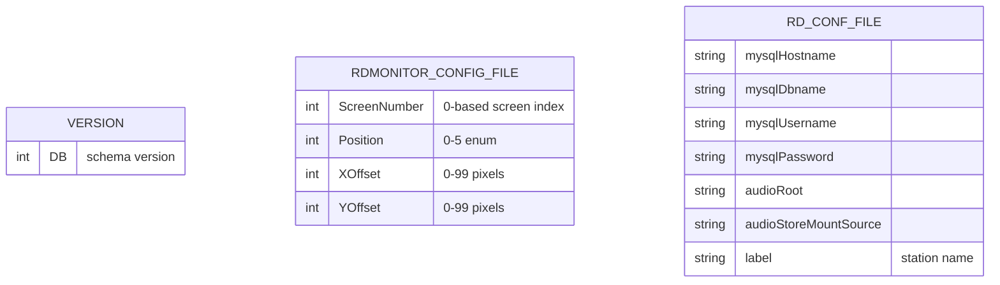
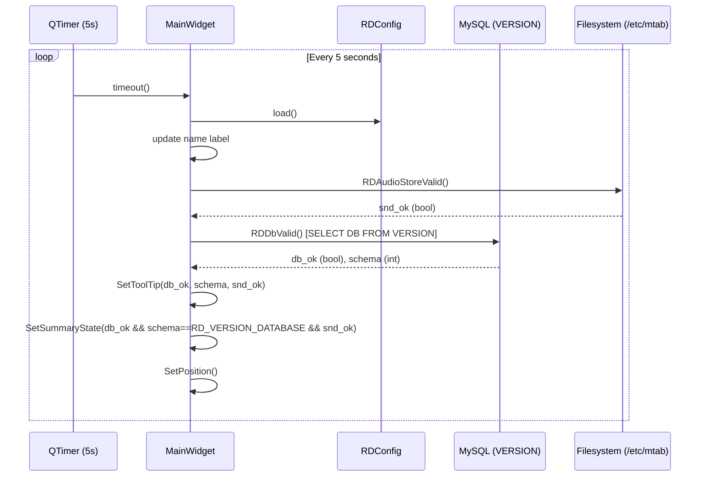
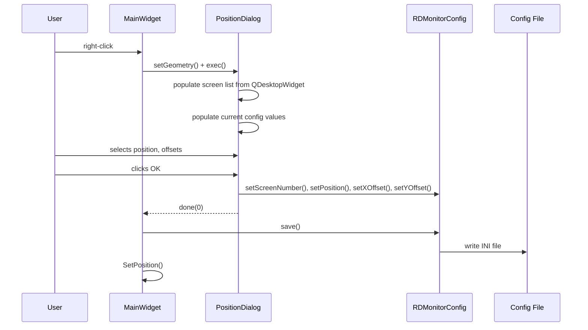
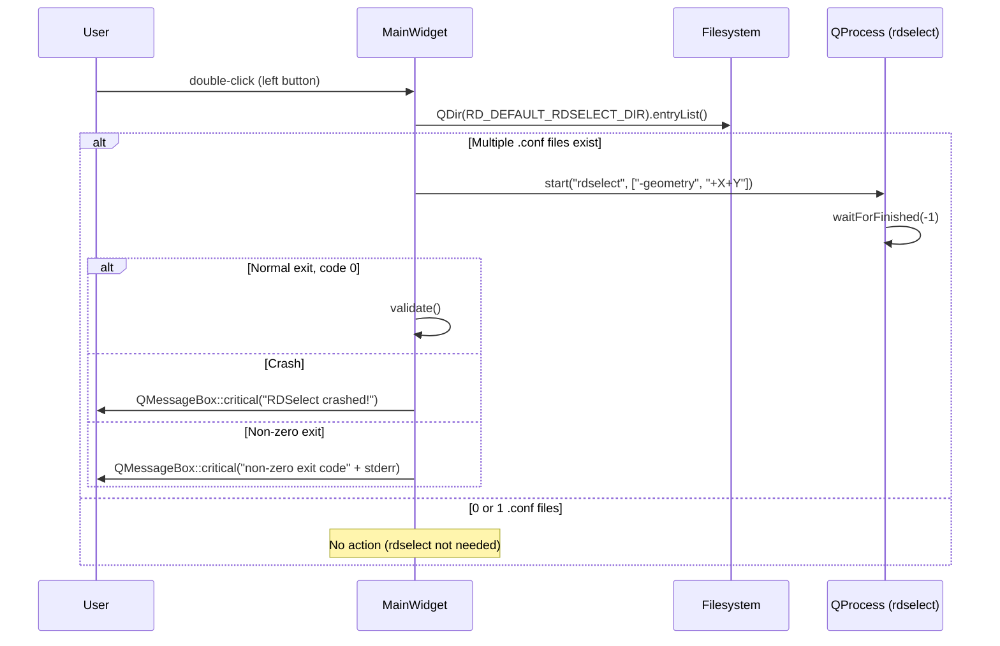
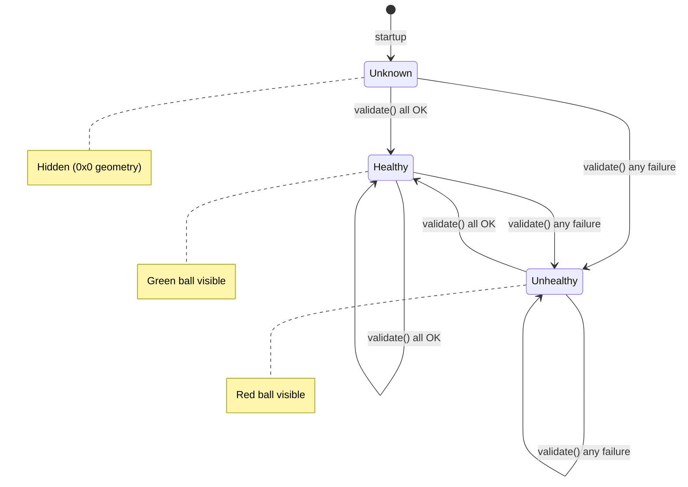

## Files & Symbols

### Source Files
| File | Type | Symbols | LOC (est) |
|------|------|---------|-----------|
| rdmonitor.h | header | MainWidget (class), RDSELECT_WIDTH, RDSELECT_HEIGHT defines | ~55 |
| rdmonitor.cpp | source | MainWidget (ctor, 12 methods), SigHandler (function), main (function) | ~470 |
| positiondialog.h | header | PositionDialog (class) | ~45 |
| positiondialog.cpp | source | PositionDialog (ctor, 6 methods) | ~140 |

### Symbol Index
| Symbol | Kind | File | Qt Class? |
|--------|------|------|-----------|
| MainWidget | Class | rdmonitor.h | Yes (Q_OBJECT), inherits RDWidget |
| PositionDialog | Class | positiondialog.h | Yes (Q_OBJECT), inherits RDDialog |
| SigHandler | Function | rdmonitor.cpp | No |
| main | Function | rdmonitor.cpp | No |

### Constants (from rdmonitor.h and lib/rd.h)
| Constant | Value | Source |
|----------|-------|--------|
| RDMONITOR_HEIGHT | 30 | lib/rd.h |
| RDSELECT_WIDTH | 400 | rdmonitor.h |
| RDSELECT_HEIGHT | 300 | rdmonitor.h |

## Class API Surface

### MainWidget [Application Main Window]
- **File:** rdmonitor.h / rdmonitor.cpp
- **Inherits:** RDWidget
- **Qt Object:** Yes (Q_OBJECT macro)
- **Window Flags:** Qt::WStyle_Customize | Qt::WStyle_NoBorder | Qt::WStyle_StaysOnTop (frameless, always-on-top)

#### Signals
None.

#### Slots
| Slot | Visibility | Parameters | Description |
|------|-----------|-----------|-------------|
| validate() | private | () | Periodic timer-driven validation of DB and audio store health |
| quitMainWidget() | private | () | Exits application with exit(0) |

#### Protected Overrides (Event Handlers)
| Method | Parameters | Description |
|--------|-----------|-------------|
| enterEvent(QEvent*) | e | Shows the status tooltip label when mouse enters the widget |
| leaveEvent(QEvent*) | e | Hides the status tooltip label when mouse leaves the widget |
| mousePressEvent(QMouseEvent*) | e | Right-click opens PositionDialog to configure screen position |
| mouseDoubleClickEvent(QMouseEvent*) | e | Double-click launches rdselect if multiple .conf files exist in RD_DEFAULT_RDSELECT_DIR |
| paintEvent(QPaintEvent*) | e | Draws black border rectangle around widget |
| resizeEvent(QResizeEvent*) | e | Positions mon_name_label and green/red indicator labels |

#### Public Methods
| Method | Return | Parameters | Brief |
|--------|--------|-----------|-------|
| MainWidget() | (ctor) | (RDConfig *c, QWidget *parent=0) | Initializes monitor widget, config, timer, labels |
| sizePolicy() | QSizePolicy | () | Returns size policy for the widget |

#### Private Methods
| Method | Return | Parameters | Brief |
|--------|--------|-----------|-------|
| SetSummaryState(bool) | void | (bool state) | Shows green ball if state==true, red ball if false |
| SetPosition() | void | () | Calculates and sets widget geometry based on RDMonitorConfig position settings (6 positions with offsets) |
| SetToolTip(bool, int, bool) | void | (bool db_status, int schema, bool snd_status) | Sets status label text: "OK", "CONNECTION FAILED", "SCHEMA SKEWED", or "Audio Store: FAILED" |
| SetStatusPosition() | void | () | Positions the floating status label relative to widget based on current position config |

#### Fields
| Field | Type | Description |
|-------|------|-------------|
| mon_name_label | QLabel* | Displays the RDConfig label (station name) |
| mon_green_label | QLabel* | Green ball icon (healthy state) |
| mon_red_label | QLabel* | Red ball icon (unhealthy state) |
| mon_validate_timer | QTimer* | 5-second periodic validation timer |
| mon_metrics | QFontMetrics* | Font metrics for calculating widget width |
| mon_position_dialog | PositionDialog* | Dialog for configuring screen position |
| mon_dialog_x, mon_dialog_y | int | Computed position for the PositionDialog popup |
| mon_rdselect_x, mon_rdselect_y | int | Computed position for launching rdselect |
| mon_status_label | QLabel* | Floating status tooltip label (shown on hover) |
| mon_desktop_widget | QDesktopWidget* | Multi-screen desktop geometry provider |
| mon_config | RDMonitorConfig* | Position/screen configuration (from file) |
| mon_rdconfig | RDConfig* | Rivendell system configuration (rd.conf) |

---

### PositionDialog [Configuration Dialog]
- **File:** positiondialog.h / positiondialog.cpp
- **Inherits:** RDDialog
- **Qt Object:** Yes (Q_OBJECT macro)
- **Window Title:** "RDMonitor"
- **Size:** 240x170 (fixed)

#### Signals
None.

#### Slots
| Slot | Visibility | Parameters | Description |
|------|-----------|-----------|-------------|
| exec() | public | () | Populates screen list and current config, then runs QDialog::exec() |
| okData() | private | () | Saves user selections to RDMonitorConfig and calls done(0) |
| cancelData() | private | () | Calls done(-1), discarding changes |

#### Public Methods
| Method | Return | Parameters | Brief |
|--------|--------|-----------|-------|
| PositionDialog() | (ctor) | (QDesktopWidget*, RDMonitorConfig*, RDConfig*, QWidget* parent=0) | Builds position config dialog UI |
| sizeHint() | QSize | () | Returns QSize(240, 170) |
| sizePolicy() | QSizePolicy | () | Returns size policy |

#### Private Overrides
| Method | Parameters | Description |
|--------|-----------|-------------|
| resizeEvent(QResizeEvent*) | e | Lays out all widgets with absolute positioning |
| closeEvent(QCloseEvent*) | e | Handles dialog close |

#### Fields / Widgets
| Widget | Type | Label/Text | Description |
|--------|------|-----------|-------------|
| pos_screen_number_box | QComboBox | "Screen:" | Screen number selector (populated dynamically from QDesktopWidget) |
| pos_position_box | QComboBox | "Position:" | Position selector (UpperLeft, UpperCenter, UpperRight, LowerLeft, LowerCenter, LowerRight) |
| pos_x_offset_spin | QSpinBox | "X Offset:" | X offset 0-99 pixels |
| pos_y_offset_spin | QSpinBox | "Y Offset:" | Y offset 0-99 pixels |
| pos_ok_button | QPushButton | "OK" | Accepts and saves config |
| pos_cancel_button | QPushButton | "Cancel" | Cancels dialog |
| pos_desktop_widget | QDesktopWidget* | -- | Reference to desktop for enumerating screens |
| pos_config | RDMonitorConfig* | -- | Reference to position configuration object |

---

### RDMonitorConfig [Value Object / Configuration - from LIB]
- **File:** lib/rdmonitor_config.h / lib/rdmonitor_config.cpp
- **Inherits:** (none)
- **Qt Object:** No
- **Category:** Value Object with file persistence

#### Enum: Position
| Value | Int | Description |
|-------|-----|-------------|
| UpperLeft | 0 | Top-left corner of screen |
| UpperCenter | 1 | Top-center of screen |
| UpperRight | 2 | Top-right corner of screen |
| LowerLeft | 3 | Bottom-left corner of screen |
| LowerCenter | 4 | Bottom-center of screen |
| LowerRight | 5 | Bottom-right corner of screen |
| LastPosition | 6 | Sentinel value |

#### Public Methods
| Method | Return | Parameters | Brief |
|--------|--------|-----------|-------|
| screenNumber() | int | () const | Get screen number |
| setScreenNumber(int) | void | (int screen) | Set screen number |
| position() | Position | () const | Get position enum |
| setPosition(Position) | void | (Position pos) | Set position enum |
| xOffset() | int | () const | Get X offset |
| setXOffset(int) | void | (int offset) | Set X offset |
| yOffset() | int | () const | Get Y offset |
| setYOffset(int) | void | (int offset) | Set Y offset |
| load() | bool | () | Load config from INI-style file using RDProfile |
| save() | bool | () | Save config to INI-style file (fprintf) |
| clear() | void | () | Reset to defaults |
| positionText(Position) | QString | (Position pos) static | Get human-readable position name |

#### Config File Format (INI-style)
```ini
[Monitor]
ScreenNumber=0
Position=0
XOffset=0
YOffset=0
```

## Data Model

### Database Access (Indirect via LIB)

RDMonitor does NOT directly access the database. It uses two utility functions from `lib/rdstatus.h`:

#### RDDbValid(RDConfig*, int* schema) -> bool
- Opens a MySQL connection using credentials from RDConfig (rd.conf)
- Executes: `SELECT DB FROM VERSION`
- Returns true if connection succeeds; outputs schema version via pointer
- Connection is opened and closed each call (no persistent connection)

#### RDAudioStoreValid(RDConfig*) -> bool
- Checks `/etc/mtab` to verify the audio store filesystem is mounted
- If `audioStoreMountSource` is empty (local): returns true if no external mount covers RD_AUDIO_ROOT
- If `audioStoreMountSource` is set (remote NFS): returns true if that source is mounted

### Table: VERSION (read-only, from LIB)
| Column | Type | Constraints |
|--------|------|------------|
| DB | int | Schema version number |

- **CRUD by MON:** SELECT only (via RDDbValid)
- **Purpose:** Schema version check against RD_VERSION_DATABASE constant

### Configuration Storage (File-based, not DB)
RDMonitor uses file-based configuration via RDMonitorConfig (INI-style file), not database tables.
The config file path is determined by the RDMonitorConfig constructor (typically `~/.rdmonitor`).

### ERD


## Reactive Architecture

### Signal/Slot Connections
| # | Sender | Signal | Receiver | Slot | File:Line |
|---|--------|--------|----------|------|-----------|
| 1 | mon_validate_timer (QTimer) | timeout() | this (MainWidget) | validate() | rdmonitor.cpp:130 |
| 2 | pos_ok_button (QPushButton) | clicked() | this (PositionDialog) | okData() | positiondialog.cpp:77 |
| 3 | pos_cancel_button (QPushButton) | clicked() | this (PositionDialog) | cancelData() | positiondialog.cpp:84 |

All connections use legacy SIGNAL/SLOT macros.

### Emit Statements
None. RDMonitor does not emit any custom signals.

### Timer-Driven Validation Cycle


### Right-Click Position Configuration


### Double-Click RDSelect Launch


### Cross-Artifact Dependencies
| External Class | From Artifact | Used In Files | Purpose |
|---------------|---------------|---------------|---------|
| RDWidget | LIB | rdmonitor.cpp | Base class for MainWidget |
| RDDialog | LIB | positiondialog.cpp | Base class for PositionDialog |
| RDConfig | LIB | rdmonitor.cpp, positiondialog.cpp | System configuration (rd.conf) |
| RDMonitorConfig | LIB | rdmonitor.cpp, positiondialog.cpp | Position/screen config (INI file) |
| RDCmdSwitch | LIB | rdmonitor.cpp | Command-line argument parsing |
| RDProfile | LIB | (via RDMonitorConfig) | INI file reader |
| RDAudioStoreValid | LIB | rdmonitor.cpp | Audio store mount validation |
| RDDbValid | LIB | rdmonitor.cpp | Database connection + schema validation |
| RD_VERSION_DATABASE | LIB | rdmonitor.cpp | Expected DB schema version constant |
| rdselect | SEL (external process) | rdmonitor.cpp | Launched via QProcess on double-click |

## Business Rules

### Rule 1: Health Summary State
- **Source:** rdmonitor.cpp:179 (validate method)
- **Trigger:** Timer fires every 5 seconds
- **Condition:** `db_ok && (schema == RD_VERSION_DATABASE) && snd_ok`
- **Action:** If ALL three conditions true -> green indicator. If ANY false -> red indicator.
- **Gherkin:**
  ```gherkin
  Scenario: All systems healthy
    Given the database connection succeeds
    And the database schema version matches RD_VERSION_DATABASE
    And the audio store filesystem is mounted
    When the validation timer fires
    Then the monitor shows a green indicator

  Scenario: Any system unhealthy
    Given the database connection fails OR schema version mismatches OR audio store is not mounted
    When the validation timer fires
    Then the monitor shows a red indicator
  ```

### Rule 2: Status Tooltip Text Priority
- **Source:** rdmonitor.cpp:405-429 (SetToolTip)
- **Trigger:** Each validation cycle
- **Condition:** Multiple failure modes checked in priority order
- **Action:**
  1. If all OK: display "Status: OK"
  2. If DB connection fails: display "Database: CONNECTION FAILED"
  3. Else if schema mismatch: display "Database: SCHEMA SKEWED"
  4. If audio store fails: append "Audio Store: FAILED" (can combine with DB errors)
- **Gherkin:**
  ```gherkin
  Scenario: Database connection failure
    Given the database cannot be reached
    When the validation timer fires
    Then the status tooltip shows "Database: CONNECTION FAILED"

  Scenario: Schema version mismatch
    Given the database is reachable
    And the schema version does not match RD_VERSION_DATABASE
    When the validation timer fires
    Then the status tooltip shows "Database: SCHEMA SKEWED"

  Scenario: Audio store failure combined with DB OK
    Given the database is reachable with correct schema
    And the audio store filesystem is not mounted
    When the validation timer fires
    Then the status tooltip shows "Audio Store: FAILED"

  Scenario: Multiple failures
    Given the database connection fails
    And the audio store filesystem is not mounted
    When the validation timer fires
    Then the status tooltip shows "Database: CONNECTION FAILED" followed by "Audio Store: FAILED"
  ```

### Rule 3: Right-Click Opens Position Dialog
- **Source:** rdmonitor.cpp:202-216 (mousePressEvent)
- **Trigger:** Mouse press event on the widget
- **Condition:** `e->button() == Qt::RightButton`
- **Action:** Opens PositionDialog at computed position; if accepted (returns 0), saves config and repositions
- **Gherkin:**
  ```gherkin
  Scenario: Right-click opens position dialog
    Given the monitor widget is visible
    When the user right-clicks on it
    Then the position configuration dialog appears

  Scenario: Non-right-click is ignored
    Given the monitor widget is visible
    When the user left-clicks or middle-clicks on it
    Then the click event is ignored (passed to parent)
  ```

### Rule 4: Double-Click Launches RDSelect Conditionally
- **Source:** rdmonitor.cpp:219-254 (mouseDoubleClickEvent)
- **Trigger:** Left-button double-click
- **Condition:** `QDir(RD_DEFAULT_RDSELECT_DIR).entryList().size() > 1` (multiple .conf files)
- **Action:** Launches rdselect process with geometry args; handles crash and non-zero exit with error dialogs; re-validates on success
- **Gherkin:**
  ```gherkin
  Scenario: Double-click with multiple configs launches rdselect
    Given there are more than one .conf files in RD_DEFAULT_RDSELECT_DIR
    When the user double-clicks the monitor widget
    Then rdselect is launched with appropriate geometry
    And the monitor re-validates after rdselect exits successfully

  Scenario: Double-click with single config does nothing
    Given there is only one .conf file in RD_DEFAULT_RDSELECT_DIR
    When the user double-clicks the monitor widget
    Then nothing happens

  Scenario: RDSelect crashes
    Given rdselect is launched
    When rdselect crashes (abnormal exit)
    Then an error dialog shows "RDSelect crashed!"

  Scenario: RDSelect returns error
    Given rdselect is launched
    When rdselect returns a non-zero exit code
    Then an error dialog shows the exit code and stderr output
  ```

### Rule 5: Widget Position Calculation
- **Source:** rdmonitor.cpp:288-402 (SetPosition)
- **Trigger:** On startup, after each validation, after position dialog OK
- **Condition:** Based on RDMonitorConfig position enum (6 positions)
- **Action:**
  - Calculates widget x,y based on screen geometry + position enum + offsets
  - Width = font metrics width of label text + 40px
  - Height = RDMONITOR_HEIGHT (30px constant)
  - Clamps x,y to ensure widget stays within desktop bounds
  - Also computes dialog and rdselect popup positions relative to widget
- **Gherkin:**
  ```gherkin
  Scenario: Widget positioned at configured screen corner
    Given the position config is set to "UpperLeft" with X offset 10 and Y offset 5
    When SetPosition is called
    Then the widget is placed at screen X + 10, screen Y + 5
    And the widget width accommodates the station name label plus 40 pixels

  Scenario: Widget clamped to screen bounds
    Given the computed position would place the widget outside the screen
    When SetPosition is called
    Then the widget is clamped to remain within the desktop geometry
  ```

### Rule 6: Hover Shows/Hides Status
- **Source:** rdmonitor.cpp:188-199 (enterEvent/leaveEvent)
- **Trigger:** Mouse enter/leave the widget area
- **Action:** enterEvent shows mon_status_label (floating tooltip); leaveEvent hides it
- **Gherkin:**
  ```gherkin
  Scenario: Mouse hover shows status
    Given the monitor widget is visible
    When the mouse enters the widget area
    Then the floating status label becomes visible

  Scenario: Mouse leave hides status
    Given the status label is visible
    When the mouse leaves the widget area
    Then the floating status label is hidden
  ```

### Rule 7: Signal Handler for Clean Shutdown
- **Source:** rdmonitor.cpp:41-49 (SigHandler)
- **Trigger:** SIGTERM or SIGINT
- **Action:** Calls exit(0) for clean termination
- **Gherkin:**
  ```gherkin
  Scenario: Clean shutdown on SIGTERM
    Given rdmonitor is running
    When a SIGTERM signal is received
    Then the application exits cleanly with code 0
  ```

### State Machine: Monitor Health State


### Configuration Keys (RDMonitorConfig INI file)
| Key | Section | Default | Type | Range | Description |
|-----|---------|---------|------|-------|-------------|
| ScreenNumber | Monitor | 0 | int | 0-N (N = number of screens - 1) | Which display screen to use |
| Position | Monitor | 0 (UpperLeft) | int | 0-5 | Screen corner/edge position |
| XOffset | Monitor | 0 | int | 0-99 | Horizontal offset from corner in pixels |
| YOffset | Monitor | 0 | int | 0-99 | Vertical offset from corner in pixels |

### Error Patterns
| Error | Severity | Condition | Message |
|-------|----------|-----------|---------|
| DB Connection Failed | status (tooltip) | RDDbValid returns false | "Database: CONNECTION FAILED" |
| Schema Skewed | status (tooltip) | schema != RD_VERSION_DATABASE | "Database: SCHEMA SKEWED" |
| Audio Store Failed | status (tooltip) | RDAudioStoreValid returns false | "Audio Store: FAILED" |
| RDSelect Crash | critical (dialog) | QProcess::NormalExit not returned | "RDSelect crashed!" |
| RDSelect Error | critical (dialog) | Exit code != 0 | "RDSelect returned non-zero exit code {N}" + stderr |

## UI Contracts

No .ui files. All UI is programmatic (absolute positioning in constructors and resizeEvent).

### Window: MainWidget (Main Monitor Widget)
- **Type:** RDWidget (inherits QWidget) with custom window flags
- **Title:** None (frameless, no title bar)
- **Window Flags:** WStyle_Customize | WStyle_NoBorder | WStyle_StaysOnTop
- **Size:** Dynamic width (label text width + 40px) x 30px (RDMONITOR_HEIGHT)
- **Layout:** Absolute positioning (no layout manager)
- **Icon:** rivendell_22x22_xpm (embedded XPM)
- **Initial State:** Hidden (geometry 0,0,0,0) until first SetPosition() call

#### Widgets
| Widget | Type | Label/Text | Object Name | Position | Description |
|--------|------|-----------|-------------|----------|-------------|
| mon_name_label | QLabel | {station name from rd.conf} | -- | (10, 5, w-30, h-10) | Station identifier label |
| mon_green_label | QLabel | (greenball_xpm pixmap) | -- | (w-20, 5, 15, 20) | Green health indicator icon |
| mon_red_label | QLabel | (redball_xpm pixmap) | -- | (w-20, 5, 15, 20) | Red health indicator icon |
| mon_status_label | QLabel | "Status: unknown" | -- | Floating (separate top-level) | Hover tooltip, styled with RD_STATUS_BACKGROUND_COLOR |

#### Visual Appearance
- Black 2px border rectangle drawn in paintEvent
- Green ball (top-right) when healthy; red ball when unhealthy (mutually exclusive)
- Station name label fills most of the widget area
- Floating status label appears on hover, positioned relative to widget based on screen position config

#### Data Flow
- **Source:** RDConfig (rd.conf file) for station label; RDDbValid/RDAudioStoreValid for health status
- **Display:** Compact bar with name + colored indicator; floating tooltip on hover with detailed status
- **Edit:** Right-click opens PositionDialog for position configuration
- **Save:** PositionDialog writes to RDMonitorConfig INI file

#### Mouse Interactions
| Event | Button | Action |
|-------|--------|--------|
| Enter | -- | Show floating status label |
| Leave | -- | Hide floating status label |
| Press | Right | Open PositionDialog |
| Press | Other | Ignored (passed to parent) |
| DoubleClick | Left | Launch rdselect (if multiple configs exist) |
| DoubleClick | Other | Ignored |

---

### Window: PositionDialog (Position Configuration Dialog)
- **Type:** RDDialog (inherits QDialog)
- **Title:** "RDMonitor"
- **Size:** 240x170 (fixed, min=max=sizeHint)
- **Layout:** Absolute positioning (resizeEvent)
- **Modal:** Yes (exec() blocks)

#### Widgets
| Widget | Type | Label/Text | Position | Binding | Description |
|--------|------|-----------|----------|---------|-------------|
| pos_screen_number_label | QLabel | "Screen:" | (10,10,65,20) | -- | Label for screen selector |
| pos_screen_number_box | QComboBox | {0, 1, ...N} | (80,10,70,20) | RDMonitorConfig::screenNumber | Dynamic: populated from QDesktopWidget::numScreens() |
| pos_position_label | QLabel | "Position:" | (10,32,65,20) | -- | Label for position selector |
| pos_position_box | QComboBox | {UpperLeft...LowerRight} | (80,32,150,20) | RDMonitorConfig::position | Static: from RDMonitorConfig::positionText() |
| pos_x_offset_label | QLabel | "X Offset:" | (10,54,65,20) | -- | Label for X offset |
| pos_x_offset_spin | QSpinBox | 0-99 | (80,54,40,20) | RDMonitorConfig::xOffset | Pixel offset range |
| pos_y_offset_label | QLabel | "Y Offset:" | (10,76,65,20) | -- | Label for Y offset |
| pos_y_offset_spin | QSpinBox | 0-99 | (80,76,40,20) | RDMonitorConfig::yOffset | Pixel offset range |
| pos_ok_button | QPushButton | "OK" | (w-180, h-60, 80, 50) | clicked->okData() | Save and close |
| pos_cancel_button | QPushButton | "Cancel" | (w-90, h-60, 80, 50) | clicked->cancelData() | Discard and close |

#### Data Flow
- **Source:** RDMonitorConfig (current settings), QDesktopWidget (available screens)
- **Display:** Form with dropdowns and spinboxes showing current config
- **Edit:** User selects screen, position, offsets
- **Save:** okData() writes to RDMonitorConfig object; MainWidget then calls config->save() to persist
