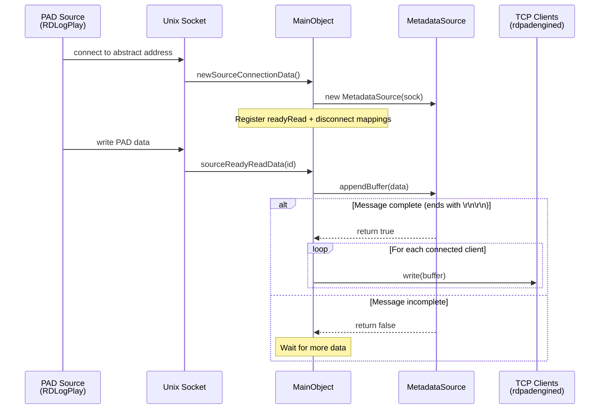
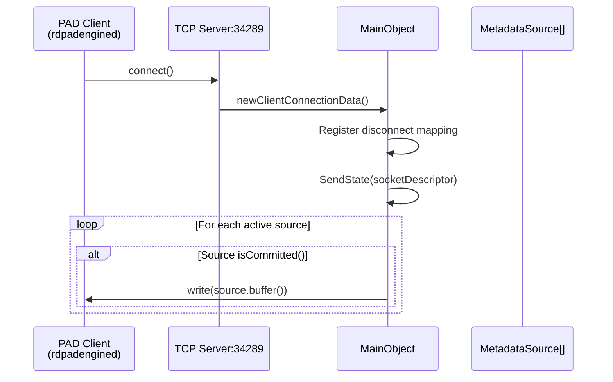
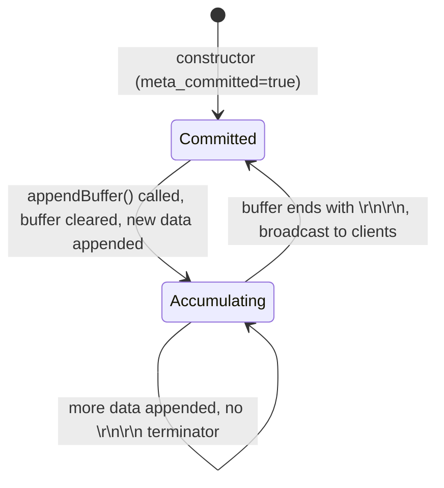

# Semantic Context: PAD (rdpadd)

## Files & Symbols

### Source Files
| File | Type | Symbols | LOC (est) |
|------|------|---------|-----------|
| rdpadd/rdpadd.h | header | MetadataSource, MainObject | ~60 |
| rdpadd/rdpadd.cpp | source | MetadataSource (impl), MainObject (impl), main() | ~190 |

### Symbol Index
| Symbol | Kind | File | Qt Class? |
|--------|------|------|-----------|
| MetadataSource | Class | rdpadd.h | No |
| MainObject | Class | rdpadd.h | Yes (Q_OBJECT) |
| main | Function | rdpadd.cpp | -- |

### Constants Used (from lib/rd.h)
| Constant | Value | Purpose |
|----------|-------|---------|
| RD_PAD_CLIENT_TCP_PORT | 34289 | TCP port for PAD client connections |
| RD_PAD_SOURCE_UNIX_ADDRESS | "m4w8n8fsfddf-473fdueusurt-8954" | Abstract Unix socket for PAD source connections |

### Dependencies (includes)
| Header | From |
|--------|------|
| qmap.h | Qt |
| qobject.h | Qt |
| qsignalmapper.h | Qt |
| qtcpserver.h | Qt |
| qtcpsocket.h | Qt |
| qcoreapplication.h | Qt |
| qhostaddress.h | Qt |
| rdunixserver.h | LIB (librd) |
| rd.h | LIB (librd) |
| rdcmd_switch.h | LIB (librd) |
| stdio.h | C stdlib |
| stdlib.h | C stdlib |

## Class API Surface

### MetadataSource [Value Object / DTO]
- **File:** rdpadd/rdpadd.h
- **Inherits:** (none)
- **Qt Object:** No

This class represents a single metadata source connection. It wraps a QTcpSocket and accumulates incoming data in a buffer until a complete message is received (terminated by `\r\n\r\n`).

#### Signals
(none)

#### Slots
(none)

#### Public Methods
| Method | Return | Parameters | Brief |
|--------|--------|-----------|-------|
| MetadataSource() | -- | (QTcpSocket *sock) | Constructor; stores socket ref, sets committed=true |
| buffer() | QByteArray | () const | Returns the accumulated metadata buffer |
| appendBuffer() | bool | (const QByteArray &data) | Appends data to buffer; returns true when message is complete (ends with `\r\n\r\n`) |
| isCommitted() | bool | () const | Returns true if the current buffer contains a complete message |
| socket() | QTcpSocket* | () const | Returns the underlying TCP socket |

#### Private Fields
| Field | Type | Purpose |
|-------|------|---------|
| meta_buffer | QByteArray | Accumulates incoming metadata bytes |
| meta_committed | bool | True when buffer ends with `\r\n\r\n` (complete message) |
| meta_socket | QTcpSocket* | The underlying socket for this source |

#### Key Implementation Details
- **Message framing:** Messages are delimited by `\r\n\r\n`. When `appendBuffer()` is called, it appends data to `meta_buffer`. If `meta_committed` was true (previous message was complete), it clears the buffer first before appending. It checks if the buffer ends with `\r\n\r\n` and sets `meta_committed` accordingly.
- **Streaming protocol:** The class supports streaming accumulation -- partial data is buffered across multiple reads until the terminator is found.

---

### MainObject [Service / Daemon Controller]
- **File:** rdpadd/rdpadd.h
- **Inherits:** QObject
- **Qt Object:** Yes (Q_OBJECT)

This is the main daemon class for rdpadd. It manages two server interfaces:
1. **Client Server** (TCP on port 34289): Accepts connections from PAD consumer clients (e.g., rdpadengined / PyPAD scripts). When a client connects, it immediately receives the current state of all committed metadata sources.
2. **Source Server** (Unix abstract socket): Accepts connections from PAD data sources (e.g., RDLogPlay in rdairplay). Sources push Now & Next metadata which is then relayed to all connected clients.

#### Signals
(none -- MainObject does not emit any signals)

#### Slots
| Slot | Visibility | Parameters | Description |
|------|-----------|-----------|-------------|
| newClientConnectionData() | private | () | Handles new TCP client connections; registers disconnect mapping and sends current state |
| clientDisconnected() | private | (int id) | Cleans up disconnected client socket by socket descriptor ID |
| newSourceConnectionData() | private | () | Handles new Unix source connections; registers ready-read and disconnect mappings |
| sourceReadyReadData() | private | (int id) | Reads data from source, appends to buffer; when complete, broadcasts to all clients |
| sourceDisconnected() | private | (int id) | Cleans up disconnected source and its MetadataSource object |

#### Private Methods
| Method | Return | Parameters | Brief |
|--------|--------|-----------|-------|
| SendState() | void | (int id) | Sends all currently committed metadata buffers to the client identified by socket descriptor `id` |

#### Private Fields
| Field | Type | Purpose |
|-------|------|---------|
| pad_client_disconnect_mapper | QSignalMapper* | Maps client socket disconnected() signals to clientDisconnected(int) slot |
| pad_client_server | QTcpServer* | TCP server listening on RD_PAD_CLIENT_TCP_PORT (34289) for client connections |
| pad_client_sockets | QMap<int, QTcpSocket*> | Active client connections indexed by socket descriptor |
| pad_source_ready_mapper | QSignalMapper* | Maps source socket readyRead() signals to sourceReadyReadData(int) slot |
| pad_source_disconnect_mapper | QSignalMapper* | Maps source socket disconnected() signals to sourceDisconnected(int) slot |
| pad_source_server | RDUnixServer* | Unix domain server on abstract address RD_PAD_SOURCE_UNIX_ADDRESS for source connections |
| pad_sources | QMap<int, MetadataSource*> | Active source connections indexed by socket descriptor |

#### Key Implementation Details
- **Architecture:** rdpadd is a message broker / relay daemon. Sources (rdairplay's RDLogPlay) push PAD (Program Associated Data) updates via Unix socket. Clients (rdpadengined, PyPAD scripts) connect via TCP and receive those updates.
- **Broadcasting:** When a source sends a complete message (terminated by `\r\n\r\n`), the daemon immediately broadcasts it to ALL connected clients.
- **State replay:** When a new client connects, `SendState()` iterates all active sources and sends their last committed buffer, ensuring the client gets current Now & Next data immediately.
- **Connection management:** Uses QSignalMapper pattern to demultiplex multiple socket signals to slots with socket descriptor IDs.

---

### main() [Entry Point]
- **File:** rdpadd/rdpadd.cpp
- Creates a QCoreApplication (headless, no GUI)
- Instantiates MainObject (which sets up all servers)
- Enters Qt event loop via `a.exec()`

## Data Model

This artifact has NO direct database access. rdpadd is a pure message relay daemon that operates entirely on in-memory socket data. It does not perform any SQL queries, CREATE TABLE operations, or database connections.

Data flows through rdpadd as opaque byte streams (PAD metadata) -- the daemon does not parse or interpret the content beyond detecting the `\r\n\r\n` message terminator.

## Reactive Architecture

### Signal/Slot Connections (all in MainObject constructor)

| # | Sender | Signal | Receiver | Slot | File:Line |
|---|--------|--------|----------|------|-----------|
| 1 | pad_client_disconnect_mapper | mapped(int) | this (MainObject) | clientDisconnected(int) | rdpadd.cpp:81 |
| 2 | pad_client_server | newConnection() | this (MainObject) | newClientConnectionData() | rdpadd.cpp:84 |
| 3 | pad_source_ready_mapper | mapped(int) | this (MainObject) | sourceReadyReadData(int) | rdpadd.cpp:97 |
| 4 | pad_source_disconnect_mapper | mapped(int) | this (MainObject) | sourceDisconnected(int) | rdpadd.cpp:100 |
| 5 | pad_source_server | newConnection() | this (MainObject) | newSourceConnectionData() | rdpadd.cpp:103 |

Dynamic connections (created at runtime per-connection):

| # | Sender | Signal | Receiver | Slot | Created In |
|---|--------|--------|----------|------|------------|
| 6 | client_socket | disconnected() | pad_client_disconnect_mapper | map() | newClientConnectionData() |
| 7 | source_socket | readyRead() | pad_source_ready_mapper | map() | newSourceConnectionData() |
| 8 | source_socket | disconnected() | pad_source_disconnect_mapper | map() | newSourceConnectionData() |

### Key Sequence Diagrams

#### Source Publishes Metadata


#### Client Connects and Receives State


### Cross-Artifact Dependencies

| External Class | From Artifact | Used In Files | Purpose |
|---------------|---------------|---------------|---------|
| RDUnixServer | LIB | rdpadd.h, rdpadd.cpp | Unix domain socket server for PAD source connections |
| RDCmdSwitch | LIB | rdpadd.cpp | Command-line argument parsing |
| rd.h constants | LIB | rdpadd.cpp | RD_PAD_CLIENT_TCP_PORT, RD_PAD_SOURCE_UNIX_ADDRESS |

### Consumers of rdpadd (who connects to it)

| Consumer | Artifact | Connection Type | Purpose |
|----------|----------|----------------|---------|
| RDLogPlay | LIB | Unix socket (source) | Pushes Now & Next metadata from airplay logs |
| rdpadengined | PDD | TCP client (port 34289) | Reads PAD data and forwards to external PAD scripts (PyPAD) |

## Business Rules

### Rule: Client TCP Port Binding Required
- **Source:** rdpadd.cpp:88-91
- **Trigger:** Daemon startup (MainObject constructor)
- **Condition:** `pad_client_server->listen(QHostAddress::Any, RD_PAD_CLIENT_TCP_PORT)` fails
- **Action:** Print error to stderr and exit(1)
- **Gherkin:**
  ```gherkin
  Scenario: Client TCP port binding failure
    Given rdpadd is starting up
    When the TCP server cannot bind to port 34289
    Then the daemon prints "rdpadd: unable to bind client port 34289" to stderr
    And the daemon exits with code 1
  ```

### Rule: Source Unix Socket Binding Required
- **Source:** rdpadd.cpp:108-112
- **Trigger:** Daemon startup (MainObject constructor)
- **Condition:** `pad_source_server->listenToAbstract(RD_PAD_SOURCE_UNIX_ADDRESS)` fails
- **Action:** Print error to stderr with socket error string and exit(1)
- **Gherkin:**
  ```gherkin
  Scenario: Source Unix socket binding failure
    Given rdpadd is starting up
    When the Unix server cannot bind to abstract address
    Then the daemon prints "rdpadd: unable to bind source socket [error]" to stderr
    And the daemon exits with code 1
  ```

### Rule: Source Connection Acceptance Required
- **Source:** rdpadd.cpp:146-150
- **Trigger:** New source connection event
- **Condition:** `pad_source_server->nextPendingConnection()` returns NULL
- **Action:** Print UNIX socket error to stderr and exit(1)
- **Gherkin:**
  ```gherkin
  Scenario: Source connection acceptance failure
    Given rdpadd is running and a new source connection arrives
    When nextPendingConnection() returns NULL
    Then the daemon prints "rdpadd: UNIX socket error [details]" to stderr
    And the daemon exits with code 1
  ```

### Rule: Message Framing Protocol
- **Source:** rdpadd.cpp:44-55 (MetadataSource::appendBuffer)
- **Trigger:** Data received from a PAD source
- **Condition:** Buffer ends with `\r\n\r\n`
- **Action:** Mark message as committed; clear buffer on next incoming data. When committed, broadcast to all clients.
- **Gherkin:**
  ```gherkin
  Scenario: Complete PAD message received from source
    Given a PAD source is connected and sending data
    When the accumulated buffer ends with "\r\n\r\n"
    Then the message is marked as committed
    And the complete buffer is broadcast to all connected clients
    And the buffer is cleared when the next data arrives

  Scenario: Partial PAD message received from source
    Given a PAD source is connected and sending data
    When the accumulated buffer does NOT end with "\r\n\r\n"
    Then the message is NOT broadcast
    And subsequent data is appended to the existing buffer
  ```

### Rule: New Client Receives Current State
- **Source:** rdpadd.cpp:189-197 (MainObject::SendState)
- **Trigger:** New client TCP connection accepted
- **Condition:** Any active source has `isCommitted() == true`
- **Action:** Send the committed buffer from each committed source to the new client
- **Gherkin:**
  ```gherkin
  Scenario: New client receives current PAD state
    Given rdpadd has active sources with committed metadata
    When a new client connects via TCP port 34289
    Then the client immediately receives the last committed buffer from each active source
  ```

### Error Patterns
| Error | Severity | Condition | Message |
|-------|----------|-----------|---------|
| ClientPortBind | fatal (exit 1) | TCP listen fails on port 34289 | "rdpadd: unable to bind client port %d" |
| SourceSocketBind | fatal (exit 1) | Unix abstract socket bind fails | "rdpadd: unable to bind source socket [%s]" |
| SourceAcceptFail | fatal (exit 1) | nextPendingConnection() returns NULL | "rdpadd: UNIX socket error [%s]" |
| UnknownClientDisconnect | warning (stderr) | Socket descriptor not in pad_client_sockets map | "unknown client connection %d attempted to close" |
| UnknownSourceDisconnect | warning (stderr) | Socket descriptor not in pad_sources map | "unknown source connection %d attempted to close" |

### Configuration Keys
(none -- rdpadd uses no QSettings or configuration files; all parameters are compile-time constants)

### State Machines
rdpadd has no formal state machine. The daemon operates in a simple event-driven model:
- Listen for connections (source + client)
- Relay data from sources to clients
- Clean up on disconnection

The MetadataSource buffer has a simple two-state cycle:



## UI Contracts

N/A -- rdpadd is a headless daemon (QCoreApplication). It has no graphical user interface, no .ui files, no QML, and no programmatic widget creation.
