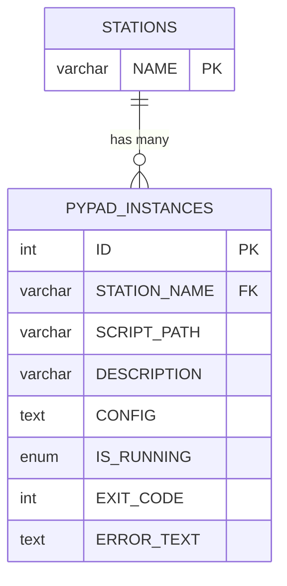
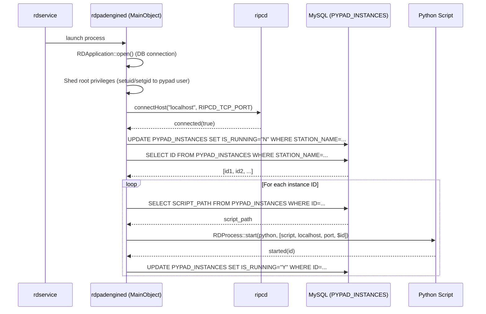
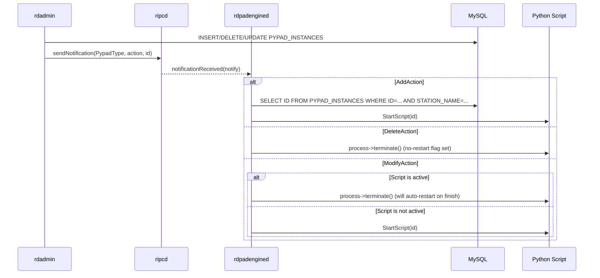
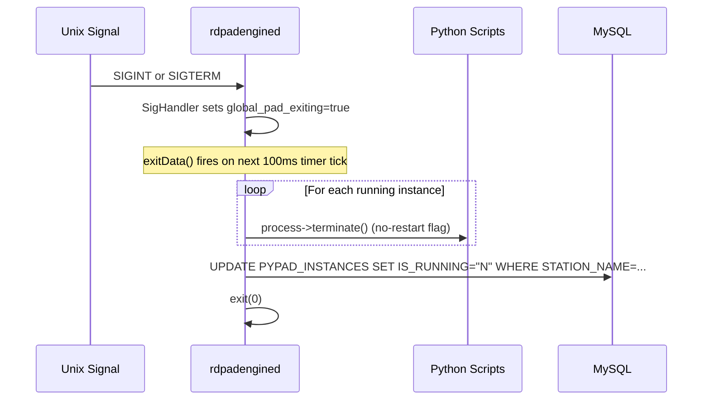
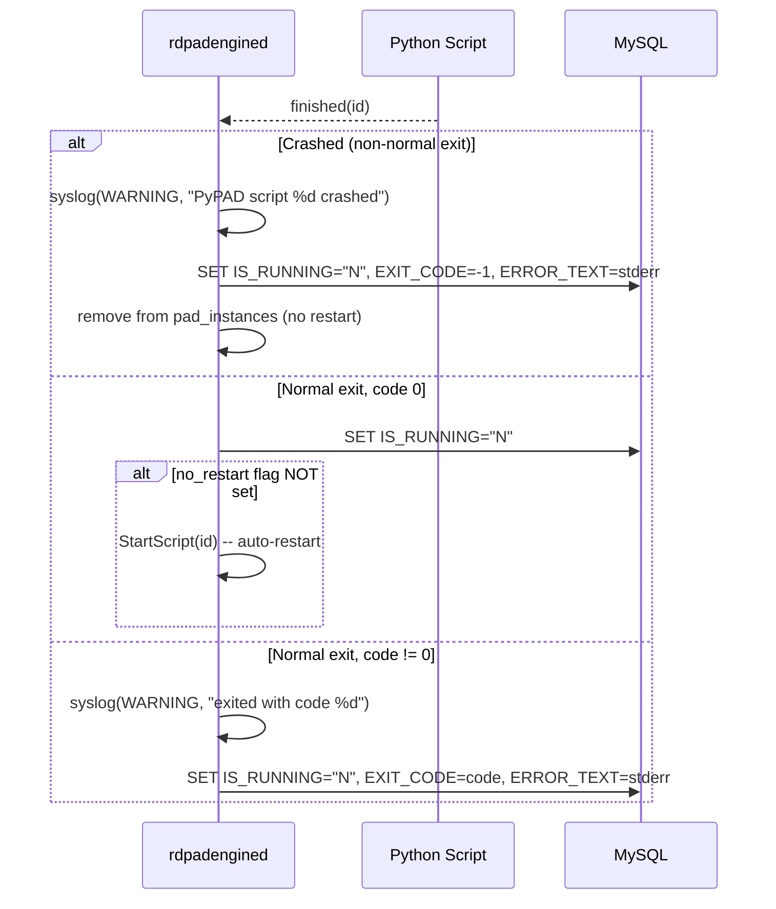
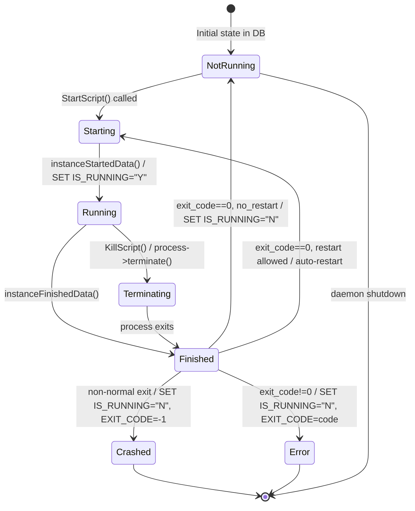

# Semantic Context: PDD (rdpadengined)

> PyPAD Engine Daemon -- manages lifecycle of PyPAD (Program Associated Data) script instances.
> Headless daemon (no UI). Launched by rdservice. Communicates with ripcd for notifications.

## A. Files & Symbols

### Source Files

| File | Type | Symbols | LOC (est) |
|------|------|---------|-----------|
| rdpadengined/rdpadengined.h | header | MainObject (class, 8 methods, 2 fields) | ~35 |
| rdpadengined/rdpadengined.cpp | source | MainObject (constructor + 8 methods), SigHandler, main, global_pad_exiting | ~280 |
| rdpadengined/Makefile.am | build | (autotools build definition) | ~20 |

### Symbol Index

| Symbol | Kind | File | Qt Class? |
|--------|------|------|-----------|
| MainObject | Class | rdpadengined.h | Yes (Q_OBJECT) |
| SigHandler | Function | rdpadengined.cpp | No |
| main | Function | rdpadengined.cpp | No |
| global_pad_exiting | Variable | rdpadengined.cpp | No |

### Dependencies (includes)

**rdpadengined.h:**
- `<qmap.h>`, `<qobject.h>`, `<qprocess.h>`, `<qtimer.h>` (Qt)
- `<rdnotification.h>`, `<rdprocess.h>` (LIB)

**rdpadengined.cpp:**
- `<errno.h>`, `<signal.h>`, `<stdio.h>`, `<syslog.h>` (system)
- `<qcoreapplication.h>`, `<qstringlist.h>` (Qt)
- `<rdapplication.h>`, `<rdconf.h>`, `<rdescape_string.h>`, `<rdpaths.h>` (LIB)
- `"rdpadengined.h"` (local)

## B. Class API Surface

### MainObject [Service / Process Manager]

- **File:** rdpadengined/rdpadengined.h
- **Inherits:** QObject
- **Qt Object:** Yes (Q_OBJECT macro)
- **Purpose:** Manages the lifecycle of PyPAD script instances for the local station. Starts/stops/restarts Python PAD scripts, tracks their running status in the database, and responds to RIPCD notifications for add/delete/modify operations.

#### Signals

(none -- this class has no signals)

#### Slots

| Slot | Visibility | Parameters | Description |
|------|-----------|-----------|-------------|
| ripcConnectedData | private | (bool state) | Called when RIPCD connection is established. Resets all PYPAD_INSTANCES IS_RUNNING to "N" for this station, then starts all scripts. |
| notificationReceivedData | private | (RDNotification *notify) | Handles PypadType notifications: AddAction starts a script, DeleteAction kills it (no restart), ModifyAction toggles (kill if active, start if inactive). |
| instanceStartedData | private | (int id) | Called when an RDProcess starts. Updates DB run status to running. |
| instanceFinishedData | private | (int id) | Called when an RDProcess finishes. Handles crash (logs warning, sets error), normal exit code 0 (auto-restart unless no_restart flag set), non-zero exit (logs warning, sets error). |
| exitData | private | () | Polled every 100ms via pad_exit_timer. When global_pad_exiting is true, terminates all instances (with no-restart flag) and updates DB, then calls exit(0). |

#### Public Methods

| Method | Return | Parameters | Brief |
|--------|--------|-----------|-------|
| MainObject (constructor) | -- | (QObject *parent=0) | Opens RDApplication, sheds root privileges (setuid/setgid to pypad user), connects to RIPCD, starts exit timer, installs signal handlers. |

#### Private Methods

| Method | Return | Parameters | Brief |
|--------|--------|-----------|-------|
| ScriptIsActive | bool | (unsigned id) const | Returns true if the process for the given ID exists and is not in NotRunning state. |
| StartScript | void | (unsigned id) | Queries PYPAD_INSTANCES for SCRIPT_PATH, creates RDProcess, connects started/finished signals, launches Python with args: [script_path, "localhost", RD_PAD_CLIENT_TCP_PORT, "$id"]. |
| KillScript | void | (unsigned id) | Sends terminate() to the QProcess for the given instance ID. |
| SetRunStatus | void | (unsigned id, bool state, int exit_code=0, const QString &err_text=QString()) const | Updates PYPAD_INSTANCES row: IS_RUNNING, EXIT_CODE, ERROR_TEXT fields. |

#### Fields

| Field | Type | Description |
|-------|------|-------------|
| pad_instances | QMap<unsigned, RDProcess *> | Map of instance ID to RDProcess objects for currently managed scripts. |
| pad_exit_timer | QTimer * | 100ms timer that checks global_pad_exiting flag for graceful shutdown. |

#### Standalone Functions

| Function | Return | Parameters | Brief |
|----------|--------|-----------|-------|
| SigHandler | void | (int signo) | Unix signal handler for SIGINT/SIGTERM. Sets global_pad_exiting=true. |
| main | int | (int argc, char *argv[]) | Creates QCoreApplication, instantiates MainObject, enters event loop. |

#### Global Variables

| Variable | Type | Description |
|----------|------|-------------|
| global_pad_exiting | bool | Flag set by SigHandler to initiate graceful shutdown. Polled by exitData(). |

#### Key Constants Used

| Constant | Value | Source | Description |
|----------|-------|--------|-------------|
| RD_PAD_CLIENT_TCP_PORT | 34289 | lib/rd.h | TCP port for PAD client connections |
| RD_PYPAD_PYTHON_PATH | (configured at build) | lib/rdpaths.h.in | Path to Python interpreter for PyPAD scripts |
| RDPADENGINED_USAGE | "\n\n" | rdpadengined.h | Usage string (empty -- no CLI options) |

## C. Data Model

### Table: PYPAD_INSTANCES

**Created in:** utils/rddbmgr/updateschema.cpp (schema version 303, extended in 304)

| Column | Type | Constraints | Description |
|--------|------|------------|-------------|
| ID | int | PRIMARY KEY AUTO_INCREMENT | Unique instance identifier |
| STATION_NAME | varchar(64) | NOT NULL, INDEX | Station this instance belongs to |
| SCRIPT_PATH | varchar(191) | NOT NULL | Filesystem path to the PyPAD Python script |
| DESCRIPTION | varchar(191) | DEFAULT '[new]' | Human-readable description |
| CONFIG | text | NOT NULL | Configuration data for the script (JSON/text) |
| IS_RUNNING | enum('N','Y') | NOT NULL DEFAULT 'N' | Whether the script is currently running (added schema 304) |
| EXIT_CODE | int | NOT NULL DEFAULT 0 | Last exit code of the script process (added schema 304) |
| ERROR_TEXT | text | (nullable) | Stderr output or error message from last run (added schema 304) |

- **Primary Key:** ID
- **Indexes:** STATION_NAME_IDX(STATION_NAME)
- **Foreign Keys:** STATION_NAME references STATIONS.NAME (implicit, no FK constraint)

#### CRUD Operations by Class/File

| Operation | Class/File | SQL Pattern | Details |
|-----------|-----------|-------------|---------|
| SELECT | MainObject (rdpadengined.cpp) | `select ID from PYPAD_INSTANCES where STATION_NAME=...` | ripcConnectedData: get all instance IDs for this station |
| SELECT | MainObject (rdpadengined.cpp) | `select ID from PYPAD_INSTANCES where ID=... && STATION_NAME=...` | notificationReceivedData/AddAction: verify instance belongs to this station |
| SELECT | MainObject (rdpadengined.cpp) | `select SCRIPT_PATH from PYPAD_INSTANCES where ID=... && STATION_NAME=...` | StartScript: get script path to launch |
| UPDATE | MainObject (rdpadengined.cpp) | `update PYPAD_INSTANCES set IS_RUNNING=..., EXIT_CODE=..., ERROR_TEXT=... where ID=...` | SetRunStatus: update running state and error info |
| UPDATE | MainObject (rdpadengined.cpp) | `update PYPAD_INSTANCES set IS_RUNNING="N", EXIT_CODE=0, ERROR_TEXT=null where STATION_NAME=...` | ripcConnectedData: reset all to not-running on connect |
| UPDATE | MainObject (rdpadengined.cpp) | `update PYPAD_INSTANCES set IS_RUNNING="N" where STATION_NAME=...` | exitData: mark all as not-running on shutdown |
| INSERT | ListPypads (rdadmin/list_pypads.cpp) | `insert into PYPAD_INSTANCES set STATION_NAME=..., SCRIPT_PATH=..., ...` | Admin UI: create new instance |
| DELETE | ListPypads (rdadmin/list_pypads.cpp) | `delete from PYPAD_INSTANCES where ID=...` | Admin UI: remove instance |
| UPDATE | EditPypad (rdadmin/edit_pypad.cpp) | `update PYPAD_INSTANCES set DESCRIPTION=..., CONFIG=... where ID=...` | Admin UI: edit instance config |
| SELECT | ViewPypadErrors (rdadmin/view_pypad_errors.cpp) | `select ERROR_TEXT from PYPAD_INSTANCES where ID=...` | Admin UI: view error output |
| INSERT | RDStation (lib/rdstation.cpp) | Clone instances when cloning a station | Station cloning |
| DELETE | RDStation (lib/rdstation.cpp) | `delete from PYPAD_INSTANCES where STATION_NAME=...` | Station removal |

### ERD



## D. Reactive Architecture

### Signal/Slot Connections

All connections are established using the legacy SIGNAL/SLOT macro style.

| # | Sender | Signal | Receiver | Slot | File:Line | Context |
|---|--------|--------|----------|------|-----------|---------|
| 1 | rda->ripc() | connected(bool) | this (MainObject) | ripcConnectedData(bool) | rdpadengined.cpp:98 | Constructor: RIPCD connection state |
| 2 | rda->ripc() | notificationReceived(RDNotification*) | this (MainObject) | notificationReceivedData(RDNotification*) | rdpadengined.cpp:100 | Constructor: RIPCD notification dispatch |
| 3 | pad_exit_timer | timeout() | this (MainObject) | exitData() | rdpadengined.cpp:107 | Constructor: 100ms poll for shutdown flag |
| 4 | proc (RDProcess) | started(int) | this (MainObject) | instanceStartedData(int) | rdpadengined.cpp:267 | StartScript: per-instance process started |
| 5 | proc (RDProcess) | finished(int) | this (MainObject) | instanceFinishedData(int) | rdpadengined.cpp:268 | StartScript: per-instance process finished |

### Key Sequence Diagrams

#### Startup Sequence



#### Notification Handling (Add/Delete/Modify)



#### Graceful Shutdown



#### Script Crash/Restart Cycle



### Cross-Artifact Dependencies

| External Class | From Artifact | Used By PDD | Purpose |
|---------------|---------------|-------------|---------|
| RDApplication | LIB | MainObject constructor | Application bootstrap, DB, config, syslog, RIPCD access |
| RDNotification | LIB | notificationReceivedData | Notification type/action dispatch (PypadType) |
| RDProcess | LIB | StartScript, instanceStartedData, instanceFinishedData, KillScript | Managed child process wrapper with signals |
| RDSqlQuery | LIB | Multiple methods | Database query execution |
| RDEscapeString | LIB | Multiple SQL queries | SQL string escaping |
| RDYesNo | LIB | SetRunStatus | Bool-to-"Y"/"N" conversion |
| RDConfig (via rda->config()) | LIB | Constructor | pypadUid(), pypadGid() for privilege dropping |
| RDStation (via rda->station()) | LIB | Multiple SQL queries | station()->name() for STATION_NAME filter |
| RDRipc (via rda->ripc()) | LIB | Constructor | RIPCD connection and notification signals |

### Managed By (upstream)

| Manager | Artifact | How |
|---------|----------|-----|
| rdservice (SVC) | SVC | Launches rdpadengined as a managed child process. TargetRdpadengined in startup sequence. |
| rdadmin (ADM) | ADM | Manages PYPAD_INSTANCES records via ListPypads/EditPypad UI. Sends RDNotification to trigger rdpadengined actions. |

## E. Business Rules & Logic

### Rule 1: Privilege Dropping on Startup

- **Source:** rdpadengined.cpp:67-78
- **Trigger:** Process starts as root (getuid()==0)
- **Condition:** Running as root user
- **Action:** Drop to pypad user via setgid(config->pypadGid()) then setuid(config->pypadUid()). Exit with code 1 if either fails.
- **Gherkin:**
  ```gherkin
  Scenario: Privilege dropping on startup
    Given rdpadengined is started as root
    When the process initializes
    Then it drops privileges to the configured pypad UID/GID
    And if setuid or setgid fails, it logs an error and exits with code 1
  ```

### Rule 2: Database Reset on RIPCD Connect

- **Source:** rdpadengined.cpp:121-127
- **Trigger:** RIPCD connection established (ripcConnectedData)
- **Condition:** Always on connect
- **Action:** Reset all PYPAD_INSTANCES for this station: IS_RUNNING="N", EXIT_CODE=0, ERROR_TEXT=null. Then start all scripts.
- **Gherkin:**
  ```gherkin
  Scenario: Reset instance state on RIPCD connection
    Given rdpadengined connects to RIPCD
    When the connected signal is received
    Then all PYPAD_INSTANCES for this station are reset to not-running
    And all configured scripts are started
  ```

### Rule 3: Notification-Driven Script Management

- **Source:** rdpadengined.cpp:143-181
- **Trigger:** RDNotification with PypadType received
- **Condition:** notify->type() == RDNotification::PypadType
- **Action:** Dispatch by action type:
  - AddAction: Verify instance belongs to this station, then StartScript
  - DeleteAction: Set no-restart flag, KillScript
  - ModifyAction: If active, kill (will auto-restart); if inactive, start
- **Gherkin:**
  ```gherkin
  Scenario: Add a new PyPAD script instance
    Given a PypadType/AddAction notification is received
    When the instance ID belongs to this station
    Then the script is started

  Scenario: Delete a PyPAD script instance
    Given a PypadType/DeleteAction notification is received
    When the script is running
    Then the no-restart flag is set and the script is terminated

  Scenario: Modify a PyPAD script instance (active)
    Given a PypadType/ModifyAction notification is received
    When the script is currently active
    Then the script is terminated (auto-restart will occur on normal exit)

  Scenario: Modify a PyPAD script instance (inactive)
    Given a PypadType/ModifyAction notification is received
    When the script is not currently active
    Then the script is started
  ```

### Rule 4: Auto-Restart on Clean Exit

- **Source:** rdpadengined.cpp:190-218
- **Trigger:** Script process finishes with exit code 0 and normal exit status
- **Condition:** exitCode==0 AND exitStatus==NormalExit AND no_restart flag NOT set
- **Action:** Automatically restart the script via StartScript(id)
- **Gherkin:**
  ```gherkin
  Scenario: Auto-restart script on clean exit
    Given a PyPAD script exits normally with code 0
    And the no-restart flag is not set
    When the instanceFinishedData handler runs
    Then the script is automatically restarted
  ```

### Rule 5: No Restart on Crash

- **Source:** rdpadengined.cpp:194-200
- **Trigger:** Script process finishes with non-normal exit status (crash)
- **Condition:** exitStatus != QProcess::NormalExit
- **Action:** Log warning, set EXIT_CODE=-1 and ERROR_TEXT=stderr in DB, remove from pad_instances. NO restart.
- **Gherkin:**
  ```gherkin
  Scenario: Script crashes
    Given a PyPAD script crashes (non-normal exit)
    When the instanceFinishedData handler runs
    Then a warning is logged to syslog
    And the database is updated with exit code -1 and stderr output
    And the script is NOT restarted
  ```

### Rule 6: No Restart on Non-Zero Exit During Normal Operation

- **Source:** rdpadengined.cpp:210-217
- **Trigger:** Script exits normally but with non-zero exit code (and not during shutdown)
- **Condition:** exitCode != 0 AND exitStatus == NormalExit AND !global_pad_exiting
- **Action:** Log warning with exit code, update DB with exit code and stderr. Process stays in pad_instances (not cleaned up -- potential resource leak).
- **Gherkin:**
  ```gherkin
  Scenario: Script exits with error code
    Given a PyPAD script exits normally with a non-zero exit code
    And the daemon is not shutting down
    When the instanceFinishedData handler runs
    Then a warning is logged with the exit code
    And the database is updated with the exit code and error text
  ```

### Rule 7: Graceful Shutdown via Unix Signal

- **Source:** rdpadengined.cpp:37-45, 221-242
- **Trigger:** SIGINT or SIGTERM received
- **Condition:** global_pad_exiting becomes true
- **Action:** On next exitData() timer tick (within 100ms): terminate all instances with no-restart flag, update all DB records to IS_RUNNING="N", call exit(0).
- **Gherkin:**
  ```gherkin
  Scenario: Graceful shutdown on SIGTERM
    Given rdpadengined receives SIGTERM
    When the exit timer fires (within 100ms)
    Then all running script instances are terminated with no-restart
    And all database records for this station are set to IS_RUNNING="N"
    And the process exits with code 0
  ```

### Rule 8: Script Launch Arguments

- **Source:** rdpadengined.cpp:269-274
- **Trigger:** StartScript(id) called
- **Condition:** SCRIPT_PATH found in DB for this station
- **Action:** Launch Python with args: [script_path, "localhost", RD_PAD_CLIENT_TCP_PORT (34289), "$id"]. The "$" prefix on ID is used by the script to identify itself.
- **Gherkin:**
  ```gherkin
  Scenario: Launch a PyPAD script
    Given a script path exists in the PYPAD_INSTANCES table
    When StartScript is called for that instance ID
    Then Python is launched with the script path, localhost, port 34289, and "$<id>" as arguments
    And the start is logged to syslog
  ```

### State Machine



### Configuration

This daemon uses no QSettings. All configuration comes from:

| Source | Method | Values |
|--------|--------|--------|
| RDConfig (rd.conf) | rda->config()->pypadUid() | UID to run scripts as |
| RDConfig (rd.conf) | rda->config()->pypadGid() | GID to run scripts as |
| RDConfig (rd.conf) | rda->config()->password() | Password for RIPCD connection |
| Build-time | RD_PYPAD_PYTHON_PATH | Path to Python interpreter |
| Build-time | RD_PAD_CLIENT_TCP_PORT | TCP port 34289 |
| Build-time | RIPCD_TCP_PORT | TCP port for RIPCD |
| Database | PYPAD_INSTANCES table | Script paths, configs, status |

### Error Patterns

| Error | Severity | Condition | Action |
|-------|----------|-----------|--------|
| DB open failure | fatal (stderr) | RDApplication::open() fails | fprintf(stderr, msg), exit(1) |
| setgid failure | fatal (syslog) | setgid() returns non-zero | syslog(LOG_ERR, ...), exit(1) |
| setuid failure | fatal (syslog) | setuid() returns non-zero | syslog(LOG_ERR, ...), exit(1) |
| Unknown command option | fatal (syslog) | Unprocessed cmdSwitch key | syslog(LOG_ERR, ...), exit(2) |
| Script crash | warning (syslog) | exitStatus != NormalExit | syslog(LOG_WARNING, "crashed"), update DB |
| Script non-zero exit | warning (syslog) | exitCode != 0 | syslog(LOG_WARNING, "exited with code %d"), update DB |

## F. UI Contracts

This artifact is a headless daemon (QCoreApplication). It has no UI components, no .ui files, no QML, no widgets, no menus, and no dialogs.

The admin UI for managing PYPAD_INSTANCES is in the ADM artifact (rdadmin/list_pypads.cpp, rdadmin/edit_pypad.cpp, rdadmin/view_pypad_errors.cpp).
